# 让S3存储桶中的文件所有人可以访问

## 生成策略

https://awspolicygen.s3.amazonaws.com/policygen.html

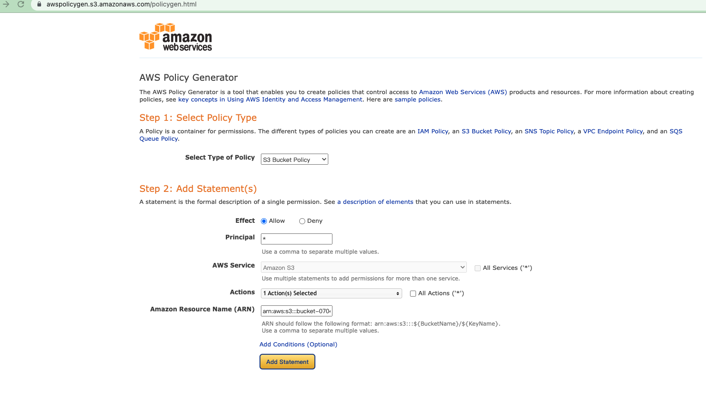

ARN值为下图中的`存储桶ARN`

## 编辑存储桶策略

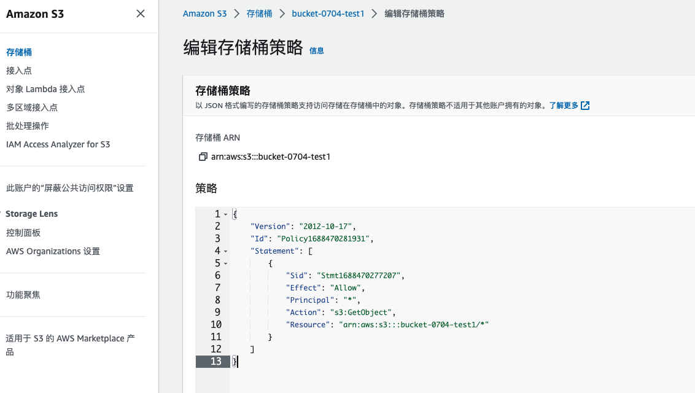

`bucket-0704-test1/*`，代表桶中所有的文件

```json
{
  "Id": "Policy1688695638862",
  "Version": "2012-10-17",
  "Statement": [
    {
      "Sid": "Stmt1688695632792",
      "Action": [
        "s3:GetObject"
      ],
      "Effect": "Allow",
      "Resource": "arn:aws:s3:::bucket-0704-test1/*",
      "Principal": "*"
    }
  ]
}
```

# 跨域设置

```json
[
    {
        "AllowedHeaders": [
            "*"
        ],
        "AllowedMethods": [
            "PUT",
            "POST",
          	"GET",
            "DELETE"
        ],
        "AllowedOrigins": [
            "*"
        ],
        "ExposeHeaders": []
    }
]
```


## 公共访问权限

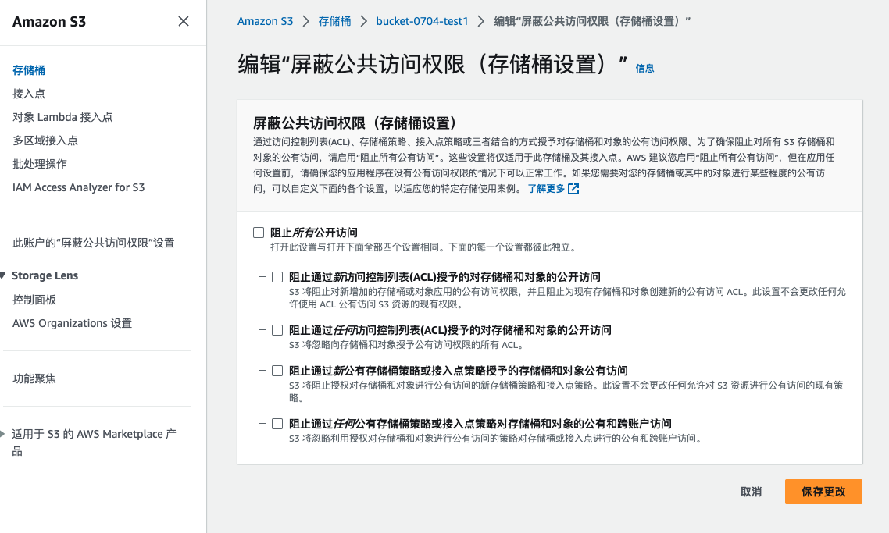


# S3 SDK 文件上传

## 实现

```java
@SpringBootTest
class AwsStudyApplicationTests {

    private static final String ACCESS_KEY_ID = "xxxxxx";
    private static final String SECRET_KEY_ID = "yyyyyyyyyyyyyyy";
    private static final String REGION = "ap-northeast-1";

    private static final String BUCKET_NAME = "bucket-0704-test1";

    private static AmazonS3 s3Client;

    @BeforeAll
    static void setup() {
        BasicAWSCredentials awsCredentials = new BasicAWSCredentials(ACCESS_KEY_ID, SECRET_KEY_ID);
        s3Client = AmazonS3Client.builder().withRegion(REGION).withCredentials(new AWSStaticCredentialsProvider(awsCredentials)).build();
    }

    // 获取所有的存储桶列表
    @Test
    void testListBuckets() {
        List<Bucket> buckets = s3Client.listBuckets();
        for (Bucket bucket : buckets) {
            System.out.println(bucket.getName());
        }
    }

    // 文件上传
    @Test
    void testUpload(){
        s3Client.putObject(BUCKET_NAME, "test.jpg", new File("angle.jpg"));
    }
}
```

## IAM

## 安全凭证

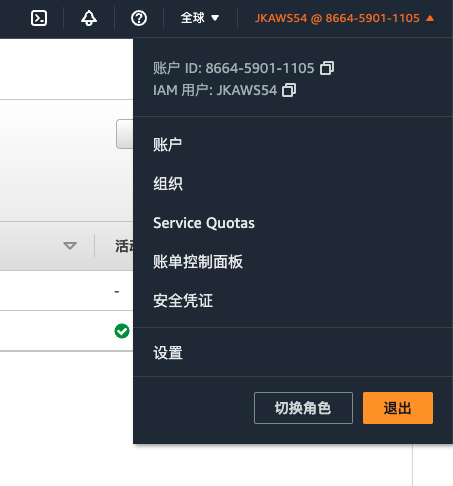

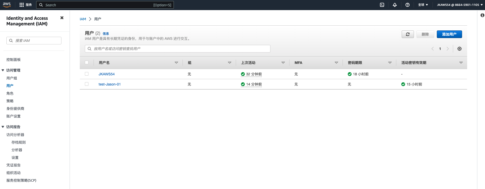

## 添加用户

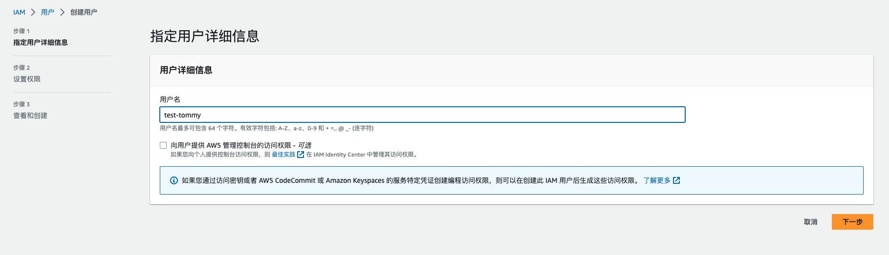

## 添加权限

选中直接附加策略，搜索 AmazonS3FullAccess

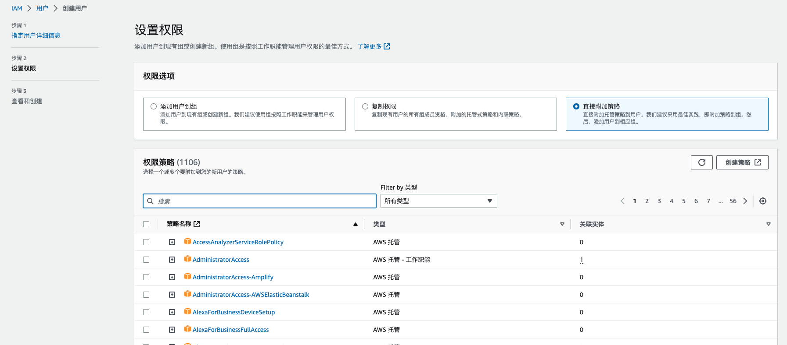

## 访问密钥

创建完成用户之后，在安全凭证中创建访问密钥

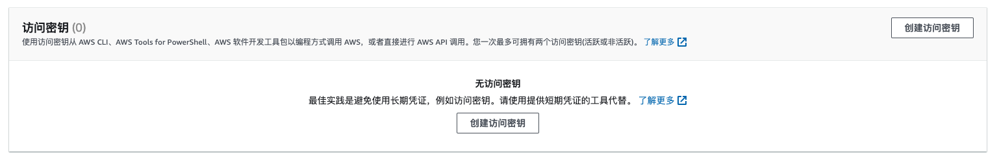

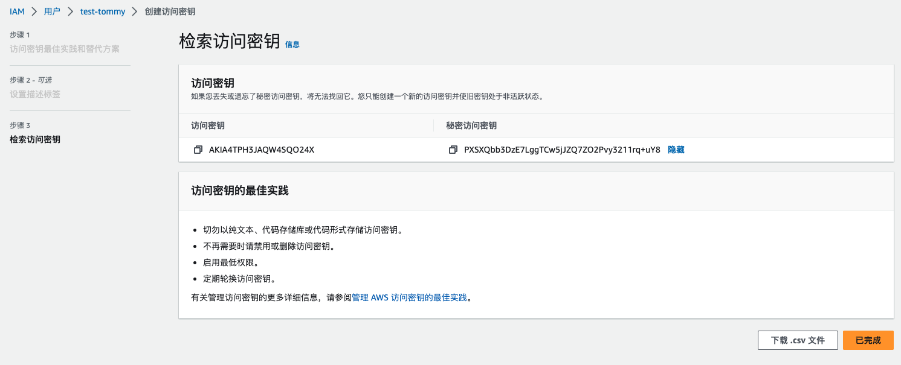


# 同账号桶复制

## IAM 设置

### 创建角色

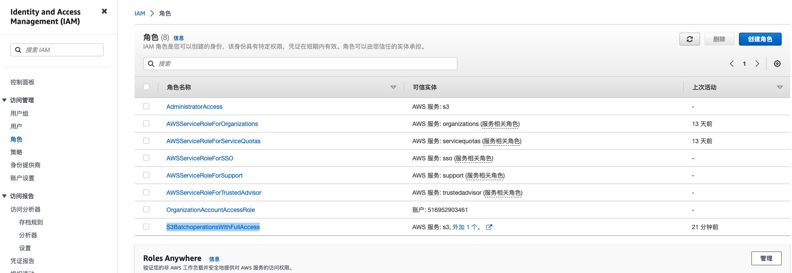


### 添加权限

添加权限就是指定角色能做什么，这里添加两个权限： `AmazonS3FullAccess`  `AWSBatchServiceRole` （或者 `AWSBatchFullAccess`更好）

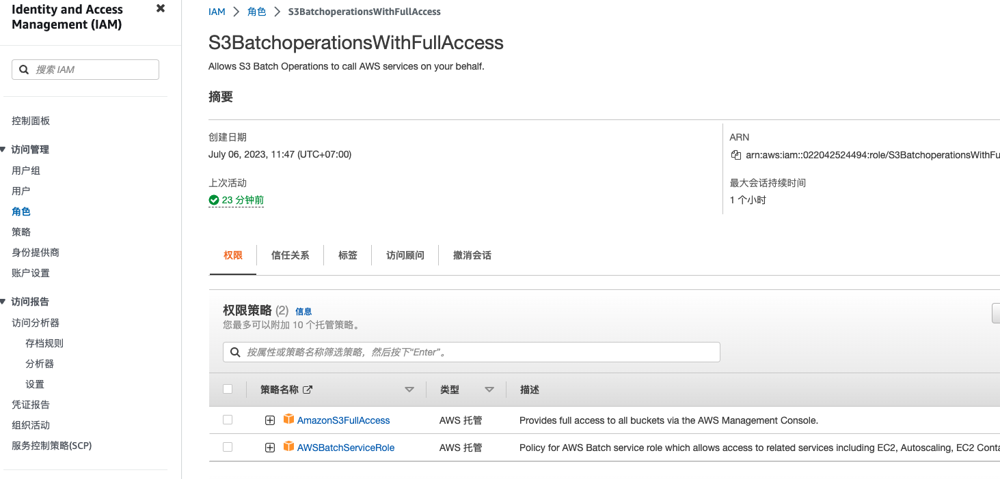


### 信任关系

信任关系是指定哪些服务可以使用当前角色（跟权限一起，双向确认）

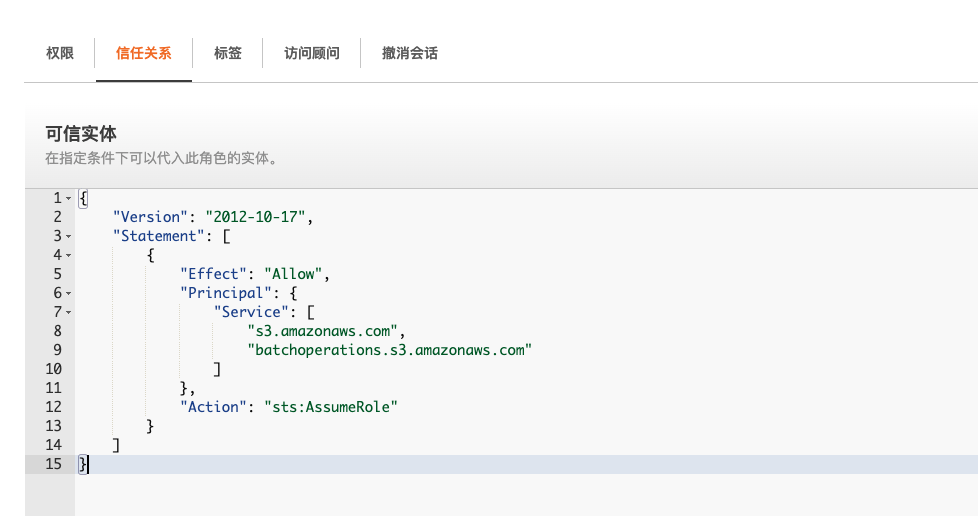

```json
{
    "Version": "2012-10-17",
    "Statement": [
        {
            "Effect": "Allow",
            "Principal": {
                "Service": [
                    "s3.amazonaws.com",
                    "batchoperations.s3.amazonaws.com"
                ]
            },
            "Action": "sts:AssumeRole"
        }
    ]
}
```

## 创建复制规则

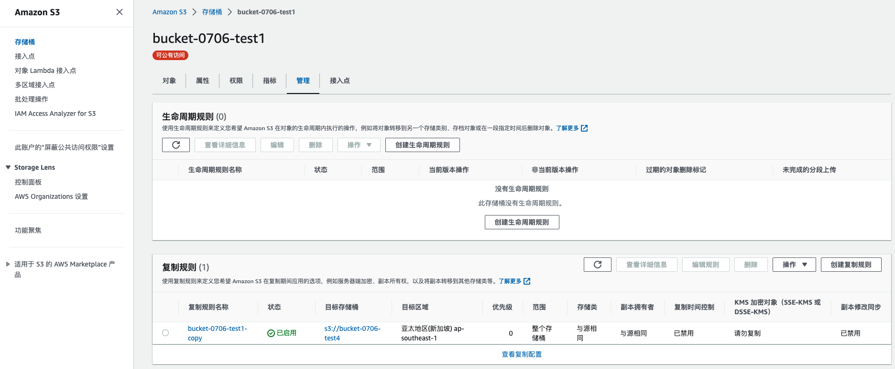

### 选择IAM角色

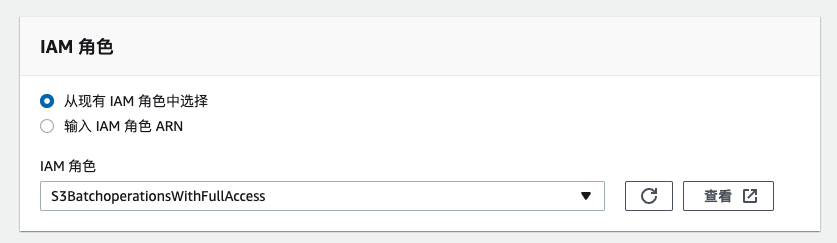

选中`从现有IAM角色中选择`，选择之前创建的角色`S3BatchoperationsWithFullAccess`

# 不同账号桶复制

和同账号桶复制类似，只是需要在控制台中，在`目标`桶上添加桶策略，以允许`源` 桶的拥有者复制对象。

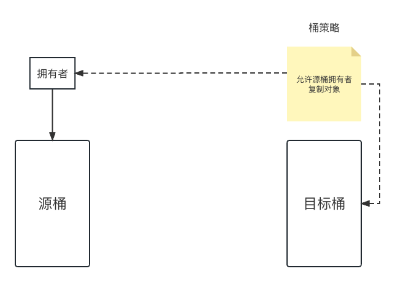

## 源桶账号创建IAM角色

操作配置和前面一样（记得配置信任关系）

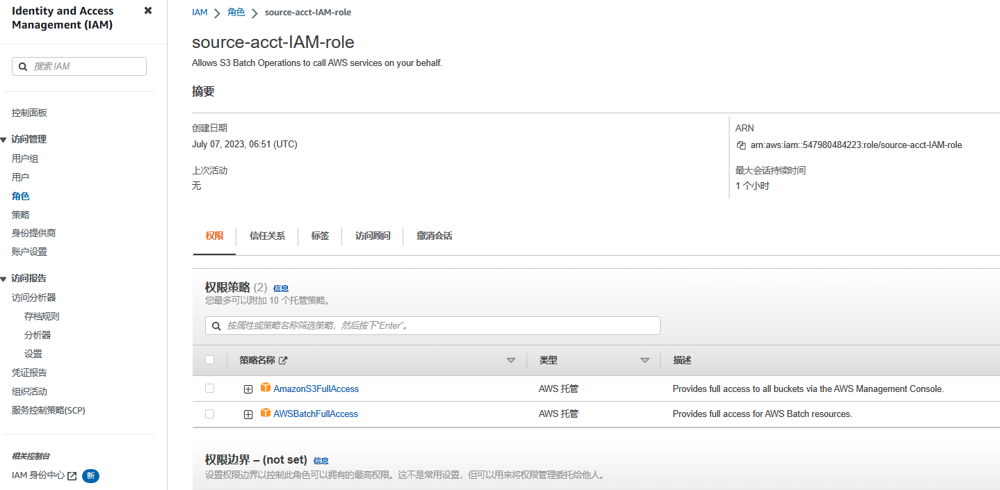


## 目标桶账号配置桶策略

- `arn:aws:iam::547980484223:role/source-acct-IAM-role` 为源桶账号上创建的角色ARN
- `arn:aws:s3:::bucket-0707-dest-test1` 为目标桶ARN

```json
{
    "Version": "2012-10-17",
    "Id": "",
    "Statement": [        
        {
            "Sid": "Set permissions for objects",
            "Effect": "Allow",
            "Principal": {
                "AWS": "arn:aws:iam::547980484223:role/source-acct-IAM-role"
            },
            "Action": [
                "s3:ReplicateObject",
                "s3:ReplicateDelete"
            ],
            "Resource": "arn:aws:s3:::bucket-0707-dest-test1/*"
        },
        {
            "Sid": "Set permissions on bucket",
            "Effect": "Allow",
            "Principal": {
                "AWS": "arn:aws:iam::547980484223:role/source-acct-IAM-role"
            },
            "Action": [
                "s3:List*",
                "s3:GetBucketVersioning",
                "s3:PutBucketVersioning"
            ],
            "Resource": "arn:aws:s3:::bucket-0707-dest-test1"
        }
    ]
}
```

## 源桶创建复制规则

参考同账号桶复制

