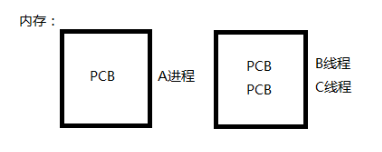
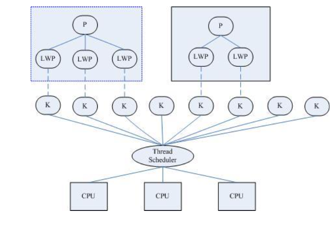
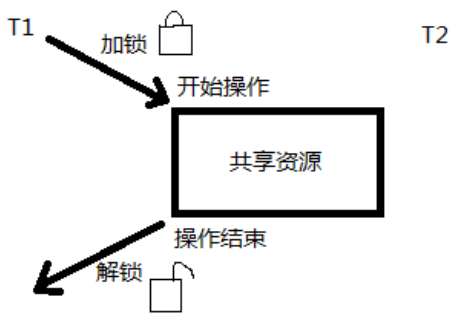

# 线程

## 什么是线程

LWP：light weight process 轻量级的进程，本质仍是进程(在 Linux 环境下) 

进程：独立地址空间，拥有 PCB

线程：有独立的 PCB，但没有独立的地址空间(共享) 

区别：在于是否共享地址空间。 独居(进程)；合租(线程)。

Linux 下：

线程：最小的执行单位 

进程：最小分配资源单位，可看成是只有一个线程的进程。



## Linux 内核线程实现原理

类 Unix 系统中，早期是没有“线程”概念的，80 年代才引入，借助进程机制实现出了线程的概念。因此在这类系统中，进程和线程关系密切。

1. 轻量级进程(light-weight process)，也有 PCB，创建线程使用的底层函数和进程一样，都是 clone
2. 从内核里看进程和线程是一样的，都有各自不同的 PCB，但是 PCB 中指向内存资源的三级页表是相同的 
3. 进程可以蜕变成线程
4. 线程可看做寄存器和栈的集合
5. 在 linux 下，线程最是小的执行单位；进程是最小的分配资源单位

察看 LWP 号:ps –Lf pid 查看指定线程的 lwp 号。

三级映射：进程 PCB --> 页目录(可看成数组，首地址位于 PCB 中) --> 页表 --> 物理页面 --> 内存单元



对于进程来说，相同的地址(同一个虚拟地址)在不同的进程中，反复使用而不冲突。原因是他们虽虚拟地址一样， 但页目录、页表、物理页面各不相同。相同的虚拟址，映射到不同的物理页面内存单元，最终访问不同的物理页面。

但线程不同，两个线程具有各自独立的 PCB，但共享同一个页目录，也就共享同一个页表和物理页面。所以 两个 PCB 共享一个地址间。

实际上，无论是创建进程的 fork，还是创建线程的 pthread_create，底层实现都是调用同一个内核函数 clone。

如果复制对方的地址空间，那么就产出一个“进程”；如果共享对方的地址空间，就产生一个“线程”。

因此：Linux 内核是不区分进程和线程的。只在用户层面上进行区分。所以，线程所有操作函数 pthread_* 是 库函数，而非系统调用。

## 线程共享资源

1.文件描述符表

2.每种信号的处理方式

3.当前工作目录

4.用户 ID 和组 ID

5.内存地址空间 (.text/.data/.bss/heap/共享库)

## 线程非共享资源

1.线程 id 

2.处理器现场和栈指针(内核栈) 

3.独立的栈空间(用户空间栈) 

4.errno 变量

5.信号屏蔽字

6.调度优先级

## 线程优、缺点

优点: 

1. 提高程序并发性
1. 开销小
1. 数据通信、共享数据方便

缺点: 

1. 库函数，不稳定
1. 调试、编写困难、gdb不支持
1. 对信号支持不好

优点相对突出，缺点均不是硬伤。Linux 下由于实现方法导致进程、线程差别不是很大。

## 线程控制原语

### pthread_self 函数

获取线程 ID。其作用对应进程中 getpid() 函数。

`pthread_t pthread_self(void);` 返回值：成功：0； 失败：无

线程 ID：pthread_t 类型，本质:在 Linux 下为无符号整数(%lu)，其他系统中可能是结构体实现

线程 ID 是进程内部，识别标志。(两个进程间，线程 ID 允许相同)

注意：不应使用全局变量 pthread_t tid，在子线程中通过 pthread_create 传出参数来获取线程 ID，而应使用 pthread_self。

### pthread_create 函数

创建一个新线程。 其作用，对应进程中 fork() 函数。

`int pthread_create(pthread_t *thread, const pthread_attr_t *attr, void *(*start_routine) (void *), void *arg); `

返回值：成功：0; 失败：错误号 -----Linux 环境下，所有线程特点，失败均直接返回错误号。

参数:
pthread_t：当前 Linux 中可理解为：typedef unsigned long int pthread_t;

参数 1：传出参数，保存系统为我们分配好的线程 ID

参数 2：通常传 NULL，表示使用线程默认属性。若想使用具体属性也可以修改该参数。 

参数 3：函数指针，指向线程主函数(线程体)，该函数运行结束，则线程结束。

参数 4：线程主函数执行期间所使用的参数。

在一个线程中调用 pthread_create()创建新的线程后，当前线程从 pthread_create()返回继续往下执行，而新的线程所执行的代码由我们传给 pthread_create 的函数指针 start_routine 决定。start_routine 函数接收一个参数，是通过 pthread_create 的 arg 参数传递给它的，该参数的类型为 void *，这个指针按什么类型解释由调用者自己定义。 start_routine 的返回值类型也是 void *，这个指针的含义同样由调用者自己定义。start_routine 返回时，这个线程就 退出了，其它线程可以调用 pthread_join 得到 start_routine 的返回值，类似于父进程调用 wait(2)得到子进程的退出 状态，稍后详细介绍 pthread_join。

pthread_create 成功返回后，新创建的线程的 id 被填写到 thread 参数所指向的内存单元。我们知道进程 id 的类 型是 pid_t，每个进程的 id 在整个系统中是唯一的，调用 getpid(2)可以获得当前进程的 id，是一个正整数值。线程 id 的类型是 thread_t，它只在当前进程中保证是唯一的，在不同的系统中 thread_t 这个类型有不同的实现，它可能是一个整数值，也可能是一个结构体，也可能是一个地址，所以不能简单地当成整数用 printf 打印，调用 pthread_self(3) 可以获得当前线程的 id。

【练习】:创建一个新线程，打印线程 ID。`pthrd_crt.c`

```c
#include <stdio.h>
#include <pthread.h>
#include <unistd.h>

void *tfn(void *arg)
{
	printf("I'm thread, Thread_ID = %lu\n", pthread_self());
	return NULL;
}

int main(void)
{
	pthread_t tid;

	pthread_create(&tid, NULL, tfn, NULL);
	sleep(1);
	printf("I am main, my pid = %d\n", getpid());

	return 0;
}
```

编译：

`gcc pthrd_crt.c -lpthread`

由于 pthread_create 的错误码不保存在 errno 中，因此不能直接用 perror(3)打印错误信息，可以先用 strerror(3) 把错误码转换成错误信息再打印。如果任意一个线程调用了 exit 或_exit，则整个进程的所有线程都终止，由于从 main 函数 return 也相当于调用 exit，为了防止新创建的线程还没有得到执行就终止，我们在 main 函数 return 之前 延时 1 秒，这只是一种权宜之计，即使主线程等待 1 秒，内核也不一定会调度新创建的线程执行，下一节我们会看 到更好的办法。

【练习】:循环创建多个线程，每个线程打印自己是第几个被创建的线程。(类似于进程循环创建子进程) `more_pthrd.c`

```c
#include <pthread.h>
#include <stdio.h>
#include <unistd.h>
#include <stdlib.h>

void *tfn(void *arg)
{
	int i;

	i = (int)arg;
	sleep(i);	 //通过i来区别每个线程
	printf("I'm %dth thread, Thread_ID = %lu\n", i+1, pthread_self());

	return NULL;
}

int main(int argc, char *argv[])
{
	int n = 5, i;
	pthread_t tid;

	if (argc == 2)
		n = atoi(argv[1]);

	for (i = 0; i < n; i++) {
		pthread_create(&tid, NULL, tfn, (void *)i);
		//将i转换为指针，在tfn中再强转回整形。
	}
	sleep(n);
	printf("I am main, and I am not a process, I'm a thread!\n" 
			"main_thread_ID = %lu\n", pthread_self());

	return 0;
}
```

拓展思考：将 pthread_create 函数参 4 修改为(void \*)&i, 将线程主函数内改为 i=*((int *)arg) 是否可以?

### 线程与共享

线程默认共享数据段、代码段等地址空间，常用的是全局变量。而进程不共享全局变量，只能借助 mmap。

【练习】:设计程序，验证线程之间共享全局数据。`glb_var_pthrd.c`

```c
#include <stdio.h>
#include <pthread.h>
#include <stdlib.h>
#include <unistd.h>

int var = 100;

void *tfn(void *arg)
{
	var = 200;
	printf("thread, var = %d\n", var);

	return NULL;
}

int main(void)
{
	printf("At first var = %d\n", var);

	pthread_t tid;
	pthread_create(&tid, NULL, tfn, NULL);
	sleep(1);

	printf("after pthread_create, var = %d\n", var);

	return 0;
}
```

### pthread_exit 函数

将单个线程退出
`void pthread_exit(void *retval); ` 参数：retval 表示线程退出状态，通常传 NULL

`pthrd_exit.c`

```c
#include <pthread.h>
#include <stdio.h>
#include <unistd.h>
#include <stdlib.h>

void *tfn(void *arg)
{
	int i;

	i = (int)arg; //强转。

	if (i == 2)
		pthread_exit(NULL);
	sleep(i);	 //通过i来区别每个线程

	printf("I'm %dth thread, Thread_ID = %lu\n", i+1, pthread_self());

	return NULL;
}

int main(int argc, char *argv[])
{
	int n = 5, i;
	pthread_t tid;

	if (argc == 2)
		n = atoi(argv[1]);

	for (i = 0; i < n; i++) {
		pthread_create(&tid, NULL, tfn, (void *)i); //将i转换为指针，在tfn中再强转回整形。		
	}

	sleep(n);
	printf("I am main, I'm a thread!\n" 
			"main_thread_ID = %lu\n", pthread_self());

	return 0;
}
```

思考：使用 exit 将指定线程退出，可以吗?

结论：线程中，禁止使用 exit 函数，会导致进程内所有线程全部退出。

在不添加 sleep 控制输出顺序的情况下。pthread_create 在循环中，几乎瞬间创建 5 个线程，但只有第 1 个线程 有机会输出(或者第 2 个也有，也可能没有，取决于内核调度)如果第 3 个线程执行了 exit，将整个进程退出了， 所以全部线程退出了。

所以，多线程环境中，应尽量少用，或者不使用 exit 函数，取而代之使用 pthread_exit 函数，将单个线程退出。 任何线程里 exit 导致进程退出，其他线程未工作结束，主控线程退出时不能 return 或 exit。

另注意，pthread_exit 或者 return 返回的指针所指向的内存单元必须是全局的或者是用 malloc 分配的，不能在 线程函数的栈上分配，因为当其它线程得到这个返回指针时线程函数已经退出了。

- return:返回到调用者那里去。 
- pthread_exit():将调用该函数的线程退出
- exit: 将进程退出。

### pthread_join 函数

阻塞等待线程退出，获取线程退出状态 其作用，对应进程中 waitpid() 函数。

`int pthread_join(pthread_t thread, void **retval); ` 成功：0；失败：错误号

参数：thread：线程 ID (【注意】:不是指针)；retval：存储线程结束状态。

对比记忆：

进程中：main 返回值、exit 参数-->int；等待子进程结束 wait 函数参数-->int *

线程中：线程主函数返回值、pthread_exit-->void *；等待线程结束 pthread_join 函数参数-->void **

【练习】：参数 retval 非空用法。`pthrd_exit_join.c`

```c
#include <stdio.h>
#include <unistd.h>
#include <pthread.h>
#include <stdlib.h>

typedef struct {
	int a;
	int b;
} exit_t;

void *tfn(void *arg)
{
	exit_t *ret;
	ret = malloc(sizeof(exit_t)); 

	ret->a = 100;
	ret->b = 300;

	pthread_exit((void *)ret);
}

int main(void)
{
	pthread_t tid;
	exit_t *retval;

	pthread_create(&tid, NULL, tfn, NULL);
	
	pthread_join(tid, (void **)&retval);      //调用pthread_join可以获取线程的退出状态
	printf("a = %d, b = %d \n", retval->a, retval->b);

	return 0;
}
```

调用该函数的线程将挂起等待，直到id为thread的线程终止。thread线程以不同的方法终止，通过pthread_join 得到的终止状态是不同的，总结如下:

1. 如果 thread 线程通过 return 返回，retval 所指向的单元里存放的是 thread 线程函数的返回值。
2. 如果 thread 线程被别的线程调用 pthread_cancel 异常终止掉，retval 所指向的单元里存放的是常数 PTHREAD_CANCELED。
3. 如果 thread 线程是自己调用 pthread_exit 终止的，retval 所指向的单元存放的是传给 pthread_exit 的参数。
4. 如果对 thread 线程的终止状态不感兴趣，可以传 NULL 给 retval 参数。

【练习】:使用 pthread_join 函数将循环创建的多个子线程回收。`pthrd_loop_join.c`

```c
#include <stdio.h>
#include <stdlib.h>
#include <unistd.h>
#include <pthread.h>

int var = 100;

void *tfn(void *arg)
{
    int i;
    i = (int)arg;
    
    sleep(i);
    if (i == 1) {
        var = 333;
        printf("var = %d\n", var);
        return (void *)var;

    } else  if (i == 3) {
        var = 777;
        printf("I'm %dth pthread, pthread_id = %lu\n var = %d\n", i+1, pthread_self(), var);
        pthread_exit((void *)var);

    } else  {
        printf("I'm %dth pthread, pthread_id = %lu\n var = %d\n", i+1, pthread_self(), var);
        pthread_exit((void *)var);
    }

    return NULL;
}

int main(void)
{
    pthread_t tid[5];
    int i;
    int *ret[5];  

    for (i = 0; i < 5; i++)
        pthread_create(&tid[i], NULL, tfn, (void *)i);

    for (i = 0; i < 5; i++) {
        pthread_join(tid[i], (void **)&ret[i]);
        printf("-------%d 's ret = %d\n", i, (int)ret[i]);
    }
        
    printf("I'm main pthread tid = %lu\t var = %d\n", pthread_self(), var);

    sleep(i);
    return 0;
}
```

### pthread_detach 函数

实现线程分离

`int pthread_detach(pthread_t thread); ` 成功：0；失败：错误号

线程分离状态：指定该状态，线程主动与主控线程断开关系。线程结束后，其退出状态不由其他线程获取，而直接自己自动释放。网络、多线程服务器常用。

进程若有该机制，将不会产生僵尸进程。僵尸进程的产生主要由于进程死后，大部分资源被释放，一点残留资 源仍存于系统中，导致内核认为该进程仍存在。

也可使用 pthread_create 函数参 2(线程属性)来设置线程分离。

【练习】:使用 pthread_detach 函数实现线程分离 `pthrd_detach.c`

```c
#include <stdio.h>
#include <stdlib.h>
#include <unistd.h>
#include <string.h>
#include <pthread.h>

void *tfn(void *arg)
{
	int n = 3;

	while (n--) {
		printf("thread count %d\n", n);
		sleep(1);
	}

    pthread_exit((void *)1);
}

int main(void)
{
	pthread_t tid;
	void *tret;
	int err;

#if 1

	pthread_attr_t attr;			/*通过线程属性来设置游离态*/

	pthread_attr_init(&attr);
	pthread_attr_setdetachstate(&attr,	PTHREAD_CREATE_DETACHED);
	pthread_create(&tid, &attr, tfn, NULL);
	pthread_attr_destroy(&attr);

#else

	pthread_create(&tid, NULL, tfn, NULL);
	pthread_detach(tid);         //让线程分离  ----自动退出,无系统残留资源

#endif

	while (1) {
		sleep(1);
		err = pthread_join(tid, &tret);
		if (err != 0)
			fprintf(stderr, "thread_join error: %s\n", strerror(err));
		else
			fprintf(stderr, "thread exit code %d\n", (int)tret);
	}

	return 0;
}
```

一般情况下，线程终止后，其终止状态一直保留到其它线程调用 pthread_join 获取它的状态为止。但是线程也 可以被置为 detach 状态，这样的线程一旦终止就立刻回收它占用的所有资源，而不保留终止状态。

不能对一个已经处于 detach 状态的线程调用 pthread_join，这样的调用将返回 EINVAL 错误。也就是说，如果已 经对一个线程调用了 pthread_detach 就不能再调用 pthread_join 了。

### pthread_cancel 函数

杀死(取消)线程，其作用，对应进程中 kill() 函数。

`int pthread_cancel(pthread_t thread); ` 成功：0；失败：错误号

【注意】:线程的取消并不是实时的，而有一定的延时。需要等待线程到达某个取消点(检查点)。

类似于玩游戏存档，必须到达指定的场所(存档点，如:客栈、仓库、城里等)才能存储进度。杀死线程也不是立刻就能完成，必须要到达取消点。

取消点：是线程检查是否被取消，并按请求进行动作的一个位置。通常是一些系统调用 creat，open，pause， close，read，write..... 执行命令 man 7 pthreads 可以查看具备这些取消点的系统调用列表。也可参阅 APUE.12.7 取消选项小节。

可粗略认为一个系统调用(进入内核)即为一个取消点。如线程中没有取消点，可以通过调用 pthread_testcancel 函数自行设置一个取消点。

被取消的线程， 退出值定义在Linux的pthread库中。常数PTHREAD_CANCELED的值是-1。可在头文件pthread.h 中找到它的定义:#define PTHREAD_CANCELED ((void *) -1)。因此当我们对一个已经被取消的线程使用 pthread_join 回收时，得到的返回值为-1。

【练习】:终止线程的三种方法。注意“取消点”的概念。`pthrd_endof3.c`

```c
#include <stdio.h>
#include <unistd.h>
#include <pthread.h>
#include <stdlib.h>


void *tfn1(void *arg)
{
	printf("thread 1 returning\n");

	return (void *)111;         
}

void *tfn2(void *arg)
{
	printf("thread 2 exiting\n");
	pthread_exit((void *)222);
}

void *tfn3(void *arg)
{    
	while (1) {

//		printf("thread 3: I'm going to die in 3 seconds ...\n");
		//sleep(1);

        pthread_testcancel(); //自己添加取消点*/
	}

    return (void *)666;
}

int main(void)
{
	pthread_t tid;
	void *tret = NULL;

	pthread_create(&tid, NULL, tfn1, NULL);
	pthread_join(tid, &tret);
	printf("thread 1 exit code = %d\n\n", (int)tret);

	pthread_create(&tid, NULL, tfn2, NULL);
	pthread_join(tid, &tret);
	printf("thread 2 exit code = %d\n\n", (int)tret);

	pthread_create(&tid, NULL, tfn3, NULL);
	sleep(3);
    pthread_cancel(tid);
	pthread_join(tid, &tret);
	printf("thread 3 exit code = %d\n", (int)tret);

	return 0;
}
```

### 终止线程方式

总结：终止某个线程而不终止整个进程，有三种方法:

1. 从线程主函数 return。这种方法对主控线程不适用，从 main 函数 return 相当于调用 exit。
2. 一个线程可以调用 pthread_cancel 终止同一进程中的另一个线程。
3. 线程可以调用 pthread_exit 终止自己。

### 控制原语对比

| 进程   | 线程           |
| ------ | -------------- |
| fork   | pthread_create |
| exit   | pthread_exit   |
| wait   | pthread_join   |
| kill   | pthread_cancel |
| getpid | pthread_self   |

## 线程属性

本节作为指引性介绍，linux 下线程的属性是可以根据实际项目需要，进行设置，之前我们讨论的线程都是采用 线程的默认属性，默认属性已经可以解决绝大多数开发时遇到的问题。如我们对程序的性能提出更高的要求那么需 要设置线程属性，比如可以通过设置线程栈的大小来降低内存的使用，增加最大线程个数。

```c
typedef struct
{

 int etachstate; //线程的分离状态

 int schedpolicy; //线程调度策略

 struct sched_param schedparam; //线程的调度参数

 int inheritsched; //线程的继承性

 int cope; //线程的作用域

 size_t guardsize; //线程栈末尾的警戒缓冲区大小

 int stackaddr_set; //线程的栈设置

 size_t stacksize; //线程栈的大小

} pthread_attr_t;
```

主要结构体成员：

  1. 线程分离状态：etachstate

  2. 线程栈大小（默认平均分配）：stacksize

  3. 线程栈警戒缓冲区大小（位于栈末尾）：guardsize

线程的属性值不能直接设置，须使用相关函数进行操作。属性的初始化的函数为pthread_attr_init，这个函数必须在pthread_create函数之前调用。使用完毕之后需调用pthread_attr_destroy函数来释放资源。

线程属性主要包括如下属性：作用域(scope)、栈尺寸(stack size)、栈地址(stack address)、优先级(priority)、 分离的状态(detached state)、调度策略和参数(scheduling policy and parameters)。默认的属性为非绑定、非分离、 缺省的堆栈、与父进程同样级别的优先级。

### 线程属性初始化

注意:应先初始化线程属性，再 pthread_create 创建线程 

初始化线程属性

`int pthread_attr_init(pthread_attr_t *attr); ` 成功：0；失败：错误号 

销毁线程属性所占用的资源

`int pthread_attr_destroy(pthread_attr_t *attr); ` 成功：0；失败：错误号

## 线程的分离状态

线程的分离状态决定一个线程以什么样的方式来终止自己。

非分离状态：线程的默认属性是非分离状态，这种情况下，原有的线程等待创建的线程结束。只有当 pthread_join() 函数返回时，创建的线程才算终止，才能释放自己占用的系统资源。

分离状态：分离线程没有被其他的线程所等待，自己运行结束了，线程也就终止了，马上释放系统资源。应该 根据自己的需要，选择适当的分离状态。

线程分离状态的函数：

设置线程属性，分离 or 非分离

`int pthread_attr_setdetachstate(pthread_attr_t *attr, int detachstate); `

获取程属性，分离 or 非分离

`int pthread_attr_getdetachstate(pthread_attr_t *attr, int *detachstate); `

参数：attr:已初始化的线程属性

detachstate：

PTHREAD_CREATE_DETACHED(分离线程) 

PTHREAD _CREATE_JOINABLE(非分离线程)

这里要注意的一点是，如果设置一个线程为分离线程，而这个线程运行又非常快，它很可能在 pthread_create 函数返回之前就终止了，它终止以后就可能将线程号和系统资源移交给其他的线程使用，这样调用 pthread_create 的线程就得到了错误的线程号。要避免这种情况可以采取一定的同步措施，最简单的方法之一是可以在被创建的线 程里调用 pthread_cond_timedwait 函数，让这个线程等待一会儿，留出足够的时间让函数 pthread_create 返回。设 置一段等待时间，是在多线程编程里常用的方法。但是注意不要使用诸如 wait()之类的函数，它们是使整个进程睡 眠，并不能解决线程同步的问题。

`pthrd_attr_change.c`

```c
#include <stdio.h>
#include <pthread.h>
#include <string.h>
#include <stdlib.h>
#include <unistd.h>

#define SIZE 0x10000

void *th_fun(void *arg)
{
	while (1) 
		sleep(1);
}

int main(void)
{
	pthread_t tid;
	int err, detachstate, i = 1;
	pthread_attr_t attr;
	size_t stacksize;   //typedef  size_t  unsigned int 
	void *stackaddr;

	pthread_attr_init(&attr);		
	pthread_attr_getstack(&attr, &stackaddr, &stacksize);
	pthread_attr_getdetachstate(&attr, &detachstate);

	if (detachstate == PTHREAD_CREATE_DETACHED)   //默认是分离态
		printf("thread detached\n");
	else if (detachstate == PTHREAD_CREATE_JOINABLE) //默认时非分离
		printf("thread join\n");
	else
		printf("thread un known\n");

	/* 设置线程分离属性 */
	pthread_attr_setdetachstate(&attr, PTHREAD_CREATE_DETACHED);

	while (1) {
		/* 在堆上申请内存,指定线程栈的起始地址和大小 */
		stackaddr = malloc(SIZE);
		if (stackaddr == NULL) {
			perror("malloc");
			exit(1);
		}
		stacksize = SIZE;
	 	pthread_attr_setstack(&attr, stackaddr, stacksize);   //借助线程的属性,修改线程栈空间大小

		err = pthread_create(&tid, &attr, th_fun, NULL);
		if (err != 0) {
			printf("%s\n", strerror(err));
			exit(1);
		}
		printf("%d\n", i++);
	}

	pthread_attr_destroy(&attr);

	return 0;
}
```

## 线程使用注意事项

1. 主线程退出其他线程不退出，主线程应调用 pthread_exit
2. 避免僵尸线程
   pthread_join
   pthread_detach
   pthread_create 指定分离属性
   被 join 线程可能在 join 函数返回前就释放完自己的所有内存资源，所以不应当返回被回收线程栈中的值;
3. malloc 和 mmap 申请的内存可以被其他线程释放
4. 应避免在多线程模型中调用 fork 除非，马上 exec，子进程中只有调用 fork 的线程存在，其他线程在子进程中均 pthread_exit
5. 信号的复杂语义很难和多线程共存，应避免在多线程引入信号机制

# 线程同步

## 同步概念

所谓同步，即同时起步，协调一致。不同的对象，对“同步”的理解方式略有不同。如，设备同步，是指在两 个设备之间规定一个共同的时间参考；数据库同步，是指让两个或多个数据库内容保持一致，或者按需要部分保持一致；文件同步，是指让两个或多个文件夹里的文件保持一致。等等

而编程中、通信中所说的同步与生活中大家印象中的同步概念略有差异。“同”字应是指协同、协助、互相配合。**主旨在协同步调，按预定的先后次序运行**。

## 线程同步

同步即协同步调，按预定的先后次序运行。

线程同步，指一个线程发出某一功能调用时，在没有得到结果之前，该调用不返回。同时其它线程为保证数据一致性，不能调用该功能。

举例 1：银行存款 5000。柜台，折：取3000；提款机，卡：取 3000。剩余：2000
举例 2：内存中 100 字节，线程 T1 欲填入全 1， 线程 T2 欲填入全 0。但如果 T1 执行了 50 个字节失去 cpu，T2 执行，会将T1写过的内容覆盖。当T1再次获得cpu继续 从失去cpu的位置向后写入1，当执行结束，内存中的 100 字节，既不是全 1，也不是全 0。

产生的现象叫做“与时间有关的错误”(time related)。为了避免这种数据混乱，线程需要同步。 “同步”的目的，是为了避免数据混乱，解决与时间有关的错误。实际上，不仅线程间需要同步，进程间、信号间等等都需要同步机制。

因此，所有“多个控制流，共同操作一个共享资源”的情况，都需要同步。

## 数据混乱原因

1. 资源共享(独享资源则不会)
2. 调度随机(意味着数据访问会出现竞争)
3. 线程间缺乏必要的同步机制。

以上 3 点中，前两点不能改变，欲提高效率，传递数据，资源必须共享。只要共享资源，就一定会出现竞争。 只要存在竞争关系，数据就很容易出现混乱。
所以只能从第三点着手解决。使多个线程在访问共享资源的时候，出现互斥。

## 互斥量 mutex

Linux 中提供一把互斥锁 mutex(也称之为互斥量)。 每个线程在对资源操作前都尝试先加锁，成功加锁才能操作，操作结束解锁。 资源还是共享的，线程间也还是竞争的， 但通过“锁”就将资源的访问变成互斥操作，而后与时间有关的错误也不会再产生了。



但应注意：同一时刻，只能有一个线程持有该锁。

当 A 线程对某个全局变量加锁访问，B 在访问前尝试加锁，拿不到锁，B 阻塞。C 线程不去加锁，而直接访问 该全局变量，依然能够访问，但会出现数据混乱。所以，互斥锁实质上是操作系统提供的一把“建议锁”(又称“协同锁”)，建议程序中有多线程访问共享资源的时候使用该机制。但并没有强制限定。因此，即使有了 mutex，如果有线程不按规则来访问数据，依然会造成数据混乱。

### 主要应用函数

pthread_mutex_init 函数 

pthread_mutex_destroy 函数 

pthread_mutex_lock 函数 

pthread_mutex_trylock 函数 

pthread_mutex_unlock 函数

以上 5 个函数的返回值都是：成功返回 0， 失败返回错误号。

pthread_mutex_t 类型，其本质是一个结构体。为简化理解，应用时可忽略其实现细节，简单当成整数看待。 

pthread_mutex_t mutex; 变量 mutex 只有两种取值 1、0。

#### pthread_mutex_init 函数

初始化一个互斥锁(互斥量) ---> 初值可看作 1

`int pthread_mutex_init(pthread_mutex_t *restrict mutex, const pthread_mutexattr_t *restrict attr);`

参 1：传出参数，调用时应传 &mutex

restrict 关键字：只用于限制指针，告诉编译器，所有修改该指针指向内存中内容的操作，只能通过本指针完成。 不能通过除本指针以外的其他变量或指针修改

参 2：互斥量属性。是一个传入参数，通常传 NULL，选用默认属性(线程间共享)。
1. 静态初始化：如果互斥锁 mutex 是静态分配的(定义在全局，或加了 static 关键字修饰)，可以直接
使用宏进行初始化。e.g. pthead_mutex_t muetx = PTHREAD_MUTEX_INITIALIZER;
2. 动态初始化：局部变量应采用动态初始化。e.g. Pthread_mutex_init(&mutex,NULL) 

#### pthread_mutex_destroy 函数

销毁一个互斥锁
`int pthread_mutex_destroy(pthread_mutex_t *mutex);`

#### pthread_mutex_lock 函数

加锁。可理解为将 mutex--(或 -1)，操作后 mutex 的值为 0。
`int pthread_mutex_lock(pthread_mutex_t *mutex);`

#### pthread_mutex_unlock 函数

解锁。可理解为将 mutex ++(或 +1)，操作后 mutex 的值为 1。
`int pthread_mutex_unlock(pthread_mutex_t *mutex);`

#### pthread_mutex_trylock 函数 

尝试加锁
`int pthread_mutex_trylock(pthread_mutex_t *mutex);`

### 加锁与解锁

**lock 与 unlock:**

lock 尝试加锁，如果加锁不成功，线程阻塞，阻塞到持有该互斥量的其他线程解锁为止。

unlock 主动解锁函数，同时将阻塞在该锁上的所有线程全部唤醒，至于哪个线程先被唤醒，取决于优先级、调度。默认：先阻塞、先醒。

例如：T1 T2 T3 T4 使用一把 mutex 锁。T1 加锁成功，其他线程均阻塞，直至 T1 解锁。T1 解锁后，T2 T3 T4 均 被唤醒，并自动再次尝试加锁。

可假想 mutex 锁 init 成功初值为 1。 lock 功能是将 mutex--。而 unlock 则将 mutex++。

**lock 与 trylock:**

lock 加锁失败会阻塞，等待锁释放。

trylock 加锁失败直接返回错误号(如:EBUSY)，不阻塞。

**加锁步骤测试：**

看如下程序：该程序是非常典型的，由于共享、竞争而没有加任何同步机制，导致产生于时间有关的错误，造成数据混乱：`mutex.c`

```c
#include <stdio.h> 
#include <pthread.h> 
#include <unistd.h>

void *tfn(void *arg) {
	srand(time(NULL)); 
  	while (1) {
		printf("hello "); 
        sleep(rand() % 3); /*模拟长时间操作共享资源，导致 cpu 易主，产生与时间有关的错误*/
        printf("world\n"); 
        sleep(rand() % 3);
	}
	return NULL; 
}

int main(void) {
	pthread_t tid;
	srand(time(NULL)); 
  	pthread_create(&tid, NULL, tfn, NULL); 
  	while (1) {
		printf("HELLO "); 
        sleep(rand() % 3); 
        printf("WORLD\n"); 
        sleep(rand() % 3);
	}
	pthread_join(tid, NULL); 
  return 0;
}
```

【练习】：修改该程序，使用 mutex 互斥锁进行同步。`pthrd_mutex.c`

```c
#include <stdio.h>
#include <string.h>
#include <pthread.h>
#include <stdlib.h>
#include <unistd.h>

pthread_mutex_t mutex;

void err_thread(int ret, char *str)
{
    if (ret != 0) {
        fprintf(stderr, "%s:%s\n", str, strerror(ret));
        pthread_exit(NULL);
    }
}

void *tfn(void *arg)
{
    srand(time(NULL));

    while (1) {

        pthread_mutex_lock(&mutex);
        printf("hello ");
        sleep(rand() % 3);	/*模拟长时间操作共享资源，导致cpu易主，产生与时间有关的错误*/
        printf("world\n");
        pthread_mutex_unlock(&mutex);

        sleep(rand() % 3);

    }

    return NULL;
}

int main(void)
{
    int flag = 5;
    pthread_t tid;
    srand(time(NULL));

    pthread_mutex_init(&mutex, NULL);
    pthread_create(&tid, NULL, tfn, NULL);
    while (flag--) {

        pthread_mutex_lock(&mutex);

        printf("HELLO ");
        sleep(rand() % 3);
        printf("WORLD\n");
        pthread_mutex_unlock(&mutex);

        sleep(rand() % 3);

    }
    pthread_cancel(tid);                //  将子线程杀死,子线程中自带取消点
    pthread_join(tid, NULL);

    pthread_mutex_destroy(&mutex);

    return 0;                           //main中的return可以将整个进程退出
}
```


1. 定义全局互斥量，初始化 init(&m, NULL)互斥量，添加对应的 destroy
2. 两个线程 while 中，两次 printf 前后，分别加 lock 和 unlock
3. 将 unlock 挪至第二个 sleep 后，发现交替现象很难出现。
    线程在操作完共享资源后本应该立即解锁，但修改后，线程抱着锁睡眠。睡醒解锁后又立即加锁，这两个库函数本身不会阻塞。
    所以在这两行代码之间失去 cpu 的概率很小。因此，另外一个线程很难得到加锁的机会。
4. main 中加 flag = 5 将 flg 在 while 中-- 这时，主线程输出 5 次后试图销毁锁，但子线程未将锁释放，无法完成。
5. main 中加 pthread_cancel()将子线程取消。

结论：

**在访问共享资源前加锁，访问结束后立即解锁。锁的“粒度”应越小越好。**

### 死锁

1. 线程试图对同一个互斥量 A 加锁两次。
2. 线程1拥有A锁，请求获得B锁;线程2拥有B锁，请求获得A锁 

【作业】:编写程序，实现上述两种死锁现象。`deadlock.c`

```c
#include <stdio.h>
#include <unistd.h>
#include <pthread.h>

#if 0

int var = 1, num = 5;
pthread_mutex_t m_var, m_num;

void *tfn(void *arg)
{
    int i = (int)arg;

    if (i == 1) {

        pthread_mutex_lock(&m_var);
        var = 22;
        sleep(1);       //给另外一个线程加锁,创造机会.

        pthread_mutex_lock(&m_num);
        num = 66; 

        pthread_mutex_unlock(&m_var);
        pthread_mutex_unlock(&m_num);

        printf("----thread %d finish\n", i);
        pthread_exit(NULL);

    } else if (i == 2) {

        pthread_mutex_lock(&m_num);
        var = 33;
        sleep(1);

        pthread_mutex_lock(&m_var);
        num = 99; 

        pthread_mutex_unlock(&m_var);
        pthread_mutex_unlock(&m_num);

        printf("----thread %d finish\n", i);
        pthread_exit(NULL);
    }

    return NULL;
}

int main(void)
{
    pthread_t tid1, tid2;
    int ret1, ret2;

    pthread_mutex_init(&m_var, NULL);
    pthread_mutex_init(&m_num, NULL);

    pthread_create(&tid1, NULL, tfn, (void *)1);
    pthread_create(&tid2, NULL, tfn, (void *)2);

    sleep(3);
    printf("var = %d, num = %d\n", var, num);

    ret1 = pthread_mutex_destroy(&m_var);      //释放琐
    ret2 = pthread_mutex_destroy(&m_num);
    if (ret1 == 0 && ret2 == 0) 
        printf("------------destroy mutex finish\n");

    pthread_join(tid1, NULL);
    pthread_join(tid2, NULL);
    printf("------------join thread finish\n");

    return 0;
}
#else 

int a = 100;

int main(void)
{
    pthread_mutex_t mutex = PTHREAD_MUTEX_INITIALIZER;

    pthread_mutex_lock(&mutex);
    a = 777;
    pthread_mutex_lock(&mutex);

    pthread_mutex_unlock(&mutex);

    printf("-----------a = %d\n", a);
    pthread_mutex_destroy(&mutex);

    return 0;
}

#endif
```

## 读写锁

与互斥量类似，但读写锁允许更高的并行性。其特性为：写独占，读共享。

### 读写锁状态

特别强调：读写锁只有一把，但其具备两种状态: 

1. 读模式下加锁状态 (读锁)

2. 写模式下加锁状态 (写锁)

### 读写锁特性

1. 读写锁是“写模式加锁”时， 解锁前，所有对该锁加锁的线程都会被阻塞。

2. 读写锁是“读模式加锁”时， 如果线程以读模式对其加锁会成功；如果线程以写模式加锁会阻塞。
3. 读写锁是“读模式加锁”时， 既有试图以写模式加锁的线程，也有试图以读模式加锁的线程。那么读写锁会阻塞随后的读模式锁请求。优先满足写模式锁。**读锁、写锁并行阻塞，写锁优先级高**

读写锁也叫共享-独占锁。当读写锁以读模式锁住时，它是以共享模式锁住的；当它以写模式锁住时，它是以独占模式锁住的。写独占、读共享。

读写锁非常适合于对数据结构读的次数远大于写的情况。

### 主要应用函数

pthread_rwlock_init 函数 

pthread_rwlock_destroy 函数 

pthread_rwlock_rdlock 函数 

pthread_rwlock_wrlock 函数

pthread_rwlock_tryrdlock 函数 

pthread_rwlock_trywrlock 函数 

pthread_rwlock_unlock 函数

以上 7 个函数的返回值都是：成功返回 0， 失败直接返回错误号。 

pthread_rwlock_t 类型 用于定义一个读写锁变量。 

pthread_rwlock_t rwlock;

#### pthread_rwlock_init 函数

初始化一把读写锁

`int pthread_rwlock_init(pthread_rwlock_t *restrict rwlock, const pthread_rwlockattr_t *restrict attr); `

参 2：attr 表读写锁属性，通常使用默认属性，传 NULL 即可。

#### pthread_rwlock_destroy 函数 

销毁一把读写锁
`int pthread_rwlock_destroy(pthread_rwlock_t *rwlock);`

#### pthread_rwlock_rdlock 函数 

以读方式请求读写锁。(常简称为：请求读锁)
`int pthread_rwlock_rdlock(pthread_rwlock_t *rwlock);`

#### pthread_rwlock_wrlock 函数 

以写方式请求读写锁。(常简称为:请求写锁)
`int pthread_rwlock_wrlock(pthread_rwlock_t *rwlock);`

#### pthread_rwlock_unlock 函数 

解锁
`int pthread_rwlock_unlock(pthread_rwlock_t *rwlock);`

#### pthread_rwlock_tryrdlock 函数 

非阻塞以读方式请求读写锁(非阻塞请求读锁)
`int pthread_rwlock_tryrdlock(pthread_rwlock_t *rwlock);`

#### pthread_rwlock_trywrlock 函数

非阻塞以写方式请求读写锁(非阻塞请求写锁)
`int pthread_rwlock_trywrlock(pthread_rwlock_t *rwlock);`

### 读写锁示例

看如下示例，同时有多个线程对同一全局数据读、写操作。`rwlock.c`

```c

/* 3个线程不定时 "写" 全局资源，5个线程不定时 "读" 同一全局资源 */

#include <stdio.h>
#include <unistd.h>
#include <pthread.h>

int counter;                          //全局资源
pthread_rwlock_t rwlock;

void *th_write(void *arg)
{
    int t;
    int i = (int)arg;

    while (1) {
        t = counter;                    // 保存写之前的值
        usleep(1000);

        pthread_rwlock_wrlock(&rwlock);
        printf("=======write %d: %lu: counter=%d ++counter=%d\n", i, pthread_self(), t, ++counter);
        pthread_rwlock_unlock(&rwlock);

        usleep(9000);               // 给 r 锁提供机会
    }
    return NULL;
}

void *th_read(void *arg)
{
    int i = (int)arg;

    while (1) {
        pthread_rwlock_rdlock(&rwlock);
        printf("----------------------------read %d: %lu: %d\n", i, pthread_self(), counter);
        pthread_rwlock_unlock(&rwlock);

        usleep(2000);                // 给写锁提供机会
    }
    return NULL;
}

int main(void)
{
    int i;
    pthread_t tid[8];

    pthread_rwlock_init(&rwlock, NULL);

    for (i = 0; i < 3; i++)
        pthread_create(&tid[i], NULL, th_write, (void *)i);

    for (i = 0; i < 5; i++)
        pthread_create(&tid[i+3], NULL, th_read, (void *)i);

    for (i = 0; i < 8; i++)
        pthread_join(tid[i], NULL);

    pthread_rwlock_destroy(&rwlock);            //释放读写琐

    return 0;
}
```

## 条件变量

条件变量本身不是锁，但它也可以造成线程阻塞。通常与互斥锁配合使用，给多线程提供一个会合的场所。

### 主要应用函数

- pthread_cond_init 函数 
- pthread_cond_destroy 函数 
- pthread_cond_wait 函数 
- pthread_cond_timedwait 函数 
- pthread_cond_signal 函数 
- pthread_cond_broadcast 函数

以上 6 个函数的返回值都是：成功返回 0， 失败直接返回错误号。

pthread_cond_t类型 用于定义条件变量

pthread_cond_t cond;

#### pthread_cond_init 函数

初始化一个条件变量

`int pthread_cond_init(pthread_cond_t *restrict cond, const pthread_condattr_t *restrict attr); `

参 2：attr 表条件变量属性，通常为默认值，传 NULL 即可

也可以使用静态初始化的方法，初始化条件变量：

`pthread_cond_t cond = PTHREAD_COND_INITIALIZER;`

#### pthread_cond_destroy 函数

销毁一个条件变量

`int pthread_cond_destroy(pthread_cond_t *cond);`

#### pthread_cond_wait 函数

阻塞等待一个条件变量

`int pthread_cond_wait(pthread_cond_t *restrict cond, pthread_mutex_t *restrict mutex);`

函数作用：

1. 阻塞等待条件变量 cond(参 1)满足
2. 释放已掌握的互斥锁(解锁互斥量)相当于 pthread_mutex_unlock(&mutex);
1、2两步为一个原子操作。
3. 当被唤醒，pthread_cond_wait 函数返回时，解除阻塞并重新申请获取互斥锁 pthread_mutex_lock(&mutex);

#### pthread_cond_timedwait 函数

限时等待一个条件变量

```c
int pthread_cond_timedwait(
	pthread_cond_t *restrict cond, 
	pthread_mutex_t *restrict mutex, 
	const struct timespec *restrict abstime
);
```

参3：参看mansem_timedwait函数，查看structtimespec结构体。
```c
struct timespec {
	time_t tv_sec; / * seconds */ 秒
	long tv_nsec;  / * nanosecondes */ 纳秒
}
```

形参 abstime，绝对时间。

如：time(NULL)返回的就是绝对时间。而 alarm(1)是相对时间，相对当前时间定时 1 秒钟。
```c
struct timespec t = {1, 0};
pthread_cond_timedwait (&cond, &mutex, &t);
// 只能定时到 1970 年 1 月 1 日 00:00:01 秒(早已经过去)
```

正确用法：

```c
time_t cur = time(NULL); //获取当前时间。
struct timespec t; //定义 timespec 结构体变量 
t t.tv_sec = cur+1; //定时 1 秒 
pthread_cond_timedwait(&cond, &mutex, &t); //传参
```

#### pthread_cond_signal 函数

唤醒至少一个阻塞在条件变量上的线程

`int pthread_cond_signal(pthread_cond_t *cond);`

#### pthread_cond_broadcast 函数

唤醒全部阻塞在条件变量上的线程

`int pthread_cond_broadcast(pthread_cond_t *cond);`

### 生产者消费者条件变量模型

线程同步典型的案例即为生产者消费者模型，而借助条件变量来实现这一模型，是比较常见的一种方法。假定有两个线程，一个模拟生产者行为，一个模拟消费者行为。两个线程同时操作一个共享资源(一般称之为汇聚)， 生产向其中添加产品，消费者从中消费掉产品。

看如下示例，使用条件变量模拟生产者、消费者问题：`conditionVar_product_consumer.c`

```c
/*借助条件变量模拟 生产者-消费者 问题*/
#include <stdlib.h>
#include <unistd.h>
#include <pthread.h>
#include <stdio.h>

/*链表作为公享数据,需被互斥量保护*/
struct msg {
    struct msg *next;
    int num;
};

struct msg *head;

/* 静态初始化 一个条件变量 和 一个互斥量*/
pthread_cond_t has_product = PTHREAD_COND_INITIALIZER;
pthread_mutex_t lock = PTHREAD_MUTEX_INITIALIZER;

void *consumer(void *p)
{
    struct msg *mp;

    for (;;) {
        pthread_mutex_lock(&lock);
        while (head == NULL) {           //头指针为空,说明没有节点    可以为if吗
            pthread_cond_wait(&has_product, &lock);
        }
        mp = head;      
        head = mp->next;                 //模拟消费掉一个产品
        pthread_mutex_unlock(&lock);

        printf("-Consume %lu---%d\n", pthread_self(), mp->num);
        free(mp);
        sleep(rand() % 5);
    }
}

void *producer(void *p)
{
    struct msg *mp;

    for (;;) {
        mp = malloc(sizeof(struct msg));
        mp->num = rand() % 1000 + 1;        //模拟生产一个产品
        printf("-Produce ---------------------%d\n", mp->num);

        pthread_mutex_lock(&lock);
        mp->next = head;
        head = mp;
        pthread_mutex_unlock(&lock);

        pthread_cond_signal(&has_product);  //将等待在该条件变量上的一个线程唤醒
        sleep(rand() % 5);
    }
}

int main(int argc, char *argv[])
{
    pthread_t pid, cid;
    srand(time(NULL));

    pthread_create(&pid, NULL, producer, NULL);
    pthread_create(&cid, NULL, consumer, NULL);

    pthread_join(pid, NULL);
    pthread_join(cid, NULL);

    return 0;
}
```

### 条件变量的优点

相较于 mutex 而言，条件变量可以减少竞争。

如直接使用 mutex，除了生产者、消费者之间要竞争互斥量以外，消费者之间也需要竞争互斥量，但如果汇聚 (链表)中没有数据，消费者之间竞争互斥锁是无意义的。有了条件变量机制以后，只有生产者完成生产，才会引起消费者之间的竞争。提高了程序效率。

## 信号量

进化版的互斥锁(1 --> N) 由于互斥锁的粒度比较大，如果我们希望在多个线程间对某一对象的部分数据进行共享，使用互斥锁是没有办
法实现的，只能将整个数据对象锁住。这样虽然达到了多线程操作共享数据时保证数据正确性的目的，却无形中导致线程的并发性下降。线程从并行执行，变成了串行执行。与直接使用单进程无异。 信号量，是相对折中的一种处理方式，既能保证同步，数据不混乱，又能提高线程并发。

### 主要应用函数

- sem_init 函数
- sem_destroy 函数 
- sem_wait 函数 
- sem_trywait 函数 
- sem_timedwait 函数 
- sem_post 函数

以上 6 个函数的返回值都是：成功返回 0， 失败返回-1，同时设置 errno。(注意，它们没有 pthread 前缀) 

sem_t 类型，本质仍是结构体。但应用期间可简单看作为整数，忽略实现细节(类似于使用文件描述符)。 

sem_t sem; 规定信号量 sem 不能 < 0。头文件 <semaphore.h>

#### 信号量基本操作

sem_wait：

1. 信号量大于 0，则信号量-- (类比 pthread_mutex_lock)
2. 信号量等于 0，造成线程阻塞

sem_post：

将信号量++，同时唤醒阻塞在信号量上的线程 (类比 pthread_mutex_unlock)

但，由于 sem_t 的实现对用户隐藏，所以所谓的++、--操作只能通过函数来实现，而不能直接++、--符号。 信号量的初值，决定了占用信号量的线程的个数。

#### sem_init 函数

初始化一个信号量
`int sem_init(sem_t *sem, int pshared, unsigned int value);`

参 1：sem 信号量

参 2：pshared 取 0 用于线程间;取非 0(一般为 1)用于进程间 

参 3：value 指定信号量初值

#### sem_destroy 函数

销毁一个信号量

`int sem_destroy(sem_t *sem);`

#### sem_wait 函数

给信号量加锁 --
`int sem_wait(sem_t *sem);`

#### sem_post 函数

给信号量解锁 ++
`int sem_post(sem_t *sem);`

#### sem_trywait 函数

尝试对信号量加锁 -- (与 sem_wait 的区别类比 lock 和 trylock)
`int sem_trywait(sem_t *sem);`

#### sem_timedwait 函数

限时尝试对信号量加锁 --
`int sem_timedwait(sem_t *sem, const struct timespec *abs_timeout); `

参 2：abs_timeout 采用的是绝对时间。

定时1秒:
```c
time_t cur = time(NULL); //获取当前时间。 
struct timespec t; //定义 timespec 结构体变量 
t t.tv_sec = cur+1; //定时 1 秒
t.tv_nsec = t.tv_sec +100;
sem_timedwait(&sem, &t); //传参
```

### 生产者消费者信号量模型

【练习】：使用信号量完成线程间同步，模拟生产者，消费者问题。`sem_product_consumer.c`

```c
/*信号量实现 生产者 消费者问题*/

#include <stdlib.h>
#include <unistd.h>
#include <pthread.h>
#include <stdio.h>
#include <semaphore.h>

#define NUM 5               

int queue[NUM];                                     //全局数组实现环形队列
sem_t blank_number, product_number;                 //空格子信号量, 产品信号量

void *producer(void *arg)
{
    int i = 0;

    while (1) {
        sem_wait(&blank_number);                    //生产者将空格子数--,为0则阻塞等待
        queue[i] = rand() % 1000 + 1;               //生产一个产品
        printf("----Produce---%d\n", queue[i]);        
        sem_post(&product_number);                  //将产品数++

        i = (i+1) % NUM;                            //借助下标实现环形
        sleep(rand()%1);
    }
}

void *consumer(void *arg)
{
    int i = 0;

    while (1) {
        sem_wait(&product_number);                  //消费者将产品数--,为0则阻塞等待
        printf("-Consume---%d\n", queue[i]);
        queue[i] = 0;                               //消费一个产品 
        sem_post(&blank_number);                    //消费掉以后,将空格子数++

        i = (i+1) % NUM;
        sleep(rand()%3);
    }
}

int main(int argc, char *argv[])
{
    pthread_t pid, cid;

    sem_init(&blank_number, 0, NUM);                //初始化空格子信号量为5, 线程间共享 -- 0
    sem_init(&product_number, 0, 0);                //产品数为0

    pthread_create(&pid, NULL, producer, NULL);
    pthread_create(&cid, NULL, consumer, NULL);

    pthread_join(pid, NULL);
    pthread_join(cid, NULL);

    sem_destroy(&blank_number);
    sem_destroy(&product_number);

    return 0;
}
```

分析：

规定：

​	如果□中有数据，生产者不能生产，只能阻塞。

​	如果□中没有数据，消费者不能消费，只能等待数据。

定义两个信号量：S 满 = 0， S 空 = 1 (S 满代表满格的信号量，S 空表示空格的信号量，程序起始，格子一定为空)

所以有: 

T 生产者主函数 { 

​	sem_wait(S 空);
​	生产....
​	sem_post(S 满); 

}

T 消费者主函数 {

sem_wait(S 满);
消费.... 

sem_post(S 空);

}

假设：线程到达的顺序是：T生、T生、T消。

那么：T生1 到达，将S空-1，生产，将S满+1 

T生2 到达，S空已经为0， 阻塞
T消 到达，将S满-1，消费，将S空+1

三个线程到达的顺序是：T 生 1、T 生 2、T 消。而执行的顺序是 T 生 1、T 消、T 生 2

这里，S 空 表示空格子的总数，代表可占用信号量的线程总数-->1。其实这样的话，信号量就等同于互斥锁。
但，如果 S 空=2、3、4......就不一样了，该信号量同时可以由多个线程占用，不再是互斥的形式。因此我们说 信号量是互斥锁的加强版。

### 互斥锁与信号量区别

(1)：互斥量用于线程的互斥，信号线用于线程的同步。这是互斥量和信号量的根本区别，也就是互斥和同步之间的区别。

(2)：互斥量值只能为0/1，信号量值可以为非负整数。

也就是说，一个互斥量只能用于一个资源的互斥访问，它不能实现多个资源的多线程互斥问题。

信号量可以实现多个同类资源的多线程互斥和同步。当信号量为单值信号量时，也可以完成一个资源的互斥访问。信号量是通过一个计数器控制对共享资源的访问，信号量的值是一个非负整数，所有通过它的线程都会将该整数减一。如果计数器大于0，则访问被允许，计数器减1；如果为0，则访问被禁止，所有试图通过它的线程都将处于等待状态。

计数器计算的结果是允许访问共享资源的通行证。因此，为了访问共享资源，线程必须从信号量得到通行证， 如果该信号量的计数大于0，则此线程获得一个通行证，这将导致信号量的计数递减，否则，此线程将阻塞直到获得一个通行证为止。当此线程不再需要访问共享资源时，它释放该通行证，这导致信号量的计数递增，如果另一个线程等待通行证，则那个线程将在那时获得通行证。

(3)：互斥量的加锁和解锁必须由同一线程分别对应使用，信号量可以由一个线程释放，另一个线程得到。
