# gcc

编写hello world C程序：

```c
// hello.c
#include <stdio.h>
int main(){
    printf("hello world!\n");
}
```

编译过程只需：

```shell
$ gcc hello.c # 编译
$ ./a.out # 执行
hello world!
```

上述gcc命令其实依次执行了四步操作：

1. 预处理(Preprocessing)
2. 编译(Compilation)
3. 汇编(Assemble)
4. 链接(Linking)

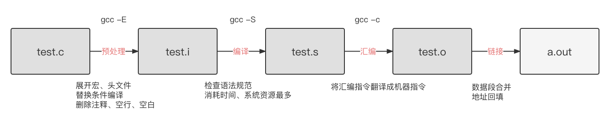

<center>gcc 编译过程</center>

- 示例：

假设我们自己定义了一个头文件`mymath.h`，实现一些自己的数学函数，并把具体实现放在`mymath.c`当中。然后写一个`test.c`程序使用这些函数。程序目录结构如下：

```
├── test.c
└── inc
    ├── mymath.h
    └── mymath.c
```

程序代码如下：

```c
// test.c
#include <stdio.h>
#include "mymath.h"// 自定义头文件
int main(){
    int a = 2;
    int b = 3;
    int sum = add(a, b); 
    printf("a=%d, b=%d, a+b=%d\n", a, b, sum);
}
```

头文件定义：

```c
// mymath.h
#ifndef MYMATH_H
#define MYMATH_H
int add(int a, int b);
int sum(int a, int b);
#endif
```

头文件实现：

```c
// mymath.c
int add(int a, int b){
	return a+b;
}
int sub(int a, int b){
	return a-b;
}
```

## 预处理(Preprocessing)

预处理用于将所有的#include头文件以及宏定义替换成其真正的内容，预处理之后得到的仍然是文本文件，但文件体积会大很多。

```shell
$ gcc -E -I./inc test.c -o test.i
```

- 当头文件和源码不在一个目录下时，需要指定头文件，其中-I参数指定头文件所在位置，位置可以在编译文件前，也可以在后面
- -o 指定输出文件名

经过预处理之后代码体积会大很多：

| X        | 文件名 | 文件大小 | 代码行数 |
| -------- | ------ | -------- | -------- |
| 预处理前 | test.c | 146B     | 9        |
| 预处理后 | test.i | 17691B   | 857      |

预处理之后的程序还是文本，可以用文本编辑器打开。

## 编译(Compilation)

这里的编译不是指程序从源文件到二进制程序的全部过程，而是指将经过预处理之后的程序转换成特定汇编代码(assembly code)的过程。编译的指定如下：

```shell
$ gcc -S -I./inc test.c -o test.s
```

上述命令中 -S 让编译器在编译之后停止，不进行后续过程。编译过程完成后，将生成程序的汇编代码test.s，这也是文本文件，内容如下：

```assembly
// test.c汇编之后的结果test.s
    .file   "test.c"
    .section    .rodata
.LC0:
    .string "a=%d, b=%d, a+b=%d\n"
    .text
    .globl  main
    .type   main, @function
main:
.LFB0:
    .cfi_startproc
    pushl   %ebp
    .cfi_def_cfa_offset 8
    .cfi_offset 5, -8
    movl    %esp, %ebp
    .cfi_def_cfa_register 5
    andl    $-16, %esp
    subl    $32, %esp
    movl    $2, 20(%esp)
    movl    $3, 24(%esp)
    movl    24(%esp), %eax
    movl    %eax, 4(%esp)
    movl    20(%esp), %eax
    movl    %eax, (%esp)
    call    add 
    movl    %eax, 28(%esp)
    movl    28(%esp), %eax
    movl    %eax, 12(%esp)
    movl    24(%esp), %eax
    movl    %eax, 8(%esp)
    movl    20(%esp), %eax
    movl    %eax, 4(%esp)
    movl    $.LC0, (%esp)
    call    printf
    leave
    .cfi_restore 5
    .cfi_def_cfa 4, 4
    ret 
    .cfi_endproc
.LFE0:
    .size   main, .-main
    .ident  "GCC: (Ubuntu 4.8.2-19ubuntu1) 4.8.2"
    .section    .note.GNU-stack,"",@progbits
```

## 汇编(Assemble)

汇编过程将上一步的汇编代码转换成机器码(machine code)，这一步产生的文件叫做目标文件，是二进制格式。

```shell
$ gcc -c test.s -o test.o
```

这一步会为每一个源文件产生一个目标文件。因此 `mymath.c` 也需要产生一个`mymath.o`文件

## 链接(Linking)

链接过程将多个目标文以及所需的库文件(.so等)链接成最终的可执行文件(executable file)。

```shell
$ gcc -o test.out test.o inc/mymath.o
```


## 常用参数

| 参数  | 解释                                   |
| ----- | -------------------------------------- |
| -I    | 指定头文件所在目录位置                 |
| -c    | 只做预处理，编译，汇编。得到二进制文件 |
| -g    | 编译时添加调试文件，用于gdb调试        |
| -Wall | 显示所有警告信息                       |
| -D    | 向程序中“动态”注册宏定义               |
| -l    | 指定动态库库名                         |
| -L    | 指定动态库路径                         |

向程序中“动态”注册宏定义

```c
#include <stdio.h>

#ifdef HELLO
#define HI 20
#endif

int main(){
  printf("hello world!\n");
	printf("-----------%d\n", HI);
	return 0;
}
```


```shell
$ gcc -o hello.out hello.c -D HELLO
$ ./hello.out
```


# 静态库与动态库

## 静态库的制作与使用

- 静态库名字以`lib` 开头，以`.a`结尾，例如：`libmylib.a`
- 将 .c 生成 .o 文件

```shell
$ gcc -c add.c -o add.o
```

  - 使用 ar 工具制作静态库

```shell
$ ar rcs libmylib.a add.o minus.o multi.o divide.o
```

- 编译静态库到可执行文件中

```shell
$ gcc test.c libmylib.a -o a.out -I./inc
```


注意：编译器只能隐式声明返回值为int的函数形式：`int add(int ,int )；`如果函数不是返回的int，则隐式声明失效，会报错

将函数声明注释之后，查看警告：

```shell
$ gcc test.c libmylib.a -o a.out -I./inc -Wall
```

警告信息：

```
test.c: 在函数‘main’中:
test.c:7:5: 警告：隐式声明函数‘add’ [-Wimplicit-function-declaration]
     printf("%d+%d=%d\n", a, b, add(a, b));
```


## 动态库的制作与使用

- 生成位置无关的.o文件

```shell
$ gcc -c add.c -o add.o -fPIC
```

使用这个参数过后，生成的函数就和位置无关，挂上@plt标识，等待动态绑定

- 使用 gcc -shared制作动态库

```shell
$ gcc -shared -o libmylib.so add.o minus.o multi.o divide.o
```

- 编译可执行程序时指定所使用的动态库。-l:指定库名 -L:指定库路径

```shell
$ gcc test.c -o a.out -l mylib -L ./lib -I./inc
```

- 运行可执行程序

```shell
$ ./a.out
```


### 动态库加载错误原因及解决方式

| 出错原因   | 分析                                                 |
| ---------- | ---------------------------------------------------- |
| 连接器     | 工作于链接阶段，工作时需要 -l 和 -L                  |
| 动态链接器 | 工作于程序运行阶段，工作时需要提供动态库所在目录位置 |

解决方式：				

- 通过环境变量

```shell
export LD_LIBRARY_PATH=动态库路径
```

注意：只是临时生效， 终端重启环境变量失效

- 永久生效

写入终端配置文件， .bashrc  建议使用绝对路径。

- 拷贝自定义动态库 到 /lib (标准C库所在目录位置)
-  配置文件

```shell
$ sudo vim /etc/ld.so.conf
```

写入动态库绝对路径

```
/jason/codes/dynamiclib
```

使配置文件生效

```shell
$ sudo ldconfig -v
```

执行

```shell
$ ./a.out
# 查看链接库
$ ldd a.out 
```


## 动态库和静态库对比

静态库特点总结：

- 在链接阶段，会将汇编生成的目标文件.o与引用到的库一起链接打包到可执行文件中。
- 静态库对函数库的链接是放在编译时期完成的，程序在运行时与函数库再无瓜葛，移植方便。
- 浪费空间和资源，因为所有相关的目标文件与牵涉到的函数库被链接合成一个可执行文件。

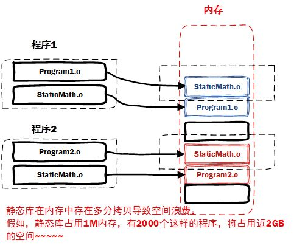

动态库特点总结：

- 动态库把对一些库函数的链接载入推迟到程序运行的时期。
- 可以实现进程之间的资源共享。（因此动态库也称为共享库）
- 将一些程序升级变得简单，甚至可以真正做到链接载入完全由程序员在程序代码中控制（显示调用）。

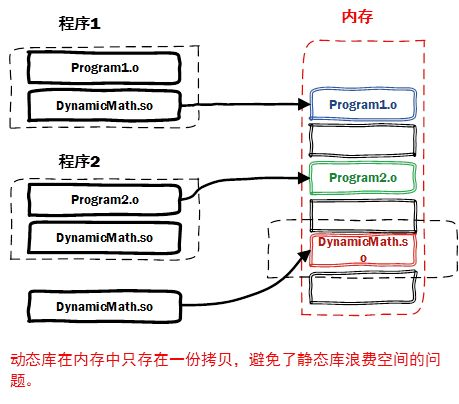


# gdb

安装

```shell
# 查看版本号
$ gdb -v
# 安装 gdb
$ sudo yum -y install gdb
```

使用gdb之前，要求对文件进行编译时增加-g参数，加了这个参数过后生成的编译文件会大一些，这是因为增加了gdb调试内容

```shell
$ gcc gdbtest.c -o a.out -g
```

开启调试

```shell
$ gdb a.out
```

然后输入 start，启动程序

## 基础指令

- -g：使用该参数编译可以执行文件，得到调试表。
- list： list 1  列出源码。根据源码指定行号设置断点。
- b：	b 20	在20行位置设置断点。
- delete num（断点编号），删除断点
- run/r:	运行程序
- n/next: 下一条指令（会越过函数）
- s/step: 下一条指令（会进入函数）
  - 如果是系统函数，进去之后出不来了，这时用until+行号直接执行到行号处
- p/print：p i  查看变量的值。
- continue：继续执行断点后续指令。
- finish：结束当前函数调用。 
- quit：退出gdb当前调试。


## 其他指令

- run：使用run查找段错误出现位置。
- set args： 设置main函数命令行参数 （在 start、run 之前）
- run 字串1 字串2 ...: 设置main函数命令行参数
- info b: 查看断点信息表
- b 20 if i = 5：	设置条件断点。
- ptype：查看变量类型。
- bt：列出当前程序正存活着的栈帧。
- frame： 根据栈帧编号，切换栈帧。
- display：设置跟踪变量
- undisplay：取消设置跟踪变量。 使用跟踪变量的编号。


# 系统调用

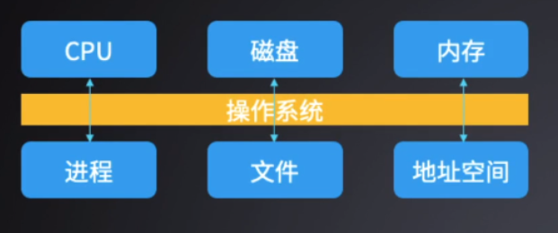

操作系统

- 管理与配置内存、决定系统资源供需的优先次序、控制输入设备与输出设备、操作网络与管理文件系统等
- 给应用软件提供服务，作用于硬件之上，应用软件之下

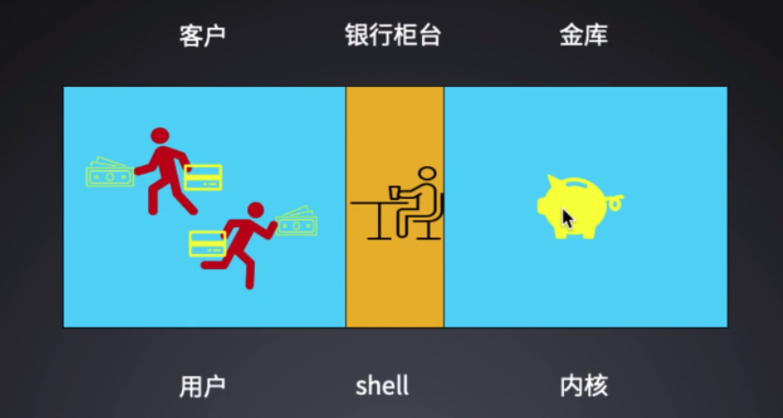

内核+ shell + 系统应用(vim) ... = os


系统编程 syscall

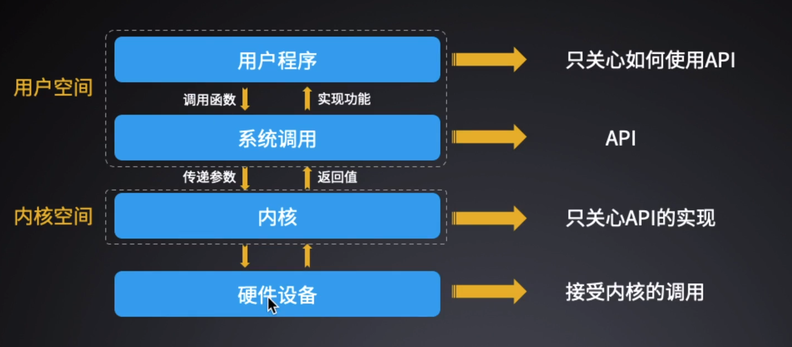

系统编程的特点

- 无法跨平台
- 速度更慢，空间切换需要一定时间
- 提高系统的安全性
- 接口复杂，能力越大责任越大

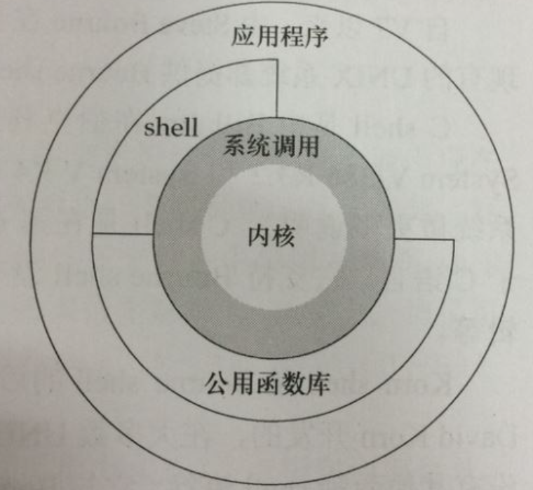

# man 手册

man page（manual），用来查看系统中自带的各种参考手册，手册页分为好几个部分，如下所示：

- Executable programs or shell commands，普通的命令
- System calls (functions provided by the kernel)，是系统调用，如open，write之类的(通过这个，至少可以很方便的查到调用这个函数，需要加什么头文件)
- Library calls (functions within program libraries)，库函数,如printf，fread
- Special files (usually found in /dev)，特殊文件，也就是/dev下的各种设备文件
- File formats and conventions eg /etc/passwd，指文件的格式，比如passwd，就会说明这个文件中各个字段的含义
- Games，给游戏留的,由各个游戏自己定义
- Miscellaneous (including macro packages and conventions), e.g. man(7), groff(7)，附件还有一些变量，比如向environ这种全局变量在这里就有说明
- System administration commands (usually only for root)，系统管理用的命令，这些命令只能由root使用，如ifconfig

安装 man page：

```shell
$ yum install man-pages
```


在shell 中输入 `man+数字+命令/函数`，即可以查到相关的命令和函数。若不加数字，那Linux man命令默认从数字较小的手册中寻找相关命令和函数。

例如：我们输入 man ls，它会在最左上角显示“LS（1）”，在这里，“LS”表示手册名称，而“（1）”表示该手册位于第一节章，同样，我们输入“man ifconfig”它会在最左上角显示“IFCONFIG（8）”。也可以这样输入命令：“man [章节号] 手册名称”。

man 是按照手册的章节号的顺序进行搜索的，比如：man sleep，只会显示 sleep 命令的手册，如果想查看库函数sleep，就要输入：man 3 sleep


如何在 man 中进行查阅:

| 按键     | 描述                                 |
| -------- | ------------------------------------ |
| 空格键   | 向后翻一屏                           |
| b        | 向前翻一屏                           |
| 回车键   | 向后翻一行                           |
| k        | 向前翻一行                           |
| ctrl + d | 向后翻半屏                           |
| ctrl + u | 向前翻半屏                           |
| G        | 跳转到文件尾                         |
| g        | 跳到文件首                           |
| q        | 退出                                 |
| /关键字  | 从当前光标所在行开始，向文件尾部查找 |
| ?关键字  | 从当前光标所在行开始，向文件首部查找 |
| n        | 向后查找                             |
| N        | 向前查找                             |


# 文件IO

## open
引入头文件：#include <unistd.h> 

| 函数   | int open(char *pathname, int flags)                          |
| ------ | ------------------------------------------------------------ |
| 参数   | pathname：要打开的文件路径名<br />flags：文件打开方式，#include <fcntl.h> |
| 返回值 | 成功： 打开文件所得到对应的文件描述符（整数）<br />失败： -1， 设置errno |


| 函数   | int open(char *pathname, int flags， mode_t mode)            |
| ------ | ------------------------------------------------------------ |
| 参数   | pathname：要打开的文件路径名<br />flags：文件打开方式<br />O_RDONLY\|O_WRONLY\|O_RDWR<br />O_CREAT\|O_APPEND\|O_TRUNC\|O_EXCL\|O_NONBLOCK...<br />mode：参数3使用的前提， 参数2指定了 O_CREAT<br />取值8进制数，用来描述文件的访问权限，如： rwx    0664<br />创建文件最终权限 = mode & ~umask |
| 返回值 | 成功： 打开文件所得到对应的文件描述符（整数）<br />失败： -1， 设置errno |


常见错误：

- 打开文件不存在
- 以写方式打开只读文件（打开文件没有对应权限）
- 以只写方式打开目录		

`open_err.c`

```c
#include <unistd.h>		//read write
#include <fcntl.h>		//open close O_WRONLY O_RDONLY O_CREAT O_RDWR
#include <stdlib.h>		//exit
#include <errno.h>
#include <stdio.h>		//perror
#include <string.h>

int main(void)
{
	int fd;
#if 1
	//打开文件不存在
	fd = open("test", O_RDONLY | O_CREAT);
	if(fd < 0){
        printf("errno = %d\n", errno);
	//	perror("open test error");
        printf("open test error: %s\n" , strerror(errno));

        //printf("open test error\n");
		exit(1);
	}
#elif 0
	//打开的文件没有对应权限(以只写方式打开一个只有读权限的文件)
	fd = open("test", O_WRONLY);		//O_RDWR也是错误的
	if(fd < 0){
        printf("errno = %d\n", errno);
		perror("open test error");
        //printf("open test error\n");
		exit(1);
	}

#endif
#if 0
	//以写方式打开一个目录
	fd = open("testdir", O_RDWR);		//O_WRONLY也是错的	
	if(fd < 0){
		perror("open testdir error");
		exit(1);
	}
#endif

	return 0;
}
```


## read

| 函数   | ssize_t read(int fd, void *buf, size_t count);               |
| ------ | ------------------------------------------------------------ |
| 参数   | fd：文件描述符<br />buf：存数据的缓冲区<br />count：缓冲区大小 |
| 返回值 | 0：读到文件末尾。<br />成功：> 0 读到的字节数。<br />失败：-1， 设置 errno<br />-1：并且 errno = EAGIN 或 EWOULDBLOCK，说明不是 read 失败，而是 read 在以非阻塞方式读一个设备文件（网络文件），并且文件无数据。 |


## write

| 函数   | ssize_t write(int fd, const void *buf, size_t count);        |
| ------ | ------------------------------------------------------------ |
| 参数   | fd：文件描述符<br />buf：待写出数据的缓冲区<br />count：数据大小 |
| 返回值 | 成功：写入的字节数。<br />失败：-1， 设置 errno              |

`rw_cp.c`

```c
/*
 *./mycp src dst 命令行参数实现简单的cp命令
 */
#include <unistd.h>
#include <stdlib.h>
#include <fcntl.h>
#include <stdio.h>

char buf[1024];

int main(int argc, char *argv[])
{
	int src, dst;
	int n;

	src = open(argv[1], O_RDONLY); //只读打开源文件
	if(src < 0){
		perror("open src error");
		exit(1);
	}
	//只写方式打开，覆盖原文件内容，不存在则创建，rw-r--r--
	dst = open(argv[2], O_WRONLY|O_TRUNC|O_CREAT, 0644);
	if(src < 0){
		perror("open dst error");
		exit(1);
	}
	while((n = read(src, buf, 1024))){
		if(n < 0){
			perror("read src error");
			exit(1);
		}
		write(dst, buf, n);  //不应写出1024, 读多少写多少
	}

	close(src);
	close(dst);

	return 0;
}
```


## 错误处理函数

错误号:errno
perror 函数: void perror(const char *s);
strerror 函数: char *strerror(int errnum);*

查看错误号:

/usr/include/asm-generic/errno-base.h 

/usr/include/asm-generic/errno.h

| 名称            | 值   | 描述                                        |
| --------------- | ---- | ------------------------------------------- |
| EPERM           | 1    | 操作不允许                                  |
| ENOENT          | 2    | 无此文件或目录                              |
| ESRCH           | 3    | 无此进程                                    |
| EINTR           | 4    | 中断系统调用                                |
| EIO             | 5    | I/O 错误                                    |
| ENXIO           | 6    | 无此设备或地址                              |
| E2BIG           | 7    | 参数列表过长                                |
| ENOEXEC         | 8    | 执行文件错误                                |
| EBADF           | 9    | 错误的文件数                                |
| ECHILD          | 10   | 无子进程                                    |
| EAGAIN          | 11   | 再尝试一下                                  |
| ENOMEM          | 12   | 内存溢出                                    |
| EACCES          | 13   | 要求被否定                                  |
| EFAULT          | 14   | 错误地址                                    |
| ENOTBLK         | 15   | 块设备请求                                  |
| EBUSY           | 16   | 设备或者资源忙                              |
| EEXIST          | 17   | 文件存在                                    |
| EXDEV           | 18   | Cross-device link                           |
| ENODEV          | 19   | 无此设备                                    |
| ENOTDIR         | 20   | 不是一个目录文件                            |
| EISDIR          | 21   | I是一个目录文件                             |
| EINVAL          | 22   | 无效的参数                                  |
| ENFILE          | 23   | 文件表溢出                                  |
| EMFILE          | 24   | 打开文件过多                                |
| ENOTTY          | 25   | 不是一个TTY设备                             |
| ETXTBSY         | 26   | 文件忙                                      |
| EFBIG           | 27   | 文件过大                                    |
| ENOSPC          | 28   | 此设备上没有空间了                          |
| ESPIPE          | 29   | 无效的偏移                                  |
| EROFS           | 30   | 只读文件系统                                |
| EMLINK          | 31   | 链接过多                                    |
| EPIPE           | 32   | 错误的管道                                  |
| EDOM            | 33   | Math argument out of domain                 |
| ERANGE          | 34   | Math result not representable               |
| EDEADLK         | 35   | Resource deadlock would occur               |
| ENAMETOOLONG    | 36   | 文件名过长                                  |
| ENOLCK          | 37   | No record locks available                   |
| ENOSYS          | 38   | 函数没有实现                                |
| ENOTEMPTY       | 39   | 目录非空                                    |
| ELOOP           | 40   | Too many symbolic links encountered         |
| EWOULDBLOCK     | 41   | Same as EAGAIN                              |
| ENOMSG          | 42   | No message of desired type                  |
| EIDRM           | 43   | Identifier removed                          |
| ECHRNG          | 44   | Channel number out of range                 |
| EL2NSYNC        | 45   | Level 2 not synchronized                    |
| EL3HLT          | 46   | Level 3 halted                              |
| EL3RST          | 47   | Level 3 reset                               |
| ELNRNG          | 48   | Link number out of range                    |
| EUNATCH         | 49   | Protocol driver not attached                |
| ENOCSI          | 50   | No CSI structure available                  |
| EL2HLT          | 51   | Level 2 halted                              |
| EBADE           | 52   | Invalid exchange                            |
| EBADR           | 53   | Invalid request descriptor                  |
| EXFULL          | 54   | Exchange full                               |
| ENOANO          | 55   | No anode                                    |
| EBADRQC         | 56   | Invalid request code                        |
| EBADSLT         | 57   | Invalid slot                                |
| EDEADLOCK       | 58   | Same as EDEADLK                             |
| EBFONT          | 59   | Bad font file format                        |
| ENOSTR          | 60   | Device not a stream                         |
| ENODATA         | 61   | No data available                           |
| ETIME           | 62   | Timer expired                               |
| ENOSR           | 63   | Out of streams resources                    |
| ENONET          | 64   | Machine is not on the network               |
| ENOPKG          | 65   | Package not installed                       |
| EREMOTE         | 66   | Object is remote                            |
| ENOLINK         | 67   | Link has been severed                       |
| EADV            | 68   | Advertise error                             |
| ESRMNT          | 69   | Srmount error                               |
| ECOMM           | 70   | Communication error on send                 |
| EPROTO          | 71   | Protocol error                              |
| EMULTIHOP       | 72   | Multihop attempted                          |
| EDOTDOT         | 73   | RFS specific error                          |
| EBADMSG         | 74   | Not a data message                          |
| EOVERFLOW       | 75   | Value too large for defined data type       |
| ENOTUNIQ        | 76   | Name not unique on network                  |
| EBADFD          | 77   | File descriptor in bad state                |
| EREMCHG         | 78   | Remote address changed                      |
| ELIBACC         | 79   | Cannot access a needed shared library       |
| ELIBBAD         | 80   | Accessing a corrupted shared library        |
| ELIBSCN         | 81   | A .lib section in an .out is corrupted      |
| ELIBMAX         | 82   | Linking in too many shared libraries        |
| ELIBEXEC        | 83   | Cannot exec a shared library directly       |
| EILSEQ          | 84   | Illegal byte sequence                       |
| ERESTART        | 85   | Interrupted system call should be restarted |
| ESTRPIPE        | 86   | Streams pipe error                          |
| EUSERS          | 87   | Too many users                              |
| ENOTSOCK        | 88   | Socket operation on non-socket              |
| EDESTADDRREQ    | 89   | Destination address required                |
| EMSGSIZE        | 90   | Message too long                            |
| EPROTOTYPE      | 91   | Protocol wrong type for socket              |
| ENOPROTOOPT     | 92   | Protocol not available                      |
| EPROTONOSUPPORT | 93   | Protocol not supported                      |
| ESOCKTNOSUPPORT | 94   | Socket type not supported                   |
| EOPNOTSUPP      | 95   | Operation not supported on transport        |
| EPFNOSUPPORT    | 96   | Protocol family not supported               |
| EAFNOSUPPORT    | 97   | Address family not supported by protocol    |
| EADDRINUSE      | 98   | Address already in use                      |
| EADDRNOTAVAIL   | 99   | Cannot assign requested address             |
| ENETDOWN        | 100  | Network is down                             |
| ENETUNREACH     | 101  | Network is unreachable                      |
| ENETRESET       | 102  | Network dropped                             |
| ECONNABORTED    | 103  | Software caused connection                  |
| ECONNRESET      | 104  | Connection reset by                         |
| ENOBUFS         | 105  | No buffer space available                   |
| EISCONN         | 106  | Transport endpoint                          |
| ENOTCONN        | 107  | Transport endpoint                          |
| ESHUTDOWN       | 108  | Cannot send after transport                 |
| ETOOMANYREFS    | 109  | Too many references                         |
| ETIMEDOUT       | 110  | Connection timed                            |
| ECONNREFUSED    | 111  | Connection refused                          |
| EHOSTDOWN       | 112  | Host is down                                |
| EHOSTUNREACH    | 113  | No route to host                            |
| EALREADY        | 114  | Operation already                           |
| EINPROGRESS     | 115  | Operation now in                            |
| ESTALE          | 116  | Stale NFS file handle                       |
| EUCLEAN         | 117  | Structure needs cleaning                    |
| ENOTNAM         | 118  | Not a XENIX-named                           |
| ENAVAIL         | 119  | No XENIX semaphores                         |
| EISNAM          | 120  | Is a named type file                        |
| EREMOTEIO       | 121  | Remote I/O error                            |
| EDQUOT          | 122  | Quota exceeded                              |
| ENOMEDIUM       | 123  | No medium found                             |
| EMEDIUMTYPE     | 124  | Wrong medium type                           |

## 系统调用和库函数比较

fputc/fgetc 实现读写

```c
#include <stdio.h>
#include <string.h>
#include <unistd.h>
#include <fcntl.h>
#include <stdlib.h>
#include <errno.h>

#define N 1024

int main(int argc, char *argv[])
{
	int fd, fd_out;
	int n;
	char buf[N];

	fd = open("dict.txt", O_RDONLY);
	if(fd < 0){
		perror("open dict.txt error");
		exit(1);
	}

	fd_out = open("dict.cp", O_WRONLY|O_CREAT|O_TRUNC, 0644);
	if(fd < 0){
		perror("open dict.cp error");
		exit(1);
	}

	while((n = read(fd, buf, N))){
		if(n < 0){
			perror("read error");
			exit(1);
		}
		write(fd_out, buf, n);
	}

	close(fd);
	close(fd_out);

	return 0;
}
```

**strace 命令：**

shell 中使用 strace 命令跟踪程序执行，查看调用的系统函数。

```shell
$strace ./a.out
```

库函数更快的原因：

- 标准IO函数自带用户缓冲区，系统调用无用户级缓冲，系统缓冲区是都有的。

- read/write，每次写一个字节，会频繁进行内核态和用户态的切换，非常耗时。
- fgetc/fputc，自带缓冲区，大小为4096字节，它并不是一个字节一个字节地写，内核和用户切换就比较少，这称之为“预读入缓输出机制”
- 系统函数并不一定比库函数更高效，一般情况下能使用库函数的地方，尽量使用库函数。


预读入缓输出机制：

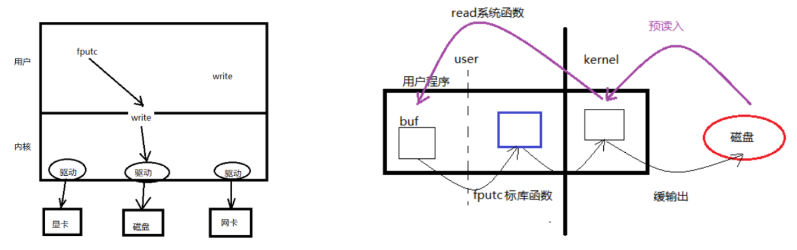

## 文件描述符

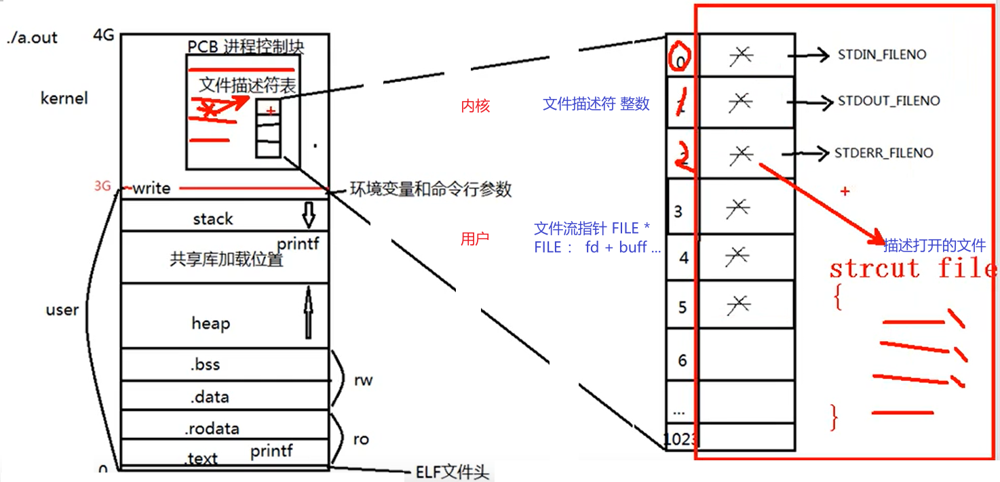


PCB进程控制块，本质是一个结构体

- 成员：文件描述符表，文件描述符是指向一个文件结构体的指针
- 文件描述符：0/1/2/3/4。。。。/1023     表中可用的最小的。

  - 0 - STDIN_FILENO		键盘
  - 1 - STDOUT_FILENO	显示器
  - 2 - STDERR_FILENO

最大打开文件数

- 一个进程默认打开文件的个数 1024。
- 命令查看 ulimit -a 查看 open files 对应值。默认为 1024
- 可以使用 ulimit -n 4096 修改 当然也可以通过修改系统配置文件永久修改该值，但是不建议这样操作。
- cat /proc/sys/fs/file-max 可以查看该电脑最大可以打开的文件个数，受内存大小影响。

FILE 结构体

- 主要包含文件描述符、文件读写位置、IO 缓冲区三部分内容。

struct file { 

​		...
​		文件的偏移量; 

​		文件的访问权限; 

​		文件的打开标志; 

​		文件内核缓冲区的首地址; 

​		struct operations * f_op;
​		... 

};

## 阻塞和非阻塞

读常规文件是不会阻塞的，不管读多少字节，read 一定会在有限的时间内返回。从终端设备或网络读则不一定，如果从终端输入的数据没有换行符，调用 read 读终端设备就会 阻塞，如果网络上没有接收到数据包，调用 read 从网络读就会阻塞，至于会阻塞多长时间也是不确定的，如果一直没有数据到达就一直阻塞在那里。同样，写常规文件是不会阻塞的， 而向终端设备或网络写则不一定。

明确一下阻塞(Block)这个概念。当进程调用一个阻塞的系统函数时，该进程被置于睡眠(Sleep)状态，这时内核调度其它进程运行，直到该进程等待的事件发生了(比如网络上接收到数据包，或者调用 sleep 指定的睡眠时间到了)它才有可能继续运行。与睡眠状态相对的是运行(Running)状态，在 Linux 内核中，处于运行状态的进程分为两种情况:

- 正在被调度执行。CPU 处于该进程的上下文环境中，程序计数器(eip)里保存着该进 程的指令地址，通用寄存器里保存着该进程运算过程的中间结果，正在执行该进程的指令， 正在读写该进程的地址空间。

- 就绪状态。该进程不需要等待什么事件发生，随时都可以执行，但 CPU 暂时还在执行 另一个进程，所以该进程在一个就绪队列中等待被内核调度。系统中可能同时有多个就绪的 进程，那么该调度谁执行呢?内核的调度算法是基于优先级和时间片的，而且会根据每个进 程的运行情况动态调整它的优先级和时间片，让每个进程都能比较公平地得到机会执行，同时要兼顾用户体验，不能让和用户交互的进程响应太慢。

产生阻塞的场景：读设备文件，读网络文件的属性。（读常规文件无阻塞概念。）

- /dev/tty -- 终端文件。
- open("/dev/tty", O_RDWR | O_NONBLOCK)	--- 设置 /dev/tty 非阻塞状态。(默认为阻塞状态)

阻塞，`block_readtty.c`

```c
#include <unistd.h>
#include <stdlib.h>
#include <stdio.h>


int main(void)
{
	char buf[10];
	int n;

	n = read(STDIN_FILENO, buf, 10);   // #define STDIN_FILENO 0   STDOUT_FILENO 1  STDERR_FILENO 2
	if(n < 0){
		perror("read STDIN_FILENO");
		exit(1);
	}
	write(STDOUT_FILENO, buf, n);
	
	return 0;
}
```

非阻塞，`nonblock_readtty.c`

```c
#include <unistd.h>
#include <fcntl.h>
#include <errno.h>
#include <stdio.h>
#include <stdlib.h>
#include <string.h>

int main(void)
{
	char buf[10];
	int fd, n;

	fd = open("/dev/tty", O_RDONLY|O_NONBLOCK); 
	if (fd < 0) {
		perror("open /dev/tty");
		exit(1);
	}

tryagain:

	n = read(fd, buf, 10);   
	if (n < 0) {
		if (errno != EAGAIN) {		// if(errno != EWOULDBLOCK)
			perror("read /dev/tty");
			exit(1);
		} else {
            write(STDOUT_FILENO, "try again\n", strlen("try again\n"));
            sleep(2);
            goto tryagain;
        }
	}

	write(STDOUT_FILENO, buf, n);
	close(fd);

	return 0;
}
```

非阻塞超时处理，`nonblock_timeout.c`

```c
#include <unistd.h>
#include <fcntl.h>
#include <stdlib.h>
#include <stdio.h>
#include <errno.h>
#include <string.h>

#define MSG_TRY "try again\n"
#define MSG_TIMEOUT "time out\n"

int main(void)
{
    char buf[10];
    int fd, n, i;

    fd = open("/dev/tty", O_RDONLY|O_NONBLOCK);
    if(fd < 0){
        perror("open /dev/tty");
        exit(1);
    }
    printf("open /dev/tty ok... %d\n", fd);

    for (i = 0; i < 5; i++){
        n = read(fd, buf, 10);
        if (n > 0) {                    //说明读到了东西
            break;
        }
        if (errno != EAGAIN) {          //EWOULDBLOCK  
            perror("read /dev/tty");
            exit(1);
        } else {
            write(STDOUT_FILENO, MSG_TRY, strlen(MSG_TRY));
            sleep(2);
        }
    }

    if (i == 5) {
        write(STDOUT_FILENO, MSG_TIMEOUT, strlen(MSG_TIMEOUT));
    } else {
        write(STDOUT_FILENO, buf, n);
    }

    close(fd);

    return 0;
}
```

## fcntl

fcntl 用来改变一个【已经打开】的文件的访问控制属性

| 函数   | int (int fd, int cmd, ...)                                   |
| ------ | ------------------------------------------------------------ |
| 参数   | fd：文件描述符<br />cmd：命令，决定了后续参数个数<br />获取文件状态： F_GETFL<br />设置文件状态： F_SETFL |
| 返回值 | int flgs = fcntl(fd,  F_GETFL);<br />flgs \|= O_NONBLOCK;<br />fcntl(fd,  F_SETFL, flgs); |

标志位的按位或运算：

对应的2个二进位有一个为1时，结果位就为1，1|1=1，1|0=1，0|0=0

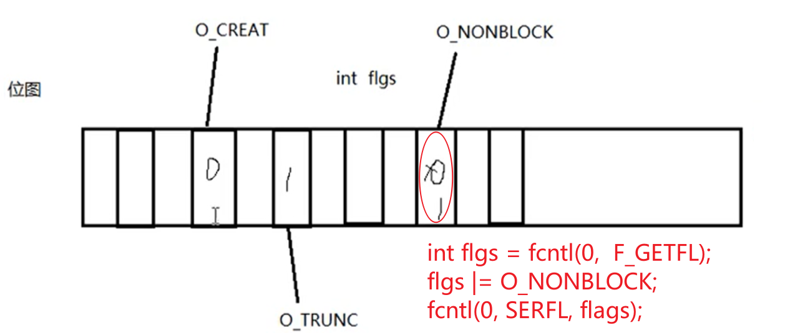

终端文件默认是阻塞读的，这里用fcntl将其更改为非阻塞读：

`fcntl.c`

```c
#include <unistd.h>
#include <fcntl.h>
#include <errno.h>
#include <stdio.h>
#include <stdlib.h>
#include <string.h>

#define MSG_TRY "try again\n"

int main(void)
{
	char buf[10];
	int flags, n;

	flags = fcntl(STDIN_FILENO, F_GETFL); //获取stdin属性信息
	if(flags == -1){
		perror("fcntl error");
		exit(1);
	}
	flags |= O_NONBLOCK;
	int ret = fcntl(STDIN_FILENO, F_SETFL, flags);
	if(ret == -1){
		perror("fcntl error");
		exit(1);
	}

tryagain:
	n = read(STDIN_FILENO, buf, 10);
	if(n < 0){
		if(errno != EAGAIN){		
			perror("read /dev/tty");
			exit(1);
		}
		sleep(3);
		write(STDOUT_FILENO, MSG_TRY, strlen(MSG_TRY));
		goto tryagain;
	}
	write(STDOUT_FILENO, buf, n);

	return 0;
}
```


注意，阻塞与非阻塞是对于文件而言的。而不是 read、write 等的属性。read 终端，默认阻 塞读。

read 函数返回值:

1. 返回非零值: 实际 read 到的字节数

2. 返回-1: 

   1):errno != EAGAIN (或!= EWOULDBLOCK) read 出错

​		2):errno == EAGAIN (或== EWOULDBLOCK) 设置了非阻塞读，并且没有 数据到达。

3. 返回 0:读到文件末尾


## lseek 函数

- 文件偏移，Linux 中可使用系统函数 lseek 来修改文件偏移量(读写位置)

- 每个打开的文件都记录着当前读写位置，打开文件时读写位置是 0，表示文件开头，通常读写多少个字节就会将读写位置往后移多少个字节。但是有一个例外，如果以 O_APPEND 方式打开，每次写操作都会在文件末尾追加数据，然后将读写位置移到新的文件末尾。lseek 和标准 I/O 库的 fseek 函数类似，可以移动当前读写位置(或者叫偏移量)。

| 函数     | off_t lseek(int fd, off_t offset, int whence);               |
| -------- | ------------------------------------------------------------ |
| 参数     | fd：文件描述符<br/>offset： 偏移量<br/>whence：起始偏移位置： SEEK_SET/SEEK_CUR/SEEK_END |
| 返回值   | 成功：较起始位置偏移量<br/>失败：-1 errno                    |
| 应用场景 | 1. 文件的“读”、“写”使用同一偏移位置。<br/>2. 使用lseek获取文件大小<br/>3. 使用lseek拓展文件大小：要想使文件大小真正拓展，必须引起IO操作。<br/>使用 truncate 函数，直接拓展文件。	int ret = truncate("dict.cp", 250); |

`lseek.c`

```c
#include <stdio.h>
#include <stdlib.h>
#include <unistd.h>
#include <string.h>
#include <fcntl.h>

int main(void)
{
	int fd, n;
	char msg[] = "It's a test for lseek\n";
	char ch;

	fd = open("lseek.txt", O_RDWR|O_CREAT, 0644);
	if(fd < 0){
		perror("open lseek.txt error");
		exit(1);
	}

	write(fd, msg, strlen(msg));    //使用fd对打开的文件进行写操作，文件读写位置位于文件结尾处。

	lseek(fd, 0, SEEK_SET);         //修改文件读写指针位置，位于文件开头。 注释该行会怎样呢？

	while((n = read(fd, &ch, 1))){
		if(n < 0){
			perror("read error");
			exit(1);
		}
		write(STDOUT_FILENO, &ch, n);   //将文件内容按字节读出，写出到屏幕
	}

	close(fd);

	return 0;
}
```


# 文件系统

## 文件存储

### inode

其本质为结构体，存储文件的属性信息。如:权限、类型、大小、时间、用户、盘块位 置......也叫作文件属性管理结构，大多数的 inode 都存储在磁盘上。
少量常用、近期使用的 inode 会被缓存到内存中。 

所谓的删除文件，就是删除inode，但是数据其实还是在硬盘上，以后会覆盖掉。

### dentry

目录项，其本质依然是结构体，重要成员变量有两个 {文件名，inode，...}，而文件内 容(data)保存在磁盘盘块中。

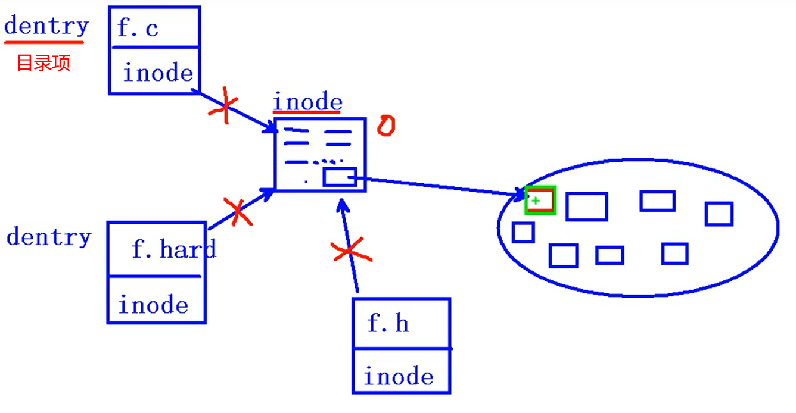

### 硬链接

由于linux下的文件是通过索引节点（Inode）来识别文件，硬链接可以认为是一个指针，指向文件索引节点的指针，系统并不为它重新分配inode。inode指向了物理硬盘的一个区块，事实上文件系统会维护一个引用计数，只要有文件指向这个区块，它就不会从硬盘上消失。每添加一个硬链接，文件的链接数就加1。

用ln命令来建立硬链接：

```
#创建前
➜  ~ ls -lrth tmp
-rw-r--r--  1 root  root     0B Oct  9 20:41 tmp

#创建硬链接
➜  ~ ln tmp tmphard

#创建后
➜  ~ ls -ilrth tmp*
38351334 -rw-r--r--  2 root  root     0B Oct  9 20:41 tmphard
38351334 -rw-r--r--  2 root  root     0B Oct  9 20:41 tmp
```

在创建链接前，tmp显示的链接数目为1，创建链接后对比：

- tmp 和tmphard 的链接数目都变为2;
- tmp 和tmphard 在inode号是一样的;
- tmp 和tmphard 显示的文件大小也是一样；

可见进行了ln命令的操作结果：

tmp 和tmphard 是`同一个文件的两个名字`，它们具有同样的索引节点号和文件属性，建立文件tmp的硬链接，就是为tmp的文件索引节点在当前目录上建立一个新指针。


你可以删除其中任何一个，每次只会删除一个指针，链接数同时减一，只有将所有指向文件内容的指针，也即链接数减为0时，内核才会把文件内容从磁盘上删除。

```
#删除
➜  ~ rm tmp
➜  ~ ls -ilrth tmp*
38351334 -rw-r--r--  1 root  root     0B Oct  9 20:41 tmphard
```

尽管硬链接节省空间，也是Linux系统整合文件系统的传统方式，但是存在以下不足之处：

- 不可以在不同文件系统的文件间建立链接
- 只有超级用户才可以为目录创建硬链接。


### 软链接

软链接克服了硬链接的不足，没有任何文件系统的限制，任何用户可以创建指向目录的符号链接。因而现在更为广泛使用，它具有更大的灵活性，甚至可以跨越不同机器、不同网络对文件进行链接。

**软链接的inode所指向的内容实际上是保存了一个绝对路径，当用户访问这个文件时，系统会自动将其替换成其所指的文件路径。类似于Windows 的快捷方式。**


用ln -s命令来建立软链接：

```
#创建软链接
➜  ~ ln -s  tmp tmpsoft

#创建后
➜  ~ ls -ilrth tmp*
38351334 -rw-r--r--  2 root  root     0B Oct  9 20:41 tmphard
38351334 -rw-r--r--  2 root  root     0B Oct  9 20:41 tmp
38364003 lrwxr-xr-x  1 root  root     3B Oct  9 21:58 tmpsoft -> tmp
```

缺点：

- 因为链接文件包含有原文件的路径信息，所以当原文件从一个目录下移到其他目录中，再访问链接文件，系统就找不到了，而硬链接就没有这个缺陷，你想怎么移就怎么移；
- 它要系统分配额外的空间用于建立新的索引节点和保存原文件的路径。


## stat

获取文件属性，从inode结构体中获取，同 `stat file`

| 函数     | int stat(const char *path, struct stat *buf);                |
| -------- | ------------------------------------------------------------ |
| 参数     | path： 文件路径<br/>buf：（传出参数） 存放文件属性，inode结构体指针。 |
| 返回值   | 成功： 0<br/>失败： -1 errno                                 |
| 应用场景 | 获取文件大小： buf.st_size<br/>获取文件类型： buf.st_mode<br/>获取文件权限： buf.st_mode |

stat 结构体

```c
struct stat  
{   
    dev_t       st_dev;     /* ID of device containing file -文件所在设备的ID*/  
    ino_t       st_ino;     /* inode number -inode节点号*/    
    mode_t      st_mode;    /* protection -保护模式?*/    
    nlink_t     st_nlink;   /* number of hard links -链向此文件的连接数(硬连接)*/    
    uid_t       st_uid;     /* user ID of owner -user id*/    
    gid_t       st_gid;     /* group ID of owner - group id*/    
    dev_t       st_rdev;    /* device ID (if special file) -设备号，针对设备文件*/    
    off_t       st_size;    /* total size, in bytes -文件大小，字节为单位*/    
    blksize_t   st_blksize; /* blocksize for filesystem I/O -系统块的大小*/    
    blkcnt_t    st_blocks;  /* number of blocks allocated -文件所占块数*/    
    time_t      st_atime;   /* time of last access -最近存取时间*/    
    time_t      st_mtime;   /* time of last modification -最近修改时间*/    
    time_t      st_ctime;   /* time of last status change - */    
};
```

 `mystat.c` 获取文件大小

```c
#include <stdio.h>
#include <stdlib.h>
#include <string.h>
#include <unistd.h>
#include <sys/stat.h>
#include <pthread.h>

int main(int argc, char *argv[])
{
    struct stat sbuf;

    int ret = stat(argv[1], &sbuf);
    if (ret == -1) {
        perror("stat eror");
        exit(1);
    }
	
	printf("file size: %ld\n", sbuf.st_size);    
	
	return 0;
}
```


## lstat

`mylstat.c` 判断文件类型

```c
#include <stdio.h>
#include <stdlib.h>
#include <string.h>
#include <unistd.h>
#include <sys/stat.h>
#include <pthread.h>

int main(int argc, char *argv[])
{
    struct stat sb;

    int ret = lstat(argv[1], &sb);
    if (ret == -1) {
        perror("stat eror");
        exit(1);
    }
    
    if (S_ISREG(sb.st_mode)) {
        printf("It's a regular\n");
    } else if (S_ISDIR(sb.st_mode)) {
        printf("It's a dir\n");
    } else if (S_ISFIFO(sb.st_mode)) {
        printf("It's a pipe\n");
    } else if (S_ISLNK(sb.st_mode)) {
        printf("it's a sym link\n");
    }

	return 0;
}
```


穿透符号链接

- stat 会，stat 会拿到符号链接指向那个文件或目录的属性
- 类似穿透现象还有 cat vim（实现基于系统调用）
- lstat 不会，不想穿透符号就用 lstat


文件类型判断方法，使用宏函数:

- S_ISLNK(st_mode)：是否是一个连接.
- S_ISREG(st_mode)：是否是一个常规文件.
- S_ISDIR(st_mode)：是否是一个目录
- S_ISCHR(st_mode)：是否是一个字符设备.
- S_ISBLK(st_mode)：是否是一个块设备
- S_ISFIFO(st_mode)：是否是一个FIFO文件.
- S_ISSOCK(st_mode)：是否是一个SOCKET文件


## link

为已经存在的文件创建目录项(硬链接)

| 函数   | int link(const char *oldpath, const char *newpath); |
| ------ | --------------------------------------------------- |
| 参数   | oldpath： 旧的路径<br/>newpath：新的路径            |
| 返回值 | 成功：0<br />失败：-1 设置 errno 为相应值           |

## unlink

删除一个文件的目录项

| 函数   | int unlink(const char *pathname);         |
| ------ | ----------------------------------------- |
| 参数   | pathname：文件路径                        |
| 返回值 | 成功：0<br />失败：-1 设置 errno 为相应值 |

实现 mv 命令的改名操作 `myMv.c`

```c
#include <stdio.h>
#include <stdlib.h>
#include <string.h>
#include <unistd.h>
#include <pthread.h>

int main(int argc, char *argv[])
{

    link(argv[1], argv[2]);

    unlink(argv[1]);


	return 0;
}
```


Linux下删除文件的机制：不断将st_nlink -1，直至减到0为止。无目录项对应的文件，将会被操作系统择机释放。(具体时间由系统内部调度算法决定)，

**因此，我们删除文件，从某种意义上说，只是让文件具备了被释放的条件。**

## 隐式回收

当进程结束运行时，所有该进程打开的文件会被关闭，申请的内存空间会被释放。系统 的这一特性称之为隐式回收系统资源。


## getcwd

获取进程当前工作目录 (卷 3，标库函数)

`char *getcwd(char *buf, size_t size); `

成功:buf 中保存当前进程工作目录位置。失败返回 NULL。


## chdir

改变当前进程的工作目录

`int chdir(const char *path); `

成功:0；失败:-1 设置 errno 为相应值


## 文件、目录权限

注意：目录文件也是“文件”。其文件内容是该目录下所有子文件的目录项 dentry。 可以尝试用 vim 打开一个目录。

|      | r                                       | w                                        | x                             |
| ---- | --------------------------------------- | ---------------------------------------- | ----------------------------- |
| 文件 | 文件的内容可以被查看 cat、more、less... | 内容可以被修改 vi、> ...                 | 可以运行产生一个进程 ./文件名 |
| 目录 | 目录可以被浏览 ls、tree...              | 创建、删除、修改文件 mv、touch、mkdir... | 可以被打开、进入 cd           |


## opendir

 根据传入的目录名打开一个目录 (库函数) DIR * 类似于 FILE *

`DIR *opendir(const char *name); `

成功返回指向该目录结构体指针，失败返回 NULL 参数支持相对路径、绝对路径两种方式：

例如：打开当前目录:

1 getcwd() , opendir() 

2 opendir(".");


## closedir

关闭打开的目录

`int closedir(DIR *dirp);`

成功:0；失败:-1 设置 errno 为相应值


## readdir

读取目录 (库函数)

`struct dirent *readdir(DIR *dirp);`

成功，返回目录项结构体指针；失败返回NULL设置errno 为相应值（需注意返回值，读取数据结束时也返回 NULL 值，所以应借助 errno 进一步加以区分）

```c
struct dirent
{
   long d_ino; /* inode number 索引节点号 */
   off_t d_off; /* offset to this dirent 在目录文件中的偏移 */
   unsigned short d_reclen; /* length of this d_name 文件名长 */
   unsigned char d_type; /* the type of d_name 文件类型 */
   char d_name [NAME_MAX+1]; /* file name (null-terminated) 文件名，最长255字符 */
}
```


实现简单的 ls 功能  `myls.c`

```c
#include <stdio.h>
#include <stdlib.h>
#include <string.h>
#include <unistd.h>
#include <dirent.h>
#include <pthread.h>

int main(int argc, char *argv[])
{
    DIR * dp;
    struct dirent *sdp;

    dp = opendir(argv[1]);
    if (dp == NULL) {
        perror("opendir error");
        exit(1);
    }

    while ((sdp = readdir(dp)) != NULL) {
        if ((strcmp(sdp->d_name, ".") == 0))
            continue;
        printf("%s\t", sdp->d_name);
    }
    printf("\n");

    closedir(dp);

	return 0;
}
```


递归遍历目录，查询指定目录，递归列出目录中文件，同时显示文件大小。 `ls-R.c`

```c
#include <stdio.h>
#include <stdlib.h>
#include <string.h>
#include <unistd.h>
#include <sys/stat.h>
#include <dirent.h>
#include <pthread.h>

void isFile(char *name);

// 打开目录读取,处理目录
void read_dir(char *dir, void (*func)(char *))
{
    char path[256];
    DIR *dp;
    struct dirent *sdp;

    dp = opendir(dir);
    if (dp == NULL) {
        perror("opendir error");
        return;
    }
    // 读取目录项
    while((sdp = readdir(dp)) != NULL) {
        if (strcmp(sdp->d_name, ".") == 0 || strcmp(sdp->d_name, "..") == 0) {
            continue;
        }
        //fprintf();
        // 目录项本身不可访问, 拼接. 目录/目录项
        sprintf(path, "%s/%s", dir, sdp->d_name);

        // 判断文件类型,目录递归进入,文件显示名字/大小
        //isFile(path);    
        (*func)(path);
    }

    closedir(dp);

    return ;
}

void isFile(char *name)

    int ret = 0;
    struct stat sb;

    // 获取文件属性, 判断文件类型
    ret = stat(name, &sb);
    if (ret == -1) {
        perror("stat error");
        return ;
    }
    // 是目录文件
    if (S_ISDIR(sb.st_mode)) {
        read_dir(name, isFile);
    }
    // 是普通文件, 显示名字/大小
    printf("%10s\t\t%ld\n", name, sb.st_size);

    return;
}


int main(int argc, char *argv[])
{
    // 判断命令行参数
    if (argc == 1) {
        isFile(".");
    } else {
        isFile(argv[1]);
    }

	return 0;
}
```


## dup

功能:文件描述符拷贝。 使用现有的文件描述符，拷贝生成一个新的文件描述符，且函数调用前后这个两个文件描述符指向同一文件。

`int dup(int oldfd); `

成功:返回一个新文件描述符;失败:-1 设置 errno 为相应值


## dup2

功能:文件描述符拷贝。重定向文件描述符指向。

通过该函数可实现命令行“重定向”功能。使得原来指向某文件的文件描述符，指向其 他指定文件。

`int dup2(int oldfd, int newfd);`

成功:返回一个新文件描述符；如果 oldfd 有效，则返回的文件描述符与 oldfd 指向同一文件。

失败:如果 oldfd 无效，调用失败，关闭 newfd。返回-1，同时设置 errno 为相应值。

`dup2.c`

```c
#include <stdio.h>
#include <stdlib.h>
#include <string.h>
#include <fcntl.h>
#include <unistd.h>
#include <pthread.h>

int main(int argc, char *argv[])
{
    int fd1 = open(argv[1], O_RDWR);       // 012  --- 3

    int fd2 = open(argv[2], O_RDWR);       // 012  --- 3

    int fdret = dup2(fd1, fd2);     // 返回 新文件描述符fd2
    printf("fdret = %d\n", fdret);

    int ret = write(fd2, "1234567", 7); // 写入 fd1 指向的文件
    printf("ret = %d\n", ret);

    dup2(fd1, STDOUT_FILENO);       // 将屏幕输入,重定向给 fd1所指向的文件.

    printf("-----------------------------886\n");

	return 0;
}
```


## fcntl

`int fcntl(int fd, int cmd, ....);`
cmd: F_DUPFD

当 fcntl 的第二个参数为 F_DUPFD 时， 它的作用是根据一个已有的文件描述符，复制 生成一个新的文件描述符。此时，fcntl 相当于 dup 和 dup2 函数。

参 3 指定为 0 时，因为 0 号文件描述符已经被占用。所以函数自动用一个最小可用文件 描述符。

参 3 指定为 9 时，如果该文件描述符未被占用，则返回 9。否则，返回大于 9 的可用文件描述符。

fcntl 实现dup描述符`fcntl_dup.c`

```c
#include <stdio.h>
#include <fcntl.h>
#include <stdlib.h>
#include <string.h>
#include <unistd.h>
#include <pthread.h>

int main(int argc, char *argv[]){
	int fd1 = open(argv[1], O_RDWR);
	printf("fd1 = %d\n", fd1);
	
	int newfd = fcntl(fd1, F_DUPFD, 0);
	printf("newfd = %d\n", newfd);

	return 0;
}
```


# 进程

## 进程相关概念 

### 程序和进程

程序，是指编译好的二进制文件，在磁盘上，不占用系统资源(cpu、内存、打开的文件、 设备、锁....)

进程，是一个抽象的概念，与操作系统原理联系紧密。进程是活跃的程序，占用系统资源，在内存中执行。(程序运行起来，产生一个进程)

程序 → 剧本(纸)  进程 → 戏(舞台、演员、灯光、道具...) 同一个剧本可以在多个舞台同时上演。同样，同一个程序也可以加载为不同的进程(彼此之间互不影响)。如：同时开两个终端，各自都有一个 bash 但彼此 ID 不同。


### 并发

并发，在操作系统中，一个时间段中有多个进程都处于已启动运行到运行完毕之间的状态。但任一个时刻点上仍只有一个进程在运行。

例如，当下，我们使用计算机时可以边听音乐边聊天边上网。 若笼统的将他们均看做一个进程的话，为什么可以同时运行呢，因为并发。

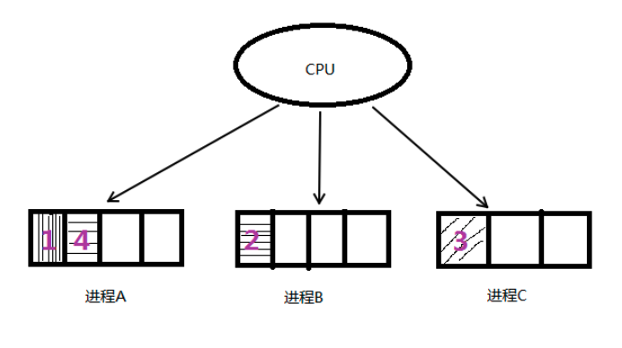

<center>分时复用 cpu</center>

### 单道程序设计

所有进程一个一个排对执行。若 A 阻塞，B 只能等待，即使 CPU 处于空闲状态。而在人机交互时阻塞的出现是必然的。所有这种模型在系统资源利用上及其不合理，在计算机发展历史上存在不久，大部分便被淘汰了。


### 多道程序设计

在计算机内存中同时存放几道相互独立的程序，它们在管理程序控制之下，相互穿插的运行。多道程序设计必须有硬件基础作为保证。

时钟中断即为多道程序设计模型的理论基础，并发时，任意进程在执行期间都不希望放弃 cpu。因此系统需要一种强制让进程让出 cpu 资源的手段。时钟中断有硬件基础作为保障，对进程而言不可抗拒。 操作系统中的中断处理函数，来负责调度程序执行。

在多道程序设计模型中，多个进程轮流使用 CPU (分时复用 CPU 资源)，而当下常见 CPU 为纳秒级，1 秒可以执行大约 10 亿条指令。由于人眼的反应速度是毫秒级，所以看似同时在运行。

1s = 1000ms, 1ms = 1000us, 1us = 1000ns 1000000000 实质上，并发是宏观并行，微观串行! -----推动了计算机蓬勃发展，将人类

引入了多媒体时代。


### CPU 和 MMU

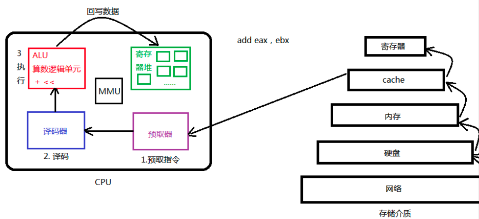

<center>中央处理器(CPU)</center>

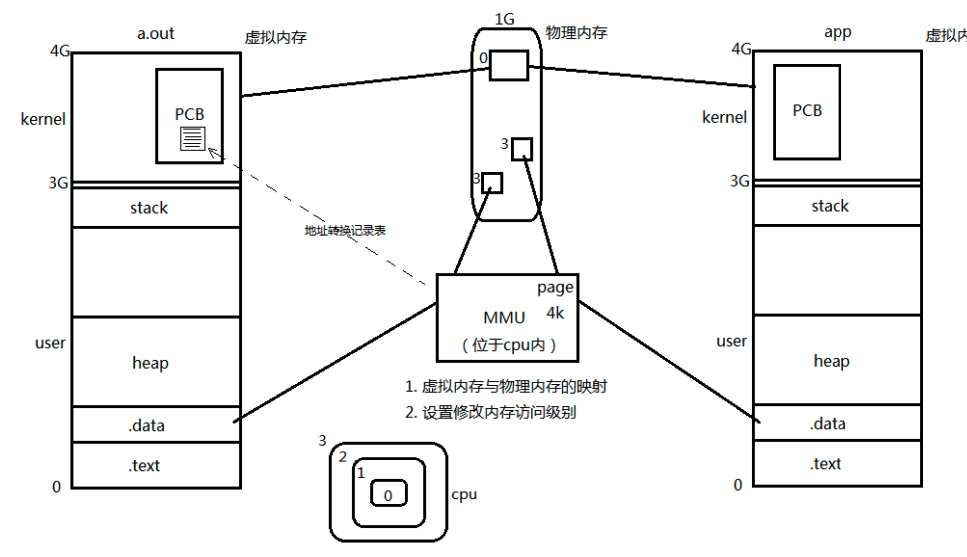

<center>内存管理单元 MMU</center>


### 进程控制块 PCB

我们知道，每个进程在内核中都有一个进程控制块(PCB)来维护进程相关的信息，Linux 内核的进程控制块是 task_struct 结构体。 

/usr/src/linux-headers-3.16.0-30/include/linux/sched.h 文件中可以查看 struct task_struct 结构体定义。其内部成员有很多，我们重点掌握以下部分即可:

- 进程 id。系统中每个进程有唯一的 id，在 C 语言中用 pid_t 类型表示，其实就是一个 非负整数。
- 进程的状态，有就绪、运行、挂起、停止等状态。 
- 进程切换时需要保存和恢复的一些 CPU 寄存器。 
- 描述虚拟地址空间的信息。
- 描述控制终端的信息。
- 当前工作目录(Current Working Directory)。
- umask 掩码。
- 文件描述符表，包含很多指向 file 结构体的指针。 
- 和信号相关的信息。
- 用户id和组id。
- 会话(Session)和进程组。
- 进程可以使用的资源上限(Resource Limit)。


### 进程状态

进程基本的状态有 5 种。分别为初始态，就绪态，运行态，挂起态与终止态。其中初始态为进程准备阶段，常与就绪态结合来看。

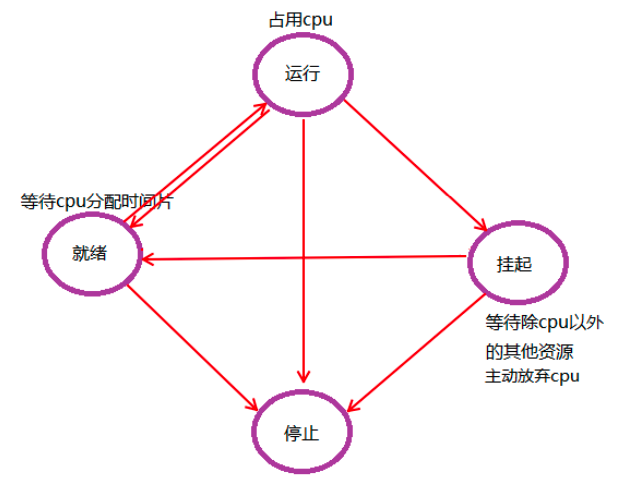

### 环境变量

环境变量，是指在操作系统中用来指定操作系统运行环境的一些参数。通常具备以下特征:

1. 字符串(本质) 
2. 有统一的格式:名=值[:值] 
3. 值用来描述进程环境信息。

存储形式：与命令行参数类似。char *[]数组，数组名 environ，内部存储字符串，NULL 作为哨兵结尾。

使用形式：与命令行参数类似。 

加载位置：与命令行参数类似。位于用户区，高于 stack 的起始位置。 

引入环境变量表：须声明环境变量。extern char ** environ;


**常见环境变量**

按照惯例，环境变量字符串都是 name=value 这样的形式，大多数 name 由大写字母加下划线组成，一般把 name 的部分叫做环境变量，value 的部分则是环境变量的值。环境变量定义了进程的运行环境，一些比较重要的环境变量的含义如下：


**PATH**

可执行文件的搜索路径。ls 命令也是一个程序，执行它不需要提供完整的路径名/bin/ls， 然而通常我们执行当前目录下的程序 a.out 却需要提供完整的路径名./a.out，这是因为 PATH 环境变量的值里面包含了 ls 命令所在的目录/bin，却不包含 a.out 所在的目录。PATH 环境变量的值可以包含多个目录，用：号隔开。在 Shell 中用 echo 命令可以查看这个环境变量的值:

```shell
$ echo $PATH
```

**SHELL**

当前 Shell，它的值通常是/bin/bash。 

**TERM**

当前终端类型，在图形界面终端下它的值通常是 xterm，终端类型决定了一些程序的输出显示方式，比如图形界面终端可以显示汉字，而字符终端一般不行。

**LANG**

语言和 locale，决定了字符编码以及时间、货币等信息的显示格式。

**HOME**

当前用户主目录的路径，很多程序需要在主目录下保存配置文件，使得每个用户在运行该程序时都有自己的一套配置。


**getenv 函数** 

获取环境变量值

`char *getenv(const char *name); `

成功：返回环境变量的值；失败：NULL (name 不存在)


**setenv 函数**

设置环境变量的值

`int setenv(const char *name, const char *value, int overwrite);`

成功：0；失败：-1

参数overwrite取值：

1：覆盖原环境变量

0：不覆盖。(该参数常用于设置新环境变量，如:ABC = haha-day-night)


**unsetenv 函数**

删除环境变量 name 的定义

`intunsetenv(constchar*name); `

成功：0；失败：-1
注意事项：name 不存在仍返回 0(成功)，当 name 命名为"ABC="时则会出错。


## 进程控制

### fork

创建一个子进程。

`pid_t fork(void); `

失败返回：-1；

成功返回：1；

- 父进程返回子进程的 ID(非负) 
- 子进程返回 0

pid_t 类型表示进程 ID，但为了表示-1，它是有符号整型。(0 不是有效进程 ID，init 最小，为 1)

注意返回值，不是 fork 函数能返回两个值，而是 fork 后，fork 函数变为两个，父子需【各自】返回一个。

`fork.c`

```c
#include <stdio.h>
#include <stdlib.h>
#include <string.h>
#include <unistd.h>
#include <pthread.h>

int main(int argc, char *argv[])
{
    printf("before fork-1-\n");     // 在fork之前打印,父进程执行,只执行一次
    printf("before fork-2-\n");
    printf("before fork-3-\n");
    printf("before fork-4-\n");

    pid_t pid = fork();             // 创建子进程
    if (pid == -1) {
        perror("fork error");
        exit(1);

    } else if (pid == 0) {          // 子进程
        
        printf("---child is created\n");

    } else if (pid > 0) {           // 父进程

        printf("---parent process: my child is %d\n", pid);
    }
    
    printf("===================end of file\n");  // 父子进程各自执行一次.

    return 0;
}
```


**循环创建 n 个子进程**

一次 fork 函数调用可以创建一个子进程。那么创建 N 个子进程应该怎样实现呢?

简单想，for(i = 0; i < n; i++) { fork() } 即可。但这样创建的是 N 个子进程吗?


<center>循环创建 N 个子进程</center>

从上图我们可以很清晰的看到，当 n 为 3 时候，循环创建了(2^n)-1 个子进程，而不是 N 的子进程。需要在循环的过程，保证子进程不再执行 fork ，因此当(fork() == 0)时，子进程应该立即 break;才正确。

`loop_fork.c` 通过命令行参数指定创建进程的个数，每个进程休眠 1S 打印自己是第几个被创 建的进程。如:第 1 个子进程休眠 0 秒打印:“我是第 1 个子进程”;第 2 个进程休眠 1 秒打 印:“我是第 2 个子进程”;第 3 个进程休眠 2 秒打印:“我是第 3 个子进程”。

```c
#include <stdio.h>
#include <stdlib.h>
#include <string.h>
#include <unistd.h>
#include <pthread.h>

int main(int argc, char *argv[])
{
    int i;
    pid_t pid;

    for (i = 0; i < 5; i++) {       
        if (fork() == 0)        // 循环期间, 子进程不 fork
            break;
    }
    if (5 == i) {       // 父进程, 从 表达式 2 跳出
        sleep(5);
        printf("I'm parent \n");
    } else {            // 子进程, 从 break 跳出
        sleep(i);
        printf("I'm %dth child\n", i+1);
    }

    return 0;
}
```

### getpid 

获取当前进程 ID

`pid_t getpid(void);`

### getppid

获取当前进程的父进程 ID

`pid_t getppid(void);`

区分一个函数是“系统函数”还是“库函数”依据:

- 是否访问内核数据结构
- 是否访问外部硬件资源 

二者有任一 > 系统函数;

二者均无 > 库函数


### getuid

获取当前进程实际用户 ID 

`uid_t getuid(void); `

获取当前进程有效用户 ID

`uid_t geteuid(void);`

https://www.cnblogs.com/kunhu/p/3699883.html

### getgid

获取当前进程使用用户组 ID 

`gid_t getgid(void);`

获取当前进程有效用户组 ID 

`gid_t getegid(void);`

### 进程共享

父子进程之间在 fork 后。有哪些相同，那些相异之处呢?

刚 fork 之后:

父子相同处：全局变量、.data、.text、栈、堆、环境变量、用户 ID、宿主目录、进程工作目录、信号处理方式...

父子不同处：1.进程 ID 2.fork 返回值 3.父进程 ID 4.进程运行时间 5.闹钟(定 时器) 6.未决信号集

似乎，子进程复制了父进程 0-3G 用户空间内容，以及父进程的 PCB，但 pid 不同。真 的每 fork 一个子进程都要将父进程的 0-3G 地址空间完全拷贝一份，然后在映射至物理内存吗?

当然不是！父子进程间遵循**读时共享写时复制**的原则。这样设计，无论子进程执行父进程的逻辑还是执行自己的逻辑都能节省内存开销。

父子进程是否共享全局变量，`fork_shared.c`

```c
#include <stdio.h>
#include <stdlib.h>
#include <unistd.h>

int var = 100;      //全局变量

int main(void)
{
    pid_t pid;

    pid = fork(); // 创建一个子进程

    if (pid == -1) {
        perror("fork error");
        exit(1);

    } else if (pid > 0) {       // 父进程
        var = 288;              // 写操作,复制var
        printf("parent, var = %d\n", var);
        printf("I'am parent pid= %d, getppid = %d\n", getpid(), getppid());

    } else if (pid == 0) {
//        var = 200;            // 子进程写操作,复制var
        printf("I'am child pid= %d, ppid = %d\n", getpid(), getppid());
        printf("child, var = %d\n", var);       // 读操作,共享
    }

    printf("------------finish---------------\n");

    return 0;
}
```

### gdb 调试

使用 gdb 调试的时候，gdb 只能跟踪一个进程。可以在 fork 函数调用之前，通过指令设置 gdb 调试工具跟踪父进程或者是跟踪子进程。默认跟踪父进程。

- set follow-fork-mode child 命令设置 gdb 在 fork 之后跟踪子进程。
- set follow-fork-mode parent 设置跟踪父进程。

注意，一定要在 fork 函数调用之前设置才有效。 `follow_fork.c`

```c
#include <stdio.h>
#include <stdlib.h>
#include <string.h>
#include <unistd.h>
#include <pthread.h>

int main(int argc, char *argv[])
{
    int i;
    pid_t pid;

    for (i = 0; i < 5; i++) {       
        if (fork() == 0)        // 循环期间, 子进程不 fork
            break;
    }
    if (5 == i) {       // 父进程, 从 表达式 2 跳出
        sleep(5);
        printf("I'm parent \n");
    } else {            // 子进程, 从 break 跳出
        sleep(i);
        printf("I'm %dth child\n", i+1);
    }

    return 0;
}
```

### exec 函数族

fork 创建子进程后执行的是和父进程相同的程序(但有可能执行不同的代码分支)，子进程往往要调用一种 exec 函数以执行另一个程序。当进程调用一种 exec 函数时，该进程的用户空间代码和数据完全被新程序替换，从新程序的启动例程开始执行。调用 exec 并不创建新进程，所以调用 exec 前后该进程的 id 并未改变。

将当前进程的.text、.data 替换为所要加载的程序的.text、.data，然后让进程从新的.text 第一条指令开始执行，但进程 ID 不变，换核不换壳。

其实有六种以 exec 开头的函数，统称 exec 函数:

-  int execl(const char *path, const char *arg, ...);
-  int execlp(const char *file, const char *arg, ...);
-  int execle(const char *path, const char *arg, ..., char *const envp[]); 
- int execv(const char *path, char *const argv[]);
- int execvp(const char *file, char *const argv[]);
- int execve(const char *path, char *const argv[], char *const envp[]);

#### execlp 函数

加载一个进程，借助 PATH 环境变量

`int execlp(const char *file, const char *arg, ...); `

成功：无返回；失败：-1

参数 1:要加载的程序的名字。该函数需要配合 PATH 环境变量来使用，当 PATH 中所有目录搜索后没有参数 1 则出错返回。

该函数通常用来调用系统程序。如:ls、date、cp、cat 等命令。

`execlp .c`

```c
#include <stdlib.h>
#include <unistd.h>
#include <stdio.h>

int main(int argc, char *argv[])
{
    printf("========================\n");    
    pid_t pid = fork();
    if (pid == 0) {
        execlp("ls", "ls", "-l", "-F", "-a", NULL);
        perror("execlp");
        exit(1);

    } else if (pid > 0) {
        sleep(1);
        printf("parent\n");
    }


    return 0;
}
```

#### execl 函数

加载一个进程， 通过路径+程序名来加载。

`int execl(const char *path, const char *arg, ...); `

成功：无返回；失败：-1

对比 execlp，如加载"ls"命令带有-l，-F 参数

execlp("ls", "ls", "-l", "-F", NULL); 使用程序名在 PATH 中搜索。 

execl("/bin/ls", "ls", "-l", "-F", NULL); 使用参数 1 给出的绝对路径搜索。

`execl.c`

```c
#include <stdio.h>
#include <unistd.h>

int main(void)
{
	execl("/bin", "./ls", "-l", "-a", NULL);

	return 0;
}
```

#### execvp 函数

加载一个进程，使用自定义环境变量 env

`int execvp(const char *file, const char *argv[]);`

变参形式: 1... 2 argv[] (main 函数也是变参函数，形式上等同于 int main(int argc, char *argv0, ...))

变参终止条件:1 NULL 结尾 2 固参指定

execvp 与 execlp 参数形式不同，原理一致。

```C
#include <stdlib.h>
#include <unistd.h>
#include <stdio.h>

int main(int argc, char *argv[])
{
    printf("========================\n");    
    pid_t pid = fork();
    if (pid == 0) {
        char *argv[] = {"ls", "-l", "-a"};
		execvp("ls", argv);
        perror("execlp");
        exit(1);

    } else if (pid > 0) {
        sleep(1);
        printf("parent\n");
    }


    return 0;
}
```


将当前系统中的进程信息，打印到文件中。 `exec_ps.c`

```c
#include <unistd.h>
#include <fcntl.h>
#include <stdio.h>
#include <stdlib.h>

int main(void)
{
	int fd;

	fd = open("ps.out", O_WRONLY|O_CREAT|O_TRUNC, 0644);
	if(fd < 0){
		perror("open ps.out error");
		exit(1);
	}

	dup2(fd, STDOUT_FILENO);

	execlp("ps", "ps", "ax", NULL);
  perror("execlp error");

	//close(fd);

	return 0;
}
```

#### exec 函数族一般规律

exec 函数一旦调用成功即执行新的程序，不返回。只有失败才返回，错误值**-1**。所以通常我们直接在 exec 函数调用后直接调用 perror()和 exit()，无需 if 判断。

| 函数            | 解释                                                         |
| --------------- | ------------------------------------------------------------ |
| l (list)        | 命令行参数列表                                               |
| p (path)        | 搜素 file 时使用 path 变量                                   |
| v (vector)      | 使用命令行参数数组                                           |
| e (environment) | 使用环境变量数组,不使用进程原有的环境变量，设置新加载程序运行的环境变量 |


事实上，只有 execve 是真正的系统调用，其它五个函数最终都调用 execve，所以 execve 在 man 手册第 2 节，其它函数在 man 手册第 3 节。这些函数之间的关系如下图所示。


## 回收子进程

### 孤儿进程

孤儿进程: 父进程先于子进程结束，则子进程成为孤儿进程，子进程的父进程成为 init 进程，称为 init 进程领养孤儿进程。

`orphan.c`

```c
#include <stdio.h>
#include <unistd.h>
#include <sys/wait.h>

int main(void)
{
    pid_t pid;
    pid = fork();

    if (pid == 0) {
        while (1) {
            printf("I am child, my parent pid = %d\n", getppid());
            sleep(1);
        }
    } else if (pid > 0) {
        printf("I am parent, my pid is = %d\n", getpid());
        sleep(9);
        printf("------------parent going to die------------\n");
    } else {
        perror("fork");
        return 1;
    }

    return 0;
}
```

### 僵尸进程

僵尸进程: 进程终止，父进程尚未回收，子进程残留资源(PCB)存放于内核中，变成 僵尸(Zombie)进程。

```c
#include <stdio.h>
#include <stdlib.h>
#include <unistd.h>
#include <sys/wait.h>

int main(void)
{
    pid_t pid;
    pid = fork();

    if (pid == 0) {
        printf("---child, pid=%d, parent= %d, going to sleep 15s\n", getpid(), getppid());
        sleep(15);
        printf("-------------child die--------------\n");
    } else if (pid > 0) {
        while (1) {
            printf("I am parent, pid = %d, myson = %d\n", getpid(), pid);
            sleep(1);
        }
    } else {
        perror("fork");
        return 1;
    }

    return 0;
}
```

特别注意，僵尸进程是不能使用 kill 命令清除掉的。因为 kill 命令只是用来终止进程的， 而僵尸进程已经终止。

思考!用什么办法可清除掉僵尸进程呢?

### wait 函数

一个进程在终止时会关闭所有文件描述符，释放在用户空间分配的内存，但它的 PCB 还保留着，内核在其中保存了一些信息:如果是正常终止则保存着退出状态，如果是异常终 止则保存着导致该进程终止的信号是哪个。这个进程的父进程可以调用 wait 或 waitpid 获取 这些信息，然后彻底清除掉这个进程。我们知道一个进程的退出状态可以在 Shell 中用特殊 变量$?查看，因为 Shell 是它的父进程，当它终止时 Shell 调用 wait 或 waitpid 得到它的退出 状态同时彻底清除掉这个进程。

父进程调用 wait 函数可以回收子进程终止信息。该函数有三个功能: 

- 阻塞等待子进程退出
- 回收子进程残留资源
- 获取子进程结束状态(退出原因)。

`pid_t wait(int *status);`

成功：清理掉的子进程 ID；失败：-1 (没有子进程)

当进程终止时，操作系统的隐式回收机制会:1.关闭所有文件描述符 2. 释放用户空间 分配的内存。内核的 PCB 仍存在。其中保存该进程的退出状态。(正常终止→退出值;异常 终止→终止信号)

```c
#include <unistd.h>
#include <stdlib.h>
#include <stdio.h>
#include <sys/wait.h>

int main(void)
{
	pid_t pid, wpid;

	pid = fork();

	if(pid == -1){
		perror("fork error");
		exit(1);
	} else if(pid == 0){		//son
		printf("I'm process child, pid = %d\n", getpid());
		sleep(7);				//困了...
	} else {
lable:
		wpid = wait(NULL);		//死等!!!
		if(wpid == -1){
			perror("wait error");
			goto lable;
		}
		printf("I'm parent, I catched child process,"
				"pid = %d\n", wpid);
	}

	return 0;
}
```


可使用 wait 函数传出参数 status 来保存进程的退出状态。借助宏函数来进一步判断进 程终止的具体原因。宏函数可分为如下三组:

1. WIFEXITED(status) 为非 0 → 进程正常结束

   WEXITSTATUS(status) 如上宏为真，使用此宏 → 获取进程退出状态 (exit 的参数) 

2. WIFSIGNALED(status) 为非 0 → 进程异常终止

   WTERMSIG(status) 如上宏为真，使用此宏 → 取得使进程终止的那个信号的编号。 

3. WIFSTOPPED(status) 为非 0 → 进程处于暂停状态

   WSTOPSIG(status) 如上宏为真，使用此宏 → 取得使进程暂停的那个信号的编号。 

   WIFCONTINUED(status) 为真 → 进程暂停后已经继续运行

```c
#include <unistd.h>
#include <stdlib.h>
#include <stdio.h>
#include <sys/wait.h>

int main(void)
{
	pid_t pid, wpid;
	int status;

	pid = fork();

	if(pid == -1){
		perror("fork error");
		exit(1);
	} else if(pid == 0){		//son
		printf("I'm process child, pid = %d\n", getpid());
#if 1
		execl("./abnor", "abnor", NULL);
		perror("execl error");
		exit(1);
#endif
		sleep(1);				
		exit(10);
	} else {
		//wpid = wait(NULL);	//传出参数
		wpid = wait(&status);	//传出参数

		if(WIFEXITED(status)){	//正常退出
			printf("I'm parent, The child process "
					"%d exit normally\n", wpid);
			printf("return value:%d\n", WEXITSTATUS(status));

		} else if (WIFSIGNALED(status)) {	//异常退出
			printf("The child process exit abnormally, "
					"killed by signal %d\n", WTERMSIG(status));
										//获取信号编号
		} else {
			printf("other...\n");
		}
	}

	return 0;
}
```

### waitpid 函数

作用同 wait，但可指定 pid 进程清理，可以不阻塞。

`pid_t waitpid(pid_t pid, int *status, in options);`

成功:返回清理掉的子进程 ID;失 败:-1(无子进程)

特殊参数和返回情况: 参数 pid:

**> 0** 回收指定 **ID** 的子进程
**-1** 回收任意子进程(相当于 **wait**)
0 回收和当前调用 waitpid 一个组的所有子进程 < -1 回收指定进程组内的任意子进程

返回 0:参 3 为 WNOHANG，且子进程正在运行。

注意:一次 **wait** 或 **waitpid** 调用只能清理一个子进程，清理多个子进程应使用循环。

```c
#include <unistd.h>
#include <stdlib.h>
#include <stdio.h>
#include <sys/wait.h>

int main(void)
{
	pid_t pid, pid2, wpid;
	int flg = 0;

	pid = fork();
	pid2 = fork();

	if(pid == -1){
		perror("fork error");
		exit(1);
	} else if(pid == 0){		//son
		printf("I'm process child, pid = %d\n", getpid());
		sleep(5);				
		exit(4);
	} else {					//parent
		do {
			wpid = waitpid(pid, NULL, WNOHANG);
            //wpid = wait(NULL);
			printf("---wpid = %d--------%d\n", wpid, flg++);
			if(wpid == 0){
				printf("NO child exited\n");
				sleep(1);		
			}
		} while (wpid == 0);		//子进程不可回收

		if(wpid == pid){		//回收了指定子进程
			printf("I'm parent, I catched child process,"
					"pid = %d\n", wpid);
		} else {
			printf("other...\n");
		}
	}

	return 0;
}
```

指定清理某一个子进程

```c
#include <stdio.h>
#include <unistd.h>
#include <stdlib.h>
#include <sys/wait.h>

int main(int argc, char *argv[])
{
	int i;				//默认创建5个子进程
    pid_t p, q;

	for(i = 0; i < 5; i++)	 {//出口1,父进程专用出口
    	p = fork();
		if(p == 0) {
			break;			//出口2,子进程出口,i不自增
     	} else if (i == 3){
       		q = p;
     	}
    }

	if(i == 5){
		sleep(5);
		printf("I am parent, pid = %d\n", getpid(), getgid());
        pid_t pid = waitpid(q, NULL, WNOHANG);
//        pid_t pid = wait(NULL);
        //printf("child pid = %d\n", pid);
        while(1);

	} else {
		sleep(i);
		printf("I'm %dth child, pid = %d, gpid=%d\n", 
				i+1, getpid(), getgid());
        //while(1);
	}

	return 0;
}
```


# 进程间通信

## IPC 方法

Linux 环境下，进程地址空间相互独立，每个进程各自有不同的用户地址空间。任何一个进程的全局变量在另一个进程中都看不到，所以进程和进程之间不能相互访问，要交换数据必须通过内核，在内核中开辟一块缓冲区， 进程 1 把数据从用户空间拷到内核缓冲区，进程 2 再从内核缓冲区把数据读走，内核提供的这种机制称为进程间通信(IPC，InterProcess Communication)。

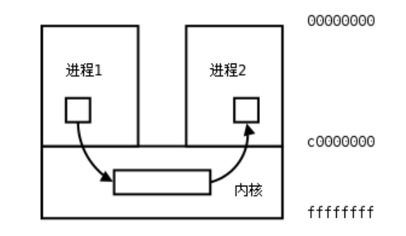

在进程间完成数据传递需要借助操作系统提供特殊的方法，如:文件、管道、信号、共享内存、消息队列、套接字、命名管道等。随着计算机的蓬勃发展，一些方法由于自身设计缺陷被淘汰或者弃用。现今常用的进程间通信方式有:

- 管道 (使用最简单)
- 信号 (开销最小)
- 共享映射区 (无血缘关系) 
- 本地套接字 (最稳定)

## 管道

### 管道的概念

管道是一种最基本的 IPC 机制，作用于有血缘关系的进程之间，完成数据传递。调用 pipe 系统函数即可创建一 个管道。有如下特质:

- 其本质是一个伪文件(实为内核缓冲区)
- 由两个文件描述符引用，一个表示读端，一个表示写端。
- 规定数据从管道的写端流入管道，从读端流出。

管道的原理：管道实为内核使用环形队列机制，借助内核缓冲区(4k)实现。 

管道的局限性：

- 数据不能进程自己写，自己读。
- 管道中数据不可反复读取。一旦读走，管道中不再存在。 
- 采用半双工通信方式，数据只能在单方向上流动。
- 只能在有公共祖先的进程间使用管道。

常见的通信方式有，单工通信、半双工通信、全双工通信。


### pipe 函数

创建管道

`int pipe(int pipefd[2]); `

成功：0；失败：-1，设置 errno

函数调用成功返回 r/w 两个文件描述符。无需 open，但需手动 close。规定:fd[0] → r; fd[1] → w，就像 0 对应标准输入，1 对应标准输出一样。向管道文件读写数据其实是在读写内核缓冲区。

管道创建成功以后，创建该管道的进程(父进程)同时掌握着管道的读端和写端。如何实现父子进程间通信呢? 通常可以采用如下步骤:

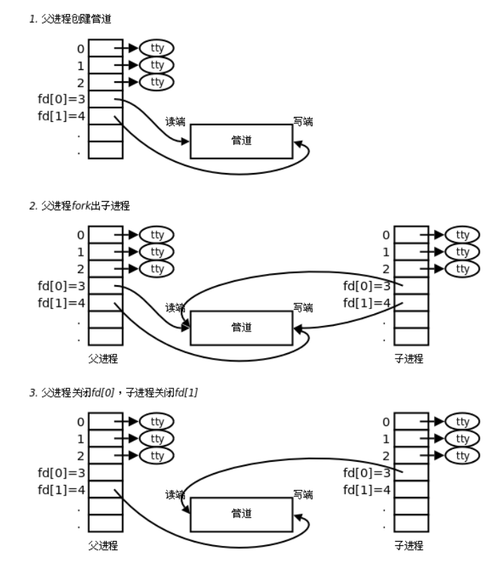

1. 父进程调用 pipe 函数创建管道，得到两个文件描述符 fd[0]、fd[1]指向管道的读端和写端。
2. 父进程调用 fork 创建子进程，那么子进程也有两个文件描述符指向同一管道。
3. 父进程关闭管道读端，子进程关闭管道写端。父进程可以向管道中写入数据，子进程将管道中的数据读出。 由于管道是利用环形队列实现的，数据从写端流入管道，从读端流出，这样就实现了进程间通信。

练习：父子进程使用管道通信，父写入字符串，子进程读出并，打印到屏幕。`pipe.c`

```c
#include <stdio.h>
#include <stdlib.h>
#include <string.h>
#include <unistd.h>
#include <errno.h>
#include <pthread.h>

void sys_err(const char *str)
{
	perror(str);
	exit(1);
}

int main(int argc, char *argv[])
{
    int ret;
    int fd[2];
    pid_t pid;

    char *str = "hello pipe\n";
    char buf[1024];

    ret = pipe(fd);
    if (ret == -1)
        sys_err("pipe error");

    pid = fork();
    if (pid > 0) {
        close(fd[0]);       // 关闭读端
        sleep(3);
        write(fd[1], str, strlen(str));
        close(fd[1]);
    } else if (pid == 0) {
        close(fd[1]);       // 子进程关闭写端
        ret = read(fd[0], buf, sizeof(buf));
        printf("child read ret = %d\n", ret);
        write(STDOUT_FILENO, buf, ret);
        close(fd[0]);
    }

	return 0;
}
```

### 管道的读写行为

使用管道需要注意以下 4 种特殊情况(假设都是阻塞 I/O 操作，没有设置 O_NONBLOCK 标志):
1. 如果所有指向管道写端的文件描述符都关闭了(管道写端引用计数为 0)，而仍然有进程从管道的读端读数据，那么管道中剩余的数据都被读取后，再次 read 会返回 0，就像读到文件末尾一样。
2. 如果有指向管道写端的文件描述符没关闭(管道写端引用计数大于 0)，而持有管道写端的进程也没有向管 道中写数据，这时有进程从管道读端读数据，那么管道中剩余的数据都被读取后，再次 read 会阻塞，直到管道中有 数据可读了才读取数据并返回。
3. 如果所有指向管道读端的文件描述符都关闭了(管道读端引用计数为 0)，这时有进程向管道的写端 write， 那么该进程会收到信号 SIGPIPE，通常会导致进程异常终止。当然也可以对 SIGPIPE 信号实施捕捉，不终止进程。具 体方法信号章节详细介绍。
4. 如果有指向管道读端的文件描述符没关闭(管道读端引用计数大于 0)，而持有管道读端的进程也没有从管 道中读数据，这时有进程向管道写端写数据，那么在管道被写满时再次 write 会阻塞，直到管道中有空位置了才写入数据并返回。

总结:

**读管道:** 

1. 管道中有数据，read 返回实际读到的字节数。

2. 管道中无数据:

(1) 管道写端被全部关闭，read 返回 0 (好像读到文件结尾)
(2) 写端没有全部被关闭，read 阻塞等待(不久的将来可能有数据递达，此时会让出 cpu)

**写管道:** 

1. 管道读端全部被关闭， 进程异常终止(也可使用捕捉 SIGPIPE 信号，使进程不终止) 

2. 管道读端没有全部关闭:

  (1) 管道已满，write 阻塞。
  (2) 管道未满，write 将数据写入，并返回实际写入的字节数。


练习：使用管道实现父子进程间通信，完成：ls | wc –l。假定父进程实现 ls，子进程实现 wc。`ls-wc-l.c`

```c
#include <stdio.h>
#include <stdlib.h>
#include <string.h>
#include <unistd.h>
#include <errno.h>
#include <pthread.h>

void sys_err(const char *str)
{
	perror(str);
	exit(1);
}
int main(int argc, char *argv[])
{
    int fd[2];
    int ret;
    pid_t pid;

    ret = pipe(fd);                 // 父进程先创建一个管道,持有管道的读端和写端
    if (ret == -1) {
        sys_err("pipe error");
    }

    pid = fork();                   // 子进程同样持有管道的读和写端
    if (pid == -1) {
        sys_err("fork error");
    } else if (pid > 0) {           // 父进程 读, 关闭写端
        close(fd[1]);
        dup2(fd[0], STDIN_FILENO);  // 重定向 stdin 到 管道的 读端
        execlp("wc", "wc", "-l", NULL);     // 执行 wc -l 程序
        sys_err("exclp wc error");
    } else if (pid == 0) {
        close(fd[0]);
        dup2(fd[1], STDOUT_FILENO);     // 重定向 stdout 到 管道写端
        execlp("ls", "ls", NULL);       // 子进程执行 ls 命令
        sys_err("exclp ls error");
    }

	return 0;
}
```


练习：使用管道实现兄弟进程间通信。 `pipe2.c`

```c
#include <stdio.h>
#include <unistd.h>
#include <sys/wait.h>

int main(void)
{
	pid_t pid;
	int fd[2], i;
	
	pipe(fd);

	for (i = 0; i < 2; i++) {
		if((pid = fork()) == 0) {
			break;
        }
    }

	if (i == 0) {			//兄
		close(fd[0]);				//写,关闭读端
		dup2(fd[1], STDOUT_FILENO);		
		execlp("ls", "ls", NULL);	
	} else if (i == 1) {	//弟
		close(fd[1]);				//读，关闭写端
		dup2(fd[0], STDIN_FILENO);		
		execlp("wc", "wc", "-l", NULL);		
	} else {
        close(fd[0]);
        close(fd[1]);
		for(i = 0; i < 2; i++)		//两个儿子wait两次
			wait(NULL);
	}

	return 0;
}
```


兄:ls 弟: wc -l 父:等待回收子进程。`pipe_brother.c`

```c
#include <stdio.h>
#include <stdlib.h>
#include <string.h>
#include <sys/wait.h>
#include <unistd.h>
#include <errno.h>
#include <pthread.h>

void sys_err(const char *str)
{
    perror(str);
    exit(1);
}
int main(int argc, char *argv[])
{
    int fd[2];
    int ret, i;
    pid_t pid;

    ret = pipe(fd);
    if (ret == -1) {
        sys_err("pipe error");
    }

    for(i = 0; i < 2; i++) {        // 表达式2 出口,仅限父进程使用
        pid = fork();
        if (pid == -1) {
            sys_err("fork error");
        } 
        if (pid == 0)               // 子进程,出口
            break;
    } 

   if (i == 2) {                    // 父进程 . 不参与管道使用. 
        close(fd[0]);               // 关闭管道的 读端/写端.
        close(fd[1]);

        wait(NULL);                 // 回收子进程
        wait(NULL);
    } else if (i == 0) {  // 兄
        close(fd[0]);
        dup2(fd[1], STDOUT_FILENO);     // 重定向stdout
        execlp("ls", "ls", NULL);
        sys_err("exclp ls error");
    } else if (i == 1) {            //弟
        close(fd[1]);
        dup2(fd[0], STDIN_FILENO);      // 重定向 stdin
        execlp("wc", "wc", "-l", NULL);
        sys_err("exclp wc error");
    }
    
    return 0;
}
```


一个读端多个写端，父进程读，两个子进程写 `pipe3.c`

```c
#include <stdio.h>
#include <unistd.h>
#include <sys/wait.h>
#include <string.h>
#include <stdlib.h>

int main(void)
{
	pid_t pid;
	int fd[2], i, n;
	char buf[1024];

	int ret = pipe(fd);
	if(ret == -1){
		perror("pipe error");
		exit(1);
	}

	for(i = 0; i < 2; i++){
		if((pid = fork()) == 0)
			break;
		else if(pid == -1){
			perror("pipe error");
			exit(1);
		}
	}

	if (i == 0) {			
		close(fd[0]);				
		write(fd[1], "1.hello\n", strlen("1.hello\n"));
	} else if(i == 1) {	
		close(fd[0]);				
		write(fd[1], "2.world\n", strlen("2.world\n"));
	} else {
		close(fd[1]);       //父进程关闭写端,留读端读取数据    
		sleep(1);
		n = read(fd[0], buf, 1024);     //从管道中读数据
		write(STDOUT_FILENO, buf, n);

		for(i = 0; i < 2; i++)		//两个儿子wait两次
			wait(NULL);
	}

	return 0;
}
```

### 管道缓冲区大小

可以使用 ulimit –a 命令来查看当前系统中创建管道文件所对应的内核缓冲区大小。通常为：

```
pipe size		 (512 bytes, -p) 8
```

也可以使用 fpathconf 函数，借助参数选项来查看。使用该宏应引入头文件<unistd.h> 

`long fpathconf(int fd, int name);` 

成功：返回管道的大小 ；失败：-1，设置 errno


### 管道的优劣

优点：简单，相比信号，套接字实现进程间通信，简单很多。 

缺点：

1. 只能单向通信，双向通信需建立两个管道。

2. 只能用于父子、兄弟进程(有共同祖先)间通信。该问题后来使用 fifo 有名管道解决。


### FIFO

FIFO 常被称为命名管道，以区分管道(pipe)。管道(pipe)只能用于“有血缘关系”的进程间。但通过 FIFO，不相关的进程也能交换数据。

FIFO 是 Linux 基础文件类型中的一种。但FIFO 文件在磁盘上没有数据块，仅仅用来标识内核中一条通道。各进程可以打开这个文件进行 read/write，实际上是在读写内核通道，这样就实现了进程间通信。

创建方式：

1. 命令：mkfifo 管道名

2. 库函数：`int mkfifo(const char *pathname, mode_t mode);` 成功：0； 失败：-1

一旦使用mkfifo创建了一个FIFO，就可以使用open打开它，常见的文件I/O函数都可用于fifo。如:close、read、 write、unlink 等。

写数据，`fifo_w.c`

```c
#include <stdio.h>
#include <unistd.h>
#include <sys/stat.h>
#include <sys/types.h>
#include <fcntl.h>
#include <stdlib.h>
#include <string.h>

void sys_err(char *str)
{
    perror(str);
    exit(-1);
}

int main(int argc, char *argv[])
{
    int fd, i;
    char buf[4096];

    if (argc < 2) {
        printf("Enter like this: ./a.out fifoname\n");
        return -1;
    }
    fd = open(argv[1], O_WRONLY);       //打开管道文件
    if (fd < 0) 
        sys_err("open");

    i = 0;
    while (1) {
        sprintf(buf, "hello jason %d\n", i++);

        write(fd, buf, strlen(buf));    // 向管道写数据
        sleep(1);
    }
    close(fd);

    return 0;
}
```

读数据，`fifo_r.c`

```c
#include <stdio.h>
#include <unistd.h>
#include <sys/stat.h>
#include <sys/types.h>
#include <fcntl.h>
#include <stdlib.h>
#include <string.h>

void sys_err(char *str)
{
    perror(str);
    exit(1);
}

int main(int argc, char *argv[])
{
    int fd, len;
    char buf[4096];

    if (argc < 2) {
        printf("./a.out fifoname\n");
        return -1;
    }
    //int fd = mkfifo("testfifo", 644);
    //open(fd, ...);
    fd = open(argv[1], O_RDONLY);   // 打开管道文件
    if (fd < 0) 
        sys_err("open");
    while (1) {
        len = read(fd, buf, sizeof(buf));   // 从管道的读端获取数据
        write(STDOUT_FILENO, buf, len);
        sleep(3);           //多個读端时应增加睡眠秒数,放大效果.
    }
    close(fd);

    return 0;
}
```


## 共享存储映射

### 文件进程间通信

使用文件也可以完成 IPC，理论依据是，fork 后，父子进程共享文件描述符，也就共享打开的文件。

父子进程共享打开的文件，借助文件进行进程间通信。`fork_share_fd.c`

```c
#include <stdio.h>
#include <unistd.h>
#include <string.h>
#include <stdlib.h>
#include <fcntl.h>
#include <sys/wait.h>


int main(void)
{
    int fd1, fd2; pid_t pid;
    char buf[1024];
    char *str = "---------test for shared fd in parent child process-----\n";

    pid = fork();
    if (pid < 0) {
        perror("fork error");
        exit(1);
    } else if (pid == 0) {
        fd1 = open("test.txt", O_RDWR);
        if (fd1 < 0) {
            perror("open error");
            exit(1);
        }
        sleep(3);
        write(fd1, str, strlen(str));
        printf("child wrote over...\n");

    } else {
        fd2 = open("test.txt", O_RDWR);
        if (fd2 < 0) {
            perror("open error");
            exit(1);
        }
//        sleep(1);                   //保证子进程写入数据

        int len = read(fd2, buf, sizeof(buf));
        printf("------parent read len = %d\n", len);
        len = write(STDOUT_FILENO, buf, len);
        printf("------parent write len = %d\n", len);

        wait(NULL);
    }

    return 0;
}
```


无血缘关系的进程打开同一个文件进行通信

将数据写入文件test.txt，`test1.c`

```c
#include <stdio.h>
#include <unistd.h>
#include <fcntl.h>
#include <stdlib.h>
#include <string.h>

#define N 5

int main(void)
{
    char buf[1024];
    char *str = "--------------secesuss-------------\n";
    int ret;

    int fd = open("test.txt", O_RDWR|O_TRUNC|O_CREAT, 0664);

    //直接打开文件写入数据
    write(fd, str, strlen(str));
    printf("test1 write into test.txt finish\n");

    sleep(N);

    lseek(fd, 0, SEEK_SET);
    ret = read(fd, buf, sizeof(buf));
    ret = write(STDOUT_FILENO, buf, ret);

    if (ret == -1) {
        perror("write second error");
        exit(1);
    }

    close(fd);

    return 0;
}
```

尝试读取另外一个进程写入文件的内容，`test2.c`

```c
#include <stdio.h>
#include <unistd.h>
#include <stdlib.h>
#include <fcntl.h>
#include <string.h>

int main(void)
{
    char buf[1024];
    char *str = "----------test2 write secesuss--------\n";
    int ret;

    sleep(2);   //睡眠2秒,保证test1将数据写入test.txt文件

    int fd = open("test.txt", O_RDWR);

    //尝试读取test.txt文件中test1写入的数据
    ret = read(fd, buf, sizeof(buf));   

    //将读到的数据打印至屏幕
    write(STDOUT_FILENO, buf, ret);

    //写入数据到文件test.txt中, 未修改读写位置
    write(fd, str, strlen(str));

    printf("test2 read/write finish\n");

    close(fd);

    return 0;
}
```


### 存储映射 I/O

存储映射 I/O (Memory-mapped I/O) 使一个磁盘文件与存储空间中的一个缓冲区相映射。于是当从缓冲区中取数据，就相当于读文件中的相应字节。与此类似，将数据存入缓冲区，则相应的字节就自动写入文件。这样，就可在不适用 read 和 write 函数的情况下，使用地址(指针)完成 I/O 操作。

使用这种方法，首先应通知内核，将一个指定文件映射到存储区域中，这个映射工作可以通过 mmap 函数来实现。

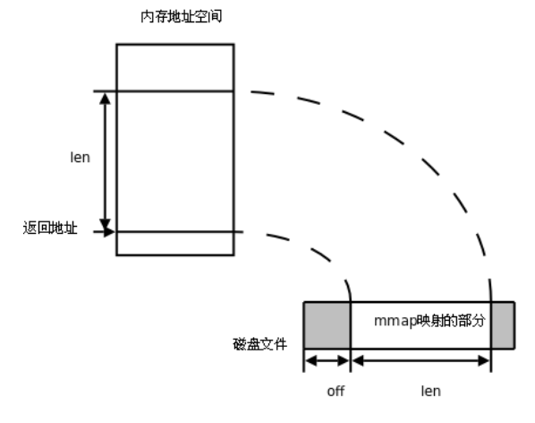

#### mmap 函数

`void *mmap(void *adrr, size_t length, int prot, int flags, int fd, off_t offset);`

返回：
成功：返回创建的映射区首地址；失败：MAP_FAILED 宏；

参数：

- addr：建立映射区的首地址，由 Linux 内核指定，使用时，直接传递 NULL 
- length： 要创建映射区的大小
- prot： 映射区权限 PROT_READ、PROT_WRITE、PROT_READ|PROT_WRITE 
- flags：标志位参数(常用于设定更新物理区域、设置共享、创建匿名映射区)
  - MAP_SHARED: 会将映射区所做的操作反映到物理设备(磁盘)上。
  - MAP_PRIVATE: 映射区所做的修改不会反映到物理设备。 
- fd：用来建立映射区的文件描述符
- offset：映射文件的偏移(4k 的整数倍)


#### munmap 函数

同 malloc 函数申请内存空间类似的，mmap 建立的映射区在使用结束后也应调用类似 free 的函数来释放。 

`int munmap(void *addr, size_t length);` 成功：0； 失败：-1

`mmap_w.c`

```c
#include <stdio.h>
#include <sys/stat.h>
#include <sys/types.h>
#include <fcntl.h>
#include <unistd.h>
#include <stdlib.h>
#include <sys/mman.h>
#include <string.h>

struct STU {
    int id;
    char name[20];
    char sex;
};

void sys_err(char *str)
{
    perror(str);
    exit(1);
}

int main(int argc, char *argv[])
{
    int fd;
    struct STU student = {10, "xiaoming", 'm'};
    char *mm;

    if (argc < 2) {
        printf("./a.out file_shared\n");
        exit(-1);
    }

    fd = open(argv[1], O_RDWR | O_CREAT, 0664);
    ftruncate(fd, sizeof(student));

    mm = mmap(NULL, sizeof(student), PROT_READ|PROT_WRITE, MAP_SHARED, fd, 0);
    if (mm == MAP_FAILED)
        sys_err("mmap");

    close(fd);

    while (1) {
        memcpy(mm, &student, sizeof(student));
        student.id++;
        sleep(1);
    }

    munmap(mm, sizeof(student));

    return 0;
}
```

`mmap_r.c`

```c
#include <stdio.h>
#include <sys/stat.h>
#include <fcntl.h>
#include <unistd.h>
#include <stdlib.h>
#include <sys/mman.h>
#include <string.h>

struct STU {
    int id;
    char name[20];
    char sex;
};

void sys_err(char *str)
{
    perror(str);
    exit(-1);
}

int main(int argc, char *argv[])
{
    int fd;
    struct STU student;
    struct STU *mm;

    if (argc < 2) {
        printf("./a.out file_shared\n");
        exit(-1);
    }

    fd = open(argv[1], O_RDONLY);
    if (fd == -1)
        sys_err("open error");

    mm = mmap(NULL, sizeof(student), PROT_READ, MAP_SHARED, fd, 0);
    if (mm == MAP_FAILED)
        sys_err("mmap error");
    
    close(fd);

    while (1) {
        printf("id=%d\tname=%s\t%c\n", mm->id, mm->name, mm->sex);
        sleep(2);
    }
    munmap(mm, sizeof(student));

    return 0;
}
```

**mmap 注意事项**

思考:

1. 可以 open 的时候 O_CREAT 一个新文件来创建映射区吗?
2. 如果 open 时 O_RDONLY，mmap 时 PROT 参数指定 PROT_READ|PROT_WRITE 会怎样? 
3. 文件描述符先关闭，对 mmap 映射有没有影响?
4. 如果文件偏移量为 1000 会怎样?
5. 对 mem 越界操作会怎样?
6. 如果 mem++，munmap 可否成功?
7. mmap 什么情况下会调用失败?
8. 如果不检测 mmap 的返回值，会怎样?


```c
#include <stdio.h>
#include <string.h>
#include <sys/stat.h>
#include <fcntl.h>
#include <unistd.h>
#include <stdlib.h>
#include <sys/mman.h>

void sys_err(char *str)
{
    perror(str);
    exit(1);
}

int main(void)
{
    char *mem;

//    int fd = open("hello244", O_RDONLY|O_CREAT|O_TRUNC, 0644);
    int fd = open("dict.txt", O_RDWR);
    if (fd < 0)
        sys_err("open error");
/*
    len = lseek(fd, 3, SEEK_SET);   //获取文件大小,根据文件大小创建映射区
    write(fd, "e", 1);              //实质性完成文件拓展
    printf("The length of file = %d\n", len);
*/
    mem = mmap(NULL, 40960, PROT_READ|PROT_WRITE, MAP_SHARED, fd, 8192);
    if (mem == MAP_FAILED)            //出错判断
        sys_err("mmap err: ");
    
    close(fd);

    strcpy(mem, "xxx");
    printf("%s\n", mem);

    if (munmap(mem,  4) < 0)
        sys_err("munmap");

    return 0;
}
```


总结，使用 **mmap** 时务必注意以下事项:

1. 创建映射区的过程中，隐含着一次对映射文件的读操作。

2. 当 MAP_SHARED 时，要求：映射区的权限应 <= 文件打开的权限(出于对映射区的保护)。而 MAP_PRIVATE 则无所谓，因为 mmap 中的权限是对内存的限制。
3. 映射区的释放与文件关闭无关。只要映射建立成功，文件可以立即关闭。
4. 特别注意，当映射文件大小为 0 时，不能创建映射区。所以：用于映射的文件必须要有实际大小!! mmap 使用时常常会出现总线错误，通常是由于共享文件存储空间大小引起的。如，400 字节大小的文件，在建立映射区时 offset 4096 字节，则会报出总线错。

5. munmap 传入的地址一定是 mmap 的返回地址。坚决杜绝指针++操作。
6. 文件偏移量必须为 4K 的整数倍
7. mmap 创建映射区出错概率非常高，一定要检查返回值，确保映射区建立成功再进行后续操作。


#### mmap 父子进程通信

父子等有血缘关系的进程之间也可以通过 mmap 建立的映射区来完成数据通信。但相应的要在创建映射区的时候指定对应的标志位参数 flags：

MAP_PRIVATE: (私有映射) 父子进程各自独占映射区；

MAP_SHARED: (共享映射) 父子进程共享映射区；


练习：父进程创建映射区，然后 fork 子进程，子进程修改映射区内容，而后，父进程读取映射区内容，查验是否共享。`fork_mmap.c`

```c
#include <stdio.h>
#include <stdlib.h>
#include <unistd.h>
#include <fcntl.h>
#include <sys/mman.h>
#include <sys/wait.h>

int var = 100;

int main(void)
{
    int *p;
    pid_t pid;

    int fd;
    fd = open("temp", O_RDWR|O_CREAT|O_TRUNC, 0644);
    if(fd < 0){
        perror("open error");
        exit(1);
    }
    ftruncate(fd, 4);

    //p = (int *)mmap(NULL, 4, PROT_READ|PROT_WRITE, MAP_SHARED, fd, 0);
    p = (int *)mmap(NULL, 4, PROT_READ|PROT_WRITE, MAP_PRIVATE, fd, 0);
    if(p == MAP_FAILED){		//注意:不是p == NULL
        perror("mmap error");
        exit(1);
    }
    close(fd);					//映射区建立完毕,即可关闭文件

    pid = fork();				//创建子进程
    if(pid == 0){
       *p = 7000;               // 写共享内存
        var = 1000;
        printf("child, *p = %d, var = %d\n", *p, var);
    } else {
        sleep(1);
        printf("parent, *p = %d, var = %d\n", *p, var);     // 读共享内存
        wait(NULL);

        int ret = munmap(p, 4);				//释放映射区
        if (ret == -1) {
            perror("munmap error");
            exit(1);
        }
    }

    return 0;
}
```


#### mmap 无血缘关系进程间通信

实质上 mmap 是内核借助文件帮我们创建了一个映射区，多个进程之间利用该映射区完成数据传递。由于内核空间多进程共享，因此无血缘关系的进程间也可以使用 mmap 来完成通信，只要设置相应的标志位参数 flags 即可。

若想实现共享，当然应该使用 MAP_SHARED 了。值得注意的是：MAP_ANON 和 /dev/zero 都不能应用于非血缘关系进程间通信。只能用于亲子进程间。


#### 匿名映射

通过使用我们发现，使用映射区来完成文件读写操作十分方便，父子进程间通信也较容易。但缺陷是，每次创建映射区一定要依赖一个文件才能实现。通常为了建立映射区要 open 一个 temp 文件，创建好了再 unlink、close 掉，比较麻烦。 可以直接使用匿名映射来代替。其实 Linux 系统给我们提供了创建匿名映射区的方法，无需依赖一个文件即可创建映射区。同样需要借助标志位参数 flags 来指定。

使用 MAP_ANONYMOUS (或 MAP_ANON)， 如:

`int *p = mmap(NULL, 4, PROT_READ|PROT_WRITE, MAP_SHARED|MAP_ANONYMOUS, -1, 0); `

"4"随意举例，该位置表大小，可依实际需要填写。

`fork_map_anon_linux.c`

```c
#include <stdio.h>
#include <stdlib.h>
#include <unistd.h>
#include <fcntl.h>
#include <sys/mman.h>

int main(void)
{
	int *p;
	pid_t pid;
	
	p = mmap(NULL, 4, PROT_READ|PROT_WRITE, MAP_SHARED | MAP_ANON, -1, 0);  //MAP_ANONYMOUS
	if(p == MAP_FAILED){		//注意:不是p == NULL
		perror("mmap error");
		exit(1);
	}

	pid = fork();				//创建子进程
	if(pid == 0){
		*p = 2000;
		printf("child, *p = %d\n", *p);
	} else {
		sleep(1);
		printf("parent, *p = %d\n", *p);
	}

	munmap(p, 4);				//释放映射区

	return 0;
}
```

需注意的是，MAP_ANONYMOUS 和 MAP_ANON 这两个宏是 Linux 操作系统特有的宏。在类 Unix 系统中如无该宏定义，可使用如下两步来完成匿名映射区的建立。

- `fd = open("/dev/zero", O_RDWR);`
- `p = mmap(NULL, size, PROT_READ|PROT_WRITE, MMAP_SHARED, fd, 0);`

`fork_map_anon.c`

```c
#include <stdio.h>
#include <stdlib.h>
#include <unistd.h>
#include <fcntl.h>
#include <sys/mman.h>

int main(void)
{
	int *p;
	pid_t pid;
	
	int fd;
	fd = open("/dev/zero", O_RDWR);

	p = mmap(NULL, 400, PROT_READ|PROT_WRITE, MAP_PRIVATE, fd, 0);

	if(p == MAP_FAILED){		//注意:不是p == NULL
		perror("mmap error");
		exit(1);
	}

	pid = fork();				//创建子进程
	if(pid == 0){
		*p = 2000;
		printf("child, *p = %d\n", *p);
	} else {
		sleep(1);
		printf("parent, *p = %d\n", *p);
	}

	munmap(p, 4);				//释放映射区

	return 0;
}
```

## 信号的概念

信号在我们的生活中随处可见， 如：古代战争中摔杯为号；现代战争中的信号弹；体育比赛中使用的信号枪...... 他们都有共性：1. 简单 2. 不能携带大量信息 3. 满足某个特设条件才发送。

信号是信息的载体，Linux/UNIX 环境下，古老、经典的通信方式， 现下依然是主要的通信手段。
Unix 早期版本就提供了信号机制，但不可靠，信号可能丢失。Berkeley 和 AT&T 都对信号模型做了更改，增加了可靠信号机制。但彼此不兼容。POSIX.1 对可靠信号例程进行了标准化。


### 信号的机制

A 给 B 发送信号，B 收到信号之前执行自己的代码，收到信号后，不管执行到程序的什么位置，都要暂停运行， 去处理信号，处理完毕再继续执行。与硬件中断类似——异步模式。但信号是软件层面上实现的中断，早期常被称为“软中断”。

信号的特质：由于信号是通过软件方法实现，其实现手段导致信号有很强的延时性。但对于用户来说，这个延迟时间非常短，不易察觉。

每个进程收到的所有信号，都是由内核负责发送的，内核处理。


### 与信号相关的事件和状态

**产生信号:**

1. 按键产生，如:Ctrl+c、Ctrl+z、Ctrl+\
2. 系统调用产生，如:kill、raise、abort
3. 软件条件产生，如:定时器 alarm
4. 硬件异常产生，如:非法访问内存(段错误)、除 0(浮点数例外)、内存对齐出错(总线错误) 
5. 命令产生，如:kill 命令

**递达：**递送并且到达进程。 

**未决：**产生和递达之间的状态。主要由于阻塞(屏蔽)导致该状态。

**信号的处理方式：**

1. 执行默认动作
2. 忽略(丢弃)
3. 捕捉(调用户处理函数)

Linux 内核的进程控制块 PCB 是一个结构体，task_struct, 除了包含进程 id，状态，工作目录，用户 id，组 id， 文件描述符表，还包含了信号相关的信息，主要指阻塞信号集和未决信号集。

**阻塞信号集(信号屏蔽字)：**将某些信号加入集合，对他们设置屏蔽，当屏蔽 x 信号后，再收到该信号，该信号的处理将推后(解除屏蔽后)

**未决信号集：**

1. 信号产生，未决信号集中描述该信号的位立刻翻转为 1，表信号处于未决状态。当信号被处理对应位翻转回为 0。这一时刻往往非常短暂。
2. 信号产生后由于某些原因(主要是阻塞)不能抵达。这类信号的集合称之为未决信号集。在屏蔽解除前， 信号一直处于未决状态。


### 信号的编号

可以使用 kill –l 命令查看当前系统可使用的信号有哪些。

```
 1) SIGHUP       2) SIGINT       3) SIGQUIT      4) SIGILL       5) SIGTRAP
 6) SIGABRT      7) SIGBUS       8) SIGFPE       9) SIGKILL     10) SIGUSR1
11) SIGSEGV     12) SIGUSR2     13) SIGPIPE     14) SIGALRM     15) SIGTERM
16) SIGSTKFLT   17) SIGCHLD     18) SIGCONT     19) SIGSTOP     20) SIGTSTP
21) SIGTTIN     22) SIGTTOU     23) SIGURG      24) SIGXCPU     25) SIGXFSZ
26) SIGVTALRM   27) SIGPROF     28) SIGWINCH    29) SIGIO       30) SIGPWR
31) SIGSYS      34) SIGRTMIN    35) SIGRTMIN+1  36) SIGRTMIN+2  37) SIGRTMIN+3
38) SIGRTMIN+4  39) SIGRTMIN+5  40) SIGRTMIN+6  41) SIGRTMIN+7  42) SIGRTMIN+8
43) SIGRTMIN+9  44) SIGRTMIN+10 45) SIGRTMIN+11 46) SIGRTMIN+12 47) SIGRTMIN+13
48) SIGRTMIN+14 49) SIGRTMIN+15 50) SIGRTMAX-14 51) SIGRTMAX-13 52) SIGRTMAX-12
53) SIGRTMAX-11 54) SIGRTMAX-10 55) SIGRTMAX-9  56) SIGRTMAX-8  57) SIGRTMAX-7
58) SIGRTMAX-6  59) SIGRTMAX-5  60) SIGRTMAX-4  61) SIGRTMAX-3  62) SIGRTMAX-2
63) SIGRTMAX-1  64) SIGRTMAX
```

不存在编号为 0 的信号。其中 1-31 号信号称之为常规信号(也叫普通信号或标准信号)，34-64 称之为实时信 号，驱动编程与硬件相关。名字上区别不大。而前 32 个名字各不相同。


### 信号4要素

与变量三要素类似的，每个信号也有其必备 4 要素，分别是: 1. 编号 2. 名称 3. 事件 4. 默认处理动作
可通过 man 7 signal 查看帮助文档获取。也可查看/usr/src/linux-headers-3.16.0-30/arch/s390/include/uapi/asm/signal.h

```
Signal     Value     Action   Comment
──────────────────────────────────────────────────────────────────────
SIGHUP        1       Term    Hangup detected on controlling terminal or death of controlling process
SIGINT        2       Term    Interrupt from keyboard
SIGQUIT       3       Core    Quit from keyboard
SIGILL        4       Core    Illegal Instruction
SIGABRT       6       Core    Abort signal from abort(3)
SIGFPE        8       Core    Floating point exception
SIGKILL       9       Term    Kill signal
SIGSEGV      11       Core    Invalid memory reference
SIGPIPE      13       Term    Broken pipe: write to pipe with no readers
SIGALRM      14       Term    Timer signal from alarm(2)
SIGTERM      15       Term    Termination signal
SIGUSR1   30,10,16    Term    User-defined signal 1
SIGUSR2   31,12,17    Term    User-defined signal 2
SIGCHLD   20,17,18    Ign     Child stopped or terminated
SIGCONT   19,18,25    Cont    Continue if stopped
SIGSTOP   17,19,23    Stop    Stop process
SIGTSTP   18,20,24    Stop    Stop typed at terminal
SIGTTIN   21,21,26    Stop    Terminal input for background process
SIGTTOU   22,22,27    Stop    Terminal output for background process

The signals SIGKILL and SIGSTOP cannot be caught, blocked, or ignored.
```

在标准信号中，有一些信号是有三个“Value”，第一个值通常对 alpha 和 sparc 架构有效，中间值针对 x86、arm 和其他架构，最后一个应用于 mips 架构。一个‘-’表示在对应架构上尚未定义该信号。

不同的操作系统定义了不同的系统信号。因此有些信号出现在 Unix 系统内，也出现在 Linux 中，而有的信号出 现在 FreeBSD 或 Mac OS 中却没有出现在 Linux 下。这里我们只研究 Linux 系统中的信号。

默认动作：

- Term：终止进程
- Ign：忽略信号 (默认即时对该种信号忽略操作)
- Core：终止进程，生成 Core 文件。(查验进程死亡原因， 用于 gdb 调试) 
- Stop：停止(暂停)进程
- Cont：继续运行进程

注意从 man 7 signal 帮助文档中可看到 : The signals SIGKILL and SIGSTOP cannot be caught, blocked, or ignored. 这里特别强调了 9) SIGKILL 和 19) SIGSTOP 信号，不允许忽略和捕捉，只能执行默认动作。甚至不能将其设置为阻塞。

另外需清楚，只有每个信号所对应的事件发生了，该信号才会被递送(但不一定递达)，不应乱发信号!

### Linux 常规信号一览表

1) SIGHUP： 当用户退出 shell 时，由该 shell 启动的所有进程将收到这个信号，默认动作为终止进程
2) SIGINT：当用户按下了<Ctrl+C>组合键时，用户终端向正在运行中的由该终端启动的程序发出此信号。默认动 作为终止进程。
3) SIGQUIT：当用户按下<ctrl+\\>组合键时产生该信号，用户终端向正在运行中的由该终端启动的程序发出信号。默认动作为终止进程。
4) SIGILL：CPU 检测到某进程执行了非法指令。默认动作为终止进程并产生 core 文件
5) SIGTRAP：该信号由断点指令或其他 trap 指令产生。默认动作为终止里程 并产生 core 文件。
6) SIGABRT： 调用 abort 函数时产生该信号。默认动作为终止进程并产生 core 文件。
7) SIGBUS：非法访问内存地址，包括内存对齐出错，默认动作为终止进程并产生 core 文件。
8) SIGFPE：在发生致命的运算错误时发出。不仅包括浮点运算错误，还包括溢出及除数为 0 等所有的算法错误。
    默认动作为终止进程并产生 core 文件。
9) SIGKILL：无条件终止进程。本信号不能被忽略，处理和阻塞。默认动作为终止进程。它向系统管理员提供了可以杀死任何进程的方法。
10) SIGUSE1：用户定义 的信号。即程序员可以在程序中定义并使用该信号。默认动作为终止进程。
11) SIGSEGV：指示进程进行了无效内存访问。默认动作为终止进程并产生 core 文件。
12) SIGUSR2：另外一个用户自定义信号，程序员可以在程序中定义并使用该信号。默认动作为终止进程。 
13) SIGPIPE：Broken pipe 向一个没有读端的管道写数据。默认动作为终止进程。

14) SIGALRM： 定时器超时，超时的时间 由系统调用 alarm 设置。默认动作为终止进程。
15) SIGTERM：程序结束信号，与SIGKILL不同的是，该信号可以被阻塞和终止。通常用来显示程序正常退出。 执行 shell 命令 Kill 时，缺省产生这个信号。默认动作为终止进程。
16) SIGSTKFLT：Linux 早期版本出现的信号，现仍保留向后兼容。默认动作为终止进程。
17) SIGCHLD：子进程状态发生变化时，父进程会收到这个信号。默认动作为忽略这个信号。
18) SIGCONT：如果进程已停止，则使其继续运行。默认动作为继续/忽略。
19) SIGSTOP：停止进程的执行。信号不能被忽略，处理和阻塞。默认动作为暂停进程。
20) SIGTSTP：停止终端交互进程的运行。按下<ctrl+z>组合键时发出这个信号。默认动作为暂停进程。
21) SIGTTIN：后台进程读终端控制台。默认动作为暂停进程。
22) SIGTTOU： 该信号类似于 SIGTTIN，在后台进程要向终端输出数据时发生。默认动作为暂停进程。
23) SIGURG：套接字上有紧急数据时，向当前正在运行的进程发出些信号，报告有紧急数据到达。如网络带外
数据到达，默认动作为忽略该信号。
24) SIGXCPU：进程执行时间超过了分配给该进程的 CPU 时间 ，系统产生该信号并发送给该进程。默认动作为
终止进程。
25) SIGXFSZ：超过文件的最大长度设置。默认动作为终止进程。
26) SIGVTALRM：虚拟时钟超时时产生该信号。类似于SIGALRM，但是该信号只计算该进程占用CPU的使用时
间。默认动作为终止进程。
27) SGIPROF：类似于 SIGVTALRM，它不公包括该进程占用 CPU 时间还包括执行系统调用时间。默认动作为终止
进程。
28) SIGWINCH：窗口变化大小时发出。默认动作为忽略该信号。
29) SIGIO：此信号向进程指示发出了一个异步 IO 事件。默认动作为忽略。
30) SIGPWR：关机。默认动作为终止进程。
31) SIGSYS：无效的系统调用。默认动作为终止进程并产生 core 文件。
34) SIGRTMIN ~ (64) SIGRTMAX：LINUX 的实时信号，它们没有固定的含义(可以由用户自定义)。所有的实时
信号的默认动作都为终止进程。

### 信号的产生

#### 终端按键产生信号

Ctrl + c → 2) SIGINT(终止/中断)	"INT" ----Interrupt

Ctrl + z → 20) SIGTSTP(暂停/停止) "T" ----Terminal 终端。

Ctrl + \ → 3) SIGQUIT(退出)

#### 硬件异常产生信号

除 0 操作 → 8) SIGFPE (浮点数例外) 

非法访问内存 → 11) SIGSEGV (段错误) 

总线错误 → 7) SIGBUS

#### kill 函数/命令产生信号

kill 命令产生信号:kill -SIGKILL pid

kill 函数：给指定进程发送指定信号(不一定杀死)

`int kill(pid_t pid, int sig); `

成功：0；失败：-1 (ID 非法，信号非法，普通用户杀 init 进程等权级问题)，设置 errno 

sig：不推荐直接使用数字，应使用宏名，因为不同操作系统信号编号可能不同，但名称一致。

- pid > 0：发送信号给指定的进程。
- pid = 0：发送信号给 与调用 kill 函数进程属于同一进程组的所有进程。 
- pid < 0：取|pid|发给对应进程组。
- pid = -1：发送给进程有权限发送的系统中所有进程。

进程组：每个进程都属于一个进程组，进程组是一个或多个进程集合，他们相互关联，共同完成一个实体任务，
每个进程组都有一个进程组长，默认进程组 ID 与进程组长 ID 相同。

权限保护：super 用户(root)可以发送信号给任意用户，普通用户是不能向系统用户发送信号的。 kill -9 (root 用 户的 pid) 是不可以的。同样，普通用户也不能向其他普通用户发送信号，终止其进程。 只能向自己创建的进程发 送信号。普通用户基本规则是:发送者实际或有效用户 ID == 接收者实际或有效用户 ID

练习：循环创建 5 个子进程，父进程用 kill 函数终止任一子进程。 `kill.c`

```c
#include <stdio.h>
#include <unistd.h>
#include <stdlib.h>
#include <signal.h>

#define N 5

int main(void)
{
    int i;
    pid_t pid, q;

    for (i = 0; i < N; i++) {
        pid = fork();
        if (pid == 0)
            break;
        if (i == 2)
            q = pid;
    }
    if (i < 5) {            //子进程
        while(1) {
            printf("I'm child %d, getpid = %u\n", i, getpid());
            sleep(1);
        }

    } else {                //父进程
        sleep(3);
        kill(q, SIGKILL);
        printf("------------kill %d child %u finish\n", 2, q);
        while (1);
    }

    return 0;
}


#if 0
int main(void)
{
	int i;				//默认创建5个子进程

	for(i = 0; i < N; i++)	//出口1,父进程专用出口
		if(fork() == 0)
			break;			//出口2,子进程出口,i不自增

    if (i == 3) {
        sleep(1);
        printf("-----------child ---pid = %d, ppid = %d\n", getpid(), getppid());
        kill(getppid(), SIGKILL);

    } else if (i == N) {
        printf("I am parent, pid = %d\n", getpid());
        while(1);
    }

	return 0;
}
#endif 
```

#### 软件条件产生信号

##### alarm 函数

设置定时器(闹钟)。在指定 seconds 后，内核会给当前进程发送 14)SIGALRM 信号。进程收到该信号，默认动作终止。

每个进程都有且只有唯一个定时器。

`unsigned int alarm(unsigned int seconds)；`

- alarm()函数的主要功能是设置信号传送闹钟，即用来设置信号SIGALRM在经过参数seconds秒数后发送给目前的进程。如果未设置信号SIGALARM的处理函数，那么alarm()默认处理终止进程。

- 如果在seconds秒内再次调用了alarm函数设置了新的闹钟，-则后面定时器的设置将覆盖前面的设置，即之前设置的秒数被新的闹钟时间取代；当参数seconds为0时，之前设置的定时器闹钟将被取消，并将剩下的时间返回。

定时，与进程状态无关(自然定时法)!就绪、运行、挂起(阻塞、暂停)、终止、僵尸...无论进程处于何种状态， alarm 都计时。

练习：编写程序，测试你使用的计算机 1 秒钟能数多少个数。 `alarm .c`

```c
#include <stdio.h>
#include <unistd.h>

int main(void)
{
	int i;
	alarm(1);

	for(i = 0; ; i++)
		printf("%d\n", i);

	return 0;
}
```

使用 time 命令查看程序执行的时间。 程序运行的瓶颈在于 IO，优化程序，首选优化 IO。 

实际执行时间 = 系统时间 + 用户时间 + 等待时间

##### setitimer 函数

设置定时器(闹钟)。 可代替 alarm 函数。精度微秒 us，可以实现周期定时。

`int setitimer(int which, const struct itimerval *new_value, struct itimerval *old_value); `

成功：0；失败：-1，设置errno
参数：which，指定定时方式

- 自然定时:ITIMER_REAL → 14)SIGLARM 计算自然时间
- 虚拟空间计时(用户空间):ITIMER_VIRTUAL → 26)SIGVTALRM 只计算进程占用 cpu 的时间
- 运行时计时(用户+内核):ITIMER_PROF → 27)SIGPROF 计算占用 cpu 及执行系统调用的时间

练习：使用 setitimer 函数实现 alarm 函数，重复计算机 1 秒数数程序。`setitimer_alarm.c`

```c
#include <stdio.h>
#include <stdlib.h>
#include <sys/time.h>

/* struct itimerval  {
        struct timeval{
            it_value.tv_sec;
            it_value.tv_usec;
        } it_interval;

        struct timeval {
            it_value.tv_sec;
            it_value.tv_usec;
        } it_value;

    } it, oldit;
*/

unsigned int my_alarm(unsigned int sec)
{
	struct itimerval it, oldit;
  int ret;

	it.it_value.tv_sec = sec;
	it.it_value.tv_usec = 0;
	it.it_interval.tv_sec = 0;
	it.it_interval.tv_usec = 0;

	ret = setitimer(ITIMER_REAL, &it, &oldit);
    if (ret == -1) {
        perror("setitimer");
        exit(1);
    }
	return oldit.it_value.tv_sec;
}

int main(void)
{
	int i;
	my_alarm(1);  //alarm(sec);

	for(i = 0; ; i++)
		printf("%d\n", i);

	return 0;
}
```

每隔5秒，发送一次SIGALRM信号`setitimer_cycle.c`

```c
#include <stdio.h>
#include <sys/time.h>
#include <signal.h>

void myfunc(int signo)
{
	printf("hello world\n");
}

int main(void)
{
	struct itimerval it, oldit;

	signal(SIGALRM, myfunc);   //注册SIGALRM信号的捕捉处理函数。

	it.it_value.tv_sec = 2;
	it.it_value.tv_usec = 0;

	it.it_interval.tv_sec = 5;
	it.it_interval.tv_usec = 0;

	if(setitimer(ITIMER_REAL, &it, &oldit) == -1){
		perror("setitimer error");
		return -1;
	}

	while(1);

	return 0;
}
```

### 信号集操作函数

内核通过读取未决信号集来判断信号是否应被处理。信号屏蔽字 mask 可以影响未决信号集。而我们可以在应用程序中自定义 set 来改变 mask。已达到屏蔽指定信号的目的。

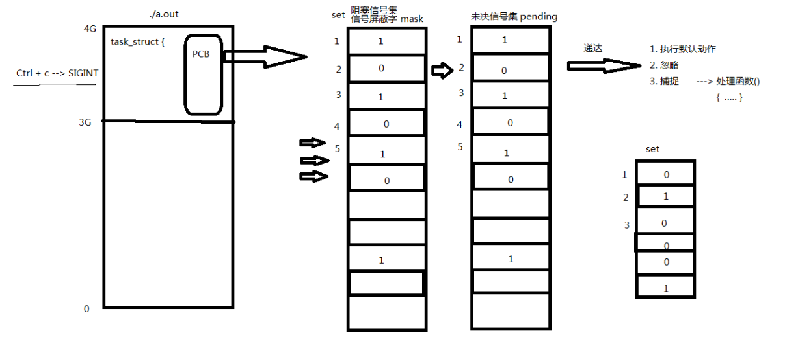

#### 信号集设定

sigset_t set; // typedef unsigned long sigset_t;

| 函数                                              | 作用                       | 返回值                       |
| ------------------------------------------------- | -------------------------- | ---------------------------- |
| int sigemptyset(sigset_t *set);                   | 将某个信号集清 0           | 成功:0;失败:-1               |
| int sigfillset(sigset_t *set);                    | 将某个信号集置 1           | 成功:0;失败:-1               |
| int sigaddset(sigset_t *set, int signum);         | 将某个信号加入信号集       | 成功:0;失败:-1               |
| int sigdelset(sigset_t *set, int signum);         | 将某个信号清出信号集       | 成功:0;失败:-1               |
| int sigismember(const sigset_t *set, int signum); | 判断某个信号是否在信号集中 | 在集合:1;不在:0;<br/>出错:-1 |

sigset_t 类型的本质是位图。但不应该直接使用位操作，而应该使用上述函数，保证跨系统操作有效。

#### sigprocmask 函数

用来屏蔽信号、解除屏蔽也使用该函数。其本质，读取或修改进程的信号屏蔽字(PCB 中) 严格注意，屏蔽信号：只是将信号处理延后执行(延至解除屏蔽)；而忽略表示将信号丢弃处理。

`int sigprocmask(int how, const sigset_t *set, sigset_t *oldset); `成功：0；失败：-1，设置 errno 

参数:

set：传入参数，是一个位图，set 中哪位置 1，就表示当前进程屏蔽哪个信号。 

oldset：传出参数，保存旧的信号屏蔽集。

how参数取值：假设当前的信号屏蔽字为mask

1. SIG_BLOCK: 当 how 设置为此值，set 表示需要屏蔽的信号。相当于 mask = mask|set
2. SIG_UNBLOCK: 当 how 设置为此，set 表示需要解除屏蔽的信号。相当于 mask = mask & ~set
3. SIG_SETMASK: 当 how 设置为此，set 表示用于替代原始屏蔽及的新屏蔽集。相当于 mask = set 若，调用 sigprocmask 解除了对当前若干个信号的阻塞，则在 sigprocmask 返回前，至少将其中一 个信号递达。

#### sigpending 函数

读取当前进程的未决信号集

`int sigpending(sigset_t *set); `

set 传出参数。 返回值：成功：0；失败：-1，设置 errno 

练习：编写程序。把所有常规信号的未决状态打印至屏幕。`sigpending.c`

```c
#include <signal.h>
#include <stdio.h>
#include <stdlib.h>
#include <unistd.h>

void printset(sigset_t *ped)
{
	int i;
	for(i = 1; i < 32; i++){
		if((sigismember(ped, i) == 1)){
			putchar('1');
		} else {
			putchar('0');
		}
	}
	printf("\n");
}

int main(void)
{
	sigset_t set, oldset, ped;
	sigemptyset(&set);
	sigaddset(&set, SIGINT);
#if 0
	sigaddset(&set, SIGQUIT);
	sigaddset(&set, SIGKILL);
	sigaddset(&set, SIGSEGV);
	sigfillset(&set);
#endif
	sigprocmask(SIG_BLOCK, &set, &oldset);	

	while(1){
		sigpending(&ped);       //获取未决信号集
		printset(&ped);
		sleep(1);
	}

	return 0;
}
```

### 信号捕捉

#### signal 函数

注册一个信号捕捉函数:
```c
typedef void (\*sighandler_t)(int);
sighandler_t signal(int signum, sighandler_t handler);
```

该函数由 ANSI 定义，由于历史原因在不同版本的 Unix 和不同版本的 Linux 中可能有不同的行为。因此应该尽量避免使用它，取而代之使用 sigaction 函数。

`void (\*signal(int signum, void (*sighandler_t)(int))) (int); `

能看出这个函数代表什么意思吗? 注意多在复杂结构中使用typedef。

`signal.c`

```c
#include <stdio.h>
#include <unistd.h>
#include <stdlib.h>
#include <errno.h>
#include <signal.h>

void do_sig(int a)
{
    printf("Hi, SIGINT, how do you do !\n");
}

int main(void)
{
    if (signal(SIGINT, do_sig) == SIG_ERR) {
        perror("signal");
        exit(1);
    }

    while (1) {
        printf("---------------------\n");
        sleep(1);
    }

    return 0;
}
```

#### sigaction 函数

修改信号处理动作(通常在 Linux 用其来注册一个信号的捕捉函数)

`int sigaction(int signum, const struct sigaction *act, struct sigaction *oldact);`

成功：0；失败：-1，设置 errno

参数: 

act：传入参数，新的处理方式。 

oldact：传出参数，旧的处理方式。

struct sigaction 结构体：

```c
struct sigaction {
    void     (*sa_handler)(int);
    void     (*sa_sigaction)(int, siginfo_t *, void *);
    sigset_t   sa_mask;
    int        sa_flags;
    void     (*sa_restorer)(void);
};
```

sa_restorer：该元素是过时的，不应该使用，POSIX.1 标准将不指定该元素。(弃用)

sa_sigaction：当 sa_flags 被指定为 SA_SIGINFO 标志时，使用该信号处理程序。(很少使用)

重点掌握：

- sa_handler：指定信号捕捉后的处理函数名(即注册函数)。也可赋值为 SIG_IGN 表忽略 或 SIG_DFL 表执行默认动作
- sa_mask：调用信号处理函数时，所要屏蔽的信号集合(信号屏蔽字)。注意:仅在处理函数被调用期间屏蔽 生效，是临时性设置。
- sa_flags：通常设置为 0，表使用默认属性。

#### 信号捕捉特性

1. 进程正常运行时，默认 PCB 中有一个信号屏蔽字，假定为☆，它决定了进程自动屏蔽哪些信号。当注册了 某个信号捕捉函数，捕捉到该信号以后，要调用该函数。而该函数有可能执行很长时间，在这期间所屏蔽的信号不由☆来指定。而是用 sa_mask 来指定。调用完信号处理函数，再恢复为☆。
2. XXX 信号捕捉函数执行期间，XXX 信号自动被屏蔽。
3. 阻塞的常规信号不支持排队，产生多次只记录一次。(后 32 个实时信号支持排队)

练习 1：为某个信号设置捕捉函数 `sigaction1.c`

```c
#include <stdio.h>
#include <stdlib.h>
#include <unistd.h>
#include <signal.h>

/*自定义的信号捕捉函数*/
void sig_int(int signo)
{
	printf("catch signal SIGINT\n");//单次打印
    sleep(10);
    printf("----slept 10 s\n");
}

int main(void)
{
	struct sigaction act;		

	act.sa_handler = sig_int;
	act.sa_flags = 0;
	sigemptyset(&act.sa_mask);		//不屏蔽任何信号
  sigaddset(&act.sa_mask, SIGQUIT);

	sigaction(SIGINT, &act, NULL);

  printf("------------main slept 10\n");
 	sleep(10);

	while(1);//该循环只是为了保证有足够的时间来测试函数特性

	return 0;
}
```

练习 2：验证在信号处理函数执行期间，该信号多次递送，那么只在处理函数执行结束后，处理一次。`sigaction2.c`

```c
/*自动屏蔽本信号，调用完毕后屏蔽自动解除*/

#include <stdio.h>
#include <signal.h>
#include <unistd.h>

/*自定义的信号捕捉函数*/
void sig_int(int signo)
{
	printf("catch signal SIGINT\n");
	sleep(10);			//模拟信号处理函数执行很长时间
	printf("end of handler\n");
}

int main(void)
{
	struct sigaction act, old;		

	act.sa_handler = sig_int;
	sigemptyset(&act.sa_mask);		//依然不屏蔽任何信号
	act.sa_flags = 0;

	sigaction(SIGINT, &act, &old);	//注册信号处理函数

	while(1);

	return 0;
}
```

练习 3：验证 sa_mask 在捕捉函数执行期间的屏蔽作用。`sigaction3.c`

```c
/*当执行SIGINT信号处理函数期间
 *多次收到SIGQUIT信号都将被屏蔽(阻塞)
 *SIGINT信号处理函数处理完，立刻解除对
 *SIGQUIT信号的屏蔽，由于没有捕捉该信号，
 *将立刻执行该信号的默认动作，程序退出
 */
#include <stdio.h>
#include <signal.h>
#include <unistd.h>

void sig_int(int signo)
{
	printf("catch signal SIGINT\n");
	sleep(10);			//模拟信号处理函数执行很长时间
	printf("end of handler\n");
}

int main(void)
{
	struct sigaction act;		


	act.sa_handler = sig_int;
	sigemptyset(&act.sa_mask);		
	sigaddset(&act.sa_mask, SIGQUIT);	

	/*将SIGQUIT加入信号屏蔽集,这就导致,在调用信号处理函数期间
	 *不仅不响应SIGINT信号本身,还不响应SIGQUIT*/
	act.sa_flags = 0;

	sigaction(SIGINT, &act, NULL);		//注册信号SIGINT捕捉函数

	while(1);

	return 0;
}
```

#### 内核实现信号捕捉过程

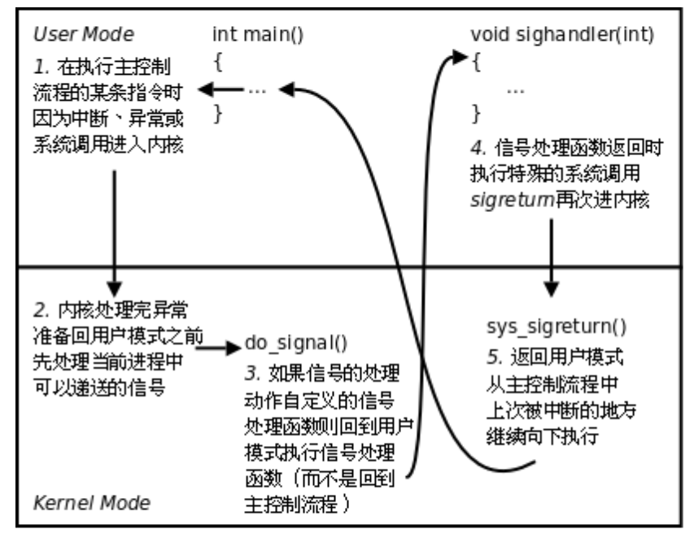

### SIGCHLD 信号

#### SIGCHLD 的产生条件

子进程终止时

子进程接收到 SIGSTOP 信号停止时 

子进程处在停止态，接受到 SIGCONT 后唤醒时

#### 借助 SIGCHLD 信号回收子进程

子进程结束运行，其父进程会收到 SIGCHLD 信号。该信号的默认处理动作是忽略。可以捕捉该信号，在捕捉函数中完成子进程状态的回收。

```c
#include <stdio.h>
#include <stdlib.h>
#include <string.h>
#include <unistd.h>
#include <signal.h>
#include <sys/wait.h>
#include <errno.h>
#include <pthread.h>

void sys_err(const char *str)
{
    perror(str);
    exit(1);
}

void catch_child(int signo)
{
    pid_t wpid;
    int status;

    //while((wpid = wait(NULL)) != -1) {
    while((wpid = waitpid(-1, &status, 0)) != -1) {         // 循环回收,防止僵尸进程出现.
        if (WIFEXITED(status))
            printf("---------------catch child id %d, ret=%d\n", wpid, WEXITSTATUS(status));
    }

    return ;
}

int main(int argc, char *argv[])
{
    pid_t pid;
//阻塞
    int i; 
    for (i = 0; i < 15; i++)
        if ((pid = fork()) == 0)                // 创建多个子进程
            break;

    if (15 == i) {
        struct sigaction act;

        act.sa_handler = catch_child;           // 设置回调函数
        sigemptyset(&act.sa_mask);              // 设置捕捉函数执行期间屏蔽字
        act.sa_flags = 0;                       // 设置默认属性, 本信号自动屏蔽

        sigaction(SIGCHLD, &act, NULL);         // 注册信号捕捉函数
//解除阻塞

        printf("I'm parent, pid = %d\n", getpid());

        while (1);

    } else {
        printf("I'm child pid = %d\n", getpid());
        return i;
    }

    return 0;
}
```

# 守护进程

## 进程组和会话 

### 概念和特性

进程组，也称之为作业。BSD 于 1980 年前后向 Unix 中增加的一个新特性。代表一个或多个进程的集合。每个 进程都属于一个进程组。在 waitpid 函数和 kill 函数的参数中都曾使用到。操作系统设计的进程组的概念，是为了简化对多个进程的管理。

当父进程，创建子进程的时候，默认子进程与父进程属于同一进程组。进程组 ID==第一个进程 ID(组长进程)。 所以，组长进程标识：其进程组 ID==其进程 ID

可以使用 kill -SIGKILL -进程组 ID(负的)来将整个进程组内的进程全部杀死。

组长进程可以创建一个进程组，创建该进程组中的进程，然后终止。只要进程组中有一个进程存在，进程组就存在，与组长进程是否终止无关。

进程组生存期：进程组创建到最后一个进程离开(终止或转移到另一个进程组)。 

一个进程可以为自己或子进程设置进程组 ID

`getpgid.c`

```c
#include <stdio.h>
#include <stdlib.h>
#include <unistd.h>

int main(void)
{
    pid_t pid;

    if ((pid = fork()) < 0) {
        perror("fork");
        exit(1);

    } else if (pid == 0) {
        printf("child process PID == %d\n", getpid());                  //子进程ID
        printf("child Group ID == %d\n", getpgrp());                    //子进程所在组ID
        printf("child Group ID == %d\n", getpgid(0));                   //传0表当前进程
        printf("child Group ID == %d\n", getpgid(getpid()));
        exit(0);
    }

    sleep(3);

    printf("parent process PID == %d\n", getpid());
    printf("parent Group ID is %d\n", getpgrp());	// 当前进程的组ID

    return 0;
}
```


`setpgid.c`

```c
#include <stdio.h>
#include <stdlib.h>
#include <unistd.h>

int main(void)
{
    pid_t pid;

    if ((pid = fork()) < 0) {
        perror("fork");
        exit(1);

    } else if (pid == 0) {

        printf("child PID == %d\n", getpid());
        printf("child Group ID == %d\n", getpgid(0));                    // 返回组id
        sleep(7);
        printf("----Group ID of child is changed to %d\n", getpgid(0));
        exit(0);

    } else if (pid > 0) {
        sleep(1);
        setpgid(pid, pid);           //让子进程自立门户,成为进程组组长,以它的pid为进程组id

        sleep(13);
        printf("\nparent PID == %d\n", getpid());
        printf("parent's parent process PID == %d\n", getppid());
        printf("parent Group ID == %d\n", getpgid(0));

        sleep(5);
        setpgid(getpid(), getppid()); // 改变父进程的组id为父进程的父进程
        printf("\n----Group ID of parent is changed to %d\n", getpgid(0));

        while(1);
    }

    return 0;
}
```


### 创建会话

创建一个会话需要注意以下 6 点注意事项：

1. 调用进程不能是进程组组长，该进程变成新会话首进程(session header)
2. 该进程成为一个新进程组的组长进程。
3. 需有 root 权限 (ubuntu 不需要)
4. 新会话丢弃原有的控制终端，该会话没有控制终端
5. 该调用进程是组长进程，则出错返回
6. 建立新会话时，先调用 fork, 父进程终止，子进程调用 setsid()

## getsid 函数

获取进程所属的会话 ID

`pid_t getsid(pid_t pid); ` 成功：返回调用进程的会话 ID；失败：-1，设置 errno

pid 为 0 表示察看当前进程 session ID

ps ajx命令查看系统中的进程。参数a表示不仅列当前用户的进程，也列出所有其他用户的进程，参数x表示不仅列有控制终端的进程，也列出所有无控制终端的进程，参数 j 表示列出与作业控制相关的信息。

组长进程不能成为新会话首进程，新会话首进程必定会成为组长进程。

## setsid 函数

创建一个会话，并以自己的 ID 设置进程组 ID，同时也是新会话的 ID。

`pid_t setsid(void); ` 成功：返回调用进程的会话 ID；失败：-1，设置 errno

调用了 setsid 函数的进程，既是新的会长，也是新的组长。

练习：fork 一个子进程，并使其创建一个新会话。查看进程组 ID、会话 ID 前后变化 `session.c`

```c
#include <stdio.h>
#include <stdlib.h>
#include <unistd.h>

int main(void)
{
    pid_t pid;

    if ((pid = fork()) < 0) {
        perror("fork");
        exit(1);

    } else if (pid == 0) {

        printf("child process PID is %d\n", getpid());
        printf("Group ID of child is %d\n", getpgid(0));
        printf("Session ID of child is %d\n", getsid(0));

        sleep(10);
        setsid();       //子进程非组长进程，故其成为新会话首进程，且成为组长进程。该进程组id即为会话进程

        printf("Changed:\n");

        printf("child process PID is %d\n", getpid());
        printf("Group ID of child is %d\n", getpgid(0));
        printf("Session ID of child is %d\n", getsid(0));

        sleep(20);

        exit(0);
    }

    return 0;
}
```

## 守护进程

Daemon(精灵)进程，是 Linux 中的后台服务进程，通常独立于控制终端并且周期性地执行某种任务或等待处理某些发生的事件。一般采用以 d 结尾的名字。

Linux 后台的一些系统服务进程，没有控制终端，不能直接和用户交互。不受用户登录、注销的影响，一直在 运行着，他们都是守护进程。如：预读入缓输出机制的实现；ftp 服务器；nfs 服务器等。

创建守护进程，最关键的一步是调用 setsid 函数创建一个新的 Session，并成为 Session Leader。

## 创建守护进程模型

1. 创建子进程，父进程退出

    所有工作在子进程中进行形式上脱离了控制终端

2. 在子进程中创建新会话 setsid()函数
    使子进程完全独立出来，脱离控制

3. 改变当前目录位置
    chdir()函数 

  防止占用可卸载的文件系统

  也可以换成其它路径

4. 重设文件权限掩码 

    umask()函数
    防止继承的文件创建屏蔽字拒绝某些权限
    增加守护进程灵活性

5. 关闭文件描述符
    继承的打开文件不会用到，浪费系统资源，无法卸载

6. 开始执行守护进程核心工作

`mydaemond.c`

```c
#include <stdlib.h>
#include <stdio.h>
#include <unistd.h>
#include <fcntl.h>
#include <sys/stat.h>

void daemonize(void)
{
    pid_t pid;
    /*
     * * 成为一个新会话的首进程，失去控制终端
     * */
    if ((pid = fork()) < 0) {
        perror("fork");
        exit(1);
    } else if (pid != 0) /* parent */
        exit(0);
    		setsid();
    /*
     * * 改变当前工作目录到/目录下.
     * */
    if (chdir("/") < 0) {
        perror("chdir");
        exit(1);
    }
    /* 设置umask为0 */
    umask(0);
    // 重定向0，1，2文件描述符到 /dev/null，因为已经失去控制终端，再操作0，1，2没有意义.
    // 可以将/dev/null看作"黑洞". 它非常等价于一个只写文件. 所有写入它的内容都会永远丢失. 而尝试从它那儿读取内容则什么也读不到. 
    close(0);
    open("/dev/null", O_RDWR);
    dup2(0, 1);
    dup2(0, 2);
}

int main(void)
{
    daemonize();
    while(1); /* 在此循环中可以实现守护进程的核心工作 */
}
```

