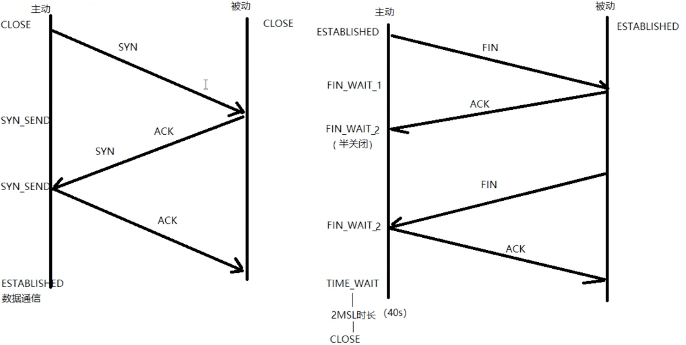

# 协议格式

## TCP数据报格式


<center>TCP数据段</center>

与UDP协议一样也有源端口号和目的端口号，通讯的双方由IP地址和端口号标识。32位序号、32位确认序号、窗口大小稍后详细解释。4位首部长度和IP协议头类似，表示TCP协议头的长度，以4字节为单位，因此TCP协议头最长可以是4x15=60字节，如果没有选项字段，TCP协议头最短20字节。URG、ACK、PSH、RST、SYN、FIN是六个控制位，本节稍后将解释SYN、ACK、FIN、RST四个位，其它位的解释从略。16位检验和将TCP协议头和数据都计算在内。紧急指针和各种选项的解释从略。

# TCP协议

## TCP通信时序

下图是一次TCP通讯的时序图。TCP连接建立断开。包含大家熟知的三次握手和四次握手。


<center>TCP通讯时序</center>

在这个例子中，首先客户端主动发起连接、发送请求，然后服务器端响应请求，然后客户端主动关闭连接。两条竖线表示通讯的两端，从上到下表示时间的先后顺序，注意，数据从一端传到网络的另一端也需要时间，所以图中的箭头都是斜的。双方发送的段按时间顺序编号为1-10，各段中的主要信息在箭头上标出，例如段2的箭头上标着SYN, 8000(0), ACK1001, 表示该段中的SYN位置1，32位序号是8000，该段不携带有效载荷（数据字节数为0），ACK位置1，32位确认序号是1001，带有一个mss（Maximum Segment Size，最大报文长度）选项值为1024。

建立连接（三次握手）的过程：

1. 客户端发送一个带SYN标志的TCP报文到服务器。这是三次握手过程中的段1。

   客户端发出段1，SYN位表示连接请求。序号是1000，这个序号在网络通讯中用作临时的地址，每发一个数据字节，这个序号要加1，这样在接收端可以根据序号排出数据包的正确顺序，也可以发现丢包的情况，另外，规定SYN位和FIN位也要占一个序号，这次虽然没发数据，但是由于发了SYN位，因此下次再发送应该用序号1001。mss表示最大段尺寸，如果一个段太大，封装成帧后超过了链路层的最大帧长度，就必须在IP层分片，为了避免这种情况，客户端声明自己的最大段尺寸，建议服务器端发来的段不要超过这个长度。

2. 服务器端回应客户端，是三次握手中的第2个报文段，同时带ACK标志和SYN标志。它表示对刚才客户端SYN的回应；同时又发送SYN给客户端，询问客户端是否准备好进行数据通讯。

   服务器发出段2，也带有SYN位，同时置ACK位表示确认，确认序号是1001，表示“我接收到序号1000及其以前所有的段，请你下次发送序号为1001的段”，也就是应答了客户端的连接请求，同时也给客户端发出一个连接请求，同时声明最大尺寸为1024。

3. 客户必须再次回应服务器端一个ACK报文，这是报文段3。

   客户端发出段3，对服务器的连接请求进行应答，确认序号是8001。在这个过程中，客户端和服务器分别给对方发了连接请求，也应答了对方的连接请求，其中服务器的请求和应答在一个段中发出，因此一共有三个段用于建立连接，称为“三方握手（three-way-handshake）”。在建立连接的同时，双方协商了一些信息，例如双方发送序号的初始值、最大段尺寸等。

在TCP通讯中，如果一方收到另一方发来的段，读出其中的目的端口号，发现本机并没有任何进程使用这个端口，就会应答一个包含RST位的段给另一方。例如，服务器并没有任何进程使用8080端口，我们却用telnet客户端去连接它，服务器收到客户端发来的SYN段就会应答一个RST段，客户端的telnet程序收到RST段后报告错误Connection refused：
$ telnet 192.168.0.200 8080
Trying 192.168.0.200...
telnet: Unable to connect to remote host: Connection refused

数据传输的过程：

1. 客户端发出段4，包含从序号1001开始的20个字节数据。
2. 服务器发出段5，确认序号为1021，对序号为1001-1020的数据表示确认收到，同时请求发送序号1021开始的数据，服务器在应答的同时也向客户端发送从序号8001开始的10个字节数据，这称为piggyback。
3. 客户端发出段6，对服务器发来的序号为8001-8010的数据表示确认收到，请求发送序号8011开始的数据。

在数据传输过程中，ACK和确认序号是非常重要的，应用程序交给TCP协议发送的数据会暂存在TCP层的发送缓冲区中，发出数据包给对方之后，只有收到对方应答的ACK段才知道该数据包确实发到了对方，可以从发送缓冲区中释放掉了，如果因为网络故障丢失了数据包或者丢失了对方发回的ACK段，经过等待超时后TCP协议自动将发送缓冲区中的数据包重发。

关闭连接（四次握手）的过程：
由于TCP连接是全双工的，因此每个方向都必须单独进行关闭。这原则是当一方完成它的数据发送任务后就能发送一个FIN来终止这个方向的连接。收到一个 FIN只意味着这一方向上没有数据流动，一个TCP连接在收到一个FIN后仍能发送数据。首先进行关闭的一方将执行主动关闭，而另一方执行被动关闭。

1. 客户端发出段7，FIN位表示关闭连接的请求。
2. 服务器发出段8，应答客户端的关闭连接请求。
3. 服务器发出段9，其中也包含FIN位，向客户端发送关闭连接请求。
4. 客户端发出段10，应答服务器的关闭连接请求。

建立连接的过程是三方握手，而关闭连接通常需要4个段，服务器的应答和关闭连接请求通常不合并在一个段中，因为有连接半关闭的情况，这种情况下客户端关闭连接之后就不能再发送数据给服务器了，但是服务器还可以发送数据给客户端，直到服务器也关闭连接为止。

## 滑动窗口 (TCP流量控制)

介绍UDP时我们描述了这样的问题：如果发送端发送的速度较快，接收端接收到数据后处理的速度较慢，而接收缓冲区的大小是固定的，就会丢失数据。TCP协议通过“滑动窗口（Sliding Window）”机制解决这一问题。看下图的通讯过程：


1. 发送端发起连接，声明最大段尺寸是1460，初始序号是0，窗口大小是4K，表示“我的接收缓冲区还有4K字节空闲，你发的数据不要超过4K”。接收端应答连接请求，声明最大段尺寸是1024，初始序号是8000，窗口大小是6K。发送端应答，三方握手结束。
2. 发送端发出段4-9，每个段带1K的数据，发送端根据窗口大小知道接收端的缓冲区满了，因此停止发送数据。
3. 接收端的应用程序提走2K数据，接收缓冲区又有了2K空闲，接收端发出段10，在应答已收到6K数据的同时声明窗口大小为2K。
4. 接收端的应用程序又提走2K数据，接收缓冲区有4K空闲，接收端发出段11，重新声明窗口大小为4K。
5. 发送端发出段12-13，每个段带2K数据，段13同时还包含FIN位。
6. 接收端应答接收到的2K数据（6145-8192），再加上FIN位占一个序号8193，因此应答序号是8194，连接处于半关闭状态，接收端同时声明窗口大小为2K。
7. 接收端的应用程序提走2K数据，接收端重新声明窗口大小为4K。
8. 接收端的应用程序提走剩下的2K数据，接收缓冲区全空，接收端重新声明窗口大小为6K。
9. 接收端的应用程序在提走全部数据后，决定关闭连接，发出段17包含FIN位，发送端应答，连接完全关闭。

上图在接收端用小方块表示1K数据，实心的小方块表示已接收到的数据，虚线框表示接收缓冲区，因此套在虚线框中的空心小方块表示窗口大小，从图中可以看出，随着应用程序提走数据，虚线框是向右滑动的，因此称为**滑动窗口**。

从这个例子还可以看出，发送端是一K一K地发送数据，而接收端的应用程序可以两K两K地提走数据，当然也有可能一次提走3K或6K数据，或者一次只提走几个字节的数据。也就是说，应用程序所看到的数据是一个整体，或说是一个流（stream），在底层通讯中这些数据可能被拆成很多数据包来发送，但是一个数据包有多少字节对应用程序是不可见的，因此TCP协议是面向流的协议。而UDP是面向消息的协议，每个UDP段都是一条消息，应用程序必须以消息为单位提取数据，不能一次提取任意字节的数据，这一点和TCP是很不同的。

## TCP状态转换

这个图N多人都知道，它排除和定位网络或系统故障时大有帮助，但是怎样牢牢地将这张图刻在脑中呢？那么你就一定要对这张图的每一个状态，及转换的过程有深刻的认识，不能只停留在一知半解之中。下面对这张图的11种状态详细解析一下，以便加强记忆！不过在这之前，先回顾一下TCP建立连接的三次握手过程，以及 关闭连接的四次握手过程。


**主动发起连接和主动关闭连接**




**被动接收连接和被动关闭连接**


**CLOSED**：表示初始状态。

**LISTEN**：该状态表示服务器端的某个SOCKET处于监听状态，可以接受连接。

**SYN_SENT**：这个状态与SYN_RCVD遥相呼应，当客户端SOCKET执行CONNECT连接时，它首先发送SYN报文，随即进入到了SYN_SENT状态，并等待服务端的发送三次握手中的第2个报文。SYN_SENT状态表示客户端已发送SYN报文。

**SYN_RCVD**: 该状态表示接收到SYN报文，在正常情况下，这个状态是服务器端的SOCKET在建立TCP连接时的三次握手会话过程中的一个中间状态，很短暂。此种状态时，当收到客户端的ACK报文后，会进入到ESTABLISHED状态。

**ESTABLISHED**：表示连接已经建立。

通过netstat命令查看连接状态：

```
netstat -pn | grep 8000
```

**FIN_WAIT_1**:  FIN_WAIT_1和FIN_WAIT_2状态的真正含义都是表示等待对方的FIN报文。区别是：

​	FIN_WAIT_1 状态是当socket在ESTABLISHED状态时，想主动关闭连接，向对方发送了FIN报文，此时该socket进入到FIN_WAIT_1状态。

​	FIN_WAIT_2 状态是当对方回应ACK后，该socket进入到FIN_WAIT_2状态，正常情况下，对方应马上回应ACK报文，所以FIN_WAIT_1状态一般较难见到，而FIN_WAIT_2状态可用netstat看到。

**FIN_WAIT_2**：主动关闭链接的一方，发出FIN收到ACK以后进入该状态。称之为半连接或半关闭状态。该状态下的socket只能接收数据，不能发。

**TIME_WAIT**: 表示收到了对方的FIN报文，并发送出了ACK报文，等2MSL后即可回到CLOSED可用状态。如果FIN_WAIT_1状态下，收到对方同时带 FIN标志和ACK标志的报文时，可以直接进入到TIME_WAIT状态，而无须经过FIN_WAIT_2状态。**只有主动关闭方会经历**。

**主动关闭服务器端之后，再重新启动会出现**：

```
bind error: Address already in use
```

**CLOSING**: 这种状态较特殊，属于一种较罕见的状态。正常情况下，当你发送FIN报文后，按理来说是应该先收到（或同时收到）对方的 ACK报文，再收到对方的FIN报文。但是CLOSING状态表示你发送FIN报文后，并没有收到对方的ACK报文，反而却也收到了对方的FIN报文。什么情况下会出现此种情况呢？如果双方几乎在同时close一个SOCKET的话，那么就出现了双方同时发送FIN报文的情况，也即会出现CLOSING状态，表示双方都正在关闭SOCKET连接。

**CLOSE_WAIT**: 此种状态表示在等待关闭。当对方关闭一个SOCKET后发送FIN报文给自己，系统会回应一个ACK报文给对方，此时则进入到CLOSE_WAIT状态。接下来呢，察看是否还有数据发送给对方，如果没有可以 close这个SOCKET，发送FIN报文给对方，即关闭连接。所以在CLOSE_WAIT状态下，需要关闭连接。

**LAST_ACK**: 该状态是被动关闭一方在发送FIN报文后，最后等待对方的ACK报文。当收到ACK报文后，即可以进入到CLOSED可用状态。

## 半关闭

当TCP链接中A发送FIN请求关闭，B端回应ACK后（A端进入FIN_WAIT_2状态），B没有立即发送FIN给A时，A方处在半连接状态，此时A可以接收B发送的数据，但是A已不能再向B发送数据。

从程序的角度，可以使用API来控制实现半连接状态。

```c
#include <sys/socket.h>
int shutdown(int sockfd, int how);
```

sockfd: 需要关闭的socket的描述符
how:	允许为shutdown操作选择以下几种方式:
	SHUT_RD(0)：	关闭sockfd上的读功能，此选项将不允许sockfd进行读操作。
					该套接字不再接受数据，任何当前在套接字接受缓冲区的数据将被无声的丢弃掉。
	SHUT_WR(1):		关闭sockfd的写功能，此选项将不允许sockfd进行写操作。进程不能在对此套接字发出写操作。
	SHUT_RDWR(2):	关闭sockfd的读写功能。相当于调用shutdown两次：首先是以SHUT_RD,然后以SHUT_WR。

**使用close中止一个连接，但它只是减少描述符的引用计数，并不直接关闭连接，只有当描述符的引用计数为0时才关闭连接。**

shutdown不考虑描述符的引用计数，直接关闭描述符。也可选择中止一个方向的连接，只中止读或只中止写。
注意:

1. 如果有多个进程共享一个套接字，close每被调用一次，计数减1，直到计数为0时，也就是所用进程都调用了close，套接字将被释放。 
2. 在多进程中如果一个进程调用了shutdown(sfd, SHUT_RDWR)后，其它的进程将无法进行通信。但如果一个进程close(sfd)将不会影响到其它进程。

## 2MSL

2MSL (Maximum Segment Lifetime) TIME_WAIT状态的存在有两个理由：

（1）让4次握手关闭流程更加可靠；4次握手的最后一个ACK是是由主动关闭方发送出去的，若这个ACK丢失，被动关闭方会再次发一个FIN过来。若主动关闭方能够保持一个2MSL的TIME_WAIT状态，则有更大的机会让丢失的ACK被再次发送出去。

（2）防止lost duplicate对后续新建正常链接的传输造成破坏。lost uplicate在实际的网络中非常常见，经常是由于路由器产生故障，路径无法收敛，导致一个packet在路由器A，B，C之间做类似死循环的跳转。IP头部有个TTL，限制了一个包在网络中的最大跳数，因此这个包有两种命运，要么最后TTL变为0，在网络中消失；要么TTL在变为0之前路由器路径收敛，它凭借剩余的TTL跳数终于到达目的地。但非常可惜的是TCP通过超时重传机制在早些时候发送了一个跟它一模一样的包，并先于它达到了目的地，因此它的命运也就注定被TCP协议栈抛弃。

另外一个概念叫做incarnation connection，指跟上次的socket pair一摸一样的新连接，叫做incarnation of previous connection。lost duplicate加上incarnation connection，则会对我们的传输造成致命的错误。

TCP是流式的，所有包到达的顺序是不一致的，依靠序列号由TCP协议栈做顺序的拼接；假设一个incarnation connection这时收到的seq=1000, 来了一个lost duplicate为seq=1000，len=1000, 则TCP认为这个lost duplicate合法，并存放入了receive buffer，导致传输出现错误。通过一个2MSL TIME_WAIT状态，确保所有的lost duplicate都会消失掉，避免对新连接造成错误。

该状态为什么设计在主动关闭这一方：

（1）发最后ACK的是主动关闭一方。

（2）只要有一方保持TIME_WAIT状态，就能起到避免incarnation connection在2MSL内的重新建立，不需要两方都有。

如何正确对待2MSL TIME_WAIT?

RFC要求socket pair在处于TIME_WAIT时，不能再起一个incarnation connection。但绝大部分TCP实现，强加了更为严格的限制。在2MSL等待期间，socket中使用的本地端口在默认情况下不能再被使用。

若A 10.234.5.5 : 1234和B 10.55.55.60 : 6666建立了连接，A主动关闭，那么在A端只要port为1234，无论对方的port和ip是什么，都不允许再起服务。这甚至比RFC限制更为严格，RFC仅仅是要求socket pair不一致，而实现当中只要这个port处于TIME_WAIT，就不允许起连接。这个限制对主动打开方来说是无所谓的，因为一般用的是临时端口；但对于被动打开方，一般是server，就悲剧了，因为server一般是熟知端口。比如http，一般端口是80，不可能允许这个服务在2MSL内不能起来。

解决方案是给服务器的socket设置SO_REUSEADDR选项，这样的话就算熟知端口处于TIME_WAIT状态，在这个端口上依旧可以将服务启动。当然，虽然有了SO_REUSEADDR选项，但sockt pair这个限制依旧存在。比如上面的例子，A通过SO_REUSEADDR选项依旧在1234端口上起了监听，但这时我们若是从B通过6666端口去连它，TCP协议会告诉我们连接失败，原因为Address already in use.

RFC 793中规定MSL为2分钟，实际应用中常用的是30秒，1分钟和2分钟等。

RFC (Request For Comments)，是一系列以编号排定的文件。收集了有关因特网相关资讯，以及UNIX和因特网社群的软件文件。

### 程序设计中的问题 

做一个测试，首先启动server，然后启动client，用Ctrl-C终止server，马上再运行server，运行结果：

```
./server
bind error: Address already in use 
```

这是因为，虽然server的应用程序终止了，但TCP协议层的连接并没有完全断开，因此不能再次监听同样的server端口。我们用netstat命令查看一下：

```
netstat -apn |grep 6666
tcp        1      0 192.168.1.11:38103      192.168.1.11:6666       CLOSE_WAIT  3525/client     
tcp        0      0 192.168.1.11:6666       192.168.1.11:38103      FIN_WAIT2   -   
```

server终止时，socket描述符会自动关闭并发FIN段给client，client收到FIN后处于CLOSE_WAIT状态，但是client并没有终止，也没有关闭socket描述符，因此不会发FIN给server，因此server的TCP连接处于FIN_WAIT2状态。

现在用Ctrl-C把client也终止掉，再观察现象：

```c
netstat -apn |grep 6666
tcp        0      0 192.168.1.11:6666       192.168.1.11:38104      TIME_WAIT   -
./server
bind error: Address already in use
```

client终止时自动关闭socket描述符，server的TCP连接收到client发的FIN段后处于TIME_WAIT状态。TCP协议规定，主动关闭连接的一方要处于TIME_WAIT状态，等待两个MSL（maximum segment lifetime）的时间后才能回到CLOSED状态，因为我们先Ctrl-C终止了server，所以server是主动关闭连接的一方，在TIME_WAIT期间仍然不能再次监听同样的server端口。

MSL在RFC 1122中规定为两分钟，但是各操作系统的实现不同，在Linux上一般经过半分钟后就可以再次启动server了。至于为什么要规定TIME_WAIT的时间，可参考UNP 2.7节。

### 端口复用

在server的TCP连接没有完全断开之前不允许重新监听是不合理的。因为，TCP连接没有完全断开指的是connfd（127.0.0.1:6666）没有完全断开，而我们重新监听的是lis-tenfd（0.0.0.0:6666），虽然是占用同一个端口，但IP地址不同，connfd对应的是与某个客户端通讯的一个具体的IP地址，而listenfd对应的是wildcard address。解决这个问题的方法是使用setsockopt()设置socket描述符的选项SO_REUSEADDR为1，表示允许创建端口号相同但IP地址不同的多个socket描述符。

在server代码的socket()和bind()调用之间插入如下代码：

```c
int opt = 1; // 设置端口复用
setsockopt(listenfd, SOL_SOCKET, SO_REUSEADDR, &opt, sizeof(opt));
```

有关setsockopt可以设置的其它选项请参考UNP第7章。

# Socket编程

## 套接字概念

Socket本身有“插座”的意思，在Linux环境下，用于表示进程间网络通信的特殊文件类型。本质为内核借助缓冲区形成的伪文件。

既然是文件，那么理所当然的，我们可以使用文件描述符引用套接字。与管道类似的，Linux系统将其封装成文件的目的是为了统一接口，使得读写套接字和读写文件的操作一致。区别是管道主要应用于本地进程间通信，而套接字多应用于网络进程间数据的传递。

套接字的内核实现较为复杂，不宜在学习初期深入学习。

在TCP/IP协议中，“IP地址+TCP或UDP端口号”唯一标识网络通讯中的一个进程。“IP地址+端口号”就对应一个socket。欲建立连接的两个进程各自有一个socket来标识，那么这两个socket组成的socket pair就唯一标识一个连接。因此可以用Socket来描述网络连接的一对一关系。

套接字通信原理如下图所示：


<center>套接字通讯原理示意</center>

在网络通信中，套接字一定是成对出现的。一端的发送缓冲区对应对端的接收缓冲区。我们使用同一个文件描述符发送缓冲区和接收缓冲区。

TCP/IP协议最早在BSD UNIX上实现，为TCP/IP协议设计的应用层编程接口称为socket API。本章的主要内容是socket API，主要介绍TCP协议的函数接口，最后介绍UDP协议和UNIX Domain Socket的函数接口。


## 预备知识

### 大端与小端的区别

 端模式（Endian）的这个词出自Jonathan Swift书写的《格列佛游记》。这本书根据将鸡蛋敲开的方法不同将所有的人分为两类，从圆头开始将鸡蛋敲开的人被归为Big Endian，从尖头开始将鸡蛋敲开的人被归为Littile Endian。小人国的内战就源于吃鸡蛋时是究竟从大头（Big-Endian）敲开还是从小头（Little-Endian）敲开。在计算机业Big Endian和Little Endian也几乎引起一场战争。在计算机业界，Endian表示数据在存储器中的存放顺序。下文举例说明在计算机中大小端模式的区别。

如果将一个32位的整数0x12345678存放到一个整型变量（int）中，这个整型变量采用大端或者小端模式在内存中的存储由下表所示。为简单 起见，下文使用OP0表示一个32位数据的最高字节MSB（Most Significant Byte），使用OP3表示一个32位数据最低字节LSB（Least Significant Byte）。

| 地址偏移 | 大端模式  | 小端模式  |
| -------- | --------- | --------- |
| 0x00     | 12（OP0） | 78（OP3） |
| 0x01     | 34（OP1） | 56（OP2） |
| 0x02     | 56（OP2） | 34（OP1） |
| 0x03     | 78（OP3） | 12（OP0） |

如果将一个16位的整数0x1234存放到一个短整型变量（short）中。这个短整型变量在内存中的存储在大小端模式由下表所示。

| 地址偏移 | 大端模式  | 小端模式  |
| -------- | --------- | --------- |
| 0x00     | 12（OP0） | 34（OP1） |
| 0x01     | 34（OP1） | 12（OP0） |

由上表所知，采用大小模式对数据进行存放的主要区别在于在存放的字节顺序，大端方式将低位存放在高地址，小端方式将低位存放在低地址。采用大端方式进行数据存放符合人类的正常思维，而采用小端方式进行数据存放利于计算机处理。到目前为止，采用大端或者小端进行数据存放，其孰优孰劣也没有定论。

有的处理器系统采用了小端方式进行数据存放，如Intel的奔腾。有的处理器系统采用了大端方式进行数据存放，如IBM半导体和Freescale的PowerPC处理器。不仅对于处理器，一些外设的设计中也存在着使用大端或者小端进行数据存放的选择。

因此在一个处理器系统中，有可能存在大端和小端模式同时存在的现象。这一现象为系统的软硬件设计带来了不小的麻烦，这要求系统设计工程师，必须深入理解大端和小端模式的差别。

### 网络字节序

我们已经知道，内存中的多字节数据相对于内存地址有大端和小端之分，磁盘文件中的多字节数据相对于文件中的偏移地址也有大端小端之分。网络数据流同样有大端小端之分，那么如何定义网络数据流的地址呢？发送主机通常将发送缓冲区中的数据按内存地址从低到高的顺序发出，接收主机把从网络上接到的字节依次保存在接收缓冲区中，也是按内存地址从低到高的顺序保存，因此，网络数据流的地址应这样规定：先发出的数据是低地址，后发出的数据是高地址。

TCP/IP协议规定，**网络数据流应采用大端字节序**，即低地址高字节。例如上一节的UDP段格式，地址0-1是16位的源端口号，如果这个端口号是1000（0x3e8），则地址0是0x03，地址1是0xe8，也就是先发0x03，再发0xe8，这16位在发送主机的缓冲区中也应该是低地址存0x03，高地址存0xe8。但是，如果发送主机是小端字节序的，这16位被解释成0xe803，而不是1000。因此，发送主机把1000填到发送缓冲区之前需要做字节序的转换。同样地，接收主机如果是小端字节序的，接到16位的源端口号也要做字节序的转换。如果主机是大端字节序的，发送和接收都不需要做转换。同理，32位的IP地址也要考虑网络字节序和主机字节序的问题。

为使网络程序具有可移植性，使同样的C代码在大端和小端计算机上编译后都能正常运行，可以调用以下库函数做**网络字节序和主机字节序的转换**。

```c
#include <arpa/inet.h>
 
uint32_t htonl(uint32_t hostlong);
uint16_t htons(uint16_t hostshort);
uint32_t ntohl(uint32_t netlong);
uint16_t ntohs(uint16_t netshort);
```

h表示host，n表示network，l表示32位长整数，s表示16位短整数。

如果主机是小端字节序，这些函数将参数做相应的大小端转换然后返回，如果主机是大端字节序，这些函数不做转换，将参数原封不动地返回。

### IP地址转换函数

早期：

```c
#include <sys/socket.h>
#include <netinet/in.h>
#include <arpa/inet.h>
int inet_aton(const char *cp, struct in_addr *inp);
in_addr_t inet_addr(const char *cp);
char *inet_ntoa(struct in_addr in);
```

只能处理IPv4的ip地址

不可重入函数

注意参数是struct in_addr

现在：

```c
#include <arpa/inet.h>
int inet_pton(int af, const char *src, void *dst);
const char *inet_ntop(int af, const void *src, char *dst, socklen_t size);
```

支持IPv4和IPv6

可重入函数其中inet_pton和inet_ntop不仅可以转换IPv4的in_addr，还可以转换IPv6的in6_addr。

因此函数接口是void *addrptr。

### sockaddr数据结构

strcut sockaddr 很多网络编程函数诞生早于IPv4协议，那时候都使用的是sockaddr结构体,为了向前兼容，现在sockaddr退化成了（void *）的作用，传递一个地址给函数，至于这个函数是sockaddr_in还是sockaddr_in6，由地址族确定，然后函数内部再强制类型转化为所需的地址类型。


<center>sockaddr数据结构</center>

```c
struct sockaddr {
	sa_family_t sa_family; 		/* address family, AF_xxx */
	char sa_data[14];			/* 14 bytes of protocol address */
};
```

使用 sudo grep -r "struct sockaddr_in {"  /usr 命令可查看到struct sockaddr_in结构体的定义。一般其默认的存储位置：/usr/include/linux/in.h 文件中。

```c
struct sockaddr_in {
	__kernel_sa_family_t sin_family; 			/* Address family */  	地址结构类型
	__be16 sin_port;					 		/* Port number */		端口号
	struct in_addr sin_addr;					/* Internet address */	IP地址
	/* Pad to size of `struct sockaddr'. */
	unsigned char __pad[__SOCK_SIZE__ - sizeof(short int) -
	sizeof(unsigned short int) - sizeof(struct in_addr)];
};
 
struct in_addr {						/* Internet address. */
	__be32 s_addr;
};
 
struct sockaddr_in6 {
	unsigned short int sin6_family; 		/* AF_INET6 */
	__be16 sin6_port; 					/* Transport layer port # */
	__be32 sin6_flowinfo; 				/* IPv6 flow information */
	struct in6_addr sin6_addr;			/* IPv6 address */
	__u32 sin6_scope_id; 				/* scope id (new in RFC2553) */
};

struct in6_addr {
	union {
		__u8 u6_addr8[16];
		__be16 u6_addr16[8];
		__be32 u6_addr32[4];
	} in6_u;
	#define s6_addr 		in6_u.u6_addr8
	#define s6_addr16 	in6_u.u6_addr16
	#define s6_addr32	 	in6_u.u6_addr32
};
 
#define UNIX_PATH_MAX 108
	struct sockaddr_un {
	__kernel_sa_family_t sun_family; 	/* AF_UNIX */
	char sun_path[UNIX_PATH_MAX]; 	/* pathname */
};
```

IPv4和IPv6的地址格式定义在netinet/in.h中，IPv4地址用sockaddr_in结构体表示，包括16位端口号和32位IP地址，IPv6地址用sockaddr_in6结构体表示，包括16位端口号、128位IP地址和一些控制字段。UNIX Domain Socket的地址格式定义在sys/un.h中，用sock-addr_un结构体表示。各种socket地址结构体的开头都是相同的，前16位表示整个结构体的长度（并不是所有UNIX的实现都有长度字段，如Linux就没有），后16位表示地址类型。IPv4、IPv6和Unix Domain Socket的地址类型分别定义为常数AF_INET、AF_INET6、AF_UNIX。这样，只要取得某种sockaddr结构体的首地址，不需要知道具体是哪种类型的sockaddr结构体，就可以根据地址类型字段确定结构体中的内容。因此，socket API可以接受各种类型的sockaddr结构体指针做参数，例如bind、accept、connect等函数，这些函数的参数应该设计成void *类型以便接受各种类型的指针，但是sockt API的实现早于ANSI C标准化，那时还没有void *类型，因此这些函数的参数都用struct sockaddr *类型表示，在传递参数之前要强制类型转换一下，例如：

```c
struct sockaddr_in servaddr;
bind(listen_fd, (struct sockaddr *)&servaddr, sizeof(servaddr));		/* initialize servaddr */
```

## 网络套接字函数

### socket模型创建流程图


socket函数

```c
#include <sys/types.h> /* See NOTES */
#include <sys/socket.h>
int socket(int domain, int type, int protocol);
```

domain:
	AF_INET 这是大多数用来产生socket的协议，使用TCP或UDP来传输，用IPv4的地址
	AF_INET6 与上面类似，不过是来用IPv6的地址
	AF_UNIX 本地协议，使用在Unix和Linux系统上，一般都是当客户端和服务器在同一台及其上的时候使用

type:
	SOCK_STREAM 这个协议是按照顺序的、可靠的、数据完整的基于字节流的连接。这是一个使用最多的socket类型，这个socket是使用TCP来进行传输。
	SOCK_DGRAM 这个协议是无连接的、固定长度的传输调用。该协议是不可靠的，使用UDP来进行它的连接。
	SOCK_SEQPACKET该协议是双线路的、可靠的连接，发送固定长度的数据包进行传输。必须把这个包完整的接受才能进行读取。
	SOCK_RAW socket类型提供单一的网络访问，这个socket类型使用ICMP公共协议。（ping、traceroute使用该协议）
	SOCK_RDM 这个类型是很少使用的，在大部分的操作系统上没有实现，它是提供给数据链路层使用，不保证数据包的顺序

protocol:
	传0 表示使用默认协议。

返回值：
	成功：返回指向新创建的socket的文件描述符，失败：返回-1，设置errno

socket()打开一个网络通讯端口，如果成功的话，就像open()一样返回一个文件描述符，应用程序可以像读写文件一样用read/write在网络上收发数据，如果socket()调用出错则返回-1。

对于IPv4，domain参数指定为AF_INET。对于TCP协议，type参数指定为SOCK_STREAM，表示面向流的传输协议。如果是UDP协议，则type参数指定为SOCK_DGRAM，表示面向数据报的传输协议。protocol参数的介绍从略，指定为0即可。

### bind函数

```c
#include <sys/types.h> /* See NOTES */
#include <sys/socket.h>
int bind(int sockfd, const struct sockaddr *addr, socklen_t addrlen);
```

sockfd：
	socket文件描述符
addr:
	构造出IP地址加端口号
addrlen:
	sizeof(addr)长度
返回值：
	成功返回0，失败返回-1, 设置errno

服务器程序所监听的网络地址和端口号通常是固定不变的，客户端程序得知服务器程序的地址和端口号后就可以向服务器发起连接，因此服务器需要调用bind绑定一个固定的网络地址和端口号。

bind()的作用是将参数sockfd和addr绑定在一起，使sockfd这个用于网络通讯的文件描述符监听addr所描述的地址和端口号。前面讲过，struct sockaddr *是一个通用指针类型，addr参数实际上可以接受多种协议的sockaddr结构体，而它们的长度各不相同，所以需要第三个参数addrlen指定结构体的长度。如：

```c
struct sockaddr_in servaddr;
bzero(&servaddr, sizeof(servaddr));
servaddr.sin_family = AF_INET;
servaddr.sin_addr.s_addr = htonl(INADDR_ANY);
servaddr.sin_port = htons(6666);
```

首先将整个结构体清零，然后设置地址类型为AF_INET，网络地址为INADDR_ANY，这个宏表示本地的任意IP地址，因为服务器可能有多个网卡，每个网卡也可能绑定多个IP地址，这样设置可以在所有的IP地址上监听，直到与某个客户端建立了连接时才确定下来到底用哪个IP地址，端口号为6666。

### listen函数

```c
#include <sys/types.h> /* See NOTES */
#include <sys/socket.h>
int listen(int sockfd, int backlog);
```

sockfd:
	socket文件描述符
backlog:
	排队建立3次握手队列和刚刚建立3次握手队列的链接数和

典型的服务器程序可以同时服务于多个客户端，当有客户端发起连接时，服务器调用的accept()返回并接受这个连接，如果有大量的客户端发起连接而服务器来不及处理，尚未accept的客户端就处于连接等待状态，listen()声明sockfd处于监听状态，并且最多允许有backlog个客户端处于连接待状态，如果接收到更多的连接请求就忽略。listen()成功返回0，失败返回-1。

### accept函数

```c
#include <sys/types.h> 		/* See NOTES */
#include <sys/socket.h>
int accept(int sockfd, struct sockaddr *addr, socklen_t *addrlen);
```

sockdf:
	socket文件描述符
addr:
	传出参数，返回链接客户端地址信息，含IP地址和端口号
addrlen:
	传入传出参数（值-结果）,传入sizeof(addr)大小，函数返回时返回真正接收到地址结构体的大小
返回值：
	成功返回一个新的socket文件描述符，用于和客户端通信，失败返回-1，设置errno

三方握手完成后，服务器调用accept()接受连接，如果服务器调用accept()时还没有客户端的连接请求，就阻塞等待直到有客户端连接上来。addr是一个传出参数，accept()返回时传出客户端的地址和端口号。addrlen参数是一个传入传出参数（value-result argument），传入的是调用者提供的缓冲区addr的长度以避免缓冲区溢出问题，传出的是客户端地址结构体的实际长度（有可能没有占满调用者提供的缓冲区）。如果给addr参数传NULL，表示不关心客户端的地址。

我们的服务器程序结构是这样的：

```c
while (1) {
	cliaddr_len = sizeof(cliaddr);
	connfd = accept(listenfd, (struct sockaddr *)&cliaddr, &cliaddr_len);
	n = read(connfd, buf, MAXLINE);
	......
	close(connfd);
}
```

整个是一个while死循环，每次循环处理一个客户端连接。由于cliaddr_len是传入传出参数，每次调用accept()之前应该重新赋初值。accept()的参数listenfd是先前的监听文件描述符，而accept()的返回值是另外一个文件描述符connfd，之后与客户端之间就通过这个connfd通讯，最后关闭connfd断开连接，而不关闭listenfd，再次回到循环开头listenfd仍然用作accept的参数。accept()成功返回一个文件描述符，出错返回-1。

### connect函数

```c
#include <sys/types.h> 					/* See NOTES */
#include <sys/socket.h>
int connect(int sockfd, const struct sockaddr *addr, socklen_t addrlen);
```

sockdf:
	socket文件描述符
addr:
	传入参数，指定服务器端地址信息，含IP地址和端口号
addrlen:
	传入参数,传入sizeof(addr)大小
返回值：
	成功返回0，失败返回-1，设置errno

客户端需要调用connect()连接服务器，connect和bind的参数形式一致，区别在于bind的参数是自己的地址，而connect的参数是对方的地址。connect()成功返回0，出错返回-1。

## C/S模型-TCP

下图是基于TCP协议的客户端/服务器程序的一般流程：


<center>TCP协议通讯流程</center>

服务器调用socket()、bind()、listen()完成初始化后，调用accept()阻塞等待，处于监听端口的状态，客户端调用socket()初始化后，调用connect()发出SYN段并阻塞等待服务器应答，服务器应答一个SYN-ACK段，客户端收到后从connect()返回，同时应答一个ACK段，服务器收到后从accept()返回。

数据传输的过程：

- 建立连接后，TCP协议提供全双工的通信服务，但是一般的客户端/服务器程序的流程是由客户端主动发起请求，服务器被动处理请求，一问一答的方式。因此，服务器从accept()返回后立刻调用read()，读socket就像读管道一样，如果没有数据到达就阻塞等待，这时客户端调用write()发送请求给服务器，服务器收到后从read()返回，对客户端的请求进行处理，在此期间客户端调用read()阻塞等待服务器的应答，服务器调用write()将处理结果发回给客户端，再次调用read()阻塞等待下一条请求，客户端收到后从read()返回，发送下一条请求，如此循环下去。

- 如果客户端没有更多的请求了，就调用close()关闭连接，就像写端关闭的管道一样，服务器的read()返回0，这样服务器就知道客户端关闭了连接，也调用close()关闭连接。注意，任何一方调用close()后，连接的两个传输方向都关闭，不能再发送数据了。如果一方调用shutdown()则连接处于半关闭状态，仍可接收对方发来的数据。

在学习socket API时要注意应用程序和TCP协议层是如何交互的： 应用程序调用某个socket函数时TCP协议层完成什么动作，比如调用connect()会发出SYN段 应用程序如何知道TCP协议层的状态变化，比如从某个阻塞的socket函数返回就表明TCP协议收到了某些段，再比如read()返回0就表明收到了FIN段

### server

下面通过最简单的客户端/服务器程序的实例来学习socket API。

server.c的作用是从客户端读字符，然后将每个字符转换为大写并回送给客户端。

```c
#include <stdio.h>  
#include <ctype.h>  
#include <sys/socket.h>  
#include <arpa/inet.h>  
#include <stdlib.h>  
#include <string.h>  
#include <unistd.h>  
#include <errno.h>  
#include <pthread.h>  
  
#define SERV_PORT 9527  
  
  
void sys_err(const char *str)  
{  
    perror(str);  
    exit(1);  
}  
  
int main(int argc, char *argv[])  
{  
    int lfd = 0, cfd = 0;  
    int ret, i;  
    char buf[BUFSIZ], client_IP[1024];  
  
    struct sockaddr_in serv_addr, clit_addr;  // 定义服务器地址结构 和 客户端地址结构  
    socklen_t clit_addr_len;                  // 客户端地址结构大小  
  
    serv_addr.sin_family = AF_INET;             // IPv4  
    serv_addr.sin_port = htons(SERV_PORT);      // 转为网络字节序的 端口号  
    serv_addr.sin_addr.s_addr = htonl(INADDR_ANY);  // 获取本机任意有效IP  
  
    lfd = socket(AF_INET, SOCK_STREAM, 0);      //创建一个 socket  
    if (lfd == -1) {  
        sys_err("socket error");  
    }  
  
    bind(lfd, (struct sockaddr *)&serv_addr, sizeof(serv_addr));//给服务器socket绑定地址结构（IP+port)  
  
    listen(lfd, 128);                   //  设置监听上限  
  
    clit_addr_len = sizeof(clit_addr);  //  获取客户端地址结构大小  
  
    cfd = accept(lfd, (struct sockaddr *)&clit_addr, &clit_addr_len);   // 阻塞等待客户端连接请求  
    if (cfd == -1)  
        sys_err("accept error");  
  
    printf("client ip:%s port:%d\n",   
            inet_ntop(AF_INET, &clit_addr.sin_addr.s_addr, client_IP, sizeof(client_IP)),   
            ntohs(clit_addr.sin_port));         // 根据accept传出参数，获取客户端 ip 和 port  
  
    while (1) {  
        ret = read(cfd, buf, sizeof(buf));      // 读客户端数据  
        write(STDOUT_FILENO, buf, ret);         // 写到屏幕查看  
  
        for (i = 0; i < ret; i++)                // 小写 -- 大写  
            buf[i] = toupper(buf[i]);  
  
        write(cfd, buf, ret);                   // 将大写，写回给客户端。  
    }  
  
    close(lfd);  
    close(cfd);  
  
    return 0;  
}  
```

### client

client.c的作用是从命令行参数中获得一个字符串发给服务器，然后接收服务器返回的字符串并打印。

```c
#include <stdio.h>  
#include <sys/socket.h>  
#include <arpa/inet.h>  
#include <stdlib.h>  
#include <string.h>  
#include <unistd.h>  
#include <errno.h>  
#include <pthread.h>  
  
#define SERV_PORT 9527  
  
void sys_err(const char *str)  
{  
    perror(str);  
    exit(1);  
}  
  
int main(int argc, char *argv[])  
{  
    int cfd;  
    int conter = 10;  
    char buf[BUFSIZ];  
      
    struct sockaddr_in serv_addr;          //服务器地址结构  
  
    serv_addr.sin_family = AF_INET;  
    serv_addr.sin_port = htons(SERV_PORT);  
    inet_pton(AF_INET, "127.0.0.1", &serv_addr.sin_addr);  //inet_pton(AF_INET, "127.0.0.1", &serv_addr.sin_addr.s_addr);  
  
    cfd = socket(AF_INET, SOCK_STREAM, 0);  
    if (cfd == -1)  
        sys_err("socket error");  
  
    int ret = connect(cfd, (struct sockaddr *)&serv_addr, sizeof(serv_addr));  
    if (ret != 0)  
        sys_err("connect err");  
  
    while (--conter) {  
        write(cfd, "hello\n", 6);  
        ret = read(cfd, buf, sizeof(buf));  
        write(STDOUT_FILENO, buf, ret);  
        sleep(1);  
    }  
  
    close(cfd);  
  
    return 0;  
}
```

由于客户端不需要固定的端口号，因此不必调用bind()，客户端的端口号由内核自动分配。注意，客户端不是不允许调用bind()，只是没有必要调用bind()固定一个端口号，服务器也不是必须调用bind()，但如果服务器不调用bind()，内核会自动给服务器分配监听端口，每次启动服务器时端口号都不一样，客户端要连接服务器就会遇到麻烦。

客户端和服务器启动后可以使用netstat命令查看链接情况：
netstat -apn|grep 6666


## 出错处理封装函数

上面的例子不仅功能简单，而且简单到几乎没有什么错误处理，我们知道，系统调用不能保证每次都成功，必须进行出错处理，这样一方面可以保证程序逻辑正常，另一方面可以迅速得到故障信息。

为使错误处理的代码不影响主程序的可读性，我们把与socket相关的一些系统函数加上错误处理代码包装成新的函数，做成一个模块

**ECONNABORTED**
          该错误被描述为“software caused connection abort”，即“软件引起的连接中止”。原因在于当服务和客户进程在完成用于 TCP 连接的“三次握手”后，客户 TCP 却发送了一个 RST （复位）分节，在服务进程看来，就在该连接已由 TCP 排队，等着服务进程调用 accept 的时候 RST 却到达了。POSIX 规定此时的 errno 值必须 ECONNABORTED。源自 Berkeley 的实现完全在内核中处理中止的连接，服务进程将永远不知道该中止的发生。服务器进程一般可以忽略该错误，直接再次调用accept。

**EINTR**

​	当阻塞于某个系统调用的一个进程捕获某个信号且相应信号处理函数返回时，该系统调用可能返回一个EINTR错误。例如：在socket服务器端，设置了信号捕获机制，有子进程，当在父进程阻塞于系统调用时由父进程捕获到了一个有效信号时，内核会致使accept返回一个EINTR错误(被中断的系统调用)。

wrap.c：

```c
#include <stdlib.h>
#include <stdio.h>
#include <unistd.h>
#include <errno.h>
#include <sys/socket.h>

void perr_exit(const char *s)
{
	perror(s);
	exit(-1);
}

int Accept(int fd, struct sockaddr *sa, socklen_t *salenptr)
{
	int n;

again:
	if ((n = accept(fd, sa, salenptr)) < 0) {
		if ((errno == ECONNABORTED) || (errno == EINTR))
			goto again;
		else
			perr_exit("accept error");
	}
	return n;
}

int Bind(int fd, const struct sockaddr *sa, socklen_t salen)
{
    int n;

	if ((n = bind(fd, sa, salen)) < 0)
		perr_exit("bind error");

    return n;
}

int Connect(int fd, const struct sockaddr *sa, socklen_t salen)
{
    int n;
    n = connect(fd, sa, salen);
	if (n < 0) {
		perr_exit("connect error");
    }

    return n;
}

int Listen(int fd, int backlog)
{
    int n;

	if ((n = listen(fd, backlog)) < 0)
		perr_exit("listen error");

    return n;
}

int Socket(int family, int type, int protocol)
{
	int n;

	if ((n = socket(family, type, protocol)) < 0)
		perr_exit("socket error");

	return n;
}

ssize_t Read(int fd, void *ptr, size_t nbytes)
{
	ssize_t n;

again:
	if ( (n = read(fd, ptr, nbytes)) == -1) {
		if (errno == EINTR)
			goto again;
		else
			return -1;
	}

	return n;
}

ssize_t Write(int fd, const void *ptr, size_t nbytes)
{
	ssize_t n;

again:
	if ((n = write(fd, ptr, nbytes)) == -1) {
		if (errno == EINTR)
			goto again;
		else
			return -1;
	}
	return n;
}

int Close(int fd)
{
    int n;
	if ((n = close(fd)) == -1)
		perr_exit("close error");

    return n;
}

ssize_t Readn(int fd, void *vptr, size_t n) //参三: 应该读取的字节数  //socket 4096  readn(cfd, buf, 4096)   nleft = 4096-1500
{
	size_t  nleft;              //usigned int 剩余未读取的字节数
	ssize_t nread;              //int 实际读到的字节数
	char   *ptr;

	ptr = vptr;
	nleft = n;                  //n 未读取字节数

	while (nleft > 0) {
		if ((nread = read(fd, ptr, nleft)) < 0) {
			if (errno == EINTR)
				nread = 0;
			else
				return -1;
		} else if (nread == 0)
			break;

		nleft -= nread;   //nleft = nleft - nread 
		ptr += nread;
	}
	return n - nleft;
}

ssize_t Writen(int fd, const void *vptr, size_t n)
{
	size_t nleft;
	ssize_t nwritten;
	const char *ptr;

	ptr = vptr;
	nleft = n;
	while (nleft > 0) {
		if ( (nwritten = write(fd, ptr, nleft)) <= 0) {
			if (nwritten < 0 && errno == EINTR)
				nwritten = 0;
			else
				return -1;
		}
		nleft -= nwritten;
		ptr += nwritten;
	}
	return n;
}

static ssize_t my_read(int fd, char *ptr)
{
	static int read_cnt;
	static char *read_ptr;
	static char read_buf[100];

	if (read_cnt <= 0) {
again:
		if ( (read_cnt = read(fd, read_buf, sizeof(read_buf))) < 0) {   //"hello\n"
			if (errno == EINTR)
				goto again;
			return -1;
		} else if (read_cnt == 0)
			return 0;

		read_ptr = read_buf;
	}
	read_cnt--;
	*ptr = *read_ptr++;

	return 1;
}


ssize_t Readline(int fd, void *vptr, size_t maxlen) // readline --- fgets   //传出参数 vptr

{
	ssize_t n, rc;
	char    c, *ptr;
	ptr = vptr;

	for (n = 1; n < maxlen; n++) {
		if ((rc = my_read(fd, &c)) == 1) {   //ptr[] = hello\n
			*ptr++ = c;
			if (c == '\n')
				break;
		} else if (rc == 0) {
			*ptr = 0;
			return n-1;
		} else
			return -1;
	}
	*ptr = 0;

	return n;
}
```

wrap.h

```c
#ifndef __WRAP_H_
#define __WRAP_H_

void perr_exit(const char *s);
int Accept(int fd, struct sockaddr *sa, socklen_t *salenptr);
int Bind(int fd, const struct sockaddr *sa, socklen_t salen);
int Connect(int fd, const struct sockaddr *sa, socklen_t salen);
int Listen(int fd, int backlog);
int Socket(int family, int type, int protocol);
ssize_t Read(int fd, void *ptr, size_t nbytes);
ssize_t Write(int fd, const void *ptr, size_t nbytes);
int Close(int fd);
ssize_t Readn(int fd, void *vptr, size_t n);
ssize_t Writen(int fd, const void *vptr, size_t n);
ssize_t my_read(int fd, char *ptr);
ssize_t Readline(int fd, void *vptr, size_t maxlen);

#endif
```

server.c

```c
#include <stdio.h>
#include <unistd.h>
#include <sys/types.h>
#include <sys/socket.h>
#include <strings.h>
#include <string.h>
#include <ctype.h>
#include <arpa/inet.h>

#include "wrap.h"

#define SERV_PORT 6666

int main(void)
{
    int sfd, cfd;
    int len, i;
    char buf[BUFSIZ], clie_IP[BUFSIZ];

    struct sockaddr_in serv_addr, clie_addr;
    socklen_t clie_addr_len;

    sfd = Socket(AF_INET, SOCK_STREAM, 0);

    int opt = 1;
    setsockopt(sfd, SOL_SOCKET, SO_REUSEADDR, &opt, sizeof(opt));

    bzero(&serv_addr, sizeof(serv_addr));           
    serv_addr.sin_family = AF_INET;                 
    serv_addr.sin_addr.s_addr = htonl(INADDR_ANY);  
    serv_addr.sin_port = htons(SERV_PORT);          

    Bind(sfd, (struct sockaddr *)&serv_addr, sizeof(serv_addr));

    Listen(sfd, 2);                                

    printf("wait for client connect ...\n");

    clie_addr_len = sizeof(clie_addr_len);
    cfd = Accept(sfd, (struct sockaddr *)&clie_addr, &clie_addr_len);
    printf("cfd = ----%d\n", cfd);

    printf("client IP: %s  port:%d\n", 
            inet_ntop(AF_INET, &clie_addr.sin_addr.s_addr, clie_IP, sizeof(clie_IP)), 
            ntohs(clie_addr.sin_port));

    while (1) {
        len = Read(cfd, buf, sizeof(buf));
        Write(STDOUT_FILENO, buf, len);

        for (i = 0; i < len; i++)
            buf[i] = toupper(buf[i]);
        Write(cfd, buf, len); 
    }

    Close(sfd);
    Close(cfd);

    return 0;
}
```


client.c

```c
#include <stdio.h>
#include <unistd.h>
#include <string.h>
#include <sys/socket.h>
#include <arpa/inet.h>

#include "wrap.h"

#define SERV_IP "127.0.0.1"
#define SERV_PORT 6666

int main(void)
{
    int sfd, len;
    struct sockaddr_in serv_addr;
    char buf[BUFSIZ]; 

    sfd = Socket(AF_INET, SOCK_STREAM, 0);

    bzero(&serv_addr, sizeof(serv_addr));                       
    serv_addr.sin_family = AF_INET;                             
    inet_pton(AF_INET, SERV_IP, &serv_addr.sin_addr.s_addr);    
    serv_addr.sin_port = htons(SERV_PORT);                      

    Connect(sfd, (struct sockaddr *)&serv_addr, sizeof(serv_addr));

    while (1) {
        fgets(buf, sizeof(buf), stdin);
        int r = Write(sfd, buf, strlen(buf));       
        printf("Write r ======== %d\n", r);
        len = Read(sfd, buf, sizeof(buf));
        printf("Read len ========= %d\n", len);
        Write(STDOUT_FILENO, buf, len);
    }

    Close(sfd);

    return 0;
}
```


## 高并发服务器

### 多进程并发服务器

使用多进程并发服务器时要考虑以下几点：

1. 父进程最大文件描述个数(父进程中需要close关闭accept返回的新文件描述符)
2. 系统内创建进程个数(与内存大小相关)
3. 进程创建过多是否降低整体服务性能(进程调度)

server

```c
#include <stdio.h>
#include <string.h>
#include <netinet/in.h>
#include <arpa/inet.h>
#include <signal.h>
#include <sys/wait.h>
#include <ctype.h>
#include <unistd.h>

#include "wrap.h"

#define MAXLINE 8192
#define SERV_PORT 8000

void do_sigchild(int num)
{
    while (waitpid(0, NULL, WNOHANG) > 0);
}

int main(void)
{
    struct sockaddr_in servaddr, cliaddr;
    socklen_t cliaddr_len;
    int listenfd, connfd;
    char buf[MAXLINE];
    char str[INET_ADDRSTRLEN];
    int i, n;
    pid_t pid;
    struct sigaction newact;

    newact.sa_handler = do_sigchild;
    sigemptyset(&newact.sa_mask);
    newact.sa_flags = 0;
    sigaction(SIGCHLD, &newact, NULL);

    listenfd = Socket(AF_INET, SOCK_STREAM, 0);

    int opt = 1;
    setsockopt(listenfd, SOL_SOCKET, SO_REUSEADDR, &opt, sizeof(opt));

    bzero(&servaddr, sizeof(servaddr));
    servaddr.sin_family = AF_INET;
    servaddr.sin_addr.s_addr = htonl(INADDR_ANY);
    servaddr.sin_port = htons(SERV_PORT);

    Bind(listenfd, (struct sockaddr *)&servaddr, sizeof(servaddr));

    Listen(listenfd, 20);

    printf("Accepting connections ...\n");
    while (1) {
        cliaddr_len = sizeof(cliaddr);
        connfd = Accept(listenfd, (struct sockaddr *)&cliaddr, &cliaddr_len);
        printf("-------------------------%d\n", connfd);

        pid = fork();
        if (pid == 0) { // 子进程
            Close(listenfd); 
            while (1) {
                n = Read(connfd, buf, MAXLINE);
                if (n == 0) {
                    printf("the other side has been closed.\n");
                    break;
                }
                printf("received from %s at PORT %d\n",
                        inet_ntop(AF_INET, &cliaddr.sin_addr, str, sizeof(str)),
                        ntohs(cliaddr.sin_port));

                for (i = 0; i < n; i++)
                    buf[i] = toupper(buf[i]);

                Write(STDOUT_FILENO, buf, n);
                Write(connfd, buf, n);
            }
            Close(connfd);
            return 0;
        } else if (pid > 0) { // 父进程
            Close(connfd);
        }  else
            perr_exit("fork");
    }
    return 0;
}
```

使用nc命令测试，服务器端代码

```c
nc 127.0.0.1 8000
```

Client

```c
/* client.c */
#include <stdio.h>
#include <string.h>
#include <unistd.h>
#include <netinet/in.h>
#include <arpa/inet.h>

#include "wrap.h"

#define MAXLINE 8192
#define SERV_PORT 8000

int main(int argc, char *argv[])
{
    struct sockaddr_in servaddr;
    char buf[MAXLINE];
    int sockfd, n;

    sockfd = Socket(AF_INET, SOCK_STREAM, 0);

    bzero(&servaddr, sizeof(servaddr));
    servaddr.sin_family = AF_INET;
    inet_pton(AF_INET, "127.0.0.1", &servaddr.sin_addr);
    servaddr.sin_port = htons(SERV_PORT);

    Connect(sockfd, (struct sockaddr *)&servaddr, sizeof(servaddr));

    while (fgets(buf, MAXLINE, stdin) != NULL) {
        Write(sockfd, buf, strlen(buf));
        n = Read(sockfd, buf, MAXLINE);
        if (n == 0) {
            printf("the other side has been closed.\n");
            break;
        }
        else
            Write(STDOUT_FILENO, buf, n);
    }

    Close(sockfd);

    return 0;
}
```

### 多线程并发服务器

在使用线程模型开发服务器时需考虑以下问题：

1. 调整进程内最大文件描述符上限
2. 线程如有共享数据，考虑线程同步
3. 服务于客户端线程退出时，退出处理。（退出值，分离态）
4. 系统负载，随着链接客户端增加，导致其它线程不能及时得到CPU

Server

```c
#include <stdio.h>
#include <string.h>
#include <netinet/in.h>
#include <arpa/inet.h>
#include <signal.h>
#include <sys/wait.h>
#include <ctype.h>
#include <unistd.h>

#include "wrap.h"

#define MAXLINE 8192
#define SERV_PORT 8000

void do_sigchild(int num)
{
    while (waitpid(0, NULL, WNOHANG) > 0);
}

int main(void)
{
    struct sockaddr_in servaddr, cliaddr;
    socklen_t cliaddr_len;
    int listenfd, connfd;
    char buf[MAXLINE];
    char str[INET_ADDRSTRLEN];
    int i, n;
    pid_t pid;
    struct sigaction newact;

    newact.sa_handler = do_sigchild;
    sigemptyset(&newact.sa_mask);
    newact.sa_flags = 0;
    sigaction(SIGCHLD, &newact, NULL);

    listenfd = Socket(AF_INET, SOCK_STREAM, 0);

    int opt = 1;
    setsockopt(listenfd, SOL_SOCKET, SO_REUSEADDR, &opt, sizeof(opt));

    bzero(&servaddr, sizeof(servaddr));
    servaddr.sin_family = AF_INET;
    servaddr.sin_addr.s_addr = htonl(INADDR_ANY);
    servaddr.sin_port = htons(SERV_PORT);

    Bind(listenfd, (struct sockaddr *)&servaddr, sizeof(servaddr));

    Listen(listenfd, 20);

    printf("Accepting connections ...\n");
    while (1) {
        cliaddr_len = sizeof(cliaddr);
        connfd = Accept(listenfd, (struct sockaddr *)&cliaddr, &cliaddr_len);
        printf("-------------------------%d\n", connfd);

        pid = fork();
        if (pid == 0) {
            Close(listenfd);
            while (1) {
                n = Read(connfd, buf, MAXLINE);
                if (n == 0) {
                    printf("the other side has been closed.\n");
                    break;
                }
                printf("received from %s at PORT %d\n",
                        inet_ntop(AF_INET, &cliaddr.sin_addr, str, sizeof(str)),
                        ntohs(cliaddr.sin_port));

                for (i = 0; i < n; i++)
                    buf[i] = toupper(buf[i]);

                Write(STDOUT_FILENO, buf, n);
                Write(connfd, buf, n);
            }
            Close(connfd);
            return 0;
        } else if (pid > 0) {
            Close(connfd);
        }  else
            perr_exit("fork");
    }
    return 0;
}
```

client

```c
/* client.c */
#include <stdio.h>
#include <string.h>
#include <unistd.h>
#include <netinet/in.h>
#include <arpa/inet.h>

#include "wrap.h"

#define MAXLINE 8192
#define SERV_PORT 8000

int main(int argc, char *argv[])
{
    struct sockaddr_in servaddr;
    char buf[MAXLINE];
    int sockfd, n;

    sockfd = Socket(AF_INET, SOCK_STREAM, 0);

    bzero(&servaddr, sizeof(servaddr));
    servaddr.sin_family = AF_INET;
    inet_pton(AF_INET, "127.0.0.1", &servaddr.sin_addr);
    servaddr.sin_port = htons(SERV_PORT);

    Connect(sockfd, (struct sockaddr *)&servaddr, sizeof(servaddr));

    while (fgets(buf, MAXLINE, stdin) != NULL) {
        Write(sockfd, buf, strlen(buf));
        n = Read(sockfd, buf, MAXLINE);
        if (n == 0) {
            printf("the other side has been closed.\n");
            break;
        }
        else
            Write(STDOUT_FILENO, buf, n);
    }

    Close(sockfd);

    return 0;
}
```

## 多路I/O转接服务器

多路IO转接服务器也叫做多任务IO服务器。该类服务器实现的主旨思想是，不再由应用程序自己监视客户端连接，取而代之由内核替应用程序监视文件。
主要使用的方法有三种

### select

1. select能监听的文件描述符个数受限于FD_SETSIZE,一般为1024，单纯改变进程打开的文件描述符个数并不能改变select监听文件个数

2. 解决1024以下客户端时使用select是很合适的，但如果链接客户端过多，select采用的是轮询模型，会大大降低服务器响应效率，不应在select上投入更多精力


#### select多路IO转接原理

借助内核， select 来监听， 客户端连接、数据通信事件。


#### 函数

清空一个文件描述符集合。

```c
void FD_ZERO(fd_set *set);	
fd_set rset;
FD_ZERO(&rset);
```


将待监听的文件描述符，添加到监听集合中

```c
void FD_SET(int fd, fd_set *set);
FD_SET(3, &rset);	FD_SET(5, &rset);	FD_SET(6, &rset);
```


将一个文件描述符从监听集合中移除。

	void FD_CLR(int fd, fd_set *set);	
	FD_CLR（4， &rset）;


判断一个文件描述符是否在监听集合中。

```c
int  FD_ISSET(int fd, fd_set *set);
FD_ISSET（4， &rset）;
```

返回值： 在：1；不在：0；


```c
int select(int nfds, fd_set *readfds, fd_set *writefds,fd_set *exceptfds, struct timeval *timeout);
```

nfds：监听的所有文件描述符中，最大文件描述符+1

readfds： 读 文件描述符监听集合。	传入、传出参数

writefds：写 文件描述符监听集合。	传入、传出参数		NULL

exceptfds：异常 文件描述符监听集合	传入、传出参数		NULL

timeout： 	> 0: 	设置监听超时时长。

​					NULL:	阻塞监听

​					0：	非阻塞监听，轮询
返回值：

0:	所有监听集合（3个）中， 满足对应事件的总数。

0：没有满足监听条件的文件描述符

-1：errno


#### 思路分析

```c
int maxfd = 0；

lfd = socket() ;			创建套接字

maxfd = lfd；

bind();					绑定地址结构

listen();				设置监听上限

fd_set rset， allset;			创建r监听集合

FD_ZERO(&allset);				将r监听集合清空

FD_SET(lfd, &allset);			将 lfd 添加至读集合中。

while（1） {

		rset = allset；			保存监听集合
	
		ret  = select(lfd+1， &rset， NULL， NULL， NULL);		监听文件描述符集合对应事件。

		if（ret > 0） {							有监听的描述符满足对应事件
		
			if (FD_ISSET(lfd, &rset)) {				// 1 在。 0不在。

				cfd = accept（）；				建立连接，返回用于通信的文件描述符

				maxfd = cfd；

				FD_SET(cfd, &allset);				添加到监听通信描述符集合中。
			}

			for （i = lfd+1； i <= 最大文件描述符; i++）{

				FD_ISSET(i, &rset)				有read、write事件

				read（）

				小 -- 大

				write();
			}	
		}
}
```

#### 编码实现

server.c

```c
#include <stdio.h>
#include <stdlib.h>
#include <unistd.h>
#include <string.h>
#include <arpa/inet.h>
#include <ctype.h>

#include "wrap.h"

#define SERV_PORT 6666

int main(int argc, char *argv[])
{
    int i, j, n, nready;

    int maxfd = 0;

    int listenfd, connfd;

    char buf[BUFSIZ];         /* #define INET_ADDRSTRLEN 16 */

    struct sockaddr_in clie_addr, serv_addr;
    socklen_t clie_addr_len;

    listenfd = Socket(AF_INET, SOCK_STREAM, 0);  
    int opt = 1;
    setsockopt(listenfd, SOL_SOCKET, SO_REUSEADDR, &opt, sizeof(opt));
    bzero(&serv_addr, sizeof(serv_addr));
    serv_addr.sin_family= AF_INET;
    serv_addr.sin_addr.s_addr = htonl(INADDR_ANY);
    serv_addr.sin_port= htons(SERV_PORT);
    Bind(listenfd, (struct sockaddr *)&serv_addr, sizeof(serv_addr));
    Listen(listenfd, 128);
    

    fd_set rset, allset;                            /* rset 读事件文件描述符集合 allset用来暂存 */

    maxfd = listenfd;

    FD_ZERO(&allset);
    FD_SET(listenfd, &allset);                                  /* 构造select监控文件描述符集 */

    while (1) {   
        rset = allset;                                          /* 每次循环时都从新设置select监控信号集 */
        nready = select(maxfd+1, &rset, NULL, NULL, NULL);
        if (nready < 0)
            perr_exit("select error");

        if (FD_ISSET(listenfd, &rset)) {                        /* 说明有新的客户端链接请求 */

            clie_addr_len = sizeof(clie_addr);
            connfd = Accept(listenfd, (struct sockaddr *)&clie_addr, &clie_addr_len);       /* Accept 不会阻塞 */

            FD_SET(connfd, &allset);                            /* 向监控文件描述符集合allset添加新的文件描述符connfd */

            if (maxfd < connfd)
                maxfd = connfd;

            if (0 == --nready)                                  /* 只有listenfd有事件, 后续的 for 不需执行 */
                continue;
        } 

        for (i = listenfd+1; i <= maxfd; i++) {                 /* 检测哪个clients 有数据就绪 */

            if (FD_ISSET(i, &rset)) {

                if ((n = Read(i, buf, sizeof(buf))) == 0) {    /* 当client关闭链接时,服务器端也关闭对应链接 */
                    Close(i);
                    FD_CLR(i, &allset);                        /* 解除select对此文件描述符的监控 */

                } else if (n > 0) {

                    for (j = 0; j < n; j++)
                        buf[j] = toupper(buf[j]);
                    Write(i, buf, n);
                }
            }
        }
    }

    Close(listenfd);

    return 0;
}
```

client.c

```c
/* client.c */
#include <stdio.h>
#include <string.h>
#include <stdlib.h>
#include <unistd.h>
#include <arpa/inet.h>
#include <netinet/in.h>

#include "wrap.h"

#define MAXLINE 80
#define SERV_PORT 6666

int main(int argc, char *argv[])
{
    struct sockaddr_in servaddr;
    char buf[MAXLINE];
    int sockfd, n;

    if (argc != 2) {
        printf("Enter: ./client server_IP\n");
        exit(1);
    }

    sockfd = Socket(AF_INET, SOCK_STREAM, 0);

    bzero(&servaddr, sizeof(servaddr));
    servaddr.sin_family = AF_INET;
    inet_pton(AF_INET, argv[1], &servaddr.sin_addr);
    servaddr.sin_port = htons(SERV_PORT);

    Connect(sockfd, (struct sockaddr *)&servaddr, sizeof(servaddr));
    printf("------------connect ok----------------\n");

    while (fgets(buf, MAXLINE, stdin) != NULL) {
        Write(sockfd, buf, strlen(buf));
        n = Read(sockfd, buf, MAXLINE);
        if (n == 0) {
            printf("the other side has been closed.\n");
            break;
        }
        else
            Write(STDOUT_FILENO, buf, n);
    }
    Close(sockfd);

    return 0;
}
```

#### 优缺点

缺点：	

- 监听上限受文件描述符限制。 最大 1024
- 检测满足条件的fd， 自己添加业务逻辑提高小。 提高了编码难度。

优点：跨平台。win、linux、macOS、Unix、类Unix、mips


#### 定义一个数组优化


server.c

```c
#include <stdio.h>
#include <stdlib.h>
#include <unistd.h>
#include <string.h>
#include <arpa/inet.h>
#include <ctype.h>

#include "wrap.h"

#define SERV_PORT 6666

int main(int argc, char *argv[])
{
    int i, j, n, maxi;

    int nready, client[FD_SETSIZE];                 /* 自定义数组client, 防止遍历1024个文件描述符  FD_SETSIZE默认为1024 */
    int maxfd, listenfd, connfd, sockfd;
    char buf[BUFSIZ], str[INET_ADDRSTRLEN];         /* #define INET_ADDRSTRLEN 16 */

    struct sockaddr_in clie_addr, serv_addr;
    socklen_t clie_addr_len;
    fd_set rset, allset;                            /* rset 读事件文件描述符集合 allset用来暂存 */

    listenfd = Socket(AF_INET, SOCK_STREAM, 0);

    int opt = 1;
    setsockopt(listenfd, SOL_SOCKET, SO_REUSEADDR, &opt, sizeof(opt));

    bzero(&serv_addr, sizeof(serv_addr));
    serv_addr.sin_family= AF_INET;
    serv_addr.sin_addr.s_addr = htonl(INADDR_ANY);
    serv_addr.sin_port= htons(SERV_PORT);

    Bind(listenfd, (struct sockaddr *)&serv_addr, sizeof(serv_addr));
    Listen(listenfd, 128);

    maxfd = listenfd;                                           /* 起初 listenfd 即为最大文件描述符 */

    maxi = -1;                                                  /* 将来用作client[]的下标, 初始值指向0个元素之前下标位置 */
    for (i = 0; i < FD_SETSIZE; i++)
        client[i] = -1;                                         /* 用-1初始化client[] */

    FD_ZERO(&allset);
    FD_SET(listenfd, &allset);                                  /* 构造select监控文件描述符集 */

    while (1) {   
        rset = allset;                                          /* 每次循环时都从新设置select监控信号集 */

        nready = select(maxfd+1, &rset, NULL, NULL, NULL);  //2  1--lfd  1--connfd
        if (nready < 0)
            perr_exit("select error");

        if (FD_ISSET(listenfd, &rset)) {                        /* 说明有新的客户端链接请求 */

            clie_addr_len = sizeof(clie_addr);
            connfd = Accept(listenfd, (struct sockaddr *)&clie_addr, &clie_addr_len);       /* Accept 不会阻塞 */
            printf("received from %s at PORT %d\n",
                    inet_ntop(AF_INET, &clie_addr.sin_addr, str, sizeof(str)),
                    ntohs(clie_addr.sin_port));

            for (i = 0; i < FD_SETSIZE; i++)
                if (client[i] < 0) {                            /* 找client[]中没有使用的位置 */
                    client[i] = connfd;                         /* 保存accept返回的文件描述符到client[]里 */
                    break;
                }

            if (i == FD_SETSIZE) {                              /* 达到select能监控的文件个数上限 1024 */
                fputs("too many clients\n", stderr);
                exit(1);
            }

            FD_SET(connfd, &allset);                            /* 向监控文件描述符集合allset添加新的文件描述符connfd */

            if (connfd > maxfd)
                maxfd = connfd;                                 /* select第一个参数需要 */

            if (i > maxi)
                maxi = i;                                       /* 保证maxi存的总是client[]最后一个元素下标 */

            if (--nready == 0)
                continue;
        } 

        for (i = 0; i <= maxi; i++) {                               /* 检测哪个clients 有数据就绪 */

            if ((sockfd = client[i]) < 0)
                continue;
            if (FD_ISSET(sockfd, &rset)) {

                if ((n = Read(sockfd, buf, sizeof(buf))) == 0) {    /* 当client关闭链接时,服务器端也关闭对应链接 */
                    Close(sockfd);
                    FD_CLR(sockfd, &allset);                        /* 解除select对此文件描述符的监控 */
                    client[i] = -1;
                } else if (n > 0) {
                    for (j = 0; j < n; j++)
                        buf[j] = toupper(buf[j]);
                    Write(sockfd, buf, n);
                    Write(STDOUT_FILENO, buf, n);
                }
                if (--nready == 0)
                    break;                                          /* 跳出for, 但还在while中 */
            }
        }
    }
    Close(listenfd);
    return 0;
}
```

### poll


#### 函数

```c
#include <poll.h>
int poll(struct pollfd *fds, nfds_t nfds, int timeout);
struct pollfd {
  int fd; /* 文件描述符 */
  short events; /* 监控的事件 */
  short revents; /* 监控事件中满足条件返回的事件 */
};
POLLIN			普通或带外优先数据可读,即POLLRDNORM | POLLRDBAND
POLLRDNORM		数据可读
POLLRDBAND		优先级带数据可读
POLLPRI 		高优先级可读数据
POLLOUT		普通或带外数据可写
POLLWRNORM		数据可写
POLLWRBAND		优先级带数据可写
POLLERR 		发生错误
POLLHUP 		发生挂起
POLLNVAL 		描述字不是一个打开的文件

nfds 			监控数组中有多少文件描述符需要被监控

timeout 		毫秒级等待
  -1：阻塞等，#define INFTIM -1 				Linux中没有定义此宏
  0：立即返回，不阻塞进程
  >0：等待指定毫秒数，如当前系统时间精度不够毫秒，向上取值
    
返回值：返回满足对应监听事件的文件描述符总个数。
```

如果不再监控某个文件描述符时，可以把pollfd中，fd设置为-1，poll不再监控此pollfd，下次返回时，把revents设置为0。

#### 编码实现

server.c

```c
/* server.c */
#include <stdio.h>
#include <stdlib.h>
#include <string.h>
#include <netinet/in.h>
#include <arpa/inet.h>
#include <poll.h>
#include <errno.h>
#include "wrap.h"
 
#define MAXLINE 80
#define SERV_PORT 6666
#define OPEN_MAX 1024
 
int main(int argc, char *argv[])
{
	int i, j, maxi, listenfd, connfd, sockfd;
	int nready;
	ssize_t n;
	char buf[MAXLINE], str[INET_ADDRSTRLEN];
	socklen_t clilen;
	struct pollfd client[OPEN_MAX];
	struct sockaddr_in cliaddr, servaddr;
 
	listenfd = Socket(AF_INET, SOCK_STREAM, 0);
 
	bzero(&servaddr, sizeof(servaddr));
	servaddr.sin_family = AF_INET;
	servaddr.sin_addr.s_addr = htonl(INADDR_ANY);
	servaddr.sin_port = htons(SERV_PORT);
 
	Bind(listenfd, (struct sockaddr *)&servaddr, sizeof(servaddr));
 
	Listen(listenfd, 20);
 
	client[0].fd = listenfd;
	client[0].events = POLLRDNORM; 					/* listenfd监听普通读事件 */
 
	for (i = 1; i < OPEN_MAX; i++)
		client[i].fd = -1; 							/* 用-1初始化client[]里剩下元素 */
	maxi = 0; 										/* client[]数组有效元素中最大元素下标 */
 
	for ( ; ; ) {
		nready = poll(client, maxi+1, -1); 			/* 阻塞 */
		if (client[0].revents & POLLRDNORM) { 		/* 有客户端链接请求 */
			clilen = sizeof(cliaddr);
			connfd = Accept(listenfd, (struct sockaddr *)&cliaddr, &clilen);
			printf("received from %s at PORT %d\n",
					inet_ntop(AF_INET, &cliaddr.sin_addr, str, sizeof(str)),
					ntohs(cliaddr.sin_port));
			for (i = 1; i < OPEN_MAX; i++) {
				if (client[i].fd < 0) {
					client[i].fd = connfd; 	/* 找到client[]中空闲的位置，存放accept返回的connfd */
					break;
				}
			}
 
			if (i == OPEN_MAX)
				perr_exit("too many clients");
 
			client[i].events = POLLRDNORM; 		/* 设置刚刚返回的connfd，监控读事件 */
			if (i > maxi)
				maxi = i; 						/* 更新client[]中最大元素下标 */
			if (--nready <= 0)
				continue; 						/* 没有更多就绪事件时,继续回到poll阻塞 */
		}
		for (i = 1; i <= maxi; i++) { 			/* 检测client[] */
			if ((sockfd = client[i].fd) < 0)
				continue;
			if (client[i].revents & (POLLRDNORM | POLLERR)) {
				if ((n = Read(sockfd, buf, MAXLINE)) < 0) {
					if (errno == ECONNRESET) { /* 当收到 RST标志时 */
						/* connection reset by client */
						printf("client[%d] aborted connection\n", i);
						Close(sockfd);
						client[i].fd = -1;
					} else {
						perr_exit("read error");
					}
				} else if (n == 0) {
					/* connection closed by client */
					printf("client[%d] closed connection\n", i);
					Close(sockfd);
					client[i].fd = -1;
				} else {
					for (j = 0; j < n; j++)
						buf[j] = toupper(buf[j]);
						Writen(sockfd, buf, n);
				}
				if (--nready <= 0)
					break; 				/* no more readable descriptors */
			}
		}
	}
	return 0;
}
```

cliennt.c

```c
/* client.c */
#include <stdio.h>
#include <string.h>
#include <unistd.h>
#include <netinet/in.h>
#include "wrap.h"
 
#define MAXLINE 80
#define SERV_PORT 6666
 
int main(int argc, char *argv[])
{
	struct sockaddr_in servaddr;
	char buf[MAXLINE];
	int sockfd, n;
 
	sockfd = Socket(AF_INET, SOCK_STREAM, 0);
 
	bzero(&servaddr, sizeof(servaddr));
	servaddr.sin_family = AF_INET;
	inet_pton(AF_INET, "127.0.0.1", &servaddr.sin_addr);
	servaddr.sin_port = htons(SERV_PORT);
 
	Connect(sockfd, (struct sockaddr *)&servaddr, sizeof(servaddr));
 
	while (fgets(buf, MAXLINE, stdin) != NULL) {
		Write(sockfd, buf, strlen(buf));
		n = Read(sockfd, buf, MAXLINE);
		if (n == 0)
			printf("the other side has been closed.\n");
		else
			Write(STDOUT_FILENO, buf, n);
	}
	Close(sockfd);
	return 0;
}
```

#### 优缺点

优点：

- 自带数组结构。 
- 可以将 监听事件集合 和 返回事件集合分离。
- 拓展监听上限。 超出 1024限制。

缺点：

- 不能跨平台（Linux）。 
- 无法直接定位满足监听事件的文件描述符， 编码难度较大。


#### 文件描述符数量限制

可以使用cat命令查看一个进程可以打开的socket描述符上限。

```shell
cat /proc/sys/fs/file-max
```

如有需要，可以通过修改配置文件的方式修改该上限值。

```shell
sudo vi /etc/security/limits.conf
```

在文件尾部写入以下配置,soft软限制，hard硬限制。如下图所示。

 * soft nofile 65536
 * hard nofile 100000


### epoll

epoll是Linux下多路复用IO接口select/poll的增强版本，它能显著提高程序在大量并发连接中只有少量活跃的情况下的系统CPU利用率，因为它会复用文件描述符集合来传递结果，而不用迫使开发者每次等待事件之前都必须重新准备要被侦听的文件描述符集合，另一点原因就是获取事件的时候，它无须遍历整个被侦听的描述符集，只要遍历那些被内核IO事件异步唤醒而加入Ready队列的描述符集合就行了。
目前epell是linux大规模并发网络程序中的热门首选模型。

epoll除了提供select/poll那种IO事件的电平触发（Level Triggered）外，还提供了边沿触发（Edge Triggered），这就使得用户空间程序有可能缓存IO状态，减少epoll_wait/epoll_pwait的调用，提高应用程序效率。


#### 基础API


1.创建一个epoll句柄，参数size用来告诉内核监听的文件描述符的个数，跟内存大小有关。

```c
#include <sys/epoll.h>
int epoll_create(int size)		size：监听数目
```

2. 控制某个epoll监控的文件描述符上的事件：注册、修改、删除。

```c
#include <sys/epoll.h>
int epoll_ctl(int epfd, int op, int fd, struct epoll_event *event)
  epfd：	为epoll_creat的句柄
  op：		表示动作，用3个宏来表示：
  EPOLL_CTL_ADD (注册新的fd到epfd)，
  EPOLL_CTL_MOD (修改已经注册的fd的监听事件)，
  EPOLL_CTL_DEL (从epfd删除一个fd)；
  event：	告诉内核需要监听的事件

  struct epoll_event {
    __uint32_t events; /* Epoll events */
    epoll_data_t data; /* User data variable */
  };
typedef union epoll_data {
  void *ptr;
  int fd;
  uint32_t u32;
  uint64_t u64;
} epoll_data_t;

EPOLLIN ：	表示对应的文件描述符可以读（包括对端SOCKET正常关闭）
EPOLLOUT：	表示对应的文件描述符可以写
EPOLLPRI：	表示对应的文件描述符有紧急的数据可读（这里应该表示有带外数据到来）
EPOLLERR：	表示对应的文件描述符发生错误
EPOLLHUP：	表示对应的文件描述符被挂断；
EPOLLET： 	将EPOLL设为边缘触发(Edge Triggered)模式，这是相对于水平触发(Level Triggered)而言的
EPOLLONESHOT：只监听一次事件，当监听完这次事件之后，如果还需要继续监听这个socket的话，需要再次把这个socket加入到EPOLL队列里
```

3.等待所监控文件描述符上有事件的产生，类似于select()调用。

```c
int epoll_wait(int epfd, struct epoll_event *events, int maxevents, int timeout)
  events：		用来存内核得到事件的集合，
  maxevents：	告之内核这个events有多大，这个maxevents的值不能大于创建epoll_create()时的size，
  timeout：	是超时时间
  -1：	阻塞
  0：	立即返回，非阻塞
  >0：	指定毫秒
  返回值：	成功返回有多少文件描述符就绪，时间到时返回0，出错返回-1
```

server.c

```c
#include <stdio.h>
#include <unistd.h>
#include <stdlib.h>
#include <string.h>
#include <arpa/inet.h>
#include <sys/epoll.h>
#include <errno.h>
#include <ctype.h>

#include "wrap.h"

#define MAXLINE 8192
#define SERV_PORT 8000

#define OPEN_MAX 5000

int main(int argc, char *argv[])
{
    int i, listenfd, connfd, sockfd;
    int  n, num = 0;
    ssize_t nready, efd, res;
    char buf[MAXLINE], str[INET_ADDRSTRLEN];
    socklen_t clilen;

    struct sockaddr_in cliaddr, servaddr;


    listenfd = Socket(AF_INET, SOCK_STREAM, 0);
    int opt = 1;
    setsockopt(listenfd, SOL_SOCKET, SO_REUSEADDR, &opt, sizeof(opt));      //端口复用
    bzero(&servaddr, sizeof(servaddr));
    servaddr.sin_family = AF_INET;
    servaddr.sin_addr.s_addr = htonl(INADDR_ANY);
    servaddr.sin_port = htons(SERV_PORT);
    Bind(listenfd, (struct sockaddr *) &servaddr, sizeof(servaddr));
    Listen(listenfd, 20);

    efd = epoll_create(OPEN_MAX);               //创建epoll模型, efd指向红黑树根节点
    if (efd == -1)
        perr_exit("epoll_create error");

    struct epoll_event tep, ep[OPEN_MAX];       //tep: epoll_ctl参数  ep[] : epoll_wait参数

    tep.events = EPOLLIN; 
    tep.data.fd = listenfd;           //指定lfd的监听事件为"读"

    res = epoll_ctl(efd, EPOLL_CTL_ADD, listenfd, &tep);    //将lfd及对应的结构体设置到树上,efd可找到该树
    if (res == -1)
        perr_exit("epoll_ctl error");

    for ( ; ; ) {
        /*epoll为server阻塞监听事件, ep为struct epoll_event类型数组, OPEN_MAX为数组容量, -1表永久阻塞*/
        nready = epoll_wait(efd, ep, OPEN_MAX, -1); 
        if (nready == -1)
            perr_exit("epoll_wait error");

        for (i = 0; i < nready; i++) {
            if (!(ep[i].events & EPOLLIN))      //如果不是"读"事件, 继续循环
                continue;

            if (ep[i].data.fd == listenfd) {    //判断满足事件的fd是不是lfd            
                clilen = sizeof(cliaddr);
                connfd = Accept(listenfd, (struct sockaddr *)&cliaddr, &clilen);    //接受链接

                printf("received from %s at PORT %d\n", 
                        inet_ntop(AF_INET, &cliaddr.sin_addr, str, sizeof(str)), 
                        ntohs(cliaddr.sin_port));
                printf("cfd %d---client %d\n", connfd, ++num);

                tep.events = EPOLLIN; 
              	tep.data.fd = connfd;
                res = epoll_ctl(efd, EPOLL_CTL_ADD, connfd, &tep);      //加入红黑树
                if (res == -1)
                    perr_exit("epoll_ctl error");

            } else {                                                    //不是lfd, 
                sockfd = ep[i].data.fd;
                n = Read(sockfd, buf, MAXLINE);

                if (n == 0) {                                           //读到0,说明客户端关闭链接
                    res = epoll_ctl(efd, EPOLL_CTL_DEL, sockfd, NULL);  //将该文件描述符从红黑树摘除
                    if (res == -1)
                        perr_exit("epoll_ctl error");
                    Close(sockfd);                                      //关闭与该客户端的链接
                    printf("client[%d] closed connection\n", sockfd);

                } else if (n < 0) {                                     //出错
                    perror("read n < 0 error: ");
                    res = epoll_ctl(efd, EPOLL_CTL_DEL, sockfd, NULL);  //摘除节点
                    Close(sockfd);

                } else {                                                //实际读到了字节数
                    for (i = 0; i < n; i++)
                        buf[i] = toupper(buf[i]);                       //转大写,写回给客户端

                    Write(STDOUT_FILENO, buf, n);
                    Writen(sockfd, buf, n);
                }
            }
        }
    }
    Close(listenfd);
    Close(efd);

    return 0;
}
```

#### 事件模型

EPOLL事件有两种模型：

- Edge Triggered (ET) 边缘触发只有数据到来才触发，不管缓存区中是否还有数据。
- Level Triggered (LT) 水平触发只要有数据都会触发。

思考如下步骤：

1. 假定我们已经把一个用来从管道中读取数据的文件描述符(RFD)添加到epoll描述符。
2. 管道的另一端写入了2KB的数据
3. 调用epoll_wait，并且它会返回RFD，说明它已经准备好读取操作
4. 读取1KB的数据
5. 调用epoll_wait……

在这个过程中，有两种工作模式：

##### ET模式

ET模式即Edge Triggered工作模式。

如果我们在第1步将RFD添加到epoll描述符的时候使用了EPOLLET标志，那么在第5步调用epoll_wait之后将有可能会挂起，因为剩余的数据还存在于文件的输入缓冲区内，而且数据发出端还在等待一个针对已经发出数据的反馈信息。只有在监视的文件句柄上发生了某个事件的时候 ET 工作模式才会汇报事件。因此在第5步的时候，调用者可能会放弃等待仍在存在于文件输入缓冲区内的剩余数据。epoll工作在ET模式的时候，必须使用非阻塞套接口，以避免由于一个文件句柄的阻塞读/阻塞写操作把处理多个文件描述符的任务饿死。最好以下面的方式调用ET模式的epoll接口，在后面会介绍避免可能的缺陷。

1. 基于非阻塞文件句柄
2. 只有当read或者write返回EAGAIN(非阻塞读，暂时无数据)时才需要挂起、等待。但这并不是说每次read时都需要循环读，直到读到产生一个EAGAIN才认为此次事件处理完成，当read返回的读到的数据长度小于请求的数据长度时，就可以确定此时缓冲中已没有数据了，也就可以认为此事读事件已处理完成。

##### LT模式

LT模式即Level Triggered工作模式。

与ET模式不同的是，以LT方式调用epoll接口的时候，它就相当于一个速度比较快的poll，无论后面的数据是否被使用。
LT(level triggered)：LT是缺省的工作方式，并且同时支持block和no-block socket。在这种做法中，内核告诉你一个文件描述符是否就绪了，然后你可以对这个就绪的fd进行IO操作。如果你不作任何操作，内核还是会继续通知你的，所以，这种模式编程出错误可能性要小一点。传统的select/poll都是这种模型的代表。

ET(edge-triggered)：ET是高速工作方式，只支持no-block socket。在这种模式下，当描述符从未就绪变为就绪时，内核通过epoll告诉你。然后它会假设你知道文件描述符已经就绪，并且不会再为那个文件描述符发送更多的就绪通知。请注意，如果一直不对这个fd作IO操作(从而导致它再次变成未就绪)，内核不会发送更多的通知(only once).

**实例一：**

基于管道epoll ET触发模式

```c
#include <stdio.h>
#include <stdlib.h>
#include <sys/epoll.h>
#include <errno.h>
#include <unistd.h>

#define MAXLINE 10

int main(int argc, char *argv[])
{
    int efd, i;
    int pfd[2];
    pid_t pid;
    char buf[MAXLINE], ch = 'a';

    pipe(pfd);
    pid = fork();

    if (pid == 0) {             //子 写
        close(pfd[0]);
        while (1) {
            //aaaa\n
            for (i = 0; i < MAXLINE/2; i++)
                buf[i] = ch;
            buf[i-1] = '\n';
            ch++;
            //bbbb\n
            for (; i < MAXLINE; i++)
                buf[i] = ch;
            buf[i-1] = '\n';
            ch++;
            //aaaa\nbbbb\n
            write(pfd[1], buf, sizeof(buf));
            sleep(5);
        }
        close(pfd[1]);

    } else if (pid > 0) {       //父 读
        struct epoll_event event;
        struct epoll_event resevent[10];        //epoll_wait就绪返回event
        int res, len;

        close(pfd[1]);
        efd = epoll_create(10);

        event.events = EPOLLIN | EPOLLET;     // ET 边沿触发
       // event.events = EPOLLIN;                 // LT 水平触发 (默认)
        event.data.fd = pfd[0];
        epoll_ctl(efd, EPOLL_CTL_ADD, pfd[0], &event);

        while (1) {
            res = epoll_wait(efd, resevent, 10, -1);
            printf("res %d\n", res);
            if (resevent[0].data.fd == pfd[0]) {
                len = read(pfd[0], buf, MAXLINE/2);
                write(STDOUT_FILENO, buf, len);
            }
        }

        close(pfd[0]);
        close(efd);

    } else {
        perror("fork");
        exit(-1);
    }

    return 0;
}
```

**实例二：**

基于网络C/S模型的epoll ET触发模式

server.c

```c
#include <stdio.h>
#include <string.h>
#include <netinet/in.h>
#include <arpa/inet.h>
#include <signal.h>
#include <sys/wait.h>
#include <sys/types.h>
#include <sys/epoll.h>
#include <unistd.h>

#define MAXLINE 10
#define SERV_PORT 9000

int main(void)
{
    struct sockaddr_in servaddr, cliaddr;
    socklen_t cliaddr_len;
    int listenfd, connfd;
    char buf[MAXLINE];
    char str[INET_ADDRSTRLEN];
    int efd;

    listenfd = socket(AF_INET, SOCK_STREAM, 0);

    bzero(&servaddr, sizeof(servaddr));
    servaddr.sin_family = AF_INET;
    servaddr.sin_addr.s_addr = htonl(INADDR_ANY);
    servaddr.sin_port = htons(SERV_PORT);

    bind(listenfd, (struct sockaddr *)&servaddr, sizeof(servaddr));

    listen(listenfd, 20);

    struct epoll_event event;
    struct epoll_event resevent[10];
    int res, len;

    efd = epoll_create(10);
    event.events = EPOLLIN | EPOLLET;     /* ET 边沿触发 */
    //event.events = EPOLLIN;                 /* 默认 LT 水平触发 */

    printf("Accepting connections ...\n");

    cliaddr_len = sizeof(cliaddr);
    connfd = accept(listenfd, (struct sockaddr *)&cliaddr, &cliaddr_len);
    printf("received from %s at PORT %d\n",
            inet_ntop(AF_INET, &cliaddr.sin_addr, str, sizeof(str)),
            ntohs(cliaddr.sin_port));

    event.data.fd = connfd;
    epoll_ctl(efd, EPOLL_CTL_ADD, connfd, &event);

    while (1) {
        res = epoll_wait(efd, resevent, 10, -1);

        printf("res %d\n", res);
        if (resevent[0].data.fd == connfd) {
            len = read(connfd, buf, MAXLINE/2);         //readn(500)   
            write(STDOUT_FILENO, buf, len);
        }
    }

    return 0;
}
```

client.c

```c
#include <stdio.h>
#include <string.h>
#include <unistd.h>
#include <arpa/inet.h>
#include <netinet/in.h>

#define MAXLINE 10
#define SERV_PORT 9000

int main(int argc, char *argv[])
{
    struct sockaddr_in servaddr;
    char buf[MAXLINE];
    int sockfd, i;
    char ch = 'a';

    sockfd = socket(AF_INET, SOCK_STREAM, 0);

    bzero(&servaddr, sizeof(servaddr));
    servaddr.sin_family = AF_INET;
    inet_pton(AF_INET, "127.0.0.1", &servaddr.sin_addr);
    servaddr.sin_port = htons(SERV_PORT);

    connect(sockfd, (struct sockaddr *)&servaddr, sizeof(servaddr));

    while (1) {
        //aaaa\n
        for (i = 0; i < MAXLINE/2; i++)
            buf[i] = ch;
        buf[i-1] = '\n';
        ch++;
        //bbbb\n
        for (; i < MAXLINE; i++)
            buf[i] = ch;
        buf[i-1] = '\n';
        ch++;
        //aaaa\nbbbb\n
        write(sockfd, buf, sizeof(buf));
        sleep(5);
    }
    close(sockfd);

    return 0;
}
```

**实例三：**

基于网络C/S非阻塞模型的epoll ET触发模式

server.c

```c
#include <stdio.h>
#include <string.h>
#include <netinet/in.h>
#include <arpa/inet.h>
#include <sys/wait.h>
#include <sys/types.h>
#include <sys/epoll.h>
#include <unistd.h>
#include <fcntl.h>

#define MAXLINE 10
#define SERV_PORT 8000

int main(void)
{
    struct sockaddr_in servaddr, cliaddr;
    socklen_t cliaddr_len;
    int listenfd, connfd;
    char buf[MAXLINE];
    char str[INET_ADDRSTRLEN];
    int efd, flag;

    listenfd = socket(AF_INET, SOCK_STREAM, 0);

    bzero(&servaddr, sizeof(servaddr));
    servaddr.sin_family = AF_INET;
    servaddr.sin_addr.s_addr = htonl(INADDR_ANY);
    servaddr.sin_port = htons(SERV_PORT);

    bind(listenfd, (struct sockaddr *)&servaddr, sizeof(servaddr));

    listen(listenfd, 20);

    ///////////////////////////////////////////////////////////////////////
    struct epoll_event event;
    struct epoll_event res_event[10];
    int res, len;

    efd = epoll_create(10);

    event.events = EPOLLIN | EPOLLET;     /* ET 边沿触发，默认是水平触发 */

    //event.events = EPOLLIN;
    printf("Accepting connections ...\n");
    cliaddr_len = sizeof(cliaddr);
    connfd = accept(listenfd, (struct sockaddr *)&cliaddr, &cliaddr_len);
    printf("received from %s at PORT %d\n",
            inet_ntop(AF_INET, &cliaddr.sin_addr, str, sizeof(str)),
            ntohs(cliaddr.sin_port));

    flag = fcntl(connfd, F_GETFL);          /* 修改connfd为非阻塞读 */
    flag |= O_NONBLOCK;
    fcntl(connfd, F_SETFL, flag);

    event.data.fd = connfd;
    epoll_ctl(efd, EPOLL_CTL_ADD, connfd, &event);      //将connfd加入监听红黑树
    while (1) {
        printf("epoll_wait begin\n");
        res = epoll_wait(efd, res_event, 10, -1);        //最多10个, 阻塞监听
        printf("epoll_wait end res %d\n", res);

        if (res_event[0].data.fd == connfd) {
            while ((len = read(connfd, buf, MAXLINE/2)) >0 )    //非阻塞读, 轮询
                write(STDOUT_FILENO, buf, len);
        }
    }

    return 0;
}
```

client.c

```c
/* client.c */
#include <stdio.h>
#include <string.h>
#include <unistd.h>
#include <arpa/inet.h>
#include <netinet/in.h>

#define MAXLINE 10
#define SERV_PORT 8000

int main(int argc, char *argv[])
{
    struct sockaddr_in servaddr;
    char buf[MAXLINE];
    int sockfd, i;
    char ch = 'a';

    sockfd = socket(AF_INET, SOCK_STREAM, 0);

    bzero(&servaddr, sizeof(servaddr));
    servaddr.sin_family = AF_INET;
    inet_pton(AF_INET, "127.0.0.1", &servaddr.sin_addr);
    servaddr.sin_port = htons(SERV_PORT);

    connect(sockfd, (struct sockaddr *)&servaddr, sizeof(servaddr));

    while (1) {
        //aaaa\n
        for (i = 0; i < MAXLINE/2; i++)
            buf[i] = ch;
        buf[i-1] = '\n';
        ch++;
        //bbbb\n
        for (; i < MAXLINE; i++)
            buf[i] = ch;
        buf[i-1] = '\n';
        ch++;
        //aaaa\nbbbb\n
        write(sockfd, buf, sizeof(buf));
        sleep(10);
    }

    close(sockfd);

    return 0;
}
```

