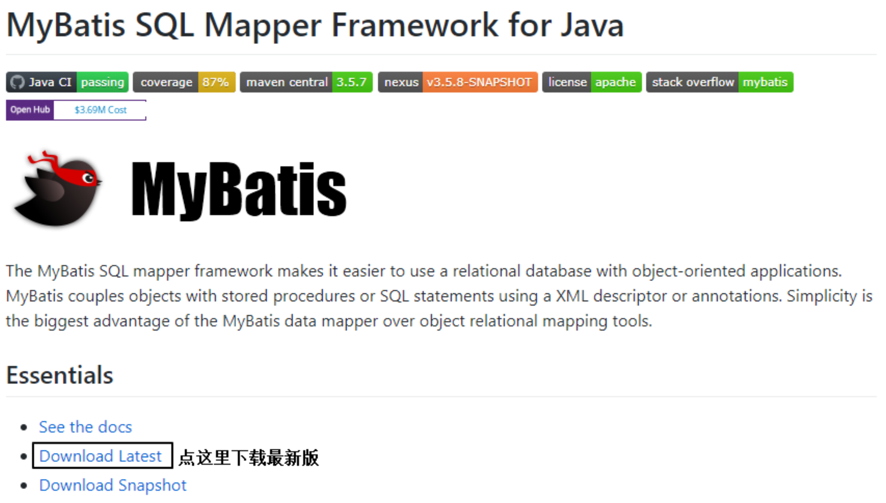
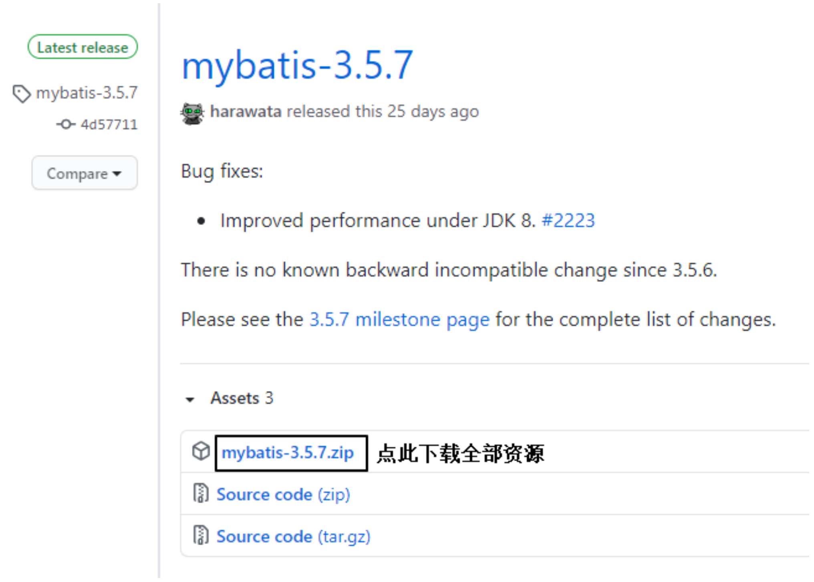

# MyBatis简介

## MyBatis历史

MyBatis最初是Apache的一个开源项目**iBatis**, 2010年6月这个项目由Apache Software Foundation迁 移到了Google Code。随着开发团队转投Google Code旗下， iBatis3.x正式更名为MyBatis。代码于 2013年11月迁移到Github。 iBatis一词来源于“internet”和“abatis”的组合，是一个基于Java的持久层框架。 iBatis提供的持久层框架 包括SQL Maps和Data Access Objects(DAO)。

## MyBatis特性

1) MyBatis 是支持定制化 SQL、存储过程以及高级映射的优秀的持久层框架
2) MyBatis 避免了几乎所有的 JDBC 代码和手动设置参数以及获取结果集
3) MyBatis可以使用简单的XML或注解用于配置和原始映射，将接口和Java的POJO(Plain Old Java Objects，普通的Java对象)映射成数据库中的记录
4) MyBatis 是一个 半自动的ORM(Object Relation Mapping)框架

## MyBatis下载

MyBatis下载地址:https://github.com/mybatis/mybatis-3





## 和其它持久化层技术对比

- JDBC

  - SQL 夹杂在Java代码中耦合度高，导致硬编码内伤 

  - 维护不易且实际开发需求中 SQL 有变化，频繁修改的情况多见 

  - 代码冗长，开发效率低

- Hibernate 和 JPA

  - 操作简便，开发效率高

  - 程序中的长难复杂 SQL 需要绕过框架
  - 内部自动生产的 SQL，不容易做特殊优化 
  - 基于全映射的全自动框架，大量字段的 POJO 进行部分映射时比较困难。 
  - 反射操作太多，导致数据库性能下降

- MyBatis

  - 轻量级，性能出色

  - SQL 和 Java 编码分开，功能边界清晰。Java代码专注业务、SQL语句专注数据

  - 开发效率稍逊于HIbernate，但是完全能够接受

# 搭建MyBatis

## 开发环境

IDE:idea 2019.2 

构建工具:maven 3.5.4 

MySQL版本:MySQL 8 

MyBatis版本:MyBatis 3.5.7


**MySQL不同版本的注意事项**

1、驱动类driver-class-name

MySQL 5版本使用jdbc5驱动，驱动类使用:com.mysql.jdbc.Driver

MySQL 8版本使用jdbc8驱动，驱动类使用:com.mysql.cj.jdbc.Driver

2、连接地址url

MySQL 5版本的url:

jdbc:mysql://localhost:3306/ssm

MySQL 8版本的url:

jdbc:mysql://localhost:3306/ssm?serverTimezone=UTC

否则运行测试用例报告如下错误:

java.sql.SQLException: The server time zone value 'ÖÐ1ú±ê×1⁄4ʱ1⁄4ä' is unrecognized or represents more

## 创建maven工程

1. 打包方式:jar 

2. 引入依赖

```xml
<dependencies>
  <!-- Mybatis核心 -->
  <dependency>
    <groupId>org.mybatis</groupId>
    <artifactId>mybatis</artifactId>
    <version>3.5.7</version>
  </dependency>
  <!-- junit测试 -->
  <dependency>
    <groupId>junit</groupId>
    <artifactId>junit</artifactId>
    <version>4.12</version>
    <scope>test</scope>
  </dependency>
  <!-- MySQL驱动 -->
  <dependency>
    <groupId>mysql</groupId>
    <artifactId>mysql-connector-java</artifactId>
    <version>8.0.16</version>
  </dependency>
</dependencies>
```

## 创建MyBatis的核心配置文件

习惯上命名为mybatis-config.xml，这个文件名仅仅只是建议，并非强制要求。将来整合Spring之后，这个配置文件可以省略，所以大家操作时可以直接复制、粘贴。 核心配置文件主要用于配置连接数据库的环境以及MyBatis的全局配置信息 核心配置文件存放的位置是src/main/resources目录下

```xml
<?xml version="1.0" encoding="UTF-8" ?>
<!DOCTYPE configuration
        PUBLIC "-//mybatis.org//DTD Config 3.0//EN"
        "http://mybatis.org/dtd/mybatis-3-config.dtd">
<configuration>
    <!--设置连接数据库的环境-->
    <environments default="development">
        <environment id="development">
            <transactionManager type="JDBC"/>
            <dataSource type="POOLED">
                <property name="driver" value="com.mysql.cj.jdbc.Driver"/>
                <property name="url" value="jdbc:mysql://localhost:3306/ssm?serverTimezone=UTC"/>
                <property name="username" value="root"/>
                <property name="password" value="root123$"/>
            </dataSource>
        </environment>
    </environments>
    <!--引入映射文件-->
    <mappers>
        <mapper resource="mappers/UserMapper.xml"/>
    </mappers>
</configuration>
```

## 创建mapper接口

> MyBatis中的mapper接口相当于以前的dao。但是区别在于，mapper仅仅是接口，我们不需要提供实现类。

```java
public interface UserMapper {
    //添加用户信息
    int insertUser();
}
```

## 创建MyBatis的映射文件

相关概念:ORM(Object Relationship Mapping)对象关系映射。

- 对象:Java的实体类对象 
- 关系:关系型数据库 
- 映射:二者之间的对应关系

| Java 概念 | 数据库概念 |
| --------- | ---------- |
| 类        | 表         |
| 属性      | 字段/列    |
| 对象      | 记录/行    |

1、映射文件的命名规则:

表所对应的实体类的类名+Mapper.xml 

例如:表t_user，映射的实体类为User，所对应的映射文件为UserMapper.xml 

因此一个映射文件对应一个实体类，对应一张表的操作 

MyBatis映射文件用于编写SQL，访问以及操作表中的数据 

MyBatis映射文件存放的位置是src/main/resources/mappers目录下

2、 MyBatis中可以面向接口操作数据，要保证两个一致: 

a）mapper接口的全类名和映射文件的命名空间(namespace)保持一致 

b）mapper接口中方法的方法名和映射文件中编写SQL的标签的id属性保持一致

## 通过junit测试功能

```java
//获取核心配置文件的输入流
InputStream is = Resources.getResourceAsStream("mybatis-config.xml");
//获取SqlSessionFactoryBuilder对象
SqlSessionFactoryBuilder sqlSessionFactoryBuilder = new SqlSessionFactoryBuilder();
//获取SqlSessionFactory对象
SqlSessionFactory sqlSessionFactory = sqlSessionFactoryBuilder.build(is);
//获取sql的会话对象SqlSession(不会自动提交事务)，是MyBatis提供的操作数据库的对象
SqlSession sqlSession = sqlSessionFactory.openSession();
//获取sql的会话对象SqlSession(会自动提交事务)，是MyBatis提供的操作数据库的对象
//SqlSession sqlSession = sqlSessionFactory.openSession(true);
//获取UserMapper的代理实现类对象
UserMapper mapper = sqlSession.getMapper(UserMapper.class);
//调用mapper接口中的方法，实现添加用户信息的功能
int result = mapper.insertUser();
System.out.println("结果："+result);
//提交事务
sqlSession.commit();
//关闭SqlSession
sqlSession.close();
```

- SqlSession：代表Java程序和**数据库**之间的**会话**。(HttpSession是Java程序和浏览器之间的 会话)
- SqlSessionFactory：是“生产”SqlSession的“工厂”。 
- 工厂模式：如果创建某一个对象，使用的过程基本固定，那么我们就可以把创建这个对象的 相关代码封装到一个“工厂类”中，以后都使用这个工厂类来“生产”我们需要的对象。

## 加入log4j日志功能

### 加入依赖

```xml
<!-- log4j日志 -->
<dependency>
    <groupId>log4j</groupId>
    <artifactId>log4j</artifactId>
    <version>1.2.17</version>
</dependency>
```

### 加入log4j的配置文件

```xml
<?xml version="1.0" encoding="UTF-8" ?>
<!DOCTYPE log4j:configuration SYSTEM "log4j.dtd">
<log4j:configuration xmlns:log4j="http://jakarta.apache.org/log4j/">
    <appender name="STDOUT" class="org.apache.log4j.ConsoleAppender">
        <param name="Encoding" value="UTF-8"/>
        <layout class="org.apache.log4j.PatternLayout">
            <param name="ConversionPattern" value="%-5p %d{MM-dd HH:mm:ss,SSS}
%m  (%F:%L) \n"/>
        </layout>
    </appender>
    <logger name="java.sql">
        <level value="debug"/>
    </logger>
    <logger name="org.apache.ibatis">
        <level value="info"/>
    </logger>
    <root>
        <level value="debug"/>
        <appender-ref ref="STDOUT"/>
    </root>
</log4j:configuration>
```

**日志的级别**

FATAL(致命)>ERROR(错误)>WARN(警告)>INFO(信息)>DEBUG(调试) 从左到右打印的内容越来越详细

# MyBatis的增删改查

## 新增

```xml
<!--int insertUser();-->
<insert id="insertUser">
insert into t_user values(null,'admin','123456',23,'男')
</insert>
```

## 删除

```xml
<!--int deleteUser();-->
<delete id="deleteUser">
    delete from t_user where id = 7
</delete>
```

## 修改

```xml
<!--int updateUser();-->
<update id="updateUser">
    update t_user set username='ybc',password='123' where id = 6
</update>
```

## 查询一个实体类对象

```xml
<!--User getUserById();-->
<select id="getUserById" resultType="com.example.mybatis.pojo.User">
  select * from t_user where id = 1
</select>
```

## 查询list集合

```xml
<select id="getAllUser" resultType="com.example.mybatis.pojo.User">
  select * from t_user
</select>
```

注意：

1、查询的标签select必须设置属性resultType或resultMap，用于设置实体类和数据库表的映射关系

resultType:自动映射，用于属性名和表中字段名一致的情况 

resultMap:自定义映射，用于一对多或多对一或字段名和属性名不一致的情况

# 核心配置文件详解

```xml
<?xml version="1.0" encoding="UTF-8" ?>
<!DOCTYPE configuration
        PUBLIC "-//mybatis.org//DTD Config 3.0//EN"
        "http://mybatis.org/dtd/mybatis-3-config.dtd">

<configuration>

    <!--
        MyBatis核心配置文件中的标签必须要按照指定的顺序配置：
        properties?,settings?,typeAliases?,typeHandlers?,
        objectFactory?,objectWrapperFactory?,reflectorFactory?,
        plugins?,environments?,databaseIdProvider?,mappers?
    -->

    <!--引入properties文件，此后就可以在当前文件中使用${key}的方式访问value-->
    <properties resource="jdbc.properties" />

    <!--
        typeAliases：设置类型别名，即为某个具体的类型设置一个别名
        在MyBatis的范围中，就可以使用别名表示一个具体的类型
    -->
    <typeAliases>
        <!--
            type：设置需要起别名的类型
            alias：设置某个类型的别名
        -->
        <!--<typeAlias type="com.example.mybatis.pojo.User" alias="abc"></typeAlias>-->
        <!--若不设置alias，当前的类型拥有默认的别名，即类名且不区分大小写-->
        <!--<typeAlias type="com.example.mybatis.pojo.User"></typeAlias>-->
        <!--通过包设置类型别名，指定包下所有的类型将全部拥有默认的别名，即类名且不区分大小写-->
        <package name="com.example.mybatis.pojo"/>
    </typeAliases>

    <!--
        environments：配置连接数据库的环境
        属性：
        default：设置默认使用的环境的id
    -->
    <environments default="development">
        <!--
            environment：设置一个具体的连接数据库的环境
            属性：
            id：设置环境的唯一标识，不能重复
        -->
        <environment id="development">
            <!--
                transactionManager：设置事务管理器
                属性：
                type：设置事务管理的方式
                type="JDBC|MANAGED"
                JDBC：表示使用JDBC中原生的事务管理方式
                MANAGED：被管理，例如Spring
            -->
            <transactionManager type="JDBC"/>
            <!--
                dataSource：设置数据源
                属性：
                type：设置数据源的类型
                type="POOLED|UNPOOLED|JNDI"
                POOLED：表示使用数据库连接池
                UNPOOLED：表示不使用数据库连接池
                JNDI：表示使用上下文中的数据源
            -->
            <dataSource type="POOLED">
                <property name="driver" value="${jdbc.driver}"/>
                <property name="url" value="${jdbc.url}"/>
                <property name="username" value="${jdbc.username}"/>
                <property name="password" value="${jdbc.password}"/>
            </dataSource>
        </environment>

        <environment id="test">
            <transactionManager type="JDBC"/>
            <dataSource type="POOLED">
                <property name="driver" value="com.mysql.cj.jdbc.Driver"/>
                <property name="url" value="jdbc:mysql://localhost:3306/ssm?serverTimezone=UTC"/>
                <property name="username" value="root"/>
                <property name="password" value="root123$"/>
            </dataSource>
        </environment>
    </environments>

    <!--引入mybatis的映射文件-->
    <mappers>
        <!--<mapper resource="mappers/UserMapper.xml"/>-->
        <!--
            以包的方式引入映射文件，但是必须满足两个条件：
            1、mapper接口和映射文件所在的包必须一致
            2、mapper接口的名字和映射文件的名字必须一致
        -->
        <package name="com.example.mybatis.mapper"/>
    </mappers>
</configuration>
```

# MyBatis获取参数值的方式

MyBatis获取参数值的两种方式：**${}**和**#{}**

- ${}的本质就是字符串拼接，#{}的本质就是占位符赋值 
- ${}使用字符串拼接的方式拼接sql，若为字符串类型或日期类型的字段进行赋值时，需要手动加单引号;
- 但是#{}使用占位符赋值的方式拼接sql，此时为字符串类型或日期类型的字段进行赋值时， 可以自动添加单引号

## 单个字面量类型的参数

若mapper接口中的方法参数为单个的字面量类型

此时可以使用${}和#{}以任意的名称获取参数的值，注意${}需要手动加单引号

```java
User getUserByUsername(String username);
```

```xml
<select id="getUserByUsername" resultType="User">
  <!-- select * from t_user where username = #{username} -->
  select * from t_user where username = '${username}'
</select>
```

## 多个字面量类型的参数

若mapper接口中的方法参数为多个时 此时MyBatis会自动将这些参数放在一个map集合中

以arg0,arg1...为键，以参数为值;

以param1,param2...为键，以参数为值;

因此只需要通过${}和#{}访问map集合的键就可以获取相 对应的值，注意${}需要手动加单引号

```java
User checkLogin(String username, String password);
```

```xml
<select id="checkLogin" resultType="User">
  <!-- select * from t_user where username = #{arg0} and password = #{arg1} -->
  <!-- select * from t_user where username = #{param1} and password = #{param2} -->
  select * from t_user where username = '${param1}' and password = '${param2}'
</select>
```

## map集合类型的参数

若mapper接口中的方法需要的参数为多个时，此时可以手动创建map集合，将这些数据放在 map中

只需要通过${}和#{}访问map集合的键就可以获取相对应的值，注意${}需要手动加单引号

```java
User checkLoginByMap(Map<String, Object> map);
```

```xml
<select id="checkLoginByMap" resultType="User">
  select * from t_user where username = #{username} and password = #{password}
</select>
```

## 实体类类型的参数

若mapper接口中的方法参数为实体类对象时 

此时可以使用${}和#{}，通过访问实体类对象中的属性名获取属性值，注意${}需要手动加单引号

```java
int insertUser(User user);
```

```xml
<insert id="insertUser">
  insert into t_user values(null, #{username}, #{password}, #{age}, #{gender}, #{email})
</insert>
```

## 使用@Param标识参数

可以通过@Param注解标识mapper接口中的方法参数 

此时，会将这些参数放在map集合中，以@Param注解的value属性值为键，以参数为值;以 param1,param2...为键，以参数为值;

只需要通过${}和#{}访问map集合的键就可以获取相对应 的值，注意${}需要手动加单引号

```java
User checkLoginByParam(@Param("username") String username, @Param("password") String password);
```

```xml
<select id="checkLoginByParam" resultType="User">
  select * from t_user where username = #{username} and password = #{password}
</select>
```

# MyBatis的查询功能

## 查询一个实体类对象

```java
/**
* 根据用户id查询用户信息 * @param id
* @return
*/
User getUserById(@Param("id") int id);
```

```xml
<select id="getUserById" resultType="User">
    select * from t_user where id = #{id}
</select>
```

## 查询一个list集合

```java
/**
* 查询所有用户信息 * @return
*/
List<User> getUserList();
```

```xml
<select id="getUserList" resultType="User">
    select * from t_user
</select>
```

当查询的数据为多条时，不能使用实体类作为返回值，否则会抛出异常 TooManyResultsException;但是若查询的数据只有一条，可以使用实体类或集合作为返回值

## 查询单个数据

```java
/**
* 查询用户的总记录数
* @return
* 在MyBatis中，对于Java中常用的类型都设置了类型别名 * 例如: java.lang.Integer-->int|integer
* 例如: int-->_int|_integer
* 例如: Map-->map,List-->list
*/
int getCount();
```

```xml
<select id="getCount" resultType="_integer">
    select count(id) from t_user
</select>
```

## 查询一条数据为map集合

```java
/**
* 根据用户id查询用户信息为map集合 * @param id
* @return
*/
Map<String, Object> getUserToMap(@Param("id") int id);
```

```xml
<!--结果: {password=123456, sex=男 , id=1, age=23, username=admin}--> 
<select id="getUserToMap" resultType="map">
    select * from t_user where id = #{id}
</select>
```

## 查询多条数据为map集合

### 方式一

```java
/**
* 查询所有用户信息为map集合
* @return
* 将表中的数据以map集合的方式查询，一条数据对应一个map;若有多条数据，就会产生多个map集合，此 时可以将这些map放在一个list集合中获取
*/
List<Map<String, Object>> getAllUserToMap();
```

```xml
<select id="getAllUserToMap" resultType="map">
    select * from t_user
</select>
```

### 方式二

```java
/**
* 查询所有用户信息为map集合
* @return
* 将表中的数据以map集合的方式查询，一条数据对应一个map;若有多条数据，就会产生多个map集合，并 且最终要以一个map的方式返回数据，此时需要通过@MapKey注解设置map集合的键，值是每条数据所对应的 map集合
*/
@MapKey("id")
Map<String, Object> getAllUserToMap();
```

```xml
<!--
{
1={password=123456, sex=男, id=1, age=23, username=admin}, 
2={password=123456, sex=男, id=2, age=23, username=张三}, 
3={password=123456, sex=男, id=3, age=23, username=张三}
}
-->
<select id="getAllUserToMap" resultType="map">
    select * from t_user
</select>
```

# 特殊SQL的执行

## 模糊查询

```java
User getUserByLike(@Param("keyword") String keyword);
```

```xml
<select id="getUserByLike" resultType="User">
  <!-- select * from t_user where username like '%${keyword}%' -->
  <!-- select * from t_user where username like concat('%', #{keyword}, '%') -->
  select * from t_user where username like "%"#{keyword}"%"
</select>
```

## 批量删除

```java
int deleteAll(@Param("ids") String ids);
```

```xml
<delete id="deleteAll">
  delete from t_user where id in(${ids})
</delete>
```

## 动态设置表名

```java
/**
* 动态设置表名，查询所有的用户信息 * @param tableName
* @return
*/
List<User> getAllUser(@Param("tableName") String tableName);
```

```xml
<select id="getAllUser" resultType="User">
  select * from ${tableName}
</select>
```

## 添加功能获取自增的主键

场景模拟:

t_clazz(clazz_id,clazz_name) t_student(student_id,student_name,clazz_id) 

1、添加班级信息

2、获取新添加的班级的id 

3、为班级分配学生，即将某学的班级id修改为新添加的班级的id

```java
/**
* 添加用户信息
* @param user
* @return
* useGeneratedKeys:设置使用自增的主键
* keyProperty:因为增删改有统一的返回值是受影响的行数，因此只能将获取的自增的主键放在传输的参
数user对象的某个属性中 */
int insertUser(User user);
```

```xml
<insert id="insertUser" useGeneratedKeys="true" keyProperty="id">
	insert into t_user values (null, #{username}, #{password}, #{age}, #{gender}, #{email})
</insert>
```

# 自定义映射resultMap

## resultMap处理字段和属性的映射关系

```xml
<!--
  resultMap:设置自定义映射
  属性:
  id:表示自定义映射的唯一标识 
	type:查询的数据要映射的实体类的类型 

	子标签:
  id:设置主键的映射关系 
	result:设置普通字段的映射关系
  association:设置多对一的映射关系 
	collection:设置一对多的映射关系

  属性: 
	property:设置映射关系中实体类中的属性名 
	column:设置映射关系中表中的字段名
-->
<resultMap id="empResultMap" type="Emp">
  <id column="emp_id" property="empId"></id>
  <result column="emp_name" property="empName"></result>
  <result column="age" property="age"></result>
  <result column="gender" property="gender"></result>
</resultMap>

<select id="getEmpByEmpId" resultMap="empResultMap">
  select * from t_emp where emp_id = #{empId}
</select>
```

若字段名和实体类中的属性名不一致，但是字段名符合数据库的规则(使用_)，实体类中的属性名符合Java的规则(使用驼峰)
此时也可通过以下两种方式处理字段名和实体类中的属性的映射关系 

1）可以通过为字段起别名的方式，保证和实体类中的属性名保持一致

```xml
<select id="getEmpByEmpId" resultType="Emp">
  select emp_id as empId, emp_name as empName, age as age, gender as gender from t_emp where emp_id = #{empId}
</select>
```

2）可以在MyBatis的核心配置文件中设置一个全局配置信息mapUnderscoreToCamelCase，可以在查询表中数据时，自动将_类型的字段名转换为驼峰

例如：字段名emp_name，设置了mapUnderscoreToCamelCase，此时字段名就会转换为 empName

```xml
<settings>
	<setting name="mapUnderscoreToCamelCase" value="true"/>
</settings>
```

## 多对一映射处理

场景模拟:

查询员工信息以及员工所对应的部门信息

```java
// 员工信息
public class Emp {
    private Integer empId;
    private String empName;
    private Integer age;
    private String gender;
    private Dept dept; // 所属部门
}

// 部门信息
public class Dept {
    private Integer deptId;
    private String deptName;
}
```


### 级联方式处理映射关系

```java
// 获取员工以及所对应的部门信息
Emp getEmpAndDeptByEmpId(@Param("empId") Integer empId);
```

```xml
<resultMap id="empResultMap" type="Emp">
  <id column="emp_id" property="empId"></id>
  <result column="emp_name" property="empName"></result>
  <result column="age" property="age"></result>
  <result column="gender" property="gender"></result>
  <result column="dept_id" property="dept.deptId"></result>
  <result column="dept_name" property="dept.deptName"></result>
</resultMap>

<select id="getEmpAndDeptByEmpId" resultMap="empResultMap">
  select t_emp.*, t_dept.*
  from t_emp
  left join t_dept on t_emp.dept_id = t_dept.dept_id
  where t_emp.emp_id = #{empId}
</select>
```

### 使用association处理映射关系

```java
// 获取员工以及所对应的部门信息
Emp getEmpAndDeptByEmpId(@Param("empId") Integer empId);
```

```xml
<resultMap id="empResultMap" type="Emp">
  <id column="emp_id" property="empId"></id>
  <result column="emp_name" property="empName"></result>
  <result column="age" property="age"></result>
  <result column="gender" property="gender"></result>
  <association property="dept" javaType="Dept">
    <id column="dept_id" property="deptId"></id>
    <result column="dept_name" property="deptName"></result>
  </association>
</resultMap>

<select id="getEmpAndDeptByEmpId" resultMap="empResultMap">
  select t_emp.*, t_dept.*
  from t_emp
  left join t_dept on t_emp.dept_id = t_dept.dept_id
  where t_emp.emp_id = #{empId}
</select>
```

## 分步查询

### 查询员工信息

```java
public interface EmpMapper{
  // 分步查询第一步：根据员工ID查询员工信息
	Emp getEmpAndDeptByEmpId(@Param("empId") Integer empId);
}
```

```xml
<resultMap id="empResultMap" type="Emp">
  <id column="emp_id" property="empId"></id>
  <result column="emp_name" property="empName"></result>
  <result column="age" property="age"></result>
  <result column="gender" property="gender"></result>
  <!--
      select:设置分步查询，查询某个属性的值的sql的标识(namespace.sqlId)
      column:将sql以及查询结果中的某个字段设置为分步查询的条件 
	-->
  <association 
               property="dept" 
               select="com.example.mybatis.mapper.DeptMapper.getDeptByDeptId" 
               column="dept_id"></association>
</resultMap>

<select id="getEmpAndDeptByEmpId" resultMap="empResultMap">
  select *
  from t_emp
  where emp_id = #{empId}
</select>
```

### 根据员工所对应的部门id查询部门信息

```java
public interface DeptMapper {
  	//分步查询的第二步: 根据员工所对应的dept_id查询部门信息
    Dept getDeptByDeptId(@Param("deptId") Integer deptId);
}
```

```xml
<mapper namespace="com.example.mybatis.mapper.DeptMapper">
    <select id="getDeptByDeptId" resultType="Dept">
        select * from t_dept where dept_id = #{deptId}
    </select>
</mapper>
```

