# 关键词挖掘

## 长尾词、相关词

- 工具：5188 https://www.5118.com/ci

  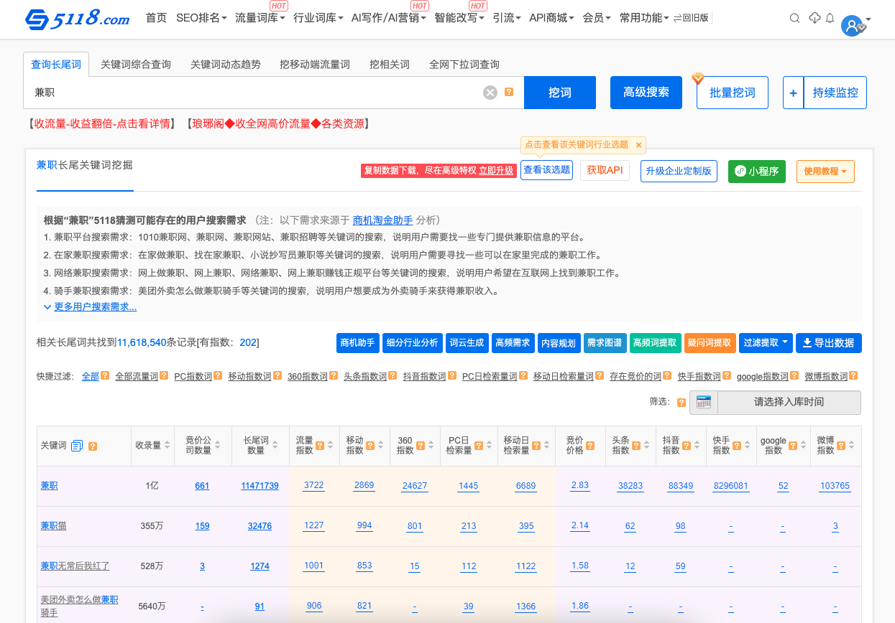

## 竞品词

- 工具：爱站网百度权重查询 https://baidurank.aizhan.com/mobile/www.1010jz.com/

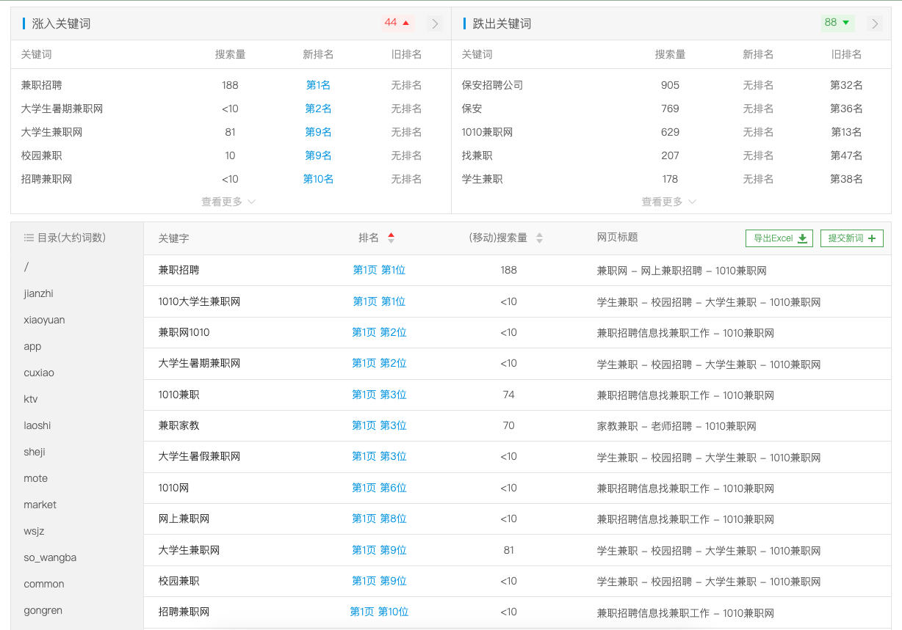

## 双标题

- 将关键词和搜索下拉的词组合，成为两个关键词组合的标题

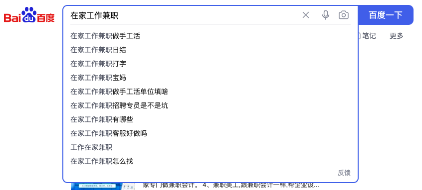

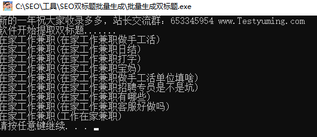

# 小旋风蜘蛛池安装

## 域名解析

提前进行域名解析，*代表泛二级域名

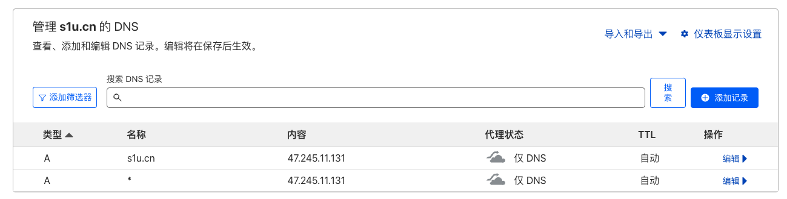

## 宝塔配置

### 环境安装

确保宝塔安装了蜘蛛池运行所需的软件，Nginx、MySQL、PHP（7.2）

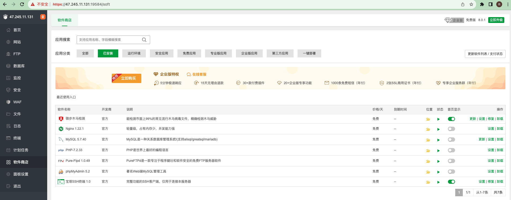

### 添加站点

记得选择PHP版本

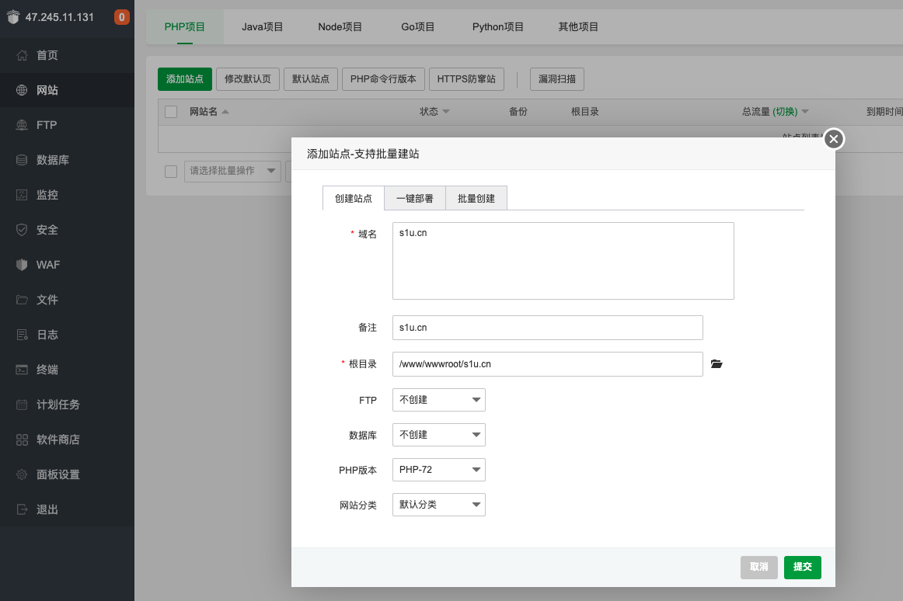

### 添加域名

点击`网站名`，添加域名，这里添加了 `*.s1u.cn`，支持二级域名访问

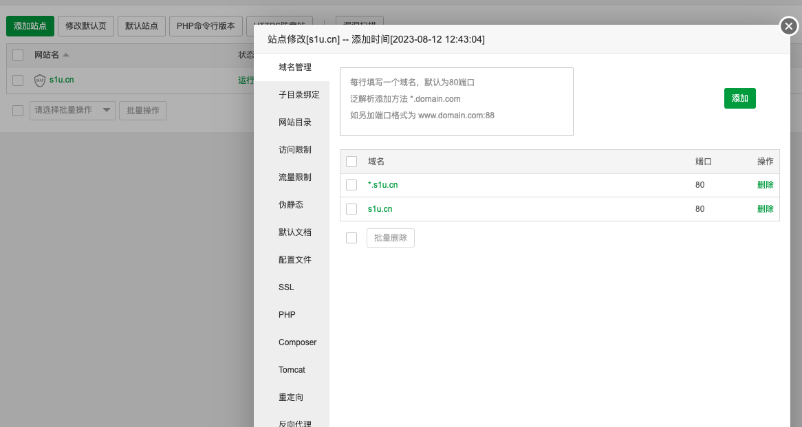

### 上传蜘蛛池程序

点击 `/www/wwwroot/s1u.cn`，上传文件

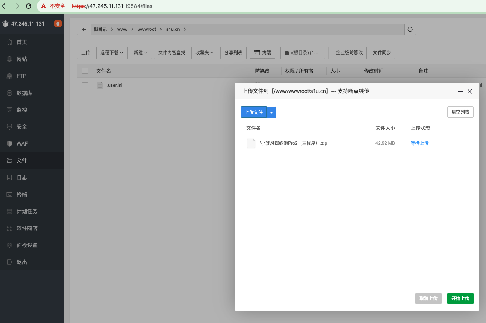

- 解压安装包

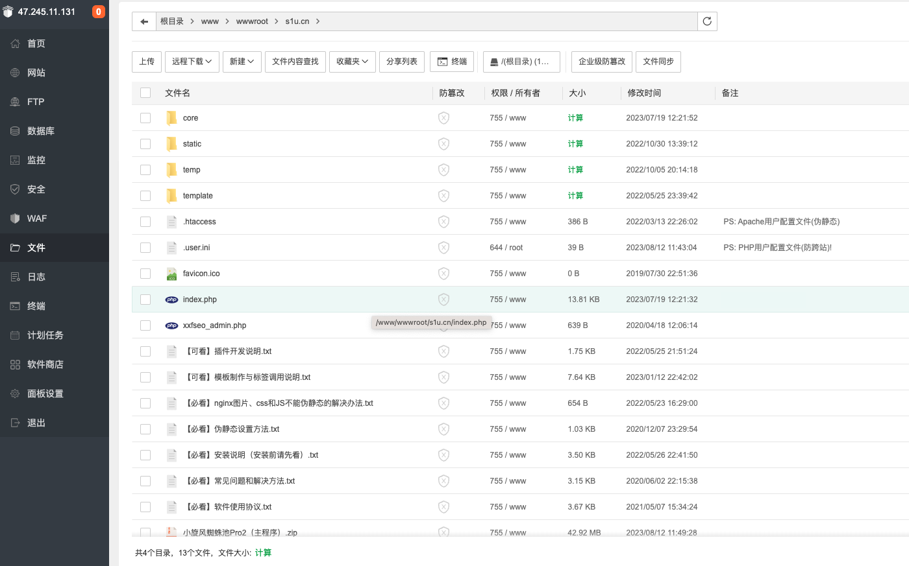

## 安装蜘蛛池

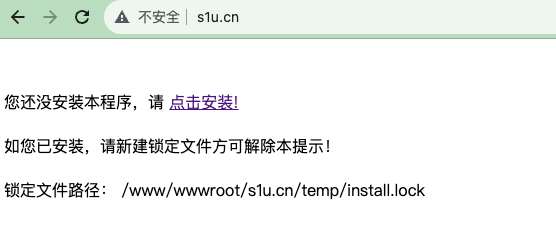

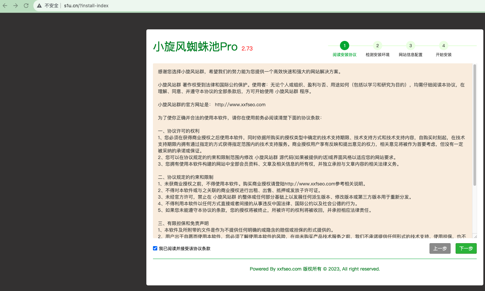

## 配置网站域名

因为小旋风蜘蛛池自带测试网站，并且已经配置好内容，所以这里修改域名，配置成前面解析的`s1u.cn`域名

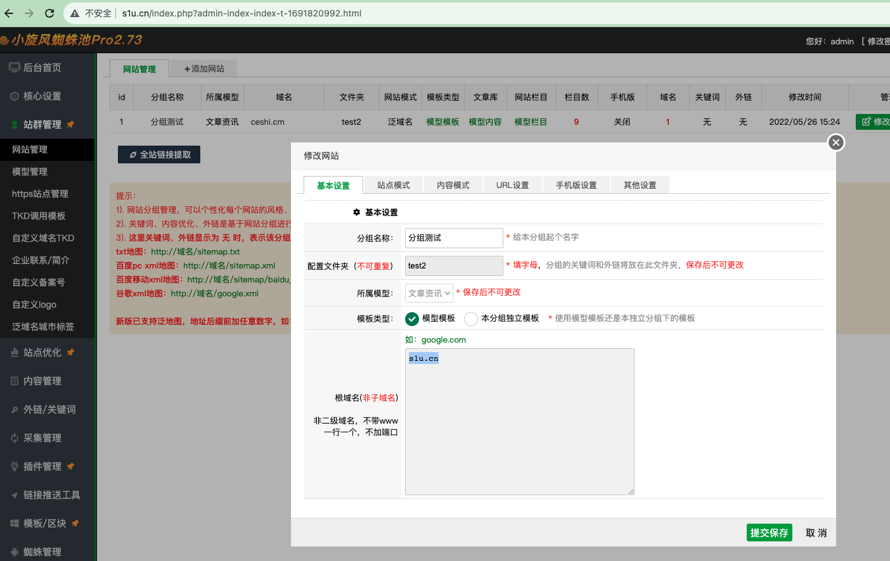

## Nginx 伪静态配置

- 打开宝塔目录`/www/wwwroot/s1u.cn/temp/rewrite`下文件`nginx的伪静态规则.txt`，并复制

```nginx
rewrite ^/template/(.*)\.html$ /index.php last;
rewrite ^/temp/(data|db|robotlog|tplrules|errpage|logs|session)/(.*)$ /index.php last;
rewrite ^/(temp|template|core|static)/(.*)\.php$ /index.php last;
if (!-e $request_filename){
  rewrite ^/(.*)$ /index.php?$1 last;
}
```

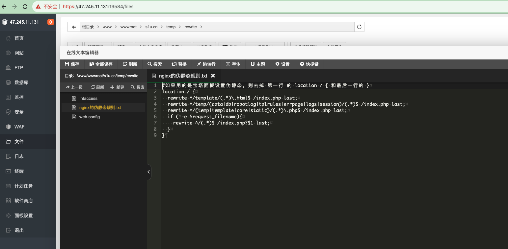

- 添加站点的nginx伪静态配置

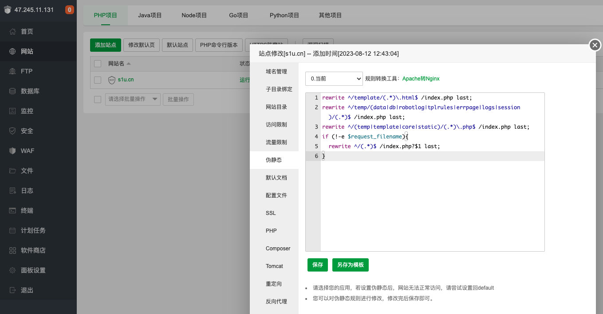


## 开启蜘蛛池状态

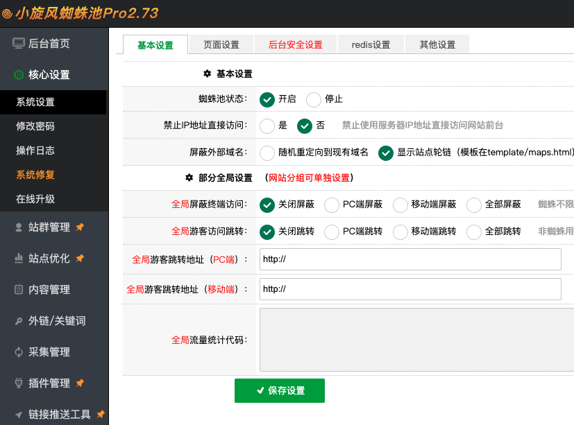

## 访问网站

- http://www.s1u.cn/

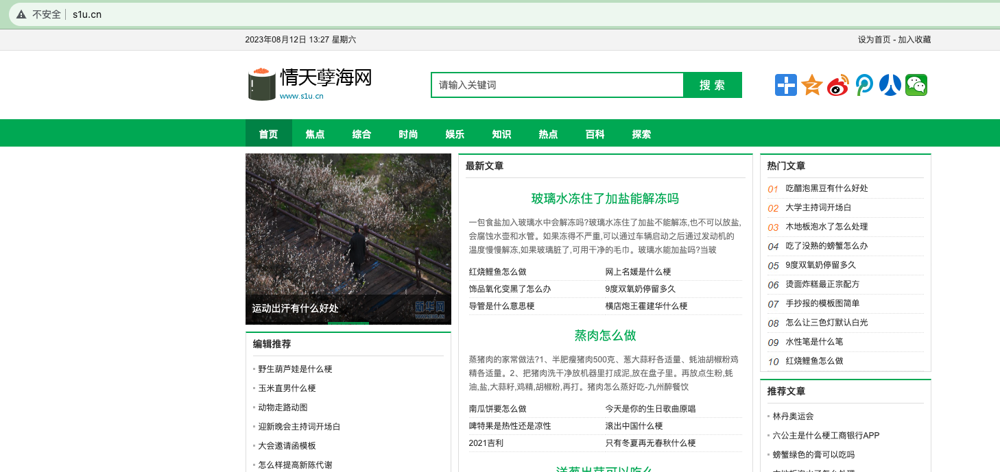

- http://bbs.s1u.cn/

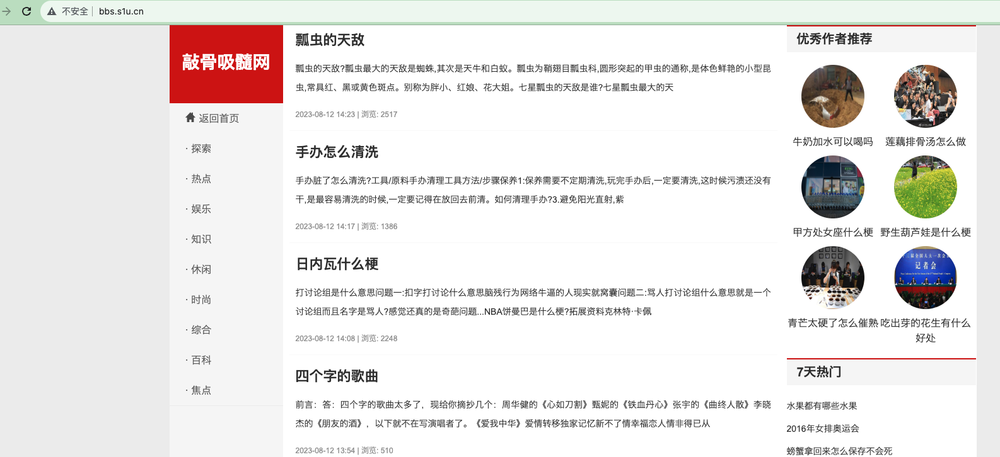

- http://flash.s1u.cn/

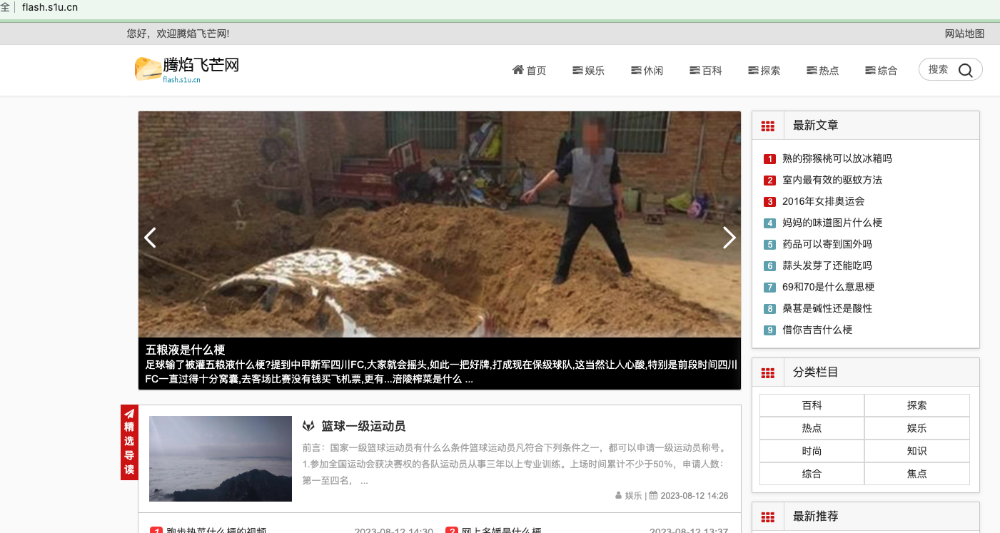


这三个域名之所以能够访问，是因为默认设置了`自定义泛域名`

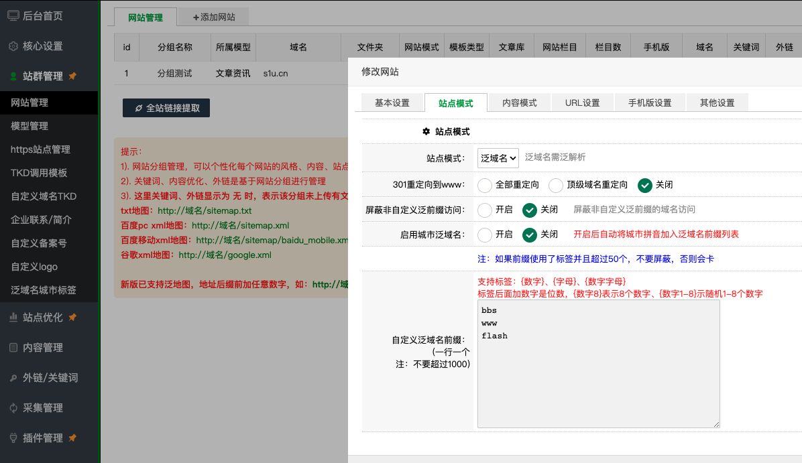

