# 0.导入商城项目

在课前资料中给大家提供了商城项目的资料，我们需要先导入这个单体项目。不过需要注意的是，本篇及后续的微服务学习都是基于Centos7系统下的Docker部署。

## 0.1.安装MySQL

在课前资料提供好了MySQL的一个目录：


其中有MySQL的配置文件和初始化脚本：


我们将其复制到虚拟机的`/root`目录。如果`/root`下已经存在`mysql`目录则删除旧的，如果不存在则直接复制本地的：

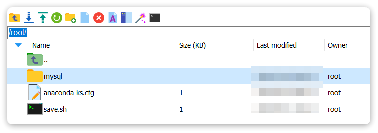

然后创建一个通用网络：

```bash
docker network create hm-net
```

使用下面的命令来安装MySQL：

```bash
docker run -d \
  --name mysql \
  -p 3306:3306 \
  -e TZ=Asia/Shanghai \
  -e MYSQL_ROOT_PASSWORD=Root1234$ \
  -v /root/mysql/data:/var/lib/mysql \
  -v /root/mysql/conf:/etc/mysql/conf.d \
  -v /root/mysql/init:/docker-entrypoint-initdb.d \
  --network hm-net\
  mysql
```

此时，通过命令查看mysql容器：

```bash
docker ps
```

如图：

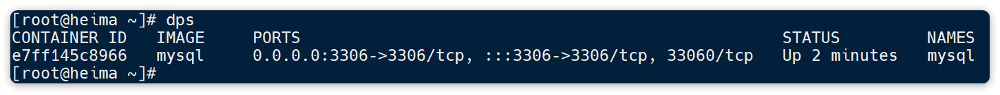

发现mysql容器正常运行。

> MySQL 8.x版本允许远程访问设置：https://www.cnblogs.com/wang_yb/p/15726976.html

此时，如果我们使用MySQL的客户端工具连接MySQL，应该能发现已经创建了商城所需要的表：

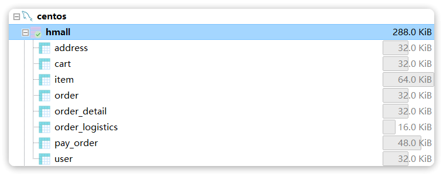

## 0.2.后端

然后是Java代码，在课前资料提供了一个hmall目录：


将其复制到你的工作空间，然后利用Idea打开。

项目结构如下：

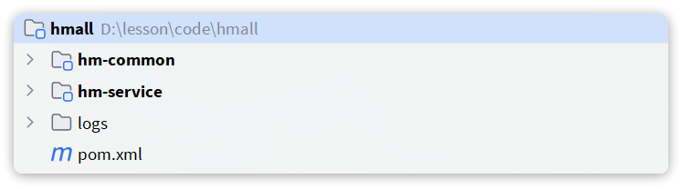

按下`ALT` + `8`键打开services窗口，新增一个启动项：


在弹出窗口中鼠标向下滚动，找到`Spring Boot`:

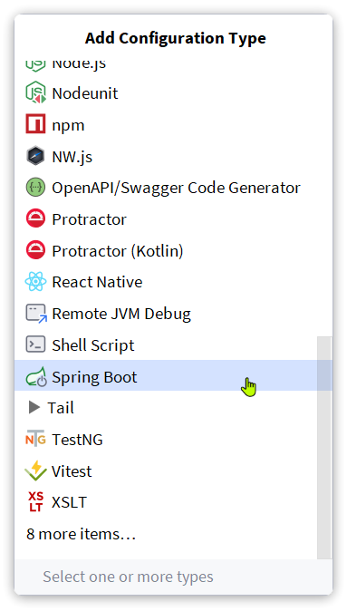

点击后应该会在services中出现hmall的启动项：


点击对应按钮，即可实现运行或DEBUG运行。

我们还需要对这个启动项做简单配置，在`HMallApplication`上点击鼠标右键，会弹出窗口，然后选择`Edit Configuration`：


在弹出窗口中配置SpringBoot的启动环境为local：


点击OK配置完成。接下来就可以运行了！

启动完成后，试试看访问下 http://localhost:8080/hi 吧！

## 0.3.前端

在课前资料中还提供了一个hmall-nginx的目录：

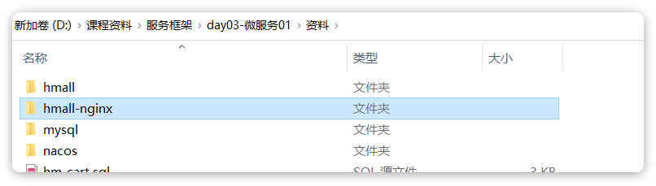

其中就是一个nginx程序以及我们的前端代码，直接在windows下将其复制到一个非中文、不包含特殊字符的目录下。然后进入hmall-nginx后，利用cmd启动即可：

```powershell
# 启动nginx
start nginx.exe
# 停止
nginx.exe -s stop
# 重新加载配置
nginx.exe -s reload
# 重启
nginx.exe -s restart
```

启动成功后，访问http://localhost:18080，应该能看到我们的门户页面：


# 1.认识微服务

## 1.1.单体架构

单体架构（monolithic structure）：顾名思义，整个项目中所有功能模块都在一个工程中开发；项目部署时需要对所有模块一起编译、打包；项目的架构设计、开发模式都非常简单。


当项目规模较小时，这种模式上手快，部署、运维也都很方便，因此早期很多小型项目都采用这种模式。

但随着项目的业务规模越来越大，团队开发人员也不断增加，单体架构就呈现出越来越多的问题：

- **团队协作成本高**：试想一下，你们团队数十个人同时协作开发同一个项目，由于所有模块都在一个项目中，不同模块的代码之间物理边界越来越模糊。最终要把功能合并到一个分支，你绝对会陷入到解决冲突的泥潭之中。
- **系统发布效率低**：任何模块变更都需要发布整个系统，而系统发布过程中需要多个模块之间制约较多，需要对比各种文件，任何一处出现问题都会导致发布失败，往往一次发布需要数十分钟甚至数小时。
- **系统可用性差**：单体架构各个功能模块是作为一个服务部署，相互之间会互相影响，一些热点功能会耗尽系统资源，导致其它服务低可用。

在上述问题中，前两点相信大家在实战过程中应该深有体会。对于第三点系统可用性问题，很多同学可能感触不深。接下来我们就通过商城这个项目，给大家做一个简单演示。

首先，我们修改hm-service模块下的`com.hmall.controller.HelloController`中的`hello`方法，模拟方法执行时的耗时：


接下来，启动项目，目前有两个接口是无需登录即可访问的：

- `http://localhost:8080/hi`
- `http://localhost:8080/search/list`

经过测试，目前`/search/list` 是比较正常的，访问耗时在30毫秒左右。

接下来，我们假设`/hi`这个接口是一个并发较高的热点接口，我们通过Jemeter来模拟500个用户不停访问。在课前资料中已经提供了Jemeter的测试脚本：


导入Jemeter并测试：


这个脚本会开启500个线程并发请求`http://localhost/hi`这个接口。由于该接口存在执行耗时（500毫秒），这就服务端导致每秒能处理的请求数量有限，最终会有越来越多请求积压，直至Tomcat资源耗尽。这样，其它本来正常的接口（例如`/search/list`）也都会被拖慢，甚至因超时而无法访问了。

我们测试一下，启动测试脚本，然后在浏览器访问`http://localhost:8080/search/list`这个接口，会发现响应速度非常慢：

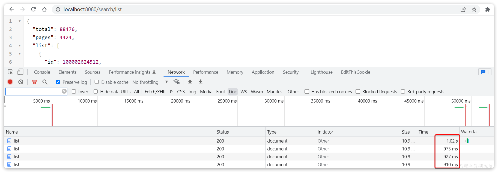

如果进一步提高`/hi`这个接口的并发，最终会发现`/search/list`接口的请求响应速度会越来越慢。

可见，单体架构的可用性是比较差的，功能之间相互影响比较大。

当然，有同学会说我们可以做水平扩展。

此时如果我们对系统做水平扩展，增加更多机器，资源还是会被这样的热点接口占用，从而影响到其它接口，并不能从根本上解决问题。这也就是单体架构的扩展性差的一个原因。

而要想解决这些问题，就需要使用微服务架构了。

## 1.2.微服务

微服务架构，首先是服务化，就是将单体架构中的功能模块从单体应用中拆分出来，独立部署为多个服务。同时要满足下面的一些特点：

- **单一职责**：一个微服务负责一部分业务功能，并且其核心数据不依赖于其它模块。
- **团队自治**：每个微服务都有自己独立的开发、测试、发布、运维人员，团队人员规模不超过10人（2张披萨能喂饱）
- **服务自治**：每个微服务都独立打包部署，访问自己独立的数据库。并且要做好服务隔离，避免对其它服务产生影响

例如，商城项目，我们就可以把商品、用户、购物车、交易等模块拆分，交给不同的团队去开发，并独立部署：


那么，单体架构存在的问题有没有解决呢？

- 团队协作成本高？
  - 由于服务拆分，每个服务代码量大大减少，参与开发的后台人员在1~3名，协作成本大大降低
- 系统发布效率低？
  - 每个服务都是独立部署，当有某个服务有代码变更时，只需要打包部署该服务即可
- 系统可用性差？
  - 每个服务独立部署，并且做好服务隔离，使用自己的服务器资源，不会影响到其它服务。

综上所述，微服务架构解决了单体架构存在的问题，特别适合大型互联网项目的开发，因此被各大互联网公司普遍采用。大家以前可能听说过分布式架构，分布式就是服务拆分的过程，其实微服务架构正是分布式架构的一种最佳实践的方案。

当然，微服务架构虽然能解决单体架构的各种问题，但在拆分的过程中，还会面临很多其它问题。比如：

- 如果出现跨服务的业务该如何处理？
- 页面请求到底该访问哪个服务？
- 如何实现各个服务之间的服务隔离？

这些问题，我们在后续的学习中会给大家逐一解答。

## 1.3.SpringCloud

微服务拆分以后碰到的各种问题都有对应的解决方案和微服务组件，而SpringCloud框架可以说是目前Java领域最全面的微服务组件的集合了。


而且SpringCloud依托于SpringBoot的自动装配能力，大大降低了其项目搭建、组件使用的成本。对于没有自研微服务组件能力的中小型企业，使用SpringCloud全家桶来实现微服务开发可以说是最合适的选择了！

https://spring.io/projects/spring-cloud#overview

目前SpringCloud最新版本为`2022.0.x`版本，对应的SpringBoot版本为`3.x`版本，但它们全部依赖于JDK17，目前在企业中使用相对较少。

| **SpringCloud版本**                                          | **SpringBoot版本**                    |
| :----------------------------------------------------------- | :------------------------------------ |
| [2022.0.x](https://github.com/spring-cloud/spring-cloud-release/wiki/Spring-Cloud-2022.0-Release-Notes) aka Kilburn | 3.0.x                                 |
| [2021.0.x](https://github.com/spring-cloud/spring-cloud-release/wiki/Spring-Cloud-2021.0-Release-Notes) aka Jubilee | 2.6.x, 2.7.x (Starting with 2021.0.3) |
| [2020.0.x](https://github.com/spring-cloud/spring-cloud-release/wiki/Spring-Cloud-2020.0-Release-Notes) aka Ilford | 2.4.x, 2.5.x (Starting with 2020.0.3) |
| [Hoxton](https://github.com/spring-cloud/spring-cloud-release/wiki/Spring-Cloud-Hoxton-Release-Notes) | 2.2.x, 2.3.x (Starting with SR5)      |
| [Greenwich](https://github.com/spring-projects/spring-cloud/wiki/Spring-Cloud-Greenwich-Release-Notes) | 2.1.x                                 |
| [Finchley](https://github.com/spring-projects/spring-cloud/wiki/Spring-Cloud-Finchley-Release-Notes) | 2.0.x                                 |
| [Edgware](https://github.com/spring-projects/spring-cloud/wiki/Spring-Cloud-Edgware-Release-Notes) | 1.5.x                                 |
| [Dalston](https://github.com/spring-projects/spring-cloud/wiki/Spring-Cloud-Dalston-Release-Notes) | 1.5.x                                 |

因此，我们推荐使用次新版本：Spring Cloud 2021.0.x以及Spring Boot 2.7.x版本。

另外，Alibaba的微服务产品SpringCloudAlibaba目前也成为了SpringCloud组件中的一员，我们课堂中也会使用其中的部分组件。

在我们的父工程hmall中已经配置了SpringCloud以及SpringCloudAlibaba的依赖：


对应的版本：


这样，我们在后续需要使用SpringCloud或者SpringCloudAlibaba组件时，就无需单独指定版本了。

# 2.微服务拆分

接下来，我们就一起将商城这个单体项目拆分为微服务项目，并解决其中出现的各种问题。

## 2.1.熟悉商城

首先，我们需要熟悉商城项目的基本结构：


大家可以直接启动该项目，测试效果。不过，需要修改数据库连接参数，在application-local.yaml中：

```YAML
hm:
  db:
    host: 192.168.150.101 # 修改为你自己的虚拟机IP地址
    pw: 123 # 修改为docker中的MySQL密码
```

同时配置启动项激活的是local环境：


### 2.1.1.登录

首先来看一下登录业务流程：

暂时无法在飞书文档外展示此内容

登录入口在`com.hmall.controller.UserController`中的`login`方法：


### 2.2.2.搜索商品

在首页搜索框输入关键字，点击搜索即可进入搜索列表页面：


该页面会调用接口：`/search/list`，对应的服务端入口在`com.hmall.controller.SearchController`中的`search`方法：


这里目前是利用数据库实现了简单的分页查询。

### 2.2.3.购物车

在搜索到的商品列表中，点击按钮`加入购物车`，即可将商品加入购物车：


加入成功后即可进入购物车列表页，查看自己购物车商品列表：


同时这里还可以对购物车实现修改、删除等操作。

相关功能全部在`com.hmall.controller.CartController`中：


其中，查询购物车列表时，由于要判断商品最新的价格和状态，所以还需要查询商品信息，业务流程如下：

暂时无法在飞书文档外展示此内容

### 2.2.4.下单

在购物车页面点击`结算`按钮，会进入订单结算页面：

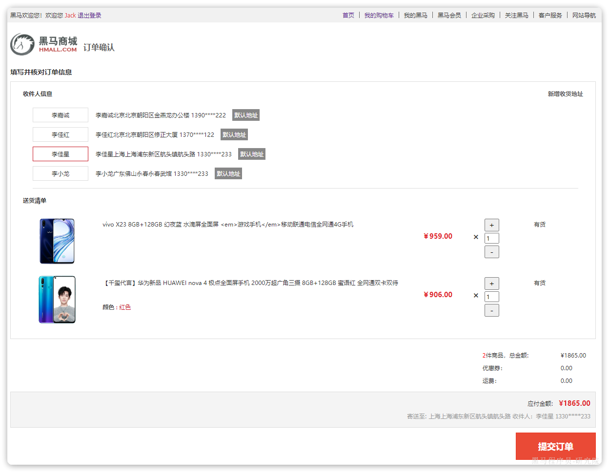

点击提交订单，会提交请求到服务端，服务端做3件事情：

- 创建一个新的订单
- 扣减商品库存
- 清理购物车中商品

业务入口在`com.hmall.controller.OrderController`中的`createOrder`方法：

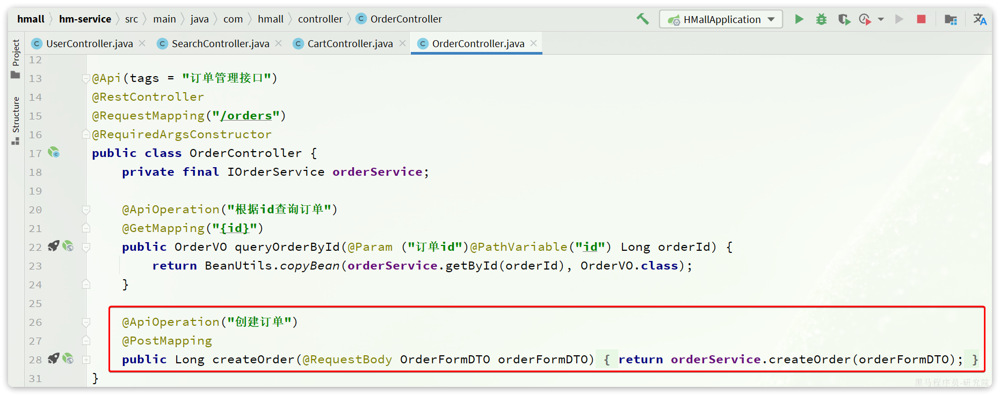

### 2.2.5.支付

下单完成后会跳转到支付页面，目前只支持**余额支付**：


在选择**余额支付**这种方式后，会发起请求到服务端，服务端会立刻创建一个支付流水单，并返回支付流水单号到前端。

当用户输入用户密码，然后点击确认支付时，页面会发送请求到服务端，而服务端会做几件事情：

- 校验用户密码
- 扣减余额
- 修改支付流水状态
- 修改交易订单状态

请求入口在`com.hmall.controller.PayController`中：


## 2.2.服务拆分原则

服务拆分一定要考虑几个问题：

- 什么时候拆？
- 如何拆？

### 2.2.1.什么时候拆

一般情况下，对于一个初创的项目，首先要做的是验证项目的可行性。因此这一阶段的首要任务是敏捷开发，快速产出生产可用的产品，投入市场做验证。为了达成这一目的，该阶段项目架构往往会比较简单，很多情况下会直接采用单体架构，这样开发成本比较低，可以快速产出结果，一旦发现项目不符合市场，损失较小。

如果这一阶段采用复杂的微服务架构，投入大量的人力和时间成本用于架构设计，最终发现产品不符合市场需求，等于全部做了无用功。

所以，对于**大多数小型项目来说，一般是先采用单体架构**，随着用户规模扩大、业务复杂后**再逐渐拆分为****微服务架构**。这样初期成本会比较低，可以快速试错。但是，这么做的问题就在于后期做服务拆分时，可能会遇到很多代码耦合带来的问题，拆分比较困难（**前易后难**）。

而对于一些大型项目，在立项之初目的就很明确，为了长远考虑，在架构设计时就直接选择微服务架构。虽然前期投入较多，但后期就少了拆分服务的烦恼（**前难后易**）。

### 2.2.2.怎么拆

之前我们说过，微服务拆分时**粒度要小**，这其实是拆分的目标。具体可以从两个角度来分析：

- **高内聚**：每个微服务的职责要尽量单一，包含的业务相互关联度高、完整度高。
- **低****耦合**：每个微服务的功能要相对独立，尽量减少对其它微服务的依赖，或者依赖接口的稳定性要强。

**高内聚**首先是**单一职责，**但不能说一个微服务就一个接口，而是要保证微服务内部业务的完整性为前提。目标是当我们要修改某个业务时，最好就只修改当前微服务，这样变更的成本更低。

一旦微服务做到了高内聚，那么服务之间的**耦合度**自然就降低了。

当然，微服务之间不可避免的会有或多或少的业务交互，比如下单时需要查询商品数据。这个时候我们不能在订单服务直接查询商品数据库，否则就导致了数据耦合。而应该由商品服务对应暴露接口，并且一定要保证微服务对外**接口的稳定性**（即：尽量保证接口外观不变）。虽然出现了服务间调用，但此时无论你如何在商品服务做内部修改，都不会影响到订单微服务，服务间的耦合度就降低了。

明确了拆分目标，接下来就是拆分方式了。我们在做服务拆分时一般有两种方式：

- **纵向**拆分
- **横向**拆分

所谓**纵向拆分**，就是按照项目的功能模块来拆分。例如商城中，就有用户管理功能、订单管理功能、购物车功能、商品管理功能、支付功能等。那么按照功能模块将他们拆分为一个个服务，就属于纵向拆分。这种拆分模式可以尽可能提高服务的内聚性。

而**横向拆分**，是看各个功能模块之间有没有公共的业务部分，如果有将其抽取出来作为通用服务。例如用户登录是需要发送消息通知，记录风控数据，下单时也要发送短信，记录风控数据。因此消息发送、风控数据记录就是通用的业务功能，因此可以将他们分别抽取为公共服务：消息中心服务、风控管理服务。这样可以提高业务的复用性，避免重复开发。同时通用业务一般接口稳定性较强，也不会使服务之间过分耦合。

当然，由于商城并不是一个完整的项目，其中的短信发送、风控管理并没有实现，这里就不再考虑了。而其它的业务按照纵向拆分，可以分为以下几个微服务：

- 用户服务
- 商品服务
- 订单服务
- 购物车服务
- 支付服务

## 2.3.拆分购物车、商品服务

接下来，我们先把商品管理功能、购物车功能抽取为两个独立服务。

一般微服务项目有两种不同的工程结构：

- 完全解耦：每一个微服务都创建为一个独立的工程，甚至可以使用不同的开发语言来开发，项目完全解耦。
  - 优点：服务之间耦合度低
  - 缺点：每个项目都有自己的独立仓库，管理起来比较麻烦
- Maven聚合：整个项目为一个Project，然后每个微服务是其中的一个Module
  - 优点：项目代码集中，管理和运维方便（授课也方便）
  - 缺点：服务之间耦合，编译时间较长

在hmall父工程之中，我已经提前定义了SpringBoot、SpringCloud的依赖版本，所以为了方便期间，我们直接在这个项目中创建微服务module.

### 2.3.1.商品服务

在hmall中创建module：


选择maven模块，并设定JDK版本为11：


商品模块，我们起名为`item-service`：


引入依赖：

```xml
<?xml version="1.0" encoding="UTF-8"?>
<project xmlns="http://maven.apache.org/POM/4.0.0"
         xmlns:xsi="http://www.w3.org/2001/XMLSchema-instance"
         xsi:schemaLocation="http://maven.apache.org/POM/4.0.0 http://maven.apache.org/xsd/maven-4.0.0.xsd">
    <parent>
        <artifactId>hmall</artifactId>
        <groupId>com.heima</groupId>
        <version>1.0.0</version>
    </parent>
    <modelVersion>4.0.0</modelVersion>

    <artifactId>item-service</artifactId>

    <properties>
        <maven.compiler.source>11</maven.compiler.source>
        <maven.compiler.target>11</maven.compiler.target>
    </properties>
    <dependencies>
        <!--common-->
        <dependency>
            <groupId>com.heima</groupId>
            <artifactId>hm-common</artifactId>
            <version>1.0.0</version>
        </dependency>
        <!--web-->
        <dependency>
            <groupId>org.springframework.boot</groupId>
            <artifactId>spring-boot-starter-web</artifactId>
        </dependency>
        <!--数据库-->
        <dependency>
            <groupId>mysql</groupId>
            <artifactId>mysql-connector-java</artifactId>
        </dependency>
        <!--mybatis-->
        <dependency>
            <groupId>com.baomidou</groupId>
            <artifactId>mybatis-plus-boot-starter</artifactId>
        </dependency>
        <!--单元测试-->
        <dependency>
            <groupId>org.springframework.boot</groupId>
            <artifactId>spring-boot-starter-test</artifactId>
        </dependency>
    </dependencies>
    <build>
        <finalName>${project.artifactId}</finalName>
        <plugins>
            <plugin>
                <groupId>org.springframework.boot</groupId>
                <artifactId>spring-boot-maven-plugin</artifactId>
            </plugin>
        </plugins>
    </build>
</project>
```

编写启动类：

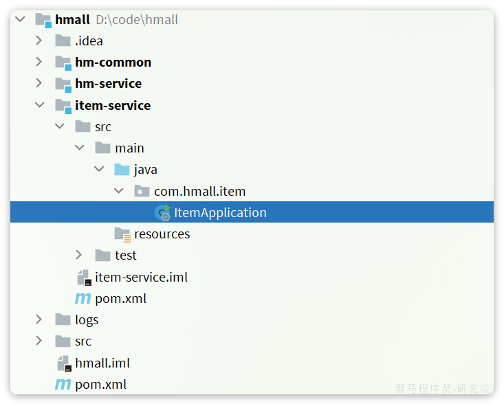

代码如下：

```java
package com.hmall.item;

import org.mybatis.spring.annotation.MapperScan;
import org.springframework.boot.SpringApplication;
import org.springframework.boot.autoconfigure.SpringBootApplication;

@MapperScan("com.hmall.item.mapper")
@SpringBootApplication
public class ItemApplication {
    public static void main(String[] args) {
        SpringApplication.run(ItemApplication.class, args);
    }
}
```

接下来是配置文件，可以从`hm-service`中拷贝：

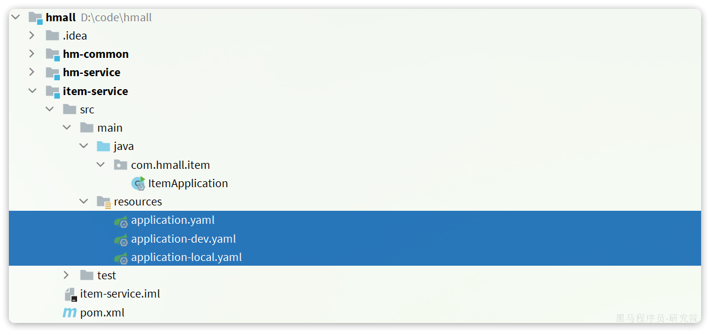

其中，`application.yaml`内容如下：

```yaml
server:
  port: 8081
spring:
  application:
    name: item-service
  profiles:
    active: dev
  datasource:
    url: jdbc:mysql://${hm.db.host}:3306/hm-item?useUnicode=true&characterEncoding=UTF-8&autoReconnect=true&serverTimezone=Asia/Shanghai
    driver-class-name: com.mysql.cj.jdbc.Driver
    username: root
    password: ${hm.db.pw}
mybatis-plus:
  configuration:
    default-enum-type-handler: com.baomidou.mybatisplus.core.handlers.MybatisEnumTypeHandler
  global-config:
    db-config:
      update-strategy: not_null
      id-type: auto
logging:
  level:
    com.hmall: debug
  pattern:
    dateformat: HH:mm:ss:SSS
  file:
    path: "logs/${spring.application.name}"
knife4j:
  enable: true
  openapi:
    title: 商品服务接口文档
    description: "信息"
    email: zhanghuyi@itcast.cn
    concat: 虎哥
    url: https://www.itcast.cn
    version: v1.0.0
    group:
      default:
        group-name: default
        api-rule: package
        api-rule-resources:
          - com.hmall.item.controller
```

剩下的`application-dev.yaml`和`application-local.yaml`直接从hm-service拷贝即可。

然后拷贝`hm-service`中与商品管理有关的代码到`item-service`，如图：


这里有一个地方的代码需要改动，就是`ItemServiceImpl`中的`deductStock`方法：

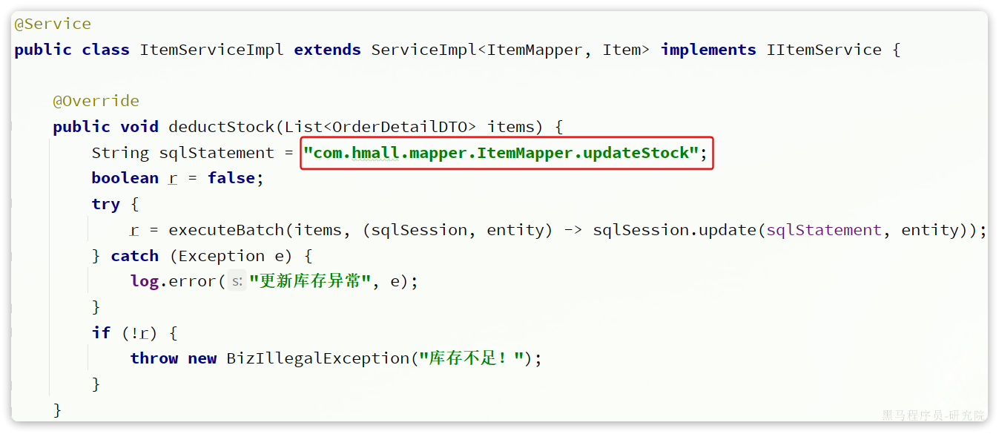

**改动前**

**改动后**

这也是因为ItemMapper的所在包发生了变化，因此这里代码必须修改包路径。

最后，还要导入数据库表。默认的数据库连接的是虚拟机，在你docker数据库执行课前资料提供的SQL文件：


最终，会在数据库创建一个名为hm-item的database，将来的每一个微服务都会有自己的一个database：


> **注意**：在企业开发的生产环境中，每一个微服务都应该有自己的**独立数据库服务**，而不仅仅是database，课堂我们用database来代替。

接下来，就可以启动测试了，在启动前我们要配置一下启动项，让默认激活的配置为`local`而不是`dev`：


在打开的编辑框填写`active profiles`:

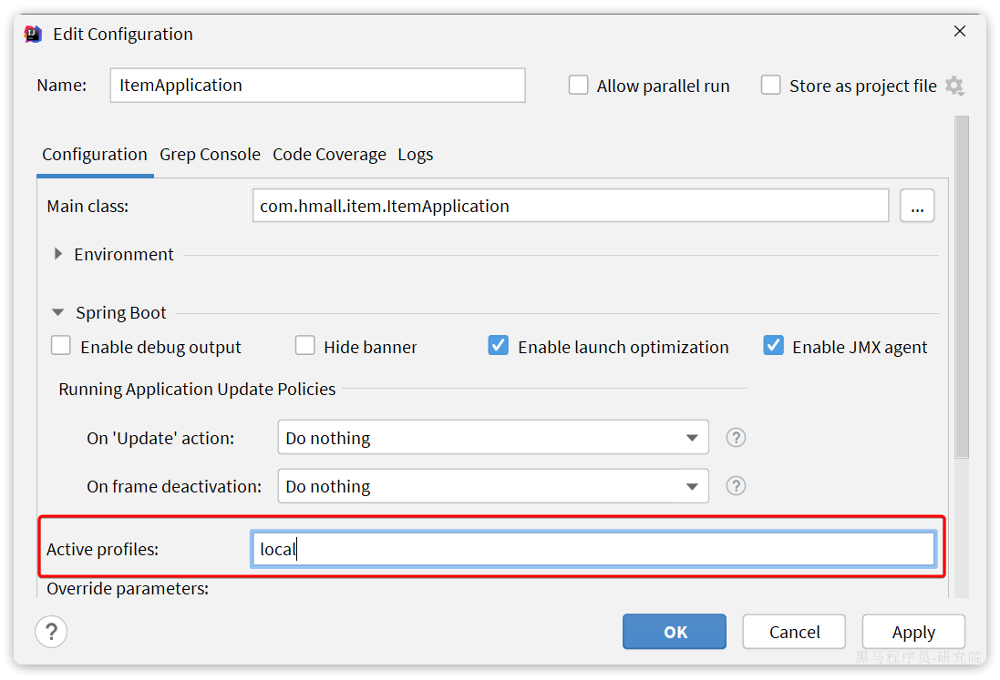

接着，启动`item-service`，访问商品微服务的swagger接口文档：http://localhost:8081/doc.html

然后测试其中的根据id批量查询商品这个接口：


测试参数：100002672302,100002624500,100002533430，结果如下：


说明商品微服务抽取成功了。

### 2.3.2.购物车服务

与商品服务类似，在hmall下创建一个新的`module`，起名为`cart-service`:


然后是依赖：

```xml
<?xml version="1.0" encoding="UTF-8"?>
<project xmlns="http://maven.apache.org/POM/4.0.0"
         xmlns:xsi="http://www.w3.org/2001/XMLSchema-instance"
         xsi:schemaLocation="http://maven.apache.org/POM/4.0.0 http://maven.apache.org/xsd/maven-4.0.0.xsd">
    <parent>
        <artifactId>hmall</artifactId>
        <groupId>com.heima</groupId>
        <version>1.0.0</version>
    </parent>
    <modelVersion>4.0.0</modelVersion>

    <artifactId>cart-service</artifactId>

    <properties>
        <maven.compiler.source>11</maven.compiler.source>
        <maven.compiler.target>11</maven.compiler.target>
    </properties>

    <dependencies>
        <!--common-->
        <dependency>
            <groupId>com.heima</groupId>
            <artifactId>hm-common</artifactId>
            <version>1.0.0</version>
        </dependency>
        <!--web-->
        <dependency>
            <groupId>org.springframework.boot</groupId>
            <artifactId>spring-boot-starter-web</artifactId>
        </dependency>
        <!--数据库-->
        <dependency>
            <groupId>mysql</groupId>
            <artifactId>mysql-connector-java</artifactId>
        </dependency>
        <!--mybatis-->
        <dependency>
            <groupId>com.baomidou</groupId>
            <artifactId>mybatis-plus-boot-starter</artifactId>
        </dependency>
        <!--单元测试-->
        <dependency>
            <groupId>org.springframework.boot</groupId>
            <artifactId>spring-boot-starter-test</artifactId>
        </dependency>
    </dependencies>
    <build>
        <finalName>${project.artifactId}</finalName>
        <plugins>
            <plugin>
                <groupId>org.springframework.boot</groupId>
                <artifactId>spring-boot-maven-plugin</artifactId>
            </plugin>
        </plugins>
    </build>
</project>
```

然后是启动类：

```java
package com.hmall.cart;

import org.mybatis.spring.annotation.MapperScan;
import org.springframework.boot.SpringApplication;
import org.springframework.boot.autoconfigure.SpringBootApplication;

@MapperScan("com.hmall.cart.mapper")
@SpringBootApplication
public class CartApplication {
    public static void main(String[] args) {
        SpringApplication.run(CartApplication.class, args);
    }
}
```

然后是配置文件，同样可以拷贝自`item-service`，不过其中的`application.yaml`需要修改：

```yaml
server:
  port: 8082
spring:
  application:
    name: cart-service
  profiles:
    active: dev
  datasource:
    url: jdbc:mysql://${db.host}:3306/hm-cart?useUnicode=true&characterEncoding=UTF-8&autoReconnect=true&serverTimezone=Asia/Shanghai
    driver-class-name: com.mysql.cj.jdbc.Driver
    username: root
    password: ${db.pw}
mybatis-plus:
  configuration:
    default-enum-type-handler: com.baomidou.mybatisplus.core.handlers.MybatisEnumTypeHandler
  global-config:
    db-config:
      update-strategy: not_null
      id-type: auto
logging:
  level:
    com.hmall: debug
  pattern:
    dateformat: HH:mm:ss:SSS
  file:
    path: "logs/${spring.application.name}"
knife4j:
  enable: true
  openapi:
    title: 商品服务接口文档
    description: "信息"
    email: zhanghuyi@itcast.cn
    concat: 虎哥
    url: https://www.itcast.cn
    version: v1.0.0
    group:
      default:
        group-name: default
        api-rule: package
        api-rule-resources:
          - com.hmall.cart.controller
```

最后，把hm-service中的与购物车有关功能拷贝过来，最终的项目结构如下：

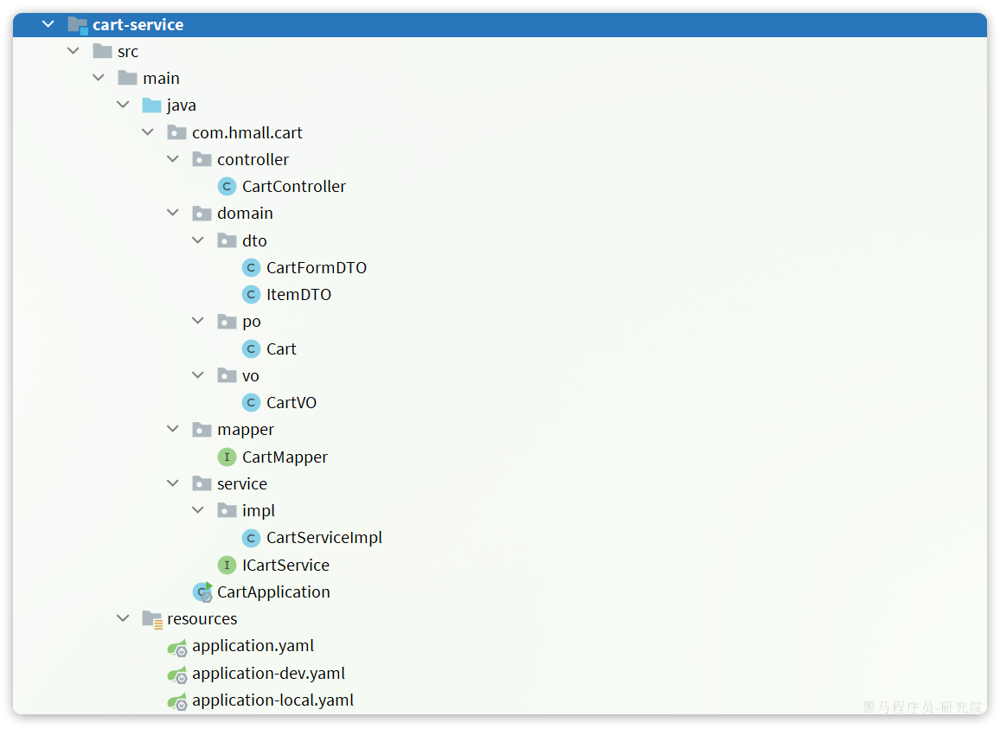

特别注意的是`com.hmall.cart.service.impl.CartServiceImpl`，其中有两个地方需要处理：

- 需要**获取登录用户信息**，但登录校验功能目前没有复制过来，先写死固定用户id
- 查询购物车时需要**查询商品信息**，而商品信息不在当前服务，需要先将这部分代码注释


我们对这部分代码做如下修改：

```java
package com.hmall.cart.service.impl;

import cn.hutool.core.util.StrUtil;
import com.baomidou.mybatisplus.core.conditions.query.QueryWrapper;
import com.baomidou.mybatisplus.extension.service.impl.ServiceImpl;
import com.hmall.cart.domain.dto.CartFormDTO;
import com.hmall.cart.domain.po.Cart;
import com.hmall.cart.domain.vo.CartVO;
import com.hmall.cart.mapper.CartMapper;
import com.hmall.cart.service.ICartService;
import com.hmall.common.exception.BizIllegalException;
import com.hmall.common.utils.BeanUtils;
import com.hmall.common.utils.CollUtils;
import com.hmall.common.utils.UserContext;
import lombok.RequiredArgsConstructor;
import org.springframework.stereotype.Service;

import java.util.Collection;
import java.util.List;

/**
 * <p>
 * 订单详情表 服务实现类
 * </p>
 *
 * @author 虎哥
 * @since 2023-05-05
 */
@Service
@RequiredArgsConstructor
public class CartServiceImpl extends ServiceImpl<CartMapper, Cart> implements ICartService {

    // private final IItemService itemService;

    @Override
    public void addItem2Cart(CartFormDTO cartFormDTO) {
        // 1.获取登录用户
        Long userId = UserContext.getUser();

        // 2.判断是否已经存在
        if (checkItemExists(cartFormDTO.getItemId(), userId)) {
            // 2.1.存在，则更新数量
            baseMapper.updateNum(cartFormDTO.getItemId(), userId);
            return;
        }
        // 2.2.不存在，判断是否超过购物车数量
        checkCartsFull(userId);

        // 3.新增购物车条目
        // 3.1.转换PO
        Cart cart = BeanUtils.copyBean(cartFormDTO, Cart.class);
        // 3.2.保存当前用户
        cart.setUserId(userId);
        // 3.3.保存到数据库
        save(cart);
    }

    @Override
    public List<CartVO> queryMyCarts() {
        // 1.查询我的购物车列表
        List<Cart> carts = lambdaQuery().eq(Cart::getUserId, 1L /*TODO UserContext.getUser()*/).list();
        if (CollUtils.isEmpty(carts)) {
            return CollUtils.emptyList();
        }
        // 2.转换VO
        List<CartVO> vos = BeanUtils.copyList(carts, CartVO.class);
        // 3.处理VO中的商品信息
        handleCartItems(vos);
        // 4.返回
        return vos;
    }

    private void handleCartItems(List<CartVO> vos) {
        // 1.获取商品id TODO 处理商品信息
        /*Set<Long> itemIds = vos.stream().map(CartVO::getItemId).collect(Collectors.toSet());
        // 2.查询商品
        List<ItemDTO> items = itemService.queryItemByIds(itemIds);
        if (CollUtils.isEmpty(items)) {
            throw new BadRequestException("购物车中商品不存在！");
        }
        // 3.转为 id 到 item的map
        Map<Long, ItemDTO> itemMap = items.stream().collect(Collectors.toMap(ItemDTO::getId, Function.identity()));
        // 4.写入vo
        for (CartVO v : vos) {
            ItemDTO item = itemMap.get(v.getItemId());
            if (item == null) {
                continue;
            }
            v.setNewPrice(item.getPrice());
            v.setStatus(item.getStatus());
            v.setStock(item.getStock());
        }*/
    }

    @Override
    public void removeByItemIds(Collection<Long> itemIds) {
        // 1.构建删除条件，userId和itemId
        QueryWrapper<Cart> queryWrapper = new QueryWrapper<Cart>();
        queryWrapper.lambda()
                .eq(Cart::getUserId, UserContext.getUser())
                .in(Cart::getItemId, itemIds);
        // 2.删除
        remove(queryWrapper);
    }

    private void checkCartsFull(Long userId) {
        int count = lambdaQuery().eq(Cart::getUserId, userId).count();
        if (count >= 10) {
            throw new BizIllegalException(StrUtil.format("用户购物车课程不能超过{}", 10));
        }
    }

    private boolean checkItemExists(Long itemId, Long userId) {
        int count = lambdaQuery()
                .eq(Cart::getUserId, userId)
                .eq(Cart::getItemId, itemId)
                .count();
        return count > 0;
    }
}
```

最后，还是要导入数据库表，在本地数据库直接执行课前资料对应的SQL文件：


在数据库中会出现名为`hm-cart`的`database`，以及其中的`cart`表，代表购物车：


接下来，就可以测试了。不过在启动前，同样要配置启动项的`active profile`为`local`：


然后启动`CartApplication`，访问swagger文档页面：http://localhost:8082/doc.html

我们测试其中的`查询我的购物车列表`接口：


无需填写参数，直接访问：


我们注意到，其中与商品有关的几个字段值都为空！这就是因为刚才我们注释掉了查询购物车时，查询商品信息的相关代码。

那么，我们该如何在`cart-service`服务中实现对`item-service`服务的查询呢？

## 2.4.服务调用

在拆分的时候，我们发现一个问题：就是购物车业务中需要查询商品信息，但商品信息查询的逻辑全部迁移到了`item-service`服务，导致我们无法查询。

最终结果就是查询到的购物车数据不完整，因此要想解决这个问题，我们就必须改造其中的代码，把原本本地方法调用，改造成跨微服务的远程调用（RPC，即**R**emote **P**roduce **C**all）。

因此，现在查询购物车列表的流程变成了这样：

暂时无法在飞书文档外展示此内容

代码中需要变化的就是这一步：


那么问题来了：我们该如何跨服务调用，准确的说，如何在`cart-service`中获取`item-service`服务中的提供的商品数据呢？

大家思考一下，我们以前有没有实现过类似的远程查询的功能呢？

答案是肯定的，我们前端向服务端查询数据，其实就是从浏览器远程查询服务端数据。比如我们刚才通过Swagger测试商品查询接口，就是向`http://localhost:8081/items`这个接口发起的请求：


而这种查询就是通过http请求的方式来完成的，不仅仅可以实现远程查询，还可以实现新增、删除等各种远程请求。

那么：我们该如何用Java代码发送Http的请求呢？

### 2.4.1.RestTemplate

Spring给我们提供了一个RestTemplate的API，可以方便的实现Http请求的发送。

> org.springframework.web.client public class RestTemplate
>
> extends InterceptingHttpAccessor
>
> implements RestOperations
>
> \----------------------------------------------------------------------------------------------------------------
>
> 同步客户端执行HTTP请求，在底层HTTP客户端库(如JDK HttpURLConnection、Apache HttpComponents等)上公开一个简单的模板方法API。RestTemplate通过HTTP方法为常见场景提供了模板，此外还提供了支持不太常见情况的通用交换和执行方法。 RestTemplate通常用作共享组件。然而，它的配置不支持并发修改，因此它的配置通常是在启动时准备的。如果需要，您可以在启动时创建多个不同配置的RestTemplate实例。如果这些实例需要共享HTTP客户端资源，它们可以使用相同的底层ClientHttpRequestFactory。 注意:从5.0开始，这个类处于维护模式，只有对更改和错误的小请求才会被接受。请考虑使用org.springframework.web.react .client. webclient，它有更现代的API，支持同步、异步和流场景。  
>
> \----------------------------------------------------------------------------------------------------------------
>
> 自: 3.0 参见: HttpMessageConverter, RequestCallback, ResponseExtractor, ResponseErrorHandler

其中提供了大量的方法，方便我们发送Http请求，例如：


可以看到常见的Get、Post、Put、Delete请求都支持，如果请求参数比较复杂，还可以使用exchange方法来构造请求。

我们在`cart-service`服务中定义一个配置类：


先将RestTemplate注册为一个Bean：

```java
package com.hmall.cart.config;

import org.springframework.context.annotation.Bean;
import org.springframework.context.annotation.Configuration;
import org.springframework.web.client.RestTemplate;

@Configuration
public class RemoteCallConfig {

    @Bean
    public RestTemplate restTemplate() {
        return new RestTemplate();
    }
}
```

  

### 2.4.2.远程调用

接下来，我们修改`cart-service`中的`com.hmall.cart.service.impl.CartServiceImpl`的`handleCartItems`方法，发送http请求到`item-service`：


可以看到，利用RestTemplate发送http请求与前端ajax发送请求非常相似，都包含四部分信息：

- ① 请求方式
- ② 请求路径
- ③ 请求参数
- ④  返回值类型

`handleCartItems`方法的完整代码如下：

```java
private void handleCartItems(List<CartVO> vos) {
    // TODO 1.获取商品id
    Set<Long> itemIds = vos.stream().map(CartVO::getItemId).collect(Collectors.toSet());
    // 2.查询商品
    // List<ItemDTO> items = itemService.queryItemByIds(itemIds);
    // 2.1.利用RestTemplate发起http请求，得到http的响应
    ResponseEntity<List<ItemDTO>> response = restTemplate.exchange(
            "http://localhost:8081/items?ids={ids}",
            HttpMethod.GET,
            null,
            new ParameterizedTypeReference<List<ItemDTO>>() {
            },
            Map.of("ids", CollUtil.join(itemIds, ","))
    );
    // 2.2.解析响应
    if(!response.getStatusCode().is2xxSuccessful()){
        // 查询失败，直接结束
        return;
    }
    List<ItemDTO> items = response.getBody();
    if (CollUtils.isEmpty(items)) {
        return;
    }
    // 3.转为 id 到 item的map
    Map<Long, ItemDTO> itemMap = items.stream().collect(Collectors.toMap(ItemDTO::getId, Function.identity()));
    // 4.写入vo
    for (CartVO v : vos) {
        ItemDTO item = itemMap.get(v.getItemId());
        if (item == null) {
            continue;
        }
        v.setNewPrice(item.getPrice());
        v.setStatus(item.getStatus());
        v.setStock(item.getStock());
    }
}
```

好了，现在重启`cart-service`，再次测试查询我的购物车列表接口：


可以发现，所有商品相关数据都已经查询到了。

在这个过程中，`item-service`提供了查询接口，`cart-service`利用Http请求调用该接口。因此`item-service`可以称为服务的提供者，而`cart-service`则称为服务的消费者或服务调用者。

## 2.5.总结

什么时候需要拆分微服务？

- 如果是创业型公司，最好先用单体架构快速迭代开发，验证市场运作模型，快速试错。当业务跑通以后，随着业务规模扩大、人员规模增加，再考虑拆分微服务。
- 如果是大型企业，有充足的资源，可以在项目开始之初就搭建微服务架构。

如何拆分？

- 首先要做到高内聚、低耦合
- 从拆分方式来说，有横向拆分和纵向拆分两种。纵向就是按照业务功能模块，横向则是拆分通用性业务，提高复用性

服务拆分之后，不可避免的会出现跨微服务的业务，此时微服务之间就需要进行远程调用。微服务之间的远程调用被称为RPC，即远程过程调用。RPC的实现方式有很多，比如：

- 基于Http协议
- 基于Dubbo协议

我们课堂中使用的是Http方式，这种方式不关心服务提供者的具体技术实现，只要对外暴露Http接口即可，更符合微服务的需要。

Java发送http请求可以使用Spring提供的RestTemplate，使用的基本步骤如下：

- 注册RestTemplate到Spring容器
- 调用RestTemplate的API发送请求，常见方法有：
  - getForObject：发送Get请求并返回指定类型对象
  - PostForObject：发送Post请求并返回指定类型对象
  - put：发送PUT请求
  - delete：发送Delete请求
  - exchange：发送任意类型请求，返回ResponseEntity

# 3.服务注册和发现

在上一章我们实现了微服务拆分，并且通过Http请求实现了跨微服务的远程调用。不过这种手动发送Http请求的方式存在一些问题。

试想一下，假如商品微服务被调用较多，为了应对更高的并发，我们进行了多实例部署，如图：

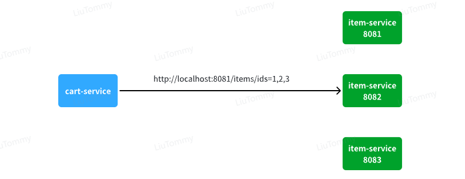

此时，每个`item-service`的实例其IP或端口不同，问题来了：

- item-service这么多实例，cart-service如何知道每一个实例的地址？
- http请求要写url地址，`cart-service`服务到底该调用哪个实例呢？
- 如果在运行过程中，某一个`item-service`实例宕机，`cart-service`依然在调用该怎么办？
- 如果并发太高，`item-service`临时多部署了N台实例，`cart-service`如何知道新实例的地址？

为了解决上述问题，就必须引入注册中心的概念了，接下来我们就一起来分析下注册中心的原理。

## 3.1.注册中心原理

在微服务远程调用的过程中，包括两个角色：

- 服务提供者：提供接口供其它微服务访问，比如`item-service`
- 服务消费者：调用其它微服务提供的接口，比如`cart-service`

在大型微服务项目中，服务提供者的数量会非常多，为了管理这些服务就引入了**注册中心**的概念。注册中心、服务提供者、服务消费者三者间关系如下：


流程如下：

- 服务启动时就会注册自己的服务信息（服务名、IP、端口）到注册中心
- 调用者可以从注册中心订阅想要的服务，获取服务对应的实例列表（1个服务可能多实例部署）
- 调用者自己对实例列表负载均衡，挑选一个实例
- 调用者向该实例发起远程调用

当服务提供者的实例宕机或者启动新实例时，调用者如何得知呢？

- 服务提供者会定期向注册中心发送请求，报告自己的健康状态（心跳请求）
- 当注册中心长时间收不到提供者的心跳时，会认为该实例宕机，将其从服务的实例列表中剔除
- 当服务有新实例启动时，会发送注册服务请求，其信息会被记录在注册中心的服务实例列表
- 当注册中心服务列表变更时，会主动通知微服务，更新本地服务列表

## 3.2.Nacos注册中心

目前开源的注册中心框架有很多，国内比较常见的有：

- Eureka：Netflix公司出品，目前被集成在SpringCloud当中，一般用于Java应用
- Nacos：Alibaba公司出品，目前被集成在SpringCloudAlibaba中，一般用于Java应用
- Consul：HashiCorp公司出品，目前集成在SpringCloud中，不限制微服务语言

以上几种注册中心都遵循SpringCloud中的API规范，因此在业务开发使用上没有太大差异。由于Nacos是国内产品，中文文档比较丰富，而且同时具备**配置管理**功能（后面会学习），因此在国内使用较多，课堂中我们会Nacos为例来学习。

官方网站如下：

https://nacos.io/zh-cn/

我们基于Docker来部署Nacos的注册中心，首先我们要准备MySQL数据库表，用来存储Nacos的数据。由于是Docker部署，所以大家需要将资料中的SQL文件导入到你**Docker中的MySQL容器**中：


最终表结构如下：


然后，找到课前资料下的nacos文件夹：


其中的`nacos/custom.env`文件中，有一个MYSQL_SERVICE_HOST也就是mysql地址，需要修改为你自己的虚拟机IP地址：

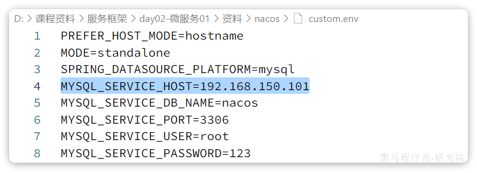

然后，将课前资料中的`nacos`目录上传至虚拟机的`/root`目录。

进入root目录，然后执行下面的docker命令：

```powershell
docker run -d \
--name nacos \
--env-file ./nacos/custom.env \
-p 8848:8848 \
-p 9848:9848 \
-p 9849:9849 \
--restart=always \
nacos/nacos-server:v2.1.0-slim
```

启动完成后，访问下面地址：http://192.168.150.101:8848/nacos/，注意将`192.168.150.101`替换为你自己的虚拟机IP地址。

首次访问会跳转到登录页，**账号密码都是nacos**


## 3.3.服务注册

接下来，我们把`item-service`注册到Nacos，步骤如下：

- 引入依赖
- 配置Nacos地址
- 重启

### 3.3.1.添加依赖

在`item-service`的`pom.xml`中添加依赖：

```xml
<!--nacos 服务注册发现-->
<dependency>
    <groupId>com.alibaba.cloud</groupId>
    <artifactId>spring-cloud-starter-alibaba-nacos-discovery</artifactId>
</dependency>
```

### 3.3.2.配置Nacos

在`item-service`的`application.yml`中添加nacos地址配置：

```yaml
spring:
  application:
    name: item-service # 服务名称
  cloud:
    nacos:
      server-addr: 192.168.150.101:8848 # nacos地址
```

### 3.3.3.启动服务实例

为了测试一个服务多个实例的情况，我们再配置一个`item-service`的部署实例：


然后配置启动项，注意重命名并且配置新的端口，避免冲突：

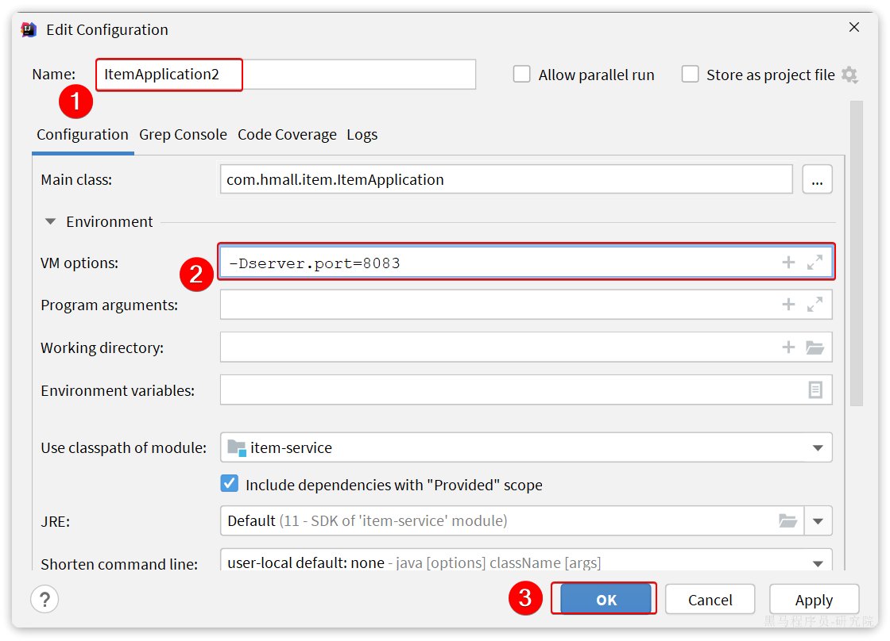

重启`item-service`的两个实例：


访问nacos控制台，可以发现服务注册成功：


点击详情，可以查看到`item-service`服务的两个实例信息：


## 3.4.服务发现

服务的消费者要去nacos订阅服务，这个过程就是服务发现，步骤如下：

- 引入依赖
- 配置Nacos地址
- 发现并调用服务

### 3.4.1.引入依赖

服务发现除了要引入nacos依赖以外，由于还需要负载均衡，因此要引入SpringCloud提供的LoadBalancer依赖。

我们在`cart-service`中的`pom.xml`中添加下面的依赖：

```xml
<!--nacos 服务注册发现-->
<dependency>
    <groupId>com.alibaba.cloud</groupId>
    <artifactId>spring-cloud-starter-alibaba-nacos-discovery</artifactId>
</dependency>
```

可以发现，这里Nacos的依赖于服务注册时一致，这个依赖中同时包含了服务注册和发现的功能。因为任何一个微服务都可以调用别人，也可以被别人调用，即可以是调用者，也可以是提供者。

因此，等一会儿`cart-service`启动，同样会注册到Nacos

### 3.4.2.配置Nacos地址

在`cart-service`的`application.yml`中添加nacos地址配置：

```yaml
spring:
  cloud:
    nacos:
      server-addr: 192.168.150.101:8848
```

### 3.4.3.发现并调用服务

接下来，服务调用者`cart-service`就可以去订阅`item-service`服务了。不过item-service有多个实例，而真正发起调用时只需要知道一个实例的地址。

因此，服务调用者必须利用负载均衡的算法，从多个实例中挑选一个去访问。常见的负载均衡算法有：

- 随机
- 轮询
- IP的hash
- 最近最少访问
- ...

这里我们可以选择最简单的随机负载均衡。

另外，服务发现需要用到一个工具，DiscoveryClient，SpringCloud已经帮我们自动装配，我们可以直接注入使用：


接下来，我们就可以对原来的远程调用做修改了，之前调用时我们需要写死服务提供者的IP和端口：


但现在不需要了，我们通过DiscoveryClient发现服务实例列表，然后通过负载均衡算法，选择一个实例去调用：


经过swagger测试，发现没有任何问题。

# 4.OpenFeign

在上一章，我们利用Nacos实现了服务的治理，利用RestTemplate实现了服务的远程调用。但是远程调用的代码太复杂了：


而且这种调用方式，与原本的本地方法调用差异太大，编程时的体验也不统一，一会儿远程调用，一会儿本地调用。

因此，我们必须想办法改变远程调用的开发模式，让**远程调用像本地方法调用一样简单**。而这就要用到OpenFeign组件了。

其实远程调用的关键点就在于四个：

- 请求方式
- 请求路径
- 请求参数
- 返回值类型

所以，OpenFeign就利用SpringMVC的相关注解来声明上述4个参数，然后基于动态代理帮我们生成远程调用的代码，而无需我们手动再编写，非常方便。

接下来，我们就通过一个快速入门的案例来体验一下OpenFeign的便捷吧。

## 4.1.快速入门

我们还是以cart-service中的查询我的购物车为例。因此下面的操作都是在cart-service中进行。

### 4.1.1.引入依赖

在`cart-service`服务的pom.xml中引入`OpenFeign`的依赖和`loadBalancer`依赖：

```xml
<!--openFeign-->
<dependency>
    <groupId>org.springframework.cloud</groupId>
    <artifactId>spring-cloud-starter-openfeign</artifactId>
</dependency>
<!--负载均衡器-->
<dependency>
    <groupId>org.springframework.cloud</groupId>
    <artifactId>spring-cloud-starter-loadbalancer</artifactId>
</dependency>
```

### 4.1.2.启用OpenFeign

接下来，我们在`cart-service`的`CartApplication`启动类上添加注解，启动OpenFeign功能：


### 4.1.3.编写OpenFeign客户端

在`cart-service`中，定义一个新的接口，编写Feign客户端：

其中代码如下：

```java
package com.hmall.cart.client;

import com.hmall.cart.domain.dto.ItemDTO;
import org.springframework.cloud.openfeign.FeignClient;
import org.springframework.web.bind.annotation.GetMapping;
import org.springframework.web.bind.annotation.RequestParam;

import java.util.List;

@FeignClient("item-service")
public interface ItemClient {

    @GetMapping("/items")
    List<ItemDTO> queryItemByIds(@RequestParam("ids") Collection<Long> ids);
}
```

这里只需要声明接口，无需实现方法。接口中的几个关键信息：

- `@FeignClient("item-service")` ：声明服务名称
- `@GetMapping` ：声明请求方式
- `@GetMapping("/items")` ：声明请求路径
- `@RequestParam("ids") Collection<Long> ids` ：声明请求参数
- `List<ItemDTO>` ：返回值类型

有了上述信息，OpenFeign就可以利用动态代理帮我们实现这个方法，并且向`http://item-service/items`发送一个`GET`请求，携带ids为请求参数，并自动将返回值处理为`List<ItemDTO>`。

我们只需要直接调用这个方法，即可实现远程调用了。

### 4.1.4.使用FeignClient

最后，我们在`cart-service`的`com.hmall.cart.service.impl.CartServiceImpl`中改造代码，直接调用`ItemClient`的方法：


feign替我们完成了服务拉取、负载均衡、发送http请求的所有工作，是不是看起来优雅多了。

而且，这里我们不再需要RestTemplate了，还省去了RestTemplate的注册。

## 4.2.连接池

Feign底层发起http请求，依赖于其它的框架。其底层支持的http客户端实现包括：

- HttpURLConnection：默认实现，不支持连接池
- Apache HttpClient ：支持连接池
- OKHttp：支持连接池

因此我们通常会使用带有连接池的客户端来代替默认的HttpURLConnection。比如，我们使用OK Http.

### 4.2.1.引入依赖

在`cart-service`的`pom.xml`中引入依赖：

```xml
<!--OK http 的依赖 -->
<dependency>
  <groupId>io.github.openfeign</groupId>
  <artifactId>feign-okhttp</artifactId>
</dependency>
```

### 4.2.2.开启连接池

在`cart-service`的`application.yml`配置文件中开启Feign的连接池功能：

```yaml
feign:
  okhttp:
    enabled: true # 开启OKHttp功能
```

重启服务，连接池就生效了。

### 4.2.3.验证

我们可以打断点验证连接池是否生效，在`org.springframework.cloud.openfeign.loadbalancer.FeignBlockingLoadBalancerClient`中的`execute`方法中打断点：


Debug方式启动cart-service，请求一次查询我的购物车方法，进入断点：

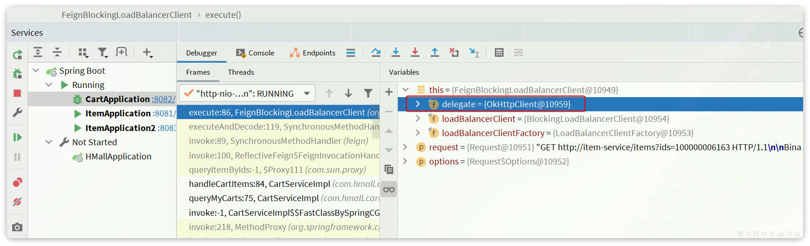

可以发现这里底层的实现已经改为`OkHttpClient`

## 4.3.最佳实践

将来我们要把与下单有关的业务抽取为一个独立微服务:`trade-service`，不过我们先来看一下`hm-service`中原本与下单有关的业务逻辑。

入口在`com.hmall.controller.OrderController`的`createOrder`方法，然后调用了`IOrderService`中的`createOrder`方法。

由于下单时前端提交了商品id，为了计算订单总价，需要查询商品信息：


也就是说，如果拆分了交易微服务（`trade-service`），它也需要远程调用`item-service`中的根据id批量查询商品功能。这个需求与`cart-service`中是一样的。

因此，我们就需要在`trade-service`中再次定义`ItemClient`接口，这不是重复编码吗？ 有什么办法能加避免重复编码呢？

### 4.3.1.思路分析

相信大家都能想到，避免重复编码的办法就是**抽取**。不过这里有两种抽取思路：

- 思路1：抽取到微服务之外的公共module
- 思路2：每个微服务自己抽取一个module

如图：


方案1抽取更加简单，工程结构也比较清晰，但缺点是整个项目耦合度偏高。

方案2抽取相对麻烦，工程结构相对更复杂，但服务之间耦合度降低。

由于item-service已经创建好，无法继续拆分，因此这里我们采用方案1.

### 4.3.2.抽取Feign客户端

在`hmall`下定义一个新的module，命名为hm-api


其依赖如下：

```xml
<?xml version="1.0" encoding="UTF-8"?>
<project xmlns="http://maven.apache.org/POM/4.0.0"
         xmlns:xsi="http://www.w3.org/2001/XMLSchema-instance"
         xsi:schemaLocation="http://maven.apache.org/POM/4.0.0 http://maven.apache.org/xsd/maven-4.0.0.xsd">
    <parent>
        <artifactId>hmall</artifactId>
        <groupId>com.heima</groupId>
        <version>1.0.0</version>
    </parent>
    <modelVersion>4.0.0</modelVersion>

    <artifactId>hm-api</artifactId>

    <properties>
        <maven.compiler.source>11</maven.compiler.source>
        <maven.compiler.target>11</maven.compiler.target>
    </properties>

    <dependencies>
        <!--open feign-->
        <dependency>
            <groupId>org.springframework.cloud</groupId>
            <artifactId>spring-cloud-starter-openfeign</artifactId>
        </dependency>
        <!-- load balancer-->
        <dependency>
            <groupId>org.springframework.cloud</groupId>
            <artifactId>spring-cloud-starter-loadbalancer</artifactId>
        </dependency>
        <!--OK http 的依赖 -->
        <dependency>
            <groupId>io.github.openfeign</groupId>
            <artifactId>feign-okhttp</artifactId>
        </dependency>
        <!-- swagger 注解依赖 -->
        <dependency>
            <groupId>io.swagger</groupId>
            <artifactId>swagger-annotations</artifactId>
            <version>1.6.6</version>
            <scope>compile</scope>
        </dependency>
    </dependencies>
</project>
```

然后把ItemDTO和ItemClient都拷贝过来，最终结构如下：


现在，任何微服务要调用`item-service`中的接口，只需要引入`hm-api`模块依赖即可，无需自己编写Feign客户端了。

### 4.3.3.扫描包

接下来，我们在`cart-service`的`pom.xml`中引入`hm-api`模块：

```xml
<!--feign模块-->
<dependency>
    <groupId>com.heima</groupId>
    <artifactId>hm-api</artifactId>
    <version>1.0.0</version>
</dependency>
```

删除`cart-service`中原来的ItemDTO和ItemClient，重启项目，发现报错了：


这里因为`ItemClient`现在定义到了`com.hmall.api.client`包下，而cart-service的启动类定义在`com.hmall.cart`包下，扫描不到`ItemClient`，所以报错了。

解决办法很简单，在cart-service的启动类上添加声明即可，两种方式：

- 方式1：声明扫描包：

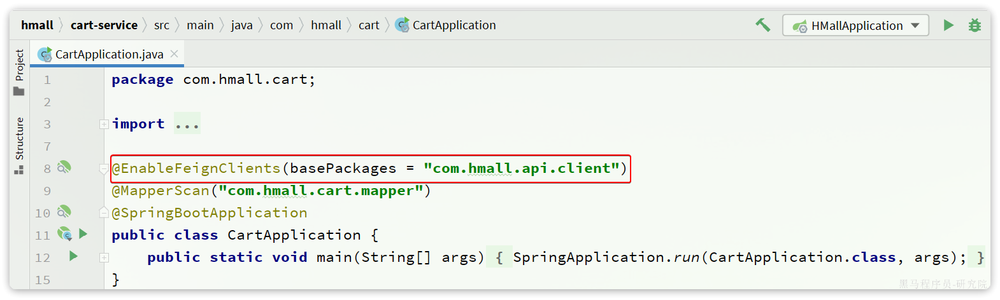

- 方式2：声明要用的FeignClient


## 4.4.日志配置

OpenFeign只会在FeignClient所在包的日志级别为**DEBUG**时，才会输出日志。而且其日志级别有4级：

- **NONE**：不记录任何日志信息，这是默认值。
- **BASIC**：仅记录请求的方法，URL以及响应状态码和执行时间
- **HEADERS**：在BASIC的基础上，额外记录了请求和响应的头信息
- **FULL**：记录所有请求和响应的明细，包括头信息、请求体、元数据。

Feign默认的日志级别就是NONE，所以默认我们看不到请求日志。

### 4.4.1.定义日志级别

在hm-api模块下新建一个配置类，定义Feign的日志级别：


代码如下：

```java
package com.hmall.api.config;

import feign.Logger;
import org.springframework.context.annotation.Bean;

public class DefaultFeignConfig {
    @Bean
    public Logger.Level feignLogLevel(){
        return Logger.Level.FULL;
    }
}
```

### 4.4.2.配置

接下来，要让日志级别生效，还需要配置这个类。有两种方式：

- **局部**生效：在某个`FeignClient`中配置，只对当前`FeignClient`生效

```java
@FeignClient(value = "item-service", configuration = DefaultFeignConfig.class)
```

- **全局**生效：在`@EnableFeignClients`中配置，针对所有`FeignClient`生效。

```java
@EnableFeignClients(defaultConfiguration = DefaultFeignConfig.class)
```

日志格式：

```
17:35:32:148 DEBUG 18620 --- [nio-8082-exec-1] com.hmall.api.client.ItemClient          : [ItemClient#queryItemByIds] ---> GET http://item-service/items?ids=100000006163 HTTP/1.1
17:35:32:148 DEBUG 18620 --- [nio-8082-exec-1] com.hmall.api.client.ItemClient          : [ItemClient#queryItemByIds] ---> END HTTP (0-byte body)
17:35:32:278 DEBUG 18620 --- [nio-8082-exec-1] com.hmall.api.client.ItemClient          : [ItemClient#queryItemByIds] <--- HTTP/1.1 200  (127ms)
17:35:32:279 DEBUG 18620 --- [nio-8082-exec-1] com.hmall.api.client.ItemClient          : [ItemClient#queryItemByIds] connection: keep-alive
17:35:32:279 DEBUG 18620 --- [nio-8082-exec-1] com.hmall.api.client.ItemClient          : [ItemClient#queryItemByIds] content-type: application/json
17:35:32:279 DEBUG 18620 --- [nio-8082-exec-1] com.hmall.api.client.ItemClient          : [ItemClient#queryItemByIds] date: Fri, 26 May 2023 09:35:32 GMT
17:35:32:279 DEBUG 18620 --- [nio-8082-exec-1] com.hmall.api.client.ItemClient          : [ItemClient#queryItemByIds] keep-alive: timeout=60
17:35:32:279 DEBUG 18620 --- [nio-8082-exec-1] com.hmall.api.client.ItemClient          : [ItemClient#queryItemByIds] transfer-encoding: chunked
17:35:32:279 DEBUG 18620 --- [nio-8082-exec-1] com.hmall.api.client.ItemClient          : [ItemClient#queryItemByIds] 
17:35:32:280 DEBUG 18620 --- [nio-8082-exec-1] com.hmall.api.client.ItemClient          : [ItemClient#queryItemByIds] [{"id":100000006163,"name":"巴布豆(BOBDOG)柔薄悦动婴儿拉拉裤XXL码80片(15kg以上)","price":67100,"stock":10000,"image":"https://m.360buyimg.com/mobilecms/s720x720_jfs/t23998/350/2363990466/222391/a6e9581d/5b7cba5bN0c18fb4f.jpg!q70.jpg.webp","category":"拉拉裤","brand":"巴布豆","spec":"{}","sold":11,"commentCount":33343434,"isAD":false,"status":2}]
17:35:32:281 DEBUG 18620 --- [nio-8082-exec-1] com.hmall.api.client.ItemClient          : [ItemClient#queryItemByIds] <--- END HTTP (369-byte body)
```

