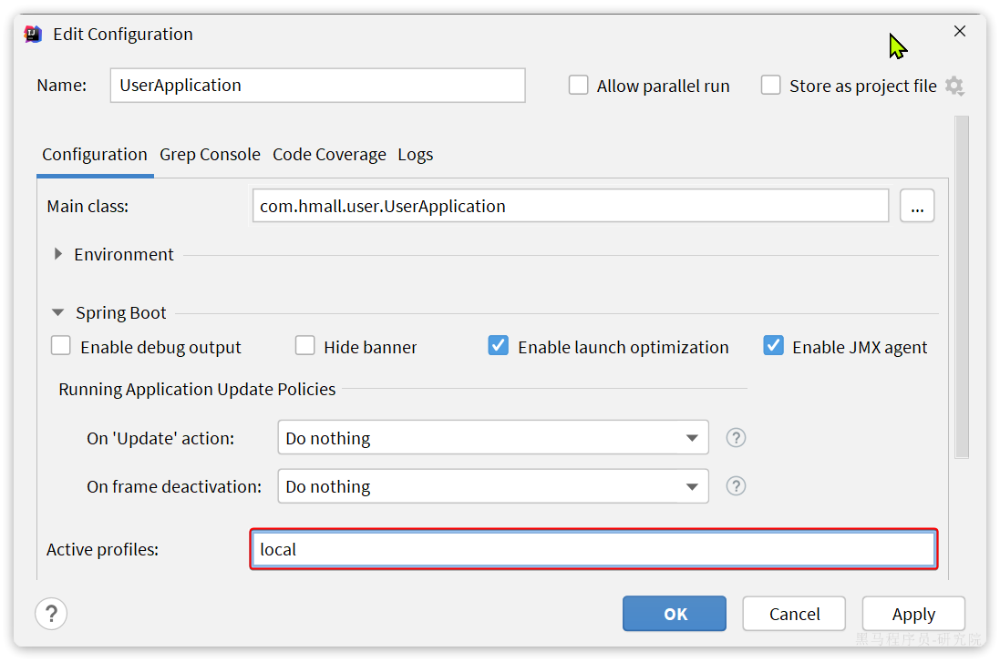
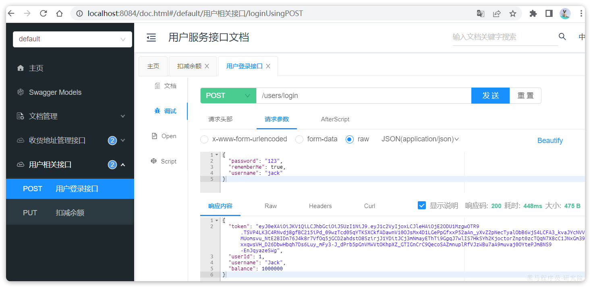
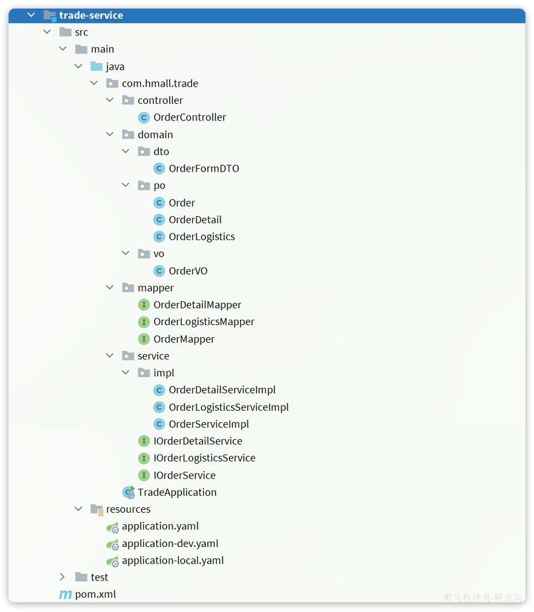
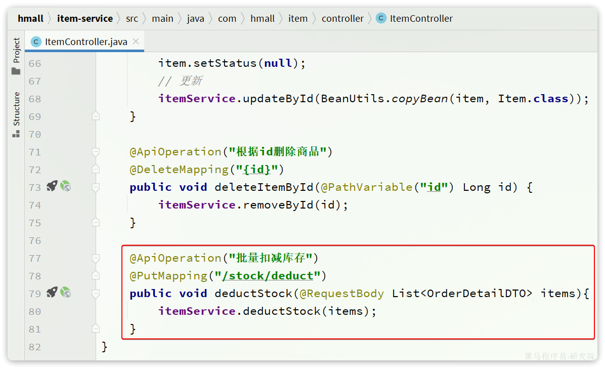
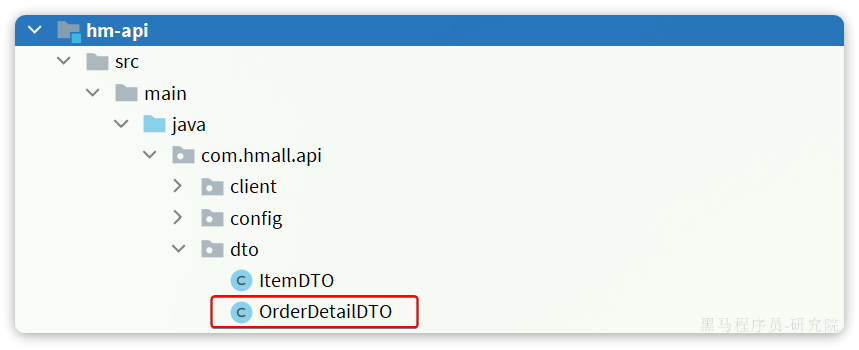
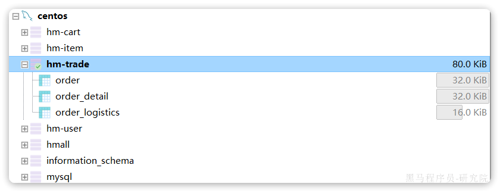
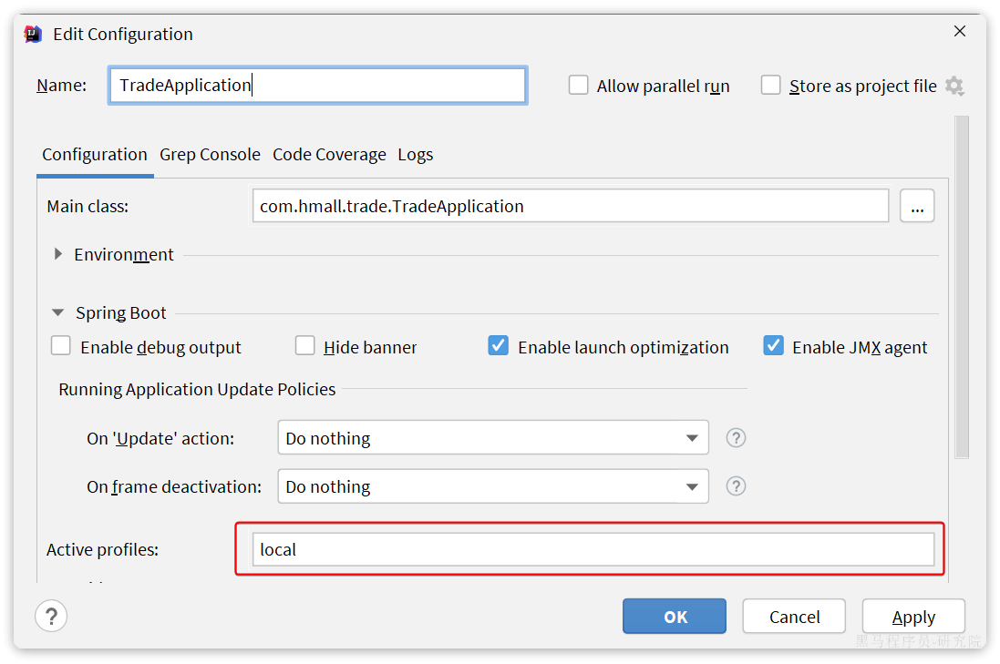
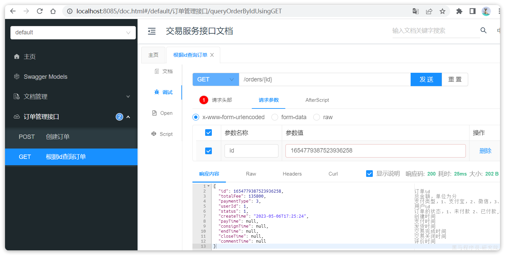
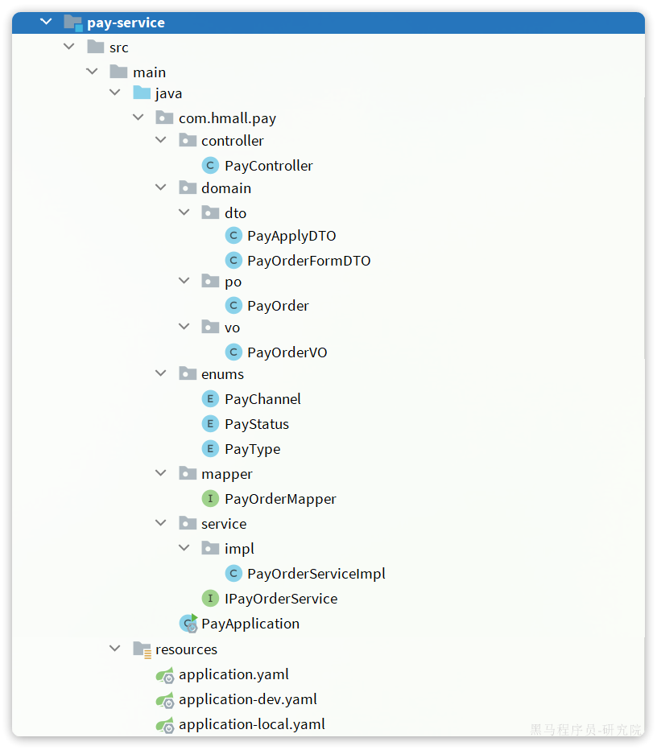
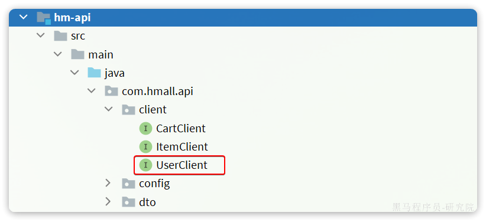

# 微服务拆分练习

# 1.用户服务

## 1.1.创建项目

在hmall下新建一个module，命名为user-service：


## 1.2.依赖

user-service的pom.xml文件内容如下：

```xml
<?xml version="1.0" encoding="UTF-8"?>
<project xmlns="http://maven.apache.org/POM/4.0.0"
         xmlns:xsi="http://www.w3.org/2001/XMLSchema-instance"
         xsi:schemaLocation="http://maven.apache.org/POM/4.0.0 http://maven.apache.org/xsd/maven-4.0.0.xsd">
    <parent>
        <artifactId>hmall</artifactId>
        <groupId>com.heima</groupId>
        <version>1.0.0</version>
    </parent>
    <modelVersion>4.0.0</modelVersion>

    <artifactId>user-service</artifactId>

    <properties>
        <maven.compiler.source>11</maven.compiler.source>
        <maven.compiler.target>11</maven.compiler.target>
    </properties>

    <dependencies>
        <!--common-->
        <dependency>
            <groupId>com.heima</groupId>
            <artifactId>hm-common</artifactId>
            <version>1.0.0</version>
        </dependency>
        <!--api-->
        <dependency>
            <groupId>com.heima</groupId>
            <artifactId>hm-api</artifactId>
            <version>1.0.0</version>
        </dependency>
        <!--web-->
        <dependency>
            <groupId>org.springframework.boot</groupId>
            <artifactId>spring-boot-starter-web</artifactId>
        </dependency>
        <!--数据库-->
        <dependency>
            <groupId>mysql</groupId>
            <artifactId>mysql-connector-java</artifactId>
        </dependency>
        <!--mybatis-->
        <dependency>
            <groupId>com.baomidou</groupId>
            <artifactId>mybatis-plus-boot-starter</artifactId>
        </dependency>
        <!--nacos 服务注册发现-->
        <dependency>
            <groupId>com.alibaba.cloud</groupId>
            <artifactId>spring-cloud-starter-alibaba-nacos-discovery</artifactId>
        </dependency>
    </dependencies>
    <build>
        <finalName>${project.artifactId}</finalName>
        <plugins>
            <plugin>
                <groupId>org.springframework.boot</groupId>
                <artifactId>spring-boot-maven-plugin</artifactId>
            </plugin>
        </plugins>
    </build>
</project>
```

## 1.3.启动类

在user-service中的`com.hmall.user`包下创建启动类：

```java
package com.hmall.user;

import org.mybatis.spring.annotation.MapperScan;
import org.springframework.boot.SpringApplication;
import org.springframework.boot.autoconfigure.SpringBootApplication;

@MapperScan("com.hmall.user.mapper")
@SpringBootApplication
public class UserApplication {
    public static void main(String[] args) {
        SpringApplication.run(UserApplication.class, args);
    }
}
```

## 1.4.配置文件

从`hm-service`项目中复制3个yaml配置文件到`user-service`的`resource`目录。

其中`application-dev.yaml`和`application-local.yaml`保持不变。`application.yaml`如下：

```yaml
server:
  port: 8084
spring:
  application:
    name: user-service # 服务名称
  profiles:
    active: dev
  datasource:
    url: jdbc:mysql://${hm.db.host}:3306/hm-user?useUnicode=true&characterEncoding=UTF-8&autoReconnect=true&serverTimezone=Asia/Shanghai
    driver-class-name: com.mysql.cj.jdbc.Driver
    username: root
    password: ${hm.db.pw}
  cloud:
    nacos:
      server-addr: 192.168.150.101 # nacos地址
mybatis-plus:
  configuration:
    default-enum-type-handler: com.baomidou.mybatisplus.core.handlers.MybatisEnumTypeHandler
  global-config:
    db-config:
      update-strategy: not_null
      id-type: auto
logging:
  level:
    com.hmall: debug
  pattern:
    dateformat: HH:mm:ss:SSS
  file:
    path: "logs/${spring.application.name}"
knife4j:
  enable: true
  openapi:
    title: 用户服务接口文档
    description: "信息"
    email: zhanghuyi@itcast.cn
    concat: 虎哥
    url: https://www.itcast.cn
    version: v1.0.0
    group:
      default:
        group-name: default
        api-rule: package
        api-rule-resources:
          - com.hmall.user.controller
hm:
  jwt:
    location: classpath:hmall.jks
    alias: hmall
    password: hmall123
    tokenTTL: 30m
```

将hm-service下的hmall.jks文件拷贝到user-service下的resources目录，这是JWT加密的秘钥文件：


## 1.5.代码

复制hm-service中所有与user、address、jwt有关的代码，最终项目结构如下：


## 1.6.数据库

user-service也需要自己的独立的database，向MySQL中导入课前资料提供的SQL：


导入结果如下：


## 1.7.配置启动项

给user-service配置启动项，设置profile为local：



## 1.8.测试

启动UserApplication，访问http://localhost:8084/doc.html#/default/用户相关接口/loginUsingPOST，测试登录接口：



用户服务测试通过。

# 2.交易服务

## 2.1.创建项目

在hmall下新建一个module，命名为trade-service：


## 2.2.依赖

trade-service的pom.xml文件内容如下：

```xml
<?xml version="1.0" encoding="UTF-8"?>
<project xmlns="http://maven.apache.org/POM/4.0.0"
         xmlns:xsi="http://www.w3.org/2001/XMLSchema-instance"
         xsi:schemaLocation="http://maven.apache.org/POM/4.0.0 http://maven.apache.org/xsd/maven-4.0.0.xsd">
    <parent>
        <artifactId>hmall</artifactId>
        <groupId>com.heima</groupId>
        <version>1.0.0</version>
    </parent>
    <modelVersion>4.0.0</modelVersion>

    <artifactId>trade-service</artifactId>

    <properties>
        <maven.compiler.source>11</maven.compiler.source>
        <maven.compiler.target>11</maven.compiler.target>
    </properties>

    <dependencies>
        <!--common-->
        <dependency>
            <groupId>com.heima</groupId>
            <artifactId>hm-common</artifactId>
            <version>1.0.0</version>
        </dependency>
        <!--api-->
        <dependency>
            <groupId>com.heima</groupId>
            <artifactId>hm-api</artifactId>
            <version>1.0.0</version>
        </dependency>
        <!--web-->
        <dependency>
            <groupId>org.springframework.boot</groupId>
            <artifactId>spring-boot-starter-web</artifactId>
        </dependency>
        <!--数据库-->
        <dependency>
            <groupId>mysql</groupId>
            <artifactId>mysql-connector-java</artifactId>
        </dependency>
        <!--mybatis-->
        <dependency>
            <groupId>com.baomidou</groupId>
            <artifactId>mybatis-plus-boot-starter</artifactId>
        </dependency>
        <!--nacos 服务注册发现-->
        <dependency>
            <groupId>com.alibaba.cloud</groupId>
            <artifactId>spring-cloud-starter-alibaba-nacos-discovery</artifactId>
        </dependency>
    </dependencies>
    <build>
        <finalName>${project.artifactId}</finalName>
        <plugins>
            <plugin>
                <groupId>org.springframework.boot</groupId>
                <artifactId>spring-boot-maven-plugin</artifactId>
            </plugin>
        </plugins>
    </build>
</project>
```

## 2.3.启动类

在trade-service中的`com.hmall.trade`包下创建启动类：

```java
package com.hmall.trade;

import org.mybatis.spring.annotation.MapperScan;
import org.springframework.boot.SpringApplication;
import org.springframework.boot.autoconfigure.SpringBootApplication;
import org.springframework.cloud.openfeign.EnableFeignClients;

@EnableFeignClients(basePackages = "com.hmall.api.client", defaultConfiguration = DefaultFeignConfig.class)
@MapperScan("com.hmall.trade.mapper")
@SpringBootApplication
public class TradeApplication {
    public static void main(String[] args) {
        SpringApplication.run(TradeApplication.class, args);
    }
}
```

## 2.4.配置文件

从`hm-service`项目中复制3个yaml配置文件到`trade-service`的`resource`目录。

其中`application-dev.yaml`和`application-local.yaml`保持不变。`application.yaml`如下：

```yaml
server:
  port: 8085
spring:
  application:
    name: trade-service # 服务名称
  profiles:
    active: dev
  datasource:
    url: jdbc:mysql://${hm.db.host}:3306/hm-trade?useUnicode=true&characterEncoding=UTF-8&autoReconnect=true&serverTimezone=Asia/Shanghai
    driver-class-name: com.mysql.cj.jdbc.Driver
    username: root
    password: ${hm.db.pw}
  cloud:
    nacos:
      server-addr: 192.168.150.101 # nacos地址
mybatis-plus:
  configuration:
    default-enum-type-handler: com.baomidou.mybatisplus.core.handlers.MybatisEnumTypeHandler
  global-config:
    db-config:
      update-strategy: not_null
      id-type: auto
logging:
  level:
    com.hmall: debug
  pattern:
    dateformat: HH:mm:ss:SSS
  file:
    path: "logs/${spring.application.name}"
knife4j:
  enable: true
  openapi:
    title: 交易服务接口文档
    description: "信息"
    email: zhanghuyi@itcast.cn
    concat: 虎哥
    url: https://www.itcast.cn
    version: v1.0.0
    group:
      default:
        group-name: default
        api-rule: package
        api-rule-resources:
          - com.hmall.trade.controller
```

## 2.5.代码

### 2.5.1.基础代码

复制hm-service中所有与trade有关的代码，最终项目结构如下：



在交易服务中，用户下单时需要做下列事情：

- **根据id查询商品列表**
- 计算商品总价
- 保存订单
- **扣减库存**
- **清理购物车商品**

其中，查询商品、扣减库存都是与商品有关的业务，在item-service中有相关功能；清理购物车商品是购物车业务，在cart-service中有相关功能。

因此交易服务要调用他们，必须通过OpenFeign远程调用。我们需要将上述功能抽取为FeignClient.

### 2.5.2.抽取ItemClient接口

首先是**扣减库存**，在`item-service`中的对应业务接口如下：



我们将这个接口抽取到`hm-api`模块的`com.hmall.api.client.ItemClient`中:


将接口参数的`OrderDetailDTO`抽取到`hm-api`模块的`com.hmall.api.dto`包下：



### 2.5.3.抽取CartClient接口

接下来是**清理购物车商品**，在`cart-service`中的对应业务接口如下：


我们在`hm-api`模块的`com.hmall.api.client`包下定义一个`CartClient`接口：


代码如下：

```java
package com.hmall.api.client;

import org.springframework.cloud.openfeign.FeignClient;
import org.springframework.web.bind.annotation.DeleteMapping;
import org.springframework.web.bind.annotation.RequestParam;

import java.util.Collection;

@FeignClient("cart-service")
public interface CartClient {
    @DeleteMapping("/carts")
    void deleteCartItemByIds(@RequestParam("ids") Collection<Long> ids);
}
```

### 2.5.4.改造OrderServiceImpl

接下来，就可以改造OrderServiceImpl中的逻辑，将本地方法调用改造为基于FeignClient的调用，完整代码如下：

```java
package com.hmall.trade.service.impl;

import com.baomidou.mybatisplus.extension.service.impl.ServiceImpl;
import com.hmall.api.client.CartClient;
import com.hmall.api.client.ItemClient;
import com.hmall.api.dto.ItemDTO;
import com.hmall.api.dto.OrderDetailDTO;
import com.hmall.common.exception.BadRequestException;
import com.hmall.common.utils.UserContext;
import com.hmall.trade.domain.dto.OrderFormDTO;
import com.hmall.trade.domain.po.Order;
import com.hmall.trade.domain.po.OrderDetail;
import com.hmall.trade.mapper.OrderMapper;
import com.hmall.trade.service.IOrderDetailService;
import com.hmall.trade.service.IOrderService;
import lombok.RequiredArgsConstructor;
import org.springframework.stereotype.Service;
import org.springframework.transaction.annotation.Transactional;

import java.util.ArrayList;
import java.util.List;
import java.util.Map;
import java.util.Set;
import java.util.stream.Collectors;

/**
 * <p>
 * 服务实现类
 * </p>
 */
@Service
@RequiredArgsConstructor
public class OrderServiceImpl extends ServiceImpl<OrderMapper, Order> implements IOrderService {

    private final ItemClient itemClient;
    private final IOrderDetailService detailService;
    private final CartClient cartClient;

    @Override
    @Transactional
    public Long createOrder(OrderFormDTO orderFormDTO) {
        // 1.订单数据
        Order order = new Order();
        // 1.1.查询商品
        List<OrderDetailDTO> detailDTOS = orderFormDTO.getDetails();
        // 1.2.获取商品id和数量的Map
        Map<Long, Integer> itemNumMap = detailDTOS.stream()
                .collect(Collectors.toMap(OrderDetailDTO::getItemId, OrderDetailDTO::getNum));
        Set<Long> itemIds = itemNumMap.keySet();
        // 1.3.查询商品
        List<ItemDTO> items = itemClient.queryItemByIds(itemIds);
        if (items == null || items.size() < itemIds.size()) {
            throw new BadRequestException("商品不存在");
        }
        // 1.4.基于商品价格、购买数量计算商品总价：totalFee
        int total = 0;
        for (ItemDTO item : items) {
            total += item.getPrice()  itemNumMap.get(item.getId());
        }
        order.setTotalFee(total);
        // 1.5.其它属性
        order.setPaymentType(orderFormDTO.getPaymentType());
        order.setUserId(UserContext.getUser());
        order.setStatus(1);
        // 1.6.将Order写入数据库order表中
        save(order);

        // 2.保存订单详情
        List<OrderDetail> details = buildDetails(order.getId(), items, itemNumMap);
        detailService.saveBatch(details);

        // 3.扣减库存
        try {
            itemClient.deductStock(detailDTOS);
        } catch (Exception e) {
            throw new RuntimeException("库存不足！");
        }

        // 4.清理购物车商品
        cartClient.deleteCartItemByIds(itemIds);
        return order.getId();
    }

    private List<OrderDetail> buildDetails(Long orderId, List<ItemDTO> items, Map<Long, Integer> numMap) {
        List<OrderDetail> details = new ArrayList<>(items.size());
        for (ItemDTO item : items) {
            OrderDetail detail = new OrderDetail();
            detail.setName(item.getName());
            detail.setSpec(item.getSpec());
            detail.setPrice(item.getPrice());
            detail.setNum(numMap.get(item.getId()));
            detail.setItemId(item.getId());
            detail.setImage(item.getImage());
            detail.setOrderId(orderId);
            details.add(detail);
        }
        return details;
    }
}
```

## 2.6.数据库

trade-service也需要自己的独立的database，向MySQL中导入课前资料提供的SQL：


导入结果如下：



## 2.7.配置启动项

给trade-service配置启动项，设置profile为local：



## 2.8.测试

启动TradeApplication，访问[http://localhost:8085/doc.html](http://localhost:8085/doc.html#/default/订单管理接口/queryOrderByIdUsingGET)，测试查询订单接口：



请求参数：1654779387523936258，交易服务测试通过。

注意，创建订单接口无法测试，因为无法获取登录用户信息。

# 3.支付服务

## 3.1.创建项目

在`hmall`下新建一个module，命名为`pay-service`：


## 3.2.依赖

`pay-service`的`pom.xml`文件内容如下：

```xml
<?xml version="1.0" encoding="UTF-8"?>
<project xmlns="http://maven.apache.org/POM/4.0.0"
         xmlns:xsi="http://www.w3.org/2001/XMLSchema-instance"
         xsi:schemaLocation="http://maven.apache.org/POM/4.0.0 http://maven.apache.org/xsd/maven-4.0.0.xsd">
    <parent>
        <artifactId>hmall</artifactId>
        <groupId>com.heima</groupId>
        <version>1.0.0</version>
    </parent>
    <modelVersion>4.0.0</modelVersion>

    <artifactId>pay-service</artifactId>

    <properties>
        <maven.compiler.source>11</maven.compiler.source>
        <maven.compiler.target>11</maven.compiler.target>
    </properties>

    <dependencies>
        <!--common-->
        <dependency>
            <groupId>com.heima</groupId>
            <artifactId>hm-common</artifactId>
            <version>1.0.0</version>
        </dependency>
        <!--api-->
        <dependency>
            <groupId>com.heima</groupId>
            <artifactId>hm-api</artifactId>
            <version>1.0.0</version>
        </dependency>
        <!--web-->
        <dependency>
            <groupId>org.springframework.boot</groupId>
            <artifactId>spring-boot-starter-web</artifactId>
        </dependency>
        <!--数据库-->
        <dependency>
            <groupId>mysql</groupId>
            <artifactId>mysql-connector-java</artifactId>
        </dependency>
        <!--mybatis-->
        <dependency>
            <groupId>com.baomidou</groupId>
            <artifactId>mybatis-plus-boot-starter</artifactId>
        </dependency>
        <!--nacos 服务注册发现-->
        <dependency>
            <groupId>com.alibaba.cloud</groupId>
            <artifactId>spring-cloud-starter-alibaba-nacos-discovery</artifactId>
        </dependency>
    </dependencies>
    <build>
        <finalName>${project.artifactId}</finalName>
        <plugins>
            <plugin>
                <groupId>org.springframework.boot</groupId>
                <artifactId>spring-boot-maven-plugin</artifactId>
            </plugin>
        </plugins>
    </build>
</project>
```

## 3.3.启动类

在pay-service中的`com.hmall.pay`包下创建启动类：

```java
package com.hmall.pay;

import org.mybatis.spring.annotation.MapperScan;
import org.springframework.boot.SpringApplication;
import org.springframework.boot.autoconfigure.SpringBootApplication;
import org.springframework.cloud.openfeign.EnableFeignClients;

@EnableFeignClients(basePackages = "com.hmall.api.client", defaultConfiguration = DefaultFeignConfig.class)
@MapperScan("com.hmall.pay.mapper")
@SpringBootApplication
public class PayApplication {
    public static void main(String[] args) {
        SpringApplication.run(PayApplication.class, args);
    }
}
```

## 3.4.配置文件

从`hm-service`项目中复制3个yaml配置文件到`trade-service`的`resource`目录。

其中`application-dev.yaml`和`application-local.yaml`保持不变。`application.yaml`如下：

```yaml
server:
  port: 8086
spring:
  application:
    name: pay-service
  profiles:
    active: dev
  datasource:
    url: jdbc:mysql://${hm.db.host}:3306/hm-pay?useUnicode=true&characterEncoding=UTF-8&autoReconnect=true&serverTimezone=Asia/Shanghai
    driver-class-name: com.mysql.cj.jdbc.Driver
    username: root
    password: ${hm.db.pw}
  cloud:
    nacos:
      server-addr: 192.168.150.101
mybatis-plus:
  configuration:
    default-enum-type-handler: com.baomidou.mybatisplus.core.handlers.MybatisEnumTypeHandler
  global-config:
    db-config:
      update-strategy: not_null
      id-type: auto
logging:
  level:
    com.hmall: debug
  pattern:
    dateformat: HH:mm:ss:SSS
  file:
    path: "logs/${spring.application.name}"
knife4j:
  enable: true
  openapi:
    title: 支付服务接口文档
    description: "支付服务接口文档"
    email: zhanghuyi@itcast.cn
    concat: 虎哥
    url: https://www.itcast.cn
    version: v1.0.0
    group:
      default:
        group-name: default
        api-rule: package
        api-rule-resources:
          - com.hmall.pay.controller
```

## 3.5.代码

### 3.5.1.基础代码

复制hm-service中所有与支付有关的代码，最终项目结构如下：



在支付服务中，基于用户余额支付时需要做下列事情：

- **扣减用户余额**
- 标记支付单状态为已支付
- **标记订单状态为已支付**

其中，**扣减用户余额**是在`user-service`中有相关功能；**标记订单状态**则是在`trade-service`中有相关功能。因此交易服务要调用他们，必须通过OpenFeign远程调用。我们需要将上述功能抽取为FeignClient.

### 2.5.2.抽取UserClient接口

首先是**扣减用户余额**，在`user-service`中的对应业务接口如下：


我们将这个接口抽取到`hm-api`模块的`com.hmall.api.client.UserClient`中:



具体代码如下：

```java
package com.hmall.api.client;

import org.springframework.cloud.openfeign.FeignClient;
import org.springframework.web.bind.annotation.PutMapping;
import org.springframework.web.bind.annotation.RequestParam;

@FeignClient("user-service")
public interface UserClient {
    @PutMapping("/users/money/deduct")
    void deductMoney(@RequestParam("pw") String pw,@RequestParam("amount") Integer amount);
}
```

### 2.5.3.抽取TradeClient接口

接下来是**标记订单状态**，在`trade-service`中的对应业务接口如下：


我们将这个接口抽取到`hm-api`模块的`com.hmall.api.client.TradeClient`中:


代码如下：

```java
package com.hmall.api.client;

import org.springframework.cloud.openfeign.FeignClient;
import org.springframework.web.bind.annotation.PathVariable;
import org.springframework.web.bind.annotation.PutMapping;

@FeignClient("trade-service")
public interface TradeClient {
    @PutMapping("/orders/{orderId}")
    void markOrderPaySuccess(@PathVariable("orderId") Long orderId);
}
```

### 2.5.4.改造PayOrderServiceImpl

接下来，就可以改造`PayOrderServiceImpl`中的逻辑，将本地方法调用改造为基于`FeignClient`的调用，完整代码如下：

```java
package com.hmall.pay.service.impl;

import com.baomidou.mybatisplus.core.toolkit.IdWorker;
import com.baomidou.mybatisplus.core.toolkit.StringUtils;
import com.baomidou.mybatisplus.extension.service.impl.ServiceImpl;
import com.hmall.api.client.TradeClient;
import com.hmall.api.client.UserClient;
import com.hmall.common.exception.BizIllegalException;
import com.hmall.common.utils.BeanUtils;
import com.hmall.common.utils.UserContext;
import com.hmall.pay.domain.dto.PayApplyDTO;
import com.hmall.pay.domain.dto.PayOrderFormDTO;
import com.hmall.pay.domain.po.PayOrder;
import com.hmall.pay.enums.PayStatus;
import com.hmall.pay.mapper.PayOrderMapper;
import com.hmall.pay.service.IPayOrderService;
import lombok.RequiredArgsConstructor;
import org.springframework.stereotype.Service;
import org.springframework.transaction.annotation.Transactional;

import java.time.LocalDateTime;

/**
 * <p>
 * 支付订单 服务实现类
 * </p>
 *
 */
@Service
@RequiredArgsConstructor
public class PayOrderServiceImpl extends ServiceImpl<PayOrderMapper, PayOrder> implements IPayOrderService {

    private final UserClient userClient;

    private final TradeClient tradeClient;

    @Override
    public String applyPayOrder(PayApplyDTO applyDTO) {
        // 1.幂等性校验
        PayOrder payOrder = checkIdempotent(applyDTO);
        // 2.返回结果
        return payOrder.getId().toString();
    }

    @Override
    @Transactional
    public void tryPayOrderByBalance(PayOrderFormDTO payOrderDTO) {
        // 1.查询支付单
        PayOrder po = getById(payOrderDTO.getId());
        // 2.判断状态
        if(!PayStatus.WAIT_BUYER_PAY.equalsValue(po.getStatus())){
            // 订单不是未支付，状态异常
            throw new BizIllegalException("交易已支付或关闭！");
        }
        // 3.尝试扣减余额
        userClient.deductMoney(payOrderDTO.getPw(), po.getAmount());
        // 4.修改支付单状态
        boolean success = markPayOrderSuccess(payOrderDTO.getId(), LocalDateTime.now());
        if (!success) {
            throw new BizIllegalException("交易已支付或关闭！");
        }
        // 5.修改订单状态
        tradeClient.markOrderPaySuccess(po.getBizOrderNo());
    }

    public boolean markPayOrderSuccess(Long id, LocalDateTime successTime) {
        return lambdaUpdate()
                .set(PayOrder::getStatus, PayStatus.TRADE_SUCCESS.getValue())
                .set(PayOrder::getPaySuccessTime, successTime)
                .eq(PayOrder::getId, id)
                // 支付状态的乐观锁判断
                .in(PayOrder::getStatus, PayStatus.NOT_COMMIT.getValue(), PayStatus.WAIT_BUYER_PAY.getValue())
                .update();
    }


    private PayOrder checkIdempotent(PayApplyDTO applyDTO) {
        // 1.首先查询支付单
        PayOrder oldOrder = queryByBizOrderNo(applyDTO.getBizOrderNo());
        // 2.判断是否存在
        if (oldOrder == null) {
            // 不存在支付单，说明是第一次，写入新的支付单并返回
            PayOrder payOrder = buildPayOrder(applyDTO);
            payOrder.setPayOrderNo(IdWorker.getId());
            save(payOrder);
            return payOrder;
        }
        // 3.旧单已经存在，判断是否支付成功
        if (PayStatus.TRADE_SUCCESS.equalsValue(oldOrder.getStatus())) {
            // 已经支付成功，抛出异常
            throw new BizIllegalException("订单已经支付！");
        }
        // 4.旧单已经存在，判断是否已经关闭
        if (PayStatus.TRADE_CLOSED.equalsValue(oldOrder.getStatus())) {
            // 已经关闭，抛出异常
            throw new BizIllegalException("订单已关闭");
        }
        // 5.旧单已经存在，判断支付渠道是否一致
        if (!StringUtils.equals(oldOrder.getPayChannelCode(), applyDTO.getPayChannelCode())) {
            // 支付渠道不一致，需要重置数据，然后重新申请支付单
            PayOrder payOrder = buildPayOrder(applyDTO);
            payOrder.setId(oldOrder.getId());
            payOrder.setQrCodeUrl("");
            updateById(payOrder);
            payOrder.setPayOrderNo(oldOrder.getPayOrderNo());
            return payOrder;
        }
        // 6.旧单已经存在，且可能是未支付或未提交，且支付渠道一致，直接返回旧数据
        return oldOrder;
    }

    private PayOrder buildPayOrder(PayApplyDTO payApplyDTO) {
        // 1.数据转换
        PayOrder payOrder = BeanUtils.toBean(payApplyDTO, PayOrder.class);
        // 2.初始化数据
        payOrder.setPayOverTime(LocalDateTime.now().plusMinutes(120L));
        payOrder.setStatus(PayStatus.WAIT_BUYER_PAY.getValue());
        payOrder.setBizUserId(UserContext.getUser());
        return payOrder;
    }
    public PayOrder queryByBizOrderNo(Long bizOrderNo) {
        return lambdaQuery()
                .eq(PayOrder::getBizOrderNo, bizOrderNo)
                .one();
    }
}
```

## 2.6.数据库

`pay-service`也需要自己的独立的database，向MySQL中导入课前资料提供的SQL：


导入结果如下：


## 2.7.配置启动项

给`pay-service`配置启动项，设置profile为`local`：


## 2.8.测试

在支付服务的PayController中添加一个接口方便测试：

```java
@ApiOperation("查询支付单")
@GetMapping
public List<PayOrderVO> queryPayOrders(){
    return BeanUtils.copyList(payOrderService.list(), PayOrderVO.class);
}
```

启动PayApplication，访问[http://localhost:8086/doc.html](http://localhost:8086/doc.html#/default/支付相关接口/queryPayOrdersUsingGET)，测试查询订单接口：


支付服务测试通过。