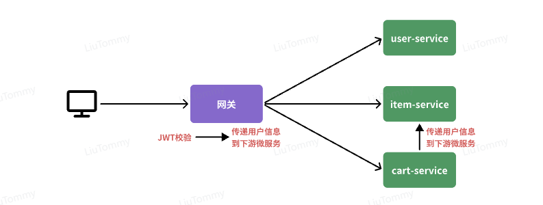
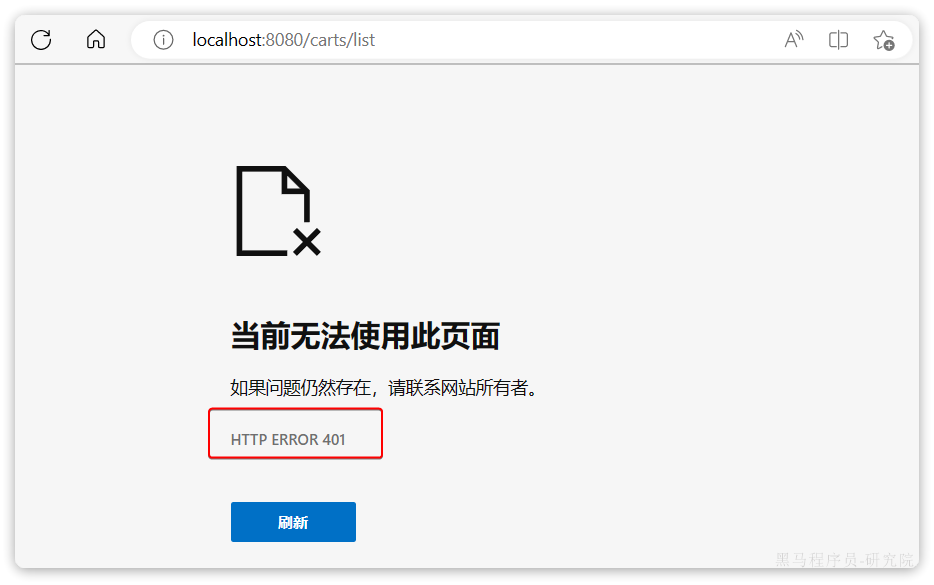
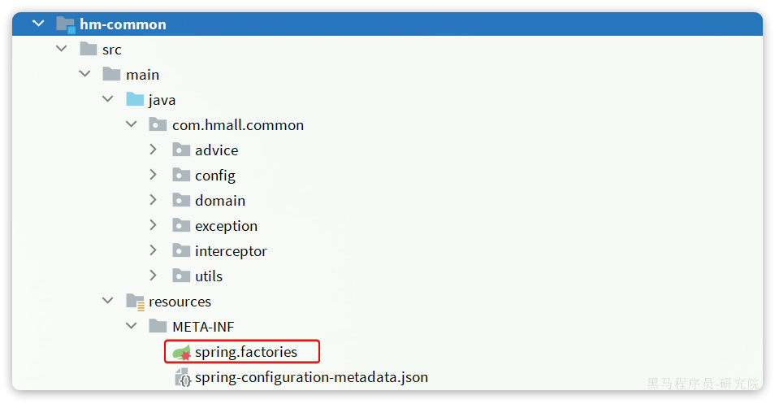

在昨天的练习中，我们将商城拆分为5个微服务：

- 用户服务
- 商品服务
- 购物车服务
- 交易服务
- 支付服务 

由于每个微服务都有不同的地址或端口，入口不同，相信大家在与前端联调的时候发现了一些问题：

- 请求不同数据时要访问不同的入口，需要维护多个入口地址，麻烦
- 前端无法调用nacos，无法实时更新服务列表

单体架构时我们只需要完成一次用户登录、身份校验，就可以在所有业务中获取到用户信息。而微服务拆分后，每个微服务都独立部署，这就存在一些问题：

- 每个微服务都需要编写登录校验、用户信息获取的功能吗？
- 当微服务之间调用时，该如何传递用户信息？

不要着急，这些问题都可以在今天的学习中找到答案，我们会通过**网关**技术解决上述问题。今天的内容会分为3章：

- 第一章：网关路由，解决前端请求入口的问题。
- 第二章：网关鉴权，解决统一登录校验和用户信息获取的问题。
- 第三章：统一配置管理，解决微服务的配置文件重复和配置热更新问题。

通过今天的学习你将掌握下列能力：

- 会利用微服务网关做请求路由
- 会利用微服务网关做登录身份校验
- 会利用Nacos实现统一配置管理
- 会利用Nacos实现配置热更新

好了，接下来我们就一起进入今天的学习吧。

# 1.网关路由

## 1.1.认识网关

什么是网关？

顾明思议，网关就是**网**络的**关**口。数据在网络间传输，从一个网络传输到另一网络时就需要经过网关来做数据的**路由和转发以及数据安全的校验**。

更通俗的来讲，网关就像是以前园区传达室的大爷。

- 外面的人要想进入园区，必须经过大爷的认可，如果你是不怀好意的人，肯定被直接拦截。
- 外面的人要传话或送信，要找大爷。大爷帮你带给目标人。


现在，微服务网关就起到同样的作用。前端请求不能直接访问微服务，而是要请求网关：

- 网关可以做安全控制，也就是登录身份校验，校验通过才放行
- 通过认证后，网关再根据请求判断应该访问哪个微服务，将请求转发过去


在SpringCloud当中，提供了两种网关实现方案：

- Netflix Zuul：早期实现，目前已经淘汰
- SpringCloudGateway：基于Spring的WebFlux技术，完全支持响应式编程，吞吐能力更强

课堂中我们以SpringCloudGateway为例来讲解，官方网站：

https://spring.io/projects/spring-cloud-gateway#learn

## 1.2.快速入门

接下来，我们先看下如何利用网关实现请求路由。由于网关本身也是一个独立的微服务，因此也需要创建一个模块开发功能。大概步骤如下：

- 创建网关微服务
- 引入SpringCloudGateway、NacosDiscovery依赖
- 编写启动类
- 配置网关路由

### 1.2.1.创建项目

首先，我们要在hmall下创建一个新的module，命名为hm-gateway，作为网关微服务：


### 1.2.2.引入依赖

在`hm-gateway`模块的`pom.xml`文件中引入依赖：

```xml
<?xml version="1.0" encoding="UTF-8"?>
<project xmlns="http://maven.apache.org/POM/4.0.0"
         xmlns:xsi="http://www.w3.org/2001/XMLSchema-instance"
         xsi:schemaLocation="http://maven.apache.org/POM/4.0.0 http://maven.apache.org/xsd/maven-4.0.0.xsd">
    <parent>
        <artifactId>hmall</artifactId>
        <groupId>com.heima</groupId>
        <version>1.0.0</version>
    </parent>
    <modelVersion>4.0.0</modelVersion>

    <artifactId>hm-gateway</artifactId>

    <properties>
        <maven.compiler.source>11</maven.compiler.source>
        <maven.compiler.target>11</maven.compiler.target>
    </properties>
    <dependencies>
        <!--common-->
        <dependency>
            <groupId>com.heima</groupId>
            <artifactId>hm-common</artifactId>
            <version>1.0.0</version>
        </dependency>
        <!--网关-->
        <dependency>
            <groupId>org.springframework.cloud</groupId>
            <artifactId>spring-cloud-starter-gateway</artifactId>
        </dependency>
        <!--nacos discovery-->
        <dependency>
            <groupId>com.alibaba.cloud</groupId>
            <artifactId>spring-cloud-starter-alibaba-nacos-discovery</artifactId>
        </dependency>
        <!--负载均衡-->
        <dependency>
            <groupId>org.springframework.cloud</groupId>
            <artifactId>spring-cloud-starter-loadbalancer</artifactId>
        </dependency>
    </dependencies>
    <build>
        <finalName>${project.artifactId}</finalName>
        <plugins>
            <plugin>
                <groupId>org.springframework.boot</groupId>
                <artifactId>spring-boot-maven-plugin</artifactId>
            </plugin>
        </plugins>
    </build>
</project>
```

### 1.2.3.启动类

在`hm-gateway`模块的`com.hmall.gateway`包下新建一个启动类：


代码如下：

```java
package com.hmall.gateway;

import org.springframework.boot.SpringApplication;
import org.springframework.boot.autoconfigure.SpringBootApplication;

@SpringBootApplication
public class GatewayApplication {
    public static void main(String[] args) {
        SpringApplication.run(GatewayApplication.class, args);
    }
}
```

### 1.2.4.配置路由

接下来，在`hm-gateway`模块的`resources`目录新建一个`application.yaml`文件，内容如下：

```yaml
server:
  port: 8080
spring:
  application:
    name: gateway
  cloud:
    nacos:
      server-addr: 192.168.150.101:8848
    gateway:
      routes:
        - id: item # 路由规则id，自定义，唯一
          uri: lb://item-service # 路由的目标服务，lb代表负载均衡，会从注册中心拉取服务列表
          predicates: # 路由断言，判断当前请求是否符合当前规则，符合则路由到目标服务
            - Path=/items/**,/search/** # 这里是以请求路径作为判断规则
        - id: cart
          uri: lb://cart-service
          predicates:
            - Path=/carts/**
        - id: user
          uri: lb://user-service
          predicates:
            - Path=/users/**,/addresses/**
        - id: trade
          uri: lb://trade-service
          predicates:
            - Path=/orders/**
        - id: pay
          uri: lb://pay-service
          predicates:
            - Path=/pay-orders/**
```

### 1.2.5.测试

启动GatewayApplication，以 http://localhost:8080 拼接微服务接口路径来测试。例如：

http://localhost:8080/items/page?pageNo=1&pageSize=1


此时，启动UserApplication、CartApplication，然后打开前端页面，发现相关功能都可以正常访问了。

## 1.3.路由过滤

路由规则的定义语法如下：

```yaml
spring:
  cloud:
    gateway:
      routes:
        - id: item
          uri: lb://item-service
          predicates:
            - Path=/items/**,/search/**
```

其中routes对应的类型如下：


是一个集合，也就是说可以定义很多路由规则。集合中的`RouteDefinition`就是具体的路由规则定义，其中常见的属性如下：


四个属性含义如下：

- `id`：路由的唯一标示
- `predicates`：路由断言，其实就是匹配条件
- `filters`：路由过滤条件，后面讲
- `uri`：路由目标地址，`lb://`代表负载均衡，从注册中心获取目标微服务的实例列表，并且负载均衡选择一个访问。

这里我们重点关注`predicates`，也就是路由断言。SpringCloudGateway中支持的断言类型有很多：

| **名称**   | **说明**                       | **示例**                                                     |
| :--------- | :----------------------------- | :----------------------------------------------------------- |
| After      | 是某个时间点后的请求           | - After=2037-01-20T17:42:47.789-07:00[America/Denver]        |
| Before     | 是某个时间点之前的请求         | - Before=2031-04-13T15:14:47.433+08:00[Asia/Shanghai]        |
| Between    | 是某两个时间点之前的请求       | - Between=2037-01-20T17:42:47.789-07:00[America/Denver], 2037-01-21T17:42:47.789-07:00[America/Denver] |
| Cookie     | 请求必须包含某些cookie         | - Cookie=chocolate, ch.p                                     |
| Header     | 请求必须包含某些header         | - Header=X-Request-Id, \d+                                   |
| Host       | 请求必须是访问某个host（域名） | - Host=**.somehost.org,**.anotherhost.org                    |
| Method     | 请求方式必须是指定方式         | - Method=GET,POST                                            |
| Path       | 请求路径必须符合指定规则       | - Path=/red/{segment},/blue/**                               |
| Query      | 请求参数必须包含指定参数       | - Query=name, Jack或者- Query=name                           |
| RemoteAddr | 请求者的ip必须是指定范围       | - RemoteAddr=192.168.1.1/24                                  |
| weight     | 权重处理                       |                                                              |

# 2.网关登录校验

单体架构时我们只需要完成一次用户登录、身份校验，就可以在所有业务中获取到用户信息。而微服务拆分后，每个微服务都独立部署，不再共享数据。也就意味着每个微服务都需要做登录校验，这显然不可取。

## 2.1.鉴权思路分析

我们的登录是基于JWT来实现的，校验JWT的算法复杂，而且需要用到秘钥。如果每个微服务都去做登录校验，这就存在着两大问题：

- 每个微服务都需要知道JWT的秘钥，不安全
- 每个微服务重复编写登录校验代码、权限校验代码，麻烦

既然网关是所有微服务的入口，一切请求都需要先经过网关。我们完全可以把登录校验的工作放到网关去做，这样之前说的问题就解决了：

- 只需要在网关和用户服务保存秘钥
- 只需要在网关开发登录校验功能

此时，登录校验的流程如图：



不过，这里存在几个问题：

- 网关路由是配置的，请求转发是Gateway内部代码，我们如何在转发之前做登录校验？
- 网关校验JWT之后，如何将用户信息传递给微服务？
- 微服务之间也会相互调用，这种调用不经过网关，又该如何传递用户信息？

这些问题将在接下来几节一一解决。

## 2.2.网关过滤器

登录校验必须在请求转发到微服务之前做，否则就失去了意义。而网关的请求转发是`Gateway`内部代码实现的，要想在请求转发之前做登录校验，就必须了解`Gateway`内部工作的基本原理。

暂时无法在飞书文档外展示此内容

如图所示：

1. 客户端请求进入网关后由`HandlerMapping`对请求做判断，找到与当前请求匹配的路由规则（**`Route`**），然后将请求交给`WebHandler`去处理。
2. `WebHandler`则会加载当前路由下需要执行的过滤器链（**`Filter chain`**），然后按照顺序逐一执行过滤器（后面称为**`Filter`**）。
3. 图中`Filter`被虚线分为左右两部分，是因为`Filter`内部的逻辑分为`pre`和`post`两部分，分别会在请求路由到微服务**之前**和**之后**被执行。
4. 只有所有`Filter`的`pre`逻辑都依次顺序执行通过后，请求才会被路由到微服务。
5. 微服务返回结果后，再倒序执行`Filter`的`post`逻辑。
6. 最终把响应结果返回。

如图中所示，最终请求转发是有一个名为`NettyRoutingFilter`的过滤器来执行的，而且这个过滤器是整个过滤器链中顺序最靠后的一个。**如果我们能够定义一个过滤器，在其中实现登录校验逻辑，并且将过滤器执行顺序定义到****`NettyRoutingFilter`****之前**，这就符合我们的需求了！

那么，该如何实现一个网关过滤器呢？

网关过滤器链中的过滤器有两种：

- **`GatewayFilter`**：路由过滤器，作用范围比较灵活，可以是任意指定的路由`Route`. 
- **`GlobalFilter`**：全局过滤器，作用范围是所有路由，不可配置。

> **注意**：过滤器链之外还有一种过滤器，HttpHeadersFilter，用来处理传递到下游微服务的请求头。例如org.springframework.cloud.gateway.filter.headers.XForwardedHeadersFilter可以传递代理请求原本的host头到下游微服务。

其实`GatewayFilter`和`GlobalFilter`这两种过滤器的方法签名完全一致：

```java
/**
 * 处理请求并将其传递给下一个过滤器
 * @param exchange 当前请求的上下文，其中包含request、response等各种数据
 * @param chain 过滤器链，基于它向下传递请求
 * @return 根据返回值标记当前请求是否被完成或拦截，chain.filter(exchange)就放行了。
 */
Mono<Void> filter(ServerWebExchange exchange, GatewayFilterChain chain);
```

`FilteringWebHandler`在处理请求时，会将`GlobalFilter`装饰为`GatewayFilter`，然后放到同一个过滤器链中，排序以后依次执行。

`Gateway`中内置了很多的`GatewayFilter`，详情可以参考官方文档：

https://docs.spring.io/spring-cloud-gateway/docs/3.1.7/reference/html/#gatewayfilter-factories

`Gateway`内置的`GatewayFilter`过滤器使用起来非常简单，无需编码，只要在yaml文件中简单配置即可。而且其作用范围也很灵活，配置在哪个`Route`下，就作用于哪个`Route`.

例如，有一个过滤器叫做`AddRequestHeaderGatewayFilterFacotry`，顾明思议，就是添加请求头的过滤器，可以给请求添加一个请求头并传递到下游微服务。

使用的使用只需要在application.yaml中这样配置：

```yaml
spring:
  cloud:
    gateway:
      routes:
      - id: test_route
        uri: lb://test-service
        predicates:
          -Path=/test/**
        filters:
          - AddRequestHeader=key, value # 逗号之前是请求头的key，逗号之后是value
```

如果想要让过滤器作用于所有的路由，则可以这样配置：

```yaml
spring:
  cloud:
    gateway:
      default-filters: # default-filters下的过滤器可以作用于所有路由
        - AddRequestHeader=key, value
      routes:
      - id: test_route
        uri: lb://test-service
        predicates:
          -Path=/test/**
```

## 2.3.自定义过滤器

无论是`GatewayFilter`还是`GlobalFilter`都支持自定义，只不过**编码**方式、**使用**方式略有差别。

### 2.3.1.自定义GatewayFilter

自定义`GatewayFilter`不是直接实现`GatewayFilter`，而是实现`AbstractGatewayFilterFactory`。最简单的方式是这样的：

```java
@Component
public class PrintAnyGatewayFilterFactory extends AbstractGatewayFilterFactory<Object> {
    @Override
    public GatewayFilter apply(Object config) {
        return new GatewayFilter() {
            @Override
            public Mono<Void> filter(ServerWebExchange exchange, GatewayFilterChain chain) {
                // 获取请求
                ServerHttpRequest request = exchange.getRequest();
                // 编写过滤器逻辑
                System.out.println("过滤器执行了");
                // 放行
                return chain.filter(exchange);
            }
        };
    }
}
```

> **注意**：该类的名称一定要以`GatewayFilterFactory`为后缀！

然后在yaml配置中这样使用：

```yaml
spring:
  cloud:
    gateway:
      default-filters:
            - PrintAny # 此处直接以自定义的GatewayFilterFactory类名称前缀类声明过滤器
```

另外，这种过滤器还可以支持动态配置参数，不过实现起来比较复杂，示例：

```java

@Component
public class PrintAnyGatewayFilterFactory // 父类泛型是内部类的Config类型
                extends AbstractGatewayFilterFactory<PrintAnyGatewayFilterFactory.Config> {

    @Override
    public GatewayFilter apply(Config config) {
        // OrderedGatewayFilter是GatewayFilter的子类，包含两个参数：
        // - GatewayFilter：过滤器
        // - int order值：值越小，过滤器执行优先级越高
        return new OrderedGatewayFilter(new GatewayFilter() {
            @Override
            public Mono<Void> filter(ServerWebExchange exchange, GatewayFilterChain chain) {
                // 获取config值
                String a = config.getA();
                String b = config.getB();
                String c = config.getC();
                // 编写过滤器逻辑
                System.out.println("a = " + a);
                System.out.println("b = " + b);
                System.out.println("c = " + c);
                // 放行
                return chain.filter(exchange);
            }
        }, 100);
    }

    // 自定义配置属性，成员变量名称很重要，下面会用到
    @Data
    static class Config{
        private String a;
        private String b;
        private String c;
    }
    // 将变量名称依次返回，顺序很重要，将来读取参数时需要按顺序获取
    @Override
    public List<String> shortcutFieldOrder() {
        return List.of("a", "b", "c");
    }
        // 返回当前配置类的类型，也就是内部的Config
    @Override
    public Class<Config> getConfigClass() {
        return Config.class;
    }

}
```

然后在yaml文件中使用：

```yaml
spring:
  cloud:
    gateway:
      default-filters:
            - PrintAny=1,2,3 # 注意，这里多个参数以","隔开，将来会按照shortcutFieldOrder()方法返回的参数顺序依次复制
```

上面这种配置方式参数必须严格按照shortcutFieldOrder()方法的返回参数名顺序来赋值。

还有一种用法，无需按照这个顺序，就是手动指定参数名：

```yaml
spring:
  cloud:
    gateway:
      default-filters:
            - name: PrintAny
              args: # 手动指定参数名，无需按照参数顺序
                a: 1
                b: 2
                c: 3
```

### 2.3.2.自定义GlobalFilter

自定义GlobalFilter则简单很多，直接实现GlobalFilter即可，而且也无法设置动态参数：

```java
@Component
public class PrintAnyGlobalFilter implements GlobalFilter, Ordered {
    @Override
    public Mono<Void> filter(ServerWebExchange exchange, GatewayFilterChain chain) {
        // 编写过滤器逻辑
        System.out.println("未登录，无法访问");
        // 放行
        // return chain.filter(exchange);

        // 拦截
        ServerHttpResponse response = exchange.getResponse();
        response.setRawStatusCode(401);
        return response.setComplete();
    }

    @Override
    public int getOrder() {
        // 过滤器执行顺序，值越小，优先级越高
        return 0;
    }
}
```

## 2.4.登录校验

接下来，我们就利用自定义`GlobalFilter`来完成登录校验。

### 2.4.1.JWT工具

登录校验需要用到JWT，而且JWT的加密需要秘钥和加密工具。这些在`hm-service`中已经有了，我们直接拷贝过来：


具体作用如下：

- `AuthProperties`：配置登录校验需要拦截的路径，因为不是所有的路径都需要登录才能访问
- `JwtProperties`：定义与JWT工具有关的属性，比如秘钥文件位置
- `SecurityConfig`：工具的自动装配
- `JwtTool`：JWT工具，其中包含了校验和解析`token`的功能
- `hmall.jks`：秘钥文件

其中`AuthProperties`和`JwtProperties`所需的属性要在`application.yaml`中配置：

```yaml
hm:
  jwt:
    location: classpath:hmall.jks # 秘钥地址
    alias: hmall # 秘钥别名
    password: hmall123 # 秘钥文件密码
    tokenTTL: 30m # 登录有效期
  auth:
    excludePaths: # 无需登录校验的路径
      - /search/**
      - /users/login
      - /items/**
```

### 2.4.2.登录校验过滤器

接下来，我们定义一个登录校验的过滤器：


代码如下：

```java
package com.hmall.gateway.filter;

import com.hmall.common.exception.UnauthorizedException;
import com.hmall.common.utils.CollUtils;
import com.hmall.gateway.config.AuthProperties;
import com.hmall.gateway.util.JwtTool;
import lombok.RequiredArgsConstructor;
import org.springframework.boot.context.properties.EnableConfigurationProperties;
import org.springframework.cloud.gateway.filter.GatewayFilterChain;
import org.springframework.cloud.gateway.filter.GlobalFilter;
import org.springframework.core.Ordered;
import org.springframework.http.server.reactive.ServerHttpRequest;
import org.springframework.http.server.reactive.ServerHttpResponse;
import org.springframework.stereotype.Component;
import org.springframework.util.AntPathMatcher;
import org.springframework.web.server.ServerWebExchange;
import reactor.core.publisher.Mono;

import java.util.List;

@Component
@RequiredArgsConstructor
@EnableConfigurationProperties(AuthProperties.class)
public class AuthGlobalFilter implements GlobalFilter, Ordered {

    private final JwtTool jwtTool;

    private final AuthProperties authProperties;

    private final AntPathMatcher antPathMatcher = new AntPathMatcher();

    @Override
    public Mono<Void> filter(ServerWebExchange exchange, GatewayFilterChain chain) {
        // 1.获取Request
        ServerHttpRequest request = exchange.getRequest();
        // 2.判断是否不需要拦截
        if(isExclude(request.getPath().toString())){
            // 无需拦截，直接放行
            return chain.filter(exchange);
        }
        // 3.获取请求头中的token
        String token = null;
        List<String> headers = request.getHeaders().get("authorization");
        if (!CollUtils.isEmpty(headers)) {
            token = headers.get(0);
        }
        // 4.校验并解析token
        Long userId = null;
        try {
            userId = jwtTool.parseToken(token);
        } catch (UnauthorizedException e) {
            // 如果无效，拦截
            ServerHttpResponse response = exchange.getResponse();
            response.setRawStatusCode(401);
            return response.setComplete();
        }

        // TODO 5.如果有效，传递用户信息
        System.out.println("userId = " + userId);
        // 6.放行
        return chain.filter(exchange);
    }

    private boolean isExclude(String antPath) {
        for (String pathPattern : authProperties.getExcludePaths()) {
            if(antPathMatcher.match(pathPattern, antPath)){
                return true;
            }
        }
        return false;
    }

    @Override
    public int getOrder() {
        return 0;
    }
}
```

重启测试，会发现访问/items开头的路径，未登录状态下不会被拦截：


访问其他路径则，未登录状态下请求会被拦截，并且返回`401`状态码：



## 2.5.微服务获取用户

现在，网关已经可以完成登录校验并获取登录用户身份信息。但是当网关将请求转发到微服务时，微服务又该如何获取用户身份呢？

由于网关发送请求到微服务依然采用的是`Http`请求，因此我们可以将用户信息以请求头的方式传递到下游微服务。然后微服务可以从请求头中获取登录用户信息。考虑到微服务内部可能很多地方都需要用到登录用户信息，因此我们可以利用SpringMVC的拦截器来实现登录用户信息获取，并存入ThreadLocal，方便后续使用。

据图流程图如下：


因此，接下来我们要做的事情有：

- 改造网关过滤器，在获取用户信息后保存到请求头，转发到下游微服务
- 编写微服务拦截器，拦截请求获取用户信息，保存到ThreadLocal后放行

### 2.5.1.保存用户到请求头

首先，我们修改登录校验拦截器的处理逻辑，保存用户信息到请求头中：


### 2.5.2.拦截器获取用户

在hm-common中已经有一个用于保存登录用户的ThreadLocal工具：


其中已经提供了保存和获取用户的方法：


接下来，我们只需要编写拦截器，获取用户信息并保存到`UserContext`，然后放行即可。

由于每个微服务都有获取登录用户的需求，因此拦截器我们直接写在`hm-common`中，并写好自动装配。这样微服务只需要引入`hm-common`就可以直接具备拦截器功能，无需重复编写。

我们在`hm-common`模块下定义一个拦截器：


具体代码如下：

```java
package com.hmall.common.interceptor;

import cn.hutool.core.util.StrUtil;
import com.hmall.common.utils.UserContext;
import org.springframework.web.servlet.HandlerInterceptor;

import javax.servlet.http.HttpServletRequest;
import javax.servlet.http.HttpServletResponse;

/**
 * 拦截所有来自网关的请求，并获取请求头中的用户信息
 * 所有的SpringMVC的controller方法，都会进行拦截
 */
public class UserInfoInterceptor implements HandlerInterceptor {

    @Override
    public boolean preHandle(HttpServletRequest request, HttpServletResponse response, Object handler) throws Exception {
        // 1.获取请求头中的用户信息
        String userInfo = request.getHeader("user-info");
        // 2.判断是否为空
        if (StrUtil.isNotBlank(userInfo)) {
            // 不为空，保存到ThreadLocal
            UserContext.setUser(Long.valueOf(userInfo));
        }
        // 3.放行
        return true;
    }

    @Override
    public void afterCompletion(HttpServletRequest request, HttpServletResponse response, Object handler, Exception ex) throws Exception {
        // 执行完成，从当前线程中移除用户信息
        UserContext.removeUser();
    }
}
```

接着在`hm-common`模块下编写`SpringMVC`的配置类，配置登录拦截器：


具体代码如下：

```java
import com.hmall.common.interceptor.UserInfoInterceptor;
import org.springframework.boot.autoconfigure.condition.ConditionalOnClass;
import org.springframework.context.annotation.Configuration;
import org.springframework.web.servlet.DispatcherServlet;
import org.springframework.web.servlet.config.annotation.InterceptorRegistry;
import org.springframework.web.servlet.config.annotation.WebMvcConfigurer;

@Configuration
// gateway也会引用MvcConfig，让网关不使用MvcConfig的配置
// 因为网关是基于web flux，并没有SpringMVC，所以会报错
// 所以MvcConfig配置生效的条件是“基于具有DispatcherServlet的模块”
@ConditionalOnClass(DispatcherServlet.class)
public class MvcConfig implements WebMvcConfigurer {

    @Override
    public void addInterceptors(InterceptorRegistry registry) {
        registry.addInterceptor(new UserInfoInterceptor());
    }
}
```

不过，需要注意的是，这个配置类默认是不会生效的，因为它所在的包是`com.hmall.common.config`，与其它微服务的扫描包不一致，无法被扫描到，因此无法生效。

基于SpringBoot的自动装配原理，我们要将其添加到`resources`目录下的`META-INF/spring.factories`文件中：



内容如下：

```properties
org.springframework.boot.autoconfigure.EnableAutoConfiguration=\
  com.hmall.common.config.MyBatisConfig,\
  com.hmall.common.config.MvcConfig
```

### 2.5.3.恢复购物车代码

之前我们无法获取登录用户，所以把购物车服务的登录用户写死了，现在需要恢复到原来的样子。

找到`cart-service`模块的`com.hmall.cart.service.impl.CartServiceImpl`：


修改其中的`queryMyCarts`方法：


## 2.6.OpenFeign传递用户

前端发起的请求都会经过网关再到微服务，由于我们之前编写的过滤器和拦截器功能，微服务可以轻松获取登录用户信息。

但有些业务是比较复杂的，请求到达微服务后还需要调用其它多个微服务。比如下单业务，流程如下：


下单的过程中，需要调用商品服务扣减库存，调用购物车服务清理用户购物车。而清理购物车时必须知道当前登录的用户身份。但是，**订单服务调用购物车时并没有传递用户信息**，购物车服务无法知道当前用户是谁！

由于微服务获取用户信息是通过拦截器在请求头中读取，因此要想实现微服务之间的用户信息传递，就**必须在微服务发起调用时把用户信息存入请求头**。

微服务之间调用是基于OpenFeign来实现的，并不是我们自己发送的请求。我们如何才能让每一个由OpenFeign发起的请求自动携带登录用户信息呢？

这里要借助Feign中提供的一个拦截器接口：`feign.RequestInterceptor`

```java
public interface RequestInterceptor {

  /**
   * Called for every request. 
   * Add data using methods on the supplied {@link RequestTemplate}.
   */
  void apply(RequestTemplate template);
}
```

我们只需要实现这个接口，然后实现apply方法，利用`RequestTemplate`类来添加请求头，将用户信息保存到请求头中。这样以来，每次OpenFeign发起请求的时候都会调用该方法，传递用户信息。

由于`FeignClient`全部都是在`hm-api`模块，因此我们在`hm-api`模块的`com.hmall.api.config.DefaultFeignConfig`中编写这个拦截器：


在`com.hmall.api.config.DefaultFeignConfig`中添加一个Bean：

```java
// 微服务之间调用是基于open feign的，需要在服务调用的时候传递当前用户信息
// 通过拦截器，让open feign的每一个请求，自带用户信息请求头
@Bean
public RequestInterceptor userInfoRequestInterceptor() {
    return new RequestInterceptor() {
        @Override
        public void apply(RequestTemplate requestTemplate) {
            // 获取登录用户
            // 这里举例，当订单服务调用购物车服务，那么getUser就是从订单服务的当前线程获取当前用户信息
            // 然后，放入请求头，由订单服务发起对购物车的请求调用，那么接下来在购物车服务的mvc拦截器中，就可以获取到请求头携带的用户信息了
            Long userId = UserContext.getUser();
            if (userId == null) {
                // 如果为空则直接跳过
                return;
            }
            // 如果不为空则放入请求头中，传递给下游服务
            requestTemplate.header("user-info", userId.toString());
        }
    };
}
```

好了，现在微服务之间通过OpenFeign调用时也会传递登录用户信息了。