# 服务保护和分布式事务

在微服务远程调用的过程中，还存在几个问题需要解决。

首先是**业务健壮性**问题：

例如在之前的查询购物车列表业务中，购物车服务需要查询最新的商品信息，与购物车数据做对比，提醒用户。大家设想一下，如果商品服务查询时发生故障，查询购物车列表在调用商品服务时，是不是也会异常？从而导致购物车查询失败。但从业务角度来说，为了提升用户体验，即便是商品查询失败，购物车列表也应该正确展示出来，哪怕是不包含最新的商品信息。

还有**级联失败**问题：

还是查询购物车的业务，假如商品服务业务并发较高，占用过多Tomcat连接。可能会导致商品服务的所有接口响应时间增加，延迟变高，甚至是长时间阻塞直至查询失败。

此时查询购物车业务需要查询并等待商品查询结果，从而导致查询购物车列表业务的响应时间也变长，甚至也阻塞直至无法访问。而此时如果查询购物车的请求较多，可能导致购物车服务的Tomcat连接占用较多，所有接口的响应时间都会增加，整个服务性能很差， 甚至不可用。


依次类推，整个微服务群中与购物车服务、商品服务等有调用关系的服务可能都会出现问题，最终导致整个集群不可用。


这就是**级联失败**问题，或者叫**雪崩**问题。

还有跨服务的事务问题：

比如昨天讲到过的下单业务，下单的过程中需要调用多个微服务：

- 商品服务：扣减库存
- 订单服务：保存订单
- 购物车服务：清理购物车

这些业务全部都是数据库的写操作，我们必须确保所有操作的同时成功或失败。但是这些操作在不同微服务，也就是不同的Tomcat，这样的情况如何确保事务特性呢？

这些问题都会在今天找到答案。

今天的内容会分成几部分：

- 微服务保护
  - 服务保护方案
  - 请求限流
  - 隔离和熔断
- 分布式事务
  - 初识分布式事务
  - Seata

通过今天的学习，你将能掌握下面的能力：

- 知道雪崩问题产生原因及常见解决方案
- 能使用Sentinel实现服务保护
- 理解分布式事务产生的原因
- 能使用Seata解决分布式事务问题
- 理解AT模式基本原理

# 1.微服务保护

保证服务运行的健壮性，避免级联失败导致的雪崩问题，就属于微服务保护。这章我们就一起来学习一下微服务保护的常见方案以及对应的技术。

## 1.1.服务保护方案

微服务保护的方案有很多，比如：

- 请求限流
- 线程隔离
- 服务熔断

这些方案或多或少都会导致服务的体验上略有下降，比如请求限流，降低了并发上限；线程隔离，降低了可用资源数量；服务熔断，降低了服务的完整度，部分服务变的不可用或弱可用。因此这些方案都属于服务**降级**的方案。但通过这些方案，服务的健壮性得到了提升，

接下来，我们就逐一了解这些方案的原理。

### 1.1.1.请求限流

服务故障最重要原因，就是并发太高！解决了这个问题，就能避免大部分故障。当然，接口的并发不是一直很高，而是突发的。因此请求限流，就是**限制或控制**接口访问的并发流量，避免服务因流量激增而出现故障。

请求限流往往会有一个限流器，数量高低起伏的并发请求曲线，经过限流器就变的非常平稳。这就像是水电站的大坝，起到蓄水的作用，可以通过开关控制水流出的大小，让下游水流始终维持在一个平稳的量。


### 1.1.2.线程隔离

当一个业务接口响应时间长，而且并发高时，就可能耗尽服务器的线程资源，导致服务内的其它接口受到影响。所以我们必须把这种影响降低，或者缩减影响的范围。线程隔离正是解决这个问题的好办法。

线程隔离的思想来自轮船的舱壁模式：


轮船的船舱会被隔板分割为N个相互隔离的密闭舱，假如轮船触礁进水，只有损坏的部分密闭舱会进水，而其他舱由于相互隔离，并不会进水。这样就把进水控制在部分船体，避免了整个船舱进水而沉没。

为了避免某个接口故障或压力过大导致整个服务不可用，我们可以限定每个接口可以使用的资源范围，也就是将其“隔离”起来。

暂时无法在飞书文档外展示此内容

如图所示，我们给查询购物车业务限定可用线程数量上限为20，这样即便查询购物车的请求因为查询商品服务而出现故障，也不会导致服务器的线程资源被耗尽，不会影响到其它接口。

### 1.1.3.服务熔断

线程隔离虽然避免了雪崩问题，但故障服务（商品服务）依然会拖慢购物车服务（服务调用方）的接口响应速度。而且商品查询的故障依然会导致查询购物车功能出现故障，购物车业务也变的不可用了。

所以，我们要做两件事情：

- **编写服务降级逻辑**：就是服务调用失败后的处理逻辑，根据业务场景，可以抛出异常，也可以返回友好提示或默认数据。
- **异常统计和熔断**：统计服务提供方的异常比例，当比例过高表明该接口会影响到其它服务，应该拒绝调用该接口，而是直接走降级逻辑。


## 1.2.Sentinel

微服务保护的技术有很多，但在目前国内使用较多的还是Sentinel，所以接下来我们学习Sentinel的使用。

### 1.2.1.介绍和安装

Sentinel是阿里巴巴开源的一款服务保护框架，目前已经加入SpringCloudAlibaba中。官方网站：

https://sentinelguard.io/zh-cn/

Sentinel 的使用可以分为两个部分:

- **核心库**（Jar包）：不依赖任何框架/库，能够运行于 Java 8 及以上的版本的运行时环境，同时对 Dubbo / Spring Cloud 等框架也有较好的支持。在项目中引入依赖即可实现服务限流、隔离、熔断等功能。
- **控制台**（Dashboard）：Dashboard 主要负责管理推送规则、监控、管理机器信息等。

为了方便监控微服务，我们先把Sentinel的控制台搭建出来。

1）下载jar包

下载地址：

https://github.com/alibaba/Sentinel/releases

也可以直接使用课前资料提供的版本：


2）运行

将jar包放在任意非中文、不包含特殊字符的目录下，重命名为`sentinel-dashboard.jar`：


然后运行如下命令启动控制台：

```Shell
java -Dserver.port=8090 -Dcsp.sentinel.dashboard.server=localhost:8090 -Dproject.name=sentinel-dashboard -jar sentinel-dashboard.jar
```

其它启动时可配置参数可参考官方文档：

https://github.com/alibaba/Sentinel/wiki/%E5%90%AF%E5%8A%A8%E9%85%8D%E7%BD%AE%E9%A1%B9

3）访问

访问[http://localhost:8090](http://localhost:8080)页面，就可以看到sentinel的控制台了：


需要输入账号和密码，默认都是：sentinel

登录后，即可看到控制台，默认会监控sentinel-dashboard服务本身：


### 1.2.2.微服务整合

我们在`cart-service`模块中整合sentinel，连接`sentinel-dashboard`控制台，步骤如下： 1）引入sentinel依赖

```XML
<!--sentinel-->
<dependency>
    <groupId>com.alibaba.cloud</groupId> 
    <artifactId>spring-cloud-starter-alibaba-sentinel</artifactId>
</dependency>
```

2）配置控制台

修改application.yaml文件，添加下面内容：

```YAML
spring:
  cloud: 
    sentinel:
      transport:
        dashboard: localhost:8090
```

3）访问`cart-service`的任意端点（注意：如果没有访问cart-service的接口，则cart-service不会出现在sentinel列表中）

重启`cart-service`，然后访问查询购物车接口，sentinel的客户端就会将服务访问的信息提交到`sentinel-dashboard`控制台。并展示出统计信息：


点击簇点链路菜单，会看到下面的页面：


所谓簇点链路，就是单机调用链路，是一次请求进入服务后经过的每一个被`Sentinel`监控的资源。默认情况下，`Sentinel`会监控`SpringMVC`的每一个`Endpoint`（接口）。

因此，我们看到`/carts`这个接口路径就是其中一个簇点，我们可以对其进行限流、熔断、隔离等保护措施。

不过，需要注意的是，我们的SpringMVC接口是按照Restful风格设计，因此购物车的查询、删除、修改等接口全部都是`/carts`路径：


默认情况下Sentinel会把路径作为簇点资源的名称，无法区分路径相同但请求方式不同的接口，查询、删除、修改等都被识别为一个簇点资源，这显然是不合适的。

所以我们可以选择打开Sentinel的请求方式前缀，把`请求方式 + 请求路径`作为簇点资源名：

首先，在`cart-service`的`application.yml`中添加下面的配置：

```YAML
spring:
  cloud:
    sentinel:
      transport:
        dashboard: localhost:8090
      http-method-specify: true # 开启请求方式前缀
```

然后，重启服务，通过页面访问购物车的相关接口，可以看到sentinel控制台的簇点链路发生了变化：


## 1.3.请求限流

在簇点链路后面点击流控按钮，即可对其做限流配置：


在弹出的菜单中这样填写：


这样就把查询购物车列表这个簇点资源的流量限制在了每秒6个，也就是最大QPS为6.

我们利用Jemeter做限流测试，我们每秒发出10个请求：


最终监控结果如下：

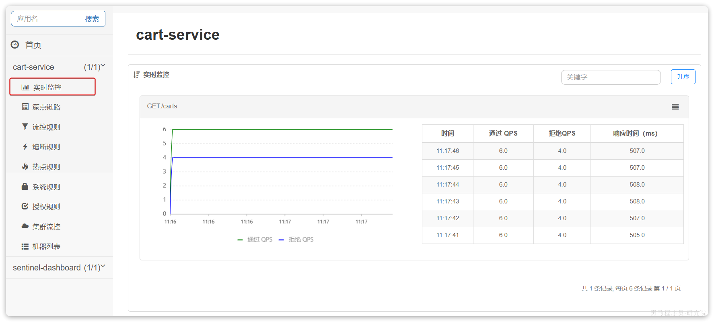

可以看出`GET:/carts`这个接口的通过QPS稳定在6附近，而拒绝的QPS在4附近，符合我们的预期。

## 1.4.线程隔离

限流可以降低服务器压力，尽量减少因并发流量引起的服务故障的概率，但并不能完全避免服务故障。一旦某个服务出现故障，我们必须隔离对这个服务的调用，避免发生雪崩。

比如，查询购物车的时候需要查询商品，为了避免因商品服务出现故障导致购物车服务级联失败，我们可以把购物车业务中查询商品的部分隔离起来，限制可用的线程资源：


这样，即便商品服务出现故障，最多导致查询购物车业务故障，并且可用的线程资源也被限定在一定范围，不会导致整个购物车服务崩溃。

所以，我们要对查询商品的FeignClient接口做线程隔离。

### 1.4.1.OpenFeign整合Sentinel

修改cart-service模块的application.yml文件，开启Feign的sentinel功能：

```YAML
feign:
  sentinel:
    enabled: true # 开启feign对sentinel的支持
```

然后重启cart-service服务，可以看到查询商品的FeignClient自动变成了一个簇点资源：


### 1.4.2.配置线程隔离

接下来，点击查询商品的FeignClient对应的簇点资源后面的流控按钮：


在弹出的表单中填写下面内容：


注意，这里勾选的是并发线程数限制，也就是说这个查询功能最多使用5个线程，而不是5QPS。如果查询商品的接口每秒处理2个请求，则5个线程的实际QPS在10左右，而超出的请求自然会被拒绝。


我们利用Jemeter测试，每秒发送100个请求：


最终测试结果如下：


进入查询购物车的请求每秒大概在100，而在查询商品时却只剩下每秒10左右，符合我们的预期。

此时如果我们通过页面访问购物车的其它接口，例如添加购物车、修改购物车商品数量，发现不受影响：


响应时间非常短，这就证明线程隔离起到了作用，尽管查询购物车这个接口并发很高，但是它能使用的线程资源被限制了，因此不会影响到其它接口。

## 1.5.服务熔断

在上节课，我们利用线程隔离对查询购物车业务进行隔离，保护了购物车服务的其它接口。由于查询商品的功能耗时较高（我们模拟了500毫秒延时），再加上线程隔离限定了线程数为5，导致接口吞吐能力有限，最终QPS只有10左右。这就导致了几个问题：

第一，超出的QPS上限的请求就只能抛出异常，从而导致购物车的查询失败。但从业务角度来说，即便没有查询到最新的商品信息，购物车也应该展示给用户，用户体验更好。也就是给查询失败设置一个**降级处理**逻辑。

第二，由于查询商品的延迟较高（模拟的500ms），从而导致查询购物车的响应时间也变的很长。这样不仅拖慢了购物车服务，消耗了购物车服务的更多资源，而且用户体验也很差。对于商品服务这种不太健康的接口，我们应该直接停止调用，直接走降级逻辑，避免影响到当前服务。也就是将商品查询接口**熔断**。

### 1.5.1.编写降级逻辑

触发限流或熔断后的请求不一定要直接报错，也可以返回一些默认数据或者友好提示，用户体验会更好。

给FeignClient编写失败后的降级逻辑有两种方式：

- 方式一：FallbackClass，无法对远程调用的异常做处理
- 方式二：FallbackFactory，可以对远程调用的异常做处理，我们一般选择这种方式。

这里我们演示方式二的失败降级处理。

**步骤一**：在hm-api模块中给`ItemClient`定义降级处理类，实现`FallbackFactory`：

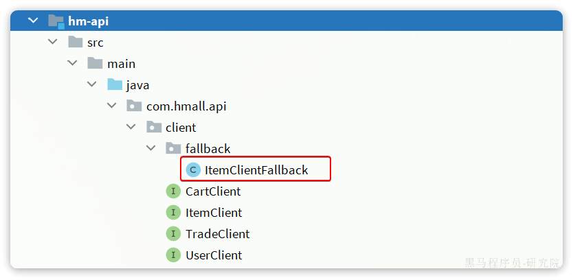

代码如下：

```Java
package com.hmall.api.client.fallback;

import com.hmall.api.client.ItemClient;
import com.hmall.api.dto.ItemDTO;
import com.hmall.api.dto.OrderDetailDTO;
import com.hmall.common.exception.BizIllegalException;
import com.hmall.common.utils.CollUtils;
import lombok.extern.slf4j.Slf4j;
import org.springframework.cloud.openfeign.FallbackFactory;

import java.util.Collection;
import java.util.List;

@Slf4j
public class ItemClientFallback implements FallbackFactory<ItemClient> {
    @Override
    public ItemClient create(Throwable cause) {
        return new ItemClient() {
            @Override
            public List<ItemDTO> queryItemByIds(Collection<Long> ids) {
                log.error("远程调用ItemClient#queryItemByIds方法出现异常，参数：{}", ids, cause);
                // 查询购物车允许失败，查询失败，返回空集合
                return CollUtils.emptyList();
            }

            @Override
            public void deductStock(List<OrderDetailDTO> items) {
                // 库存扣减业务需要触发事务回滚，查询失败，抛出异常
                throw new BizIllegalException(cause);
            }
        };
    }
}
```

**步骤二**：在`hm-api`模块中的`com.hmall.api.config.DefaultFeignConfig`类中将`ItemClientFallback`注册为一个`Bean`：


**步骤三**：在`hm-api`模块中的`ItemClient`接口中使用`ItemClientFallbackFactory`：


重启后，再次测试，发现被限流的请求不再报错，走了降级逻辑：


但是未被限流的请求延时依然很高：

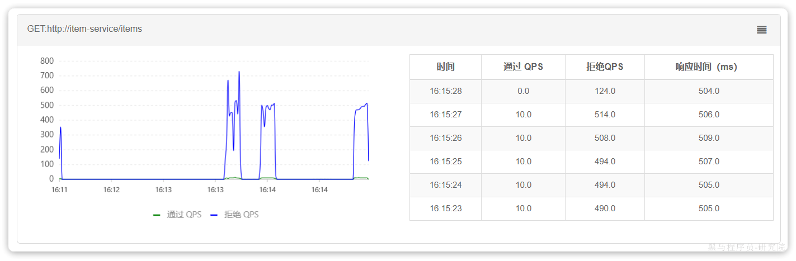

导致最终的平局响应时间较长。

### 1.5.2.服务熔断

查询商品的RT较高（模拟的500ms），从而导致查询购物车的RT也变的很长。这样不仅拖慢了购物车服务，消耗了购物车服务的更多资源，而且用户体验也很差。

对于商品服务这种不太健康的接口，我们应该停止调用，直接走降级逻辑，避免影响到当前服务。也就是将商品查询接口**熔断**。当商品服务接口恢复正常后，再允许调用。这其实就是**断路器**的工作模式了。

Sentinel中的断路器不仅可以统计某个接口的**慢请求比例**，还可以统计**异常请求比例**。当这些比例超出阈值时，就会**熔断**该接口，即拦截访问该接口的一切请求，降级处理；当该接口恢复正常时，再放行对于该接口的请求。

断路器的工作状态切换有一个状态机来控制：


状态机包括三个状态：

- **closed**：关闭状态，断路器放行所有请求，并开始统计异常比例、慢请求比例。超过阈值则切换到open状态
- **open**：打开状态，服务调用被**熔断**，访问被熔断服务的请求会被拒绝，快速失败，直接走降级逻辑。Open状态持续一段时间后会进入half-open状态
- **half-open**：半开状态，放行一次请求，根据执行结果来判断接下来的操作。 
  - 请求成功：则切换到closed状态
  - 请求失败：则切换到open状态

我们可以在控制台通过点击簇点后的**`熔断`**按钮来配置熔断策略：


在弹出的表格中这样填写：

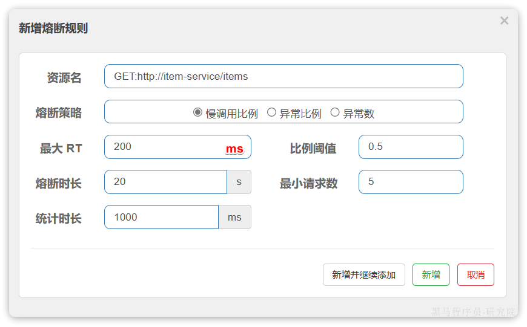

这种是按照慢调用比例来做熔断，上述配置的含义是：

- RT超过200毫秒的请求调用就是慢调用
- 统计最近1000ms内的最少5次请求，如果慢调用比例不低于0.5，则触发熔断
- 熔断持续时长20s

配置完成后，再次利用Jemeter测试，可以发现：


在一开始一段时间是允许访问的，后来触发熔断后，查询商品服务的接口通过QPS直接为0，所有请求都被熔断了。而查询购物车的本身并没有受到影响。

此时整个购物车查询服务的平均RT影响不大：


## 1.6 Sentinel持久化配置

由于sentinel的限流和熔断配置，默认没有持久化功能，所以每次重启sentinel之后，所有配置都会失效，我们需要把熔断策略配置到nacos中，然后服务在启动时拉去到本地，以下是sentinel持久化配置的步骤。

### 1.6.1 nacos配置中心


在nacos配置中心，新建配置：degrade.json，文件内容作用跟1.5.2 的熔断配置一样

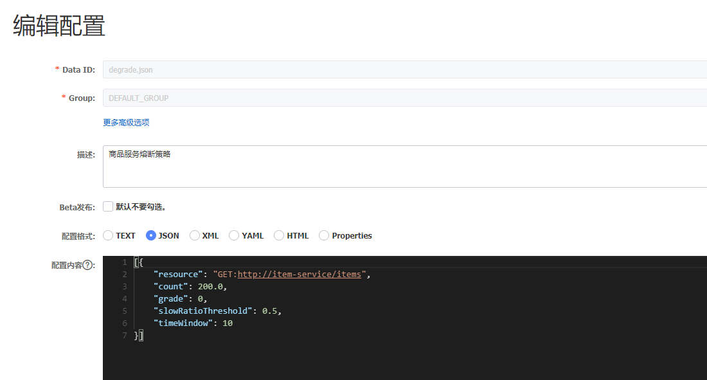


```json
[{
	"resource": "GET:http://item-service/items",
	"count": 200.0,
	"grade": 0,
	"slowRatioThreshold": 0.5,
	"timeWindow": 10
}]
```

### 1.6.2 sentinel datasource支持

cart-service 引入依赖：

```xml
<dependency>
    <groupId>com.alibaba.csp</groupId>
    <artifactId>sentinel-datasource-nacos</artifactId>
    <version>1.8.6</version>
</dependency>
```

修改cart-service application.yaml配置：

```yaml
spring:
  application:
    name: cart-service
  profiles:
    active: dev
  cloud:
    nacos:
      server-addr: 43.133.192.187:8848 # nacos地址
      config:
        file-extension: yaml
        shared-configs: # 共享配置
          - data-id: shared-jdbc.yaml
          - data-id: shared-log.yaml
          - data-id: shared-swagger.yaml
    sentinel:
      transport:
        dashboard: localhost:8090
      http-method-specify: true  # 开启请求方式前缀
      # 以下为新增内容
      datasource:
        ds2:  # 可随意取名，这里从nacos配置中心获取服务降级的配置
          nacos:
            server-addr: 43.133.192.187:8848
            data-id: degrade.json
            group-id: DEFAULT_GROUP
            rule-type: degrade
```

# 2.分布式事务

首先我们看看项目中的下单业务整体流程：

暂时无法在飞书文档外展示此内容

由于订单、购物车、商品分别在三个不同的微服务，而每个微服务都有自己独立的数据库，因此下单过程中就会跨多个数据库完成业务。而每个微服务都会执行自己的本地事务：

- 交易服务：下单事务
- 购物车服务：清理购物车事务
- 库存服务：扣减库存事务

整个业务中，各个本地事务是有关联的。因此每个微服务的本地事务，也可以称为**分支事务**。多个有关联的分支事务一起就组成了**全局事务**。我们必须保证整个全局事务同时成功或失败。

我们知道每一个分支事务就是传统的**单体事务**，都可以满足ACID特性，但全局事务跨越多个服务、多个数据库，是否还能满足呢？

我们来做一个测试，先进入购物车页面：


目前有4个购物车，然结算下单，进入订单结算页面：


然后将购物车中某个商品的库存修改为`0`：

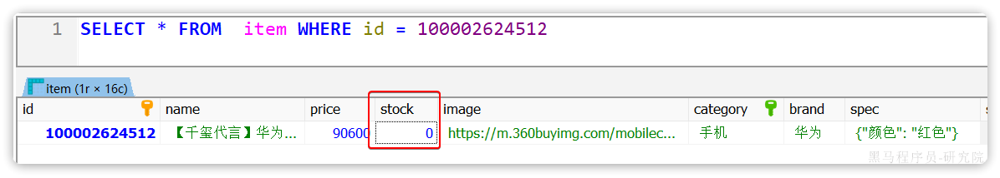

然后，提交订单，最终因库存不足导致下单失败：


然后我们去查看购物车列表，发现购物车数据依然被清空了，并未回滚：

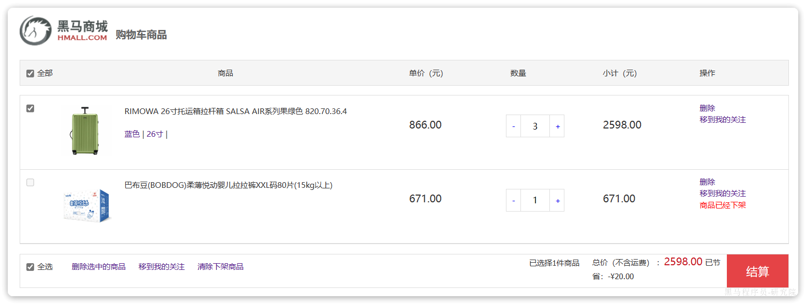

事务并未遵循ACID的原则，归其原因就是参与事务的多个子业务在不同的微服务，跨越了不同的数据库。虽然每个单独的业务都能在本地遵循ACID，但是它们互相之间没有感知，不知道有人失败了，无法保证最终结果的统一，也就无法遵循ACID的事务特性了。

这就是分布式事务问题，出现以下情况之一就可能产生分布式事务问题：

- 业务跨多个服务实现
- 业务跨多个数据源实现

接下来这一章我们就一起来研究下如何解决分布式事务问题。

## 2.1.认识Seata

解决分布式事务的方案有很多，但实现起来都比较复杂，因此我们一般会使用开源的框架来解决分布式事务问题。在众多的开源分布式事务框架中，功能最完善、使用最多的就是阿里巴巴在2019年开源的Seata了。

https://seata.io/zh-cn/docs/overview/what-is-seata.html

其实分布式事务产生的一个重要原因，就是参与事务的多个分支事务互相无感知，不知道彼此的执行状态。因此解决分布式事务的思想非常简单：

就是找一个统一的**事务协调者**，与多个分支事务通信，检测每个分支事务的执行状态，保证全局事务下的每一个分支事务同时成功或失败即可。大多数的分布式事务框架都是基于这个理论来实现的。

Seata也不例外，在Seata的事务管理中有三个重要的角色：

-  **TC** **(Transaction Coordinator) - 事务协调者：**维护全局和分支事务的状态，协调全局事务提交或回滚。 
-  **TM (Transaction Manager) -** **事务管理器：**定义全局事务的范围、开始全局事务、提交或回滚全局事务。 
-  **RM (Resource Manager) -** **资源管理器：**管理分支事务，与TC交谈以注册分支事务和报告分支事务的状态，并驱动分支事务提交或回滚。 

Seata的工作架构如图所示：


其中，**TM**和**RM**可以理解为Seata的客户端部分，引入到参与事务的微服务依赖中即可。将来**TM**和**RM**就会协助微服务，实现本地分支事务与**TC**之间交互，实现事务的提交或回滚。

而**TC**服务则是事务协调中心，是一个独立的微服务，需要单独部署。

## 2.2.部署TC服务

### 2.2.1.准备数据库表

Seata支持多种存储模式，但考虑到持久化的需要，我们一般选择基于数据库存储。执行课前资料提供的`《seata-tc.sql》`，导入数据库表：


### 2.2.2.准备配置文件

课前资料准备了一个seata目录，其中包含了seata运行时所需要的配置文件：


其中包含中文注释，大家可以自行阅读。

我们将整个seata文件夹拷贝到虚拟机的`/root`目录：


修改seata目录中，application.yaml文件内容：

```yaml
server:
  port: 7099

spring:
  application:
    name: seata-server

logging:
  config: classpath:logback-spring.xml
  file:
    path: ${user.home}/logs/seata
  # extend:
  #   logstash-appender:
  #     destination: 127.0.0.1:4560
  #   kafka-appender:
  #     bootstrap-servers: 127.0.0.1:9092
  #     topic: logback_to_logstash

console:
  user:
    username: admin
    password: admin

seata:
  config:
    # support: nacos, consul, apollo, zk, etcd3
    type: nacos
    nacos:
      server-addr: nacos:8848
      group : "DEFAULT_GROUP"
      namespace: ""
      dataId: "seataServer.properties"
      username: "nacos"
      password: "nacos"
  registry:
    # support: nacos, eureka, redis, zk, consul, etcd3, sofa
    type: nacos
    nacos:
      application: seata-server
      server-addr: nacos:8848
      group : "DEFAULT_GROUP"
      namespace: "" # 这里只把namespace设置为空
      username: "nacos"
      password: "nacos"
#  server:
#    service-port: 8091 #If not configured, the default is '${server.port} + 1000'
  security:
    secretKey: SeataSecretKey0c382ef121d778043159209298fd40bf3850a017
    tokenValidityInMilliseconds: 1800000
    ignore:
      urls: /,/**/*.css,/**/*.js,/**/*.html,/**/*.map,/**/*.svg,/**/*.png,/**/*.ico,/console-fe/public/**,/api/v1/auth/login
  server:
    # service-port: 8091 #If not configured, the default is '${server.port} + 1000'
    max-commit-retry-timeout: -1
    max-rollback-retry-timeout: -1
    rollback-retry-timeout-unlock-enable: false
    enable-check-auth: true
    enable-parallel-request-handle: true
    retry-dead-threshold: 130000
    xaer-nota-retry-timeout: 60000
    enableParallelRequestHandle: true
    recovery:
      committing-retry-period: 1000
      async-committing-retry-period: 1000
      rollbacking-retry-period: 1000
      timeout-retry-period: 1000
    undo:
      log-save-days: 7
      log-delete-period: 86400000
    session:
      branch-async-queue-size: 5000 #branch async remove queue size
      enable-branch-async-remove: false #enable to asynchronous remove branchSession
  store:
    # support: file 、 db 、 redis
    mode: db
    session:
      mode: db
    lock:
      mode: db
    db:
      datasource: druid
      db-type: mysql
      driver-class-name: com.mysql.jdbc.Driver
      url: jdbc:mysql://mysql:3306/seata?rewriteBatchedStatements=true
      user: root
      password: Root1234$
      min-conn: 10
      max-conn: 100
      global-table: global_table
      branch-table: branch_table
      lock-table: lock_table
      distributed-lock-table: distributed_lock
      query-limit: 1000
      max-wait: 5000
    redis:
      mode: single
      database: 0
      min-conn: 10
      max-conn: 100
      password:
      max-total: 100
      query-limit: 1000
      single:
        host: 192.168.150.101
        port: 6379
  metrics:
    enabled: false
    registry-type: compact
    exporter-list: prometheus
    exporter-prometheus-port: 9898
  transport:
    rpc-tc-request-timeout: 15000
    enable-tc-server-batch-send-response: false
    shutdown:
      wait: 3
    thread-factory:
      boss-thread-prefix: NettyBoss
      worker-thread-prefix: NettyServerNIOWorker
      boss-thread-size: 1
```


### 2.2.3.Docker部署

在虚拟机的`/root`目录执行下面的命令：

```Shell
docker run --name seata \
-p 8099:8099 \
-p 7099:7099 \
-e SEATA_IP=192.168.150.101 \
-v ./seata:/seata-server/resources \
--privileged=true \
--network hmall \
-d \
seataio/seata-server:1.5.2
```

注意：如果启动报mysql连接不上，记得让nacos、seata、mysql都加入到hmall网络中

```SHELL
docker network connect hmall nacos
```

如果镜像下载困难，也可以把课前资料提供的镜像上传到虚拟机并加载：


## 2.3.微服务集成Seata

参与分布式事务的每一个微服务都需要集成Seata，我们以`trade-service`为例。

### 2.3.1.引入依赖

为了方便各个微服务集成seata，我们需要把seata配置共享到nacos，因此`trade-service`模块不仅仅要引入seata依赖，还要引入nacos依赖:

```XML
<!--统一配置管理-->
  <dependency>
      <groupId>com.alibaba.cloud</groupId>
      <artifactId>spring-cloud-starter-alibaba-nacos-config</artifactId>
  </dependency>
  <!--读取bootstrap文件-->
  <dependency>
      <groupId>org.springframework.cloud</groupId>
      <artifactId>spring-cloud-starter-bootstrap</artifactId>
  </dependency>
  <!--seata-->
  <dependency>
      <groupId>com.alibaba.cloud</groupId>
      <artifactId>spring-cloud-starter-alibaba-seata</artifactId>
  </dependency>
  <!--sentinel-->
  <dependency>
      <groupId>com.alibaba.cloud</groupId>
      <artifactId>spring-cloud-starter-alibaba-sentinel</artifactId>
  </dependency>
```

### 2.3.2.改造配置

首先在nacos上添加一个共享的seata配置，命名为`shared-seata.yaml`：


内容如下：

```YAML
seata:
  registry: # TC服务注册中心的配置，微服务根据这些信息去注册中心获取tc服务地址
    type: nacos # 注册中心类型 nacos
    nacos:
      server-addr: 43.133.192.187:8848 # nacos地址
      namespace: "" # namespace，默认为空
      group: DEFAULT_GROUP # 分组，默认是DEFAULT_GROUP
      application: seata-server # seata服务名称
      username: nacos
      password: nacos
  tx-service-group: hmall # 事务组名称
  service:
    vgroup-mapping: # 事务组与tc集群的映射关系
      hmall: "default"
  data-source-proxy-mode: XA # 开启XA模式，默认AT模式
```

然后，改造`trade-service`模块，添加`bootstrap.yaml`：

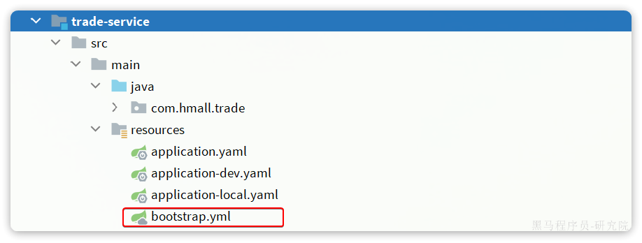

内容如下:

```YAML
spring:
  application:
    name: trade-service # 服务名称
  profiles:
    active: dev
  cloud:
    nacos:
      server-addr: 192.168.150.101 # nacos地址
      config:
        file-extension: yaml # 文件后缀名
        shared-configs: # 共享配置
          - dataId: shared-jdbc.yaml # 共享mybatis配置
          - dataId: shared-log.yaml # 共享日志配置
          - dataId: shared-swagger.yaml # 共享日志配置
          - dataId: shared-seata.yaml # 共享seata配置
```

可以看到这里加载了共享的seata配置。

然后改造application.yaml文件，内容如下：

```YAML
server:
  port: 8085
feign:
  okhttp:
    enabled: true # 开启OKHttp连接池支持
  sentinel:
    enabled: true # 开启Feign对Sentinel的整合
hm:
  swagger:
    title: 交易服务接口文档
    package: com.hmall.trade.controller
  db:
    database: hm-trade
```

参考上述办法**分别改造`hm-cart`和`hm-item`两个微服务模块**。

### 2.3.3.添加数据库表

seata的客户端在解决分布式事务的时候需要记录一些中间数据，保存在数据库中。因此我们要先准备一个这样的表。


seata-tc.sql 是创建基础表，XA和AT模式都需要用到，结果：


seata-at.sql 创建的表用于**AT模式**，分别文件导入hm-trade、hm-cart、hm-item三个数据库中，结果：


OK，至此为止，微服务整合的工作就完成了。可以参考上述方式对`hm-item`和`hm-cart`模块完成整合改造。

### 2.3.4.测试

接下来就是测试的分布式事务的时候了。

我们找到`trade-service`模块下的`com.hmall.trade.service.impl.OrderServiceImpl`类中的`createOrder`方法，也就是下单业务方法。

将其上的`@Transactional`注解改为Seata提供的`@GlobalTransactional`：

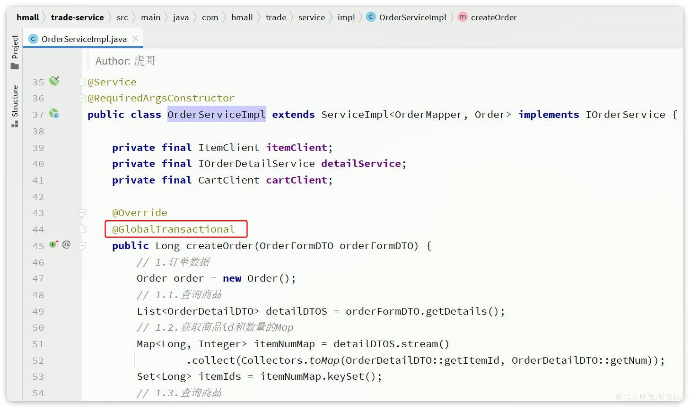

`@GlobalTransactional`注解就是在标记事务的起点，将来TM就会基于这个方法判断全局事务范围，初始化全局事务。

我们重启`trade-service`、`item-service`、`cart-service`三个服务。再次测试，发现分布式事务的问题解决了！

那么，Seata是如何解决分布式事务的呢？

## 2.4.XA模式

Seata支持四种不同的分布式事务解决方案：

- **XA**
- **TCC**
- **AT**
- **SAGA**

这里我们以`XA`模式和`AT`模式来给大家讲解其实现原理。

`XA` 规范 是` X/Open` 组织定义的分布式事务处理（DTP，Distributed Transaction Processing）标准，XA 规范 描述了全局的`TM`与局部的`RM`之间的接口，几乎所有主流的数据库都对 XA 规范 提供了支持。

### 2.4.1.两阶段提交

A是规范，目前主流数据库都实现了这种规范，实现的原理都是基于两阶段提交。

正常情况：


异常情况：


一阶段：

- 事务协调者通知每个事务参与者执行本地事务
- 本地事务执行完成后报告事务执行状态给事务协调者，此时事务不提交，继续持有数据库锁

二阶段：

- 事务协调者基于一阶段的报告来判断下一步操作
- 如果一阶段都成功，则通知所有事务参与者，提交事务
- 如果一阶段任意一个参与者失败，则通知所有事务参与者回滚事务

### 2.4.2.Seata的XA模型

Seata对原始的XA模式做了简单的封装和改造，以适应自己的事务模型，基本架构如图：


`RM`一阶段的工作：

1. 注册分支事务到`TC`
2. 执行分支业务sql但不提交
3. 报告执行状态到`TC`

`TC`二阶段的工作：

1.  `TC`检测各分支事务执行状态
   1. 如果都成功，通知所有RM提交事务
   2. 如果有失败，通知所有RM回滚事务 

`RM`二阶段的工作：

- 接收`TC`指令，提交或回滚事务

### 2.4.3.优缺点

`XA`模式的优点是什么？

- 事务的强一致性，满足ACID原则
- 常用数据库都支持，实现简单，并且没有代码侵入

`XA`模式的缺点是什么？

- 因为一阶段需要锁定数据库资源，等待二阶段结束才释放，性能较差
- 依赖关系型数据库实现事务

## 2.5.AT模式

`AT`模式同样是分阶段提交的事务模型，不过缺弥补了`XA`模型中资源锁定周期过长的缺陷。

### 2.5.1.Seata的AT模型

基本流程图：

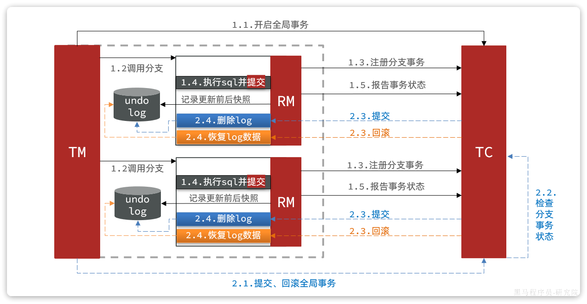

阶段一`RM`的工作：

- 注册分支事务
- 记录undo-log（数据快照）
- 执行业务sql并提交
- 报告事务状态

阶段二提交时`RM`的工作：

- 删除undo-log即可

阶段二回滚时`RM`的工作：

- 根据undo-log恢复数据到更新前

### 2.5.2.流程梳理

我们用一个真实的业务来梳理下AT模式的原理。

比如，现在有一个数据库表，记录用户余额：

| **id** | **money** |
| :----- | :-------- |
| 1      | 100       |

其中一个分支业务要执行的SQL为：

```SQL
 update tb_account set money = money - 10 where id = 1
```

AT模式下，当前分支事务执行流程如下：

**一阶段**：

1. `TM`发起并注册全局事务到`TC`
2. `TM`调用分支事务
3. 分支事务准备执行业务SQL
4. `RM`拦截业务SQL，根据where条件查询原始数据，形成快照。

```JSON
{
  "id": 1, "money": 100
}
```

1. `RM`执行业务SQL，提交本地事务，释放数据库锁。此时 money = 90
2. `RM`报告本地事务状态给`TC`

**二阶段**：

1. `TM`通知`TC`事务结束
2. `TC`检查分支事务状态
   1. 如果都成功，则立即删除快照
   2. 如果有分支事务失败，需要回滚。读取快照数据（{"id": 1, "money": 100}），将快照恢复到数据库。此时数据库再次恢复为100

流程图：

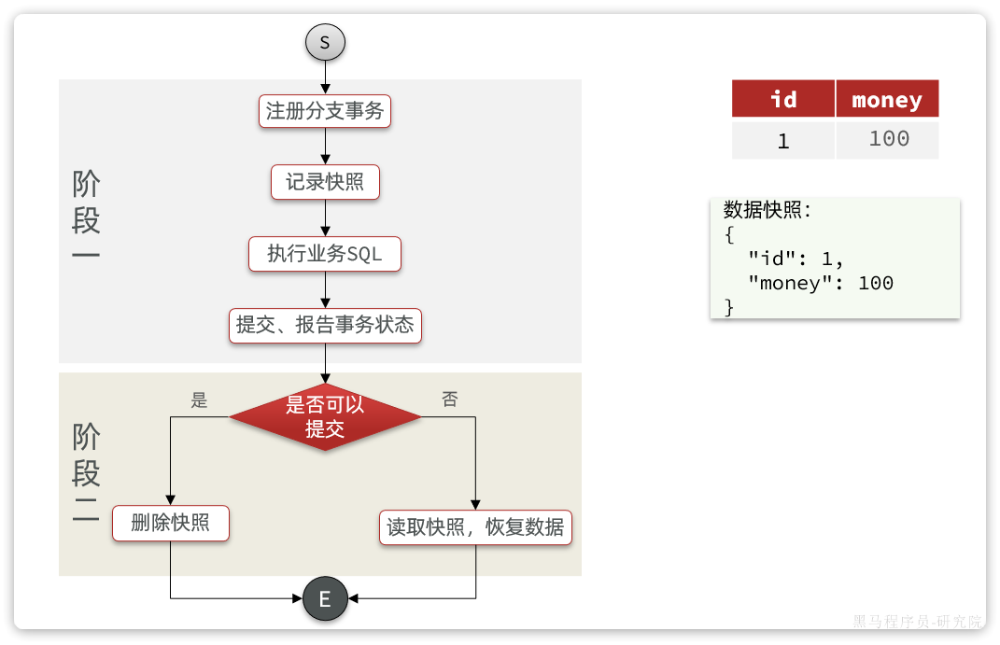

### 2.5.3.AT与XA的区别

简述`AT`模式与`XA`模式最大的区别是什么？

- `XA`模式一阶段不提交事务，锁定资源；`AT`模式一阶段直接提交，不锁定资源。
- `XA`模式依赖数据库机制实现回滚；`AT`模式利用数据快照实现数据回滚。
- `XA`模式强一致；`AT`模式最终一致

可见，AT模式使用起来更加简单，无业务侵入，性能更好。因此企业90%的分布式事务都可以用AT模式来解决。
