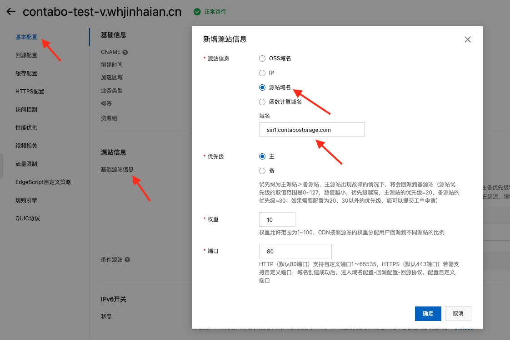
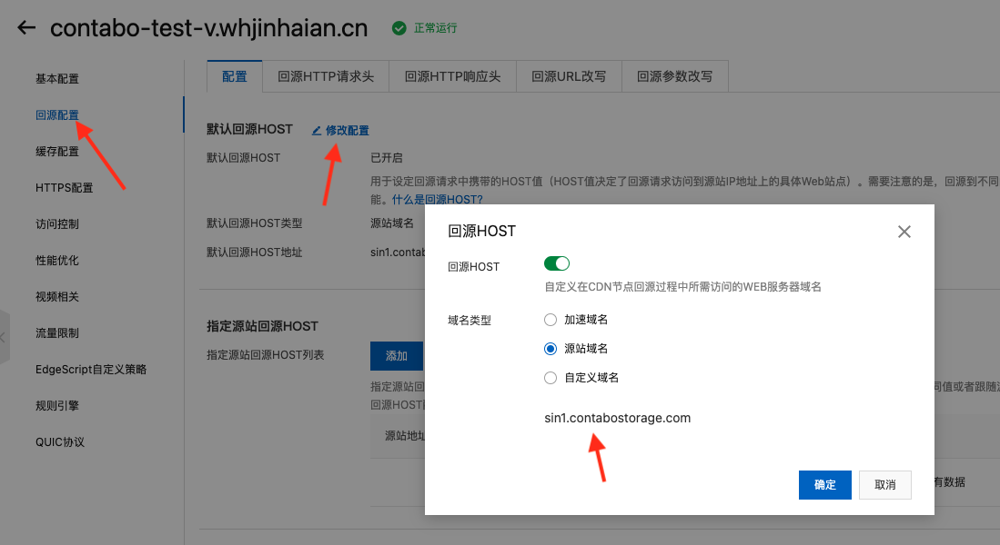
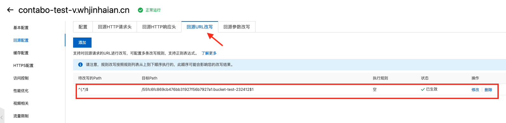
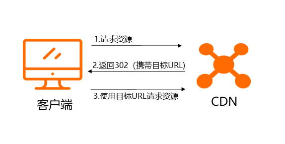
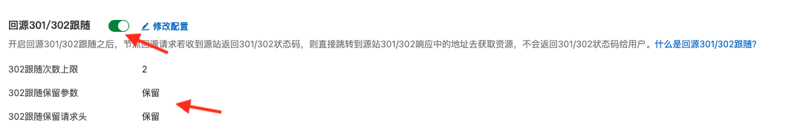

# 阿里云CDN+contabo云存储

## 最终效果

源文件访问路径：https://sin1.contabostorage.com/b20aba5ba40b45ff8fd6d80453b06c73:bucket-cg-0530/tzcg/video/000812ad-374c-4007-9a71-8e025b4a0377/playlist.m3u8

CDN加速之后访问路径：https://v.sz28.pw/tzcg/video/000812ad-374c-4007-9a71-8e025b4a0377/playlist.m3u8

## 新增源站

## 回源设置

回源指您通过客户端请求访问资源时，如果CDN节点上未缓存该资源，或者您部署预热任务给CDN节点时，CDN节点会回源站获取资源。

## 回源URL改写

如果不对URL改写，我们访问文件的路径就必须带上用户ID和桶名称，会是这样的：`https://v.sz28.pw/b20aba5ba40b45ff8fd6d80453b06c73:bucket-cg-0530/tzcg/video/000812ad-374c-4007-9a71-8e025b4a0377/playlist.m3u8` ，而我们希望我们的访问路径应该尽量简短，`https://v.sz28.pw/tzcg/video/000812ad-374c-4007-9a71-8e025b4a0377/playlist.m3u8` ，所以我们需要对回源URL改写，自动拼接上`/20aba5ba40b45ff8fd6d80453b06c73:bucket-cg-0530`

## 开启回源301/302跟随

由于我们必须要使用`回源URL改写`，而它会导致自动开启302重定向，也就是当我们访问`https://v.sz28.pw/tzcg/video/000812ad-374c-4007-9a71-8e025b4a0377/playlist.m3u8`时，CDN会返回302状态码给客户端，然后客户端重定向到`https://v.sz28.pw/b20aba5ba40b45ff8fd6d80453b06c73:bucket-cg-0530/tzcg/video/000812ad-374c-4007-9a71-8e025b4a0377/playlist.m3u8`，流程如下：

开启回源301/302跟随之后，节点回源请求若收到源站返回301/302状态码，则直接跳转到源站301/302响应中的地址去获取资源，不会返回301/302状态码给用户。

