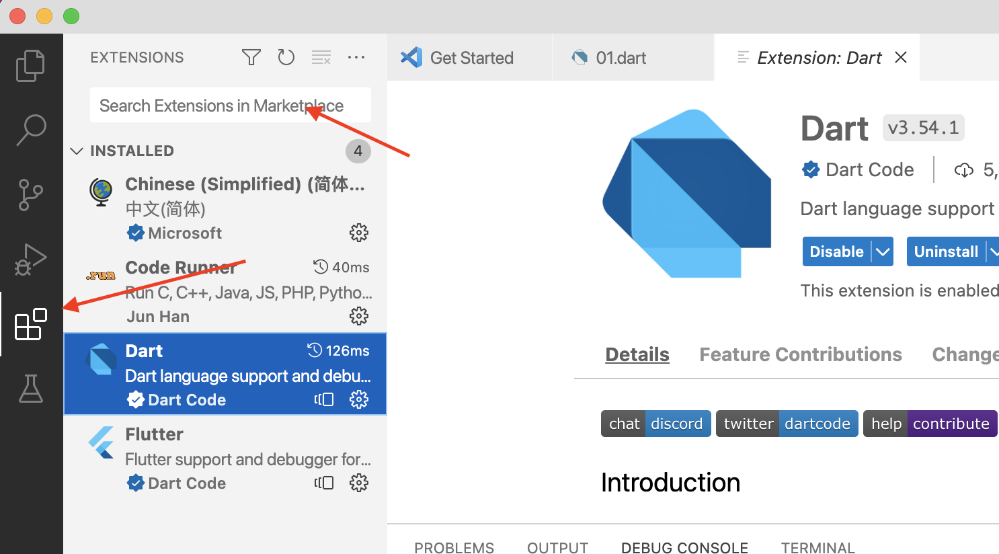
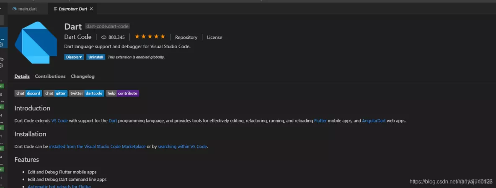

# Dart语言简介

Dart 是一种开源的通用编程语言，它最初由Google开发，后来被ECMA批准为标准。 Dart 适用于服务器和浏览器， Dart SDK由谷歌推出，附带其编译器 - Dart VM， SDK还包括一个实用程序 - dart2js，可以将Dart脚本转换为JavaScript。

目前学习Dart语言，大部分都是为了学习Flutter，Flutter是谷歌的高性能、跨端UI框架，可以通过一套代码，支持iOS、Android、Windows/MAC/Linux等多个平台，且能达到原生性能。

## 一个简单的例子

我们先通过一个简单的例子，看看Dart语言程序长什么样子？

```dart
// 定义函数
printInteger(int aNumber) {
  print('The number is $aNumber.'); // 打印字符串
}

// 这里是Dart程序的入口，类似java/c/c++的main函数
main() {
  var number = 42; // 定义和初始化变量
  printInteger(number); // 调用上面定义的函数
}
```

执行程序输出：

```
The number is 42
```

通过这个例子，大家可能发现Dart语法结构其实跟 Javascript 和 Java 很相似，大家只要学习过任何一种编程语言，学习 Dart 都非常简单。

## Dart 语言特性

- 一切皆对象，在 Dart 语言中所有变量类型都是对象，null 也是对象，函数也是对象，所有对象都继承自 Object。
- 尽管 Dart 是强类型语言，但是变量类型声明是可选的，Dart 可以推断出变量的类型。例如上面的例子 number 就没有指定变量类型。
- Dart 支持泛型类型，类似 Java 的泛型，例如：List<int> 就是一个 int 数组。
- 函数支持嵌套
- 不支持public、protected和 private 关键字，在 Dart 语言中，通过下划线(_)开头命名的话，就表示是私有的，反之就是公开的。


## 搭建 Dart 语言开发环境

### Windows环境

在 Windows 环境推荐直接下载 Windows 安装包，Dart SDK Windows 版本下载地址： https://github.com/GeKorm/dart-windows/releases，从下载地址里面选择最新版本的 Dart_x64.stable.setup.exe 下载即可。

下载后双击安装程序，根据提示一步步安装即可，安装程序默认是会把 Dart 添加进系统变量 path 中，安装完成后，可以打开 cmd 命令行，输入 dart --version，有版本信息打印即表示安装成功。

### Mac环境

在 mac 环境下直接使用 brew 命令安装 Dart

```shell
brew tap dart-lang/dart
brew install dart
```

### VSCode

下载地址：https://code.visualstudio.com/

- 安装 VSCode 插件



- 安装 Dart 插件，Dart 插件可以使 VSCode 支持 Dart 编程，最明显的功能便是支持 Dart 语法高亮

  

- 安装Code Runner插件，Code Runner 插件则可以使 VSCode 通过快捷键方式执行脚本，最明显的便是可以在脚本编辑窗口点击运行按钮来直接执行脚本。

  

# 变量

## 注释

- 单行注释

```
// 单行注释
```

- 多行注释

```
/*
  多行注释
 */
```

## 变量定义

通过 var 定义并初始化变量

```dart
var name = 'Bob';
```

Dart 语言是**强类型语言**，但是这里我们没有指定变量类型，Dart 是通过首次初始化值推断变量的类型，这里变量name就是 String 类型。虽然我们定义变量的时候没有指定数据类型，但是如果**一个变量已经初始化为一种数据类型，就不能将其他类型的数据赋值给它**。

```dart
name = 100; // 这里错误的，因为name的类型为string, 不能将int类型数据赋值给name
```

我们也可以在定义变量的同时指定数据类型

```dart
String name = 'Bob'; // 直接定义string变量，并初始化
```

## 变量默认值

未初始化的变量，值都是null

```dart
int lineCount;
```

这里尽管lineCount是int类型，但是Dart语言中所有变量都是对象类型，所以**初始值依然是null**，而不是0，这个大家要注意下，跟其他语言有区别。

## final 和 const

如果不希望变量被修改，可以使用 final 和 const 定义变量。

```dart
final name = 'Bob'; // 未指定数据类型方式
final String nickname = 'Bobby';  // 指定数据类型方式
```

这两个变量值都无法修改。

使用 const 定义常量

```dart
const bar = 1000000;
```

final 和 const 的区别就是在编译的时候 **const 变量的值就是已经确定的**，final不一定，可能需要运行的时候才能确定值。

例子:

```dart
final x = new DateTime.now(); // 将x变量的值，初始化为当前时间，x的值只有在运行的时候才能确定
```

# 数据类型 

Dart 语言支持以下类型

- 数字
- 字符串
- 布尔
- 列表(类似于数组)
- 集合
- 映射
- 符文(用于表示字符串中的Unicode字符)
- 符号（Symbol）

## 数字类型

Dart 中的数字类型有两种类型

- 整数 - 整数值表示非小数值，即没有小数点的数值。例如，10是整数。使用int关键字表示整数文字。
- 双精度数  -  Dart 还支持小数数值，即带小数点的值。Dart中的Double数据类型表示64位(双精度)浮点数。例如，10.10。关键字double用于表示浮点文字。

以下是定义整数文字的一些示例：

```dart
var x = 123;
var hex = 0xDEADBEEF;
```

如果数字包含小数，则为双精度数。以下是定义双精度数文字的一些示例：

```dart
var y = 1.199;
var exponents = 1.42e5;
```

从Dart 2.1开始，必要时整数文字会自动转换为双精度数：

```dart
double z = 10; // 相当于 double z = 10.0.
```

以下是将字符串转换为数字的方法，反之亦然：

```dart
// String 转为 int
var one = int.parse('1');
print(one == 1);

// String 转为 double
var onePointOne = double.parse('1.1');
print(onePointOne == 1.1);

// int 转为 String
String oneAsString = 1.toString();
print(oneAsString == '1');

// double 转为 String
String piAsString = 3.14159.toStringAsFixed(2);
print(piAsString == '3.14');
```

## String

字符串代表一系列字符。例如，如果要存储一些数据，如名称、地址等，则应使用字符串数据类型。Dart字符串是一系列UTF-16代码单元。符文用于表示UTF-32代码单元序列。

关键字String用于表示字符串文字，字符串值嵌入单引号或双引号中。因此可以使用单引号或双引号来创建字符串：
```dart
var s1 = 'Single quotes work well for string literals.';
var s2 = "Double quotes work just as well.";
```

可以使用${expression}将表达式的值放在字符串中。如果表达式是标识符，则可以跳过{}。

```dart
var s = 'string interpolation';
print('Dart has $s, which is very handy.');
```

可以使用相邻的字符串文字或`+`运算符来连接字符串：

```dart
var s2 = 'The + operator ' + 'works, as well.';
print(s2 == 'The + operator works, as well.');
```

使用带有单引号或双引号的三引号创建多行字符串：

```dart
var s1 = '''
You can create
multi-line strings like this one.
''';
print(s1);

var s2 = """This is also a
multi-line string.""";
print(s2);
```

## bool

要表示布尔值，可使用Dart中的 bool 类型。只有两个对象具有bool类型：boolean 文字：true和false，它们都是编译时常量。

```dart
// 检查空字符串。
var fullName = '';
print(fullName.isEmpty);

// 检查零值。
var hitPoints = 0;
print(hitPoints <= 0);

// 检查是否为null。
var unicorn;
print(unicorn == null);

// 检查NaN。
var iMeantToDoThis = 0 / 0;
print(iMeantToDoThis.isNaN);
```

## List

在Dart中，数组是List对象，因此大多数人将它称为列表。

```dart
var list = [1, 2, 3];
```

列表使用从0开始的索引，其中0是第一个元素的索引，list.length-1是最后一个元素的索引。可以获得列表的长度并像在JavaScript中一样引用列表元素：

```dart
var list = [1, 2, 3];
print(list.length == 3);
print(list[1] == 2);

list[1] = 1;
print(list[1] == 1);
```

要创建一个编译时常量的列表，请在列表文字之前添加 const：

```dart
var constantList = const [1, 2, 3];
// constantList[1] = 1; // Uncommenting this causes an error.
```

Dart 2.3 引入了扩展运算符(...)和空值感知扩展运算符(...?)，它提供了一种将多个元素插入集合的简洁方法。

例如，使用扩展运算符(...)将列表的所有元素插入另一个列表：

```dart
var list = [1, 2, 3];
var list2 = [0, ...list];
print(list2.length == 4);
```

如果扩展运算符右侧的表达式可能为null，则可以通过使用支持null的扩展运算符(...?)来避免异常：

```dart
var list;
var list2 = [0, ...?list];
assert(list2.length == 1);
```

Dart 2.3还引入了 if 和 collection 的集合，使用它在 if 条件和 for 循环构建集合。

下面是一个使用集合的示例，如果要创建一个包含三个或四个项目的列表：

```dart
var nav = [
  'Home',
  'Furniture',
  'Plants',
  if (promoActive) 'Outlet'
];
```

这是一个使用集合来操作列表项目，然后将它们添加到另一个列表之前的示例：

```dart
var listOfInts = [1, 2, 3];
var listOfStrings = [
  '#0',
  for (var i in listOfInts) '#$i'
];
print(listOfStrings);
```

## Set

Dart 中的 Set 是无序的唯一项的集合。

```dart
var halogens = {'yiibai.com', 'chlorine', 'bromine', 'iodine', 'astatine'};
```

要创建一个空集合，请**使用前面带有类型参数的{}**，或者将{}赋给类型为Set的变量：

```dart
var names = <String>{};
Set<String> names = {}; // This works, too.
//var names = {}; // Creates a map, not a set.
```

使用add()或addAll()方法将项添加到现有集合：

```dart
var elements = <String>{};
elements.add('fluorine');
elements.addAll(halogens);
```

使用.length来获取集合中的项目数量：

```dart
var elements = <String>{};
elements.add('fluorine');
elements.addAll(halogens);
assert(elements.length == 5);
```

要创建一个编译时常量的集合，请在set文字之前添加const：

```dart
final constantSet = const {
  'fluorine',
  'chlorine',
  'bromine',
  'iodine',
  'astatine',
};
// constantSet.add('helium'); // Uncommenting this causes an error.
```

## Map

通常映射是关联键和值的对象。键和值都可以是任何类型的对象。每个键只出现一次，但可以多次使用相同的值。

```dart
var gifts = {
  // Key:    Value
  'first': 'partridge',
  'second': 'turtledoves',
  'fifth': 'golden rings'
};

var nobleGases = {
  2: 'helium',
  10: 'neon',
  18: 'argon',
};
```

可以使用Map构造函数创建对象：

```dart
var gifts = Map();
gifts['first'] = 'partridge';
gifts['second'] = 'turtledoves';
gifts['fifth'] = 'golden rings';

var nobleGases = Map();
nobleGases[2] = 'helium';
nobleGases[10] = 'neon';
nobleGases[18] = 'argon';
```

像在JavaScript中一样，将新的键值对添加到现有映射：

```dart
var gifts = {'first': 'partridge'};
gifts['fourth'] = 'calling birds'; // Add a key-value pair
```

以与在JavaScript中相同的方式从映射中检索值：

```dart
var gifts = {'first': 'partridge'};
print(gifts['first'] == 'partridge');
```

如果查找不在映射中的键，则将返回null：

```dart
var gifts = {'first': 'partridge'};
print(gifts['fifth'] == null);
```

使用.length来获取映射中键值对的数量：

```dart
var gifts = {'first': 'partridge'};
gifts['fourth'] = 'calling birds';
print(gifts.length == 2);
```

要创建一个编译时常量的映射，请在map文字之前添加const关键字：

```dart
final constantMap = const {
  2: 'helium',
  10: 'neon',
  18: 'argon',
};

// constantMap[2] = 'Helium'; // Uncommenting this causes an error.
```


## Rune

在 Dart 中， Rune 用来表示字符串中的 UTF-32 编码字符。

Unicode 定义了一个全球的书写系统编码， 系统中使用的所有字母，数字和符号都对应唯一的数值编码。 由于 Dart 字符串是一系列 UTF-16 编码单元， 因此要在字符串中表示32位 Unicode 值需要特殊语法支持。

表示 Unicode 编码的常用方法是， \uXXXX, 这里 XXXX 是一个4位的16进制数。 例如，心形符号 (♥) 是 \u2665。 对于特殊的非 4 个数值的情况， 把编码值放到大括号中即可。 例如，emoji 的笑脸 (�) 是 \u{1f600}。

```dart
var clapping = '\u{1f44f}';
print(clapping);

Runes input = new Runes(
  '\u2665  \u{1f605}  \u{1f60e}  \u{1f47b}  \u{1f596}  \u{1f44d}');
print(new String.fromCharCodes(input));
```


# 条件语句

Dart 中的条件结构分类如下表中所示：

| 条件语句        | 描述                                                         |
| --------------- | ------------------------------------------------------------ |
| if语句          | if语句由一个布尔表达式后跟一个或多个语句组成。               |
| if…else语句     | if后面跟一个可选的else块。如果if块测试的布尔表达式求值为false，则执行else块。 |
| else…if语句     | else...if可用于测试多个条件。                                |
| switch…case语句 | switch语句计算表达式，将表达式的值与case子句匹配，并执行与该case相关的语句。 |

以下是switch/case语句的语法：

```dart
switch(variable_expression) { 
   case constant_expr1: { 
      // statements; 
   } 
   break; 

   case constant_expr2: { 
      //statements; 
   } 
   break; 

   default: { 
      //statements;  
   }
   break; 
}
```

针对 switch 语句中的所有 case 测试 variable_expression 的值。如果变量与其中一个 case 匹配，则执行相应的代码块。如果 case 表达式与 variable_expression 的值不匹配，则执行 default 块中的代码。

以下规则适用于 switch 语句：

- switch 中可以有任意数量的 case 语句。
- **case 语句只能包含常量，它不能是变量或表达式。**
- variable_expression 和常量表达式的数据类型必须匹配。
- 除非你在每个代码块之后放置 break 语句，否则执行会流入下一个 break 块。
- case 表达式必须是唯一的。
- default 块是可选的。

示例：

```dart
void main() { 
   var grade = "A"; 
   switch(grade) { 
      case "A": {  print("相当牛逼"); } 
      break; 

      case "B": {  print("厉害"); } 
      break; 

      case "C": {  print("一般"); } 
      break; 

      case "D": {  print("二愣子"); } 
      break; 

      default: { print("Invalid choice"); } 
      break; 
   } 
}
```

# 循环语句

| 循环       | 描述                                                    |
| ---------- | ------------------------------------------------------- |
| for循环    | for循环是一个确定循环的实现，用于执行代码块指定的次数。 |
| for…in循环 | for...in循环用于循环对象的属性。                        |

for 循环示例：

```dart
void main() { 
   var num = 5; 
   var factorial = 1; 

   for( var i = num ; i >= 1; i-- ) { 
      factorial *= i ; 
   } 
   print(factorial); 
}
```

无限循环：

| 循环         | 描述                                                         |
| ------------ | ------------------------------------------------------------ |
| while循环    | 每次指定的条件求值为true时，while循环都会执行指令。在执行代码块之前评估条件。 |
| do…while循环 | do...while循环类似于while循环，只是do...while循环不会在第一次循环执行时评估条件。 |

循环控制语句：

| 控制语句     | 描述                                                         |
| ------------ | ------------------------------------------------------------ |
| break语句    | break语句用于将控件从构造中取出。在循环中使用break会导致程序退出循环。 |
| continue语句 | continue语句跳过当前迭代中的后续语句，并将控制权带回循环的开头。 |

## 使用标签控制流程

标签只是一个标识符，后跟冒号(:)应用于语句或代码块。标签可以与断点一起使用，并继续更精确地控制流程。

continue或break语句与其标签名称之间不允许换行。此外，标签名称和关联循环之间不应该有任何其他语句。

**示例：带有break的标签**

```dart
void main() { 
   outerloop: // This is the label name 

   for (var i = 0; i < 5; i++) { 
      print("Innerloop: i:${i}"); 
      innerloop: 

      for (var j = 0; j < 5; j++) { 
         if (j > 3 ) break ; 

         // Quit the innermost loop 
         if (i == 2) break innerloop; 

         // Do the same thing 
         if (i == 4) break outerloop; 

         // Quit the outer loop 
         print("Innerloop: j:${j}"); 
      } 
   } 
}
```

执行上述代码后，将显示以下输出。

```
Innerloop: i:0
Innerloop: j:0
Innerloop: j:1
Innerloop: j:2
Innerloop: j:3
Innerloop: i:1
Innerloop: j:0
Innerloop: j:1
Innerloop: j:2
Innerloop: j:3
Innerloop: i:2
Innerloop: i:3
Innerloop: j:0
Innerloop: j:1
Innerloop: j:2
Innerloop: j:3
Innerloop: i:4
```

**示例：带continue的标签**

```dart
void main() { 
   outerloop: // This is the label name 

   for (var i = 0; i < 3; i++) { 
      print("Outerloop:i:${i}"); 

      for (var j = 0; j < 5; j++) { 
         if (j == 3){ 
            continue outerloop; 
         } 
         print("Innerloop:j:${j}"); 
      } 
   } 
}
```

执行上述代码后，将显示以下输出。

```
Outerloop:i:0
Innerloop:j:0
Innerloop:j:1
Innerloop:j:2
Outerloop:i:1
Innerloop:j:0
Innerloop:j:1
Innerloop:j:2
Outerloop:i:2
Innerloop:j:0
Innerloop:j:1
Innerloop:j:2
```

# String

## 字符串属性

下表中列出的字符串属性都是只读的。

| 属性      | 描述                                         |
| --------- | -------------------------------------------- |
| codeUnits | 返回此字符串的UTF-16代码单元的不可修改列表。 |
| isEmpty   | 如果此字符串为空，则返回true。               |
| length    | 返回字符串的长度，包括空格，制表符和换行符。 |

## 字符串方法

Dart语言的core库中的String类还提供了操作字符串的方法。其中一些方法如下：

| 属性          | 描述                                                         |
| ------------- | ------------------------------------------------------------ |
| toLowerCase() | 将此字符串中的所有字符转换为小写。                           |
| toUpperCase() | 将此字符串中的所有字符转换为大写。                           |
| trim()        | 返回没有任何前导和尾随空格的字符串。                         |
| compareTo()   | 将此对象与另一对象进行比较。                                 |
| replaceAll()  | 用给定值替换与指定模式匹配的所有子字符串。                   |
| split()       | 在指定分隔符的匹配处拆分字符串并返回子字符串列表。           |
| substring()   | 返回此字符串的子字符串，字符串从startIndex(包括)延伸到endIndex，exclusive。 |
| toString()    | 返回此对象的字符串表示形式。                                 |
| codeUnitAt()  | 返回给定索引处的16位UTF-16代码单元。                         |

# List

列表可分为两种：固定长度列表和可增长列表

## 固定长度列表

示例

```dart
void main() { 
   var lst = new List(3); 
   lst[0] = 12; 
   lst[1] = 13; 
   lst[2] = 11; 
   print(lst); 
}
```

## 可增长列表

```dart
var list_name = [val1,val2,val3]  // 创建包含指定值的列表
var list_name = new List() // 创建一个大小为零的列表
```

## 列表属性

下表列出了dart:core 库中 List 类的一些常用属性。

| 属性       | 描述                                     |
| ---------- | ---------------------------------------- |
| first      | 返回第一个元素。                         |
| isEmpty    | 如果集合没有元素，则返回true。           |
| isNotEmpty | 如果集合至少包含一个元素，则返回true。   |
| length     | 返回列表的大小(元素数量)。               |
| last       | 返回列表中的最后一个元素。               |
| reversed   | 以相反的顺序返回包含列表值的可迭代对象。 |
| single     | 检查列表是否只有一个元素并返回它。       |

## 添加元素

可变列表可以在运行时动态增长，**List.add()** 函数将指定的值附加到 List 的末尾并返回修改后的 List 对象。

```dart
void main() { 
   List l = [1,2,3]; 
   l.add(12); 
   print(l); 
}
```

它将产生以下输出

```
[1, 2, 3, 12]
```


**List.addAll()** 函数接受以逗号分隔的多个值，并将这些值附加到 List。

```dart
void main() { 
   List l = [1,2,3]; 
   l.addAll([12,13]); 
   print(l); 
}
```

它将产生以下输出

```
[1, 2, 3, 12, 13]
```


Dart 还支持在 List 中的特定位置添加元素。insert() 函数接受一个值并将其插入指定的索引。类似地，insertAll() 函数从指定的索引开始插入给定的值列表。

```dart
List.insert(index,value) 
List.insertAll(index, iterable_list_of _values)
```

示例：**List.insert()** 

```dart
void main() { 
   List l = [1,2,3]; 
   l.insert(0,4); 
   print(l); 
}
```

执行上面示例代码，得到以下结果：

```
[4, 1, 2, 3]
```


示例：**List.insertAll()**

```dart
void main() { 
   List l = [1,2,3]; 
   l.insertAll(0,[120,130]); 
   print(l); 
}
```

执行上面示例代码，得到以下结果：

```
[120, 130, 1, 2, 3]
```


## 更新列表

Dart 可以修改 List 中项目的值。换句话说，可以重写列表项的值。如下所示：

```dart
void main() { 
   List l = [1, 2, 3,]; 
   1[0] = 123;
   print (1);
}
```

上面的示例更新List中索引为0项的值。执行上面示例代码，得到以下结果：

```
[123, 2, 3]
```


使用**List.replaceRange()** 函数

dart:core 库中的 List 类提供了 replaceRange() 函数来修改List项。此函数替换指定范围内元素的值。

使用 List.replaceRange() 函数的语法如下：

```dart
List.replaceRange(int start_index,int end_index,Iterable <items>)
```

其中，

- start_index - 表示要开始替换的索引位置的整数。
- end_index - 表示要停止替换的索引位置的整数。
- \<items>  - 表示更新值的可迭代对象。

参考以下示例代码：

```dart
void main() {
   List l = [1, 2, 3,4,5,6,7,8,9];
   print('The value of list before replacing ${l}');

   l.replaceRange(0,3,[11,23,24]);
   print('The value of list after replacing the items between the range [0-3] is ${l}');
}
```

它应该产生以下输出：

```
The value of list before replacing [1, 2, 3, 4, 5, 6, 7, 8, 9]
The value of list after replacing the items between the range [0-3] is [11, 23, 24, 4, 5, 6, 7, 8, 9]
```


## 删除列表项

**List.remove()** 函数删除列表中第一次出现的指定项。如果成功地从列表中删除指定的值，则此函数返回 true。

```dart
List.remove(Object value) // value - 表示要从列表中删除的项的值。
```

示例：

```dart
void main() { 
   List l = [1, 2, 3,4,5,6,7,8,9]; 
   print('The value of list before removing the list element ${l}'); 
   bool res = l.remove(1); 
   print('The value of list after removing the list element ${l}'); 
}
```

它将产生以下输出：

```
The value of list before removing the list element [1, 2, 3, 4, 5, 6, 7, 8, 9] 
The value of list after removing the list element [2, 3, 4, 5, 6, 7, 8, 9]
```


**List.removeAt()** 函数删除指定索引处的值并返回它。

```dart
List.removeAt(int index) // index - 表示应从列表中删除的元素的索引。
```

以下示例显示如何使用此功能：

```dart
void main() { 
   List l = [1, 2, 3,4,5,6,7,8,9]; 
   print('The value of list before removing the list element ${l}'); 
   dynamic res = l.removeAt(1); 
   print('The value of the element ${res}'); 
   print('The value of list after removing the list element ${l}'); 
}
```

执行上面示例代码，得到以下结果：

```
The value of list before removing the list element [1, 2, 3, 4, 5, 6, 7, 8, 9] 
The value of the element 2 
The value of list after removing the list element [1, 3, 4, 5, 6, 7, 8, 9]
```


**List.removeLast()** 函数弹出并返回List中的最后一项。语法如下：

以下示例显示如何使用此函数

```dart
void main() { 
   List l = [1, 2, 3,4,5,6,7,8,9]; 
   print('The value of list before removing the list element ${l}');  
   dynamic res = l.removeLast(); 
   print('The value of item popped ${res}'); 
   print('The value of list after removing the list element ${l}'); 
}
```

执行上面示例代码，得到以下结果：

```
The value of list before removing the list element [1, 2, 3, 4, 5, 6, 7, 8, 9] 
The value of item popped 9 
The value of list after removing the list element [1, 2, 3, 4, 5, 6, 7, 8]
```


**List.removeRange()** 函数删除指定范围内的项目。语法如下

```
List.removeRange(int start, int end)
```

其中，

- start - 表示删除项目的起始位置。
- end - 表示列表中停止删除项目的位置。

以下示例显示如何使用此函数：

```dart
void main() { 
   List l = [1, 2, 3,4,5,6,7,8,9]; 
   print('The value of list before removing the list element ${l}'); 
   l.removeRange(0,3); 
   print('The value of list after removing the list 
      element between the range 0-3 ${l}'); 
}
```

执行上面示例代码，得到以下结果：

```
The value of list before removing the list element 
   [1, 2, 3, 4, 5, 6, 7, 8, 9] 
The value of list after removing the list element 
   between the range 0-3 [4, 5, 6, 7, 8, 9]
```


# Map

## Map 构造器声明映射

示例1：Map文字声明

```dart
void main() { 
   var details = {'Usrname':'maxsu','Password':'passwd123'}; 
   details['Uid'] = '10086'; 
   print(details); 
}
```

示例2：Map构造函数

```dart
void main() { 
   var details = new Map(); 
   details['Usrname'] = 'admin'; 
   details['Password'] = 'mypasswd'; 
   print(details); 
}
```

## Map属性

dart:core 包中的 Map 类定义了以下属性：

| 属性       | 描述                          |
| ---------- | ----------------------------- |
| Keys       | 返回表示键的可迭代对象        |
| Values     | 返回表示值的可迭代对象        |
| Length     | 返回Map的大小                 |
| isEmpty    | 如果Map是空的，则返回true。   |
| isNotEmpty | 如果Map不是空的，则返回true。 |

## addAll()

Map.addAll() 函数将其他所有键值对添加到此映射中。

```dart
Map.addAll(Map<K, V> other)
```

示例：

```dart
void main() { 
   Map m = {'name':'Maxsu','id':'10086'}; 
   print('Map :${m}'); 

   m.addAll({'dept':'IT','email':'maxsu@yiibai.com'}); 
   print('Map after adding  entries :${m}'); 
}
```

执行上面示例代码，得到以下结果：

```
Map : {name: Maxsu, Id: 10086} 
Map after adding entries : {name: Maxsu, Id: 10086, dept: IT, email: maxsu@yiibai.com}
```

## clear()

示例：

```dart
void main() { 
   Map m = {'name':'Maxsu','Id':'10086'}; 
   print('Map :${m}'); 

   m.clear(); 
   print('Map after invoking clear()  :${m}'); 
}
```

执行上面示例代码，得到以下结果：

```
ap : {name: Maxsu, Id: 10086} 
Map after invoking clear()  :{}
```

## remove()

```dart
Map.remove(Object key) 
```

参数

- key - 标识要删除的条目。

返回值

- 返回与指定键对应的值。

示例

```dart
void main() { 
   Map m = {'name':'Maxsu','Id':'10086'}; 
   print('Map :${m}'); 

   dynamic res = m.remove('name'); 
   print('Value popped from the Map :${res}'); 
}
```

执行上面示例代码，得到以下结果：

```
Map :{name: Maxsu, Id: 10086} 
Value popped from the Map :Maxsu
```

## forEach()

```dart
Map.forEach(void f(K key, V value));
```

参数

- f(K key, V value) - 将f应用于地图的每个键值对。调用f不得在映射中添加或删除键。

返回值

- void

示例

```dart
void main() { 
   var usrMap = {"name": "Maxsu", 'Email': 'maxsu@yiibai.com'}; 
   usrMap.forEach((k,v) => print('${k}: ${v}')); 
}
```

执行上面示例代码，得到以下结果：

```
name: Maxsu 
Email: maxsu@yiibai.com
```

# enum

枚举用于定义命名常量值，使用 enum 关键字声明枚举类型。

语法

```dart
enum enum_name {  
   enumeration list 
}
```

其中，

- enum_name 指定枚举类型名称；

- enumeration list 是以逗号分隔的标识符列表；

枚举列表中的每个符号代表一个整数值，一个大于它之前的符号。默认情况下，第一个枚举符号的值为0。

示例

```dart
enum Status { 
   none, 
   running, 
   stopped, 
   paused 
}  

void main() { 
   print(Status.values); 
   Status.values.forEach((v) => print('value: $v, index: ${v.index}'));
   print('running: ${Status.running}, ${Status.running.index}'); 
   print('running index: ${Status.values[1]}'); 
}
```

执行上面示例代码，得到以下结果：

```
[Status.none, Status.running, Status.stopped, Status.paused] 
value: Status.none, index: 0 
value: Status.running, index: 1 
value: Status.stopped, index: 2 
value: Status.paused, index: 3 
running: Status.running, 1 
running index: Status.running
```

# 函数

## 可选的位置参数

要指定可选的位置参数，请使用方括号 [ ]。

```dart
void function_name(param1, [optional_param_1, optional_param_2]) { }
```

如果未传递可选参数值，则将其设置为NULL。

示例

```dart
void main() { 
   test_param(123); 
}  
test_param(n1,[s1]) { 
   print(n1); 
   print(s1); 
}
```

执行上面示例代码，得到以下结果：

```
123 
null
```

## 可选的命名参数

与位置参数不同，**必须在传递值时指定参数名称**。花括号 { } 可用于指定可选的命名参数。

声明函数

```dart
void function_name(a, {optional_param1, optional_param2}) { }
```

调用函数

```dart
function_name(optional_param:value, …);
```

示例

```dart
void main() { 
   test_param(123); 
   test_param(123,s1:'hello'); 
   test_param(123,s2:'hello',s1:'world'); 
}  
test_param(n1,{s1,s2}) { 
   print(n1); 
   print(s1); 
}
```

执行上面示例代码，得到以下结果：

```
123 
null 
123 
hello 
123 
world
```

## 带有默认值的可选参数

默认情况下，还可以为函数参数指定值。 但是，这些参数也可以显式传递值。

```dart
function_name(param1,{param2= default_value}) { 
   //...... 
}
```

示例

```dart
void main() { 
   test_param(123); 
}  
void test_param(n1,{s1:12}) { 
   print(n1); 
   print(s1); 
}
```

执行上面示例代码，得到以下结果：

```
123 
12
```

<font color="red">注 - 函数中的所有必需参数必须在可选参数之前</font>。

## 匿名函数

创建没有名字的函数，这种函数被称为 匿名函数

```dart
([[Type] param1[, …]]) {   codeBlock; }; 
```

下面例子中定义了一个包含一个无类型参数 item 的匿名函数。 list 中的每个元素都会调用这个函数，打印元素位置和值的字符串。

```dart
void main() {
  var list = ['apples', 'bananas', 'oranges'];
  list.forEach((item) {
    print('${list.indexOf(item)}: $item');
  });
}
```

如果函数只有一条语句， 可以使用箭头简写。

```dart
list.forEach((item) => print('${list.indexOf(item)}: $item'));
```

## 箭头函数

Lambda 函数是表示函数的简洁机制，这些函数也称为箭头函数。

```dart
[return_type]function_name(parameters)=>expression;
```

示例

```dart
void main() { 
   printMsg(); 
   print(test()); 
}  
printMsg()=>
print("hello"); 

int test()=>123;                       
// returning function
```

执行上面示例代码，得到以下结果：

```
hello 123
```

# 闭包

## 全局变量

函数可以访问由函数内部定义的变量，如：

```dart
int myFunction() {
  var a = 4;
  return a * a;
}
```

函数也可以访问函数外部定义的变量，如：

```dart
var a = 4;
int myFunction() {
  return a * a;
}
```

后面一个实例中， a 是一个 全局 变量，全局变量可应用于页面上的所有脚本。

在第一个实例中， a 是一个 局部 变量。局部变量只能用于定义它函数内部，对于其他的函数或脚本代码是不可用的。

全局和局部变量即便名称相同，它们也是两个不同的变量，修改其中一个，不会影响另一个的值。

## 变量生命周期

全局变量的作用域是全局性的，即在整个程序中，全局变量处处都在。而在函数内部声明的变量，只在函数内部起作用。这些变量是局部

变量，作用域是局部性的；函数的参数也是局部性的，只在函数内部起作用。

## 计数器困境

设想下如果你想统计一些数值，且该计数器在所有函数中都是可用的。

你可以使用全局变量，函数设置计数器递增：

```dart
var counter = 0;
int add() {
  return counter += 1;
}
main() {
  add();
  add();
  add();
  print(counter); // 计数器现在为 3
}
```

计数器数值在执行 add() 函数时发生变化，但问题来了，页面上的任何脚本都能改变计数器，即便没有调用 add() 函数。

如果我在函数内声明计数器，如果没有调用函数将无法修改计数器的值：

```dart
int add() {
    var counter = 0;
    return counter += 1;
}

main() {
  print(add());
  print(add());
  print(add()); // 本意是想输出 3, 但事与愿违，输出的都是 1 !
}
```

## 内嵌函数

所有函数都能访问全局变量，实际上，在 Dart 中，所有函数都能访问它们上一层的作用域。Dart 支持嵌套函数，嵌套函数可以访

问上一层的函数变量。该实例中，内嵌函数 plus() 可以访问父函数的 counter 变量：

```dart
int add() {
  var counter = 0;
  int plus() {
    counter += 1;
  }
  plus();
  return counter;
}

main() {
  print(add());
  print(add());
  print(add()); 
}
```

如果我们能在外部访问 plus() 函数，这样就能解决计数器的困境，我们同样需要确保 counter = 0 只执行一次。

我们需要闭包。

## 自执行函数

定义一个自执行函数，函数定义完成后，自己执行一次，函数名可以省略，因为没有任何意义。

```dart
main() {
  (x, y) {
    print("$x --- $y");
  }(3, 5);
}
```


## 闭包

```dart
var add = () {
  var counter = 0;
  return () {
    return counter += 1;
  };
}();

main() {
  print(add());
  print(add());
  print(add());
}
```

变量 add 指定了函数自我调用的返回字值。自我调用函数只执行一次，设置计数器为 0，并返回函数表达式。

add变量可以作为一个函数使用。非常棒的部分是它可以访问函数上一层作用域的计数器。它使得函数拥有私有变量变成可能。

计数器受匿名函数的作用域保护，只能通过 add 方法修改。

<font color="red">闭包是一种保护私有变量的机制，在函数执行时形成私有的作用域，保护里面的私有变量不受外界干扰。直观的说就是形成一个不销毁的栈环境。</font>

# 运算符

## 算术运算符

```dart
print(2 + 3 == 5);
print(2 - 3 == -1);
print(2 * 3 == 6);
print(5 / 2 == 2.5); // 结果是双浮点型
print(5 ~/ 2 == 2); // 结果是整型
print(5 % 2 == 1); // 余数
```

## 级联运算符

级联(..)运算符可用于通过对象发出一系列调用。

```dart
class Student { 
   void test_method() { 
      print("This is a  test method"); 
   } 

   void test_method1() { 
      print("This is a  test method1"); 
   } 
}  
void main() { 
   new Student() 
   ..test_method() 
   ..test_method1(); 
}
```

执行上面示例代码，得到以下结果 - 

```dart
This is a test method 
This is a test method1
```

## 类型判定符

| 符号 | 描述                     |
| ---- | ------------------------ |
| as   | 将对象强制转换为特定类型 |
| is   | 类型判定                 |
| is!  | 类型判定                 |

示例

```dart
class Person {
  String name = "jack";
}

void main() {
  var p = Object();
  // p = Person();
  // print(p.name);
  // print((p as Person).name);
  if (p is Person) {
    print(p.name);
  }
}
```

# 类

## 声明一个类

```dart
class class_name {  
   <fields> 
   <getters/setters> 
   <constructors> 
   <functions> 
}
```

示例：

```dart
class Car {  
   // field 
   String engine = "EA888";  

   // function 
   void disp() { 
      print(engine); 
   } 
}
```

## 构造函数

### 默认构造函数

与类同名的函数，在实例化时，自动被调用

```dart
class Point {
  num x, y;
  // 默认构造函数
  Point() {
    print('这是默认的构造函数，实例化时，会第一个被调用。');
  }
}

void main() {
  Point p = new Point();
  print(p.x);
  // 这是默认的构造函数，实例化时，会第一个被调用。
  // null
}
```

构造函数是类的特殊函数，负责初始化类的变量。

```dart
class Car { 
   String engine; 
   Car(String engine) { 
      this.engine = engine; 
      print("The engine is : ${engine}"); 
   } 
}

void main() { 
   Car c1 = new Car('EA888'); 
}
```


### 命名构造函数

在类中使用命名构造函数（类名.函数名）实现多个构造器，可以提供额外的清晰度

语法：

```dart
class_name.constructor_name(param_list)
```

以下示例显示如何在Dart中使用命名构造函数：

```dart
void main() {           
   Car c1 = new Car.namedConst('EA888');                                       
   Car c2 = new Car(); 
}   

class Car {                   
   Car() {                           
      print("Non-parameterized constructor invoked");
   }                                   
   Car.namedConst(String engine) { 
      print("The engine is : ${engine}");    
   }                               
}
```

执行上面示例代码，得到以下结果：

```
The engine is : EA888 
Non-parameterized constructor invoked
```


### 常量构造函数

 如果类生成的对象不会改变，可以通过常量构造函数使这些对象成为编译时常量

```dart
class Book {
  // 属性必须通过 final 声明
  final String name;
  // const String author; // Only static fields can be declared as const
  final String author;

  // 常量构造函数，必须通过 const 声明
  const Book(this.name, this.author);
}

void main() {
  // 声明不可变对象，必须通过 const 关键字
  var c1 = const Book('西游记', '吴承恩');
  var c2 = const Book('西游记', '吴承恩');
  print(c1 == c2); // true

  // 常量构造函数，可以当作普通构造函数使用
  var c3 = new Book('西游记', '吴承恩');
  var c4 = new Book('西游记', '吴承恩');
  print(c3 == c4); // false

  // 实例化时，new关键字可以省略
  var c5 = new Book('西游记', '吴承恩');
  var c6 = new Book('西游记', '吴承恩');
  print(c5 == c6); // false
}
```


### identical

检查两个引用是否指向同一个对象。

```dart
class Book {
  // 属性必须通过 final 声明
  final String name;
  final String author;

  // 常量构造函数，必须通过 const 声明
  const Book(this.name, this.author);
}

void main() {
  // 声明不可变对象，必须通过 const 关键字
  var c1 = const Book('西游记', '吴承恩');
  var c2 = const Book('西游记', '吴承恩');
  print(c1 == c2); // true
  print(identical(c1, c2)); // true

  // 常量构造函数，可以当作普通构造函数使用
  var c3 = new Book('西游记', '吴承恩');
  var c4 = new Book('西游记', '吴承恩');
  print(c3 == c4); // false
  print(identical(c3, c4)); // false
}
```


### 工厂构造函数

通过 factory 声明，工厂函数不会自动生成实例，而是通过代码来决定返回的实例

```dart
class Car {
  int wheels;

  static Car instance;

  // 命名构造函数
  Car.newCar(this.wheels);

  // 工厂构造函数 -- 接受一个可选参数并赋默认值4
  factory Car([int wheels = 4]) {
    // 工厂构造函数中，不能使用 this 关键字
    // print(this.wheels); // Invalid reference to 'this' expression

    // 第一次实例化
    if (Car.instance == null) {
      Car.instance = new Car.newCar(wheels);
    }
    // 非第一次实例化
    return Car.instance;
  }
}

void main() {
  // Car c1 = new Car();
  // Car c2 = new Car(6);
  // print(c1.wheels); // 4
  // print(c2.wheels); // 4

  Car c1 = new Car(6);
  Car c2 = new Car();
  print(c1.wheels); // 6
  print(c2.wheels); // 6
  print(c1 == c2); // true
}
```


## Getter、Setter

默认的 getter/setter 与每个类相关联。但是，可以通过显式定义 setter/getter 来覆盖默认值。getter 没有参数并返回一个值，setter 只有一个参数但不返回值。

示例：

```dart
class Student { 
   String name; 
   int age; 

   String get stud_name { 
      return name; 
   } 

   void set stud_name(String name) { 
      this.name = name; 
   } 

   void set stud_age(int age) { 
      if(age<= 15) { 
        print("Age should be greater than 15"); 
      }  else { 
         this.age = age; 
      } 
   } 

   int get stud_age { 
      return age;     
   } 
}  

void main() { 
   Student s1 = new Student(); 
   s1.stud_name = 'Maxsu'; 
   s1.stud_age = 0; 
   print(s1.stud_name); 
   print(s1.stud_age); 
}
```

## 访问修饰

Dart 没有访问修饰符（public, protected, private），在 Dart 类中，默认的访问修饰符是公开的（即 public）

如果要使用私有属性（private），需要同时满足以下两个条件：

- 属性或方法以_（下划线）开头
- 只有把类单独抽离出去，私有属性和方法才起作用

```dart
class Person {
  String name;

  // 声明私有属性
  num _age = 8;

  Person(this.name);

  num getAge() {
    return this._age;
  }
}
```


```dart
import 'lib/Person.dart';

void main() {
  Person p = new Person('Rogers');
  print(p.name); // Rogers

  // 访问私有属性
  // print(p._age); // The getter '_age' isn't defined for the type 'Person'.

  print(p.getAge()); // 8
}
```


## 继承

一个类使用extends关键字从另一个类继承，子类继承除父类的构造函数之外的所有属性和方法。

示例

```dart
class Shape { 
   void cal_area() { 
      print("calling calc area defined in the Shape class"); 
   } 
}  
class Circle extends Shape {}

void main() { 
   var obj = new Circle(); 
   obj.cal_area(); 
}
```

## 方法重写

方法重写是子类在其父类中重新定义方法的机制。以下示例说明了相同的情况：

```dart
class Parent { 
   void m1(int a){ print("value of a ${a}");} 
}  
class Child extends Parent { 
   @override 
   void m1(int b) { 
      print("value of b ${b}"); 
   } 
}

void main() { 
   Child c = new Child(); 
   c.m1(12); 
} 
```

重写方法时，**函数参数的数量和类型必须匹配**。如果参数数量或其数据类型不匹配，Dart编译器将抛出错误。

## static

static关键字可以应用于类的数据成员，即字段和方法。静态变量保留其值，直到程序完成执行。静态成员由类名引用。

示例

```dart
class StaticMem { 
   static int num;  
   static disp() { 
      print("The value of num is ${StaticMem.num}")  ; 
   } 
}  

void main() { 
   StaticMem.num = 12;  
   // initialize the static variable } 
   StaticMem.disp();   
   // invoke the static method 
}
```

执行上面示例代码，得到以下结果 - 

```
The value of num is 12
```

## super

supper关键字可用于引用超类的变量，属性或方法等等。

```dart
class Parent { 
   String msg = "message variable from the parent class"; 
   void m1(int a){ print("value of a ${a}");} 
} 
class Child extends Parent { 
   @override 
   void m1(int b) { 
      print("value of b ${b}"); 
      super.m1(13); 
      print("${super.msg}")   ; 
   } 
}

void main() { 
   Child c = new Child(); 
   c.m1(12); 
} 
```

## 抽象类

使用 abstract 修饰符来定义抽象类

```dart
abstract class Doer {
  // 定义实例变量和方法 ...

  void doSomething(); // 定义一个抽象方法。
}

class EffectiveDoer extends Doer {
  void doSomething() {
    // 提供方法实现，所以这里的方法就不是抽象方法了...
  }
}
```

## 接口

通过 implements 实现多个接口

```dart
abstract class A {
  late String name;
  printA();
}

abstract class B {
  printB();
}

class C implements A, B {
  @override
  late String name;
  @override
  printA() {
    print('printA');
  }

  @override
  printB() {
    print('printB');
  }
}

void main() {
  C c = new C();
  c.printA(); // printA
  c.printB(); // printB
}
```

## mixins

在 Dart 中本不可以实现多继承，利用 mixins 可实现类似多继承的功能。

- 作为 mixins 的类只能继承自 Object，不能继承其他类。
- 作为 mixins 的类不能有构造函数。
- 一个类可以 mixins 多个 mixins 类。
- mixins 绝不是继承，也不是接口，而是一种全新的特性。

```dart
class A {
  String info="this is A";
  void printA(){
    print("A");
  }
}

class B {
  void printB(){
    print("B");
  }
}

class Person {
  String name;
  num age;
  Person(this.name, this.age);
  printInfo() {
    print('${this.name}----${this.age}');
  }

  void run() {
    print("Person Run");
  }
}

// 使用 with 关键字实现 mixins
class C with A,B{}

// 既继承自 Person 又 mixins A 和 B，with 后跟的类有顺序之分，后类的方法会覆盖前类的方法
class D extends Person with A, B {
  C(String name, num age) : super(name, age);
}

void main(){
  var c=new C();  
  c.printA(); // A
  c.printB(); // B
  print(c.info); // this is A

  var D = new C('张三', 20);
  D.printInfo(); // 张三----20
  D.run(); // B Run
}
```

**mixins 的类型**

mixins的类型就是其超类的子类型。

```dart
class A {
  String info="this is A";
  void printA(){
    print("A");
  }
}

class B {
  void printB(){
    print("B");
  }
}

class C with A,B{}

void main(){  
   var c=new C();  
   
  print(c is C);    //true
  print(c is A);    //true
  print(c is B);    //true

  var a=new A();
  print(a is Object); //true
}
```

# 异常

## try/on/catch块

try 块嵌入可能导致异常的代码。需要指定异常类型时使用 on 块，当处理程序需要异常对象时使用 catch 块。

处理异常的语法如下所示：

```dart
try { 
   // code that might throw an exception 
}  
on Exception1 { 
   // code for handling exception 
}  
catch Exception2 { 
   // code for handling exception 
}
```

## 使用on块

```dart
main() { 
   int x = 12; 
   int y = 0; 
   int res;  

   try {
      res = x ~/ y; 
   } 
   on IntegerDivisionByZeroException { 
      print('Cannot divide by zero'); 
   } 
}
```

执行上面示例代码，得到以下结果：

```
Cannot divide by zero
```

## 使用catch块

```dart
main() { 
   int x = 12; 
   int y = 0; 
   int res;  

   try {  
      res = x ~/ y; 
   }  
   catch(e) { 
      print(e); 
   } 
}
```

执行上面示例代码，得到以下结果：

```
IntegerDivisionByZeroException
```

## on…catch

```dart
main() { 
   int x = 12; 
   int y = 0; 
   int res;  

   try { 
      res = x ~/ y; 
   }  
   on IntegerDivisionByZeroException catch(e) { 
      print(e); 
   } 
}
```

执行上面示例代码，得到以下结果：

```
IntegerDivisionByZeroException
```

## finally块

```dart
main() { 
   int x = 12; 
   int y = 0; 
   int res;  

   try { 
      res = x ~/ y; 
   } 
   on IntegerDivisionByZeroException { 
      print('Cannot divide by zero'); 
   } 
   finally { 
      print('Finally block executed'); 
   } 
}
```

执行上面示例代码，得到以下结果：

```
Cannot divide by zero 
Finally block executed
```

## 抛出异常

以下示例显示如何使用throw关键字抛出异常：

```dart
void test_age(int age) { 
   if(age<0) { 
      throw new FormatException(); 
   } 
}

main() { 
   try { 
      test_age(-2); 
   } 
   catch(e) { 
      print('Age cannot be negative'); 
   } 
}  
```

执行上面示例代码，得到以下结果：

```
Age cannot be negative
```

## 内置异常

| 异常                           | 描述                                                         |
| ------------------------------ | ------------------------------------------------------------ |
| DeferredLoadException          | 延迟库无法加载时抛出。                                       |
| FormatException                | 当字符串或某些其他数据没有预期格式且无法解析或处理时抛出异常。 |
| IntegerDivisionByZeroException | 当数字除以零时抛出。                                         |
| IOException                    | 所有与输入输出相关的异常的基类。                             |
| IsolateSpawnException          | 无法创建隔离时抛出。                                         |
| Timeout                        | 在等待异步结果时发生计划超时时抛出。                         |

## 自定义异常

Dart中的每个异常类型都是内置类Exception的子类，Dart可以通过扩展现有异常来创建自定义异常。

```dart
class Custom_exception_Name implements Exception { 
   // can contain constructors, variables and methods 
}
```

以下示例显示如何定义和处理自定义异常。

```dart
class AmtException implements Exception { 
   String errMsg() => 'Amount should be greater than zero'; 
}  

void withdraw_amt(int amt) { 
   if (amt <= 0) { 
      throw new AmtException(); 
   } 
}

void main() { 
   try { 
      withdraw_amt(-1); 
   } 
   catch(e) { 
      print(e.errMsg()); 
   }  
   finally { 
      print('Ending requested operation.....'); 
   } 
}  

```

代码应该产生以下输出：

```
Amount should be greater than zero 
Ending requested operation....
```


# 库

## 导入和使用库

以下示例导入内置库 dart:math，示例代码是从 math 库中调用 sqrt() 函数，此函数返回传递给它的数字的平方根。

```dart
import 'dart:math'; 
void main() { 
   print("Square root of 36 is: ${sqrt(36)}"); 
}
```

执行上面示例代码，得到以下结果：

```
Square root of 36 is: 6.0
```

## 常用库

| 类库            | 说明                                                         |
| --------------- | ------------------------------------------------------------ |
| dart:io         | 服务器应用程序的文件，套接字，HTTP和其他I/O支持。此库在基于浏览器的应用程序中不起作用。默认情况下会导入此库。 |
| dart:core       | 每个Dart程序的内置类型，集合和其他核心功能。默认情况下会导入此库。 |
| dart:math       | 数学常数和函数，随机数生成器。                               |
| dart:convert    | 用于在不同数据表示之间进行转换的编码器和解码器，包括JSON和UTF-8。 |
| dart:typed_data | 有效处理固定大小数据的列表(例如，无符号8字节整数)。          |

## 创建自定义库

Dart还可以将自己的代码用作为库，创建自定义库涉及以下步骤：

- 第1步：声明库

```dart
library library_name  
// library contents go here
```

- 第2步：关联库

```
import 'library_name'
```

示例

首先，定义一个自定义库 - calculator.dart。

```dart
library calculator_lib;  
import 'dart:math'; 

//import statement after the libaray statement  
int add(int firstNumber,int secondNumber){ 
   print("inside add method of Calculator Library ") ; 
   return firstNumber+secondNumber; 
}  
int modulus(int firstNumber,int secondNumber){ 
   print("inside modulus method of Calculator Library ") ; 
   return firstNumber%secondNumber; 
}  
int random(int no){ 
   return new Random().nextInt(no); 
}
```

接下来，导入上面自定的库

```dart
import 'calculator.dart';  
void main() {
   var num1 = 10; 
   var num2 = 20; 
   var sum = add(num1,num2); 
   var mod = modulus(num1,num2); 
   var r = random(10);  

   print("$num1 + $num2 = $sum"); 
   print("$num1 % $num2= $mod"); 
   print("random no $r"); 
}
```

执行上面示例代码，得到以下结果

```
inside add method of Calculator Library  
inside modulus method of Calculator Library  
10 + 20 = 30 
10 % 20= 10 
random no 0
```

## 库前缀

如果导入两个存在冲突标识符的库， 则可以为这两个库，或者其中一个指定前缀。 

首先，定义一个库：loggerlib.dart，代码如下所示：

```dart
library loggerlib;  
void log(msg){ 
   print("Log method called in loggerlib msg:$msg");
}
```

接下来，将定义另一个库：webloggerlib.dart，代码如下所示：

```dart
library webloggerlib; 
void log(msg){ 
   print("Log method called in webloggerlib msg:$msg"); 
}
```

最后，导入带有前缀的库。

```dart
import 'loggerlib.dart'; 
import 'webloggerlib.dart' as web;  

// prefix avoids function name clashes 
void main(){ 
   log("hello from loggerlib"); 
   web.log("hello from webloggerlib"); 
}
```

执行上面示例代码，得到以下结果：

```
Log method called in loggerlib msg:hello from loggerlib 
Log method called in webloggerlib msg:hello from webloggerlib
```


## 导入库的一部分

如果你只使用库的一部分功能，则可以选择需要导入的 内容。例如：

```dart
// Import only foo.
import 'package:lib1/lib1.dart' show foo;

// Import all names EXCEPT foo.
import 'package:lib2/lib2.dart' hide foo;
```

## 延迟加载库

Deferred loading (也称之为 lazy loading) 可以让应用在需要的时候再加载库。 下面是一些使用延迟加载库的场景：

- 减少 APP 的启动时间。
- 执行 A/B 测试，例如 尝试各种算法的 不同实现。
- 加载很少使用的功能，例如可选的屏幕和对话框。

要延迟加载一个库，需要先使用 deferred as 来导入：

```dart
import 'package:greetings/hello.dart' deferred as hello;
```

当需要使用的时候，使用库标识符调用 loadLibrary() 函数来加载库：

```dart
Future greet() async {
  await hello.loadLibrary();
  hello.printGreeting();
}
```

在一个库上你可以多次调用 loadLibrary() 函数。但是该库只是载入一次。

## 第三方库

包是一种封装一组编程单元的机制，应用程序有时可能需要集成某些第三方库或插件。每种语言都有一种机制来管理外部软件包，如Maven或Gradle for Java、npm for Node.js等，Dart 的软件包管理器是 pub。

Pub有助于在存储库中安装包，托管软件包的存储库可以在 https://pub.dartlang.org/ 找到。

包元数据在文件 pubsec.yaml 中定义，每个 Dart 应用程序都有一个 pubspec.yaml 文件，其中包含对其他库的应用程序依赖性以及应用程序的元数据，如应用程序名称、作者、版本和描述。

pubspec.yaml 文件的内容应该如下所示：

```yaml
name: DartStudy 
version: 0.0.1 
description: 这是我的第一个dart程序
environment:
  sdk: '>=2.10.0 <3.0.0'
dependencies: 
  http: ^0.13.5
```

### pub 命令

pub 的一些重要命令如下：

| 命令        | 描述                                                         |
| ----------- | ------------------------------------------------------------ |
| pub get     | 获取应用程序所依赖的所有包。                                 |
| pub upgrade | 将所有依赖项升级到较新版本。                                 |
| pub build   | 用于构建您的Web应用程序，它将创建一个构建文件夹，其中包含所有相关脚本。 |
| pub help    | 将提供所有pub命令的帮助。                                    |

以下示例使用一个http第三方库，请求网络

```dart
import 'dart:convert' as convert;
import 'package:http/http.dart' as http;

void main(List<String> arguments) async {
  // This example uses the Google Books API to search for books about http.
  // https://developers.google.com/books/docs/overview
  var url =
      Uri.https('www.googleapis.com', '/books/v1/volumes', {'q': '{http}'});

  // Await the http get response, then decode the json-formatted response.
  var response = await http.get(url);
  if (response.statusCode == 200) {
    var jsonResponse =
        convert.jsonDecode(response.body) as Map<String, dynamic>;
    var itemCount = jsonResponse['totalItems'];
    print('Number of books about http: $itemCount.');
  } else {
    print('Request failed with status: ${response.statusCode}.');
  }
}
```

### pubspec.yaml 字段详情

- Name

name 表示的是包的名字，name 必须是全小写，如果有多个词的话，可以用下划线来区分，如：my_app。并且只能使用小写字母和数字的组合，同时不能以数字开头，并且不要使用 dart 中的保留字。

- Version

Version表示的是版本号，版本号是由点分割的三个数字，如：11.15.0. 后面还可以跟上build版本号：+1, +2, +hotfix.oopsie, 或者预发布版本等：-dev.4、-alpha.12、-beta.7、-rc.5。

- Description

package 的描述信息最好使用英文来描写，长度是60 到180个字符，表示这个包的作用。

- Dependencies

有两种依赖信息，一种是所有使用到这个packages的人都需要用到的依赖，这种依赖放在dependencies中。还有一种是只用在当前

pacakge开发中的包，这种依赖放在dev_dependencies中。

在某些情况下，我们有可能需要覆盖某些依赖包，则可以放在：dependency_overrides中。

- environment

因为 Dart 是一门新的语言，所以目前来说其变动还是挺大的。所以有些应用可以依赖于不同的 dart 版本，这时候就需要用到environment：

```yaml
environment:
  sdk: '>=2.10.0 <3.0.0'
```

上面的代码中，我们指定了dart sdk的版本范围。

# 泛型

## 为什么使用泛型
在类型安全上通常需要泛型支持， 它的好处不仅仅是保证代码的正常运行：

- 正确指定泛型类型可以提高代码质量。
- 使用泛型可以减少重复的代码。

如果想让 List 仅仅支持字符串类型， 可以将其声明为 List<String> （读作“字符串类型的 list ”）。 那么，当一个非字符串被赋值给了这个 list 时，开发工具就能够检测到这样的做法可能存在错误。 例如：

```dart
var names = List<String>();
names.addAll(['Seth', 'Kathy', 'Lars']);
names.add(42); // 错误
```

另外一个使用泛型的原因是减少重复的代码。 泛型可以在多种类型之间定义同一个实现， 同时还可以继续使用检查模式和静态分析工具

提供的代码分析功能。 例如，假设你创建了一个用于缓存对象的接口：

```dart
abstract class ObjectCache {
  Object getByKey(String key);
  void setByKey(String key, Object value);
}
```

后来发现需要一个相同功能的字符串类型接口，因此又创建了另一个接口：

```dart
abstract class StringCache {
  String getByKey(String key);
  void setByKey(String key, String value);
}
```

后来，又发现需要一个相同功能的数字类型接口 … 这里你应该明白了。

泛型可以省去创建所有这些接口的麻烦。 通过创建一个带有泛型参数的接口，来代替上述接口：

```dart
abstract class Cache<T> {
  T getByKey(String key);
  void setByKey(String key, T value);
}
```

在上面的代码中，T 是一个备用类型。 这是一个类型占位符，在开发者调用该接口的时候会指定具体类型。

## 使用集合字面量

List , Set 和 Map 字面量也是可以参数化的。 参数化字面量和之前的字面量定义类似， 对于 List 或 Set 只需要在声明语句前加 \<type> 前缀， 对于 Map 只需要在声明语句前加 <keyType, valueType> 前缀， 下面是参数化字面量的示例：

```dart
var names = <String>['Seth', 'Kathy', 'Lars'];
var pages = <String, String>{
  'index.html': 'Homepage',
  'robots.txt': 'Hints for web robots',
  'humans.txt': 'We are people, not machines'
};
```

## 使用泛型类型的构造函数

在调用构造函数时，在类名字后面使用尖括号（<...>）来指定泛型类型。 例如：

```dart
var nameSet = Set<String>.from(names);
```

下面代码创建了一个 key 为 integer， value 为 View 的 map 对象：

```dart
var views = Map<int, View>();
```

## 运行时的泛型集合

Dart 中泛型类型是 固化的，也就是说它们在运行时是携带着类型信息的。 例如， 在运行时检测集合的类型：

```dart
var names = List<String>();
names.addAll(['Seth', 'Kathy', 'Lars']);
print(names is List<String>); // true
```

提示： 相反，Java中的泛型会被 擦除 ，也就是说在运行时泛型类型参数的信息是不存在的。 在Java中，可以测试对象是否为 List 类型， 

但无法测试它是否为 List\<String> 。

## 限制泛型类型

使用泛型类型的时候， 可以使用 extends 实现参数类型的限制。

```dart
class Foo<T extends SomeBaseClass> {
  // Implementation goes here...
  String toString() => "Instance of 'Foo<$T>'";
}

class Extender extends SomeBaseClass {...}
```

可以使用 SomeBaseClass 或其任意子类作为通用参数：

```dart
var someBaseClassFoo = Foo<SomeBaseClass>();
var extenderFoo = Foo<Extender>();
```

也可以不指定泛型参数：

```dart
var foo = Foo();
print(foo); // Instance of 'Foo<SomeBaseClass>'
```

指定任何非 SomeBaseClass 类型会导致错误：

```dart
var foo = Foo<Object>();
```

## 使用泛型函数

最初，Dart 的泛型只能用于类。 新语法_泛型方法_，允许在方法和函数上使用类型参数：

```dart
T first<T>(List<T> ts) {
  // Do some initial work or error checking, then...
  T tmp = ts[0];
  // Do some additional checking or processing...
  return tmp;
}
```

这里的 first (<T>) 泛型可以在如下地方使用参数 T ：

- 函数的返回值类型 (T)。
- 参数的类型 (List<T>)。
- 局部变量的类型 (T tmp)。

# 异步

## 异步模型

如何处理耗时的操作呢？针对如何处理耗时的操作，不同的语言有不同的处理方式。

- 多线程，比如Java、C++，我们普遍的做法是开启一个新的线程（Thread），在新的线程中完成这些异步的操作，再通过线

程间通信的方式，将拿到的数据传递给主线程。

- 单线程+事件循环，比如JavaScript、Dart都是基于单线程加事件循环来完成耗时操作的处理。不过单线程如何能进行耗时

的操作呢？


**阻塞式调用**： 调用结果返回之前，当前线程会被挂起，调用线程只有在得到调用结果之后才会继续执行。

**非阻塞式调用**： 调用执行之后，当前线程不会停止执行，只需要过一段时间来检查一下有没有结果返回即可。


## 事件循环

单线程模型中主要是维护着一个事件循环（Event Loop），事实上事件循环并不复杂，它就是将需要处理的一系列事件（包括点击事件、IO事件、网络事件）放在一个事件队列（Event Queue）中，不断的从事件队列（Event Queue）中取出事件，并执行其对应需要执行的代码块，直到事件队列清空位置。


齿轮就是我们的事件循环，它会从队列中一次取出事件来执行。

事件循环代码模拟：

这是一段 Flutter 代码，一个按钮 RaisedButton，当发生点击时执行 onPressed 函数。onPressed 函数中，我们发送了一个网络请求，请求成功后会执行then中的回调函数。

```dart
RaisedButton(
    child: Text('Click me'),
    onPressed: () {
       final myFuture = http.get('https://example.com');
       myFuture.then((response) {
           if (response.statusCode == 200) {
               print('Success!');
           }
       });
    },
)
```

- 当用户发生点击的时候，onPressed回调函数被放入事件循环中执行，执行的过程中发送了一个网络请求。

- 网络请求发出去后，该事件循环不会被阻塞，而是发现要执行的onPressed函数已经结束，会将它丢弃掉。

- 网络请求成功后，会执行then中传入的回调函数，这也是一个事件，该事件被放入到事件循环中执行，执行完毕后，事件循环将其丢弃。

## Future

- 同步的网络请求

使用getNetworkData来模拟了一个网络请求，该网络请求需要3秒钟的时间，之后返回数据，getNetworkData会阻塞main函数的执行。

```dart
main(List<String> args) {
  print('开始请求');
  String result = getNetworkData();
  print('$result');
  print('结束请求');
}

String getNetworkData() {
  sleep(Duration(seconds: 3));
  return "我是请求到的数据";
}
```

- 异步的网络请求

我们来对我们上面的代码进行改进，和刚才的代码唯一的区别在于我使用了Future对象来将耗时的操作放在了其中传入的函数中；代码如下：

```dart
main(List<String> args) {
    print('开始请求');
    var future = getNetworkData();
    future.then((String value) {
       print("结果：$value");
    }).catchError((error) {
       print('$error');
    }).whenComplete(() {
       print('代码执行完成');
    });

    print('结束请求');
}

// 模拟一个网络请求
Future<String> getNetworkData() {
    return Future<String>(() {
        // 将耗时操作包裹到 Future的函数回调中
        // 1>、只要有返回结果，那么就执行 Future对应的回调(Promise-resolve)
        // 2>、如果没有结果返回(有错误信息)，需要在 Future 会调中跑出一个异常(Promise-reject)
        sleep(Duration(seconds: 3));
        throw Exception("我是错误信息");
        // return "我是请求到的数据";  
    });
}
```

- Future 的链式调用

可以在 then 中继续返回值，会在下一个链式的 then 调用回调函数中拿到返回的结果，实例代码如下

```dart
main(List<String> args) {

   print('start');

   Future(() {
     sleep(Duration(seconds: 3));
     throw Exception("第一次异常");
     // return '第1次网络请求的结果';
   }).then((result) {
     print('$result');
     sleep(Duration(seconds: 3));
     return '第2次网络请求的结果';
   }).then((result) {
     print('$result');
     sleep(Duration(seconds: 3));
     return '第3次网络请求的结果';
   }).then((result) {
     print('$result');
   }).catchError((error){
     print(error);
   });

   print('end');
}
```

- Future.delayed

在延迟一定时间时执行回调函数，执行完回调函数后会执行 then 的回调；

```dart
main(List<String> args) {
  print("main function start");

  Future.delayed(Duration(seconds: 3), () {
      return "3秒后的信息";
  }).then((value) {
      print(value);
  });

  print("main function end");
}
```


## async、await

async/await 只是一个语法糖，本质还是Future对象，await 会阻塞当前函数，直到完成。

```dart
main(List<String> args) async {
  var future = await getNetworkData();
  print(future);
}

// 模拟一个网络请求
Future<String> getNetworkData() {
  return Future<String>(() {
    sleep(Duration(seconds: 3));
    return "我是请求到的数据";
  });
}
```

- await 关键字必须存在于 async 函数中。

- 使用 async 标记的函数，必须返回一个 Future 对象。


使用 `await` 修改下面代码：

```dart
main(List<String> args) {
  getNetworkData().then((value) => print(value));
}

Future<String> getNetworkData() async {
  var result = await Future.delayed(Duration(seconds: 3), () {
    return "network data";
  });
  print("哈哈");
  return "请求到的数据：$result";
}
```

我们现在可以像同步代码一样去使用 Future 异步返回的结果，等待拿到结果之后和其他数据进行拼接，然后一起返回；返回的时候并不需要包装一个Future，直接返回即可，但是返回值会默认被包装在一个Future中。


# 新特性

## 空安全

空安全（Sound null safety）是 Dart 2.12 中新增的一项特性

```yaml
environment:
  sdk: ">=2.12.0 <3.0.0"
```

在没有空安全前，这句代码是没有问题的。

```dart
String name = null;
```

如果想给一个变量赋值 null 要如何处理？只需在类型后面添加 ? 即可

```dart
String? name = null;
print('name length:${name?.length}');
```

操作符 ! 表示当前变量不为 null，开发者需要保证变量不为 null，否则会抛出异常。

```dart
String? name = null;
print('name length:${name!.length}');
```

在集合中：

```dart
List<String> list;
List<String>? list1;
List<String?> list2;
List<String?>? list3;
```

他们的区别就是是否可为 null 的区别：

| 类型           | 集合是否可为null | item是否可为null |
| -------------- | ---------------- | ---------------- |
| List           | 否               | 否               |
| List?          | 是               | 否               |
| List<String?>  | 否               | 是               |
| List<String?>? | 是               | 是               |

## late

假设有一个属性，此属性的值来源于服务器或者其他方法，那么此时无法给此属性进行初始化，代码如下：

```dart
late String name;

void _incrementCounter() {
  name = '123';
  print('name length:${name.length}');
}
```

late：表示延迟初始化，通常用于延迟加载（比如网络请求），late 声明的变量在使用前一定要进行初始化。

## @required

可以通过 @required 来注解 Dart 中的命名参数，用来指示它是必填参数

```dart
import 'package:meta/meta.dart';

void main() {
  sendMsg(content: "hello", to: "jack");
}

void sendMsg({@required String content, String to}) {
  print("send msg $content, to $to");
}
```

