# Flutter 核心基础

## Widget 简介

### StatelessWidget

StatelessWidget 用于不需要维护状态的场景，它通常在build方法中通过嵌套其他 widget 来构建UI，在构建过程中会递归的构建其嵌套的 widget 。

下面的代码，实现了一个回显字符串的`Echo` widget ：

```dart
class Echo extends StatelessWidget {
  const Echo({
    Key? key,
    required this.text,
    this.backgroundColor = Colors.grey,
  }) : super(key: key);

  final String text;
  final Color backgroundColor;

  @override
  Widget build(BuildContext context) {
    return Center(
      child: Container(
        color: backgroundColor,
        child: Text(
          text,
          textDirection: TextDirection.ltr,
        ),
      ),
    );
  }
}

void main(List<String> args) {
  runApp(
    const Echo(text: "hello"),
  );
}
```


运行后效果如图：


### Context

build 方法有一个context参数，它是BuildContext类的一个实例，表示当前 widget 在 widget 树中的上下文，每一个 widget 都会对应一个 context 对象，它提供了从当前 widget 开始向上遍历 widget 树以及按照 widget 类型查找父级 widget 的方法。

下面是在子树中获取父级 widget 的一个示例：

```dart
class ContextRoute extends StatelessWidget {
  const ContextRoute({Key? key}) : super(key: key);

  @override
  Widget build(BuildContext context) {
    Scaffold scaffold = context.findAncestorWidgetOfExactType<Scaffold>()!;
    return (scaffold.appBar as AppBar).title!;
  }
}

void main(List<String> args) {
  runApp(MaterialApp(
    title: "My App",
    home: Scaffold(
      appBar: AppBar(
        title: const Text("Context 测试"),
      ),
      body: const ContextRoute(),
    ),
  ));
}
```

运行后效果如图：


### StatefulWidget

- createState() 用于创建和 StatefulWidget 相关的状态，它在StatefulWidget 的生命周期中可能会被多次调用。

- 例如，当一个 StatefulWidget 同时插入到 widget 树的多个位置时，Flutter 框架就会调用该方法为每一个位置生成一个独立的State实例

```dart
class CounterWidget extends StatefulWidget {
  const CounterWidget({Key? key, this.initValue = 0});

  final int initValue;

  @override
  _CounterWidgetState createState() => _CounterWidgetState();
}
```


### State

一个 StatefulWidget 类会对应一个 State 类，State表示与其对应的 StatefulWidget 要维护的状态，State 中的保存的状态信息可以：

- 在 widget 构建时可以被同步读取。

- 在 widget 生命周期中可以被改变，当State被改变时，可以手动调用其setState()方法通知Flutter 框架状态发生改变，Flutter 框架在收到消息后，会重新调用其build方法重新构建 widget 树，从而达到更新UI的目的。

State 中有两个常用属性：

- widget，它表示与该 State 实例关联的 widget 实例，由Flutter 框架动态设置。如果 widget 被修改了，Flutter 框架会动态设置State. widget 为新的 widget 实例。

- context。StatefulWidget对应的 BuildContext，作用同StatelessWidget 的BuildContext。


### State生命周期

实现一个计数器 CounterWidget 组件 ，点击它可以使计数器加1。

```dart
class CounterWidget extends StatefulWidget {
  const CounterWidget({Key? key, this.initValue = 0}) : super(key: key);

  final int initValue;

  @override
  State<CounterWidget> createState() => _CounterWidgetState();
}

class _CounterWidgetState extends State<CounterWidget> {
  int _counter = 0;

  @override
  void initState() {
    super.initState();
    //初始化状态
    _counter = widget.initValue;
    print("initState");
  }

  @override
  Widget build(BuildContext context) {
    print("build");
    return MaterialApp(
      title: "My App",
      home: Scaffold(
        body: Center(
          child: TextButton(
            child: Text('$_counter'),
            //点击后计数器自增
            onPressed: () => setState(
              () => ++_counter,
            ),
          ),
        ),
      ),
    );
  }

  @override
  void didUpdateWidget(CounterWidget oldWidget) {
    super.didUpdateWidget(oldWidget);
    print("didUpdateWidget ");
  }

  @override
  void deactivate() {
    super.deactivate();
    print("deactivate");
  }

  @override
  void dispose() {
    super.dispose();
    print("dispose");
  }

  @override
  void reassemble() {
    super.reassemble();
    print("reassemble");
  }

  @override
  void didChangeDependencies() {
    super.didChangeDependencies();
    print("didChangeDependencies");
  }
}

void main(List<String> args) {
  runApp(const CounterWidget());
}
```

StatefulWidget 生命周期如图：


### 在 widget 树中获取State对象

由于 StatefulWidget 的的具体逻辑都在其 State 中，所以很多时候，我们需要获取 StatefulWidget 对应的State 对象来调用一些方法，比如Scaffold组件对应的状态类ScaffoldState中就定义了打开 SnackBar（路由页底部提示条）的方法。

- 通过Context获取

context对象有一个findAncestorStateOfType()方法，该方法可以从当前节点沿着 widget 树向上查找指定类型的 StatefulWidget 对应的 State 对象。下面是实现打开 SnackBar 的示例：

```dart
class GetStateObjectRoute extends StatefulWidget {
  const GetStateObjectRoute({Key? key}) : super(key: key);

  @override
  State<GetStateObjectRoute> createState() => _GetStateObjectRouteState();
}

class _GetStateObjectRouteState extends State<GetStateObjectRoute> {
  @override
  Widget build(BuildContext context) {
    return MaterialApp(
      title: "My App",
      home: Scaffold(
        appBar: AppBar(
          title: const Text("子树中获取State对象"),
        ),
        body: Center(
          child: Column(
            children: [
              Builder(builder: (context) {
                return ElevatedButton(
                  onPressed: () {
                    // 查找父级最近的Scaffold对应的ScaffoldState对象
                    ScaffoldState _state =
                        context.findAncestorStateOfType<ScaffoldState>()!;
                    // 打开抽屉菜单
                    _state.openDrawer();
                  },
                  child: const Text('打开抽屉菜单1'),
                );
              }),
              Builder(builder: (context) {
                return ElevatedButton(
                  onPressed: () {
                    // 直接通过of静态方法来获取ScaffoldState
                    ScaffoldState _state = Scaffold.of(context);
                    // 打开抽屉菜单
                    _state.openDrawer();
                  },
                  child: const Text('打开抽屉菜单2'),
                );
              }),
              Builder(builder: (context) {
                return ElevatedButton(
                  onPressed: () {
                    ScaffoldMessenger.of(context).showSnackBar(
                      const SnackBar(content: Text("我是SnackBar")),
                    );
                  },
                  child: const Text('显示SnackBar'),
                );
              }),
            ],
          ),
        ),
        drawer: const Drawer(),
      ),
    );
  }
}

void main(List<String> args) {
  runApp(const GetStateObjectRoute());
}
```

上面示例运行后，效果如图所示：


- 通过GlobalKey

```dart
class GetStateObjectRoute extends StatefulWidget {
  const GetStateObjectRoute({Key? key}) : super(key: key);

  @override
  State<GetStateObjectRoute> createState() => _GetStateObjectRouteState();
}

class _GetStateObjectRouteState extends State<GetStateObjectRoute> {
  // 定义一个globalKey, 由于GlobalKey要保持全局唯一性，我们使用静态变量存储
  static final GlobalKey<ScaffoldState> _globalKey = GlobalKey();

  @override
  Widget build(BuildContext context) {
    return MaterialApp(
      title: "My App",
      home: Scaffold(
        key: _globalKey, // 设置key
        appBar: AppBar(
          title: const Text("子树中获取State对象"),
        ),
        body: Center(
          child: Column(
            children: [
              Builder(builder: (context) {
                return ElevatedButton(
                  onPressed: () {
                    // 通过GlobalKey来获取State对象
                    (_globalKey.currentState as ScaffoldState).openDrawer();
                  },
                  child: const Text('打开抽屉菜单1'),
                );
              }),
            ],
          ),
        ),
        drawer: const Drawer(),
      ),
    );
  }
}

void main(List<String> args) {
  runApp(const GetStateObjectRoute());
}
```

## 状态管理

管理状态的最常见的方法：

- Widget 管理自己的状态。
- Widget 管理子 Widget 状态。
- 混合管理（父 Widget 和子 Widget 都管理状态）。

如何决定使用哪种管理方法？下面是官方给出的一些原则可以帮助你做决定：

- 如果状态是用户数据，如复选框的选中状态、滑块的位置，则该状态最好由父 Widget 管理。
- 如果状态是有关界面外观效果的，例如颜色、动画，那么状态最好由 Widget 本身来管理。
- 如果某一个状态是不同 Widget 共享的则最好由它们共同的父 Widget 管理。

在 Widget 内部管理状态封装性会好一些，而在父 Widget 中管理会比较灵活。有些时候，**如果不确定到底该怎么管理状态，那么推荐的首选是在父 Widget 中管理（灵活会显得更重要一些）**。

接下来，我们将通过创建三个简单示例TapboxA、TapboxB和TapboxC来说明管理状态的不同方式。 这些例子功能是相似的 ——创建一个盒子，当点击它时，盒子背景会在绿色与灰色之间切换。状态 _active确定颜色：绿色为true ，灰色为false，如图所示：


### Widget管理自身状态

管理TapboxA的状态。

```dart
class TapboxA extends StatefulWidget {
  const TapboxA({Key? key}) : super(key: key);

  @override
  State<TapboxA> createState() => _TapboxAState();
}

class _TapboxAState extends State<TapboxA> {
  bool _active = false; // 确定盒子的当前颜色的布尔值。

  void _handleTap(){
    setState(() {
      _active = !_active; // 点击该盒子时更新_active，并调用setState()更新UI。
    });
  }

  @override
  Widget build(BuildContext context) {
    return GestureDetector(
      onTap: _handleTap,
      child: Container(
        child: Center(
          child: Text(
            _active ? 'Active' : 'Inactive',
            style: const TextStyle(fontSize: 32.0, color: Colors.white),
          ),
        ),
        width: 200.0,
        height: 200.0,
        decoration: BoxDecoration(
          color: _active ? Colors.lightGreen[700] : Colors.grey[600]
        ),
      ),
    );
  }
}

void main(List<String> args) {
  runApp(const MaterialApp(
    title: 'My app',
    home: TapboxA(),
  ));
}
```

### 父Widget管理子Widget的状态

在以下示例中，TapboxB通过回调将其状态导出到其父组件，状态由父组件管理，因此它的父组件为StatefulWidget。但是由于TapboxB不管理任何状态，所以TapboxB为StatelessWidget。

ParentWidgetState 类:

- 为TapboxB 管理\_active状态。
- 实现\_handleTapboxChanged()，当盒子被点击时调用的方法。
- 当状态改变时，调用setState()更新UI。

TapboxB 类:

- 继承StatelessWidget类，因为所有状态都由其父组件处理。
- 当检测到点击时，它会通知父组件。

```dart
// ParentWidget 为 TapboxB 管理状态.
//------------------------ ParentWidget --------------------------------
class ParentWidget extends StatefulWidget {
  const ParentWidget({Key? key}) : super(key: key);

  @override
  State<ParentWidget> createState() => _ParentWidgetState();
}

class _ParentWidgetState extends State<ParentWidget> {
  bool _active = false;

  void _handleTapboxChanged(bool newValue) {
    setState(() {
      _active = newValue;
    });
  }

  @override
  Widget build(BuildContext context) {
    return TapboxB(
      active: _active,
      // 在父容器_handleTapboxChanged函数中，更新状态，然后把_handleTapboxChanged函数传入子组件中
      onChanged: _handleTapboxChanged, 
    );
  }
}

//------------------------- TapboxB ----------------------------------
class TapboxB extends StatelessWidget {
  const TapboxB({
    Key? key,
    this.active: false,
    required this.onChanged,
  }) : super(key: key);

  final bool active;
  final ValueChanged<bool> onChanged;

  void _handleTap() {
    onChanged(!active);
  }

  @override
  Widget build(BuildContext context) {
    return GestureDetector(
      onTap: _handleTap,
      child: Container(
        child: Center(
          child: Text(
            active ? 'Active' : 'Inactive',
            style: const TextStyle(fontSize: 32.0, color: Colors.white),
          ),
        ),
        width: 200.0,
        height: 200.0,
        decoration: BoxDecoration(
          color: active ? Colors.lightGreen[700] : Colors.grey[600],
        ),
      ),
    );
  }
}

void main(List<String> args) {
  runApp(const MaterialApp(
    title: 'My app',
    home: ParentWidget(),
  ));
}
```

### 混合状态管理

对于一些组件来说，混合管理的方式会非常有用。在这种情况下，组件自身管理一些内部状态，而父组件管理一些其他外部状态。

在下面 TapboxC 示例中，手指按下时，盒子的周围会出现一个深绿色的边框，抬起时，边框消失。点击完成后，盒子的颜色改变。 TapboxC 将其\_active状态导出到其父组件中，但在内部管理其\_highlight状态。这个例子有两个状态对象\_ParentWidgetState和\_TapboxCState。


**_ParentWidgetStateC类:**

- 管理\_active 状态。
- 实现 \_handleTapboxChanged() ，当盒子被点击时调用。
- 当点击盒子并且\_active状态改变时调用setState()更新UI。


**\_TapboxCState 对象:**

- 管理\_highlight 状态。
- GestureDetector监听所有tap事件。当用户点下时，它添加高亮（深绿色边框）；当用户释放时，会移除高亮。
- 当按下、抬起、或者取消点击时更新_highlight状态，调用setState()更新UI。
- 当点击时，将状态的改变传递给父组件。

```dart
//---------------------------- ParentWidget ----------------------------

class ParentWidgetC extends StatefulWidget {
  const ParentWidgetC({Key? key}) : super(key: key);

  @override
  State<ParentWidgetC> createState() => _ParentWidgetCState();
}

class _ParentWidgetCState extends State<ParentWidgetC> {
  bool _active = false; // 控制TapboxC的颜色

  void _handleTapboxChanged(bool newValue) {
    setState(() {
      _active = newValue;
    });
  }

  @override
  Widget build(BuildContext context) {
    return Container(
      child: TapboxC(
        active: _active,
        onChanged: _handleTapboxChanged,
      ),
    );
  }
}

//----------------------------- TapboxC ------------------------------
class TapboxC extends StatefulWidget {
  const TapboxC({
    Key? key,
    this.active: false,
    required this.onChanged,
  }) : super(key: key);

  final bool active; // 控制TapboxC的颜色
  final ValueChanged<bool> onChanged; // 点击时回调此函数

  @override
  State<TapboxC> createState() => _TapboxCState();
}

class _TapboxCState extends State<TapboxC> {
  bool _highlight = false; // 控制边框颜色，按下和松开时，颜色不一样

  void _handleTapDown(TapDownDetails details) {
    setState(() {
      _highlight = true;
    });
  }

  void _handleTapUp(TapUpDetails details) {
    setState(() {
      _highlight = false;
    });
  }

  void _handleTapCancel() {
    setState(() {
      _highlight = false;
    });
  }

  void _handleTap() {
    widget.onChanged(!widget.active); // 回调，改变状态
  }

  @override
  Widget build(BuildContext context) {
    // 在按下时添加绿色边框，当抬起时，取消高亮
    return GestureDetector(
      onTapDown: _handleTapDown, // 处理按下事件
      onTapUp: _handleTapUp, // 处理抬起事件
      onTap: _handleTap,
      onTapCancel: _handleTapCancel,
      child: Container(
        child: Center(
          child: Text(
            widget.active ? 'Active' : 'Inactive',
            style: const TextStyle(fontSize: 32.0, color: Colors.white),
          ),
        ),
        width: 200.0,
        height: 200.0,
        decoration: BoxDecoration(
          color: widget.active ? Colors.lightGreen[700] : Colors.grey[600],
          border: _highlight
              ? Border.all(
                  color: Colors.teal[700]!,
                  width: 10.0,
                )
              : null,
        ),
      ),
    );
  }
}

void main(List<String> args) {
  runApp(const MaterialApp(
    title: 'My app',
    home: ParentWidgetC(),
  ));
}
```

## 路由

路由（Route）在移动开发中通常指页面（Page），这跟 Web 开发中单页应用的 Route 概念意义是相同的，Route 在 Android中 通常指一个 Activity，在 iOS 中指一个 ViewController。

**所谓路由管理，就是管理页面之间如何跳转，通常也可被称为导航管理。**

Flutter 中的路由管理和原生开发类似，无论是 Android 还是 iOS，导航管理都会维护一个路由栈，路由入栈（push）操作对应打开一个新页面，路由出栈（pop）操作对应页面关闭操作，而路由管理主要是指如何来管理路由栈。

### 简单示例

添加了一个打开新路由的按钮，点击该按钮后就会打开新的路由页面，效果如图所示。


```dart
class NewRoute extends StatelessWidget {
  const NewRoute({Key? key}) : super(key: key);

  @override
  Widget build(BuildContext context) {
    return Scaffold(
      appBar: AppBar(
        title: const Text('New Route'),
      ),
      body: const Center(
        child: Text('This is new route'),
      ),
    );
  }
}

class HomePage extends StatelessWidget {
  const HomePage({Key? key}) : super(key: key);

  @override
  Widget build(BuildContext context) {
    return Scaffold(
      appBar: AppBar(
        title: const Text("Homepage"),
      ),
      body: Center(
        child: TextButton(
          child: const Text('open new route'),
          onPressed: () {
            // 导航到新路由
            Navigator.push(
              context,
              MaterialPageRoute(builder: (context) {
                return const NewRoute();
              }),
            );
          },
        ),
      ),
    );
  }
}

void main(List<String> args) {
  runApp(const MaterialApp(
    title: 'My App',
    home: HomePage(),
  ));
}
```

### MaterialPageRoute

MaterialPageRoute继承自PageRoute类，PageRoute类是一个抽象类，表示占有整个屏幕空间的一个模态路由页面，它还定义了路由构建及切换时过渡动画的相关接口及属性。MaterialPageRoute 是 Material组件库提供的组件，它可以针对不同平台，实现与平台页面切换动画风格一致的路由切换动画。

- 对于 Android，当打开新页面时，新的页面会从屏幕底部滑动到屏幕顶部；当关闭页面时，当前页面会从屏幕顶部滑动到屏幕底部后消失，同时上一个页面会显示到屏幕上。

- 对于 iOS，当打开页面时，新的页面会从屏幕右侧边缘一直滑动到屏幕左边，直到新页面全部显示到屏幕上，而上一个页面则会从当前屏幕滑动到屏幕左侧而消失；当关闭页面时，正好相反，当前页面会从屏幕右侧滑出，同时上一个页面会从屏幕左侧滑入。

### Navigator

Navigator是一个路由管理的组件，它提供了打开和退出路由页方法。Navigator通过一个栈来管理活动路由集合。通常当前屏幕显示的页面就是栈顶的路由。

Navigator提供了一系列方法来管理路由栈，在此我们只介绍其最常用的两个方法：

```dart
Future push(BuildContext context, Route route)
```

将给定的路由入栈（即打开新的页面），返回值是一个Future对象，用以接收新路由出栈（即关闭）时的返回数据。


```dart
bool pop(BuildContext context, [ result ])
```

将栈顶路由出栈，result 为页面关闭时返回给上一个页面的数据。

### 路由传值

下面我们通过一个例子来演示：创建一个TipRoute路由，它接受一个提示文本参数，负责将传入它的文本显示在页面上，另外TipRoute中我们添加一个“返回”按钮，点击后在返回上一个路由的同时会带上一个返回参数，下面我们看一下实现代码。

```dart
class RouterTestRoute extends StatelessWidget {
  const RouterTestRoute({Key? key}) : super(key: key);

  @override
  Widget build(BuildContext context) {
    return Center(
      child: ElevatedButton(
        onPressed: () async {
          // 打开`TipRoute`，并等待返回结果
          var result = await Navigator.push(
            context,
            MaterialPageRoute(builder: (context) {
              return const TipRoute(text: '我是提示xxx');
            }),
          );
          //输出TipRoute路由返回结果
          print('路由返回值：$result');
        },
        child: const Text('打开提示页'),
      ),
    );
  }
}

class TipRoute extends StatelessWidget {
  const TipRoute({
    Key? key,
    required this.text, // 接收一个text参数
  }) : super(key: key);

  final String text;

  @override
  Widget build(BuildContext context) {
    return Scaffold(
      appBar: AppBar(
        title: const Text('提示'),
      ),
      body: Padding(
        padding: const EdgeInsets.all(18),
        child: Center(
          child: Column(
            children: [
              Text(text),
              ElevatedButton(
                onPressed: () => Navigator.pop(context, '我是返回值'),
                child: const Text('返回'),
              ),
            ],
          ),
        ),
      ),
    );
  }
}

void main(List<String> args) {
  runApp(const MaterialApp(
    title: 'My app',
    home: RouterTestRoute(),
  ));
}
```

运行上面代码，点击RouterTestRoute页的“打开提示页”按钮，会打开TipRoute页，运行效果如图所示下：


在TipRoute页中有两种方式可以返回到上一页；第一种方式是直接点击导航栏返回箭头，第二种方式是点击页面中的“返回”按钮。这两种返回方式的区别是前者不会返回数据给上一个路由，而后者会。

```
I/flutter (27896): 路由返回值: 我是返回值
I/flutter (27896): 路由返回值: null
```

### 命名路由

所谓“命名路由”（Named Route）即有名字的路由，我们可以先给路由起一个名字，然后就可以通过路由名字直接打开新的路由了，这为路由管理带来了一种直观、简单的方式。

- 路由表

要想使用命名路由，我们必须先提供并注册一个路由表（routing table），这样应用程序才知道哪个名字与哪个路由组件相对应。其实注册路由表就是给路由起名字，路由表的定义如下：

```dart
Map<String, WidgetBuilder> routes;
```

它是一个Map，key为路由的名字，是个字符串；value是个builder回调函数，用于生成相应的路由widget。我们在通过路由名字打开新路由时，应用会根据路由名字在路由表中查找到对应的WidgetBuilder回调函数，然后调用该回调函数生成路由widget并返回。

- 注册路由表
- 通过路由名打开新路由页
-  命名路由参数传递

```dart
// 命名路由
class NewRoute extends StatelessWidget {
  const NewRoute({Key? key}) : super(key: key);

  @override
  Widget build(BuildContext context) {
    // 获取路由参数
    String arg = ModalRoute.of(context)!.settings.arguments as String;
    return Center(
      child: Text(
        'New Route, arguments:$arg',
        textDirection: TextDirection.ltr,
      ),
    );
  }
}

class HomePage extends StatelessWidget {
  const HomePage({Key? key}) : super(key: key);

  @override
  Widget build(BuildContext context) {
    return Center(
      child: TextButton(
        onPressed: () {
          // 命名路由参数传递
          Navigator.of(context).pushNamed('new_page', arguments: 'Hi');
        },
        child: Text('跳转到NewRoute'),
      ),
    );
  }
}

void main(List<String> args) {
  runApp(MaterialApp(
    title: 'My app',
    initialRoute: '/', //名为"/"的路由作为应用的home(首页)
    theme: ThemeData(
      primarySwatch: Colors.blue,
    ),
    // 注册路由表
    routes: {
      'new_page': (context) => const NewRoute(),
      "/": (context) => const HomePage(),
    },
  ));
}
```

## 资源管理

Flutter APP 安装包中会包含代码和 assets（资源）两部分。Assets 是会打包到程序安装包中的，可在运行时访问。常见类型的 assets 包括静态数据（例如JSON文件）、配置文件、图标和图片等。

### 指定 assets

和包管理一样，Flutter 也使用pubspec.yaml 文件来管理应用程序所需的资源

```yaml
flutter:
  assets:
    - assets/my_icon.png
    - assets/background.png
```

### Asset 变体（variant）

例如，如果应用程序目录中有以下文件:

- …/pubspec.yaml
- …/graphics/my_icon.png
- …/graphics/background.png
- …/graphics/dark/background.png
- …etc.

然后pubspec.yaml文件中只需包含：

```yaml
flutter:
  assets:
    - graphics/background.png
```

那么这两个graphics/background.png和graphics/dark/background.png 都将包含在您的 asset bundle中。前者被认为是_main asset_ （主资源），后者被认为是一种变体（variant）。

**在选择匹配当前设备分辨率的图片时，Flutter会使用到 asset 变体**（见下文）。

### 加载 assets

您的应用可以通过AssetBundle (opens new window)对象访问其 asset 。有两种主要方法允许从 Asset bundle 中加载字符串或图片（二进制）文件。

#### 加载文本assets

通过 rootBundle (opens new window) 对象加载：每个 Flutter 应用程序都有一个 rootBundle (opens new window) 对象， 通过它可以轻松访问主资源包，直接使用 package:flutter/services.dart 中全局静态的 rootBundle 对象来加载 asset 即可。

#### 加载图片

1）要加载图片，可以使用 AssetImage

```dart
import 'package:flutter/services.dart' show rootBundle;

void main(List<String> args) {
  // 加载文本assets
  WidgetsFlutterBinding.ensureInitialized(); // 解决加载json错误
  Future<String> future = rootBundle.loadString('assets/json/config.json');
  future.then((value) => print(value));

  // 加载图片
  runApp(const MaterialApp(
    title: 'My app',
    home: DecoratedBox(
        decoration: BoxDecoration(
      image: DecorationImage(
        image: AssetImage('assets/images/like-icon.png'),    
      ),
    )),
  ));
}
```


2）直接得到一个显示图片的widget，那么你可以使用Image.asset()方法：

```dart
void main(List<String> args) {
  runApp(Image.asset('assets/images/like-icon.png'));
}
```


3）声明分辨率相关的图片 assets

AssetImage 可以将asset的请求逻辑映射到最接近当前设备像素比例（dpi）的asset。为了使这种映射起作用，必须根据特定的目录结构来保存asset：

- …/image.png
- …/Mx/image.png
- …/Nx/image.png
- …etc.

其中 M 和 N 是数字标识符，对应于其中包含的图像的分辨率，也就是说，它们指定不同设备像素比例的图片。

看一个例子：

- …/my_icon.png
- …/2.0x/my_icon.png
- …/3.0x/my_icon.png

在设备像素比率为1.8的设备上，.../2.0x/my_icon.png 将被选择。对于2.7的设备像素比率，.../3.0x/my_icon.png将被选择。

如果未在Image widget上指定渲染图像的宽度和高度，那么Image widget将占用与主资源相同的屏幕空间大小。 也就是说，如果.../my_icon.png是72px乘72px，那么.../3.0x/my_icon.png应该是216px乘216px; 但如果未指定宽度和高度，它们都将渲染为72像素×72像素（以逻辑像素为单位）。

pubspec.yaml中asset部分中的每一项都应与实际文件相对应，但主资源项除外。当主资源缺少某个资源时，会按分辨率从低到高的顺序去选择 ，也就是说1x中没有的话会在2x中找，2x中还没有的话就在3x中找。

> 什么是逻辑分辨率、物理分辨率与像素比？https://www.jianshu.com/p/8563b3b86eef


# 基础组件

## 文本及样式

### Text

Text 用于显示简单样式文本，它包含一些控制文本显示样式的一些属性，一个简单的例子如下：

```dart
void main(List<String> args) {
  runApp(MaterialApp(
    title: 'My app',
    home: Scaffold(
      appBar: AppBar(
        title: const Text('文本及样式'),
      ),
      body: Column(
        // 交叉轴方向
        crossAxisAlignment: CrossAxisAlignment.start,
        children: [
          const Text(
            "Hello world",
            textAlign: TextAlign.left,
          ),
          Text(
            "Hello world! I'm Jack. " * 4,
            maxLines: 1,
            overflow: TextOverflow.ellipsis,
          ),
          const Text(
            "Hello world",
            textScaleFactor: 1.5,
          ),
        ],
      ),
    ),
  ));
}
```

运行效果如图所示：


- `textAlign`：文本的对齐方式；可以选择左对齐、右对齐还是居中。注意，对齐的参考系是Text widget 本身。本例中虽然是指定了居中对齐，但因为 Text 文本内容宽度不足一行，Text 的宽度和文本内容长度相等，那么这时指定对齐方式是没有意义的，只有 Text 宽度大于文本内容长度时指定此属性才有意义。下面我们指定一个较长的字符串：

```dart
Text("Hello world "*6,  //字符串重复六次
  textAlign: TextAlign.center,
)；
```

运行效果如图所示：


 字符串内容超过一行，Text 宽度等于屏幕宽度，第二行文本便会居中显示。

- `maxLines`、`overflow`：指定文本显示的最大行数，默认情况下，文本是自动折行的，如果指定此参数，则文本最多不会超过指定的行。如果有多余的文本，可以通过`overflow`来指定截断方式，默认是直接截断，本例中指定的截断方式`TextOverflow.ellipsis`，它会将多余文本截断后以省略符“...”表示；TextOverflow 的其他截断方式请参考 SDK 文档。
- `textScaleFactor`：代表文本相对于当前字体大小的缩放因子，相对于去设置文本的样式`style`属性的`fontSize`，它是调整字体大小的一个快捷方式。

### TextStyle

TextStyle用于指定文本显示的样式如颜色、字体、粗细、背景等。我们看一个示例：

```dart
void main(List<String> args) {
  runApp(MaterialApp(
    title: 'My app',
    home: Scaffold(
      appBar: AppBar(
        title: const Text('文本及样式'),
      ),
      body: Text(
        "Hello world",
        style: TextStyle(
          color: Colors.blue,
          fontSize: 18.0,
          height: 1.2,
          fontFamily: "Courier",
          // Paint paint = Paint()..color = Colors.yellow;
          background: Paint()..color = Colors.yellow,
          decoration: TextDecoration.underline,
          decorationStyle: TextDecorationStyle.dashed,
        ),
      ),
    ),
  ));
}
```

效果如图所示：


此示例只展示了 TextStyle 的部分属性，它还有一些其他属性，属性名基本都是自解释的，在此不再赘述，读者可以查阅SDK文档。值得注意的是：

- `height`：该属性用于指定行高，但它并不是一个绝对值，而是一个因子，具体的行高等于`fontSize`*`height`。
- `fontFamily` ：由于不同平台默认支持的字体集不同，所以在手动指定字体时一定要先在不同平台测试一下。
- `fontSize`：该属性和 Text 的`textScaleFactor`都用于控制字体大小。但是有两个主要区别：
  - `fontSize`可以精确指定字体大小，而`textScaleFactor`只能通过缩放比例来控制。
  - `textScaleFactor`主要是用于系统字体大小设置改变时对 Flutter 应用字体进行全局调整，而`fontSize`通常用于单个文本，字体大小不会跟随系统字体大小变化。

### TextSpan

在上面的例子中，Text 的所有文本内容只能按同一种样式，如果我们需要对一个 Text 内容的不同部分按照不同的样式显示，这时就可以使用TextSpan，它代表文本的一个“片段”。

下面我们看一个效果，然后用TextSpan实现它。


源码：

```dart
void main(List<String> args) {
  runApp(MaterialApp(
    title: 'My app',
    home: Scaffold(
      appBar: AppBar(
        title: const Text('文本及样式'),
      ),
      body: const Text.rich(TextSpan(
        children: [
          TextSpan(
            text: 'Home:',
          ),
          TextSpan(
            text: 'https://flutterchina.club',
            style: TextStyle(
              color: Colors.blue,
            ),
          ),
        ],
      )),
    ),
  ));
}
```

### DefaultTextStyle

在 Widget 树中，文本的样式默认是可以被继承的，因此，如果在 Widget 树的某一个节点处设置一个默认的文本样式，那么该节点的子树中所有文本都会默认使用这个样式，而DefaultTextStyle正是用于设置默认文本样式的。下面我们看一个例子：

```dart
void main(List<String> args) {
  runApp(MaterialApp(
    title: 'My app',
    home: Scaffold(
      appBar: AppBar(
        title: const Text('文本及样式'),
      ),
      body: DefaultTextStyle(
        //1.设置文本默认样式
        style: const TextStyle(
          color: Colors.red,
          fontSize: 20.0,
        ),
        textAlign: TextAlign.start,
        child: Column(
          crossAxisAlignment: CrossAxisAlignment.start,
          children: const <Widget>[
            Text("hello world"),
            Text("I am Jack"),
            Text(
              "I am Jack",
              style: TextStyle(
                inherit: false, //2.不继承默认样式
                color: Colors.grey,
              ),
            ),
          ],
        ),
      ),
    ),
  ));
}
```

示例运行效果如图：


### 字体

可以在 Flutter 应用程序中使用不同的字体。例如，我们可能会使用设计人员创建的自定义字体，或者其他第三方的字体，如 [Google Fonts ](https://fonts.google.com/)中的字体。

#### 在asset中声明

```yaml
flutter:
  fonts:
    - family: Raleway
      fonts:
        - asset: assets/fonts/Raleway-Regular.ttf
        - asset: assets/fonts/Raleway-Medium.ttf
          weight: 500
        - asset: assets/fonts/Raleway-SemiBold.ttf
          weight: 600
```

#### 使用字体

```dart
void main(List<String> args) {
  // 声明文本样式
  const textStyle = TextStyle(
    fontFamily: 'Raleway',
    fontSize: 25,
  );

  // 使用文本样式
  var buttonText = const Text(
    "Use the font for this text",
    style: textStyle,
  );

  runApp(MaterialApp(
    title: 'My app',
    home: Scaffold(
      appBar: AppBar(
        title: const Text('文本及样式'),
      ),
      body: buttonText,
    ),
  ));
}
```

## 按钮

Material 组件库中提供了多种按钮组件如`ElevatedButton`、`TextButton`、`OutlineButton`等，它们都是直接或间接对`RawMaterialButton`组件的包装定制，所以他们大多数属性都和`RawMaterialButton`一样。

所有 Material 库中的按钮都有如下相同点：

- 按下时都会有“水波动画”（又称“涟漪动画”，就是点击时按钮上会出现水波扩散的动画）。
- 有一个`onPressed`属性来设置点击回调，当按钮按下时会执行该回调，如果不提供该回调则按钮会处于禁用状态，禁用状态不响应用户点击。

### ElevatedButton

`ElevatedButton` 即"漂浮"按钮，它默认带有阴影和灰色背景。按下后，阴影会变大，如图所示：


使用`ElevatedButton`非常简单，如：

```dart
ElevatedButton(
  child: Text("Submit"),
  onPressed: () {},
);
```

### TextButton

`TextButton`即文本按钮，默认背景透明并不带阴影。按下后，会有背景色，如图所示：


```dart
TextButton(
  child: const Text("normal"),
  onPressed: () {},
)
```

### OutlineButton

`OutlineButton`默认有一个边框，不带阴影且背景透明。按下后，边框颜色会变亮、同时出现背景和阴影(较弱)，如图所示：

```dart
OutlineButton(
  child: Text("normal"),
  onPressed: () {},
)
```

### IconButton

`IconButton`是一个可点击的Icon，不包括文字，默认没有背景，点击后会出现背景，如图所示：


```dart
IconButton(
  icon: Icon(Icons.thumb_up),
  onPressed: () {},
)
```

### 带图标的按钮

`ElevatedButton`、`TextButton`、`OutlineButton`都有一个`icon` 构造函数，通过它可以轻松创建带图标的按钮，如图所示：


```dart
Column(
  children: [
    ElevatedButton.icon(
      icon: const Icon(Icons.send),
      label: const Text("发送"),
      onPressed: () => {},
    ),
    OutlineButton.icon(
      icon: const Icon(Icons.add),
      label: const Text("添加"),
      onPressed: () => {},
    ),
    TextButton.icon(
      icon: const Icon(Icons.info),
      label: const Text("详情"),
      onPressed: () => {},
    ),
  ],
)
```

## 图片

Flutter 中，我们可以通过`Image`组件来加载并显示图片，`Image`的数据源可以是asset、文件、内存以及网络。

`ImageProvider` 是一个抽象类，主要定义了图片数据获取的接口`load()`，从不同的数据源获取图片需要实现不同的`ImageProvider` 

- `AssetImage`是实现了从Asset中加载图片的 ImageProvider。
- `NetworkImage` 实现了从网络加载图片的 ImageProvider。

### Image

`Image` widget 有一个必选的`image`参数，它对应一个 ImageProvider。下面我们分别演示一下如何从 asset 和网络加载图片。

#### 从asset中加载图片

1. 在工程根目录下创建一个images目录，并将图片 avatar.png 拷贝到该目录。

2. 在pubspec.yaml中的flutter部分添加如下内容：

```yaml
assets:
    - images/avatar.png
```

> 注意: 由于 yaml 文件对缩进严格，所以必须严格按照每一层两个空格的方式进行缩进，此处 assets 前面应有两个空格。

3. 加载该图片

```dart
Image(
  image: AssetImage("assets/images/avatar.jpeg"),
  width: 100.0
);
```

Image也提供了一个快捷的构造函数`Image.asset`用于从asset中加载、显示图片：

```dart
Image.asset(
  "assets/images/avatar.jpeg",
  width: 100.0,
),
```

#### 从网络加载图片

```dart
Image(
  image: NetworkImage(
    "https://avatars2.githubusercontent.com/u/20411648?s=460&v=4"),
  width: 100.0,
),
```

Image也提供了一个快捷的构造函数`Image.network`用于从网络加载、显示图片：

```dart
Image.network(
  "https://avatars2.githubusercontent.com/u/20411648?s=460&v=4",
  width: 100.0,
)
```

运行上面两个示例，图片加载成功后如图所示：


#### 参数

`Image`在显示图片时定义了一系列参数，通过这些参数我们可以控制图片的显示外观、大小、混合效果等。我们看一下 Image 的主要参数：

```dart
const Image({
  ...
  this.width, //图片的宽
  this.height, //图片高度
  this.color, //图片的混合色值
  this.colorBlendMode, //混合模式
  this.fit,//缩放模式
  this.alignment = Alignment.center, //对齐方式
  this.repeat = ImageRepeat.noRepeat, //重复方式
  ...
})
```

- `width`、`height`：用于设置图片的宽、高，如果只设置`width`、`height`的其中一个，那么**另一个属性会默认按比例缩放**，但可以通过下面介绍的`fit`属性来指定适应规则。

- `fit`：该属性用于在图片的显示空间和图片本身大小不同时指定图片的适应模式。适应模式是在`BoxFit`中定义，它是一个枚举类型，有如下值：

  - `fill`：会拉伸填充满显示空间，图片本身长宽比会发生变化，图片会变形。

  - `contain`：这是图片的默认适应规则，图片会在保证图片本身长宽比不变的情况下缩放以适应当前显示空间，图片不会变形。
  - `cover`：会按图片的长宽比放大后居中填满显示空间，图片不会变形，超出显示空间部分会被剪裁。

  - `fitWidth`：图片的宽度会缩放到显示空间的宽度，高度会按比例缩放，然后居中显示，图片不会变形，超出显示空间部分会被剪裁。

  - `fitHeight`：图片的高度会缩放到显示空间的高度，宽度会按比例缩放，然后居中显示，图片不会变形，超出显示空间部分会被剪裁。

  - `none`：图片没有适应策略，会在显示空间内显示图片，如果图片比显示空间大，则显示空间只会显示图片中间部分。

我们对一个宽高相同的头像图片应用不同的`fit`值，效果如图所示：


```dart
void main(List<String> args) {
  var img = const AssetImage('assets/images/avatar.jpeg');
  runApp(MaterialApp(
    title: 'My app',
    home: Scaffold(
      appBar: AppBar(
        title: const Text('图片伸缩'),
      ),
      body: SingleChildScrollView(
        child: Column(
          children: [
            Row(
              children: [
                Image(
                  image: img,
                  width: 100.0,
                  height: 100.0,
                  fit: BoxFit.fill,
                ),
                const Text('BoxFit.fill'),
              ],
            ),
            Row(
              children: [
                Image(
                  image: img,
                  width: 100.0,
                  height: 100.0,
                  fit: BoxFit.contain,
                ),
                const Text('BoxFit.contain'),
              ],
            ),
            Row(
              children: [
                Image(
                  image: img,
                  width: 100.0,
                  height: 100.0,
                  fit: BoxFit.cover,
                ),
                const Text('BoxFit.cover'),
              ],
            ),

            Row(
              children: [
                Image(
                  image: img,
                  width: 100.0,
                  height: 100.0,
                  fit: BoxFit.fitWidth,
                ),
                const Text('BoxFit.fitWidth'),
              ],
            ),

            Row(
              children: [
                Image(
                  image: img,
                  width: 100.0,
                  height: 100.0,
                  fit: BoxFit.fitHeight,
                ),
                const Text('BoxFit.fitHeight'),
              ],
            ),

            Row(
              children: [
                Image(
                  image: img,
                  width: 100.0,
                  height: 100.0,
                  fit: BoxFit.none,
                ),
                const Text('BoxFit.none'),
              ],
            ),
          ],
        ),
      ),
    ),
  ));
}
```


- `color`和 `colorBlendMode`：在图片绘制时可以对每一个像素进行颜色混合处理，`color`指定混合色，而`colorBlendMode`指定混合模式，下面是一个简单的示例：

```dart
Image(
  image: img,
  width: 100.0,
  height: 100.0,
  color: Colors.blue,
  colorBlendMode: BlendMode.difference,
)
```

- 运行效果如图所示:


- `repeat`：当图片本身大小小于显示空间时，指定图片的重复规则。简单示例如下：

```dart
Image(
  image: img,
  width: 100.0,
  height: 200.0,
  repeat: ImageRepeat.repeatY,
)
```

运行后效果如图所示：


### ICON

Flutter 中，可以像Web开发一样使用 iconfont，iconfont 即“字体图标”，它是将图标做成字体文件，然后通过指定不同的字符而显示不同的图片。

> 在字体文件中，每一个字符都对应一个位码，而每一个位码对应一个显示字形，不同的字体就是指字形不同，即字符对应的字形是不同的。而在iconfont中，只是将位码对应的字形做成了图标，所以不同的字符最终就会渲染成不同的图标。

在Flutter开发中，iconfont和图片相比有如下优势：

1. 体积小：可以减小安装包大小。
2. 矢量的：iconfont都是矢量图标，放大不会影响其清晰度。
3. 可以应用文本样式：可以像文本一样改变字体图标的颜色、大小对齐等。
4. 可以通过TextSpan和文本混用。


#### 使用Material Design字体图标

Flutter默认包含了一套Material Design的字体图标，在`pubspec.yaml`文件中的配置如下

```yaml
flutter:
  uses-material-design: true
```

Material Design所有图标可以在其官网查看：https://material.io/tools/icons/

我们看一个简单的例子：

```dart
Row(
  children: const [
    Text(
      '\uE03e',
      style: TextStyle(
        fontFamily: "MaterialIcons",
        fontSize: 24.0,
        color: Colors.green,
      ),
    ),
    Text(
      '\uE237',
      style: TextStyle(
        fontFamily: "MaterialIcons",
        fontSize: 24.0,
        color: Colors.green,
      ),
    ),
    Text(
      '\uE287',
      style: TextStyle(
        fontFamily: "MaterialIcons",
        fontSize: 24.0,
        color: Colors.green,
      ),
    ),
  ],
)
```

运行效果如图所示：


通过这个示例可以看到，使用图标就像使用文本一样，但是这种方式需要我们提供每个图标的码点，这并对开发者不友好，所以，Flutter封装了`IconData`和`Icon`来专门显示字体图标，上面的例子也可以用如下方式实现：

```dart
Row(
  mainAxisAlignment: MainAxisAlignment.center,
  children: <Widget>[
    Icon(Icons.accessible,color: Colors.green),
    Icon(Icons.error,color: Colors.green),
    Icon(Icons.fingerprint,color: Colors.green),
  ],
)
```

`Icons`类中包含了所有Material Design图标的`IconData`静态变量定义。

#### 使用自定义字体图标

我们也可以使用自定义字体图标。iconfont.cn上有很多字体图标素材，我们可以选择自己需要的图标打包下载后，会生成一些不同格式的字体文件，在Flutter中，我们使用ttf格式即可。

> iconfont字体图标下载教程，https://blog.csdn.net/wingchiehpih/article/details/105875227

- 导入字体图标文件；这一步和导入字体文件相同，假设我们的字体图标文件保存在项目根目录下，路径为"fonts/iconfont.ttf"：

```yaml
fonts:
  - family: myIcon  #指定一个字体名
    fonts:
      - asset: fonts/iconfont.ttf
```

- 为了使用方便，我们定义一个`MyIcons`类，功能和`Icons`类一样：将字体文件中的所有图标都定义成静态变量：

```dart
class MyIcons {
  static const IconData member =
      IconData(0xe60d, fontFamily: 'myIcon', matchTextDirection: true);

  static const IconData service =
      IconData(0xe608, fontFamily: 'myIcon', matchTextDirection: true);
}
```

- 使用

```dart
Row(
  mainAxisAlignment: MainAxisAlignment.center,
  children: const <Widget>[
    Icon(MyIcons.member, color: Colors.purple),
    Icon(MyIcons.service, color: Colors.purple),
  ],
)
```

运行后效果如图所示：


## 单选开关和复选框

Material 组件库中提供了 Material 风格的单选开关`Switch`和复选框`Checkbox`，虽然它们都是继承自`StatefulWidget`，但它们本身不会保存当前选中状态，选中状态都是由父组件来管理的。当`Switch`或`Checkbox`被点击时，会触发它们的`onChanged`回调，我们可以在此回调中处理选中状态改变逻辑。下面看一个简单的例子：

```dart
class SwitchAndCheckBoxTestRoute extends StatefulWidget {
  const SwitchAndCheckBoxTestRoute({Key? key}) : super(key: key);

  @override
  State<SwitchAndCheckBoxTestRoute> createState() =>
      _SwitchAndCheckBoxTestRouteState();
}

class _SwitchAndCheckBoxTestRouteState
    extends State<SwitchAndCheckBoxTestRoute> {
  bool _switchSelected = true; //维护单选开关状态
  bool _checkboxSelected = true; //维护复选框状态

  @override
  Widget build(BuildContext context) {
    return Column(
      children: <Widget>[
        Switch(
          value: _switchSelected, //当前状态
          onChanged: (value) {
            //重新构建页面
            setState(() {
              _switchSelected = value;
            });
          },
        ),
        Checkbox(
          value: _checkboxSelected,
          activeColor: Colors.red, // 选中时的颜色
          onChanged: (value) {
            setState(() {
              _checkboxSelected = value!;
            });
          },
        ),
      ],
    );
  }
}
```

效果如图所示：


## 输入框及表单

### TextField

`TextField`用于文本输入，它提供了很多属性，我们先简单介绍一下主要属性的作用，然后通过几个示例来演示一下关键属性的用法。

```dart
const TextField({
  ...
  TextEditingController controller, 
  FocusNode focusNode,
  InputDecoration decoration = const InputDecoration(),
  TextInputType keyboardType,
  TextInputAction textInputAction,
  TextStyle style,
  TextAlign textAlign = TextAlign.start,
  bool autofocus = false,
  bool obscureText = false,
  int maxLines = 1,
  int maxLength,
  this.maxLengthEnforcement,
  ToolbarOptions? toolbarOptions,
  ValueChanged<String> onChanged,
  VoidCallback onEditingComplete,
  ValueChanged<String> onSubmitted,
  List<TextInputFormatter> inputFormatters,
  bool enabled,
  this.cursorWidth = 2.0,
  this.cursorRadius,
  this.cursorColor,
  this.onTap,
  ...
})
```

- `controller`：编辑框的控制器，通过它可以设置/获取编辑框的内容、选择编辑内容、监听编辑文本改变事件。大多数情况下我们都需要显式提供一个`controller`来与文本框交互。如果没有提供`controller`，则`TextField`内部会自动创建一个。
- `focusNode`：用于控制`TextField`是否占有当前键盘的输入焦点。它是我们和键盘交互的一个句柄（handle）。

- `InputDecoration`：用于控制`TextField`的外观显示，如提示文本、背景颜色、边框等。
- `keyboardType`：用于设置该输入框默认的键盘输入类型，取值如下：

| TextInputType枚举值 | 含义                                                |
| ------------------- | --------------------------------------------------- |
| text                | 文本输入键盘                                        |
| multiline           | 多行文本，需和maxLines配合使用(设为null或大于1)     |
| number              | 数字；会弹出数字键盘                                |
| phone               | 优化后的电话号码输入键盘；会弹出数字键盘并显示“* #” |
| datetime            | 优化后的日期输入键盘；Android上会显示“: -”          |
| emailAddress        | 优化后的电子邮件地址；会显示“@ .”                   |
| url                 | 优化后的url输入键盘； 会显示“/ .”                   |

- `textInputAction`：键盘动作按钮图标(即回车键位图标)，它是一个枚举值，有多个可选值，全部的取值列表读者可以查看API文档，下面是当值为`TextInputAction.search`时，原生Android系统下键盘样式如图所示：


- `style`：正在编辑的文本样式。

- `textAlign`: 输入框内编辑文本在水平方向的对齐方式。

- `autofocus`: 是否自动获取焦点。

- `obscureText`：是否隐藏正在编辑的文本，如用于输入密码的场景等，文本内容会用“•”替换。
- `maxLines`：输入框的最大行数，默认为1；如果为`null`，则无行数限制。
- `maxLength`和`maxLengthEnforcement` ：`maxLength`代表输入框文本的最大长度，设置后输入框右下角会显示输入的文本计数。`maxLengthEnforcement`决定当输入文本长度超过`maxLength`时如何处理，如截断、超出等。
- `toolbarOptions`：长按或鼠标右击时出现的菜单，包括 copy、cut、paste 以及 selectAll。
- `onChange`：输入框内容改变时的回调函数；注：内容改变事件也可以通过`controller`来监听。
- `onEditingComplete`和`onSubmitted`：这两个回调都是在输入框输入完成时触发，比如按了键盘的完成键（对号图标）或搜索键（🔍图标）。不同的是两个回调签名不同，`onSubmitted`回调是`ValueChanged<String>`类型，它接收当前输入内容做为参数，而`onEditingComplete`不接收参数。
- `inputFormatters`：用于指定输入格式；当用户输入内容改变时，会根据指定的格式来校验。
- `enable`：如果为`false`，则输入框会被禁用，禁用状态不接收输入和事件，同时显示禁用态样式（在其`decoration`中定义）。
- `cursorWidth`、`cursorRadius`和`cursorColor`：这三个属性是用于自定义输入框光标宽度、圆角和颜色的。

1. **示例：登录输入框**

```dart
Column(
  children: <Widget>[
    TextField(
      autofocus: true,
      decoration: InputDecoration(
        labelText: "用户名",
        hintText: "用户名或邮箱",
        prefixIcon: Icon(Icons.person)
      ),
    ),
    TextField(
      decoration: InputDecoration(
        labelText: "密码",
        hintText: "您的登录密码",
        prefixIcon: Icon(Icons.lock)
      ),
      obscureText: true,
    ),
  ],
);
```

运行后，效果如图所示：

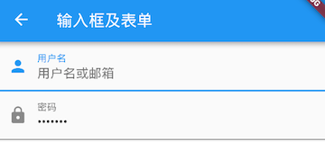

#### 获取输入内容

获取输入内容有两种方式：

1. `onChange` 监听文本变化
2. 设置`controller` 

```dart
class MyTextField extends StatefulWidget {
  const MyTextField({Key? key}) : super(key: key);

  @override
  State<MyTextField> createState() => _MyTextFieldState();
}

class _MyTextFieldState extends State<MyTextField> {
  //定义一个controller
  TextEditingController _unameController = TextEditingController();

  @override
  void initState() {
    super.initState();
    //监听输入改变
    _unameController.addListener(() {
      print('controller uname:${_unameController.text}');
    });
    // 设置默认值，并从第三个字符开始选中后面的字符
    _unameController.text = 'hello world';
    _unameController.selection = TextSelection(
      baseOffset: 2,
      extentOffset: _unameController.text.length,
    );
  }

  @override
  Widget build(BuildContext context) {
    return Column(
      children: <Widget>[
        TextField(
          autofocus: true,
          decoration: const InputDecoration(
            labelText: "用户名",
            hintText: "用户名或邮箱",
            prefixIcon: Icon(Icons.person),
          ),
          onChanged: (value) => print('用户名：$value'),
          controller: _unameController, // 设置controller
        ),
        TextField(
          decoration: const InputDecoration(
            labelText: "密码",
            hintText: "您的登录密码",
            prefixIcon: Icon(Icons.lock),
          ),
          obscureText: true, // 隐藏输入框内容
          onChanged: (value) => print('密码：$value'),
        ),
      ],
    );
  }
}

void main(List<String> args) {
  runApp(MaterialApp(
    title: 'My app',
    home: Scaffold(
      appBar: AppBar(
        title: const Text('登录'),
      ),
      body: const MyTextField(),
    ),
  ));
}
```

两种方式相比，`onChanged`是专门用于监听文本变化，而`controller`的功能却多一些，除了能监听文本变化外，它还可以设置默认值、选择文本。

运行效果如图所示：


#### 控制焦点

在此示例中创建两个`TextField`，第一个自动获取焦点，然后创建两个按钮：

- 点击第一个按钮可以将焦点从第一个`TextField`挪到第二个`TextField`。
- 点击第二个按钮可以关闭键盘。

我们要实现的效果如图所示：


代码如下：

```dart
class FocusTestRoute extends StatefulWidget {
  const FocusTestRoute({Key? key});

  @override
  State<FocusTestRoute> createState() => _FocusTestRouteState();
}

class _FocusTestRouteState extends State<FocusTestRoute> {
  FocusNode focusNode1 = FocusNode();
  FocusNode focusNode2 = FocusNode();

  @override
  Widget build(BuildContext context) {
    return Padding(
      padding: const EdgeInsets.all(16.0),
      child: Column(
        children: <Widget>[
          TextField(
            autofocus: true,
            focusNode: focusNode1, //关联focusNode1
            decoration: const InputDecoration(
              labelText: 'input1',
            ),
          ),
          TextField(
            focusNode: focusNode2, //关联focusNode2
            decoration: const InputDecoration(
              labelText: 'input2',
            ),
          ),
          Builder(builder: (context) {
            return Column(
              children: <Widget>[
                ElevatedButton(
                  onPressed: () {
                    // 将焦点从第一个TextField移到第二个TextField
                    FocusScope.of(context).requestFocus(focusNode2);
                  },
                  child: const Text('移动焦点'),
                ),
                ElevatedButton(
                  onPressed: () {
                    // 当所有编辑框都失去焦点时键盘就会收起
                    focusNode1.unfocus();
                    focusNode2.unfocus();
                  },
                  child: const Text('隐藏键盘'),
                ),
              ],
            );
          }),
        ],
      ),
    );
  }
}

void main(List<String> args) {
  runApp(MaterialApp(
    title: 'My app',
    home: Scaffold(
      appBar: AppBar(
        title: const Text('获取输入框焦点'),
      ),
      body: const FocusTestRoute(),
    ),
  ));
}
```

`FocusNode`继承自`ChangeNotifier`，通过`FocusNode`可以监听焦点的改变事件，如：

```dart
// 创建 focusNode   
FocusNode focusNode = FocusNode();
...
// focusNode绑定输入框   
TextField(focusNode: focusNode);
...
// 监听焦点变化    
focusNode.addListener((){
   print(focusNode.hasFocus);
});
```

获得焦点时`focusNode.hasFocus`值为`true`，失去焦点时为`false`。

#### 自定义样式

我们直接通过InputDecoration的enabledBorder和focusedBorder来分别设置了输入框在未获取焦点和获得焦点后的下划线颜色。

```dart
void main(List<String> args) {
  runApp(MaterialApp(
    title: 'My app',
    home: Scaffold(
      appBar: AppBar(
        title: const Text('登录'),
      ),
      body: Column(
        children: const <Widget>[
          TextField(
            autofocus: true,
            decoration: InputDecoration(
              labelText: "用户名",
              hintText: "用户名或邮箱",
              prefixIcon: Icon(Icons.person),
              // 未获得焦点下划线设为灰色
              enabledBorder: UnderlineInputBorder(
                borderSide: BorderSide(
                  color: Colors.grey,
                ),
              ),
              // 获得焦点下划线设为橙色
              focusedBorder: UnderlineInputBorder(
                borderSide: BorderSide(
                  color: Colors.orange,
                ),
              ),
            ),
          ),
          TextField(
            decoration: InputDecoration(
              labelText: "密码",
              hintText: "您的登录密码",
              prefixIcon: Icon(Icons.lock),
            ),
            obscureText: true, // 隐藏输入框内容
          ),
        ],
      ),
    ),
  ));
}
```

运行效果如图所示：

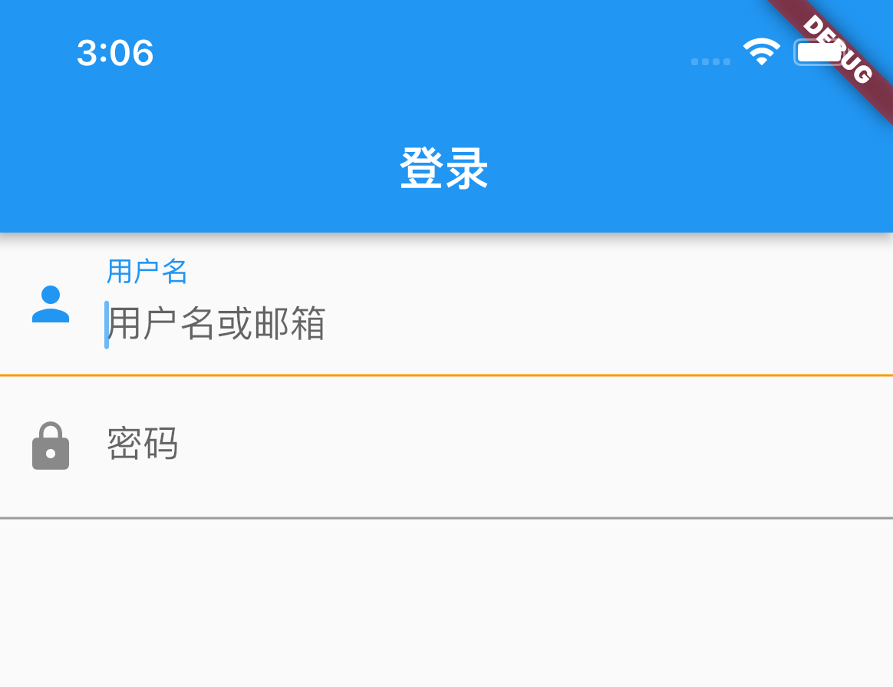

我们也可以通过主题来自定义输入框的样式：

```dart
void main(List<String> args) {
  runApp(MaterialApp(
    title: 'My app',
    home: Scaffold(
      appBar: AppBar(
        title: const Text('登录'),
      ),
      body: Builder(builder: (context) {
        return Theme(
          data: Theme.of(context).copyWith(
            hintColor: Colors.grey[200], //定义下划线颜色
            inputDecorationTheme: const InputDecorationTheme(
              labelStyle: TextStyle(
                color: Colors.grey,
                fontSize: 14,
              ), //定义label字体样式
            ),
          ),
          child: Column(
            children: const <Widget>[
              TextField(
                decoration: InputDecoration(
                  labelText: "用户名",
                  hintText: "用户名或邮箱",
                  prefixIcon: Icon(Icons.person),
                ),
              ),
              TextField(
                decoration: InputDecoration(
                  prefixIcon: Icon(Icons.lock),
                  labelText: "密码",
                  hintText: "您的登录密码",
                  hintStyle: TextStyle(
                    color: Colors.grey,
                    fontSize: 13.0,
                  ),
                ),
                obscureText: true,
              ),
            ],
          ),
        );
      }),
    ),
  ));
}
```

运行效果如图所示：


我们成功的自定义了下划线颜色和提问文字样式，通过这种方式自定义后，输入框在获取焦点时，`labelText`不会高亮显示了，正如上图中的"用户名"本应该显示蓝色，但现在却显示为灰色，并且我们还是无法定义下划线宽度。另一种灵活的方式是直接隐藏掉`TextField`本身的下划线，然后通过`Container`去嵌套定义样式，如：

```dart
Container(
  child: const TextField(
    keyboardType: TextInputType.emailAddress,
    decoration: InputDecoration(
      labelText: "Email",
      hintText: "电子邮件地址",
      prefixIcon: Icon(Icons.email),
      border: InputBorder.none, //隐藏下划线
    ),
  ),
  decoration: BoxDecoration(
    // 下滑线浅灰色，高度1像素
    border: Border(
      bottom: BorderSide(
        color: Colors.grey.shade200,
        width: 1.0,
      ),
    ),
  ),
)
```

运行效果如图：


通过这种组件组合的方式，也可以定义背景圆角等。一般来说，优先通过`decoration`来自定义样式，如果`decoration`实现不了，再用widget组合的方式。

### 表单Form

实际业务中，在正式向服务器提交数据前，都会对各个输入框数据进行合法性校验，但是对每一个`TextField`都分别进行校验将会是一件很麻烦的事。为此，Flutter提供了一个`Form` 组件，它可以对输入框进行分组，然后进行一些统一操作，如输入内容校验、输入框重置以及输入内容保存。

我们修改一下上面用户登录的示例，在提交之前校验：

1. 用户名不能为空，如果为空则提示“用户名不能为空”。
2. 密码不能小于 6 位，如果小于 6 为则提示“密码不能少于 6 位”。

完整代码：

```dart
class FormTestRoute extends StatefulWidget {
  const FormTestRoute({Key? key});

  @override
  State<FormTestRoute> createState() => _FormTestRouteState();
}

class _FormTestRouteState extends State<FormTestRoute> {
  GlobalKey _formKey = GlobalKey<FormState>();

  @override
  Widget build(BuildContext context) {
    return Form(
      key: _formKey, //设置globalKey，用于后面获取FormState
      autovalidateMode: AutovalidateMode.onUserInteraction,
      child: Column(
        children: <Widget>[
          TextFormField(
            autofocus: true,
            decoration: const InputDecoration(
              labelText: '用户名',
              hintText: '用户名或邮箱',
              icon: Icon(Icons.person),
            ),
            // 校验用户名
            validator: (value) => value!.trim().isNotEmpty ? null : '用户名不能为空',
          ),

          TextFormField(
            decoration: const InputDecoration(
              labelText: '密码',
              hintText: '您的登录密码',
              icon: Icon(Icons.lock),
            ),
            obscureText: true,
            //校验密码
            validator: (value) => value!.trim().length > 5 ? null : '密码不能少于6位',
          ),

          // 登录按钮
          Padding(
            padding: const EdgeInsets.only(top: 28.0),
            child: Row(
              children: <Widget>[
                Expanded(
                  child: ElevatedButton(
                    child: const Padding(
                      padding: EdgeInsets.all(16.0),
                      child: Text('登录'),
                    ),
                    onPressed: () {
                      // 通过_formKey.currentState 获取FormState后，
                      // 调用validate()方法校验用户名密码是否合法，校验
                      // 通过后再提交数据。
                      if((_formKey.currentState as FormState).validate()){
                        print('验证通过');
                      }
                    },
                  ),
                ),
              ],
            ),
          ),
        ],
      ),
    );
  }
}

void main(List<String> args) {
  runApp(MaterialApp(
    title: 'My app',
    home: Scaffold(
      appBar: AppBar(
        title: const Text('登录'),
      ),
      body: const FormTestRoute(),
    ),
  ));
}
```

运行后效果如图所示：


#### Form

`Form`继承自`StatefulWidget`对象，它对应的状态类为`FormState`。

```dart
Form({
  required Widget child,
  bool autovalidate = false,
  WillPopCallback onWillPop,
  VoidCallback onChanged,
})
```

- `autovalidate`：是否自动校验输入内容；当为`true`时，每一个子 FormField 内容发生变化时都会自动校验合法性，并直接显示错误信息。否则，需要通过调用`FormState.validate()`来手动校验。
- `onWillPop`：决定`Form`所在的路由是否可以直接返回（如点击返回按钮），该回调返回一个`Future`对象，如果 Future 的最终结果是`false`，则当前路由不会返回；如果为`true`，则会返回到上一个路由。此属性通常用于拦截返回按钮。
- `onChanged`：`Form`的任意一个子`FormField`内容发生变化时会触发此回调。

#### FormField

`Form`的子孙元素必须是`FormField`类型，`FormField`是一个抽象类，定义几个属性，`FormState`内部通过它们来完成操作，`FormField`部分定义如下：

```dart
const FormField({
  ...
  FormFieldSetter<T> onSaved, //保存回调
  FormFieldValidator<T>  validator, //验证回调
  T initialValue, //初始值
  bool autovalidate = false, //是否自动校验。
})
```

为了方便使用，Flutter 提供了一个`TextFormField`组件，它继承自`FormField`类，也是`TextField`的一个包装类，所以除了`FormField`定义的属性之外，它还包括`TextField`的属性。

#### FormState

`FormState`为`Form`的`State`类，可以通过`Form.of()`或`GlobalKey`获得。我们可以通过它来对`Form`的子孙`FormField`进行统一操作。我们看看其常用的三个方法：

- `FormState.validate()`：调用此方法后，会调用`Form`子孙`FormField的validate`回调，如果有一个校验失败，则返回false，所有校验失败项都会返回用户返回的错误提示。
- `FormState.save()`：调用此方法后，会调用`Form`子孙`FormField`的`save`回调，用于保存表单内容
- `FormState.reset()`：调用此方法后，会将子孙`FormField`的内容清空。

## 进度指示器

### LinearProgressIndicator

`LinearProgressIndicator`是一个线性、条状的进度条，定义如下：

```dart
LinearProgressIndicator({
  double value,
  Color backgroundColor,
  Animation<Color> valueColor,
  ...
})
```

- `value`：`value`表示当前的进度，取值范围为[0,1]；如果`value`为`null`时则指示器会执行一个循环动画（模糊进度）；当`value`不为`null`时，指示器为一个具体进度的进度条。
- `backgroundColor`：指示器的背景色。
- `valueColor`: 指示器的进度条颜色；值得注意的是，该值类型是`Animation<Color>`，这允许我们对进度条的颜色也可以指定动画。如果我们不需要对进度条颜色执行动画，换言之，我们想对进度条应用一种固定的颜色，此时我们可以通过`AlwaysStoppedAnimation`来指定。

```dart
Column(
  children: [
    Padding(
      padding: const EdgeInsets.only(top: 50.0),
      // 模糊进度条(会执行一个动画)
      child: LinearProgressIndicator(
        backgroundColor: Colors.grey[200],
        valueColor: const AlwaysStoppedAnimation(Colors.blue),
      ),
    ),
    
    Padding(
      padding: const EdgeInsets.only(top: 50.0),
      // 进度条显示50%
      child: LinearProgressIndicator(
        backgroundColor: Colors.grey[200],
        valueColor: const AlwaysStoppedAnimation(Colors.blue),
        value: .5,
      ),
    ),
  ],
)
```

运行效果如图所示：


第一个进度条在执行循环动画：蓝色条一直在移动，而第二个进度条是静止的，停在50%的位置。

### CircularProgressIndicator

`CircularProgressIndicator`是一个圆形进度条，定义如下：

```dart
CircularProgressIndicator({
  double value,
  Color backgroundColor,
  Animation<Color> valueColor,
  this.strokeWidth = 4.0,
  ...   
})
```

示例如下：

```dart
Column(
  children: [
    Padding(
      padding: const EdgeInsets.only(top: 50.0),
      // 模糊进度条(会执行一个旋转动画)
      child: CircularProgressIndicator(
        backgroundColor: Colors.grey[200],
        valueColor: const AlwaysStoppedAnimation(Colors.blue),
      ),
    ),
    Padding(
      padding: const EdgeInsets.only(top: 50.0),
      //进度条显示50%，会显示一个半圆
      child: CircularProgressIndicator(
        backgroundColor: Colors.grey[200],
        valueColor: const AlwaysStoppedAnimation(Colors.blue),
        value: .5,
      ),
    ),
  ],
)
```

运行效果如图所示：

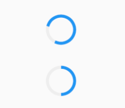

第一个进度条会执行旋转动画，而第二个进度条是静止的，它停在50%的位置。

### 自定义尺寸

我们可以发现`LinearProgressIndicator`和`CircularProgressIndicator`，并没有提供设置圆形进度条尺寸的参数；如果我们希望`LinearProgressIndicator`的线细一些，或者希望`CircularProgressIndicator`的圆大一些该怎么做？

其实`LinearProgressIndicator`和`CircularProgressIndicator`都是取父容器的尺寸作为绘制的边界的。知道了这点，我们便可以通过尺寸限制类Widget，如`ConstrainedBox`、`SizedBox` （我们将在后面容器类组件一章中介绍）来指定尺寸，如：

```dart
Column(
  children: [
    Padding(
      padding: const EdgeInsets.only(top: 50.0),
      // 线性进度条高度指定为10
      child: SizedBox(
        height: 10,
        child: LinearProgressIndicator(
          backgroundColor: Colors.grey[200],
          valueColor: const AlwaysStoppedAnimation(Colors.blue),
          value: .5,
        ),
      ),
    ),
    Padding(
      padding: const EdgeInsets.only(top: 50.0),
      // 圆形进度条直径指定为100
      child: SizedBox(
        height: 100,
        width: 100,
        child: CircularProgressIndicator(
          backgroundColor: Colors.grey[200],
          valueColor: const AlwaysStoppedAnimation(Colors.blue),
          value: .5,
        ),
      ),
    ),
  ],
)
```

运行效果如图所示：


### 进度色动画

我们实现一个进度条在3秒内从灰色变成蓝色的动画：

```dart
class ProressRoute extends StatefulWidget {
  const ProressRoute({Key? key});

  @override
  State<ProressRoute> createState() => _ProressRouteState();
}

class _ProressRouteState extends State<ProressRoute>
    with SingleTickerProviderStateMixin {
  late AnimationController _animationController;

  @override
  void initState() {
    //动画执行时间3秒
    _animationController = AnimationController(
      vsync: this, //注意State类需要混入SingleTickerProviderStateMixin（提供动画帧计时/触发器）
      duration: const Duration(
        seconds: 3,
      ),
    );

    _animationController.forward();
    _animationController.addListener(() => setState(() => {}));
    super.initState();
  }

  @override
  void dispose() {
    _animationController.dispose();
    super.dispose();
  }

  @override
  Widget build(BuildContext context) {
    return SingleChildScrollView(
      child: Column(
        children: [
          Padding(
            padding: const EdgeInsets.all(16),
            child: LinearProgressIndicator(
              backgroundColor: Colors.grey[200],
              valueColor: ColorTween(
                begin: Colors.grey,
                end: Colors.blue,
              ).animate(_animationController), // 从灰色变成蓝色
              value: _animationController.value,
            ),
          )
        ],
      ),
    );
  }
}

void main(List<String> args) {
  runApp(
    MaterialApp(
      title: 'My app',
      home: Scaffold(
        appBar: AppBar(
          title: const Text('进度条'),
        ),
        body: const ProressRoute(),
      ),
    ),
  );
}
```

### 自定义进度指示器样式

定制进度指示器风格样式，可以通过`CustomPainter` Widget 来自定义绘制逻辑，实际上`LinearProgressIndicator`和`CircularProgressIndicator`也正是通过`CustomPainter`来实现外观绘制的。关于`CustomPainter`，我们将在后面“自定义Widget”一章中详细介绍。


# 布局类组件

## 布局原理与约束

实现一个最小高度为50，宽度尽可能大的红色容器。

效果如图所示：


```dart
class ConstrainedBoxRoute extends StatelessWidget {
  const ConstrainedBoxRoute({Key? key});

  @override
  Widget build(BuildContext context) {
    // 定义一个redBox，一个背景颜色为红色的盒子，不指定它的宽度和高度：    
    Widget redBox = const DecoratedBox(
      decoration: BoxDecoration(
        color: Colors.red,
      ),
    );
    
    //  实现一个最小高度为50，宽度尽可能大的红色容器。
    return ConstrainedBox(
      constraints: const BoxConstraints(
        minWidth: double.infinity, //宽度尽可能大
        minHeight: 50.0, //最小高度为50像素
      ),
      child: Container(
        height: 5.0,
        child: redBox,
      ),
    );
  }
}
```

### ConstrainedBox

`ConstrainedBox`用于对子组件添加额外的约束。例如，如果你想让子组件的最小高度是80像素，你可以使用`const BoxConstraints(minHeight: 80.0)`作为子组件的约束。

### BoxConstraints

BoxConstraints 是盒模型布局过程中父渲染对象传递给子渲染对象的约束信息，包含最大宽高信息，子组件大小需要在约束的范围内，BoxConstraints 默认的构造函数如下：

```dart
const BoxConstraints({
  this.minWidth = 0.0, //最小宽度
  this.maxWidth = double.infinity, //最大宽度
  this.minHeight = 0.0, //最小高度
  this.maxHeight = double.infinity //最大高度
})
```

它包含 4 个属性，BoxConstraints还定义了一些便捷的构造函数，用于快速生成特定限制规则的BoxConstraints，如`BoxConstraints.tight(Size size)`，它可以生成固定宽高的限制；`BoxConstraints.expand()`可以生成一个尽可能大的用以填充另一个容器的BoxConstraints。

### SizedBox

`SizedBox`用于给子元素指定固定的宽高，如：

```dart
class SizedBoxRoute extends StatelessWidget {
  const SizedBoxRoute({Key? key});

  @override
  Widget build(BuildContext context) {
    Widget redBox = const DecoratedBox(
      decoration: BoxDecoration(
        color: Colors.red,
      ),
    );

    return SizedBox(
      width: 80.0,
      height: 80.0,
      child: redBox,
    );
  }
}
```

运行效果如图所示：


实际上`SizedBox`只是`ConstrainedBox`的一个定制，上面代码等价于：

```dart
ConstrainedBox(
  constraints: const BoxConstraints.tightFor(width: 80.0, height: 80.0),
  child: redBox,
)
```

而`BoxConstraints.tightFor(width: 80.0,height: 80.0)`等价于：

```dart
BoxConstraints(minHeight: 80.0,maxHeight: 80.0,minWidth: 80.0,maxWidth: 80.0)
```

### 多重限制

如果某一个组件有多个父级`ConstrainedBox`限制，那么最终会是哪个生效？我们看一个例子：

```dart
ConstrainedBox(
  constraints: BoxConstraints(minWidth: 60.0, minHeight: 60.0), //父
  child: ConstrainedBox(
    constraints: BoxConstraints(minWidth: 90.0, minHeight: 20.0),//子
    child: redBox,
  ),
)
```

上面我们有父子两个`ConstrainedBox`，他们的约束条件不同，运行后效果如图所示：


最终显示效果是宽90，高60，也就是说是子`ConstrainedBox`的`minWidth`生效，而`minHeight`是父`ConstrainedBox`生效。单凭这个例子，我们还总结不出什么规律，我们将上例中父子约束条件换一下：

```dart
ConstrainedBox(
  constraints: BoxConstraints(minWidth: 90.0, minHeight: 20.0),
  child: ConstrainedBox(
    constraints: BoxConstraints(minWidth: 60.0, minHeight: 60.0),
    child: redBox,
  )
)
```

运行效果如图所示：


最终的显示效果仍然是90，高60，效果相同，但意义不同，因为此时`minWidth`生效的是父`ConstrainedBox`，而`minHeight`是子`ConstrainedBox`生效。

通过上面示例，我们发现**有多重限制时，对于`minWidth`和`minHeight`来说，是取父子中相应数值较大的。**实际上，只有这样才能保证父限制与子限制不冲突。

### UnconstrainedBox

`UnconstrainedBox` 的子组件将不再受到约束，大小完全取决于自己。

```dart
class UnconstrainedBoxRoute extends StatelessWidget {
  const UnconstrainedBoxRoute({Key? key});

  @override
  Widget build(BuildContext context) {
    Widget redBox = const DecoratedBox(
      decoration: BoxDecoration(
        color: Colors.red,
      ),
    );

    return ConstrainedBox(
      constraints: const BoxConstraints(
        minWidth: 60.0,
        minHeight: 100.0,
      ),
      child: UnconstrainedBox( //“去除”父级限制
        child: ConstrainedBox(
          constraints: const BoxConstraints(
            minWidth: 90.0,
            minHeight: 20.0,
          ),
          child: redBox,
        ),
      ),
    );
  }
}
```

上面代码中，如果没有中间的`UnconstrainedBox`，那么根据上面所述的多重限制规则，那么最终将显示一个90×100的红色框。但是由于`UnconstrainedBox` “去除”了父`ConstrainedBox`的限制，则最终会按照子`ConstrainedBox`的限制来绘制`redBox`，即90×20，如图所示：


但是请注意，`UnconstrainedBox`对父组件限制的“去除”并非是真正的去除：上面例子中虽然红色区域大小是90×20，但上方仍然有80的空白空间。也就是说**父限制的`minHeight`(100.0)仍然是生效的，只不过它不影响最终子元素`redBox`的大小**，但仍然还是占有相应的空间，可以认为此时的父`ConstrainedBox`是作用于子`UnconstrainedBox`上，而`redBox`只受子`ConstrainedBox`限制。


那么有什么方法可以彻底去除父`ConstrainedBox`的限制吗？答案是否定的！请牢记，**任何时候子组件都必须遵守其父组件的约束**，所以在此提示读者，在定义一个通用的组件时，如果要对子组件指定约束，那么一定要注意，因为一旦指定约束条件，子组件自身就不能违反约束。

在实际开发中，当我们发现已经使用 `SizedBox` 或 `ConstrainedBox`给子元素指定了固定宽高，但是仍然没有效果时，几乎可以断定：**已经有父组件指定了约束！**举个例子，如 Material 组件库中的`AppBar`（导航栏）的右侧菜单中，我们使用`SizedBox`指定了 loading 按钮的大小，代码如下：

```dart
void main(List<String> args) {
  runApp(
    MaterialApp(
      title: 'My app',
      home: Scaffold(
        appBar: AppBar(
          title: const Text('布局与约束'),
          actions: const <Widget>[
            SizedBox(
              width: 20,
              height: 20,
              child: CircularProgressIndicator(
                strokeWidth: 3,
                valueColor: AlwaysStoppedAnimation(
                  Colors.white70,
                ),
              ),
            )
          ],
        ),
      ),
    ),
  );
}
```

上面代码运行后，效果如图所示：


我们会发现右侧loading按钮大小并没有发生变化！这正是因为`AppBar`中已经指定了`actions`按钮的约束条件，所以我们要自定义loading按钮大小，就必须通过`UnconstrainedBox`来 “去除” 父元素的限制，代码如下：

```dart
void main(List<String> args) {
  runApp(
    MaterialApp(
      title: 'My app',
      home: Scaffold(
        appBar: AppBar(
          title: const Text('布局与约束'),
          actions: const <Widget>[
            UnconstrainedBox(
              child: SizedBox(
                width: 20,
                height: 20,
                child: CircularProgressIndicator(
                  strokeWidth: 3,
                  valueColor: AlwaysStoppedAnimation(
                    Colors.white70,
                  ),
                ),
              ),
            ),
          ],
        ),
      ),
    ),
  );
}
```

运行后效果如图所示：


另外，需要注意，UnconstrainedBox 虽然在其子组件布局时可以取消约束（子组件可以为无限大），但是 UnconstrainedBox 自身是受其父组件约束的，所以当 UnconstrainedBox 随着其子组件变大后，**如果UnconstrainedBox 的大小超过它父组件约束时，也会导致溢出报错**，比如：

```dart
void main(List<String> args) {
  runApp(
    MaterialApp(
      title: 'My app',
      home: Scaffold(
        appBar: AppBar(
          title: const Text('布局与约束'),
        ),
        body: Column(
          children: <Widget>[
            UnconstrainedBox(
              alignment: Alignment.topLeft,
              child: Padding(
                padding: const EdgeInsets.all(16),
                child: Row(
                  children: [Text('xx' * 3)],
                ),
              ),
            ),
          ],
        ),
      ),
    ),
  );
}
```

正常运行效果如图：


超出范围运行效果如图：


### 其他约束类容器

除了上面介绍的这些常用的尺寸限制类容器外，还有一些其他的尺寸限制类容器，比如`AspectRatio`，它可以指定子组件的长宽比、`LimitedBox` 用于指定最大宽高、`FractionallySizedBox` 可以根据父容器宽高的百分比来设置子组件宽高等，由于这些容器使用起来都比较简单，我们便不再赘述。

### Flutter布局模型

Flutter 中有两种布局模型：

- 基于 RenderBox 的盒模型布局。
- 基于 Sliver ( RenderSliver ) 按需加载列表布局。

两种布局方式在细节上略有差异，但大体流程相同，布局流程如下：

1. 上层组件向下层组件传递约束（constraints）条件。
2. 下层组件确定自己的大小，然后告诉上层组件。注意下层组件的大小必须符合父组件的约束。
3. 上层组件确定下层组件相对于自身的偏移和确定自身的大小（大多数情况下会根据子组件的大小来确定自身的大小）。

比如，父组件传递给子组件的约束是“最大宽高不能超过100，最小宽高为0”，如果我们给子组件设置宽高都为200，则子组件最终的大小是100*100，**因为任何时候子组件都必须先遵守父组件的约束**，在此基础上再应用子组件约束（相当于父组件的约束和自身的大小求一个交集）。

本节我们主要看一下盒模型布局，然后会在可滚动组件一章中介绍 Sliver 布局模型。盒模型布局组件有两个特点：

1. 组件对应的渲染对象都继承自 RenderBox 类。在本书后面文章中如果提到某个组件是 RenderBox，则指它是基于盒模型布局的，而不是说组件是 RenderBox 类的实例。
2. 在布局过程中父级传递给子级的约束信息由 BoxConstraints 描述。

## 线性布局（Row和Column）

所谓线性布局，即指沿水平或垂直方向排列子组件。Flutter 中通过`Row`和`Column`来实现线性布局，类似于Android 中的`LinearLayout`控件。`Row`和`Column`都继承自`Flex`，我们将在弹性布局一节中详细介绍`Flex`。

### 主轴和纵轴

对于线性布局，有主轴和纵轴之分，如果布局是沿水平方向，那么主轴就是指水平方向，而纵轴即垂直方向；如果布局沿垂直方向，那么主轴就是指垂直方向，而纵轴就是水平方向。在线性布局中，有两个定义对齐方式的枚举类`MainAxisAlignment`和`CrossAxisAlignment`，分别代表主轴对齐和纵轴对齐。


### Row

Row可以沿水平方向排列其子widget。定义如下：

```dart
Row({
  ...  
  TextDirection textDirection,    
  MainAxisSize mainAxisSize = MainAxisSize.max,    
  MainAxisAlignment mainAxisAlignment = MainAxisAlignment.start,
  VerticalDirection verticalDirection = VerticalDirection.down,  
  CrossAxisAlignment crossAxisAlignment = CrossAxisAlignment.center,
  List<Widget> children = const <Widget>[],
})
```

- `textDirection`：表示水平方向子组件的布局顺序(是从左往右还是从右往左)，默认为系统当前Locale环境的文本方向(如中文、英语都是从左往右，而阿拉伯语是从右往左)。

  当值为TextDirection.ltr时：

  ```dart
  Row(
    textDirection: TextDirection.ltr,
    children: const <Widget>[
      Icon(Icons.system_security_update),
      Icon(Icons.access_alarms),
    ],
  )
  ```

  效果如图：

  

  当值为TextDirection.rtl时，效果如图：

  

- `mainAxisSize`：表示`Row`在主轴(水平)方向占用的空间，默认是`MainAxisSize.max`，表示尽可能多的占用水平方向的空间，此时无论子 widgets 实际占用多少水平空间，`Row`的宽度始终等于水平方向的最大宽度；而`MainAxisSize.min`表示尽可能少的占用水平空间，当子组件没有占满水平剩余空间，则`Row`的实际宽度等于所有子组件占用的的水平空间；

  > `MainAxisSize.max`相当于Android中的match_parent，`MainAxisSize.min`相当于wrap_content。

- `mainAxisAlignment`：表示子组件在`Row`所占用的水平空间内对齐方式，如果`mainAxisSize`值为`MainAxisSize.min`，则此属性无意义，因为子组件的宽度等于`Row`的宽度。只有当`mainAxisSize`的值为`MainAxisSize.max`时，此属性才有意义，`MainAxisAlignment.start`表示沿`textDirection`的初始方向对齐，如`textDirection`取值为`TextDirection.ltr`时，则`MainAxisAlignment.start`表示左对齐，`textDirection`取值为`TextDirection.rtl`时表示从右对齐。而`MainAxisAlignment.end`和`MainAxisAlignment.start`正好相反；`MainAxisAlignment.center`表示居中对齐。

  > `MainAxisAlignment`相当于Android中的gravity

  ```dart
  Row(          
    mainAxisAlignment: MainAxisAlignment.start,
    children: const <Widget>[
      Icon(Icons.system_security_update),
      Icon(Icons.access_alarms),
    ],
  )
  ```

  值为MainAxisAlignment.start时：

  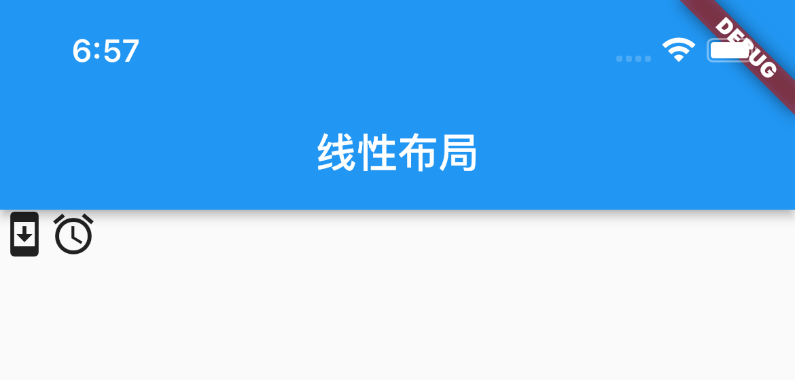

  值为MainAxisAlignment.center时：

  

  值为MainAxisAlignment.end时：

  

- `verticalDirection`：表示`Row`纵轴（垂直）的对齐方向，默认是`VerticalDirection.down`，表示从上到下。

- `crossAxisAlignment`：表示子组件在纵轴方向的对齐方式，`Row`的高度等于子组件中最高的子元素高度，它的取值和`MainAxisAlignment`一样(包含`start`、`end`、 `center`三个值)，不同的是`crossAxisAlignment`的参考系是`verticalDirection`，即`verticalDirection`值为`VerticalDirection.down`时`crossAxisAlignment.start`指顶部对齐，`verticalDirection`值为`VerticalDirection.up`时，`crossAxisAlignment.start`指底部对齐；而`crossAxisAlignment.end`和`crossAxisAlignment.start`正好相反；

  ```dart
  Row(
    verticalDirection: VerticalDirection.down,
    crossAxisAlignment: CrossAxisAlignment.start,       
    children: const <Widget>[
      Text(
        " hello world ",
        style: TextStyle(fontSize: 30.0),
      ),
      Text(" I am Jack "),
    ],
  )
  ```

  当值位VerticalDirection.down时，crossAxisAlignment为不同值的位置：

  

  

  当值位VerticalDirection.up时，crossAxisAlignment为不同值的位置：

  

- `children` ：子组件数组。

### Column

`Column`可以在垂直方向排列其子组件。参数和`Row`一样，不同的是布局方向为垂直，主轴纵轴正好相反，我们可类比`Row`来理解，下面看一个例子：

```dart
class ColumnRoute extends StatelessWidget {
  const ColumnRoute({Key? key});

  @override
  Widget build(BuildContext context) {
    return Column(
      crossAxisAlignment: CrossAxisAlignment.end,
      children: const <Widget>[
        Text('Hi'),
        Text('World'),
      ],
    );
  }
}

void main(List<String> args) {
  runApp(
    MaterialApp(
      title: 'My app',
      home: Scaffold(
        appBar: AppBar(
          title: const Text('Column'),
        ),
        body: const ColumnRoute(),
      ),
    ),
  );
}
```

运行效果如图所示：

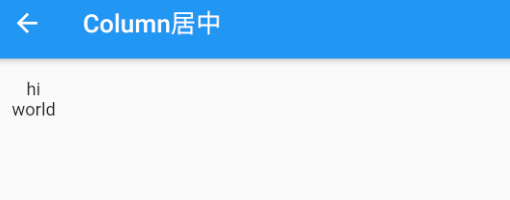

解释：

- 由于我们没有指定`Column`的`mainAxisSize`，所以使用默认值`MainAxisSize.max`，则`Column`会在垂直方向占用尽可能多的空间，此例中会占满整个屏幕高度。
- 由于我们指定了 `crossAxisAlignment` 属性为`CrossAxisAlignment.center`，那么子项在`Column`纵轴方向（此时为水平方向）会居中对齐。注意，在水平方向对齐是有边界的，总宽度为`Column`占用空间的实际宽度，而实际的宽度取决于子项中宽度最大的Widget。在本例中，`Column`有两个子Widget，而显示“world”的`Text`宽度最大，所以`Column`的实际宽度则为`Text("world")` 的宽度，所以居中对齐后`Text("hi")`会显示在`Text("world")`的中间部分。

**实际上，`Row`和`Column`都只会在主轴方向占用尽可能大的空间，而纵轴的长度则取决于他们最大子元素的长度**。如果我们想让本例中的两个文本控件在整个手机屏幕中间对齐，我们有两种方法：


- 将`Column`的宽度指定为屏幕宽度；这很简单，我们可以通过`ConstrainedBox`或`SizedBox`（我们将在后面章节中专门介绍这两个Widget）来强制更改宽度限制，例如：

```dart
ConstrainedBox(
  constraints: BoxConstraints(minWidth: double.infinity), 
  child: Column(
    crossAxisAlignment: CrossAxisAlignment.center,
    children: <Widget>[
      Text("hi"),
      Text("world"),
    ],
  ),
);
```

- 将`minWidth`设为`double.infinity`，可以使宽度占用尽可能多的空间。
- 使用`Center` 组件；我们将在后面章节中介绍。

### 特殊情况

如果`Row`里面嵌套`Row`，或者`Column`里面再嵌套`Column`，那么只有最外面的`Row`或`Column`会占用尽可能大的空间，里面`Row`或`Column`所占用的空间为实际大小，下面以`Column`为例说明：

```dart
void main(List<String> args) {
  runApp(
    MaterialApp(
      title: 'My app',
      home: Scaffold(
        appBar: AppBar(
          title: const Text('Column 嵌套'),
        ),
        body: Container(
          color: Colors.green,
          child: Column(
            mainAxisSize: MainAxisSize.max,//有效，外层Colum高度为整个屏幕
            children: <Widget>[
              Container(
                color: Colors.red,
                child: Column(
                  mainAxisSize: MainAxisSize.max, //无效，内层Colum高度为实际高度
                  children: const <Widget>[
                    Text('Hello World'),
                    Text('I am Jack'),
                  ],
                ),
              )
            ],
          ),
        ),
      ),
    ),
  );
}
```

运行效果如图所示：


如果要让里面的`Column`占满外部`Column`，可以使用`Expanded` 组件：

```dart
void main(List<String> args) {
  runApp(
    MaterialApp(
      title: 'My app',
      home: Scaffold(
        appBar: AppBar(
          title: const Text('Column 嵌套'),
        ),
        body: Container(
          color: Colors.green,
          child: Column(
            children: <Widget>[
              Expanded( // Expanded 组件
                child: Container(
                  color: Colors.red,
                  child: Column(
                    mainAxisAlignment: MainAxisAlignment.center, //垂直方向居中对齐
                    children: const <Widget>[
                      Text('Hello World'),
                      Text('I am Jack'),
                    ],
                  ),
                ),
              ),
            ],
          ),
        ),
      ),
    ),
  );
}
```

运行效果如图所示：


我们将在介绍弹性布局时详细介绍Expanded。

## 弹性布局（Flex）

**弹性布局允许子组件按照一定比例来分配父容器空间。**弹性布局的概念在其他UI系统中也都存在，如 H5 中的弹性盒子布局，Android中 的`FlexboxLayout`等。Flutter 中的弹性布局主要通过`Flex`和`Expanded`来配合实现。

> Flex 布局类似于Android中的权重（layout_weight）

实现效果，Flex的两个子widget按1：2来占据水平空间 ：


```dart
class FlexLayoutTestRoute extends StatelessWidget {
  const FlexLayoutTestRoute({Key? key});

  @override
  Widget build(BuildContext context) {
    return Column(
      children: <Widget>[
        //Flex的两个子widget按1：2来占据水平空间
        Flex(
          direction: Axis.horizontal,
          children: <Widget>[
            Expanded(
              flex: 1,
              child: Container(
                height: 30.0,
                color: Colors.red,
              ),
            ),
            Expanded(
              flex: 2,
              child: Container(
                height: 30.0,
                color: Colors.green,
              ),
            ),
          ],
        )
      ],
    );
  }
}
```


### Flex

`Flex`组件可以沿着水平或垂直方向排列子组件，如果你知道主轴方向，使用`Row`或`Column`会方便一些，**因为`Row`和`Column`都继承自`Flex`**，参数基本相同，所以能使用Flex的地方基本上都可以使用`Row`或`Column`。`Flex`本身功能是很强大的，它也可以和`Expanded`组件配合实现弹性布局。接下来我们只讨论`Flex`和弹性布局相关的属性(其他属性已经在介绍`Row`和`Column`时介绍过了)。

```dart
Flex({
  ...
  required this.direction, //弹性布局的方向, Row默认为水平方向，Column默认为垂直方向
  List<Widget> children = const <Widget>[],
})
```

### Expanded

Expanded 只能作为 Flex 的孩子（否则会报错），它可以按比例“扩伸”`Flex`子组件所占用的空间。因为 `Row`和`Column` 都继承自 Flex，所以 Expanded 也可以作为它们的孩子。

```dart
const Expanded({
  int flex = 1, 
  required Widget child,
})
```

`flex`参数为弹性系数，如果为 0 或`null`，则`child`是没有弹性的，即不会被扩伸占用的空间。如果大于0，所有的`Expanded`按照其 flex 的比例来分割主轴的全部空闲空间。下面我们看一个例子，Flex的三个子widget，在垂直方向按2：1：1来占用100像素的空间。

效果如图：


```dart
class FlexLayoutTestRoute extends StatelessWidget {
  const FlexLayoutTestRoute({Key? key});

  @override
  Widget build(BuildContext context) {
    return Column(
      children: <Widget>[
        Padding(
          padding: const EdgeInsets.only(top: 20.0),
          child: SizedBox(
            height: 100.0,
            //Flex的三个子widget，在垂直方向按2：1：1来占用100像素的空间
            child: Flex(
              direction: Axis.vertical,
              children: <Widget>[
                Expanded(
                  flex: 2,
                  child: Container(
                    height: 30.0,
                    color: Colors.red,
                  ),
                ),
                // Spacer的功能是占用指定比例的空间，实际上它只是Expanded的一个包装类
                const Spacer(
                  flex: 1,
                ),
                Expanded(
                  flex: 1,
                  child: Container(
                    height: 30.0,
                    color: Colors.green,
                  ),
                )
              ],
            ),
          ),
        )
      ],
    );
  }
}
```

## 流式布局（Wrap、Flow）

在介绍 Row 和 Colum 时，如果子 widget 超出屏幕范围，则会报溢出错误，如：

```dart
Row(
  children: <Widget>[
    Text("xxx"*100)
  ],
);
```

运行效果如图所示：

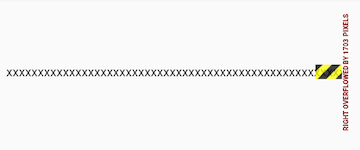

可以看到，右边溢出部分报错。这是因为Row默认只有一行，如果超出屏幕不会折行。我们把超出屏幕显示范围会自动折行的布局称为流式布局。Flutter中通过`Wrap`和`Flow`来支持流式布局，将上例中的 Row 换成Wrap后溢出部分则会自动折行，下面我们分别介绍`Wrap`和`Flow`.

### Wrap

下面是Wrap的定义：

```dart
Wrap({
  ...
  this.direction = Axis.horizontal,
  this.alignment = WrapAlignment.start,
  this.spacing = 0.0,
  this.runAlignment = WrapAlignment.start,
  this.runSpacing = 0.0,
  this.crossAxisAlignment = WrapCrossAlignment.start,
  this.textDirection,
  this.verticalDirection = VerticalDirection.down,
  List<Widget> children = const <Widget>[],
})
```

我们可以看到Wrap的很多属性在`Row`（包括`Flex`和`Column`）中也有，如`direction`、`crossAxisAlignment`、`textDirection`、`verticalDirection`等，这些参数意义是相同的，我们不再重复介绍，读者可以查阅前面介绍`Row`的部分。读者可以认为`Wrap`和`Flex`（包括`Row`和`Column`）除了超出显示范围后`Wrap`会折行外，其他行为基本相同。下面我们看一下`Wrap`特有的几个属性：

- `spacing`：主轴方向子widget的间距
- `runSpacing`：纵轴方向的间距
- `runAlignment`：纵轴方向的对齐方式

下面看一个示例子：


```dart
void main(List<String> args) {
  runApp(
    MaterialApp(
      title: 'My app',
      home: Scaffold(
        appBar: AppBar(
          title: const Text('弹性布局'),
        ),
        body: Wrap(
          spacing: 8.0, // 主轴(水平)方向间距
          runSpacing: 4.0, // 纵轴（垂直）方向间距
          alignment: WrapAlignment.center, // 沿主轴方向居中
          children: const <Widget>[
            Chip(
              avatar: CircleAvatar(
                backgroundColor: Colors.blue,
                child: Text('A'),
              ),
              label: Text('Hamilton'),
            ),

            Chip(
              avatar: CircleAvatar(
                backgroundColor: Colors.blue,
                child: Text('M'),
              ),
              label: Text('Lafayette'),
            ),

            Chip(
              avatar: CircleAvatar(
                backgroundColor: Colors.blue,
                child: Text('H'),
              ),
              label: Text('Mulligan'),
            ),

            Chip(
              avatar: CircleAvatar(
                backgroundColor: Colors.blue,
                child: Text('J'),
              ),
              label: Text('Laurens'),
            ),
          ],
        ),
      ),
    ),
  );
}
```

### Flow

我们一般很少会使用`Flow`，因为其过于复杂，需要自己实现子 widget 的位置转换，在很多场景下首先要考虑的是`Wrap`是否满足需求。`Flow`主要用于一些需要自定义布局策略或性能要求较高(如动画中)的场景。

示例：

我们对六个色块进行自定义流式布局：

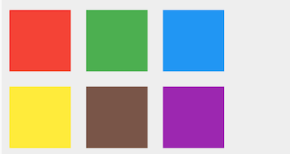


```dart
class TestFlowDelegate extends FlowDelegate {
  EdgeInsets margin;

  TestFlowDelegate({this.margin = EdgeInsets.zero});

  double width = 0;
  double height = 0;

  @override
  void paintChildren(FlowPaintingContext context) {
    var x = margin.left;
    var y = margin.top;
    //计算每一个子widget的位置
    for (int i = 0; i < context.childCount; i++) {
      var w = context.getChildSize(i)!.width + x + margin.right;
      if (w < context.size.width) {
        context.paintChild(i, transform: Matrix4.translationValues(x, y, 0.0));
        x = w + margin.left;
      } else { // 一行放不下了，换行
        x = margin.left;
        // y 坐标往下移
        y += context.getChildSize(i)!.height + margin.top + margin.bottom;
        //绘制子widget(有优化)
        context.paintChild(i, transform: Matrix4.translationValues(x, y, 0.0));
        x += context.getChildSize(i)!.width + margin.left + margin.right;
      }
    }
  }

  @override
  Size getSize(BoxConstraints constraints) {
    // 指定Flow的大小，简单起见我们让宽度竟可能大，但高度指定为200，
    // 实际开发中我们需要根据子元素所占用的具体宽高来设置Flow大小
    return Size(double.infinity, 200.0);
  }

  @override
  bool shouldRepaint(FlowDelegate oldDelegate) {
    return oldDelegate != this;
  }
}

void main(List<String> args) {
  runApp(
    MaterialApp(
      title: 'My app',
      home: Scaffold(
        appBar: AppBar(
          title: const Text('Flow'),
        ),
        body: Flow(
          delegate: TestFlowDelegate(margin: EdgeInsets.all(10.0)),
          children: <Widget>[
            Container(
              width: 80.0,
              height: 80.0,
              color: Colors.red,
            ),
            Container(
              width: 80.0,
              height: 80.0,
              color: Colors.green,
            ),
            Container(
              width: 80.0,
              height: 80.0,
              color: Colors.blue,
            ),
            Container(
              width: 80.0,
              height: 80.0,
              color: Colors.yellow,
            ),
            Container(
              width: 80.0,
              height: 80.0,
              color: Colors.brown,
            ),
            Container(
              width: 80.0,
              height: 80.0,
              color: Colors.purple,
            ),
          ],
        ),
      ),
    ),
  );
}
```

可以看到我们主要的任务就是实现`paintChildren`，它的主要任务是确定每个子widget位置。由于Flow不能自适应子widget的大小，我们通过在`getSize`返回一个固定大小来指定Flow的大小。

注意，如果我们需要自定义布局策略，一般首选的方式是通过直接继承RenderObject，然后通过重写 performLayout 的方式实现，具体方式我们会在本书后面 Flutter 原理篇举例。


`Flow`有如下优点：

- 性能好；`Flow`是一个对子组件尺寸以及位置调整非常高效的控件，`Flow`用转换矩阵在对子组件进行位置调整的时候进行了优化：在`Flow`定位过后，如果子组件的尺寸或者位置发生了变化，在`FlowDelegate`中的`paintChildren()`方法中调用`context.paintChild` 进行重绘，而`context.paintChild`在重绘时使用了转换矩阵，并没有实际调整组件位置。
- 灵活；由于我们需要自己实现`FlowDelegate`的`paintChildren()`方法，所以我们需要自己计算每一个组件的位置，因此，可以自定义布局策略。

缺点：

- 使用复杂。
- Flow 不能自适应子组件大小，必须通过指定父容器大小或实现`TestFlowDelegate`的`getSize`返回固定大小。

## 层叠布局（Stack、Positioned）

层叠布局和 Web 中的绝对定位、Android 中的 Frame 布局是相似的，子组件可以根据距父容器四个角的位置来确定自身的位置。层叠布局允许子组件按照代码中声明的顺序堆叠起来。Flutter中使用`Stack`和`Positioned`这两个组件来配合实现绝对定位。`Stack`允许子组件堆叠，而`Positioned`用于根据`Stack`的四个角来确定子组件的位置。

### Stack

```dart
Stack({
  this.alignment = AlignmentDirectional.topStart,
  this.textDirection,
  this.fit = StackFit.loose,
  this.clipBehavior = Clip.hardEdge,
  List<Widget> children = const <Widget>[],
})
```

- `alignment`：此参数决定如何去对齐没有定位（没有使用`Positioned`）或部分定位的子组件。所谓部分定位，在这里**特指没有在某一个轴上定位：**`left`、`right`为横轴，`top`、`bottom`为纵轴，只要包含某个轴上的一个定位属性就算在该轴上有定位。
- `textDirection`：和`Row`、`Wrap`的`textDirection`功能一样，都用于确定`alignment`对齐的参考系，即：`textDirection`的值为`TextDirection.ltr`，则`alignment`的`start`代表左，`end`代表右，即`从左往右`的顺序；`textDirection`的值为`TextDirection.rtl`，则alignment的`start`代表右，`end`代表左，即`从右往左`的顺序。
- `fit`：此参数用于确定**没有定位**的子组件如何去适应`Stack`的大小。`StackFit.loose`表示使用子组件的大小，`StackFit.expand`表示扩伸到`Stack`的大小。
- `clipBehavior`：此属性决定对超出`Stack`显示空间的部分如何剪裁，Clip枚举类中定义了剪裁的方式，Clip.hardEdge 表示直接剪裁，不应用抗锯齿，更多信息可以查看源码注释。

### Positioned

```dart
const Positioned({
  Key? key,
  this.left, 
  this.top,
  this.right,
  this.bottom,
  this.width,
  this.height,
  required Widget child,
})
```

`left`、`top` 、`right`、 `bottom`分别代表离`Stack`左、上、右、底四边的距离。`width`和`height`用于指定需要定位元素的宽度和高度。注意，`Positioned`的`width`、`height` 和其他地方的意义稍微有点区别，此处用于配合`left`、`top` 、`right`、 `bottom`来定位组件，举个例子，在水平方向时，你只能指定`left`、`right`、`width`三个属性中的两个，如指定`left`和`width`后，`right`会自动算出(`left`+`width`)，如果同时指定三个属性则会报错，垂直方向同理。

### 示例

在下面的例子中，我们通过对几个`Text`组件的定位来演示`Stack`和`Positioned`的特性：

运行效果见图：


```dart
ConstrainedBox(
  constraints: const BoxConstraints.expand(),
  child: Stack(
    alignment: Alignment.center,
    children: <Widget>[
      Container(
        child: const Text(
          'Hello world',
          style: TextStyle(
            color: Colors.white,
          ),
        ),
        color: Colors.red,
      ),
      const Positioned(
        left: 18.0,
        child: Text('I am Jack'),
      ),
      const Positioned(
        top: 18.0,
        child: Text('Your friend'),
      ),
    ],
  ),
)
```

由于第一个子文本组件`Text("Hello world")`没有指定定位，并且`alignment`值为`Alignment.center`，所以它会居中显示。第二个子文本组件`Text("I am Jack")`只指定了水平方向的定位(`left`)，所以属于部分定位，即垂直方向上没有定位，那么它在垂直方向的对齐方式则会按照`alignment`指定的对齐方式对齐，即垂直方向居中。对于第三个子文本组件`Text("Your friend")`，和第二个`Text`原理一样，只不过是水平方向没有定位，则水平方向居中。

我们给上例中的`Stack`指定一个`fit`属性，然后将三个子文本组件的顺序调整一下：

```dart
ConstrainedBox(
  constraints: const BoxConstraints.expand(),
  child: Stack(
    alignment: Alignment.center,
    fit: StackFit.expand, // 未定位widget占满Stack整个空间
    children: <Widget>[
      Container(
        child: const Text(
          'Hello world',
          style: TextStyle(
            color: Colors.white,
          ),
        ),
        color: Colors.red,
      ),
      const Positioned(
        left: 18.0,
        child: Text('I am Jack'),
      ),
      const Positioned(
        top: 18.0,
        child: Text('Your friend'),
      ),
    ],
  ),
)
```

显示效果如图所示：


可以看到，由于第二个子文本组件没有定位，所以`fit`属性会对它起作用，就会占满`Stack`。由于`Stack`子元素是堆叠的，所以第一个子文本组件被第二个遮住了，而第三个在最上层，所以可以正常显示。

## 对齐与相对定位（Align）

在上一节中我们讲过通过`Stack`和`Positioned`，我们可以指定一个或多个子元素相对于父元素各个边的精确偏移，并且可以重叠。但如果我们只想简单的调整**一个**子元素在父元素中的位置的话，使用`Align`组件会更简单一些。

### Align

`Align` 组件可以调整子组件的位置，定义如下：

```dart
Align({
  Key key,
  this.alignment = Alignment.center,
  this.widthFactor,
  this.heightFactor,
  Widget child,
})
```

- `alignment` : 需要一个`AlignmentGeometry`类型的值，表示子组件在父组件中的起始位置。`AlignmentGeometry` 是一个抽象类，它有两个常用的子类：`Alignment`和 `FractionalOffset`，我们将在下面的示例中详细介绍。
- `widthFactor`和`heightFactor`是**用于确定`Align` 组件本身宽高的属性；它们是两个缩放因子，会分别乘以子元素的宽、高，最终的结果就是`Align` 组件的宽高。**如果值为`null`，则组件的宽高将会占用尽可能多的空间。

我们先来看一个简单的例子：

```dart
Container(
  height: 120.0,
  width: 120.0,
  color: Colors.blue.shade50,
  child: Align(
    alignment: Alignment.topRight,
    child: FlutterLogo(
      size: 60,
    ),
  ),
)
```

运行效果如图所示：


`FlutterLogo` 是Flutter SDK 提供的一个组件，内容就是 Flutter 的 logo 。在上面的例子中，我们显式指定了`Container`的宽、高都为 120。如果我们不显式指定宽高，而通过同时指定`widthFactor`和`heightFactor` 为 2 也是可以达到同样的效果：

```dart
Container(
  color: Colors.blue.shade50,
  child: const Align(
    widthFactor: 2,
    heightFactor: 2,
    alignment: Alignment.topRight,
    child: FlutterLogo(
      size: 60,
    ),
  ),
)
```

因为`FlutterLogo`的宽高为 60，则`Align`的最终宽高都为`2*60=120`。

#### Alignment

`Alignment` Widget会以**矩形的中心点作为坐标原点**，即`Alignment(0.0, 0.0)` 。`x`、`y`的值从-1到1分别代表矩形左边到右边的距离和顶部到底边的距离，因此2个水平（或垂直）单位则等于矩形的宽（或高），如`Alignment(-1.0, -1.0)` 代表矩形的左侧顶点，而`Alignment(1.0, 1.0)`代表右侧底部终点，而`Alignment(1.0, -1.0)` 则正是右侧顶点，即`Alignment.topRight`。为了使用方便，矩形的原点、四个顶点，以及四条边的终点在`Alignment`类中都已经定义为了静态常量。


坐标位`Alignment(1,0.0)`时，效果：


```dart
Container(
  color: Colors.blue.shade50,
  child:  Align(
    widthFactor: 2,
    heightFactor: 2,
    alignment: const Alignment(1,0.0),
    child: Container(
      width: 60.0,
      height: 60.0,
      decoration: const BoxDecoration(
        color: Colors.grey
      ),
    ),
  ),
)
```

坐标位`Alignment(2,0.0)`时，效果：


`Alignment`可以通过其**坐标转换公式**将其坐标转为子元素的具体偏移坐标：

```dart
(x * w/2 + w/2, y * h/2 + h/2)
```

其中`w`为子元素的宽度，`h`为子元素高度。

#### FractionalOffset

`FractionalOffset` 继承自 `Alignment`，它和 `Alignment`唯一的区别就是坐标原点不同！`FractionalOffset` 的坐标原点为矩形的左侧顶点，这和布局系统的一致，所以理解起来会比较容易。`FractionalOffset`的坐标转换公式为：

```dart
实际偏移 = (x * w, y * h)
```

坐标为`FractionalOffset(1,0.5)`时，

```dart
Container(
  color: Colors.blue.shade50,
  child:  Align(
    widthFactor: 2,
    heightFactor: 2,
    alignment: const FractionalOffset(1,0.5),
    child: Container(
      width: 60.0,
      height: 60.0,
      decoration: const BoxDecoration(
        color: Colors.grey
      ),
    ),
  ),
)
```

实际运行效果如图所示下：


### Align和Stack对比

可以看到，`Align`和`Stack`/`Positioned`都可以用于指定子元素相对于父元素的偏移，但它们还是有两个主要区别：

1. 定位参考系统不同；`Stack`/`Positioned`定位的的参考系可以是父容器矩形的四个顶点；而`Align`则需要先通过`alignment` 参数来确定坐标原点，不同的`alignment`会对应不同原点，最终的偏移是需要通过`alignment`的转换公式来计算出。
2. `Stack`可以有多个子元素，并且子元素可以堆叠，而`Align`只能有一个子元素，不存在堆叠。

### Center组件

我们在前面章节的例子中已经使用过`Center`组件来居中子元素了，现在我们正式来介绍一下它。通过查找SDK源码，我们看到`Center`组件定义如下：

```dart
class Center extends Align {
  const Center({ Key? key, double widthFactor, double heightFactor, Widget? child })
    : super(key: key, widthFactor: widthFactor, heightFactor: heightFactor, child: child);
}
```

可以看到`Center`继承自`Align`，它比`Align`只少了一个`alignment` 参数；由于`Align`的构造函数中`alignment` 值为`Alignment.center`，所以，我们可以认为`Center`组件其实是对齐方式确定（`Alignment.center`）了的`Align`。

上面我们讲过当`widthFactor`或`heightFactor`为`null`时组件的宽高将会占用尽可能多的空间，这一点需要特别注意，我们通过一个示例说明：

```dart
Column(
  children: const <Widget>[
    DecoratedBox(
      decoration: BoxDecoration(color: Colors.red),
      child: Center(
        child: Text('xxx'),
      ),
    ),

    DecoratedBox(
      decoration: BoxDecoration(color: Colors.red),
      child: Center(
        widthFactor: 1,
        heightFactor: 1,
        child: Text('xxx'),
      ),
    ),
  ],
)
```

运行效果如图所示：


## LayoutBuilder、AfterLayout

#### LayoutBuilder

通过 LayoutBuilder，我们可以在**布局过程**中拿到父组件传递的约束信息，然后我们可以根据约束信息动态的构建不同的布局。

比如我们实现一个响应式的 Column 组件 ResponsiveColumn，它的功能是当当前可用的宽度小于 200 时，将子组件显示为一列，否则显示为两列。简单来实现一下：

```dart
class ResponsiveColumn extends StatelessWidget {
  const ResponsiveColumn({Key? key, required this.children}) : super(key: key);

  final List<Widget> children;

  @override
  Widget build(BuildContext context) {
    // 通过 LayoutBuilder 拿到父组件传递的约束，然后判断 maxWidth 是否小于200
    return LayoutBuilder(
      builder: (BuildContext context, BoxConstraints constraints) {
        if (constraints.maxWidth < 200) {
          // 最大宽度小于200，显示单列
          return Column(children: children, mainAxisSize: MainAxisSize.min);
        } else {
          // 大于200，显示双列
          var _children = <Widget>[];
          for (var i = 0; i < children.length; i += 2) {
            if (i + 1 < children.length) {
              _children.add(Row(
                children: [children[i], children[i + 1]],
                mainAxisSize: MainAxisSize.min,
              ));
            } else {
              // 最后一行，i = 6，显示children[6]
              _children.add(children[i]);
            }
          }
          return Column(children: _children, mainAxisSize: MainAxisSize.min);
        }
      },
    );
  }
}

class LayoutBuilderRoute extends StatelessWidget {
  const LayoutBuilderRoute({Key? key}) : super(key: key);

  @override
  Widget build(BuildContext context) {
    var _children = List.filled(7, Text("A"));
    // Column在本示例中在水平方向的最大宽度为屏幕的宽度
    return Column(
      children: [
        // 限制宽度为190，小于 200
        // 显示单列
        SizedBox(width: 190, child: ResponsiveColumn(children: _children)),
        // 显示双列
        ResponsiveColumn(children: _children),
        LayoutLogPrint(child: Text("xx")) // 下面介绍
      ],
    );
  }
}

class LayoutLogPrint<T> extends StatelessWidget {
  const LayoutLogPrint({
    Key? key,
    this.tag,
    required this.child,
  }) : super(key: key);

  final Widget child;
  final T? tag; //指定日志tag

  @override
  Widget build(BuildContext context) {
    return LayoutBuilder(builder: (_, constraints) {
      // assert在编译release版本时会被去除
      assert(() {
        // ??表示前者有值取前者，否则取后者
        print('${tag ?? key ?? child}: $constraints');
        return true;
      }());
      return child;
    });
  }
}

void main(List<String> args) {
  runApp(
    MaterialApp(
      title: 'My app',
      home: Scaffold(
        appBar: AppBar(
          title: const Text('LayoutBuilder'),
        ),
        body: const LayoutBuilderRoute(),
      ),
    ),
  );
}
```

可以发现 LayoutBuilder 的使用很简单，但是不要小看它，因为它非常实用且重要，它主要有两个使用场景：

1. 可以使用 LayoutBuilder 来根据设备的尺寸来实现响应式布局。
2. LayoutBuilder 可以帮我们高效排查问题。比如我们在遇到布局问题或者想调试组件树中某一个节点布局的约束时 LayoutBuilder 就很有用。

完整的示例运行后效果如图：


#### AfterLayout

##### 获取组件大小和相对于屏幕的坐标

如果想在 Flutter 中获取某个组件的大小和位置，我们知道，只有当布局完成时，每个组件的大小和位置才能确定，所以获取的时机肯定是布局完成后，那布局完成的时机如何获取呢？至少事件分发肯定是在布局完成之后的，比如：

```dart
Builder(
  builder: (context) {
    return GestureDetector(
      child: Text('flutter@wendux'),
      onTap: () => print(context.size), //打印 text 的大小
    );
  },
),
```

`context.size` 可以获取当前上下文 RenderObject 的大小，对于Builder、StatelessWidget 以及 StatefulWidget 这样没有对应 RenderObject 的组件（这些组件只是用于组合和代理组件，本身并没有布局和绘制逻辑），获取的是子代中第一个拥有 RenderObject 组件的 RenderObject 对象。

虽然事件点击时可以拿到组件大小，但有两个问题，第一是需要用户手动触发，第二是时机较晚，更多的时候我们更希望在布局一结束就去获取大小和位置信息，为了解决这个问题，我们封装了一个 AfterLayout 组件，它可以在子组件布局完成后执行一个回调，并同时将 RenderObject 对象作为参数传递。

示例：

```dart
AfterLayout(
  callback: (RenderAfterLayout ral) {
    print(ral.size); //子组件的大小
    print(ral.offset);// 子组件在屏幕中坐标
  },
  child: Text('flutter@wendux'),
),
```

运行后控制台输出：

```
flutter: Size(105.0, 17.0)
flutter: Offset(42.5, 290.0)
```

可以看到 Text 文本的实际长度是 105，高度是 17，它的起始位置坐标是（42.5, 290.0）。

##### 获取组件相对于某个父组件的坐标

RenderAfterLayout 类继承自 RenderBox，RenderBox 有一个 localToGlobal 方法，它可以将坐标转化为相对与指定的祖先节点的坐标，比如下面代码可以打印出 Text('A') 在 父 Container 中的坐标

```dart
Builder(builder: (context) {
  return Container(
    color: Colors.grey.shade200,
    alignment: Alignment.center,
    width: 100,
    height: 100,
    child: AfterLayout(
      callback: (RenderAfterLayout ral) {
        Offset offset = ral.localToGlobal(
          Offset.zero,
          // 传一个父级元素
          ancestor: context.findRenderObject(),
        );
        print('A 在 Container 中占用的空间范围为：${offset & ral.size}');
      },
      child: Text('A'),
    ),
  );
}),
```

##### AfterLayout 实例

```dart
class AfterLayoutRoute extends StatefulWidget {
  const AfterLayoutRoute({Key? key}) : super(key: key);

  @override
  _AfterLayoutRouteState createState() => _AfterLayoutRouteState();
}

class _AfterLayoutRouteState extends State<AfterLayoutRoute> {
  String _text = 'flutter 实战 ';
  Size _size = Size.zero;

  @override
  Widget build(BuildContext context) {
    return Column(
      mainAxisSize: MainAxisSize.min,
      children: [
        Padding(
          padding: const EdgeInsets.all(8.0),
          child: Builder(
            builder: (context) {
              return GestureDetector(
                child: Text(
                  'Text1: 点我获取我的大小',
                  textAlign: TextAlign.center,
                  style: TextStyle(color: Colors.blue),
                ),
                onTap: () => print('Text1: ${context.size}'),
              );
            },
          ),
        ),
        AfterLayout(
          callback: (RenderAfterLayout ral) {
            print('Text2： ${ral.size}, ${ral.offset}');
          },
          child: Text('Text2：flutter@wendux'),
        ),
        Builder(builder: (context) {
          return Container(
            color: Colors.grey.shade200,
            alignment: Alignment.center,
            width: 100,
            height: 100,
            child: AfterLayout(
              callback: (RenderAfterLayout ral) {
                Offset offset = ral.localToGlobal(
                  Offset.zero,
                  ancestor: context.findRenderObject(),
                );
                print('A 在 Container 中占用的空间范围为：${offset & ral.size}');
              },
              child: Text('A'),
            ),
          );
        }),
        Divider(),
        AfterLayout(
          child: Text(_text),
          callback: (RenderAfterLayout value) {
            setState(() {
              //更新尺寸信息
              _size = value.size;
            });
          },
        ),
        //显示上面 Text 的尺寸
        Padding(
          padding: const EdgeInsets.symmetric(vertical: 8.0),
          child: Text(
            'Text size: $_size ',
            style: TextStyle(color: Colors.blue),
          ),
        ),
        ElevatedButton(
          onPressed: () {
            setState(() {
              _text += 'flutter 实战 ';
            });
          },
          child: Text('追加字符串'),
        ),
      ],
    );
  }
}

void main(List<String> args) {
  runApp(
    MaterialApp(
      title: 'My app',
      home: Scaffold(
        appBar: AppBar(
          title: const Text('AfterLayout'),
        ),
        body: const AfterLayoutRoute(),
      ),
    ),
  );
}
```

运行后效果如图所示：


运行后点击 Text1 就可以在日志面板看到它的大小。点击 “追加字符串” 按钮，字符串大小变化后，屏幕上上也会显示（按钮上方挨着）。

`AfterLayout`与`RenderAfterLayout`实现：

```dart
class AfterLayout extends SingleChildRenderObjectWidget {
  const AfterLayout({
    Key? key,
    required this.callback,
    Widget? child,
  }) : super(
          key: key,
          child: child,
        );

  // 组件树布局结束后会被触发，注意，并不是当前组件布局结束后触发
  final ValueSetter<RenderAfterLayout> callback;

  @override
  RenderObject createRenderObject(BuildContext context) {
    return RenderAfterLayout(callback);
  }

  @override
  void updateRenderObject(
      BuildContext context, RenderAfterLayout renderObject) {
    renderObject.callback = callback;
  }
}

class RenderAfterLayout extends RenderProxyBox {
  RenderAfterLayout(this.callback);

  ValueSetter<RenderAfterLayout> callback;

  @override
  void performLayout() {
    super.performLayout();
    // 如果callback中又触发了UI更新（比如调用了 setState）则会报错。因此，我们
    // 在 frame 结束的时候再去触发回调。
    SchedulerBinding.instance!
        .addPostFrameCallback((timeStamp) => callback(this));
  }

  // 组件在屏幕坐标中的起始点坐标（偏移）
  Offset get offset => localToGlobal(Offset.zero);
  // 组件在屏幕上占有的矩形空间区域
  Rect get rect => offset & size;
}class AfterLayout extends SingleChildRenderObjectWidget {
  const AfterLayout({
    Key? key,
    required this.callback,
    Widget? child,
  }) : super(
          key: key,
          child: child,
        );

  // 组件树布局结束后会被触发，注意，并不是当前组件布局结束后触发
  final ValueSetter<RenderAfterLayout> callback;

  @override
  RenderObject createRenderObject(BuildContext context) {
    return RenderAfterLayout(callback);
  }

  @override
  void updateRenderObject(
      BuildContext context, RenderAfterLayout renderObject) {
    renderObject.callback = callback;
  }
}

class RenderAfterLayout extends RenderProxyBox {
  RenderAfterLayout(this.callback);

  ValueSetter<RenderAfterLayout> callback;

  @override
  void performLayout() {
    super.performLayout();
    // 如果callback中又触发了UI更新（比如调用了 setState）则会报错。因此，我们
    // 在 frame 结束的时候再去触发回调。
    SchedulerBinding.instance!
        .addPostFrameCallback((timeStamp) => callback(this));
  }

  // 组件在屏幕坐标中的起始点坐标（偏移）
  Offset get offset => localToGlobal(Offset.zero);
  // 组件在屏幕上占有的矩形空间区域
  Rect get rect => offset & size;
}
```


#### Flutter 的 build 和 layout

通过观察 LayoutBuilder 的示例，我们还可以发现一个关于 Flutter 构建（build）和 布局（layout）的结论：**Flutter 的build 和 layout 是可以交错执行的**，并不是严格的按照先 build 再 layout 的顺序。比如在上例中 ，在build过程中遇到了 LayoutBuilder 组件，而 LayoutBuilder的 builder 是在 layout 阶段执行的（layout阶段才能取到布局过程的约束信息），在 builder 中新新建了一个 widget 后，Flutter 框架随后会调用该 widget 的 build 方法，又进入了build阶段。

# 容器类组件

容器类Widget和布局类Widget都作用于其子Widget，不同的是：

- 布局类Widget一般都需要接收一个widget数组（children），他们直接或间接继承自（或包含）MultiChildRenderObjectWidget ；而容器类Widget一般只需要接收一个子Widget（child），他们直接或间接继承自（或包含）SingleChildRenderObjectWidget。
- 布局类Widget是按照一定的排列方式来对其子Widget进行排列；而容器类Widget一般只是包装其子Widget，对其添加一些修饰（补白或背景色等）、变换(旋转或剪裁等)、或限制(大小等)。

注意，Flutter官方并没有对Widget进行官方分类，我们对其分类主要是为了方便讨论和对Widget功能区分的记忆。

## 填充（Padding）

### Padding

`Padding`可以给其子节点添加填充（留白），和边距效果类似。我们在前面很多示例中都已经使用过它了，现在来看看它的定义：

```dart
Padding({
  ...
  EdgeInsetsGeometry padding,
  Widget child,
})
```

`EdgeInsetsGeometry`是一个抽象类，开发中，我们一般都使用`EdgeInsets`类，它是`EdgeInsetsGeometry`的一个子类，定义了一些设置填充的便捷方法。

### EdgeInsets

我们看看`EdgeInsets`提供的便捷方法：

- `fromLTRB(double left, double top, double right, double bottom)`：分别指定四个方向的填充。
- `all(double value)` : 所有方向均使用相同数值的填充。
- `only({left, top, right ,bottom })`：可以设置具体某个方向的填充(可以同时指定多个方向)。
- `symmetric({ vertical, horizontal })`：用于设置对称方向的填充，`vertical`指`top`和`bottom`，`horizontal`指`left`和`right`。

### 示例

下面的示例主要展示了`EdgeInsets`的不同用法，比较简单，源码如下：

```dart
class PaddingTestRoute extends StatelessWidget {
  const PaddingTestRoute({Key? key});

  @override
  Widget build(BuildContext context) {
    return Padding(
      //上下左右各添加16像素补白
      padding: EdgeInsets.all(16),
      child: Column(
        //显式指定对齐方式为左对齐，排除对齐干扰
        crossAxisAlignment: CrossAxisAlignment.start,
        mainAxisSize: MainAxisSize.min,
        children: [
          Padding(
            // 左边添加8像素补白
            padding: EdgeInsets.only(left: 8),
            child: Text('Hello world'),
          ),
          Padding(
            // 上下各添加8像素补白
            padding: EdgeInsets.symmetric(vertical: 8),
            child: Text('I am Jack'),
          ),
          Padding(
            // 分别指定四个方向的补白
            padding: EdgeInsets.fromLTRB(20, 0, 20, 20),
            child: Text('Your friend'),
          ),
        ],
      ),
    );
  }
}
```

运行效果如图所示：


## 装饰容器（DecoratedBox）

### DecoratedBox

`DecoratedBox`可以在其子组件绘制前(或后)绘制一些装饰（Decoration），如背景、边框、渐变等。`DecoratedBox`定义如下：

```dart
const DecoratedBox({
  Decoration decoration,
  DecorationPosition position = DecorationPosition.background,
  Widget? child
})
```

- `decoration`：代表将要绘制的装饰，它的类型为`Decoration`。`Decoration`是一个抽象类，它定义了一个接口 `createBoxPainter()`，子类的主要职责是需要通过实现它来创建一个画笔，该画笔用于绘制装饰。

- `position`：此属性决定在哪里绘制`Decoration`，它接收`DecorationPosition`的枚举类型，该枚举类有两个值：

  - `background`：在子组件之后绘制，即背景装饰。

  - `foreground`：在子组件之上绘制，即前景。

### BoxDecoration

我们通常会直接使用`BoxDecoration`类，它是一个Decoration的子类，实现了常用的装饰元素的绘制。

```dart
BoxDecoration({
  Color color, //颜色
  DecorationImage image,//图片
  BoxBorder border, //边框
  BorderRadiusGeometry borderRadius, //圆角
  List<BoxShadow> boxShadow, //阴影,可以指定多个
  Gradient gradient, //渐变
  BlendMode backgroundBlendMode, //背景混合模式
  BoxShape shape = BoxShape.rectangle, //形状
})
```

### 实例

下面我们实现一个带阴影的背景色渐变的按钮：

```dart
DecoratedBox(
  decoration: BoxDecoration(
    //背景渐变
    gradient: LinearGradient(
      colors: [
        Colors.red,
        Colors.orange.shade700,
      ],
    ),
    //3像素圆角
    borderRadius: BorderRadius.circular(3.0),
    //阴影
    boxShadow: [
      BoxShadow(
        color: Colors.black54,
        //延伸的阴影，向右下偏移的距离
        offset: Offset(2.0, 2.0),
        //延伸距离，会有模糊效果
        blurRadius: 4.0,
      ),
    ], 
  ),
  child: Padding(
    padding: EdgeInsets.symmetric(
      horizontal: 80.0,
      vertical: 18.0,
    ),
    child: Text(
      'Login',
      style: TextStyle(
        color: Colors.white,
      ),
    ),
  ),
)
```

运行后效果如图所示：


通过`BoxDecoration`我们实现了一个渐变按钮的外观，但此示例还不是一个标准的按钮，因为它还不能响应点击事件，我们将在后面“自定义组件”一章中实现一个完整功能的`GradientButton`。另外，上面的例子中使用了`LinearGradient`类，它用于定义线性渐变的类，Flutter中还提供了其他渐变配置类，如`RadialGradient`、`SweepGradient`，读者若有需要可以自行查看API文档。

## 变换（Transform）

`Transform`可以在其子组件绘制时对其应用一些矩阵变换来实现一些特效。`Matrix4`是一个4D矩阵，通过它我们可以实现各种矩阵操作，下面是一个例子：

```dart
Center(
  child: Container(
    color: Colors.black,
    child: Transform(
      alignment: Alignment.topRight, //相对于坐标系原点的对齐方式
      transform: Matrix4.skewY(0.3), //沿Y轴倾斜0.3弧度
      child: Container(
        padding: EdgeInsets.all(8.0),
        color: Colors.deepOrange,
        child: Text('Apartment for rent!'),
      ),
    ),
  ),
)
```

运行效果如图所示：


### 平移

`Transform.translate`接收一个`offset`参数，可以在绘制时沿`x`、`y`轴对子组件平移指定的距离。

```dart
Center(
  child: DecoratedBox(
    decoration: BoxDecoration(
      color: Colors.red,
    ),
    child: Transform.translate(
      offset: Offset(-20.0, -5.0),
      child: Text('Hello world'),
    ),
  ),
)
```

效果如图所示：


### 旋转

`Transform.rotate`可以对子组件进行旋转变换，如：

```dart
Center(
  child: DecoratedBox(
    decoration: BoxDecoration(
      color: Colors.red,
    ),
    child: Transform.rotate(
      angle: math.pi/2, //旋转90度
      child: Text('Hello World'),
    ),
  ),
)
```

注意：要使用`math.pi`需先进行如下导包。

```dart
import 'dart:math' as math;  
```

效果如图所示：


### 缩放

`Transform.scale`可以对子组件进行缩小或放大，如：

```dart
Center(
  child: DecoratedBox(
    decoration: BoxDecoration(
      color: Colors.red,
    ),
    child: Transform.scale(
      scale: 1.5, //放大到1.5倍
      child: Text('Hello World'),
    ),
  ),
)
```

效果如图所示：


### Transform 注意事项

`Transform`的变换是应用在绘制阶段，而并不是应用在布局(layout)阶段，所以无论对子组件应用何种变化，其占用空间的大小和在屏幕上的位置都是固定不变的，因为这些是在布局阶段就确定的。下面我们具体说明：

没有旋转效果的实现：

```dart
Center(
  child: Row(
    children: [
      DecoratedBox(
        decoration: BoxDecoration(
          color: Colors.red,
        ),
        child: Text('Hello world'),
      ),

      Text(
        "你好",
        style: TextStyle(
          color: Colors.green,
          fontSize: 18.0,
        ),
      ),
    ],
  ),
)
```

运行效果如图所示：


有旋转效果的实现：

```dart
Center(
  child: Row(
    children: [
      DecoratedBox(
        decoration: BoxDecoration(
          color: Colors.red,
        ),
        child: Transform.scale(
          scale: 1.5,
          child: Text('Hello world'),
        ),
      ),
      Text(
        "你好",
        style: TextStyle(
          color: Colors.green,
          fontSize: 18.0,
        ),
      ),
    ],
  ),
)
```

运行效果如图所示：


由于第一个`Text`应用变换(放大)后，其在绘制时会放大，但其占用的空间依然为红色部分，所以第二个`Text`会紧挨着红色部分，最终就会出现文字重合。

由于矩阵变化只会作用在绘制阶段，所以在某些场景下，在UI需要变化时，可以直接通过矩阵变化来达到视觉上的UI改变，而不需要去重新触发build流程，这样会节省layout的开销，所以性能会比较好。如之前介绍的`Flow`组件，它内部就是用矩阵变换来更新UI，除此之外，Flutter的动画组件中也大量使用了`Transform`以提高性能。

### RotatedBox

`RotatedBox`和`Transform.rotate`功能相似，它们都可以对子组件进行旋转变换，但是有一点不同：`RotatedBox`的变换是在layout阶段，会影响在子组件的位置和大小。

使用`Transform.rotate`：

```dart
Center(
  child: Row(
    children: [
      DecoratedBox(
        decoration: BoxDecoration(
          color: Colors.red,
        ),
        child: Transform.rotate(
          angle: math.pi / 2,
          child: Text('Hello World'),
        ),
      ),
      Text(
        "你好",
        style: TextStyle(
          color: Colors.green,
          fontSize: 18.0,
        ),
      )
    ],
  ),
)
```

运行效果：


改成`RotatedBox`：

```dart
Center(
  child: Row(
    children: [
      DecoratedBox(
        decoration: BoxDecoration(
          color: Colors.red,
        ),
        //将Transform.rotate换成RotatedBox 
        child: RotatedBox(
          quarterTurns: 1, //旋转90度(1/4圈)
          child: Text('Hello World'),
        ),
      ),
      Text(
        "你好",
        style: TextStyle(
          color: Colors.green,
          fontSize: 18.0,
        ),
      )
    ],
  ),
)
```

运行效果：


由于`RotatedBox`是作用于layout阶段，所以子组件会旋转90度（而不只是绘制的内容），`decoration`会作用到子组件所占用的实际空间上，所以最终就是上图的效果。

## 容器组件（Container）

### Container

我们在前面的章节示例中多次用到过`Container`组件，本节我们就详细介绍一下`Container`组件。`Container`是一个组合类容器，它本身不对应具体的`RenderObject`，它是`DecoratedBox`、`ConstrainedBox、Transform`、`Padding`、`Align`等组件组合的一个多功能容器，所以我们只需通过一个`Container`组件可以实现同时需要装饰、变换、限制的场景。下面是`Container`的定义：

```dart
Container({
  this.alignment,
  this.padding, //容器内补白，属于decoration的装饰范围
  Color color, // 背景色
  Decoration decoration, // 背景装饰
  Decoration foregroundDecoration, //前景装饰
  double width,//容器的宽度
  double height, //容器的高度
  BoxConstraints constraints, //容器大小的限制条件
  this.margin,//容器外补白，不属于decoration的装饰范围
  this.transform, //变换
  this.child,
  ...
})
```

`Container`的大多数属性在介绍其他容器时都已经介绍过了，不再赘述，但有两点需要说明：

- 容器的大小可以通过`width`、`height`属性来指定，也可以通过`constraints`来指定；如果它们同时存在时，`width`、`height`优先。实际上Container内部会根据`width`、`height`来生成一个`constraints`。
- `color`和`decoration`是互斥的，如果同时设置它们则会报错！实际上，当指定`color`时，`Container`内会自动创建一个`decoration`。

### 实例

我们通过`Container`来实现如图所示的卡片：


实现代码如下：

```dart
Container(
  margin: EdgeInsets.only(top: 50.0, left: 120.0),
  constraints: BoxConstraints.tightFor(
    width: 200.0,
    height: 150.0,
  ),
  //背景装饰
  decoration: BoxDecoration(
    //背景径向渐变
    gradient: RadialGradient(
      colors: [Colors.red, Colors.orange],
      center: Alignment.topLeft,
      radius: .98,
    ),
    //卡片阴影
    boxShadow: [
      BoxShadow(
        color: Colors.black54,
        offset: Offset(2.0, 2.0),
        blurRadius: 4.0,
      )
    ]),
  transform: Matrix4.rotationZ(.2), //卡片倾斜变换
  alignment: Alignment.center, //卡片内文字居中
  child: Text(
    '5.20',
    style: TextStyle(
      color: Colors.white,
      fontSize: 40.0,
    ),
  ),
)
```

### Padding和Margin

接下来我们来研究一下`Container`组件`margin`和`padding`属性的区别:

```dart
Column(
  children: [
    Container(
      margin: EdgeInsets.all(20.0), //容器外补白
      color: Colors.orange,
      child: Text('Hello World'),
    ),
    Container(
      padding: EdgeInsets.all(20.0), //容器内补白
      color: Colors.orange,
      child: Text('Hello World'),
    ),
  ],
)
```

效果如图所示：


可以发现，直观的感觉就是`margin`的留白是在容器外部，而`padding`的留白是在容器内部，我们需要记住这个差异。事实上，`Container`内`margin`和`padding`都是通过`Padding` 组件来实现的，上面的示例代码实际上等价于：

```dart
Column(
  children: [
    // Padding在外面，DecoratedBox在里面
    Padding(
      padding: EdgeInsets.all(20.0),
      child: DecoratedBox(
        decoration: BoxDecoration(color: Colors.orange),
        child: Text('Hello World'),
      ),
    ),
    // DecoratedBox在外面， Padding在里面
    DecoratedBox(
      decoration: BoxDecoration(
        color: Colors.orange,
      ),
      child: Padding(
        padding: const EdgeInsets.all(20.0),
        child: Text('Hello World'),
      ),
    ),
  ],
)
```

## 剪裁（Clip）

### 剪裁类组件

Flutter中提供了一些剪裁组件，用于对组件进行剪裁。

| 剪裁Widget | 默认行为                                                 |
| ---------- | -------------------------------------------------------- |
| ClipOval   | 子组件为正方形时剪裁成内贴圆形；为矩形时，剪裁成内贴椭圆 |
| ClipRRect  | 将子组件剪裁为圆角矩形                                   |
| ClipRect   | 默认剪裁掉子组件布局空间之外的绘制内容（溢出部分剪裁）   |
| ClipPath   | 按照自定义的路径剪裁                                     |

下面看一个例子：

```dart
class ClipTestRoute extends StatelessWidget {
  const ClipTestRoute({Key? key});

  @override
  Widget build(BuildContext context) {
    // 头像
    Widget avatar = Image.asset(
      'assets/images/avatar.jpeg',
      width: 60.0,
    );
    return Center(
      child: Column(
        children: [
          avatar, //不剪裁
          ClipOval(child: avatar), //剪裁为圆形
          ClipRRect(
            //剪裁为圆角矩形
            borderRadius: BorderRadius.circular(5.0),
            child: avatar,
          ),
          Row(
            mainAxisAlignment: MainAxisAlignment.center,// 居中
            children: [
              Align(
                alignment: Alignment.topLeft,
                //Align宽度设为原来宽度一半，但图片宽度没有发生变化
                widthFactor: .5, 
                child: avatar,
              ),
              Text(
                '你好世界',
                style: TextStyle(
                  color: Colors.green,
                ),
              ),
            ],
          ),

          Row(
            mainAxisAlignment: MainAxisAlignment.center,
            children: [
              ClipRect( //将溢出部分剪裁
                child: Align(
                  //alignment: Alignment.topLeft,
                  widthFactor: .5, //宽度设为原来宽度一半
                  child: avatar,
                ),
              ),
              Text(
                '你好世界',
                style: TextStyle(
                  color: Colors.green,
                ),
              ),
            ],
          ),
        ],
      ),
    );
  }
}
```

运行效果如图所示：


上面示例代码注释比较详细，在此不再赘述。但值得一提的是最后的两个`Row`！它们通过`Align`设置`widthFactor`为0.5后，图片的实际宽度等于60×0.5，即原宽度一半，但此时图片溢出部分依然会显示，所以第一个“你好世界”会和图片的另一部分重合，为了剪裁掉溢出部分，我们在第二个`Row`中通过`ClipRect`将溢出部分剪裁掉了。

### 自定义裁剪（CustomClipper）

如果我们想剪裁子组件的特定区域，比如，在上面示例的图片中，如果我们只想截取图片中部40×30像素的范围应该怎么做？这时我们可以使用`CustomClipper`来自定义剪裁区域，实现代码如下：

首先，自定义一个`CustomClipper`：

```dart
class MyClipper extends CustomClipper<Rect> {
  @override
  Rect getClip(Size size) => Rect.fromLTWH(10.0, 15.0, 40.0, 30.0);

  @override
  bool shouldReclip(CustomClipper<Rect> oldClipper) => false;
}
```

- `getClip()`是用于获取剪裁区域的接口，由于图片大小是60×60，我们返回剪裁区域为`Rect.fromLTWH(10.0, 15.0, 40.0, 30.0)`，即图片中部40×30像素的范围。
- `shouldReclip()` 接口决定是否重新剪裁。如果在应用中，剪裁区域始终不会发生变化时应该返回`false`，这样就不会触发重新剪裁，避免不必要的性能开销。如果剪裁区域会发生变化（比如在对剪裁区域执行一个动画），那么变化后应该返回`true`来重新执行剪裁。

然后，我们通过`ClipRect`来执行剪裁，为了看清图片实际所占用的位置，我们设置一个红色背景：

```dart
void main(List<String> args) {
  Widget avatar = Image.asset(
    'assets/images/avatar.jpeg',
    width: 60.0,
  );
  runApp(
    MaterialApp(
      title: 'My app',
      home: Scaffold(
        appBar: AppBar(
          title: const Text('剪裁'),
        ),
        body: Center(
          child: DecoratedBox(
            decoration: BoxDecoration(
              color: Colors.red,
            ),
            child: ClipRect(
              clipper: MyClipper(),
              child: avatar,
            ),
          ),
        ),
      ),
    ),
  );
}
```

运行效果如图所示：


可以看到我们的剪裁成功了，但是图片所占用的空间大小仍然是60×60（红色区域），这是因为组件大小是是在layout阶段确定的，而剪裁是在之后的绘制阶段进行的，所以不会影响组件的大小，这和`Transform`原理是相似的。

ClipPath 可以按照自定义的路径实现剪裁，它需要自定义一个`CustomClipper<Path>` 类型的 Clipper，定义方式和 MyClipper 类似，只不过 `getClip` 需要返回一个 Path，不再赘述。

## 空间适配（FittedBox）

### FittedBox

子组件大小超出了父组件大小时，如果不经过处理的话 Flutter 中就会显示一个溢出警告并在控制台打印错误日志，比如下面代码会导致溢出：

```dart
Row(
  children: [
    Text('xx' * 30), //文本长度超出 Row 的最大宽度会溢出
  ],
)
```

运行效果如图所示：


可以看到右边溢出了 45 像素。

上面只是一个例子，理论上我们经常会遇到子元素的大小超过他父容器的大小的情况，比如一张很大图片要在一个较小的空间显示，根据Flutter 的布局协议，父组件会将自身的最大显示空间作为约束传递给子组件，子组件应该遵守父组件的约束，如果子组件原始大小超过了父组件的约束区域，则需要进行一些缩小、裁剪或其他处理，而不同的组件的处理方式是特定的，比如 Text 组件，如果它的父组件宽度固定，高度不限的话，则默认情况下 Text 会在文本到达父组件宽度的时候换行。那如果我们想让 Text 文本在超过父组件的宽度时不要换行而是字体缩小呢？还有一种情况，比如父组件的宽高固定，而 Text 文本较少，这时候我们想让文本放大以填充整个父组件空间该怎么做呢？

实际上，上面这两个问题的本质就是：子组件如何适配父组件空间。而根据 Flutter 布局协议适配算法应该在容器或布局组件的 layout 中实现，为了方便开发者自定义适配规则，Flutter 提供了一个 FittedBox 组件，定义如下：

```dart
const FittedBox({
  Key? key,
  this.fit = BoxFit.contain, // 适配方式
  this.alignment = Alignment.center, //对齐方式
  this.clipBehavior = Clip.none, //是否剪裁
  Widget? child,
})
```

**适配原理**

1. FittedBox 在布局子组件时会忽略其父组件传递的约束，可以允许子组件无限大，即FittedBox 传递给子组件的约束为（0<=width<=double.infinity, 0<= height <=double.infinity）。
2. FittedBox 对子组件布局结束后就可以获得子组件真实的大小。
3. FittedBox 知道子组件的真实大小也知道他父组件的约束，那么FittedBox 就可以通过指定的适配方式（BoxFit 枚举中指定），让起子组件在 FittedBox 父组件的约束范围内按照指定的方式显示。

我们通过一个简单的例子说明：

```dart
Widget wContainer(BoxFit boxFit) {
  // 父容器比子容器小，父容器为红色，子容器为蓝色
  return Container(
    width: 50.0,
    height: 50.0,
    color: Colors.red,
    child: FittedBox(
      fit: boxFit,
      // 子容器超过父容器大小
      child: Container(
        width: 60,
        height: 70,
        color: Colors.blue,
      ),
    ),
  );
}

void main(List<String> args) {
  runApp(
    MaterialApp(
      title: 'My app',
      home: Scaffold(
        appBar: AppBar(
          title: const Text('FittedBox'),
        ),
        body: Center(
          child: Column(
            children: [
              wContainer(BoxFit.none),
              Text('Wendux'),
              wContainer(BoxFit.contain),
              Text('Flutter中国'),
              ClipRect(
                // 将超出子组件布局范围的绘制内容剪裁掉
                child: Container(
                  width: 50,
                  height: 50,
                  color: Colors.red,
                  child: FittedBox(
                    fit: BoxFit.none,
                    child: Container(width: 60, height: 70, color: Colors.blue),
                  ),
                ),
              ),
            ],
          ),
        ),
      ),
    ),
  );
}
```

运行后效果如图所示：


- 因为父Container要比子Container 小，所以当没有指定任何适配方式时，子组件会按照其真实大小进行绘制，所以第一个蓝色区域会超出父组件的空间，因而看不到红色区域。

- 第二个我们指定了适配方式为 BoxFit.contain，含义是按照子组件的比例缩放，尽可能多的占据父组件空间，因为子组件的长宽并不相同，所以按照比例缩放适配父组件后，父组件能显示一部分。

- 要注意一点，在未指定适配方式时，虽然 FittedBox 子组件的大小超过了 FittedBox 父 Container 的空间，**但FittedBox 自身还是要遵守其父组件传递的约束**，所以最终 FittedBox 的本身的大小是 50×50，这也是为什么蓝色会和下面文本重叠的原因，因为在布局空间内，父Container只占50×50的大小，接下来文本会紧挨着Container进行布局，而此时Container 中有子组件的大小超过了自己，所以最终的效果就是绘制范围超出了Container，但布局位置是正常的，所以就重叠了。

  如果我们不想让蓝色超出父组件布局范围，那么可以可以使用 ClipRect 对超出的部分剪裁掉即可：

```dart
void main(List<String> args) {
  runApp(
    MaterialApp(
      title: 'My app',
      home: Scaffold(
        appBar: AppBar(
          title: const Text('FittedBox'),
        ),
        body: Center(
          child: Column(
            children: [
              wContainer(boxFit: BoxFit.none),
              Text('Wendux'),
              wContainer(boxFit: BoxFit.contain),
              Text('Flutter中国'),
              ClipRect(
                // 将超出子组件布局范围的绘制内容剪裁掉
                child: Container(
                  width: 50,
                  height: 50,
                  color: Colors.red,
                  child: FittedBox(
                    fit: BoxFit.none,
                    child: Container(width: 60, height: 70, color: Colors.blue),
                  ),
                ),
              ),
            ],
          ),
        ),
      ),
    ),
  );
}
```

运行后效果如图所示：


### 实例：单行缩放布局

比如我们有三个数据指标，需要在一行显示，因为换行的话就会将我们的页面布局打乱，所以换行是不能接受的。因为不同设备的屏幕宽度不同，且不同人的数据也不同，所以就会出现数据太长或屏幕太窄时三个数据无法在一行显示，因此，我们希望当无法在一行显示时能够对组件进行适当的缩放以确保一行能够显示的下，为此我们写了一个测试 demo ：

```dart
Widget wRow(String text) {
  Widget child = Text(text);
  child = Row(
    mainAxisAlignment: MainAxisAlignment.spaceEvenly,
    children: [child, child, child], // 一行放入三个相同的child组件
  );
  return child;
}

void main(List<String> args) {
  runApp(
    MaterialApp(
      title: 'My app',
      home: Scaffold(
        appBar: AppBar(
          title: const Text('FittedBox'),
        ),
        body: Center(
          child: Column(
            children: [
              wRow(' 90000000000000000 '),
              FittedBox(child: wRow(' 90000000000000000 ')),
              wRow(' 800 '),
              FittedBox(child: wRow(' 800 ')),
            ]
                // map 函数给每一个元素外层包裹一个Padding
                .map((e) => Padding(
                      padding: EdgeInsets.symmetric(vertical: 20),
                      child: e,
                    ))
                .toList(),
          ),
        ),
      ),
    ),
  );
}
```

运行后效果如图所示：


首先，因为我们给Row在主轴的对齐方式指定为`MainAxisAlignment.spaceEvenly`，这会将水平方向的的剩余显示空间均分成多份穿插在每一个 child之间。

可以看到，当数字为' 90000000000000000 '时，三个数字的长度加起来已经超出了测试设备的屏幕宽度，所以直接使用 Row 会溢出，当给 Row 添加上 FittedBox时，就可以按比例缩放至一行显示，实现了我们预期的效果。但是当数字没有那么大时，比如下面的 ' 800 '，直接使用 Row 是可以的，但加上 FittedBox 后三个数字虽然也能正常显示，但是它们却挤在了一起，这不符合我们的期望。之所以会这样，原因其实很简单：在指定主轴对齐方式为 spaceEvenly 的情况下，Row 在进行布局时会拿到父组件的约束，如果约束的 maxWidth 不是无限大，则 Row 会根据子组件的数量和它们的大小在主轴方向来根据 spaceEvenly 填充算法来分割水平方向的长度，最终Row 的宽度为 maxWidth；但如果 maxWidth 为无限大时，就无法在进行分割了，所以此时 Row 就会将子组件的宽度之和作为自己的宽度。

回示例中，**当 Row 没有被 FittedBox 包裹时，此时父组件传给 Row 的约束的 maxWidth 为屏幕宽度，此时，Row 的宽度也就是屏幕宽度，而当被FittedBox 包裹时，FittedBox 传给 Row 的约束的 maxWidth 为无限大（double.infinity），因此Row 的最终宽度就是子组件的宽度之和。**

父组件传递给子组件的约束可以用我们上一章中封装的 LayoutLogPrint 来打印出来：

```dart
LayoutLogPrint(tag: 1, child: wRow(' 800 ')),
FittedBox(child: LayoutLogPrint(tag: 2, child: wRow(' 800 '))),
```

运行后控制台日志如下：

```
flutter: 1: BoxConstraints(0.0<=w<=396.0, 0.0<=h<=Infinity)
flutter: 2: BoxConstraints(unconstrained)
```

问题原因找到了，那解决的思路就很简单了，我们只需要让FittedBox 子元素接收到的约束的 maxWidth 为屏幕宽度即可，为此我们封装了一个 SingleLineFittedBox 来替换 FittedBox 以达到我们预期的效果，实现如下：

```dart
class SingleLineFittedBox extends StatelessWidget {
  const SingleLineFittedBox({Key? key, this.child});
  final Widget? child;

  @override
  Widget build(BuildContext context) {
    return LayoutBuilder(builder: (_, constraints) {
      return FittedBox(
        child: ConstrainedBox(
          constraints: constraints.copyWith(
            //让 maxWidth 使用屏幕宽度
            maxWidth: constraints.maxWidth,
          ),
          child: child,
        ),
      );
    });
  }
}
```

测试代码改为:

```dart
wRow(' 90000000000000000 '),
SingleLineFittedBox(child: wRow(' 90000000000000000 ')),
wRow(' 800 '),
SingleLineFittedBox(child: wRow(' 800 ')),
```

运行后效果如图所示:

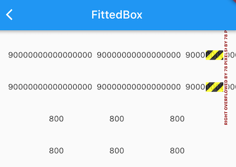

返现 800 正常显示了，但用SingleLineFittedBox包裹的 ' 90000000000000000 ' 的那个 Row 却溢出了！溢出的原因其实也很简单，因为我们在 SingleLineFittedBox 中将传给 Row 的 maxWidth 置为屏幕宽度后，效果和不加SingleLineFittedBox 的效果是一样的，Row 收到父组件约束的 maxWidth 都是屏幕的宽度。但是，只要我们稍加修改，就能实现我们的预期：

```dart
class SingleLineFittedBox extends StatelessWidget {
  const SingleLineFittedBox({Key? key, this.child});
  final Widget? child;

  @override
  Widget build(BuildContext context) {
    return LayoutBuilder(builder: (_, constraints) {
      return FittedBox(
        child: ConstrainedBox(
          constraints: constraints.copyWith(
            maxWidth: double.infinity, //最小宽度（minWidth）约束指定为屏幕宽度，就不会出现缩在一起的情况
            minWidth: constraints.maxWidth, //maxWidth 指定为无限大，就可以处理数字总长度超出屏幕宽度的情况
          ),
          child: child,
        ),
      );
    });
  }
}
```

代码很简单，我们将最小宽度（minWidth）约束指定为屏幕宽度，因为Row必须得遵守父组件的约束，所以 Row 的宽度至少等于屏幕宽度，所以就不会出现缩在一起的情况；同时我们将 maxWidth 指定为无限大，则就可以处理数字总长度超出屏幕宽度的情况。

重新运行后如图所示：

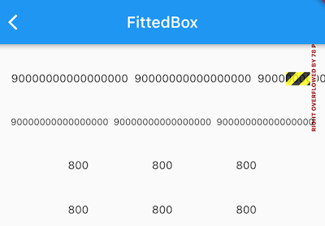

发现无论长数字还是短数字，我们的SingleLineFittedBox 都可以正常工作，大功告成！

## 页面骨架（Scaffold）

Material 组件库提供了丰富多样的组件，本节介绍一下最常用的 Scaffold 组件，其余的大家可以自行查看文档或 Flutter Gallery 中 Material 组件部分的示例。

### Scaffold

一个完整的路由页可能会包含导航栏、抽屉菜单(Drawer)以及底部 Tab 导航菜单等。如果每个路由页面都需要开发者自己手动去实现这些，这会是一件非常麻烦且无聊的事。幸运的是，Flutter Material 组件库提供了一些现成的组件来减少我们的开发任务。`Scaffold` 是一个路由页的骨架，我们使用它可以很容易地拼装出一个完整的页面。

**实例**

我们实现一个页面，它包含：

1. 一个导航栏
2. 导航栏右边有一个分享按钮
3. 有一个抽屉菜单
4. 有一个底部导航
5. 右下角有一个悬浮的动作按钮

最终效果如图所示：


实现代码如下：

```dart
class ScaffoldRoute extends StatefulWidget {
  const ScaffoldRoute({Key? key});

  @override
  State<ScaffoldRoute> createState() => _ScaffoldRouteState();
}

class _ScaffoldRouteState extends State<ScaffoldRoute> {
  int _selectedIndex = 1;

  @override
  Widget build(BuildContext context) {
    return Scaffold(
      appBar: AppBar(
        //导航栏
        title: Text('App Name'),
        actions: [
          IconButton(onPressed: () {}, icon: Icon(Icons.share)),
        ],
      ),
      //drawer: MyDrawer(), //抽屉
      bottomNavigationBar: BottomNavigationBar(
        // 底部导航
        items: [
          BottomNavigationBarItem(icon: Icon(Icons.home), label: 'Home'),
          BottomNavigationBarItem(
              icon: Icon(Icons.business), label: 'Business'),
          BottomNavigationBarItem(icon: Icon(Icons.school), label: 'School'),
        ],
        currentIndex: _selectedIndex,
        onTap: _onItemTapped,
      ),
      floatingActionButton: FloatingActionButton(
        //悬浮按钮
        child: Icon(Icons.add),
        onPressed: () {},
      ),
    );
  }

  void _onItemTapped(int index) {
    setState(() => _selectedIndex = index);
  }
}
```

上面代码中我们用到了如下组件：

| 组件名称             | 解释           |
| -------------------- | -------------- |
| AppBar               | 一个导航栏骨架 |
| MyDrawer             | 抽屉菜单       |
| BottomNavigationBar  | 底部导航栏     |
| FloatingActionButton | 漂浮按钮       |

下面我们来分别介绍一下它们。

### AppBar

`AppBar`是一个Material风格的导航栏，通过它可以设置导航栏标题、导航栏菜单、导航栏底部的Tab标题等。下面我们看看AppBar的定义：

```dart
AppBar({
  Key? key,
  this.leading, //导航栏最左侧Widget，常见为抽屉菜单按钮或返回按钮。
  this.automaticallyImplyLeading = true, //如果leading为null，是否自动实现默认的leading按钮
  this.title,// 页面标题
  this.actions, // 导航栏右侧菜单
  this.bottom, // 导航栏底部菜单，通常为Tab按钮组
  this.elevation = 4.0, // 导航栏阴影
  this.centerTitle, //标题是否居中 
  this.backgroundColor,
  ...   //其他属性见源码注释
})
```

如果给`Scaffold`添加了抽屉菜单，默认情况下`Scaffold`会自动将`AppBar`的`leading`设置为菜单按钮（如上面截图所示），点击它便可打开抽屉菜单。如果我们想自定义菜单图标，可以手动来设置`leading`，如：

```dart
Scaffold(
  appBar: AppBar(
    title: Text("App Name"),
    leading: Builder(builder: (context) {
      return IconButton(
        icon: Icon(Icons.dashboard, color: Colors.white), //自定义图标
        onPressed: () {
          // 打开抽屉菜单  
          Scaffold.of(context).openDrawer(); 
        },
      );
    }),
    ...  
  )  
```

代码运行效果如图所示：


可以看到左侧菜单已经替换成功。

代码中打开抽屉菜单的方法在`ScaffoldState`中，通过`Scaffold.of(context)`可以获取父级最近的`Scaffold` 组件的`State`对象。

### 抽屉菜单Drawer

`Scaffold`的`drawer`和`endDrawer`属性可以分别接受一个Widget来作为页面的左、右抽屉菜单。如果开发者提供了抽屉菜单，那么当用户手指从屏幕左（或右）侧向里滑动时便可打开抽屉菜单。本节开始部分的示例中实现了一个左抽屉菜单`MyDrawer`，它的源码如下：

```dart
class MyDrawer extends StatelessWidget {
  const MyDrawer({Key? key});

  @override
  Widget build(BuildContext context) {
    return Drawer(
      child: MediaQuery.removePadding(
        context: context,
        removeTop: true, //移除抽屉菜单顶部默认留白
        child: Column(
          children: [
            Padding(
              padding: EdgeInsets.only(top: 38.0),
              child: Row(
                children: [
                  Padding(
                    padding: EdgeInsets.symmetric(horizontal: 16.0),
                    child: ClipOval(
                      child: Image.asset(
                        'assets/images/avatar.jpeg',
                        width: 80.0,
                        height: 80.0,
                        fit: BoxFit.cover,
                      ),
                    ),
                  ),
                  Text(
                    'Wendux',
                    style: TextStyle(
                      fontWeight: FontWeight.bold,
                    ),
                  ),
                ],
              ),
            ),
            Expanded(
              child: ListView(
                children: [
                  ListTile(
                    leading: Icon(Icons.add),
                    title: Text('Add account'),
                  ),
                  ListTile(
                    leading: Icon(Icons.settings),
                    title: Text('Manage accounts'),
                  ),
                ],
              ),
            ),
          ],
        ),
      ),
    );
  }
}
```

抽屉菜单通常将`Drawer`组件作为根节点，它实现了Material风格的菜单面板，`MediaQuery.removePadding`可以移除Drawer默认的一些留白（比如Drawer默认顶部会留和手机状态栏等高的留白），大家可以尝试传递不同的参数来看看实际效果。抽屉菜单页由顶部和底部组成，顶部由用户头像和昵称组成，底部是一个菜单列表，用ListView实现，关于ListView我们将在后面“可滚动组件”一节详细介绍。

### FloatingActionButton

`FloatingActionButton`是Material设计规范中的一种特殊Button，通常悬浮在页面的某一个位置作为某种常用动作的快捷入口，如本节示例中页面右下角的"➕"号按钮。我们可以通过`Scaffold`的`floatingActionButton`属性来设置一个`FloatingActionButton`，同时通过`floatingActionButtonLocation`属性来指定其在页面中悬浮的位置，这个比较简单，不再赘述。

### 底部Tab导航栏

我们可以通过`Scaffold`的`bottomNavigationBar`属性来设置底部导航，如本节开始示例所示，我们通过Material组件库提供的`BottomNavigationBar`和`BottomNavigationBarItem`两种组件来实现Material风格的底部导航栏。可以看到上面的实现代码非常简单，所以不再赘述，但是如果我们想实现如下图所示效果的底部导航栏应该怎么做呢？


Material组件库中提供了一个`BottomAppBar` 组件，它可以和`FloatingActionButton`配合实现这种“打洞”效果，源码如下：

```dart
bottomNavigationBar: BottomAppBar(
  color: Colors.white,
  shape: CircularNotchedRectangle(), // 底部导航栏打一个圆形的洞
  child: Row(
    children: [
      IconButton(icon: Icon(Icons.home)),
      SizedBox(), //中间位置空出
      IconButton(icon: Icon(Icons.business)),
    ],
    mainAxisAlignment: MainAxisAlignment.spaceAround, //均分底部导航栏横向空间
  ),
)
```

可以看到，上面代码中没有控制打洞位置的属性，实际上，打洞的位置取决于`FloatingActionButton`的位置，上面`FloatingActionButton`的位置为：

```dart
floatingActionButtonLocation: FloatingActionButtonLocation.centerDocked,
```

所以打洞位置在底部导航栏的正中间。

`BottomAppBar`的`shape`属性决定洞的外形，`CircularNotchedRectangle`实现了一个圆形的外形，我们也可以自定义外形，比如，Flutter Gallery示例中就有一个“钻石”形状的示例，读者感兴趣可以自行查看。

### 页面 body

最后就是页面的 Body 部分了，Scaffold 有一个 `body` 属性，接收一个 Widget，我们可以传任意的 Widget ，在下一章中，我们会介绍 TabBarView，它是一个可以进行页面切换的组件，在多 Tab 的 App 中，一般都会将 TabBarView 作为 Scaffold 的 Body。


# 可滚动组件

## 可滚动组件简介

### Sliver布局模型

我们前面介绍过Flutter 有两种布局模型：

- 基于 RenderBox 的盒模型布局。
- 基于 Sliver ( RenderSliver ) 按需加载列表布局。

之前我们主要介绍了盒模型布局组件，本章我们重点介绍基于Sliver的布局组件。

通常可滚动组件的子组件可能会非常多、占用的总高度也会非常大；如果要一次性将子组件全部构建出将会非常昂贵！为此，Flutter中提出一个Sliver（中文为“薄片”的意思）概念，Sliver 可以包含一个或多个子组件。Sliver 的主要作用是配合：加载子组件并确定每一个子组件的布局和绘制信息，如果 Sliver 可以包含多个子组件时，通常会实现按需加载模型。

只有当 Sliver 出现在视口中时才会去构建它，这种模型也称为“基于Sliver的列表按需加载模型”。可滚动组件中有很多都支持基于Sliver的按需加载模型，如`ListView`、`GridView`，但是也有不支持该模型的，如`SingleChildScrollView`。

> 约定：后面如果我们说一个组件是Sliver 则表示它是基于Sliver布局的组件，同理，说一个组件是 RenderBox，则代表它是基于盒模型布局的组件，并不是说它就是 RenderBox 类的实例。

Flutter 中的可滚动主要由三个角色组成：Scrollable、Viewport 和 Sliver：

- Scrollable ：用于处理滑动手势，确定滑动偏移，滑动偏移变化时构建 Viewport 。
- Viewport：显示的视窗，即列表的可视区域；
- Sliver：视窗里显示的元素。

具体布局过程：

1. Scrollable 监听到用户滑动行为后，根据最新的滑动偏移构建 Viewport 。
2. Viewport 将当前视口信息和配置信息通过 SliverConstraints 传递给 Sliver。
3. Sliver 中对子组件（RenderBox）按需进行构建和布局，然后确认自身的位置、绘制等信息，保存在 geometry 中（一个 SliverGeometry 类型的对象）。

比如有一个 ListView，大小撑满屏幕，假设它有 100 个列表项（都是RenderBox）且每个列表项高度相同，结构如图所示：


图中白色区域为设备屏幕，也是 Scrollable 、 Viewport 和 Sliver 所占用的空间，三者所占用的空间重合，父子关系为：Sliver 父组件为 Viewport，Viewport的 父组件为 Scrollable 。注意ListView 中只有一个 Sliver，在 Sliver 中实现了子组件（列表项）的按需加载和布局。

其中顶部和底部灰色的区域为 cacheExtent，它表示预渲染的高度，需要注意这是在可视区域之外，如果 RenderBox 进入这个区域内，即使它还未显示在屏幕上，也是要先进行构建的，预渲染是为了后面进入 Viewport 的时候更丝滑。cacheExtent 的默认值是 250，在构建可滚动列表时我们可以指定这个值，这个值最终会传给 Viewport。

### Scrollable

用于处理滑动手势，确定滑动偏移，滑动偏移变化时构建 Viewport，我们看一下其关键的属性：

```dart
Scrollable({
  ...
  this.axisDirection = AxisDirection.down,
  this.controller,
  this.physics,
  required this.viewportBuilder, //后面介绍
})
```

- `axisDirection` 滚动方向。
- `physics`：此属性接受一个`ScrollPhysics`类型的对象，它决定可滚动组件如何响应用户操作，比如用户滑动完抬起手指后，继续执行动画；或者滑动到边界时，如何显示。默认情况下，Flutter会根据具体平台分别使用不同的`ScrollPhysics`对象，应用不同的显示效果，如当滑动到边界时，继续拖动的话，在 iOS 上会出现弹性效果，而在 Android 上会出现微光效果。如果你想在所有平台下使用同一种效果，可以显式指定一个固定的`ScrollPhysics`，Flutter SDK中包含了两个`ScrollPhysics`的子类，他们可以直接使用：
  - `ClampingScrollPhysics`：列表滑动到边界时将不能继续滑动，通常在Android 中 配合 `GlowingOverscrollIndicator`（实现微光效果的组件） 使用。
  - `BouncingScrollPhysics`：iOS 下弹性效果。

- `controller`：此属性接受一个`ScrollController`对象。`ScrollController`的主要作用是控制滚动位置和监听滚动事件。默认情况下，Widget树中会有一个默认的`PrimaryScrollController`，如果子树中的可滚动组件没有显式的指定`controller`，并且`primary`属性值为`true`时（默认就为`true`），可滚动组件会使用这个默认的`PrimaryScrollController`。这种机制带来的好处是父组件可以控制子树中可滚动组件的滚动行为，例如，`Scaffold`正是使用这种机制在iOS中实现了点击导航栏回到顶部的功能。我们将在本章后面“滚动控制”一节详细介绍`ScrollController`。
- `viewportBuilder`：构建 Viewport 的回调。当用户滑动时，Scrollable 会调用此回调构建新的 Viewport，同时传递一个 ViewportOffset 类型的 offset 参数，该参数描述 Viewport 应该显示那一部分内容。注意重新构建 Viewport 并不是一个昂贵的操作，因为 Viewport 本身也是 Widget，只是配置信息，Viewport 变化时对应的 RenderViewport 会更新信息，并不会随着 Widget 进行重新构建。

**主轴和纵轴**

在可滚动组件的坐标描述中，通常将滚动方向称为主轴，非滚动方向称为纵轴。由于可滚动组件的默认方向一般都是沿垂直方向，所以默认情况下主轴就是指垂直方向，水平方向同理。

### Viewport

Viewport 比较简单，用于渲染当前视口中需要显示 的Sliver。

```dart
Viewport({
  Key? key,
  this.axisDirection = AxisDirection.down,
  this.crossAxisDirection,
  this.anchor = 0.0,
  required ViewportOffset offset, // 用户的滚动偏移
  // 类型为Key，表示从什么地方开始绘制，默认是第一个元素
  this.center,
  this.cacheExtent, // 预渲染区域
  //该参数用于配合解释cacheExtent的含义，也可以为主轴长度的乘数
  this.cacheExtentStyle = CacheExtentStyle.pixel, 
  this.clipBehavior = Clip.hardEdge,
  List<Widget> slivers = const <Widget>[], // 需要显示的 Sliver 列表
})
```

需要注意的是：

- offset：该参数为Scrollabel 构建 Viewport 时传入，它描述了 Viewport 应该显示哪一部分内容。
- cacheExtent 和 cacheExtentStyle：CacheExtentStyle 是一个枚举，有 pixel 和 viewport 两个取值。当 cacheExtentStyle 值为 pixel 时，cacheExtent 的值为预渲染区域的具体像素长度；当值为 viewport 时，cacheExtent 的值是一个乘数，表示有几个 viewport 的长度，最终的预渲染区域的像素长度为：cacheExtent * viewport 的积， 这在每一个列表项都占满整个 Viewport 时比较实用，这时 cacheExtent 的值就表示前后各缓存几个页面。

### Sliver

Sliver 主要作用是对子组件进行构建和布局，比如 ListView 的 Sliver 需要实现子组件（列表项）按需加载功能，只有当列表项进入预渲染区域时才会去对它进行构建和布局、渲染。

Sliver 对应的渲染对象类型是 RenderSliver，RenderSliver 和 RenderBox 的相同点是都继承自 RenderObject 类，不同点是在布局的时候约束信息不同。RenderBox 在布局时父组件传递给它的约束信息对应的是 `BoxConstraints`，只包含最大宽高的约束；而 RenderSliver 在布局时父组件（列表）传递给它的约束是对应的是 `SliverConstraints`。关于 Sliver 的布局协议，我们将在本章最后一节中介绍。

### 可滚动组件的通用配置

几乎所有的可滚动组件在构造时都能指定 `scrollDirection`（滑动的主轴）、`reverse`（滑动方向是否反向）、`controller`、`physics` 、`cacheExtent` ，这些属性最终会透传给对应的 Scrollable 和 Viewport，这些属性我们可以认为是可滚动组件的通用属性，后续再介绍具体的可滚动组件时将不再赘述。

> `reverse`表示是否按照阅读方向相反的方向滑动，如：`scrollDirection`值为`Axis.horizontal` 时，即滑动发现为水平，如果阅读方向是从左到右（取决于语言环境，阿拉伯语就是从右到左）。`reverse`为`true`时，那么滑动方向就是从右往左。

### ScrollController

可滚动组件都有一个 controller 属性，通过该属性我们可以指定一个 ScrollController 来控制可滚动组件的滚动，比如可以通过ScrollController来同步多个组件的滑动联动。由于 ScrollController 是需要结合可滚动组件一起工作，所以本章中，我们会在介绍完 ListView 后详细介绍 ScrollController。

### 子节点缓存

按需加载子组件在大多数场景中都能有正收益，但是有些时候也会有副作用。比如有一个页面，它由一个ListView 组成，我们希望在页面顶部显示一块内容， 这部分内容的数据需要在每次页面打开时通过网络来获取，为此我们通过一个 Header 组件来实现，它是一个 StatefulWidget ，会在`initState` 中请求网络数据，然后将它作为 ListView 的第一个孩子。现在问题来了，因为 ListView 是按需加载子节点的，这意味着如果 Header 滑出 Viewport 的预渲染区域之外时就会被销毁，重新滑入后又会被重新构建，这样就会发起多次网络请求，不符合我们期望，我们预期是Header能够缓存不销毁。

综上，为了方便控制子组件在滑出可视区域后是否缓存，可滚动组件提供了一种缓存子节点的通用解决方案，它允许开发者对特定的子界限进行缓存，这个我们将在后面小节中详细介绍。

### Scrollbar

`Scrollbar`是一个Material风格的滚动指示器（滚动条），如果要给可滚动组件添加滚动条，只需将`Scrollbar`作为可滚动组件的任意一个父级组件即可，如：

```dart
Scrollbar(
  child: SingleChildScrollView(
    ...
  ),
);
```

`Scrollbar`和`CupertinoScrollbar`都是通过监听滚动通知来确定滚动条位置的。关于的滚动通知的详细内容我们将在本章最后一节中专门介绍。

### CupertinoScrollbar

`CupertinoScrollbar`是 iOS 风格的滚动条，如果你使用的是`Scrollbar`，那么在iOS平台它会自动切换为`CupertinoScrollbar`。

## SingleChildScrollView

### 简介

`SingleChildScrollView`类似于Android中的`ScrollView`，它只能接收一个子组件，定义如下：

```dart
SingleChildScrollView({
  this.scrollDirection = Axis.vertical, //滚动方向，默认是垂直方向
  this.reverse = false, 
  this.padding, 
  bool primary, 
  this.physics, 
  this.controller,
  this.child,
})
```

除了上一节我们介绍过的可滚动组件的通用属性外，我们重点介绍下`primary`属性：它表示是否使用 widget 树中默认的`PrimaryScrollController`（MaterialApp 组件树中已经默认包含一个 PrimaryScrollController 了）；当滑动方向为垂直方向（`scrollDirection`值为`Axis.vertical`）并且没有指定`controller`时，`primary`默认为`true`。

需要注意的是，**通常`SingleChildScrollView`只应在期望的内容不会超过屏幕太多时使用**，这是因为`SingleChildScrollView`不支持基于 Sliver 的延迟加载模型，所以如果预计视口可能包含超出屏幕尺寸太多的内容时，那么使用`SingleChildScrollView`将会非常昂贵（性能差），此时应该使用一些支持Sliver延迟加载的可滚动组件，如`ListView`。

### 实例

下面是一个将大写字母 A-Z 沿垂直方向显示的例子，由于垂直方向空间会超过屏幕视口高度，所以我们使用`SingleChildScrollView`：

```dart
class SingleChildScrollViewTestRoute extends StatelessWidget {
  const SingleChildScrollViewTestRoute({Key? key});

  @override
  Widget build(BuildContext context) {
    String str = 'ABCDEFGHIJKLMNOPQRSTUVWXYZ';
    return Scrollbar(
      child: SingleChildScrollView(
        padding: EdgeInsets.all(16.0),
        child: Center(
          child: Column(
            //动态创建一个List<Widget>
            children: str
                .split("")
                //每一个字母都用一个Text显示,字体为原来的两倍
                .map((e) => Text(
                      e,
                      textScaleFactor: 2.0,
                    ))
                .toList(),
          ),
        ),
      ),
    );
  }
}

void main(List<String> args) {
  runApp(
    MaterialApp(
      title: 'My app',
      home: Scaffold(
        appBar: AppBar(
          title: Text('SingleChildScrollView'),
        ),
        body: SingleChildScrollViewTestRoute(),
      ),
    ),
  );
}
```

运行效果如图所示：


## ListView

`ListView`是最常用的可滚动组件之一，它可以沿一个方向线性排布所有子组件，并且它也支持列表项懒加载（在需要时才会创建）。

### 默认构造函数

我们看看ListView的默认构造函数定义：

```dart
ListView({
  ...  
  //可滚动widget公共参数
  Axis scrollDirection = Axis.vertical,
  bool reverse = false,
  ScrollController? controller,
  bool? primary,
  ScrollPhysics? physics,
  EdgeInsetsGeometry? padding,
  
  //ListView各个构造函数的共同参数  
  double? itemExtent,
  Widget? prototypeItem, //列表项原型，后面解释
  bool shrinkWrap = false,
  bool addAutomaticKeepAlives = true,
  bool addRepaintBoundaries = true,
  double? cacheExtent, // 预渲染区域长度
    
  //子widget列表
  List<Widget> children = const <Widget>[],
})
```

上面参数分为两组：第一组是可滚动组件的公共参数，本章第一节中已经介绍过，不再赘述；第二组是`ListView`各个构造函数（`ListView`有多个构造函数）的共同参数，我们重点来看看这些参数：

- `itemExtent`：该参数如果不为`null`，则会强制`children`的“长度”为`itemExtent`的值；这里的“长度”是指滚动方向上子组件的长度，也就是说如果滚动方向是垂直方向，则`itemExtent`代表子组件的高度；如果滚动方向为水平方向，则`itemExtent`就代表子组件的宽度。在`ListView`中，指定`itemExtent`比让子组件自己决定自身长度会有更好的性能，这是因为指定`itemExtent`后，滚动系统可以提前知道列表的长度，而无需每次构建子组件时都去再计算一下，尤其是在滚动位置频繁变化时（滚动系统需要频繁去计算列表高度）。
- `prototypeItem`：如果我们知道列表中的所有列表项长度都相同但不知道具体是多少，这时我们可以指定一个列表项，该列表项被称为 `prototypeItem`（列表项原型）。指定 `prototypeItem` 后，可滚动组件会在 layout 时计算一次它延主轴方向的长度，这样也就预先知道了所有列表项的延主轴方向的长度，所以和指定 `itemExtent` 一样，指定 `prototypeItem` 会有更好的性能。注意，`itemExtent` 和`prototypeItem` 互斥，不能同时指定它们。
- `shrinkWrap`：该属性表示是否根据子组件的总长度来设置`ListView`的长度，默认值为`false` 。默认情况下，`ListView`会在滚动方向尽可能多的占用空间。当`ListView`在一个无边界(滚动方向上)的容器中时，`shrinkWrap`必须为`true`。
- `addAutomaticKeepAlives`：该属性我们将在介绍 PageView 组件时详细解释。
- `addRepaintBoundaries`：该属性表示是否将列表项（子组件）包裹在`RepaintBoundary`组件中。`RepaintBoundary` 读者可以先简单理解为它是一个”绘制边界“，将列表项包裹在`RepaintBoundary`中可以避免列表项不必要的重绘，但是当列表项重绘的开销非常小（如一个颜色块，或者一个较短的文本）时，不添加`RepaintBoundary`反而会更高效（具体原因会在本书后面 Flutter 绘制原理相关章节中介绍）。如果列表项自身来维护是否需要添加绘制边界组件，则此参数应该指定为 false。

默认构造函数有一个`children`参数，它接受一个Widget列表（List\<Widget\>）。这种方式适合只有少量的子组件数量已知且比较少的情况，反之则应该使用`ListView.builder` 按需动态构建列表项。

> 注意：虽然这种方式将所有children一次性传递给 ListView，但子组件）仍然是在需要时才会加载（build（如有）、布局、绘制），也就是说通过默认构造函数构建的 ListView 也是基于 Sliver 的列表懒加载模型。

下面是一个例子：

```dart
ListView(
  shrinkWrap: true, // ListView 高度为元素总高度
  padding: EdgeInsets.all(20.0),
  children: [
    const Text('I\'m dedicating every day to you'),
    const Text('Domestic life was never quite my style'),
    const Text('When you smile, you knock me out, I fall apart'),
    const Text('And I thought I was so smart'),
  ],
)
```

可以看到，虽然使用默认构造函数创建的列表也是懒加载的，但我们还是需要提前将 Widget 创建好，等到真正需要加载的时候才会对 Widget 进行布局和绘制。

### ListView.builder

`ListView.builder`适合列表项比较多或者列表项不确定的情况，下面看一下`ListView.builder`的核心参数列表：

```dart
ListView.builder({
  // ListView公共参数已省略  
  ...
  required IndexedWidgetBuilder itemBuilder,
  int itemCount,
  ...
})
```

- `itemBuilder`：它是列表项的构建器，类型为`IndexedWidgetBuilder`，返回值为一个widget。当列表滚动到具体的`index`位置时，会调用该构建器构建列表项。
- `itemCount`：列表项的数量，如果为`null`，则为无限列表。

下面看一个例子：

```dart
ListView.builder(
  itemCount: 100, // 元素个数
  itemExtent: 50.0, // 元素的高度
  itemBuilder: (BuildContext context, int index) {
    return ListTile(title: Text('$index'));
  },
)
```

运行效果如图所示：


### ListView.separated

`ListView.separated`可以在生成的列表项之间添加一个分割组件，它比`ListView.builder`多了一个`separatorBuilder`参数，该参数是一个分割组件生成器。

下面我们看一个例子：奇数行添加一条蓝色下划线，偶数行添加一条绿色下划线。

```dart
class ListView3 extends StatelessWidget {
  const ListView3({Key? key});

  @override
  Widget build(BuildContext context) {
    Widget divider1 = Divider(color: Colors.blue);
    Widget divider2 = Divider(color: Colors.green);
    return ListView.separated(
      //列表项构造器
      itemBuilder: (BuildContext context, int index) {
        return ListTile(title: Text('$index'));
      },
      //分割器构造器
      separatorBuilder: (BuildContext context, int index) {
        return index % 2 == 0 ? divider1 : divider2;
      },
      itemCount: 100,
    );
  }
}
```

运行效果如图所示：


### 固定高度列表

前面说过，给列表指定 `itemExtent` 或 `prototypeItem` 会有更高的性能，**所以当我们知道列表项的高度都相同时，强烈建议指定 `itemExtent` 或 `prototypeItem`** 。下面看一个示例：

```dart
class FixedExtentList extends StatelessWidget {
  const FixedExtentList({Key? key});

  @override
  Widget build(BuildContext context) {
    return ListView.builder(
      prototypeItem: ListTile(title: Text('1')),
      //itemExtent: 56,
      itemBuilder: (context, index) {
        //LayoutLogPrint是一个自定义组件，在布局时可以打印当前上下文中父组件给子组件的约束信息
        return LayoutLogPrint(
          tag: index,
          child: ListTile(title: Text('$index')),
        );
      },
      itemCount: 100,
    );
  }
}
```

因为列表项都是一个 ListTile，高度相同，但是我们不知道 ListTile 的高度是多少，所以指定了`prototypeItem` ，运行后，控制台打印：

```
flutter: 0: BoxConstraints(w=428.0, h=56.0)
flutter: 1: BoxConstraints(w=428.0, h=56.0)
flutter: 2: BoxConstraints(w=428.0, h=56.0)
...
```

可见 ListTile 的高度是 56 ，所以我们指定 `itemExtent` 为 56也是可以的。但是笔者还是建议优先指定原型，这样的话在列表项布局修改后，仍然可以正常工作（前提是每个列表项的高度相同）。

如果本例中不指定 `itemExtent` 或 `prototypeItem` ，我们看看控制台日志信息：

```
flutter: 0: BoxConstraints(w=428.0, 0.0<=h<=Infinity)
flutter: 1: BoxConstraints(w=428.0, 0.0<=h<=Infinity)
flutter: 2: BoxConstraints(w=428.0, 0.0<=h<=Infinity)
...
```

可以发现，列表不知道列表项的具体高度，高度约束变为 0.0 到 Infinity。

### ListView 原理

ListView 内部组合了 Scrollable、Viewport 和 Sliver，需要注意：

1. ListView 中的列表项组件都是 RenderBox，**并不是 Sliver**， 这个一定要注意。
2. 一个 ListView 中只有一个Sliver，对列表项进行按需加载的逻辑是 Sliver 中实现的。
3. ListView 的 Sliver 默认是 SliverList，如果指定了 `itemExtent` ，则会使用 SliverFixedExtentList；如果 `prototypeItem` 属性不为空，则会使用 SliverPrototypeExtentList，无论是是哪个，都实现了子组件的按需加载模型。

### 实例：无限加载列表

假设我们要从数据源异步分批拉取一些数据，然后用`ListView`展示，当我们滑动到列表末尾时，判断是否需要再去拉取数据，如果是，则去拉取，拉取过程中在表尾显示一个loading，拉取成功后将数据插入列表；如果不需要再去拉取，则在表尾提示"没有更多"。代码如下：

```dart
class InfiniteListView extends StatefulWidget {
  const InfiniteListView({Key? key});

  @override
  State<InfiniteListView> createState() => _InfiniteListViewState();
}

class _InfiniteListViewState extends State<InfiniteListView> {
  static const loadingTag = '##loading##'; //表尾标记
  var _words = <String>[loadingTag];

  @override
  void initState() {
    super.initState();
    _retrieveData();
  }

  @override
  Widget build(BuildContext context) {
    return ListView.separated(
      itemCount: _words.length,
      itemBuilder: (context, index) {
        //如果到了表尾
        if (_words[index] == loadingTag) {
          //不足100条，继续获取数据
          if (_words.length - 1 < 100) {
            //获取数据
            _retrieveData();
            //加载时显示loading
            return Container(
              padding: const EdgeInsets.all(16.0),
              alignment: Alignment.center,
              child: SizedBox(
                width: 24.0,
                height: 24.0,
                child: CircularProgressIndicator(strokeWidth: 2.0),
              ),
            );
          } else {
            //已经加载了100条数据，不再获取数据。
            return Container(
              alignment: Alignment.center,
              padding: EdgeInsets.all(16.0),
              child: Text('没有更多了', style: TextStyle(color: Colors.grey)),
            );
          }
        }
        // 没有到表尾，构建Text组件并返回
        return ListTile(title: Text(_words[index]));
      },
      separatorBuilder: (context, index) => Divider(height: .0),
    );
  }

  void _retrieveData() {
    Future.delayed(Duration(seconds: 2)).then((e) {
      setState(() {
        //重新构建列表
        _words.insertAll(
          _words.length - 1,
          //每次生成20个单词
          generateWordPairs().take(20).map((e) => e.asPascalCase).toList(),
        );
      });
    });
  }
}
```

运行后效果如图所示：

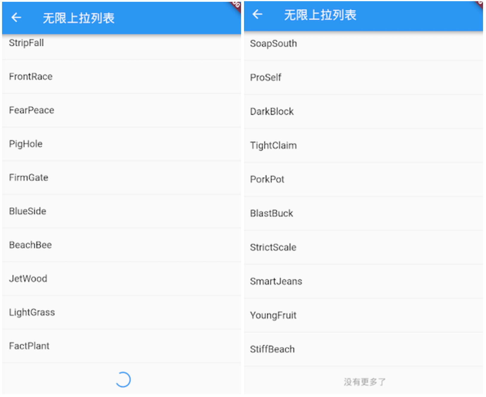

代码比较简单，读者可以参照代码中的注释理解，故不再赘述。需要说明的是，`_retrieveData()`的功能是模拟从数据源异步获取数据，我们使用english_words包的`generateWordPairs()`方法每次生成20个单词。

```yaml
dependencies:
  english_words: ^4.0.0 // english_words依赖
```

### 添加固定列表头

很多时候我们需要给列表添加一个固定表头，比如我们想实现一个商品列表，需要在列表顶部添加一个“商品列表”标题，期望的效果如图 所示：


我们按照之前经验，写出如下代码：

```dart
class ListView4 extends StatelessWidget {
  const ListView4({Key? key});

  @override
  Widget build(BuildContext context) {
    return Column(
      children: [
        ListTile(
          title: Text('商品列表'),
        ),
        ListView.builder(
          itemBuilder: (BuildContext context, int index) {
            return ListTile(title: Text('$index'));
          },
          itemCount: 100,
        ),
      ],
    );
  }
}
```

然后运行，发现并没有出现我们期望的效果，相反触发了一个异常；

```
Error caught by rendering library, thrown during performResize()。
Vertical viewport was given unbounded height ...
```

从异常信息中我们可以看到是因为`ListView`高度边界无法确定引起，所以解决的办法也很明显，我们需要给`ListView`指定边界，我们通过`SizedBox`指定一个列表高度看看是否生效：

```dart
class ListView4 extends StatelessWidget {
  const ListView4({Key? key});

  @override
  Widget build(BuildContext context) {
    return Column(
      children: [
        ListTile(
          title: Text('商品列表'),
        ),
        SizedBox(
          height: 400, //指定列表高度为400
          child: ListView.builder(
            itemBuilder: (BuildContext context, int index) {
              return ListTile(title: Text('$index'));
            },
            itemCount: 100,
          ),
        ),
      ],
    );
  }
}
```

运行效果如图所示：


可以看到，现在没有触发异常并且列表已经显示出来了，但是我们的手机屏幕高度要大于 400，所以底部会有一些空白。那如果我们要实现列表铺满除表头以外的屏幕空间应该怎么做？直观的方法是我们去动态计算，用屏幕高度减去状态栏、导航栏、表头的高度即为剩余屏幕高度，代码如下：

```dart
SizedBox(
  //Material设计规范中状态栏、导航栏、ListTile高度分别为24、56、56 
  height: MediaQuery.of(context).size.height-24-56-56,
  child: ListView.builder(itemBuilder: (BuildContext context, int index) {
    return ListTile(title: Text("$index"));
  }),
)
```

运行效果如下图所示：


可以看到，我们期望的效果实现了，但是这种方法并不优雅，如果页面布局发生变化，比如表头布局调整导致表头高度改变，那么剩余空间的高度就得重新计算。那么有什么方法可以自动拉伸`ListView`以填充屏幕剩余空间的方法吗？当然有！答案就是`Flex`。前面已经介绍过在弹性布局中，可以使用`Expanded`自动拉伸组件大小，并且我们也说过`Column`是继承自`Flex`的，所以我们可以直接使用`Column` + `Expanded`来实现，代码如下：

```dart
class ListView4 extends StatelessWidget {
  const ListView4({Key? key});

  @override
  Widget build(BuildContext context) {
    return Column(
      children: [
        ListTile(
          title: Text('商品列表'),
        ),
        Expanded(
          child: ListView.builder(
            itemBuilder: (BuildContext context, int index) {
              return ListTile(title: Text('$index'));
            },
            itemCount: 100,
          ),
        ),
      ],
    );
  }
}
```

运行后，和上图一样，完美实现了！

## 滚动监听及控制

在前几节中，我们介绍了Flutter中常用的可滚动组件，也说过可以用`ScrollController`来控制可滚动组件的滚动位置，本节先介绍一下`ScrollController`，然后以`ListView`为例，展示一下`ScrollController`的具体用法。最后，再介绍一下路由切换时如何来保存滚动位置。

### ScrollController

`ScrollController`构造函数如下：

```dart
ScrollController({
  double initialScrollOffset = 0.0, //初始滚动位置
  this.keepScrollOffset = true,//是否保存滚动位置
  ...
})
```

我们介绍一下`ScrollController`常用的属性和方法：

- `offset`：可滚动组件当前的滚动位置。
- `jumpTo(double offset)`、`animateTo(double offset,...)`：这两个方法用于跳转到指定的位置，它们不同之处在于，后者在跳转时会执行一个动画，而前者不会。

`ScrollController`还有一些属性和方法，我们将在后面原理部分解释

#### 滚动监听

`ScrollController`间接继承自`Listenable`，我们可以根据`ScrollController`来监听滚动事件，如：

```dart
controller.addListener(()=>print(controller.offset))
```

#### 实例

我们创建一个`ListView`，当滚动位置发生变化时，我们先打印出当前滚动位置，然后判断当前位置是否超过1000像素，如果超过则在屏幕右下角显示一个“返回顶部”的按钮，该按钮点击后可以使ListView恢复到初始位置；如果没有超过1000像素，则隐藏“返回顶部”按钮。代码如下：

```dart
class ScrollControllerTestRoute extends StatefulWidget {
  const ScrollControllerTestRoute({Key? key});

  @override
  State<ScrollControllerTestRoute> createState() =>
      _ScrollControllerTestRouteState();
}

class _ScrollControllerTestRouteState extends State<ScrollControllerTestRoute> {
  ScrollController _controller = ScrollController();
  bool showToTopBtn = false; //是否显示“返回到顶部”按钮

  @override
  void initState() {
    super.initState();
    //监听滚动事件，打印滚动位置
    _controller.addListener(() {
      print(_controller.offset); //打印滚动位置
      // 滑动范围小于1000，隐藏按钮
      if (_controller.offset < 1000 && showToTopBtn) {
        setState(() {
          showToTopBtn = false;
        });
        // 滑动范围大于1000，显示按钮
      } else if (_controller.offset >= 1000 && !showToTopBtn) {
        setState(() {
          showToTopBtn = true;
        });
      }
    });
  }

  @override
  void dispose() {
    //为了避免内存泄露，需要调用_controller.dispose
    _controller.dispose();
    super.dispose();
  }

  @override
  Widget build(BuildContext context) {
    return Scaffold(
      appBar: AppBar(
        title: Text('滚动控制'),
      ),
      body: Scrollbar(
        child: ListView.builder(
          controller: _controller,
          itemCount: 100,
          itemExtent: 50.0, //列表项高度固定时，显式指定高度是一个好习惯(性能消耗小)
          itemBuilder: (context, index) {
            return ListTile(
              title: Text('$index'),
            );
          },
        ),
      ),
      floatingActionButton: !showToTopBtn
          ? null
          : FloatingActionButton(
              child: Icon(Icons.arrow_upward),
              onPressed: () {
                //返回到顶部时执行动画
                _controller.animateTo(
                  .0,
                  duration: Duration(milliseconds: 200),
                  curve: Curves.ease,
                );
              },
            ),
    );
  }
}
```

代码说明已经包含在注释里，运行效果如图所示：


由于列表项高度为 50 像素，当滑动到第 20 个列表项后，右下角 “返回顶部” 按钮会显示，点击该按钮，ListView 会在返回顶部的过程中执行一个滚动动画，动画时间是 200 毫秒，动画曲线是 `Curves.ease`，关于动画的详细内容我们将在后面“动画”一章中详细介绍。

#### 滚动位置恢复

`PageStorage`是一个用于保存页面(路由)相关数据的组件，它并不会影响子树的UI外观，其实，`PageStorage`是一个功能型组件，它拥有一个存储桶（bucket），子树中的Widget可以通过指定不同的`PageStorageKey`来存储各自的数据或状态。

每次滚动结束，可滚动组件都会将滚动位置`offset`存储到`PageStorage`中，当可滚动组件重新创建时再恢复。如果`ScrollController.keepScrollOffset`为`false`，则滚动位置将不会被存储，可滚动组件重新创建时会使用`ScrollController.initialScrollOffset`；`ScrollController.keepScrollOffset`为`true`时，可滚动组件在**第一次**创建时，会滚动到`initialScrollOffset`处，因为这时还没有存储过滚动位置。在接下来的滚动中就会存储、恢复滚动位置，而`initialScrollOffset`会被忽略。

当一个路由中包含多个可滚动组件时，如果你发现在进行一些跳转或切换操作后，滚动位置不能正确恢复，这时你可以通过显式指定`PageStorageKey`来分别跟踪不同的可滚动组件的位置，如：

```dart
ListView(key: PageStorageKey(1), ... );
...
ListView(key: PageStorageKey(2), ... );
```

> 注意：一个路由中包含多个可滚动组件时，如果要分别跟踪它们的滚动位置，并非一定就得给他们分别提供`PageStorageKey`。这是因为Scrollable本身是一个StatefulWidget，它的状态中也会保存当前滚动位置，所以，只要可滚动组件本身没有被从树上detach掉，那么其State就不会销毁(dispose)，滚动位置就不会丢失。只有当Widget发生结构变化，导致可滚动组件的State销毁或重新构建时才会丢失状态，这种情况就需要显式指定`PageStorageKey`，通过`PageStorage`来存储滚动位置，一个典型的场景是在使用`TabBarView`时，在Tab发生切换时，Tab页中的可滚动组件的State就会销毁，这时如果想恢复滚动位置就需要指定`PageStorageKey`。

#### ScrollPosition

ScrollPosition是用来保存可滚动组件的滚动位置的。一个`ScrollController`对象可以同时被多个可滚动组件使用，`ScrollController`会为每一个可滚动组件创建一个`ScrollPosition`对象，这些`ScrollPosition`保存在`ScrollController`的`positions`属性中（`List<ScrollPosition>`）。`ScrollPosition`是真正保存滑动位置信息的对象，`offset`只是一个便捷属性：

```dart
double get offset => position.pixels;
```

一个`ScrollController`虽然可以对应多个可滚动组件，但是有一些操作，如读取滚动位置`offset`，则需要一对一！但是我们仍然可以在一对多的情况下，通过其他方法读取滚动位置，举个例子，假设一个`ScrollController`同时被两个可滚动组件使用，那么我们可以通过如下方式分别读取他们的滚动位置：

```dart
...
controller.positions.elementAt(0).pixels
controller.positions.elementAt(1).pixels
... 
```

我们可以通过`controller.positions.length`来确定`controller`被几个可滚动组件使用。

**ScrollPosition的方法**

`ScrollPosition`有两个常用方法：`animateTo()` 和 `jumpTo()`，它们是真正来控制跳转滚动位置的方法，`ScrollController`的这两个同名方法，内部最终都会调用`ScrollPosition`的。

#### ScrollController控制原理

我们来介绍一下`ScrollController`的另外三个方法：

```dart
ScrollPosition createScrollPosition(
    ScrollPhysics physics,
    ScrollContext context,
    ScrollPosition oldPosition);
void attach(ScrollPosition position);
void detach(ScrollPosition position);
```

当`ScrollController`和可滚动组件关联时，可滚动组件首先会调用`ScrollController`的`createScrollPosition()`方法来创建一个`ScrollPosition`来存储滚动位置信息，接着，可滚动组件会调用`attach()`方法，将创建的`ScrollPosition`添加到`ScrollController`的`positions`属性中，这一步称为“注册位置”，只有注册后`animateTo()` 和 `jumpTo()`才可以被调用。

当可滚动组件销毁时，会调用`ScrollController`的`detach()`方法，将其`ScrollPosition`对象从`ScrollController`的`positions`属性中移除，这一步称为“注销位置”，注销后`animateTo()` 和 `jumpTo()` 将不能再被调用。

需要注意的是，`ScrollController`的`animateTo()` 和 `jumpTo()`内部会调用所有`ScrollPosition`的`animateTo()` 和 `jumpTo()`，以实现所有和该`ScrollController`关联的可滚动组件都滚动到指定的位置。

### 滚动监听

#### 滚动通知

Flutter Widget树中子Widget可以通过发送通知（Notification）与父(包括祖先)Widget通信。父级组件可以通过`NotificationListener`组件来监听自己关注的通知，这种通信方式类似于Web开发中浏览器的事件冒泡，我们在Flutter中沿用“冒泡”这个术语，关于通知冒泡我们将在后面“事件处理与通知”一章中详细介绍。

可滚动组件在滚动时会发送`ScrollNotification`类型的通知，`ScrollBar`正是通过监听滚动通知来实现的。通过`NotificationListener`监听滚动事件和通过`ScrollController`有两个主要的不同：

1. 通过NotificationListener可以在从可滚动组件到widget树根之间任意位置都能监听。而`ScrollController`只能和具体的可滚动组件关联后才可以。
2. 收到滚动事件后获得的信息不同；`NotificationListener`在收到滚动事件时，通知中会携带当前滚动位置和ViewPort的一些信息，而`ScrollController`只能获取当前滚动位置。

#### 实例

下面，我们监听`ListView`的滚动通知，然后显示当前滚动进度百分比：

```dart
class ScrollNotificationTestRoute extends StatefulWidget {
  const ScrollNotificationTestRoute({Key? key});

  @override
  State<ScrollNotificationTestRoute> createState() =>
      _ScrollNotificationTestRouteState();
}

class _ScrollNotificationTestRouteState
    extends State<ScrollNotificationTestRoute> {
  String _progress = '0%'; //保存进度百分比
  @override
  Widget build(BuildContext context) {
    return Scrollbar(
      // 进度条
      // 监听滚动通知
      child: NotificationListener<ScrollNotification>(
        onNotification: (ScrollNotification notification){
          double progress = notification.metrics.pixels / notification.metrics.maxScrollExtent;
          //重新构建
          setState(() {
            _progress = '${(progress * 100).toInt()}%';
          });
          print("BottomEdge: ${notification.metrics.extentAfter == 0}");
          return false;
          //return true; //放开此行注释后，进度条将失效
        },
        child: Stack(
          alignment: Alignment.center,
          children: [
            ListView.builder(
              itemCount: 100,
              itemExtent: 50.0,
              itemBuilder: (context, index) => ListTile(title: Text('$index')),
            ),
            CircleAvatar(
              //显示进度百分比
              radius: 30.0,
              child: Text(_progress),
              backgroundColor: Colors.black54,
            ),
          ],
        ),
      ),
    );
  }
}

void main(List<String> args) {
  runApp(
    MaterialApp(
      title: 'My app',
      home: Scaffold(
        appBar: AppBar(
          title: Text('滚动监听'),
        ),
        body: ScrollNotificationTestRoute(),
      ),
    ),
  );
}
```

运行结果如图所示：


在接收到滚动事件时，参数类型为`ScrollNotification`，它包括一个`metrics`属性，它的类型是`ScrollMetrics`，该属性包含当前ViewPort及滚动位置等信息：

- `pixels`：当前滚动位置。
- `maxScrollExtent`：最大可滚动长度。
- `extentBefore`：滑出ViewPort顶部的长度；此示例中相当于顶部滑出屏幕上方的列表长度。
- `extentInside`：ViewPort内部长度；此示例中屏幕显示的列表部分的长度。
- `extentAfter`：列表中未滑入ViewPort部分的长度；此示例中列表底部未显示到屏幕范围部分的长度。
- `atEdge`：是否滑到了可滚动组件的边界（此示例中相当于列表顶或底部）。

ScrollMetrics还有一些其他属性，读者可以自行查阅API文档。

## AnimatedList

AnimatedList 和 ListView 的功能大体相似，不同的是， AnimatedList 可以在列表中插入或删除节点时执行一个动画，在需要添加或删除列表项的场景中会提高用户体验。

AnimatedList 是一个 StatefulWidget，它对应的 State 类型为 AnimatedListState，添加和删除元素的方法位于 AnimatedListState 中：

```dart
void insertItem(int index, { Duration duration = _kDuration });

void removeItem(int index, AnimatedListRemovedItemBuilder builder, { Duration duration = _kDuration }) ;
```

下面我们看一个示例：实现下面这样的一个列表，点击底部 + 按钮时向列表追加一个列表项；点击每个列表项后面的删除按钮时，删除该列表项，添加和删除时分别执行指定的动画，运行效果如图所示：


初始的时候有5个列表项，先点击了 + 号按钮，会添加一个 6，添加过程执行渐显动画。然后点击了 4 后面的删除按钮，删除的时候执行了一个渐隐+收缩的合成动画。

下面是实现代码：

```dart
class AnimatedListRoute extends StatefulWidget {
  const AnimatedListRoute({Key? key});

  @override
  State<AnimatedListRoute> createState() => _AnimatedListRouteState();
}

class _AnimatedListRouteState extends State<AnimatedListRoute> {
  var data = <String>[];
  int counter = 5;

  final globalKey = GlobalKey<AnimatedListState>();

  @override
  void initState() {
    for (var i = 0; i < counter; i++) {
      data.add('${i + 1}');
    }
    super.initState();
  }

  @override
  Widget build(BuildContext context) {
    return Stack(
      children: [
        AnimatedList(
          key: globalKey,
          initialItemCount: data.length, // 初始元素个数
          itemBuilder: (
            BuildContext context,
            int index,
            Animation<double> animation,
          ) {
            //添加列表项时会执行渐显动画
            return FadeTransition(
              opacity: animation,
              child: buildItem(context, index),
            );
          },
        ),
        buildAddBtn(),
      ],
    );
  }

  Widget buildItem(context, index) {
    String char = data[index];
    return ListTile(
      title: Text(char),
      trailing: IconButton(
        onPressed: () => onDelete(context, index),
        icon: Icon(Icons.delete),
      ),
    );
  }

  // 创建一个 “+” 按钮，点击后会向列表中插入一项
  Widget buildAddBtn() {
    return Positioned(
      child: FloatingActionButton(
        child: Icon(Icons.add),
        onPressed: () {
          // 添加一个列表项
          data.add('${++counter}');
          // 告诉列表项有新添加的列表项
          globalKey.currentState!.insertItem(data.length - 1);
          print('添加 $counter');
        },
      ),
      bottom: 30,
      left: 0,
      right: 0,
    );
  }

  void onDelete(context, index) {
    setState(() {
      globalKey.currentState!.removeItem(
        index,
        (context, animation) {
          print('删除 ${data[index]}');
          data.removeAt(index);         
          // 删除动画是一个合成动画：渐隐 + 缩小列表项告诉
          return FadeTransition(
            opacity: CurvedAnimation(
              parent: animation,
              //让透明度变化的更快一些
              curve: const Interval(0.5, 1.0),
            ),
            
          );
        },
        duration: Duration(microseconds: 200), // 动画时间为 200 ms
      );
    });
  }
}
```

## GridView

网格布局是一种常见的布局类型，GridView 组件正是实现了网格布局的组件，本节重点介绍一下它的用法。

### 默认构造函数

`GridView`可以构建一个二维网格列表，其默认构造函数定义如下：

```dart
GridView({
    Key? key,
    Axis scrollDirection = Axis.vertical,
    bool reverse = false,
    ScrollController? controller,
    bool? primary,
    ScrollPhysics? physics,
    bool shrinkWrap = false,
    EdgeInsetsGeometry? padding,
    required this.gridDelegate,  //下面解释
    bool addAutomaticKeepAlives = true,
    bool addRepaintBoundaries = true,
    double? cacheExtent, 
    List<Widget> children = const <Widget>[],
    ...
 })
```

我们可以看到，`GridView`和`ListView`的大多数参数都是相同的，它们的含义也都相同的，如有疑惑读者可以翻阅ListView一节，在此不再赘述。我们唯一需要关注的是`gridDelegate`参数，类型是`SliverGridDelegate`，它的作用是控制`GridView`子组件如何排列(layout)。

`SliverGridDelegate`是一个抽象类，定义了`GridView` Layout相关接口，子类需要通过实现它们来实现具体的布局算法。Flutter中提供了两个`SliverGridDelegate`的子类`SliverGridDelegateWithFixedCrossAxisCount`和`SliverGridDelegateWithMaxCrossAxisExtent`，我们可以直接使用，下面我们分别来介绍一下它们。

1. **SliverGridDelegateWithFixedCrossAxisCount**

该子类实现了一个横轴为固定数量子元素的layout算法，其构造函数为：

```dart
SliverGridDelegateWithFixedCrossAxisCount({
  @required double crossAxisCount, 
  double mainAxisSpacing = 0.0,
  double crossAxisSpacing = 0.0,
  double childAspectRatio = 1.0,
})
```

- `crossAxisCount`：横轴子元素的数量。此属性值确定后子元素在横轴的长度就确定了，即ViewPort横轴长度除以`crossAxisCount`的商。
- `mainAxisSpacing`：主轴方向的间距。
- `crossAxisSpacing`：横轴方向子元素的间距。
- `childAspectRatio`：子元素在横轴长度和主轴长度的比例。由于`crossAxisCount`指定后，子元素横轴长度就确定了，然后通过此参数值就可以确定子元素在主轴的长度。

可以发现，子元素的大小是通过`crossAxisCount`和`childAspectRatio`两个参数共同决定的。注意，这里的子元素指的是子组件的最大显示空间，注意确保子组件的实际大小不要超出子元素的空间。

下面看一个例子：

```dart
GridView(
  gridDelegate: SliverGridDelegateWithFixedCrossAxisCount(
    crossAxisCount: 3, //横轴3个子widget，3列
    childAspectRatio: 1.0, //子widget宽高比为1
  ),
  children: [
    Icon(Icons.ac_unit),
    Icon(Icons.airport_shuttle),
    Icon(Icons.all_inclusive),
    Icon(Icons.beach_access),
    Icon(Icons.cake),
    Icon(Icons.free_breakfast),
  ],
)
```

运行效果如图所示：


2. **SliverGridDelegateWithMaxCrossAxisExtent**

该子类实现了一个横轴子元素为固定最大长度的layout算法，其构造函数为：

```dart
SliverGridDelegateWithMaxCrossAxisExtent({
  double maxCrossAxisExtent,
  double mainAxisSpacing = 0.0,
  double crossAxisSpacing = 0.0,
  double childAspectRatio = 1.0,
})
```

`maxCrossAxisExtent`为子元素在横轴上的最大长度，之所以是“最大”长度，是**因为横轴方向每个子元素的长度仍然是等分的**，举个例子，如果ViewPort的横轴长度是450，那么当`maxCrossAxisExtent`的值在区间[450/4，450/3)内的话，子元素最终实际长度都为112.5，而`childAspectRatio`所指的子元素横轴和主轴的长度比为**最终的长度比**。其他参数和`SliverGridDelegateWithFixedCrossAxisCount`相同。

下面我们看一个例子：

```dart
GridView(
  padding: EdgeInsets.zero,
  gridDelegate: SliverGridDelegateWithMaxCrossAxisExtent(
      maxCrossAxisExtent: 120.0,
      childAspectRatio: 2.0 //宽高比为2
  ),
  children: <Widget>[
    Icon(Icons.ac_unit),
    Icon(Icons.airport_shuttle),
    Icon(Icons.all_inclusive),
    Icon(Icons.beach_access),
    Icon(Icons.cake),
    Icon(Icons.free_breakfast),
  ],
);
```

运行效果如图所示：

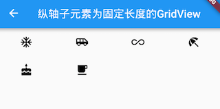

### GridView.count

`GridView.count`构造函数内部使用了`SliverGridDelegateWithFixedCrossAxisCount`，我们通过它可以快速的创建横轴固定数量子元素的`GridView`，我们可以通过以下代码实现和上面例子相同的效果等：

```dart
GridView.count( 
  crossAxisCount: 3,
  childAspectRatio: 1.0,
  children: <Widget>[
    Icon(Icons.ac_unit),
    Icon(Icons.airport_shuttle),
    Icon(Icons.all_inclusive),
    Icon(Icons.beach_access),
    Icon(Icons.cake),
    Icon(Icons.free_breakfast),
  ],
);
```

### GridView.extent

GridView.extent构造函数内部使用了SliverGridDelegateWithMaxCrossAxisExtent，我们通过它可以快速的创建横轴子元素为固定最大长度的的GridView，上面的示例代码等价于：

```dart
GridView.extent(
   maxCrossAxisExtent: 120.0,
   childAspectRatio: 2.0,
   children: <Widget>[
     Icon(Icons.ac_unit),
     Icon(Icons.airport_shuttle),
     Icon(Icons.all_inclusive),
     Icon(Icons.beach_access),
     Icon(Icons.cake),
     Icon(Icons.free_breakfast),
   ],
 );
```

### GridView.builder

上面我们介绍的GridView都需要一个widget数组作为其子元素，这些方式都会提前将所有子widget都构建好，所以只适用于子widget数量比较少时，当子widget比较多时，我们可以通过`GridView.builder`来动态创建子widget。`GridView.builder` 必须指定的参数有两个：

```dart
GridView.builder(
 ...
 required SliverGridDelegate gridDelegate, 
 required IndexedWidgetBuilder itemBuilder,
)
```

其中`itemBuilder`为子widget构建器。

**示例**

假设我们需要从一个异步数据源（如网络）分批获取一些`Icon`，然后用`GridView`来展示：

```dart
class InfiniteGridView extends StatefulWidget {
  const InfiniteGridView({Key? key});

  @override
  State<InfiniteGridView> createState() => _InfiniteGridViewState();
}

class _InfiniteGridViewState extends State<InfiniteGridView> {
  List<IconData> _icons = []; //保存Icon数据

  @override
  void initState() {
    super.initState();
    _retrieveIcons(); // 初始化数据
  }

  @override
  Widget build(BuildContext context) {
    return GridView.builder(
      gridDelegate: SliverGridDelegateWithFixedCrossAxisCount(
        crossAxisCount: 3, //每行三列
        childAspectRatio: 1.0, //显示区域宽高相等
      ),
      itemCount: _icons.length,
      itemBuilder: (context, index) {
        //如果显示到最后一个并且Icon总数小于200时继续获取数据
        if (index == _icons.length - 1 && _icons.length < 200) {
          _retrieveIcons();
        }
        return Icon(_icons[index]);
      },
    );
  }

  //模拟异步获取数据
  void _retrieveIcons() {
    Future.delayed(Duration(milliseconds: 200)).then((e) {
      setState(() {
        _icons.addAll([
          Icons.ac_unit,
          Icons.airport_shuttle,
          Icons.all_inclusive,
          Icons.beach_access,
          Icons.cake,
          Icons.free_breakfast,
        ]);
      });
    });
  }
}
```

效果如图所示：


- `_retrieveIcons()`：在此方法中我们通过`Future.delayed`来模拟从异步数据源获取数据，每次获取数据需要200毫秒，获取成功后将新数据添加到_icons，然后调用setState重新构建。
- 在 itemBuilder 中，如果显示到最后一个时，判断是否需要继续获取数据，然后返回一个Icon。

## PageView与页面缓存

### PageView

如果要实现页面切换和 Tab 布局，我们可以使用 PageView 组件。需要注意，PageView 是一个非常重要的组件，因为在移动端开发中很常用，比如大多数 App 都包含 Tab 换页效果、图片轮动以及抖音上下滑页切换视频功能等等，这些都可以通过 PageView 轻松实现。

```dart
PageView({
  Key? key,
  this.scrollDirection = Axis.horizontal, // 滑动方向
  this.reverse = false,
  PageController? controller,
  this.physics,
  List<Widget> children = const <Widget>[],
  this.onPageChanged,
  
  //每次滑动是否强制切换整个页面，如果为false，则会根据实际的滑动距离显示页面
  this.pageSnapping = true,
  //主要是配合辅助功能用的，后面解释
  this.allowImplicitScrolling = false,
  //后面解释
  this.padEnds = true,
})
```

我们看一个 Tab 切换的实例，为了突出重点，我们让每个 Tab 页都只显示一个数字。

```dart
class Page extends StatefulWidget {
  const Page({Key? key, required this.text});
  final String text;

  @override
  State<Page> createState() => _PageState();
}

class _PageState extends State<Page> {
  @override
  Widget build(BuildContext context) {
    print("build ${widget.text}");
    return Center(
      child: Text(
        '${widget.text}',
        textScaleFactor: 5,
      ),
    );
  }
}
```

我们创建一个 PageView：

```dart
class MyPageView extends StatelessWidget {
  const MyPageView({Key? key});

  @override
  Widget build(BuildContext context) {
    var children = <Widget>[];
    // 生成 6 个 Tab 页
    for (var i = 0; i < 6; i++) {
      children.add(Page(text: '$i'));
    }

    return PageView(
      // scrollDirection: Axis.vertical, // 滑动方向为垂直方向
      children: children,
    );
  }
}
```

运行后就可以左右滑动来切换页面了，效果如图所示：


如果将 PageView 的滑动方向指定为垂直方向（上面代码中注释部分），则会变为上下滑动切换页面。

### 页面缓存

我们在运行上面示例时，读者可能已经发现：每当页面切换时都会触发新 Page 页的 build，比如我们从第一页滑到第二页，然后再滑回第一页时，控制台打印如下：

```
flutter: build 0
flutter: build 1
flutter: build 0
```

可见 PageView 默认并没有缓存功能，一旦页面滑出屏幕它就会被销毁，这和我们前面讲过的 ListView/GridView 不一样，在创建 ListView/GridView 时我们可以手动指定 ViewPort 之外多大范围内的组件需要预渲染和缓存（通过 `cacheExtent` 指定），只有当组件滑出屏幕后又滑出预渲染区域，组件才会被销毁，但是不幸的是 PageView 并没有 `cacheExtent` 参数！但是在真实的业务场景中，对页面进行缓存是很常见的一个需求，比如一个新闻 App，下面有很多频道页，如果不支持页面缓存，则一旦滑到新的频道旧的频道页就会销毁，滑回去时又得重新请求数据和构建页面！

按道理 `cacheExtent` 是 Viewport 的一个配置属性，且 PageView 也是要构建 Viewport 的，那么为什么就不能透传一下这个参数呢？于是笔者带着这个疑问看了一下 PageView 的源码，发现在 PageView 创建Viewport 的代码中是这样的：

```dart
child: Scrollable(
  ...
  viewportBuilder: (BuildContext context, ViewportOffset position) {
    return Viewport(
      // TODO(dnfield): we should provide a way to set cacheExtent
      // independent of implicit scrolling:
      // https://github.com/flutter/flutter/issues/45632
      cacheExtent: widget.allowImplicitScrolling ? 1.0 : 0.0,
      cacheExtentStyle: CacheExtentStyle.viewport,
      ...
    );
  },
)
```

我们发现 虽然 PageView 没有透传 cacheExtent，但是却在`allowImplicitScrolling` 为 true 时设置了预渲染区域，注意，此时的缓存类型为 CacheExtentStyle.viewport，则 cacheExtent 则表示缓存的长度是几个 Viewport 的宽度，cacheExtent 为 1.0，则代表前后各缓存一个页面宽度，即前后各一页。既然如此，那我们将 PageView 的 `allowImplicitScrolling` 置为 true 则不就可以缓存前后两页了？我们修改代码，然后运行示例，发现在第一页时，控制台打印信息如下：

```
flutter: build 0
flutter: build 1 // 预渲染第二页
```

滑到第二页时：

```
flutter: build 0
flutter: build 1
flutter: build 2 // 预渲染第三页
```

当再滑回第一页时，控制台信息不变，这也就意味着第一页缓存成功，它没有被重新构建。但是如果我们从第二页滑到第三页，然后再滑回第一页时，控制台又会输出 ”build 0“，这也符合预期，因为我们之前分析的就是设置 `allowImplicitScrolling` 置为 true 时就只会缓存前后各一页，所以滑到第三页时，第一页就会销毁。

OK，能缓存前后各一页也貌似比不能缓存好一点，但还是不能彻底解决不了我们的问题。为什么明明就是顺手的事， flutter 就不让开发者指定缓存策略呢？然后我们翻译一下源码中的注释：

> Todo：我们应该提供一种独立于隐式滚动（implicit scrolling）的设置 cacheExtent 的机制。

放开 cacheExtent 透传不就是顺手的事么，为什么还要以后再做，是有什么难题么？这就要看看 `allowImplicitScrolling` 到底是什么了，根据文档以及注释中 issue 的链接，发现PageView 中设置 cacheExtent 会和 iOS 中 辅助功能有冲突（读者可以先不用关注），所以暂时还没有什么好的办法。看到这可能国内的很多开发者要说我们的 App 不用考虑辅助功能，既然如此，那问题很好解决，将 PageView 的源码拷贝一份，然后透传 cacheExtent 即可。

拷源码的方式虽然很简单，但毕竟不是正统做法，那有没有更通用的方法吗？有！还记得我们在本章第一节中说过“可滚动组件提供了一种通用的缓存子项的解决方案” 吗，我们将在下一节重点介绍。

## 可滚动组件子项缓存

本节将介绍可滚动组件中缓存指定子项的通用方案。

首先回想一下，在介绍 ListView 时，有一个`addAutomaticKeepAlives` 属性我们并没有介绍，如果`addAutomaticKeepAlives` 为 `true`，则 ListView 会为每一个列表项添加一个 AutomaticKeepAlive 父组件。虽然 PageView 的默认构造函数和 PageView.builder 构造函数中没有该参数，但它们最终都会生成一个 SliverChildDelegate 来负责列表项的按需加载，而在 SliverChildDelegate 中每当列表项构建完成后，SliverChildDelegate 都会为其添加一个 AutomaticKeepAlive 父组件。下面我们就先介绍一下 AutomaticKeepAlive 组件。

### AutomaticKeepAlive

AutomaticKeepAlive 的组件的主要作用是将列表项的根 RenderObject 的 keepAlive **按需自动标记** 为 true 或 false。为了方便叙述，我们可以认为根 RenderObject 对应的组件就是列表项的根 Widget，代表整个列表项组件，同时我们将列表组件的 Viewport区域 + cacheExtent（预渲染区域）称为**加载区域** ：

1. 当 keepAlive 标记为 false 时，如果列表项滑出加载区域时，列表组件将会被销毁。
2. 当 keepAlive 标记为 true 时，当列表项滑出加载区域后，Viewport 会将列表组件缓存起来；当列表项进入加载区域时，Viewport 从先从缓存中查找是否已经缓存，如果有则直接复用，如果没有则重新创建列表项。

那么 AutomaticKeepAlive 什么时候会将列表项的 keepAlive 标记为 true 或 false 呢？答案是开发者说了算！Flutter 中实现了一套类似 C/S 的机制，AutomaticKeepAlive 就类似一个 Server，它的子组件可以是 Client，这样子组件想改变是否需要缓存的状态时就向 AutomaticKeepAlive 发一个通知消息（KeepAliveNotification），AutomaticKeepAlive 收到消息后会去更改 keepAlive 的状态，如果有必要同时做一些资源清理的工作（比如 keepAlive 从 true 变为 false 时，要释放缓存）。

我们基于上一节 PageView 示例，实现页面缓存，根据上面的描述实现思路就很简单了：让Page 页变成一个 AutomaticKeepAlive Client 即可。为了便于开发者实现，Flutter 提供了一个 AutomaticKeepAliveClientMixin ，我们只需要让 PageState 混入这个 mixin，且同时添加一些必要操作即可：

```dart
class _PageState extends State<Page> with AutomaticKeepAliveClientMixin {

  @override
  Widget build(BuildContext context) {
    super.build(context); // 必须调用
    return Center(child: Text("${widget.text}", textScaleFactor: 5));
  }

  @override
  bool get wantKeepAlive => true; // 是否需要缓存
}
```

代码很简单，我们只需要提供一个 `wantKeepAlive`，它会表示 AutomaticKeepAlive 是否需要缓存当前列表项；另外我们必须在 build 方法中调用一下 `super.build(context)`，该方法实现在 AutomaticKeepAliveClientMixin 中，功能就是根据当前 `wantKeepAlive` 的值给 AutomaticKeepAlive 发送消息，AutomaticKeepAlive 收到消息后就会开始工作，如图所示：


现在我们重新运行一下示例，发现每个 Page 页只会 build 一次，缓存成功了。

需要注意，如果我们采用 PageView.custom 构建页面时没有给列表项包装 AutomaticKeepAlive 父组件，则上述方案不能正常工作，因为此时Client 发出消息后，找不到 Server，404 了，😀。

### KeepAliveWrapper

虽然我们可以通过 AutomaticKeepAliveClientMixin 快速的实现页面缓存功能，但是通过混入的方式实现不是很优雅，因为必须更改 Page 的代码，有侵入性，这就导致不是很灵活，比如一个组件能同时在列表中和列表外使用，为了在列表中缓存它，则我们必须实现两份。为了解决这个问题，笔者封装了一个 KeepAliveWrapper 组件，如果哪个列表项需要缓存，只需要使用 KeepAliveWrapper 包裹一下它即可。

```dart
class MyPageView extends StatelessWidget {
  const MyPageView({Key? key});

  @override
  Widget build(BuildContext context) {
    var children = <Widget>[];
    for (var i = 0; i < 6; i++) {
      children.add(KeepAliveWrapper(child: Page(text: '$i')));
    }

    return PageView(
      children: children,
    );
  }
}
```

下面是 KeepAliveWrapper 的实现源码：

```dart
class KeepAliveWrapper extends StatefulWidget {
  const KeepAliveWrapper({
    Key? key,
    this.keepAlive = true,
    required this.child,
  });
  final bool keepAlive;
  final Widget child;

  @override
  State<KeepAliveWrapper> createState() => _KeepAliveWrapperState();
}

class _KeepAliveWrapperState extends State<KeepAliveWrapper>
    with AutomaticKeepAliveClientMixin {
  @override
  Widget build(BuildContext context) {
    super.build(context);
    return widget.child;
  }

  @override
  void didUpdateWidget(covariant KeepAliveWrapper oldWidget) {
    if (oldWidget.keepAlive != widget.keepAlive) {
      // keepAlive 状态需要更新，实现在 AutomaticKeepAliveClientMixin 中
      updateKeepAlive();
    }
    super.didUpdateWidget(oldWidget);
  }

  @override
  bool get wantKeepAlive => widget.keepAlive;
}
```

下面我们再在 ListView 中测一下：

```dart
class KeepAliveTest extends StatelessWidget {
  const KeepAliveTest({Key? key}) : super(key: key);

  @override
  Widget build(BuildContext context) {
    return ListView.builder(itemBuilder: (_, index) {
      return KeepAliveWrapper(
        // 为 true 后会缓存所有的列表项，列表项将不会销毁。
        // 为 false 时，列表项滑出预加载区域后将会别销毁。
        // 使用时一定要注意是否必要，因为对所有列表项都缓存的会导致更多的内存消耗
        keepAlive: true,
        child: ListItem(index: index),
      );
    });
  }
}

class ListItem extends StatefulWidget {
  const ListItem({Key? key, required this.index}) : super(key: key);
  final int index;

  @override
  _ListItemState createState() => _ListItemState();
}

class _ListItemState extends State<ListItem> {
  @override
  Widget build(BuildContext context) {
    return ListTile(title: Text('${widget.index}'));
  }

  @override
  void dispose() {
    print('dispose ${widget.index}');
    super.dispose();
  }
}
```

因为每一个列表项都被缓存了，所以运行后滑动列表预期日志面板不会有任何日志，如图所示：


好我们预期一致，日志面板没有日志。如果我们将 keepAlive 设为 false，则当列表项滑出预渲染区域后则会销毁，日志面板将有输出，如图所示：


## TabBarView

TabBarView 是 Material 组件库中提供了 Tab 布局组件，通常和 TabBar 配合使用。

#### TabBarView

TabBarView 封装了 PageView，它的构造方法很简单

```dart
TabBarView({
  Key? key,
  required this.children, // tab 页
  this.controller, // TabController
  this.physics,
  this.dragStartBehavior = DragStartBehavior.start,
})
```

TabController 用于监听和控制 TabBarView 的页面切换，通常和 TabBar 联动。如果没有指定，则会在组件树中向上查找并使用最近的一个 `DefaultTabController` 。

#### TabBar

TabBar 为 TabBarView 的导航标题，如图所示：


TabBar 有很多配置参数，通过这些参数我们可以定义 TabBar 的样式，很多属性都是在配置 indicator 和 label，拿上图来举例，Label 是每个Tab 的文本，indicator 指 “历史” 下面的白色下划线。

```dart
const TabBar({
  Key? key,
  required this.tabs, // 具体的 Tabs，需要我们创建
  this.controller,
  this.isScrollable = false, // 是否可以滑动
  this.padding,
  this.indicatorColor,// 指示器颜色，默认是高度为2的一条下划线
  this.automaticIndicatorColorAdjustment = true,
  this.indicatorWeight = 2.0,// 指示器高度
  this.indicatorPadding = EdgeInsets.zero, //指示器padding
  this.indicator, // 指示器
  this.indicatorSize, // 指示器长度，有两个可选值，一个tab的长度，一个是label长度
  this.labelColor, 
  this.labelStyle,
  this.labelPadding,
  this.unselectedLabelColor,
  this.unselectedLabelStyle,
  this.mouseCursor,
  this.onTap,
  ...
})
```

TabBar 通常位于 AppBar 的底部，它也可以接收一个 TabController ，如果需要和 TabBarView 联动， TabBar 和 TabBarView 使用同一个 TabController 即可，注意，联动时 TabBar 和 TabBarView 的孩子数量需要一致。如果没有指定 `controller`，则会在组件树中向上查找并使用最近的一个 `DefaultTabController` 。另外我们需要创建需要的 tab 并通过 `tabs` 传给 TabBar， tab 可以是任何 Widget，不过Material 组件库中已经实现了一个 Tab 组件，我们一般都会直接使用它：

```dart
const Tab({
  Key? key,
  this.text, //文本
  this.icon, // 图标
  this.iconMargin = const EdgeInsets.only(bottom: 10.0),
  this.height,
  this.child, // 自定义 widget
})
```

注意，`text` 和 `child` 是互斥的，不能同时制定。

#### 实例

```dart
class TabViewRoute1 extends StatefulWidget {
  @override
  _TabViewRoute1State createState() => _TabViewRoute1State();
}

class _TabViewRoute1State extends State<TabViewRoute1>
    with SingleTickerProviderStateMixin {
  late TabController _tabController;
  List tabs = ["新闻", "历史", "图片"];

  @override
  void initState() {
    super.initState();
    _tabController = TabController(length: tabs.length, vsync: this);
  }

  @override
  Widget build(BuildContext context) {
    return Scaffold(
      appBar: AppBar(
        title: Text("App Name"),
        bottom: TabBar(
          controller: _tabController,
          tabs: tabs.map((e) => Tab(text: e)).toList(),
        ),
      ),
      body: TabBarView( //构建
        controller: _tabController,
        children: tabs.map((e) {
          return KeepAliveWrapper(
            child: Container(
              alignment: Alignment.center,
              child: Text(e, textScaleFactor: 5),
            ),
          );
        }).toList(),
      ),
    );
  }
  
  @override
  void dispose() {
    // 释放资源
    _tabController.dispose();
    super.dispose();
  }
}
```

运行后效果如图所示：

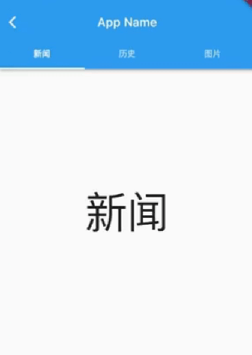

滑动页面时顶部的 Tab 也会跟着动，点击顶部 Tab 时页面也会跟着切换。为了实现 TabBar 和 TabBarView 的联动，我们显式创建了一个 TabController，由于 TabController 又需要一个 TickerProvider （vsync 参数）， 我们又混入了 SingleTickerProviderStateMixin；由于 TabController 中会执行动画，持有一些资源，所以我们在页面销毁时必须得释放资源（dispose）。综上，我们发现创建 TabController 的过程还是比较复杂，实战中，如果需要 TabBar 和 TabBarView 联动，通常会创建一个 DefaultTabController 作为它们共同的父级组件，这样它们在执行时就会从组件树向上查找，都会使用我们指定的这个 DefaultTabController。我们修改后的实现如下：

```dart
class TabViewRoute2 extends StatefulWidget {
  const TabViewRoute2({Key? key});

  @override
  State<TabViewRoute2> createState() => _TabViewRoute2State();
}

class _TabViewRoute2State extends State<TabViewRoute2>
    with SingleTickerProviderStateMixin {
  List tabs = ['新闻', '历史', '图片'];

  @override
  Widget build(BuildContext context) {
    return DefaultTabController(
      length: tabs.length,
      child: Scaffold(
        appBar: AppBar(
          title: Text('App Name'),
          bottom: TabBar(
            tabs: tabs
                .map((e) => Tab(
                      text: e,
                    ))
                .toList(),
          ),
        ),
        body: TabBarView(
          children: tabs.map((e) {
            return KeepAliveWrapper(
              child: Container(
                alignment: Alignment.center,
                child: Text(e, textScaleFactor: 5),
              ),
            );
          }).toList(),
        ),
      ),
    );
  }
}
```

可以看到我们无需去手动管理 Controller 的生命周期，也不需要提供 SingleTickerProviderStateMixin，同时也没有其他的状态需要管理，也就不需要用 StatefulWidget 了，这样简单很多。

**页面缓存**

因为TabBarView 内部封装了 PageView，如果要缓存页面，可以参考 PageView 一节中关于页面缓存的介绍。

## CustomScrollView 和 Slivers

### CustomScrollView

前面介绍的 ListView、GridView、PageView 都是一个**完整**的可滚动组件，所谓完整是指它们都包括Scrollable 、 Viewport 和 Sliver。假如我们想要在一个页面中，同时包含多个可滚动组件，且使它们的滑动效果能统一起来，比如：我们想将已有的两个沿垂直方向滚动的 ListView 成一个 ListView ，这样在第一ListView 滑动到底部时能自动接上第二 ListView，如果尝试写一个 demo：

```dart
Widget buildTwoListView() {
  var listView = ListView.builder(
    itemCount: 20,
    itemBuilder: (_, index) => ListTile(title: Text('$index')),
  );

  return Column(
    children: [
      Expanded(child: listView),
      Divider(color: Colors.grey),
      Expanded(child: listView),
    ],
  );
}

void main(List<String> args) {
  runApp(
    MaterialApp(
      title: 'My app',
      home: Scaffold(
        appBar: AppBar(
          title: Text('两个ListView'),
        ),
        body: buildTwoListView(),
      ),
    ),
  );
}
```

运行效果如图所示：


页面中有两个 ListView，各占可视区域一半高度，虽然能够显式出来，但每一个 ListView 只会响应自己可视区域中滑动，实现不了我们想要的效果。之所以会这样的原因是两个 ListView 都有自己独立的 Scrollable 、 Viewport 和 Sliver，既然如此，我们自己创建一个共用的 Scrollable 和 Viewport 对象，然后再将两个 ListView 对应的 Sliver 添加到这个共用的 Viewport 对象中就可以实现我们想要的效果了。如果这个工作让开发者自己来做无疑是比较麻烦的，因此 Flutter 提供了一个 `CustomScrollView` 组件来帮助我们创建一个公共的 Scrollable 和 Viewport ，然后它的 slivers 参数接受一个 Sliver 数组，这样我们就可以使用CustomScrollView 方面的实现我们期望的功能了：

```dart
Widget buildTwoSliverList() {
  // SliverFixedExtentList 是一个 Sliver，它可以生成高度相同的列表项。
  // 再次提醒，如果列表项高度相同，我们应该优先使用SliverFixedExtentList
  // 和 SliverPrototypeExtentList，如果不同，使用 SliverList.
  var listView = SliverFixedExtentList(
    itemExtent: 56,
    delegate: SliverChildBuilderDelegate(
        (_, index) => ListTile(title: Text('$index')),
        childCount: 10),
  );

  return CustomScrollView(
    slivers: [
      listView,
      listView,
    ],
  );
}
```

运行后效果图所示：


可以看到我们期望的效果实现了。

综上，`CustomScrollView` 的主要功能是提供一个公共的 Scrollable 和 Viewport，来组合多个 Sliver，CustomScrollView 的结构如图：


### Flutter 中常用的 Sliver

之前小节介绍过的可滚动组件都有对应的 Sliver：

| Sliver名称                | 功能                               | 对应的可滚动组件                 |
| ------------------------- | ---------------------------------- | -------------------------------- |
| SliverList                | 列表                               | ListView                         |
| SliverFixedExtentList     | 高度固定的列表                     | ListView，指定`itemExtent`时     |
| SliverAnimatedList        | 添加/删除列表项可以执行动画        | AnimatedList                     |
| SliverGrid                | 网格                               | GridView                         |
| SliverPrototypeExtentList | 根据原型生成高度固定的列表         | ListView，指定`prototypeItem` 时 |
| SliverFillViewport        | 包含多个子组件，每个都可以填满屏幕 | PageView                         |

除了和列表对应的 Sliver 之外还有一些用于对 Sliver 进行布局、装饰的组件，**它们的子组件必须是 Sliver**，我们列举几个常用的：

| Sliver名称                      | 对应 RenderBox      |
| ------------------------------- | ------------------- |
| SliverPadding                   | Padding             |
| SliverVisibility、SliverOpacity | Visibility、Opacity |
| SliverFadeTransition            | FadeTransition      |
| SliverLayoutBuilder             | LayoutBuilder       |

还有一些其他常用的 Sliver：

| Sliver名称             | 说明                                                   |
| ---------------------- | ------------------------------------------------------ |
| SliverAppBar           | 对应 AppBar，主要是为了在 CustomScrollView 中使用。    |
| SliverToBoxAdapter     | 一个适配器，可以将 RenderBox 适配为 Sliver，后面介绍。 |
| SliverPersistentHeader | 滑动到顶部时可以固定住，后面介绍。                     |

> Sliver系列 Widget 比较多，我们不会一一介绍，读者只需记住它的特点，需要时再去查看文档即可。上面之所以说“大多数”Sliver都和可滚动组件对应，是由于还有一些如SliverPadding、SliverAppBar 等是和可滚动组件无关的，它们主要是为了结合CustomScrollView一起使用，这是因为**CustomScrollView的子组件必须都是Sliver**。

**示例**

```dart
void main(List<String> args) {
  runApp(
    MaterialApp(
      title: 'My app',
      // 因为本路由没有使用 Scaffold，为了让子级Widget(如Text)使用
			// Material Design 默认的样式风格,我们使用 Material 作为本路由的根。
      home: Material(
        child: CustomScrollView(
          slivers: [
            // AppBar，包含一个导航栏.
            SliverAppBar(
              pinned: true, // 滑动到顶端时会固定住
              expandedHeight: 250.0,
              flexibleSpace: FlexibleSpaceBar(
                title: Text('Demo'),
                background: Image.asset(
                  'assets/images/sea.jpeg',
                  fit: BoxFit.cover,
                ),
              ),
            ),
            SliverPadding(
              padding: const EdgeInsets.all(8.0),
              sliver: SliverGrid(
                delegate: SliverChildBuilderDelegate(
                  (BuildContext context, int index) {
                    //创建子widget
                    return Container(
                      alignment: Alignment.center,
                      color: Colors.cyan[100 * (index % 9)],
                      child: Text('grid item $index'),
                    );
                  },
                  childCount: 20,
                ),
                gridDelegate: SliverGridDelegateWithFixedCrossAxisCount(
                  crossAxisCount: 2, // 两列
                  mainAxisSpacing: 10.0,
                  crossAxisSpacing: 10.0,
                  childAspectRatio: 4.0,
                ),
              ),
            ),

            SliverFixedExtentList(
              itemExtent: 50.0,
              delegate: SliverChildBuilderDelegate(
                (BuildContext context, int index) {
                  return Container(
                    alignment: Alignment.center,
                    color: Colors.lightBlue[100 * (index % 9)],
                    child: Text('list item $index'),
                  );
                },
                childCount: 20,
              ),
            ),
          ],
        ),
      ),
    ),
  );
}
```

代码分为三部分：

- 头部`SliverAppBar`：`SliverAppBar`对应`AppBar`，两者不同之处在于`SliverAppBar`可以集成到`CustomScrollView`。`SliverAppBar`可以结合`FlexibleSpaceBar`实现Material Design中头部伸缩的模型，具体效果，读者可以运行该示例查看。
- 中间的`SliverGrid`：它用`SliverPadding`包裹以给`SliverGrid`添加补白。`SliverGrid`是一个两列，宽高比为4的网格，它有20个子组件。
- 底部`SliverFixedExtentList`：它是一个所有子元素高度都为50像素的列表。

运行效果如图所示：


**SliverToBoxAdapter**

在实际布局中，我们通常需要往 CustomScrollView 中添加一些自定义的组件，而这些组件并非都有 Sliver 版本，为此 Flutter 提供了一个 SliverToBoxAdapter 组件，它是一个适配器：可以将 RenderBox 适配为 Sliver。比如我们想在列表顶部添加一个可以横向滑动的 PageView，可以使用 SliverToBoxAdapter 来配置：

```dart
void main(List<String> args) {
  runApp(
    MaterialApp(
      title: 'My app',
      home: Scaffold(
        appBar: AppBar(
          title: Text('SliverToBoxAdapter'),
        ),
        body: CustomScrollView(
          slivers: [
            SliverToBoxAdapter(
              child: SizedBox(
                height: 300,
                child: PageView(
                  children: [Text('1'), Text('2')],
                ),
              ),
            ),
            buildSliverFixedList(),
          ],
        ),
      ),
    ),
  );
}

Widget buildSliverFixedList() {
  return SliverFixedExtentList(
    itemExtent: 50.0,
    delegate: SliverChildBuilderDelegate(
      (BuildContext context, int index) {
        return Container(
          alignment: Alignment.center,
          color: Colors.lightBlue[100 * (index % 9)],
          child: Text('list item $index'),
        );
      },
      childCount: 20,
    ),
  );
}
```

运行效果如图：


注意，上面的代码是可以正常运行的，但是如果将 PageView 换成一个滑动方向和 CustomScrollView 一致的 ListView 则不会正常工作！原因是：CustomScrollView 组合 Sliver 的原理是为所有子 Sliver 提供一个共享的 Scrollable，然后统一处理指定滑动方向的滑动事件，如果 Sliver 中引入了其他的 Scrollable，则滑动事件便会冲突。上例中 PageView 之所以能正常工作，是因为 PageView 的 Scrollable 只处理水平方向的滑动，而 CustomScrollView 是处理垂直方向的，两者并未冲突，所以不会有问题，但是换一个也是垂直方向的 ListView 时则不能正常工作，最终的效果是，在ListView内滑动时只会对ListView 起作用，原因是滑动事件被 ListView 的 Scrollable 优先消费，CustomScrollView 的 Scrollable 便接收不到滑动事件了。

> Flutter 中手势的冲突时，默认的策略是子元素生效，这个我们将在后面事件处理相关章节介绍。

所以我们可以得出一个结论：**如果 CustomScrollView 有孩子也是一个完整的可滚动组件且它们的滑动方向一致，则 CustomScrollView 不能正常工作**。要解决这个问题，可以使用 NestedScrollView，这个我们将在下一节介绍。

**SliverPersistentHeader**

SliverPersistentHeader 的功能是当滑动到 CustomScrollView 的顶部时，可以将组件固定在顶部。

需要注意， Flutter 中设计 SliverPersistentHeader 组件的初衷是为了实现 SliverAppBar，所以它的一些属性和回调在SliverAppBar 中才会用到。因此，如果我们要直接使用 SliverPersistentHeader，看到它的一些配置和参数会感到疑惑，使用起来会感觉有心智成本，为此，笔者会在下面介绍中指出哪些是需要我们重点关注的，哪些是可以忽略的，最后为了便于使用，我们会封装一个`SliverHeaderDelegate` ，通过它我们只需要配置我们关注的属性即可。

我们先看看 SliverPersistentHeader 的定义：

```dart
const SliverPersistentHeader({
  Key? key,
  // 构造 header 组件的委托
  required SliverPersistentHeaderDelegate delegate,
  this.pinned = false, // header 滑动到可视区域顶部时是否固定在顶部
  this.floating = false, // 正文部分介绍
})
```

`floating` 的做用是：`pinned` 为 false 时 ，则 header 可以滑出可视区域（CustomScrollView 的 Viewport）（不会固定到顶部），当用户再次向下滑动时，此时不管 header 已经被滑出了多远，它都会立即出现在可视区域顶部并固定住，直到继续下滑到 header 在列表中原来的位置时，header 才会重新回到原来的位置（不再固定在顶部）。 具体效果，我们后面会有示例，读者可以实际运行起来看看效果。

`delegate` 是用于生成 header 的委托，类型为 SliverPersistentHeaderDelegate，它是一个抽象类，需要我们自己实现，定义如下：

```dart
abstract class SliverPersistentHeaderDelegate {

  // header 最大高度；pined为 true 时，当 header 刚刚固定到顶部时高度为最大高度。
  double get maxExtent;
  
  // header 的最小高度；pined为true时，当header固定到顶部，用户继续往上滑动时，header
  // 的高度会随着用户继续上滑从 maxExtent 逐渐减小到 minExtent
  double get minExtent;

  // 构建 header。
  // shrinkOffset取值范围[0,maxExtent],当header刚刚到达顶部时，shrinkOffset 值为0，
  // 如果用户继续向上滑动列表，shrinkOffset的值会随着用户滑动的偏移减小，直到减到0时。
  //
  // overlapsContent：一般不建议使用，在使用时一定要小心，后面会解释。
  Widget build(BuildContext context, double shrinkOffset, bool overlapsContent);
  
  // header 是否需要重新构建；通常当父级的 StatefulWidget 更新状态时会触发。
  // 一般来说只有当 Delegate 的配置发生变化时，应该返回false，比如新旧的 minExtent、maxExtent
  // 等其他配置不同时需要返回 true，其余情况返回 false 即可。
  bool shouldRebuild(covariant SliverPersistentHeaderDelegate oldDelegate);

  // 下面这几个属性是SliverPersistentHeader在SliverAppBar中时实现floating、snap 
  // 效果时会用到，平时开发过程很少使用到，读者可以先不用理会。
  TickerProvider? get vsync => null;
  FloatingHeaderSnapConfiguration? get snapConfiguration => null;
  OverScrollHeaderStretchConfiguration? get stretchConfiguration => null;
  PersistentHeaderShowOnScreenConfiguration? get showOnScreenConfiguration => null;

}
```

可以看到，我们最需要关注的就是`maxExtent` 和 `minExtent`；`pined`为`true` 时，当 header 刚刚固定到顶部，此时会对它应用 `maxExtent` （最大高度）；当用户继续往上滑动时，header 的高度会随着用户继续上滑从 `maxExtent` 逐渐减小到 `minExtent`。如果我们想让 header 高度固定，则将 `maxExtent` 和 `minExtent` 指定为同样的值即可。

为了构建 header 我们必须要定义一个类，让它继承自 SliverPersistentHeaderDelegate，这无疑会增加使用成本！为此，我们封装一个通用的委托构造器 SliverHeaderDelegate，通过它可以快速构建 SliverPersistentHeaderDelegate，实现如下：

```dart
typedef SliverHeaderBuilder = Widget Function(
    BuildContext context, double shrinkOffset, bool overlapsContent);

class SliverHeaderDelegate extends SliverPersistentHeaderDelegate {
  // child 为 header
  SliverHeaderDelegate({
    required this.maxHeight,
    this.minHeight = 0,
    required Widget child,
  })  : builder = ((a, b, c) => child),
        assert(minHeight <= maxHeight && minHeight >= 0);

  //最大和最小高度相同
  SliverHeaderDelegate.fixedHeight({
    required double height,
    required Widget child,
  })  : builder = ((a, b, c) => child),
        maxHeight = height,
        minHeight = height;

  //需要自定义builder时使用
  SliverHeaderDelegate.builder({
    required this.maxHeight,
    this.minHeight = 0,
    required this.builder,
  });

  final double maxHeight;
  final double minHeight;
  final SliverHeaderBuilder builder;

  @override
  Widget build(
    BuildContext context,
    double shrinkOffset,
    bool overlapsContent,
  ) {
    Widget child = builder(context, shrinkOffset, overlapsContent);
    //测试代码：如果在调试模式，且子组件设置了key，则打印日志
    assert(() {
      if (child.key != null) {
        print('${child.key}: shrink: $shrinkOffset，overlaps:$overlapsContent');
      }
      return true;
    }());
    // 让 header 尽可能充满限制的空间；宽度为 Viewport 宽度，
    // 高度随着用户滑动在[minHeight,maxHeight]之间变化。
    return SizedBox.expand(child: child);
  }

  @override
  double get maxExtent => maxHeight;

  @override
  double get minExtent => minHeight;

  @override
  bool shouldRebuild(SliverHeaderDelegate old) {
    return old.maxExtent != maxExtent || old.minExtent != minExtent;
  }
}
```

实现很简单，不再赘述，下面我们看看如何使用：

```dart
class PersistentHeaderRoute extends StatelessWidget {
  @override
  Widget build(BuildContext context) {
    return CustomScrollView(
      slivers: [
        buildSliverList(),
        SliverPersistentHeader(
          pinned: true,
          delegate: SliverHeaderDelegate(//有最大和最小高度
            maxHeight: 80,
            minHeight: 50,
            child: buildHeader(1),
          ),
        ),
        buildSliverList(),
        SliverPersistentHeader(
          pinned: true,
          delegate: SliverHeaderDelegate.fixedHeight( //固定高度
            height: 50,
            child: buildHeader(2),
          ),
        ),
        buildSliverList(20),
      ],
    );
  }

  // 构建固定高度的SliverList，count为列表项属相
  Widget buildSliverList([int count = 5]) {
    return SliverFixedExtentList(
      itemExtent: 50,
      delegate: SliverChildBuilderDelegate(
        (context, index) {
          return ListTile(title: Text('$index'));
        },
        childCount: count,
      ),
    );
  }

  // 构建 header
  Widget buildHeader(int i) {
    return Container(
      color: Colors.lightBlue.shade200,
      alignment: Alignment.centerLeft,
      child: Text("PersistentHeader $i"),
    );
  }
}
```

运行后效果如图所示:


**一些注意点**

我们说过 SliverPersistentHeader 的 builder 参数 overlapsContent 一般不建议使用，使用时要当心。因为按照 overlapsContent 变量名的字面意思，只要有内容和 Sliver 重叠时就应该为 true，但是如果我们在上面示例的 builder 中打印一下 overlapsContent 的值就会发现第一个 PersistentHeader 1 的 overlapsContent 值一直都是 false，而 PersistentHeader 2 则是正常的，如果我们再添加几个 SliverPersistentHeader ，发现新添加的也都正常。总结一下：**当有多个 SliverPersistentHeader时，需要注意第一个 SliverPersistentHeader 的 overlapsContent 值会一直为 false**。

这可能是一个 bug，也可能就是这么设计的，因为 SliverPersistentHeader 的设计初衷主要是为了实现 SliverAppBar，可能并没有考虑到通用的场景，但是不管怎样，当前的 flutter 版本（2.5）中表现就是如此。为此，我们可以定一条约定：**如果我们在使用 SliverPersistentHeader 构建子组件时需要依赖 overlapsContent 参数，则必须保证之前至少还有一个 SliverPersistentHeader 或 SliverAppBar**（SliverAppBar 在当前 Flutter 版本的实现中内部包含了SliverPersistentHeader）。

# 功能性组件

## 导航返回拦截（WillPopScope）

为了避免用户误触返回按钮而导致 App 退出，在很多 App 中都拦截了用户点击返回键的按钮，然后进行一些防误触判断，比如当用户在某一个时间段内点击两次时，才会认为用户是要退出（而非误触）。Flutter中可以通过`WillPopScope`来实现返回按钮拦截，我们看看`WillPopScope`的默认构造函数：

```dart
const WillPopScope({
  ...
  required WillPopCallback onWillPop,
  required Widget child
})
```

`onWillPop`是一个回调函数，当用户点击返回按钮时被调用（包括导航返回按钮及Android物理返回按钮）。该回调需要返回一个`Future`对象，如果返回的`Future`最终值为`false`时，则当前路由不出栈(不会返回)；最终值为`true`时，当前路由出栈退出。我们需要提供这个回调来决定是否退出。

**示例**

为了防止用户误触返回键退出，我们拦截返回事件。当用户在1秒内点击两次返回按钮时，则退出；如果间隔超过1秒则不退出，并重新记时。代码如下：

```dart
import 'package:flutter/material.dart';

class WillPopScopeTestRoute extends StatefulWidget {
  @override
  WillPopScopeTestRouteState createState() {
    return WillPopScopeTestRouteState();
  }
}

class WillPopScopeTestRouteState extends State<WillPopScopeTestRoute> {
  DateTime? _lastPressedAt; //上次点击时间

  @override
  Widget build(BuildContext context) {
    return WillPopScope(
      onWillPop: () async {
        if (_lastPressedAt == null ||
            DateTime.now().difference(_lastPressedAt!) > Duration(seconds: 1)) {
          //两次点击间隔超过1秒则重新计时
          _lastPressedAt = DateTime.now();
          return false;
        }
        return true;
      },
      child: Container(
        alignment: Alignment.center,
        child: Text("1秒内连续按两次返回键退出"),
      ),
    );
  }
}
```

## 数据共享（InheritedWidget）

### InheritedWidget

**简介**

`InheritedWidget`是 Flutter 中非常重要的一个功能型组件，它提供了一种在 widget 树中从上到下共享数据的方式，比如我们在应用的根 widget 中通过`InheritedWidget`共享了一个数据，那么我们便可以在任意子widget 中来获取该共享的数据！这个特性在一些需要在整个 widget 树中共享数据的场景中非常方便！如Flutter SDK中正是通过 InheritedWidget 来共享应用主题（`Theme`）和 Locale (当前语言环境)信息的。

> `InheritedWidget`和 React 中的 context 功能类似，和逐级传递数据相比，它们能实现组件跨级传递数据。`InheritedWidget`的在 widget 树中数据传递方向是从上到下的，这和通知`Notification`（将在下一章中介绍）的传递方向正好相反。

下面我们看一下之前“计数器”示例应用程序的`InheritedWidget`版本。需要说明的是，本示例主要是为了演示`InheritedWidget`的功能特性，并不是计数器的推荐实现方式。

首先，我们通过继承`InheritedWidget`，将当前计数器点击次数保存在`ShareDataWidget`的`data`属性中：

```dart
class ShareDataWidget extends InheritedWidget {
  const ShareDataWidget({
    Key? key,
    required this.data,
    required child,
  }) : super(key: key, child: child);

  final int data; //需要在子树中共享的数据，保存点击次数

  //定义一个便捷方法，方便子树中的widget获取共享数据
  static ShareDataWidget? of(BuildContext context) {
    return context.dependOnInheritedWidgetOfExactType<ShareDataWidget>();
  }

  //该回调决定当data发生变化时，是否通知子树中依赖data的Widget重新build
  @override
  bool updateShouldNotify(ShareDataWidget old) {
    return old.data != data;
  }
}
```

然后我们实现一个子组件`_TestWidget`，在其`build`方法中引用`ShareDataWidget`中的数据。同时，在其`didChangeDependencies()` 回调中打印日志：

```dart
class _TestWidget extends StatefulWidget {
  const _TestWidget({Key? key});

  @override
  State<_TestWidget> createState() => __TestWidgetState();
}

class __TestWidgetState extends State<_TestWidget> {
  @override
  Widget build(BuildContext context) {
    //使用InheritedWidget中的共享数据
    //这里和之前的状态管理（父Widget管理子Widget的状态）主要区别是，组件内部可以通过静态方法获取状态，而不是通过函数参数传进来
    return Text(ShareDataWidget.of(context)!.data.toString());
  }

  @override
  void didChangeDependencies() {
    super.didChangeDependencies();
    //父或祖先widget中的InheritedWidget改变(updateShouldNotify返回true)时会被调用。
    //如果build中没有依赖InheritedWidget，则此回调不会被调用。
    print("Dependencies change");
  }
}
```

**didChangeDependencies**

在之前介绍`StatefulWidget`时，我们提到`State`对象有一个`didChangeDependencies`回调，它会在“依赖”发生变化时被Flutter 框架调用。而这个“依赖”指的就是子 widget 是否使用了父 widget 中`InheritedWidget`的数据！如果使用了，则代表子 widget 有依赖；如果没有使用则代表没有依赖。这种机制可以使子组件在所依赖的`InheritedWidget`变化时来更新自身！比如当主题、locale(语言)等发生变化时，依赖其的子 widget 的`didChangeDependencies`方法将会被调用。

最后，我们创建一个按钮，每点击一次，就将`ShareDataWidget`的值自增：

```dart
class InheritedWidgetTestRoute extends StatefulWidget {
  const InheritedWidgetTestRoute({Key? key});

  @override
  State<InheritedWidgetTestRoute> createState() =>
      _InheritedWidgetTestRouteState();
}

class _InheritedWidgetTestRouteState extends State<InheritedWidgetTestRoute> {
  int count = 0;

  @override
  Widget build(BuildContext context) {
    return Center(
      child: ShareDataWidget(
        data: count, // 数据放入父组件ShareDataWidget中
        child: Column(
          mainAxisAlignment: MainAxisAlignment.center,
          children: [
            Padding(
              padding: EdgeInsets.only(bottom: 20.0),
              child: _TestWidget(), //子widget中依赖ShareDataWidget
            ),
            ElevatedButton(
              onPressed: () => setState(() => ++count),
              child: Text('Increment'),
            ),
          ],
        ),
      ),
    );
  }
}
```

运行后界面如图所示：


每点击一次按钮，计数器就会自增，控制台就会打印一句日志：

```
I/flutter ( 8513): Dependencies change
```

可见依赖发生变化后，其`didChangeDependencies()`会被调用。但是读者要注意，**如果_TestWidget的build方法中没有使用ShareDataWidget的数据，那么它的`didChangeDependencies()`将不会被调用，因为它并没有依赖ShareDataWidget**。例如，我们将`__TestWidgetState`代码改为下面这样，`didChangeDependencies()`将不会被调用:

```dart
class __TestWidgetState extends State<_TestWidget> {
  @override
  Widget build(BuildContext context) {
    // 使用InheritedWidget中的共享数据
    // return Text(ShareDataWidget.of(context)!.data.toString());
     return Text("text");
  }

  @override
  void didChangeDependencies() {
    super.didChangeDependencies();
    // build方法中没有依赖InheritedWidget，此回调不会被调用。
    print("Dependencies change");
  }
}
```

上面的代码中，我们将`build()`方法中依赖`ShareDataWidget`的代码注释掉了，然后返回一个固定`Text`，这样一来，当点击Increment按钮后，`ShareDataWidget`的`data`虽然发生变化，但由于`__TestWidgetState`并未依赖`ShareDataWidget`，所以`__TestWidgetState`的`didChangeDependencies`方法不会被调用。其实，这个机制很好理解，因为在数据发生变化时只对使用该数据的Widget更新是合理并且性能友好的。

**应该在didChangeDependencies()中做什么？**

一般来说，子 widget 很少会重写此方法，因为在依赖改变后 Flutter 框架也都会调用`build()`方法重新构建组件树。但是，如果你需要在依赖改变后执行一些昂贵的操作，比如网络请求，这时最好的方式就是在此方法中执行，这样可以避免每次`build()`都执行这些昂贵操作。

### 深入了解InheritedWidget

现在来思考一下，在上面的例子中，如果我们只想在`__TestWidgetState`中引用`ShareDataWidget`数据，但却不希望在`ShareDataWidget`发生变化时调用`__TestWidgetState`的`didChangeDependencies()`方法应该怎么办？其实答案很简单，我们只需要将`ShareDataWidget.of()`的实现改一下即可：

```dart
//定义一个便捷方法，方便子树中的widget获取共享数据
static ShareDataWidget of(BuildContext context) {
  //return context.dependOnInheritedWidgetOfExactType<ShareDataWidget>();
  return context.getElementForInheritedWidgetOfExactType<ShareDataWidget>().widget;
}
```

唯一的改动就是获取`ShareDataWidget`对象的方式，把`dependOnInheritedWidgetOfExactType()`方法换成了`context.getElementForInheritedWidgetOfExactType<ShareDataWidget>().widget`，那么他们到底有什么区别呢，我们看一下这两个方法的源码（实现代码在`Element`类中，`Context`和`Element`的关系我们将在后面专门介绍）：

```dart
@override
InheritedElement getElementForInheritedWidgetOfExactType<T extends InheritedWidget>() {
  final InheritedElement ancestor = _inheritedWidgets == null ? null : _inheritedWidgets[T];
  return ancestor;
}
@override
InheritedWidget dependOnInheritedWidgetOfExactType({ Object aspect }) {
  assert(_debugCheckStateIsActiveForAncestorLookup());
  final InheritedElement ancestor = _inheritedWidgets == null ? null : _inheritedWidgets[T];
  //多出的部分
  if (ancestor != null) {
    return dependOnInheritedElement(ancestor, aspect: aspect) as T;
  }
  _hadUnsatisfiedDependencies = true;
  return null;
}
```

我们可以看到，`dependOnInheritedWidgetOfExactType()` 比 `getElementForInheritedWidgetOfExactType()`多调了`dependOnInheritedElement`方法，`dependOnInheritedElement`源码如下：

```dart
@override
InheritedWidget dependOnInheritedElement(InheritedElement ancestor, { Object aspect }) {
  assert(ancestor != null);
  _dependencies ??= HashSet<InheritedElement>();
  _dependencies.add(ancestor);
  ancestor.updateDependencies(this, aspect);
  return ancestor.widget;
}
```

可以看到`dependOnInheritedElement`方法中主要是注册了依赖关系！看到这里也就清晰了，**调用`dependOnInheritedWidgetOfExactType()` 和 `getElementForInheritedWidgetOfExactType()`的区别就是前者会注册依赖关系，而后者不会**，所以在调用`dependOnInheritedWidgetOfExactType()`时，`InheritedWidget`和依赖它的子孙组件关系便完成了注册，之后当`InheritedWidget`发生变化时，就会更新依赖它的子孙组件，也就是会调这些子孙组件的`didChangeDependencies()`方法和`build()`方法。而当调用的是 `getElementForInheritedWidgetOfExactType()`时，由于没有注册依赖关系，所以之后当`InheritedWidget`发生变化时，就不会更新相应的子孙Widget。

注意，如果将上面示例中`ShareDataWidget.of()`方法实现改成调用`getElementForInheritedWidgetOfExactType()`，运行示例后，点击"Increment"按钮，会发现`__TestWidgetState`的`didChangeDependencies()`方法确实不会再被调用，但是其`build()`仍然会被调用！造成这个的原因其实是，点击"Increment"按钮后，会调用`_InheritedWidgetTestRouteState`的`setState()`方法，此时会重新构建整个页面，由于示例中，`__TestWidget` 并没有任何缓存，所以它也都会被重新构建，所以也会调用`build()`方法。

那么，现在就带来了一个问题：实际上，我们只想更新子树中依赖了`ShareDataWidget`的组件，而现在只要调用`_InheritedWidgetTestRouteState`的`setState()`方法，所有子节点都会被重新build，这很没必要，那么有什么办法可以避免呢？答案是缓存！一个简单的做法就是通过封装一个`StatefulWidget`，将子Widget树缓存起来，具体做法下一节我们将通过实现一个`Provider` Widget 来演示如何缓存，以及如何利用`InheritedWidget` 来实现 Flutter 全局状态共享。

## 跨组件状态共享

### 通过事件同步状态

在 Flutter 开发中，状态管理是一个永恒的话题。一般的原则是：如果状态是组件私有的，则应该由组件自己管理；如果状态要跨组件共享，则该状态应该由各个组件共同的父元素来管理。对于组件私有的状态管理很好理解，但对于跨组件共享的状态，管理的方式就比较多了，如使用全局事件总线EventBus（将在下一章中介绍），它是一个观察者模式的实现，通过它就可以实现跨组件状态同步：状态持有方（发布者）负责更新、发布状态，状态使用方（观察者）监听状态改变事件来执行一些操作。下面我们看一个登录状态同步的简单示例：

定义事件：

```dart
enum Event{
  login,
  ... //省略其他事件
}
```

登录页代码大致如下：

```dart
// 登录状态改变后发布状态改变事件
bus.emit(Event.login);
```

依赖登录状态的页面：

```dart
void onLoginChanged(e){
  //登录状态变化处理逻辑
}

@override
void initState() {
  //订阅登录状态改变事件
  bus.on(Event.login,onLogin);
  super.initState();
}

@override
void dispose() {
  //取消订阅
  bus.off(Event.login,onLogin);
  super.dispose();
}
```

我们可以发现，通过观察者模式来实现跨组件状态共享有一些明显的缺点：

1. 必须显式定义各种事件，不好管理。
2. 订阅者必须需显式注册状态改变回调，也必须在组件销毁时手动去解绑回调以避免内存泄露。

在Flutter当中有没有更好的跨组件状态管理方式了呢？答案是肯定的，那怎么做的？我们想想前面介绍的`InheritedWidget`，它的天生特性就是能绑定`InheritedWidget`与依赖它的子孙组件的依赖关系，并且当`InheritedWidget`数据发生变化时，可以自动更新依赖的子孙组件！利用这个特性，我们可以将需要跨组件共享的状态保存在`InheritedWidget`中，然后在子组件中引用`InheritedWidget`即可，Flutter社区著名的Provider包正是基于这个思想实现的一套跨组件状态共享解决方案，接下来我们便详细介绍一下Provider的用法及原理。

### Provider

Provider是Flutter官方出的状态管理包，为了加强读者对其原理的理解，我们不直接去看Provider包的源代码，相反，我会带着你根据上面描述的通过`InheritedWidget`实现的思路来一步一步地实现一个最小功能的Provider。

1. **自实现Provider**

首先，我们需要一个保存共享的数据`InheritedWidget`，由于具体业务数据类型不可预期，为了通用性，我们使用泛型，定义一个通用的`InheritedProvider`类，它继承自`InheritedWidget`：

```dart
// 一个通用的InheritedWidget，保存需要跨组件共享的状态
class InheritedProvider<T> extends InheritedWidget {
  const InheritedProvider({
    required this.data,
    required Widget child,
  }) : super(child: child);

  final T data;

  @override
  bool updateShouldNotify(InheritedProvider oldWidget) {
    //在此简单返回true，则每次更新都会调用依赖其的子孙节点的`didChangeDependencies`。
    return true;
  }
}
```

数据保存的地方有了，那么接下来我们需要做的就是在数据发生变化的时候来重新构建`InheritedProvider`，那么现在就面临两个问题：

1. 数据发生变化怎么通知？
2. 谁来重新构建`InheritedProvider`？

第一个问题其实很好解决，我们当然可以使用之前介绍的eventBus来进行事件通知，但是为了更贴近Flutter开发，我们使用Flutter SDK中提供的`ChangeNotifier`类 ，它继承自`Listenable`，也实现了一个Flutter风格的发布者-订阅者模式，`ChangeNotifier`定义大致如下：

```dart
class ChangeNotifier implements Listenable {
  List listeners=[];
  @override
  void addListener(VoidCallback listener) {
     //添加监听器
     listeners.add(listener);
  }
  @override
  void removeListener(VoidCallback listener) {
    //移除监听器
    listeners.remove(listener);
  }
  
  void notifyListeners() {
    //通知所有监听器，触发监听器回调 
    listeners.forEach((item)=>item());
  }
   
  ... //省略无关代码
}
```

我们可以通过调用`addListener()`和`removeListener()`来添加、移除监听器（订阅者）；通过调用`notifyListeners()` 可以触发所有监听器回调。

现在，我们将要共享的状态放到一个Model类中，然后让它继承自`ChangeNotifier`，这样当共享的状态改变时，我们只需要调用`notifyListeners()` 来通知订阅者，然后由订阅者来重新构建`InheritedProvider`，这也是第二个问题的答案！接下来我们便实现这个订阅者类：

```dart
class ChangeNotifierProvider<T extends ChangeNotifier> extends StatefulWidget {
  const ChangeNotifierProvider({
    Key? key,
    required this.child,
    required this.data,
  }) : super(key: key);

  final Widget child;
  final T data;

  //定义一个便捷方法，方便子树中的widget获取共享数据
  static T? of<T>(BuildContext context) {
    final provider =
        context.dependOnInheritedWidgetOfExactType<InheritedProvider<T>>();
    return provider?.data;
  }

  // 注意，插件自动生成代码会返回State类型，这里返回类型应为_ChangeNotifierProviderState<T>
  @override
  _ChangeNotifierProviderState<T> createState() =>
      _ChangeNotifierProviderState();
}
```

该类继承`StatefulWidget`，然后定义了一个`of()`静态方法供子类方便获取Widget树中的`InheritedProvider`中保存的共享状态(model)，下面我们实现该类对应的`_ChangeNotifierProviderState`类：该类继承`StatefulWidget`，然后定义了一个`of()`静态方法供子类方便获取Widget树中的`InheritedProvider`中保存的共享状态(model)，下面我们实现该类对应的`_ChangeNotifierProviderState`类：

```dart
class _ChangeNotifierProviderState<T extends ChangeNotifier>
    extends State<ChangeNotifierProvider<T>> {
  void update() {
    //如果数据发生变化（model类调用了notifyListeners），重新构建InheritedProvider
    setState(() => {});
  }

  @override
  void didUpdateWidget(covariant ChangeNotifierProvider<T> oldWidget) {
    //当Provider更新时，如果新旧数据不"=="，则解绑旧数据监听，同时添加新数据监听
    if (widget.data != oldWidget.data) {
      oldWidget.data.removeListener(update);
      widget.data.addListener(update);
    }
    super.didUpdateWidget(oldWidget);
  }

  @override
  void initState() {
    // 给model添加监听器
    widget.data.addListener(update);
    super.initState();
  }

  @override
  void dispose() {
    // 移除model的监听器
    widget.data.removeListener(update);
    super.dispose();
  }

  @override
  Widget build(BuildContext context) {
    return InheritedProvider<T>(
      data: widget.data,
      child: widget.child,
    );
  }
}
```

可以看到`_ChangeNotifierProviderState`类的主要作用就是监听到共享状态（model）改变时重新构建Widget树。注意，在`_ChangeNotifierProviderState`类中调用`setState()`方法，`widget.child`始终是同一个，所以执行build时，`InheritedProvider`的child引用的始终是同一个子widget，所以`widget.child`并不会重新`build`，这也就相当于对`child`进行了缓存！当然如果`ChangeNotifierProvider`父级Widget重新build时，则其传入的`child`便有可能会发生变化。

现在我们所需要的各个工具类都已完成，下面我们通过一个购物车的例子来看看怎么使用上面的这些类。

2. **购物车示例**

我们需要实现一个显示购物车中所有商品总价的功能：

1. 向购物车中添加新商品时总价更新

定义一个`Item`类，用于表示商品信息：

```dart
class Item {
  Item(this.price, this.count);
  double price; //商品单价
  int count; // 商品份数
  //... 省略其他属性
}
```

定义一个保存购物车内商品数据的`CartModel`类:

```dart
class CartModel extends ChangeNotifier {
  // 用于保存购物车中商品列表
  final List<Item> _items = [];

  // 禁止改变购物车里的商品信息
  UnmodifiableListView<Item> get items => UnmodifiableListView(_items);

  // 购物车中商品的总价
  double get totalPrice =>
      _items.fold(0, (value, item) => value + item.count * item.price);

  // 将 [item] 添加到购物车。这是唯一一种能从外部改变购物车的方法。
  void add(Item item) {
    _items.add(item);
    // 通知监听器（订阅者），重新构建InheritedProvider， 更新状态。
    notifyListeners();
  }
}
```

`CartModel`即要跨组件共享的model类。最后我们构建示例页面：

```dart
class _ProviderRouteState extends State<ProviderRoute> {
  @override
  Widget build(BuildContext context) {
    return Center(
      child: ChangeNotifierProvider<CartModel>(
        data: CartModel(),
        child: Builder(builder: (context) {
          return Column(
            children: <Widget>[
              Builder(builder: (context) {
                var cart = ChangeNotifierProvider.of<CartModel>(context);
                return Text("总价: ${cart!.totalPrice}");
              }),
              Builder(builder: (context) {
                print("ElevatedButton build"); //在后面优化部分会用到
                return ElevatedButton(
                  child: Text("添加商品"),
                  onPressed: () {
                    print('onPressed');
                    //给购物车中添加商品，添加后总价会更新
                    ChangeNotifierProvider.of<CartModel>(
                      context,
                    )!
                        .add(Item(20.0, 1));
                  },
                );
              }),
            ],
          );
        }),
      ),
    );
  }
}
```

运行示例后效果如图所示：


每次点击”添加商品“按钮，总价就会增加20，我们期望的功能实现了！可能有些读者会疑惑，我们饶了一大圈实现这么简单的功能有意义么？其实，就这个例子来看，只是更新同一个路由页中的一个状态，我们使用`ChangeNotifierProvider`的优势并不明显，但是如果我们是做一个购物APP呢？由于购物车数据是通常是会在整个APP中共享的，比如会跨路由共享。如果我们将`ChangeNotifierProvider`放在整个应用的Widget树的根上，那么整个APP就可以共享购物车的数据了，这时`ChangeNotifierProvider`的优势将会非常明显。

虽然上面的例子比较简单，但它却将Provider的原理和流程体现的很清楚，图示是Provider的原理图：


Model变化后会自动通知`ChangeNotifierProvider`（订阅者），`ChangeNotifierProvider`内部会重新构建`InheritedWidget`，而依赖该`InheritedWidget`的子孙Widget就会更新。

我们可以发现使用Provider，将会带来如下收益：

1. 我们的业务代码更关注数据了，只要更新Model，则UI会自动更新，而不用在状态改变后再去手动调用`setState()`来显式更新页面。
2. 数据改变的消息传递被屏蔽了，我们无需手动去处理状态改变事件的发布和订阅了，这一切都被封装在Provider中了。这真的很棒，帮我们省掉了大量的工作！
3. 在大型复杂应用中，尤其是需要全局共享的状态非常多时，使用Provider将会大大简化我们的代码逻辑，降低出错的概率，提高开发效率。

### 优化

我们上面实现的`ChangeNotifierProvider`是有两个明显缺点：代码组织问题和性能问题，下面我们一一讨论。

1. **代码组织问题**

我们先看一下构建显示总价Text的代码：

```dart
Builder(builder: (context){
  var cart=ChangeNotifierProvider.of<CartModel>(context);
  return Text("总价: ${cart.totalPrice}");
})
```

这段代码有两点可以优化：

1. 需要显式调用`ChangeNotifierProvider.of`，当APP内部依赖`CartModel`很多时，这样的代码将很冗余。
2. 语义不明确；由于`ChangeNotifierProvider`是订阅者，那么依赖`CartModel`的Widget自然就是订阅者，其实也就是状态的消费者，如果我们用`Builder` 来构建，语义就不是很明确；如果我们能使用一个具有明确语义的Widget，比如就叫`Consumer`，这样最终的代码语义将会很明确，只要看到`Consumer`，我们就知道它是依赖某个跨组件或全局的状态。

为了优化这两个问题，我们可以封装一个`Consumer` Widget，实现如下：

```dart
// 这是一个便捷类，会获得当前context和指定数据类型的Provider
class Consumer<T> extends StatelessWidget {
  Consumer({
    Key? key,
    required this.builder,
  }) : super(key: key);

  final Widget Function(BuildContext context, T? value) builder;

  @override
  Widget build(BuildContext context) {
    return builder(
      context,
      ChangeNotifierProvider.of<T>(context),
    );
  }
}
```

`Consumer`实现非常简单，它通过指定模板参数，然后再内部自动调用`ChangeNotifierProvider.of`获取相应的Model，并且`Consumer`这个名字本身也是具有确切语义（消费者）。现在上面的代码块可以优化为如下这样：

```dart
Consumer<CartModel>(
  builder: (context, cart)=> Text("总价: ${cart.totalPrice}");
)
```

2. **性能问题**

上面的代码还有一个性能问题，就在构建”添加按钮“的代码处：

```dart
Builder(builder: (context) {
  print("ElevatedButton build"); // 构建时输出日志
  return ElevatedButton(
    child: Text("添加商品"),
    onPressed: () {
      ChangeNotifierProvider.of<CartModel>(context).add(Item(20.0, 1));
    },
  );
}
```

我们点击”添加商品“按钮后，由于购物车商品总价会变化，所以显示总价的Text更新是符合预期的，但是”添加商品“按钮本身没有变化，是不应该被重新build的。但是我们运行示例，每次点击”添加商品“按钮，控制台都会输出"ElevatedButton build"日志，也就是说”添加商品“按钮在每次点击时其自身都会重新build！这是为什么呢？如果你已经理解了`InheritedWidget`的更新机制，那么答案一眼就能看出：这是因为构建`ElevatedButton`的`Builder`中调用了`ChangeNotifierProvider.of`，也就是说依赖了Widget树上面的`InheritedWidget`（即`InheritedProvider` ）Widget，所以当添加完商品后，`CartModel`发生变化，会通知`ChangeNotifierProvider`, 而`ChangeNotifierProvider`则会重新构建子树，所以`InheritedProvider`将会更新，此时依赖它的子孙Widget就会被重新构建。

问题的原因搞清楚了，那么我们如何避免这不必要重构呢？既然按钮重新被build是因为按钮和`InheritedWidget`建立了依赖关系，那么我们只要打破或解除这种依赖关系就可以了。那么如何解除按钮和`InheritedWidget`的依赖关系呢？我们上一节介绍`InheritedWidget`时已经讲过了：调用`dependOnInheritedWidgetOfExactType()` 和 `getElementForInheritedWidgetOfExactType()`的区别就是前者会注册依赖关系，而后者不会。所以我们只需要将`ChangeNotifierProvider.of`的实现改为下面这样即可：

```dart
//添加一个listen参数，表示是否建立依赖关系
static T of<T>(BuildContext context, {bool listen = true}) {
  final type = _typeOf<InheritedProvider<T>>();
  final provider = listen
    ? context.dependOnInheritedWidgetOfExactType<InheritedProvider<T>>()
    : context.getElementForInheritedWidgetOfExactType<InheritedProvider<T>>()?.widget
      as InheritedProvider<T>;
  return provider.data;
}
```

然后我们将调用部分代码改为：

```dart
Column(
  children: <Widget>[
    Consumer<CartModel>(
      builder: (BuildContext context, cart) =>Text("总价: ${cart.totalPrice}"),
    ),
    Builder(builder: (context) {
      print("ElevatedButton build");
      return ElevatedButton(
        child: Text("添加商品"),
        onPressed: () {
          // listen 设为false，不建立依赖关系
          ChangeNotifierProvider.of<CartModel>(context, listen: false)
            .add(Item(20.0, 1));
        },
      );
    })
  ],
)
```

修改后再次运行上面的示例，我们会发现点击”添加商品“按钮后，控制台不会再输出"ElevatedButton build"了，即按钮不会被重新构建了。而总价仍然会更新，这是因为`Consumer`中调用`ChangeNotifierProvider.of`时`listen`值为默认值true，所以还是会建立依赖关系。

至此我们便实现了一个迷你的Provider，它具备Pub上Provider Package中的核心功能；但是我们的迷你版功能并不全面，如只实现了一个可监听的ChangeNotifierProvider，并没有实现只用于数据共享的Provider；另外，我们的实现有些边界也没有考虑的到，比如如何保证在Widget树重新build时Model始终是单例等。所以建议读者在实战中还是使用Provider Package，而本节实现这个迷你Provider的主要目的主要是为了帮助读者了解Provider Package底层的原理。

### 其他状态管理包

现在Flutter社区已经有很多专门用于状态管理的包了，在此我们列出几个相对评分比较高的：

| 包名                                                         | 介绍                                          |
| ------------------------------------------------------------ | --------------------------------------------- |
| [Provider ](https://pub.flutter-io.cn/packages/provider)& [Scoped Model](https://pub.flutter-io.cn/packages/scoped_model) | 这两个包都是基于`InheritedWidget`的，原理相似 |
| [Redux](https://pub.flutter-io.cn/packages/flutter_redux)    | 是Web开发中React生态链中Redux包的Flutter实现  |
| [MobX](https://pub.dev/packages/flutter_mobx)                | 是Web开发中React生态链中MobX包的Flutter实现   |
| [BLoC](https://pub.dev/packages/flutter_bloc)                | 是BLoC模式的Flutter实现                       |

在此笔者不对这些包做推荐，读者有兴趣都可以研究一下，了解它们各自的思想。

## 颜色和主题

### 颜色

在介绍主题前我们先了解一些Flutter中的 Color 类。Color 类中颜色以一个 int 值保存，我们知道显示器颜色是由红、绿、蓝三基色组成，每种颜色占8比特，存储结构如下：

| Bit（位） | 颜色             |
| --------- | ---------------- |
| 0-7       | 蓝色             |
| 8-15      | 绿色             |
| 16-23     | 红色             |
| 24-31     | Alpha (不透明度) |

上面表格中的的字段在 Color 类中都有对应的属性，而Color中的众多方法也就是操作这些属性的，由于大多比较简单，读者可以查看类定义了解。在此我们主要讨论两点：色值转换和亮度。

1. **如何将颜色字符串转成 Color 对象**

如 Web 开发中的色值通常是一个字符串如"#dc380d"，它是一个 RGB 值，我们可以通过下面这些方法将其转为Color类：

```dart
Color(0xffdc380d); //如果颜色固定可以直接使用整数值
//颜色是一个字符串变量
var c = "dc380d";
Color(int.parse(c,radix:16)|0xFF000000) //通过位运算符将Alpha设置为FF
Color(int.parse(c,radix:16)).withAlpha(255)  //通过方法将Alpha设置为FF
```

2. **颜色亮度**

假如，我们要实现一个背景颜色和Title可以自定义的导航栏，并且背景色为深色时我们应该让Title显示为浅色；背景色为浅色时，Title 显示为深色。要实现这个功能，我们就需要来计算背景色的亮度，然后动态来确定Title的颜色。Color 类中提供了一个`computeLuminance()`方法，它可以返回一个[0-1]的一个值，数字越大颜色就越浅，我们可以根据它来动态确定Title的颜色，下面是导航栏NavBar的简单实现：

```dart
class NavBar extends StatelessWidget {
  const NavBar({
    Key? key,
    required this.title,
    required this.color,
  });
  final String title;
  final Color color; //背景颜色

  @override
  Widget build(BuildContext context) {
    return Container(
      constraints: BoxConstraints(
        minHeight: 52,
        minWidth: double.infinity,
      ),
      decoration: BoxDecoration(
        color: color,
      ),
      alignment: Alignment.center,
      child: Text(
        title,
        style: TextStyle(
          fontWeight: FontWeight.bold,
          //根据背景色亮度来确定Title颜色
          color: color.computeLuminance() < 0.5 ? Colors.white : Colors.black,
        ),
      ),
    );
  }
}
```

测试代码如下：

```dart
void main(List<String> args) {
  runApp(
    MaterialApp(
      title: 'My app',
      home: Scaffold(
        appBar: AppBar(
          title: Text('颜色'),
        ),
        body: Column(
          children: [
            //背景为蓝色，则title自动为白色
            NavBar(color: Colors.blue, title: "标题"),
            //背景为白色，则title自动为黑色
            NavBar(color: Colors.white, title: "标题"),
          ],
        ),
      ),
    ),
  );
}
```

运行效果如图所示：


3. **MaterialColor**

`MaterialColor`是实现Material Design中的颜色的类，它包含一种颜色的10个级别的渐变色。`MaterialColor`通过"[]"运算符的索引值来代表颜色的深度，有效的索引有：50，100，200，…，900，数字越大，颜色越深。`MaterialColor`的默认值为索引等于500的颜色。举个例子，`Colors.blue`是预定义的一个`MaterialColor`类对象，定义如下：

```dart
static const MaterialColor blue = MaterialColor(
  _bluePrimaryValue,
  <int, Color>{
     50: Color(0xFFE3F2FD),
    100: Color(0xFFBBDEFB),
    200: Color(0xFF90CAF9),
    300: Color(0xFF64B5F6),
    400: Color(0xFF42A5F5),
    500: Color(_bluePrimaryValue),
    600: Color(0xFF1E88E5),
    700: Color(0xFF1976D2),
    800: Color(0xFF1565C0),
    900: Color(0xFF0D47A1),
  },
);
static const int _bluePrimaryValue = 0xFF2196F3;
```

我们可以根据 shadeXX 来获取具体索引的颜色。`Colors.blue.shade50`到`Colors.blue.shade900`的色值从浅蓝到深蓝渐变，效果如图所示：


### 主题（Theme）

`Theme`组件可以为Material APP定义主题数据（ThemeData）。Material组件库里很多组件都使用了主题数据，如导航栏颜色、标题字体、Icon样式等。`Theme`内会使用`InheritedWidget`来为其子树共享样式数据。

1. **ThemeData**

`ThemeData`用于保存是Material 组件库的主题数据，Material组件需要遵守相应的设计规范，而这些规范可自定义部分都定义在ThemeData中了，所以我们可以通过ThemeData来自定义应用主题。在子组件中，我们可以通过`Theme.of`方法来获取当前的`ThemeData`。

> 注意：Material Design 设计规范中有些是不能自定义的，如导航栏高度，ThemeData只包含了可自定义部分。

我们看看`ThemeData`部分数据定义：

```dart
ThemeData({
  Brightness? brightness, //深色还是浅色
  MaterialColor? primarySwatch, //主题颜色样本，见下面介绍
  Color? primaryColor, //主色，决定导航栏颜色
  Color? cardColor, //卡片颜色
  Color? dividerColor, //分割线颜色
  ButtonThemeData buttonTheme, //按钮主题
  Color dialogBackgroundColor,//对话框背景颜色
  String fontFamily, //文字字体
  TextTheme textTheme,// 字体主题，包括标题、body等文字样式
  IconThemeData iconTheme, // Icon的默认样式
  TargetPlatform platform, //指定平台，应用特定平台控件风格
  ColorScheme? colorScheme,
  ...
})
```

上面只是`ThemeData`的一小部分属性，完整的数据定义读者可以查看SDK。上面属性中需要说明的是`primarySwatch`，它是主题颜色的一个"样本色"，通过这个样本色可以在一些条件下生成一些其他的属性，例如，如果没有指定`primaryColor`，并且当前主题不是深色主题，那么`primaryColor`就会默认为`primarySwatch`指定的颜色，还有一些相似的属性如`indicatorColor`也会受`primarySwatch`影响。

2. **实例**

```dart
class ThemeTestRoute extends StatefulWidget {
  const ThemeTestRoute({Key? key});

  @override
  State<ThemeTestRoute> createState() => _ThemeTestRouteState();
}

class _ThemeTestRouteState extends State<ThemeTestRoute> {
  var _themeColor = Colors.teal; //当前路由主题色

  @override
  Widget build(BuildContext context) {
    ThemeData themeData = Theme.of(context);
    return Theme(
      data: ThemeData(
        primarySwatch: _themeColor, //用于导航栏、FloatingActionButton的背景色等
        iconTheme: IconThemeData(color: _themeColor), //用于Icon颜色
      ),
      child: Scaffold(
        appBar: AppBar(title: Text('主题测试')),
        body: Column(
          mainAxisAlignment: MainAxisAlignment.center,
          children: [
            //第一行Icon使用主题中的iconTheme
            Row(
              mainAxisAlignment: MainAxisAlignment.center,
              children: [
                Icon(Icons.favorite),
                Icon(Icons.airport_shuttle),
                Text("  颜色跟随主题")
              ],
            ),

            //为第二行Icon自定义颜色（固定为黑色)
            Theme(
              data: themeData.copyWith(
                iconTheme: themeData.iconTheme.copyWith(
                  color: Colors.black,
                ),
              ),
              child: Row(
                mainAxisAlignment: MainAxisAlignment.center,
                children: [
                  Icon(Icons.favorite),
                  Icon(Icons.airport_shuttle),
                  Text("  颜色固定黑色")
                ],
              ),
            )
          ],
        ),
        floatingActionButton: FloatingActionButton(
          onPressed: (){
            //切换主题
            setState(() {
              _themeColor = (_themeColor == Colors.teal) ? Colors.blue : Colors.teal;
            });
          },
          child: Icon(Icons.palette),
        ),
      ),
    );
  }
}

void main(List<String> args) {
  runApp(
    MaterialApp(
      title: 'My app',
      home: ThemeTestRoute(),
    ),
  );
}class ThemeTestRoute extends StatefulWidget {
  const ThemeTestRoute({Key? key});

  @override
  State<ThemeTestRoute> createState() => _ThemeTestRouteState();
}

class _ThemeTestRouteState extends State<ThemeTestRoute> {
  var _themeColor = Colors.teal; //当前路由主题色

  @override
  Widget build(BuildContext context) {
    ThemeData themeData = Theme.of(context);
    return Theme(
      data: ThemeData(
        primarySwatch: _themeColor, //用于导航栏、FloatingActionButton的背景色等
        iconTheme: IconThemeData(color: _themeColor), //用于Icon颜色
      ),
      child: Scaffold(
        appBar: AppBar(title: Text('主题测试')),
        body: Column(
          mainAxisAlignment: MainAxisAlignment.center,
          children: [
            //第一行Icon使用主题中的iconTheme
            Row(
              mainAxisAlignment: MainAxisAlignment.center,
              children: [
                Icon(Icons.favorite),
                Icon(Icons.airport_shuttle),
                Text("  颜色跟随主题")
              ],
            ),

            //为第二行Icon自定义颜色（固定为黑色)
            Theme(
              data: themeData.copyWith(
                iconTheme: themeData.iconTheme.copyWith(
                  color: Colors.black,
                ),
              ),
              child: Row(
                mainAxisAlignment: MainAxisAlignment.center,
                children: [
                  Icon(Icons.favorite),
                  Icon(Icons.airport_shuttle),
                  Text("  颜色固定黑色")
                ],
              ),
            )
          ],
        ),
        floatingActionButton: FloatingActionButton(
          onPressed: (){
            //切换主题
            setState(() {
              _themeColor = (_themeColor == Colors.teal) ? Colors.blue : Colors.teal;
            });
          },
          child: Icon(Icons.palette),
        ),
      ),
    );
  }
}

void main(List<String> args) {
  runApp(
    MaterialApp(
      title: 'My app',
      home: ThemeTestRoute(),
    ),
  );
}
```

运行后点击右下角悬浮按钮则可以切换主题，如图所示：


需要注意的有三点：

- 可以通过局部主题覆盖全局主题，正如代码中通过 Theme 为第二行图标指定固定颜色（黑色）一样，这是一种常用的技巧，Flutter 中会经常使用这种方法来自定义子树主题。那么为什么局部主题可以覆盖全局主题？这主要是因为 widget 中使用主题样式时是通过`Theme.of(BuildContext context)`来获取的，我们看看其简化后的代码：

```dart
static ThemeData of(BuildContext context, { bool shadowThemeOnly = false }) {
   // 简化代码，并非源码  
   return context.dependOnInheritedWidgetOfExactType<_InheritedTheme>().theme.data
}
```

`context.dependOnInheritedWidgetOfExactType` 会在 widget 树中从当前位置向上查找第一个类型为`_InheritedTheme`的 widget。所以当局部指定`Theme`后，其子树中通过`Theme.of()`向上查找到的第一个`_InheritedTheme`便是我们指定的`Theme`。

- 本示例是对单个路由换肤，如果想要对整个应用换肤，则可以去修改`MaterialApp`的`theme`属性。

## 按需rebuild

### ValueListenableBuilder

InheritedWidget 提供一种在 widget 树中**从上到下**共享数据的方式，但是也有很多场景数据流向并非从上到下，比如从下到上或者横向等。为了解决这个问题，Flutter 提供了一个 ValueListenableBuilder 组件，它的功能是监听一个数据源，如果数据源发生变化，则会重新执行其 builder，定义如下：

```dart
const ValueListenableBuilder({
  Key? key,
  required this.valueListenable, // 数据源，类型为ValueListenable<T>
  required this.builder, // builder
  this.child,
}
```

- valueListenable：类型为 `ValueListenable<T>`，表示一个可监听的数据源。
- builder：数据源发生变化通知时，会重新调用 builder 重新 build 子组件树。
- child: builder 中每次都会重新构建整个子组件树，如果子组件树中有一些不变的部分，可以传递给child，child 会作为builder的第三个参数传递给 builder，通过这种方式就可以实现组件缓存，原理和AnimatedBuilder 第三个 child 相同。

可以发现 ValueListenableBuilder 和数据流向是无关的，只要数据源发生变化它就会重新构建子组件树，因此可以实现任意流向的数据共享。

### 实例

我们依然实现一个计数器，点击

```dart
class ValueListenableRoute extends StatefulWidget {
  const ValueListenableRoute({Key? key});

  @override
  State<ValueListenableRoute> createState() => _ValueListenableRouteState();
}

class _ValueListenableRouteState extends State<ValueListenableRoute> {
  // 定义一个ValueNotifier，当数字变化时会通知 ValueListenableBuilder
  final ValueNotifier<int> _counter = ValueNotifier<int>(0);

  @override
  Widget build(BuildContext context) {
    // 添加 + 按钮不会触发整个 ValueListenableRoute 组件的 build
    print('build');
    return Scaffold(
      appBar: AppBar(title: Text('ValueListenableBuilder 测试')),
      body: Center(
        child: ValueListenableBuilder(
          valueListenable: _counter,
          child: const Text('点击了 ', textScaleFactor: 2.0),
          builder: (BuildContext context, int value, Widget? child) {
            // builder 方法只会在 _counter 变化时被调用
            return Row(
              mainAxisAlignment: MainAxisAlignment.center,
              children: [
                child!,
                Text('$value 次', textScaleFactor: 2.0),
              ],
            );
          },
        ),
      ),
      floatingActionButton: FloatingActionButton(
        child: const Icon(Icons.add),
        // 点击后值 +1，触发 ValueListenableBuilder 重新构建
        onPressed: () => _counter.value += 1,
      ),
    );
  }
}

void main(List<String> args) {
  runApp(
    MaterialApp(
      title: 'My app',
      home: ValueListenableRoute(),
    ),
  );
}
```

运行后连续点击两次 + 按钮效果如图所示：


可以看见，功能正常实现了，同时控制台只在页面打开时 build 了一次，点击 + 按钮的时候只是ValueListenableBuilder 重新构建了子组件树，而整个页面并没有重新 build ，因此日志面板只打印了一次 "build" 。因此我们有一个建议就是：**尽可能让 ValueListenableBuilder 只构建依赖数据源的widget，这样的话可以缩小重新构建的范围，也就是说 ValueListenableBuilder 的拆分粒度应该尽可能细**。


**总结**

关于 ValueListenableBuilder 有两点需要牢记：

1. 和数据流向无关，可以实现任意流向的数据共享。
2. 实践中，ValueListenableBuilder 的拆分粒度应该尽可能细，可以提高性能。

## 异步UI更新

很多时候我们会依赖一些异步数据来动态更新UI，比如在打开一个页面时我们需要先从互联网上获取数据，在获取数据的过程中我们显示一个加载框，等获取到数据时我们再渲染页面；又比如我们想展示Stream（比如文件流、互联网数据接收流）的进度。当然，通过 StatefulWidget 我们完全可以实现上述这些功能。但由于在实际开发中依赖异步数据更新UI的这种场景非常常见，因此Flutter专门提供了`FutureBuilder`和`StreamBuilder`两个组件来快速实现这种功能。

### FutureBuilder

`FutureBuilder`会依赖一个`Future`，它会根据所依赖的`Future`的状态来动态构建自身。我们看一下`FutureBuilder`构造函数：

```dart
FutureBuilder({
  this.future,
  this.initialData,
  required this.builder,
})
```

- `future`：`FutureBuilder`依赖的`Future`，通常是一个异步耗时任务。
- `initialData`：初始数据，用户设置默认数据。
- `builder`：Widget构建器；该构建器会在`Future`执行的不同阶段被多次调用，构建器签名如下：

```dart
Function (BuildContext context, AsyncSnapshot snapshot) 
```

- `snapshot`会包含当前异步任务的状态信息及结果信息 ，比如我们可以通过`snapshot.connectionState`获取异步任务的状态信息、通过`snapshot.hasError`判断异步任务是否有错误等等，完整的定义读者可以查看`AsyncSnapshot`类定义。

  另外，`FutureBuilder`的`builder`函数签名和`StreamBuilder`的`builder`是相同的。

**示例**

我们实现一个路由，当该路由打开时我们从网上获取数据，获取数据时弹一个加载框；获取结束时，如果成功则显示获取到的数据，如果失败则显示错误。由于我们还没有介绍在flutter中如何发起网络请求，所以在这里我们不真正去网络请求数据，而是模拟一下这个过程，隔3秒后返回一个字符串：

```dart
Future<String> mockNetworkData() async {
  return Future.delayed(Duration(seconds: 2), () => '我是从互联网上获取的数据');
}
```

`FutureBuilder`使用代码如下：

```dart
class FutureBuilderRoute extends StatelessWidget {
  const FutureBuilderRoute({Key? key});

  @override
  Widget build(BuildContext context) {
    return Center(
      child: FutureBuilder<String>(
        future: mockNetworkData(),
        builder: (BuildContext context, AsyncSnapshot snapshot) {
          // 请求已结束
          if (snapshot.connectionState == ConnectionState.done) {
            if (snapshot.hasError) {
              // 请求失败，显示错误
              return Text("Error: ${snapshot.error}");
            } else {
              // 请求成功，显示数据
              return Text("Contents: ${snapshot.data}");
            }
          } else {
            // 请求未结束，显示loading
            return CircularProgressIndicator();
          }
        },
      ),
    );
  }
}

void main(List<String> args) {
  runApp(
    MaterialApp(
      title: 'My app',
      home: Scaffold(
        appBar: AppBar(
          title: Text('FutureBuilder'),
        ),
        body: FutureBuilderRoute(),
      ),
    ),
  );
}
```

运行结果如图所示：


> 注意：示例的代码中，每次组件重新build 都会重新发起请求，因为每次的 future 都是新的，实践中我们通常会有一些缓存策略，常见的处理方式是在 future 成功后将 future 缓存，这样下次build时，就不会再重新发起异步任务。

上面代码中我们在`builder`中根据当前异步任务状态`ConnectionState`来返回不同的widget。`ConnectionState`是一个枚举类，定义如下：

```dart
enum ConnectionState {
  /// 当前没有异步任务，比如[FutureBuilder]的[future]为null时
  none,

  /// 异步任务处于等待状态
  waiting,

  /// Stream处于激活状态（流上已经有数据传递了），对于FutureBuilder没有该状态。
  active,

  /// 异步任务已经终止.
  done,
}
```

注意，`ConnectionState.active`只在`StreamBuilder`中才会出现。

### StreamBuilder

我们知道，在Dart中`Stream` 也是用于接收异步事件数据，和`Future` 不同的是，它可以接收多个异步操作的结果，它常用于会多次读取数据的异步任务场景，如网络内容下载、文件读写等。`StreamBuilder`正是用于配合`Stream`来展示流上事件（数据）变化的UI组件。下面看一下`StreamBuilder`的默认构造函数：

```dart
StreamBuilder({
  this.initialData,
  Stream<T> stream,
  required this.builder,
}) 
```

可以看到和`FutureBuilder`的构造函数只有一点不同：前者需要一个`future`，而后者需要一个`stream`。

**示例**

我们创建一个计时器的示例：每隔1秒，计数加1。这里，我们使用`Stream`来实现每隔一秒生成一个数字:

```dart
Stream<int> counter() {
  return Stream.periodic(Duration(seconds: 1), (i) {
    return i;
  });
}
```

`StreamBuilder`使用代码如下：

```dart
class StreamBuilderRoute extends StatelessWidget {
  const StreamBuilderRoute({Key? key});

  @override
  Widget build(BuildContext context) {
    return StreamBuilder<int>(
      stream: counter(),
      builder: (BuildContext context, AsyncSnapshot<int> snapshot) {
        if (snapshot.hasError) return Text('Error: ${snapshot.error}');
        switch (snapshot.connectionState) {
          case ConnectionState.none:
            return Text('没有Stream');
          case ConnectionState.waiting:
            return Text('等待数据...');
          case ConnectionState.active:
            return Text('active: ${snapshot.data}');
          case ConnectionState.done:
            return Text('Stream 已关闭');
        }
      },
    );
  }
}
```

读者可以自己运行本示例查看运行结果。注意，本示例只是为了演示`StreamBuilder`的使用，在实战中，凡是UI会依赖多个异步数据而发生变化的场景都可以使用`StreamBuilder`。

## 对话框详解

本节将详细介绍一下Flutter中对话框的使用方式、实现原理、样式定制及状态管理。

### 使用对话框

对话框本质上也是UI布局，通常一个对话框会包含标题、内容，以及一些操作按钮，为此，Material库中提供了一些现成的对话框组件来用于快速的构建出一个完整的对话框。

#### AlertDialog

下面我们主要介绍一下Material库中的`AlertDialog`组件，它的构造函数定义如下：

```dart
const AlertDialog({
  Key? key,
  this.title, //对话框标题组件
  this.titlePadding, // 标题填充
  this.titleTextStyle, //标题文本样式
  this.content, // 对话框内容组件
  this.contentPadding = const EdgeInsets.fromLTRB(24.0, 20.0, 24.0, 24.0), //内容的填充
  this.contentTextStyle,// 内容文本样式
  this.actions, // 对话框操作按钮组
  this.backgroundColor, // 对话框背景色
  this.elevation,// 对话框的阴影
  this.semanticLabel, //对话框语义化标签(用于读屏软件)
  this.shape, // 对话框外形
})
```

参数都比较简单，不在赘述。下面我们看一个例子，假如我们要在删除文件时弹出一个确认对话框，该对话框如图所示：


该对话框样式代码如下：

```dart
class DialogTestRoute extends StatefulWidget {
  const DialogTestRoute({Key? key});

  @override
  State<DialogTestRoute> createState() => _DialogTestRouteState();
}

class _DialogTestRouteState extends State<DialogTestRoute> {
  @override
  Widget build(BuildContext context) {
    return Column(
      children: [
        ElevatedButton(
          onPressed: () async {
            //弹出对话框并等待其关闭
            bool? delete = await showDeleteConfirmDialog1();
            if (delete == null) {
              print("取消删除");
            } else {
              print("已确认删除");
              //... 删除文件
            }
          },
          child: Text('对话框一'),
        )
      ],
    );
  }

  Future<bool?> showDeleteConfirmDialog1() {
    return showDialog<bool>(
      context: context,
      builder: (context) {
        return AlertDialog(
          title: Text("提示"),
          content: Text("您确定要删除当前文件吗?"),
          actions: <Widget>[
            TextButton(
              child: Text("取消"),
              onPressed: () => Navigator.of(context).pop(), // 关闭对话框
            ),
            TextButton(
              child: Text("删除"),
              onPressed: () {
                //关闭对话框并返回true
                Navigator.of(context).pop(true);
              },
            ),
          ],
        );
      },
    );
  }
}
```

实现代码很简单，不在赘述。唯一需要注意的是我们是通过`Navigator.of(context).pop(…)`方法来关闭对话框的，这和路由返回的方式是一致的，并且都可以返回一个结果数据。现在，对话框我们已经构建好了，那么如何将它弹出来呢？还有对话框返回的数据应如何被接收呢？这些问题的答案都在`showDialog()`方法中。

`showDialog()`是Material组件库提供的一个用于弹出Material风格对话框的方法，签名如下：

```dart
Future<T?> showDialog<T>({
  required BuildContext context,
  required WidgetBuilder builder, // 对话框UI的builder
  bool barrierDismissible = true, //点击对话框barrier(遮罩)时是否关闭它
})
```

该方法只有两个参数，含义见注释。该方法返回一个`Future`，它正是用于接收对话框的返回值：如果我们是通过点击对话框遮罩关闭的，则`Future`的值为`null`，否则为我们通过`Navigator.of(context).pop(result)`返回的result值。

示例运行后，我们点击对话框“取消”按钮或遮罩，控制台就会输出"取消删除"，如果点击“删除”按钮，控制台就会输出"已确认删除"。

> 注意：如果`AlertDialog`的内容过长，内容将会溢出，这在很多时候可能不是我们期望的，所以如果对话框内容过长时，可以用`SingleChildScrollView`将内容包裹起来。

#### SimpleDialog

`SimpleDialog`也是Material组件库提供的对话框，它会展示一个列表，用于列表选择的场景。下面是一个选择APP语言的示例，运行结果如图。


实现代码如下：

```dart
Future<void> changeLanguage() async {
  int? i = await showDialog<int>(
    context: context,
    builder: (BuildContext context) {
      return SimpleDialog(
        title: Text('请选择语言'),
        children: [
          SimpleDialogOption(
            onPressed: () {
              // 返回1
              Navigator.pop(context, 1);
            },
            child: Padding(
              padding: EdgeInsets.symmetric(vertical: 6),
              child: Text('中文简体'),
            ),
          ),
          SimpleDialogOption(
            onPressed: () {
              // 返回2
              Navigator.pop(context, 2);
            },
            child: Padding(
              padding: EdgeInsets.symmetric(vertical: 6),
              child: Text('美国英语'),
            ),
          ),
        ],
      );
    });

  if (i != null) {
    print("选择了：${i == 1 ? "中文简体" : "美国英语"}");
  }
}
```

列表项组件我们使用了`SimpleDialogOption`组件来包装了一下，它相当于一个TextButton，只不过按钮文案是左对齐的，并且padding较小。上面示例运行后，用户选择一种语言后，控制台就会打印出它。

#### Dialog

实际上`AlertDialog`和`SimpleDialog`都使用了`Dialog`类。由于`AlertDialog`和`SimpleDialog`中使用了`IntrinsicWidth`来尝试通过子组件的实际尺寸来调整自身尺寸，这就导致他们的子组件不能是延迟加载模型的组件（如`ListView`、`GridView` 、 `CustomScrollView`等），如下面的代码运行后会报错。

```dart
AlertDialog(
  content: ListView(
    children: ...//省略
  ),
);
```

如果我们就是需要嵌套一个`ListView`应该怎么做？这时，我们可以直接使用`Dialog`类，如：

```dart
Dialog(
  child: ListView(
    children: ...//省略
  ),
);
```

下面我们看一个弹出一个有30个列表项的对话框示例，运行效果如图所示：


实现代码如下：

```dart
Future<void> showListDialog() async {
  int? index = await showDialog<int>(
    context: context,
    builder: (BuildContext context) {
      var child = Column(
        children: [
          ListTile(title: Text('请选择')),
          Expanded(
            child: ListView.builder(
              itemCount: 30,
              itemBuilder: (BuildContext context, int index) {
                return ListTile(
                  title: Text('$index'),
                  // 点击ListView条目，退出对话框
                  onTap: () => Navigator.of(context).pop(index),
                );
              },
            ),
          ),
        ],
      );
      return Dialog(child: child);
    },
  );

  if (index != null) {
    print("点击了：$index");
  }
}
```

现在，我们己经介绍完了`AlertDialog`、`SimpleDialog`以及`Dialog`。上面的示例中，我们在调用`showDialog`时，在`builder`中都是构建了这三个对话框组件的一种，可能有些读者会惯性的以为在`builder`中只能返回这三者之一，其实这不是必须的！就拿`Dialog`的示例来举例，我们完全可以用下面的代码来替代`Dialog`：

```dart
// return Dialog(child: child) 
return UnconstrainedBox(
  constrainedAxis: Axis.vertical,
  child: ConstrainedBox(
    constraints: BoxConstraints(maxWidth: 280),
    child: Material(
      child: child,
      type: MaterialType.card,
    ),
  ),
);
```

上面代码运行后可以实现一样的效果。现在我们总结一下：`AlertDialog`、`SimpleDialog`以及`Dialog`是Material组件库提供的三种对话框，旨在帮助开发者快速构建出符合Material设计规范的对话框，但读者完全可以自定义对话框样式，因此，我们仍然可以实现各种样式的对话框，这样即带来了易用性，又有很强的扩展性。

### 对话框打开动画及遮罩

我们可以把对话框分为内部样式和外部样式两部分。内部样式指对话框中显示的具体内容，这部分内容我们已经在上面介绍过了；外部样式包含对话框遮罩样式、打开动画等，本节主要介绍如何自定义这些外部样式。

> 关于动画相关内容我们将在本书后面章节介绍，下面内容读者可以先了解一下（不必深究），读者可以在学习完动画相关内容后再回头来看。

我们已经介绍过了`showDialog`方法，它是Material组件库中提供的一个打开Material风格对话框的方法。那如何打开一个普通风格的对话框呢（非Material风格）？ Flutter 提供了一个`showGeneralDialog`方法，签名如下：

```dart
Future<T?> showGeneralDialog<T>({
  required BuildContext context,
  required RoutePageBuilder pageBuilder, //构建对话框内部UI
  bool barrierDismissible = false, //点击遮罩是否关闭对话框
  String? barrierLabel, // 语义化标签(用于读屏软件)
  Color barrierColor = const Color(0x80000000), // 遮罩颜色
  Duration transitionDuration = const Duration(milliseconds: 200), // 对话框打开/关闭的动画时长
  RouteTransitionsBuilder? transitionBuilder, // 对话框打开/关闭的动画
  ...
})
```

实际上，`showDialog`方法正是`showGeneralDialog`的一个封装，定制了Material风格对话框的遮罩颜色和动画。Material风格对话框打开/关闭动画是一个Fade（渐隐渐显）动画，如果我们想使用一个缩放动画就可以通过`transitionBuilder`来自定义。下面我们自己封装一个`showCustomDialog`方法，它定制的对话框动画为缩放动画，并同时制定遮罩颜色为`Colors.black87`：

```dart
Future<T?> showCustomDialog<T>({
  required BuildContext context,
  bool barrierDismissible = true,
  required WidgetBuilder builder,
  ThemeData? theme,
}) {
  return showGeneralDialog(
    context: context,
    pageBuilder: (
      //构建对话框内部UI
      BuildContext buildContext,
      Animation<double> animation,
      Animation<double> secondaryAnimatiion,
    ) {
      final Widget pageChild = Builder(builder: builder);
      return SafeArea(
        child: Builder(builder: (BuildContext context) {
          return theme != null
            ? Theme(data: theme, child: pageChild)
            : pageChild;
        }),
      );
    },
    barrierDismissible: barrierDismissible,
    barrierLabel: MaterialLocalizations.of(context).modalBarrierDismissLabel,
    barrierColor: Colors.black87, // 自定义遮罩颜色
    transitionDuration: const Duration(milliseconds: 150),
    transitionBuilder: _buildMaterialDialogTransitions,
  );
}

Widget _buildMaterialDialogTransitions(
  BuildContext context,
  Animation<double> animation,
  Animation<double> secondaryAnimation,
  Widget child) {
  // 使用缩放动画
  return ScaleTransition(
    scale: CurvedAnimation(
      parent: animation,
      curve: Curves.easeOut,
    ),
    child: child,
  );
}
```

现在，我们使用`showCustomDialog`打开文件删除确认对话框，代码如下：

```dart
Future<bool?> showDeleteConfirmDialog2() {
  return showCustomDialog<bool>(
    context: context,
    builder: (context) {
      return AlertDialog(
        title: Text("提示"),
        content: Text("您确定要删除当前文件吗?"),
        actions: <Widget>[
          TextButton(
            child: Text("取消"),
            onPressed: () => Navigator.of(context).pop(), // 关闭对话框
          ),
          TextButton(
            child: Text("删除"),
            onPressed: () {
              //关闭对话框并返回true
              Navigator.of(context).pop(true);
            },
          ),
        ],
      );
    },
  );
}
```

运行效果如图所示：

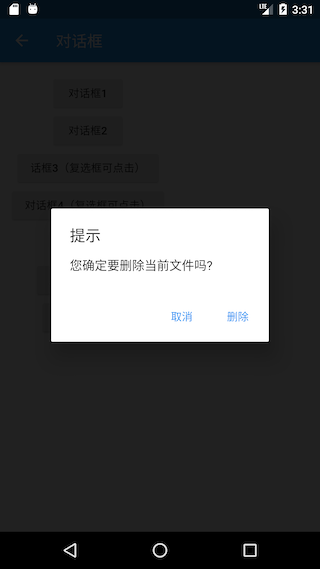

可以发现，遮罩颜色比通过`showDialog`方法打开的对话框更深。另外对话框打开/关闭的动画已变为缩放动画了，读者可以亲自运行示例查看效果。

### 对话框实现原理

我们以`showGeneralDialog`方法为例来看看它的具体实现：

```dart
Future<T?> showGeneralDialog<T extends Object?>({
  required BuildContext context,
  required RoutePageBuilder pageBuilder,
  bool barrierDismissible = false,
  String? barrierLabel,
  Color barrierColor = const Color(0x80000000),
  Duration transitionDuration = const Duration(milliseconds: 200),
  RouteTransitionsBuilder? transitionBuilder,
  bool useRootNavigator = true,
  RouteSettings? routeSettings,
}) {
  return Navigator.of(context, rootNavigator: useRootNavigator).push<T>(RawDialogRoute<T>(
    pageBuilder: pageBuilder,
    barrierDismissible: barrierDismissible,
    barrierLabel: barrierLabel,
    barrierColor: barrierColor,
    transitionDuration: transitionDuration,
    transitionBuilder: transitionBuilder,
    settings: routeSettings,
  ));
}
```

实现很简单，直接调用`Navigator`的`push`方法打开了一个新的对话框路由`RawDialogRoute`，然后返回了`push`的返回值。可见对话框实际上正是通过路由的形式实现的，这也是为什么我们可以使用`Navigator`的`pop` 方法来退出对话框的原因。关于对话框的样式定制在`RawDialogRoute`中，没有什么新的东西，读者可以自行查看。

### 对话框状态管理

我们在用户选择删除一个文件时，会询问是否删除此文件；在用户选择一个文件夹是，应该再让用户确认是否删除子文件夹。为了在用户选择了文件夹时避免二次弹窗确认是否删除子目录，我们在确认对话框底部添加一个“同时删除子目录？”的复选框，如图所示：


现在就有一个问题：如何管理复选框的选中状态？习惯上，我们会在路由页的State中来管理选中状态，我们可能会写出如下这样的代码：

```dart
class _DialogRouteState extends State<DialogRoute> {
  bool withTree = false; // 复选框选中状态

  @override
  Widget build(BuildContext context) {
    return Column(
      children: <Widget>[
        ElevatedButton(
          child: Text("对话框2"),
          onPressed: () async {
            bool? delete = await showDeleteConfirmDialog2();
            if (delete == null) {
              print("取消删除");
            } else {
              print("同时删除子目录: $delete");
            }
          },
        ),
      ],
    );
  }

  Future<bool?> showDeleteConfirmDialog2() {
    withTree = false; // 默认复选框不选中
    return showDialog<bool>(
      context: context,
      builder: (context) {
        return AlertDialog(
          title: Text("提示"),
          content: Column(
            crossAxisAlignment: CrossAxisAlignment.start,
            mainAxisSize: MainAxisSize.min,
            children: <Widget>[
              Text("您确定要删除当前文件吗?"),
              Row(
                children: <Widget>[
                  Text("同时删除子目录？"),
                  Checkbox(
                    value: withTree,
                    onChanged: (bool value) {
                      //复选框选中状态发生变化时重新构建UI
                      setState(() {
                        //更新复选框状态
                        withTree = !withTree;
                      });
                    },
                  ),
                ],
              ),
            ],
          ),
          actions: <Widget>[
            TextButton(
              child: Text("取消"),
              onPressed: () => Navigator.of(context).pop(),
            ),
            TextButton(
              child: Text("删除"),
              onPressed: () {
                //执行删除操作
                Navigator.of(context).pop(withTree);
              },
            ),
          ],
        );
      },
    );
  }
}
```

然后，当我们运行上面的代码时我们会发现复选框根本选不中！为什么会这样呢？其实原因很简单，我们知道`setState`方法只会针对当前context的子树重新build，但是我们的对话框并不是在`_DialogRouteState`的`build` 方法中构建的，而是通过`showDialog`单独构建的，所以在`_DialogRouteState`的context中调用`setState`是无法影响通过`showDialog`构建的UI的。另外，我们可以从另外一个角度来理解这个现象，前面说过对话框也是通过路由的方式来实现的，那么上面的代码实际上就等同于企图在父路由中调用`setState`来让子路由更新，这显然是不行的！简尔言之，根本原因就是context不对。那如何让复选框可点击呢？通常有如下三种方法：

#### 单独抽离出StatefulWidget

既然是context不对，那么直接的思路就是将复选框的选中逻辑单独封装成一个`StatefulWidget`，然后在其内部管理复选状态。我们先来看看这种方法，下面是实现代码：

```dart
// 单独封装一个内部管理选中状态的复选框组件
class DialogCheckbox extends StatefulWidget {
  const DialogCheckbox({
    Key? key,
    this.value,
    required this.onChanged,
  });

  final ValueChanged<bool?> onChanged;
  final bool? value;

  @override
  State<DialogCheckbox> createState() => _DialogCheckboxState();
}

class _DialogCheckboxState extends State<DialogCheckbox> {
  bool? value;

  @override
  void initState() {
    value = widget.value;
    super.initState();
  }

  @override
  Widget build(BuildContext context) {
    return Checkbox(
      value: value,
      onChanged: (v) {
        //将选中状态通过事件的形式抛出
        widget.onChanged(v);
        setState(() {
          //更新自身选中状态
          value = v;
        });
      },
    );
  }
}
```

下面是弹出对话框的代码：

```dart
Future<bool?> showDeleteConfirmDialog3() {
  bool _withTree = false; //记录复选框是否选中
  return showDialog<bool>(
    context: context,
    builder: (context) {
      return AlertDialog(
        title: Text('提示'),
        content: Column(
          crossAxisAlignment: CrossAxisAlignment.start,
          mainAxisSize: MainAxisSize.min,
          children: [
            Text('您确定要删除当前文件吗？'),
            Row(
              children: [
                Text('同时删除子目录？'),
                DialogCheckbox(
                  value: _withTree,
                  onChanged: (bool? value) {
                    _withTree = value!;
                  },
                ),
              ],
            ),
          ],
        ),
        actions: [
          TextButton(
            onPressed: () => Navigator.of(context).pop(),
            child: Text('取消'),
          ),
          TextButton(
            onPressed: () {
              // 将选中状态返回
              Navigator.of(context).pop(_withTree);
            },
            child: Text('删除'),
          ),
        ],
      );
    });
}
```

最后，就是使用：

```dart
ElevatedButton(
  child: Text("话框3（复选框可点击）"),
  onPressed: () async {
    //弹出删除确认对话框，等待用户确认
    bool? deleteTree = await showDeleteConfirmDialog3();
    if (deleteTree == null) {
      print("取消删除");
    } else {
      print("同时删除子目录: $deleteTree");
    }
  },
),
```

运行后效果如图所示：


可见复选框能选中了，点击“取消”或“删除”后，控制台就会打印出最终的确认状态。

**状态流转的流程：**


#### 使用StatefulBuilder方法

上面的方法虽然能解决对话框状态更新的问题，但是有一个明显的缺点——对话框上所有可能会改变状态的组件都得单独封装在一个在内部管理状态的`StatefulWidget`中，这样不仅麻烦，而且复用性不大。因此，我们来想想能不能找到一种更简单的方法？上面的方法本质上就是将对话框的状态置于一个`StatefulWidget`的上下文中，由`StatefulWidget`在内部管理，那么我们有没有办法在不需要单独抽离组件的情况下创建一个`StatefulWidget`的上下文呢？想到这里，我们可以从`Builder`组件的实现获得灵感。在前面介绍过`Builder`组件可以获得组件所在位置的真正的Context，那它是怎么实现的呢，我们看看它的源码：

```dart
class Builder extends StatelessWidget {
  const Builder({
    Key? key,
    required this.builder,
  }) : assert(builder != null),
       super(key: key);
  final WidgetBuilder builder;

  @override
  Widget build(BuildContext context) => builder(context);
}
```

可以看到，`Builder`实际上只是继承了`StatelessWidget`，然后在`build`方法中获取当前context后将构建方法代理到了`builder`回调，可见，`Builder`实际上是获取了`StatelessWidget` 的上下文（context）。那么我们能否用相同的方法获取`StatefulWidget` 的上下文，并代理其`build`方法呢？下面我们照猫画虎，来封装一个`StatefulBuilder`方法：

```dart
Future<bool?> showDeleteConfirmDialog4() {
  bool _withTree = false; //记录复选框是否选中
  return showDialog<bool>(
    context: context,
    builder: (context) {
      return AlertDialog(
        title: Text('提示'),
        content: Column(
          crossAxisAlignment: CrossAxisAlignment.start,
          mainAxisSize: MainAxisSize.min,
          children: [
            Text('您确定要删除当前文件吗？'),
            Row(
              children: [
                Text('同时删除子目录？'),
                //使用StatefulBuilder来构建StatefulWidget上下文
                StatefulBuilder(builder: (context, _setState) {
                  return Checkbox(
                    value: _withTree,
                    onChanged: (bool? value) {
                      //_setState方法实际就是该StatefulWidget的setState方法，
                      //调用后builder方法会重新被调用
                      _setState(() {
                        //更新选中状态
                        _withTree = value!;
                      });
                    },
                  );
                }),
              ],
            ),
          ],
        ),
        actions: [
          TextButton(
            onPressed: () => Navigator.of(context).pop(),
            child: Text('取消'),
          ),
          TextButton(
            onPressed: () {
              // 将选中状态返回
              Navigator.of(context).pop(_withTree);
            },
            child: Text('删除'),
          ),
        ],
      );
    });
}
```

实际上，这种方法本质上就是子组件通知父组件（StatefulWidget）重新build子组件本身来实现UI更新的，读者可以对比代码理解。实际上`StatefulBuilder`正是Flutter SDK中提供的一个类，它和`Builder`的原理是一样的，在此，提醒读者一定要将`StatefulBuilder`和`Builder`理解透彻，因为它们在Flutter中是非常实用的。

#### 精妙的解法

是否还有更简单的解决方案呢？要确认这个问题，我们就得先搞清楚UI是怎么更新的，我们知道在调用`setState`方法后`StatefulWidget`就会重新build，那`setState`方法做了什么呢？我们能不能从中找到方法？顺着这个思路，我们就得看一下`setState`的核心源码：

```dart
void setState(VoidCallback fn) {
  ... //省略无关代码
  _element.markNeedsBuild();
}
```

可以发现，`setState`中调用了`Element`的`markNeedsBuild()`方法，我们前面说过，Flutter是一个响应式框架，要更新UI只需改变状态后通知框架页面需要重构即可，而`Element`的`markNeedsBuild()`方法正是来实现这个功能的！`markNeedsBuild()`方法会将当前的`Element`对象标记为“dirty”（脏的），在每一个Frame，Flutter都会重新构建被标记为“dirty”`Element`对象。既然如此，我们有没有办法获取到对话框内部UI的`Element`对象，然后将其标示为为“dirty”呢？答案是肯定的！我们可以通过Context来得到`Element`对象，至于`Element`与`Context`的关系我们将会在后面“Flutter核心原理”一章中再深入介绍，现在只需要简单的认为：在组件树中，`context`实际上就是`Element`对象的引用。知道这个后，那么解决的方案就呼之欲出了，我们可以通过如下方式来让复选框可以更新：

```dart
Future<bool?> showDeleteConfirmDialog5() {
  bool _withTree = false; //记录复选框是否选中
  return showDialog<bool>(
    context: context,
    builder: (context) {
      return AlertDialog(
        title: Text('提示'),
        content: Column(
          crossAxisAlignment: CrossAxisAlignment.start,
          mainAxisSize: MainAxisSize.min,
          children: [
            Text('您确定要删除当前文件吗？'),
            Row(
              children: [
                Text('同时删除子目录？'),
                Checkbox(
                  value: _withTree,
                  onChanged: (bool? value) {
                    // 此时context为对话框UI的根Element，我们
                    // 直接将对话框UI对应的Element标记为dirty
                    (context as Element).markNeedsBuild();
                    _withTree = value!;
                  },
                ),
              ],
            ),
          ],
        ),
        actions: [
          TextButton(
            onPressed: () => Navigator.of(context).pop(),
            child: Text('取消'),
          ),
          TextButton(
            onPressed: () {
              // 将选中状态返回
              Navigator.of(context).pop(_withTree);
            },
            child: Text('删除'),
          ),
        ],
      );
    });
}
```

上面的代码运行后复选框也可以正常选中。可以看到，我们只用了一行代码便解决了这个问题！当然上面的代码并不是最优，因为我们只需要更新复选框的状态，而此时的`context`我们用的是对话框的根`context`，所以会导致整个对话框UI组件全部rebuild，因此最好的做法是将`context`的“范围”缩小，也就是说只将`Checkbox`的Element标记为`dirty`，优化后的代码为：

```dart
Row(
  children: <Widget>[
    Text("同时删除子目录？"),
    // 通过Builder来获得构建Checkbox的`context`，
    // 这是一种常用的缩小`context`范围的方式
    Builder(
      builder: (BuildContext context) {
        return Checkbox(
          value: _withTree,
          onChanged: (bool value) {
            (context as Element).markNeedsBuild();
            _withTree = !_withTree;
          },
        );
      },
    ),
  ],
),
```

### 其他类型的对话框

#### 底部菜单列表

`showModalBottomSheet`方法可以弹出一个Material风格的底部菜单列表模态对话框，示例如下：

```dart
// 弹出底部菜单列表模态对话框
Future<int?> _showModalBottomSheet() {
  return showModalBottomSheet(
    context: context,
    builder: (BuildContext context) {
      return ListView.builder(
        itemCount: 30,
        itemBuilder: (BuildContext context, int index) {
          return ListTile(
            title: Text('$index'),
            onTap: () => Navigator.of(context).pop(index),
          );
        },
      );
    },
  );
}
```

点击按钮，弹出该对话框：

```dart
ElevatedButton(
  child: Text("对话框5（复选框可点击）"),
  onPressed: () async {
    //弹出删除确认对话框，等待用户确认
    bool? deleteTree = await showDeleteConfirmDialog5();
    if (deleteTree == null) {
      print("取消删除");
    } else {
      print("同时删除子目录: $deleteTree");
    }
  },
),
```

运行后效果如图所示：


#### Loading框

其实Loading框可以直接通过`showDialog`+`AlertDialog`来自定义：

```dart
showLoadingDialog() {
  showDialog(
    context: context,
    builder: (context) {
      return AlertDialog(
        content: Column(
          mainAxisSize: MainAxisSize.min,
          children: [
            CircularProgressIndicator(),
            Padding(
              padding: EdgeInsets.only(top: 26.0),
              child: Text('正在加载，请稍后...'),
            ),
          ],
        ),
      );
    },
  );
}
```

显示效果如图所示：


如果我们嫌Loading框太宽，想自定义对话框宽度，这时只使用`SizedBox`或`ConstrainedBox`是不行的，原因是`showDialog`中已经给对话框设置了最小宽度约束，根据我们在第五章“尺寸限制类容器”一节中所述，我们可以使用`UnconstrainedBox`先抵消`showDialog`对宽度的约束，然后再使用`SizedBox`指定宽度，代码如下：

```dart
showLoadingDialog() {
  showDialog(
    context: context,
    builder: (context) {
      return UnconstrainedBox(
        constrainedAxis: Axis.vertical,
        child: SizedBox(
          width: 280,
          child: AlertDialog(
            content: Column(
              mainAxisSize: MainAxisSize.min,
              children: [
                CircularProgressIndicator(),
                Padding(
                  padding: EdgeInsets.only(top: 26.0),
                  child: Text('正在加载，请稍后...'),
                ),
              ],
            ),
          ),
        ),
      );
    },
  );
}
```

代码运行后，效果如图所示：


#### 日历选择器

我们先看一下Material风格的日历选择器，如图所示：


实现代码：

```dart
Future<DateTime?> _showDatePicker1() {
  var date = DateTime.now();
  return showDatePicker(
    context: context,
    initialDate: date,
    firstDate: date,
    lastDate: date.add(Duration(days: 30)), //未来30天可选
  );
}
```

IOS风格的日历选择器需要使用`showCupertinoModalPopup`方法和`CupertinoDatePicker`组件来实现：

```dart
Future<DateTime?> _showDatePicker2() {
  var date = DateTime.now();
  return showCupertinoModalPopup(
    context: context,
    builder: (ctx) {
      return SizedBox(
        height: 200,
        child: CupertinoDatePicker(
          mode: CupertinoDatePickerMode.dateAndTime,
          minimumDate: date,
          maximumDate: date.add(Duration(days: 30)),
          maximumYear: date.year + 1,
          onDateTimeChanged: (DateTime value) {
            print(value);
          },
        ),
      );
    },
  );
}
```

运行效果如图所示：

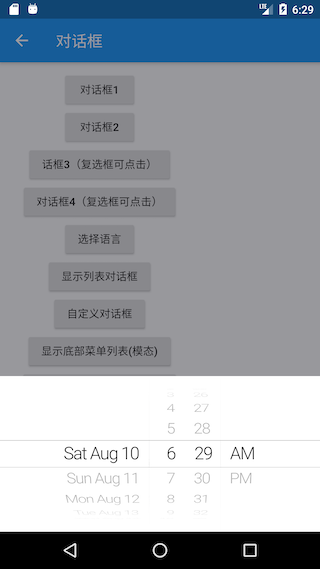
