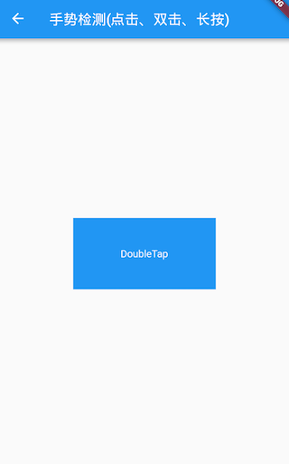
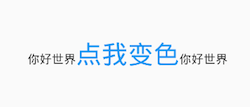
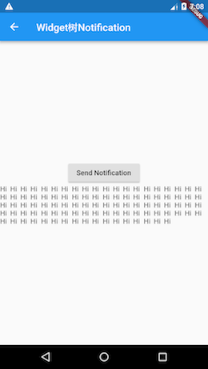
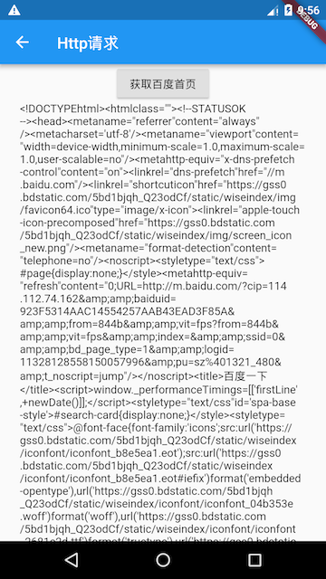
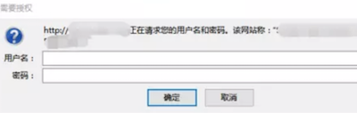
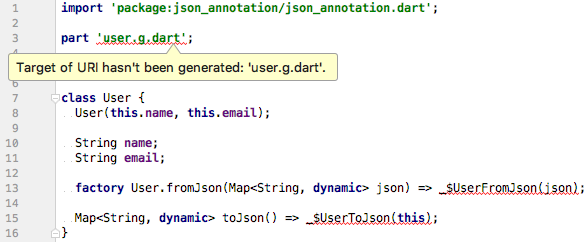

# 事件处理与通知

Flutter中的手势系统有两个独立的层。第一层为原始指针(pointer)事件，它描述了屏幕上指针（例如，触摸、鼠标和触控笔）的位置和移动。 第二层为手势，描述由一个或多个指针移动组成的语义动作，如拖动、缩放、双击等。本章将先分别介绍如何处理这两种事件，最后再介绍一下Flutter中重要的Notification机制。

## 原始指针事件处理

本节先来介绍一下原始指针事件(Pointer Event，在移动设备上通常为触摸事件)，下一节再介绍手势处理。

### 命中测试简介

在移动端，各个平台或UI系统的原始指针事件模型基本都是一致，即：一次完整的事件分为三个阶段：手指按下、手指移动、和手指抬起，而更高级别的手势（如点击、双击、拖动等）都是基于这些原始事件的。

当指针按下时，Flutter会对应用程序执行**命中测试(Hit Test)**，以确定指针与屏幕接触的位置存在哪些组件（widget）， 指针按下事件（以及该指针的后续事件）然后被分发到由命中测试发现的最内部的组件，然后从那里开始，事件会在组件树中向上冒泡，这些事件会从最内部的组件被分发到组件树根的路径上的所有组件，这和Web开发中浏览器的**事件冒泡**机制相似， 但是Flutter中没有机制取消或停止“冒泡”过程，而浏览器的冒泡是可以停止的。注意，只有通过命中测试的组件才能触发事件，我们会在下一节中深入介绍命中测试过程。

### Listener 组件

Flutter中可以使用`Listener`来监听原始触摸事件，按照本书对组件的分类，则`Listener`也是一个功能性组件。下面是`Listener`的构造函数定义：

```dart
Listener({
  Key key,
  this.onPointerDown, //手指按下回调
  this.onPointerMove, //手指移动回调
  this.onPointerUp,//手指抬起回调
  this.onPointerCancel,//触摸事件取消回调
  this.behavior = HitTestBehavior.deferToChild, //先忽略此参数，后面小节会专门介绍
  Widget child
})
```

我们先看一个示例，下面代码功能是： 手指在一个容器上移动时查看手指相对于容器的位置。

```dart
class PointerMoveIndicator extends StatefulWidget {
  const PointerMoveIndicator({Key? key});

  @override
  State<PointerMoveIndicator> createState() => _PointerMoveIndicatorState();
}

class _PointerMoveIndicatorState extends State<PointerMoveIndicator> {
  PointerEvent? _event;

  @override
  Widget build(BuildContext context) {
    return Listener(
      child: Container(
        alignment: Alignment.center,
        color: Colors.blue,
        width: 300.0,
        height: 150.0,
        child: Text(
          '${_event?.localPosition ?? ''}',
          style: TextStyle(color: Colors.white),
        ),
      ),
      onPointerDown: (PointerDownEvent event) => setState(() => _event = event),
      onPointerMove: (PointerMoveEvent event) => setState(() => _event = event),
      onPointerUp: (PointerUpEvent event) => setState(() => _event = event),
    );
  }
}
```

运行后效果如图所示：


手指在蓝色矩形区域内移动即可看到当前指针偏移，当触发指针事件时，参数 `PointerDownEvent`、 `PointerMoveEvent`、 `PointerUpEvent` 都是`PointerEvent`的子类，`PointerEvent`类中包括当前指针的一些信息，注意 Pointer，即“指针”， 指事件的触发者，可以是鼠标、触摸板、手指。

如：

- `position`：它是指针相对于当对于全局坐标的偏移。
- `localPosition`: 它是指针相对于当对于本身布局坐标的偏移。
- `delta`：两次指针移动事件（`PointerMoveEvent`）的距离。
- `pressure`：按压力度，如果手机屏幕支持压力传感器(如iPhone的3D Touch)，此属性会更有意义，如果手机不支持，则始终为1。
- `orientation`：指针移动方向，是一个角度值。

上面只是`PointerEvent`一些常用属性，除了这些它还有很多属性，读者可以查看API文档。

还有一个`behavior`属性，它决定子组件如何响应命中测试，关于该属性我们将在后面 “事件处理流程” 一节中详细介绍。

### 忽略指针事件

假如我们不想让某个子树响应`PointerEvent`的话，我们可以使用`IgnorePointer`和`AbsorbPointer`，这两个组件都能阻止子树接收指针事件，不同之处在于`AbsorbPointer`本身会参与命中测试，而`IgnorePointer`本身不会参与，这就意味着`AbsorbPointer`本身是可以接收指针事件的(但其子树不行)，而`IgnorePointer`不可以。一个简单的例子如下：

```dart
Listener(
  child: AbsorbPointer(
    child: Listener(
      child: Container(
        color: Colors.red,
        width: 200.0,
        height: 100.0,
      ),
      onPointerDown: (event)=>print("in"),
    ),
  ),
  onPointerDown: (event)=>print("up"),
)
```

点击`Container`时，由于它在`AbsorbPointer`的子树上，所以不会响应指针事件，所以日志不会输出"in"，但`AbsorbPointer`本身是可以接收指针事件的，所以会输出"up"。如果将`AbsorbPointer`换成`IgnorePointer`，那么两个都不会输出。

## 手势识别

本节先介绍一些Flutter中用于处理手势的`GestureDetector`和`GestureRecognizer`，然后再仔细讨论一下手势竞争与冲突问题。

### GestureDetector

`GestureDetector`是一个用于手势识别的功能性组件，我们通过它可以来识别各种手势。`GestureDetector` 内部封装了 Listener，用以识别语义化的手势，接下来我们详细介绍一下各种手势的识别。

#### 点击、双击、长按

我们通过`GestureDetector`对`Container`进行手势识别，触发相应事件后，在`Container`上显示事件名，为了增大点击区域，将`Container`设置为200×100，代码如下：

```dart
class GestureTest extends StatefulWidget {
  const GestureTest({Key? key});

  @override
  State<GestureTest> createState() => _GestureTestState();
}

class _GestureTestState extends State<GestureTest> {
  String _operation = "No Gesture detected!"; //保存事件名

  @override
  Widget build(BuildContext context) {
    return Center(
      child: GestureDetector(
        child: Container(
          alignment: Alignment.center,
          color: Colors.blue,
          width: 200.0,
          height: 200.0,
          child: Text(
            _operation,
            style: TextStyle(color: Colors.white),
          ),
          
        ),
        onTap: () => updateText('Tap'), //点击
        onDoubleTap: () => updateText('DoubleTap'), //双击
        onLongPress: () => updateText('LongPress'), //长按
      ),
    );
  }

  void updateText(String text){
    //更新显示的事件名
    setState(() {
      _operation = text;
    });
  }
}
```

运行效果如图所示：



> **注意**： 当同时监听`onTap`和`onDoubleTap`事件时，当用户触发tap事件时，会有200毫秒左右的延时，这是因为当用户点击完之后很可能会再次点击以触发双击事件，所以`GestureDetector`会等一段时间来确定是否为双击事件。如果用户只监听了`onTap`（没有监听`onDoubleTap`）事件时，则没有延时。

#### 拖动、滑动

一次完整的手势过程是指用户手指按下到抬起的整个过程，期间，用户按下手指后可能会移动，也可能不会移动。`GestureDetector`对于拖动和滑动事件是没有区分的，他们本质上是一样的。`GestureDetector`会将要监听的组件的原点（左上角）作为本次手势的原点，当用户在监听的组件上按下手指时，手势识别就会开始。下面我们看一个拖动圆形字母A的示例：

```dart
class Drag extends StatefulWidget {
  const Drag({Key? key});

  @override
  State<Drag> createState() => _DragState();
}

class _DragState extends State<Drag>{
  double _top = 0.0; //距顶部的偏移
  double _left = 0.0; //距左边的偏移

  @override
  Widget build(BuildContext context) {
    return Stack(
      children: [
        Positioned(
          top: _top,
          left: _left,
          child: GestureDetector(
            child: CircleAvatar(child: Text('A')),
            //手指按下时会触发此回调
            onPanDown: (DragDownDetails e) {
              //打印手指按下的位置(相对于屏幕)
              print('用户手指按下：${e.globalPosition}');
            },
            //手指滑动时会触发此回调
            onPanUpdate: (DragUpdateDetails e) {
              //用户手指滑动时，更新偏移，重新构建
              setState(() {
                _left += e.delta.dy;
                _top += e.delta.dy;
              });
            },
            onPanEnd: (DragEndDetails e) {
              //打印滑动结束时在x、y轴上的速度
              print(e.velocity);
            },
          ),
        ),
      ],
    );
  }
}
```

运行后，就可以在任意方向拖动了，运行效果如图所示：


日志：

```
I/flutter ( 8513): 用户手指按下：Offset(26.3, 101.8)
I/flutter ( 8513): Velocity(235.5, 125.8)
```

代码解释：

- `DragDownDetails.globalPosition`：当用户按下时，此属性为用户按下的位置相对于**屏幕**（而非父组件）原点(左上角)的偏移。
- `DragUpdateDetails.delta`：当用户在屏幕上滑动时，会触发多次Update事件，`delta`指一次Update事件的滑动的偏移量。
- `DragEndDetails.velocity`：该属性代表用户抬起手指时的滑动速度(包含x、y两个轴的），示例中并没有处理手指抬起时的速度，常见的效果是根据用户抬起手指时的速度做一个减速动画。

**单一方向拖动**

在上例中，是可以朝任意方向拖动的，但是在很多场景，我们只需要沿一个方向来拖动，如一个垂直方向的列表，`GestureDetector`可以只识别特定方向的手势事件，我们将上面的例子改为只能沿垂直方向拖动：

```dart
class _DragVertical extends StatefulWidget {
  @override
  _DragVerticalState createState() => _DragVerticalState();
}

class _DragVerticalState extends State<_DragVertical> {
  double _top = 0.0;

  @override
  Widget build(BuildContext context) {
    return Stack(
      children: <Widget>[
        Positioned(
          top: _top,
          child: GestureDetector(
            child: CircleAvatar(child: Text("A")),
            //垂直方向拖动事件
            onVerticalDragUpdate: (DragUpdateDetails details) {
              setState(() {
                _top += details.delta.dy;
              });
            },
          ),
        )
      ],
    );
  }
}
```

这样就只能在垂直方向拖动了，如果只想在水平方向滑动同理。

#### 缩放

`GestureDetector`可以监听缩放事件，下面示例演示了一个简单的图片缩放效果：

```dart
class Scale extends StatefulWidget {
  const Scale({Key? key});

  @override
  State<Scale> createState() => _ScaleState();
}

class _ScaleState extends State<Scale> {
  double _width = 200.0;
  @override
  Widget build(BuildContext context) {
    return Center(
      child: GestureDetector(
        child: Image.asset('./assets/images/sea.jpeg', width: _width),
        onScaleUpdate: (ScaleUpdateDetails details) {
          setState(() {
            //缩放倍数在0.8到10倍之间
            _width=200*details.scale.clamp(.8, 10.0);
          });
        },
      ),
    );
  }
}
```

运行效果如图所示：


现在在图片上双指张开、收缩就可以放大、缩小图片。本示例比较简单，实际中我们通常还需要一些其他功能，如双击放大或缩小一定倍数、双指张开离开屏幕时执行一个减速放大动画等，读者可以在学习完后面“动画”一章中的内容后自己来尝试实现一下。

### GestureRecognizer

`GestureDetector`内部是使用一个或多个`GestureRecognizer`来识别各种手势的，而`GestureRecognizer`的作用就是通过`Listener`来将原始指针事件转换为语义手势，`GestureDetector`直接可以接收一个子widget。`GestureRecognizer`是一个抽象类，一种手势的识别器对应一个`GestureRecognizer`的子类，Flutter实现了丰富的手势识别器，我们可以直接使用。

**示例**

假设我们要给一段富文本（`RichText`）的不同部分分别添加点击事件处理器，但是`TextSpan`并不是一个widget，这时我们不能用`GestureDetector`，但`TextSpan`有一个`recognizer`属性，它可以接收一个`GestureRecognizer`。

假设我们需要在点击时给文本变色:

```dart
class _GestureRecognizer extends StatefulWidget {
  const _GestureRecognizer({Key? key});

  @override
  State<_GestureRecognizer> createState() => __GestureRecognizerState();
}

class __GestureRecognizerState extends State<_GestureRecognizer> {
  TapGestureRecognizer _tapGestureRecognizer = TapGestureRecognizer();
  bool _toggle = false; // 变色开关

  @override
  void dispose() {
    //用到GestureRecognizer的话一定要调用其dispose方法释放资源
    _tapGestureRecognizer.dispose();
    super.dispose();
  }

  @override
  Widget build(BuildContext context) {
    return Center(
      child: Text.rich(
        TextSpan(
          children: [
            TextSpan(text: '你好世界'),
            TextSpan(
              text: '点我变色',
              style: TextStyle(
                fontSize: 30.0,
                color: _toggle ? Colors.blue : Colors.red,
              ),
              recognizer: _tapGestureRecognizer
                ..onTap = () {
                  setState(() {
                    _toggle = !_toggle;
                  });
                },
            ),
            TextSpan(text: '你好世界'),
          ],
        ),
      ),
    );
  }
}
```

运行效果如图所示：



> 注意：使用`GestureRecognizer`后一定要调用其`dispose()`方法来释放资源（主要是取消内部的计时器）。

## Flutter事件机制

### Flutter 事件处理流程

Flutter 事件处理流程主要分两步，为了聚焦核心流程，我们以用户触摸事件为例来说明：

1. 命中测试：当手指按下时，触发 PointerDownEvent 事件，按照深度优先遍历当前渲染（render object）树，对每一个渲染对象进行“命中测试”（hit test），如果命中测试通过，则该渲染对象会被添加到一个 HitTestResult 列表当中。
2. 事件分发：命中测试完毕后，会遍历 HitTestResult 列表，调用每一个渲染对象的事件处理方法（handleEvent）来处理 PointerDownEvent 事件，该过程称为“事件分发”（event dispatch）。随后当手指移动时，便会分发 PointerMoveEvent 事件。
3. 事件清理：当手指抬（ PointerUpEvent ）起或事件取消时（PointerCancelEvent），会先对相应的事件进行分发，分发完毕后会清空 HitTestResult 列表。


需要注意：

- 命中测试是在 PointerDownEvent 事件触发时进行的，一个完成的事件流是 down > move > up (cancle)。
- 如果父子组件都监听了同一个事件，则子组件会比父组件先响应事件。这是因为命中测试过程是按照深度优先规则遍历的，所以子渲染对象会比父渲染对象先加入 HitTestResult 列表，又因为在事件分发时是从前到后遍历 HitTestResult 列表的，所以子组件比父组件会更先被调用 handleEvent 。

下面我们从代码层面看一些整个事件处理流程：

```dart
// 触发新事件时，flutter 会调用此方法
void _handlePointerEventImmediately(PointerEvent event) {
  HitTestResult? hitTestResult;
  if (event is PointerDownEvent ) {
    hitTestResult = HitTestResult();
    // 发起命中测试
    hitTest(hitTestResult, event.position);
    if (event is PointerDownEvent) {
      _hitTests[event.pointer] = hitTestResult;
    }
  } else if (event is PointerUpEvent || event is PointerCancelEvent) {
    //获取命中测试的结果，然后移除它
    hitTestResult = _hitTests.remove(event.pointer);
  } else if (event.down) { // PointerMoveEvent
    //直接获取命中测试的结果
    hitTestResult = _hitTests[event.pointer];
  }
  // 事件分发
  if (hitTestResult != null) {
    dispatchEvent(event, hitTestResult);
  }
}
```

上面代码只是核心代码，完整的代码位于GestureBinding 实现中。下面我们分别来介绍一些命中测试和事件分发过程。

### 命中测试详解

#### 命中测试的起点

一个对象是否可以响应事件，取决于在其对命中测试过程中是否被添加到了 HitTestResult 列表 ，如果没有被添加进去，则后续的事件分发将不会分发给自己。下面我们看一下命中测试的过程：当发生用户事件时，Flutter 会从根节点（`RenderView`）开始调用它`hitTest()` 。

```dart
@override
void hitTest(HitTestResult result, Offset position) {
  //从根节点开始进行命中测试
  renderView.hitTest(result, position: position); 
  // 会调用 GestureBinding 中的 hitTest()方法，我们将在下一节中介绍。
  super.hitTest(result, position); 
}
```

上面代码位于 RenderBinding 中，核心代码只有两行，整体是命中测试分两步，我们来解释一下：

第一步： renderView 是 RenderView 对应的 RenderObject 对象， RenderObject 对象的 hitTest 方法主要功能是：从该节点出发，按照深度优先的顺序递归遍历子树（渲染树）上的每一个节点并对它们进行命中测试。这个过程称为“渲染树命中测试”。

> 注意，为了表述方便，“渲染树命中测试”，也可以表述为组件树或节点树命中测试，只是我们需要知道，命中测试的逻辑都在 RenderObject 中，而并非在 Widget或 Element 中。

第二步：渲染树命中测试完毕后，会调用 GestureBinding 的 hitTest 方法，该方法主要用于处理手势，我们会在后面介绍。

#### 渲染树命中测试过程

渲染树的命中测试流程就是父节点 hitTest 方法中不断调用子节点 hitTest 方法的递归过程。下面是`RenderView`的`hitTest()`源码：

```dart
// 发起命中测试，position 为事件触发的坐标（如果有的话）。
bool hitTest(HitTestResult result, { Offset position }) {
  if (child != null)
    child.hitTest(result, position: position); //递归对子树进行命中测试
  //根节点会始终被添加到HitTestResult列表中
  result.add(HitTestEntry(this)); 
  return true;
}
```

因为 RenderView 只有一个孩子，所以直接调用child.hitTest 即可。如果一个渲染对象有多个子节点，则命中测试逻辑为：**如果任意一个子节点通过了命中测试或者当前节点“强行声明”自己通过了命中测试，则当前节点会通过命中测试**。我们以`RenderBox`为例，看看它的`hitTest()`实现：

```dart
bool hitTest(HitTestResult result, { @required Offset position }) {
  ...  
  if (_size.contains(position)) { // 判断事件的触发位置是否位于组件范围内
    if (hitTestChildren(result, position: position) || hitTestSelf(position)) {
      result.add(BoxHitTestEntry(this, position));
      return true;
    }
  }
  return false;
}
```

上面代码中:

- `hitTestChildren()` 功能是判断是否有子节点通过了命中测试，如果有，则会将子组件添加到 HitTestResult 中同时返回 true；如果没有则直接返回false。该方法中会递归调用子组件的 hitTest 方法。
- `hitTestSelf()` 决定自身是否通过命中测试，如果节点需要确保自身一定能响应事件可以重写此函数并返回true ，相当于“强行声明”自己通过了命中测试。

需要注意，节点通过命中测试的标志是它被添加到 HitTestResult 列表中，而不是它 hitTest 的返回值，虽然大所数情况下节点通过命中测试就会返回 true，但是由于开发者在自定义组件时是可以重写 hitTest 的，所以有可能会在在通过命中测试时返回 false，或者未通过命中测试时返回 true，当然这样做并不好，我们在自定义组件时应该尽可能避免，但是在有些需要自定义命中测试流程的场景下可能就需要打破这种默契，比如我们将在本节后面实现的 HitTestBlocker 组件。

所以整体逻辑就是：

1. 先判断事件的触发位置是否位于组件范围内，如果不是则不会通过命中测试，此时 hitTest 返回 false，如果是则到第二步。
2. 会先调用 `hitTestChildren()` 判断是否有子节点通过命中测试，如果是，则将当前节点添加到 HitTestResult 列表，此时 hitTest 返回 true。即只要有子节点通过了命中测试，那么它的父节点（当前节点）也会通过命中测试。
3. 如果没有子节点通过命中测试，则会取 hitTestSelf 方法的返回值，如果返回值为 true，则当前节点通过命中测试，反之则否。

**如果当前节点有子节点通过了命中测试或者当前节点自己通过了命中测试，则将当前节点添加到 HitTestResult 中**。又因为 `hitTestChildren()`中会递归调用子组件的 hitTest 方法，所以**组件树的命中测试顺序是深度优先的，即如果通过命中测试，子组件会比父组件先被加入HitTestResult 中**。

我们看看这两个方法默认实现如下：

```dart
@protected
bool hitTestChildren(HitTestResult result, { Offset position }) => false;

@protected
bool hitTestSelf(Offset position) => false;
```

如果组件包含多个子组件，就必须重写 `hitTestChildren()` 方法，该方法中应该调用每一个子组件的 hitTest 方法，比如我们看看 RenderBoxContainerDefaultsMixin 中的实现：

```dart
// 子类的 hitTestChildren() 中会直接调用此方法
bool defaultHitTestChildren(BoxHitTestResult result, { required Offset position }) {
   // 遍历所有子组件(子节点从后向前遍历)
  ChildType? child = lastChild;
  while (child != null) {
    final ParentDataType childParentData = child.parentData! as ParentDataType;
    // isHit 为当前子节点调用hitTest() 的返回值
    final bool isHit = result.addWithPaintOffset(
      offset: childParentData.offset,
      position: position,
      //调用子组件的 hitTest方法，
      hitTest: (BoxHitTestResult result, Offset? transformed) {
        return child!.hitTest(result, position: transformed!);
      },
    );
    // 一旦有一个子节点的 hitTest() 方法返回 true，则终止遍历，直接返回true
    if (isHit) return true;
    child = childParentData.previousSibling;
  }
  return false;
}

bool addWithPaintOffset({
  required Offset? offset,
  required Offset position,
  required BoxHitTest hitTest,
}) {
  ...// 省略无关代码
    final bool isHit = hitTest(this, transformedPosition);
  return isHit; // 返回 hitTest 的执行结果
}
```

我们可以看到上面代码的主要逻辑是遍历调用子组件的 hitTest() 方法，同时提供了一种中断机制：即遍历过程中只要有子节点的 hitTest() 返回了 true 时：

1. 会终止子节点遍历，这意味着该子节点前面的兄弟节点将没有机会通过命中测试。注意，兄弟节点的遍历倒序的。
2. 父节点也会通过命中测试。因为子节点 hitTest() 返回了 true 导父节点 hitTestChildren 也会返回 true，最终会导致 父节点的 hitTest 返回 true，父节点被添加到 HitTestResult 中。

当子节点的 hitTest() 返回了 false 时，继续遍历该子节点前面的兄弟节点，对它们进行命中测试，如果所有子节点都返回 false 时，则父节点会调用自身的 hitTestSelf 方法，如果该方法也返回 false，则父节点就会被认为没有通过命中测试。

下面思考两个问题：

1. 为什么要制定这个中断呢？因为一般情况下兄弟节点占用的布局空间是不重合的，因此当用户点击的坐标位置只会有一个节点，所以一旦找到它后（通过了命中测试，hitTest 返回true），就没有必要再判断其他兄弟节点了。但是也有例外情况，比如在 Stack 布局中，兄弟组件的布局空间会重叠，如果我们想让位于底部的组件也能响应事件，就得有一种机制，能让我们确保：即使找到了一个节点，也不应该终止遍历，也就是说所有的子组件的 hitTest 方法都必须返回 false！为此，Flutter 中通过 HitTestBehavior 来定制这个过程，这个我们会在本节后面介绍。
2. 为什么兄弟节点的遍历要倒序？同 1 中所述，兄弟节点一般不会重叠，而一旦发生重叠的话，往往是后面的组件会在前面组件之上，点击时应该是后面的组件会响应事件，而前面被遮住的组件不能响应，所以命中测试应该优先对后面的节点进行测试，因为一旦通过测试，就不会再继续遍历了。如果我们按照正向遍历，则会出现被遮住的组件能响应事件，而位于上面的组件反而不能，这明显不符合预期。

我们回到 hitTestChildren 上，如果不重写 hitTestChildren，则默认直接返回 false，这也就意味着后代节点将无法参与命中测试，相当于事件被拦截了，这也正是 IgnorePointer 和 AbsorbPointer 可以拦截事件下发的原理。

如果 hitTestSelf 返回 true，则无论子节点中是否有通过命中测试的节点，当前节点自身都会被添加到 HitTestResult 中。而 IgnorePointer 和 AbsorbPointer 的区别就是，前者的 hitTestSelf 返回了 false，而后者返回了 true。

命中测试完成后，所有通过命中测试的节点都被添加到了 HitTestResult 中。

### 事件分发

事件分发过程很简单，即遍历HitTestResult，调用每一个节点的 handleEvent 方法：

```dart
// 事件分发
void dispatchEvent(PointerEvent event, HitTestResult? hitTestResult) {
  ... 
  for (final HitTestEntry entry in hitTestResult.path) {
    entry.target.handleEvent(event.transformed(entry.transform), entry);
  }
}
```

所以组件只需要重写 handleEvent 方法就可以处理事件了。

### HitTestBehavior

#### HitTestBehavior简介

我们先来实现一个能够监听 PointerDownEvent 的组件：

```dart
class PointerDownListener extends SingleChildRenderObjectWidget {
  PointerDownListener({Key? key, this.onPointerDown, Widget? child})
      : super(key: key, child: child);

  final PointerDownEventListener? onPointerDown;

  @override
  RenderObject createRenderObject(BuildContext context) =>
      RenderPointerDownListener()..onPointerDown = onPointerDown;

  @override
  void updateRenderObject(
      BuildContext context, RenderPointerDownListener renderObject) {
    renderObject.onPointerDown = onPointerDown;
  }
}

class RenderPointerDownListener extends RenderProxyBox {
  PointerDownEventListener? onPointerDown;

  @override
  bool hitTestSelf(Offset position) => true; //始终通过命中测试

  @override
  void handleEvent(PointerEvent event, covariant HitTestEntry entry) {
    //事件分发时处理事件
    if (event is PointerDownEvent) onPointerDown?.call(event);
  }
}
```

因为我们让 hitTestSelf 的返回值始终为 true，所以无论子节点是否通过命中测试，PointerDownListener 都会通过，所以续分发事件时 handleEvent 就会被调用，我们在里面判断事件类型为 PointerDownEvent 时触发回调即可，测试代码如下：

```dart
class PointerDownListenerRoute extends StatelessWidget {
  const PointerDownListenerRoute({Key? key}) : super(key: key);

  @override
  Widget build(BuildContext context) {
    return PointerDownListener(
      child: Text('Click me'),
      onPointerDown: (e) => print('down'),
    );
  }
}
```

点击文本后控制台就会打印 'down'。

Listener 的实现和 PointerDownListener 的实现原理差不多，有两点不同：

1. Listener 监听的事件类型更多一些。
2. Listener的 hitTestSelf 并不是一直返回 true。

这里需要重点说一下第二点。 Listener 组件有一个 behavior 参数，我们之前并没有介绍，下面我们仔细介绍一下。通过查看 Listener 源码，发现它的渲染对象 RenderPointerListener 继承了 RenderProxyBoxWithHitTestBehavior 类：

```dart
abstract class RenderProxyBoxWithHitTestBehavior extends RenderProxyBox {
  //[behavior] 的默认值为 [HitTestBehavior.deferToChild].
  RenderProxyBoxWithHitTestBehavior({
    this.behavior = HitTestBehavior.deferToChild,
    RenderBox? child,
  }) : super(child);

  HitTestBehavior behavior;

  @override
  bool hitTest(BoxHitTestResult result, { required Offset position }) {
    bool hitTarget = false;
    if (size.contains(position)) {
      hitTarget = hitTestChildren(result, position: position) || hitTestSelf(position);
      if (hitTarget || behavior == HitTestBehavior.translucent) //1
        result.add(BoxHitTestEntry(this, position)); // 通过命中测试
    }
    return hitTarget;
  }

  @override
  bool hitTestSelf(Offset position) => behavior == HitTestBehavior.opaque; //2

}
```

我们看到 behavior 在 hitTest 和 hitTestSelf 中会使用，它的取值会影响 Listener 的命中测试结果。我们先看看 behavior 都有哪些取值：

```dart
//在命中测试过程中 Listener 组件如何表现。
enum HitTestBehavior {
  // 组件是否通过命中测试取决于子组件是否通过命中测试
  deferToChild,
  // 组件必然会通过命中测试，同时其 hitTest 返回值始终为 true
  opaque,
  // 组件必然会通过命中测试，但其 hitTest 返回值可能为 true 也可能为 false
  translucent,
}
```

它有三个取值，我们结合 hitTest 实现来分析一下不同取值的作用：

1. behavior 为 deferToChild 时，hitTestSelf 返回 false，当前组件是否能通过命中测试完全取决于 hitTestChildren 的返回值。也就是说只要有一个子节点通过命中测试，则当前组件便会通过命中测试。
2. behavior 为 opaque 时，hitTestSelf 返回 true，hitTarget 值始终为 true，当前组件通过命中测试。
3. behavior 为 translucent 时，hitTestSelf 返回 false，hitTarget 值此时取决于 hitTestChildren 的返回值，但是无论 hitTarget 值是什么，当前节点都会被添加到 HitTestResult 中。

注意，behavior 为 opaque 和 translucent 时当前组件都会通过命中测试，它们的区别是 hitTest() 的返回值（hitTarget ）可能不同，所以它们的区别就看 hitTest() 的返回值会影响什么，这个我们已经在上面详细介绍过了，下面我们通过一个实例来理解一下。

#### 实例：实现 App 水印

效果如图所示：


实现思路是，在页面的最顶层覆盖一个水印遮罩，我们可以通过 Stack 来实现，将水印组件作为最后一个孩子传给Stack：

```dart
class WaterMaskTest extends StatelessWidget {
  const WaterMaskTest({Key? key}) : super(key: key);

  @override
  Widget build(BuildContext context) {
    return Stack(
      children: [
        wChild(1, Colors.white, 200),
        WaterMark(
         painter: TextWaterMarkPainter(text: 'wendux', rotate: -20),
        ),
      ],
    );
  }

  Widget wChild(int index, color, double size) {
    return Listener(
      onPointerDown: (e) => print(index),
      child: Container(
        width: size,
        height: size,
        color: Colors.grey,
      ),
    );
  }
}
```

WaterMark 是实现水印的组件，具体逻辑我们将在后面自定义组件一章中介绍，现在只需知道 WaterMark 中使用了 DecoratedBox。效果是实现了，但是我们点击 Stack 的第一个子组件（灰色矩形区域）时发现控制台没有任何输出，这是不符合预期的，原因是水印组件在最顶层，事件被它 “拦住了”，我们分析一下这个过程：

1. 点击时，Stack 有两个子组件，这是会先对第二个子组件（水印组件）进行点击测试，由于水印组件中使用了 DecoratedBox，查看源码后发现如果用户点击位置在 DecoratedBox上，它的 hitTestSelf 就会返回 true，所以水印组件通过命中测试。
2. 水印组件通过命中测试后就会导致 Stack 的 hitTestChildren() 直接返回（终止遍历其他子节点），所以 Stack 的第一个子组件将不会参与命中测试，因此也就不会响应事件。

原因找到了，解决的方法就是想办法让第一个子组件也能参与命中测试，这样的话，我们就得想办法让第二个子组件的 hitTest 返回 false 即可。因此我们可以用 IgnorePointer 包裹一下 WaterMask即可。

```dart
IgnorePointer(child: WaterMark(...))
```

修改后，重新运行，发现第一个子组件可以响应事件了。

如果我们想让 Stack 的所有子组件都响应事件，应该如何实现呢？当然，这很可能是一个伪需求，现实的场景中几乎不会遇到，但考虑这个问题可以加深我们对 Flutter 事件处理流程的理解。

```dart
class StackEventTest extends StatelessWidget {
  const StackEventTest({Key? key}) : super(key: key);

  @override
  Widget build(BuildContext context) {
    return Stack(
      children: [
        wChild(1),
        wChild(2),
      ],
    );
  }

  Widget wChild(int index) {
    return Listener(
      onPointerDown: (e) => print(index),
      child: Container(
        width: 100,
        height: 100,
        color: Colors.grey,
      ),
    );
  }
}
```

运行后，点击灰色框，读者猜猜控制台会打印什么？

答案是只会打印一个 '2'，原因是，Stack 先遍历第二个子节点 Listener ，因为 Container 的 hitTest 会返回 true（ 实际上 Container 是一个组合组件，本示例中，Container最终会生成一个ColoredBox，而参与命中测试的是ColoredBox对应的 RenderObject），所以 Listener 的 hitTestChildren 会返回 true，最终 Listener 的hitTest 也会返回true，所以第一个子节点将不会收到事件。

那如果我们将 Listener 的 behavior 属性指定为 opaque 或 translucent 呢？其实结果还是一样的，因为只要 Container 的 hitTest 会返回 true， 最终Listener 的 hitTestChildren 就会返回 true，第一个节点就不会再进行命中测试。 那 opaque 和 translucent 能体现出差异的具体场景有什么呢？理论上只有 Listener 的子节点 hitTest 返回 false 时两者才有区别，但是 Flutter 中有UI 的组件都会在用户点击到它之上时，它的hitTest基本都会返回 true ，因此很难找到具体场景，但是为了测试它们的区别，我们可以强行制造一个场景，比如下面代码：

```dart
class HitTestBehaviorTest extends StatelessWidget {
  const HitTestBehaviorTest({Key? key}) : super(key: key);

  @override
  Widget build(BuildContext context) {
    return Stack(
      children: [
        wChild(1),
        wChild(2),
      ],
    );
  }

  Widget wChild(int index) {
    return Listener(
      //behavior: HitTestBehavior.opaque, // 放开此行，点击只会输出 2
      behavior: HitTestBehavior.translucent, // 放开此行，点击会同时输出 2 和 1
      onPointerDown: (e) => print(index),
      child: SizedBox.expand(),
    );
  }
}
```

SizedBox 没有子元素，当它被点击时，它的 hitTest 就会返回 false，此时 Listener 的 behavior 设置为 opaque 和translucent 就会有区别（见注释）。

因为实际场景中几乎不会出现上面这样的类似的 case，所以如果想让 Stack 的所有子组件都响应事件就必须保证 Stack 的所有孩子的 hitTest 返回 false ，虽然用 IgnorePointer 包裹所有子组件就可以做到这一点，但是 IgnorePointer 也同时不会再对子组件进行命中测试，这意味着它的子组件树也将不能响应事件，比如下面的代码运行后，点击灰色区域将不会有任何输出：

```dart
class AllChildrenCanResponseEvent extends StatelessWidget {
  const AllChildrenCanResponseEvent({Key? key}) : super(key: key);

  @override
  Widget build(BuildContext context) {
    return Stack(
      children: [
        IgnorePointer(child: wChild(1, 200)),
        IgnorePointer(child: wChild(2, 200)),
      ],
    );
  }

  Widget wChild(int index, double size) {
    return Listener(
      onPointerDown: (e) => print(index),
      child: Container(
        width: size,
        height: size,
        color: Colors.grey,
      ),
    );
  }
}
```

虽然我们在子节点中通过监听了 Container 的事件，但是子节点是在 IgnorePointer 中的，所以子节点是没有机会参与命中测试的，所以不会响应任何事件。看来没有现成的组件可以满足要求，那我们就自己动手实现一个组件然后来定制它的 hitTest 来满足我们的要求即可。

#### HitTestBlocker

下面我们定义一个可以拦截 hitTest 各个过程的 HitTestBlocker 组件。

```dart
class HitTestBlocker extends SingleChildRenderObjectWidget {
  HitTestBlocker({
    Key? key,
    this.up = true,
    this.down = false,
    this.self = false,
    Widget? child,
  }) : super(key: key, child: child);

  /// up 为 true 时 , `hitTest()` 将会一直返回 false.
  final bool up;

  /// down 为 true 时, 将不会调用 `hitTestChildren()`.
  final bool down;

  /// `hitTestSelf` 的返回值
  final bool self;

  @override
  RenderObject createRenderObject(BuildContext context) {
    return RenderHitTestBlocker(up: up, down: down, self: self);
  }

  @override
  void updateRenderObject(
      BuildContext context, RenderHitTestBlocker renderObject) {
    renderObject
      ..up = up
      ..down = down
      ..self = self;
  }
}

class RenderHitTestBlocker extends RenderProxyBox {
  RenderHitTestBlocker({this.up = true, this.down = true, this.self = true});

  bool up;
  bool down;
  bool self;

  @override
  bool hitTest(BoxHitTestResult result, {required Offset position}) {
   
    bool hitTestDownResult = false;

    if (!down) {
      hitTestDownResult = hitTestChildren(result, position: position);
    }

    bool pass =
        hitTestSelf(position) || (hitTestDownResult && size.contains(position));

    if (pass) {
      result.add(BoxHitTestEntry(this, position));
    }

    return !up && pass;
  }

  @override
  bool hitTestSelf(Offset position) => self;
}class HitTestBlocker extends SingleChildRenderObjectWidget {
  HitTestBlocker({
    Key? key,
    this.up = true,
    this.down = false,
    this.self = false,
    Widget? child,
  }) : super(key: key, child: child);

  /// up 为 true 时 , `hitTest()` 将会一直返回 false.
  final bool up;

  /// down 为 true 时, 将不会调用 `hitTestChildren()`.
  final bool down;

  /// `hitTestSelf` 的返回值
  final bool self;

  @override
  RenderObject createRenderObject(BuildContext context) {
    return RenderHitTestBlocker(up: up, down: down, self: self);
  }

  @override
  void updateRenderObject(
      BuildContext context, RenderHitTestBlocker renderObject) {
    renderObject
      ..up = up
      ..down = down
      ..self = self;
  }
}

class RenderHitTestBlocker extends RenderProxyBox {
  RenderHitTestBlocker({this.up = true, this.down = true, this.self = true});

  bool up;
  bool down;
  bool self;

  @override
  bool hitTest(BoxHitTestResult result, {required Offset position}) {
   
    bool hitTestDownResult = false;

    if (!down) {
      hitTestDownResult = hitTestChildren(result, position: position);
    }

    bool pass =
        hitTestSelf(position) || (hitTestDownResult && size.contains(position));

    if (pass) {
      result.add(BoxHitTestEntry(this, position));
    }

    return !up && pass;
  }

  @override
  bool hitTestSelf(Offset position) => self;
}
```

代码很简单，但需要读者好好根据事先理解一下。我们用 HitTestBlocker 直接替换 IgnorePointer 就可以实现所有子组件都可以响应事件了，代码如下：

```dart
@override
Widget build(BuildContext context) {
  return Stack(
    children: [
      // IgnorePointer(child: wChild(1, 200)),
      // IgnorePointer(child: wChild(2, 200)),
      HitTestBlocker(child: wChild(1, 200)),
      HitTestBlocker(child: wChild(2, 200)),
    ],
  );
}
```

点击后，控制台会同时输出 2 和 1，原理也很简单 ：

1. HitTestBlocker 的 hitTest 会返回 false，这可以保证 Stack 的所有的子节点都能参与命中测试；
2. HitTestBlocker 的 hitTest 中又会调用 hitTestChildren，所以 HitTestBlocker 的后代节点是有机会参与命中测试，所以Container上的事件会被正常触发。

HitTestBlocker 是一个非常灵活的类，它可以拦截命中测试的各个阶段，通过 HitTestBlocker 完全可以实现IgnorePointer 和 AbsorbPointer 的功能， 比如当 HitTestBlocker 的 up 和 down 都为 true 时，功能和 IgnorePointer 相同。

#### 手势存在的情况

我们稍微修改一下上面的代码，将 将 Listener 换为 GestureDetector， 代码如下：

```dart
class GestureHitTestBlockerTest extends StatelessWidget {
  const GestureHitTestBlockerTest({Key? key}) : super(key: key);

  @override
  Widget build(BuildContext context) {
    return Stack(
      children: [
        HitTestBlocker(child: wChild(1, 200)),
        HitTestBlocker(child: wChild(2, 200)),
      ],
    );
  }

  Widget wChild(int index, double size) {
    return GestureDetector( // 将 Listener 换为 GestureDetector
      onTap: () => print('$index'),
      child: Container(
        width: size,
        height: size,
        color: Colors.grey,
      ),
    );
  }
}
```

可以猜一下点击后会输出什么？答案是只会输出 2 ！这是因为虽然 Stack 的两个子组件都会参与且通过命中测试，但是 GestureDetector 会在**事件分发**阶段来决定是否响应事件（而不是命中测试阶段），GestureDetector 有一套单独的处理手势冲突的机制，这个我们将在下一节中介绍。

## 手势原理与手势冲突

### 手势识别原理

手势的识别和处理都是在事件分发阶段的，GestureDetector 是一个 StatelessWidget， 包含了 RawGestureDetector，我们看一下它的 build 方法实现：

```dart
@override
Widget build(BuildContext context) {
  final  gestures = <Type, GestureRecognizerFactory>{};
  // 构建 TapGestureRecognizer 
  if (onTapDown != null ||
      onTapUp != null ||
      onTap != null ||
      ... //省略
  ) {
    gestures[TapGestureRecognizer] = GestureRecognizerFactoryWithHandlers<TapGestureRecognizer>(
      () => TapGestureRecognizer(debugOwner: this),
      (TapGestureRecognizer instance) {
        instance
          ..onTapDown = onTapDown
          ..onTapUp = onTapUp
          ..onTap = onTap
          //省略
      },
    );
  }

  
  return RawGestureDetector(
    gestures: gestures, // 传入手势识别器
    behavior: behavior, // 同 Listener 中的 HitTestBehavior
    child: child,
  );
}
```

注意，上面我们删除了很多代码，只保留了 TapGestureRecognizer（点击手势识别器） 相关代码，我们以点击手势识别为例讲一下整个过程。RawGestureDetector 中会通过 Listener 组件监听 PointerDownEvent 事件，相关源码如下：

```dart
@override
Widget build(BuildContext context) {
  ... // 省略无关代码
  Widget result = Listener(
    onPointerDown: _handlePointerDown,
    behavior: widget.behavior ?? _defaultBehavior,
    child: widget.child,
  );
}  
 
void _handlePointerDown(PointerDownEvent event) {
  for (final GestureRecognizer recognizer in _recognizers!.values)
    recognizer.addPointer(event);
}
```

下面我们看一下 TapGestureRecognizer 的几个相关方法，由于 TapGestureRecognizer 有多层继承关系，笔者合并了一个简化版：

```dart
class CustomTapGestureRecognizer1 extends TapGestureRecognizer {

  void addPointer(PointerDownEvent event) {
    //会将 handleEvent 回调添加到 pointerRouter 中
    GestureBinding.instance!.pointerRouter.addRoute(event.pointer, handleEvent);
  }
  
  @override
  void handleEvent(PointerEvent event) {
    //会进行手势识别，并决定是是调用 acceptGesture 还是 rejectGesture，
  }
  
  @override
  void acceptGesture(int pointer) {
    // 竞争胜出会调用
  }

  @override
  void rejectGesture(int pointer) {
    // 竞争失败会调用
  }
}
```

可以看到当 PointerDownEvent 事件触发时，会调用 TapGestureRecognizer 的 addPointer，在 addPointer 中会将 handleEvent 方法添加到 pointerRouter 中保存起来。这样一来当手势发生变化时只需要在 pointerRouter中取出 GestureRecognizer 的 handleEvent 方法进行手势识别即可。

正常情况下应该是手势直接作用的对象应该来处理手势，所以一个简单的原则就是同一个手势应该只有一个手势识别器生效，为此，手势识别才映入了手势竞技场（Arena）的概念，简单来讲：

1. 每一个手势识别器（GestureRecognizer）都是一个“竞争者”（GestureArenaMember），当发生指针事件时，他们都要在“竞技场”去竞争本次事件的处理权，默认情况最终只有一个“竞争者”会胜出(win)。
2. GestureRecognizer 的 handleEvent 中会识别手势，如果手势发生了某个手势，竞争者可以宣布自己是否胜出，一旦有一个竞争者胜出，竞技场管理者（GestureArenaManager）就会通知其他竞争者失败。
3. 胜出者的 acceptGesture 会被调用，其余的 rejectGesture 将会被调用。

上一节我们说过命中测试是从 RenderBinding 的 hitTest 开始的：

```dart
@override
void hitTest(HitTestResult result, Offset position) {
  // 从根节点开始进行命中测试
  renderView.hitTest(result, position: position); 
  // 会调用 GestureBinding 中的 hitTest()方法，我们将在下一节中介绍。
  super.hitTest(result, position); 
}
```

渲染树命中测试完成后会调用 GestureBinding 中的 hitTest() 方法：

```dart
@override // from HitTestable
void hitTest(HitTestResult result, Offset position) {
  result.add(HitTestEntry(this));
}
```

很简单， GestureBinding 也通过命中测试了，这样的话在事件分发阶段，GestureBinding 的 handleEvent 也便会被调用，由于它是最后被添加到 HitTestResult 中的，所以在事件分发阶段 GestureBinding 的 handleEvent：

```dart
@override 
void handleEvent(PointerEvent event, HitTestEntry entry) {
  // 会调用在 pointerRouter 中添加的 GestureRecognizer 的 handleEvent
  pointerRouter.route(event);
  if (event is PointerDownEvent) {
    // 分发完毕后，关闭竞技场
    gestureArena.close(event.pointer);
  } else if (event is PointerUpEvent) {
    gestureArena.sweep(event.pointer);
  } else if (event is PointerSignalEvent) {
    pointerSignalResolver.resolve(event);
  }
}
```

gestureArena 是 GestureArenaManager 类实例，负责管理竞技场。

上面关键的代码就是第一行，功能是会调用之前在 pointerRouter 中添加的 GestureRecognizer 的 handleEvent，不同 GestureRecognizer 的 handleEvent 会识别不同的手势，然后它会和 gestureArena 交互（如果当前的 GestureRecognizer 胜出，需要 gestureArena 去通知其他竞争者它们失败了），最终，如果当前GestureRecognizer 胜出，则最终它的 acceptGesture 会被调用，如果失败则其 rejectGesture 将会被调用，因为这部分代码不同的 GestureRecognizer 会不同，知道做了什么就行，读者有兴趣可以自行查看源码。

### 手势竞争

如果对一个组件同时监听水平和垂直方向的拖动手势，当我们斜着拖动时哪个方向的拖动手势回调会被触发？实际上取决于第一次移动时两个轴上的位移分量，哪个轴的大，哪个轴在本次滑动事件竞争中就胜出。上面已经说过，每一个手势识别器（`GestureRecognizer`）都是一个“竞争者”（`GestureArenaMember`），当发生指针事件时，他们都要在“竞技场”去竞争本次事件的处理权，默认情况最终只有一个“竞争者”会胜出(win)。例如，假设有一个`ListView`，它的第一个子组件也是`ListView`，如果现在滑动这个子`ListView`，父`ListView`会动吗？答案是否定的，这时只有子`ListView`会动，因为这时子`ListView`会胜出而获得滑动事件的处理权。

下面我们看一个简单的例子：

```dart
GestureDetector( //GestureDetector2
  onTapUp: (x)=>print("2"), // 监听父组件 tapUp 手势
  child: Container(
    width:200,
    height: 200,
    color: Colors.red,
    alignment: Alignment.center,
    child: GestureDetector( //GestureDetector1
      onTapUp: (x)=>print("1"), // 监听子组件 tapUp 手势
      child: Container(
        width: 50,
        height: 50,
        color: Colors.grey,
      ),
    ),
  ),
);
```

当我们点击子组件（灰色区域）时，控制台只会打印 “1”, 并不会打印 “2”，这是因为手指抬起后，GestureDetector1 和 GestureDetector 2 会发生竞争，判定获胜的规则是“子组件优先”，所以 GestureDetector1 获胜，因为只能有一个“竞争者”胜出，所以 GestureDetector 2 将被忽略。这个例子中想要解决冲突的方法很简单，将 GestureDetector 换为 Listener 即可，具体原因我们在后面解释。

我们再看一个例子，我们以拖动手势为例，同时识别水平和垂直方向的拖动手势，当用户按下手指时就会触发竞争（水平方向和垂直方向），一旦某个方向“获胜”，则直到当次拖动手势结束都会沿着该方向移动。代码如下：

```dart
class _BothDirectionTest extends StatefulWidget {
  @override
  _BothDirectionTestState createState() => _BothDirectionTestState();
}

class _BothDirectionTestState extends State<_BothDirectionTest> {
  double _top = 0.0;
  double _left = 0.0;

  @override
  Widget build(BuildContext context) {
    return Stack(
      children: <Widget>[
        Positioned(
          top: _top,
          left: _left,
          child: GestureDetector(
            child: CircleAvatar(child: Text("A")),
            //垂直方向拖动事件
            onVerticalDragUpdate: (DragUpdateDetails details) {
              setState(() {
                _top += details.delta.dy;
              });
            },
            onHorizontalDragUpdate: (DragUpdateDetails details) {
              setState(() {
                _left += details.delta.dx;
              });
            },
          ),
        )
      ],
    );
  }
}
```

此示例运行后，每次拖动只会沿一个方向移动（水平或垂直），而竞争发生在手指按下后首次移动（move）时，此例中具体的“获胜”条件是：首次移动时的位移在水平和垂直方向上的分量大的一个获胜。

### 多手势冲突

由于手势竞争最终只有一个胜出者，所以，当我们通过一个 GestureDetector 监听多种手势时，也可能会产生冲突。假设有一个widget，它可以左右拖动，现在我们也想检测在它上面手指按下和抬起的事件，代码如下：

```dart
class GestureConflictTestRouteState extends State<GestureConflictTestRoute> {
  double _left = 0.0;
  @override
  Widget build(BuildContext context) {
    return Stack(
      children: <Widget>[
        Positioned(
          left: _left,
          child: GestureDetector(
              child: CircleAvatar(child: Text("A")), //要拖动和点击的widget
              onHorizontalDragUpdate: (DragUpdateDetails details) {
                setState(() {
                  _left += details.delta.dx;
                });
              },
              onHorizontalDragEnd: (details){
                print("onHorizontalDragEnd");
              },
              onTapDown: (details){
                print("down");
              },
              onTapUp: (details){
                print("up");
              },
          ),
        )
      ],
    );
  }
}
```

现在我们按住圆形“A”拖动然后抬起手指，控制台日志如下:

```dart
I/flutter (17539): down
I/flutter (17539): onHorizontalDragEnd
```

我们发现没有打印"up"，这是因为在拖动时，刚开始按下手指且没有移动时，拖动手势还没有完整的语义，此时TapDown手势胜出(win)，此时打印"down"，而拖动时，拖动手势会胜出，当手指抬起时，`onHorizontalDragEnd` 和 `onTapUp`发生了冲突，但是因为是在拖动的语义中，所以`onHorizontalDragEnd`胜出，所以就会打印 “onHorizontalDragEnd”。

如果我们的代码逻辑中，对于手指按下和抬起是强依赖的，比如在一个轮播图组件中，我们希望手指按下时，暂停轮播，而抬起时恢复轮播，但是由于轮播图组件中本身可能已经处理了拖动手势（支持手动滑动切换），甚至可能也支持了缩放手势，这时我们如果在外部再用`onTapDown`、`onTapUp`来监听的话是不行的。这时我们应该怎么做？其实很简单，通过Listener监听原始指针事件就行：

```dart
Positioned(
  top:80.0,
  left: _leftB,
  child: Listener(
    onPointerDown: (details) {
      print("down");
    },
    onPointerUp: (details) {
      //会触发
      print("up");
    },
    child: GestureDetector(
      child: CircleAvatar(child: Text("B")),
      onHorizontalDragUpdate: (DragUpdateDetails details) {
        setState(() {
          _leftB += details.delta.dx;
        });
      },
      onHorizontalDragEnd: (details) {
        print("onHorizontalDragEnd");
      },
    ),
  ),
)
```

### 解决手势冲突

手势是对原始指针的语义化的识别，**手势冲突只是手势级别的，也就是说只会在组件树中的多个 GestureDetector 之间才有冲突的场景，如果压根就没有使用 GestureDetector 则不存在所谓的冲突，因为每一个节点都能收到事件**，只是在 GestureDetector 中为了识别语义，它会去决定哪些子节点应该忽略事件，哪些节点应该生效。

解决手势冲突的方法有两种：

1. 使用 Listener。这相当于跳出了手势识别那套规则。
2. 自定义手势手势识别器（ Recognizer）。

#### 通过 Listener 解决手势冲突

通过 Listener 解决手势冲突的原因是竞争只是针对手势的，而 Listener 是监听原始指针事件，原始指针事件并非语义话的手势，所以根本不会走手势竞争的逻辑，所以也就不会相互影响。拿上面两个 Container 嵌套的例子来说，通过Listener的解决方式为：

```dart
Listener(  // 将 GestureDetector 换位 Listener 即可
  onPointerUp: (x) => print("2"),
  child: Container(
    width: 200,
    height: 200,
    color: Colors.red,
    alignment: Alignment.center,
    child: GestureDetector(
      onTap: () => print("1"),
      child: Container(
        width: 50,
        height: 50,
        color: Colors.grey,
      ),
    ),
  ),
);
```

代码很简单，只需将 GestureDetector 换位 Listener 即可，可以两个都换，也可以只换一个。可以看见，通过`Listener`直接识别原始指针事件来解决冲突的方法很简单，因此，当遇到手势冲突时，我们应该优先考虑 Listener 。

#### 通过自定义 Recognizer 解决手势冲突

自定义手势识别器的方式比较麻烦，原理时当确定手势竞争胜出者时，会调用胜出者的`acceptGesture` 方法，表示“宣布成功”，然后会调用其他手势识别其的`rejectGesture` 方法，表示“宣布失败”。既然如此，我们可以自定义手势识别器（Recognizer），然后去重写它的`rejectGesture` 方法：在里面调用`acceptGesture` 方法，这就相当于它失败是强制将它也变成竞争的成功者了，这样它的回调也就会执行。

我们先自定义tap手势识别器（Recognizer）：

```dart
class CustomTapGestureRecognizer extends TapGestureRecognizer {
  @override
  void rejectGesture(int pointer) {
    //不，我不要失败，我要成功
    //super.rejectGesture(pointer);
    //宣布成功
    super.acceptGesture(pointer);
  }
}

//创建一个新的GestureDetector，用我们自定义的 CustomTapGestureRecognizer 替换默认的
RawGestureDetector customGestureDetector({
  GestureTapCallback? onTap,
  GestureTapDownCallback? onTapDown,
  Widget? child,
}) {
  return RawGestureDetector(
    child: child,
    gestures: {
      CustomTapGestureRecognizer:
          GestureRecognizerFactoryWithHandlers<CustomTapGestureRecognizer>(
        () => CustomTapGestureRecognizer(),
        (detector) {
          detector.onTap = onTap;
        },
      )
    },
  );
}
```

我们通过 RawGestureDetector 来自定义 customGestureDetector，GestureDetector 中也是通过 RawGestureDetector 来包装各种Recognizer 来实现的，我们需要自定义哪个 Recognizer，就添加哪个即可。

现在我们看看修改调用代码：

```dart
customGestureDetector( // 替换 GestureDetector
  onTap: () => print("2"),
  child: Container(
    width: 200,
    height: 200,
    color: Colors.red,
    alignment: Alignment.center,
    child: GestureDetector(
      onTap: () => print("1"),
      child: Container(
        width: 50,
        height: 50,
        color: Colors.grey,
      ),
    ),
  ),
);
```

这样就 OK 了，需要注意，这个例子同时说明了一次手势处理过程也是可以有多个胜出者的。

## 事件总线

在 App 中，我们经常会需要一个广播机制，用以跨页面事件通知，比如一个需要登录的 App 中，页面会关注用户登录或注销事件，来进行一些状态更新。这时候，一个事件总线便会非常有用，事件总线通常实现了订阅者模式，订阅者模式包含发布者和订阅者两种角色，可以通过事件总线来触发事件和监听事件，本节我们实现一个简单的全局事件总线，我们使用单例模式，代码如下：

```dart
//订阅者回调签名
typedef void EventCallback(arg);

class EventBus {
  //私有构造函数
  EventBus._internal();

  //保存单例
  static EventBus _singleton = EventBus._internal();

  //工厂构造函数
  factory EventBus()=> _singleton;

  //保存事件订阅者队列，key:事件名(id)，value: 对应事件的订阅者队列
  final _emap = Map<Object, List<EventCallback>?>();

  //添加订阅者
  void on(eventName, EventCallback f) {
    _emap[eventName] ??=  <EventCallback>[];
    _emap[eventName]!.add(f);
  }

  //移除订阅者
  void off(eventName, [EventCallback? f]) {
    var list = _emap[eventName];
    if (eventName == null || list == null) return;
    if (f == null) {
      _emap[eventName] = null;
    } else {
      list.remove(f);
    }
  }

  //触发事件，事件触发后该事件所有订阅者会被调用
  void emit(eventName, [arg]) {
    var list = _emap[eventName];
    if (list == null) return;
    int len = list.length - 1;
    //反向遍历，防止订阅者在回调中移除自身带来的下标错位
    for (var i = len; i > -1; --i) {
      list[i](arg);
    }
  }
}


//定义一个top-level（全局）变量，页面引入该文件后可以直接使用bus
var bus = EventBus();
```

使用示例：

```dart
//页面A中
...
 //监听登录事件
bus.on("login", (arg) {
  // do something
});

//登录页B中
...
//登录成功后触发登录事件，页面A中订阅者会被调用
bus.emit("login", userInfo);
```

> 注意：Dart中实现单例模式的标准做法就是使用static变量+工厂构造函数的方式，这样就可以保证`EventBus()`始终返回都是同一个实例，读者应该理解并掌握这种方法。

事件总线通常用于组件之间状态共享，但关于组件之间状态共享也有一些专门的包如redux、mobx以及前面介绍过的Provider。对于一些简单的应用，事件总线是足以满足业务需求的，如果你决定使用状态管理包的话，一定要想清楚您的 App 是否真的有必要使用它，防止“化简为繁”、过度设计。

## 通知 Notification

通知（Notification）是Flutter中一个重要的机制，在widget树中，每一个节点都可以分发通知，通知会沿着当前节点向上传递，所有父节点都可以通过`NotificationListener`来监听通知。Flutter中将这种由子向父的传递通知的机制称为**通知冒泡**（Notification Bubbling）。通知冒泡和用户触摸事件冒泡是相似的，但有一点不同：通知冒泡可以中止，但用户触摸事件不行。

> 注意：通知冒泡和Web开发中浏览器事件冒泡原理是相似的，都是事件从出发源逐层向上传递，我们可以在上层节点任意位置来监听通知/事件，也可以终止冒泡过程，终止冒泡后，通知将不会再向上传递。

### 监听通知

Flutter中很多地方使用了通知，如前面介绍的 Scrollable 组件，它在滑动时就会分发**滚动通知**（ScrollNotification），而 Scrollbar 正是通过监听 ScrollNotification 来确定滚动条位置的。

下面是一个监听可滚动组件滚动通知的例子：

```dart
void main(List<String> args) {
  runApp(
    MaterialApp(
      title: 'My app',
      home: Scaffold(
        appBar: AppBar(
          title: Text('通知'),
        ),
        body: NotificationListener(
          onNotification: (notification) {
            switch (notification.runtimeType) {
              case ScrollStartNotification:
                print("开始滚动");
                break;
              case ScrollUpdateNotification:
                print("正在滚动");
                break;
              case ScrollEndNotification:
                print("滚动停止");
                break;
              case OverscrollNotification:
                print("滚动到边界");
                break;
            }
            return false;
          },
          child: ListView.builder(
            itemCount: 100,
            itemBuilder: (context, index) {
              return ListTile(title: Text('$index'),);
            },
          ),
        ),
      ),
    ),
  );
}
```

上例中的滚动通知如`ScrollStartNotification`、`ScrollUpdateNotification`等都是继承自`ScrollNotification`类，不同类型的通知子类会包含不同的信息，比如`ScrollUpdateNotification`有一个`scrollDelta`属性，它记录了移动的位移，其他通知属性读者可以自己查看SDK文档。

上例中，我们通过`NotificationListener`来监听子`ListView`的滚动通知的，`NotificationListener`定义如下：

```dart
class NotificationListener<T extends Notification> extends StatelessWidget {
  const NotificationListener({
    Key key,
    required this.child,
    this.onNotification,
  }) : super(key: key);
 ...//省略无关代码 
}
```

我们可以看到：

1. `NotificationListener` 继承自`StatelessWidget`类，所以它可以直接嵌套到 Widget 树中。
2. `NotificationListener` 可以指定一个模板参数，该模板参数类型必须是继承自`Notification`；当显式指定模板参数时，`NotificationListener` 便只会接收该参数类型的通知。举个例子，如果我们将上例子代码改为：

```dart
void main(List<String> args) {
  runApp(
    MaterialApp(
      title: 'My app',
      home: Scaffold(
        appBar: AppBar(
          title: Text('通知'),
        ),
        //指定监听通知的类型为滚动结束通知(ScrollEndNotification)
        body: NotificationListener<ScrollEndNotification>(
          onNotification: (notification) {
            //只会在滚动结束时才会触发此回调
            print(notification);
            return false;
          },
          child: ListView.builder(
            itemCount: 100,
            itemBuilder: (context, index) {
              return ListTile(
                title: Text('$index'),
              );
            },
          ),
        ),
      ),
    ),
  );
}
```

上面代码运行后便只会在滚动结束时在控制台打印出通知的信息。

3. `onNotification`回调为通知处理回调，其函数签名如下：

```dart
typedef NotificationListenerCallback<T extends Notification> = bool Function(T notification);
```

它的返回值类型为布尔值，当返回值为`true`时，阻止冒泡，其父级Widget将再也收不到该通知；当返回值为`false` 时继续向上冒泡通知。

Flutter的UI框架实现中，除了在可滚动组件在滚动过程中会发出`ScrollNotification`之外，还有一些其他的通知，如`SizeChangedLayoutNotification`、`KeepAliveNotification` 、`LayoutChangedNotification`等，Flutter正是通过这种通知机制来使父元素可以在一些特定时机来做一些事情。

### 自定义通知

除了 Flutter 内部通知，我们也可以自定义通知，下面我们看看如何实现自定义通知：

1. 定义一个通知类，要继承自Notification类；

```dart
class MyNotification extends Notification {
  MyNotification(this.msg);
  final String msg;
}
```

2. 分发通知。

`Notification`有一个`dispatch(context)`方法，它是用于分发通知的，我们说过`context`实际上就是操作`Element`的一个接口，它与`Element`树上的节点是对应的，通知会从`context`对应的`Element`节点向上冒泡。

下面我们看一个完整的例子：

```dart
class MyNotification extends Notification {
  MyNotification(this.msg);
  final String msg;
}

class NotificationRoute extends StatefulWidget {
  const NotificationRoute({Key? key});

  @override
  State<NotificationRoute> createState() => _NotificationRouteState();
}

class _NotificationRouteState extends State<NotificationRoute> {
  String _msg = '';
  @override
  Widget build(BuildContext context) {
    return NotificationListener<MyNotification>(
      onNotification: (notification) {
        setState(() {
          _msg += notification.msg + ' ';
        });
        return true;
      },
      child: Center(
        child: Column(
          mainAxisSize: MainAxisSize.min,
          children: [
            /* ElevatedButton(
              onPressed: () => MyNotification("Hi").dispatch(context),
              child: Text("Send Notification"),
            ), */
            Builder(
              builder: (context) {
                return ElevatedButton(
                  //按钮点击时分发通知
                  onPressed: () => MyNotification('Hi').dispatch(context),
                  child: Text('Send Notification'),
                );
              },
            ),
            Text(_msg),
          ],
        ),
      ),
    );
  }
}
```

上面代码中，我们每点一次按钮就会分发一个`MyNotification`类型的通知，我们在Widget根上监听通知，收到通知后我们将通知通过Text显示在屏幕上。

> 注意：代码中注释的部分是不能正常工作的，因为这个`context`是根Context，而NotificationListener是监听的子树，所以我们通过`Builder`来构建ElevatedButton，来获得按钮位置的context。

运行效果如图所示：



### 阻止通知冒泡

我们将上面的例子改为：

```dart
class NotificationRoute extends StatefulWidget {
  const NotificationRoute({Key? key});

  @override
  State<NotificationRoute> createState() => _NotificationRouteState();
}

class _NotificationRouteState extends State<NotificationRoute> {
  String _msg = '';
  @override
  Widget build(BuildContext context) {
    //监听通知
    return NotificationListener<MyNotification>(
      onNotification: (notification) {
        print(notification.msg); //打印通知
        return false;
      },
      child: NotificationListener<MyNotification>(
        onNotification: (notification) {
          setState(() {
            _msg += notification.msg + ' ';
          });
          return false; // 为false，不阻止冒泡，父NotificationListener仍然会受到通知
        },
        child: Center(
          child: Column(
            mainAxisSize: MainAxisSize.min,
            children: [
              Builder(
                builder: (context) {
                  return ElevatedButton(
                    //按钮点击时分发通知
                    onPressed: () => MyNotification('Hi').dispatch(context),
                    child: Text('Send Notification'),
                  );
                },
              ),
              Text(_msg),
            ],
          ),
        ),
      ),
    );
  }
}
```

上列中两个`NotificationListener`进行了嵌套，子`NotificationListener`的`onNotification`回调返回了`false`，表示不阻止冒泡，所以父`NotificationListener`仍然会受到通知，所以控制台会打印出通知信息；如果将子`NotificationListener`的`onNotification`回调的返回值改为`true`，则父`NotificationListener`便不会再打印通知了，因为子`NotificationListener`已经终止通知冒泡了。

### 冒泡原理

我们在上面介绍了通知冒泡的现象及使用，现在我们更深入一些，介绍一下Flutter框架中是如何实现通知冒泡的。为了搞清楚这个问题，就必须看一下源码，我们从通知分发的的源头出发，然后再顺藤摸瓜。由于通知是通过`Notification`的`dispatch(context)`方法发出的，那我们先看看`dispatch(context)`方法中做了什么，下面是相关源码：

```dart
void dispatch(BuildContext target) {
  target?.visitAncestorElements(visitAncestor);
}
```

`dispatch(context)`中调用了当前context的`visitAncestorElements`方法，该方法会从当前Element开始向上遍历父级元素；`visitAncestorElements`有一个遍历回调参数，在遍历过程中对遍历到的父级元素都会执行该回调。遍历的终止条件是：已经遍历到根Element或某个遍历回调返回`false`。源码中传给`visitAncestorElements`方法的遍历回调为`visitAncestor`方法，我们看看`visitAncestor`方法的实现：

```dart
//遍历回调，会对每一个父级Element执行此回调
bool visitAncestor(Element element) {
  //判断当前element对应的Widget是否是NotificationListener。
  
  //由于NotificationListener是继承自StatelessWidget，
  //故先判断是否是StatelessElement
  if (element is StatelessElement) {
    //是StatelessElement，则获取element对应的Widget，判断
    //是否是NotificationListener 。
    final StatelessWidget widget = element.widget;
    if (widget is NotificationListener<Notification>) {
      //是NotificationListener，则调用该NotificationListener的_dispatch方法
      if (widget._dispatch(this, element)) 
        return false;
    }
  }
  return true;
}
```

`visitAncestor`会判断每一个遍历到的父级Widget是否是`NotificationListener`，如果不是，则返回`true`继续向上遍历，如果是，则调用`NotificationListener`的`_dispatch`方法，我们看看`_dispatch`方法的源码：

```dart
bool _dispatch(Notification notification, Element element) {
  // 如果通知监听器不为空，并且当前通知类型是该NotificationListener
  // 监听的通知类型，则调用当前NotificationListener的onNotification
  if (onNotification != null && notification is T) {
    final bool result = onNotification(notification);
    // 返回值决定是否继续向上遍历
    return result == true; 
  }
  return false;
}
```

我们可以看到`NotificationListener`的`onNotification`回调最终是在`_dispatch`方法中执行的，然后会根据返回值来确定是否继续向上冒泡。上面的源码实现其实并不复杂，通过阅读这些源码，一些额外的点读者可以注意一下：

1. `Context`上也提供了遍历Element树的方法。
2. 我们可以通过`Element.widget`得到`element`节点对应的widget；我们已经反复讲过 Widget 和Element的对应关系，读者通过这些源码来加深理解。

# 动画

精心设计的动画会让用户界面感觉更直观、流畅，能改善用户体验。 Flutter可以轻松实现各种动画类型，对于许多widget，特别是[Material Design widgets ](https://flutter.io/docs/reference/widgets/material)，都带有在其设计规范中定义的标准动画效果(但也可以自定义这些效果)。本章将详细介绍Flutter的动画系统，并会通过几个小实例来演示，以帮助开发者迅速理解并掌握动画的开发流程与原理。

## Flutter动画简介

### 动画基本原理

在任何系统的UI框架中，动画实现的原理都是相同的，即：在一段时间内，快速地多次改变UI外观；由于人眼会产生视觉暂留，所以最终看到的就是一个“连续”的动画，这和电影的原理是一样的。我们将UI的一次改变称为一个动画帧，对应一次屏幕刷新，而决定动画流畅度的一个重要指标就是帧率FPS（Frame Per Second），即每秒的动画帧数。很明显，帧率越高则动画就会越流畅！一般情况下，对于人眼来说，动画帧率超过16 FPS，就基本能看了，超过 32 FPS就会感觉相对平滑，而超过 32 FPS，大多数人基本上就感受不到差别了。由于动画的每一帧都是要改变UI输出，所以在一个时间段内连续的改变UI输出是比较耗资源的，对设备的软硬件系统要求都较高，所以在UI系统中，动画的平均帧率是重要的性能指标，而在Flutter中，理想情况下是可以实现 60FPS 的，这和原生应用能达到的帧率是基本是持平的。

### Flutter中动画抽象

为了方便开发者创建动画，不同的UI系统对动画都进行了一些抽象，比如在 Android 中可以通过XML来描述一个动画然后设置给View。Flutter中也对动画进行了抽象，主要涉及 Animation、Curve、Controller、Tween这四个角色，它们一起配合来完成一个完整动画，下面我们一一来介绍它们。

#### Animation

`Animation`是一个抽象类，它本身和UI渲染没有任何关系，而它主要的功能是保存动画的插值和状态；其中一个比较常用的`Animation`类是`Animation<double>`。`Animation`对象是一个在一段时间内依次生成一个区间(Tween)之间值的类。`Animation`对象在整个动画执行过程中输出的值可以是线性的、曲线的、一个步进函数或者任何其他曲线函数等等，这由`Curve`来决定。 根据`Animation`对象的控制方式，动画可以正向运行（从起始状态开始，到终止状态结束），也可以反向运行，甚至可以在中间切换方向。`Animation`还可以生成除`double`之外的其他类型值，如：`Animation<Color>` 或`Animation<Size>`。在动画的每一帧中，我们可以通过`Animation`对象的`value`属性获取动画的当前状态值。

**动画通知**

我们可以通过`Animation`来监听动画每一帧以及执行状态的变化，`Animation`有如下两个方法：

1. `addListener()`；它可以用于给`Animation`添加帧监听器，在每一帧都会被调用。帧监听器中最常见的行为是改变状态后调用`setState()`来触发UI重建。
2. `addStatusListener()`；它可以给`Animation`添加“动画状态改变”监听器；动画开始、结束、正向或反向（见`AnimationStatus`定义）时会调用状态改变的监听器。

读者在此只需要知道帧监听器和状态监听器的区别，在后面的章节中我们将会举例说明。

#### Curve

动画过程可以是匀速的、匀加速的或者先加速后减速等。Flutter中通过`Curve`（曲线）来描述动画过程，我们把匀速动画称为线性的(Curves.linear)，而非匀速动画称为非线性的。

我们可以通过`CurvedAnimation`来指定动画的曲线，如：

```dart
final CurvedAnimation curve =
    CurvedAnimation(parent: controller, curve: Curves.easeIn);
```

`CurvedAnimation`和`AnimationController`（下面介绍）都是`Animation<double>`类型。`CurvedAnimation`可以通过包装`AnimationController`和`Curve`生成一个新的动画对象 ，我们正是通过这种方式来将动画和动画执行的曲线关联起来的。我们指定动画的曲线为`Curves.easeIn`，它表示动画开始时比较慢，结束时比较快。 [Curves](https://docs.flutter.io/flutter/animation/Curves-class.html)类是一个预置的枚举类，定义了许多常用的曲线，下面列几种常用的：

| Curves曲线 | 动画过程                     |
| ---------- | ---------------------------- |
| linear     | 匀速的                       |
| decelerate | 匀减速                       |
| ease       | 开始加速，后面减速           |
| easeIn     | 开始慢，后面快               |
| easeOut    | 开始快，后面慢               |
| easeInOut  | 开始慢，然后加速，最后再减速 |

除了上面列举的， [Curves](https://docs.flutter.io/flutter/animation/Curves-class.html)类中还定义了许多其他的曲线，在此便不一一介绍，读者可以自行查看Curves类定义。

当然我们也可以创建自己Curve，例如我们定义一个正弦曲线：

```dart
class ShakeCurve extends Curve {
  @override
  double transform(double t) {
    return math.sin(t * math.PI * 2);
  }
}
```

#### AnimationController

`AnimationController`用于控制动画，它包含动画的启动`forward()`、停止`stop()` 、反向播放 `reverse()`等方法。`AnimationController`会在动画的每一帧，就会生成一个新的值。默认情况下，`AnimationController`在给定的时间段内线性的生成从 0.0 到1.0（默认区间）的数字。 例如，下面代码创建一个`Animation`对象（但不会启动动画）：

```dart
final AnimationController controller = AnimationController(
  duration: const Duration(milliseconds: 2000),
  vsync: this,
);
```

`AnimationController`生成数字的区间可以通过`lowerBound`和`upperBound`来指定，如：

```dart
final AnimationController controller = AnimationController( 
 duration: const Duration(milliseconds: 2000), 
 lowerBound: 10.0,
 upperBound: 20.0,
 vsync: this
);
```

`AnimationController`派生自`Animation<double>`，因此可以在需要`Animation`对象的任何地方使用。 但是，`AnimationController`具有控制动画的其他方法，例如`forward()`方法可以启动正向动画，`reverse()`可以启动反向动画。在动画开始执行后开始生成动画帧，屏幕每刷新一次就是一个动画帧，在动画的每一帧，会随着根据动画的曲线来生成当前的动画值（`Animation.value`），然后根据当前的动画值去构建UI，当所有动画帧依次触发时，动画值会依次改变，所以构建的UI也会依次变化，所以最终我们可以看到一个完成的动画。 另外在动画的每一帧，`Animation`对象会调用其帧监听器，等动画状态发生改变时（如动画结束）会调用状态改变监听器。

`duration`表示动画执行的时长，通过它我们可以控制动画的速度。

> **注意**： 在某些情况下，动画值可能会超出`AnimationController`的[0.0，1.0]的范围，这取决于具体的曲线。例如，`fling()`函数可以根据我们手指滑动（甩出）的速度(velocity)、力量(force)等来模拟一个手指甩出动画，因此它的动画值可以在[0.0，1.0]范围之外 。也就是说，根据选择的曲线，`CurvedAnimation`的输出可以具有比输入更大的范围。例如，Curves.elasticIn等弹性曲线会生成大于或小于默认范围的值。

**Ticker**

当创建一个`AnimationController`时，需要传递一个`vsync`参数，它接收一个`TickerProvider`类型的对象，它的主要职责是创建`Ticker`，定义如下：

```dart
abstract class TickerProvider {
  //通过一个回调创建一个Ticker
  Ticker createTicker(TickerCallback onTick);
}
```

Flutter 应用在启动时都会绑定一个`SchedulerBinding`，通过`SchedulerBinding`可以给每一次屏幕刷新添加回调，而`Ticker`就是通过`SchedulerBinding`来添加屏幕刷新回调，这样一来，每次屏幕刷新都会调用`TickerCallback`。使用`Ticker`(而不是`Timer`)来驱动动画会防止屏幕外动画（动画的UI不在当前屏幕时，如锁屏时）消耗不必要的资源，因为Flutter中屏幕刷新时会通知到绑定的`SchedulerBinding`，而`Ticker`是受`SchedulerBinding`驱动的，由于锁屏后屏幕会停止刷新，所以`Ticker`就不会再触发。

通常我们会将`SingleTickerProviderStateMixin`添加到`State`的定义中，然后将State对象作为`vsync`的值，这在后面的例子中可以见到。

#### Tween

**1）简介**

默认情况下，`AnimationController`对象值的范围是[0.0，1.0]。如果我们需要构建UI的动画值在不同的范围或不同的数据类型，则可以使用`Tween`来添加映射以生成不同的范围或数据类型的值。例如，像下面示例，`Tween`生成[-200.0，0.0]的值：

```dart
final Tween doubleTween = Tween<double>(begin: -200.0, end: 0.0);
```

`Tween`构造函数需要`begin`和`end`两个参数。`Tween`的唯一职责就是定义从输入范围到输出范围的映射。输入范围通常为[0.0，1.0]，但这不是必须的，我们可以自定义需要的范围。

`Tween`继承自`Animatable<T>`，而不是继承自`Animation<T>`，`Animatable`中主要定义动画值的映射规则。

下面我们看一个ColorTween将动画输入范围映射为两种颜色值之间过渡输出的例子：

```dart
final Tween colorTween =
    ColorTween(begin: Colors.transparent, end: Colors.black54);
```

`Tween`对象不存储任何状态，相反，它提供了`evaluate(Animation<double> animation)`方法，它可以获取动画当前映射值。 `Animation`对象的当前值可以通过`value()`方法取到。`evaluate`函数还执行一些其他处理，例如分别确保在动画值为0.0和1.0时返回开始和结束状态。

**2）Tween.animate**

要使用 Tween 对象，需要调用其`animate()`方法，然后传入一个控制器对象。例如，以下代码在 500 毫秒内生成从 0 到 255 的整数值。

```dart
final AnimationController controller = AnimationController(
  duration: const Duration(milliseconds: 500), 
  vsync: this,
);
Animation<int> alpha = IntTween(begin: 0, end: 255).animate(controller);
```

注意`animate()`返回的是一个`Animation`，而不是一个`Animatable`。

以下示例构建了一个控制器、一条曲线和一个 Tween：

```dart
final AnimationController controller = AnimationController(
  duration: const Duration(milliseconds: 500), 
  vsync: this,
);
final Animation curve = CurvedAnimation(parent: controller, curve: Curves.easeOut);
Animation<int> alpha = IntTween(begin: 0, end: 255).animate(curve);
```

### 线性插值lerp函数

动画的原理其实就是每一帧绘制不同的内容，一般都是指定起始和结束状态，然后在一段时间内从起始状态逐渐变为结束状态，而具体某一帧的状态值会根据动画的进度来算出，因此，Flutter 中给有可能会做动画的一些状态属性都定义了静态的 lerp 方法（线性插值），比如：

```dart
//a 为起始颜色，b为终止颜色，t为当前动画的进度[0,1]
Color.lerp(a, b, t);
```

lerp 的计算一般遵循： 返回值 = a + (b - a) * t，其他拥有 lerp 方法的类：

```dart
// Size.lerp(a, b, t)
// Rect.lerp(a, b, t)
// Offset.lerp(a, b, t)
// Decoration.lerp(a, b, t)
// Tween.lerp(t) //起始状态和终止状态在构建 Tween 的时候已经指定了
...
```

需要注意，lerp 是**线性**插值，意思是返回值和动画进度t是成**一次函数**（y = kx + b）关系，因为一次函数的图像是一条直线，所以叫线性插值。如果我们想让动画按照一个曲线来执行，我们可以对 t 进行映射，比如要实现匀加速效果，则 t' = at²+bt+c，然后指定加速度 a 和 b 即可（大多数情况下需保证 t' 的取值范围在[0,1]，当然也有一些情况可能会超出该取值范围，比如弹簧（bounce）效果），而不同 Curve 可以按照不同曲线执行动画的的原理本质上就是对 t 按照不同映射公式进行映射。

## 动画基本结构及状态监听

### 动画基本结构

在Flutter中我们可以通过多种方式来实现动画，下面通过一个图片逐渐放大示例的不同实现来演示Flutter中动画的不同实现方式的区别。

#### 基础版本

下面我们演示一下最基础的动画实现方式：

```dart
class ScaleAnimationRoute extends StatefulWidget {
  const ScaleAnimationRoute({Key? key});

  @override
  State<ScaleAnimationRoute> createState() => _ScaleAnimationRouteState();
}

//需要继承TickerProvider，如果有多个AnimationController，则应该使用TickerProviderStateMixin。
class _ScaleAnimationRouteState extends State<ScaleAnimationRoute>
    with SingleTickerProviderStateMixin {
  late Animation<double> animation;
  late AnimationController controller;

  @override
  void initState() {
    super.initState();
    controller = AnimationController(
      duration: const Duration(seconds: 2),
      vsync: this,
    );

    //匀速
    //图片宽高从0变到300
    animation = Tween(begin: 0.0, end: 300.0).animate(controller)
      ..addListener(() {
        setState(() => {});
      });

    //启动动画(正向执行)
    controller.forward();
  }

  @override
  Widget build(BuildContext context) {
    return Center(
      child: Image.asset(
        'assets/images/avatar.jpeg',
        width: animation.value,
        height: animation.value,
      ),
    );
  }

  @override
  void dispose() {
    //路由销毁时需要释放动画资源
    controller.dispose();
    super.dispose();
  }
}
```

上面代码中`addListener()`函数调用了`setState()`，所以每次动画生成一个新的数字时，当前帧被标记为脏(dirty)，这会导致widget的`build()`方法再次被调用，而在`build()`中，改变Image的宽高，因为它的高度和宽度现在使用的是`animation.value` ，所以就会逐渐放大。值得注意的是动画完成时要释放控制器(调用`dispose()`方法)以防止内存泄漏。

上面的例子中并没有指定Curve，所以放大的过程是线性的（匀速），下面我们指定一个Curve，来实现一个类似于弹簧效果的动画过程，我们只需要将`initState`中的代码改为下面这样即可：

```dart
@override
initState() {
  super.initState();
  controller = AnimationController(
    duration: const Duration(seconds: 3), vsync: this);
  //使用弹性曲线
  animation=CurvedAnimation(parent: controller, curve: Curves.bounceIn);
  //图片宽高从0变到300
  animation = Tween(begin: 0.0, end: 300.0).animate(animation)
    ..addListener(() {
      setState(() => {});
    });
  //启动动画
  controller.forward();
}
```

运行后效果如图所示：


#### 使用AnimatedWidget简化

细心的读者可能已经发现上面示例中通过`addListener()`和`setState()` 来更新UI这一步其实是通用的，如果每个动画中都加这么一句是比较繁琐的。`AnimatedWidget`类封装了调用`setState()`的细节，并允许我们将 widget 分离出来，重构后的代码如下：

```dart
class AnimatedImage extends AnimatedWidget {
  const AnimatedImage({
    Key? key,
    required Animation<double> animation,
  }) : super(key: key, listenable: animation);

  @override
  Widget build(BuildContext context) {
    final animation = listenable as Animation<double>;
    return Center(
      child: Image.asset(
        'assets/images/avatar.jpeg',
        width: animation.value,
        height: animation.value,
      ),
    );
  }
}

class ScaleAnimationRoute extends StatefulWidget {
  const ScaleAnimationRoute({Key? key});

  @override
  State<ScaleAnimationRoute> createState() => _ScaleAnimationRouteState();
}

//需要继承TickerProvider，如果有多个AnimationController，则应该使用TickerProviderStateMixin。
class _ScaleAnimationRouteState extends State<ScaleAnimationRoute>
    with SingleTickerProviderStateMixin {
  late Animation<double> animation;
  late AnimationController controller;

  @override
  void initState() {
    super.initState();
    controller = AnimationController(
      duration: const Duration(seconds: 2),
      vsync: this,
    );

    //匀速
    //图片宽高从0变到300
    animation = Tween(begin: 0.0, end: 300.0).animate(controller);    

    //启动动画(正向执行)
    controller.forward();
  }

  @override
  Widget build(BuildContext context) {
    return AnimatedImage(
      animation: animation,
    );
  }

  @override
  void dispose() {
    //路由销毁时需要释放动画资源
    controller.dispose();
    super.dispose();
  }
}
```

#### 用AnimatedBuilder重构

用AnimatedWidget 可以从动画中分离出 widget，而动画的渲染过程（即设置宽高）仍然在AnimatedWidget 中，假设如果我们再添加一个 widget 透明度变化的动画，那么我们需要再实现一个AnimatedWidget，这样不是很优雅，如果我们能把渲染过程也抽象出来，那就会好很多，而AnimatedBuilder正是将渲染逻辑分离出来, 上面的 build 方法中的代码可以改为：

```dart
class ScaleAnimationRoute extends StatefulWidget {
  const ScaleAnimationRoute({Key? key});

  @override
  State<ScaleAnimationRoute> createState() => _ScaleAnimationRouteState();
}

//需要继承TickerProvider，如果有多个AnimationController，则应该使用TickerProviderStateMixin。
class _ScaleAnimationRouteState extends State<ScaleAnimationRoute>
    with SingleTickerProviderStateMixin {
  late Animation<double> animation;
  late AnimationController controller;

  @override
  void initState() {
    super.initState();
    controller = AnimationController(
      duration: const Duration(seconds: 2),
      vsync: this,
    );

    //匀速
    //图片宽高从0变到300
    animation = Tween(begin: 0.0, end: 300.0).animate(controller);

    //启动动画(正向执行)
    controller.forward();
  }

  @override
  Widget build(BuildContext context) {
    // 修改处
    //return AnimatedImage(animation: animation);
    return AnimatedBuilder(
      animation: animation,
      child: Image.asset('assets/images/avatar.jpeg'),
      builder: (BuildContext ctx, child) {
        return Center(
          child: SizedBox(
            height: animation.value,
            width: animation.value,
            child: child,
          ),
        );
      },
    );
  }

  @override
  void dispose() {
    //路由销毁时需要释放动画资源
    controller.dispose();
    super.dispose();
  }
}
```

上面的代码中有一个迷惑的问题是，`child`看起来像被指定了两次。但实际发生的事情是：将外部引用`child`传递给`AnimatedBuilder`后，`AnimatedBuilder`再将其传递给匿名构造器， 然后将该对象用作其子对象。最终的结果是`AnimatedBuilder`返回的对象插入到 widget 树中。

也许你会说这和我们刚开始的示例差不了多少，其实它会带来三个好处：

1. 不用显式的去添加帧监听器，然后再调用`setState()` 了，这个好处和`AnimatedWidget`是一样的。
2. 更好的性能：因为动画每一帧需要构建的 widget 的范围缩小了，如果没有`builder`，`setState()`将会在父组件上下文中调用，这将会导致父组件的`build`方法重新调用；而有了`builder`之后，只会导致动画widget自身的`build`重新调用，避免不必要的rebuild。
3. 通过`AnimatedBuilder`可以封装常见的过渡效果来复用动画。下面我们通过封装一个`GrowTransition`来说明，它可以对子widget实现放大动画：

```dart
class GrowTransition extends StatelessWidget {
  const GrowTransition({
    Key? key,
    required this.animation,
    this.child,
  }) : super(key: key);

  final Widget? child;
  final Animation<double> animation;

  @override
  Widget build(BuildContext context) {
    return Center(
      child: AnimatedBuilder(
        animation: animation,
        builder: (BuildContext ctx, child) {
          return Center(
            child: SizedBox(
              height: animation.value,
              width: animation.value,
              child: child,
            ),
          );
        },
        child: child,
      ),
    );
  }
}
```

这样，最初的示例就可以改为：

```dart
class ScaleAnimationRoute extends StatefulWidget {
  const ScaleAnimationRoute({Key? key});

  @override
  State<ScaleAnimationRoute> createState() => _ScaleAnimationRouteState();
}

//需要继承TickerProvider，如果有多个AnimationController，则应该使用TickerProviderStateMixin。
class _ScaleAnimationRouteState extends State<ScaleAnimationRoute>
    with SingleTickerProviderStateMixin {
  late Animation<double> animation;
  late AnimationController controller;

  @override
  void initState() {
    super.initState();
    controller = AnimationController(
      duration: const Duration(seconds: 2),
      vsync: this,
    );

    //匀速
    //图片宽高从0变到300
    animation = Tween(begin: 0.0, end: 300.0).animate(controller);

    //启动动画(正向执行)
    controller.forward();
  }

  @override
  Widget build(BuildContext context) {
    // 代码修改
    return GrowTransition(
      child: Image.asset('assets/images/avatar.jpeg'),
      animation: animation,
    );
  }

  @override
  void dispose() {
    //路由销毁时需要释放动画资源
    controller.dispose();
    super.dispose();
  }
}
```

**Flutter中正是通过这种方式封装了很多动画，如：FadeTransition、ScaleTransition、SizeTransition等，很多时候都可以复用这些预置的过渡类。**

### 动画状态监听

上面说过，我们可以通过`Animation`的`addStatusListener()`方法来添加动画状态改变监听器。Flutter中，有四种动画状态，在`AnimationStatus`枚举类中定义，下面我们逐个说明：

| 枚举值      | 含义             |
| ----------- | ---------------- |
| `dismissed` | 动画在起始点停止 |
| `forward`   | 动画正在正向执行 |
| `reverse`   | 动画正在反向执行 |
| `completed` | 动画在终点停止   |

**示例**

我们将上面图片放大的示例改为先放大再缩小再放大……这样的循环动画。要实现这种效果，我们只需要监听动画状态的改变即可，即：在动画正向执行结束时反转动画，在动画反向执行结束时再正向执行动画。代码如下：

```dart
@override
void initState() {
  super.initState();
  controller = AnimationController(
    duration: const Duration(seconds: 2),
    vsync: this,
  );

  //匀速
  //图片宽高从0变到300
  animation = Tween(begin: 0.0, end: 300.0).animate(controller);

  animation.addStatusListener((status) {
    if (status == AnimationStatus.completed) {
      //动画执行结束时反向执行动画
      controller.reverse();
    } else if (status == AnimationStatus.dismissed) {
      //动画恢复到初始状态时执行动画（正向）
      controller.forward();
    }
  });
  //启动动画(正向执行)
  controller.forward();
}
```

## 自定义路由切换动画

我们在“路由管理”一节中讲过：Material组件库中提供了一个`MaterialPageRoute`组件，它可以使用和平台风格一致的路由切换动画，如在iOS上会左右滑动切换，而在Android上会上下滑动切换。现在，我们如果在Android上也想使用左右切换风格，该怎么做？一个简单的作法是可以直接使用`CupertinoPageRoute`，如：

```dart
class PageA extends StatelessWidget {
  const PageA({Key? key}) : super(key: key);

  @override
  Widget build(BuildContext context) {
    return Scaffold(
      appBar: AppBar(
        title: const Text("PageA"),
      ),
      body: Center(
        child: TextButton(
          child: const Text('open PageB'),
          onPressed: () {
            // 导航到新路由
            Navigator.push(
              context,
              CupertinoPageRoute(
                builder: (context) => const PageB(),
              ),
            );
          },
        ),
      ),
    );
  }
}

class PageB extends StatelessWidget {
  const PageB({Key? key}) : super(key: key);

  @override
  Widget build(BuildContext context) {
    return Scaffold(
      appBar: AppBar(
        title: const Text('PageB'),
      ),
      body: const Center(
        child: Text('This is PageB'),
      ),
    );
  }
}
```

`CupertinoPageRoute`是Cupertino组件库提供的iOS风格的路由切换组件，它实现的就是左右滑动切换。那么我们如何来自定义路由切换动画呢？答案就是`PageRouteBuilder`。下面我们来看看如何使用`PageRouteBuilder`来自定义路由切换动画。例如我们想以渐隐渐入动画来实现路由过渡，实现代码如下：

```dart
class PageA extends StatelessWidget {
  const PageA({Key? key}) : super(key: key);

  @override
  Widget build(BuildContext context) {
    return Scaffold(
      appBar: AppBar(
        title: const Text("PageA"),
      ),
      body: Center(
        child: TextButton(
          child: const Text('open PageB'),
          onPressed: () {
            // 导航到新路由
            Navigator.push(
                context,
                PageRouteBuilder(
                  transitionDuration: Duration(milliseconds: 800),
                  pageBuilder: (BuildContext context, Animation animation,
                      Animation secondaryAnimation) {
                    return FadeTransition(
                      //使用渐隐渐入过渡
                      opacity: animation as Animation<double>,
                      child: PageB(), //路由B
                    );
                  },
                ));
          },
        ),
      ),
    );
  }
}
```

我们可以看到`pageBuilder` 有一个`animation`参数，这是Flutter路由管理器提供的，在路由切换时`pageBuilder`在每个动画帧都会被回调，因此我们可以通过`animation`对象来自定义过渡动画。

无论是`MaterialPageRoute`、`CupertinoPageRoute`，还是`PageRouteBuilder`，它们都继承自PageRoute类，而`PageRouteBuilder`其实只是`PageRoute`的一个包装，我们可以直接继承`PageRoute`类来实现自定义路由，上面的例子可以通过如下方式实现：

1. 定义一个路由类`FadeRoute`

```dart
class FadeRoute extends PageRoute {
  FadeRoute({
    required this.builder,
    this.transitionDuration = const Duration(milliseconds: 300),
    this.opaque = true,
    this.barrierDismissible = false,
    this.barrierColor,
    this.barrierLabel,
    this.maintainState = true,
  });

  final WidgetBuilder builder;

  @override
  final Duration transitionDuration;

  @override
  final bool opaque;

  @override
  final bool barrierDismissible;

  @override
  final Color? barrierColor;

  @override
  final String? barrierLabel;

  @override
  final bool maintainState;

  @override
  Widget buildPage(BuildContext context, Animation<double> animation,
      Animation<double> secondaryAnimation) => builder(context);

  @override
  Widget buildTransitions(BuildContext context, Animation<double> animation,
      Animation<double> secondaryAnimation, Widget child) {
     return FadeTransition( 
       opacity: animation,
       child: builder(context),
     );
  }
}
```

2. 使用`FadeRoute`

```dart
Navigator.push(
  context,
  FadeRoute(
    builder: (context) => const PageB(),
  ),
);
```

虽然上面的两种方法都可以实现自定义切换动画，但实际使用时应优先考虑使用PageRouteBuilder，这样无需定义一个新的路由类，使用起来会比较方便。但是有些时候`PageRouteBuilder`是不能满足需求的，例如在应用过渡动画时我们需要读取当前路由的一些属性，这时就只能通过继承`PageRoute`的方式了，举个例子，假如我们只想在打开新路由时应用动画，而在返回时不使用动画，那么我们在构建过渡动画时就必须判断当前路由`isActive`属性是否为`true`，代码如下：

```dart
@override
Widget buildTransitions(BuildContext context, Animation<double> animation,
                        Animation<double> secondaryAnimation, Widget child) {
  //当前路由被激活，是打开新路由
  if (isActive) {
    return FadeTransition(
      opacity: animation,
      child: builder(context),
    );
  }else{
    //是返回，则不应用过渡动画
    return Padding(padding: EdgeInsets.zero);
  }
}
```

关于路由参数的详细信息读者可以自行查阅API文档，比较简单，不再赘述。

## Hero动画

### Flutter Hero 动画

Hero 指的是可以在路由(页面)之间“飞行”的 widget，简单来说 Hero 动画就是在路由切换时，有一个共享的widget 可以在新旧路由间切换。由于共享的 widget 在新旧路由页面上的位置、外观可能有所差异，所以在路由切换时会从旧路逐渐过渡到新路由中的指定位置，这样就会产生一个 Hero 动画。

你可能多次看到过 hero 动画。例如，一个路由中显示待售商品的缩略图列表，选择一个条目会将其跳转到一个新路由，新路由中包含该商品的详细信息和“购买”按钮。 在Flutter中将图片从一个路由“飞”到另一个路由称为**hero动画**，尽管相同的动作有时也称为 **共享元素转换**。下面我们通过一个示例来体验一下 hero 动画。

> 为什么要将这种可飞行的共享组件称为hero（英雄），有一种说法是说美国文化中的超人是可以飞的，那是美国人心中的大英雄，还有漫威中的超级英雄基本上都是会飞的，所以Flutter开发人员就对这种“会飞的widget”就起了一个富有浪漫主义的名字hero。当然这种说法并非官方解释，但却很有意思。

**示例**

假设有两个路由A和B，他们的内容交互如下：

A：包含一个用户头像，圆形，点击后跳到B路由，可以查看大图。

B：显示用户头像原图，矩形。

在AB两个路由之间跳转的时候，用户头像会逐渐过渡到目标路由页的头像上，接下来我们先看看代码，然后再解析。

路由A：

```dart
class HeroAnimationRouteA extends StatelessWidget {
  const HeroAnimationRouteA({Key? key}) : super(key: key);

  @override
  Widget build(BuildContext context) {
    return Container(
      alignment: Alignment.topCenter,
      child: Column(
        children: <Widget>[
          InkWell(
            child: Hero(
              tag: "avatar", //唯一标记，前后两个路由页Hero的tag必须相同
              child: ClipOval(
                child: Image.asset(
                  "assets/images/avatar.jpeg",
                  width: 50.0,
                ),
              ),
            ),
            onTap: () {
              //打开B路由
              Navigator.push(context, PageRouteBuilder(
                pageBuilder: (
                  BuildContext context,
                  animation,
                  secondaryAnimation,
                ) {
                  return FadeTransition(
                    opacity: animation,
                    child: Scaffold(
                      appBar: AppBar(
                        title: const Text("原图"),
                      ),
                      body:  HeroAnimationRouteB(),
                    ),
                  );
                },
              ));
            },
          ),
          const Padding(
            padding: EdgeInsets.only(top: 8.0),
            child: Text("点击头像"),
          )
        ],
      ),
    );
  }
}

class HeroAnimationRouteB extends StatelessWidget {
  @override
  Widget build(BuildContext context) {
    return Center(
      child: Hero(
        tag: "avatar", //唯一标记，前后两个路由页Hero的tag必须相同
        child: Image.asset("assets/images/avatar.jpeg"),
      ),
    );
  }
}

void main(List<String> args) {
  runApp(
    MaterialApp(
      title: 'My app',
      home: Scaffold(
        appBar: AppBar(
          title: Text('Hero 动画'),
        ),
        body: HeroAnimationRouteA(),
      ),
    ),
  );
}
```

我们可以看到，实现 Hero 动画只需要用`Hero`组件将要共享的 widget 包装起来，并提供一个相同的 tag 即可，中间的过渡帧都是 Flutter 框架自动完成的。必须要注意， 前后路由页的共享`Hero`的 tag 必须是相同的，Flutter 框架内部正是通过 tag 来确定新旧路由页widget的对应关系的。

Hero 动画的原理比较简单，Flutter 框架知道新旧路由页中共享元素的位置和大小，所以根据这两个端点，在动画执行过程中求出过渡时的插值（中间态）即可，而感到幸运的是，这些事情不需要我们自己动手，Flutter 已经帮我们做了，实际上，Flutter Hero 动画的实现原理和我们在本章开始自实现的原理是差不多的，读者有兴趣可以去看 Hero 动画相关的源码。

### 自实现Hero动画

比如现在有一个头像组件，初始的时候是一个圆形的小图，我们想实现点击后查看大图的功能，为了有较好的体验，小图变成大图和大图变回小图时我们分别执行一个“飞行”过渡动画，效果如图所示：


```dart
class CustomHeroAnimation extends StatefulWidget {
  const CustomHeroAnimation({Key? key}) : super(key: key);

  @override
  _CustomHeroAnimationState createState() => _CustomHeroAnimationState();
}

class _CustomHeroAnimationState extends State<CustomHeroAnimation>
    with SingleTickerProviderStateMixin {
  late AnimationController _controller;

  bool _animating = false;
  AnimationStatus? _lastAnimationStatus;
  late Animation _animation;

  //两个组件在Stack中的rect
  Rect? child1Rect;
  Rect? child2Rect;

  @override
  void initState() {
    _controller =
        AnimationController(vsync: this, duration: Duration(milliseconds: 200));
    //应用curve
    _animation = CurvedAnimation(
      parent: _controller,
      curve: Curves.easeIn,
    );

    _controller.addListener(() {
      if (_controller.isCompleted || _controller.isDismissed) {
        if (_animating) {
          setState(() {
            _animating = false;
          });
        }
      } else {
        _lastAnimationStatus = _controller.status;
      }
    });
    super.initState();
  }

  @override
  void dispose() {
    _controller.dispose();
    super.dispose();
  }

  @override
  Widget build(BuildContext context) {
    //小头像
    final Widget child1 = wChild1();
    //大头像
    final Widget child2 = wChild2();

    //是否展示小头像；只有在动画执行时、初始状态或者刚从大图变为小图时才应该显示小头像
    bool showChild1 =
        !_animating && _lastAnimationStatus != AnimationStatus.forward;

    // 执行动画时的目标组件；如果是从小图变为大图，则目标组件是大图；反之则是小图
    Widget targetWidget;
    if (showChild1 || _controller.status == AnimationStatus.reverse) {
      targetWidget = child1;
    } else {
      targetWidget = child2;
    }

    return LayoutBuilder(builder: (context, constraints) {
      return SizedBox(
        //我们让Stack 填满屏幕剩余空间
        width: constraints.maxWidth,
        height: constraints.maxHeight,
        child: Stack(
          alignment: AlignmentDirectional.topCenter,
          children: [
            if (showChild1)
              AfterLayout( 
                //获取小图在Stack中占用的Rect信息
                callback: (value) => child1Rect = _getRect(value),
                child: child1,
              ),
            if (!showChild1)
              AnimatedBuilder(
                animation: _animation,
                builder: (context, child) {
                  //求出 rect 插值
                  final rect = Rect.lerp(
                    child1Rect,
                    child2Rect,
                    _animation.value,
                  );
                  // 通过 Positioned 设置组件大小和位置
                  return Positioned.fromRect(rect: rect!, child: child!);
                },
                child: targetWidget,
              ),
            // 用于测量 child2 的大小，设置为全透明并且不能响应事件
            IgnorePointer(
              child: Center(
                child: Opacity(
                  opacity: 0,
                  child: AfterLayout(
                    //获取大图在Stack中占用的Rect信息
                    callback: (value) => child2Rect = _getRect(value),
                    child: child2,
                  ),
                ),
              ),
            ),
          ],
        ),
      );
    });
  }

  Widget wChild1() {
    //点击后执行正向动画
    return GestureDetector(
      onTap: () {
        setState(() {
          _animating = true;
          _controller.forward();
        });
      },
      child: SizedBox(
        width: 50,
        child: ClipOval(child: Image.asset("imgs/avatar.png")),
      ),
    );
  }

  Widget wChild2() {
    // 点击后执行反向动画
    return GestureDetector(
      onTap: () {
        setState(() {
          _animating = true;
          _controller.reverse();
        });
      },
      child: Image.asset("imgs/avatar.png", width: 400),
    );
  }

  Rect _getRect(RenderAfterLayout renderAfterLayout) {
    //我们需要获取的是AfterLayout子组件相对于Stack的Rect
    return renderAfterLayout.localToGlobal(
          Offset.zero,
          //找到Stack对应的 RenderObject 对象
          ancestor: context.findRenderObject(),
        ) &
        renderAfterLayout.size;
  }
}
```

运行后点击头像就可以实现上图中的动画效果，注意，我们是通过自定义的 AfterLayout 组件来获取组件的 Rect 信息的，该组件在第四章介绍过，我们将在后面 Flutter 布局原理相关章节中详细介绍该组件原理。

可以看到，整个飞行动画的实现还是比较复杂的，但由于这种飞行动画在交互上会经常被用到，因此 Flutter 在框架层抽象了上述实现飞行动画的逻辑，提供了一种通用且简单的实现 Hero 动画的方式。

## 交织动画

### 简介

有些时候我们可能会需要一些复杂的动画，这些动画可能由一个动画序列或重叠的动画组成，比如：有一个柱状图，需要在高度增长的同时改变颜色，等到增长到最大高度后，我们需要在X轴上平移一段距离。可以发现上述场景在不同阶段包含了多种动画，要实现这种效果，使用交织动画（Stagger Animation）会非常简单。交织动画需要注意以下几点：

1. 要创建交织动画，需要使用多个动画对象（`Animation`）。
2. 一个`AnimationController`控制所有的动画对象。
3. 给每一个动画对象指定时间间隔（Interval）

所有动画都由同一个[AnimationController](https://docs.flutter.io/flutter/animation/AnimationController-class.html)驱动，无论动画需要持续多长时间，控制器的值必须在0.0到1.0之间，而每个动画的间隔（Interval）也必须介于0.0和1.0之间。对于在间隔中设置动画的每个属性，需要分别创建一个[Tween](https://docs.flutter.io/flutter/animation/Tween-class.html)用于指定该属性的开始值和结束值。也就是说0.0到1.0代表整个动画过程，我们可以给不同动画指定不同的起始点和终止点来决定它们的开始时间和终止时间。

### 示例

下面我们看一个例子，实现一个柱状图增长的动画：

1. 开始时高度从0增长到300像素，同时颜色由绿色渐变为红色；这个过程占据整个动画时间的60%。
2. 高度增长到300后，开始沿X轴向右平移100像素；这个过程占用整个动画时间的40%。

我们将执行动画的Widget分离出来：

```dart
class StaggerAnimation extends StatelessWidget {
  StaggerAnimation({Key? key, required this.controller});

  final Animation<double> controller;
  //高度动画
  late Animation<double> height = Tween<double>(
    begin: 0,
    end: 300.0,
  ).animate(
    CurvedAnimation(
      parent: controller,
      curve: Interval(0, 0.6, curve: Curves.ease), //间隔，前60%的动画时间
    ),
  );
  //颜色动画
  late Animation<Color?> color = ColorTween(
    begin: Colors.green,
    end: Colors.red,
  ).animate(
    CurvedAnimation(
      parent: controller,
      curve: Interval(0, 0.6, curve: Curves.ease), //间隔，前60%的动画时间
    ),
  );
  // X轴向右移动动画
  late Animation<EdgeInsets> padding = Tween<EdgeInsets>(
    begin: EdgeInsets.only(left: 0),
    end: EdgeInsets.only(left: 100.0),
  ).animate(
    CurvedAnimation(
      parent: controller,
      curve: Interval(0.6, 1.0, curve: Curves.ease), //间隔，后40%的动画时间
    ),
  );

  @override
  Widget build(BuildContext context) {
    return AnimatedBuilder(
      builder: (context, child) {
        return Container(
          alignment: Alignment.bottomCenter,
          padding: padding.value,
          child: Container(
            color: color.value,
            width: 50.0,
            height: height.value,
          ),
        );
      },
      animation: controller,
    );
  }
}
```

`StaggerAnimation`中定义了三个动画，分别是对`Container`的`height`、`color`、`padding`属性设置的动画，然后通过`Interval`来为每个动画指定在整个动画过程中的起始点和终点。下面我们来实现启动动画的路由：

```dart
class StaggerRoute extends StatefulWidget {
  const StaggerRoute({Key? key});

  @override
  State<StaggerRoute> createState() => _StaggerRouteState();
}

class _StaggerRouteState extends State<StaggerRoute>
    with TickerProviderStateMixin {
  late AnimationController _controller;

  @override
  void initState() {
    super.initState();
    _controller = AnimationController(
      duration: const Duration(milliseconds: 2000),
      vsync: this,
    );
  }

  _playAnimation() async {
    try {
      //先正向执行动画
      await _controller.forward().orCancel;
      //再反向执行动画
      await _controller.reverse().orCancel;
    } on TickerCanceled {
      // the animation got canceled, probably because we were disposed
    }
  }

  @override
  Widget build(BuildContext context) {
    return Center(
      child: Column(
        children: [
          ElevatedButton(
            onPressed: () => _playAnimation(),
            child: Text('start animation'),
          ),
          Container(
            width: 300.0,
            height: 300.0,
            decoration: BoxDecoration(
              color: Colors.black.withOpacity(0.1), // 盒子颜色
              border: Border.all(
                color: Colors.black.withOpacity(0.5), // 边框颜色
              ),
            ),
            // 调用我们定义的交错动画Widget
            child: StaggerAnimation(controller: _controller),
          ),
        ],
      ),
    );
  }
}
```

执行效果如图所示：


## 动画切换组件

实际开发中，我们经常会遇到切换UI元素的场景，比如Tab切换、路由切换。为了增强用户体验，通常在切换时都会指定一个动画，以使切换过程显得平滑。Flutter SDK组件库中已经提供了一些常用的切换组件，如`PageView`、`TabView`等，但是，这些组件并不能覆盖全部的需求场景，为此，Flutter SDK中提供了一个`AnimatedSwitcher`组件，它定义了一种通用的UI切换抽象。

### AnimatedSwitcher

#### 简介

`AnimatedSwitcher` 可以同时对其新、旧子元素添加显示、隐藏动画。也就是说在`AnimatedSwitcher`的子元素发生变化时，会对其旧元素和新元素做动画，我们先看看`AnimatedSwitcher` 的定义：

```dart
const AnimatedSwitcher({
  Key? key,
  this.child,
  required this.duration, // 新child显示动画时长
  this.reverseDuration,// 旧child隐藏的动画时长
  this.switchInCurve = Curves.linear, // 新child显示的动画曲线
  this.switchOutCurve = Curves.linear,// 旧child隐藏的动画曲线
  this.transitionBuilder = AnimatedSwitcher.defaultTransitionBuilder, // 动画构建器
  this.layoutBuilder = AnimatedSwitcher.defaultLayoutBuilder, //布局构建器
})
```

当`AnimatedSwitcher`的 child 发生变化时（类型或 Key 不同），旧 child 会执行隐藏动画，新 child 会执行显示动画。究竟执行何种动画效果则由`transitionBuilder`参数决定，该参数接受一个`AnimatedSwitcherTransitionBuilder`类型的 builder，定义如下：

```dart
typedef AnimatedSwitcherTransitionBuilder =
  Widget Function(Widget child, Animation<double> animation);
```

该`builder`在`AnimatedSwitcher`的child切换时会分别对新、旧child绑定动画：

1. 对旧child，绑定的动画会反向执行（reverse）
2. 对新child，绑定的动画会正向执行（forward）

 这样一下，便实现了对新、旧child的动画绑定。`AnimatedSwitcher`的默认值是`AnimatedSwitcher.defaultTransitionBuilder` ：

```dart
Widget defaultTransitionBuilder(Widget child, Animation<double> animation) {
  return FadeTransition(
    opacity: animation,
    child: child,
  );
}
```

可以看到，返回了`FadeTransition`对象，也就是说默认情况，`AnimatedSwitcher`会对新旧child执行“渐隐”和“渐显”动画。

#### 示例

下面我们看一个例子：实现一个计数器，然后在每一次自增的过程中，旧数字执行缩小动画隐藏，新数字执行放大动画显示，代码如下：

```dart
class AnimatedSwitcherCounterRoute extends StatefulWidget {
  const AnimatedSwitcherCounterRoute({Key? key});

  @override
  State<AnimatedSwitcherCounterRoute> createState() =>
      _AnimatedSwitcherCounterRouteState();
}

class _AnimatedSwitcherCounterRouteState
    extends State<AnimatedSwitcherCounterRoute> {
  int _count = 0;

  @override
  Widget build(BuildContext context) {
    return Center(
      child: Column(
        mainAxisAlignment: MainAxisAlignment.center,
        children: [
          AnimatedSwitcher(
            duration: Duration(milliseconds: 800),
            transitionBuilder: (child, animation) {
              //执行缩放动画
              return ScaleTransition(child: child, scale: animation);
            },
            child: Text(
              '$_count',
              //显示指定key，不同的key会被认为是不同的Text，这样才能执行动画
              key: ValueKey<int>(_count),
              style: Theme.of(context).textTheme.headline4,
            ),
          ),
          ElevatedButton(
            onPressed: () {
              setState(() {
                _count += 1;
              });
            },
            child: Text('+1'),
          ),
        ],
      ),
    );
  }
}
```

运行示例代码，当点击“+1”按钮时，原先的数字会逐渐缩小直至隐藏，而新数字会逐渐放大，如图所示：


上图是第一次点击“+1”按钮后，“0”正在逐渐缩小，而“1”逐渐放大。

> 注意：AnimatedSwitcher的新旧child，如果类型相同，则Key必须不相等。

#### AnimatedSwitcher实现原理

实际上，`AnimatedSwitcher`的实现原理是比较简单的，我们根据`AnimatedSwitcher`的使用方式也可以猜个大概。要想实现新旧 child 切换动画，只需要明确两个问题：

1. 动画执行的时机是什么时候？
2. 如何对新旧child执行动画？

从`AnimatedSwitcher`的使用方式我们可以看到：当child发生变化时（子 widget 的 key 或类型**不**同时则认为发生变化），则重新会重新执行`build`，然后动画开始执行。

我们可以通过继承 StatefulWidget 来实现`AnimatedSwitcher`，具体做法是在`didUpdateWidget` 回调中判断其新旧 child 是否发生变化，如果发生变化，则对旧 child 执行反向退场（reverse）动画，对新child执行正向（forward）入场动画即可。下面是`AnimatedSwitcher`实现的部分核心伪代码：

```dart
Widget _widget; 
void didUpdateWidget(AnimatedSwitcher oldWidget) {
  super.didUpdateWidget(oldWidget);
  // 检查新旧child是否发生变化(key和类型同时相等则返回true，认为没变化)
  if (Widget.canUpdate(widget.child, oldWidget.child)) {
    // child没变化，...
  } else {
    //child发生了变化，构建一个Stack来分别给新旧child执行动画
   _widget= Stack(
      alignment: Alignment.center,
      children:[
        //旧child应用FadeTransition
        FadeTransition(
         opacity: _controllerOldAnimation,
         child : oldWidget.child,
        ),
        //新child应用FadeTransition
        FadeTransition(
         opacity: _controllerNewAnimation,
         child : widget.child,
        ),
      ]
    );
    // 给旧child执行反向退场动画
    _controllerOldAnimation.reverse();
    //给新child执行正向入场动画
    _controllerNewAnimation.forward();
  }
}

//build方法
Widget build(BuildContext context){
  return _widget;
}
```

上面伪代码展示了`AnimatedSwitcher`实现的核心逻辑，当然`AnimatedSwitcher`真正的实现比这个复杂，它可以自定义进退场过渡动画以及执行动画时的布局等。在此，我们删繁就简，通过伪代码形式让读者能够清楚看到主要的实现思路，具体的实现读者可以参考`AnimatedSwitcher`源码。

另外，Flutter SDK中还提供了一个`AnimatedCrossFade`组件，它也可以切换两个子元素，切换过程执行渐隐渐显的动画，和`AnimatedSwitcher`不同的是`AnimatedCrossFade`是针对两个子元素，而`AnimatedSwitcher`是在一个子元素的新旧值之间切换。`AnimatedCrossFade`实现原理也比较简单，和`AnimatedSwitcher`类似，因此不再赘述，读者有兴趣可以查看其源码。

### AnimatedSwitcher高级用法

假设现在我们想实现一个类似路由平移切换的动画：旧页面屏幕中向左侧平移退出，新页面从屏幕右侧平移进入。如果要用AnimatedSwitcher的话，我们很快就会发现一个问题：做不到！我们可能会写出下面的代码：

```dart
AnimatedSwitcher(
  duration: Duration(milliseconds: 800),
  transitionBuilder: (child, animation) {
    var tween = Tween<Offset>(begin: Offset(1, 0), end: Offset(0, 0));
    return SlideTransition(
      child: child,
      position: tween.animate(animation),
    );
  },
  child: Text(
    '$_count',
    //显示指定key，不同的key会被认为是不同的Text，这样才能执行动画
    key: ValueKey<int>(_count),
    style: Theme.of(context).textTheme.headline4,
  ),
),
```

上面的代码有什么问题呢？我们前面说过在`AnimatedSwitcher`的 child 切换时会对新child执行正向动画（forward），而对旧child执行反向动画（reverse），所以真正的效果便是：新 child 确实从屏幕右侧平移进入了，但旧child却会从屏幕**右侧**（而不是左侧）退出。其实也很容易理解，因为在没有特殊处理的情况下，同一个动画的正向和逆向正好是相反（对称）的。

那么问题来了，难道就不能使用`AnimatedSwitcher`了？答案当然是否定的！仔细想想这个问题，究其原因，就是因为同一个`Animation`正向（forward）和反向（reverse）是对称的。所以如果我们可以打破这种对称性，那么便可以实现这个功能了，下面我们来封装一个`MySlideTransition`，它与`SlideTransition`唯一的不同就是对动画的反向执行进行了定制（从左边滑出隐藏），代码如下：

```dart
class MySlideTransition extends AnimatedWidget {
  const MySlideTransition({
    Key? key,
    required Animation<Offset> position,
    this.transformHitTests = true,
    required this.child,
  }) : super(key: key, listenable: position);

  final bool transformHitTests;

  final Widget child;

  @override
  Widget build(BuildContext context) {
    final position = listenable as Animation<Offset>;
    Offset offset = position.value;
    if (position.status == AnimationStatus.reverse) {
      offset = Offset(-offset.dx, offset.dy);
    }
    return FractionalTranslation(
      translation: offset,
      transformHitTests: transformHitTests,
      child: child,
    );
  }
}
```

调用时，将`SlideTransition`替换成`MySlideTransition`即可：

```dart
AnimatedSwitcher(
  duration: Duration(milliseconds: 200),
  transitionBuilder: (child, animation) {
    var tween = Tween<Offset>(begin: Offset(1, 0), end: Offset(0, 0));
    return MySlideTransition(
      child: child,
      position: tween.animate(animation),
    );
  },
  child: Text(
    '$_count',
    //显示指定key，不同的key会被认为是不同的Text，这样才能执行动画
    key: ValueKey<int>(_count),
    style: Theme.of(context).textTheme.headline4,
  ),
),
```

运行后，我截取动画执行过程中的一帧，如图所示：


上图中“0”从左侧滑出，而“1”从右侧滑入。可以看到，我们通过这种巧妙的方式实现了类似路由进场切换的动画，实际上Flutter路由切换也正是通过`AnimatedSwitcher`来实现的。

### SlideTransitionX

上面的示例我们实现了“左出右入”的动画，那如果要实现“左入右出”、“上入下出”或者 “下入上出”怎么办？当然，我们可以分别修改上面的代码，但是这样每种动画都得单独定义一个“Transition”，这很麻烦。本节将封装一个通用的`SlideTransitionX` 来实现这种“出入动画”，代码如下：

```dart
class SlideTransitionX extends AnimatedWidget {
  SlideTransitionX({
    Key? key,
    required Animation<double> position,
    this.transformHitTests = true,
    this.direction = AxisDirection.down,
    required this.child,
  }) : super(key: key, listenable: position) {
    switch (direction) {
      case AxisDirection.up:
        _tween = Tween(begin: const Offset(0, 1), end: const Offset(0, 0));
        break;
      case AxisDirection.right:
        _tween = Tween(begin: const Offset(-1, 0), end: const Offset(0, 0));
        break;
      case AxisDirection.down:
        _tween = Tween(begin: const Offset(0, -1), end: const Offset(0, 0));
        break;
      case AxisDirection.left:
        _tween = Tween(begin: const Offset(1, 0), end: const Offset(0, 0));
        break;
    }
  }

  final bool transformHitTests;

  final Widget child;

  final AxisDirection direction;

  late final Tween<Offset> _tween;

  @override
  Widget build(BuildContext context) {
    final position = listenable as Animation<double>;
    Offset offset = _tween.evaluate(position);
    if (position.status == AnimationStatus.reverse) {
      switch (direction) {
        case AxisDirection.up:
          offset = Offset(offset.dx, -offset.dy);
          break;
        case AxisDirection.right:
          offset = Offset(-offset.dx, offset.dy);
          break;
        case AxisDirection.down:
          offset = Offset(offset.dx, -offset.dy);
          break;
        case AxisDirection.left:
          offset = Offset(-offset.dx, offset.dy);
          break;
      }
    }
    return FractionalTranslation(
      translation: offset,
      transformHitTests: transformHitTests,
      child: child,
    );
  }
}
```

现在如果我们想实现各种“滑动出入动画”便非常容易，只需给`direction`传递不同的方向值即可，比如要实现“上入下出”，则：

```dart
AnimatedSwitcher(
  duration: Duration(milliseconds: 200),
  transitionBuilder: (child, animation) {
    var tween = Tween<Offset>(begin: Offset(1, 0), end: Offset(0, 0));
    return SlideTransitionX(
      child: child,
      position: animation,
      direction: AxisDirection.down,//上入下出
    );
  },
  child: Text(
    '$_count',
    //显示指定key，不同的key会被认为是不同的Text，这样才能执行动画
    key: ValueKey<int>(_count),
    style: Theme.of(context).textTheme.headline4,
  ),
)
```

运行后如图所示：


上图中“0”从底部滑出，而“1”从顶部滑入。读者可以尝试给`SlideTransitionX`的`direction`取不同的值来查看运行效果。

## 动画过渡组件

Flutter SDK中也预置了很多动画过渡组件，实现方式和大都和`AnimatedDecoratedBox`差不多，如表所示：

| 组件名                   | 功能                                                         |
| ------------------------ | ------------------------------------------------------------ |
| AnimatedPadding          | 在padding发生变化时会执行过渡动画到新状态                    |
| AnimatedPositioned       | 配合Stack一起使用，当定位状态发生变化时会执行过渡动画到新的状态。 |
| AnimatedOpacity          | 在透明度opacity发生变化时执行过渡动画到新状态                |
| AnimatedAlign            | 当`alignment`发生变化时会执行过渡动画到新的状态。            |
| AnimatedContainer        | 当Container属性发生变化时会执行过渡动画到新的状态。          |
| AnimatedDefaultTextStyle | 当字体样式发生变化时，子组件中继承了该样式的文本组件会动态过渡到新样式。 |

下面我们通过一个示例来感受一下这些预置的动画过渡组件效果：

```dart
class AnimatedWidgetsTest extends StatefulWidget {
  const AnimatedWidgetsTest({Key? key});

  @override
  State<AnimatedWidgetsTest> createState() => _AnimatedWidgetsTestState();
}

class _AnimatedWidgetsTestState extends State<AnimatedWidgetsTest> {
  double _padding = 10;
  var _align = Alignment.topRight;
  double _height = 100;
  double _left = 0;
  Color _color = Colors.red;
  TextStyle _style = const TextStyle(color: Colors.black);
  double _opacity = 1;

  @override
  Widget build(BuildContext context) {
    var duration = const Duration(milliseconds: 400);
    return Column(
      children: [
        ElevatedButton(
          onPressed: () {
            setState(() {
              _padding = 20;
            });
          },
          child: AnimatedPadding(
            padding: EdgeInsets.all(_padding),
            duration: duration,
            child: const Text("AnimatedPadding"),
          ),
        ),
        SizedBox(
          height: 50,
          child: Stack(
            children: <Widget>[
              AnimatedPositioned(
                duration: duration,
                left: _left,
                child: ElevatedButton(
                  onPressed: () {
                    setState(() {
                      _left = 100;
                    });
                  },
                  child: const Text("AnimatedPositioned"),
                ),
              )
            ],
          ),
        ),
        Container(
          height: 100,
          color: Colors.grey,
          child: AnimatedAlign(
            duration: duration,
            alignment: _align,
            child: ElevatedButton(
              onPressed: () {
                setState(() {
                  _align = Alignment.center;
                });
              },
              child: const Text("AnimatedAlign"),
            ),
          ),
        ),
        AnimatedContainer(
          duration: duration,
          height: _height,
          color: _color,
          child: TextButton(
            onPressed: () {
              setState(() {
                _height = 150;
                _color = Colors.blue;
              });
            },
            child: const Text(
              "AnimatedContainer",
              style: TextStyle(color: Colors.white),
            ),
          ),
        ),
        AnimatedDefaultTextStyle(
          child: GestureDetector(
            child: const Text("hello world"),
            onTap: () {
              setState(() {
                _style = const TextStyle(
                  color: Colors.blue,
                  decorationStyle: TextDecorationStyle.solid,
                  decorationColor: Colors.blue,
                );
              });
            },
          ),
          style: _style,
          duration: duration,
        ),
        AnimatedOpacity(
          opacity: _opacity,
          duration: duration,
          child: TextButton(
            style: ButtonStyle(
                backgroundColor: MaterialStateProperty.all(Colors.blue)),
            onPressed: () {
              setState(() {
                _opacity = 0.2;
              });
            },
            child: const Text(
              "AnimatedOpacity",
              style: TextStyle(color: Colors.white),
            ),
          ),
        ),
      ],
    );
  }
}
```

运行后效果如图所示：


# 文件操作与网络请求

## 文件操作

Dart的 IO 库包含了文件读写的相关类，它属于 Dart 语法标准的一部分，所以通过 Dart IO 库，无论是 Dart VM 下的脚本还是 Flutter，都是通过 Dart IO 库来操作文件的，不过和 Dart VM 相比，Flutter 有一个重要差异是文件系统路径不同，这是因为Dart VM 是运行在 PC 或服务器操作系统下，而 Flutter 是运行在移动操作系统中，他们的文件系统会有一些差异。

**APP目录**

Android 和 iOS 的应用存储目录不同，[`PathProvider`](https://pub.dartlang.org/packages/path_provider)插件提供了一种平台透明的方式来访问设备文件系统上的常用位置。该类当前支持访问两个文件系统位置：

- **临时目录:** 可以使用 `getTemporaryDirectory()` 来获取临时目录； 系统可随时清除的临时目录（缓存）。在 iOS 上，这对应于[`NSTemporaryDirectory()`](https://developer.apple.com/reference/foundation/1409211-nstemporarydirectory)返回的值。在 Android上，这是[`getCacheDir()`](https://developer.android.com/reference/android/content/Context.html#getCacheDir())返回的值。
- **文档目录:** 可以使用`getApplicationDocumentsDirectory()`来获取应用程序的文档目录，该目录用于存储只有自己可以访问的文件。只有当应用程序被卸载时，系统才会清除该目录。在 iOS 上，这对应于`NSDocumentDirectory`。在 Android 上，这是`AppData`目录。
- **外部存储目录**：可以使用`getExternalStorageDirectory()`来获取外部存储目录，如 SD 卡；由于 iOS不支持外部目录，所以在 iOS 下调用该方法会抛出`UnsupportedError`异常，而在 Android 下结果是Android SDK 中`getExternalStorageDirectory`的返回值。

一旦你的 Flutter 应用程序有一个文件位置的引用，你可以使用 [dart:io ](https://api.dartlang.org/stable/dart-io/dart-io-library.html)API来执行对文件系统的读/写操作。有关使用 Dart 处理文件和目录的详细内容可以参考 Dart 语言文档，下面我们看一个简单的例子。

**示例**

我们还是以计数器为例，实现在应用退出重启后可以恢复点击次数。 这里，我们使用文件来保存数据：

1. 引入PathProvider插件；在`pubspec.yaml`文件中添加如下声明：

```yaml
path_provider: ^2.0.11
```

添加后，执行`flutter packages get` 获取一下, 版本号可能随着时间推移会发生变化，读者可以使用最新版。

2. 实现：

```dart
import 'package:flutter/material.dart';
import 'dart:io';
import 'package:path_provider/path_provider.dart';

class FileOperationRoute extends StatefulWidget {
  const FileOperationRoute({Key? key});

  @override
  State<FileOperationRoute> createState() => _FileOperationRouteState();
}

class _FileOperationRouteState extends State<FileOperationRoute> {
  int _counter = 0;

  // 获取文件对象
  Future<File> _getLocalFile() async {
    // 获取应用目录
    String dir = (await getApplicationDocumentsDirectory()).path;
    return File('$dir/counter.txt');
  }

  // 从文件中读取数字
  Future<int> _readCounter() async {
    try {
      File file = await _getLocalFile();
      // 读取点击次数（以字符串）
      String contents = await file.readAsString();
      return int.parse(contents);
    } on FileSystemException {
      return 0;
    }
  }

  _incrementCounter() async {
    setState(() {
      _counter++;
    });
    // 将点击次数以字符串类型写到文件中
    await (await _getLocalFile()).writeAsString('$_counter');
  }

  @override
  void initState() {
    super.initState();
    //从文件读取点击次数
    _readCounter().then((value) {
      setState(() {
        _counter = value;
      });
    });
  }

  @override
  Widget build(BuildContext context) {
    return Scaffold(
      appBar: AppBar(title: Text('文件操作')),
      body: Center(
        child: Text('点击了 $_counter 次'),
      ),
      floatingActionButton: FloatingActionButton(
        onPressed: _incrementCounter,
        tooltip: 'Increment',
        child: Icon(Icons.add),
      ),
    );
  }
}

void main(List<String> args) {
  runApp(
    MaterialApp(
      title: 'My app',
      home: FileOperationRoute(),
    ),
  );
}
```

上面代码比较简单，不再赘述，需要说明的是，本示例只是为了演示文件读写，而在实际开发中，如果要存储一些简单的数据，使用shared_preferences插件会比较简单。

## 共享首选项

如果你要存储的键值集合相对较少，则可以用 `shared_preferences` 插件。

通常你需要在两个平台用原生的方式存储数据。幸运的是 `shared_preferences` 插件可以把 key-value 保存到磁盘中。它通过封装 iOS 上的 `NSUserDefaults` 和 Android 上的 `SharedPreferences` 为简单数据提供持久化存储。

### 添加依赖

在开始之前，你需要在 `pubspec.yaml` 文件中添加 `shared_preferences`插件：

```dart
shared_preferences: ^2.0.16
```

### 保存数据

要存储数据，请使用 `SharedPreferences` 类的 setter 方法。 Setter方法可用于各种基本数据类型，例如 `setInt`、`setBool` 和 `setString`。

Setter 方法做两件事：首先，同步更新 key-value 到内存中，然后保存到磁盘中。

```dart
// obtain shared preferences
final prefs = await SharedPreferences.getInstance();

// set value
await prefs.setInt('counter', counter);
```

### 读取数据

要读取数据，请使用 `SharedPreferences` 类相应的 getter 方法。对于每一个 setter 方法都有对应的 getter 方法。例如，你可以使用 `getInt`、`getBool` 和 `getString` 方法。

```dart
final prefs = await SharedPreferences.getInstance();

// Try reading data from the counter key. If it doesn't exist, return 0.
final counter = prefs.getInt('counter') ?? 0;
```

### 移除数据

使用 `remove()` 方法删除数据。

```dart
final prefs = await SharedPreferences.getInstance();

await prefs.remove('counter');
```

### 支持类型

虽然使用 key-value 存储非常简单方便，但是它也有以下局限性：

- 只能用于基本数据类型： `int`、`double`、`bool`、`string` 和 `stringList`。
- 不适用于大量数据的存储。

### 示例

仍然还是计数器，实现：

```dart
import 'package:flutter/material.dart';
import 'package:shared_preferences/shared_preferences.dart';

class SharedPreferencesRoute extends StatefulWidget {
  const SharedPreferencesRoute({Key? key});

  @override
  State<SharedPreferencesRoute> createState() => _SharedPreferencesRouteState();
}

class _SharedPreferencesRouteState extends State<SharedPreferencesRoute> {
  int _counter = 0;

  @override
  void initState() {
    super.initState();
    _loadCounter();
  }

  Future<void> _loadCounter() async {
    final prefs = await SharedPreferences.getInstance();
    setState(() {
      _counter = (prefs.getInt('counter') ?? 0);
    });
  }

  //Incrementing counter after click
  Future<void> _incrementCounter() async {
    final prefs = await SharedPreferences.getInstance();
    setState(() {
      _counter = (prefs.getInt('counter') ?? 0) + 1;
      prefs.setInt('counter', _counter);
    });
  }

  @override
  Widget build(BuildContext context) {
    return Scaffold(
      appBar: AppBar(
        title: Text('SharedPreference'),
      ),
      body: Center(
        child: Column(
          mainAxisAlignment: MainAxisAlignment.center,
          children: [
            const Text(
              'You have pushed the button this many times:',
            ),
            Text(
              '$_counter',
              style: Theme.of(context).textTheme.headline4,
            ),
          ],
        ),
      ),
      floatingActionButton: FloatingActionButton(
        onPressed: _incrementCounter,
        tooltip: 'Increment',
        child: const Icon(Icons.add),
      ), 
    );
  }
}

void main(List<String> args) {
  runApp(
    MaterialApp(
      title: 'My app',
      home: SharedPreferencesRoute(),
    ),
  );
}
```

## 通过HttpClient发起HTTP请求

Dart IO库中提供了用于发起Http请求的一些类，我们可以直接使用`HttpClient`来发起请求。使用`HttpClient`发起请求分为五步：

1. 创建一个`HttpClient`：

```dart
 HttpClient httpClient = HttpClient();
```

2. 打开Http连接，设置请求头：

```dart
HttpClientRequest request = await httpClient.getUrl(uri);
```

这一步可以使用任意Http Method，如`httpClient.post(...)`、`httpClient.delete(...)`等。如果包含Query参数，可以在构建uri时添加，如：

```dart
Uri uri = Uri(scheme: "https", host: "flutterchina.club", queryParameters: {
    "xx":"xx",
    "yy":"dd"
  });
```

通过`HttpClientRequest`可以设置请求header，如：

```dart
request.headers.add("user-agent", "test");
```

如果是post或put等可以携带请求体方法，可以通过HttpClientRequest对象发送request body，如：

```dart
String payload="...";
request.add(utf8.encode(payload)); 
//request.addStream(_inputStream); //可以直接添加输入流
```

3. 等待连接服务器：

```dart
HttpClientResponse response = await request.close();
```

这一步完成后，请求信息就已经发送给服务器了，返回一个`HttpClientResponse`对象，它包含响应头（header）和响应流(响应体的Stream)，接下来就可以通过读取响应流来获取响应内容。

4. 读取响应内容：

```dart
String responseBody = await response.transform(utf8.decoder).join();
```

我们通过读取响应流来获取服务器返回的数据，在读取时我们可以设置编码格式，这里是utf8。

5. 请求结束，关闭HttpClient：

```dart
httpClient.close();
```

关闭client后，通过该client发起的所有请求都会中止。

### 示例

我们实现一个获取百度首页html的例子，示例效果如图所示：



点击“获取百度首页”按钮后，会请求百度首页，请求成功后，我们将返回内容显示出来并在控制台打印响应header，代码如下：

```dart
class HttpTestRoute extends StatefulWidget {
  const HttpTestRoute({Key? key});

  @override
  State<HttpTestRoute> createState() => _HttpTestRouteState();
}

class _HttpTestRouteState extends State<HttpTestRoute> {
  String _text = "";
  bool _loading = false;

  request() async {
    setState(() {
      _loading = true;
      _text = "正在请求";
    });

    try {
      //创建一个HttpClient
      HttpClient httpClient = HttpClient();
      //打开Http连接
      HttpClientRequest request =
          await httpClient.getUrl(Uri.parse('https://www.baidu.com'));
      //使用iPhone的UA
      request.headers.add(
        "user-agent",
        "Mozilla/5.0 (iPhone; CPU iPhone OS 10_3_1 like Mac OS X) AppleWebKit/603.1.30 (KHTML, like Gecko) Version/10.0 Mobile/14E304 Safari/602.1",
      );
      //等待连接服务器（会将请求信息发送给服务器）
      HttpClientResponse response = await request.close();
      //读取响应内容
      _text = await response.transform(utf8.decoder).join();
      //输出响应头
      print(response.headers);
    } catch (e) {
      _text = "请求失败：$e";
    } finally {
      setState(() {
        _loading = false;
      });
    }
  }

  @override
  Widget build(BuildContext context) {
    return ConstrainedBox(
      constraints: BoxConstraints.expand(),
      child: SingleChildScrollView(
        child: Column(
          children: [
            ElevatedButton(
              onPressed: _loading ? null : request,
              child: Text('获取百度首页'),
            ),
            Text(_text),
          ],
        ),
      ),
    );
  }
}
```

### HttpClient配置

`HttpClient`有很多属性可以配置，常用的属性列表如下：

| 属性                  | 含义                                                         |
| --------------------- | ------------------------------------------------------------ |
| idleTimeout           | 对应请求头中的keep-alive字段值，为了避免频繁建立连接，httpClient在请求结束后会保持连接一段时间，超过这个阈值后才会关闭连接。 |
| connectionTimeout     | 和服务器建立连接的超时，如果超过这个值则会抛出SocketException异常。 |
| maxConnectionsPerHost | 同一个host，同时允许建立连接的最大数量。                     |
| autoUncompress        | 对应请求头中的Content-Encoding，如果设置为true，则请求头中Content-Encoding的值为当前HttpClient支持的压缩算法列表，目前只有"gzip" |
| userAgent             | 对应请求头中的User-Agent字段。                               |

可以发现，有些属性只是为了更方便的设置请求头，对于这些属性，你完全可以通过`HttpClientRequest`直接设置header，不同的是通过`HttpClient`设置的对整个`httpClient`都生效，而通过`HttpClientRequest`设置的只对当前请求生效。

### HTTP请求认证

Http协议的认证（Authentication）机制可以用于保护非公开资源。如果Http服务器开启了认证，那么用户在发起请求时就需要携带用户凭据，如果你在浏览器中访问了启用Basic认证的资源时，浏览器就会弹出一个登录框，如图：



我们先看看Basic认证的基本过程：

1. 客户端发送http请求给服务器，服务器验证该用户是否已经登录验证过了，如果没有的话， 服务器会返回一个401 Unauthozied给客户端，并且在响应header中添加一个 “WWW-Authenticate” 字段，例如：

```
WWW-Authenticate: Basic realm="admin"
```

其中"Basic"为认证方式，realm为用户角色的分组，可以在后台添加分组。

2. 客户端得到响应码后，将用户名和密码进行base64编码（格式为用户名:密码），设置请求头Authorization，继续访问 :

```
Authorization: Basic YXXFISDJFISJFGIJIJG
```

服务器验证用户凭据，如果通过就返回资源内容。

注意，Http 的方式除了 Basic 认证之外还有：Digest 认证、Client 认证、Form Based 认证等，目前Flutter 的 HttpClient 只支持 Basic 和 Digest 两种认证方式，这两种认证方式最大的区别是发送用户凭据时，对于用户凭据的内容，前者只是简单的通过 Base64 编码（可逆），而后者会进行哈希运算，相对来说安全一点点，但是为了安全起见，**无论是采用Basic认证还是Digest认证，都应该在Https协议下**，这样可以防止抓包和中间人攻击。

`HttpClient`关于Http认证的方法和属性：

1. ```
   addCredentials(Uri url, String realm, HttpClientCredentials credentials)
   ```

该方法用于添加用户凭据,如：

```dart
httpClient.addCredentials(_uri,
 "admin", 
  HttpClientBasicCredentials("username","password"), //Basic认证凭据
);
```

如果是Digest认证，可以创建Digest认证凭据：

```dart
HttpClientDigestCredentials("username","password")
```

2. ```
   authenticate(Future<bool> f(Uri url, String scheme, String realm))
   ```

这是一个setter，类型是一个回调，当服务器需要用户凭据且该用户凭据未被添加时，httpClient会调用此回调，在这个回调当中，一般会调用`addCredential()`来动态添加用户凭证，例如：

```dart
httpClient.authenticate=(Uri url, String scheme, String realm) async{
  if(url.host=="xx.com" && realm=="admin"){
    httpClient.addCredentials(url,
      "admin",
      HttpClientBasicCredentials("username","pwd"), 
    );
    return true;
  }
  return false;
};
```

一个建议是，如果所有请求都需要认证，那么应该在HttpClient初始化时就调用`addCredentials()`来添加全局凭证，而不是去动态添加。

### 代理

可以通过`findProxy`来设置代理策略，例如，我们要将所有请求通过代理服务器（192.168.1.2:8888）发送出去：

```dart
client.findProxy = (uri) {
  // 如果需要过滤uri，可以手动判断
  return "PROXY 192.168.1.2:8888";
};
```

`findProxy` 回调返回值是一个遵循浏览器PAC脚本格式的字符串，详情可以查看API文档，如果不需要代理，返回"DIRECT"即可。

在APP开发中，很多时候我们需要抓包来调试，而抓包软件(如charles)就是一个代理，这时我们就可以将请求发送到我们的抓包软件，我们就可以在抓包软件中看到请求的数据了。

有时代理服务器也启用了身份验证，这和http协议的认证是相似的，HttpClient提供了对应的Proxy认证方法和属性：

```dart
set authenticateProxy(
    Future<bool> f(String host, int port, String scheme, String realm));
void addProxyCredentials(
    String host, int port, String realm, HttpClientCredentials credentials);
```

他们的使用方法和上面“HTTP请求认证”一节中介绍的`addCredentials`和`authenticate` 相同，故不再赘述。

### 证书校验

Https中为了防止通过伪造证书而发起的中间人攻击，客户端应该对自签名或非CA颁发的证书进行校验。`HttpClient`对证书校验的逻辑如下：

1. 如果请求的Https证书是可信CA颁发的，并且访问host包含在证书的domain列表中(或者符合通配规则)并且证书未过期，则验证通过。
2. 如果第一步验证失败，但在创建HttpClient时，已经通过 SecurityContext 将证书添加到证书信任链中，那么当服务器返回的证书在信任链中的话，则验证通过。
3. 如果1、2验证都失败了，如果用户提供了`badCertificateCallback`回调，则会调用它，如果回调返回`true`，则允许继续链接，如果返回`false`，则终止链接。

**示例**

假设我们的后台服务使用的是自签名证书，证书格式是PEM格式，我们将证书的内容保存在本地字符串中，那么我们的校验逻辑如下：

```dart
String PEM="XXXXX";//可以从文件读取
...
httpClient.badCertificateCallback=(X509Certificate cert, String host, int port){
  if(cert.pem==PEM){
    return true; //证书一致，则允许发送数据
  }
  return false;
};
```

`X509Certificate`是证书的标准格式，包含了证书除私钥外所有信息，读者可以自行查阅文档。另外，上面的示例没有校验host，是因为只要服务器返回的证书内容和本地的保存一致就已经能证明是我们的服务器了（而不是中间人），host 验证通常是为了防止证书和域名不匹配。

对于自签名的证书，我们也可以将其添加到本地证书信任链中，这样证书验证时就会自动通过，而不会再走到`badCertificateCallback`回调中：

```dart
SecurityContext sc = SecurityContext();
//file为证书路径
sc.setTrustedCertificates(file);
//创建一个HttpClient
HttpClient httpClient = HttpClient(context: sc);
```

注意，通过`setTrustedCertificates()`设置的证书格式必须为 PEM 或 PKCS12，如果证书格式为PKCS12，则需将证书密码传入，这样则会在代码中暴露证书密码，所以客户端证书校验不建议使用 PKCS12 格式的证书。

## Http请求库-dio

通过上一节介绍，我们可以发现直接使用HttpClient发起网络请求是比较麻烦的，很多事情得我们手动处理，如果再涉及到文件上传/下载、Cookie管理等就会非常繁琐。幸运的是，Dart社区有一些第三方http请求库，用它们来发起http请求将会简单的多，本节我们介绍一下目前人气较高的[dio](https://github.com/flutterchina/dio)库。

> dio是笔者维护的一个强大的Dart Http请求库，支持Restful API、FormData、拦截器、请求取消、Cookie管理、文件上传/下载、超时等。dio的使用方式随着其版本升级可能会发生变化，如果本节所述内容和最新dio功能有差异，请以最新的dio文档为准。

### 引入dio

```dart
dependencies:
  dio: ^4.0.6
```

导入并创建dio实例：

```dart
import 'package:dio/dio.dart';
Dio dio =  Dio();
```

接下来就可以通过 dio实例来发起网络请求了，注意，一个dio实例可以发起多个http请求，一般来说，APP只有一个http数据源时，dio应该使用单例模式。

### 通过dio发起请求

发起 `GET` 请求 :

```dart
Response response;
response=await dio.get("/test?id=12&name=wendu")
print(response.data.toString());
```

对于`GET`请求我们可以将query参数通过对象来传递，上面的代码等同于：

```dart
response=await dio.get("/test",queryParameters:{"id":12,"name":"wendu"})
print(response);
```

发起一个 `POST` 请求:

```dart
response=await dio.post("/test",data:{"id":12,"name":"wendu"})
```

发起多个并发请求:

```dart
response= await Future.wait([dio.post("/info"),dio.get("/token")]);
```

下载文件:

```dart
response=await dio.download("https://www.google.com/",_savePath);
```

发送 FormData:

```dart
FormData formData = FormData.from({
   "name": "wendux",
   "age": 25,
});
response = await dio.post("/info", data: formData)
```

如果发送的数据是FormData，则dio会将请求header的`contentType`设为“multipart/form-data”。

通过FormData上传多个文件:

```dart
FormData formData = FormData.from({
   "name": "wendux",
   "age": 25,
   "file1": UploadFileInfo(File("./upload.txt"), "upload1.txt"),
   "file2": UploadFileInfo(File("./upload.txt"), "upload2.txt"),
     // 支持文件数组上传
   "files": [
      UploadFileInfo(File("./example/upload.txt"), "upload.txt"),
      UploadFileInfo(File("./example/upload.txt"), "upload.txt")
    ]
});
response = await dio.post("/info", data: formData)
```

值得一提的是，dio内部仍然使用HttpClient发起的请求，所以代理、请求认证、证书校验等和HttpClient是相同的，我们可以在`onHttpClientCreate`回调中设置，例如：

```dart
(dio.httpClientAdapter as DefaultHttpClientAdapter).onHttpClientCreate = (client) {
  //设置代理 
  client.findProxy = (uri) {
    return "PROXY 192.168.1.2:8888";
  };
  //校验证书
  httpClient.badCertificateCallback=(X509Certificate cert, String host, int port){
    if(cert.pem==PEM){
      return true; //证书一致，则允许发送数据
    }
    return false;
  };   
};
```

注意，`onHttpClientCreate`会在当前dio实例内部需要创建HttpClient时调用，所以通过此回调配置HttpClient会对整个dio实例生效，如果你想针对某个应用请求单独的代理或证书校验策略，可以创建一个新的dio实例即可。

怎么样，是不是很简单，除了这些基本的用法，dio还支持请求配置、拦截器等，官方资料比较详细，故本书不再赘述，详情可以参考dio主页：https://github.com/flutterchina/dio 。 下一节我们将使用dio实现一个分块下载器。

### 实例

我们通过Github开放的API来请求flutterchina组织下的所有公开的开源项目，实现：

1. 在请求阶段弹出loading
2. 请求结束后，如果请求失败，则展示错误信息；如果成功，则将项目名称列表展示出来。

代码如下：

```dart
class FutureBuilderRoute extends StatefulWidget {
  const FutureBuilderRoute({Key? key});

  @override
  State<FutureBuilderRoute> createState() => _FutureBuilderRouteState();
}

class _FutureBuilderRouteState extends State<FutureBuilderRoute> {
  Dio _dio = Dio();

  @override
  Widget build(BuildContext context) {
    return Container(
      alignment: Alignment.center,
      child: FutureBuilder(
          future: _dio.get("https://api.github.com/orgs/flutterchina/repos"),
          builder: (BuildContext context, AsyncSnapshot snapshot) {
            //请求完成
            if (snapshot.connectionState == ConnectionState.done) {
              Response response = snapshot.data;
              //发生错误
              if (snapshot.hasError) {
                return Text(snapshot.error.toString());
              }
              //请求成功，通过项目信息构建用于显示项目名称的ListView
              return ListView(
                children: response.data
                    .map<Widget>((e) => ListTile(title: Text(e["full_name"])))
                    .toList(),
              );
            }
            //请求未完成时弹出loading
            return CircularProgressIndicator();
          }),
    );
  }
}
```

效果图：


## 使用WebSockets

Http协议是无状态的，只能由客户端主动发起，服务端再被动响应，服务端无法向客户端主动推送内容，并且一旦服务器响应结束，链接就会断开(见注解部分)，所以无法进行实时通信。WebSocket协议正是为解决客户端与服务端实时通信而产生的技术，现在已经被主流浏览器支持，所以对于Web开发者来说应该比较熟悉了，Flutter也提供了专门的包来支持WebSocket协议。

> 注意：Http协议中虽然可以通过keep-alive机制使服务器在响应结束后链接会保持一段时间，但最终还是会断开，keep-alive机制主要是用于避免在同一台服务器请求多个资源时频繁创建链接，它本质上是支持链接复用的技术，而并非用于实时通信，读者需要知道这两者的区别。

WebSocket协议本质上是一个基于tcp的协议，它是先通过HTTP协议发起一条特殊的http请求进行握手后，如果服务端支持WebSocket协议，则会进行协议升级。WebSocket会使用http协议握手后创建的tcp链接，和http协议不同的是，WebSocket的tcp链接是个长链接（不会断开），所以服务端与客户端就可以通过此TCP连接进行实时通信。有关WebSocket协议细节，读者可以看RFC文档，下面我们重点看看Flutter中如何使用WebSocket。

在接下来例子中，我们将连接到由[websocket.org提供的测试服务器](http://www.websocket.org/echo.html)，服务器将简单地返回我们发送给它的相同消息！

> 注意：由于 websocket.org 提供的测试服务器可能不能保证一直可用，如果读者在运行实例时发现连接不上，可以自己在本地编写并启动一个websocket服务去链接测试，关于如何编写websocket服务会涉及到服务端开发技术，读者可以自行在网上寻找相关教程，本书不做展开。

### 通信步骤

使用 WebSocket 通信分为五个步骤：

1. 连接到WebSocket服务器。
2. 监听来自服务器的消息。
3. 将数据发送到服务器。
4. 关闭WebSocket连接。

1. **连接到WebSocket服务器**

[web_socket_channel](https://pub.dev/packages/web_socket_channel)package 提供了我们需要连接到WebSocket服务器的工具。该package提供了一个`WebSocketChannel`允许我们既可以监听来自服务器的消息，又可以将消息发送到服务器的方法。

在Flutter中，我们可以创建一个`WebSocketChannel`连接到一台服务器：

```dart
final channel = IOWebSocketChannel.connect('ws://echo.websocket.org');
```

> 注意：ws://echo.websocket.org 为 websocket.org 提供的测试服务地址。

2. **监听来自服务器的消息**

现在我们建立了连接，我们可以监听来自服务器的消息，在我们发送消息给测试服务器之后，它会返回相同的消息。

我们如何收取消息并显示它们？在这个例子中，我们将使用一个`StreamBuilder`来监听新消息， 并用一个Text来显示它们。

```dart
StreamBuilder(
  stream: widget.channel.stream,
  builder: (context, snapshot) {
    return Text(snapshot.hasData ? '${snapshot.data}' : '');
  },
);
```

`WebSocketChannel`提供了一个来自服务器的消息`Stream` 。该`Stream`类是`dart:async`包中的一个基础类。它提供了一种方法来监听来自数据源的异步事件。与`Future`返回单个异步响应不同，`Stream`类可以随着时间推移传递很多事件。该`StreamBuilder` 组件将连接到一个`Stream`， 并在每次收到消息时通知Flutter重新构建界面。

3. **将数据发送到服务器**

为了将数据发送到服务器，我们会`add`消息给`WebSocketChannel`提供的sink。

```dart
channel.sink.add('Hello!');
```

`WebSocketChannel`提供了一个[`StreamSink`](https://docs.flutter.io/flutter/dart-async/StreamSink-class.html)，它将消息发给服务器。

`StreamSink`类提供了给数据源同步或异步添加事件的一般方法。

4. **关闭WebSocket连接**

在我们使用`WebSocket`后，要关闭连接：

```dart
channel.sink.close();
```

### 实例

下面我们通过一个完整的实例了演示WebSocket通信过程。

```dart
import 'package:flutter/material.dart';
import 'package:web_socket_channel/io.dart';

class WebSocketRoute extends StatefulWidget {
  @override
  _WebSocketRouteState createState() => _WebSocketRouteState();
}

class _WebSocketRouteState extends State<WebSocketRoute> {
  TextEditingController _controller = TextEditingController();
  IOWebSocketChannel channel;
  String _text = "";


  @override
  void initState() {
    //创建websocket连接
    channel = IOWebSocketChannel.connect('ws://echo.websocket.org');
  }

  @override
  Widget build(BuildContext context) {
    return Scaffold(
      appBar: AppBar(
        title: Text("WebSocket(内容回显)"),
      ),
      body: Padding(
        padding: const EdgeInsets.all(20.0),
        child: Column(
          crossAxisAlignment: CrossAxisAlignment.start,
          children: <Widget>[
            Form(
              child: TextFormField(
                controller: _controller,
                decoration: InputDecoration(labelText: 'Send a message'),
              ),
            ),
            StreamBuilder(
              stream: channel.stream,
              builder: (context, snapshot) {
                //网络不通会走到这
                if (snapshot.hasError) {
                  _text = "网络不通...";
                } else if (snapshot.hasData) {
                  _text = "echo: "+snapshot.data;
                }
                return Padding(
                  padding: const EdgeInsets.symmetric(vertical: 24.0),
                  child: Text(_text),
                );
              },
            )
          ],
        ),
      ),
      floatingActionButton: FloatingActionButton(
        onPressed: _sendMessage,
        tooltip: 'Send message',
        child: Icon(Icons.send),
      ),
    );
  }

  void _sendMessage() {
    if (_controller.text.isNotEmpty) {
      channel.sink.add(_controller.text);
    }
  }

  @override
  void dispose() {
    channel.sink.close();
    super.dispose();
  }
}
```

上面的例子比较简单，不再赘述。我们现在思考一个问题，假如我们想通过WebSocket传输二进制数据应该怎么做（比如要从服务器接收一张图片）？我们发现`StreamBuilder`和`Stream`都没有指定接收类型的参数，并且在创建WebSocket链接时也没有相应的配置，貌似没有什么办法……其实很简单，要接收二进制数据仍然使用`StreamBuilder`，因为WebSocket中所有发送的数据使用帧的形式发送，而帧是有固定格式，每一个帧的数据类型都可以通过Opcode字段指定，它可以指定当前帧是文本类型还是二进制类型（还有其他类型），所以客户端在收到帧时就已经知道了其数据类型，所以flutter完全可以在收到数据后解析出正确的类型，所以就无需开发者去关心，当服务器传输的数据是指定为二进制时，`StreamBuilder`的`snapshot.data`的类型就是`List<int>`，是文本时，则为`String`。

## 使用Socket API

#### Socket 简介

Socket API 是操作系统为实现**应用层**网络协议提供的一套基础的、标准的API，它是对**传输层**网络协议（主要是TCP/UDP）的一个封装。Socket API 实现了端到端建立链接和发送/接收数据的基础API，而高级编程语言中的 Socket API 其实都是对操作系统 Socket API 的一个封装。

我们之前介绍的 Http 协议和 WebSocket 协议都属于应用层协议，除了它们，应用层协议还有很多如：SMTP、FTP 等，这些应用层协议都是通过 Socket API 来实现的。

综上，如果我们需要自定义协议或者想直接来控制管理网络链接、又或者我们觉得自带的 HttpClient 不好用想重新实现一个，这时我们就需要使用Socket。Flutter 的 Socket API 在 dart:io 包中，下面我们看一个使用 Socket 实现简单 http 请求的示例。

#### 使用 Socket 实现Http Get请求

以请求百度首页为例：

```dart
class SocketRoute extends StatelessWidget {
  const SocketRoute({Key? key}) : super(key: key);

  @override
  Widget build(BuildContext context) {
    return FutureBuilder(
      future: _request(),
      builder: (context, snapShot) {
        return Text(snapShot.data.toString());
      },
    );
  }

  _request() async {
    //建立连接
    var socket = await Socket.connect("baidu.com", 80);
    //根据http协议，发起 Get请求头
    socket.writeln("GET / HTTP/1.1");
    socket.writeln("Host:baidu.com");
    socket.writeln("Connection:close");
    socket.writeln();
    await socket.flush(); //发送
    //读取返回内容，按照utf8解码为字符串
    String _response = await utf8.decoder.bind(socket).join();
    await socket.close();
    return _response;
  }
}
```

可以看到，使用Socket需要我们自己实现Http协议（需要自己实现和服务器的通信过程），本例只是一个简单示例，没有处理重定向、cookie等。本示例完整代码参考示例demo，运行后效果如图所示：


可以看到响应内容分两个部分，第一部分是响应头，第二部分是响应体，服务端可以根据请求信息动态来输出响应体。由于本示例请求头比较简单，所以响应体和浏览器中访问的会有差别，读者可以补充一些请求头(如user-agent)来看看输出的变化。

## JSON转Dart Model类

### 简介

在实战中，后台接口往往会返回一些结构化数据，如 JSON、XML 等，如之前我们请求 Github API 的示例，它返回的数据就是 JSON 格式的字符串，为了方便我们在代码中操作 JSON，我们先将 JSON 格式的字符串转为 Dart 对象，这个可以通过 `dart:convert` 中内置的 JSON 解码器`json.decode()`来实现，该方法可以根据 JSON 字符串具体内容将其转为 List 或 Map，这样我们就可以通过他们来查找所需的值，如：

```dart
//一个JSON格式的用户列表字符串
String jsonStr='[{"name":"Jack"},{"name":"Rose"}]';`
//将JSON字符串转为Dart对象(此处是List)
List items=json.decode(jsonStr);
//输出第一个用户的姓名
print(items[0]["name"]);
```

通过`json.decode()` 将 JSON 字符串转为 List/Map 的方法比较简单，它没有外部依赖或其他的设置，对于小项目很方便。但当项目变大时，这种手动编写序列化逻辑可能变得难以管理且容易出错，例如有如下JSON：

```json
{
  "name": "John Smith",
  "email": "john@example.com"
}
```

我们可以通过调用`json.decode`方法来解码 JSON ，使用 JSON 字符串作为参数:

```dart
Map<String, dynamic> user = json.decode(json);

print('Howdy, ${user['name']}!');
print('We sent the verification link to ${user['email']}.');
```

由于`json.decode()`仅返回一个`Map<String, dynamic>`，这意味着直到运行时我们才知道值的类型。 通过这种方法，我们失去了大部分静态类型语言特性：类型安全、自动补全和最重要的编译时异常。这样一来，我们的代码可能会变得非常容易出错。例如，当我们访问`name`或`email`字段时，我们输入的很快，导致字段名打错了。但由于这个 JSON 在 map 结构中，所以编译器不知道这个错误的字段名，所以编译时不会报错。

其实，这个问题在很多平台上都会遇到，而也早就有了好的解决方法即“Json Model化”，具体做法就是，通过预定义一些与 Json 结构对应的 Model 类，然后在请求到数据后再动态根据数据创建出 Model 类的实例。这样一来，在开发阶段我们使用的是 Model 类的实例，而不再是 Map/List，这样访问内部属性时就不会发生拼写错误。例如，我们可以通过引入一个简单的模型类（Model class）来解决前面提到的问题，我们称之为`User`。在User类内部，我们有：

- 一个`User.fromJson` 构造函数, 用于从一个 map 构造出一个 `User`实例 map 结构。
- 一个`toJson` 方法, 将 `User` 实例转化为一个 map。

这样，调用代码现在可以具有类型安全、自动补全字段（name和email）以及编译时异常。如果我们将拼写错误字段视为`int`类型而不是`String`， 那么我们的代码就不会通过编译，而不是在运行时崩溃。

**user.dart**

```dart
class User {
  final String name;
  final String email;

  User(this.name, this.email);

  //map转dart对象
  User.fromJson(Map<String, dynamic> json)
      : name = json['name'],
        email = json['email'];
  
  //dart对象转map
  Map<String, dynamic> toJson() => <String, dynamic>{
        'name': name,
        'email': email,
      };
}
```

现在，序列化逻辑移到了模型本身内部。采用这种新方法，我们可以非常容易地反序列化user.

```dart
String jsonStr = '{"name":"Jack"}';
Map userMap = json.decode(json);
var user = User.fromJson(userMap);

print('Howdy, ${user.name}!');
print('We sent the verification link to ${user.email}.');
```

要序列化一个user，我们只是将该`User`对象传递给该`json.encode`方法。我们不需要手动调用`toJson`这个方法，因为`JSON.encode`内部会自动调用。

```dart
String json = json.encode(user);
```

这样，调用代码就不用担心JSON序列化了，但是，Model类还是必须的。在实践中，`User.fromJson`和`User.toJson`方法都需要单元测试到位，以验证正确的行为。

另外，实际场景中，JSON对象很少会这么简单，嵌套的JSON对象并不罕见，如果有什么能为我们自动处理JSON序列化，那将会非常好。幸运的是，有！

### 自动生成Model

尽管还有其他库可用，但在本书中，我们介绍一下官方推荐的[json_serializable package](https://pub.dartlang.org/packages/json_serializable)包。 它是一个自动化的源代码生成器，可以在开发阶段为我们生成 JSON 序列化模板，这样一来，由于序列化代码不再由我们手写和维护，我们将运行时产生 JSON 序列化异常的风险降至最低。

**1）在项目中设置 json_serializable**

要包含`json_serializable`到我们的项目中，我们需要一个常规和两个**开发依赖**项。简而言之，**开发依赖项**是不包含在我们的应用程序源代码中的依赖项，它是开发过程中的一些辅助工具、脚本，和 node 中的开发依赖项相似。

pubspec.yaml

```yaml
dependencies:
  json_annotation: ^4.7.0
dev_dependencies:
  build_runner: ^2.2.0 # 版本不能太高，否则要求dart sdk版本大于2.17
  json_serializable: ^6.3.1
```

在您的项目根文件夹中运行 `flutter packages get` (或者在编辑器中点击 “Packages Get”) 以在项目中使用这些新的依赖项.

**2）以json_serializable的方式创建model类**

让我们看看如何将我们的`User`类转换为一个`json_serializable`。为了简单起见，我们使用前面示例中的简化JSON model。

**user.dart**

```dart
import 'package:json_annotation/json_annotation.dart';

// user.g.dart 将在我们运行生成命令后自动生成
part 'user.g.dart';

///这个标注是告诉生成器，这个类是需要生成Model类的
@JsonSerializable()

class User{
  User(this.name, this.email);

  String name;
  String email;
  //不同的类使用不同的mixin即可
  factory User.fromJson(Map<String, dynamic> json) => _$UserFromJson(json);
  Map<String, dynamic> toJson() => _$UserToJson(this);  
}
```

有了上面的设置，源码生成器将生成用于序列化`name`和`email`字段的JSON代码。

如果需要，自定义命名策略也很容易。例如，如果我们正在使用的API返回带有\_snake_case\_的对象，但我们想在我们的模型中使用\_lowerCamelCase_， 那么我们可以使用@JsonKey标注：

```dart
//显式关联JSON字段名与Model属性的对应关系 
@JsonKey(name: 'registration_date_millis')
final int registrationDateMillis;
```

**3）运行代码生成程序**

`json_serializable`第一次创建类时，您会看到与下图类似的错误。



这些错误是完全正常的，这是因为Model类的生成代码还不存在。为了解决这个问题，我们必须运行代码生成器来为我们生成序列化模板。有两种运行代码生成器的方法：

- 一次性生成

```shell
flutter packages pub run build_runner build
```

这触发了一次性构建，我们可以在需要时为我们的 Model 生成 json 序列化代码，它通过我们的源文件，找出需要生成 Model 类的源文件（包含@JsonSerializable 标注的）来生成对应的 .g.dart 文件。一个好的建议是将所有 Model 类放在一个单独的目录下，然后在该目录下执行命令。

虽然这非常方便，但如果我们不需要每次在Model类中进行更改时都要手动运行构建命令的话会更好。

- 持续生成

使用\_watcher\_可以使我们的源代码生成的过程更加方便。它会监视我们项目中文件的变化，并在需要时自动构建必要的文件，我们可以通过`flutter packages pub run build_runner watch`在项目根目录下运行来启动\_watcher\_。只需启动一次观察器，然后它就会在后台运行，这是安全的。

