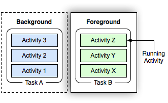

# Handler 消息机制

Markdown 软件 Typora 客户端下载

链接：https://pan.baidu.com/s/1x_Hczgd0Be-IVmZg4bg7Zg
提取码：0000

## 核心原理分析

### 执行流程


### 示意图


### 类结构图


## 核心原理手写实现

```java
package com.dongnaoedu.handlerlib;

/**
 * 消息
 */
public final class Message {

    // 目标
    // Handler 在子线程中发送消息，最后回到了 Handler.handleMessage（处理消息）
    // 挑事的是 Handler，最后来擦屁股也是 Handler
    // 问题，Looper 轮询器从队列中取出消息时，Looper 怎么知道要由哪个 Handler 来处理消息呢？
    // 老明生了小孩，取名叫小明，小明在外面犯了事，警察打电话给老明
    // 为什么是 Handler 发出消息，然后又是Handler 自己处理消息？
    // Least Knowledge Principal 最少知识原则
    Handler target;
    public int what;
    public Object obj;

    public Message(){

    }

    @Override
    public String toString() {
        return "Message{" +
                "obj=" + obj +
                '}';
    }
}

```

```java
package com.dongnaoedu.handlerlib;

/**
 * 轮询器
 */
public class Looper {

    //一个线程对应一个Looper
    static ThreadLocal<Looper> sThreadLocal = new ThreadLocal<>();

    //一个Looper对应一个MessageQueue
    MessageQueue mQueue;

    private Looper() {
        mQueue = new MessageQueue();
    }

    /**
     * 不断轮训队列中的消息
     */
    public static void loop(){
        Looper me = myLooper();
        if (me == null){
            throw new RuntimeException("No Looper; Looper.prepare() wasn't called on this thread.");
        }
        MessageQueue queue = me.mQueue;
        for (;;){
            Message msg = queue.next();
            if (msg == null){
                continue;
            }
            //转发到handleMessage
            msg.target.dispatchMessage(msg);
        }
    }

    /**
     * 初始化当前线程Looper对象
     */
    public static void prepare() {
        //一个线程对应一个Looper
        if (sThreadLocal.get() != null) {
            throw new RuntimeException("Only one Looper may be created per thread");
        }
        sThreadLocal.set(new Looper());
    }

    /**
     * 获取当前线程的Looper对象
     *
     * @return
     */
    public static Looper myLooper() {
        return sThreadLocal.get();
    }

}

```

```java
package com.dongnaoedu.handlerlib;

public class Handler {

    private MessageQueue mQueue;

    public Handler() {
        Looper myLooper = Looper.myLooper();
        mQueue = myLooper.mQueue;
    }

    /**
     * 发送消息
     *
     * @param msg
     */
    public final void sendMessage(Message msg) {
        // 小明出门之前，给他口袋里面放一张纸条，写上他爸爸老明的电话号码，出事了打这个电话
        msg.target = this;
        mQueue.enqueueMessage(msg);
    }

    /**
     * 处理消息
     *
     * @param msg
     */
    public void handleMessage(Message msg) {

    }

    /**
     * 转发消息
     *
     * @param msg
     */
    public void dispatchMessage(Message msg) {
        // 接电话的是他爸爸的秘书，秘书可以做点工作
        handleMessage(msg);
    }
}

```

```java
package com.dongnaoedu.handlerlib;

import java.util.concurrent.locks.Condition;
import java.util.concurrent.locks.Lock;
import java.util.concurrent.locks.ReentrantLock;

/**
 * 消息队列
 */
public class MessageQueue {

    // 互斥锁与条件变量
    Lock lock;
    private Condition notEmpty;
    private Condition notFull;
    Message[] items;
    int putIndex;
    int takeIndex;
    int count;

    public MessageQueue() {
        this.items = new Message[50];
        this.lock = new ReentrantLock();
        this.notEmpty = lock.newCondition();
        this.notFull = lock.newCondition();
    }


    /**
     * 消息入队
     *
     * @param message
     */
    public void enqueueMessage(Message message) {
        try {
            lock.lock();
            //队列满了，阻塞
            // 为什么用 while 循环，被唤醒，但是队列仍然是满的
            // while 循环，确保安全
            while (count == items.length){
                try {
                    notFull.await();
                } catch (InterruptedException e) {
                    e.printStackTrace();
                }
            }
            //入队
            items[putIndex] = message;
            putIndex = (++putIndex == items.length) ? 0 : putIndex;
            count++; //元素计数
            notEmpty.signalAll();
        }finally {
            lock.unlock();
        }
    }

    /**
     * 消息出队
     *
     * @return
     */
    public Message next() {
        Message msg;
        try{
            lock.lock();
            //队列中没有产品，阻塞
            while(count == 0){
                try {
                    notEmpty.await();
                } catch (InterruptedException e) {
                    e.printStackTrace();
                }
            }
            msg = items[takeIndex]; //取出
            items[takeIndex] = null; //置空
            takeIndex = (++takeIndex == items.length) ? 0 : takeIndex;
            count--; //元素计数
            notFull.signalAll();
        }finally {
            lock.unlock();
        }
        return msg;
    }
}

```

### 生产者与消费者线程模式

当仓库满了，生产过剩时，应该停止生产，阻塞。


当仓库空了，消费过剩时，应该停止消费，阻塞。


## 面试题

### 问题：Looper 死循环为什么不会卡死主线程?
我们知道 Looper.loop() 中，通过死循环在遍历消息队列不断获取消息，而且我们还知道 Activity的生命周期方法都是在主线程当中执行的，那主线程在执行死循环时，为什么没有卡死，还能够执行其他的生命周期方法呢？

#### 为什么主线程存在死循环？
线程是一段可执行的代码，当可执行代码执行完成后，线程生命周期便终止了，线程退出。而对于 App 的主线程，我们绝不希望运行一段时间，主线程自动退出，那么如何能保证主线程一直存活呢？简单的做法就是主线程执行死循环的逻辑，就能保住一直运行。

#### 既然主线程在执行死循环，又如何能执行其他事务呢？
答案是通过创建新线程的方式。事实上，会在进入死循环之前便创建了新的 Binder 线程，在代码 ActivityThread.main() 中：

```java
public static void main(String[] args) {
    ....

    //创建Looper和MessageQueue对象，用于处理主线程的消息
    Looper.prepareMainLooper();

    //创建ActivityThread对象
    ActivityThread thread = new ActivityThread(); 

    //建立Binder通道 (创建新线程)
    thread.attach(false);

    Looper.loop(); //消息循环运行
    throw new RuntimeException("Main thread loop unexpectedly exited");
}
```

thread.attach(false)，会创建一个Binder线程（具体是指 ApplicationThread 中 Binder的服务端，用于接收系统服务 AMS 发送来的事件），该 Binder 线程通过 Handler 将 Message 发送给主线程。


### 问题：Activity 的生命周期方法是如何在死循环体外能够执行起来的？

- ActivityThread 中有一个内部类H，它继承于 Handler，在 H.handleMessage(msg) 方法中，根据接收到不同的msg，执行相应的生命周期。比如收到 msg=H.LAUNCH_ACTIVITY ，则调用 ActivityThread.handleLaunchActivity() 方法，最终会通过反射机制，创建 Activity 实例，然后再执行 Activity.onCreate() 等方法； 再比如收到 msg=H.PAUSE_ACTIVITY，则调用 ActivityThread.handlePauseActivity() 方法，最终会执行 Activity.onPause() 等方法。

```java
public void handleMessage(Message msg) {
    if (DEBUG_MESSAGES) Slog.v(TAG, ">>> handling: " + codeToString(msg.what));
    switch (msg.what) {
        case LAUNCH_ACTIVITY: {
            Trace.traceBegin(Trace.TRACE_TAG_ACTIVITY_MANAGER, "activityStart");
            final ActivityClientRecord r = (ActivityClientRecord) msg.obj;

            r.packageInfo = getPackageInfoNoCheck(
                    r.activityInfo.applicationInfo, r.compatInfo);
            handleLaunchActivity(r, null);
            Trace.traceEnd(Trace.TRACE_TAG_ACTIVITY_MANAGER);
        } break;
        case RELAUNCH_ACTIVITY: {
            Trace.traceBegin(Trace.TRACE_TAG_ACTIVITY_MANAGER, "activityRestart");
            ActivityClientRecord r = (ActivityClientRecord)msg.obj;
            handleRelaunchActivity(r);
            Trace.traceEnd(Trace.TRACE_TAG_ACTIVITY_MANAGER);
        } break;
        case PAUSE_ACTIVITY:
            Trace.traceBegin(Trace.TRACE_TAG_ACTIVITY_MANAGER, "activityPause");
            handlePauseActivity((IBinder)msg.obj, false, (msg.arg1&1) != 0, msg.arg2,
                    (msg.arg1&2) != 0);
            maybeSnapshot();
            Trace.traceEnd(Trace.TRACE_TAG_ACTIVITY_MANAGER);
            break;
        case PAUSE_ACTIVITY_FINISHING:
            Trace.traceBegin(Trace.TRACE_TAG_ACTIVITY_MANAGER, "activityPause");
            handlePauseActivity((IBinder)msg.obj, true, (msg.arg1&1) != 0, msg.arg2,
                    (msg.arg1&1) != 0);
            Trace.traceEnd(Trace.TRACE_TAG_ACTIVITY_MANAGER);
            break;
        case STOP_ACTIVITY_SHOW:
            Trace.traceBegin(Trace.TRACE_TAG_ACTIVITY_MANAGER, "activityStop");
            handleStopActivity((IBinder)msg.obj, true, msg.arg2);
            Trace.traceEnd(Trace.TRACE_TAG_ACTIVITY_MANAGER);
            break;
        case STOP_ACTIVITY_HIDE:
            Trace.traceBegin(Trace.TRACE_TAG_ACTIVITY_MANAGER, "activityStop");
            handleStopActivity((IBinder)msg.obj, false, msg.arg2);
            Trace.traceEnd(Trace.TRACE_TAG_ACTIVITY_MANAGER);
            break;
        case SHOW_WINDOW:
            Trace.traceBegin(Trace.TRACE_TAG_ACTIVITY_MANAGER, "activityShowWindow");
            handleWindowVisibility((IBinder)msg.obj, true);
            Trace.traceEnd(Trace.TRACE_TAG_ACTIVITY_MANAGER);
            break;
        case HIDE_WINDOW:
            Trace.traceBegin(Trace.TRACE_TAG_ACTIVITY_MANAGER, "activityHideWindow");
            handleWindowVisibility((IBinder)msg.obj, false);
            Trace.traceEnd(Trace.TRACE_TAG_ACTIVITY_MANAGER);
            break;
        case RESUME_ACTIVITY:
            Trace.traceBegin(Trace.TRACE_TAG_ACTIVITY_MANAGER, "activityResume");
            handleResumeActivity((IBinder) msg.obj, true, msg.arg1 != 0, true);
            Trace.traceEnd(Trace.TRACE_TAG_ACTIVITY_MANAGER);
            break;
        case SEND_RESULT:
            Trace.traceBegin(Trace.TRACE_TAG_ACTIVITY_MANAGER, "activityDeliverResult");
            handleSendResult((ResultData)msg.obj);
            Trace.traceEnd(Trace.TRACE_TAG_ACTIVITY_MANAGER);
            break;

    ...........
}
```

- 在 ActivityThread 中的内部类 ApplicationThread 有很多 sendMessage 的方法：

```java
......
public final void schedulePauseActivity(IBinder token, boolean finished,
                boolean userLeaving, int configChanges, boolean dontReport) {
            sendMessage(
                    finished ? H.PAUSE_ACTIVITY_FINISHING : H.PAUSE_ACTIVITY,
                    token,
                    (userLeaving ? 1 : 0) | (dontReport ? 2 : 0),
                    configChanges);
        }

        public final void scheduleStopActivity(IBinder token, boolean showWindow,
                int configChanges) {
           sendMessage(
                showWindow ? H.STOP_ACTIVITY_SHOW : H.STOP_ACTIVITY_HIDE,
                token, 0, configChanges);
        }

        public final void scheduleWindowVisibility(IBinder token, boolean showWindow) {
            sendMessage(
                showWindow ? H.SHOW_WINDOW : H.HIDE_WINDOW,
                token);
        }

        public final void scheduleSleeping(IBinder token, boolean sleeping) {
            sendMessage(H.SLEEPING, token, sleeping ? 1 : 0);
        }

        public final void scheduleResumeActivity(IBinder token, int processState,
                boolean isForward, Bundle resumeArgs) {
            updateProcessState(processState, false);
            sendMessage(H.RESUME_ACTIVITY, token, isForward ? 1 : 0);
}

......
```

- system_server 进程是系统进程，其中运行了大量的系统服务，比如这里提供的 ApplicationThreadProxy（简称ATP）， ActivityManagerService（简称AMS），这两个服务都运行在 system_server 进程的不同线程中，由于ATP和AMS都是基于 IBinder 接口，所以它们都是 Binder 线程。Binder 线程的创建与销毁都是由 Binder 驱动来决定的。

- App 进程则是我们常说的应用程序，主线程主要负责 Activity/Service 等组件的生命周期以及 UI 相关操作。 另外，每个App进程中至少会有两个 Binder 线程： ApplicationThread(简称AT)和 ActivityManagerProxy（简称AMP），除了图中画的线程，其实还有更多的线程。

- Binder 用于不同进程之间通信，由一个进程的 Binde r客户端向另一个进程的服务端发送事务，比如图中线程2向线程4发送事务。而 Handler 用于同一个进程中不同线程的通信，比如图中线程4向主线程发送消息。

- 结合上图，暂停 Activity 的流程如下：
    - 线程1的 AMS 中调用线程2的 ATP；（由于同一个进程的线程间资源共享，可以相互直接调用）
    
    - 线程2通过 Binder 与 App 进程的线程4通信；
    
    - 线程4通过 Handler 消息机制，将暂停 Activity 的消息发送给主线程；
    
    - 主线程在 Looper.loop() 中循环遍历消息，当收到暂停 Activity 的消息时，将消息分发给 ActivityThread.H.handleMessage() 方法，再经过方法的调用，最后便会调用到 Activity.onPause()，当 onPause() 处理完后，继续循环 loop 下去。

### 问题：Looper.loop() 死循环一直运行是不是特别消耗CPU资源呢？

主线程的 MessageQueue 没有消息时，便阻塞在 loop 的 queue.next() 中的 nativePollOnce() 方法中，此时主线程会释放 CPU 资源进入休眠状态，直到下个消息到达，通过往 pipe 管道写端写入数据来唤醒主线程工作。这里采用的epoll机制，是一种IO多路复用机制，可以同时监控多个描述符，当某个描述符就绪(读或写就绪)，则立刻通知相应程序进行读或写操作。 所以说，主线程大多数时候都是处于休眠状态，并不会消耗大量 CPU 资源。

### 问题：为什么Looper.loop()死循环不会导致ANR？

#### 什么是ANR？
ANR(Application Not responding)，是指应用程序未响应，Android系统对于一些事件需要在一定的时间范围内完成，如果超过预定时间能未能得到有效响应或者响应时间过长，都会造成ANR。一般地，这时往往会弹出一个提示框，告知用户当前xxx未响应，用户可选择继续等待或者Force Close。

那么哪些场景会造成ANR呢？

- KeyDispatchTimeout（常见）
    - [x] input事件在5S内没有处理完成发生了ANR。
    
- ServiceTimeout
    - [x] 前台Service：onCreate，onStart，onBind等生命周期在20s内没有处理完成发生ANR。
    - [x] 后台Service：onCreate，onStart，onBind等生命周期在200s内没有处理完成发生ANR

- BroadcastTimeout
    - [x] 前台Broadcast：onReceiver在10S内没有处理完成发生ANR。
    - [x] 后台Broadcast：onReceiver在60s内没有处理完成发生ANR。

- ContentProviderTimeout
    - [x] ContentProvider 在10S内没有处理完成发生ANR。 

#### ANR是怎么产生的

ANR的时候，我们会看到系统弹出一个对话框，这个对话框是如何弹出来的？

ActivityManagerService.java

```java
final void appNotResponding(ProcessRecord app，ActivityRecord activity,ActivityRecord parent,boolean aboveSystem，final String annotation){
    ...
    Message msg = Message.obtain();
    msg.what = ActivityManagerService.SHOw_NOT_RESPONDING_UI_MSG;
    msg.obj - new AppNotRespondingDialog.Data(app，activity，aboveSystem);
    mService.mUiHandler.sendMessage(msg);
```

这里的SHow_NOT_RESPONDING_UI_MSG消息最终会执行到AppErrors#handleShowAnrUi()，从而打开一个AppNotRespondingDialog

AppErrors.java

```java
void handleShowAnrUi(Message msg){
    ...
    Dialog dialogToShow = new AppNotRespondingDialog(mService，mContext,data);
    ...
    dialogToShow.show()
}
```

我们来看看这个超时是如何触发的，这里拿Service举例：

ActiveService.java

这是 Service 开始启动的方法：

```java
private final void realStartServiceLocked(ServiceRecord r,ProcessRecord app，boolean execInFg){
    ...
    bumpServiceExecutingLocked(r,execInFg,"create")
    app-thread.scheduleCreateService( ...)
        ...
}
```

```java
private final void bumpServiceExecutingLocked(ServiceRecord r, boolean fg，String why){
    ...
    scheduleServiceTimeoutLocked(r.app);
    ...
}
```

```java
static final int SERVICE_TIMEOUT = 20*1000;
//How long we wait for a service to finish executing.
static final int SERVICE_BACKGROUND_TIMEOUT = SERVICE_TIMEOUT * 10;

void scheduleServiceTimeoutLocked(ProcessRecord proc){
    ...
    Message msg =mAm.mHandler.obtainMessage(
    ActivityManagerservice.SERVICE_TIMEOUT_MSG);
    msg.obj = proc;
    //发送一个超时的消息，这个超时消息如果最终被接收，将会执行appNotResponding()
    mAm . mHandler.sendMessageDelayed(msg,proc.execServicesFg ? SERVICE_TIMEOUT : SERVICE_BACKGROUND_TIMEOUT);
}
```

通过源码发现，实际上就是在 Service 启动的时候，会往消息队列中发送一个 20s 的延迟消息。如果这个消息在20s之内没有被 remove()，那就会弹出 ANR 的弹窗。Andorid 系统在 Service 启动完成后就会 remove 消息，同样的道理，输入事件，BroadcastReceiver启动等都会发送一个延迟消息，之后等到成功响应后就会remove这个延迟消息。

通过两个图来对比一下启动Service正常的情况和发生ANR的情况：

正常情况启动 Service：


启动Service发生 ANR：


#### Looper 为什么不会ANR？
- Activity、Service 等组件的生命周期方法都是通过消息机制执行的，生命周期方法执行完成，意味着相应的 Message 被 Looper 从消息队列中移除。

- 当组件的生命周期方法被阻塞时间过长，导致 Looper 没有及时将 Message 从消息队列移除，我们就会看到 ANR。

- Looper.loop 循环阻塞主线程，是为了不断获取消息队列中的 Message，这样当 Message 超时时，我们才能及时看到 ANR。

- 所以 Looper.loop 循环本身不会引发 ANR，它消息机制的保障。


### 问题：Looper.prepare 做了什么? 介绍一下 ThreadLocal 的内部实现原理。

Looper.prepare 在当前线程关联了一个 Looper 对象，而在创建 Looper 对象时，Looper 对象又关联了一个消息队列 - MessageQueue。

#### ThreadLocal 是什么？

ThreadLocal为解决多线程的并发问题而生。它使变量在每个线程中都有独立拷贝，不会出现一个线程读取变量时而被另一个线程修改的现象。

Thread 类中有个变量 threadLocals ，这个类型为 ThreadLocal 中的一个内部类 ThreadLocalMap ，这个类没有实现 Map 接口，就是一个普通的 Java 类，但是实现了类似 Map 的功能。

ThreadLocal 数据结构：


ThreadLocal 中 set 方法的实现逻辑，先获取当前线程，取出当前线程的 ThreadLocalMap ，如果存在就会把当前 ThreadLocal 的引用作为键，传入的 value 作为值存入 ThreadLocalMap 中，如果不存在就会创建一个 ThreadLocalMap 。

```java
public void set(T value) {
    Thread t = Thread.currentThread();
    ThreadLocalMap map = getMap(t);
    if (map != null)
        map.set(this, value);
    else
        createMap(t, value);
}
```

ThreadLocal 中 get 方法的实现逻辑，获取当前线程的 ThreadLocalMap，用当前的 Threadlocal 作为 key 在 ThreadLocalMap 中查找，如果存在不为空的 Entry ，就返回 Entry 中的 value，否则就会执行初始化并返回默认的值。

```java
public T get() {
    Thread t = Thread.currentThread();
    ThreadLocalMap map = getMap(t);
    if (map != null) {
        ThreadLocalMap.Entry e = map.getEntry(this);
        if (e != null) {
            @SuppressWarnings("unchecked")
            T result = (T)e.value;
            return result;
        }
    }
    return setInitialValue();
}
```

### 问题：讲一讲消息机制的同步屏障

我们知道，通过 Handler 发送消息的时候（如调用 Handler#sendMessage() 等 ），最终都是会调用 Handler#enqueueMessage() 让消息入队，如下：

```java
private boolean enqueueMessage(MessageQueue queue, Message msg, long uptimeMillis) {
    msg.target = this;
    if (mAsynchronous) {
        msg.setAsynchronous(true);
    }
    return queue.enqueueMessage(msg, uptimeMillis);
}
```

当我们发送一个消息的时候，msg.target 就会被赋值为 this， 而 this 即为我们的 Handler 对象。因此，通过这种方式传进来的消息的 target 肯定也就不为 null，并且 mAsynchronous 默认为 false ，也就是说我们一般发送的消息都为同步消息。

相对地，也应该有异步消息吧？的确，还有一种很容易被忽略的异步消息，因为除了系统的源码外，我们一般很少会使用异步消息。那么什么是异步消息呢？结论：满足target == null 的消息就是异步消息。

那么，如何发送一个异步消息呢？

简单来说有两种方式。

- 一种是直接设置消息为异步的：

```java
Message msg = mMyHandler.obtainMessage();
msg.setAsynchronous(true);
mMyHandler.sendMessage(msg);
```

还有一个需要用到 Handler 的一个构造方法，不过该方法已被标记为@Hide了：

```java
/**
  * @hide
  */
public Handler(boolean async) {
 this(null, async);
}
```

使用如下：

```java
Handler mMyHandler = new Handler(true);
Message msg = mHandler.obtainMessage();
mMyHandler.sendMessage(msg);
```

参数 async 传 true 即为异步消息。

但需要注意的是，通过上面两种方式来发送的消息还不是异步消息，因为它们最终还是会进入 enqueueMessage()，仍然会给 target 赋值 ，导致 target 不为null。这与前面所说的同步消息无异。那么什么情况下会满足target == null 这个条件呢？


#### 同步屏障是什么

发送异步消息的关键就是要消息开启一个同步屏障。屏障的意思即为阻碍，顾名思义，同步屏障就是阻碍同步消息，只让异步消息通过。如何开启同步屏障呢？如下而已：

```java
MessageQueue#postSyncBarrier()
```

更多执行细节：

```java
 /**
 * @hide
 */
public int postSyncBarrier() {
    return postSyncBarrier(SystemClock.uptimeMillis());
}

private int postSyncBarrier(long when) {
    // Enqueue a new sync barrier token
    synchronized (this) {
        final int token = mNextBarrierToken++;
        //从消息池中获取Message
        final Message msg = Message.obtain();
        msg.markInUse();
        
        //就是这里！！！初始化Message对象的时候，并没有给target赋值，因此 target==null
        msg.when = when;
        msg.arg1 = token;

        Message prev = null;
        Message p = mMessages;
       
        if (when != 0) {
            while (p != null && p.when <= when) {
             //如果开启同步屏障的时间（假设记为T）T不为0，且当前的同步消息里有时间小于T，则prev也不为null
                prev = p;
                p = p.next;
            }
        }
        /根据prev是不是为null，将 msg 按照时间顺序插入到 消息队列（链表）的合适位置
        if (prev != null) { // invariant: p == prev.next
            msg.next = p;
            prev.next = msg;
        } else {
            msg.next = p;
            mMessages = msg;
        }
        return token;
    }
}
```

Message 对象初始化的时候并没有给 target 赋值，因此，target == null的 来源就找到了。上面消息的插入也做了相应的注释。这样，一条 target == null 的消息就进入了消息队列。

那么，开启同步屏障后，所谓的异步消息又是如何被处理的呢？我们知道消息的最终处理都是在消息轮询器 Looper#loop() 中，而 loop() 循环中会调用 MessageQueue#next() 从消息队列中获取消息，来看看关键代码：

```java
//MessageQueue.java

Message next() 

    .....//省略一些代码
    int pendingIdleHandlerCount = -1; // -1 only during first iteration
    // 1.如果nextPollTimeoutMillis=-1，一直阻塞不会超时。
    // 2.如果nextPollTimeoutMillis=0，不会阻塞，立即返回。
    // 3.如果nextPollTimeoutMillis>0，最长阻塞nextPollTimeoutMillis毫秒(超时)
    //   如果期间有程序唤醒会立即返回。
    int nextPollTimeoutMillis = 0;
    //next()也是一个无限循环
    for (;;) {
        if (nextPollTimeoutMillis != 0) {
            Binder.flushPendingCommands();
        }
        nativePollOnce(ptr, nextPollTimeoutMillis);
        synchronized (this) {
            //获取系统开机到现在的时间
            final long now = SystemClock.uptimeMillis();
            Message prevMsg = null;
            Message msg = mMessages; //当前链表的头结点
            
            //关键！！！
            //如果target==null，那么它就是屏障，需要循环遍历，一直往后找到第一个异步的消息
            if (msg != null && msg.target == null) {
            // Stalled by a barrier.  Find the next asynchronous message in the queue.
                do {
                    prevMsg = msg;
                    msg = msg.next;
                } while (msg != null && !msg.isAsynchronous());
            }
            if (msg != null) {
                //如果有消息需要处理，先判断时间有没有到，如果没到的话设置一下阻塞时间，
                //场景如常用的postDelay
                if (now < msg.when) {
                   //计算出离执行时间还有多久赋值给nextPollTimeoutMillis，
                   //表示nativePollOnce方法要等待nextPollTimeoutMillis时长后返回
                    nextPollTimeoutMillis = (int) Math.min(msg.when - now, Integer.MAX_VALUE);
                } else {
                    // 获取到消息
                    mBlocked = false;
                   //链表操作，获取msg并且删除该节点 
                    if (prevMsg != null) 
                        prevMsg.next = msg.next;
                    } else {
                        mMessages = msg.next;
                    }
                    msg.next = null；
                    msg.markInUse();
                    //返回拿到的消息
                    return msg;
                }
            } else {
                //没有消息，nextPollTimeoutMillis复位
                nextPollTimeoutMillis = -1;
            }
            .....//省略

}
```

从上面可以看出，当消息队列开启同步屏障的时候（即标识为msg.target == null），消息机制在处理消息的时候，优先处理异步消息。这样，同步屏障就起到了一种过滤和优先级的作用。

下面用示意图简单说明：


如上图所示，在消息队列中有同步消息和异步消息（黄色部分）以及一道墙----同步屏障（红色部分）。有了同步屏障的存在，msg_2 和 msg_M 这两个异步消息可以被优先处理，而后面的 msg_3 等同步消息则不会被处理。那么这些同步消息什么时候可以被处理呢？那就需要先移除这个同步屏障，即调用 removeSyncBarrier() 。

举个生活中的例子。


开演唱会的时候，观众们需要在体育馆门口排队依次检票入场（这些排队的观众相当于消息队列中的普通同步消息），但这个时候演唱会的嘉宾来了（相当于异步消息，优先级高于观众），如果他们出示证件（不出示证件，就相当于普通观众入场，也还是需要排队，这种情形就是最前面所说的仅仅设置了msg.setAsynchronous(true)），保安立马拦住进场的观众（保安拦住普通观众就相当于开启了同步屏障，阻止同步消息通过），让嘉宾先进去（只处理异步消息，而阻挡同步消息）。等工作人员全部进去了，如果保安不再阻拦观众（即移除同步屏障），这样观众又可以进场了（又可以处理同步消息）。只要保安不解除拦截，那么后面的观众就永远不可能进场（不移除同步屏障，同步消息就不会得到处理）。


#### 同步屏障使用场景

似乎在日常的应用开发中，很少会用到同步屏障。那么，同步屏障在系统源码中有哪些使用场景呢？Android 系统中的 UI 更新相关的消息即为异步消息，需要优先处理。

比如，在 View 更新时，draw、requestLayout、invalidate 等很多地方都调用了ViewRootImpl#scheduleTraversals()，如下：

```java
//ViewRootImpl.java

void scheduleTraversals() {
    if (!mTraversalScheduled) {
        mTraversalScheduled = true;
        //开启同步屏障
        mTraversalBarrier = mHandler.getLooper().getQueue().postSyncBarrier();
        //发送异步消息
        mChoreographer.postCallback(
                Choreographer.CALLBACK_TRAVERSAL, mTraversalRunnable, null);
        if (!mUnbufferedInputDispatch) {
            scheduleConsumeBatchedInput();
        }
        notifyRendererOfFramePending();
        pokeDrawLockIfNeeded();
    }
}
```

postCallback()最终走到了ChoreographerpostCallbackDelayedInternal()：

```java
private void postCallbackDelayedInternal(int callbackType,
            Object action, Object token, long delayMillis) {
    if (DEBUG_FRAMES) {
        Log.d(TAG, "PostCallback: type=" + callbackType
                + ", action=" + action + ", token=" + token
                + ", delayMillis=" + delayMillis);
    }

    synchronized (mLock) {
        final long now = SystemClock.uptimeMillis();
        final long dueTime = now + delayMillis;
        mCallbackQueues[callbackType].addCallbackLocked(dueTime, action, token);

        if (dueTime <= now) {
            scheduleFrameLocked(now);
        } else {
            Message msg = mHandler.obtainMessage(MSG_DO_SCHEDULE_CALLBACK, action);
            msg.arg1 = callbackType;
            // 发送异步消息
            msg.setAsynchronous(true);
            mHandler.sendMessageAtTime(msg, dueTime);
        }
    }
}
```

这里就开启了同步屏障，并发送异步消息，由于 UI 更新相关的消息是优先级最高的，这样系统就会优先处理这些异步消息。最后，当要移除同步屏障的时候需要调用ViewRootImpl#unscheduleTraversals()。

```java
void unscheduleTraversals() {
    if (mTraversalScheduled) {
        mTraversalScheduled = false;
        //移除同步屏障
        mHandler.getLooper().getQueue().removeSyncBarrier(mTraversalBarrier);
        mChoreographer.removeCallbacks(
                Choreographer.CALLBACK_TRAVERSAL, mTraversalRunnable, null);
    }
}
```

**总结**

同步屏障的设置可以方便地处理那些优先级较高的异步消息。当我们调用Handler.getLooper().getQueue().postSyncBarrier()并设置消息的setAsynchronous(true)时，target 即为 null ，也就开启了同步屏障。当在消息轮询器 Looper 在loop()中循环处理消息时，如若开启了同步屏障，会优先处理其中的异步消息，而阻碍同步消息。


### 问题：Handler 内存泄漏原因是什么？如何解决？

#### 产生原因
非静态内部类默认持有外部类的引用：

```java
Handler handler = new Handler() {

    @Override
    public void handleMessage(Message msg) {
        MainActivity.this.updateUI();
        //click();
    }
};

public void updateUI(){
	...
}
```

- 我们通过 Handler 发送消息时，Message.target 会持有 Handler 的引用，而 Handler 又持有 Activity 的引用。

- 当我们通过 sendMessageDelayed() 发送消息时，根据我们设置的 delay 时间，这条消息既可以是2秒后被消费，也可以是1分钟之后被消费。在此之间 这条消息会一直存在于消息队列当中。

- 当按返回键 Activity 被执行销毁后，MessageQueue->Message->Hanlder->Activity 引用链条仍然存在，GC 执行可达性分析之后，Activity 仍然根可达，那么 Activity 就会发生内存泄漏。


#### 解决方法

- Activity销毁时，清空Handler中，未执行或正在执行的Callback以及Message。

```java
// 清空消息队列，移除对外部类的引用
@Override
protected void onDestroy() {
    super.onDestroy();
    mHandler.removeCallbacksAndMessages(null);

}


//Handler源码中removeCallbacksAndMessages()注释含义
/**
 * Remove any pending posts of callbacks and sent messages whose
 * <var>obj</var> is <var>token</var>.  If <var>token</var> is null,
 * all callbacks and messages will be removed.
 */
public final void removeCallbacksAndMessages(Object token) {
    mQueue.removeCallbacksAndMessages(this, token);
}

```

- 静态内部类+弱引用

```java
private static class AppHandler extends Handler {
    //弱引用，在垃圾回收时，被回收
    WeakReference<Activity> activity;

    AppHandler(Activity activity){
        this.activity=new WeakReference<Activity>(activity);
    }

    public void handleMessage(Message message){
        switch (message.what){
            //todo
        }
    }
}

```

# Binder 机制

## Linux 操作系统内存管理

### 内存分页

为了节约内存，提高使用效率，操作系统会将内存拆成一个个的小块来使用，在 Linux 中，这每一小块叫做 page(页) ，大小为4k

### 什么是虚拟地址空间

在多任务操作系统中，每个进程都运行在属于自己的虚拟内存中，这块空间被称为 Virtual Address Space(虚拟地址空间)

### 为什么要有虚拟地址空间

为了让进程之间相互隔离。

假如让进程直接操作物理内存，很有可能会出现，不同进程都操作了同一物理内存地址，造成相互影响。于是就抽象出来 虚拟地址空间 这样一个中间层，让一块 虚拟地址空间 映射到一块 物理地址空间上。


如上图，两块虚拟内存通过page table(页表) 将自己映射到物理内存上，进程只能看到虚拟内存(当然它自己是不知道内存是虚拟的)，进程只能"运行"在虚拟地址空间，只会操作属于自己的虚拟内存，因此进程之间不会相互影响。

### 虚拟地址空间的大小及分配

操作系统需要为每一个进程分配属于自己的虚拟内存，那这个虚拟内存要分配多大呢？

在没有虚拟地址空间之前，是根据进程的需要按需分配物理内存的。但有了虚拟地址空间，分配策略可以变一下，先把虚拟地址空间分配的大些，但不立马建立与物理内存的映射，而是用到的时候，用多少，建立多少。


这样物理内存的大小虽然不变，但是内存分配的灵活性大大的提高了，进程也不用担心地址会跟别的进程冲突，尽管用就是

在 32 位操作系统中，操作系统会为每个进程分配最大为 4G(2 的 32 次方)的虚拟地址空间

### 用户空间与内核空间

操作系统虽然为每个进程都分配了虚拟地址空间，但 虚拟地址空间中并不是所有的区域都可以为进程所用

操作系统将虚拟地址空间 分为用户空间和内核空间，对于 32 位的操作系统，在 Linux 的虚拟地址空间中，用户空间和内核空间的大小比例为 3:1，而在 window 中则为 2:2


### 为什么会有内核空间

为了系统的安全，现代的操作系统一般都强制用户进程不能直接操作内核的，所有的系统调用都要交给内核完成(应用程序所有的操作，最终都是由内核代为完成的)。

但是内核也要运行在内存中，为了防止用户进程干扰，操作系统为内核单独划分了一块内存区域，这块区域就是内核空间，系统内核运行在内核空间中。


### 内核空间与用户空间的映射

在 Linux 中，系统启动时，就需要将内核加载到物理内存的内核空间上运行。

但对于进程，物理内存对它是不可见的，但它又需要使用内核来完成各种系统调用，而内核实际又在物理内存上。怎么解决这个矛盾？

Linux 想了一个办法，将进程的虚拟地址空间中的内核空间映射到物理内存中的内核空间上，内核就“搬到”虚拟内存中了。而在进程看了，自己的内存中就有了内核了，就可以通过内核进行各种系统调用了

在 Linux 中，内核空间是持续的，并且所有进程的虚拟地址空间中的内核空间都映射到同样的物理内存的内核空间。


如上图 进程a 和 进程b 的内核空间都映射到了同一块物理内存区域，而用户空间的地址，则被映射到了不同的物理内存区域。

### 用户态与内核态

当一个进程执行系统调用而陷入内核代码中执行时，就称进程处于内核运行态（或简称为内核态）。

比如有一个写文件的的 python 程序

```python
with open('/test.txt','a+') as fw: # 打开文件
     fw.write('内容')
```
运行起来之后就是一个进程了，也有了自己的虚拟地址空间，包括用户空间和内核空间。刚开始这个进程是运行在用户空间，但当执行到 fw.write('内容') 时，发现要往磁盘中写入一个文件，而读写磁盘这种事，只有内核才能操作，内核提供了一个 write() 系统级函数，fw.write('内容') 这段代码最终是执行 write() 系统调用来实现文件写入的。


刚开始的 python 代码是加载到用户空间的内存中运行的，当执行 write() 系统调用是，write()是在内核空间运行的，但他们都属于同一进程，只是在执行系统调用的时候发生一个状态的切换。

程序运行在用户空间的时候，进程处于用户态，程序进入到内核运行后，进程处于内核态，这两种状态的切换就被称为上行文切换。

**上行文切换是很消耗资源的，所以要尽量避免上下文切换**


### 用户态切换到内核态的 3 种方式

除了上面提到的系统调用，还有两张方式会导致用户态切换到内核态

- 系统调用 : 这是用户态进程主动要求切换到内核态的一种方式，用户态进程通过系统调用申请使用操作系统提供的服务程序完成工作，而系统调用的机制其核心还是使用了操作系统为用户特别开放的一个中断来实现，例如 Linux 的 int 80h 中断。

- 异常 : 当 CPU 在执行运行在用户态下的程序时，发生了某些事先不可知的异常，这时会触发由当前运行进程切换到处理此异常的内核相关程序中，也就转到了内核态，比如缺页异常。

- 外围设备的中断 : 当外围设备完成用户请求的操作后，会向 CPU 发出相应的中断信号，这时 CPU 会暂停执行下一条即将要执行的指令转而去执行与中断信号对应的处理程序，如果先前执行的指令是用户态下的程序，那么这个转换的过程自然也就发生了由用户态到内核态的切换。


## Binder 是什么？

Android系统中，每个应用程序是由 Android 的 Activity、Service、Broadcast、ContentProvider 这四大组件的中一个或多个组合而成，它们所涉及的多进程间的通信底层都是依赖于 Binder IPC（Inter-Process Communication，进程间通信）机制。例如当进程 A 中的 Activity 要向进程 B 中的 Service 通信，这便需要依赖于 Binder    IPC。不仅如此，整个 Android 系统架构中，大量采用了 Binder 机制作为 IPC 方案，当然也存在部分其他的 IPC 方式，比如 Zygote 通信便是采用 socket。

Binder 作为 Android 系统提供的一种 IPC 机制，无论从事系统开发还是应用开发，都应该有所了解，这是 Android 系统中最重要的组成，也是最难理解的一块知识点，错综复杂。

## IPC原理

从进程角度来看IPC机制


每个Android的进程，只能运行在自己进程所拥有的虚拟地址空间。对应一个4GB的虚拟地址空间，其中3GB是用户空间，1GB是内核空间，当然内核空间的大小是可以通过参数配置调整的。对于用户空间，不同进程之间彼此是不能共享的，而内核空间却是可共享的。Client进程向Server进程通信，恰恰是利用进程间可共享的内核内存空间来完成底层通信工作的，Client端与Server端进程往往采用ioctl等方法跟内核空间的驱动进行交互。


## Binder原理

Binder 通信采用C/S架构，从组件视角来说，包含 Client、Server、ServiceManager 以及 binder 驱动，其中 ServiceManager 用于管理系统中的各种服务。架构图如下所示：


可以看出无论是注册服务和获取服务的过程都需要ServiceManager，需要注意的是此处的 Service Manager 是指 Native 层的 ServiceManager（C++），并非指 framework 层的 ServiceManager(Java)。ServiceManager 是整个Binder通信机制的大管家，是Android进程间通信机制 Binder的守护进程。当Service Manager启动之后，Client 端和 Server端通信时都需要先获取 Service Manager 接口，才能开始通信服务。

图中Client/Server/ServiceManage之间的相互通信都是基于Binder机制。既然基于Binder机制通信，那么同样也是C/S架构，则图中的3大步骤都有相应的Client端与Server端。

1. 注册服务(addService)：Server进程要先注册Service到ServiceManager。该过程：Server是客户端，ServiceManager是服务端。
2. 获取服务(getService)：Client进程使用某个Service前，须先向ServiceManager中获取相应的Service。该过程：Client是客户端，ServiceManager是服务端。
3. 使用服务：Client根据得到的Service信息建立与Service所在的Server进程通信的通路，然后就可以直接与Service交互。该过程：client是客户端，server是服务端。


图中的Client,Server,Service Manager之间交互都是虚线表示，是由于它们彼此之间不是直接交互的，而是都通过与Binder驱动进行交互的，从而实现IPC通信方式。其中Binder驱动位于内核空间，Client,Server,Service Manager位于用户空间。Binder驱动和Service Manager可以看做是Android平台的基础架构，而Client和Server是Android的应用层，开发人员只需自定义实现client、Server端，借助Android的基本平台架构便可以直接进行IPC通信。


## Binder 驱动

先来了解下用户空间与内核空间是怎么交互的。


### 内核模块/驱动

通过系统调用，用户空间可以访问内核空间，那么如果一个用户空间想与另外一个用户空间进行通信怎么办呢？很自然想到的是让操作系统内核添加支持；传统的 Linux 通信机制，比如 Socket，管道等都是内核支持的；但是 Binder 并不是 Linux 内核的一部分，它是怎么做到访问内核空间的呢？ Linux 的动态可加载内核模块（Loadable Kernel Module，LKM）机制解决了这个问题；模块是具有独立功能的程序，它可以被单独编译，但不能独立运行。它在运行时被链接到内核作为内核的一部分在内核空间运行。这样，Android系统可以通过添加一个内核模块运行在内核空间，用户进程之间的通过这个模块作为桥梁，就可以完成通信了。

在 Android 系统中，这个运行在内核空间的，负责各个用户进程通过 Binder 通信的内核模块叫做 Binder 驱动;

    驱动程序一般指的是设备驱动程序（Device Driver），是一种可以使计算机和设备通信的特殊程序。相当于硬件的接口，操作系统只有通过这个接口，才能控制硬件设备的工作；


熟悉了上面这些概念，我们再来看下上面的图，用户空间中 binder_open()、binder_mmap()、binder_ioctl() 这些方法通过 system call 来调用内核空间 Binder  驱动中的方法。内核空间与用户空间共享内存通过 copy_from_user() 、 copy_to_user() 内核方法来完成用户空间与内核空间内存的数据传输。 Binder驱动中有一个全局的 binder_procs 链表保存了服务端的进程信息。


### Binder 进程与线程


对于 Binder 驱动，通过 binder_procs 链表记录所有创建的 binder_proc 结构体，Binder 驱动层的每一个 binder_proc 结构体都与用户空间的一个用于 Binder 通信的进程一一对应，且每个进程有且只有一个 ProcessState 对象，这是通过单例模式来保证的。在每个进程中可以有很多个线程，每个线程对应一个 IPCThreadState 对象，IPCThreadState 对象也是单例模式，即一个线程对应一个 IPCThreadState 对象，在 Binder 驱动层也有与之相对应的结构，那就是 Binder_thread 结构体。在 binder_proc 结构体中通过成员变量 rb_root threads，来记录当前进程内所有的 binder_thread。

Binder 线程池：每个 Server 进程在启动时创建一个 Binder 线程池，并向其中注册一个 Binder 线程；之后 Server 进程也可以向 Binder 线程池注册新的线程，或者 Binder 驱动在探测到没有空闲 Binder 线程时主动向 Server 进程注册新的的 Binder 线程。对于一个 Server 进程有一个最大 Binder 线程数限制，默认为16个 Binder 线程，例如 Android 的 system_server 进程就存在16个线程。对于所有 Client 端进程的 Binder 请求都是交由 Server 端进程的 Binder 线程来处理的。


## C/S模式

BpBinder(客户端)和BBinder(服务端)都是Android中Binder通信相关的代表，它们都从IBinder类中派生而来，关系图如下：


- client端：BpBinder.transact()来发送事务请求；
- server端：BBinder.onTransact()会接收到相应事务。
- 

## System V版本的共享内存（shm）


System V 共享内存机制下，存在一段特殊的内存区域，该共享内存区域中存放着进程间需要共享的数据，所有需要访问该共享区域的进程，都要把该共享区域映射到本进程的地址空间中去。

- System V 共享内存是一种最高效的进程间通信方式，进程可以直接读写内存，而不需要任何数据的拷贝。
- 为了在多个进程间交换信息，内核专门留出了一块内存区，可以由需要访问的进程将其映射到自己的私有地址空间。进程就可以直接读写这一块内存而不要进行数据的拷贝，从而大大的提高效率。
- 由于多个进程共享一段内存，因此也需要依靠某种同步机制。

## mmap 共享内存映射

mmap()系统调用使得进程之间通过映射同一个普通文件实现共享内存。普通文件被映射到进程地址空间后，进程可以像访问普通内存一样对文件进行访问，不必再调用 read,write 等操作。


**对比：**

- mmap是在磁盘上建立一个文件，每个进程地址空间中开辟出一块空间进行映射。而shm共享内存，每个进程最终会映射到同一块物理内存。shm保存在物理内存，这样读写的速度肯定要比磁盘要快，但是存储量不是特别大。

- 相对于shm来说，mmap 更加简单，调用更加方便，所以这也是大家都喜欢用的原因。

- 另外 mmap 有一个好处是当机器重启，因为mmap把文件保存在磁盘上，这个文件还保存了操作系统同步的映像，所以mmap不会丢失，但是 shm 在内存里面就会丢失。

- 总之，共享内存是在内存中创建空间，每个进程映射到此处。内存映射是创建一个文件，并且映射到每个进程开辟的空间中。


## 面试题：为什么 Android 要采用 Binder 作为 IPC 机制？

- 重点是解释清楚，为什么会有 IPC （跨进程访问）

- 从性能的角度 

Binder数据拷贝只需要一次，而管道、消息队列、Socket都需要 2 次，但共享内存方式一次内存拷贝都不需要；从性能角度看，Binder性能仅次于共享内存。

- 从稳定性的角度

Binder是基于C/S架构的，简单解释下C/S架构，是指客户端(Client)和服务端(Server)组成的架构，Client端有什么需求，直接发送给Server端去完成，架构清晰明朗，Server端与Client端相对独立，稳定性较好；而共享内存实现方式复杂，没有客户与服务端之别， 需要充分考虑到访问临界资源的并发同步问题，否则可能会出现死锁等问题；从这稳定性角度看，Binder架构优越于共享内存。

- 安全方面

传统的进程通信方式对于通信双方的身份并没有做出严格的验证，很容易进行伪造，而Binder机制从协议本身就支持对通信双方做身份校检，因而大大提升了安全性。

## Binder 机制在 Android 中的具体实现原理

Binder 机制在 Android 中的实现主要依靠 Binder 类，其实现了 IBinder 接口

实例说明：Client 进程需要调用 Server 进程的加法函数（将整数 a 和 b 相加）

即：

- Client 进程需要传两个整数给 Server 进程
- Server 进程需要把相加后的结果返回给 Client 进程


### 步骤1：注册服务

- 过程描述
  Server 进程通过 Binder 驱动向 Service Manager 进程注册服务
- 代码实现
  Server 进程创建一个 Binder 对象

> - [ ] Binder 实体是 Server进程在 Binder 驱动中的存在形式
> - [ ] 该对象保存 Server 和 ServiceManager 的信息（保存在内核空间中）
> - [ ] Binder 驱动通过内核空间的 Binder 实体找到用户空间的 Server 对象

- 代码分析

```java
Binder binder = new Stub();
// 步骤1：创建Binder对象 ->>分析1

// 步骤2：创建 IInterface 接口类 的匿名类
// 创建前，需要预先定义 继承了IInterface 接口的接口 -->分析3
IInterface plus = new IPlus(){

    // 确定Client进程需要调用的方法
    public int add(int a,int b) {
        return a+b;
    }

    // 实现IInterface接口中唯一的方法
    public IBinder asBinder（）{ 
        return null ;
    }
};
// 步骤3
binder.attachInterface(plus，"add two int");
// 1. 将（add two int，plus）作为（key,value）对存入到Binder对象中的一个Map<String,IInterface>对象中
// 2. 之后，Binder对象 可根据add two int通过queryLocalIInterface（）获得对应IInterface对象（即plus）的引用，可依靠该引用完成对请求方法的调用
// 分析完毕，跳出


<-- 分析1：Stub类 -->
public class Stub extends Binder {
    // 继承自Binder类 ->>分析2

    // 复写onTransact（）
    @Override
    boolean onTransact(int code, Parcel data, Parcel reply, int flags){
        // 具体逻辑等到步骤3再具体讲解，此处先跳过
        switch (code) { 
            case Stub.add： { 

                data.enforceInterface("add two int"); 

                int  arg0  = data.readInt();
                int  arg1  = data.readInt();

                int  result = this.queryLocalIInterface("add two int") .add( arg0,  arg1); 

                reply.writeInt(result); 

                return true; 
            }
        } 
        return super.onTransact(code, data, reply, flags); 
    }

}
// 回到上面的步骤1，继续看步骤2

<-- 分析2：Binder 类 -->
 public class Binder implement IBinder{
        // Binder机制在Android中的实现主要依靠的是Binder类，其实现了IBinder接口
        // IBinder接口：定义了远程操作对象的基本接口，代表了一种跨进程传输的能力
        // 系统会为每个实现了IBinder接口的对象提供跨进程传输能力
        // 即Binder类对象具备了跨进程传输的能力

        void attachInterface(IInterface plus, String descriptor)；
        // 作用：
          // 1. 将（descriptor，plus）作为（key,value）对存入到Binder对象中的一个Map<String,IInterface>对象中
          // 2. 之后，Binder对象 可根据descriptor通过queryLocalIInterface（）获得对应IInterface对象（即plus）的引用，可依靠该引用完成对请求方法的调用

        IInterface queryLocalInterface(Stringdescriptor) ；
        // 作用：根据 参数 descriptor 查找相应的IInterface对象（即plus引用）

        boolean onTransact(int code, Parcel data, Parcel reply, int flags)；
        // 定义：继承自IBinder接口的
        // 作用：执行Client进程所请求的目标方法（子类需要复写）
        // 参数说明：
        // code：Client进程请求方法标识符。即Server进程根据该标识确定所请求的目标方法
        // data：目标方法的参数。（Client进程传进来的，此处就是整数a和b）
        // reply：目标方法执行后的结果（返回给Client进程）
         // 注：运行在Server进程的Binder线程池中；当Client进程发起远程请求时，远程请求会要求系统底层执行回调该方法

        final class BinderProxy implements IBinder {
         // 即Server进程创建的Binder对象的代理对象类
         // 该类属于Binder的内部类
        }
        // 回到分析1原处
}

<-- 分析3：IInterface接口实现类 -->

 public interface IPlus extends IInterface {
          // 继承自IInterface接口->>分析4
          // 定义需要实现的接口方法，即Client进程需要调用的方法
         public int add(int a,int b);
// 返回步骤2
}

<-- 分析4：IInterface接口类 -->
// 进程间通信定义的通用接口
// 通过定义接口，然后再服务端实现接口、客户端调用接口，就可实现跨进程通信。
public interface IInterface
{
    // 只有一个方法：返回当前接口关联的 Binder 对象。
    public IBinder asBinder();
}
  // 回到分析3原处
```

注册服务后，Binder 驱动持有 Server 进程创建的 Binder 实体

Binder 代理对象


### 步骤2：获取服务

Client 进程使用某个 Service 前（此处是相加函数），须通过 Binder 驱动向 ServiceManager 进程获取相应的 Service 信息
具体代码实现过程如下：


此时，Client 进程与 Server 进程已经建立了连接

### 步骤3：使用服务

Client 进程根据获取到的 Service 信息（Binder 代理对象），通过 Binder 驱动建立与该 Service 所在 Server 进程通信的链路，并开始使用服务

- 过程描述

  Client 进程将参数（整数a和b）发送到 Server 进程

  Server 进程根据 Client 进程要求调用目标方法（即加法函数）

  Server 进程将目标方法的结果（即加法后的结果）返回给 Client 进程

- 代码实现过程

**步骤1： Client进程将参数（整数a和b）发送到 Server 进程**

```java
// 1. Client进程 将需要传送的数据写入到Parcel对象中
// data = 数据 = 目标方法的参数（Client进程传进来的，此处就是整数a和b） + IInterface接口对象的标识符descriptor
android.os.Parcel data = android.os.Parcel.obtain();
data.writeInt(a); 
data.writeInt(b); 

data.writeInterfaceToken("add two int");；
// 方法对象标识符让Server进程在Binder对象中根据"add two int"通过queryLocalIInterface（）查找相应的IInterface对象（即Server创建的plus），Client进程需要调用的相加方法就在该对象中

android.os.Parcel reply = android.os.Parcel.obtain();
// reply：目标方法执行后的结果（此处是相加后的结果）

// 2. 通过 调用代理对象的transact（） 将 上述数据发送到Binder驱动
binderproxy.transact(Stub.add, data, reply, 0)
// 参数说明：
// 1. Stub.add：目标方法的标识符（Client进程 和 Server进程 自身约定，可为任意）
// 2. data ：上述的Parcel对象
// 3. reply：返回结果
// 0：可不管

// 注：在发送数据后，Client进程的该线程会暂时被挂起
// 所以，若Server进程执行的耗时操作，请不要使用主线程，以防止ANR


// 3. Binder驱动根据 代理对象 找到对应的真身Binder对象所在的Server 进程（系统自动执行）
// 4. Binder驱动把 数据 发送到Server 进程中，并通知Server 进程执行解包（系统自动执行）
```

**步骤2：Server 进程根据 Client 进程要求调用目标方法（即加法函数）**

```java
// 1. 收到Binder驱动通知后，Server 进程通过回调Binder对象onTransact（）进行数据解包 & 调用目标方法
public class Stub extends Binder {

    // 复写onTransact（）
    @Override
    boolean onTransact(int code, Parcel data, Parcel reply, int flags){
        // code即在transact（）中约定的目标方法的标识符

        switch (code) { 
            case Stub.add： { 
                // a. 解包Parcel中的数据
                data.enforceInterface("add two int"); 
                // a1. 解析目标方法对象的标识符

                int  arg0  = data.readInt();
                int  arg1  = data.readInt();
                // a2. 获得目标方法的参数

                // b. 根据"add two int"通过queryLocalIInterface（）获取相应的IInterface对象（即Server创建的plus）的引用，通过该对象引用调用方法
                int  result = this.queryLocalIInterface("add two int") .add( arg0,  arg1); 

                // c. 将计算结果写入到reply
                reply.writeInt(result); 

                return true; 
            }
        } 
      return super.onTransact(code, data, reply, flags); 
      // 2. 将结算结果返回 到Binder驱动
    }
}
```

**步骤3：Server 进程将目标方法的结果（即加法后的结果）返回给 Client 进程**

```java
// 1. Binder驱动根据 代理对象 沿原路 将结果返回 并通知Client进程获取返回结果
// 2. 通过代理对象 接收结果（之前被挂起的线程被唤醒）

binderproxy.transact(Stub.ADD, data, reply, 0)；
reply.readException();；
result = reply.readInt()；         
```

总结，下面用一个原理图 & 流程图来总结步骤3的内容


# Android 系统启动流程

## 计算机是如何启动的？

从打开电源到开始操作，计算机的启动是一个非常复杂的过程。


### boot的含义

先问一个问题，"启动"用英语怎么说？

回答是boot。可是，boot原来的意思是靴子，"启动"与靴子有什么关系呢？ 原来，这里的boot是bootstrap（鞋带）的缩写，它来自一句谚语：

```
"pull oneself up by one's bootstraps"
```

字面意思是"拽着鞋带把自己拉起来"，这当然是不可能的事情。最早的时候，工程师们用它来比喻，计算机启动是一个很矛盾的过程：必须先运行程序，然后计算机才能启动，但是计算机不启动就无法运行程序！

早期真的是这样，必须想尽各种办法，把一小段程序装进内存，然后计算机才能正常运行。所以，工程师们把这个过程叫做"拉鞋带"，久而久之就简称为boot了。

计算机的整个启动过程分成四个阶段。

### 第一阶段：BIOS

上个世纪70年代初，"只读内存"（read-only memory，缩写为ROM）发明，开机程序被刷入ROM芯片，计算机通电后，第一件事就是读取它。


这块芯片里的程序叫做"基本輸出輸入系統"（Basic Input/Output System），简称为BIOS。


> ROM（Read-Only Memory，只读存储器）以非破坏性读出方式工作，只能读出信息，无法写入信息。信息一旦写入后就固定下来，即使切断电源，信息也不会丢失，所以又称为固定存储器。ROM所存数据通常是装入整机前写入的，整机工作过程中只能读出，不像随机存储器能快速方便地改写存储内容。ROM所存数据稳定，并且结构较简单，使用方便，因而常用于存储各种固定程序和数据。

> RAM（Random Access Memory，随机存取存储器）也叫主存，是与CPU直接交换数据的内部存储器。它可以随时读写，而且速度很快，通常作为操作系统或其他正在运行中的程序的临时数据存储介质。RAM工作时可以随时从任何一个指定的地址写入（存入）或读出（取出）信息。它与ROM的最大区别是数据的易失性，即一旦断电所存储的数据将随之丢失。RAM在计算机和数字系统中用来暂时存储程序、数据和中间结果。


#### 硬件自检

BIOS程序首先检查，计算机硬件能否满足运行的基本条件，这叫做"硬件自检"（Power-On Self-Test），缩写为POST。

如果硬件出现问题，主板会发出不同含义的蜂鸣，启动中止。如果没有问题，屏幕就会显示出CPU、内存、硬盘等信息。


#### 启动顺序

硬件自检完成后，BIOS把控制权转交给下一阶段的启动程序。

这时，BIOS需要知道，"下一阶段的启动程序"具体存放在哪一个设备。也就是说，BIOS需要有一个外部储存设备的排序，排在前面的设备就是优先转交控制权的设备。这种排序叫做"启动顺序"（Boot Sequence）。

打开BIOS的操作界面，里面有一项就是"设定启动顺序"。


### 第二阶段：主引导记录

BIOS按照"启动顺序"，把控制权转交给排在第一位的储存设备。

这时，计算机读取该设备的第一个扇区，也就是读取最前面的512个字节。如果这512个字节的最后两个字节是0x55和0xAA，表明这个设备可以用于启动；如果不是，表明设备不能用于启动，控制权于是被转交给"启动顺序"中的下一个设备。

这最前面的512个字节，就叫做"主引导记录"（Master boot record，缩写为MBR）。

#### 主引导记录的结构

"主引导记录"只有512个字节，放不了太多东西。它的主要作用是，告诉计算机到硬盘的哪一个位置去找操作系统。

主引导记录由三个部分组成：

> （1） 第1-446字节：调用操作系统的机器码。
> 
> （2） 第447-510字节：分区表（Partition table）。
> 
> （3） 第511-512字节：主引导记录签名（0x55和0xAA）。

其中，第二部分"分区表"的作用，是将硬盘分成若干个区。

#### 分区表

硬盘分区有很多好处。考虑到每个区可以安装不同的操作系统，"主引导记录"因此必须知道将控制权转交给哪个区。

分区表的长度只有64个字节，里面又分成四项，每项16个字节。所以，一个硬盘最多只能分四个一级分区，又叫做"主分区"。

每个主分区的16个字节，由6个部分组成：

> 　　（1） 第1个字节：如果为0x80，就表示该主分区是激活分区，控制权要转交给这个分区。四个主分区里面只能有一个是激活的。
> 
> 　　（2） 第2-4个字节：主分区第一个扇区的物理位置（柱面、磁头、扇区号等等）。
> 
> 　　（3） 第5个字节：主分区类型。
> 
> 　　（4） 第6-8个字节：主分区最后一个扇区的物理位置。
> 
> 　　（5） 第9-12字节：该主分区第一个扇区的逻辑地址。
> 
> 　　（6） 第13-16字节：主分区的扇区总数。

最后的四个字节（"主分区的扇区总数"），决定了这个主分区的长度。也就是说，一个主分区的扇区总数最多不超过2的32次方。

如果每个扇区为512个字节，就意味着单个分区最大不超过2TB。再考虑到扇区的逻辑地址也是32位，所以单个硬盘可利用的空间最大也不超过2TB。如果想使用更大的硬盘，只有2个方法：一是提高每个扇区的字节数，二是增加扇区总数。


### 第三阶段：硬盘启动

这时，计算机的控制权就要转交给硬盘的某个分区了，这里又分成三种情况。

#### 情况A：卷引导记录

上一节提到，四个主分区里面，只有一个是激活的。计算机会读取激活分区的第一个扇区，叫做"卷引导记录"（Volume boot record，缩写为VBR）。

"卷引导记录"的主要作用是，告诉计算机，操作系统在这个分区里的位置。然后，计算机就会加载操作系统了。

#### 情况B：扩展分区和逻辑分区

随着硬盘越来越大，四个主分区已经不够了，需要更多的分区。但是，分区表只有四项，因此规定有且仅有一个区可以被定义成"扩展分区"（Extended partition）。

所谓"扩展分区"，就是指这个区里面又分成多个区。这种分区里面的分区，就叫做"逻辑分区"（logical partition）。

计算机先读取扩展分区的第一个扇区，叫做"扩展引导记录"（Extended boot record，缩写为EBR）。它里面也包含一张64字节的分区表，但是最多只有两项（也就是两个逻辑分区）。

计算机接着读取第二个逻辑分区的第一个扇区，再从里面的分区表中找到第三个逻辑分区的位置，以此类推，直到某个逻辑分区的分区表只包含它自身为止（即只有一个分区项）。因此，扩展分区可以包含无数个逻辑分区。

但是，似乎很少通过这种方式启动操作系统。如果操作系统确实安装在扩展分区，一般采用下一种方式启动。

#### 情况C：启动管理器

在这种情况下，计算机读取"主引导记录"前面446字节的机器码之后，不再把控制权转交给某一个分区，而是运行事先安装的"启动管理器"（boot loader），由用户选择启动哪一个操作系统。

Linux环境中，目前最流行的启动管理器是Grub。


### 第四阶段：操作系统

控制权转交给操作系统后，操作系统的内核首先被载入内存。

以Linux系统为例，先载入/boot目录下面的kernel。内核加载成功后，第一个运行的程序是/sbin/init。它根据配置文件（Debian系统是/etc/initab）产生init进程。这是Linux启动后的第一个进程，pid进程编号为1，其他进程都是它的后代。

然后，init线程加载系统的各个模块，比如窗口程序和网络程序，直至执行/bin/login程序，跳出登录界面，等待用户输入用户名和密码。

至此，全部启动过程完成。


## Linux 启动流程

接下来我们探讨操作系统接管硬件以后发生的事情，也就是操作系统的启动流程。


这个部分比较有意思。因为在BIOS阶段，计算机的行为基本上被写死了，程序员可以做的事情并不多；但是，一旦进入操作系统，程序员几乎可以定制所有方面。所以，这个部分与程序员的关系更密切。


### 第一步、加载内核

操作系统接管硬件以后，首先读入 /boot 目录下的内核文件。


/boot 目录下面大概是这样一些文件：

```
　　$ ls /boot
　　
　　config-3.2.0-3-amd64
　　config-3.2.0-4-amd64
　　grub
　　initrd.img-3.2.0-3-amd64
　　initrd.img-3.2.0-4-amd64
　　System.map-3.2.0-3-amd64
　　System.map-3.2.0-4-amd64
　　vmlinuz-3.2.0-3-amd64
　　vmlinuz-3.2.0-4-amd64
```

### 第二步、启动初始化进程

内核文件加载以后，就开始运行第一个程序 /sbin/init，它的作用是初始化系统环境。


由于init是第一个运行的程序，它的进程编号（pid）就是1。其他所有进程都从它衍生，都是它的子进程。

### 第三步、确定运行级别

许多程序需要开机启动。它们在Windows叫做"服务"（service），在Linux就叫做"守护进程"（daemon）。

init进程的一大任务，就是去运行这些开机启动的程序。但是，不同的场合需要启动不同的程序，比如用作服务器时，需要启动Apache，用作桌面就不需要。Linux允许为不同的场合，分配不同的开机启动程序，这就叫做"运行级别"（runlevel）。也就是说，启动时根据"运行级别"，确定要运行哪些程序。


Linux预置七种运行级别（0-6）。一般来说，0是关机，1是单用户模式（也就是维护模式），6是重启。运行级别2-5，各个发行版不太一样，对于Debian来说，都是同样的多用户模式（也就是正常模式）。

init进程首先读取文件 /etc/inittab，它是运行级别的设置文件。如果你打开它，可以看到第一行是这样的：

```
　　id:2:initdefault:
```

initdefault的值是2，表明系统启动时的运行级别为2。如果需要指定其他级别，可以手动修改这个值。

那么，运行级别2有些什么程序呢，系统怎么知道每个级别应该加载哪些程序呢？......回答是每个运行级别在/etc目录下面，都有一个对应的子目录，指定要加载的程序。

```
　　/etc/rc0.d
　　/etc/rc1.d
　　/etc/rc2.d
　　/etc/rc3.d
　　/etc/rc4.d
　　/etc/rc5.d
　　/etc/rc6.d
```

上面目录名中的"rc"，表示run command（运行程序），最后的d表示directory（目录）。下面让我们看看 /etc/rc2.d 目录中到底指定了哪些程序。

```
　　$ ls  /etc/rc2.d
　　
　　README
　　S01motd
　　S13rpcbind
　　S14nfs-common
　　S16binfmt-support
　　S16rsyslog
　　S16sudo
　　S17apache2
　　S18acpid
　　...
　　
```

可以看到，除了第一个文件README以外，其他文件名都是"字母S+两位数字+程序名"的形式。字母S表示Start，也就是启动的意思（启动脚本的运行参数为start），如果这个位置是字母K，就代表Kill（关闭），即如果从其他运行级别切换过来，需要关闭的程序（启动脚本的运行参数为stop）。后面的两位数字表示处理顺序，数字越小越早处理，所以第一个启动的程序是motd，然后是rpcbing、nfs......数字相同时，则按照程序名的字母顺序启动，所以rsyslog会先于sudo启动。

这个目录里的所有文件（除了README），就是启动时要加载的程序。如果想增加或删除某些程序，不建议手动修改 /etc/rcN.d 目录，最好是用一些专门命令进行管理。

### 第四步、加载开机启动程序

前面提到，七种预设的"运行级别"各自有一个目录，存放需要开机启动的程序。不难想到，如果多个"运行级别"需要启动同一个程序，那么这个程序的启动脚本，就会在每一个目录里都有一个拷贝。这样会造成管理上的困扰：如果要修改启动脚本，岂不是每个目录都要改一遍？

Linux的解决办法，就是七个 /etc/rcN.d 目录里列出的程序，都设为链接文件，指向另外一个目录 /etc/init.d ，真正的启动脚本都统一放在这个目录中。init进程逐一加载开机启动程序，其实就是运行这个目录里的启动脚本。


下面就是链接文件真正的指向。

```
　　$ ls -l /etc/rc2.d
　　
　　README
　　S01motd -> ../init.d/motd
　　S13rpcbind -> ../init.d/rpcbind
　　S14nfs-common -> ../init.d/nfs-common
　　S16binfmt-support -> ../init.d/binfmt-support
　　S16rsyslog -> ../init.d/rsyslog
　　S16sudo -> ../init.d/sudo
　　S17apache2 -> ../init.d/apache2
　　S18acpid -> ../init.d/acpid
　　...
　　
```

这样做的另一个好处，就是如果你要手动关闭或重启某个进程，直接到目录 /etc/init.d 中寻找启动脚本即可。比如，我要重启Apache服务器，就运行下面的命令：

```
　　$ sudo /etc/init.d/apache2 restart

```

/etc/init.d 这个目录名最后一个字母d，是directory的意思，表示这是一个目录，用来与程序 /etc/init 区分。

### 第五步、用户登录

开机启动程序加载完毕以后，就要让用户登录了。


一般来说，用户的登录方式有三种：

> 　　（1）命令行登录
> 
> 　　（2）ssh登录
> 
> 　　（3）图形界面登录

## Android 系统的启动过程


### 第一步、系统启动


Android设备上电后，首先会从 ROM 的启动引导代码开始执行，ROM 会寻找 Bootloader 代码，并加载到内存。（这一步由“芯片厂商”负责设计和实现）

### 第二步、引导装载程序


Bootloader 开始执行，首先负责完成硬件的初始化，然后找到Linux内核代码，并加载到内存。（这一步由“设备厂商”负责设计和实现）

Bootloader的执行分为两个阶段：

- 第一个阶段是检测外部RAM
- 第二个阶段是帮助加载程序，在这一阶段 Bootloader 设置网络、内存等，Bootloader可以为内核提供特定目的的配置参数或输入。

Android引导加载程序可以在以下位置发现：

```
<AndroidSource>\bootable\bootloader\legacy\usbloader
```

主要包含两个重要的文件，即 init.S 和 main.c

- init.S：初始化堆栈，调 用main.c 中的 _main() 方法。
- main.c：初始化硬件(时钟、板、键盘、控制台)，创建Linux标记。


### 第三步、Linux内核


Linux 内核在 Android 上启动的方式与在其他系统上类似，它将设置系统运行所需的一切，初始化各种软硬件环境，加载驱动程序，挂载根文件系统。

一旦内存管理单元和缓存被初始化，系统将能够使用虚拟内存并启动用户空间进程。内核将在根文件系统中查找 init 进程，并将其作为初始用户空间进程启动。

由此开启Android的世界。（这一步则是Android内核开发过程中需要涉及的地方）

### 第四步、init进程
Android 系统以及各大 Linux 的发行版，他们的 Linux 内核部分启动过程都是差不多的，他们之间最大的区别就在于 init 程序的不同，因为 init 程序决定了系统在启动过程中，究竟会启动哪些守护进程和服务，以及呈现出怎样的一个用户UI界面。因此，**init程序是分析Android启动过程中最核心的程序**。

对应的代码位于：system/core/init/init.c，工作内容如图所示：


init程序最核心的工作主要有3点：

- （1） 创建和挂载一些系统目录/设备节点，设置权限，如：/dev, /proc, and /sys
- （2） 解析 init.rc 和 init.<hardware>.rc，并启动属性服务，以及一系列的服务和进程（包括 Zygote 进程）。
- （3） 显示boot logo，默认是“Android”字样


每一个由 init 直接启动的本地服务（运行在 C++ 层的系统守护进程）都是一个独立的 Linux 进程，在系统启动以后，我们通过adb shell命令进入手机后，输入top命令就可以查看到这些本地进程的存在：


### 第五步、Zygote进程

在 Android 系统中，DVM (Dalvik虚拟机)和 ART、应用程序进程以及运行系统关键服务的 SystemServer 进程都是由 Zygote 进程创建的，我们也将它称为孵化器（字面意思是受精卵）。它通过 fork 复制进程的形式来创建应用进程和 SystemServer 进程，由于 Zygote 进程在启动时会创建 DVM 或者 ART，因此通过 fork 而创建的应用程序进程和 SystemServer 进程可以在内部获取一个 DVM 或者 ART 的实例副本。


### 第六步、SystemServer

Zygote进程会首先fork出 "SystemServer" 进程，它是在系统中运行的第一个 Java 组件，"SystemServer"进程的全部任务就是将所有的Android核心服务启动起来，这些服务包括：


当所有的服务都启动完毕后，SystemServer会打印出“Making services ready”，然后通过ActivityManager启动Home界面，并发送“ACTION_BOOT_COMPLETED”广播消息。

注意，这些Android服务并没有各种运行在独立的进程中，它们由SystemServer以线程的方式创建，所以都运行在同一个进程中，即SystemServer进程中。

SystemServer 所在目录：

```
/base/services/java/com/android/server/SystemServer.java
```


SystemServer.java

```java
public static void main(String[] args) {
   new SystemServer().run(); //创建SystemServer对象，再调用对象的run()方法
}
    
private void run() {       
   // 设置系统时间、设置默认语言、虚拟机库文件、虚拟机内存 等
   ...
   // 当前线程作为mainLooper
   Looper.prepareMainLooper(); 

   // 初始化系统上下文
   createSystemContext();

   // 创建系统服务管理 用于创建和启动system service
   mSystemServiceManager = new SystemServiceManager(mSystemContext);
   LocalServices.addService(SystemServiceManager.class, mSystemServiceManager);

   // 启动各种系统服务
   try {
       startBootstrapServices(); // 启动引导服务
       startCoreServices();    // 启动核心服务
       startOtherServices();   // 启动其它服务
  }

   // 开启loop循环
   Looper.loop();
   throw new RuntimeException("Main thread loop unexpectedly exited");
}


private void createSystemContext() {
    // 创建主线程任务的管理和调度类 ActivityThread
   ActivityThread activityThread = ActivityThread.systemMain();
   // 会依次创建对象有ActivityThread，Instrumentation, ContextImpl，LoadedApk，Application
}

```

依次启动引导服务、核心服务、其它服务

```java
private void startBootstrapServices() {
    //阻塞等待 Installer 建立socket通道
    Installer installer = mSystemServiceManager.startService(Installer.class);

    //启动服务 ActivityManagerService
    mActivityManagerService = mSystemServiceManager.startService(
            ActivityManagerService.Lifecycle.class).getService();
    mActivityManagerService.setSystemServiceManager(mSystemServiceManager);
    mActivityManagerService.setInstaller(installer);

    //启动服务 PowerManagerService
    mPowerManagerService = mSystemServiceManager.startService(PowerManagerService.class);
    mActivityManagerService.initPowerManagement();

    //启动服务 LightsService
    mSystemServiceManager.startService(LightsService.class);

    //启动服务 DisplayManagerService
    mDisplayManagerService = mSystemServiceManager.startService(DisplayManagerService.class);

    //Phase100: 服务启动阶段100 [100、480、500、550、600、1000]
      mSystemServiceManager.startBootPhase(SystemService.PHASE_WAIT_FOR_DEFAULT_DISPLAY);

    //启动服务 PackageManagerService
    mPackageManagerService = PackageManagerService.main(mSystemContext, installer,
            mFactoryTestMode != FactoryTest.FACTORY_TEST_OFF, mOnlyCore);
    mFirstBoot = mPackageManagerService.isFirstBoot();
    mPackageManager = mSystemContext.getPackageManager();

    //启动服务 UserManagerService，新建目录/data/user/
    ServiceManager.addService(Context.USER_SERVICE, UserManagerService.getInstance());

    AttributeCache.init(mSystemContext);

    //设置AMS
    mActivityManagerService.setSystemProcess();

    //启动传感器服务
    startSensorService();
}
```

```java
private void startCoreServices() {
    //启动服务BatteryService，用于统计电池电量，需要LightService.
    mSystemServiceManager.startService(BatteryService.class);

    //启动服务UsageStatsService，用于统计应用使用情况
    mSystemServiceManager.startService(UsageStatsService.class);
    mActivityManagerService.setUsageStatsManager(
            LocalServices.getService(UsageStatsManagerInternal.class));

    mPackageManagerService.getUsageStatsIfNoPackageUsageInfo();

    //启动服务WebViewUpdateService
    mSystemServiceManager.startService(WebViewUpdateService.class);
}
```

```java
private void startOtherServices() {
    ...
    mContentResolver = context.getContentResolver(); // resolver
    mActivityManagerService.installSystemProviders(); //provider
    ActivityManagerNative.getDefault().showBootMessage(...); //显示启动界面
    ...
    
    //phase480 和phase500  [100、480、500、550、600、1000]
    mSystemServiceManager.startBootPhase(SystemService.PHASE_LOCK_SETTINGS_READY);
mSystemServiceManager.startBootPhase(SystemService.PHASE_SYSTEM_SERVICES_READY);
    ...
    
    // 准备好 window, power, package, display服务
    wm.systemReady();
    mPowerManagerService.systemReady(...);
    mPackageManagerService.systemReady();
    mDisplayManagerService.systemReady(...);
       
    // AMS ready 完成服务启动其它阶段 及Home启动等
    mActivityManagerService.systemReady(new Runnable() {
      public void run() {
         //phase550
         mSystemServiceManager.startBootPhase(
                 SystemService.PHASE_ACTIVITY_MANAGER_READY);
         ...
         //phase600
         mSystemServiceManager.startBootPhase(
                 SystemService.PHASE_THIRD_PARTY_APPS_CAN_START);
         ...
      }
    });
}

```


### 启动完成


## 虚拟机实例

### JVM

Java 的程序运行都离不开 JVM 。

#### Java 线程、进程 和 JVM 之间的关系

- 每用 Java 命令启动一个 Java 应用程序，就会启动一个应用程序进程，由于 Java 代码需要通过 JVM 才能执行，所以应用程序进程中包含一个 JVM 实例。

- 在这个 JVM 环境中，所有程序代码的运行都是以线程来运行的。

- JVM 找到程序程序的入口点 main() ，然后运行 main() 方法，这样就产生了一个线程，这个线程称之为主线程。

- 一个应用程序只对应着一个进程，但是可以包含多个线程。

#### JVM 实例

- JVM 实例对应了一个独立运行的 Java 程序。

- JVM 实例中有两种线程：守护线程和非守护线程，main() 方法属于非守护线程， 守护线程通常由 JVM 自己使用，比如说 GC 线程，Java 程序也可以标明自己创建的线程是守护线程。

- 当程序中的所有非守护线程都终止时，JVM 才退出，JVM 实例消亡。

- JVM 实例结构图：


- 多线程下 JVM 实例结构：


#### Linux 系统内存管理与 JVM 实例

- Linux 与进程内存模型

JVM 以一个进程(Process)的身份运行在 Linux 系统上，了解 Linux 与进程的内存关系，是理解 JVM 与 Linux 内存的关系的基础。下图给出了硬件、系统、进程三个层面的内存之间的概要关系。


- 进程与 JVM 内存模型

这个模型的并不是 JVM 内存使用的精确模型，更侧重于从操作系统的角度而省略了一些 JVM 的内部细节。


### Dalvik 虚拟机

Dalvik 虚拟机由 Dan Bornstein 开发，名字来源于他的祖先曾经居住过的位于冰岛的同名小渔村，Dalvik 虚拟机起源于 Apache Harmony 项目，目标是实现一个独立的、兼容JDK 5的虚拟机，并根据Apache License v2发布。

Android 应用程序是运行在 Dalvik 虚拟机里面的，并且每一个应用程序对应有一个单独的 Dalvik 虚拟机实例。Android 应用程序中的 Dalvik 虚拟机实例实际上是从 **Zygote 进程**的地址空间拷贝而来的，这样就可以加快 Android 应用程序的启动速度。

Dalvik 虚拟机与 Java 虚拟机共享有差不多的特性，例如，它们都是解释执行，并且支持即时编译（JIT）、垃圾收集（GC）、Java 本地方法调用（JNI）和Java远程调试协议（JDWP）等，差别在于两者执行的指令集是不一样的，并且前者的指令集是基本寄存器的，而后者的指令集是基于堆栈的。

#### Dalvik 虚拟机与 Java 虚拟机的区别


- 基于堆栈的 Java 指令和基于寄存器的 Dalvik 指令各有优劣

**栈式虚拟机 VS 寄存器式虚拟机**
（1）指令条数：栈式 > 寄存器式
（2）代码尺寸：栈式 < 寄存器式
（3）移植性：栈式虚拟机移植性更好 
（4）指令优化：寄存器式虚拟机更能优化

> 寄存器是 CPU 内部的元件，包括通用寄存器、专用寄存器和控制寄存器。寄存器拥有非常高的读写速度，所以在寄存器之间的数据传送非常快。

- Dalvik 虚拟机使用 dex（Dalvik Executable）格式的类文件，而 Java 虚拟机使用 class 格式的类文件。一个 dex 文件可以包含若干个类，而一个 class 文件只包括一个类，由于一个 dex 文件可以包含若干个类，因此它可以将各个类中重复的字符串只保存一次，从而节省了空间，适合在内存有限的移动设备使用。

#### Dex 文件的生成与优化


odex (optimized dex) 即优化的 dex，对于在 Dalvik 环境中使用 dexopt 来对 dex 字节码进行优化，生成的 odex 文件最终存在于 data/dalvik-cache目录下。

**优化时机：**

- VM 在运行时即时优化，例如使用 DexClassLoader 动态加载 dex 文件时。这时候需要指定一个当前进程有写权限的用来保存 odex 的目录。
- APP 安装时由具有 root 权限的 installd 优化。这时候优化产生的 odex 文件保存在 /data/dalvik-cache 目录中。

#### Dalvik 虚拟机的启动过程

- Android 系统在启动的时候，会创建一个 Zygote 进程，充当应用程序进程孵化器。Dalvik 虚拟机由 Zygote 进程启动，Dalvik 虚拟机在 Zygote进程启动的过程中，还会进一步预加载 Java 和 Android 核心类库以及系统资源。

- Dalvik 虚拟机启动之后，还可以将 Dalvik 虚拟机实例再复制到 System Server 进程和应用程序进程，通过这种方式就可以大大地提高应用程序的启动速度，因为可以避免每一个应用程序进程在启动的时候都要去创建一个 Dalvik 虚拟机实例。


> Framework 在启动时需要加载并运行两个特定的类文件：ZygoteInit.java 和 SystemServer.java。为了便于使用，系统才提供了一个 app_process 进程，该进程会自动运行这两个类，并加载 Framework 中的大部分类和资源。


- Dalvik 虚拟机从 Zygote 进程复制到 System Server 进程之后，它们就通过 COW (Copy On Write) 机制共享同一个 Dalvik 虚拟机实例以及预加载类库和资源。


- Dalvik 虚拟机从 Zygote 进程复制到应用程序进程之后，它们同样会通过 COW (Copy On Write) 机制共享同一个 Dalvik 虚拟机实例以及预加载类库和资源。


#### Copy On Write

- 写入时复制（COW），有时也称为隐式共享，是一种计算机管理中用来有效地对可修改资源执行“复制”操作的资源管理技术。

- 如果资源重复但未修改，则无需创建新资源，资源可以在副本和原始副本之间共享。

- 修改仍然必须创建一个副本，因此使用COW，可以将复制操作推迟到第一次写入。

- 通过以这种方式共享资源，可以显着减少未修改副本的资源消耗，当然了资源修改操作的时候也会增加少量开销。

  

#### Dalvik虚拟机的运行过程

- Dalvik 虚拟机在 Zygote 进程中启动之后，就会以 ZygoteInit.main 为入口点开始运行

- Dalvik 虚拟机从 Zygote 进程复制到 System Server 进程之后，就会以 SystemServer.main 为入口点开始运行

- Dalvik 虚拟机 Zygote 进程复制到应用程序进程之后，就会以 ActivityThread.main 为入口点开始运行


### ART 虚拟机

- Dalvik 虚拟机是 Android 4.4 及之前使用的虚拟机。它使用的是 JIT (just in time) 技术来进行代码转译，每次执行应用的时候，Dalvik 将程序的代码转译为本地机器指令执行。随着硬件水平的发展以及用户对更高性能的需求，Dalvik 虚拟机的不足日益突出。

> 机器指令是计算机 CPU 执行某种操作的命令编码，由 0，1 组成的特定的二进制数序列。
> 指令系统是指某一类型 CPU 中所有机器指令的集合。8086/8088 CPU 的指令系统共包含92种基本指令，按照功能可将它们分为6大类：数据传送指令、算术运算指令、逻辑运算和移位指令、串操作指令、控制转移指令、处理器控制指令。

- 应运而生的 ART（Android Runtime）虚拟机，其处理机制根本上的区别是它采用 AOT (Ahead of Time) 技术，会在应用程序安装时就转换成本地机器指令，不再在执行时解释，从而优化了应用运行的速度。在内存管理方面，ART 也有比较大的改进，对内存分配和回收都做了算法优化，降低了内存碎片化程度，回收时间也得以缩短。

- ART 运行时可以无缝替换 Dalvik 运行时，但 ART 所带来的缺点是，字节码变为机器码之后，占用的存储空间更大，应用的安装时间会变长。

## 面试题

### 问题：你了解 Android 系统启动流程吗？

参考上面的文字

### 问题：system_server 进程是什么时候启动的？

system_server 是在 Zygote 进程中启动的。

### 问题：system_server 为什么要在 Zygote 中启动，而不是由 init 直接启动呢？

- system_server 进程主要用于创建 Android 系统的核心服务，而创建系统服务需要用到很多系统资源，比如 JNI 函数、共享库、常用的类、以及主题资源等，Zygote 作为一个孵化器，可以提前加载一些资源，这样 fork() 时基于 Copy-On-Write 机制创建的其他进程就直接能使用这些资源，而不用重新加载。

- init 进程是 Linux 系统启动的第一个进程，它主要做的是一些 Linux 操作系统的准备工作，例如创建和挂载一些系统目录/设备节点、设置权限，启动系统的一些守护进程和操作系统服务。而像 Dalvik/ART 虚拟机启动等 Android 系统的准备工作放在之后的 Zygote 进程，以及由 Zygote fork 出来的 system_server 进程会比较合适。

### 问题：为什么要专门使用 Zygote 进程去孵化应用进程，而不是让 system_server 去孵化呢？

- system_server 相比 Zygote 多运行了 AMS、WMS 等 Android 系统核心服务，这些对一个应用程序来说是不需要的。

- system_server 存在很多线程，而进程的 fork() 对多线程不友好，fork 只会将发起调用的线程拷贝到子进程，这可能会导致死锁。

### 问题：能具体说说是怎么导致死锁的吗？

在 POSIX 标准中，fork 的行为是这样的：复制整个用户空间的数据（通常使用 copy-on-write 的策略，所以可以实现的速度很快）以及所有系统对象，然后复制当前线程到子进程。这里所有父进程中别的线程，到了子进程中都是突然蒸发掉的。

假设这么一个环境，在 fork 之前，有一个子线程 lock 了某个锁，获得了对锁的所有权。fork 以后，在子进程中，所有的额外线程都人间蒸发了。而锁却被正常复制了，在子进程看来，这个锁没 有主人，所以没有任何人可以对它解锁。当子进程想 lock 这个锁时，不再有任何手段可以解开了。程序发生死锁。

### 问题：为什么 system_server 进程与 Zygote 进程通讯采用 Socket 而不是 Binder？

- Binder 通信需要使用 Binder 线程池。

- fork 只能拷贝当前线程，不支持多线程的 fork。

- Zygote 在 fork 进程之前，需要把多余的线程（包括 Binder 线程）都杀掉只保留一个线程。所以此时就无法把结果通过 Binder 把消息发送给 system_server 。fork() 进程完成之后 Zygote 也会把其他线程重新启动，这时候即使有了 Binder 线程，也无法重新建立连接。

- 所以最终 Zygote 采用的方案就是 socket + epoll，然后 fork 出子进程后再在子进程中启动 Binder 线程池。

# AMS 启动流程

SystemServer 进程启动了一系列的系统服务，**ActivityManagerService** 是其中最核心的服务之一。它和四大组件的启动、切换、调度及应用进程的管理和调度息息相关，其重要性不言而喻。

AMS 的启动过程（Android 9.0）主要包含如下两个方法中：

SystemServer.java

```java
private void run() {
   ...
   startBootstrapServices();//创建并启动AMS服务，同时执行AMS启动后的一些初始化工作
   startOtherServices();// 进入下个阶段的一些准备工作
   ...
}
```

## startBootstrapServices( )

### 创建并启动AMS服务

```java
private void startBootstrapServices() {
   ...
   //启动AMS服务
   mActivityManagerService = mSystemServiceManager.startService(
           ActivityManagerService.Lifecycle.class).getService();
   //设置AMS的系统服务管理器
   mActivityManagerService.setSystemServiceManager(mSystemServiceManager);
   //设置AMS的APP安装器
   mActivityManagerService.setInstaller(installer);
   //初始化AMS相关的PMS
   mActivityManagerService.initPowerManagement();
   ...
    //向ServiceManager注册一系列服务,并创建system_server对应的ProcessRecord并初始化
   mActivityManagerService.setSystemProcess();
}
```

我们知道 SystemServiceManager.startService 是通过反射创建服务对象，并启动。但是这里传进去的是 AMS 的 Lifecycle。Lifecycle 是 AMS 中的一个静态内部类，它继承 SystemService，由它来代理处理 AMS 的的创建与启动。

```java
public static final class Lifecycle extends SystemService {
   private final ActivityManagerService mService;
   public Lifecycle(Context context) {
       super(context);
       mService = new ActivityManagerService(context);
   }
   @Override
   public void onStart() {
       mService.start();
   }
   public ActivityManagerService getService() {
       return mService;
   }
}
```

这样 SystemServiceManager 间接通过调用 Lifecycle 创建并启动了 AMS 服务。AMS 是运行在 system_server 进程中的 Framework 服务，经过 SystemServiceManager 创建的服务会统一保存在队列管理。

### AMS 初始化工作

#### ActivityManagerService 构造方法

```java
public ActivityManagerService(Context systemContext) {
   mContext = systemContext;
   mFactoryTest = FactoryTest.getMode();//默认为FACTORY_TEST_OFF
   mSystemThread = ActivityThread.currentActivityThread();
   //创建名为"ActivityManager"的前台线程，并获取mHandler
   mHandlerThread = new ServiceThread(TAG, android.os.Process.THREAD_PRIORITY_FOREGROUND, false);
   mHandlerThread.start();
   mHandler = new MainHandler(mHandlerThread.getLooper());
   //通过UiThread类，创建名为"android.ui"的线程
   mUiHandler = new UiHandler();
   //前台广播接收器，在运行超过10s将放弃执行
   mFgBroadcastQueue = new BroadcastQueue(this, mHandler,
           "foreground", BROADCAST_FG_TIMEOUT, false);
   //后台广播接收器，在运行超过60s将放弃执行
   mBgBroadcastQueue = new BroadcastQueue(this, mHandler,
           "background", BROADCAST_BG_TIMEOUT, true);
   mBroadcastQueues[0] = mFgBroadcastQueue;
   mBroadcastQueues[1] = mBgBroadcastQueue;
   //创建ActiveServices，其中非低内存手机mMaxStartingBackground为8
   mServices = new ActiveServices(this);
   mProviderMap = new ProviderMap(this);
   //创建目录/data/system
   File dataDir = Environment.getDataDirectory();
   File systemDir = new File(dataDir, "system");
   systemDir.mkdirs();
   //创建服务BatteryStatsService
   mBatteryStatsService = new BatteryStatsService(systemDir, mHandler);
   mBatteryStatsService.getActiveStatistics().readLocked();
   ...
   //创建进程统计服务，信息保存在目录/data/system/procstats，
   mProcessStats = new ProcessStatsService(this, new File(systemDir, "procstats"));
   mAppOpsService = new AppOpsService(new File(systemDir, "appops.xml"), mHandler);
   mGrantFile = new AtomicFile(new File(systemDir, "urigrants.xml"));
   // User 0是第一个，也是唯一的一个开机过程中运行的用户
   mStartedUsers.put(UserHandle.USER_OWNER, new UserState(UserHandle.OWNER, true));
   mUserLru.add(UserHandle.USER_OWNER);
   updateStartedUserArrayLocked();
   ...
   //CPU使用情况的追踪器执行初始化
   mProcessCpuTracker.init();
   ...
   mRecentTasks = new RecentTasks(this);
   // 创建ActivityStackSupervisor对象
   mStackSupervisor = new ActivityStackSupervisor(this, mRecentTasks);
   mTaskPersister = new TaskPersister(systemDir, mStackSupervisor, mRecentTasks);
   //创建名为"CpuTracker"的线程
   mProcessCpuThread = new Thread("CpuTracker") {
       public void run() {
         while (true) {
           try {
             try {
               synchronized(this) {
                 final long now = SystemClock.uptimeMillis();
                 long nextCpuDelay = (mLastCpuTime.get()+MONITOR_CPU_MAX_TIME)-now;
                 long nextWriteDelay = (mLastWriteTime+BATTERY_STATS_TIME)-now;
                 if (nextWriteDelay < nextCpuDelay) {
                     nextCpuDelay = nextWriteDelay;
                 }
                 if (nextCpuDelay > 0) {
                     mProcessCpuMutexFree.set(true);
                     this.wait(nextCpuDelay);
                 }
               }
             } catch (InterruptedException e) {
             }
             updateCpuStatsNow(); //更新CPU状态
           } catch (Exception e) {
           }
         }
       }
   };
   ...
}
```

首先，创建了一个名为 ActivityManager 的消息循环线程，不断地接收其他线程发给 AMS 的消息；并把该消息循环线程与 MainHandler 绑定，这样，由 MainHandler 完成消息的具体处理。然后，创建了一些服务，并在 /data/system 目录下创建该服务需要的文件或文件夹，具体如下：

| 服务                | 服务说明         | 文件                          | 文件说明                        |
| ------------------- | ---------------- | ----------------------------- | ------------------------------- |
| BatteryStatsService | 电池状态管理     | /data/system/batterystats.bin | 记录包括电压在内的各种电池信息  |
| ProcessStatsService | 进程状态管理     | /data/system/procstats        | 记录各个进程的状态信息          |
| AppOpsService       | 应用操作权限管理 | /data/system/appops.xml       | 存储各个app的权限设置和操作信息 |

#### ActivityManagerService.setSystemProcess

```java
 public void setSystemProcess() {
        try {
            // 向ServiceManager中注册各种服务
            ServiceManager.addService(Context.ACTIVITY_SERVICE, this, true);
            ServiceManager.addService(ProcessStats.SERVICE_NAME, mProcessStats);
            ServiceManager.addService("meminfo", new MemBinder(this));
            ServiceManager.addService("gfxinfo", new GraphicsBinder(this));
            ServiceManager.addService("dbinfo", new DbBinder(this));
            if (MONITOR_CPU_USAGE) {
                ServiceManager.addService("cpuinfo", new CpuBinder(this));
            }
            ServiceManager.addService("permission", new PermissionController(this));
            ServiceManager.addService("processinfo", new ProcessInfoService(this));
 
            // AndroidManifes.xml中<application>标签解析出来的配置信息保存在这个对象中
                        // 从PackageManagerService中获取framework-res.apk安装包的ApplicationInfo信息
            // 注意这里的使用方式，PackageManagerService和ActivityManagerService运行在同一个进程
            // 这里为什么要使用跨进程的方式来进行通信呢?
            // 原因是保持android环境中和服务交互的一致性，利于以后扩展和维护
            ApplicationInfo info = mContext.getPackageManager().getApplicationInfo(
                    "android", STOCK_PM_FLAGS);
            // 
            mSystemThread.installSystemApplicationInfo(info, getClass().getClassLoader());
 
            synchronized (this) {
                // 生成保存系统进程信息的对象
                ProcessRecord app = newProcessRecordLocked(info, info.processName, false, 0);
                // 保持该进程一直处于运行状态
                app.persistent = true;
                app.pid = MY_PID;
                app.maxAdj = ProcessList.SYSTEM_ADJ;
                // 给该进程对象设置该进程中AMS和其他进程交互的接口
                app.makeActive(mSystemThread.getApplicationThread(), mProcessStats);
                synchronized (mPidsSelfLocked) {
                    mPidsSelfLocked.put(app.pid, app);
                }
                updateLruProcessLocked(app, false, null);
                updateOomAdjLocked();
            }
        } catch (PackageManager.NameNotFoundException e) {
            throw new RuntimeException(
                    "Unable to find android system package", e);
        }
    }
```


首先，向SystemServiceManager中添加了若干个服务：

| 服务       | 服务说明                  |
| ---------- | ------------------------- |
| activity   | AMS服务本身               |
| procstats  | 进程状态管理              |
| meminfo    | 获取内存信息              |
| gfxinfo    | 监控分析GPU profiling信息 |
| dbinfo     | 数据库相关服务            |
| cpuinfo    | 获取cpu相关信息           |
| permission | 权限控制相关服务          |

然后，调用 PMS 的 getApplicationInfo 接口，获取名为 ”android” 的应用程序信息。包名为 ”android” 的 apk 即 /system/framework/framework-res.apk ，里面保存着系统 GUI 美化的相关文件、包括图标、弹出对话框的样式、动作特效、界面布局等。调用 installSystemApplicationInfo 加载 framework-res.apk 文件。

接着，调用 newProcessRecordLocked 新建一个 ProcessRecord 对象 app，ProcessRecord 用来描述一个进程的所有信息，包括该进程的所有 activity 和 service 等，在这里就是 system_server（AMS 在system_server进程中运行）。创建后，对 app 的一些成员变量进行初始化，包括设置为常驻内存运行、设置 system_server 的 pid 等。

最后，调用 mProcessNames.put() 将创建的 ProcessRecord 对象 app 加入到 ProcessMap< ProcessRecord > 类型的成员变量mProcessNames中，这里 app.processName=“system”。

这样，AMS 就得到了 system_server 的 ProcessRecord，以后 AMS 也可以管理 system_server 了。

## startOtherServices( )

### system_server 触发的 AMS 准备工作

```java
private void startOtherServices() {
 	...
  	//移除非系统的provider,安装所有的系统provider,创建核心Settings Observer，用于监控Settings的改变。
 	mActivityManagerService.installSystemProviders();
 	…
	//保存WMS对象
	mActivityManagerService.setWindowManager(wm);
 	…
	//系统启动前的准备工作，启动SystemUI和Home界面等
	mActivityManagerService.systemReady(new Runnable() {...});
}
```

#### mActivityManagerService.systemReady()

主要分三个阶段：

```java
public void systemReady(final Runnable goingCallback) {
   before goingCallback.run()
   goingCallback.run()
   after goingCallback.run()
}
```

#### before goingCallback.run()

```java
public void systemReady(final Runnable goingCallback){
   if (mSystemReady) {//首次为false，不进入
       if (goingCallback != null) {
           goingCallback.run();
       }
       return;
   }
   mLocalDeviceIdleController = LocalServices.getService(DeviceIdleController.LocalService.class);
   //用户管理、最近任务、应用程序操作权限管理相关验证和准备工作。
   mUserController.onSystemReady();
   mRecentTasks.onSystemReadyLocked();
   mAppOpsService.systemReady();
   mSystemReady = true; //完成之后mSystemReady置为true
}
ArrayList<ProcessRecord> procsToKill = null;
synchronized(mPidsSelfLocked) {
   for (int i=mPidsSelfLocked.size()-1; i>=0; i--) {
       ProcessRecord proc = mPidsSelfLocked.valueAt(i);
        //非persistent进程,加入procsToKill
       if (!isAllowedWhileBooting(proc.info)){
           if (procsToKill == null) {
               procsToKill = new ArrayList<ProcessRecord>();
           }
           procsToKill.add(proc);
       }
   }
}
//杀掉procsToKill中的进程, 杀掉进程且不允许重启
synchronized(this) {
   if (procsToKill != null) {
       for (int i=procsToKill.size()-1; i>=0; i--) {
           ProcessRecord proc = procsToKill.get(i);
           Slog.i(TAG, "Removing system update proc: " + proc);
           removeProcessLocked(proc, true, false, "system update done");
       }
   }
   mProcessesReady = true;  //已经为启动进程做好准备
}
Slog.i(TAG, "System now ready");
EventLog.writeEvent(EventLogTags.BOOT_PROGRESS_AMS_READY,
   SystemClock.uptimeMillis());
...
}
retrieveSettings();
final int currentUserId;
synchronized (this) {
   currentUserId = mUserController.getCurrentUserIdLocked();
   readGrantedUriPermissionsLocked();
 }
}
```

此阶段主要工作总结：

- 在当前运行的进程中，查找在 systemReady 之前不允许启动的进程，然后调用 removeProcessLocked() 终止该进程并释放资源。
- 让系统和进程都处于 ready 状态 即：
  `mSystemReady = true;`
  `mProcessesReady = true;`
  关于 mProcessesReady 的解读：
  startProcessLocked() 过程对于非 persistent 进程（persistent 属性为true的应用，基本上都是在系统启动时就启动起来的应用）必须等待 mProcessesReady = true 才会真正创建进程，否则进程放入mProcessesOnHold 队列。 由此可见，mProcessesReady 在没有 ready 前，则基本没有应用进程。

#### goingCallback.run()

if (goingCallback != null) goingCallback.run();
这部分是回调到 SystemServer.startOtherServices 中完成的：

```java
private void startOtherServices() {
mActivityManagerService.systemReady(new Runnable() {
   @Override
   public void run() {
       Slog.i(TAG, "Making services ready");
       mSystemServiceManager.startBootPhase(
               SystemService.PHASE_ACTIVITY_MANAGER_READY);
       Trace.traceBegin(Trace.TRACE_TAG_SYSTEM_SERVER, "PhaseActivityManagerReady");
       Trace.traceBegin(Trace.TRACE_TAG_SYSTEM_SERVER, "StartObservingNativeCrashes");
       try {
           mActivityManagerService.startObservingNativeCrashes();
       } catch (Throwable e) {
           reportWtf("observing native crashes", e);
       }
       Trace.traceEnd(Trace.TRACE_TAG_SYSTEM_SERVER);
       if (!mOnlyCore) {
           Slog.i(TAG, "WebViewFactory preparation");
           Trace.traceBegin(Trace.TRACE_TAG_SYSTEM_SERVER, "WebViewFactoryPreparation");
           mWebViewUpdateService.prepareWebViewInSystemServer();
           Trace.traceEnd(Trace.TRACE_TAG_SYSTEM_SERVER);
       }
       Trace.traceBegin(Trace.TRACE_TAG_SYSTEM_SERVER, "StartSystemUI");
       try {
           startSystemUi(context);
       } catch (Throwable e) {
           reportWtf("starting System UI", e);
       }
       Trace.traceEnd(Trace.TRACE_TAG_SYSTEM_SERVER);
       Trace.traceBegin(Trace.TRACE_TAG_SYSTEM_SERVER, "MakeNetworkScoreReady");
       try {
           if (networkScoreF != null) networkScoreF.systemReady();
       } catch (Throwable e) {
           reportWtf("making Network Score Service ready", e);
       }
       Trace.traceEnd(Trace.TRACE_TAG_SYSTEM_SERVER);
       Trace.traceBegin(Trace.TRACE_TAG_SYSTEM_SERVER, "MakeNetworkManagementServiceReady");
       try {
           if (networkManagementF != null) networkManagementF.systemReady();
       } catch (Throwable e) {
           reportWtf("making Network Managment Service ready", e);
       }
       Trace.traceEnd(Trace.TRACE_TAG_SYSTEM_SERVER);
       Trace.traceBegin(Trace.TRACE_TAG_SYSTEM_SERVER, "MakeNetworkStatsServiceReady");
       try {
           if (networkStatsF != null) networkStatsF.systemReady();
       } catch (Throwable e) {
           reportWtf("making Network Stats Service ready", e);
       }
       Trace.traceEnd(Trace.TRACE_TAG_SYSTEM_SERVER);
       Trace.traceBegin(Trace.TRACE_TAG_SYSTEM_SERVER, "MakeNetworkPolicyServiceReady");
       try {
           if (networkPolicyF != null) networkPolicyF.systemReady();
       } catch (Throwable e) {
           reportWtf("making Network Policy Service ready", e);
       }
       Trace.traceEnd(Trace.TRACE_TAG_SYSTEM_SERVER);
       Trace.traceBegin(Trace.TRACE_TAG_SYSTEM_SERVER, "MakeConnectivityServiceReady");
       try {
           if (connectivityF != null) connectivityF.systemReady();
       } catch (Throwable e) {
           reportWtf("making Connectivity Service ready", e);
       }
       Trace.traceEnd(Trace.TRACE_TAG_SYSTEM_SERVER);
       Watchdog.getInstance().start();
       // It is now okay to let the various system services start their
       // third party code...
       Trace.traceEnd(Trace.TRACE_TAG_SYSTEM_SERVER);
       Trace.traceBegin(Trace.TRACE_TAG_SYSTEM_SERVER, "PhaseThirdPartyAppsCanStart");
       mSystemServiceManager.startBootPhase(
               SystemService.PHASE_THIRD_PARTY_APPS_CAN_START);
       try {
           if (locationF != null) locationF.systemRunning();
       } catch (Throwable e) {
           reportWtf("Notifying Location Service running", e);
       }
       try {
           if (countryDetectorF != null) countryDetectorF.systemRunning();
       } catch (Throwable e) {
           reportWtf("Notifying CountryDetectorService running", e);
       }
       try {
           if (networkTimeUpdaterF != null) networkTimeUpdaterF.systemRunning();
       } catch (Throwable e) {
           reportWtf("Notifying NetworkTimeService running", e);
       }
       try {
           if (commonTimeMgmtServiceF != null) {
               commonTimeMgmtServiceF.systemRunning();
           }
       } catch (Throwable e) {
           reportWtf("Notifying CommonTimeManagementService running", e);
       }
       try {
           if (atlasF != null) atlasF.systemRunning();
       } catch (Throwable e) {
           reportWtf("Notifying AssetAtlasService running", e);
       }
       try {
           // TODO(BT) Pass parameter to input manager
           if (inputManagerF != null) inputManagerF.systemRunning();
       } catch (Throwable e) {
           reportWtf("Notifying InputManagerService running", e);
       }
       try {
           if (telephonyRegistryF != null) telephonyRegistryF.systemRunning();
       } catch (Throwable e) {
           reportWtf("Notifying TelephonyRegistry running", e);
       }
       try {
           if (mediaRouterF != null) mediaRouterF.systemRunning();
       } catch (Throwable e) {
           reportWtf("Notifying MediaRouterService running", e);
       }
       try {
           if (mmsServiceF != null) mmsServiceF.systemRunning();
       } catch (Throwable e) {
           reportWtf("Notifying MmsService running", e);
       }
       try {
           if (networkScoreF != null) networkScoreF.systemRunning();
       } catch (Throwable e) {
           reportWtf("Notifying NetworkScoreService running", e);
       }
       Trace.traceEnd(Trace.TRACE_TAG_SYSTEM_SERVER);
   }
});
   }
}
```

此阶段主要工作总结：

- startBootPhase：550（PHASE_ACTIVITY_MANAGER_READY），回调相应 onBootPhase() 方法；
- 启动 WebView；
- 启动 systemui 服务；
- startBootPhase：600（PHASE_THIRD_PARTY_APPS_CAN_START），回调相应 onBootPhase() 方法；
- 执行一系列服务的 systemReady 方法；
- 执行一系列服务的 systemRunning 方法；

#### after goingCallback.run()

```java
mSystemServiceManager.startUser(currentUserId);//回调所有SystemService的onStartUser()方法
public void systemReady(final Runnable goingCallback){
synchronized (this) {
    //启动persistent进程
   startPersistentApps(PackageManager.MATCH_DIRECT_BOOT_AWARE);
   // Start up initial activity.
   mBooting = true;
   // Enable home activity for system user, so that the system can always boot
   if (UserManager.isSplitSystemUser()) {
       ComponentName cName = new ComponentName(mContext, SystemUserHomeActivity.class);
       try {
           AppGlobals.getPackageManager().setComponentEnabledSetting(cName,
                   [PackageManager.COMPONENT_ENABLED_STATE_ENABLED](http://PackageManager.COMPONENT_ENABLED_STATE_ENABLED), 0,
                   UserHandle.USER_SYSTEM);
       } catch (RemoteException e) {
           throw e.rethrowAsRuntimeException();
       }
   }
    //启动桌面activity
   startHomeActivityLocked(currentUserId, "systemReady");
   try {
       if (AppGlobals.getPackageManager().hasSystemUidErrors()) {
           Slog.e(TAG, "UIDs on the system are inconsistent, you need to wipe your"
                   + " data partition or your device will be unstable.");
       mUiHandler.obtainMessage(SHOW_UID_ERROR_UI_MSG).sendToTarget();
       }
   } catch (RemoteException e) {
   }
   if (!Build.isBuildConsistent()) {
       Slog.e(TAG, "Build fingerprint is not consistent, warning user");
       mUiHandler.obtainMessage(SHOW_FINGERPRINT_ERROR_UI_MSG).sendToTarget();
   }
   long ident = Binder.clearCallingIdentity();
   try {
        //system发送广播USER_STARTED
       Intent intent = new Intent(Intent.ACTION_USER_STARTED);
       intent.addFlags(Intent.FLAG_RECEIVER_REGISTERED_ONLY
               | Intent.FLAG_RECEIVER_FOREGROUND);
       intent.putExtra(Intent.EXTRA_USER_HANDLE, currentUserId);
       broadcastIntentLocked(null, null, intent,
               null, null, 0, null, null, null, AppOpsManager.OP_NONE,
               null, false, false, MY_PID, Process.SYSTEM_UID,
               currentUserId);
       //system发送广播USER_STARTING
       intent = new Intent(Intent.ACTION_USER_STARTING);
       intent.addFlags(Intent.FLAG_RECEIVER_REGISTERED_ONLY);
       intent.putExtra(Intent.EXTRA_USER_HANDLE, currentUserId);
       broadcastIntentLocked(null, null, intent,
               null, new IIntentReceiver.Stub() {
                   @Override
                   public void performReceive(Intent intent, int resultCode, String data,
                           Bundle extras, boolean ordered, boolean sticky, int sendingUser)
                           throws RemoteException {
                   }
               }, 0, null, null,
               new String[] {INTERACT_ACROSS_USERS}, AppOpsManager.OP_NONE,
               null, true, false, MY_PID, Process.SYSTEM_UID, UserHandle.USER_ALL);
   } catch (Throwable t) {
       Slog.wtf(TAG, "Failed sending first user broadcasts", t);
   } finally {
       Binder.restoreCallingIdentity(ident);
   }
   mStackSupervisor.resumeFocusedStackTopActivityLocked();
   mUserController.sendUserSwitchBroadcastsLocked(-1, currentUserId);
 }
}
```

此阶段主要工作总结：

- 回调所有 SystemService 的onStartUser()方法；
- 启动 persistent 进程；
- 启动 home Activity;
- 发送广播 USER_STARTED 和 USER_STARTING；
- 发送广播 USER_SWITCHED；

时序图总结下AMS启动流程：


# App 启动流程

点击 Launcher 中应用图标后的整体流程图：


主要涉及四个进程：

- Launcher 进程，也就是桌面进程
- 系统服务进程（system_server），AMS 所在进程
- Zygote 进程，负责创建进程
- 应用程序进程，也就是即将要启动的进程

主要流程：

- Launcher 进程请求 AMS 创建 activity

- AMS 请求 Zygote 创建进程。

- Zygote 通过 fork 自己来创建进程。并通知 AMS 创建完成。

- AMS 通知应用进程创建根 Activity 。

  

点击 Launcher 中应用图标后的详细流程图：


主要分七步：

1. 用户点击桌面 app 图标，Launcher 进程通过 Binder 向 SystemServer 进程发起 startActivity 请求。
2. SystemServer 进程收到请求后，向 Zygote 进程发送创建进程的请求。
3. Zygote 收到创建进程请求后，fork 出新的子进程，即 App 进程。
4. App 进程通过 Binder 向 SystemServer 进程发起 attachApplication 的请求。
5. SystemServer 收到请求后，进行一系列 工作，在通过 Binder 向 App 进程发送 scheduleLaunchActivity 请求。
6. App 进程 binder 线程（ApplicationThread）收到请求后，通过 handler 向主线程发送 LAUNCH_ACTIVITY 消息。
7. 主线程收到 handler 消息后，通过反射机制创建目标 Activity，并回调 Activity.onCreate（）等生命周期方法。


点击 Launcher 中应用图标将会执行以下方法：

```java
Launcher.startActivitySafely()
Launcher.startActivity()
//以上两个方法主要是检查将要打开的 Activity 是否存在

Activity.startActivity()
//这段代码大家已经很熟悉，经常打开 Activity 用的就是这个方法

Activity.startActivityForResult()
//默认 requestCode = -1，也可通过调用 startActivityForResult() 传入 requestCode。 
//然后通过 MainThread 获取到 ApplicationThread 传入下面方法。

Instrumentation.execStartActivity()
//通过 ActivityManagerNative.getDefault() 获取到 ActivityManagerService 的代理为进程通讯作准备。

ActivityManagerNative.getDefault().startActivity()
ActivityManagerProxy.startActivity()
//调用代理对象的 startActivity() 方法，发送 START_ACTIVITY_TRANSACTION 命令。
```

在 system_server 进程中的服务端 ActivityManagerService 收到 START_ACTIVITY_TRANSACTION 命令后进行处理，调用 startActivity() 方法。

```java
ActivityManagerService.startActivity() -> startActivityAsUser(intent, requestCode, userId)
//通过 UserHandle.getCallingUserId() 获取到 userId 并调用 startActivityAsUser() 方法。

ActivityStackSupervisor.startActivityMayWait() -> resolveActivity()
//通过 intent 创建新的 intent 对象，即使之前 intent 被修改也不受影响。 然后调用 resolveActivity()。
//然后通过层层调用获取到 ApplicationPackageManager 对象。

PackageManagerService.resolveIntent() -> queryIntentActivities()
//获取 intent 所指向的 Activity 信息，并保存到 Intent 对象。

PackageManagerService.chooseBestActivity()
//当存在多个满足条件的 Activity 则会弹框让用户来选择。

ActivityStackSupervisor.startActivityLocked()
//获取到调用者的进程信息。 通过 Intent.FLAG_ACTIVITY_FORWARD_RESULT 判断是否需要进行 startActivityForResult 处理。 
//检查调用者是否有权限来调用指定的 Activity。 
//创建 ActivityRecord 对象，并检查是否运行 App 切换。

ActivityStackSupervisor.startActivityUncheckedLocked() -> startActivityLocked()
//进行对 launchMode 的处理[可参考 Activity 启动模式]，创建 Task 等操作。
//启动 Activity 所在进程，已存在则直接 onResume()，不存在则创建 Activity 并处理是否触发 onNewIntent()。

ActivityStack.resumeTopActivityInnerLocked()
//找到 resume 状态的 Activity，执行 startPausingLocked() 暂停该 Activity，同时暂停所有处于后台栈的 Activity，找不到 resume 状态的 Activity 则回桌面。
//如果需要启动的 Activity 进程已存在，直接设置 Activity 状态为 resumed。 调用下面方法。

ActivityStackSupervisor.startSpecificActivityLocked()
//进程存在调用 realStartActivityLocked() 启动 Activity，进程不存在则调用下面方法。
```


## fork 新进程

从 Launcher 点击图标，如果应用没有启动过，则会 fork 一个新进程。创建新进程的时候，ActivityManagerService 会保存一个 ProcessRecord 信息，Activity 应用程序中的 AndroidManifest.xml 配置文件中，我们没有指定 Application 标签的 process 属性，系统就会默认使用 package 的名称。每一个应用程序都有自己的 uid，因此，这里 uid + process 的组合就可以为每一个应用程序创建一个 ProcessRecord。每次在新建新进程前的时候会先判断这个 ProcessRecord 是否已存在，如果已经存在就不会新建进程了，这就属于应用内打开 Activity 的过程了。

```java
ActivityManagerService.startProcessLocked()
//进程不存在，请求 Zygote 创建新进程。 创建成功后切换到新进程。
```

进程创建成功切换至 App 进程，进入 app 进程后将 ActivityThread 类加载到新进程，并调用 ActivityThread.main() 方法

```java
ActivityThread.main()
//创建主线程的 Looper 对象，创建 ActivityThread 对象，ActivityThread.attach() 建立 Binder 通道，开启 Looper.loop() 消息循环。

ActivityThread.attach()
//开启虚拟机各项功能，创建 ActivityManagerProxy 对象，调用基于 IActivityManager 接口的 Binder 通道 ActivityManagerProxy.attachApplication()。

ActivityManagerProxy.attachApplication()
//发送 ATTACH_APPLICATION_TRANSACTION 命令
```

此时只创建了应用程序的 ActivityThread 和 ApplicationThread，和开启了 Handler 消息循环机制，其他的都还未创建， ActivityThread.attach(false) 又会最终到 ActivityMangerService 的 attachApplication，这个工程其实是将本地的 ApplicationThread 传递到 ActivityMangerService。然后 ActivityMangerService 就可以通过 ApplicationThread 的代理 ApplicationThreadProxy 来调用应用程序 ApplicationThread.bindApplication，通知应用程序的 ApplicationThread 已和 ActivityMangerService 绑定，可以不借助其他进程帮助直接通信了。此时 Launcher 的任务也算是完成了。

在 system_server 进程中的服务端 ActivityManagerService 收到 ATTACH_APPLICATION_TRANSACTION 命令后进行处理，调用 attachApplication()。

```java
ActivityMangerService.attachApplication() -> attachApplicationLocked()
//首先会获取到进程信息 ProcessRecord。 绑定死亡通知，移除进程启动超时消息。 获取到应用 ApplicationInfo 并绑定应用 IApplicationThread.bindApplication(appInfo)。
//然后检查 App 所需组件。
```

- Activity: 检查最顶层可见的 Activity 是否等待在该进程中运行，调用 ActivityStackSupervisor.attachApplicationLocked()。

- Service：寻找所有需要在该进程中运行的服务，调用 ActiveServices.attachApplicationLocked()。

- Broadcast：检查是否在这个进程中有下一个广播接收者，调用 sendPendingBroadcastsLocked()。

  

此处讨论 Activity 的启动过程，只讨论 ActivityStackSupervisor.attachApplicationLocked() 方法。

```java
ActivityStackSupervisor.attachApplicationLocked() -> realStartActivityLocked()
//将该进程设置为前台进程 PROCESS_STATE_TOP，调用 ApplicationThreadProxy.scheduleLaunchActivity()。

ApplicationThreadProxy.scheduleLaunchActivity()
//发送 SCHEDULE_LAUNCH_ACTIVITY_TRANSACTION 命令
```

发送送完 SCHEDULE_LAUNCH_ACTIVITY_TRANSACTION 命令，还会发送 BIND_APPLICATION_TRANSACTION 命令来创建 Application。

```java
ApplicationThreadProxy.bindApplication()
//发送 BIND_APPLICATION_TRANSACTION 命令
```


## App 进程初始化

在 app 进程中，收到 BIND_APPLICATION_TRANSACTION 命令后调用 ActivityThread.bindApplication()。

```java
ActivityThread.bindApplication()
//缓存 Service，初始化 AppBindData，发送消息 H.BIND_APPLICATION。
```

ApplicationThreadProxy.bindApplication(…) 会传来这个应用的一些信息，如ApplicationInfo，Configuration 等，在 ApplicationThread.bindApplication 里会待信息封装成A ppBindData，通过

```java
sendMessage(H.BIND_APPLICATION, data)
```

将信息放到应用里的消息队列里，通过 Handler 消息机制，在 ActivityThread.handleMeaasge 里处理 H.BIND_APPLICATION 的信息，调用 AplicationThread.handleBindApplication。

```java
handleBindApplication(AppBindData data) {
    Process.setArgV0(data.processName);//设置进程名
    ...
    //初始化 mInstrumentation
    if(data.mInstrumentation!=null) {
        mInstrumentation = (Instrumentation) cl.loadClass(data.instrumentationName.getClassName()).newInstance();
    } else {
        mInstrumentation = new Instrumentation();
    }
    //创建Application，data.info 是个 LoadedApk 对象。
    Application app = data.info.makeApplication(data.restrictedBackupMode, null);
    mInitialApplication = app;
    //调用 Application 的 onCreate()方法。
    mInstrumentation.callApplicationOnCreate(app);
}

public Application makeApplication(boolean forceDefaultAppClass,Instrumentation instrumentation) {
    
    if (mApplication != null) {   
       return mApplication;
    }
    
    String appClass = mApplicationInfo.className;
    java.lang.ClassLoader cl = getClassLoader();
    
    //此时新建一个 Application 的 ContextImpl 对象，
    ContextImpl appContext = ContextImpl.createAppContext(mActivityThread, this);
    
    //通过在 handleBindApplication 创建的 mInstrumentation 对象新建一个 Application 对象，同时进行 attach。
    app = mActivityThread.mInstrumentation.newApplication(cl, appClass, appContext);
    appContext.setOuterContext(app);
}

//设置进程名，获取 LoadedApk 对象，创建 ContextImpl 上下文
//LoadedApk.makeApplication() 创建 Application 对象，调用 Application.onCreate() 方法。
```

Instrumentation：

```java
public Application newApplication(ClassLoader cl, String className, Context context) {    
    return newApplication(cl.loadClass(className), context);
}
Instrumentation类：
static public Application newApplication(Class<?> clazz, Context context)  {
    //实例化 Application
    Application app = (Application)clazz.newInstance();     
    
    // Application 和 context绑定
    app.attach(context);    
    return app;
}
//attach 就是将新建的 ContextImpl 赋值到 mBase，这个 ContextImpl 对象就是所有Application 内 Context 的具体实现，同时赋值一些其他的信息如 mLoadedApk。
final void attach(Context context) {    
    mBase = base;  
    mLoadedApk = ContextImpl.getImpl(context).mPackageInfo;
}
```


这时 Application 就创建好了，这点很重要，很多资料里说 Application 是在performLaunchActivity() 里创建的，因为 performLaunchActivity() 也有mInstrumentation.newApplication 这个调用，newApplication() 函数中可看出会先判断是否以及创建了 Application，如果之前已经创建，就返回已创建的 Application 对象。


## Activity 启动

上面 fork 进程时会发送 SCHEDULE_LAUNCH_ACTIVITY_TRANSACTION 命令，在 app 进程中，收到 SCHEDULE_LAUNCH_ACTIVITY_TRANSACTION 命令后调用 ApplicationThread.scheduleLaunchActivity()。

```java
ApplicationThread.scheduleLaunchActivity()
//发送消息 H.LAUNCH_ACTIVITY。

sendMessage(H.LAUNCH_ACTIVITY, r);

ActivityThread.handleLaunchActivity()
//最终回调目标 Activity 的 onConfigurationChanged()，初始化 WindowManagerService。
//调用 ActivityThread.performLaunchActivity()

ActivityThread.performLaunchActivity() {
    //类似 Application 的创建过程，通过 classLoader 加载到 activity.
    activity = mInstrumentation.newActivity(classLoader, 
               component.getClassName(), r.intent);
    //因为 Activity 有界面，所以其 Context 是 ContextThemeWrapper 类型，但实现类仍是ContextImpl.
    Context appContext = createBaseContextForActivity(r, activity);
    activity.attach(context,mInstrumentation,application,...);
    //与 Window 进行关联
    
    //attach 后调用 activity 的 onCreate()方法。
    mInstrumentation.callActivityOnCreate(activity,...)
    
}
//在ActivityThread.handleLaunchActivity里，接着调用

Activity.performCreate() -> onCreate()
//最终回调目标 Activity 的 onCreate()。

Activity.setContentView()
//设置 layout 布局

ActivityThread.performResumeActivity()
//最终回调目标 Activity 的 onResume()。
```

与 Window 进行关联。


从点击应用图标到 Activity 创建成功流程图：


```java
//点击应用图标后，先检查要打开的Activity是否存在
--> Launcher.startActivitySafely()
--> Launcher.startActivity()
--> Activity.startActivity()
--> Activity.startActivityForResult()

//然后获取AMS的代理AMP
--> Instrumentation.execStartActivity()
--> ActivityManagerNative.getDefault().startActivity()
--> ActivityManagerProxy.startActivity()
--> ActivityManagerService.startActivity()
--> startActivityAsUser(intent, requestCode, userId)
--> ActivityStackSupervisor.startActivityMayWait()
--> ActivityStackSupervisor.resolveActivity()
--> ActivityStackSupervisor.startActivityLocked()
--> new ActivityRecord对象，获取ActivityStack
--> 找到ActivityStack后Launcher.onPause()

//准备启动进程
--> ActivityManagerService.startProcessLocked()
//通过socket通知Zygote创建进程
--> zygoteSendArgsAndGetResult()
//创建ActivityThread
--> ActivityThread.main()
//告诉AMS我已经创建好了
--> ActivityThread.attach()
--> ActivityManagerProxy.attachApplication()
--> ActivityMangerService.attachApplication()
//找到Application实例并初始化
--> ActivityMangerService.attachApplicationLocked()

--> ApplicationThread.bindApplication()
//创建Application
--> AcitvityThread.bindApplication()
--> Application.oncreate()

//启动Activity
--> ActivityStackSupervisor.attachApplicationLocked()
--> ActivityStackSupervisor.realStartActivityLocked()
--> ActivityThread.scheduleLaunchActivity()

//进入UI线程
--> handleLaunchActivity()
--> performLaunchActivity()
//创建Activity实例
--> Instrumentation.newActivity()
--> Activity.onCreate()
```

**解释**

- **ActivityThread**：App 的真正入口。当开启 App 之后，会调用 main() 开始运行，开启消息循环队列，这就是传说中的 UI 线程或者叫主线程。与 ActivityManagerServices 配合，一起完成 Activity 的管理工作；
- **ApplicationThread**：用来实现 ActivityManagerService 与 ActivityThread 之间的交互。在 ActivityManagerService 需要管理相关Application 中的 Activity 的生命周期时，通过 ApplicationThread 的代理对象与 ActivityThread 通讯；
- **Instrumentation**：可以理解为应用进程的管家，每个应用程序只有一个，每个 Activity 内都有该对象的引用，ActivityThread 要创建或暂停某个 Activity 时，都需要通过 Instrumentation 来进行具体的操作；
- **ActivityStack**：Activity 在 AMS 的栈管理，用来记录已经启动的 Activity 的先后关系，状态信息等。通过 ActivityStack 决定是否需要启动新的进程；
- **ActivityRecord**：ActivityStack 的管理对象，每个 Activity 在 AMS 对应一个 ActivityRecord，来记录 Activity 的状态以及其他的管理信息。其实就是服务器端的 Activity 对象的映像。


**如何判断APP是否已经启动？** 

AMS 会保存一个 ProcessRecord 信息，有两部分构成，“uid + process”，每个应用工程序都有自己的 uid，而 process 就是AndroidManifest.xml 中 Application 的 process 属性，默认为 package 名。

每次在新建新进程前的时候会先判断这个 ProcessRecord 是否已存在，如果已经存在就不会新建进程了，这就属于应用内打开 Activity 的过程了。

## AMS 如何管理 Activity

系统进程(SystemServer)中维护了所有 Activity 的状态，管理中枢就是 ActivityManagerService。

在应用进程中，Activity 的生命周期都是发生在本进程的主线程里，由 ActivityThread 调用 Instrumentation 完成。 而在系统进程（SystemServer）中，则是由 AMS 维护 ActivityRecord 等数据结构来进行调度。 Activity 管理的数据结构包括： ActivityRecord、TaskRecord、ActivityStack、ActivityDisplay、ActivityStackSupervisor、ProcessRecord 这些数据结构都属于 JAVA 实体类，它们的构建和销毁都在系统进程中完成。

它们之间的联系可以参考下图：


图中的方框可以理解为一个包含关系：譬如一个 TaskRecord 中包含多个 ActivityRecord ;。图中的连接线可以理解为等价关系，譬如同一个 ActivityRecord 会被 TaskRecord 和 ProcessRecord 引用，两者是从不同维度来管理 ActivityRecord。

1. ActivityRecord 是 Activity 管理的最小单位，它对应着应用进程的一个 Activity;
2. TaskRecord 也是一个栈式管理结构，每一个 TaskRecord 都可能存在一个或多个 ActivityRecord ，栈顶的 ActivityRecord 表示当前可见的界面;
3. ActivityStackSupervisor 管理着多个 ActivityStack，但当前只会有一个获取焦点(Focused)的 ActivityStack;
5. ProcessRecord 记录着属于一个进程的所有 ActivityRecord，运行在不同 TaskRecord中 的 ActivityRecord 可能是属于同一个 ProcessRecord。

- **ActivityThread 是什么，它是一个线程吗，如何被启动的？**

  它不是一个线程，当 App 进程创建时会执行 ActivityThread.main()，ActivityThread.main() 首先会创建 Looper 执行 Looper.prepareMainLooper()；

  然后创建 ActivityThread 并调用 ActivityThread.attach() 方法告诉 ActivityManagerService 我们创建了一个应用 并将 ApplicationThread 传给 ActivityManagerService；

  最后调用 Looper.loop()。

- **ActivityClientRecord 与 ActivityRecord 是什么？**
  记录 Activity 相关信息，比如：Window，configuration，ActivityInfo 等。
  ActivityClientRecord 是客户端的，ActivityRecord 是 ActivityManagerService 服务端的。

- **Context 是什么，ContextImpl，ContextWapper 是什么？**
  Context 定义了 App 进程的相关环境，Context 是一个接口，ContextImpl 是子类，ContextWapper 是具体实现。

  应用资源是在 Application 初始化的时候，也就是创建 Application，ContextImpl 的时候，ContextImpl 就包含这个路径，主要就是对就是 ResourcesManager 这个单例的引用。

  可以看出每次创建 Application 和 Acitvity 以及 Service 时就会有一个 ContextImpl 实例，ContentProvider 和B roadcastReceiver 的 Context 是其他地方传入的。

  所以 Context 数量 = Application 数量 + Activity 数量 + Service 数量，单进程情况下 Application 数量就是 1。

- **Instrumentation 是什么？**
  管理着组件  Application、Activity、Service 等的创建，生命周期调用。

- **Application 是什么，什么时候创建的，每个应用程序有几个 Application？**
  Application 是在 ActivityThread.handleBindApplication() 中创建的，一个进程只会创建一个 Application，但是一个应用如果有多个进程就会创建多个 Application 对象。

- **点击 Launcher 启动 Activity 和应用内部启动 Activity 的区别？**
  点击 Launcher 时会创建一个新进程来开启 Activity，而应用内打开 Activity，如果 Activity 不指定新进程，将在原来进程打开，是否开启新进程是在 ActivityManagerService 进行控制的，上面分析得到，每次开启新进程时会保存进程信息，默认为 应用包名 + 应用UID，打开 Activity 时会检查请求方的信息来判断是否需要新开进程。Launcher 打开 Activity 默认 ACTIVITY_NEW_TASK，新开一个 Activity 栈来保存 Activity 的信息。

- **Activity 启动过程，onCreate()，onResume() 回调时机及具体作用？**
  Activity.onCreate() 完成了 App 进程，Application，Activity 的创建，调用 setContentView() 给 Activity 设置了 layout 布局。Activity.onResume() 完成了 Activity 中 Window 与 WindowManager 的关联，并对所有子 View 进行渲染并显示。
  
  

# Activity 启动流程


此流程基于 Android 9.0，核心相关类的解释：

- **ActivityManagerService**：Activity 的启动以及生命周期都统一由 ActivityManagerService 管理，而 ActivityManagerService 处于 SystemServer 进程中，应用程序进程通过 Binder 机制与 SystemServer 进程进行通信。
- **ActivityManagerProxy**：是 ActivityManagerService 在客户端的代理，客户端通过 ActivityManageProxy 间接调用ActivityManagerService。
- **ActivityThread**：应用程序的主线程 ActivityThread，也是应用程序的入口；消息循环机制的创建、初始化信息等都在ActivityThread 中完成。
- **ApplicationThread**：用来实现 ActivityManagerService 与 ActivityThread 之间的交互。在 ActivityManagerService 需要管理相关Application 中的 Activity 的生命周期时，通过 ApplicationThread 的代理对象与 ActivityThread 通讯。
- **ApplicationThreadProxy**：是 ApplicationThread 在服务器端的代理，负责和客户端的 ApplicationThread 通讯。AMS 就是通过该代理与 ActivityThread 进行通信的。
- **Instrumentation**：每一个应用程序只有一个 Instrumentation 对象，每个 Activity 内都有一个对该对象的引用。Instrumentation可以理解为应用进程的管家，ActivityThread 要创建或暂停某个 Activity 时，都需要通过 Instrumentation 来进行具体的操作。

## Activity 到 AMS 阶段


调用 Activity.startActivity 启动 Activity

```java
public void startActivity(Intent intent) {
    this.startActivity(intent, null);
}

public void startActivity(Intent intent, @Nullable Bundle options) {
    if (options != null) {
        startActivityForResult(intent, -1, options);
    } else {
        //options 为空时执行， requestCode == -1
        startActivityForResult(intent, -1);
    }
}
public void startActivityForResult(@RequiresPermission Intent intent, int requestCode) {
    startActivityForResult(intent, requestCode, null);
}

public void startActivityForResult(@RequiresPermission Intent intent, int requestCode,
                                   @Nullable Bundle options) {
    if (mParent == null) {
        options = transferSpringboardActivityOptions(options);
        Instrumentation.ActivityResult ar =
            mInstrumentation.execStartActivity(
            this, mMainThread.getApplicationThread(), mToken, this,
            intent, requestCode, options);
        if (ar != null) {
            mMainThread.sendActivityResult(
                mToken, mEmbeddedID, requestCode, ar.getResultCode(),
                ar.getResultData());
        }
        if (requestCode >= 0) {
            mStartedActivity = true;
        }

        cancelInputsAndStartExitTransition(options);
        // TODO Consider clearing/flushing other event sources and events for child windows.
    } else {
        if (options != null) {
            mParent.startActivityFromChild(this, intent, requestCode, options);
        } else {
            // existing applications that may have overridden it.
            mParent.startActivityFromChild(this, intent, requestCode);
        }
    }
}

//启动 Activity
public void startActivityFromChild(@NonNull Activity child, @RequiresPermission Intent intent,
                                   int requestCode, @Nullable Bundle options) {
    options = transferSpringboardActivityOptions(options);
    Instrumentation.ActivityResult ar =
        mInstrumentation.execStartActivity(
        this, mMainThread.getApplicationThread(), mToken, child,
        intent, requestCode, options);
    if (ar != null) {
        mMainThread.sendActivityResult(
            mToken, child.mEmbeddedID, requestCode,
            ar.getResultCode(), ar.getResultData());
    }
    cancelInputsAndStartExitTransition(options);
}
```

当 mInstrumentation.execStartActivity 的返回结果不为空，执行 ActivityThread.sendActivityResult 方法

```java
public final void sendActivityResult(
    IBinder token, String id, int requestCode,
    int resultCode, Intent data) {
    if (DEBUG_RESULTS) Slog.v(TAG, "sendActivityResult: id=" + id
                              + " req=" + requestCode + " res=" + resultCode + " data=" + data);
    ArrayList<ResultInfo> list = new ArrayList<ResultInfo>();
    list.add(new ResultInfo(id, requestCode, resultCode, data));
    final ClientTransaction clientTransaction = ClientTransaction.obtain(mAppThread, token);
    clientTransaction.addCallback(ActivityResultItem.obtain(list));
    try {
        mAppThread.scheduleTransaction(clientTransaction);
    } catch (RemoteException e) {
        // Local scheduling
    }
}

private class ApplicationThread extends IApplicationThread.Stub {
    @Override
    public void scheduleTransaction(ClientTransaction transaction) throws RemoteException {
        ActivityThread.this.scheduleTransaction(transaction);
    }
}
```

执行 Instrumentation 的 execStartActivity 方法

```java
public ActivityResult execStartActivity(
    Context who, IBinder contextThread, IBinder token, Activity target,
    Intent intent, int requestCode, Bundle options) {
    IApplicationThread whoThread = (IApplicationThread) contextThread;
    Uri referrer = target != null ? target.onProvideReferrer() : null;
    if (referrer != null) {
        intent.putExtra(Intent.EXTRA_REFERRER, referrer);
    }
    if (mActivityMonitors != null) {
        synchronized (mSync) {
            final int N = mActivityMonitors.size();
            for (int i=0; i<N; i++) {
                final ActivityMonitor am = mActivityMonitors.get(i);
                ActivityResult result = null;
                if (am.ignoreMatchingSpecificIntents()) {
                    result = am.onStartActivity(intent);
                }
                if (result != null) {
                    am.mHits++;
                    return result;
                } else if (am.match(who, null, intent)) {
                    am.mHits++;
                    if (am.isBlocking()) {
                        return requestCode >= 0 ? am.getResult() : null;
                    }
                    break;
                }
            }
        }
    }
    try {
        intent.migrateExtraStreamToClipData();
        intent.prepareToLeaveProcess(who);
        int result = ActivityManager.getService()
            .startActivity(whoThread, who.getBasePackageName(), intent,
                           intent.resolveTypeIfNeeded(who.getContentResolver()),
                           token, target != null ? target.mEmbeddedID : null,
                           requestCode, 0, null, options);
        checkStartActivityResult(result, intent);
    } catch (RemoteException e) {
        throw new RuntimeException("Failure from system", e);
    }
    return null;
}
```

ActivityManager  对 AMS 进行管理

```java
public class ActivityManager {
    //IActivityManager 为 AMS 的代理
    public static IActivityManager getService() {
        return IActivityManagerSingleton.get();
    }

    private static final Singleton<IActivityManager> IActivityManagerSingleton =
            new Singleton<IActivityManager>() {
                @Override
                protected IActivityManager create() {
                    //获取 Binder 对象
                    final IBinder b = ServiceManager.getService(Context.ACTIVITY_SERVICE);
                    final IActivityManager am = IActivityManager.Stub.asInterface(b);
                    return am;
                }
            };
}
```

调用 ActivityManagerService.startActivity 方法，AMS 实现了 IActivityManager 类，这是第一次 Activity 和 AMS 的 Binder 通信。

```java
public class ActivityManagerService extends IActivityManager.Stub
        implements Watchdog.Monitor, BatteryStatsImpl.BatteryCallback {
    @Override
    public final int startActivity(IApplicationThread caller, String callingPackage,
            Intent intent, String resolvedType, IBinder resultTo, String resultWho, int requestCode,
            int startFlags, ProfilerInfo profilerInfo, Bundle bOptions) {
        return startActivityAsUser(caller, callingPackage, intent, resolvedType, resultTo,
                resultWho, requestCode, startFlags, profilerInfo, bOptions,
                UserHandle.getCallingUserId());
    }

    @Override
    public final int startActivityAsUser(IApplicationThread caller, String callingPackage,
            Intent intent, String resolvedType, IBinder resultTo, String resultWho, int requestCode,
            int startFlags, ProfilerInfo profilerInfo, Bundle bOptions, int userId) {
        return startActivityAsUser(caller, callingPackage, intent, resolvedType, resultTo,
                resultWho, requestCode, startFlags, profilerInfo, bOptions, userId,
                true /*validateIncomingUser*/);
    }

    public final int startActivityAsUser(IApplicationThread caller, String callingPackage,
            Intent intent, String resolvedType, IBinder resultTo, String resultWho, int requestCode,
            int startFlags, ProfilerInfo profilerInfo, Bundle bOptions, int userId,
            boolean validateIncomingUser) {
        enforceNotIsolatedCaller("startActivity");

        userId = mActivityStartController.checkTargetUser(userId, validateIncomingUser,
                Binder.getCallingPid(), Binder.getCallingUid(), "startActivityAsUser");

        // TODO: Switch to user app stacks here.
        return mActivityStartController.obtainStarter(intent, "startActivityAsUser")
                .setCaller(caller)
                .setCallingPackage(callingPackage)
                .setResolvedType(resolvedType)
                .setResultTo(resultTo)
                .setResultWho(resultWho)
                .setRequestCode(requestCode)
                .setStartFlags(startFlags)
                .setProfilerInfo(profilerInfo)
                .setActivityOptions(bOptions)
                .setMayWait(userId)
                .execute();
    }
}
```


## AMS 到 ApplicationThread 阶段


从 AMS 中开始执行

```java
public class ActivityManagerService extends IActivityManager.Stub
        implements Watchdog.Monitor, BatteryStatsImpl.BatteryCallback {
    @Override
    public final int startActivity(IApplicationThread caller, String callingPackage,
            Intent intent, String resolvedType, IBinder resultTo, String resultWho, int requestCode,
            int startFlags, ProfilerInfo profilerInfo, Bundle bOptions) {
        return startActivityAsUser(caller, callingPackage, intent, resolvedType, resultTo,
                resultWho, requestCode, startFlags, profilerInfo, bOptions,
                UserHandle.getCallingUserId());
    }

    @Override
    public final int startActivityAsUser(IApplicationThread caller, String callingPackage,
            Intent intent, String resolvedType, IBinder resultTo, String resultWho, int requestCode,
            int startFlags, ProfilerInfo profilerInfo, Bundle bOptions, int userId) {
        return startActivityAsUser(caller, callingPackage, intent, resolvedType, resultTo,
                resultWho, requestCode, startFlags, profilerInfo, bOptions, userId,
                true /*validateIncomingUser*/);
    }

    public final int startActivityAsUser(IApplicationThread caller, String callingPackage,
            Intent intent, String resolvedType, IBinder resultTo, String resultWho, int requestCode,
            int startFlags, ProfilerInfo profilerInfo, Bundle bOptions, int userId,
            boolean validateIncomingUser) {
        enforceNotIsolatedCaller("startActivity");

        userId = mActivityStartController.checkTargetUser(userId, validateIncomingUser,
                Binder.getCallingPid(), Binder.getCallingUid(), "startActivityAsUser");

        // TODO: Switch to user app stacks here.
        return mActivityStartController.obtainStarter(intent, "startActivityAsUser")
                .setCaller(caller)
                .setCallingPackage(callingPackage)
                .setResolvedType(resolvedType)
                .setResultTo(resultTo)
                .setResultWho(resultWho)
                .setRequestCode(requestCode)
                .setStartFlags(startFlags)
                .setProfilerInfo(profilerInfo)
                .setActivityOptions(bOptions)
                .setMayWait(userId)
                .execute();
    }
}
```

执行 ActivityStarter 中的方法

```java
class ActivityStarter {
    int execute() {
        try {
            // TODO(b/64750076): Look into passing request directly to these methods to allow
            // for transactional diffs and preprocessing.
            if (mRequest.mayWait) {
                return startActivityMayWait(mRequest.caller, mRequest.callingUid,
                        mRequest.callingPackage, mRequest.intent, mRequest.resolvedType,
                        mRequest.voiceSession, mRequest.voiceInteractor, mRequest.resultTo,
                        mRequest.resultWho, mRequest.requestCode, mRequest.startFlags,
                        mRequest.profilerInfo, mRequest.waitResult, mRequest.globalConfig,
                        mRequest.activityOptions, mRequest.ignoreTargetSecurity, mRequest.userId,
                        mRequest.inTask, mRequest.reason,
                        mRequest.allowPendingRemoteAnimationRegistryLookup);
            } else {
                return startActivity(mRequest.caller, mRequest.intent, mRequest.ephemeralIntent,
                        mRequest.resolvedType, mRequest.activityInfo, mRequest.resolveInfo,
                        mRequest.voiceSession, mRequest.voiceInteractor, mRequest.resultTo,
                        mRequest.resultWho, mRequest.requestCode, mRequest.callingPid,
                        mRequest.callingUid, mRequest.callingPackage, mRequest.realCallingPid,
                        mRequest.realCallingUid, mRequest.startFlags, mRequest.activityOptions,
                        mRequest.ignoreTargetSecurity, mRequest.componentSpecified,
                        mRequest.outActivity, mRequest.inTask, mRequest.reason,
                        mRequest.allowPendingRemoteAnimationRegistryLookup);
            }
        } finally {
            onExecutionComplete();
        }
    }

    private int startActivityMayWait(IApplicationThread caller, int callingUid,
            String callingPackage, Intent intent, String resolvedType,
            IVoiceInteractionSession voiceSession, IVoiceInteractor voiceInteractor,
            IBinder resultTo, String resultWho, int requestCode, int startFlags,
            ProfilerInfo profilerInfo, WaitResult outResult,
            Configuration globalConfig, SafeActivityOptions options, boolean ignoreTargetSecurity,
            int userId, TaskRecord inTask, String reason,
            boolean allowPendingRemoteAnimationRegistryLookup) {
            ...
            int res = startActivity(caller, intent, ephemeralIntent, resolvedType, aInfo, rInfo,
                    voiceSession, voiceInteractor, resultTo, resultWho, requestCode, callingPid,
                    callingUid, callingPackage, realCallingPid, realCallingUid, startFlags, options,
                    ignoreTargetSecurity, componentSpecified, outRecord, inTask, reason,
                    allowPendingRemoteAnimationRegistryLookup);
            ...
    }
}
```

经过 startActivity 最终会调用 ActivityStarter.startActivityUnchecked

```java
private int startActivity(final ActivityRecord r, ActivityRecord sourceRecord,
                          IVoiceInteractionSession voiceSession, IVoiceInteractor voiceInteractor,
                          int startFlags, boolean doResume, ActivityOptions options, TaskRecord inTask,
                          ActivityRecord[] outActivity) {
    int result = START_CANCELED;
    try {
        mService.mWindowManager.deferSurfaceLayout();
        result = startActivityUnchecked(r, sourceRecord, voiceSession, voiceInteractor,
                                        startFlags, doResume, options, inTask, outActivity);
    } finally {
        final ActivityStack stack = mStartActivity.getStack();
        if (!ActivityManager.isStartResultSuccessful(result) && stack != null) {
            stack.finishActivityLocked(mStartActivity, RESULT_CANCELED,
                                       null /* intentResultData */, "startActivity", true /* oomAdj */);
        }
        mService.mWindowManager.continueSurfaceLayout();
    }

    postStartActivityProcessing(r, result, mTargetStack);

    return result;
}
```

```java
private int startActivityUnchecked(final ActivityRecord r, ActivityRecord sourceRecord,
                                   IVoiceInteractionSession voiceSession, IVoiceInteractor voiceInteractor,
                                   int startFlags, boolean doResume, ActivityOptions options, TaskRecord inTask,
                                   ActivityRecord[] outActivity) {
    ...
        mSupervisor.resumeFocusedStackTopActivityLocked(mTargetStack, mStartActivity, mOptions);
    ...

}
```

调用 ActivityStackSupervisor 类的 resumeFocusedStackTopActivityLocked 方法

```java
boolean resumeFocusedStackTopActivityLocked(
    ActivityStack targetStack, ActivityRecord target, ActivityOptions targetOptions) {

    if (!readyToResume()) {
        return false;
    }

    if (targetStack != null && isFocusedStack(targetStack)) {
        return targetStack.resumeTopActivityUncheckedLocked(target, targetOptions);
    }
    final ActivityRecord r = mFocusedStack.topRunningActivityLocked();
    if (r == null || !r.isState(RESUMED)) {
        mFocusedStack.resumeTopActivityUncheckedLocked(null, null);
    } else if (r.isState(RESUMED)) {
        // Kick off any lingering app transitions form the MoveTaskToFront operation.
        mFocusedStack.executeAppTransition(targetOptions);
    }

    return false;
}
```

调用 ActivityStack 类的 resumeTopActivityUncheckedLocked 方法

```java
boolean resumeTopActivityUncheckedLocked(ActivityRecord prev, ActivityOptions options) {
    if (mStackSupervisor.inResumeTopActivity) {
        // Don't even start recursing.
        return false;
    }

    boolean result = false;
    try {
        // Protect against recursion.
        mStackSupervisor.inResumeTopActivity = true;
        result = resumeTopActivityInnerLocked(prev, options);
        final ActivityRecord next = topRunningActivityLocked(true /* focusableOnly */);
        if (next == null || !next.canTurnScreenOn()) {
            checkReadyForSleep();
        }
    } finally {
        mStackSupervisor.inResumeTopActivity = false;
    }

    return result;
}

private boolean resumeTopActivityInnerLocked(ActivityRecord prev, ActivityOptions options) {
    ...
        mStackSupervisor.startSpecificActivityLocked(next, true, false);
    ...
}
```

然后又回到 ActivityStackSupervisor 调用 startSpecificActivityLocked 方法

```java
void startSpecificActivityLocked(ActivityRecord r,
                                 boolean andResume, boolean checkConfig) {
    // Is this activity's application already running?
    ProcessRecord app = mService.getProcessRecordLocked(r.processName,
                                                        r.info.applicationInfo.uid, true);

    getLaunchTimeTracker().setLaunchTime(r);

    if (app != null && app.thread != null) {
        try {
            if ((r.info.flags&ActivityInfo.FLAG_MULTIPROCESS) == 0
                || !"android".equals(r.info.packageName)) {
                app.addPackage(r.info.packageName, r.info.applicationInfo.longVersionCode,
                               mService.mProcessStats);
            }
            realStartActivityLocked(r, app, andResume, checkConfig);
            return;
        } catch (RemoteException e) {
            Slog.w(TAG, "Exception when starting activity "
                   + r.intent.getComponent().flattenToShortString(), e);
        }
    }
    mService.startProcessLocked(r.processName, r.info.applicationInfo, true, 0,
                                "activity", r.intent.getComponent(), false, false, true);
}
```

调用 ActivityStackSupervisor.realStartActivityLocked

```java
final boolean realStartActivityLocked(ActivityRecord r, ProcessRecord app,
                                      boolean andResume, boolean checkConfig) throws RemoteException {
    ...
        mService.getLifecycleManager().scheduleTransaction(clientTransaction);
    ...
}
```

在AMS中获取 ClientLifecycleManager 对象，然后调用 scheduleTransaction 方法

```java
private final ClientLifecycleManager mLifecycleManager;

ClientLifecycleManager getLifecycleManager() {
    return mLifecycleManager;
}
```

```java
class ClientLifecycleManager {
    void scheduleTransaction(ClientTransaction transaction) throws RemoteException {
        final IApplicationThread client = transaction.getClient();
        transaction.schedule();
        if (!(client instanceof Binder)) {
            transaction.recycle();
        }
    }
}
```

然后执行 ClientTransaction.schedule 最终调用 IApplicationThread.scheduleTransaction ,最终回到 ApplicationThread 中执行scheduleTransaction

```java
public class ClientTransaction implements Parcelable, ObjectPoolItem {
    private IApplicationThread mClient;

    public IApplicationThread getClient() {
        return mClient;
    }

    public void schedule() throws RemoteException {
        mClient.scheduleTransaction(this);
    }
}
```


## ApplicationThread 到 Activity 阶段


以下代码流程与上一个流程，有重复交集部分

```java
public class ActivityStackSupervisor extends ConfigurationContainer implements DisplayListener,
        RecentTasks.Callbacks {
    void startSpecificActivityLocked(ActivityRecord r,
            boolean andResume, boolean checkConfig) {
        // Is this activity's application already running?
        ProcessRecord app = mService.getProcessRecordLocked(r.processName,
                r.info.applicationInfo.uid, true);

        getLaunchTimeTracker().setLaunchTime(r);

        if (app != null && app.thread != null) {
            try {
                if ((r.info.flags&ActivityInfo.FLAG_MULTIPROCESS) == 0
                        || !"android".equals(r.info.packageName)) {
                    // separate apk in the process.
                    app.addPackage(r.info.packageName, r.info.applicationInfo.longVersionCode,
                            mService.mProcessStats);
                }
                realStartActivityLocked(r, app, andResume, checkConfig);
                return;
            } catch (RemoteException e) {
                Slog.w(TAG, "Exception when starting activity "
                        + r.intent.getComponent().flattenToShortString(), e);
            }
        }
        mService.startProcessLocked(r.processName, r.info.applicationInfo, true, 0,
                "activity", r.intent.getComponent(), false, false, true);
    }


    final boolean realStartActivityLocked(ActivityRecord r, ProcessRecord app,
                                          boolean andResume, boolean checkConfig) throws RemoteException {
        final ClientTransaction clientTransaction = ClientTransaction.obtain(app.thread,
                r.appToken);
        clientTransaction.addCallback(LaunchActivityItem.obtain(new Intent(r.intent),
                System.identityHashCode(r), r.info,
                // TODO: Have this take the merged configuration instead of separate global
                // and override configs.
                mergedConfiguration.getGlobalConfiguration(),
                mergedConfiguration.getOverrideConfiguration(), r.compat,
                r.launchedFromPackage, task.voiceInteractor, app.repProcState, r.icicle,
                r.persistentState, results, newIntents, mService.isNextTransitionForward(),
                profilerInfo));

        // Set desired final state.
        final ActivityLifecycleItem lifecycleItem;
        if (andResume) {
            lifecycleItem = ResumeActivityItem.obtain(mService.isNextTransitionForward());
        } else {
            lifecycleItem = PauseActivityItem.obtain();
        }
        clientTransaction.setLifecycleStateRequest(lifecycleItem);

        //通过 ActivityManagerService 获取 ClientLifecycleManager
        mService.getLifecycleManager().scheduleTransaction(clientTransaction);
    }
}
```

调用 ClientLifecycleManager.scheduleTransaction 方法

```java
class ClientLifecycleManager {
    void scheduleTransaction(ClientTransaction transaction) throws RemoteException {
        final IApplicationThread client = transaction.getClient();
        transaction.schedule();
        if (!(client instanceof Binder)) {
            transaction.recycle();
        }
    }

    void scheduleTransaction(@NonNull IApplicationThread client, @NonNull IBinder activityToken,
            @NonNull ActivityLifecycleItem stateRequest) throws RemoteException {
        final ClientTransaction clientTransaction = transactionWithState(client, activityToken,
                stateRequest);
        scheduleTransaction(clientTransaction);
    }

    void scheduleTransaction(@NonNull IApplicationThread client, @NonNull IBinder activityToken,
            @NonNull ClientTransactionItem callback) throws RemoteException {
        final ClientTransaction clientTransaction = transactionWithCallback(client, activityToken,
                callback);
        scheduleTransaction(clientTransaction);
    }

    void scheduleTransaction(@NonNull IApplicationThread client,
            @NonNull ClientTransactionItem callback) throws RemoteException {
        final ClientTransaction clientTransaction = transactionWithCallback(client,
                null /* activityToken */, callback);
        scheduleTransaction(clientTransaction);
    }

    private static ClientTransaction transactionWithState(@NonNull IApplicationThread client,
            @NonNull IBinder activityToken, @NonNull ActivityLifecycleItem stateRequest) {
        final ClientTransaction clientTransaction = ClientTransaction.obtain(client, activityToken);
        clientTransaction.setLifecycleStateRequest(stateRequest);
        return clientTransaction;
    }

    private static ClientTransaction transactionWithCallback(@NonNull IApplicationThread client,
            IBinder activityToken, @NonNull ClientTransactionItem callback) {
        final ClientTransaction clientTransaction = ClientTransaction.obtain(client, activityToken);
        clientTransaction.addCallback(callback);
        return clientTransaction;
    }
}
```

调用 ClientTransaction.schedule 执行事务

```java
public class ClientTransaction implements Parcelable, ObjectPoolItem {
    private IApplicationThread mClient;
    private IBinder mActivityToken;
    /** Get the target client of the transaction. */
    public IApplicationThread getClient() {
        return mClient;
    }

    //通过 mClient 也就是IApplicationThread跨进程调用到应用进程
    public void schedule() throws RemoteException {
        mClient.scheduleTransaction(this);
    }
}
```

在 ActivityThread 中调用 IApplicationThread.Stub 的 AIDL 的实现类 ApplicationThread 中的方法 scheduleTransaction

```java
private class ApplicationThread extends IApplicationThread.Stub {
    ...
    @Override
    public void scheduleTransaction(ClientTransaction transaction) throws RemoteException {
        ActivityThread.this.scheduleTransaction(transaction);
    }
}
```

调用 ClientTransactionHandler 的 scheduleTransaction 方法

```java
public abstract class ClientTransactionHandler {

    // Schedule phase related logic and handlers.

    /** Prepare and schedule transaction for execution. */
    void scheduleTransaction(ClientTransaction transaction) {
        transaction.preExecute(this);
        sendMessage(ActivityThread.H.EXECUTE_TRANSACTION, transaction);
    }
    abstract void sendMessage(int what, Object obj);
    ...
}
```

调用 ClientTransactionHandler 的实现类 ActivityThread 的 sendMessage 向 Handler 发送消息， ActivityThread 实现 ClientTransactionHandler 的抽象方法 sendMessage

```java
void sendMessage(int what, Object obj) {
    sendMessage(what, obj, 0, 0, false);
}

private void sendMessage(int what, Object obj, int arg1) {
    sendMessage(what, obj, arg1, 0, false);
}

private void sendMessage(int what, Object obj, int arg1, int arg2) {
    sendMessage(what, obj, arg1, arg2, false);
}

private void sendMessage(int what, Object obj, int arg1, int arg2, boolean async) {
    if (DEBUG_MESSAGES) Slog.v(
        TAG, "SCHEDULE " + what + " " + mH.codeToString(what)
        + ": " + arg1 + " / " + obj);
    Message msg = Message.obtain();
    msg.what = what;
    msg.obj = obj;
    msg.arg1 = arg1;
    msg.arg2 = arg2;
    if (async) {
        msg.setAsynchronous(true);
    }
    mH.sendMessage(msg);
}

private void sendMessage(int what, Object obj, int arg1, int arg2, int seq) {
    if (DEBUG_MESSAGES) Slog.v(
        TAG, "SCHEDULE " + mH.codeToString(what) + " arg1=" + arg1 + " arg2=" + arg2 +
        "seq= " + seq);
    Message msg = Message.obtain();
    msg.what = what;
    SomeArgs args = SomeArgs.obtain();
    args.arg1 = obj;
    args.argi1 = arg1;
    args.argi2 = arg2;
    args.argi3 = seq;
    msg.obj = args;
    mH.sendMessage(msg);
}
```

```java
private final TransactionExecutor mTransactionExecutor = new TransactionExecutor(this);

class H extends Handler {
    ...
    public static final int EXECUTE_TRANSACTION = 159;
    ...
    public void handleMessage(Message msg) {
     ...
       case EXECUTE_TRANSACTION:
            final ClientTransaction transaction = (ClientTransaction) msg.obj;
            mTransactionExecutor.execute(transaction);
            if (isSystem()) {
                  transaction.recycle();
    }
}
```

在 ActivityThread 的内部 Handler 实现类 H 中执行 TransactionExecutor.execute 事务

```java
public void execute(ClientTransaction transaction) {
    if (DEBUG_RESOLVER) Slog.d(TAG, tId(transaction) + "Start resolving transaction");

    final IBinder token = transaction.getActivityToken();
    if (token != null) {
        final Map<IBinder, ClientTransactionItem> activitiesToBeDestroyed =
            mTransactionHandler.getActivitiesToBeDestroyed();
        final ClientTransactionItem destroyItem = activitiesToBeDestroyed.get(token);
        if (destroyItem != null) {
            if (transaction.getLifecycleStateRequest() == destroyItem) {
                // It is going to execute the transaction that will destroy activity with the
                // token, so the corresponding to-be-destroyed record can be removed.
                activitiesToBeDestroyed.remove(token);
            }
            if (mTransactionHandler.getActivityClient(token) == null) {
                // The activity has not been created but has been requested to destroy, so all
                // transactions for the token are just like being cancelled.
                Slog.w(TAG, tId(transaction) + "Skip pre-destroyed transaction:\n"
                       + transactionToString(transaction, mTransactionHandler));
                return;
            }
        }
    }

    if (DEBUG_RESOLVER) Slog.d(TAG, transactionToString(transaction, mTransactionHandler));
    //1
    executeCallbacks(transaction);

    executeLifecycleState(transaction);
    mPendingActions.clear();
    if (DEBUG_RESOLVER) Slog.d(TAG, tId(transaction) + "End resolving transaction");
}
```

TransactionExecutor.executeCallbacks

```java
public void executeCallbacks(ClientTransaction transaction) {
    final List<ClientTransactionItem> callbacks = transaction.getCallbacks();
    if (callbacks == null || callbacks.isEmpty()) {
        // No callbacks to execute, return early.
        return;
    }
    if (DEBUG_RESOLVER) Slog.d(TAG, tId(transaction) + "Resolving callbacks in transaction");

    final IBinder token = transaction.getActivityToken();
    ActivityClientRecord r = mTransactionHandler.getActivityClient(token);

    final ActivityLifecycleItem finalStateRequest = transaction.getLifecycleStateRequest();
    final int finalState = finalStateRequest != null ? finalStateRequest.getTargetState()
        : UNDEFINED;
    // Index of the last callback that requests some post-execution state.
    final int lastCallbackRequestingState = lastCallbackRequestingState(transaction);

    final int size = callbacks.size();
    for (int i = 0; i < size; ++i) {
        final ClientTransactionItem item = callbacks.get(i);
        if (DEBUG_RESOLVER) Slog.d(TAG, tId(transaction) + "Resolving callback: " + item);
        final int postExecutionState = item.getPostExecutionState();
        final int closestPreExecutionState = mHelper.getClosestPreExecutionState(r,
                                                                                 item.getPostExecutionState());
        if (closestPreExecutionState != UNDEFINED) {
            cycleToPath(r, closestPreExecutionState, transaction);
        }
        //2
        item.execute(mTransactionHandler, token, mPendingActions);
        item.postExecute(mTransactionHandler, token, mPendingActions);
        if (r == null) {
            // Launch activity request will create an activity record.
            r = mTransactionHandler.getActivityClient(token);
        }

        if (postExecutionState != UNDEFINED && r != null) {
            // Skip the very last transition and perform it by explicit state request instead.
            final boolean shouldExcludeLastTransition =
                i == lastCallbackRequestingState && finalState == postExecutionState;
            cycleToPath(r, postExecutionState, shouldExcludeLastTransition, transaction);
        }
    }
}
```

调用 ClientTransactionItem 的实现类 LaunchActivityItem 的 execute 方法

```java
public void execute(ClientTransactionHandler client, IBinder token,
                    PendingTransactionActions pendingActions) {
    Trace.traceBegin(TRACE_TAG_ACTIVITY_MANAGER, "activityStart");
    ActivityClientRecord r = new ActivityClientRecord(token, mIntent, mIdent, mInfo,
                                                      mOverrideConfig, mCompatInfo, mReferrer, mVoiceInteractor, mState, mPersistentState,
                                                      mPendingResults, mPendingNewIntents, mIsForward,
                                                      mProfilerInfo, client, mAssistToken, mFixedRotationAdjustments);
    client.handleLaunchActivity(r, pendingActions, null /* customIntent */);
    Trace.traceEnd(TRACE_TAG_ACTIVITY_MANAGER);
}
```

调用 ClientTransactionHandler 的实现类 ActivityThread 的 handleLaunchActivity 方法

```java
public Activity handleLaunchActivity(ActivityClientRecord r,
            PendingTransactionActions pendingActions, Intent customIntent) {
    ...
  final Activity a = performLaunchActivity(r, customIntent);
    ...
}
```

```java
private Activity performLaunchActivity(ActivityClientRecord r, Intent customIntent) {
...
//获取Activity
activity = mInstrumentation.newActivity(
      cl, component.getClassName(), r.intent);
...
  //向Activity绑定数据
  activity.attach(appContext, this, getInstrumentation(), r.token,
       r.ident, app, r.intent, r.activityInfo, title, r.parent,
       r.embeddedID, r.lastNonConfigurationInstances, config,
       r.referrer, r.voiceInteractor, window, r.configCallback);
...
 if (r.isPersistable()) {
    mInstrumentation.callActivityOnCreate(activity, r.state, r.persistentState);
 } else {
    mInstrumentation.callActivityOnCreate(activity, r.state);
 }
...
}
```

执行 Instrumentation 类中的方法

```java
public void callActivityOnCreate(Activity activity, Bundle icicle) {
    prePerformCreate(activity);
    activity.performCreate(icicle);
    postPerformCreate(activity);
}

public void callActivityOnCreate(Activity activity, Bundle icicle,
                                 PersistableBundle persistentState) {
    prePerformCreate(activity);
    activity.performCreate(icicle, persistentState);
    postPerformCreate(activity);
}
```

执行 Activity 的 performCreate 方法，进行创建

```java
final void performCreate(Bundle icicle) {
    performCreate(icicle, null);
}

@UnsupportedAppUsage
final void performCreate(Bundle icicle, PersistableBundle persistentState) {
    dispatchActivityPreCreated(icicle);
    mCanEnterPictureInPicture = true;
    // initialize mIsInMultiWindowMode and mIsInPictureInPictureMode before onCreate
    final int windowingMode = getResources().getConfiguration().windowConfiguration
        .getWindowingMode();
    mIsInMultiWindowMode = inMultiWindowMode(windowingMode);
    mIsInPictureInPictureMode = windowingMode == WINDOWING_MODE_PINNED;
    restoreHasCurrentPermissionRequest(icicle);
    //创建 Activity
    if (persistentState != null) {
        onCreate(icicle, persistentState);
    } else {
        onCreate(icicle);
    }
    EventLogTags.writeWmOnCreateCalled(mIdent, getComponentName().getClassName(),
                                       "performCreate");
    mActivityTransitionState.readState(icicle);

    mVisibleFromClient = !mWindow.getWindowStyle().getBoolean(
        com.android.internal.R.styleable.Window_windowNoDisplay, false);
    mFragments.dispatchActivityCreated();
    mActivityTransitionState.setEnterActivityOptions(this, getActivityOptions());
    dispatchActivityPostCreated(icicle);
}
```

# Activity 启动模式

## 准备知识

### 任务栈（Task Stack）

- 也叫退回栈（Back Stack）

- 任务栈用来存放用户开启的 Activity。

- 在应用程序创建之初，系统会默认分配给其一个任务栈（默认一个），并存储根 Activity。

- 同一个 Task Stack 中的 Activity，只要不在栈顶，就是 onStop 状态。

  

- 任务栈的 id 自增长型，是 Integer 类型。

- 新创建 Activity 会被压入栈顶，点击 back 会将栈顶 Activity 弹出，并产生新的栈顶元素作为显示界面（onResume状态）。

- 当 Task 最后一个 Activity 被销毁时，对应的应用程序被关闭，清除 Task 栈，但是还会保留应用程序进程，再次点击进入应用会创建新的 Task 栈。

### affinity

- 是密切关系、喜好、喜爱的意思

- affinity 是 Activity 内的一个属性（在 manifest 中对应属性为 taskAffinity ）。默认情况下，拥有相同 affinity 的 Activity 属于同一个Task 中。

- Task 也有 affinity 属性，它的 affinity 属性由根 Activity（创建 Task 时第一个被压入栈的 Activity ）决定。

- 在默认情况下（我们什么都不设置），所有的 Activity 的 affinity 都从 Application 继承。也就是说 Application 同样有 taskAffinity属性。

  ```xml
  <application android:taskAffinity="gf.zy" />
  ```

- Application 默认的 affinity 属性为 Manifest 的包名。

## Activity启动模式

### 默认启动模式 standard

该模式可以被设定，不在 manifest 设定时候，Activity 的默认模式就是 standard。在该模式下，启动的 Activity 会依照启动顺序被依次压入 Task 栈中：


### 栈顶复用模式 singleTop

在该模式下，如果栈顶 Activity 为我们要新建的 Activity（目标Activity），那么就不会重复创建新的 Activity。


#### 应用场景

适合开启渠道多、多应用开启调用的 Activity，通过这种设置可以避免已经创建过的 Activity 被重复创建，多数通过动态设置使用。

### 栈内复用模式 singleTask

与 singleTop 模式相似，只不过 singleTop 模式是只是针对栈顶的元素，而 singleTask 模式下，如果 task 栈内存在目标 Activity 实例，则将 task 内的对应 Activity 实例之上的所有 Activity 弹出栈，并将对应 Activity 置于栈顶，获得焦点。


#### 应用场景

**程序主界面**：我们肯定不希望主界面被创建多次，而且在主界面退出的时候退出整个 App 是最好的效果。

**耗费系统资源的Activity**：对于那些及其耗费系统资源的 Activity，我们可以考虑将其设为 singleTask 模式，减少资源耗费。

### 全局唯一模式 singleInstance

在该模式下，我们会为目标 Activity 分配一个新的 affinity，并创建一个新的 Task 栈，将目标 Activity 放入新的 Task，并让目标 Activity获得焦点。新的 Task 有且只有这一个 Activity 实例。       如果已经创建过目标 Activity 实例，则不会创建新的 Task，而是将以前创建过的 Activity 唤醒（对应 Task 设为 Foreground 状态）。


看一个示例，Activity3 设置为singleInstance，Activity1 和 Activity2 默认（standard），下图程序流程中，黄色的代表 Background 的Task，蓝色的代表 Foreground 的Task。返回时会先把 Foreground 的 Task 中的 Activity 弹出，直到 Task 销毁，然后才将 Background的 Task 唤到前台，所以最后将 Activity3 销毁之后，会直接退出应用。


## 动态设置启动模式

在上述所有情况，都是我们在Manifest中通过 launchMode 属性设置的，这个被称为静态设置，动态设置是通过 Java 代码设置的。

通过 Intent 动态设置 Activity启动模式

```java
intent.setFlags();
```

如果同时有动态和静态设置，那么动态的优先级更高。接下来我们来看一下如何动态的设置 Activity 启动模式。

### FLAG_ACTIVITY_NEW_TASK

对应 Flag

```java
Intent.FLAG_ACTIVITY_NEW_TASK
```

此 Flag 跟 singleInstance 很相似，在给目标 Activity 设立此 Flag 后，会根据目标 Activity 的 affinity 进行匹配，如果已经存在与其affinity 相同的 task，则将目标 Activity 压入此 Task。反之没有的话，则新建一个 task，新建的 task 的 affinity 值与目标 Activity 相同，然后将目标 Activity 压入此栈。

但它与 singleInstance 有不同的点，两点需要注意的地方：

- 新的 Task 没有说只能存放一个目标 Activity，只是说决定是否新建一个 Task，而 singleInstance 模式下新的 Task 只能放置一个目标 Activity。
- 在同一应用下，如果 Activity 都是默认的 affinity，那么此 Flag 无效，而 singleInstance 默认情况也会创建新的 Task。

### FLAG_ACTIVITY_SINGLE_TOP

该模式比较简单，对应Flag如下：

```java
Intent.FLAG_ACTIVITY_SINGLE_TOP
```

此 Flag 与静态设置中的 singleTop 效果相同

### FLAG_ACTIVITY_CLEAR_TOP

这个模式对应的Flag如下：

```java
Intent.FLAG_ACTIVITY_CLEAR_TOP
```

当设置此 Flag 时，目标 Activity 会检查 Task 中是否存在此实例，如果没有则添加压入栈。如果有，就将位于 Task 中的对应 Activity 其上的所有 Activity 弹出栈，此时有以下两种情况：

- 如果同时设置 Flag_ACTIVITY_SINGLE_TOP ，则直接使用栈内的对应 Activity。

  ```java
  intent.setFlags(Intent.FLAG_ACTIVITY_CLEAR_TOP | Intent.FLAG_ACTIVITY_SINGLE_TOP);
  ```

- 没有设置，则将栈内的对应 Activity 销毁重新创建。

​	按位或运算符

​	运算规则：0|0=0  0|1=1  1|0=1  1|1=1

​	总结：参加运算的两个对象只要有一个为1，其值为1。

​	例如：3|5即 0000 0011| 0000 0101 = 0000 0111，因此，3|5的值得7

# GUI 系统

图形系统是 Android 中非常重要的子系统，与其他子系统相互协作，完成图形界面的渲染和显示。

## 概述

官方提供了一个图形系统的关键组件协作图，如下所示：


这幅图大致描述了图形数据的流转：

- OpenGL ES、MediaPlayer 等生产者生产图形数据到 Surface；
- Surface 通过 IGraphicBufferProducer 把 GraphicBuffer 跨进程传输给消费者 SurfaceFlinger；
- SurfaceFlinger 根据 WMS 提供的窗口信息合成所有的 Layer（对应于Surface）；
- 具体的合成策略由 hwcomposerHAL 模块决定并实施，最后也是由该模块送显到 Display；
- 而 Gralloc 模块则负责分配图形缓冲区。

通过下图我们详细分析整个流程：


大体上，应用开发者可以通过两种方式将图像绘制到屏幕上：

- Canvas
- OpenGL ES

**Canvas** 是一个 2D 图形 API，是 Android View 树实际的渲染者，Canvas 又可分为 Skia 软件绘制和 hwui 硬件加速绘制。

- Android 4.0 之前默认是 Skia 绘制，该方式完全通过 CPU 完成绘图指令，并且全部在主线程操作，在复杂场景下单帧容易超过 16ms 导致卡顿。

- 从Android 4.0 开始，默认开启硬件加速渲染，而且 5.0 开始把渲染操作拆分到了两个线程：主线程和渲染线程，主线程负责记录渲染指令，渲染线程负责通过 OpenGL ES 完成渲染，两个线程可以并发执行。

除了 Canvas，开发者还可以在异步线程直接通过 OpenGL ES 进行渲染，一般适用于游戏、视频播放等独立场景。
从应用侧来看，不管是 Canvas，还是 OpenGL ES，最终渲染到的目标都是 Surface，现在比较流行的跨平台 UI 框架 Flutter 在Android平台上也是直接渲染到 Surface。

**Surface** 是一个窗口，例如：一个 Activity 是一个 Surface、一个 Dialog 也是一个 Surface，承载了上层的图形数据，与 SurfaceFlinger 侧的 Layer 相对应。Native 层 Surface 实现了 ANativeWindow 结构体，在构造函数中持有一个 IGraphicBufferProducer，用于和 BufferQueue 进行交互。BufferQueue 是连接 Surface 和 Layer 的纽带，当上层图形数据渲染到 Surface 时，实际是渲染到了 BufferQueue 中的一个 GraphicBuffer，然后通过 IGraphicBufferProducer 把 GraphicBuffer 提交到 BufferQueue，让 SurfaceFlinger 进行后续的合成显示工作。

**Layer** 是 SurfaceFlinger 进行合成的基本操作单元，其主要的组件是一个 BufferQueue。Layer 在应用请求创建 Surface 的时候在SurfaceFlinger 内部创建，因此一个 Surface 对应一个 Layer。Layer 其实是一个 FrameBuffer，每个 FrameBuffer 中有两个 GraphicBuffer 记作 FrontBuffer 和 BackBuffer。

**SurfaceFlinger** 负责合成所有的 Layer 并送显到 Display，这些 Layer 主要有两种合成方式：

- OpenGL ES：把这些图层合成到 FrameBuffer，然后把 FrameBuffer 提交给 hwcomposer 完成剩余合成和显示工作。
- hwcomposer：通过 HWC 模块合成部分图层和 FrameBuffer，并显示到 Display。

### BufferQueue

Android 图形系统包含了两对生产者和消费者模型，它们都通过 BufferQueue 进行连接：

- Canvas 和 OpenGL ES 生产图形数据，SurfaceFlinger 消费图形数据。
- SurfaceFlinger 合成所有图层的图形数据，Display 显示合成结果。

Surface 属于 APP 进程，Layer 属于系统进程，如果它们之间只用一个 Buffer，那么必然存在显示和性能问题，所以图形系统引入了BufferQueue，一个Buffer用于绘制，一个Buffer用于显示，双方处理完之后，交换一下 Buffer，这样效率就高很多了。BufferQueue 的通信流程如下所示：


- 生产者从 BufferQueue 出队一个空闲 GraphicBuffer，交给上层填充图形数据；
- 数据填充后，生产者把装载图形数据的 GraphicBuffer 入队到 BufferQueue，也可以丢弃这块 Buffer，直接 cancelBuffer 送回到BufferQueue；
- 消费者通过 acquireBuffer 获取一个有效缓存；
- 完成内容消费后（比如上屏），消费者调用 releaseBuffer 把 Buffer 交还给 BufferQueue。
- GraphicBuffer 代表的图形缓冲区是由 Gralloc 模块分配的，并且可以跨进程传输（实际传输的只是一个指针）。
- 通常而言，APP 端使用的是 BufferQueue 的 IGraphicBufferProducer 接口（在 Surface 类里面），用于生产。SurfaceFlinger 端使用的是 BufferQueue 的 IGraphicBufferConsumer 接口（在 GLConsumer 类里面），用于消费。

### Surface 与 SurfaceFlinger

Surface 表示 APP 进程的一个窗口，承载了窗口的图形数据，SurfaceFlinger 是系统进程合成所有窗口（Layer）的系统服务，负责合成所有 Surface 提供的图形数据，然后送显到屏幕。SurfaceFlinger 既是上层应用的消费者，又是 Display 的生产者，起到了承上启下的作用。官方提供了一个架构图，如下所示：


该图可能较抽象，我们通过一个实例理解下这层关系，下图是微信添加朋友的弹窗界面：


我们可以通过 adb shell dumpsys SurfaceFlinger 查看该界面包含几个窗口（Surface）：


SurfaceFlinger 的 dump 信息可以看到：

- com.tencent.mm/com.tencent.mm.ui.LauncherUI#0 是微信的主窗口，并且铺满了整个屏幕(0,0,1080,2340)。
- PopupWindow:7020633#0 是弹起的 PopupWindow ，它是一个独立的窗口（Surface），屏幕坐标范围是(599,210,1058,983)。
- StatusBar#0 表示系统状态栏，由系统进程负责绘制，屏幕坐标范围是(0,0,1080,80)，即此状态栏高80像素。
- NavigationBar#0 表示系统导航栏，由系统进程负责绘制，屏幕坐标范围是(0,2214,1080,2340)，即此导航栏高126像素。
- 最后两个窗口也是系统窗口，具体作用不知。
- 上述所有图层的合成类型都是 Device，即 HWC 硬件模块负责合成这些 Layer。
- SurfaceFlinger 会合成上述所有图层（Layer），并送显到内嵌的 Display 0。

### EGL OpenGL

Android 平台图形处理 API 的标准：

**OpenGL**
是由 SGI 公司开发的一套 3D 图形软件接口标准，由于具有体系结构简单合理、使用方便、与操作平台无关等优点， OpenGL 迅速成为 3D 图形接口的工业标准，并陆续在各种平台上得以实现。

**OpenGL ES**
是由 khronos 组织根据手持及移动平台的特点，对 OpenGL 3D 图形 API 标准进行裁剪定制而形成的。

**Vulkan**
是由 khronos 组织在 2016 年正式发布的，是 OpenGL ES 的继任者。 API 是轻量级、更贴近底层硬件 close-to-the-metal 的接口，可使 GPU 驱动软件运用多核与多线程 CPU 性能。

OpenGL ES 是 Android 绘图 API ，但 OpenGL ES 是平台通用的，与系统无关的，在特定设备上使用需要一个中间层做适配， Android 中这个中间层就是 EGL 。

### FrameBuffer

Linux 抽象出 FrameBuffer 这个设备来供用户态进程实现直接写屏。 FrameBuffer 机制模仿显卡的功能，是显卡硬件的抽象，可以通过 FrameBuffer 的读写直接对显存进行操作。

用户可以将 FrameBuffer 看成是显示内存的一个映像，将其映射到进程地址空间之后，就可以直接进行读写操作，而写操作可以立即反应在屏幕上。

用户不必关心物理显存的位置、换页机制等等具体细节，这些都是由 FrameBuffer 设备驱动来完成的。但 FrameBuffer 本身不具备任何运算数据的能力。 CPU 将运算后的结果放到FrameBuffer，就会显示处理，中间不会对数据做处理。应用程序也可以直接读写FrameBuffer，尽管 FrameBuffer 需要真正的显卡驱动的支持，但所有显示任务都有 CPU 完成，因此 CPU 负担很重。

帧缓存可以在系统存储器(内存)的任意位置，视频控制器通过访问帧缓存来刷新屏幕。帧缓存也叫刷新缓存 FrameBuffer 或 RefreshBuffer ，这里的帧 Frame 是指整个屏幕范围。帧缓存有个地址，是在内存里。我们通过不停的向 FrameBuffer 中写入数据，显示控制器就自动的从 FrameBuffer 中取数据并显示出来。全部的图形都共享内存中同一个帧缓存。

FrameBuffer 帧缓冲实际上包括两个不同的方面：

- Frame ：帧，就是指一幅图像，在屏幕上看到的那幅图像就是一帧
- Buffer ：缓冲，就是一段存储区域，可这个区域存储的是帧

FrameBuffer 就是一个存储图形/图像帧数据的缓冲。Linux 内核提供了统一的 Framebuffer 显示驱动，设备节点 /dev/graphics/fb* 或者 /dev/fb* ，以 fb0 表示第一个 Monitor ，这个虚拟设备将不同硬件厂商实现的真实设备统一在一个框架下，这样应用层就可以通过标准的接口进行图形/图像的输入和输出了：

### Gralloc

Gralloc 的含义为 Graphics Alloc（图形分配） 。 Android 系统在硬件抽象层中提供了一个 Gralloc 模块，封装了对 Framebuffer 的所有访问操作。

Gralloc 模块符合 Android 标准的 HAL 架构设计；它分为 fb 和 gralloc 两个设备：前者负责打开内核中的 Framebuffer 、初始化配置，以及提供 post, setSwapInterval 等操作；后者则管理帧缓冲区的分配和释放。上层只能通过 Gralloc 访问帧缓冲区，这样一来就实现了有序的封装保护。

Gralloc 分配器返回的句柄可以通过 Binder 在进程之间传递。

### Hardware Composer

HWC（hwcomposer）是 Android 中进行窗口（Layer）合成和显示的 HAL 层模块，其实现是特定于设备的，而且通常由显示设备制造商 (OEM)完成，为 SurfaceFlinger 服务提供硬件支持。

SurfaceFlinger 可以使用 OpenGL ES 合成 Layer，这需要占用并消耗 GPU 资源。大多数 GPU 都没有针对图层合成进行优化，当SurfaceFlinger 通过 GPU 合成图层时，应用程序无法使用 GPU 进行自己的渲染。而 HWC 通过硬件设备进行图层合成，可以减轻 GPU 的合成压力。
显示设备的能力千差万别，很难直接用 API 表示硬件设备支持合成的 Layer 数量，Layer 是否可以进行旋转和混合模式操作，以及对图层定位和硬件合成的限制等。因此 HWC 描述上述信息的流程是这样的：

- SurfaceFlinger 向 HWC 提供所有 Layer 的完整列表，让 HWC 根据其硬件能力，决定如何处理这些 Layer。

- HWC 会为每个 Layer 标注合成方式，是通过 GPU 还是通过 HWC 合成。
- SurfaceFlinger 负责先把所有注明 GPU 合成的 Layer 合成到一个输出 Buffer，然后把这个输出 Buffer 和其他 Layer（注明 HWC 合成的Layer）一起交给 HWC，让 HWC 完成剩余 Layer 的合成和显示。

### 补充

#### HAL

Android 的 HAL（Hardware Abstraction Layer 硬件抽象层） 是为了保护一些硬件提供商的知识产权而提出的，是为了避开 Linux 的 GPL 束缚。思路是把控制硬件的动作都放到了Android HAL中，而 Linux Driver 仅仅完成一些简单的数据交互作用，甚至把硬件寄存器空间直接映射到 user space。而 Android 是基于 Apache 的 license，因此硬件厂商可以只提供二进制代码，所以说 Android 只是一个开放的平台，并不是一个开源的平台。

总结下来，Android HAL存在的原因主要有：

- 并不是所有的硬件设备都有标准的 Linux kernel 的接口
- Kernel Driver 涉及到 GPL 的版权，某些设备制造商并不愿意公开硬件驱动，所以才去用 HAL 方式绕过 GPL。
- 针对某些硬件，Android 有一些特殊的需求

现有 HAL 架构由 Patrick Brady (Google) 在 2008 Google  I/O 演讲中提出的，如下图：


#### HWUI

HWUI 主要是 Android 用于 2D 硬件绘图而加入的一个模块，在 HWUI 之前，Android 主要是用 skia 来进行软件绘制，后由于绘制性能等问题，现在 Android 的绘图几乎都是使用了 HWUI 硬件加速绘图。HWUI 主要则是使用 OpenGL ES 来进行 GPU 硬件绘图，提升整个系统的绘制性能，主要有以下方式：直接渲染，显示列表渲染，延时渲染列表，分别代表的类为：OpenGLRenderer，DisplayListRenderer，DeferredDisplayList。

#### 硬件加速

是指在计算机中通过把计算量非常大的工作分配给专门的硬件来处理以减轻中央处理器的工作量之技术。尤其是在图像处理中这个技术经常被使用。

## UI 显示流程

### WindowManagerService 初始化

Android 与用户进行图形界面的交互，例如各个应用程序，他们的对话框、按钮、菜单等图形窗口。这些窗口的管理都是由 WindowManager 负责，窗口管理位于 Java 层，真正的实现者是运行在 system_server  进程空间中的 WindowManagerService。

SystemServer.java

```java
/**
 * Starts a miscellaneous grab bag of stuff that has yet to be refactored and organized.
 */
private void startOtherServices() {
    .......
        traceBeginAndSlog("StartWindowManagerService");
        // WMS needs sensor service ready
        ConcurrentUtils.waitForFutureNoInterrupt(mSensorServiceStart, START_SENSOR_SERVICE);
        mSensorServiceStart = null;
    	// WMS 初始化
        wm = WindowManagerService.main(context, inputManager, !mFirstBoot, mOnlyCore,
                new PhoneWindowManager(), mActivityManagerService.mActivityTaskManager);
        ServiceManager.addService(Context.WINDOW_SERVICE, wm, /* allowIsolated= */ false,
                DUMP_FLAG_PRIORITY_CRITICAL | DUMP_FLAG_PROTO);
        ServiceManager.addService(Context.INPUT_SERVICE, inputManager,
                /* allowIsolated= */ false, DUMP_FLAG_PRIORITY_CRITICAL);
        traceEnd();
    ......
}
```

### WindowManager 

应用程序负责修改绘制窗口中的内容，而 WindowManager 负责窗口的生命周期、几何属性、坐标变换信息、用户输入焦点、动画等功能。WindowManager 还管理着窗口状态的变化，如窗口位置、大小、透明度以及 Z-order（前后遮盖顺序）等一系列的逻辑判断。

这些 WindowManager 功能由一系列接口或类构成，包括 ViewManager、WindowManager、WindowManagerImpl、WindowManagerService 等。

### SurfaceFlinger 

SurfaceFlinger 负责分配应用程序所需的图形缓冲区，并对系统中的整个图形窗口进行 composition（合成）。最终，图形窗口会更新显示到Display显示器上。


**SurfaceFlinger 启动时间**

在 Android 4.4 之前，SurfaceFlinger 在 system_server 进程中启动，Android 4.4 之后，在 init 进程中启动。


### 显示过程的三个进程

Android 显示的整个过程由 App 进程、system_server 进程、SurfaceFlinger 进程一起配合完成。

- App进程： App 需要将自己的内容显示在屏幕上，所以需要负责发起 Surface 创建的请求。同时触发对控件的测量、布局、绘制以及输入事件的派发处理，这些主要在 ViewRootImpl 中触发；

- system_server 进程： 主要是 WindowManagerService，负责接收 App 请求，同时和 SurfaceFlinger 建立连接，向 SurfaceFlinger发起具体请求创建 Surface，并且创建 Surace 的辅助管理类 SurfaceControl（和 window一一对应）(AMS 作用是统一调度所有 App的 Activity)；

- SurfaceFlinger： 为 App 创建具体的 Surface，在 SurfaceFLinger 对应成 Layer，然后负责管理、合成所有图层，最终显示。


## 窗口管理

WMS的职责可以简单总结为下图：


**窗口管理**

- WMS 是窗口的管理者，它负责窗口的启动、添加和删除，另外窗口的大小和层级也是由 WMS 进行管理的。窗口管理的核心成员有DisplayContent、WindowToken 和 WindowState。

**窗口动画**

- 窗口间进行切换时，使用窗口动画可以显得更炫一些，窗口动画由 WMS 的动画子系统来负责，动画子系统的管理者为WindowAnimator。

**输入系统的中转站**

- 通过对窗口的触摸从而产生触摸事件，InputManagerService（IMS）会对触摸事件进行处理，它会寻找一个最合适的窗口来处理触摸反馈信息，WMS 是窗口的管理者，因此，WMS “理所应当”的成为了输入系统的中转站。

**Surface管理**

- 窗口并不具备有绘制的功能，因此每个窗口都需要有一块 Surface 来供自己绘制。为每个窗口分配 Surface 是由 WMS 来完成的。

### 窗口视图架构

Activity 是系统可视化交互组件，四大组件都由 AMS 统一管理生命周期，事实上它的职责只是生命周期的管理，由设计模式的单一职责的原则，那势必需要将 Activity 和其上的视图 View 进行解耦，那么就引入 Window 的概念，它是个抽象类，对于 Activity 来说，它的具体实现类是 PhoneWindow，在 Activity 执行 attach 的时候，会创建一个 PhoneWindow 对象。

PhoneWindow 作为装载根视图 DecorView 的顶级容器，Activity 通过 setContentView 实际上是调用 PhoneWindow 来创建DecorView，并解析 xml 布局加载到 DecorView 的 contentView 部分。


### 应用端窗口管理架构

WindowManager 是一个接口类，继承自接口 ViewManager，负责窗口的管理(增、删、改)。它的实现类是 WindowManagerImpl，而具体操作实际上又会交给 **WindowManagerGlobal** 来处理，它是个单例。WindowManagerGlobal 执行 addView 的方法中会传入 DecorView, 还会初始化一个 ViewRootImpl。WindowManagerGlobal 因为是单例的，它内部会有两个 List 来分别保存这两个对象，来统一管理。

**ViewRootImpl** 是一个视图层次结构的顶部，它实现了 View 与 WindowManager 之间所需要的协议，作为 WindowManagerGlobal 中大部分的内部实现。在 WindowManagerGlobal 中实现方法中，都可以见到 ViewRootImpl，也就说 WindowManagerGlobal 方法最后还是调用到了 ViewRootImpl，addView、removeView、update 调用顺序都为：WindowManagerImpl -> WindowManagerGlobal -> ViewRootImpl。


### 窗口操作的 Binder 通信

WindowManagerGlobal 负责对 DecorView 和对应的 ViewRootImpl 进行统一管理，而具体功能是由 ViewRootImpl 来处理。

以 addView 为例，具体 window 是由 WMS 统一管理的，所以这里会进行 binder IPC。

- **IWindowSession**：应用程序通过 Session 与 WMS 通信，并且每个应用程序进程都会对应一个 Session。
- **IWindow**： 作为 WMS 主动与应用程序通信的 client 端，因为不同的 Window 是不同的 client，因此它也被作为识别 window 的key。


### 窗口相关属性

WindowManagerGlobal 的 addView 函数有个重要参数：WindowManager.LayoutParams，它对应有两个重要的值：flag 与 type。

#### flags

各种情景下的显示逻辑（锁屏，游戏等）还有触控事件的处理逻辑。

| flags                 | 意义                                                         |
| --------------------- | ------------------------------------------------------------ |
| FLAG_NOT_FOCUSABLE    | 表示 Window 不需要获取焦点，也不需要接收各种输入事件，此标记会同时启用FLAG_NOT_TOUCH_MODAL，最终事件会直接传递给下层具有焦点的 Window。 |
| FLAG_NOT_TOUCH_MODAL  | 系统会将当前 Window 区域以外的单击事件传递给底层的 Window，当前 Window 区域以内的单击事件则自己处理，这个标记很重要，一般来说都需要开启此标记，否则其他 Window 将无法接收到单击事件。 |
| FLAG_SHOW_WHEN_LOCKED | 开启此模式可以让 Window 显示在锁屏的界面上。                 |

#### type

表示窗口的类型，这个属性就决定了 window 的显示次序。window 是有分类的，不同类别的显示高度范围不同，例如我把1-1000m 高度称为低空，1001-2000m 高度称为中空，2000m 以上称为高空。window 也是一样按照高度范围进行分类，他也有一个变量 Z-Order，决定了 window 的高度，Z-Order 越大，window 越靠近用户，也就显示越高，高度高的 window 会覆盖高度低的 window。窗口类型大体上就分三类：

| window 类型        | 特点                             | 层级范围  | 典型 window 代表                     |
| ------------------ | -------------------------------- | --------- | ------------------------------------ |
| system window      | 独立存在                         | 2000~2999 | Toast 、警告提示window、键盘window等 |
| application window | 属于应用的窗口                   | 1~99      | 对应的就是activity、dialog的window   |
| sub window         | 需要依附于父window，不能独立存在 | 1000~1999 | popupWindow                          |

#### solfInputMode

当软键盘弹起来的时候，window 的处理逻辑。

| solfInputMode                  | 意义                                                       |
| ------------------------------ | ---------------------------------------------------------- |
| SOFT_INPUT_STATE_UNCHANGED     | 没有指定状态，系统会选择一个合适的状态或者依赖于主题的配置 |
| SOFT_INPUT_STATE_HIDDEN        | 当用户进入该窗口时，隐藏软键盘                             |
| SOFT_INPUT_STATE_ALWAYS_HIDDEN | 一直隐藏                                                   |
| SOFT_INPUT_STATE_VISIBLE       | 当用户进入窗口时，显示软键盘                               |

#### 其他属性

- x 与 y 属性：指定 window 的位置
- alpha：window 的透明度
- gravity：window 在屏幕中的位置，使用的是 Gravity 类的常量
- format：window 的像素点格式，值定义在 PixelFormat 中

#### 如何给 window 属性赋值

window 属性的常量值大部分存储在 WindowManager.LayoutParams 类中，我们可以通过这个类来获得这些常量。一般情况下我们会通过以下方式来往屏幕中添加一个 window ：

```java
// 在 Activity 中调用
// 给 WindowManager.LayoutParams 对象设置属性
WindowManager.LayoutParams windowParams = new WindowManager.LayoutParams();
windParams.flags = WindowManager.LayoutParams.FLAG_FULLSCREEN;
TextView view = new TextView(this);
getWindowManager.addview(view,windowParams);
```

第二种赋值方法是直接给 window 赋值，如：

```java
getWindow().flags = WindowManager.LayoutParams.FLAG_FULLSCREEN;
```

除此之外，window 的 solfInputMode 属性比较特殊，他可以直接在 AndroidManifest 中指定，如下：

```java
<activity android:windowSoftInputMode="adjustNothing" />
```


### 窗口组织方式

Android 采用的是层叠式的布局（分组与分层），这个部分逻辑主要在 WMS.addWindow 中。


**分组**
子窗口与其依附的父窗口属于同一组，共用相同的 token。

**分层**
WindowState 在 WMS 中对应一个具体的窗口。它有两个重要属性：

- mBaseLayer：它按窗口类型来决定 z-order 顺序。

- mSubLayer：它按值的大小与正负关系来决定多个子窗口在父窗口中的前后关系，以及相互之间的顺序。

然后，按如下流程来调整窗口的层级关系:


最终 SurfaceFlinger 会根据 z-order 顺序来决定视图的合成。

### 窗口的添加过程

通过理解源码之后，可以对之前的理论理解更加的透彻。window 的添加过程，指的是通过 WindowManagerImpl 的 addView 方法来添加 window 的过程。

想要添加一个 window，首先得要有 view 和 WindowManager.LayoutParams 对象，才能去创建一个 window，这是我们常见的代码：

```java
Button button = new Button(this);
WindowManager.LayoutParams windowParams = new WindowManager.LayoutParams();
// 这里对 windowParam 进行初始化
windowParam.addFlags...
// 获得应用 PhoneWindow 的 WindowManager 对象进行添加 window
getWindowManager.addView(button,windowParams);
```

windowManager 的实现类是 WindowManagerImpl，它的 addView 方法：

```java
@Override
public void addView(@NonNull View view, @NonNull ViewGroup.LayoutParams params) {
    applyDefaultToken(params);
    mGlobal.addView(view, params, mContext.getDisplay(), mParentWindow);
}
```

可以发现它把逻辑直接交给 mGlobal 去处理了，这个 mGlobal 是 WindowManagerGlobal，是一个全局单例，是 WindowManager 接口的具体逻辑实现。进入 WindowManagerGlobal 方法：

```java
public void addView(View view, ViewGroup.LayoutParams params,
        Display display, Window parentWindow) {
    // 首先判断参数是否合法
    if (view == null) {
        throw new IllegalArgumentException("view must not be null");
    }
    if (display == null) {
        throw new IllegalArgumentException("display must not be null");
    }
    if (!(params instanceof WindowManager.LayoutParams)) {
        throw new IllegalArgumentException("Params must be WindowManager.LayoutParams");
    }

    final WindowManager.LayoutParams wparams = (WindowManager.LayoutParams) params;
    // 如果不是子窗口，会对其做参数的调整
    if (parentWindow != null) {
        parentWindow.adjustLayoutParamsForSubWindow(wparams);
    } else {
        final Context context = view.getContext();
        if (context != null
                && (context.getApplicationInfo().flags
                        & ApplicationInfo.FLAG_HARDWARE_ACCELERATED) != 0) {
            wparams.flags |= WindowManager.LayoutParams.FLAG_HARDWARE_ACCELERATED;
        }
    }

    synchronized (mLock) {
        ...
        // 这里新建了一个 viewRootImpl，并设置参数
        root = new ViewRootImpl(view.getContext(), display);
        view.setLayoutParams(wparams);

        // 添加到 windowManagerGlobal 的三个重要 list 中，后面会讲到
        mViews.add(view);
        mRoots.add(root);
        mParams.add(wparams);

        // 最后通过 viewRootImpl 来添加 window
        try {
            root.setView(view, wparams, panelParentView);
        } 
        ...
    }  
}
```

主要步骤为：

- 首先对参数的合法性进行检查
- 然后判断该窗口是不是子窗口，如果是的话需要对窗口进行调整，这个好理解，子窗口要跟随父窗口的特性。
- 接着新建 viewRootImpl 对象，并把 view、viewRootImpl、params 三个对象添加到三个 list 中进行保存
- 最后通过 viewRootImpl 来进行添加

关于 WindowManagerGlobal 中的三个 list，他们分别是：

```java
private final ArrayList<View> mViews = new ArrayList<View>();
private final ArrayList<ViewRootImpl> mRoots = new ArrayList<ViewRootImpl>();
private final ArrayList<WindowManager.LayoutParams> mParams = new ArrayList<WindowManager.LayoutParams>();
```

每一个 window 所对应的这三个对象都会保存在这里，之后对 window 的一些操作就可以直接来这里取对象了。当 window 被删除的时候，这些对象也会被从 list 中移除。


可以看到添加的 window 的逻辑就交给 ViewRootImpl 了。ViewRootImpl 是 window 和 view 之间的桥梁，ViewRootImpl 可以处理两边的对象，然后联结起来。ViewRootImpl.setView 方法：

```java
public void setView(View view, WindowManager.LayoutParams attrs, View panelParentView) {
    synchronized (this) {
        ...
        try {
            mOrigWindowType = mWindowAttributes.type;
            mAttachInfo.mRecomputeGlobalAttributes = true;
            collectViewAttributes();
            // 这里调用了 windowSession 的方法，调用 wms 的方法，把添加 window 的逻辑交给 wms
            res = mWindowSession.addToDisplay(mWindow, mSeq, mWindowAttributes,
                    getHostVisibility(), mDisplay.getDisplayId(), mTmpFrame,
                    mAttachInfo.mContentInsets, mAttachInfo.mStableInsets,
                    mAttachInfo.mOutsets, mAttachInfo.mDisplayCutout, mInputChannel,
                    mTempInsets);
            setFrame(mTmpFrame);
        } 
        ...
    }
}
```

viewRootImpl 的逻辑很多，重要的就是调用了 mWindowSession 的方法调用了 WMS 的方法。IWindowSession 是一个 IBinder 接口，他的具体实现类在 WindowManagerService，本地的 mWindowSession只是一个 Binder 对象，通过这个 mWindowSession 就可以直接调用 WMS 的方法进行跨进程通信。


这个 mWindowSession 是从哪里来的？ViewRootImpl 构造器方法：

```java
public ViewRootImpl(Context context, Display display) {
       ...
        mWindowSession = WindowManagerGlobal.getWindowSession();
        ...
}
```

可以看到这个 session 对象是来自 WindowManagerGlobal，再深入：

```java
public static IWindowSession getWindowSession() {
    synchronized (WindowManagerGlobal.class) {
        if (sWindowSession == null) {
            try {
                ...
                sWindowSession = windowManager.openSession(
                        new IWindowSessionCallback.Stub() {
                            ...
                        });
            } 
            ...
        }
        return sWindowSession;
    }
}
```

### Token 验证

Activity 与 Window 联系是非常紧密，很多显示相关操作需要两者密切配合，那么如何保证他们的一致性呢？Android 通过 token 来保证两者的一致性校验。


#### WindowToken

 WindowToken 将属于同一个应用组件的窗口组织在了一起，在 WMS 对窗口的管理过程中，用 WindowToken 指代一个应用组件。例如在进行窗口 ZOrder 排序时，属于同一个 WindowToken 的窗口会被安排在一起，而且在其中定义的一些属性将会影响所有属于此WindowToken 的窗口。这些都表明了属于同一个 WindowToken 的窗口之间的紧密联系。

WindowToken 具有令牌的作用，是对应用组件的行为进行规范管理的一个手段。WindowToken 由应用组件或其管理者负责向 WMS 声明并持有。应用组件在需要新的窗口时，必须提供 WindowToken 以表明自己的身份，并且窗口的类型必须与所持有的 WindowToken 的类型一致。在创建系统类型的窗口时不需要提供一个有效的 Token，WMS 会隐式地为其声明一个 WindowToken，看起来谁都可以添加个系统级的窗口。难道 Android 为了内部使用方便而置安全于不顾吗？并非如此，addWindow() 函数一开始的mPolicy.checkAddPermission() 的目的就是如此。它要求客户端必须拥有 SYSTEM_ALERT_WINDOW 或 INTERNAL_SYSTEM_WINDOW权限才能创建系统类型的窗口。

```java
class WindowToken {
    // The window manager!
    final WindowManagerService service;
    final IBinder token;
    final int windowType;
    final boolean explicit;
    String stringName;
    // If this is an AppWindowToken, this is non-null.
    AppWindowToken appWindowToken;
    // All of the windows associated with this token.
    final WindowList windows = new WindowList();
    //...
}
```

- 成员变量 token 是 IBinder 对象，具有系统唯一性，因此向 WMS 的 mWindowMap 或者 mTokenMap 中插入对象时都是使用 token 值作为索引。
- explicit 为 false 表示这个 Token 是在 WMS 中创建的，为 true 表示其他模块通过 addAppToken() 或者 addWindowToke() 方法显示创建的。
- 成员变量 windows 包含一个 WindowState 对象的列表，所有拥有相同 WindowToken 的窗口都在这个列表中。
- 成员变量 windowType 表示窗口类型。

#### AppWindowToken

AppWindowToken 从 WindowToken 类派生，它是一种比较特殊的 WindowToken，代表应用窗口，主要是 Activity 中创建的顶层窗口。

```java
class AppWindowToken extends WindowToken {
    final IApplicationToken appToken;
    // All of the windows and child windows that are included in this
    // application token.  Note this list is NOT sorted!
    final WindowList allAppWindows = new WindowList();
    final AppWindowAnimator mAppAnimator;

    final WindowAnimator mAnimator;
	
	AppWindowToken(WindowManagerService service, IApplicationToken token, boolean voiceInteraction,
            DisplayContent dc, boolean fillsParent, Configuration overrideConfig, Rect bounds) {
        // 调用父类构造方法，token = appToken.asBinder()
        super(service, token != null ? token.asBinder() : null, TYPE_APPLICATION, true, dc,
                false /* ownerCanManageAppTokens */);
        appToken = token;
        mVoiceInteraction = voiceInteraction;
        mFillsParent = fillsParent;
        mInputApplicationHandle = new InputApplicationHandle(this);
        mAppAnimator = new AppWindowAnimator(this, service);
        if (overrideConfig != null) {
            onOverrideConfigurationChanged(overrideConfig);
        }
        if (bounds != null) {
            mBounds.set(bounds);
        }
    }
    //...
}
```

-  appToken 用来表示应用 Token，它是 ActivityManagerService 中创建的，代表一个应用。
-  allAppWindows 也是一个 WindowList，它保存了所有拥有相同 AppWindowToken 类型的窗口。

Activity 的 Token 使用方式与 Wallpaper 和 InputMethod 类似，但是其包含更多的内容。毕竟，对于Activity，无论是其组成还是操作都比 Wallpaper 以及 InputMethod 复杂得多。对此，WMS 专为 Activity 实现了一个 WindowToken 的子类：AppWindowToken。既然AppWindowToken 是为 Activity 服务的，那么其声明自然在 ActivityManagerService 中。具体位置为ActivityStack.startActivityLocked()，也就是启动Activity的时候。相关代码如下：

ActivityStack.startActivityLocked()

```java
private final void startActivityLocked(......) {
    ......
    mService.mWindowManager.addAppToken(addPos,r.appToken, r.task.taskId,
                               r.info.screenOrientation, r.fullscreen);
    ......
}
```

startActivityLocked() 向 WMS 声明 r.appToken 作为此 Activity 的 Token，这个 Token 是在 ActivityRecord 的构造函数中创建的，然后在 realStartActivityLocked() 中将此 Token 交付给即将启动的 Activity。

ActivityStack.realStartActivityLocked()

```java
final boolean realStartActivityLocked(......) {
    ......
    app.thread.scheduleLaunchActivity(newIntent(r.intent), **r.appToken,**
                System.identityHashCode(r), r.info,
                newConfiguration(mService.mConfiguration),
                r.compat, r.icicle, results, newIntents,!andResume,
    mService.isNextTransitionForward(),profileFile, profileFd,
                profileAutoStop);
    ......
}
```


AMS 通过 ActivityRecord 表示一个 Activity，而 ActivityRecord 的 appToken 在其构造函数中被创建，所以每个 ActivityRecord 拥有其各自的 appToken。而 WMS 接受 AMS 对 Token 的声明，并为 appToken 创建了唯一的一个 AppWindowToken。因此，这个类型为IApplicationToken 的 Binder 对象 appToken 粘结了 AMS 的 ActivityRecord 与 WMS 的 AppWindowToken，只要给定一个ActivityRecord，都可以通过 appToken 在 WMS 中找到一个对应的 AppWindowToken，从而使得 AMS 拥有了操纵 Activity 的窗口绘制的能力。例如，当 AMS 认为一个 Activity 需要被隐藏时，以 Activity 对应的 ActivityRecord 所拥有的 appToken 作为参数调用 WMS 的setAppVisibility() 函数。此函数通过 appToken 找到其对应的 AppWindowToken，然后将属于这个 Token 的所有窗口隐藏。


#### 对比

WindowToken 是窗口的令牌，其实也可以看做窗口分组的依据，在 WMS 端，与分组对应的数据结构是 WindowToken（窗口令牌），而与组内每个窗口对应的是 WindowState 对象，每块令牌（AppWindowToken、WindowToken）都对应一组窗口（WindowState），Activity 与 Dialog 对应的是 AppWindowToken，PopupWindow 对应的是普通的 WindowToken。


#### 关联关系


一个 Activity 对应一个 ActivityRecord，一个 ActivityRecord 对应一个 AppWindowToken，一个 AppWindowToken 对应一组WindowState，一个 WindowState 可能还有子 WindowState，当 ActivityRecord 顺序定好了，AppWindowToken 顺序也好了，WindowState 的顺序自然也定好了。

Android 窗口 Z 轴计算以及 WindowState 排列规则已经介绍了 WindowState 的排序规则，WindowState 排好之后再对AppWindowToken 和 WindowToken 排序，这样整个窗口的 Z-order 就排好了，这篇文章来分析下 AppWindowToken 和WindowToken 的添加排序过程。


#### Token 流向

token 流向简单归纳如下：


1. token 在创建 ActivityRecord 的时候一起被创建，他是一个 IBinder 对象，实现了接口 IApplicationToken。
2. token 创建后会发送到 WMS，在 WMS 中封装成 WindowToken，并存在一个 HashMap<IBinder,WindowToken>。
3. token 会随着 ActivityRecord 被发送到本地进程，ActivityThread 根据 AMS 的指令执行 Activity 启动逻辑。
4. Activity 启动的过程中会创建 PhoneWindow 和对应的 WindowManager，同时把 token 存在 PhoneWindow 中。
5. 通过 Activity 的 WindowManager 添加 view/弹出 dialog 时会把 PhoneWindow 中的 token 放在窗口 LayoutParams 中。
6. 通过 viewRootImpl 向 WMS 进行验证，WMS 在 LayoutParams 拿到 IBinder 之后就可以在 Map 中获取 WindowToken。
7. 根据获取的结果就可以判断该 token 的合法情况。

那么其实，Activity 的 token，Window 中的 token，连传入 addWindow 的 attrs.token，都是同一个 token，都是 ActivityRecord 构造函数中创建的 Token 对象。这样做保证了一致性，主要体现在如下两点：

- 将 AMS 中创建的 ActivityRecord 和 Window 挂钩，当前的 window 明确知道自己是哪一个 Activity 创建的。
- Window 和 AMS 有联系，同时又和 WMS 有关系，appToken 则保证了这种同步机制。

# WMS 解析

从窗口的添加流程来将 APP 端、WMS 端、SurfaceFlinger 端三块串联起来，便于我们弄明白以下几个方面的问题：

- 窗口的分类：Activity、Dialog、PopupWindow、Toast 等对应窗口的区别
- Window、IWindow 、WindowState、WindowToken、AppToken 等之间的关系
- 窗口的添加及 Surface 申请与 Binder 传递

## 窗口的分类简述

在 Android 系统中，PopupWindow、Dialog、Activity、Toast 等都有窗口的概念，但又各有不同，Android 将窗口大致分为三类：应用窗口、子窗口、系统窗口。其中，Activity 与 Dialog 属于应用窗口、PopupWindow 属于子窗口，必须依附到其他非子窗口才能存在，而Toast 属于系统窗口，Dialog 可能比较特殊，从表现上来说偏向于子窗口，必须依附 Activity 才能存在，但是从性质上来说，仍然是应用窗口，有自己的 WindowToken，不同窗口之间的关系后面会更加详细的分析，这里有一个概念即可。


## 窗口的添加

Activity 并不是 View 展示的唯一方式，分析窗口添加流程的话，Activity 也并不是最好的例子，因为Activity还会牵扯到AMS的知识，这里我们不用Activity，而是用一个悬浮 View 的展示来分析窗口的添加，代码入下：

```java
private void addTextViewWindow(Context context){

    TextView mview = new TextView(context);
    ...
    // 设置颜色 样式
    // 关键点1
    // 获取 WindowManagerService 服务的代理对象，一个 WindowManagerImpl 实例
    WindowManager mWindowManager = (WindowManager) context.getApplicationContext().getSystemService(Context.WINDOW_SERVICE);
    WindowManager.LayoutParams wmParams = new WindowManager.LayoutParams();
    // 关键点2
    // 这里我们定义成一个 Toast 窗口
    wmParams.type = WindowManager.LayoutParams.TYPE_TOAST;
    wmParams.format = PixelFormat.RGBA_8888;
    wmParams.width = 800;
    wmParams.height = 800;
    // 关键点3
    // 利用 WindowManagerImpl 的 addView 方法添加 View 到 WMS
    mWindowManager.addView(mview, wmParams);
}
```

这有三点比较关键，关键点1：获取 WindowManagerService 服务的代理对象，不过对于 Application 而言，获取到的其实是一个封装过的代理对象，一个 WindowManagerImpl 实例，Application 的 getSystemService(）源码其实是在ContextImpl 中，APP 启动时Context 的创建：

```java
@Override
public Object getSystemService(String name) {
    return SystemServiceRegistry.getSystemService(this, name);
}
```

SystemServiceRegistry 类用静态字段及方法中封装了一些服务的代理，其中就包括 WindowManagerService

```java
public static Object getSystemService(ContextImpl ctx, String name) {
    ServiceFetcher<?> fetcher = SYSTEM_SERVICE_FETCHERS.get(name);
    return fetcher != null ? fetcher.getService(ctx) : null;
}

static {
    ...
        registerService(Context.WINDOW_SERVICE, WindowManager.class,
                        new CachedServiceFetcher<WindowManager>() {
                            @Override
                            public WindowManager createService(ContextImpl ctx) {
                                return new WindowManagerImpl(ctx.getDisplay());
                            }});
    ...
}
```

因此 context.getApplicationContext().getSystemService() 最终可以简化为 new WindowManagerImpl(ctx.getDisplay())，下面看下WindowManagerImpl 的构造方法，它有两个实现方法，对于 Activity 跟 Application 其实是有区别的，这点后面分析：

```java
public WindowManagerImpl(Display display) {
    this(display, null);
}

private WindowManagerImpl(Display display, Window parentWindow) {
    mDisplay = display;
    mParentWindow = parentWindow;
}
```

对于 Application 采用的是一参构造方法，所以其 mParentWindow=null，这点后面会有用，到这里，通过 getService 获取WMS代理的封装类。

关键点二，WindowManager.LayoutParams，主要看一个 type 参数，这个参数决定了窗口的类型，这里我们定义成一个 Toast 窗口，属于系统窗口，不需要处理父窗口、子窗口之类的事，更容易分析。

关键点三，利用 WindowManagerImpl 的 addView 方法添加 View 到 WMS。

```java
@Override
public void addView(@NonNull View view, @NonNull ViewGroup.LayoutParams params) {
    applyDefaultToken(params);
    mGlobal.addView(view, params, mDisplay, mParentWindow);
}
```

不过很明显 WindowManagerImpl 最后是委托 mGlobal 来进行这项操作，WindowManagerGlobal 是一个单例，一个 App 进程只有一个：

```java
private final WindowManagerGlobal mGlobal = WindowManagerGlobal.getInstance();
```

接着看 WindowManagerGlobal 的 addView，对于添加系统窗口，这里将代码精简一下，不关心子窗口等之类的逻辑

```java
public void addView(View view, ViewGroup.LayoutParams params,
        Display display, Window parentWindow) {

    final WindowManager.LayoutParams wparams = (WindowManager.LayoutParams) params;
        // 关键点1
    	// ViewRootImpl 可以看做是 Window 和 View 之间通信的纽带
        root = new ViewRootImpl(view.getContext(), display);
        view.setLayoutParams(wparams);
        mViews.add(view);
        mRoots.add(root);
        mParams.add(wparams);
    }
    // 关键点2
    try {
        root.setView(view, wparams, panelParentView);
    }           
     ...  
}
```

先看关键点1，在向 WMS 添加 View 的时候，WindowManagerGlobal 首先为 View 新建了一个 ViewRootImpl，ViewRootImpl 可以看做是 Window 和 View 之间通信的纽带，比如将 View 添加到 WMS、处理 WMS 传入的触摸事件、通知 WMS 更新窗口大小等、同时ViewRootImpl 也封装了 View 的绘制与更新方法等。看一下 ViewRootImpl 如何通过 setView 将视图添加到 WMS 的：

```java
 public void setView(View view, WindowManager.LayoutParams attrs, View panelParentView) {
        synchronized (this) {
            if (mView == null) {
                mView = view;
                  ...
                // 关键点1
                // Schedule the first layout -before- adding to the window
                // manager, to make sure we do the relayout before receiving
                // any other events from the system.
                requestLayout();
                if ((mWindowAttributes.inputFeatures
                        & WindowManager.LayoutParams.INPUT_FEATURE_NO_INPUT_CHANNEL) == 0) {
                    mInputChannel = new InputChannel();
                }
                try {
                    // 关键点2
                    res = mWindowSession.addToDisplay(mWindow, mSeq, mWindowAttributes,
                            getHostVisibility(), mDisplay.getDisplayId(),
                            mAttachInfo.mContentInsets, mAttachInfo.mStableInsets,
                            mAttachInfo.mOutsets, mInputChannel);
                } catch (RemoteException e) {
               ...
                }
            }
}                   
```

先看关键点1，这里是先为 relayout 占一个位置，其实是依靠 Handler 先发送一个 Message，排在所有 WMS 发送过来的消息之前，先布局绘制一次，之后才会处理 WMS 传来的各种事件，比如触摸事件等，毕竟要首先将各个 View 的布局、位置处理好，才能准确的处理WMS 传来的事件。

接着看做关键点2，这里才是真正添加窗口的地方，虽然关键点1执行在前，但是用的是 Handler 发消息的方式来处理，其 Runable 一定是在关键点2之后执行，接着看关键点2，这里有个比较重要的对象 mWindowSession 与 mWindow，两者都是在 ViewRootImpl 在实例化的时候创建的：

```java
public ViewRootImpl(Context context, Display display) {
    mContext = context;
    mWindowSession = WindowManagerGlobal.getWindowSession();
    mWindow = new W(this);
}
```

mWindowSession 它是通过 WindowManagerGlobal.getWindowSession 获得的一个 Binder 服务代理，是 App 端向 WMS 发送消息的通道。相对的，mWindow 是一个 W extends IWindow.Stub，Binder服务对象，其实可以看做是 App 端的窗口对象，主要作用是传递给 WMS，并作为 WMS 向 APP 端发送消息的通道，在 Android 系统中存在大量的这种互为 C\S 的场景。接着看 mWindowSession 获取的具体操作是：首先通过 getWindowManagerService 获取 WMS 的代理，之后通过 WMS 的代理在服务端 open 一个 Session，并在APP 端获取该 Session 的代理：

```java
 public static IWindowSession getWindowSession() {
    synchronized (WindowManagerGlobal.class) {
        if (sWindowSession == null) {
            try {
                InputMethodManager imm = InputMethodManager.getInstance();
                // 关键点1
                IWindowManager windowManager = getWindowManagerService();
                // 关键点2
                sWindowSession = windowManager.openSession(***）
                ...
        return sWindowSession;
    }
}
```

关键点1，首先 sWindowSession 是一个单例的对象，之后就可以将 getWindowManagerService 函数其实可以简化成下面一句代码，其实就是获得 WindowManagerService 的代理，之前的 WindowManagerImpl 都是一个壳子，或者说接口封装，并未真正的获得 WMS 的代理：

```java
IWindowManager.Stub.asInterface(ServiceManager.getService("window"))
```

关键点2，sWindowSession = windowManager.openSession，打开一个 Session 返回给 APP 端，而 Session extends IWindowSession.Stub ，很明显是一个 Binder 通信的 Stub 端，封装了每一个 Session 会话的操作。

```java
@Override
public IWindowSession openSession(IWindowSessionCallback callback, IInputMethodClient client,
        IInputContext inputContext) {
    if (client == null) throw new IllegalArgumentException("null client");
    if (inputContext == null) throw new IllegalArgumentException("null inputContext");
    Session session = new Session(this, callback, client, inputContext);
    return session;
}
```

到这里看到如何获取 Session，下面就是利用 Session 来 add 一个窗口：其实是调用 Session.java 的addToDisplayWithoutInputChannel 函数：

```java
@Override
public int addToDisplay(IWindow window, int seq, WindowManager.LayoutParams attrs,
        int viewVisibility, int displayId, Rect outContentInsets, Rect outStableInsets,
        Rect outOutsets, InputChannel outInputChannel) {
    return mService.addWindow(this, window, seq, attrs, viewVisibility, displayId,
            outContentInsets, outStableInsets, outOutsets, outInputChannel);
}
```

不过它又反过来去调用 WMS 的 addWindow，在 WMS 中 addWindow 又做了什么呢，就像名字写的，负责添加一个窗口，代码精简后如下：

```java
public int addWindow(Session session, IWindow client, int seq,
            WindowManager.LayoutParams attrs, int viewVisibility, int displayId,
            Rect outContentInsets, Rect outStableInsets, Rect outOutsets,
            InputChannel outInputChannel) {
        ...
        synchronized(mWindowMap) {
        ...
        	// 关键点1 不能重复添加
            if (mWindowMap.containsKey(client.asBinder())) {
                return WindowManagerGlobal.ADD_DUPLICATE_ADD;
            }
         	// 关键点2 对于子窗口类型的处理 1、必须有父窗口 2，父窗口不能是子窗口类型
            if (type >= FIRST_SUB_WINDOW && type <= LAST_SUB_WINDOW) {
                parentWindow = windowForClientLocked(null, attrs.token, false);
                if (parentWindow == null) {
                    return WindowManagerGlobal.ADD_BAD_SUBWINDOW_TOKEN;
                }
                if (parentWindow.mAttrs.type >= FIRST_SUB_WINDOW
                        && parentWindow.mAttrs.type <= LAST_SUB_WINDOW) {
                    return WindowManagerGlobal.ADD_BAD_SUBWINDOW_TOKEN;
                }}
           ...
           boolean addToken = false;
            // 关键点3 根据 IWindow 获取 WindowToken WindowToken 是窗口分组的基础，每个窗口必定有一个分组
            WindowToken token = mTokenMap.get(attrs.token);
          	// 关键点4 对于 Toast 类系统窗口，其 attrs.token 可以看做是 null， 如果目前没有其他的类似系统窗口展示，token仍然获取不到，仍然要走新建流程
            if (token == null) {
            ...    
                token = new WindowToken(this, attrs.token, -1, false);
                addToken = true;
            } 
            ...
            // 关键点5 新建 WindowState，WindowState 与窗口是一对一的关系，可以看做是 WMS 中与窗口的抽象实体
            WindowState win = new WindowState(this, session, client, token,
                    attachedWindow, appOp[0], seq, attrs, viewVisibility, displayContent);
            ...
            if (addToken) {
                mTokenMap.put(attrs.token, token);
            }
            win.attach();
            mWindowMap.put(client.asBinder(), win);
            ... 
          // 关键点6
          addWindowToListInOrderLocked(win, true);
        return res;
    }
```

这里有几个概念需要先了解下：

-  **IWindow**：APP 端窗口暴露给 WMS 的抽象实例，在 ViewRootImpl 中实例化，与 ViewRootImpl 一一对应，同时也是 WMS 向 APP 端发送消息的 Binder 通道。
- **WindowState**：WMS 端窗口的令牌，与 IWindow，或者说与窗口一一对应，是 WMS 管理窗口的重要依据。
- **WindowToken**：窗口的令牌，其实也可以看做窗口分组的依据，在 WMS 端，与分组对应的数据结构是 WindowToken（窗口令牌），而与组内每个窗口对应的是 WindowState 对象，每块令牌（AppWindowToken、WindowToken）都对应一组窗口（WindowState），Activity 与 Dialog 对应的是 AppWindowToken，PopupWindow 对应的是普通的 WindowToken。
- **AppToken**：其实是 ActivityRecord 里面的 IApplicationToken.Stub appToken 代理，也是 ActivityClientRecord 里面的 token，可以看做 Activity 在其他服务（非 AMS ）的抽象。


关键点1，一个窗口不能被添加两次，IWindow 是一个 Binder 代理，在 WMS 端，一个窗口只会有一个 IWindow 代理，这是由 Binder通信机制保证的，这个对象不能被添加两次，否则会报错。

关键点2，如果是子窗口的话，父窗口必须已被添加，由于我们分析的是系统 Toast 窗口，可以先不用关心。

关键点3，WindowManager.LayoutParams 中有一个 token 字段，该字段标志着窗口的分组属性，比如 Activity 及其中的 Dialog 是复用用一个 AppToken，Activity 里的 PopupWindow 复用一个 IWindow 类型 Token，其实就是 Activity 的 ViewRootImpl 里面创建的IWindow，而对于我们现在添加的 Toast 类系统窗口，并未设置其 attrs.token，那即是 null，其实所有的 Toast 类系统窗口的attrs.token 都可以看做null，就算不是 null，也会在 WMS 被强制设置为 null。所以 Toast 类系统窗口必定复用一个 WindowToken，也可以说所有的 Toast 类系统窗口都是位于同一分组，这也是因为该类型系统窗口太常用，而且为所有进程服务，直接用一个WindowToken 管理更加快捷，毕竟快速新建与释放 WindowToken 也算是一种开销。假设当我们添加系统窗口的时候，没有任何系统窗口展示，是获取不到 key=null 的 WindowToken 的，要新建 WindowToken，并且添加到全局的 TokenMap 中。

关键点5，其实就是新建窗口在 WMS 端的抽象实例：WindowState，它同窗口一一对应，详细记录了窗口的参数、Z 顺序、状态等各种信息，新建之后会被放入全局的 Map 中，同时也会被附加到相应的 WindowToken 分组中去，到这里 APP 端向 WMS 注册窗口的流程就算走完了，不过只算完成了前半部分，WMS 还需要向 SurfaceFlinger 申请 Surface，才算完成真正的分配了窗口。在向 SurfaceFlinger申请 Surface 之前，WMS 端需要获得 SF 的代理，在 WindowState 对象创建后会利用 win.attach() 函数为当前 APP 申请建立SurfaceFlinger 的连接：

```java
void attach() {
    if (WindowManagerService.localLOGV) Slog.v(
    mSession.windowAddedLocked();
}

void windowAddedLocked() {
    if (mSurfaceSession == null) {
       // SurfaceSession新建
        mSurfaceSession = new SurfaceSession();
        mService.mSessions.add(this);
       ...
    }
    mNumWindow++;
}
```

可以看到 SurfaceSession 对于 Session 来说是单例的，也就是与 APP 的 Seesion 一一对应，SurfaceSession 所握着的 SurfaceFlinger的代理其实就是 SurfaceComposerClient，其实现如下：

```java
public SurfaceSession() {
    mNativeClient = nativeCreate();
}

static jlong nativeCreate(JNIEnv* env, jclass clazz) {
    SurfaceComposerClient* client = new SurfaceComposerClient();
    client->incStrong((void*)nativeCreate);
    return reinterpret_cast<jlong>(client);
}
```

Session 与 APP 进程是一一对应的，它会进一步为当前进程建立 SurfaceSession 会话，可以这么理解：Session 是 APP 同 WMS 通信的通道，SurfaceSession 是 WMS 为 APP 向 SurfaceFlinger 申请的通信通道，同样 SurfaceSession 与 APP 也是一一对应的，既然是同SurfaceFlinger 通信的信使，那么 SurfaceSession 就应该握着 SurfaceFlinger 的代理，其实就是 SurfaceComposerClient 里的ISurfaceComposerClient mClient 对象，它是 SurfaceFlinger 为每个 APP 封装一个代理，也就是 进程 <-> Session <-> SurfaceSession <-> SurfaceComposerClient <-> ISurfaceComposerClient(BpSurfaceComposerClient)  五者是一条线，这四个类的模型如下图：


至于 ISurfaceComposerClient（BpSurfaceComposerClient） 究竟是怎么样一步步创建的，其实它是利用 ComposerService 这样一个单例对象为每个 APP 在 WMS 端申请一个 ISurfaceComposerClient 对象，在 WMS 端表现为 BpSurfaceComposerClient，在SurfaceFlinger 端表现为 BnSurfaceComposerClient，具体代码如下：

```java
SurfaceComposerClient::SurfaceComposerClient()
    : mStatus(NO_INIT), mComposer(Composer::getInstance())
{
}
// 单例，所以只有第一次的时候采用
void SurfaceComposerClient::onFirstRef() {
    sp<ISurfaceComposer> sm(ComposerService::getComposerService());
    if (sm != 0) {
        sp<ISurfaceComposerClient> conn = sm->createConnection();
        if (conn != 0) {
            mClient = conn;
            mStatus = NO_ERROR;
        }
    }
}

sp<ISurfaceComposerClient> SurfaceFlinger::createConnection()
{
    sp<ISurfaceComposerClient> bclient;
    sp<Client> client(new Client(this));
    status_t err = client->initCheck();
    if (err == NO_ERROR) {
        bclient = client;
    }
    return bclient;
}
```


前面的内容主要针对 WMS 的窗口管理，接下来围绕 Surface 的分配来进行分析，还记得之前 ViewRootImpl 在setView 时候分了两步吗？虽然先执行 requestLayout ，但是由于其内部利用 Handler 发送消息延迟执行的，所以可以看做 requestLayout 是在 addWindow 之后执行的，那么这里就看添加窗口之后，如何分配 Surface 的。requestLayout 函数调用里面使用了Hanlder 的同步屏障机制，利用 postSyncBarrier 添加了一个 Barrier 屏障，阻塞普通的同步消息的执行，在屏障被撤销之前，只会执行异步消息，而 requestLayout 先添加了一个 Barrier 屏障，之后自己插入了一个异步任务 mTraversalRunnable，其主要作用就是保证 mTraversalRunnable 在所有同步 Message 之前被执行，保证 View 绘制的最高优先级。具体实现如下：

```java
void scheduleTraversals() {
    if (!mTraversalScheduled) {
        mTraversalScheduled = true;

        // 关键点1 添加塞子
        mTraversalBarrier = mHandler.getLooper().getQueue().postSyncBarrier();
        // 关键点2 添加异步消息任务
        mChoreographer.postCallback(
                Choreographer.CALLBACK_TRAVERSAL, mTraversalRunnable, null);
        ...
    }
}
```

mTraversalRunnable 任务的主要作用是：如果 Surface 未分配，则请求分配 Surface，并测量、布局、绘图，其执行主体其实是performTraversals() 函数，该函数包含了 APP 端 View 绘制大部分的逻辑，performTraversals 函数很长，这里只简要看几个点。

关键点1：relayoutWindow：

```java
private void performTraversals() {
            final View host = mView;
             ...
    if (mFirst || windowShouldResize || insetsChanged ||
            viewVisibilityChanged || params != null) {
            // 关键点1 申请Surface或者重新设置参数
            relayoutResult = relayoutWindow(params, viewVisibility, insetsPending);
            // 关键点2 测量
                performMeasure(childWidthMeasureSpec, childHeightMeasureSpec);
            }        
            // 关键点3 布局
                performLayout(lp, desiredWindowWidth, desiredWindowHeight);
            // 关键点4 更新window
              try {
                mWindowSession.setInsets(mWindow, insets.mTouchableInsets,
                        contentInsets, visibleInsets, touchableRegion);
            ...
           // 关键点5 绘制
           performDraw();
           ...  
       }
}
```

relayoutWindow 主要是通过 mWindowSession.relayout 向 WMS 申请或者更新 Surface 如下，这里只关心一个重要的参数 mSurface，在 Binder 通信中 mSurface 是一个 out 类型的参数，也就是 Surface 内部的内容需要 WMS 端负责填充，并回传给 APP 端：

```java
private int relayoutWindow(WindowManager.LayoutParams params, int viewVisibility,
                           boolean insetsPending) throws RemoteException {
    ...
        int relayoutResult = mWindowSession.relayout(
        mWindow, mSeq, params, ...  mSurface);
    ...
        return relayoutResult;
}
```

看下到底 relayout 是如何向 SurfaceFlinger 申请 Surface 的。我们知道每个窗口都有一个 WindowState 与其对应，另外每个窗口也有自己的动画，比如入场/出厂动画，而 WindowStateAnimator 就是与 WindowState 的动画，为什么要提 WindowStateAnimator，因为WindowStateAnimator 是

```java
 public int relayoutWindow(Session session, IWindow client, int seq,... Surface outSurface) {
     WindowState win = windowForClientLocked(session, client, false);
     WindowStateAnimator winAnimator = win.mWinAnimator;
     // 关键点1 
     SurfaceControl surfaceControl = winAnimator.createSurfaceLocked();
     if (surfaceControl != null) {
         // 关键点2
         outSurface.copyFrom(surfaceControl);
     } else {
         outSurface.release();
     }
 }
```

这里只看 Surface 创建代码，首先通过 windowForClientLocked 找到 WindowState，利用 WindowState 的 WindowStateAnimator 成员创建一个 SurfaceControl，SurfaceControl 会调用 native 函数 nativeCreate(session, name, w, h, format, flags) 创建 Surface。

```c++
static jlong nativeCreate(JNIEnv* env, jclass clazz, jobject sessionObj,
        jstring nameStr, jint w, jint h, jint format, jint flags) {
    ScopedUtfChars name(env, nameStr);
    // 关键点1
    sp<SurfaceComposerClient> client(android_view_SurfaceSession_getClient(env, sessionObj));
    // 关键点2
    sp<SurfaceControl> surface = client->createSurface(
            String8(name.c_str()), w, h, format, flags);
    surface->incStrong((void *)nativeCreate);
    return reinterpret_cast<jlong>(surface.get());
}
```


关键点1，取到 SurfaceSession 对象中 SurfaceComposerClient 对象，之后调用 SurfaceComposerClient 的 createSurface 方法进一步创建 SurfaceControl。

```c++
sp<SurfaceControl> SurfaceComposerClient::createSurface(
        const String8& name,
        uint32_t w,
        uint32_t h,
        PixelFormat format,
        uint32_t flags)
{
    sp<SurfaceControl> sur;
    if (mStatus == NO_ERROR) {
        sp<IBinder> handle;
        sp<IGraphicBufferProducer> gbp;
        // 关键点1 获取图层的关键信息 handle, gbp
        status_t err = mClient->createSurface(name, w, h, format, flags,
                &handle, &gbp);
        // 关键点2 根据返回的图层关键信息 创建 SurfaceControl 对象
        if (err == NO_ERROR) {
            sur = new SurfaceControl(this, handle, gbp);
        }
    }
    return sur;
}
```

这里先看 mClient->createSurface，SurfaceComposerClient 的 mClient 其实是一个 BpSurfaceComposerClient 对象，它SurfaceFlinger 端 Client 在 WMS 端的代理，因此创建 Surface 的代码还是在 SurfaceFlinger 服务端的 Client 对象中，这里有两个关键的变量 sp<IBinder> handle与 sp<IGraphicBufferProducer> gbp，前者标志在 SurfaceFlinger 端的图层，后者用来创建GraphicBuffer，两者类型都是 IBinder 类型，同时也是需要 SurfaceFlinger 填充的对象，这两者是一个图层对应的最关键的信息：

```c++
status_t Client::createSurface(
        const String8& name,
        uint32_t w, uint32_t h, PixelFormat format, uint32_t flags,
        sp<IBinder>* handle,
        sp<IGraphicBufferProducer>* gbp){
    ...
    // 关键点2 这里并未直接创建 ，而是通过发送了一个MessageCreateLayer消息
    sp<MessageBase> msg = new MessageCreateLayer(mFlinger.get(),
            name, this, w, h, format, flags, handle, gbp);
    mFlinger->postMessageSync(msg);
    return static_cast<MessageCreateLayer*>( msg.get() )->getResult();
}
```

Client 并不会直接新建图层，而是向 SurfaceFlinger 发送一个 MessageCreateLayer 消息，通知 SurfaceFlinger 服务去执行，其 handler 代码如下：

```java
 class MessageCreateLayer : public MessageBase {
     SurfaceFlinger* flinger;
     Client* client;
     virtual bool handler() {
         result = flinger->createLayer(name, client, w, h, format, flags,
                                       handle, gbp);
         return true;
     }
 };
```

其实就是调用 SurfaceFlinger 的 createLayer，创建一个图层，到这里才是真正的创建图层：

```c++
status_t SurfaceFlinger::createLayer(
        const String8& name,
        const sp<Client>& client,
        uint32_t w, uint32_t h, PixelFormat format, uint32_t flags,
        sp<IBinder>* handle, sp<IGraphicBufferProducer>* gbp)
{
    if (int32_t(w|h) < 0) {
        return BAD_VALUE;
    }

    status_t result = NO_ERROR;

    sp<Layer> layer;
    // 关键点1 新建不同图层
    switch (flags & ISurfaceComposerClient::eFXSurfaceMask) {
        case ISurfaceComposerClient::eFXSurfaceNormal:
            result = createNormalLayer(client,
                    name, w, h, flags, format,
                    handle, gbp, &layer);
            break;
        case ISurfaceComposerClient::eFXSurfaceDim:
            result = createDimLayer(client,
                    name, w, h, flags,
                    handle, gbp, &layer);
            break;
        default:
            result = BAD_VALUE;
            break;
    }

    if (result != NO_ERROR) {
        return result;
    }
   ...
}
```

SurfaceFlinger 会根据不同的窗口参数，创建不同类型的图层，这里只看一下 createNormalLayer 普通样式的图层。

```c++
status_t SurfaceFlinger::createNormalLayer(const sp<Client>& client,
        const String8& name, uint32_t w, uint32_t h, uint32_t flags, PixelFormat& format,
        sp<IBinder>* handle, sp<IGraphicBufferProducer>* gbp, sp<Layer>* outLayer)
{
    // initialize the surfaces
    switch (format) {
    case PIXEL_FORMAT_TRANSPARENT:
    case PIXEL_FORMAT_TRANSLUCENT:
        format = PIXEL_FORMAT_RGBA_8888;
        break;
    case PIXEL_FORMAT_OPAQUE:
        format = PIXEL_FORMAT_RGBX_8888;
        break;
    }
    // 关键点 1 
    *outLayer = new Layer(this, client, name, w, h, flags);
    status_t err = (*outLayer)->setBuffers(w, h, format, flags);
    // 关键点 2
    if (err == NO_ERROR) {
        *handle = (*outLayer)->getHandle();
        *gbp = (*outLayer)->getProducer();
    }
  return err;
}
```

可以看到图层最终对应的是 Layer，这里会新建一个 Layer 对象，Layer 中包含着与这个图层对应的 Handle 及 Producer 对象，Handle可以看做是 Surface 的唯一性标识，将来清理的时候有用。相比之下 gbp = (*outLayer)->getProducer() 比较重要，它实际是一个BufferQueueProducer 对象，关系到共享内存的分配问题，后面会专门分析，我们终于得到了一个图层对象，到这里之后，我们梳理一下，图层如何建立的：

- APP 端新建一个 Surface 图层的容器；
- APP 通过 Binder 通信将这个 Surface 传递给 WMS；
- WMS 为了填充 Surface 去向 SurfaceFlinger 申请真正的图层；
- SurfaceFlinger 收到 WMS 请求为 APP 端的 Surface 分配真正图层；
- 将图层相关的关键信息 Handle 及 Producer 传递给 WMS。

Layer 建立之后，SurfaceFlinger 会将图层标识信息 Handle 及 Producer 传递给 WMS，WMS 利用这两者创建一个 SurfaceControl 对象，之后再利用该对象创建 Surface，具体代码如下：

```java
void getSurface(Surface outSurface) {
    outSurface.copyFrom(mSurfaceControl);
}

public void copyFrom(SurfaceControl other) {
    long surfaceControlPtr = other.mNativeObject;
    long newNativeObject = nativeCreateFromSurfaceControl(surfaceControlPtr);
    synchronized (mLock) {
        setNativeObjectLocked(newNativeObject);
    }
}
```

可以看到 Surface 的拷贝函数其实就是直接修改 Surface native 对象指针值，native 的 Surface 对象中包含 mGraphicBufferProducer 对象，会被传递给 APP 端。

```c++
static jlong nativeCreateFromSurfaceControl(JNIEnv* env, jclass clazz,
        jlong surfaceControlNativeObj) {

    sp<SurfaceControl> ctrl(reinterpret_cast<SurfaceControl *>(surfaceControlNativeObj));
    sp<Surface> surface(ctrl->getSurface());
    if (surface != NULL) {
        surface->incStrong(&sRefBaseOwner);
    }
    return reinterpret_cast<jlong>(surface.get());
}

sp<Surface> SurfaceControl::getSurface() const
{
    Mutex::Autolock _l(mLock);
    if (mSurfaceData == 0) {
        mSurfaceData = new Surface(mGraphicBufferProducer, false);
    }
    return mSurfaceData;
}
```

到这里 WMS 端 Surface 创建及填充完毕，并且 Surface 其实与 WMS 的 SurfaceControl 一一对应，当 APP 端需要在图层级别进行操控的时候，其实还是要依靠 SurfaceControl 的，WMS 的 Surface 创建完毕后，需要传递给 APP 端，之后 APP 端就获得直接同SurfaceFlinger 通信的能力，比如绘图与 UI 更新，怎么传递的呢？我们知道 Surface 实现了 Parcel 接口，因此可以传递序列化的数据，其实看一下 Surface nativeReadFromParcel 就知道到底是怎么传递的了，利用 readStrongBinder 获取 IGraphicBufferProducer 对象的句柄，之后转化为 IGraphicBufferProducer 代理其实就是 BpGraphicBufferProducer，之后利用 BpGraphicBufferProducer 构建Surface，这样 APP 端 Surface 就被填充完毕，可以同 SurfaceFlinger 通信了：

```c++
static jlong nativeReadFromParcel(JNIEnv* env, jclass clazz,
        jlong nativeObject, jobject parcelObj) {
    Parcel* parcel = parcelForJavaObject(env, parcelObj);
    if (parcel == NULL) {
        doThrowNPE(env);
        return 0;
    }
     sp<Surface> self(reinterpret_cast<Surface *>(nativeObject));
    sp<IBinder> binder(parcel->readStrongBinder());
    if (self != NULL
            && (IInterface::asBinder(self->getIGraphicBufferProducer()) == binder)) {
        return jlong(self.get());
    }
    sp<Surface> sur;
    sp<IGraphicBufferProducer> gbp(interface_cast<IGraphicBufferProducer>(binder));
    if (gbp != NULL) {
        sur = new Surface(gbp, true);
        sur->incStrong(&sRefBaseOwner);
    }

    if (self != NULL) {
        self->decStrong(&sRefBaseOwner);
    }

    return jlong(sur.get());
}
```

到这里为止，APP<->WMS <->WMS 通信申请 Surface 的流程算走完了


# PMS 解析

## APK 安装

### 何为安装？

**一个 APK 怎样才可以称作成功安装到了 Android 系统？**

可以类比一下新生儿，一个刚出生的孩子怎么样才能算是一个完整的社会人呢？婴儿刚从母亲体内分娩出来，他实际还不能称为一个"社会人"，他需要向户籍管理单位进行注册,添加户口页，分配社保ID,完成一些列注册手续之后，才能称为一个完全意义上的“社会人”，并且可以享受国家社会的相关福利。

APK 的安装也是类似的，不仅仅需要将 APK 的实体放到系统的特定目录（/data/app/），而且需要向 PackageManagerService 注册包名、以及 APK 声明的四大组件（Activity、Service、ContentProvider、BroadcastReceiver），该 APK 才能算是成功安装到了 Android系统。

大概可分为两个方面:

- 安装 APK 到特定的目录
- 注册包名、四大组件到 PackageManagerService

只有完成了第2步（向系统注册），Android 系统才知道有这么一个 APK 存在，才可以管理（或者说启动）该 APK 

### APK 安装相关目录

**APK 安装目录**

- /system/app：系统自带的应用程序，获得 adb root 权限才能删除
- /data/app：用户程序安装的目录。安装时把 APK 文件复制到此目录

**dex、odex保存目录**

- /data/dalvik-cache：将 APK 中的 dex 文件安装到 dalvik-cache 目录下（dex文件是 dalvik 虚拟机的可执行文件,当然，ART–Android Runtime 的可执行文件格式为 oat，启用 ART 时，系统会执行 dex 文件转换至 oat 文件）

**用户数据目录**

- /data/data：存放应用程序的数据，无论是系统 app 还是普通app ，app 产生的用户数据都存放在 /data/data/ 包名/目录下。

**packages.xml 注册表目录**

- /data/system：该目录下的 packages.xml 文件，类似于 Windows 的注册表。这个文件是在解析 APK 时由 writeLP() 创建的，里面记录了系统的 permissions，以及每个 APK 的 name、codePath、flags、ts、version、uesrid 等信息，这些信息主要通过 APK 的AndroidManifest.xml 解析获取，解析完 APK 后将更新信息写入这个文件，下次开机直接从里面读取相关信息添加到内存相关列表中。当有 APK 升级，安装或删除时会更新这个文件。

## 认识 PMS

PackageManagerService（PMS），是 Android 系统中核心服务之一，管理着所有跟 package 相关的工作，常见的比如安装、卸载应用。

### PMS 职责

PackageManagerService 是 Android 系统中所有包的大管家，其最简化的类结构如下：

```java
public class PackageManagerService extends IPackageManager.Stub implements PackageSender{

    //保存所有已安装的package信息
    final Settings mSettings;

    //保存 包名-Package的键值对
    final ArrayMap<String, PackageParser.Package> mPackages = new ArrayMap<String, PackageParser.Package>();

     //保存所有已安装包中注册的Activity信息
    // All available activities, for your resolving pleasure.
    final ActivityIntentResolver mActivities = new ActivityIntentResolver();
    //保存所有已安装apk中注册的Receiver信息
    // All available receivers, for your resolving pleasure.
    final ActivityIntentResolver mReceivers = new ActivityIntentResolver();

    //保存所有已安装apk中注册的Service信息
    // All available services, for your resolving pleasure.
    final ServiceIntentResolver mServices = new ServiceIntentResolver();

    //保存所有已安装apk中注册ContentProvider信息
    // All available providers, for your resolving pleasure.
    final ProviderIntentResolver mProviders = new ProviderIntentResolver();
    
    //安装一个apk
    private void installPackageLI(InstallArgs args, PackageInstalledInfo res) {

    }

 }
```

PackageManagerService 有三大职责:

- **开机扫描过程**
  开机后，加载 /data/system/packages.xml 文件，然后扫描特定安装目录：/system/app、/system/priv-app、/system/vendor/app、/data/app 解析里面的 APK 文件，将静态信息提取到 PackageManagerService 中的主要数据结构中。

  系统开机之后，PMS 需要完成的工作：
  
  
  
- **安装 APK**
  将一个新的 APK 安装到 Android 系统当中

- **解析 Intent**
  解析 Intent 意图，通过 Intent 获取到目的 Activity、Provider、BroadCastReceiver 或 Service。

#### Settings

上文提到 /data/system/package.xml 记录所有已安装的包信息，package.xml 的内容如下：

```xml
<?xml version='1.0' encoding='utf-8' standalone='yes' ?>
<packages>
     <permission-trees />
     <permissions>
        <item name="android.permission.REAL_GET_TASKS" package="android" protection="18" />
        <item name="android.permission.ACCESS_CACHE_FILESYSTEM" package="android" protection="18" />
        <item name="android.permission.REMOTE_AUDIO_PLAYBACK" package="android" protection="2" />
        <item name="android.permission.DOWNLOAD_WITHOUT_NOTIFICATION" package="com.android.providers.downloads" />
        <item name="android.permission.REGISTER_WINDOW_MANAGER_LISTENERS" package="android" protection="2" />
        <item name="android.permission.INTENT_FILTER_VERIFICATION_AGENT" package="android" protection="18" />
        <item name="android.permission.BIND_INCALL_SERVICE" package="android" protection="18" />
        <item name="android.permission.PROVIDE_RESOLVER_RANKER_SERVICE" package="android" protection="18" />
        <item name="android.permission.WRITE_SETTINGS" package="android" protection="1218" />
        <item name="sprd.permission.USE_FACE" package="android" />
        </permissions>

      <package name="com.sogou.iot.w3" codePath="/data/app/com.sogou.iot.w3-5DPtBZkfj2SzwPwTxissow==" nativeLibraryPath="/data/app/com.sogou.iot.w3-5DPtBZkfj2SzwPwTxissow==/lib" primaryCpuAbi="arm64-v8a" publicFlags="944291398" privateFlags="0" ft="176ff6c7290" it="176f63b830d" ut="176ff6c75f6" version="1" sharedUserId="1000">
            <sigs count="1">
                <cert index="0" key="308203e1308202c9a003020102020900d43b53a119e97dfa300d06092a864886f70d01010b0500308186310b300906035504061302434e3110300e06035504080c074265696a696e673110300e06035504070c074265696a696e67310e300c060355040a0c05536f676f75310e300c060355040b0c05536f676f75310e300c06035504030c05536f676f753123302106092a864886f70d010" />
            </sigs>
            <perms>
                <item name="android.permission.BIND_INCALL_SERVICE" granted="true" flags="0" />
                <item name="android.permission.WRITE_SETTINGS" granted="true" flags="0" />
                <item name="android.permission.CONFIGURE_WIFI_DISPLAY" granted="true" flags="0" />
                <item name="android.permission.CONFIGURE_DISPLAY_COLOR_MODE" granted="true" flags="0" />
            </perms>
        </package>

        ....
        省略若干个package 声明
</packages>
```

- **<package>** 

记录了一个应用的基本信息，签名和声明的权限。

```bash
- name表示应用的包名
- codePath表示的是apk文件的路径
- nativeLibraryPath表示应用的native库的存储路径
- flags是指应用的属性，如FLAG_SYSTEM、FLAG_PERSISTENT等
- it表示应用安装的时间
- ut表示应用最后一次修改的时间
- version表示应用的版本号
- userId表示所属于的id
```

- **<sign>** 

表示应用的签名

```bash
- count表示标签中包含有多少个证书
- cert表示具体的证书的值
```

- **<perms>** 

表示应用声明使用的权限，每一个子标签代表一项权限

/data/system/package.xml，被 PackageManagerService 解析后会存储到 mSettings 属性中。

```java
public final class Settings {
    /** Map from package name to settings */
    final ArrayMap<String, PackageSetting> mPackages = new ArrayMap<>();
}
```

Settings 中持有一个以 package 为键，以 PackageSetting 为值的 ArrayMap，一个 PackageSetting 就对应 packages.xml 中的一个package。

```java
public final class PackageSetting extends PackageSettingBase {
    PackageParser.Package pkg;
    SharedUserSetting sharedUser;
    private int sharedUserId;
}
```

PackageSetting 继承自 PackageSettingBase：

```java
public final class PackageSetting extends PackageSettingBase {
    PackageParser.Package pkg;
    SharedUserSetting sharedUser;
    private int sharedUserId;
}
```

#### mPackages

mPackages 维护了所有已安装的 APK 详细解析信息，包名为 key，PackageParser.Package 为 value

```java
final ArrayMap<String, PackageParser.Package> mPackages = new ArrayMap<String, PackageParser.Package>();
```

#### 四大组件解析器

- ActivityIntentResolver mActivities 持有所有注册的 Activity 信息，用于通过 intent 解析成合理的 Activity

  ```java
  final class ActivityIntentResolver extends IntentResolver<PackageParser.ActivityIntentInfo, ResolveInfo>{
      // Keys are String (activity class name), values are Activity.
      private final ArrayMap<ComponentName, PackageParser.Activity> mActivities
          = new ArrayMap<ComponentName, PackageParser.Activity>();
  
      public List<ResolveInfo> queryIntent(Intent intent, String resolvedType, int flags,
                                           int userId) {}
  }
  ```

- ActivityIntentResolver mReceivers 用于解析 BroadCastReceiver
- ServiceIntentResolver mServices 维护所有注册的 Service，用于通过 Intent 解成目标 Service
- ProviderIntentResolver mProviders 维护所有注册的 ContentPrivider 用于将Intent解析成目标 ContentProvider

### PMS 使用

在平时开发中，我们会需要获取当前已安装的包的相关信息，例如已安装应用列表等，就可以在 Activity 中这么写：

```java
PackageManager packageManager = getPackageManager();
// 获取所有已安装程序的包信息
List<PackageInfo> packages = packageManager.getInstalledPackages(0);
```

getPackageManager()  实际是 Context 的方法，具体实现是 ContextImpl 中：

```java
@Override
public PackageManager getPackageManager() {
    if (mPackageManager != null) {
        return mPackageManager;
    }

    final IPackageManager pm = ActivityThread.getPackageManager();
    final IPermissionManager permissionManager = ActivityThread.getPermissionManager();
    if (pm != null && permissionManager != null) {
        // Doesn't matter if we make more than one instance.
        return (mPackageManager = new ApplicationPackageManager(this, pm, permissionManager));
    }

    return null;
}
```

注意获取到的 PackageManager 实际是 ApplicationPackageManager，构造方法中传入了 通过 ActivityThread 获取的 IPackageManager、IPermissionManager。并且查看 ApplicationPackageManager，会发现基本所有方法都是对传入的 pm 的封装：

```java
public List<PackageInfo> getInstalledPackagesAsUser(int flags, int userId) {
    try {
        // 调用 PM 的对应方法
        // mPM 是 ApplicationPackageManager 构造方法中传入的 IPackageManager
        ParceledListSlice<PackageInfo> parceledList =
                mPM.getInstalledPackages(updateFlagsForPackage(flags, userId), userId);
        if (parceledList == null) {
            return Collections.emptyList();
        }
        return parceledList.getList();
    } catch (RemoteException e) {
        throw e.rethrowFromSystemServer();
    }
}
```

我们再看看 ActivityThread.getPackageManager() 如何获取 IPackageManager ：

```java
public static IPackageManager getPackageManager() {
    if (sPackageManager != null) {
        return sPackageManager;
    }
    final IBinder b = ServiceManager.getService("package");
    sPackageManager = IPackageManager.Stub.asInterface(b);
    return sPackageManager;
}
```

对 AMS的跨进程（IPC）比较熟，就会知道 这里同样是为了IPC，即获取 SystemServer 中 PMS 在 App 端的代理 IPackageManager。也就说，上面在 Activity 中通过 getPackageManager() 获取已安装应用列表，最后是 IPC 到了系统进程，在 PMS 中执行。类图如下：


### PMS 初始化

那么 PMS 什么时候完成初始化的呢？因为 所有 App 运行都需要这些系统服务，所以必然是系统开机的时候完成 PMS、AMS 这些的初始化：

SystemServer.java

```java
/**
 * The main entry point from zygote.
 */
public static void main(String[] args) {
    new SystemServer().run();
}

private void run() {
        ...
        // Here we go!
        Slog.i(TAG, "Entered the Android system server!");
        ...
        // Prepare the main looper thread (this thread).
        Looper.prepareMainLooper();
        ...
    // Start services. 
        startBootstrapServices(t); //系统开启中 具有复杂相互依赖性的 关键服务
        startCoreServices(t); //没有复杂依赖的核心服务
        startOtherServices(t); //其他服务
        ...
    // Loop forever.
    Looper.loop();
    throw new RuntimeException("Main thread loop unexpectedly exited");
}
```

在开机系统启动时，zygote 进程会 fork一个 SystemServer 进程然后执行上面 main 方法，这里进行大量的初始化，其中就包括启动各种服务。这里我们看 startBootstrapServices():

```java
private void startBootstrapServices(@NonNull TimingsTraceAndSlog t) {
    ...
    // Installer 
    Installer installer = mSystemServiceManager.startService(Installer.class);
    ...
    //AMS
    mActivityManagerService = ActivityManagerService.Lifecycle.startService(mSystemServiceManager, atm);
    mActivityManagerService.setInstaller(installer);
    ...
    //PMS
    mPackageManagerService = PackageManagerService.main(mSystemContext, installer,mFactoryTestMode != FactoryTest.FACTORY_TEST_OFF, mOnlyCore);
    ...
}
```

发现这里开启了 AMS、PMS，并且都使用了 Installer。Installer 看名字像是安装器，后面再做介绍。PMS 的 main 方法内用构造方法创建了 PMS 实例，而它的构造方法内容特别多，我们关注其中一句调用 scanDirTracedLI()：

```java
/** data/app，已安装app的目录 */
private static final File sAppInstallDir = new File(Environment.getDataDirectory(), "app");

public PackageManagerService(Injector injector, boolean onlyCore, boolean factoryTest){
    ...
    //读取packages.xml中 上次的包信息，解析后将数据存放到mSettings中
    mFirstBoot = !mSettings.readLPw(mInjector.getUserManagerInternal().getUsers(false));
    ...
    //扫描 data/app
    scanDirTracedLI(sAppInstallDir, 0, scanFlags | SCAN_REQUIRE_KNOWN, 0,packageParser, executorService);
    ...
    //把新的 mSettings 内容更新到 packages.xml
    mSettings.writeLPr();
    ...
}
```

- packages.xml：记录系统中所有安装的应用信息，包括基本信息、签名和权限。
- mSettings：用来保存和 PMS 相关的一些设置，它保存的内容在解析应用时会用到。

先读取 packages.xml 文件，解析后将数据存放到 mSettings 中，代表上次启动时的应用包信息。然后扫描所有 APK 目录并解析 APK，最后更新 packages.xml 文件。而 packages.xml 文件是在 Settings 构造方法中创建。

data/app 是用户已安装 App 所在的目录，另外还有 system/app 存放系统 App。PMS 构造方法中会对这两个目录在内的多个目录进行扫描，这是开机时对所有已安装 App 的初始化。scanDirTracedLI() 又走到 scanDirLI()，那么就来详细看看怎么扫描的：

```java
private void scanDirLI(File scanDir, int parseFlags, int scanFlags, long currentTime,
        PackageParser2 packageParser, ExecutorService executorService) {
    ...
    ParallelPackageParser parallelPackageParser = new ParallelPackageParser(packageParser, executorService);
    //并行解析所有 package
    for (File file : files) {
        parallelPackageParser.submit(file, parseFlags);
    }
    ...
    //处理解析结果
    for (; fileCount > 0; fileCount--) {
        ParallelPackageParser.ParseResult parseResult = parallelPackageParser.take();
        addForInitLI(parseResult.parsedPackage, parseFlags, scanFlags, currentTime, null);
    }
    ...
}
```

使用 ParallelPackageParser 对目录内的所有 Apk 进行解析，然后使用 addForInitLI() 处理解析结果 parseResult。ParallelPackageParser 实际是对 PackageParser2 的使用上的封装，APK 解析操作会走到 PackageParser2 的 parsePackage()：

PackageParser2.java

```java
public ParsedPackage parsePackage(File packageFile, int flags, boolean useCaches) {
    ...
    ParseResult<ParsingPackage> result = parsingUtils.parsePackage(input, packageFile, flags);
    ParsedPackage parsed = (ParsedPackage) result.getResult().hideAsParsed();
    ...
    return parsed;
}
```

这里 parsingUtils 是 ParsingPackageUtils 的实例，继续看 parsingUtils.parsePackage()：

ParsingPackageUtils.java

```java
public ParseResult<ParsingPackage> parsePackage(ParseInput input, File packageFile,int flags){
    //两个分支 都会走到parseBaseApk()
    if (packageFile.isDirectory()) { //是目录
        return parseClusterPackage(input, packageFile, flags);
    } else {
        return parseMonolithicPackage(input, packageFile, flags);
    }
}
```

两个分支都会走到 parseBaseApk()：

```java
private ParseResult<ParsingPackage> parseBaseApk(ParseInput input, File apkFile,String codePath, AssetManager assets, int flags) {
    ...
    XmlResourceParser parser = assets.openXmlResourceParser(cookie,PackageParser.ANDROID_MANIFEST_FILENAME){
    final Resources res = new Resources(assets, mDisplayMetrics, null);
    ParseResult<ParsingPackage> result = parseBaseApk(input, apkPath, codePath, res,parser, flags);
    ...
}
```

这里创建了 XmlResourceParser 实例，适用于解析 APK 的 AndroidManifest.xml 文件，然后调用了重载的 parseBaseApk()：

```java
private ParseResult<ParsingPackage> parseBaseApk(ParseInput input, String apkPath,
        String codePath, Resources res, XmlResourceParser parser, int flags){
    ...
    //创建ParsingPackage实例 用于承接解析结果
    final ParsingPackage pkg = mCallback.startParsingPackage(pkgName, apkPath, codePath, manifestArray, isCoreApp);
    //解析apk 结果存入 pkg，包括 所有的activity、sevice等信息
    final ParseResult<ParsingPackage> result = parseBaseApkTags(input, pkg, manifestArray, res, parser, flags);
    return input.success(pkg);
    ...
}
```

parseBaseApkTags() 内部使用 XmlResourceParser 查找 AndroidManifest.xml 中的 Application 标签，然后调 parseBaseApplication() 来解析 APK 中的基础 Application 节点树：

```java
private ParseResult<ParsingPackage> parseBaseApplication(ParseInput input,  ParsingPackage pkg, Resources res, XmlResourceParser parser, int flags){
   ...
   //解析Application标签的属性：theme、AllowBackup 这些
   parseBaseAppBasicFlags(pkg, sa);
   ...
    while ((type = parser.next()) != XmlPullParser.END_DOCUMENT && (type != XmlPullParser.END_TAG || parser.getDepth() > depth)) {
       ...
        final ParseResult result;
        String tagName = parser.getName();
        boolean isActivity = false;
        switch (tagName) {
            case "activity":
                isActivity = true;
            case "receiver":
                ParseResult<ParsedActivity> activityResult = ParsedActivityUtils.parseActivityOrReceiver(mSeparateProcesses, pkg, res, parser, flags, PackageParser.sUseRoundIcon, input); 
                if (activityResult.isSuccess()) {
                    ParsedActivity activity = activityResult.getResult();
                    if (isActivity) {
                        hasActivityOrder |= (activity.getOrder() != 0);
                        pkg.addActivity(activity); //添加Activity
                    } else {
                        hasReceiverOrder |= (activity.getOrder() != 0);
                        pkg.addReceiver(activity);//添加Receiver
                    }
                } 
                result = activityResult;
                break;
            case "service":
                ParseResult<ParsedService> serviceResult =
                        ParsedServiceUtils.parseService(mSeparateProcesses, pkg, res, parser, flags, PackageParser.sUseRoundIcon, input);
                if (serviceResult.isSuccess()) {
                    ParsedService service = serviceResult.getResult();
                    hasServiceOrder |= (service.getOrder() != 0);
                    pkg.addService(service); //添加Service
                } 
                result = serviceResult;
                break;
            case "provider":
                ParseResult<ParsedProvider> providerResult = ParsedProviderUtils.parseProvider(mSeparateProcesses, pkg, res, parser, flags, PackageParser.sUseRoundIcon, input);
                if (providerResult.isSuccess()) {
                    pkg.addProvider(providerResult.getResult());//添加Provider
                } 
                result = providerResult;
                break;
            ...
        }...
    }
...
    return input.success(pkg);
}
```

这里就是解析 Application 的子节点——四大组件，并把信息存入 ParsingPackage 实例 pkg 中，最后转成ParallelPackageParser.ParseResult。那么再回到 PMS 构造方法，解析后调用了 addForInitLI()，这个方法逻辑复杂，有很多对系统应用的校验（包名修改、版本升级、签名手收集和校验)，但我们只关注下面内容:

PMS.java

```java
private AndroidPackage addForInitLI(ParsedPackage parsedPackage,@ParseFlags int parseFlags, @ScanFlags int scanFlags, long currentTime,@Nullable UserHandle user){
    ...
    //继续扫描
    final ScanResult scanResult = scanPackageNewLI(parsedPackage, parseFlags, scanFlags | SCAN_UPDATE_SIGNATURE, currentTime, user, null);
    if (scanResult.success) {
        synchronized (mLock) {
            boolean appIdCreated = false;
            try {
                final String pkgName = scanResult.pkgSetting.name;
                final Map<String, ReconciledPackage> reconcileResult =  reconcilePackagesLocked(new ReconcileRequest( Collections.singletonMap(pkgName, scanResult), mSharedLibraries, mPackages, Collections.singletonMap(pkgName, getSettingsVersionForPackage(parsedPackage)), Collections.singletonMap(pkgName, getSharedLibLatestVersionSetting(scanResult))),mSettings.mKeySetManagerService);
                appIdCreated = optimisticallyRegisterAppId(scanResult);
                //提交包扫描结果、更新系统状态
                commitReconciledScanResultLocked(reconcileResult.get(pkgName), mUserManager.getUserIds());
            } 
           ...
        }
    }...
    return scanResult.pkgSetting.pkg;
}
```

调用 scanPackageNewLI() 继续扫描，主要是更新 packageSetting（PackageSetting 主要包含了一个APP的基本信息，如安装位置，lib位置等信息）。然后调用 reconcilePackagesLocked() 进行一致化处理，调用 commitReconciledScanResultLocked() 提交包扫描结果、更新系统状态，内部又调用了 commitPackageSettings()：

```java
//向系统添加扫描完成的包。那么这个包对于系统成为可用状态。
private void commitPackageSettings(AndroidPackage pkg,@Nullable AndroidPackage oldPkg, PackageSetting pkgSetting,inal @ScanFlags int scanFlags, booleanchatty,ReconciledPackage reconciledPkg) {
    final String pkgName = pkg.getPackageName();
    ...
    synchronized (mLock) {
        //添加到mSettings
        mSettings.insertPackageSettingLPw(pkgSetting, pkg);
        //添加到mPackages
        mPackages.put(pkg.getPackageName(), pkg);
        //添加组件到mComponentResolver：所有的四大组件信息添加到内部数据结构中
        mComponentResolver.addAllComponents(pkg, chatty);
        ...
        //记录权限到PermissionManagerService中
        mPermissionManager.addAllPermissions(pkg, chatty);
        ...
        //添加mInstrumentation
        for (i = 0; i < collectionSize; i++) {
            ParsedInstrumentation a = pkg.getInstrumentations().get(i);
            a.setPackageName(pkg.getPackageName());
            mInstrumentation.put(a.getComponentName(), a);...
        }
        ...
}
```

也就是包信息记录在了 PMS 的属性中，也就是说，系统启动后，包信息记录在了 PMS 管理的内存中。

小结一下，系统启动后创建并启动了 PMS，并且 PMS 完成了对所有存在 APK 的目录进行了扫描，解析所有 APK 的AndroidManifest.xml，然后进一步扫描 APK 最后提交包扫描结果到 PMS 的属性中。

## APK 安装流程

源码基于 API 30

大体流程图


- 拷贝 APK 文件到指定目录

> 在 Android 系统中，APK 安装有固定的目录，默认情况下，用户安装的 APK 首先会被拷贝到 /data/app 目录下，同时会创建 /data/app/pkg/lib 目录，将 APK 中的 so 文件解压到此目录。
>
> /data/app 目录是用户有权限访问的目录，在安装 APK 的时候会自动选择该目录存放用户安装的文件。而系统出厂的 APK 文件则被放到了 /system 分区下，包括：/system/app，/system/vendor/app，以及 /system/priv-app 等等，该分区只有 Root 权限的用户才能访问。

- 扫描 APK ，解析 AndroidManifest.xml 文件，向 PackagManagerService 中注册该 package、以及 APK 声明的四大组件

- 创建 APK 的用户数据目录，即 /data/data/pkg/ 目录

​	/data/data/pkg 为应用程序的数据目录（以应用的包名命名），存放应用的相关数据，如数据库、xml 文件、cache

- 为 APK 执行 dexopt 优化

​	对于普通 APK , dexopt 优化后的文件保存在 /data/app/oat 目录

- 安装完成发送 ACTION_PACKAGE_ADDED 广播

详细流程图


主要流程：

- 打开 Session 将要安装的 APK 提交到 PMS；
- PMS 中先把 APK 拷贝到 /data/app，然后使用 PackageParser2 解析 APK 获取 四大组件、搜集签名、PackageSetting 等信息，并进行校验确保安装成功；
- 接着提交信息包更新系统状态及 PMS 的内存数据；
- 然后使用 Installer 准备用户目录 /data/user、进行 dexOpt；
- 最后发送安装结果通知 UI 层。

### PackageInstaller

PackageInstaller 是 Android 提供的默认应用程序安装与卸载管理应用程序。应用包中有两个 Activity：PackageInstallerActivity 和UninstallerActivity 分别用来管理应用程序的安装和卸载。这两个 Activity 可以通过发送 Intent 的方式启动。下面的代码片段指出了两个Activity 能处理的 Intent：

```xml
<activity android:name=".PackageInstallerActivity"
                android:configChanges="orientation|keyboardHidden|screenSize"
                android:excludeFromRecents="true">
            <intent-filter>
                <action android:name="android.intent.action.VIEW" />
                <action android:name="android.intent.action.INSTALL_PACKAGE" />
                <category android:name="android.intent.category.DEFAULT" />
                <data android:scheme="file" />
                <data android:mimeType="application/vnd.android.package-archive" />
            </intent-filter>
            <intent-filter>
                <action android:name="android.intent.action.INSTALL_PACKAGE" />
                <category android:name="android.intent.category.DEFAULT" />
                <data android:scheme="file" />
                <data android:scheme="package" />
            </intent-filter>
 </activity>

<activity android:name=".UninstallerActivity"
                android:configChanges="orientation|keyboardHidden|screenSize"
                android:excludeFromRecents="true"
                android:theme="@android:style/Theme.DeviceDefault.Dialog.NoActionBar">
            <intent-filter>
                <action android:name="android.intent.action.DELETE" />
                <action android:name="android.intent.action.UNINSTALL_PACKAGE" />
                <category android:name="android.intent.category.DEFAULT" />
                <data android:scheme="package" />
            </intent-filter>
</activity>
```

通过给 PackageInstallerActivity 发送 "android.intent.action.VIEW" 或者是 "android.intent.action.INSTALL_PACKAGE" Intent 就能启动对一个 APK 文件的安装过程。例如，我们假设有一个应用程序位于 /mnt/sdcard/Test.apk，为了启动对这个应用程序的安装，可以通过文件浏览器点击这个应用包文件，同时也可以通过 adb shell 登陆机器，然后输入以下命令：

```bash
am start -a android.intent.action.VIEW -t application/vnd.android.package-archive -c android.intent.category.DEFAULT -d file:///mnt/sdcard/Test.apk
```


### 发起

安装 APK 的代码如下：

```java
File file = new File(getExternalFilesDir(null), "xxx.apk");
Intent intent = new Intent(Intent.ACTION_VIEW);
intent.setFlags(Intent.FLAG_ACTIVITY_NEW_TASK);
Uri apkUri = FileProvider.getUriForFile(this, "com.xxx.xxx.fileprovider", file);
intent.addFlags(Intent.FLAG_GRANT_READ_URI_PERMISSION);
intent.setDataAndType(apkUri, "application/vnd.android.package-archive");
startActivity(intent);
```

Action 是 Intent.ACTION_VIEW，type 是 "application/vnd.android.package-archive"，Activity信息如下：

```bash
com.google.android.packageinstaller/com.android.packageinstaller.InstallStaging: +349ms
com.google.android.packageinstaller/com.android.packageinstaller.PackageInstallerActivity: +1s516ms
com.android.settings/.Settings$ManageAppExternalSourcesActivity: +385ms
com.google.android.packageinstaller/com.android.packageinstaller.InstallInstalling: +296ms
com.google.android.packageinstaller/com.android.packageinstaller.InstallSuccess: +375ms
```


- InstallStaging，对应图1：从content URI 读取 APK 文件
- PackageInstallerActivity，对应 图2、图4，解析 APK 提示未知来源安装的设置，以及展示 APK icon和名称 并 提示安装确认。
- ManageAppExternalSourcesActivity，图3，设置页面-允许未知来源安装
- InstallInstalling，图5，安装中
- InstallSuccess，图6，安装完成。

我们从 InstallStaging 开始看起：

```java
public class InstallStaging extends AlertActivity {
    private @Nullable StagingAsyncTask mStagingTask;
    private @Nullable File mStagedFile;
    protected void onCreate(@Nullable Bundle savedInstanceState) {
        super.onCreate(savedInstanceState); ...
        setupAlert(); //展示ui ...
    }
    protected void onResume() {...
            mStagingTask = new StagingAsyncTask(); 
            mStagingTask.execute(getIntent().getData()); //开启AsyncTask 读取 apk文件
        }
    }
    protected void onSaveInstanceState(Bundle outState) {
        outState.putString(STAGED_FILE, mStagedFile.getPath());
    }
    ...
    private final class StagingAsyncTask extends AsyncTask<Uri, Void, Boolean> {
        protected Boolean doInBackground(Uri... params) {...
            try (InputStream in = getContentResolver().openInputStream(packageUri)) {
                ...
                try (OutputStream out = new FileOutputStream(mStagedFile)) {
                    byte[] buffer = new byte[1024 * 1024];
                    int bytesRead;
                    while ((bytesRead = in.read(buffer)) >= 0) {...
                        out.write(buffer, 0, bytesRead);...
        }
        protected void onPostExecute(Boolean success) {
            if (success) {
                // Now start the installation again from a file
                Intent installIntent = new Intent(getIntent());
                installIntent.setClass(InstallStaging.this, DeleteStagedFileOnResult.class);
                installIntent.setData(Uri.fromFile(mStagedFile));
                if (installIntent.getBooleanExtra(Intent.EXTRA_RETURN_RESULT, false)) {
                    installIntent.addFlags(Intent.FLAG_ACTIVITY_FORWARD_RESULT);
                }
                installIntent.addFlags(Intent.FLAG_ACTIVITY_NO_ANIMATION);
                startActivity(installIntent); //读取完成后，启动 DeleteStagedFileOnResult 
                InstallStaging.this.finish();
            } ...
        }
    }
}
```

只做了一件事，开启 AsyncTask 读取 APK 文件，然后启动了 activity DeleteStagedFileOnResult，这是个跳板页面，里面直接通过intent 启动了 **PackageInstallerActivity**：

```java
public class PackageInstallerActivity extends AlertActivity {
    ...
    private int mSessionId = -1;
    PackageManager mPm;
    IPackageManager mIpm;...
    PackageInstaller mInstaller;
    PackageInfo mPkgInfo; //解析apk得到的PackageInfo
    ...
    protected void onCreate(Bundle icicle) {
    ...
        mPm = getPackageManager(); //ApplicationPackageManager
        mInstaller = mPm.getPackageInstaller(); // mInstaller，安装器

        final Intent intent = getIntent();
        final Uri packageUri;
        ...
        boolean wasSetUp = processPackageUri(packageUri); //解析APK
        if (!wasSetUp) {
            return;
        }

        // 初始化ui
        bindUi();
        //检查"未知来源安装"，展示 安装确认 提示
        checkIfAllowedAndInitiateInstall();
    }
    ...
    private boolean processPackageUri(final Uri packageUri) {
        mPackageURI = packageUri;

        final String scheme = packageUri.getScheme();

        switch (scheme) {
        ...
            case ContentResolver.SCHEME_FILE: {
                File sourceFile = new File(packageUri.getPath());
                //解析APK，注意参数是 GET_PERMISSIONS
                mPkgInfo = PackageUtil.getPackageInfo(this, sourceFile,PackageManager.GET_PERMISSIONS); 
                //获取apk摘要：图标、名字
                mAppSnippet = PackageUtil.getAppSnippet(this, mPkgInfo.applicationInfo, sourceFile);
                ...
            } break;
        ...
        }
        return true;
    }


    //点击”安装“，跳转 InstallInstalling - 开始安装
    private void startInstall() {
        // Start subactivity to actually install the application
        Intent newIntent = new Intent();
        newIntent.putExtra(PackageUtil.INTENT_ATTR_APPLICATION_INFO, mPkgInfo.applicationInfo);
        newIntent.setData(mPackageURI);
        newIntent.setClass(this, InstallInstalling.class);
        String installerPackageName = getIntent().getStringExtra( Intent.EXTRA_INSTALLER_PACKAGE_NAME);
        ...
        if (installerPackageName != null) {
            newIntent.putExtra(Intent.EXTRA_INSTALLER_PACKAGE_NAME, installerPackageName);
        }
        newIntent.addFlags(Intent.FLAG_ACTIVITY_FORWARD_RESULT);
        startActivity(newIntent);
        finish();
    }
}
```

大体流程：

- 在 PackageInstallerActivity.onCreate() 中初始化 mPm、mInstaller。

- 使用 PackageUtil.getPackageInfo() 解析 APK 权限信息（可用于安装前展示给用户），注意参数 flags 是PackageManager.GET_PERMISSIONS，使用 PackageUtil.getAppSnippet() 获取 APK 摘要：图标、名字。

- 然后使用 checkIfAllowedAndInitiateInstall() 是检查 APK 来源，展示"未知来源APK安装"的对话框，当点击"settings"按钮后跳转到设置页。

- 打开允许未知来源安装 后回到 PackageInstallerActivity，在 onActivityResult() 中，展示"确认安装"提示，点击”安装“，跳转 InstallInstalling - 开始安装。

我们先看包信息 PackageInfo 的解析过程——PackageUtil.getPackageInfo()：

PackageUtil.java

```java
public static PackageInfo getPackageInfo(Context context, File sourceFile, int flags) {
    ...
    return context.getPackageManager().getPackageArchiveInfo(sourceFile.getAbsolutePath(),flags);
}
```

继续看 PackageManager 的 getPackageArchiveInfo()：

PackageManager.java

```java
public PackageInfo getPackageArchiveInfo(@NonNull String archiveFilePath,@PackageInfoFlags int flags) {
    ...
    ParseInput input = ParseTypeImpl.forParsingWithoutPlatformCompat().reset();
    ParseResult<ParsingPackage> result = ParsingPackageUtils.parseDefault(input,
            new File(archiveFilePath), 0, collectCertificates);
    ...
    return PackageInfoWithoutStateUtils.generate(result.getResult(), null, flags, 0, 0, null,
            new PackageUserState(), UserHandle.getCallingUserId());
}
```

调用了 ParsingPackageUtils 的静态方法 parseDefault()，里面创建了 ParsingPackageUtils 实例，继续调用它的 parsePackage()。上面介绍的 PMS 构造方法中 解析 APK 也是 ParsingPackageUtils 的 parsePackage()，只是这里的 参数 flags 是PackageManager.GET_PERMISSIONS，只解析了权限信息。这里不再跟踪进去了。

最终解析获取到了 APK 所有信息的 PackageInfo，然后 点击”安装“ 跳转到了 InstallInstalling。

### Session：发送包到 PMS

InstallInstalling

```java
//两个逻辑：发送包到PMS、处理从PMS得到的安装结果
public class InstallInstalling extends AlertActivity {
    ...
    //发送包到installer
    private InstallingAsyncTask mInstallingTask;
    //安装mSessionId
    private int mSessionId;
    ...
    protected void onCreate(@Nullable Bundle savedInstanceState) {
        ApplicationInfo appInfo = getIntent().getParcelableExtra(PackageUtil.INTENT_ATTR_APPLICATION_INFO);
        mPackageURI = getIntent().getData();
        ...
        PackageInstaller.SessionParams params = new PackageInstaller.SessionParams(PackageInstaller.SessionParams.MODE_FULL_INSTALL);
         ...
        //安装结果监听。在收到安装结果的广播后 会调用此 Observer
        mInstallId = InstallEventReceiver.addObserver(this, EventResultPersister.GENERATE_NEW_ID,this::launchFinishBasedOnResult);
        ...
        //IPC：PackageInstaller 内部会通过 IPackageInstaller 走到PackageInstallerService 的 createSession 方法来创建
        mSessionId = getPackageManager().getPackageInstaller().createSession(params);
        ...
        }
    }
    ...
    protected void onResume() {
        super.onResume();
        if (mInstallingTask == null) {
            PackageInstaller installer = getPackageManager().getPackageInstaller();
            PackageInstaller.SessionInfo sessionInfo = installer.getSessionInfo(mSessionId);
            if (sessionInfo != null && !sessionInfo.isActive()) {
            //开启任务发送包信息到 session中，实际是
                mInstallingTask = new InstallingAsyncTask();
                mInstallingTask.execute();
            }...
        }
    }
    ...
    private void launchFinishBasedOnResult(int statusCode, int legacyStatus, String statusMessage) {
        if (statusCode == PackageInstaller.STATUS_SUCCESS) {
            launchSuccess(); //打开安装成功页面 InstallSuccess
        } else {
            launchFailure(legacyStatus, statusMessage); //安装失败页面 InstallFailed
        }
    }
    ...
    //发送包到 installer
    private final class InstallingAsyncTask extends AsyncTask<Void, Void,PackageInstaller.Session> {
        @Override
        protected PackageInstaller.Session doInBackground(Void... params) {
            PackageInstaller.Session session;
            ...
            session = getPackageManager().getPackageInstaller().openSession(mSessionId);
            try {
                File file = new File(mPackageURI.getPath());
                try (InputStream in = new FileInputStream(file)) {
                    long sizeBytes = file.length();

                    //从session获取的输出流
                    try (OutputStream out = session.openWrite("PackageInstaller", 0, sizeBytes)) {
                        byte[] buffer = new byte[1024 * 1024];
                        while (true) {
                            int numRead = in.read(buffer);
                            ...
                            out.write(buffer, 0, numRead);
                            if (sizeBytes > 0) {
                                float fraction = ((float) numRead / (float) sizeBytes);
                                session.addProgress(fraction);
                    }
                }
                return session;
            }
            ...
        }
        @Override
        protected void onPostExecute(PackageInstaller.Session session) {
            if (session != null) {
                Intent broadcastIntent = new Intent(BROADCAST_ACTION);
                broadcastIntent.setFlags(Intent.FLAG_RECEIVER_FOREGROUND);
                broadcastIntent.setPackage(getPackageName());
                broadcastIntent.putExtra(EventResultPersister.EXTRA_ID, mInstallId);

                PendingIntent pendingIntent = PendingIntent.getBroadcast(
                        InstallInstalling.this,mInstallId,broadcastIntent,
                        PendingIntent.FLAG_UPDATE_CURRENT);

                //包写入session后，进行提交
                session.commit(pendingIntent.getIntentSender());
                mCancelButton.setEnabled(false);
                setFinishOnTouchOutside(false);
                ...
            }
}
```

整体过程如下：

- onCreate 中通过 PackageInstaller 创建 Session 并返回 mSessionId。

- onResume 中开启 InstallingAsyncTask，把包信息写入 mSessionId 对应的 session，然后提交。

- onCreate 中添加了 安装结果的监听，在收到安装结果的广播后 会调用此 跳转到对应结果页面。

PackageInstaller，APK 安装器，是在 ApplicationPackageManager 的 getPackageInstaller() 中创建：

```java
//是在ApplicationPackageManager的.java
public PackageInstaller getPackageInstaller() {
    synchronized (mLock) {
        if (mInstaller == null) {
            mInstaller = new PackageInstaller(mPM.getPackageInstaller(), mContext.getPackageName(), getUserId());
            ...
        }
        return mInstaller;
    }
}
```

是对 mPM.getPackageInstaller() 获取的 IPackageInstaller 实例的封装，而 IPackageInstaller 在系统服务端的具体实现是 PackageInstallerService。

且 PackageInstallerService 的实例是在 PMS 的构造方法中创建的，初始化时会读取 /data/system 目录下的 install_sessions.xml 文件，这个文件中保存了系统中未完成的 Install Session。PMS 会根据文件的内容创建 PackageInstallerSession 对象并插入到 mSessions 中。

**PackageInstaller 提供了应用安装、更新、移除的能力**，当然具体实现是 IPC 到了 PackageInstallerService 中。

**Session**，是与 mSessionId 绑定的安装会话，代表一个进行中的安装。Session 类是对 IPackageInstaller.openSession(sessionId) 获取的 PackageInstallerSession（系统服务端）的封装。Session 管理安装的参数，并提供将安装包临时复制到特定路径（data/app-staging）的能力。

Session 的创建和打开具体实现是在 PackageInstallerService 中，主要是初始化 APK 的安装信息及环境，并创建一个 sessionId，将安装Session 与 sessionId 进行绑定。（代码较多，就不放了）


我们重点看把包信息写入 mSessionId 对应的 session，然后提交，回到 InstallInstalling 中，看到在 InstallingAsyncTask 中执行了对 APK 包文件的读取和写入操作，写入的输出流是通过 Session 获取，也即是把 **将APK文件写入了Session** 。完成后又调用了 session.commit()，具体实现是在 PackageInstallerSession， 来看看：

PackageInstallerSession.java

```java
public void commit(@NonNull IntentSender statusReceiver, boolean forTransfer) {
    ...
    dispatchStreamValidateAndCommit();
}

private void dispatchStreamValidateAndCommit() {
    mHandler.obtainMessage(MSG_STREAM_VALIDATE_AND_COMMIT).sendToTarget();
}
```

发送了一个 handler 消息，最后执行在 handleStreamValidateAndCommit() 中，然后里面又发送了消息 MSG_INSTALL，这个执行在handleInstall()：

```java
private final Handler.Callback mHandlerCallback = new Handler.Callback() {
    @Override
    public boolean handleMessage(Message msg) {
        switch (msg.what) {
            case MSG_STREAM_VALIDATE_AND_COMMIT:
                handleStreamValidateAndCommit(); //
                break;
            case MSG_INSTALL:
                handleInstall(); //
                break;
            ...
        }
        return true;
    }
};

private void handleInstall() {
    ...
    List<PackageInstallerSession> childSessions = getChildSessionsNotLocked();

    installNonStagedLocked(childSessions);
    ...
}

private void installNonStagedLocked(List<PackageInstallerSession> childSessions) {
    final PackageManagerService.ActiveInstallSession installingSession = makeSessionActiveLocked();
     ...
     //安装走到了 PMS 中
     mPm.installStage(installingSession);
  ...
}
```

最后，安装过程走到了 PMS 的 installStage()。

目前为止，只是通过 PackageInstaller 维持了安装 Session，把安装包写入到 Session 中，真正的安装过程是 PMS 来执行。


### PMS 中的安装

那就直接看 PMS 的 installStage()：

```java
//PMS
void installStage(ActiveInstallSession activeInstallSession) {
    ...
    final Message msg = mHandler.obtainMessage(INIT_COPY);
    final InstallParams params = new InstallParams(activeInstallSession);
    msg.obj = params;
    mHandler.sendMessage(msg);
}
```

mHandler 处理 INIT_COPY 是 params.startCopy():

HandlerParams.java

```java
final void startCopy() {
    handleStartCopy();
    handleReturnCode();
}
```

调用了两个方法实现是在 InstallParams 中：

```java
public void handleStartCopy() {
    int ret = PackageManager.INSTALL_SUCCEEDED;
    ...
    PackageInfoLite pkgLite = null;
    //解析包 返回最小的细节:pkgName、versionCode、安装所需空间大小、获取安装位置等
    pkgLite = PackageManagerServiceUtils.getMinimalPackageInfo(mContext,origin.resolvedPath, installFlags, packageAbiOverride);
    ...
    if (ret == PackageManager.INSTALL_SUCCEEDED) {
        //以下是 获取安装位置失败情况
        int loc = pkgLite.recommendedInstallLocation;
        if (loc == PackageHelper.RECOMMEND_FAILED_INVALID_LOCATION) {//安装位置无效
            ret = PackageManager.INSTALL_FAILED_INVALID_INSTALL_LOCATION;
        } else if (loc == PackageHelper.RECOMMEND_FAILED_ALREADY_EXISTS) {//已存在包
            ret = PackageManager.INSTALL_FAILED_ALREADY_EXISTS;
        } else if (loc == PackageHelper.RECOMMEND_FAILED_INSUFFICIENT_STORAGE) {//空间不够
            ret = PackageManager.INSTALL_FAILED_INSUFFICIENT_STORAGE;
        } else if (loc == PackageHelper.RECOMMEND_FAILED_INVALID_APK) {//apk无效
            ret = PackageManager.INSTALL_FAILED_INVALID_APK;
        } else if (loc == PackageHelper.RECOMMEND_FAILED_INVALID_URI) {//uri无效
            ret = PackageManager.INSTALL_FAILED_INVALID_URI;
        } else if (loc == PackageHelper.RECOMMEND_MEDIA_UNAVAILABLE) {//
            ret = PackageManager.INSTALL_FAILED_MEDIA_UNAVAILABLE;
        } else {
            ...
    }

    final InstallArgs args = createInstallArgs(this);//安装参数
    mVerificationCompleted = true;
    mIntegrityVerificationCompleted = true;
    mArgs = args;
    //如果
    if (ret == PackageManager.INSTALL_SUCCEEDED) {
        final int verificationId = mPendingVerificationToken++;

        //apk完整性校验
        if (!origin.existing) {
            PackageVerificationState verificationState =new PackageVerificationState(this);
            mPendingVerification.append(verificationId, verificationState);

            sendIntegrityVerificationRequest(verificationId, pkgLite, verificationState);
            ret = sendPackageVerificationRequest(verificationId, pkgLite, verificationState);
            ...
        }
    ...
    mRet = ret; //赋值 returnCode
}
```

解析包返回最小的细节：pkgName、versionCode、安装所需空间大小；确认包安装位置；校验APK完整性。获取结果mRet。然后就看 handleReturnCode()：

```java
void handleReturnCode() {
        if (mVerificationCompleted && mIntegrityVerificationCompleted && mEnableRollbackCompleted) {
            ...
            //如果前面校验ok，这里执行apk拷贝
            if (mRet == PackageManager.INSTALL_SUCCEEDED) {
                mRet = mArgs.copyApk();
            }
            //执行安装
            processPendingInstall(mArgs, mRet);
        }
    }
}
```

判断 mRet，执行 APK 拷贝，然后执行安装。先看 mArgs.copyApk() 如何拷贝：

FileInstallArgs.java

```java
int copyApk() {
    return doCopyApk();
}

private int doCopyApk() {
    //获取拷贝文件路径：/data/app
    try {
        final boolean isEphemeral = (installFlags & PackageManager.INSTALL_INSTANT_APP) != 0;
        final File tempDir =
                mInstallerService.allocateStageDirLegacy(volumeUuid, isEphemeral);
        codeFile = tempDir;
        resourceFile = tempDir;
    } catch (IOException e) {
        Slog.w(TAG, "Failed to create copy file: " + e);
        return PackageManager.INSTALL_FAILED_INSUFFICIENT_STORAGE;
    }

    //拷贝apk
    int ret = PackageManagerServiceUtils.copyPackage(
            origin.file.getAbsolutePath(), codeFile);
    if (ret != PackageManager.INSTALL_SUCCEEDED) {
        Slog.e(TAG, "Failed to copy package");
        return ret;
    }

    final boolean isIncremental = isIncrementalPath(codeFile.getAbsolutePath());
    final File libraryRoot = new File(codeFile, LIB_DIR_NAME);
    NativeLibraryHelper.Handle handle = null;
    try {
        handle = NativeLibraryHelper.Handle.create(codeFile);
        //拷贝Native代码 即 .so文件
        ret = NativeLibraryHelper.copyNativeBinariesWithOverride(handle, libraryRoot,
                abiOverride, isIncremental);
    } catch (IOException e) {
        Slog.e(TAG, "Copying native libraries failed", e);
        ret = PackageManager.INSTALL_FAILED_INTERNAL_ERROR;
    }...

    return ret;
}
```

在 FileInstallArgs 中的 copyApk() 走到 doCopyApk()，先获取了拷贝文件路径：/data/app，使用PackageManagerServiceUtils.copyPackage() 进行 APK 拷贝，接着是  .so 文件的拷贝。也就是说，把发送到 Session 暂存目录 data/app-staging 的 APK 拷贝到了 /data/app。


接着看执行安装 processPendingInstall(mArgs, mRet)：

PMS.java

```java
private void processPendingInstall(final InstallArgs args, final int currentStatus) {
    ...
    //res，用于存 安装结果
    PackageInstalledInfo res = createPackageInstalledInfo(currentStatus);
    processInstallRequestsAsync(res.returnCode == PackageManager.INSTALL_SUCCEEDED,Collections.singletonList(new InstallRequest(args, res)));
    ...
}

//安装操作 使用handler入队
private void processInstallRequestsAsync(boolean success, List<InstallRequest>installRequests) {
    mHandler.post(() -> {
        if (success) {
            for (InstallRequest request : installRequests) {
                //安装前检验：returnCode不为INSTALL_SUCCEEDED就移除拷贝的apk等
                request.args.doPreInstall(request.installResult.returnCode);
            }
            synchronized (mInstallLock) {
                //安装：解析apk
                installPackagesTracedLI(installRequests);
            }
            for (InstallRequest request : installRequests) {
                //同安装前检验
                request.args.doPostInstall(request.installResult.returnCode, request.installResult.uid);
            }
        }
        for (InstallRequest request : installRequests) {
            //安装后续：备份、可能的回滚、发送安装完成先关广播
            restoreAndPostInstall(request.args.user.getIdentifier(), request.installResult, new PostInstallData(request.args, request.installResult, null));
        }
    });
}
```

这里我们先重点看安装过程，installPackagesTracedLI() 又走到 installPackagesLI():

```java
private void installPackagesLI(List<InstallRequest> requests) {
    ...
    try {
        for (InstallRequest request : requests) {
            final PrepareResult prepareResult;
            //1.准备：分析当前安装状态，解析包并初始验证
            prepareResult = preparePackageLI(request.args, request.installResult);
            ...
            try {
                //2.扫描：根据准备阶段解析的包信息上下文 进一步解析
                final ScanResult result = scanPackageTracedLI(prepareResult.packageToScan, prepareResult.parseFlags,prepareResult.scanFlags, System.currentTimeMillis(),request.args.user, request.args.abiOverride);
                ...
                //注册appId
                createdAppId.put(packageName, optimisticallyRegisterAppId(result));
               //保存version信息
                versionInfos.put(result.pkgSetting.pkg.getPackageName(),getSettingsVersionForPackage(result.pkgSetting.pkg));
            }
            ...
        }
        ReconcileRequest reconcileRequest = new ReconcileRequest(preparedScans, installArgs,installResults,prepareResults,mSharedLibraries,Collections.unmodifiableMap(mPackages), versionInfos,lastStaticSharedLibSettings);
        CommitRequest commitRequest = null;
        synchronized (mLock) {
            Map<String, ReconciledPackage> reconciledPackages;
            try {
                //3.核对：验证扫描后的包信息和系统状态，确保安装成功
                reconciledPackages = reconcilePackagesLocked(
                        reconcileRequest, mSettings.mKeySetManagerService);
            } catch (ReconcileFailure e) {
                for (InstallRequest request : requests) {
                    request.installResult.setError("Reconciliation failed...", e);
                }
                return;
            } 
            try {
                //4.提交：提交扫描的包、更新系统状态。这是唯一可以修改系统状态的地方，并且要对所有可预测的错误进行检测。
                commitRequest = new CommitRequest(reconciledPackages,
                        mUserManager.getUserIds());
                commitPackagesLocked(commitRequest);
                success = true;
            }
        }
        //安装成功的后续才做：准备app数据、编译布局资源、执行dex优化
        executePostCommitSteps(commitRequest);
    } ...
}
```

安装过程分四个阶段:

1. **准备**，分析当前安装状态，**解析包** 并初始校验：在 preparePackageLI() 内使用 PackageParser2.parsePackage() 解析AndroidManifest.xml，获取四大组件等信息；使用 ParsingPackageUtils.getSigningDetails() 解析签名信息；重命名包最终路径 等。
2. **扫描**，根据准备阶段解析的包信息上下文 进一步解析：确认包名真实；根据解析出的信息校验包有效性（是否有签名信息等）；搜集APK 信息——PackageSetting、APK 的静态库/动态库信息等。
3. **核对**，验证扫描后的包信息，确保安装成功：主要就是覆盖安装的签名匹配验证。
4. **提交**，提交扫描的包、更新系统状态：添加 PackageSetting 到 PMS 的 mSettings、添加 AndroidPackage 到 PMS 的 mPackages 、添加 秘钥集 到系统、应用的权限添加到 mPermissionManager、四大组件信息添加到 mComponentResolver 。这是唯一可以修改系统状态的地方，并且要对所有可预测的错误进行检测。

前三步主要是 解析和校验，第四部是把 包信息 提交到 PMS 内存数据结构中。其中解析和提交在上面的PMS初始化中 扫描 APK 目录后也是同样的过程。这里就不再展开跟踪了。

安装完成后，调用了 executePostCommitSteps() 准备 app 数据、执行 dex 优化：

```java
private void executePostCommitSteps(CommitRequest commitRequest) {
    ...
    for (ReconciledPackage reconciledPkg : commitRequest.reconciledPackages.values()) {
        ...
        //提供目录结构/data/user/用户ID/包名/cache（/data/user/用户ID/包名/code_cache）
        prepareAppDataAfterInstallLIF(pkg);
        ...
        //是否要dex opt
        final boolean performDexopt =
                (!instantApp || Global.getInt(mContext.getContentResolver(),
                Global.INSTANT_APP_DEXOPT_ENABLED, 0) != 0)
                && !pkg.isDebuggable()
                && (!onIncremental);

        if (performDexopt) {
            ...
            DexoptOptions dexoptOptions = new DexoptOptions(packageName,REASON_INSTALL,flags);
            ...
            //执行dex优化：dexopt 是对 dex 文件 进行 verification 和 optimization 的操作，其对 dex 文件的优化结果变成了 odex 文件，这个文件和 dex 文件很像，只是使用了一些优化操作码（譬如优化调用虚拟指令等）。
            mPackageDexOptimizer.performDexOpt(pkg, realPkgSetting,
                    null /* instructionSets */,
                    getOrCreateCompilerPackageStats(pkg),
                    mDexManager.getPackageUseInfoOrDefault(packageName),
                    dexoptOptions);
        }...
    }
}
```

- prepareAppDataAfterInstallLIF()：提供目录结构/data/user/用户ID/包名/cache（/data/user/用户ID/包名/code_cache）
- mPackageDexOptimizer.performDexOpt()：dexopt 是对 dex 文件 进行 verification 和 optimization 的操作，其对 dex 文件的优化结果变成了 odex 文件，这个文件和 dex 文件很像，只是使用了一些优化操作码（譬如优化调用虚拟指令等）。

这两个操作最终都是使用 **Installer** 对应的方法来操作。前面介绍 PMS 创建时传入了 Installer 的实例，而 Installer 继承自 SystemService 也是一个系统服务。这里来看下：

```java
public class Installer extends SystemService {

public void onStart() {
    if (mIsolated) {
        mInstalld = null;
    } else {
        connect();
    }
}

private void connect() {
    IBinder binder = ServiceManager.getService("installd");
    if (binder != null) {
        try {
            binder.linkToDeath(new DeathRecipient() {
                @Override
                public void binderDied() {
                    Slog.w(TAG, "installd died; reconnecting");
                    connect();
                }
            }, 0);
        } catch (RemoteException e) {
            binder = null;
        }
    }

    if (binder != null) {
        mInstalld = IInstalld.Stub.asInterface(binder);
        try {
            invalidateMounts();
        } catch (InstallerException ignored) {
        }
    } else {
        Slog.w(TAG, "installd not found; trying again");
        BackgroundThread.getHandler().postDelayed(() -> {
            connect();
        }, DateUtils.SECOND_IN_MILLIS);
    }
}

public long createAppData(String uuid, String packageName, int userId, int flags, int appId,
        String seInfo, int targetSdkVersion) throws InstallerException {
    if (!checkBeforeRemote()) return -1;
    try {
        return mInstalld.createAppData(uuid, packageName, userId, flags, appId, seInfo,
                targetSdkVersion);
    } catch (Exception e) {
        throw InstallerException.from(e);
    }
}

public void dexopt(String apkPath, int uid, @Nullable String pkgName, String instructionSet, int dexoptNeeded, @Nullable String outputPath ...) throws InstallerException {
    ...
    if (!checkBeforeRemote()) return;
    try {
        mInstalld.dexopt(apkPath, uid, pkgName, instructionSet, dexoptNeeded, outputPath,
                dexFlags, compilerFilter, volumeUuid, sharedLibraries, seInfo, downgrade,
                targetSdkVersion, profileName, dexMetadataPath, compilationReason);
    } catch (Exception e) {
        throw InstallerException.from(e);
    }
}
```

- 在 Installer onStart()方法中 通过 installd 的Binder对象获取了 mInstalld 实例。可见这里是IPC操作，即 System_Server 进程中的 Installer IPC 到 **具有root权限的守护进程**。像目录 /data/user 的创建 必须要有root权限。
- PMS中使用了 Installer 的很多方法，Installer 是 Java 层提供的 Java API 接口，Installd 则是在 init 进程启动的具有 root权限的Daemon 进程。


到这里安装完成，再回到 PMS 的 processInstallRequestsAsync()，最后调用 restoreAndPostInstall() 进行备份、可能的回滚、发送安装完成先关广播：

```java
private void restoreAndPostInstall(
        int userId, PackageInstalledInfo res, @Nullable PostInstallData data) {
    ...
    Message msg = mHandler.obtainMessage(POST_INSTALL, token, 0);
    mHandler.sendMessage(msg);
    ...
}
```

mHandler 使用 PMS 的 handlePackagePostInstall(）方法处理 POST_INSTALL：

- 根据安装结果 发送 Intent.ACTION_PACKAGE_ADDED 等广播，桌面Launcher 收到广播后就会在桌上增加 App 的Icon
- 调用 PackageInstallSession 中保存的 IPackageInstallObserver2 实例的 onPackageInstalled() 方法，最后发送安装成功的通知显示在通知栏，通过 IntentSender 发送 在 InstallInstalling 中就定义好的广播，最后 InstallInstalling 页面 根据结果展示 安装成功/安装失败 。

到这里，APK的安装过程 就梳理完毕了。

# Service 启动与绑定

Service 和 Activity 一样，都是受 AMS 和 ActivityThread 的管理，所以在启动流程上两者有一些相似。不同的是 Service 有绑定的流程，相对比较复杂一点，为了便于理解，我们可以结合 Service 的生命周期来理解。

了解启动源码的好处是整个 Service 对于我们来说已经是透明的了，我们所做的每一个操作，心里都很清楚他的背后发生了什么。这是一种自信，也是一种能力，一种区别于入门与高级工程师的能力。

## 生命周期


### 生命周期状态


- **onCreate()：**
  首次创建服务时，系统将调用此方法。如果服务已在运行，则不会调用此方法，该方法只调用一次。
- **onStartCommand()：**
  当另一个组件通过调用 startService() 请求启动服务时，系统将调用此方法。
- **onDestroy()：**
  当服务不再使用且将被销毁时，系统将调用此方法。
- **onBind()：**
  当另一个组件通过调用 bindService() 与服务绑定时，系统将调用此方法。
- **onUnbind()：**
  当另一个组件通过调用 unbindService() 与服务解绑时，系统将调用此方法。
- **onRebind()：**
  当旧的组件与服务解绑后，另一个新的组件与服务绑定，onUnbind() 返回 true 时，系统将调用此方法。

### 生命周期方法

在 Service 的生命周期里，常用的方法有：

 **手动调用的方法：**

| 手动调用方法    | 作用     |
| --------------- | -------- |
| startService()  | 启动服务 |
| stopService()   | 关闭服务 |
| bindService()   | 绑定服务 |
| unbindService() | 解绑服务 |

**自动调用的方法：**

| 自动调用方法     | 作用     |
| ---------------- | -------- |
| onCreat()        | 创建服务 |
| onStartCommand() | 开始服务 |
| onDestroy()      | 销毁服务 |
| onBind()         | 绑定服务 |
| onUnbind()       | 解绑服务 |

### 生命周期调用

**启动服务**
startService执行的生命周期：onCreate() —> onStartCommand() —> onDestroy()

- 启动服务/startService()
  单次：onCreate() —> onStartCommand()
  多次：onCreate() —> onStartCommand() —> onStartCommand() ……
  注意：多次启动服务onCreate()只会执行一次，onStartCommand()会执行多次；
- 停止服务/stopService()
  onDestroy()

**绑定服务**
bindService执行的生命周期：onCreate() —> onBind() —> onUnbind() —> onDestroy()

- 绑定服务/bindService()
  onCreate() —> onBind()
- 解绑服务/unbindService()
  onUnbind() —> onDestroy()

**先启动后绑定服务**
先startService后bindService的生命周期： onCreate() —> onStartCommand() —> onBind() —> onUnbind() —> onDestroy()

- 启动绑定服务/startService()、bindService()
  onCreate() —> onStartCommand() —> onBind()
- 停止解绑服务/stopService()、unbindService()
  onUnbind() —> onDestroy()

**先绑定后启动服务**
先bindService后startService的生命周期：onCreate() —> onBind() —> onStartCommand() —> onUnbind() —> onDestroy()

- 绑定启动服务/bindService()、startService()
  onCreate() —> onBind() —> onStartCommand()
- 解绑停止服务/unbindService()、stopService()
  onUnbind() —> onDestroy()

**先解绑再绑定服务**

- 解绑再绑定服务/unbindService()、bindService()
  onUnbind(true) —> onRebind()

  onUnbind(false) —> onBind()

## 总体工作流程思路概述

这一部分主要为大家有个整体的流程感知，不会在源码中迷失。分为两个部分：启动流程与绑定流程。

### 直接启动流程概述

#### 概述

直接启动，也就是我们在 Activity 中调用 startService 来启动一个 Service 的方式。

#### 图解


#### 简析

启动的步骤：

- Activity 向 AMS，即 ActivityManagerService 请求启动 Service。

- AMS 判断 Service 所在的进程是否已经创建，注意 Service 和 Activity 是可以同个进程的。
- 如果还没创建则通过 Zygote 进程 fork 一个进程。
- AMS 请求 Service 所在进程的 ActivityThread 创建 Service 和启动，并回调 Service 的 onCreate 方法。
- Service 创建完成之后，AMS 再次请求 ActivityThread 进行相关操作并回调 onStartCommand 方法。

过程中 onCreate 和 onStartCommand 是在两次跨进程通信中完成的，需要注意一下。总共最多涉及到四个进程。

### 绑定流程概述

#### 概述

绑定服务即我们在 Activity 中调用 bindService 来绑定服务。绑定的过程相对直接启动来说比较复杂一点，因为涉及到一些生命周期，需要进行一些条件判断。

#### 图解


简析
介绍一下步骤：

- Activity 请求 AMS 绑定 Service。

- AMS 判断 Service 是否已经启动了，如果还没启动会先去启动 Service。
- AMS 调用 Service 的 onBind 方法获取 Service 的 IBinder 对象。
- Service 把自己的 IBinder 对象发布到 AMS 中保存，这样下次绑定就不需要再调用 onBind 了。
- 把拿到的 IBinder 对象返回给 Activity。
- Activity 可以直接通过这个 IBinder 对象访问 Service。

这里是主体的流程，绑定的过程涉及到很多情况的判断，如：进程是否创建，是否已经绑定过，是否已经调用了 onUnBind 方法等。后面的源码讲解会讲到，这里讲了整体的流程。

## 源码讲解

### 直接启动流程源码讲解

#### Activity 访问 AMS 的过程

##### 图解


##### 源码解析

我们在 Activity 中调用 startService 方法，其实是调用 ContextWrapper 的 startService，因为 Activity 是继承自 ContextWrapper 的。startService 是 Context 的抽象方法，ContextWrapper 继承自Context，但是他运行了装饰者模式，本身没有真正实现 Context，他的内部有一个真正的实例 mBase，他是 ContextImpl 的实例，所以最终的真正实现是在 ContextImpl 中。

frameworks/base/core/java/android/content/ContextWrapper.java

```java
// 这里的mBase是startService的真正实现。他是从哪里来的？从activit的创建开始看
Context mBase;
public ComponentName startService(Intent service) {
    return mBase.startService(service);
}
```

想要知道什么时候得到 Context，要回到 ActivityThread 创建 Activity 的时候创建的 Context。最终可以看到就是 ContextImpl 这个类是具体的实现。

frameworks/base/core/java/android/app/ActivityThread.java

```java
private Activity performLaunchActivity(ActivityClientRecord r, Intent customIntent) {
   // 在这里创建了 Context，可以看到它的类型是 ContextImpl
   ContextImpl appContext = createBaseContextForActivity(r);
   Activity activity = null;
   ...
   // 在这里把appContext给到了activity。说明这个就是Activity里面的Context的具体实现
   appContext.setOuterContext(activity);
   activity.attach(appContext, this, getInstrumentation(), r.token,
           r.ident, app, r.intent, r.activityInfo, title, r.parent,
           r.embeddedID, r.lastNonConfigurationInstances, config,
           r.referrer, r.voiceInteractor, window, r.configCallback,
           r.assistToken);
   ...
}
```

ContextImpl 的处理逻辑是直接调用 AMS 在本地的代理对象 IActivityManagerService 来请求 AMS。

frameworks/base/core/java/android/app/ContextImpl.java

```java
// 直接跳转下个方法
public ComponentName startService(Intent service) {
    warnIfCallingFromSystemProcess();
    return startServiceCommon(service, false, mUser);
}

private ComponentName startServiceCommon(Intent service, boolean requireForeground,
    UserHandle user) {
    // 如果了解过activity启动流程看到这个ActivityManager.getService()应该很熟悉
    // 这里直接调用AMS在本地的IBinder接口，进行跨进程通信。不了解的可以去看一下我的
    // 关于解析activity启动流程的文章。链接在上头。
    ComponentName cn = ActivityManager.getService().startService(
    mMainThread.getApplicationThread(), service, service.resolveTypeIfNeeded(
                getContentResolver()), requireForeground,
                getOpPackageName(), user.getIdentifier());

}
```

这里再次简单介绍一下这个 IActivityManager，这一步是拿到 AMS 的代理对象，通过 Binder 通信，把启动任务交给了 AMS。

frameworks/base/core/java/android/app/ActivityManager.java

```java
//单例类
public static IActivityManager getService() {
   return IActivityManagerSingleton.get();
}

private static final Singleton<IActivityManager> IActivityManagerSingleton =
new Singleton<IActivityManager>() {

protected IActivityManager create() {
   //得到AMS的IBinder接口
   final IBinder b = ServiceManager.getService(Context.ACTIVITY_SERVICE);
   //转化成IActivityManager对象。远程服务实现了这个接口，所以可以直接调用这个
   //AMS代理对象的接口方法来请求AMS。这里采用的技术是AIDL
   final IActivityManager am = IActivityManager.Stub.asInterface(b);
   return am;
   }
};
```

#### AMS 处理服务启动请求的过程

##### 图解


##### 源码解析

AMS 调用 ActivityServices 进行处理。

/frameworks/base/services/core/java/com/android/server/am/ActivityManagerService.java

```java
public ComponentName startService(IApplicationThread caller, Intent service,
        String resolvedType, boolean requireForeground, String callingPackage, int userId)
        throws TransactionTooLargeException {
    final ActiveServices mServices;
    ...
    // 这里的mServices是ActivityServices，跳转->
    res = mServices.startServiceLocked(caller, service,
                        resolvedType, callingPid, callingUid,
                        requireForeground, callingPackage, userId);
    ...
}
```

ActivityServices 类是整个服务创建过程的主要逻辑类，基本上 AMS 接收到请求后就把事务直接交给 ActivityServices 来处理了，所以整个流程都在这里进行。ActivityServices 主要是获取 Service 的信息 ServiceRecord，然后判断各种信息如权限，进程是否创建等，然后再创建一个 StartItem，这个 StartItem 是后续执行 onStartCommand 的事务。

/frameworks/base/services/core/java/com/android/server/am/ActiveServices.java;

```java
// 方法中涉及到mAm就是AMS
final ActivityManagerService mAm;

// 直接跳下个方法
ComponentName startServiceLocked(IApplicationThread caller, Intent service, String resolvedType,
        int callingPid, int callingUid, boolean fgRequired, String callingPackage, final int userId)
        throws TransactionTooLargeException {
    // 跳转下个方法
    return startServiceLocked(caller, service, resolvedType, callingPid, callingUid, fgRequired,
            callingPackage, userId, false);
}

// 这一步主要是获取ServiceRecord。也就是服务的各种信息，来检查服务的各个资源是否已经完备
// 同时会新建一个StartItem，这个Item是后面负责回调Service的onStartCommand事务
ComponentName startServiceLocked(IApplicationThread caller, Intent service, String resolvedType,
        int callingPid, int callingUid, boolean fgRequired, String callingPackage,
        final int userId, boolean allowBackgroundActivityStarts)
        throws TransactionTooLargeException {
    ...
    // 这里会去查找ServiceRecord，和ActivityRecord差不多，描述Service的信息。
    // 如果没有找到则会调用PackageManagerService去获取service信息
    // 并封装到ServiceLookResult中返回
    ServiceLookupResult res =
    retrieveServiceLocked(service, null, resolvedType, callingPackage,
            callingPid, callingUid, userId, true, callerFg, false, false);
    if (res == null) {
        return null;
    }
    if (res.record == null) {
        return new ComponentName("!", res.permission != null
                ? res.permission : "private to package");
    }
    // 这里从ServiceLookResult中得到Record信息
    ServiceRecord r = res.record;    

    // 这里新建一个StartItem，注意他的第二个参数是false，这个参数名是taskRemove
    r.pendingStarts.add(new ServiceRecord.StartItem(r, false, r.makeNextStartId(),
                service, neededGrants, callingUid));
    ...
    // 继续跳转
    ComponentName cmp = startServiceInnerLocked(smap, service, r, callerFg, addToStarting);
}
```

这一步主要是检查 Service 所在进程是否已经启动，如果没有则先启动进程。

/frameworks/base/services/core/java/com/android/server/am/ActiveServices.java

```java
ComponentName startServiceInnerLocked(ServiceMap smap, Intent service, ServiceRecord r,
        boolean callerFg, boolean addToStarting) throws TransactionTooLargeException {
    ...
    // 继续跳转
    String error = bringUpServiceLocked(r, service.getFlags(), callerFg, false, false);
    if (error != null) {
        return new ComponentName("!!", error);
    }
    ...
}

// 此方法主要判断服务所在的进程是否已经启动，如果还没启动那么就去创建进程再启动服务；
// 第一次绑定或者直接启动都会调用此方法
// 进程启动完了就调用realStartServiceLocked下一步
private String bringUpServiceLocked(ServiceRecord r, int intentFlags, boolean execInFg,
        boolean whileRestarting, boolean permissionsReviewRequired)
        throws TransactionTooLargeException {
    ...
    // 这里获取进程名字。在启动的时候可以指定进程，默认是当前进程
    final String procName = r.processName;
    HostingRecord hostingRecord = new HostingRecord("service", r.instanceName);    
    ProcessRecord app;
    if (!isolated) {
        // 根据进程名字获取ProcessRecord
        app = mAm.getProcessRecordLocked(procName, r.appInfo.uid, false);
        ...
        // 这里判断进程是否为空。如果进程已经启动那就直接转注释1；否则转注释2
        // 创建进程的流程这里不讲，所以后面的逻辑直接进入启动service
        if (app != null && app.thread != null) {
           ...
            // 1
            // 启动服务
            realStartServiceLocked(r, app, execInFg);
            return null;
        }
        ...
    }
    // 如果进程为空，那么执行注释2进行创建进程，再去启动服务
    if (app == null && !permissionsReviewRequired) {
        // 2
        if ((app=mAm.startProcessLocked(procName, r.appInfo, true, intentFlags,
                hostingRecord, false, isolated, false)) == null) {
            ...
            bringDownServiceLocked(r);
        }
        ...
    }
    ...
}
```

真正启动 Service，分为两步：创建 Service；回调 Service 的 onStartCommand 生命周期。是两次不同的跨进程通信。下面先讲如何创建，再讲 onStartCommand 的调用流程。

/frameworks/base/services/core/java/com/android/server/am/ActiveServices.java

```java
private final void realStartServiceLocked(ServiceRecord r,
        ProcessRecord app, boolean execInFg) throws RemoteException {

    // app.thread就是ApplicationThread在AMS的代理接口IApplicationThread
    // 这里就把逻辑切换到service所在进程去进行创建了
    // 关于这方面的内容，我在上一篇文章有描述，这里就不再赘述。
    app.thread.scheduleCreateService(r, r.serviceInfo,
                    mAm.compatibilityInfoForPackage(r.serviceInfo.applicationInfo),
                    app.getReportedProcState());

    ...
    // 这一步保证如果是直接启动不是绑定，但是r.pendingStarts.size() == 0
    // 也就是没有startItem，那么会创建一个，保证onStartCommand被回调
    if (r.startRequested && r.callStart && r.pendingStarts.size() == 0) {
        r.pendingStarts.add(new ServiceRecord.StartItem(r, false, r.makeNextStartId(),
                null, null, 0));
    }    
    // 这个负责处理Item事务。前面我们在startServiceLocked方法里讲到添加了一个Item
    // 此Item就在这里被处理。这一部分内容在Service被create之后讲，下面先讲Service的创建
    sendServiceArgsLocked(r, execInFg, true);
}
```

#### ActivityThread 创建服务

##### 图解


##### 源码解析

这一步主要的工作就是 Service 所在进程接收 AMS 的请求，把数据封装起来后，调用 ActivityThread 的 sendMessage 方法把逻辑切到主线程去执行

/frameworks/base/core/java/android/app/ActivityThread.java/ApplicationThread.class

```java
// 这里把Service的信息封装成了CreateServiceData，然后交给ActivityThread去处理
// 这里的sendMessage是ActivityThread的一个方法
// ApplicationThread是ActivityThread的一个内部类
public final void scheduleCreateService(IBinder token,
        ServiceInfo info, CompatibilityInfo compatInfo, int processState) {
    updateProcessState(processState, false);
       // 封装信息
    CreateServiceData s = new CreateServiceData();
    s.token = token;
    s.info = info;
    s.compatInfo = compatInfo;
    // 跳转
    sendMessage(H.CREATE_SERVICE, s);
}
```

/frameworks/base/core/java/android/app/ActivityThread.java

```java
private void sendMessage(int what, Object obj, int arg1, int arg2, boolean async) {
    ...
    // 这里的mH也是ActivityThread的一个内部类H，是一个Handle.负责把逻辑切换到主线程来运行
    // 根据上述的参数，查看Handle的处理
    mH.sendMessage(msg);
}
```

这一步是 Handler 处理请求，直接调用 ActivityThread 的方法来执行事务

/frameworks/base/core/java/android/app/ActivityThread.java/H.class

```java
public void handleMessage(Message msg) {
    ...
            if (DEBUG_MESSAGES) Slog.v(TAG, ">>> handling: " + codeToString(msg.what));
            switch (msg.what) {
                    ...
                case CREATE_SERVICE:
                    Trace.traceBegin(Trace.TRACE_TAG_ACTIVITY_MANAGER, ("serviceCreate: " + String.valueOf(msg.obj))); 
                    // 把service信息取出来，调用方法进行跳转
                    handleCreateService((CreateServiceData)msg.obj);
                    Trace.traceEnd(Trace.TRACE_TAG_ACTIVITY_MANAGER);
                    break;           
                    ...
            }
    ...
}
```

ActivityThread 处理事务，创建 Service，并初始化 Service 等

/frameworks/base/core/java/android/app/ActivityThread.java

```java
private void handleCreateService(CreateServiceData data) {

    // 获取LodeApk，是apk描述类，主要用于获取类加载器等
    LoadedApk packageInfo = getPackageInfoNoCheck(
            data.info.applicationInfo, data.compatInfo);
    Service service = null;
    try {
        // 获取类加载器，并调用工厂类进行实例化
        // getAppFactory是一个工厂类，使用类加载器来实例化android四大组件
        java.lang.ClassLoader cl = packageInfo.getClassLoader();
        service = packageInfo.getAppFactory()
                .instantiateService(cl, data.info.name, data.intent);
    } 
    ...

    try {
        if (localLOGV) Slog.v(TAG, "Creating service " + data.info.name);
        // 创建上下文Context，可以看到这个和activity的实例化对象是一致的
        // 都是contextImpl
        ContextImpl context = ContextImpl.createAppContext(this, packageInfo);
        context.setOuterContext(service);

        Application app = packageInfo.makeApplication(false, mInstrumentation);
        // 初始化并回调onCreate方法
        service.attach(context, this, data.info.name, data.token, app,
                ActivityManager.getService());
        service.onCreate();
        // 这里把服务放到ActivityThread的Map中进行存储
        mServices.put(data.token, service);
        ...
    }
    ...
}
```

#### AMS 处理 onStartCommand 相关事务

##### 图解

##### 源码解析

前面讲到说在 realStartServiceLocked 方法中有一个 sendServiceArgsLocked 方法，用来处理 onStartCommand 事务逻辑的。这里的讲解要依赖于前面的流程，因为创建 Service 事务和 onStartCommand 事务两者在 AMS 中是并行进行的，只有在最终执行的过程中才是顺序进行的。

最初的事务的创建在 startServiceLocked 中。

/frameworks/base/services/core/java/com/android/server/am/ActiveServices.java

```java
ComponentName startServiceLocked(IApplicationThread caller, Intent service, String resolvedType,
        int callingPid, int callingUid, boolean fgRequired, String callingPackage,
        final int userId, boolean allowBackgroundActivityStarts)
        throws TransactionTooLargeException {

    // 这里新建一个StartItem，注意他的第二个参数是false，这个参数名是taskRemove
    r.pendingStarts.add(new ServiceRecord.StartItem(r, false, r.makeNextStartId(),
                service, neededGrants, callingUid));
    ...
    // 继续跳转
    ComponentName cmp = startServiceInnerLocked(smap, service, r, callerFg, addToStarting);
}
```

这里 r 是 ServiceRecord，pendingStarts 是一个 List：

final ArrayList<StartItem> pendingStarts = new ArrayList<StartItem>();

泛型是 StartItem，下面我们看一下这个类：

/frameworks/base/services/core/java/com/android/server/am/ServiceRecord.java/StartItem.java

```java
// 此类是ServiceRecord的静态内部类
// 代码虽然不多，但是我们只需要关心重点代码
static class StartItem {
   final ServiceRecord sr;
   // 注意这个属性，后面在Service进程执行的时候会用到这个进行判断
   final boolean taskRemoved;
   final int id;
   final int callingId;
   final Intent intent;
   final NeededUriGrants neededGrants;
   ...

   StartItem(ServiceRecord _sr, boolean _taskRemoved, int _id, Intent _intent,
           NeededUriGrants _neededGrants, int _callingId) {
       sr = _sr;
       // 可以看到第二个属性进行赋值，从上面的代码可以看出来这里是false。
       taskRemoved = _taskRemoved;
       id = _id;
       intent = _intent;
       neededGrants = _neededGrants;
       callingId = _callingId;
   }
}
```

然后中间经过 bringUpServiceLocked 方法，负责创建进程，前面已经讲过，这里就不赘述了。直接到 realStartServiceLocked 方法，onStartCommand 的事务是在 sendServiceArgsLocked 被执行的，可以看到创建和执行 onStartCommand 事务确实是两个不同的跨进程通信，且是有先后顺序的。

/frameworks/base/services/core/java/com/android/server/am/ActiveServices.java

```java
private final void realStartServiceLocked(ServiceRecord r,
        ProcessRecord app, boolean execInFg) throws RemoteException {

    // app.thread就是ApplicationThread在AMS的代理接口IApplicationThread
    // 这里就把逻辑切换到service所在进程去进行创建了
    // 关于这方面的内容，我在上一篇文章有描述，这里就不再赘述。
    app.thread.scheduleCreateService(r, r.serviceInfo,
                    mAm.compatibilityInfoForPackage(r.serviceInfo.applicationInfo),
                    app.getReportedProcState());

    ...
    // 这一步保证如果是直接启动不是绑定，但是r.pendingStarts.size() == 0
    // 也就是没有startItem，那么会创建一个，保证onStartCommand被回调
    // 这里也可以看到第二个参数是false，也就是taskRemove参数是false。
    if (r.startRequested && r.callStart && r.pendingStarts.size() == 0) {
        r.pendingStarts.add(new ServiceRecord.StartItem(r, false, r.makeNextStartId(),
                null, null, 0));
    }    
    // 这个负责处理Item事务。前面我们在startServiceLocked方法里讲到添加了一个Item
    // 此Item就在这里被处理。这一部分内容在Service被create之后讲，下面先讲Service的创建
    sendServiceArgsLocked(r, execInFg, true);
}
```

这一步就是取出之前新建的 StartItem，然后逐一执行。注意，Service 绑定的流程也会走到这里，但是他并没有 startItem，所以会直接返回。

/frameworks/base/services/core/java/com/android/server/am/ActiveServices.java

```java
private final void sendServiceArgsLocked(ServiceRecord r, boolean execInFg,
        boolean oomAdjusted) throws TransactionTooLargeException {
    // 这里判断是否有startItem要执行。没有的话直接返回。
    // 因为绑定的流程也是会调用bringUpServiceLocked方法来启动Service，但是并不会
    // 回调onStartCommand方法，绑定流程中并没有添加startItem。后面讲到绑定流程就知道了。
    final int N = r.pendingStarts.size();
    if (N == 0) {
        return;
    }

    ArrayList<ServiceStartArgs> args = new ArrayList<>();
    while (r.pendingStarts.size() > 0) {
        // 取出startItem
        ServiceRecord.StartItem si = r.pendingStarts.remove(0);    
        ...
        // 然后保存在list中。看到item的taskRemoved变量被传进来了。前面我们知道他是false。
        args.add(new ServiceStartArgs(si.taskRemoved, si.id, flags, si.intent));
    }

    // 把args封装成一个新的对象ParceledListSlice，然后调用ApplicationThread的方法
    ParceledListSlice<ServiceStartArgs> slice = new ParceledListSlice<>(args);
    slice.setInlineCountLimit(4);
    Exception caughtException = null;
    try {
        // 跳转
        r.app.thread.scheduleServiceArgs(r, slice);
    }   
    ...
}
```

逻辑回到 Service 所在进程。这个时候取出内容封装成一个 ServiceArgsData 对象然后由 Handle 交给 ActivityThread 处理。

/frameworks/base/core/java/android/app/ActivityThread.java/ApplicationThread.class

```java
public final void scheduleServiceArgs(IBinder token, ParceledListSlice args) {
    // 这里直接取出args
    List<ServiceStartArgs> list = args.getList();

    // 使用循环对每个事物进行执行
    for (int i = 0; i < list.size(); i++) {
        ServiceStartArgs ssa = list.get(i);
        ServiceArgsData s = new ServiceArgsData();
        s.token = token;
        // 这里的taskRemoved就是从最开始的startItem传进来的，他的值是false，上面已经讲过了。
        s.taskRemoved = ssa.taskRemoved;
        s.startId = ssa.startId;
        s.flags = ssa.flags;
        s.args = ssa.args;

        // 封装成一个ServiceArgsData后进行处理
        // 熟悉的逻辑，使用H进行且线程处理。我们就直接看到最终的ActivityThread的执行逻辑。
        // 中间的流程上面讲过是一样的，这里不再赘述。
        sendMessage(H.SERVICE_ARGS, s);
    }
}
```

ActivityThread 是最终的事务执行者。回调 service 的 onStartCommand 生命周期。

```java
private void handleServiceArgs(ServiceArgsData data) {
    Service s = mServices.get(data.token);
    if (s != null) {
        try {
            ...
            // 之前一直让你们注意的taskRemoved变量这个时候就用到了。
            // 还记得他的值吗？没错就是false，这里就开始回调onStartCommand方法了。
            // 到这里的Service直接启动流程就讲完了。
            if (!data.taskRemoved) {
                res = s.onStartCommand(data.args, data.flags, data.startId);
            } else {
                s.onTaskRemoved(data.args);
                res = Service.START_TASK_REMOVED_COMPLETE;
            }
            QueuedWork.waitToFinish();
            try {
                // 通知AMS执行事务完成
                ActivityManager.getService().serviceDoneExecuting(
                        data.token, SERVICE_DONE_EXECUTING_START, data.startId, res);
            }
            ...
        }
    }
}
```

### 绑定启动流程源码讲解

绑定的过程中涉及到很多的分支，这里选择的是第一次绑定的流程进行讲解。

#### ContextWrapper 请求 AMS 绑定服务

##### 图解


##### 源码解析

和直接启动一样，首先会来到 ContextWrapper 中进行处理，然后请求 AMS 进行创建。

/frameworks/base/core/java/android/content/ContextWrapper.java

```java
// 从上文可以知道这里的mBase是ContextImpl
Context mBase;
public boolean bindService(Intent service, ServiceConnection conn,
                           int flags) {
    // 第一个参数就是Service.class;第二个参数是一个ServiceConnection，用来回调返回IBinder对象
    // 最后一个是flag参数。直接跳转ContextImp的方法。
    return mBase.bindService(service, conn, flags);
}


/frameworks/base/core/java/android/app/ContextImpl.java;
public boolean bindService(Intent service, ServiceConnection conn, int flags) {
    warnIfCallingFromSystemProcess();
    // 继续跳转方法
    return bindServiceCommon(service, conn, flags, null, mMainThread.getHandler(), null,
            getUser());
}


private boolean bindServiceCommon(Intent service, ServiceConnection conn, int flags,
        String instanceName, Handler handler, Executor executor, UserHandle user) {
    // IServiceConnection是一个IBinder接口
    // 创建接口对象来支持跨进程
    IServiceConnection sd;
    ...
    if (mPackageInfo != null) {
        if (executor != null) {
            // 1
            // 这里获得了IServiceConnection接口。这里的mPackageInfo是LoadedApk类对象。
            sd = mPackageInfo.getServiceDispatcher(conn, getOuterContext(), executor, flags);
        } else {
            sd = mPackageInfo.getServiceDispatcher(conn, getOuterContext(), handler, flags);
        }
    }
    ...
    // 熟悉的味道，调用AMS的方法来进行处理，后面的逻辑进入AMS
    int res = ActivityManager.getService().bindIsolatedService(
    mMainThread.getApplicationThread(), getActivityToken(), service,
    service.resolveTypeIfNeeded(getContentResolver()),
    sd, flags, instanceName, getOpPackageName(), user.getIdentifier());
}
```

这里我们深入了解一下 IServiceConnection。ServiceConnection 并不支持跨进程通信，所以需要实现 IServiceConnection 来支持跨进程。

从上面的注释1我们可以知道代码在 LoadedApk 类中，我们深入来看一下代码：

/frameworks/base/core/java/android/app/LoadedApk.java

```java
public final IServiceConnection getServiceDispatcher(ServiceConnection c,
Context context, Executor executor, int flags) {
// 跳转
return getServiceDispatcherCommon(c, context, null, executor, flags);
}

// mServices是一个Map，里面是一个context对应一个map
private final ArrayMap<Context, ArrayMap<ServiceConnection, LoadedApk.ServiceDispatcher>> mServices
= new ArrayMap<>();

private IServiceConnection getServiceDispatcherCommon(ServiceConnection c,
Context context, Handler handler, Executor executor, int flags) { 
synchronized (mServices) {
 // 这里可以看出来ServiceDispatcher确实是LoadedApk的内部类
 LoadedApk.ServiceDispatcher sd = null;
 // 先去找是否已经存在ServiceConnection
 ArrayMap<ServiceConnection, LoadedApk.ServiceDispatcher> map = mServices.get(context);
      ...
     // 找不到则新建一个
     if (sd == null) {
     if (executor != null) {
         sd = new ServiceDispatcher(c, context, executor, flags);
     } else {
         sd = new ServiceDispatcher(c, context, handler, flags);
         }
     if (DEBUG) Slog.d(TAG, "Creating new dispatcher " + sd + " for conn " + c);
     if (map == null) {
              map = new ArrayMap<>();
             mServices.put(context, map);
          }
          map.put(c, sd);
      } else {
          sd.validate(context, handler, executor);
      }
      // 最后返回IServiceConnection对象
      return sd.getIServiceConnection();
   }     
}
```

IServiceConnection 的具体实现是 InnerConnection，是 ServiceDispatcher 的静态内部类，而 ServiceDispatcher 是 LoadedApk 的静态内部类。ServiceDispacher 内部维护有 ServiceConnection、IServiceConnection，起着联系两者之间的作用。


在 LoadedApk 的内部维护有一个 Map，这个 Map 的 key 是 context，value 是 Map<ServiceConnection,ServiceDispatcher>。也就是一个应用只有一个 LoadedApk，但是一个应用有多个 context，每个 context 可能有多个连接，也就是多个 connection，每个connection 就对应一个 ServiceDispatcher。ServiceDispatcher 负责维护 ServiceConnection 和 IServiceConnection 之间的关系 。

#### AMS 处理绑定逻辑

##### 图解


##### 源码解析

AMS 接收请求简单处理后交给 ActivityServices 去处理

/frameworks/base/services/core/java/com/android/server/am/ActivityManagerService.java

```java
public int bindIsolatedService(IApplicationThread caller, IBinder token, Intent service,
        String resolvedType, IServiceConnection connection, int flags, String instanceName,
        String callingPackage, int userId) throws TransactionTooLargeException {
    ...
    // 还是一样使用ActivityServices来进行处理
    synchronized(this) {
            return mServices.bindServiceLocked(caller, token, service,
                    resolvedType, connection, flags, instanceName, callingPackage, userId);
        }

}
```

这一部分要结合服务的生命周期来理解

- 绑定的时候，服务还没有创建，会先创建服务。

- 调用 onBind 方法返回 IBinder 对象，但是可能该服务的 onBind 已经被调用过了，那么不会再调用一次，会把之前的代理对象直接返回。
- 这一步是怎么控制的？Service 的代理对象要先到 AMS 中，AMS 会先缓存下来，如果其他的客户端需要绑定，会先去查看是否已经存在该 IBinder 了。如果存在，那么还要判断他的 onUnBind 方法是不是已经调用过了。
- 如果调用过 onUnBind，那么下一次绑定需要判断前面的 onUnBind 的返回值。如果是 true，则会调用 onReBind，如果是 false，则不会调用任何生命周期，且以后的任何绑定都不会再调用生命周期了，直到服务重建。
- 如果 IBinder 对象不存在，也就是首次绑定，那么会调用 onBind 方法进行获取对象。这里涉及到 service 的生命周期简单讲述一下，下面两个图帮助大家理解。理解了生命周期可以方便我们阅读源码。

**服务绑定生命周期**


**服务同时绑定和启动生命周期**


这一部分源码的内容也是围绕着生命周期来展开，这一部分源码很重要，涉及到 Service 中生命周期的实现。

/frameworks/base/services/core/java/com/android/server/am/ActivityServices.java

```java
int bindServiceLocked(IApplicationThread caller, IBinder token, Intent service,
        String resolvedType, final IServiceConnection connection, int flags,
        String instanceName, String callingPackage, final int userId)
        throws TransactionTooLargeException {
    ...
    // 这里获得ProcessRecord，也就是进程的描述类
    final ProcessRecord callerApp = mAm.getRecordForAppLocked(caller);  
    ...

    //获取Service描述类ServiceRecord
    ServiceLookupResult res =
        retrieveServiceLocked(service, instanceName, resolvedType, callingPackage,
                Binder.getCallingPid(), Binder.getCallingUid(), userId, true,
                callerFg, isBindExternal, allowInstant);
    ...
    ServiceRecord s = res.record;

       ...

    /**
    * 解释几个重要的类
    * ConnectionRecord:应用程序进程和service之间的一次通信信息
    * IntentBindRecord： 绑定service的Intent的信息
    * AppBindRecord：维护应用程序进程和service之间的关联，包括应用进程ProcessRecord，
    *     服务ServiceRecord，通信信息ConnectionRecord，Intent信息IntentBindRecord
    */
    // 这里获取到AppBindRecord对象，并创建ConnectionRecord
    // 后面会讲到，记得留意一下
    AppBindRecord b = s.retrieveAppBindingLocked(service, callerApp);
    ConnectionRecord c = new ConnectionRecord(b, activity,
            connection, flags, clientLabel, clientIntent,
            callerApp.uid, callerApp.processName, callingPackage);

    // 判断标志是否创建，和上面的直接启动服务类似，调用此方法进行启动。这里就不赘述
    if ((flags&Context.BIND_AUTO_CREATE) != 0) {
        s.lastActivity = SystemClock.uptimeMillis();
        if (bringUpServiceLocked(s, service.getFlags(), callerFg, false,
                permissionsReviewRequired) != null) {
            return 0;
        }
    }
    ...

    // s是ServiceRecord，app是ProcessRecord，表示service已经创建
    // b.intent.received表示当前应用程序进程是否已经收到IBinder对象
    // 总体意思：服务是否已经建立且当前应用程序进程收到IBinder对象
    // 是：直接返回IBinder对象，否，转注释2
    if (s.app != null && b.intent.received) {

        try {
            // 如果已经有这个IBinder对象了，那么就直接返回
            c.conn.connected(s.name, b.intent.binder, false);
        } catch (Exception e) {
            Slog.w(TAG, "Failure sending service " + s.shortInstanceName
                    + " to connection " + c.conn.asBinder()
                    + " (in " + c.binding.client.processName + ")", e);
        }

        // 下面注释1和注释2的区别就是最后一个参数
        // 区别在于是否要调用onRebind方法。从服务的生命周期了解到绑定的时候第一次需要调用onBind
        // 如果onUnbind返回true，那么不会调用onBind而是调用onRebind。其他情况不会调用生命周期
        // 只是纯粹的绑定
        // 方法，判断是要执行onBind还是reBind方法
        if (b.intent.apps.size() == 1 && b.intent.doRebind) {
            // 1
            requestServiceBindingLocked(s, b.intent, callerFg, true);
        }
    } else if (!b.intent.requested) {
        // 2
        requestServiceBindingLocked(s, b.intent, callerFg, false);
    }

}
```

这一步深入看看第一次绑定的时候怎么实现的。了解了第一次如何执行的，其他的也就自然明白了。这一步是和 reBind 使用的是同个方法，重点是在参数不同。但是道理和 ReBind 是差不多的，都是跨进程到 Service 所在进程进行回调生命周期方法。不同的是第一次是调用 onBind 方法，而 Rebind 是调用 onRebind 方法。且第一次回调还需要回来 AMS 进行记录。后面会详细讲到。先看这一部分源码：

/frameworks/base/services/core/java/com/android/server/am/ActiveServices.java

```java
// 首先看到requestServiceBindingLocked，在AMS还没有IBinder对象的时候会先调用
// 这个方法去获取Service的IBinder对象，然后再回调客户端的ServiceConnection。
private final boolean requestServiceBindingLocked(ServiceRecord r, IntentBindRecord i,
        boolean execInFg, boolean rebind) throws TransactionTooLargeException {

    // i.requested表示是否已经绑定过了，rebind表示是不是要进行rebind，这些都和上面的
    // 条件判断一一对应。第一次绑定和重绑这里(!i.requested || rebind)都是等于true
    // i.app.size()这里一般不会<=0.在下面的引用中有详细讲
    if ((!i.requested || rebind) && i.apps.size() > 0) {
        try {
            bumpServiceExecutingLocked(r, execInFg, "bind");
            r.app.forceProcessStateUpTo(ActivityManager.PROCESS_STATE_SERVICE);
            // 这里就很熟悉了，通过ApplicationThread来执行逻辑
            // ApplicationThread的所有schedule开头的方法，最后都是会通过H切换到主线程去执行
            // 后面的逻辑就切换到service的所在线程中了，AMS要去获取IBinder
            r.app.thread.scheduleBindService(r, i.intent.getIntent(), rebind,
                    r.app.getReportedProcState());
            if (!rebind) {
                i.requested = true;
            }
            i.hasBound = true;
            i.doRebind = false;
        }
        ...
    }
    ...
}
```

i.apps.size() > 0 ，这里的 i是 IntentBindRecord，上面我们介绍到他的作用是记录每一个请求 Intent 的信息，因为不同的进程，可能使用同个 Intent 进行请求绑定的。看看 IntentBindRecord 的代码：

/frameworks/base/services/core/java/com/android/server/am/IntentBindRecord.java

```java
// 通过官方的注释我们也可以理解了
// 它里面包含了对应的ServiceRecord，还有根据进程记录对应的AppBindRecord
// 同个Intent可能给不同的进程服务，所以要把不同的进程的信息记录下来
final class IntentBindRecord {
 /** The running service. */
 final ServiceRecord service;
 /** The intent that is bound.*/
 final Intent.FilterComparison intent; // 
 /** All apps that have bound to this Intent. */
 final ArrayMap<ProcessRecord, AppBindRecord> apps
         = new ArrayMap<ProcessRecord, AppBindRecord>();
 ...
}
```

AppBindRecord 前面也介绍了是用于记录 intent、service、connection 还有 process 信息的，也就是一切的绑定信息这里都有。在上面有一个方法代码是 AppBindRecord b = s.retrieveAppBindingLocked(service, callerApp);，来看看他是怎么实现的：

```java
// 这里的S是ServiceRecord类型
/frameworks/base/services/core/java/com/android/server/am/ServiceRecord.java;
final ArrayMap<Intent.FilterComparison, IntentBindRecord> bindings
     = new ArrayMap<Intent.FilterComparison, IntentBindRecord>();
public AppBindRecord retrieveAppBindingLocked(Intent intent,
     ProcessRecord app) {
 // 判断绑定的intent是否已经存在对应的IntentBindRecord
 Intent.FilterComparison filter = new Intent.FilterComparison(intent);
 IntentBindRecord i = bindings.get(filter);
 if (i == null) {
     // 如果没有则创建一个，并存储起来
     i = new IntentBindRecord(this, filter);
     bindings.put(filter, i);
 }
 // 判断该IntentBindRecord是否有启动的进程的绑定信息AppBindRecord
 AppBindRecord a = i.apps.get(app);
 if (a != null) {
     return a;
 }
 // 没有就创建一个，并放到IntentBindRecord中
 a = new AppBindRecord(this, i, app);
 i.apps.put(app, a);
 return a;
}
```

分析到这里就可以发现 i.apps.size() 肯定是大于 0 了。

由于Record类比较多，下图为它们之间的关系：


#### Service 进程调用 onBind 进行绑定

##### 图解


##### 源码解析

这一步是 ActivityThread 处理绑定任务。主要是回调生命周期，然后得到服务的 IBinder 对象，然后交给 AMS。如果是 reBind 则不需要，只需要回调生命周期。

/frameworks/base/core/java/android/app/ActivityThread.java/ApplicationThread.class

```java
// 和上面的类似，直接到H的handleMessage方法
public final void scheduleBindService(IBinder token, Intent intent,
        boolean rebind, int processState) {
    updateProcessState(processState, false);
    BindServiceData s = new BindServiceData();
    s.token = token;
    s.intent = intent;
    s.rebind = rebind;

    if (DEBUG_SERVICE)
        Slog.v(TAG, "scheduleBindService token=" + token + " intent=" + intent + " uid="
                + Binder.getCallingUid() + " pid=" + Binder.getCallingPid());
    sendMessage(H.BIND_SERVICE, s);
}


/frameworks/base/core/java/android/app/ActivityThread.java/H.class;
public void handleMessage(Message msg) {
    ...
            if (DEBUG_MESSAGES) Slog.v(TAG, ">>> handling: " + codeToString(msg.what));
            switch (msg.what) {
                    ...
                case BIND_SERVICE:
                    Trace.traceBegin(Trace.TRACE_TAG_ACTIVITY_MANAGER, "serviceBind");
                    // 跳转ActivityThread的方法
                    handleBindService((BindServiceData)msg.obj);
                    Trace.traceEnd(Trace.TRACE_TAG_ACTIVITY_MANAGER);
                    break;                        
                    ...
            }
    ...
}
```


/frameworks/base/core/java/android/app/ActivityThread.java

```java
private void handleBindService(BindServiceData data) {
    // 得到Service实例
    // 这里的实例是在直接启动的时候存进来的，没有印象的读者可以再回去看一下启动流程
    Service s = mServices.get(data.token);
    if (DEBUG_SERVICE)
        Slog.v(TAG, "handleBindService s=" + s + " rebind=" + data.rebind);
    if (s != null) {
        try {
            data.intent.setExtrasClassLoader(s.getClassLoader());
            data.intent.prepareToEnterProcess();
            try {
                // 这里判断是重绑还是第一次绑定。
                // 第一次绑定需要把IBinder对象返回给AMS，然后让AMS把IBinder对象回调给
                // 调用端的ServiceConnection
                if (!data.rebind) {
                    IBinder binder = s.onBind(data.intent);
                    ActivityManager.getService().publishService(
                            data.token, data.intent, binder);
                } else {
                    s.onRebind(data.intent);
                    ActivityManager.getService().serviceDoneExecuting(
                            data.token, SERVICE_DONE_EXECUTING_ANON, 0, 0);
                }
            } 
    ...
}
```


#### AMS 缓存 onBind 返回的 IBinder 对象，并把该对象回调到绑定端

##### 图解


##### 源码解析

这一步回到 AMS 主要就是把拿到的 IBinder 存储一下，下次就不用再调用 onBind 了，直接返回即可，然后回调 ServiceConnection 的方法。

/frameworks/base/services/core/java/com/android/server/am/ActivityManagerService.java

```java
// AMS还是老样子把任务交给ActivityServices去处理
public void publishService(IBinder token, Intent intent, IBinder service) {
    // Refuse possible leaked file descriptors
    if (intent != null && intent.hasFileDescriptors() == true) {
        throw new IllegalArgumentException("File descriptors passed in Intent");
    }

    synchronized(this) {
        if (!(token instanceof ServiceRecord)) {
            throw new IllegalArgumentException("Invalid service token");
        }
        // 跳转ActivityServices的方法
        mServices.publishServiceLocked((ServiceRecord)token, intent, service);
    }
}
```

/frameworks/base/services/core/java/com/android/server/am/ActiveServices.java

```java
void publishServiceLocked(ServiceRecord r, Intent intent, IBinder service) {
    if (r != null) {
        Intent.FilterComparison filter
                = new Intent.FilterComparison(intent);
        IntentBindRecord b = r.bindings.get(filter);
        if (b != null && !b.received) {
            b.binder = service;
            b.requested = true;
            // 这里设置为true，还记得上面的条件判断逻辑吗？
            // 对的，下次就可以直接返回了，不需要再去ActivityThread执行onBind方法拿IBinder对象了
            b.received = true;
            ...
                try {
                    // 这里拿到IBinder对象之后就执行回调了
                    // 下面我们深入看看怎么回调的。我们知道这个回调的具体实现是InnerConnection
                    // 前面已经介绍了不知道你是否还有印象。接下来我们就去InnerConnection看看
                    c.conn.connected(r.name, service, false);
                } catch (Exception e) {
                    Slog.w(TAG, "Failure sending service " + r.shortInstanceName
                           + " to connection " + c.conn.asBinder()
                           + " (in " + c.binding.client.processName + ")", e);
                }
             ...

    }
}
```

这一步主要是 InnerConnection 收到 AMS 的请求，然后把请求交给 ServiceDispatcher 去处理，ServiceDispatcher 再封装成一个Runnable 对象给 ActivityThread 的 H 在主线程中执行，最后的真正执行方法是 ServiceDispatcher.doConnect()。最终 ActivityThread会回调 ServiceConnection 的方法。

```java
/frameworks/base/core/java/android/app/LoadedApk.java/ServiceDispatcher.java/InnerConnection.java;
public void connected(ComponentName name, IBinder service, boolean dead)
    throws RemoteException {
    LoadedApk.ServiceDispatcher sd = mDispatcher.get();
    if (sd != null) {
        // 和ApplicationThread熟悉的味道，直接调用外部的方法，继续跳转
        sd.connected(name, service, dead);
    }
}
```

/frameworks/base/core/java/android/app/LoadedApk.java/ServiceDispatcher.java

```java
// 我们在调用的时候并没有传入Executor，mActivityThread就是ActivityThread中的mH
// 而post方法很明显是Handle的post方法，也就是他的内部类H去执行。
// 所以这里就把任务丢给ActivityThread在主线程中执行了。
// 这个参数在我们调用bindService会作为参数传入，不知你是否还有印象。
// 接下来我们去看看要执行的这个任务是什么
public void connected(ComponentName name, IBinder service, boolean dead) {
    if (mActivityExecutor != null) {
        mActivityExecutor.execute(new RunConnection(name, service, 0, dead));
    } else if (mActivityThread != null) {
        mActivityThread.post(new RunConnection(name, service, 0, dead));
    } else {
        doConnected(name, service, dead);
    }
}  
```


/frameworks/base/core/java/android/app/LoadedApk.java/ServiceDispatcher.java/RunConnection.class

```java
private final class RunConnection implements Runnable {
    ...
        // 上面实例化的时候参数是0，所以执行doConnect方法
        public void run() {
        if (mCommand == 0) {
            doConnected(mName, mService, mDead);
        } else if (mCommand == 1) {
            doDeath(mName, mService);
        }
    }
    ...
}
```

/frameworks/base/core/java/android/app/LoadedApk.java/ServiceDispatcher.java

```java
public void doConnected(ComponentName name, IBinder service, boolean dead) {
    // 这里有两个连接信息，一个是老的，另一个是新的。
    ServiceDispatcher.ConnectionInfo old;
    ServiceDispatcher.ConnectionInfo info;
    synchronized (this) {
        ...
            // 获取是否有已经有连接信息且IBinder!=null
            old = mActiveConnections.get(name);
        if (old != null && old.binder == service) {
            // 已经拥有这个IBinder了，不需要做任何操作
            return;
        }

        if (service != null) {
            // A new service is being connected... set it all up.
            info = new ConnectionInfo();
            info.binder = service;
            info.deathMonitor = new DeathMonitor(name, service);
            try {
                // 监听service的生命周期，如果服务挂了就会通知
                service.linkToDeath(info.deathMonitor, 0);
                mActiveConnections.put(name, info);
            }
            ...
        }
        ...
    }
    // 如果连接信息存在且IBinder==null,说明出现了意外服务被杀死了，回调onServiceDisconnected。
    if (old != null) {
        mConnection.onServiceDisconnected(name);
    }
    // 这个dead参数由AMS传入
    if (dead) {
        mConnection.onBindingDied(name);
    }
    // 正常情况下直接回调onServiceConnected
    if (service != null) {
        mConnection.onServiceConnected(name, service);
    } else {
        // The binding machinery worked, but the remote returned null from onBind().
        // 官方注释翻译过来就是绑定正常工作但是服务的onBind方法返回了null
        mConnection.onNullBinding(name);
    }       
}
```

## 总结

我们通过总体流程概述+源码解析的方式讲了 Service 的两种启动流程，详细解析了启动过程中的源码细节。可以看到 Service 的启动和Activity 的启动是很像的，都是需要经过 AMS 的协助完成。

# BroadcastReceiver

## 使用

BroadCastReceiver 的工作过程分为包含两方面的内容：

1. 注册
2. 发送和接收

使用 BroadcastReceiver 很简单，只需要继承 BroadcastReceiver 并重写它的 onReceive 方法即可。

```java
public class MyReceiver extends BroadcastReceiver {
    @Override
    public void onReceive(Context context, Intent intent) {
        //TODO something
    }
}
```

为了使 BroadcastReceiver 工作，就需要对它进程注册。注册 BroadCastReceiver 分为在 AndroidManifest.xml 静态注册和代码中动态注册。

静态注册示例：

```xml
<receiver android:name=".MyReceiver">
    <intent-filter>
        <action android:name="com.xx.receiver"/>
    </intent-filter>
</receiver>
```

动态注册示例：

```java
IntentFilter intentFilter = new IntentFilter();
intentFilter.addAction("com.xx.receiver");
registerReceiver(new MyReceiver(), intentFilter);
```

## 广播的分类

- 普通广播：这种广播可以依次传递给各个处理器去处理

- 有序广播：这种广播在处理器端的处理顺序是按照处理器的不同优先级来区分的，高优先级的处理器会优先截获这个消息，并且可以将这个消息删除

- 粘性广播：粘性广播在发送后就一直存在于系统的消息容器里面，等待对应的处理器去处理，如果暂时没有处理器处理这个消息则一直在消息容器里面处于等待状态，粘性广播的 Receiver 如果被销毁，那么下次重建时会自动接收到消息数据。

注意：普通广播和粘性广播不能被截获，而有序广播是可以被截获的。

## 广播的注册过程

想到广播（Broadcast），必须要先注册接收广播的组件——广播接收者（BroadcastReceiver），广播接收者的注册分为动态注册和静态注册，而注册中心就是 AMS，AMS 再把广播分发到各个广播接收者。


一个广播可以有多个 receiver 来接收它，注册的方式分为两种：

- **静态注册**

静态注册是常驻型，也就是说当应用程序关闭后，如果有信息广播来，程序也会被系统调用自动运行。

- **动态注册**

动态注册广播不是常驻型广播，也就是说广播跟随 Activity 的生命周期，在 Activity 结束前，需要移除广播接收器。 

### 动态广播注册

我们知道，在 Activity 或者 Service 中注册一个广播接收者调用 registerReceiver 方法来接收，该方法最终调用 ContextImpl 方法来实现。

#### ContextImpl.registerReceiver

```java
public Intent registerReceiver(BroadcastReceiver receiver, IntentFilter filter,
                               String broadcastPermission, Handler scheduler) {
    return registerReceiverInternal(receiver, getUserId(),
                                    filter, broadcastPermission, scheduler, getOuterContext());
}
	
 private Intent registerReceiverInternal(BroadcastReceiver receiver, int userId,
            IntentFilter filter, String broadcastPermission,
            Handler scheduler, Context context) {
     IIntentReceiver rd = null;
     if (receiver != null) {
         if (mPackageInfo != null && context != null) {
             if (scheduler == null) {
                 scheduler = mMainThread.getHandler();
             }
             // 把 receiver 封装成一个 IIntentReceiver 对象，它是一个 binder 本地对象，具备了跨进程通信的能力
             // mPackageInfo 是一个 LoadedApk 类型的对象，LoadedApk 这个类包含了当前加载的 APK 的主要信息
             rd = mPackageInfo.getReceiverDispatcher(
                 receiver, context, scheduler,
                 mMainThread.getInstrumentation(), true);
         } else {
             if (scheduler == null) {
                 scheduler = mMainThread.getHandler();
             }
             rd = new LoadedApk.ReceiverDispatcher(
                 receiver, context, scheduler, null, true).getIIntentReceiver();
         }
     }
     try {
         // 将 rd、filter 等发送给 AMS，通过 AMS 注册接收者
         return ActivityManagerNative.getDefault().registerReceiver(
             mMainThread.getApplicationThread(), mBasePackageName,
             rd, filter, broadcastPermission, userId);
     }
 }
```


传进来的 receiver 不是直接发送给 AMS 的，首先会把 receiver 封装成一个 IIntentReceiver 对象 rd，这个 rd 是一个 binder 本地对象，具备了跨进程通信的能力。mPackageInfo 是一个 LoadedApk 类型的对象，LoadedApk 这个类包含了当前加载的 APK 的主要的信息，其中成员变量 mReceivers 表就记录了所有动态注册的 receiver。

```java
private final ArrayMap<Context, ArrayMap<BroadcastReceiver, ReceiverDispatcher>> mReceivers
      = new ArrayMap<Context, ArrayMap<BroadcastReceiver, LoadedApk.ReceiverDispatcher>>();
```

这个 mReceivers 中以 Context 为键值保存了一个 Map 类型的信息 ArrayMap<BroadcastReceiver, ReceiverDispatcher>，一个Context 代表了一个 Activity 或者一个 Service，因为 Activity 和 Service 最终都实现了 Context。以 Context 为键值查找的时候可以直接找到某个 Activity 或者 Service 中注册的所有广播接收者。

接着看 ArrayMap<BroadcastReceiver, ReceiverDispatcher>，这个是以 BroadCastReceiver 为键值保存了一个 ReceiverDispatcher 的值，主要是为了将 BroadcastReceiver 和一个 ReceiverDispatcher 关联起来。

我们来看下 LoadedApk.ReceiverDispatcher 这个类具体是什么作用：

```java
static final class ReceiverDispatcher {
 
    final static class InnerReceiver extends IIntentReceiver.Stub {
        final WeakReference<LoadedApk.ReceiverDispatcher> mDispatcher;
        final LoadedApk.ReceiverDispatcher mStrongRef;

        InnerReceiver(LoadedApk.ReceiverDispatcher rd, boolean strong) {
            mDispatcher = new WeakReference<LoadedApk.ReceiverDispatcher>(rd);
            mStrongRef = strong ? rd : null;
        }
        public void performReceive(Intent intent, int resultCode, String data,
                                   Bundle extras, boolean ordered, boolean sticky, int sendingUser) {
            LoadedApk.ReceiverDispatcher rd = mDispatcher.get();
            ……
        }
    }
    //一个Binder类型的对象，实现了Binder的服务端
    final IIntentReceiver.Stub mIIntentReceiver;
    //指向一个BoradCastReceiver
    final BroadcastReceiver mReceiver;
    //指向发送者的Context上下文信息
    final Context mContext;
    //指向发送者进程主线程的Hander对象，通过它可以向主线程发送消息
    final Handler mActivityThread;
    final Instrumentation mInstrumentation;

    ……
```

ReceiverDispatcher 这个类中保存了一些变量，分别指向了发送者的一些信息，其中 InnerReceiver 类型的变量最重要，它实现了IIntentReceiver.Stub，是一个 Binder 类型的本地对象，属于 Binder 服务端。

这个类的主要作用就是，把 Binder 对象通过进程间传递出去，其他进程要和这边的 Receiver 通信的时候，直接调用该 Binder 的代理端，这边的 InnerReceiver 就可以接收到消息，然后再通过主线程的 Handler 对象发送给主线程来处理这个消息。

接着看 LoadedAPk.getReceiverDispatcher 方法的实现：

```java
public IIntentReceiver getReceiverDispatcher(BroadcastReceiver r,
            Context context, Handler handler,
            Instrumentation instrumentation, boolean registered) {
    synchronized (mReceivers) {
        LoadedApk.ReceiverDispatcher rd = null;
        ArrayMap<BroadcastReceiver, LoadedApk.ReceiverDispatcher> map = null;
        if (registered) {
            //根据当前的Context，查找关于这个Activity或者Service注册的所有广播接收者信息
            map = mReceivers.get(context);
            if (map != null) {
                //找到这个广播接收者关联的一个Binder服务端对象
                rd = map.get(r);
            }
        }
        if (rd == null) {
            //如果LoadedApk中没有保存的话，就先创建一个，然后保存的LoadedAPk的mReceivers集合中
            rd = new ReceiverDispatcher(r, context, handler,
                                        instrumentation, registered);
            if (registered) {
                if (map == null) {
                    map = new ArrayMap<BroadcastReceiver, LoadedApk.ReceiverDispatcher>();
                    mReceivers.put(context, map);
                }
                map.put(r, rd);
            }
        } else {
            rd.validate(context, handler);
        }
        rd.mForgotten = false;
        return rd.getIIntentReceiver();
    }
}
```

根据前面方法的分析看出，这个方法的作用是用来在 LoadedApk 中查找这个广播接收者关联的 Binder 对象的。如果有则直接返回，如果找不到则 new 一个 ReceiverDispatcher 对象，保存到 mReceivers 集合中，然后再返回 Receiver 关联的 Binder 对象。

#### AMS.registerReceiver

```java
public Intent registerReceiver(IApplicationThread caller, String callerPackage,
            IIntentReceiver receiver, IntentFilter filter, String permission, int userId) {
    ArrayList<Intent> stickyIntents = null;
    ProcessRecord callerApp = null;
    int callingUid;
    int callingPid;
    synchronized(this) {
        if (caller != null) {
            //获取调用注册程序的进程信息和Uid，Pid
            callerApp = getRecordForAppLocked(caller);
            ……
            callingUid = callerApp.info.uid;
            callingPid = callerApp.pid;
        } 

        userId = handleIncomingUser(callingPid, callingUid, userId,
                                    true, ALLOW_FULL_ONLY, "registerReceiver", callerPackage);

        Iterator<String> actions = filter.actionsIterator();
        ……
            int[] userIds = { UserHandle.USER_ALL, UserHandle.getUserId(callingUid) };
        //查询所有的Action相关的粘性广播，并保存到stickyIntents中
        while (actions.hasNext()) {
            String action = actions.next();
            for (int id : userIds) {
                ArrayMap<String, ArrayList<Intent>> stickies = mStickyBroadcasts.get(id);
                if (stickies != null) {
                    ArrayList<Intent> intents = stickies.get(action);
                    if (intents != null) {
                        if (stickyIntents == null) {
                            stickyIntents = new ArrayList<Intent>();
                        }
                        stickyIntents.addAll(intents);
                    }
                }
            }
        }
    }
    ……
        synchronized (this) {
        //根据注册进程传入的binder对象从mRegisteredReceivers查找对应的ReceiverList
        //mRegisteredReceivers列表，以注册进程传入的receiver.asBinder为key，保存了ReceiverList
        ReceiverList rl = mRegisteredReceivers.get(receiver.asBinder());
        //如果第一次调用则new一个ReceiverList,并添加到mRegisteredReceivers列表中
        if (rl == null) {
            rl = new ReceiverList(this, callerApp, callingPid, callingUid,
                                  userId, receiver);
            if (rl.app != null) {
                rl.app.receivers.add(rl);
            } else {
                try {
                    receiver.asBinder().linkToDeath(rl, 0);
                } catch (RemoteException e) {
                    return sticky;
                }
                rl.linkedToDeath = true;
            }
            mRegisteredReceivers.put(receiver.asBinder(), rl);
        }
        ……
            //创建一个BroadCastReceiver对象并保存到ReceiverList中,BroadcastFilter表示广播的过滤条件，一个广播接收者可以有多个过滤条件
            BroadcastFilter bf = new BroadcastFilter(filter, rl, callerPackage,
                                                     permission, callingUid, userId);
        rl.add(bf);
        //同时也保存到mReceiverResolve列表中，这个列表保存了系统中所有动态注册的广播接收者所对应的BroadCastFilter
        mReceiverResolver.addFilter(bf);

        // Enqueue broadcasts for all existing stickies that match
        // this filter.
        if (allSticky != null) {
            ……

                final int stickyCount = allSticky.size();
            for (int i = 0; i < stickyCount; i++) {
                //遍历所有符合条件的stick广播Intent，然后把它封装成一个BroadcastRecord并添加到BroadcastQueue的ParallelBroadcastLocked列表
                Intent intent = allSticky.get(i);
                BroadcastQueue queue = broadcastQueueForIntent(intent);
                BroadcastRecord r = new BroadcastRecord(queue, intent, null,
                                                        null, -1, -1, null, null, AppOpsManager.OP_NONE, null, receivers,
                                                        null, 0, null, null, false, true, true, -1);
                queue.enqueueParallelBroadcastLocked(r);
                queue.scheduleBroadcastsLocked();
            }
        }

        return sticky;
    }
}
```

该方法的主要工作：

1. 获取调用程序的进程信息 ProcessRecord 及 PID 和 Uid

2. 从 AMS 的 mStickyBroadcasts 列表中查询所有和 action 匹配的 sticky 广播，并保存到 allSticky 列表中，该 Action 就是即将要注册的广播的 Action。

3. 我们知道参数 receiver 是一个 IIntentReceiver 类型的变量，是 binder 代理端，指向了应用进程要注册的广播 receiver，registerdReceivers 是一个 map 类型的变量，它以 receiver.asBInder 为 key 保存了 ReceiverList。这样应用进程的一个 receiver 就和 AMS 服务中的一个 ReceiverList 关联起来了。

ReceiverList 又是什么呢？ 它的实际类型为 ArrayList<BroadCastFilter>，同时它内部有一个 IntentReceiver 类型的变量指向一个Receiver，这样一个 Receiver 就和多个 BroadcastFilter 关联起来了，因为一个广播可以有多个过滤条件。


第三步的主要工作就是从 mRegisterReceivers 中查找 receiver 对应的 ReceiverList 信息，如果为空，就表示该广播没有注册，需要新创建一个 ReceiverList 并添加到 mRegisterReceivers 列表中。

4. 创建一个 BroadcastFilter，添加到上面的 ReceiverList 中，同时也添加到 mReceiverResolver 集合中，mReceiverResolver 集合存储了所有动态注册的广播的过滤条件 BroadcastFilter，便于广播发送的时候查找 Receiver。

5. 将第二步找到的和此接收者 Action 相关的 sticky 广播遍历，封装成一个 BroadcastRecord，加入队列准备发送。

#### BroadCastQueue. scheduleBroadcastsLocked

```java
public void scheduleBroadcastsLocked() {
    //发送Handler消息给AMS服务，通知AMS服务发送广播
    mHandler.sendMessage(mHandler.obtainMessage(BROADCAST_INTENT_MSG, this));
    mBroadcastsScheduled = true;
}
```

最终调用 scheduleBroadcastsLocked 方法，发送一个 Hander 消息给 AMS 服务，由 AMS 服务来发送广播。

同时了解下 sticky 广播的实现原理，发送完的 sticky 广播会保存到 mStickyBraodcasts 集合中，在注册的时候根据 action 查找对应的sticky 广播，如有有相关的 sticky 广播的话，注册完成后，立刻发送出去，这样刚注册的 receiver 就可以立刻受到 sticky 的广播了，这样广播的动态注册就完成了。

经过分析可以看出，AMS 服务是广播的注册中心，广播接收者要想接收广播消息需要将自己注册到 AMS 服务中去，指定要接收的广播类型，发送广播也是首先发送给 AMS 服务，由 AMS 服务来找到对应的广播接收者，然后在调用对应的广播接收者来处理。

### 静态广播注册

静态注册就是在 manifest 中注册：

```xml
<receiver android:name=".MyReceiver">
   <intent-filter>
       <action android:name="android.intent.action.MY_BROADCAST"/>
       <category android:name="android.intent.category.DEFAULT" />
   </intent-filter>
</receiver>
```

它们的信息会在系统启动时，由 PackageManagerService（PMS）解析（在该类的构造方法中会对各个应用安装目录的 apk 文件进行扫描解析）并记录下来。

```java
if (tagName.equals("activity")) {
    Activity a = parseActivity(owner, res, parser, flags, outError, false,
                               owner.baseHardwareAccelerated);
    if (a == null) {
        mParseError = PackageManager.INSTALL_PARSE_FAILED_MANIFEST_MALFORMED;
        return false;
    }
    owner.activities.add(a);
} else if (tagName.equals("receiver")) {
    Activity a = parseActivity(owner, res, parser, flags, outError, true, false);
    if (a == null) {
        mParseError = PackageManager.INSTALL_PARSE_FAILED_MANIFEST_MALFORMED;
        return false;
    }
    owner.receivers.add(a);
} else if (tagName.equals("service")) {
    Service s = parseService(owner, res, parser, flags, outError);
    if (s == null) {
        mParseError = PackageManager.INSTALL_PARSE_FAILED_MANIFEST_MALFORMED;
        return false;
    }
    owner.services.add(s);
} else if (tagName.equals("provider")) {
    Provider p = parseProvider(owner, res, parser, flags, outError);
    if (p == null) {
        mParseError = PackageManager.INSTALL_PARSE_FAILED_MANIFEST_MALFORMED;
        return false;
    }
    owner.providers.add(p);
}
```

经过上面的解析 receiver 就被保存到了 owner.receivers 中去了。然后 AMS 会调用 PMS 的接口来查询“和 intent 匹配的组件”时，PMS 内部就会去查询当初记录下来的数据，并把结果返回 AMS。

```java
 List<ResolveInfo> newReceivers = AppGlobals.getPackageManager()
                       .queryIntentReceivers(intent, resolvedType, pmFlags, user).getList();
```

```java
@Override
public @NonNull ParceledListSlice<ResolveInfo> queryIntentReceivers(Intent intent,
                                                                    String resolvedType, int flags, int userId) {
    return new ParceledListSlice<>(
        queryIntentReceiversInternal(intent, resolvedType, flags, userId));
}

private @NonNull List<ResolveInfo> queryIntentReceiversInternal(Intent intent,
                                                                String resolvedType, int flags, int userId) {
    if (!sUserManager.exists(userId)) return Collections.emptyList();
    flags = updateFlagsForResolve(flags, userId, intent);
    ComponentName comp = intent.getComponent();
    if (comp == null) {
        if (intent.getSelector() != null) {
            intent = intent.getSelector();
            comp = intent.getComponent();
        }
    }
    if (comp != null) {
        List<ResolveInfo> list = new ArrayList<ResolveInfo>(1);
        ActivityInfo ai = getReceiverInfo(comp, flags, userId);
        if (ai != null) {
            ResolveInfo ri = new ResolveInfo();
            ri.activityInfo = ai;
            list.add(ri);
        }
        return list;
    }

    // reader
    synchronized (mPackages) {
        String pkgName = intent.getPackage();
        if (pkgName == null) {
            return mReceivers.queryIntent(intent, resolvedType, flags, userId);
        }
        final PackageParser.Package pkg = mPackages.get(pkgName);
        if (pkg != null) {
            return mReceivers.queryIntentForPackage(intent, resolvedType, flags, pkg.receivers,
                                                    userId);
        }
        return Collections.emptyList();
    }
}
```


## 广播的发送过程

同样要分析广播的发送过程需要从 ContextImpl 类开始分析，因为它最终实现了 sendBroadcast 的接口和方法，Service 和 Activity 发送广播的过程都是调用 ContextImpl 的方法来实现的。

### ContextImpl.sendBroadcast

```java
public void sendBroadcast(Intent intent) {
    ……
    try {
        intent.prepareToLeaveProcess();
        ActivityManagerNative.getDefault().broadcastIntent(
            mMainThread.getApplicationThread(), intent, resolvedType, null,
            Activity.RESULT_OK, null, null, null, AppOpsManager.OP_NONE, null, false, false,
            getUserId());
    } 
}
```

ContextImpl 的发送广播的方法最终通过进程间通信请求，调用 AMS 服务的 broadcastIntent 方法。同时在参数中将发送者的**ApplicationThread** 和广播的 intent 传递给了 AMS 服务。


### AMS.broascastIntent

```java
 public final int broadcastIntent(IApplicationThread caller,
            Intent intent, String resolvedType, IIntentReceiver resultTo,
            int resultCode, String resultData, Bundle resultExtras,
            String[] requiredPermissions, int appOp, Bundle options,
            boolean serialized, boolean sticky, int userId) {
     ……
         synchronized(this) {
         //验证Intent信息
         intent = verifyBroadcastLocked(intent);
         //获取调用进程的信息ProcessRecord
         final ProcessRecord callerApp = getRecordForAppLocked(caller);
         //获取调用应用的uid和pid
         final int callingPid = Binder.getCallingPid();
         final int callingUid = Binder.getCallingUid();
         //通过broadcastIntentLocked方法来继续处理发送广播的逻辑
         int res = broadcastIntentLocked(callerApp,
                                         callerApp != null ? callerApp.info.packageName : null,
                                         intent, resolvedType, resultTo, resultCode, resultData, resultExtras,
                                         requiredPermissions, appOp, null, serialized, sticky,
                                         callingPid, callingUid, userId);
         Binder.restoreCallingIdentity(origId);
         return res;
     }
 }
```

这个方式实现也是比较简单，获取调用进程的 ProcessRecord 信息和调用程序的 UID 和 PID，然后直接调用 broadcastIntentLocked 方法来继续处理发送广播的逻辑。

### AMS.broadcastIntentLocked

这个方法比较长，我们一部分一部分的来看

```java
intent = new Intent(intent);
 
//确保要接收的广播的用户仍然存在，否则的话直接返回错误信息
if (userId != UserHandle.USER_ALL && !isUserRunningLocked(userId, false)) {
    if ((callingUid != Process.SYSTEM_UID
         || (intent.getFlags() & Intent.FLAG_RECEIVER_BOOT_UPGRADE) == 0)
        && !Intent.ACTION_SHUTDOWN.equals(intent.getAction())) {
        Slog.w(TAG, "Skipping broadcast of " + intent
               + ": user " + userId + " is stopped");
        return ActivityManager.BROADCAST_FAILED_USER_STOPPED;
    }
}

//如果当前的广播类型是sticky广播，则把广播添加到List列表中去
if (sticky) {
    //首先检查相关的权限信息
    if (checkPermission(android.Manifest.permission.BROADCAST_STICKY,
                        callingPid, callingUid)
        != PackageManager.PERMISSION_GRANTED) {
        String msg = "Permission Denial: broadcastIntent() requesting a sticky broadcast from pid="
            + callingPid + ", uid=" + callingUid
            + " requires " + android.Manifest.permission.BROADCAST_STICKY;
        ……

            if (userId != UserHandle.USER_ALL) {
                //如果这个广播不是发送给所有用户的，则检查发送给所有用户的广播中是否包含这个广播，如果包含则和发送给所有用户的广播有冲突，抛出异常信息
                ArrayMap<String, ArrayList<Intent>> stickies = mStickyBroadcasts.get(
                    UserHandle.USER_ALL);
                if (stickies != null) {
                    ArrayList<Intent> list = stickies.get(intent.getAction());
                    if (list != null) {
                        int N = list.size();
                        int i;
                        for (i=0; i<N; i++) {
                            if (intent.filterEquals(list.get(i))) {
                                throw new IllegalArgumentException(
                                    "Sticky broadcast " + intent + " for user "
                                    + userId + " conflicts with existing global broadcast");
                            }
                        }
                    }
                }
            }
        //找到和这个用户相关的所有的sticky广播的信息
        ArrayMap<String, ArrayList<Intent>> stickies = mStickyBroadcasts.get(userId);
        if (stickies == null) {
            stickies = new ArrayMap<>();
            mStickyBroadcasts.put(userId, stickies);
        }
        //从得到的广播信息中，找到和当前要发送广播action相同的sticky广播
        ArrayList<Intent> list = stickies.get(intent.getAction());
        if (list == null) {
            list = new ArrayList<>();
            stickies.put(intent.getAction(), list);
        }
        //遍历拿到的stick广播信息，如果已经存在，则更新替换掉他
        //如果不存在，则添加进去
        final int stickiesCount = list.size();
        int i;
        for (i = 0; i < stickiesCount; i++) {
            if (intent.filterEquals(list.get(i))) {
                // This sticky already exists, replace it.
                list.set(i, new Intent(intent));
                break;
            }
        }
        if (i >= stickiesCount) {
            list.add(new Intent(intent));
        }
    }
```

参数 sticky 用来描述要发送的广播是否是一个 sticky 类型的广播，如果是，就需要对 sticky 广播进行一些处理，在前面我们分析过，在注册广播的时候，如果 AMS 中保存了对应 action 类型的 sticky 广播，则直接将保存的 sticky 广播发送出去。那些 sticky 广播是如何保存到 AMS 服务中去的呢？

代码逻辑就是在这边处理的，在注册一个广播的时候，如果它是 sticky 类型的广播，就直接将它保存在 AMS 服务的 mStickyBroadcasts集合中。

首先从 AMS 系统服务中查询 Action 相关的 sticky 广播，然后遍历，如果该 sticky 广播已经在 AMS 中注册保存了，则用新的 sticky 广播替换掉它，否则直接添加到列表中去。

```java
List receivers = null;
List<BroadcastFilter> registeredReceivers = null;
//如果没有FLAG_RECEIVER_REGISTERED_ONLY标签，说明不是发送给动态注册的广播的，那么调用collectReceiverComponents，查找所有和该Intent相关的广播接收者
//保存到receivers列表中
if ((intent.getFlags()&Intent.FLAG_RECEIVER_REGISTERED_ONLY)
    == 0) {
    receivers = collectReceiverComponents(intent, resolvedType, callingUid, users);
}
//如果没有指定特定的广播接收者，则查找所用的动态注册的广播接收者的信息
if (intent.getComponent() == null) {
    ……
        registeredReceivers = mReceiverResolver.queryIntent(intent,
                                                            resolvedType, false, userId);
}
```

第二部分的主要处理逻辑就是查找和 intent 相关的广播接收者。我们知道广播注册的时候有两种注册方法，一种是静态注册方法，在Manifest 文件中注册，另一种是动态注册方法，在代码中调用 registerBroadcast 方法来注册广播。

这个地方进行了两次查找，判断发送广播的 intent 的标签，如果不是仅仅发送给动态注册的广播的时候，就调用collectReceiverComponents 方法查询所有 Intent 感兴趣的广播接收者，这里仅仅去 PMS 服务中查询了感兴趣的静态注册的广播接收者，保存在 receivers 列表中。

然后判断这个广播是否指定了值发送给特定的广播接收者，如果没有指定的话，默认发送给所有感兴趣的广播接收者，这时候再去查询一次，这次查询的是所有对这个 Intent 感兴趣的动态注册的广播接收者，保存在 registeredReceivers 列表中。


```java
int NR = registeredReceivers != null ? registeredReceivers.size() : 0;
if (!ordered && NR > 0) {
    //如果当前不是有序广播，且动态注册的感兴趣的广播不为0，将广播intent封装为一个BroadcastRecord
    final BroadcastQueue queue = broadcastQueueForIntent(intent);
    BroadcastRecord r = new BroadcastRecord(queue, intent, callerApp,
                                                callerPackage, callingPid, callingUid, resolvedType, requiredPermissions,
                                                appOp, brOptions, registeredReceivers, resultTo, resultCode, resultData,
                                                resultExtras, ordered, sticky, false, userId);
        ……
            //发送该广播给动态注册的广播接收者
            queue.enqueueParallelBroadcastLocked(r);
        queue.scheduleBroadcastsLocked();
    }
    //发送完成后，将registeredReceivers 置为 null
    registeredReceivers = null;
    NR = 0;
}
```

第三部分的处理工作：

如果当前发送的广播不是有序广播，且动态注册的广播接收者>0，此时则需要把这个广播优先发送给动态注册的广播接收者，为什么不和静态注册的广播一起发送，却要分开发送呢？这样做是因为，动态注册的广播接收者一般情况下都已经运行起来了，而静态注册的广播接收者只是在 Manifest 文件中注册，要想接收广播必须要等待要接收的组件启动起来才行，所以这边处理选择分开发送，优先发送动态注册的广播接收者。

发送的广播的时候，无序广播都添加到了 mParallelBroadcats 队列中，具体发送的处理逻辑后边在详细分析。

下一步处理发送给静态注册的广播接收者的逻辑。

```java
int ir = 0;
//感兴趣的静态注册广播接收者不为空
if (receivers != null) {
    //首先对于特殊的ACTION_PACKAGE_ADDED的广播需要特殊处理
    //这样是为了防止一些应用则安装完成之后监听到package_add的广播就立刻运行
    //所以要把它已标记起来，以后从广播接收者信息中移除
    String skipPackages[] = null;
    if (Intent.ACTION_PACKAGE_ADDED.equals(intent.getAction())
        || Intent.ACTION_PACKAGE_RESTARTED.equals(intent.getAction())
        || Intent.ACTION_PACKAGE_DATA_CLEARED.equals(intent.getAction())) {
        Uri data = intent.getData();
        if (data != null) {
            String pkgName = data.getSchemeSpecificPart();
            if (pkgName != null) {
                skipPackages = new String[] { pkgName };
            }
        }
        //同样，如果Intenty有ACTION_EXTERNAL_APPLICATIONS_AVAILABLE标签，则同样移除
    } else if (Intent.ACTION_EXTERNAL_APPLICATIONS_AVAILABLE.equals(intent.getAction())) {
        skipPackages = intent.getStringArrayExtra(Intent.EXTRA_CHANGED_PACKAGE_LIST);
    }
    if (skipPackages != null && (skipPackages.length > 0)) {
        for (String skipPackage : skipPackages) {
            if (skipPackage != null) {
                int NT = receivers.size();
                for (int it=0; it<NT; it++) {
                    ResolveInfo curt = (ResolveInfo)receivers.get(it);
                    if (curt.activityInfo.packageName.equals(skipPackage)) {
                        receivers.remove(it);
                        it--;
                        NT--;
                    }
                }
            }
        }
```

处理静态注册的广播接收者逻辑的时候，首先判断该广播事件是否是 Package_add 的广播事件，如果是的话，需要从广播接收者列表中移除，这样为了防止一些毒瘤应用在安装完成后接收到 package_add 广播就立刻运行。

```java
int NT = receivers != null ? receivers.size() : 0;
int it = 0;
ResolveInfo curt = null;
BroadcastFilter curr = null;
//上面的无序广播处理后，把mRegisterReceivers列表置为null，并且把NR设置成了0
//而此时要想满足此处条件，NR不为0，说明此处是有序广播的处理逻辑
//遍历动态注册的广播和静态注册的广播，安priority值排序合并放到receivers列表中
while (it < NT && ir < NR) {
    if (curt == null) {
        curt = (ResolveInfo)receivers.get(it);
    }
    if (curr == null) {
        curr = registeredReceivers.get(ir);
    }
    if (curr.getPriority() >= curt.priority) {
        // Insert this broadcast record into the final list.
        receivers.add(it, curr);
        ir++;
        curr = null;
        it++;
        NT++;
    } else {
        // Skip to the next ResolveInfo in the final list.
        it++;
        curt = null;
    }
}
……
    //有序广播接收者不为空，发送有序广播
    if ((receivers != null && receivers.size() > 0)
        || resultTo != null) {
        BroadcastQueue queue = broadcastQueueForIntent(intent);
        BroadcastRecord r = new BroadcastRecord(queue, intent, callerApp,
                                                callerPackage, callingPid, callingUid, resolvedType,
                                                requiredPermissions, appOp, brOptions, receivers, resultTo, resultCode,
                                                resultData, resultExtras, ordered, sticky, false, userId);

        if (DEBUG_BROADCAST) Slog.v(TAG_BROADCAST, "Enqueueing ordered broadcast " + r
                                    + ": prev had " + queue.mOrderedBroadcasts.size());
        if (DEBUG_BROADCAST) Slog.i(TAG_BROADCAST,
                                    "Enqueueing broadcast " + r.intent.getAction());

        boolean replaced = replacePending && queue.replaceOrderedBroadcastLocked(r);
        if (!replaced) {
            queue.enqueueOrderedBroadcastLocked(r);
            queue.scheduleBroadcastsLocked();
        }
    }
```

此处处理逻辑主要为有序广播的处理逻辑。

在前面的分析中知道，如果是无序广播的时候，动态注册的广播接收者就直接处理了，然后把 mRegisteredReceivers 列表置为了null，所以在有序广播的时候就不会有动态注册的广播接收者合并进来。此时就会把静态广播放到有序广播类别 mOrderedBroadcasts 队列中发送。为什么会把静态注册的广播接收和按照有序广播的逻辑来发送呢？有序广播发送的处理逻辑是发送完成一个再发送另一个，而无序广播是直接循环发送出去，静态注册的广播接收者的进程不一定已经运行起来了，在发送的过程中可能需要先启动进程，这样很消耗资源，所以一个一个发送会好一点。

如果发送的是有序广播，动态注册的广播在前面逻辑中则不会处理，此处就会把动态注册的广播和静态注册的广播按照 priority 值排序，然后合并到 receivers 列表中。

最终把 receivers 列表中的广播接收者封装成一个BroadcastRecord 对象放到 mOrderedBroadcasts 队列中进行发送。

此处逻辑可以总结出来，如果是无序广播的话。动态注册的广播接收者会比静态注册的广播者优先收到广播

下面我们来分析具体的广播发送处理逻辑：

```java
BroadcastQueue queue = broadcastQueueForIntent(intent);
BroadcastRecord r = new BroadcastRecord(queue, intent, callerApp,
                                        callerPackage, callingPid, callingUid, resolvedType,
                                        requiredPermissions, appOp, brOptions, receivers, resultTo, resultCode,
                                        resultData, resultExtras, ordered, sticky, false, userId);

queue.enqueueOrderedBroadcastLocked(r);
queue.scheduleBroadcastsLocked();
```

对于 BroadCast 的发送的处理逻辑大体上分为以上几个步骤

1. 根据广播的 Intent 找到对应的广播队列

2. 将 Intent 和广播接收者封装成一个 BroadcastRecord 对象

3. 将 BroadcastRecord 对象添加拿到 queue 队列中

4. 调用 queue 的 scheduleBroadcastsLocked 方法发送广播

### AMS. broadcastQueueForIntent

```java
BroadcastQueue broadcastQueueForIntent(Intent intent) {
    final boolean isFg = (intent.getFlags() & Intent.FLAG_RECEIVER_FOREGROUND) != 0;
    return (isFg) ? mFgBroadcastQueue : mBgBroadcastQueue;
}
```

这个方法很简单，就是根据 Intent 中是否有 Flag_Receiver_foreground 标签，来决定添加到那个队列中去。

这个标签是什么作用呢？看下 SDK 中的描述:

> FLAG_RECEIVER_FOREGROUND 接收者以前台优先级运行
>
> If set, when sending a broadcast the recipient is allowed to run at foreground priority, with a shorter timeout interval. During normal broadcasts the receivers are not automatically hoisted out of the background priority class.
>

广播默认都是后台优先级，如果广播中添加了这个标签就会以前台优先级运行，发送到接收到广播的时间间隔会更短。

也就是说，默认广播都是添加到 mBgBroadcastQueue 队列中去的，只有广播添加了这个标签后，才会被添加到 mFgBroadcastQueue队列中。这两个队列中处理逻辑的区别我们后面再详细分析。

第二步，将 Intent 和广播接收者队列封装成了一个 BroadcastRecord 对象，也就是说每一个广播在 AMS 都是对应一个BroadcastRecord 对象。

### BroadcastQueue. Enqueue……BroadcastLocked

BroadcastQueue 中有两个添加队列的方法：

```java
 public void enqueueParallelBroadcastLocked(BroadcastRecord r) {
     mParallelBroadcasts.add(r);
     r.enqueueClockTime = System.currentTimeMillis();
 }
 
public void enqueueOrderedBroadcastLocked(BroadcastRecord r) {
    mOrderedBroadcasts.add(r);
    r.enqueueClockTime = System.currentTimeMillis();
}
```

两个方法处理逻辑基本相同，一个是将广播放到 mParallelBroadcasts 队列中，一个是放到 mOrderedBroadcasts 队列中，者两个列表有什么区别呢？

**mParallelBroadcasts** 列表中保存的都是动态注册的广播接收者信息，它里面的广播处理的时候是循环发送的

**mOrderedBroadcasts** 列中中主要保存了静态广播接收者和有序广播接收者的信息，它里边的广播处理的时候是一个发送完成之后才会发送第二个的。


### BroadcastQueue. scheduleBroadcastsLocked

```java
public void scheduleBroadcastsLocked() {
    ……
    mHandler.sendMessage(mHandler.obtainMessage(BROADCAST_INTENT_MSG, this));
    mBroadcastsScheduled = true;
}
```

该方法发送了一个 Handler 消息，由 Hander 的 handleMessage 来处理，最终调用了 processNextBroadcast 方法来处理。


### BroadcastQueue. processNextBroadcast

#### 动态注册广播接收者的处理逻辑

这个方法有点复杂，主要是两种广播的处理逻辑不一样，那我们就先分析动态注册的广播接收者处理逻辑，然后再分析静态注册或者有序广播的处理逻辑。

我们在前面讲过，动态注册的广播接收者处理的时候是一次性的循环发送完所有广播，而静态注册或者有序广播则是一个发送完成再发送另一个。

```java
final void processNextBroadcast(boolean fromMsg) {
    synchronized(mService) {
       BroadcastRecord r;

        ……
       while (mParallelBroadcasts.size() > 0) {
           r = mParallelBroadcasts.remove(0);
           r.dispatchTime = SystemClock.uptimeMillis();
           r.dispatchClockTime = System.currentTimeMillis();
           final int N = r.receivers.size();

           for (int i=0; i<N; i++) {
               Object target = r.receivers.get(i);
               deliverToRegisteredReceiverLocked(r, (BroadcastFilter)target, false);
           }
           addBroadcastToHistoryLocked(r);
       }
    }
}
```

动态广播的处理逻辑是在 processNextBroadcast 方法的开始处理的，变量 mParallelBroadcasts 列表，从列表开始位置一次拿到保存的BroadcastRecord 对象，每个 BroadcastRecord 中可能对应多个广播接收者，依次遍历广播接收者，然后调用deliverToRegisteredReceiverLocked 方法发送广播

```java
 private void deliverToRegisteredReceiverLocked(BroadcastRecord r,
            BroadcastFilter filter, boolean ordered) {
     boolean skip = false;
     //检查是否具有相关权限，没有权限则skip = true 表示跳过这个广播接收者
     ……
         //检查接收广播的进程是否存在，如果接收广播的进程不存在则跳过这个广播接收者，不向它发送该广播
         if (filter.receiverList.app == null || filter.receiverList.app.crashing) {
             Slog.w(TAG, "Skipping deliver [" + mQueueName + "] " + r
                    + " to " + filter.receiverList + ": process crashing");
             skip = true;
         }

     if (!skip) {

         if (ordered) {
             //有序广播处理逻辑
         }
         try {

             performReceiveLocked(filter.receiverList.app, filter.receiverList.receiver,
                                  new Intent(r.intent), r.resultCode, r.resultData,
                                  r.resultExtras, r.ordered, r.initialSticky, r.userId);
             ……
         } 
     }
 }
```

我们只关心和我们处理逻辑相关的关键代码。

- 检查相关的权限，如果没有权限则 skip 设置为 true

- 检查广播接收者对应的进程是否存在，如果不存在 skip 设置为 true

我们目前是无序广播，所以 ordered 为 false，最终调用 performReceiveLocked 方法来处理。

我么回忆下 ReceiverList 是什么，ReceiverList 是我们在注册广播接收者的时候，一个广播接收者的代表信息，它的实际类型为 ArrayList<BroadcastFilter>，这样可以实现一对多的数据结构，因为一个广播接收者可能对应多个 BroadcastFilter。所以receiverList.app 代表了广播接收者所在的进程，receiverList.receiver 则是一个 Binder 对象，指向了 App 进程中的一个 InnerReceiver的对象。

继续看 performReceiveLocked 方法如何处理：

```java
private static void performReceiveLocked(ProcessRecord app, IIntentReceiver receiver,
            Intent intent, int resultCode, String data, Bundle extras,
            boolean ordered, boolean sticky, int sendingUser) throws RemoteException {
    if (app != null) {
        if (app.thread != null) {
            app.thread.scheduleRegisteredReceiver(receiver, intent, resultCode,
                                                  data, extras, ordered, sticky, sendingUser, app.repProcState);
        }
    } else {
        receiver.performReceive(intent, resultCode, data, extras, ordered,
                                sticky, sendingUser);
    }
}
```

参数 receiver 是一个 IIntentReceiver 接口的 Binder 代理对象，它的服务端是应用进程的 InnerReceiver，参数 app 则是接收广播的应用进程的进程对象 ProcessRecord，在注册广播接收者的时候，我们知道在创建广播接收者对应的 ReceiverList 对象的时候会初始化 app的值。

```java
ReceiverList rl = new ReceiverList(this, callerApp, callingPid, callingUid, userId, receiver);
```

一般情况下 receiver 的变量 app 都是不为 null 的，所以大部分情况下广播都是通过应用进程的 ApplicationThread 对象的 Binder 代理对象，通过进程间调用，将这个广播发送到应用进程主线程来处理，应用进程的主线程再调用对应的 receiver 来处理。而不是直接通过Receiver 的 Binder 代理端来进行进程间的调用。

接着看 ApplicationThread 的 scheduleRegisteredReceiver 方法：

```java
 public void scheduleRegisteredReceiver(IIntentReceiver receiver, Intent intent,
                int resultCode, String dataStr, Bundle extras, boolean ordered,
                boolean sticky, int sendingUser, int processState) throws RemoteException {
     updateProcessState(processState, false);
     receiver.performReceive(intent, resultCode, dataStr, extras, ordered,
                             sticky, sendingUser);
 }
```

此时直接调用 receiver 的 performReceive 方法，receiver 是一个 binder 类型的代理对象，这个方法调用最终调用到 InnerReceiver 的performReceiver 方法中。

```java
public void performReceive(Intent intent, int resultCode, String data,
                    Bundle extras, boolean ordered, boolean sticky, int sendingUser) {
    //得到当前的dispatcher
    LoadedApk.ReceiverDispatcher rd = mDispatcher.get();
    if (rd != null) {
        rd.performReceive(intent, resultCode, data, extras,
                          ordered, sticky, sendingUser);
    }
    ……
}
```

这个方法很简单，首先得到对应的 dispatcher，然后调用 dispatcher 的方法来处理。

```java
public void performReceive(Intent intent, int resultCode, String data,
                Bundle extras, boolean ordered, boolean sticky, int sendingUser) {
    Args args = new Args(intent, resultCode, data, extras, ordered,
                         sticky, sendingUser);
    if (!mActivityThread.post(args)) {
        if (mRegistered && ordered) {
            IActivityManager mgr = ActivityManagerNative.getDefault();
            args.sendFinished(mgr);
        }
    }
}
```

mActivityThread 是一个 Handler 对象，该对象指向 ActivityThread 的 Hander 对象，Handler 的 post 最终调用了 Args 的 run 方法。

```java
final class Args extends BroadcastReceiver.PendingResult implements Runnable {
    ……

        public void run() {
        final BroadcastReceiver receiver = mReceiver;
        ……
            try {
                ClassLoader cl =  mReceiver.getClass().getClassLoader();
                intent.setExtrasClassLoader(cl);
                setExtrasClassLoader(cl);
                receiver.setPendingResult(this);
                receiver.onReceive(mContext, intent);
            } 
        ……
    }
}
```

变量 receiver 指向了一个广播接收者 BroadcastReceiver，然后调用 receiver.onReceive() 方法。到此动态注册的广播接收者接收广播的逻辑就处理完成了。


下一步看静态注册或者有序广播的发送逻辑。


#### 静态注册或者有序广播接收者的处理逻辑

我们再回到 processNextBroadcast 方法中，接着往下看

```java
//判断当前是否正在等待静态注册的广播接收者控件启动并接收任务
if (mPendingBroadcast != null) {

    boolean isDead;
    synchronized (mService.mPidsSelfLocked) {
        ProcessRecord proc = mService.mPidsSelfLocked.get(mPendingBroadcast.curApp.pid);
        isDead = proc == null || proc.crashing;
    }
    if (!isDead) {
        //如果有个任务正在启动则直接返回继续等待
        return;
    }
}

boolean looped = false;

do {
    //从mOrderedBroadcasts列表中获取下一个要发送的广播
    r = mOrderedBroadcasts.get(0);
    boolean forceReceive = false;

    //判断有序广播是否发送超时，如果发送超时则直接强制停止发送这个广播
    int numReceivers = (r.receivers != null) ? r.receivers.size() : 0;
    if (mService.mProcessesReady && r.dispatchTime > 0) {
        long now = SystemClock.uptimeMillis();
        if ((numReceivers > 0) &&
            (now > r.dispatchTime + (2*mTimeoutPeriod*numReceivers))) {
            broadcastTimeoutLocked(false); //强制停止这个广播
            forceReceive = true;
            r.state = BroadcastRecord.IDLE;
        }
    }

    ……

        if (r.receivers == null || r.nextReceiver >= numReceivers
            || r.resultAbort || forceReceive) {
            //如果这个广播接收者receivers已经处理完了，或者这个广播已经强制停止了
            if (r.resultTo != null) {
                ……
            }

            //从Handler延时消息中移除timeout的消息
            cancelBroadcastTimeoutLocked();

            //添加到history中
            addBroadcastToHistoryLocked(r);
            //从mOrderedBroadcasts列表中移除
            mOrderedBroadcasts.remove(0);
            //置为null
            r = null;
            looped = true; 
            continue;
        }
} while (r == null);
```

第一步：判断 mPendingBroadcast 是不是为空，这个 mPendingBroadcast 的作用是什么呢？

我们知道，mOrderedBroadcast 中保存的广播接收者都是需要一个发送完成另一个才可以发送的。其中静态注册的广播接收者有可能对应的进程还未启动，这就需要首先来启动该进程。如果是这种情况的话 mPendingBroadcast 就是描述了一个正在等待静态注册的对应进程启动的广播。

如果他不为空，说明当前有任务正在处理，在对这个正在启动的进程检查之后就直接退出了。

如果 mPendingBroadcast 不为空，AMS 就会继续等待，否则的话就会准备处理 mOrderedBroadcast 的下一个广播。

接下来是一个 while 循化，主要工作是从 mOrderedBroadcasts 列表中找到下一个要处理的广播，退出条件是 r != null，即找到下一个合适的广播。

1.首先从列表的开始拿出第一个 BroadcastRecord，第一个有可能是正在处理的广播，判断他是否已经开始分发广播，如果开始但是已经超时，则直接强制停止这个广播。

2.然后，判断这个广播是否已经处理完成，或者是否强制停止，然后直接停止该广播。

3.将发送给 AMS 的关于超时的延时消息移除

4.将第一个广播移除掉，并把 r 设置为 null，表示没有找到合适的广播，然后继续循环查找，知道找到下一个合适的广播，退出循环。

```java
//获取下一个要执行的Receiver信息
int recIdx = r.nextReceiver++;

r.receiverTime = SystemClock.uptimeMillis();
//如果recIdx = 0，说明这个广播的才刚开始发送广播任务，则记录下当前的时间为分发广播的时间
if (recIdx == 0) {
    r.dispatchTime = r.receiverTime;
    r.dispatchClockTime = System.currentTimeMillis();
}
if (! mPendingBroadcastTimeoutMessage) {
    //向AMS的handler发送一个延时的超时消息，到超时的时间后自动发送
    long timeoutTime = r.receiverTime + mTimeoutPeriod;
    setBroadcastTimeoutLocked(timeoutTime);
}
……
    final Object nextReceiver = r.receivers.get(recIdx);

if (nextReceiver instanceof BroadcastFilter) {
    BroadcastFilter filter = (BroadcastFilter)nextReceiver;
    deliverToRegisteredReceiverLocked(r, filter, r.ordered);
    return;
}
```

我们知道一个广播可能对应多个广播接收者，在 mOrderedBroadcasts 列表处理的时候是需要向一个 Receiver 发送成功后，在向另一个发送。BroadcastRecord 的变量 nextReceiver 表示下一个广播接收者的序号。

如果为0，说明这个广播的广播接收者一个都没有发送，也就是说这个广播才刚开始发送，此时就要记录下当前广播分发的时间，然后计算下超时时间然后向 AMS 服务发送一个延时消息。接着，获取到下一个 Receiver，判断它是否是 BroadcastFilter 类型，如果是，然后调用 deliverToRegisteredReceiverLocked 方法来处理，我们在动态注册的广播处理的时候已经分析过这个方法了，这里不再讨论。

```java
ResolveInfo info = (ResolveInfo)nextReceiver;
ComponentName component = new ComponentName(
    info.activityInfo.applicationInfo.packageName,
    info.activityInfo.name);
//判断权限相关及其他来觉是否跳过这个广播接收者
boolean skip = false;
int perm = mService.checkComponentPermission(info.activityInfo.permission,
                                             ……

                                             //判断这个广播接收者对应的进程是否已经启动
                                             ProcessRecord app = mService.getProcessRecordLocked(targetProcess,
                                                                                                 info.activityInfo.applicationInfo.uid, false);
                                             if (app != null && app.thread != null) {
                                                 //如果已经启动则发送广播给当前的广播接收者
                                                 try {
                                                     app.addPackage(info.activityInfo.packageName,
                                                                    info.activityInfo.applicationInfo.versionCode, mService.mProcessStats);
                                                     processCurBroadcastLocked(r, app);
                                                     return;
                                                 } 
                                                 ……
                                             }

                                             //否则的话则新建一个进程，并把mPendingBroadcast设置为当前的广播接收者，等待新进程启动完成
                                             if ((r.curApp=mService.startProcessLocked(targetProcess,
                                                                                       info.activityInfo.applicationInfo, true,
                                                                                       r.intent.getFlags() | Intent.FLAG_FROM_BACKGROUND,
                                                                                       "broadcast", r.curComponent,
                                                                                       (r.intent.getFlags()&Intent.FLAG_RECEIVER_BOOT_UPGRADE) != 0, false, false))
                                                 == null) {
                                                 ……
                                             }

                                             mPendingBroadcast = r;
                                             mPendingBroadcastRecvIndex = recIdx;
```

广播接收者分为两种类型，动态注册和静态注册，静态注册的广播是 ResolveInfo 类型，所以此处主要来处理静态注册的广播接收者发送广播的逻辑。

1.首先，判断相关的权限及其他信息来决定是否可以发送广播给这个广播接收者

2.如果可以，查询广播接收者对应的进程是否存在，如果已经存在，直接调用 processCurBroadcastLocked 方法来处理当前广播。如果不存在，则启动一个新的进程，将 mPendingBroadcast 的值设置为当前的 BroadcastRecord 的值，然后等待新的进程启动完成。

后边发送的过程和动态注册的广播 mParallelBroadcasts 列表处理逻辑一致，不再详细介绍。

 

由于mOrderedBroadcasts 列表中的广播是一个处理完成在处理另一个，那我们看下发送广播给 receiver 后，如何处理的。

在前面分析过，Args 的 run 方法中最终调用了 BroadcastReceiver 的 onReceive 方法，在调用完 receiver 方法后会调用 AMS 的finishReceiver 方法。其实不仅仅是这个地方调用了 finishReceiver 方法，在发送失败等情况下也会调用。

```java
IActivityManager mgr = ActivityManagerNative.getDefault();
mgr.finishReceiver(this, resultCode, data, extras, false, intent.getFlags());
```

AMS 的 finishReceiver 方法中则会继续处理后续的广播接收者的发送或者调用 processNextBroadcast 方法，继续执行下一个广播的发送。到此为止广播的发送过程也就简单的分析完了。从分析过程中可以看出 AMS 服务具体是如何管理 Broadcast 广播。

# ContentProvider

ContentProvider 作为四大组件之一，但是使用的频率确实很少，真是毫无存在感的四大组件，但是既然它能作为四大组件，说明他的重要性不低。ContentProvider 的作用是跨进程共享数据，它向我们屏蔽了底层的 Binder 操作，使得我们可以像查询本地的数据一样查询别的进程的数据，让跨进程的数据共享变得非常方便。如我们查询手机的通讯录、短信等，都是通过 ContentProvider 来实现的。


## 使用

ContentProvider 的使用方式也很简单，内容提供方只需要继承 ContentProvider 类，并实现对应的 onCreate、query、delete、insert、update、getType 方法即可。内容获取方只需要通过 Context.getContentResolver() 获取到 ContentResolver 对象然后通过 uri直接调用对应的 ContentProvider 的方法就可以增删查改数据了。

**进程 A：数据库的工具类用来创建数据库**

```java
public class DBHelper extends SQLiteOpenHelper {

    // 数据库名
    private static final String DATABASE_NAME = "finch.db";

    // 表名
    public static final String USER_TABLE_NAME = "user";
    public static final String JOB_TABLE_NAME = "job";

    private static final int DATABASE_VERSION = 1;
    //数据库版本号

    public DBHelper(Context context) {
        super(context, DATABASE_NAME, null, DATABASE_VERSION);
    }

    @Override
    public void onCreate(SQLiteDatabase db) {

        // 创建两个表格:用户表 和职业表
        db.execSQL("CREATE TABLE IF NOT EXISTS " + USER_TABLE_NAME + "(_id INTEGER PRIMARY KEY AUTOINCREMENT," + " name TEXT)");

        db.execSQL("CREATE TABLE IF NOT EXISTS " + JOB_TABLE_NAME + "(_id INTEGER PRIMARY KEY AUTOINCREMENT," + " job TEXT)");
    }

    @Override
    public void onUpgrade(SQLiteDatabase db, int oldVersion, int newVersion)   {

    }
}
```

**进程 A：定义一个自己的 ContentProvider**

```java

public class MyProvider extends ContentProvider {

    private Context mContext;
    DBHelper mDbHelper = null;
    SQLiteDatabase db = null;
    public static final String AUTOHORITY = "com.dongnaoedu.provider";
    // 设置ContentProvider的唯一标识

    public static final int User_Code = 1;
    public static final int Job_Code = 2;

    // UriMatcher类使用:在ContentProvider 中注册URI
    private static final UriMatcher mMatcher;
    static{
        mMatcher = new UriMatcher(UriMatcher.NO_MATCH);
        // 初始化
        mMatcher.addURI(AUTOHORITY,"user", User_Code);
        mMatcher.addURI(AUTOHORITY, "job", Job_Code);
        // 若URI资源路径 = content://com.dongnaoedu.provider/user ，则返回注册码User_Code
        // 若URI资源路径 = content://com.dongnaoedu.provider/job ，则返回注册码Job_Code
    }

    // 以下是ContentProvider的6个方法

    /**
     * 初始化ContentProvider
     */
    @Override
    public boolean onCreate() {

        mContext = getContext();
        // 在ContentProvider创建时对数据库进行初始化
        // 运行在主线程，故不能做耗时操作,此处仅作展示
        mDbHelper = new DBHelper(getContext());
        db = mDbHelper.getWritableDatabase();

        // 初始化两个表的数据(先清空两个表,再各加入一个记录)
        db.execSQL("delete from user");
        db.execSQL("insert into user values(1,'Carson');");
        db.execSQL("insert into user values(2,'Kobe');");

        db.execSQL("delete from job");
        db.execSQL("insert into job values(1,'Android');");
        db.execSQL("insert into job values(2,'iOS');");

        return true;
    }

    /**
     * 添加数据
     */

    @Override
    public Uri insert(Uri uri, ContentValues values) {

        // 根据URI匹配 URI_CODE，从而匹配ContentProvider中相应的表名
        // 该方法在最下面
        String table = getTableName(uri);

        // 向该表添加数据
        db.insert(table, null, values);

        // 当该URI的ContentProvider数据发生变化时，通知外界（即访问该ContentProvider数据的访问者）
        mContext.getContentResolver().notifyChange(uri, null);

//        // 通过ContentUris类从URL中获取ID
//        long personid = ContentUris.parseId(uri);
//        System.out.println(personid);

        return uri;
        }

    /**
     * 查询数据
     */
    @Override
    public Cursor query(Uri uri, String[] projection, String selection,
                        String[] selectionArgs, String sortOrder) {
        // 根据URI匹配 URI_CODE，从而匹配ContentProvider中相应的表名
        // 该方法在最下面
        String table = getTableName(uri);

//        // 通过ContentUris类从URL中获取ID
//        long personid = ContentUris.parseId(uri);
//        System.out.println(personid);

        // 查询数据
        return db.query(table,projection,selection,selectionArgs,null,null,sortOrder,null);
    }

    /**
     * 更新数据
     */
    @Override
    public int update(Uri uri, ContentValues values, String selection,
                      String[] selectionArgs) {
        // 由于不展示,此处不作展开
        return 0;
    }

    /**
     * 删除数据
     */
    @Override
    public int delete(Uri uri, String selection, String[] selectionArgs) {
        // 由于不展示,此处不作展开
        return 0;
    }

    @Override
    public String getType(Uri uri) {

        // 由于不展示,此处不作展开
        return null;
    }

    /**
     * 根据URI匹配 URI_CODE，从而匹配ContentProvider中相应的表名
     */
    private String getTableName(Uri uri){
        String tableName = null;
        switch (mMatcher.match(uri)) {
            case User_Code:
                tableName = DBHelper.USER_TABLE_NAME;
                break;
            case Job_Code:
                tableName = DBHelper.JOB_TABLE_NAME;
                break;
        }
        return tableName;
        }
    }
}
```

清单文件配置：

```xml
<provider
            android:exported="true"
            android:authorities="com.dongnaoedu.provider"
            android:name=".provider.MyProvider"/>
```

**进程 B：ContentResolver 通过对应匹配的 Uri 去调用对应的进程 A 的 ContentProvider 的不同的表进行增删改查操作**

```java

public class MainActivity extends AppCompatActivity {

    @Override
    protected void onCreate(Bundle savedInstanceState) {
        super.onCreate(savedInstanceState);
        setContentView(R.layout.activity_main);

        /**
         * 对user表进行操作
         */

        // 设置URI
        Uri uri_user = Uri.parse("content://com.dongnaoedu.provider/user");

        // 插入表中数据
        ContentValues values = new ContentValues();
        values.put("_id", 4);
        values.put("name", "zzl");


        // 获取ContentResolver
        ContentResolver resolver =  getContentResolver();
        // 通过ContentResolver 根据URI 向ContentProvider中插入数据
        resolver.insert(uri_user,values);

        // 通过ContentResolver 向ContentProvider中查询数据
        Cursor cursor = resolver.query(uri_user, new String[]{"_id","name"}, null, null, null);
        while (cursor.moveToNext()){
            System.out.println("query book:" + cursor.getInt(0) +" "+ cursor.getString(1));
            // 将表中数据全部输出
        }
        cursor.close();
        // 关闭游标

        /**
         * 对job表进行操作
         */
        // 和上述类似,只是URI需要更改,从而匹配不同的URI CODE,从而找到不同的数据资源
        Uri uri_job = Uri.parse("content://com.dongnaoedu.provider/job");

        // 插入表中数据
        ContentValues values2 = new ContentValues();
        values2.put("_id", 4);
        values2.put("job", "LOL Player");

        // 获取ContentResolver
        ContentResolver resolver2 =  getContentResolver();
        // 通过ContentResolver 根据URI 向ContentProvider中插入数据
        resolver2.insert(uri_job,values2);

        // 通过ContentResolver 向ContentProvider中查询数据
        Cursor cursor2 = resolver2.query(uri_job, new String[]{"_id","job"}, null, null, null);
        while (cursor2.moveToNext()){
            System.out.println("query job:" + cursor2.getInt(0) +" "+ cursor2.getString(1));
            // 将表中数据全部输出
        }
        cursor2.close();
        // 关闭游标
    }
}
```

## 工作流程总体思路

ContentProvider 的工作离不开 AMS（ActivityManagerService），事实上，四大组件的工作流程都离不开 AMS， 而 ContentProvider 是伴随着应用进程的启动而被创建的。下面我们看一张图了解一下 ContentProvider 的启动流程：


ContentProvider 是在应用进程启动的时候创建的，进程间的通信是通过 Binder 机制实现的，应用进程创建后的代码入口是 ActivityThread 的 main 函数，然后他通过 Binder 机制把 ApplicationThread 发送给 AMS 进行缓存，以后 AMS 要访问该进程就是通过ApplicationThread 来访问的。

AMS 做处理之后，通过 ApplicationThread 来让 ActivityThread 进行初始化，在 ActivityThread 初始化中会创建 ContextImp，Application 和 ContentProvider。然后 ActivityThread 把 ContentProvider 发布到 AMS 中，以后如果有别的进程想要读取数据可以直接从 AMS 中获取到对应的 ContentProvider，这就是 ContentProvider 的启动流程了。

当然涉及到跨进程通信，不可能直接以 ContentProvider 来通信，而是以 IContentProvider 来通信，同样也是基于 Binder 通信。那么一个应用请求另一个应用的 ContentProvider 的流程是怎么样的呢？先看图：


整体的思路就是：获取到对应 URI 的 IContentProvider，然后跨进程访问数据，所以重点在获取 IContentProvider。

- 首先会查询本地是否有和 URI 对应的 IContentProvider，有的话直接使用，没有的话去 AMS 获取。

- 如果 ContentProvider 对应的进程已启动，那么 AMS 一般是有该 IContentProvider 的，原因在上面的启动有讲。但是如果应用尚未启动，那么需要 AMS 去启动该进程。
- 进程 B 启动后会自然把 IContentProvider 发布给 AMS，AMS 先把他缓存起来，然后再返回给进程 A
- 进程 A 拿到 IContentProvider 之后，就是直接跨进程访问 ContentProvider 了。

## 源码讲解

### ContentProvider 启动流程

一个有 ContentProvider 组件的进程启动之后


ContentProvider 是在应用启动的时候被创建的，应用进程启动最终会调用 ActivityThread 的 main 方法，那么我们就可以定位到 main方法中，看看这个方法做了什么事情。

/frameworks/base/core/java/android/app/ActivityThread.java

```java
public static void main(String[] args) {
    ...
    Looper.prepareMainLooper();
    ...;
    // 这里创建了ActivityThread对象，并紧接着调用了他的attach方法
    // 初始化是在attach中完成的，我们进入看一下
    ActivityThread thread = new ActivityThread();
    thread.attach(false, startSeq);
    ...;
    // 这里开启主线程的消息循环
    Looper.loop();
}

private void attach(boolean system, long startSeq) {
    // 这里判断是否是系统进程我们的应用自然不是
    if (!system) {
        ...
        //这个地方比较复杂，先说结论。下面再进行解释    
        //ActivityManager.getService()获取到的对象是ActivityManagerService，简称AMS
        //通过AMS来启动activity。AMS是全局唯一的，所有的活动启动都要经过他的验证，运行在独立的进程中
        //所以这里是采用AIDL的方式进行跨进程通信，获取到的对象其实是一个IBinder接口
        final IActivityManager mgr = ActivityManager.getService();
        try {
            // 这里通过访问AMS把IApplicationThread发送给AMS
            mgr.attachApplication(mAppThread, startSeq);
        } catch (RemoteException ex) {
            throw ex.rethrowFromSystemServer();
        }
    }
}
```

ActivityManager.getService()

/frameworks/base/core/java/android/app/ActivityManager.java

```java
// 这里可以看出来是个单例类，可以直接获取到单例
public static IActivityManager getService() {
   return IActivityManagerSingleton.get();
}

private static final Singleton<IActivityManager> IActivityManagerSingleton =
new Singleton<IActivityManager>() {
   @Override
   protected IActivityManager create() {
   // 得到AMS的IBinder对象
   final IBinder b = ServiceManager.getService(Context.ACTIVITY_SERVICE);
   // 转化成IActivityManager对象。远程服务实现了这个接口，所以可以直接调用这个
   // AMS代理对象的接口方法来请求AMS。这里采用的技术是AIDL
   final IActivityManager am = IActivityManager.Stub.asInterface(b);
   return am;
   }
};
```

AMS 逻辑很多，但是我们只要注意到他最终会调用 IApplicationThread 的 bindApplication 方法回到本地进程进行初始化，然后把初始化工作交给了ActivityThread 去处理。

/frameworks/base/services/core/java/com/android/server/am/ActivityManagerService.java

```java
public final void attachApplication(IApplicationThread thread, long startSeq) {
    synchronized (this) {
        ...
        // 直接跳转下个方法
        attachApplicationLocked(thread, callingPid, callingUid, startSeq);
        Binder.restoreCallingIdentity(origId);
    }
}

private final boolean attachApplicationLocked(IApplicationThread thread,
        int pid, int callingUid, long startSeq) {
    ...
    final ActiveInstrumentation instr2 = app.getActiveInstrumentation();
    if (app.isolatedEntryPoint != null) {
        ...
    } else if (instr2 != null) {
        // 这里又回到了正在启动初始化的进程。thread是IApplicationThread，
        // 和上面的IActivityManangerService一样，属于AIDL接口
        thread.bindApplication(processName, appInfo, providers,
                instr2.mClass,
                profilerInfo, instr2.mArguments,
                instr2.mWatcher,
                instr2.mUiAutomationConnection, testMode,
                mBinderTransactionTrackingEnabled, enableTrackAllocation,
                isRestrictedBackupMode || !normalMode, app.isPersistent(),
                new Configuration(app.getWindowProcessController().getConfiguration()),
                app.compat, getCommonServicesLocked(app.isolated),
                mCoreSettingsObserver.getCoreSettingsLocked(),
                buildSerial, autofillOptions, contentCaptureOptions);
    }
    ...
}
```

ApplicationThread 接收 AMS 的请求后，把数据封装成一个 AppBindData 类，然后调用 Handler 类 H 切换到主线程进行处理。

/frameworks/base/core/java/android/app/ActivityThread.java/ApplicationThread.class

```java
public final void bindApplication(String processName, ApplicationInfo appInfo,
        List<ProviderInfo> providers, ComponentName instrumentationName,
        ProfilerInfo profilerInfo, Bundle instrumentationArgs,
        IInstrumentationWatcher instrumentationWatcher,
        IUiAutomationConnection instrumentationUiConnection, int debugMode,
        boolean enableBinderTracking, boolean trackAllocation,
        boolean isRestrictedBackupMode, boolean persistent, Configuration config,
        CompatibilityInfo compatInfo, Map services, Bundle coreSettings,
        String buildSerial, AutofillOptions autofillOptions,
        ContentCaptureOptions contentCaptureOptions) {
    ...

    AppBindData data = new AppBindData();
    data.processName = processName;
    data.appInfo = appInfo;
    data.providers = providers;
    data.instrumentationName = instrumentationName;
    data.instrumentationArgs = instrumentationArgs;
    ...// 这里省略一堆的data初始化

    // 最终调用ActivityThread的sendMessage方法
    // 这里的sendMessage最后会给到ActivityThread的内部类H中，H是一个Handle
    // 所以我们接下里看看H是怎么处理事件的
    sendMessage(H.BIND_APPLICATION, data);
}
```

H，即 ActivityThread 的内部类 H，继承自 Handler，收到信息后进行处理，调用 ActivityThread 的方法来初始化各种组件，包括Instrumentation、Application、ContentProvider 等等。但是这里要注意的是：ContentProvider 的初始化是在其他两个组件的onCreate 回调之前。

/frameworks/base/core/java/android/app/ActivityThread.java/H.class

```java
public void handleMessage(Message msg) {
    if (DEBUG_MESSAGES) Slog.v(TAG, ">>> handling: " + codeToString(msg.what));
    switch (msg.what) {
        case BIND_APPLICATION:
            Trace.traceBegin(Trace.TRACE_TAG_ACTIVITY_MANAGER, "bindApplication");
            // 这里把刚才疯转的data提取出来后，直接调用ActivityThread的handleBindApplication方法
            AppBindData data = (AppBindData)msg.obj;
            handleBindApplication(data);
            Trace.traceEnd(Trace.TRACE_TAG_ACTIVITY_MANAGER);
            break;
            ...
    }
    ...
}
```

/frameworks/base/core/java/android/app/ActivityThread.java

```java
private void handleBindApplication(AppBindData data) {
    ...
    // 这里获取到ContextImpl
    final ContextImpl appContext = ContextImpl.createAppContext(this, data.info);
    ...
    // 利用类加载获取到Instrumentation实例
    try {
        final ClassLoader cl = instrContext.getClassLoader();
        mInstrumentation = (Instrumentation)
            cl.loadClass(data.instrumentationName.getClassName()).newInstance();
    }
    ...
    // 初始化Instrumentation
    final ComponentName component = new ComponentName(ii.packageName, ii.name);
    mInstrumentation.init(this, instrContext, appContext, component,
            data.instrumentationWatcher, data.instrumentationUiAutomationConnection);
    ...
    // 获取到Application实例
    Application app;
    ...
    try {
        app = data.info.makeApplication(data.restrictedBackupMode, null);
        ...
    }
    ...
    // 初始化ContentProvider，终于初始化ContentProvider了
    // 下面我们深入看一下这个怎么进行初始化
    if (!data.restrictedBackupMode) {
        if (!ArrayUtils.isEmpty(data.providers)) {
            installContentProviders(app, data.providers);
        }
    }
       // 回调Instrumentation的onCreate方法
    try {
        mInstrumentation.onCreate(data.instrumentationArgs);
    }
    ...
    // 利用Instrumentation回调Application的onCreate方法
    try {
        mInstrumentation.callApplicationOnCreate(app);
    }
    ...
}
```

这一步是遍历从 AMS 中拿来的 ContentProvider 信息列表，依次安装 ContentProvider 之后，最后把 ContentProvider 列表提交到AMS 进行缓存。

/frameworks/base/core/java/android/app/ActivityThread.java

```java
private void installContentProviders(
        Context context, List<ProviderInfo> providers) {
    final ArrayList<ContentProviderHolder> results = new ArrayList<>();

    // 这里遍历当前应用程序的ProviderInfo列表，这些信息是AMS读取AndroidManifest得出来的
    for (ProviderInfo cpi : providers) {
        if (DEBUG_PROVIDER) {
            StringBuilder buf = new StringBuilder(128);
            buf.append("Pub ");
            buf.append(cpi.authority);
            buf.append(": ");
            buf.append(cpi.name);
            Log.i(TAG, buf.toString());
        }
        // 这里进行安装ContentProvider
        ContentProviderHolder cph = installProvider(context, null, cpi,
                false /*noisy*/, true /*noReleaseNeeded*/, true /*stable*/);
        if (cph != null) {
            cph.noReleaseNeeded = true;
            results.add(cph);
        }
    }

    try {
        // 最后把ContentProvider列表发布到AMS中
        // 目的是进行缓存，下次别的应用进程想要获取他的ContentProvider的时候
        // 可以直接在缓存中拿
        ActivityManager.getService().publishContentProviders(
            getApplicationThread(), results);
    } catch (RemoteException ex) {
        throw ex.rethrowFromSystemServer();
    }
}
```

这一步是新建 ContentProvider 实例，并回调 onCreate 进行初始化。到此整个 ContentProvider 就初始化完成了。

/frameworks/base/core/java/android/app/ActivityThread.java

```java
private ContentProviderHolder installProvider(Context context,
        ContentProviderHolder holder, ProviderInfo info,
        boolean noisy, boolean noReleaseNeeded, boolean stable) {
    ContentProvider localProvider = null;
    IContentProvider provider;
    ...
    try {
        // 这里通过类加载器新建ContentProvider和IContentProvider
        // IContentProvider很明显，就是为了跨进程通信的接口
        final java.lang.ClassLoader cl = c.getClassLoader();
        LoadedApk packageInfo = peekPackageInfo(ai.packageName, true);
        if (packageInfo == null) {
            packageInfo = getSystemContext().mPackageInfo;
        }

        localProvider = packageInfo.getAppFactory()
                .instantiateProvider(cl, info.name);
        // 注意这里的provider实际上是Transport对象，我会在下面进行补充。
        provider = localProvider.getIContentProvider();
        ...
        // 这里对ContentProvider进行初始化
        // 下面继续深入
        localProvider.attachInfo(c, info);
    }    
    ...
}
```

/frameworks/base/core/java/android/content/ContentProvider.java

```java
private void attachInfo(Context context, ProviderInfo info, boolean testing) {
    ...
    if (mContext == null) {
        ...
        // 这里会回调onCreate方法，这个onCreate方法是个抽象方法，需要我们重写
        // 到此我们的ContentProvider就安装完成了
        ContentProvider.this.onCreate();
    }
}
```

我们都知道 IContentProvider 只是一个接口，如果我们需要知道他的工作流程，那么我们必须知道他的实现类是什么。进入localProvider.getIContentProvider() 方法：

/frameworks/base/core/java/android/content/ContentProvider.java

```java
private Transport mTransport = new Transport();
public IContentProvider getIContentProvider() {
   // 我们可以看到返回的类型是Transport
   // Transport继承自ContentProviderNative，这是个抽象类
   // ContentProviderNative实现了IContentProvider接口
   return mTransport;
}
```

### ContentProvider 请求流程


我们需要请求别的应用的 ContentProvider 的时候，首先要获取 ContentResolver 对象。通常我们都是直接通过 Context.getContentResolver 来获取其对象的，但是 ContentResolver 是一个抽象类，他的真正实现类是 ApplicationContentResolver。我们来跟踪一下源码证明一下：

/frameworks/base/core/java/android/content/ContextWrapper.java

```java
// 当我们在Activity中调用getContentResolver的时候其实是调用了ContextWrapper的方法
// Activity是继承自ContextWrapper的。getContentResolver是Context的抽象方法，
// ContentWrapper继承自Content，但是他运行了装饰者模式，本身没有真正实现Context，
// 他的内部有一个真正的实例mBase，他是ContextImpl的实例，所以最终的真正实现是在ContextImpl中。
public ContentResolver getContentResolver() {
    // 接着我们去看一下方法的具体实现
    return mBase.getContentResolver();
}
```

/frameworks/base/core/java/android/app/ContextImpl.java

```java
private final ApplicationContentResolver mContentResolver;
public ContentResolver getContentResolver() {
    // 可以看到这里返回的对象确实是ApplicationContentResolver
    // 那我们接下来就是看看这个类是如何完成请求的。
    return mContentResolver;
}
```

ContextWrapper 中的 mBase 为什么是 ContextImpl 的实例呢？这个要回到 ActivityThread 创建 Activity 的时候创建的 Context 是什么类型的。最终可以看到就是 ContextImpl 这个类是具体的实现。

/frameworks/base/core/java/android/app/ActivityThread.java

```java
private Activity performLaunchActivity(ActivityClientRecord r, Intent customIntent) {
// 在这里创建了Content，可以看到他的类型是ContentImpl
ContextImpl appContext = createBaseContextForActivity(r);
Activity activity = null;
...
// 在这里把appContext给到了activity。说明这个就是Activity里面的Context的具体实现
appContext.setOuterContext(activity);
activity.attach(appContext, this, getInstrumentation(), r.token,
      r.ident, app, r.intent, r.activityInfo, title, r.parent,
      r.embeddedID, r.lastNonConfigurationInstances, config,
      r.referrer, r.voiceInteractor, window, r.configCallback,
      r.assistToken);
...
}
```

这一部分是获取到对应 uri 的 ContentProvider 的远程接口 IContentProvider，然后直接调用远程 ContentProvider 的方法来获取Cursor。这里获取到 IContentProvider 有很多种情况，具体如何获取 Cursor 我们不深入讲，后面我们讲一下 IContentProvider 获取的各种情况。

/frameworks/base/core/java/android/content/ContentResolver.java

```java
// query调用的是ContentResolver的方法。虽然真正实现类是ApplicationContentResolver
// 但contentProvider的增删查改方法并不是抽象方法
public final @Nullable Cursor query(final @RequiresPermission.Read @NonNull Uri uri,
        @Nullable String[] projection, @Nullable Bundle queryArgs,
        @Nullable CancellationSignal cancellationSignal) {
    ...

    // 首先会获取IContentProvider对象
    // 这里的获取对象有三种情况：本地是否有缓存？AMS是否有缓存？ContentProvider的进程是否建立
    // 下面我们会简单展开讲一下。
    IContentProvider unstableProvider = acquireUnstableProvider(uri);
    ...
    try {
        ...
        try {
            // 这里通过IContentProvider对象通过跨进程获取到Cursor对象
            // 从上面的ContentProvider的安装知道这个接口的实例是Transport对象
            // query方法的真正实现是contentProviderNative，他通过调用对应的ContentProvider对象
            // 来得到相对应的Cursor对象进行返回
            // 下面我们就不深入讲Cursor是如何获取的了，因为涉及到的知识太多了，我们只简单了解流程。
            qCursor = unstableProvider.query(mPackageName, uri, projection,
                    queryArgs, remoteCancellationSignal);
        }
    }
    ...
}
```

这一步是从 ContentResolver 中获取 IContentProvider，它会调用 ActivityThread 的方法来获取。

/frameworks/base/core/java/android/content/ContentResolver.java

```java
public final IContentProvider acquireUnstableProvider(Uri uri) {
    if (!SCHEME_CONTENT.equals(uri.getScheme())) {
        return null;
    }
    String auth = uri.getAuthority();
    if (auth != null) {
        // 根据uri的host获取IContentProvider
        // 这个方法是个抽象方法，他的具体实现是ApplicationContentResolver
        // 他是ContentImpl的静态内部类
        return acquireUnstableProvider(mContext, uri.getAuthority());
    }
    return null;
}
```

/frameworks/base/core/java/android/app/ContextImpl.java/ApplicationContentResolver.java

```java
protected IContentProvider acquireUnstableProvider(Context c, String auth) {
    // 这里直接通过ActivityThread来获取对象
    return mMainThread.acquireProvider(c,
            ContentProvider.getAuthorityWithoutUserId(auth),
            resolveUserIdFromAuthority(auth), false);
}
```

这里会先检查本地是否存在 IContentProvider，存在则直接返回；否则要去 AMS 获取，然后安装在本地，下次就可以直接调用了返回了。

/frameworks/base/core/java/android/app/ActivityThread.java

```java
public final IContentProvider acquireProvider(
        Context c, String auth, int userId, boolean stable) {
    // 如果本地已经有了，就直接获取返回
    final IContentProvider provider = acquireExistingProvider(c, auth, userId, stable);
    if (provider != null) {
        return provider;
    }
    ...
    ContentProviderHolder holder = null;
    try {
        synchronized (getGetProviderLock(auth, userId)) {
            // 如果本地没有的话，则会去AMS获取对象
            holder = ActivityManager.getService().getContentProvider(
                    getApplicationThread(), c.getOpPackageName(), auth, userId, stable);
        }
    } 
    ...
    // 安装contentProvider
    holder = installProvider(c, holder, holder.info,
            true /*noisy*/, holder.noReleaseNeeded, stable);
    return holder.provider;
}
```

这一步是从 AMS 获取 IContentProvider。从上面的 ContentProvider 的启动我们可以知道，ContentProvider 的创建伴随着进程的创建，且会把 IContentProvider 上传到 AMS 进行缓存。

如果 ContentProvider 所在的进程创建了，那么 AMS 中肯定有该 ContentProvider。当然不能排除意外情况，所以 AMS 会进行判断，如果进程已经启动了，但是却没有该 IContentProvider，则会通知该进程去初始化，随后 AMS 就会得到对应的 IContentProvider 了。

而如果 ContentProvider 所在的进程还没被创建，则会先去创建进程，而创建进程又伴随着 ContentProvider 的创建，这样 AMS 就可以拿到 IContentProvider了，然后返回给调用端。

/frameworks/base/services/core/java/com/android/server/am/ActivityManagerService.java/

```java
public final ContentProviderHolder getContentProvider(
        IApplicationThread caller, String callingPackage, String name, int userId,
        boolean stable) {
    ...
    // 跳转方法
    return getContentProviderImpl(caller, name, null, callingUid, callingPackage,
            null, stable, userId);
}

private ContentProviderHolder getContentProviderImpl(IApplicationThread caller,
        String name, IBinder token, int callingUid, String callingPackage, String callingTag,
        boolean stable, int userId) {
    ...
    // 这里获取到ContentProvider的进程信息
    ProcessRecord proc = getProcessRecordLocked(
            cpi.processName, cpr.appInfo.uid, false);
    // 判断该进程是否已经创建了
    if (proc != null && proc.thread != null && !proc.killed) {
        ...
        // 如果进程已经创建了但是contentProvider却没有被创建，则会通知该进程初始化ContentProvider
        if (!proc.pubProviders.containsKey(cpi.name)) {
            ...
            proc.pubProviders.put(cpi.name, cpr);
            try {
                proc.thread.scheduleInstallProvider(cpi);
            } 
        }
    } else {
        ...
        // 如果还没有创建进程则先启动进程，获取IContentProvider
        proc = startProcessLocked(cpi.processName,
                cpr.appInfo, false, 0,
                new HostingRecord("content provider",
                new ComponentName(cpi.applicationInfo.packageName,
                        cpi.name)), false, false, false);
        ...
    }
    ...
}
```


# 源码编译

- 为什么面试的时候总是问 framework 原理？
- 学习 framework，除了回答面试题，还有什么实际意义？
- 学习 framework 唯一的捷径是什么？

## 源码编译的主要流程


跟着下面的步骤一步一步来，就能够搭建好源码编译环境。

## 环境要求

Android Open Source Project  https://source.android.google.cn/setup

### 硬件要求

您的开发工作站必须达到或超出以下硬件要求：

- 如果是 Android 2.3.x (Gingerbread) 及更高版本（包括 master 分支），需要 64 位环境。如果是较低的版本，则可以在 32 位系统中进行编译。
- 如果要检出代码，至少需要 250 GB 可用磁盘空间；如果要进行构建，则还需要 150 GB。如果要进行多次构建，则需要更多空间。
- 至少需要 16 GB 的可用 RAM，但 Google 建议提供 64 GB。

从 2021 年 6 月起，Google 使用 72 核机器，内置 RAM 为 64 GB，完整构建过程大约需要 40 分钟（增量构建只需几分钟时间，具体取决于修改了哪些文件）。相比之下，RAM 数量相近的 6 核机器执行完整构建过程需要 3 个小时。

### 操作系统

AOSP master 分支历来都是在 Ubuntu 长期支持 (LTS) 版本中进行开发和测试，但也可以使用其他分发版本。如果您要针对 AOSP  master 分支进行开发，请使用 [Ubuntu 18.04 (Bionic Beaver)](https://releases.ubuntu.com/18.04/)。

### JDK

AOSP 中的 Android master 分支带有预构建版本的 OpenJDK；因此无需另行安装。

旧版 Android 需要单独安装 JDK。在 Ubuntu 上，请使用 OpenJDK。

## 服务器

Google 官方已经声明，最新版的 master 分支已经不支持在 Windows 和 MacOS 中编译了，并且真实的 Android 系统开发一般都会在 Linux 系统下编译运行，所以我们这里的开发环境将搭建在一台 DELL R730 服务器物理机上。

服务器商品链接：https://item.jd.com/4512429.html，目前该商品已经下架，当时购买的价格大概在2万人民币左右，没有条件的同学可以考虑：

- 在自己的 PC 电脑上使用虚拟机，然后在虚拟机上安装 Ubuntu，Mac 电脑需要 16G 内存，Windows 系统的电脑需要 16 G以上内存（24G/32G）
- 购买二手的服务器，价格会便宜一些

DELL R730 的配置：

| 属性        | 值          |
| ----------- | ----------- |
| 商品名称    | 戴尔R730    |
| 商品编号    | 4512429     |
| 商品毛重    | 25.0kg      |
| 支持CPU颗数 | 2           |
| 机箱规格    | 2U机架式    |
| 显存        | 集成显卡    |
| 内存类型    | ECC         |
| 处理器      | 至强Xeon-E5 |
| 硬盘容量    | 1TB         |
| 内存容量    | 16GB        |
| 硬盘转速    | 7200rpm     |
| 硬盘类型    | SAS         |


## 系统安装

系统安装通过 U 盘安装

### 系统版本

ubuntu-14.04.6-desktop-amd64

理由：

- 在 AOSP 国际站点中：https://source.android.com/source/initializing ，Google 官方提到 “我们会定期在最近推出的一些 Ubuntu LTS (14.04) 版本中对 Android 编译过程进行内部测试”，“您将需要 64 位版本的 Ubuntu，建议您使用 Ubuntu 14.04”
- DELL R730 对于高版本的 Ubuntu 系统，驱动不支持
- 安装 desktop 版本的 Ubuntu，因为后续构建运行源码启动 AVD，需要图形界面支持

### 镜像文件下载

上海交大镜像列表：https://ftp.sjtu.edu.cn/ubuntu-cd/

下载链接：https://ftp.sjtu.edu.cn/ubuntu-cd/14.04.6/ubuntu-14.04.6-desktop-amd64.iso

### U 盘启动盘制作

制作软件：Universal-USB-Installer-2.0.0.9

理由：

- 如果下载过程中镜像文件损坏，使用 Universal-USB-Installer 制作启动盘时会提示错误，相比 UltraISO 并不会提示任何错误，这样有可能启动盘无法使用，我们却又完全不知道原因
- Universal-USB-Installer 专业用于 Linux 系统的启动盘制作，在 Linux 方面比其他软件更加专业

### 文件系统

U 盘文件系统：FAT32

理由：有些 U 盘文件系统只支持 NTFS，这样制作出来的启动盘，无法在 Linux 环境下使用，可以在格式化 U 盘时切换文件系统为 FAT32，它是通用的。


## 重置 root 密码

系统安装时默认会给 root 账户设置随机密码，我们需要对 root 账户密码进行重置

```shell
sudo passwd
```

## SSH 连接

Secure Shell(SSH) 是由 IETF(The Internet Engineering Task Force) 制定的建立在应用层基础上的安全网络协议。它是专为远程登录会话和其他网络服务提供安全性的协议。SSH 只是一种协议，存在多种实现，既有商业实现，也有开源实现。


安装并启动 OpenSSH：

```sh
# 查看系统是否已经启动了ssh
ps -ef |grep ssh
# 安装 ssh 服务
sudo apt-get install openssh-server
# 安装 vim 编辑器
sudo apt-get install vim
# 修改配置文件，允许root账户登录
vim /etc/ssh/sshd_config
```

修改配置文件，允许 root 账户登录：

```shell
LoginGraceTime 120
PermitRootLogin yes  //改为yes
StrictModes yes
```

ssh服务的启动，关闭，重启

```shell
/etc/init.d/ssh start 
/etc/init.d/ssh stop
/etc/init.d/ssh restart
```

XShell 客户端下载：http://www.downza.cn/soft/235505.html

### 设置阿里云源			

```shell
# 先备份系统默认的软件源
sudo cp /etc/apt/sources.list /etc/apt/sources.list.bak
# 修改
sudo vim /etc/apt/sources.list
# 读取所有源的软件列表，激活和更新源
sudo apt-get update
# 会把本地已安装的软件，与刚下载的软件列表里对应软件进行对比，如果发现已安装的软件版本太低，就提示更新
sudo apt-get upgrade
```

阿里云源（这里的 trusty 对应 Ubuntu 14.04 版本）：

```shell
deb http://mirrors.aliyun.com/ubuntu/ trusty main restricted universe multiverse
deb http://mirrors.aliyun.com/ubuntu/ trusty-security main restricted universe multiverse
deb http://mirrors.aliyun.com/ubuntu/ trusty-updates main restricted universe multiverse
deb http://mirrors.aliyun.com/ubuntu/ trusty-proposed main restricted universe multiverse
deb http://mirrors.aliyun.com/ubuntu/ trusty-backports main restricted universe multiverse
deb-src http://mirrors.aliyun.com/ubuntu/ trusty main restricted universe multiverse
deb-src http://mirrors.aliyun.com/ubuntu/ trusty-security main restricted universe multiverse
deb-src http://mirrors.aliyun.com/ubuntu/ trusty-updates main restricted universe multiverse
deb-src http://mirrors.aliyun.com/ubuntu/ trusty-proposed main restricted universe multiverse
deb-src http://mirrors.aliyun.com/ubuntu/ trusty-backports main restricted universe multiverse
```

## Open SSL

为什么要安装 Open SSL？请看下面的依赖关系：


一般情况下，Ubuntu 系统会自带 Open SSL，默认版本为 1.0.x，但 Python 3 对 1.0.x 的版本使用存在问题，认为低版本不安全，所以我们需要下载 Open SSL 1.1+ 版本自行安装，无法通过使用 apt-get 工具自动安装。

Open SSL 可供选择的下载列表：https://www.openssl.org/source/old/

openssl-1.1.1l 下载链接为：https://www.openssl.org/source/old/1.1.1/openssl-1.1.1l.tar.gz

```shell
# 查看当前 openssl 版本是不是比较低
openssl version
# 安装新版本
# 下载源码
wget https://www.openssl.org/source/old/1.1.1/openssl-1.1.1l.tar.gz --no-check-certificate
# 解压缩
tar -zxvf openssl-1.1.1l.tar.gz
# 进入源码目录
cd openssl-1.1.1l
# 编译前配置
./config --prefix=/usr/local/openssl
# 编译
make
# 安装
sudo make install

# 备份原来的软链接
mv /usr/bin/openssl /usr/bin/openssl.old
# 创建新的软链接
ln -s /usr/local/openssl/bin/openssl /usr/bin/openssl
# 添加需要加载的 openssl so 库路径
echo "/usr/local/openssl/lib" >> /etc/ld.so.conf
# 搜索出可共享的动态链接库，并缓存
ldconfig
```

## Python3

查看 python 的指向

```shell
ls -la /usr/bin/python*
```

通过 apt-get 安装 python3，无法安装到 3.7+ 版本，所以需要手动安装。

Python 可供下载的列表：https://www.python.org/ftp/python/

Python 3.9.7 下载链接：https://www.python.org/ftp/python/3.9.7/Python-3.9.7.tgz

```shell
# 下载源码
wget https://www.python.org/ftp/python/3.9.7/Python-3.9.7.tgz --no-check-certificate
# 解压缩
tar -zxvf Python-3.9.7.tgz
# 进入源码目录
cd Python-3.9.7
# 编译前配置，并指定 SSL 模块
./configure --prefix=/usr/local/python3.9.7 --with-openssl=/usr/local/openssl
# 编译
make
# 测试
make test
```

make 命令出错 ModuleNotFoundError: No module named ‘_ctypes’

```shell
sudo apt-get install libffi-dev
```

重新 make test，仍然可能出现 tests failed，安装 skipped 了的模块：

```shell
sudo apt-get install zlibc zlib1g zlib1g-dev libreadline-dev build-essential python-dev python-setuptools python-pip python-smbus libncursesw5-dev libgdbm-dev libc6-dev libsqlite3-dev tk-dev
```

再次 make test，通过之后

```shell
# 安装
sudo make install
# 备份原来的软链接
mv /usr/bin/python /usr/bin/python.bak
# 建立新的软链接
ln -s /usr/local/python3.9.7/bin/python3.9 /usr/bin/python
# 备份原来的 pip 软链接
mv /usr/bin/pip /usr/bin/pip.bak
# 建立新的 pip 软链接
ln -s /usr/local/python3.9.7/bin/pip3 /usr/bin/pip
```


验证 python 版本

```shell
python --version
```

找不到 libpython3.9.so.1.0 库，复制

```shell
cp /usr/local/python3.9.7/lib/libpython3.9.so.1.0 /usr/lib/
```

## Git

repo 需要通过 git clone 下系统源码，所以需要安装 git

```shell
sudo apt-get install git
```

配置用户与邮箱，不配置后面会报错

```shell
# 请在双引号内使用真实的邮箱地址和用户名
git config --global user.email “xx@qq.com” 
git config --global user.name “jack”
```

## Screen

因为构建编译的时间长达数小时，为了防止在编译过程中断网或者其他因素导致命令行退出，最好将编译命令的执行切换到后台进行，这样即使退出了命令行，编译仍然可以继续进行。

这里没有选择使用比较常见的 nohup 命令，有两个原因：

- 任务切换到后台运行之后，通过 fg %n 切换到前台之后，看不到编译的输出过程了
- 通过 fg %n 切换到前台之后，必须一直等待任务执行完成
- 退出命令行之后，后台任务也自动退出了

所以这里选择使用 screen 工具。

Screen 可以让一个Terminal 进程在后台运行，即使我们关掉这个 Terminal 窗口。它是一款由 GNU 计划开发的用于命令行终端切换的自由软件。用户可以通过该软件同时连接多个本地或远程的命令行会话，并在其间自由切换。

screen 常用命令：

```shell
# 安装 screen
sudo apt-get install screen
# 创建（创建完成之后，会直接进入该 screen）
screen -S <Name>
# 查看 screen 列表
screen -ls
# 离开 screen （进程未结束）
screen -d
# 再次唤醒进入某个 screen
screen -r <Name>
# 退出 screen（screen内）（进程结束）
exit
```

**注意：**

在 screen 中启动编译之后，可以直接断开 SSH 连接，重新连接之后通过 screen -r 命令重新进入 screen，可以看到仍然正在编译。


## repo 安装

我们需要通过 repo 去下载源码，先对 repo 进行安装

```shell
# 创建目录
mkdir ~/bin
# 将 repo 命令临时加入环境变量
PATH=~/bin:$PATH
# 下载
curl https://storage.googleapis.com/git-repo-downloads/repo > ~/bin/repo
chmod a+x ~/bin/repo
```

repo 的运行过程中会尝试访问官方的 git 源更新自己，如果想使用 tuna 的镜像源进行更新，可以将如下内容复制到你的 ~/.bashrc 里

```shell
export REPO_URL='https://mirrors.tuna.tsinghua.edu.cn/git/git-repo/'
```

让 .bashrc 生效

```shell
source ~/.bashrc
```

AOSP | 镜像站使用帮助 | 清华大学开源软件镜像站 | Tsinghua Open Source Mirror  

https://mirrors.tuna.tsinghua.edu.cn/help/AOSP/

## repo 初始化

创建一个空目录来存放您的工作文件。为其指定一个您喜欢的任意名称：

```shell
mkdir /aosp
cd /aosp
```

运行  repo init  获取最新版本的 Repo 及其最新的 bug 修复。清单文件指定了 Android 源代码中包含的各个代码库将放置到工作目录中的什么位置，您必须为该清单指定一个网址。

如需签出 master 分支，请运行以下命令：

```shell
repo init -u https://android.googlesource.com/platform/manifest -b master
```

也可以指定特定的版本：

```shell
# 如果下载 android-7.1.2_r8
repo init -u https://mirrors.tuna.tsinghua.edu.cn/git/AOSP/platform/manifest -b android-7.1.2_r8
# 如果下载 android-6.0.1_r17
repo init -u https://mirrors.tuna.tsinghua.edu.cn/git/AOSP/platform/manifest -b android-6.0.1_r17
```

代号、标记和细分版本号  |  Android 开源项目  |  Android Open Source Project  https://source.android.com/source/build-numbers

报错 SSL: CERTIFICATE_VERIFY_FAILED，原因是 Python 使用 HTTPS 请求需要一个本地证书，我们可以使用 python 脚本查看本地证书的默认路径：

```python
import ssl
print(ssl.get_default_verify_paths())
```

输出内容：

```python
DefaultVerifyPaths(cafile='/usr/local/openssl/ssl/cert.pem', capath='/usr/local/openssl/ssl/certs', openssl_cafile_env='SSL_CERT_FILE', openssl_cafile='/usr/local/openssl/ssl/cert.pem', openssl_capath_env='SSL_CERT_DIR', openssl_capath='/usr/local/openssl/ssl/certs')
```

cafile='/usr/local/openssl/ssl/cert.pem'，所以我们需要下载一个权威公钥到 /usr/local/openssl/ssl/ 目录，并更名为 cert.pem

```shell
cd /usr/local/openssl/ssl
# 下载证书
wget https://curl.se/ca/cacert.pem --no-check-certificate
# 重命名文件
mv cacert.pem cert.pem
```

删除 .repo 目录，重新初始化

```shell
cd /aosp
rm -rf .repo
repo init -u https://mirrors.tuna.tsinghua.edu.cn/git/AOSP/platform/manifest -b android-7.1.2_r8
```


## 下载 Android 源代码树

如需将 Android 源代码树从默认清单中指定的代码库下载到工作目录，请运行以下命令：

```shell
repo sync
```

如需加快同步速度，请传递 -jthreadcount 标记：

```shell
repo sync -j8
```

报错：curl performs SSL certificate verification by default, using a "bundle" of Certificate Authority，需要重新安装 curl

## curl

repo 下载源码时会用到 curl，而系统自带的 curl 版本太低，导致出现错误，所以我们需要通过手动安装 curl。


curl 下载列表：https://curl.se/download.html

curl-7.81.0 下载链接：https://curl.se/download/curl-7.81.0.tar.gz

```shell
# 查看 curl 版本
curl --version
# 下载
wget https://curl.se/download/curl-7.81.0.tar.gz --no-check-certificate
# 解压
tar -zxvf curl-7.81.0.tar.gz
# 配置，指定安装的目录和 SSL 模块
cd curl-7.81.0
./configure --prefix=/usr/local/curl --with-ssl=/usr/local/openssl
# 编译，安装
make
sudo make install
# 备份原来的软链接
mv /usr/bin/curl /usr/bin/curl.bak
# 创建新的软链接
ln -s /usr/local/curl/bin/curl /usr/bin/curl
# 再次查看 curl 版本
curl --version
```

删除 .repo 目录，重新下载

```shell
rm -rf .repo
repo init -u https://mirrors.tuna.tsinghua.edu.cn/git/AOSP/platform/manifest -b android-7.1.2_r8
repo sync -j8
```

## 安装所需程序包

Ubuntu 14.04 下编译源码，所需安装的程序包 

https://source.android.com/source/initializing#installing-required-packages-ubuntu-1404

```shell
sudo apt-get install git-core gnupg flex bison gperf build-essential zip curl zlib1g-dev gcc-multilib g++-multilib libc6-dev-i386 lib32ncurses5-dev x11proto-core-dev libx11-dev lib32z-dev ccache libgl1-mesa-dev libxml2-utils xsltproc unzip
```

## 安装 Open JDK 8

编译系统源码需要用到 JDK 8，但我们无法通过阿里云源或者 Ubuntu 官方源下载安装 Open JDK 8，可以通过PPA 源来下载安装。

```shell
# 添加 PPA 源
sudo add-apt-repository ppa:openjdk-r/ppa
# 激活更新软件源
sudo apt-get update
# 安装
sudo apt-get install openjdk-8-jdk
```

Open JDK 还需要进行一些额外的配置，如果没有配置，可能会在编译几个小时之后报错导致编译终止，为了不浪费时间，我们提前配置好。

在编译过程中会出现这样的错误：

SSL error when connecting to the Jack server. Try 'jack-diagnose'

这是由于 Open JDK 8 默认禁用了 TLSv1, TLSv1.1协议导致的，所以需要取消禁用，编辑 /etc/java-8-openjdk/security/java.security，修改前：


修改后：

```shell
jdk.tls.disabledAlgorithms=SSLv3, RC4, DES, MD5withRSA, \
    DH keySize < 1024, EC keySize < 224, 3DES_EDE_CBC, anon, NULL, \
    include jdk.disabled.namedCurves
```

如果是在编译过程中报错，还需要重启 jack，在编译之前修改无需重启。

```shell
cd aosp/prebuilts/sdk/tools/
./jack-admin kill-server && ./jack-admin start-server
```

## 编译源码

### 设置环境

使用 envsetup.sh 脚本初始化环境：

```shell
source build/envsetup.sh
```

执行 envsetup.sh 脚本之后，才能够使用编译和运行时用到的一些工具。

### 选择目标

使用 `lunch` 选择要构建的目标。

```shell
lunch aosp_arm-eng
```

### 构建代码

使用 `m` 构建所有内容。`m` 可以使用 `-jN` 参数处理并行任务。如果您没有提供 `-j` 参数，构建系统会自动选择您认为最适合您系统的并行任务计数。

```shell
m
```

清空编译结果与过程文件的命令：

```shell
make clobber
```

**python print 语法错误**

是因为编译环境使用的是 python 2，之前 repo 下载源码时使用的是 python 3 的语法，两者之前有差异，所以需要将 python 环境切换为 python 2

```shell
# 删除原理 python 3 的软链接
rm /usr/bin/python
# 重新建立 python 2 的软链接
ln -s /usr/bin/python2 /usr/bin/python
# 确认当前 python 版本
python --version
```


## KVM 虚拟化支持

我们需要在 Linux 上运行一个 Android 模拟器，而 Android 操作系统也是一个 Linux 系统，也就是说我们需要在一个 Linux 上运行一个 Linux，这就需要用到虚拟化技术。

简单来说，虚拟化使得在一台物理的服务器上可以跑多台虚拟机，虚拟机共享物理机的 CPU、内存、IO 硬件资源，但逻辑上虚拟机之间是相互隔离的。


想要 Ubuntu 支持 KVM 虚拟化，需要进行以下步骤：

- BIOS 开启 virtualization 支持

  

  设置 Enabled

  


- 安装 KVM

在 Ubuntu 上安装 KVM，整体步骤参考官方指南：https://help.ubuntu.com/community/KVM/Installation

要运行 KVM，我们需要一个支持硬件虚拟化的处理器。可以查看此命令的输出：

```shell
egrep -c '(vmx|svm)' /proc/cpuinfo
```

如果**为 0**，则表示您的 CPU 不支持硬件虚拟化。

如果有**1 个**或更多，但您仍然需要确保在 BIOS 中启用了虚拟化。

或者，也可以执行：

```shell
kvm-ok
```

可能会提供这样的输出：

```shell
INFO: /dev/kvm exists
KVM acceleration can be used
```

在 Ubuntu 14.04 上安装 KVM 程序包：

```shell
$ sudo apt-get install qemu-kvm libvirt-bin ubuntu-vm-builder bridge-utils
```

- 权限设置

只有 root 和 libvirtd 组里面的用户才有权限创建 KVM 虚拟机。所以我们要把我们自己的用户名加入到 libvirtd 和 kvm 组。具体的命令是：

```shell
# ning 是用户名
sudo adduser ning libvirtd
sudo adduser ning kvm
```


## 远程桌面连接

源码编译成功之后，就需要启动模拟器运行，我们可以通过远程桌面启动和操作 Ubuntu 下的模拟器：


这里我们采用方案为：

xrdp 协议  + VNCServer + Xfce4 桌面 + Windows 远程桌面（客户端）


**Xrdp **

Xrdp 是 Microsoft 远程桌面协议 (RDP) 的开源实现，允许我们以图形方式控制远程系统。使用 RDP ，我们可以登录到远程计算机并创建一个真实的桌面会话，就像登录到本地计算机一样。

**VNCServer**

仅仅安装 Xrdp 协议，是不能在 Windows 上使用远程桌面连接到 Ubuntu 的，还须要安装 VNCServer 才行，Xrdp 启动之后，系统会自己主动启动一个 VNC 会话进程监听服务。

**Xfce4 桌面**

Xfce 桌面占用内存和 CPU 使用量都非常小，且基本功能都有。

**Windows 远程桌面**

我们可以通过 VNC Viewer客户端 或者 Windows 自带的远程桌面来操作 Ubuntu 系统，但是 VNC Viewer 下启动 AVD 总是失败，所以这里就采用了 Windows 的方案。


**安装步骤**

- 安装 Xrdp 及 VNCServer 

```shell
sudo apt-get install xrdp
sudo apt-get install tightvncserver vnc4server
```

- 安装系统配置编辑器 dconf-editor（用于取消权限限制）

```shell
sudo apt-get install dconf-editor 
sudo dconf-editor
```

打开 dconf-editor 界面，org > gnome > desktop > remote-access，requlre-encryption 取消勾选。 


- 允许远程桌面共享

  在远程服务器端左上角搜索框输入Desktop Sharing，设置“允许其他用户访问你的桌面” "要求用户输入密码"进去之后作如下修改：


- 安装 Xfce4桌面

```shell
sudo apt-get install xubuntu-desktop
```

- 配置 Xrdp

```shell
sudo vim /etc/xrdp/startwm.sh
```

在. /etc/X11/Xsession 前一行插入

```shell
xfce4-session
```

修改配置文件：

```shell
sudo vim /etc/xrdp/sesman.ini
```

在文件最后添加上：

```shell
param8=-SecurityTypes
param9=None
```

重启 Xrdp

```shell
sudo service xrdp restart
```

- 开启远程连接

输入 mstsc 运行：


输入服务器 IP 地址：


输入用户名密码：


登录成功：


通过远程桌面进入 Ubuntu 之后，打开 Terminal 终端，发现 Tab 键没有自动补全功能了。

在命令行中修改配置文件的方法：

```shell
#切换路径
cd ~/.config/xfce4/xfconf/xfce-perchannel-xml/
#修改文件（快捷键配置文件）
vim xfce4-keyboard-shortcuts.xml
```

找到下面这一行

```xml
<property name="&lt;Super&gt;Tab" type="string" value="switch_window_key"/>
```

改为：

```xml
<property name="&lt;Super&gt;Tab" type="empty"/>
```


修改完配置文件，重启电脑，使配置文件生效。

## 启动 AVD

我们可以在模拟器上运行构建系统，也可以将其刷写到设备上。启动 AVD 需要用 emulator 命令，而它需要先执行 envsetup.sh。

通过远程桌面登录执行：

```shell
source build/envsetup.sh
lunch aosp_arm-eng
# 启动 AVD
emulator
```

警告：emulator warning system partition size adjusted to match image file 1280 MB > 200 MB

警告：emulator: WARNING: Increasing RAM size to 1GB

```shell
# 将分配空间调为 3000MB，内存分配调为 2GB
emulator -partition-size 3000 -memory 2048
```


# 系统定制

## Android 系统分层


## Android 系统常用分区

| 分区名     | 介绍                                                         |
| ---------- | ------------------------------------------------------------ |
| bootloader | 相当于 PC 的 BIOS，负责硬件自检和初始化，以及启动模式选择。在 bootloader 模式下可以进行分区的烧写。 |
| recovery   | 包含 Linux 内核和 recovery 程序，简易的 linux 系统。在 recovery 模式下可以进行分区的擦写，OTA 升级操作。 |
| boot       | 包含 Linux 内核和一个迷你的根文件系统。负责 system、cache、userdata 等分区的挂载。 |
| system     | 常规的 Android 系统所在分区。挂载在 /system/ 目录下，包含系统 APK，framework 层的 jar/so/bin 等所有 AOSP 编译输出产物。 |
| userdata   | 用户数据分区。挂载在 /data 目录下。用户安装的 APK，以及 app 的数据都在这个分区。 |
| cache      | 缓存区，一般用于 OTA 升级进入 recovery 前，临时放置 OAT 升级包，以及保存 OTA 升级的一些临时输出文件。 |
| sdcard     | 外置存储。内置 sdcard 一般挂载在 /sdcard。                   |


## AOSP 常见命令

在 envsetup.sh 里定义的一些 shell 函数

| 命令    | 解释                                                         |
| ------- | ------------------------------------------------------------ |
| gettop  | 获取 WORKING_DIRECTORY 目录的完整路径                        |
| croot   | 回到 WORKING_DIRECTORY 目录                                  |
| mm      | 编译当前目录下的模块，比如在 packages/apps/Calculator 目录下执行 mm，就是编译 Calculator.apk |
| cgrep   | 执行 grep 命令，但只匹配 C/C++ 的源文件                      |
| jgrep   | 执行 grep 命令，但只匹配 Java 源文件                         |
| resgrep | 执行 grep命令，但只匹配路径名为 res/ 下的 xml 资源文件       |
| godir   | 去某一个目录，第一次执行会将 AOSP 的所有目录和文件建立一个索引 |


## AOSP 常见目录

| 目录名                              | 介绍                                                         |
| ----------------------------------- | ------------------------------------------------------------ |
| build/                              | \|-- core/ AOSP 整个编译过程中核心的编译规则 makefile<br />\|-- envsetup.sh  编译环境初始化脚本<br />\|-- target/  AOSP 自带的 Target（模拟器）的一些 makefile<br />\|-- tools 编译中使用的shell 及 pthon 写的工具脚本 |
| packages/                           | 电话、桌面、设置、相册、照相机、闹铃、日历等系统应用，以及一些 provider、输入法等桌面上看不到的app。 |
| frameworks/av/                      | 多媒体相关的 native 层的源码目录。                           |
| frameworks/webview                  | 浏览器内核 chromium 的源码目录。                             |
| frameworks/native                   | power、surface、input、binder 等服务的 native 层实现的源码目录。 |
| frameworks/base                     | \|-- core framework.jar、framework-res.apk、libandroid_runtime.so 等的源文件。<br />\|-- native libandroid.so 的源代码目录，Java api 的 native 实现，比如 assertmanager、looper等。<br />\|-- media 多媒体相关的 Java API 及 JNI 层的源文件。<br />\|-- packages SettingsProvider、SystemUI 等不在桌面启动，直接启动的 APP 源码目录。<br />\|-- services services.jar、libandroid_servers.so 的源文件。<br />\|-- wifi  wifi 服务相关的 Java API，WifiManager、WifiService 等。 |
| device/<vendor_name>/<product_name> | 跟某些厂商的某个硬件平台相关的内核，硬件配置等。             |
| vendor/<vendor_name>/<product_name> | 厂商对 AOSP 进行的修改或者定制，放在 vendor 目录。包括但不限于 framework 层新增 API，新增 APP 等业务需求。但现在 Google 更推荐放在 devices 目录下。 |

**out 目录**

out 目录：编译过程中生成的文件以及最终生成的文件所在目录。

**/out/host：**该目录下包含了针对当前操作系统所编译出的 Android 开发工具产物。例如：adb、aapt、fastboot 等命令。

**/out/target/common/：**该目录下包含了针对 Android 设备的通用的编译产物，主要是 Java 应用代码和 Java 库。（framework.jar、services.jar、android.policy.jar 等）

**/out/target/product/<product_name>/：**包含了针对特定设备的编译结果以及平台相关的 C/C++ 库和二进制文件。其中，<product_name> 是具体目标设备的名称。

Buid 的产物中最重要的是三个镜像文件，它们都位于/out/target/product/ 目录下。

**ramdisk.img：**在启动时将被 Linux 内核挂载为只读分区，它包含了 /init/ 文件和一些配置文件。它用来挂载其它系统镜像并启动 init 进程。

**system.img：**包含了 Android OS 的系统文件库，可执行文件以及预置的应用程序，将被挂载为 system 分区。

**userdata.img：**将被挂载为 /data，包含了应用程序相关的数据以及和用户相关的数据。

## 刷机

如果是硬件设备，需要进入 bootloader 模式将镜像文件通过 fastboot 烧写到设备上。

```shell
# 进入 bootloader 模式
$adb reboot bootloader
# 烧写 system 分区
$fastboot flash system system.img
# 重启设备
$fastboot reboot
```

**卡刷：**进入 recovery 模式刷机。将 ROM 包（一般为 zip、bin 格式）放到 SD 卡目录下，手机重启到 recovery 模式下进行刷机的方式。所谓的 OTA （Over-the-Air Technology）升级，指的就是这个。

**线刷：**进入 bootloader 模式刷机。通过 USB 线连接 Android 设备，在电脑上通过 adb、fastboot 等工具（或特定手机的线刷工具，比如 MiFlash）直接将镜像文件（一般为 img 格式）/ 打包后的镜像包（一般为 bin 格式）烧写到对应分区的方式。

## Sublime Text

源码开发工具我们选择使用 Sublime Text，相比其他工具在功能上比较强大，性能上也相对比较快，综合性价比很高。

安装 GPG key:

```shell
wget -qO - https://download.sublimetext.com/sublimehq-pub.gpg --no-check-certificate | sudo apt-key add -
```

确保 apt 已设置为使用 https 源：

```shell
sudo apt-get install apt-transport-https
```

选择要使用的渠道：

```shell
echo "deb https://download.sublimetext.com/ apt/stable/" | sudo tee /etc/apt/sources.list.d/sublime-text.list
```

更新 apt 源并安装 Sublime Text：

```shell
sudo apt-get update
sudo apt-get install sublime-text
```

打开源码：

```shell
subl source_directory
```


## adb

配置环境变量

```shell
vim ~/.bashrc
```

最后添加：

```shell
# 我的在这个目录下
export PATH=/aosp/android-7.1.2_r8/out/host/linux-x86/bin:$PATH
```

重新读取生效：

```shell
source ~/.bashrc
```

查看设备列表：

```shell
adb devices
```


## logcat

```shell
# 先进入 adb shell
adb shell
# 清空日志
logcat -c
# 根据 'ning' tag 过滤
logcat -s 'ning'
```


## 系统应用定制

**Dalvik 与 ART的区别**

- **Dalvik:**
  JIT（Just-in-time）实时编译，运行的时候将字节码翻译成机器码，所运行的目标文件（dex）与硬件平台无关，APP 运行效率较低。

- **ART:**
  AOT （Ahead-Of-Time-预先编译），运行前将字节码翻译成机器码，所运行的目标文件（oat）与硬件平台相关。APP 运行效率高，但会占用空间。APK安装所需时间增加。
- **odex是干什么的**
  dalvik 时代：APK 运行的时候，会把 APK 中的 classes.dex 解压出来并通过 dexopt 优化为成.odex 文件，缓存在 /data/dalvick-cache 目录下，提高后续执行的效率。
  ART 时代：APK 安装的时候，会把 APK 中的 classes.dex 解压后，通过 dex2oat 工具转化为 .odex 文件（ELF 格式)，存储在 apk 所在目录的 oat 目录下。


**为什么在源码环境下编译就产出了 odex 文件**

**ROM：**apk、jar、bin、so 等组成。
优点：

1. 降低系统更新后启动的时间。
   未 odex 的 ROM，首次开机的过程中会执行 odex 操作。编译时做，开机时候就不用做了。
2. 减少在设备上进行 odex 操作所造成的空间浪费。
   编译时 dexopt/dex2oat，会直接将 APK 的资源与代码拆开。如果在设备上安装时 dexopt/dex2oat，APK 的大小不会减少，但又会多一个 odex 文件占据磁盘空间。

缺点：

1. 增加开发时编译的时间
2. 不能直接执行 APK 的 install 操作，需要将 APK 和 odex 都 sync 到设备上。


**如何在开发阶段关闭 dex2oat**

单个应用取消 odex 优化，编辑指定应用下的 Android.mk

```makefile
LOCAL_DEX_PREOPT := false
```

全局取消odex 优化，编辑 build/core/main.mk

```makefile
ifeq ($(TARGET_BUILD_VARIANT),eng)
tags_to_install := debug eng
WITH_DEXPREOPT := false
```

**APK 安装**

```shell
# -r 替换原有应用
adb install -r xxx.apk
```


## framework 定制

修改源码之后，需要进行模块编译

```shell
# 在对应模块下执行
mm
# 强制编译，编译模块所有的文件
mm -B
```

发布到系统

```shell
adb push $(gettop)/xx/services.jar /system/framework
```

如果遇到 read only（只读）错误，重新加载分区

```shell
adb remount
```

重启系统服务生效

```shell
# 进入 adb shell
adb shell
# 先停止，再启动
stop;start
```


## JNI 层定制

修改 Calculator.java 加入新的日志输出

```java
Calculator{
	onCreate(){
		android.util.Log.d("ning","My System App Calculator Start Up Here");
        // tag 为 "jason" 的日志
		android.util.Log.d("jason","Test JNI log catch!");
	}
}
```

修改 android_util_Log.cpp，拦截 Calculator 的日志输出：

```cpp
int res = 0;
if (strcmp(tag,"jason")==0){
    // 将 tag 为 “jason” 的日志替换
	res = __android_log_buf_write(bufID, (android_LogPriority)priority, "ning", "JNI replaced jason tag with ning.");
} else {
	res = __android_log_buf_write(bufID,(android_LogPriority)priority, tag, msg);
}
```

模块编译之后发布到系统：

```shell
# 先删除系统中的so
adb shell
cd /system/lib
rm libandroid_runtime.so
exit

# 上传发布
adb push $(gettop)/system/lib/libandroid_runtime.so /system/lib/libandroid_runtime.so

# 重启系统
adb shell
stop;start
```


## Native 层定制

修改 Calculator.java 加入新的日志输出

```java
Calculator{
	onCreate(){
		android.util.Log.d("ning","My System App Calculator Start Up Here");
        // tag 为 "jason" 的日志
		android.util.Log.d("jason","Test JNI log catch");
        // tag 为 "chuanqi" 的日志
		android.util.Log.d("chuanqi","Test Native log catch");
	}
}
```

修改 android_util_Log.cpp，进行捕捉

```c
int __android_log_buf_write(){
    if (!tag)
        tag = ""
    if(strcmp(tag,"chuanqi")==0){
        tag = "ning";
        msg = "Native replaced chuanqi tag with ning.";
    }
}
```


重新make

```shell
croot
make systemimage -j8
```


重启设备


# 设备烧写

## 驱动下载

https://developers.google.com/android/drivers#anglern2g47o

**Nexus 6P binaries for Android 7.1.2 (N2G47O)**

| Hardware Component                                          | Company  | Download                                                     | SHA-256 Checksum                                             |
| :---------------------------------------------------------- | :------- | :----------------------------------------------------------- | :----------------------------------------------------------- |
| Vendor image                                                | Huawei   | [Link](https://dl.google.com/dl/android/aosp/huawei-angler-n2g47o-1e0f2c79.tgz) | 46a02701db6c5488cb74728329c575ffb6a972b5383338f940d5a8a051d47ef1 |
| GPS, Audio, Camera, Gestures, Graphics, DRM, Video, Sensors | Qualcomm | [Link](https://dl.google.com/dl/android/aosp/qcom-angler-n2g47o-978b18f0.tgz) | 0df2d74b518295f5d1e058da43a533169ef2be33bea95fe7840900ff18474596 |


## 重新编译

Nexus 6P 名为 Angler，所以编译系统选择 aosp_angler-userdebug

```shell
source build/envsetup.sh
lunch aosp_angler-userdebug
m
```


## OEM 解锁

启用了 OEM 解锁之后，可以在手机连接到电脑后，在电脑上对手机进行一些操作，这些操作的权限比“USB调试”高一些，更加底层。


## 烧写系统

```shell
# 进入 bootloader 模式
adb reboot bootloader
# 刷写
fastboot flashall -w
```


