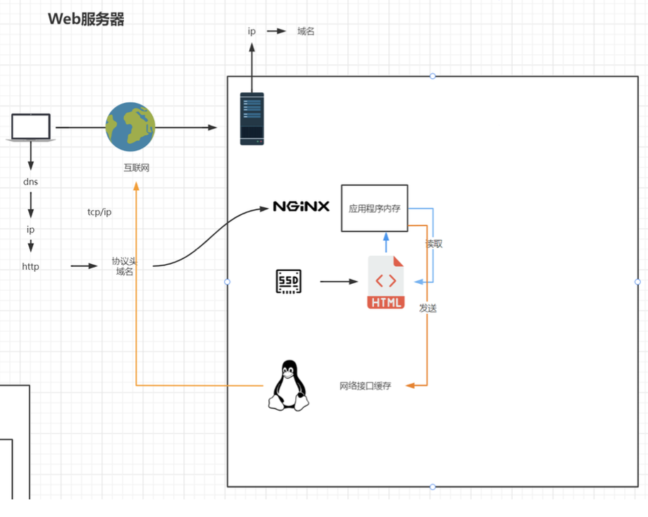

# Nginx 安装

## 版本区别

常用版本分为四大阵营 

Nginx开源版

- http://nginx.org/

Nginx plus 商业版 

- https://www.nginx.com

openresty

- http://openresty.org/cn/

Tengine

- http://tengine.taobao.org/

## 编译安装

```shell
./configure --prefix=/usr/local/nginx 
make
make install
```

## 警告或报错

提示

```
checking for OS
 + Linux 3.10.0-693.el7.x86_64 x86_64
checking for C compiler ... not found
./configure: error: C compiler cc is not found
```

安装 gcc

```shell
yum install -y gcc
```

提示

```
./configure: error: the HTTP rewrite module requires the PCRE library.
You can either disable the module by using --without-http_rewrite_module
option, or install the PCRE library into the system, or build the PCRE library
statically from the source with nginx by using --with-pcre=<path> option.
```

安装zlib库

```shell
yum install -y zlib zlib-devel
```

## 启动 Nginx

进入安装好的目录 /usr/local/nginx/sbin

```shell
## 启动
./nginx
## 快速停止
./nginx -s stop
## 优雅关闭，在退出前完成已经接受的连接请求
./nginx -s quit
## 重新加载配置
./nginx -s reload
```

## 防火墙

- 放行端口

```shell
firewall-cmd --zone=public --add-port=80/tcp --permanent
```

- 重启防火墙

```shell
firewall-cmd --reload
```

- 关闭防火墙

```shell
systemctl stop firewalld.service
```

- 禁止防火墙开机启动

```shell
systemctl disable firewalld.service
```

## 安装成系统服务

- 创建服务脚本

```shell
vi /usr/lib/systemd/system/nginx.service
```

- 服务脚本内容

```shell
[Unit]
Description=nginx -  web server
After=network.target remote-fs.target nss-lookup.target
[Service]
Type=forking
PIDFile=/usr/local/nginx/logs/nginx.pid
ExecStartPre=/usr/local/nginx/sbin/nginx -t -c /usr/local/nginx/conf/nginx.conf
ExecStart=/usr/local/nginx/sbin/nginx -c /usr/local/nginx/conf/nginx.conf
ExecReload=/usr/local/nginx/sbin/nginx -s reload
ExecStop=/usr/local/nginx/sbin/nginx -s stop
ExecQuit=/usr/local/nginx/sbin/nginx -s quit
PrivateTmp=true
[Install]
WantedBy=multi-user.target
```

- 重新加载系统服务

```shell
systemctl daemon-reload
```

- 启动服务

```shell
systemctl start nginx.service
```

- 开机启动

```shell
systemctl enable nginx.service
```

## 重启失败

启动nginx服务，无法开启，导致网页打不开。把服务重启一下发现提示错误如下：

```
Starting nginx: nginx: [emerg] bind() to 0.0.0.0:80 failed (98: Address already in use)

nginx: [emerg] bind() to 0.0.0.0:80 failed (98: Address already in use)
nginx: [emerg] bind() to 0.0.0.0:80 failed (98: Address already in use)
nginx: [emerg] bind() to 0.0.0.0:80 failed (98: Address already in use)
nginx: [emerg] bind() to 0.0.0.0:80 failed (98: Address already in use)
nginx: [emerg] still could not bind()
```

问题描述：地址已被使用。可能nginx服务卡死了，导致端口占用，出现此错误。

- 查看端口

```shell
netstat -ntpl
```

```
[root@localhost /]# netstat -ntpl
Active Internet connections (only servers)
Proto Recv-Q Send-Q Local Address               Foreign Address             State       PID/Program name   
tcp        0      0 0.0.0.0:58819               0.0.0.0:*                   LISTEN      2094/rpc.statd      
tcp        0      0 127.0.0.1:3306              0.0.0.0:*                   LISTEN      5060/mysqld         
tcp        0      0 0.0.0.0:21                  0.0.0.0:*                   LISTEN      2294/vsftpd         
tcp        0      0 0.0.0.0:22                  0.0.0.0:*                   LISTEN      2271/sshd           
tcp        0      0 127.0.0.1:631               0.0.0.0:*                   LISTEN      2121/cupsd          
tcp        0      0 :::23527                    :::*                        LISTEN      2094/rpc.statd      
tcp        0      0 :::80                       :::*                        LISTEN      2347/httpd          
tcp        0      0 :::22                       :::*                        LISTEN      2271/sshd           
tcp        0      0 ::1:631                     :::*                        LISTEN      2121/cupsd
```


```shell
kill 2347
```


# 目录结构

进入Nginx的主目录我们可以看到这些文件夹

client_body_temp  conf  fastcgi_temp  html  logs  proxy_temp  sbin  scgi_temp  uwsgi_temp

其中这几个文件夹在刚安装后是没有的，主要用来存放运行过程中的临时文件

client_body_temp fastcgi_temp proxy_temp scgi_temp

- conf

用来存放配置文件相关

- html

用来存放静态文件的默认目录 html、css等

- sbin

nginx的主程序

# 基本运行原理


# 最小配置

```shell
# 默认为1，表示开启一个业务进程
worker_processes  1;
# 单个业务进程可接受连接数
events {
    worker_connections  1024;
}


http {
		# 引入http mime类型
    include       mime.types;
    # 如果mime类型没匹配上，默认使用二进制流的方式传输。
    default_type  application/octet-stream;
    # 使用linux的sendfile(socket, file, len)高效网络传输，也就是数据0拷贝。    
    sendfile        on;
    # 虚拟主机配置
    server {
    		# 监听端口号
        listen       80; 
        # 主机名
        server_name  localhost;
				# 匹配路径
        location / {
        		# 文件根目录
            root   html;
            # 默认页名称
            index  index.html index.htm;
        }
				# 报错编码对应页面
        error_page   500 502 503 504  /50x.html;
        location = /50x.html {
            root   html;
        }
    }

}
```

- 未开启sendfile



- 开启后


# 虚拟主机配置

```shell
server {
  # 监听端口号
  listen       80;
  # 主机名
  server_name  localhost;
  # 匹配路径
  location / {
    # 文件根目录
    root   html;
    # 默认页名称
    index  index.html index.htm;
  }
  # 报错编码对应页面
  error_page   500 502 503 504  /50x.html;
  location = /50x.html {
  	root   html;
  }
}
```

- 虚拟主机 

原本一台服务器只能对应一个站点，通过虚拟主机技术可以虚拟化成多个站点同时对外提供服务 

- servername 匹配规则 

我们需要注意的是servername匹配分先后顺序，写在前面的匹配上就不会继续往下匹配了。

- 完整匹配

我们可以在同一servername中匹配多个域名

```
server_name  vod.mmban.com www1.mmban.com;
```

- 通配符匹配

```
server_name  *.mmban.com
```

- 通配符结束匹配

```
server_name  vod.*;
```

- 正则匹配

```
server_name  ~^[0-9]+\.mmban\.com$;
```


## nginx.pid 找不到

修改nginx配置文件之后，重新加载配置

```shell
./nginx -s reload
```

发现报以下错误：

nginx: [error] open() "/usr/local/nginx/logs/nginx.pid" failed (2: No such file or directory)

解决办法：启动nginx时，指定配置目录

```shell
./nginx -c /usr/local/nginx/conf/nginx.conf
```

# 反向代理

```shell
server {
		listen       80;
		server_name  www.qzmrss.com;

		location / {
				proxy_pass http://www.baidu.com;
				#root   html;
				#index  index.html index.htm;
    }

		error_page   500 502 503 504  /50x.html;
		location = /50x.html {
				root   html;
		}
}
```

- 基于反向代理的负载均衡

```shell
worker_processes  1;
events {
    worker_connections  1024;
}


http {
    include       mime.types;
    default_type  application/octet-stream;
    sendfile        on;
    
    # 负载均衡基本配置
    upstream httpds {
    	server 172.16.147.129:80;
    	server 172.16.147.130:80;
    }
    
    server {
        listen       80; 
        server_name  localhost;
        location / {
        		# httpds 为别名，可以是任意名字
            proxy_pass http://httpds;
        }
        error_page   500 502 503 504  /50x.html;
        location = /50x.html {
            root   html;
        }
    }

}
```

