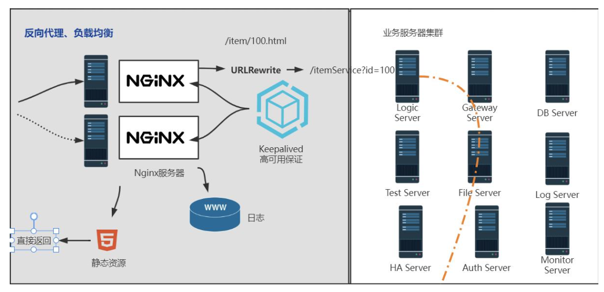

# Nginx 安装

## 版本区别

常用版本分为四大阵营 

Nginx开源版

- http://nginx.org/

Nginx plus 商业版 

- https://www.nginx.com

openresty

- http://openresty.org/cn/

Tengine

- http://tengine.taobao.org/

## 编译安装

```shell
./configure --prefix=/usr/local/nginx 
make
make install
```

## 警告或报错

提示

```
checking for OS
 + Linux 3.10.0-693.el7.x86_64 x86_64
checking for C compiler ... not found
./configure: error: C compiler cc is not found
```

安装 gcc

```shell
yum install -y gcc
```

提示

```
./configure: error: the HTTP rewrite module requires the PCRE library.
You can either disable the module by using --without-http_rewrite_module
option, or install the PCRE library into the system, or build the PCRE library
statically from the source with nginx by using --with-pcre=<path> option.
```

安装zlib库

```shell
yum install -y zlib zlib-devel
```

## 启动 Nginx

进入安装好的目录 /usr/local/nginx/sbin

```shell
## 启动
./nginx
## 快速停止
./nginx -s stop
## 优雅关闭，在退出前完成已经接受的连接请求
./nginx -s quit
## 重新加载配置
./nginx -s reload
```

## 防火墙

- 查看防火墙状态及端口列表

```shell
firewall-cmd --state
firewall-cmd --list-all
```

- 放行端口

```shell
firewall-cmd --zone=public --add-port=80/tcp --permanent
```

- 重启防火墙

```shell
firewall-cmd --reload
```

- 关闭防火墙

```shell
systemctl stop firewalld.service
```

- 禁止防火墙开机启动

```shell
systemctl disable firewalld.service
```

## 安装成系统服务

- 创建服务脚本

```shell
vi /usr/lib/systemd/system/nginx.service
```

- 服务脚本内容

```shell
[Unit]
Description=nginx -  web server
After=network.target remote-fs.target nss-lookup.target
[Service]
Type=forking
PIDFile=/usr/local/nginx/logs/nginx.pid
ExecStartPre=/usr/local/nginx/sbin/nginx -t -c /usr/local/nginx/conf/nginx.conf
ExecStart=/usr/local/nginx/sbin/nginx -c /usr/local/nginx/conf/nginx.conf
ExecReload=/usr/local/nginx/sbin/nginx -s reload
ExecStop=/usr/local/nginx/sbin/nginx -s stop
ExecQuit=/usr/local/nginx/sbin/nginx -s quit
PrivateTmp=true
[Install]
WantedBy=multi-user.target
```

- 重新加载系统服务

```shell
systemctl daemon-reload
```

- 启动服务

```shell
systemctl start nginx.service
```

- 开机启动

```shell
systemctl enable nginx.service
```

## 重启失败

启动nginx服务，无法开启，导致网页打不开。把服务重启一下发现提示错误如下：

```
Starting nginx: nginx: [emerg] bind() to 0.0.0.0:80 failed (98: Address already in use)

nginx: [emerg] bind() to 0.0.0.0:80 failed (98: Address already in use)
nginx: [emerg] bind() to 0.0.0.0:80 failed (98: Address already in use)
nginx: [emerg] bind() to 0.0.0.0:80 failed (98: Address already in use)
nginx: [emerg] bind() to 0.0.0.0:80 failed (98: Address already in use)
nginx: [emerg] still could not bind()
```

问题描述：地址已被使用。可能nginx服务卡死了，导致端口占用，出现此错误。

- 查看端口

```shell
netstat -ntpl
```

```
[root@localhost /]# netstat -ntpl
Active Internet connections (only servers)
Proto Recv-Q Send-Q Local Address               Foreign Address             State       PID/Program name   
tcp        0      0 0.0.0.0:58819               0.0.0.0:*                   LISTEN      2094/rpc.statd      
tcp        0      0 127.0.0.1:3306              0.0.0.0:*                   LISTEN      5060/mysqld         
tcp        0      0 0.0.0.0:21                  0.0.0.0:*                   LISTEN      2294/vsftpd         
tcp        0      0 0.0.0.0:22                  0.0.0.0:*                   LISTEN      2271/sshd           
tcp        0      0 127.0.0.1:631               0.0.0.0:*                   LISTEN      2121/cupsd          
tcp        0      0 :::23527                    :::*                        LISTEN      2094/rpc.statd      
tcp        0      0 :::80                       :::*                        LISTEN      2347/httpd          
tcp        0      0 :::22                       :::*                        LISTEN      2271/sshd           
tcp        0      0 ::1:631                     :::*                        LISTEN      2121/cupsd
```


```shell
kill 2347
```


# 目录结构

进入Nginx的主目录我们可以看到这些文件夹

client_body_temp  conf  fastcgi_temp  html  logs  proxy_temp  sbin  scgi_temp  uwsgi_temp

其中这几个文件夹在刚安装后是没有的，主要用来存放运行过程中的临时文件

client_body_temp fastcgi_temp proxy_temp scgi_temp

- conf

用来存放配置文件相关

- html

用来存放静态文件的默认目录 html、css等

- sbin

nginx的主程序

# 基本运行原理


# 最小配置

```nginx
# 默认为1，表示开启一个业务进程
worker_processes  1;
# 单个业务进程可接受连接数
events {
    worker_connections  1024;
}


http {
		# 引入http mime类型
    include       mime.types;
    # 如果mime类型没匹配上，默认使用二进制流的方式传输。
    default_type  application/octet-stream;
    # 使用linux的sendfile(socket, file, len)高效网络传输，也就是数据0拷贝。    
    sendfile        on;
    # 虚拟主机配置
    server {
    		# 监听端口号
        listen       80; 
        # 主机名
        server_name  localhost;
				# 匹配路径
        location / {
        		# 文件根目录
            root   html;
            # 默认页名称
            index  index.html index.htm;
        }
				# 报错编码对应页面
        error_page   500 502 503 504  /50x.html;
        location = /50x.html {
            root   html;
        }
    }

}
```

- 未开启sendfile


- 开启后


# 虚拟主机配置

```nginx
server {
  # 监听端口号
  listen       80;
  # 主机名
  server_name  localhost;
  # 匹配路径
  location / {
    # 文件根目录
    root   html;
    # 默认页名称
    index  index.html index.htm;
  }
  # 报错编码对应页面
  error_page   500 502 503 504  /50x.html;
  location = /50x.html {
  	root   html;
  }
}
```

- 虚拟主机 

原本一台服务器只能对应一个站点，通过虚拟主机技术可以虚拟化成多个站点同时对外提供服务 

- servername 匹配规则 

我们需要注意的是servername匹配分先后顺序，写在前面的匹配上就不会继续往下匹配了。

- 完整匹配

我们可以在同一servername中匹配多个域名

```
server_name  vod.mmban.com www1.mmban.com;
```

- 通配符匹配

```
server_name  *.mmban.com
```

- 通配符结束匹配

```
server_name  vod.*;
```

- 正则匹配

```
server_name  ~^[0-9]+\.mmban\.com$;
```


## nginx.pid 找不到

修改nginx配置文件之后，重新加载配置

```shell
./nginx -s reload
```

发现报以下错误：

nginx: [error] open() "/usr/local/nginx/logs/nginx.pid" failed (2: No such file or directory)

解决办法：启动nginx时，指定配置目录

```shell
./nginx -c /usr/local/nginx/conf/nginx.conf
```

# 负载均衡

## 反向代理

```nginx
server {
		listen       80;
		server_name  www.qzmrss.com;

		location / {
				proxy_pass http://www.baidu.com;
				#root   html;
				#index  index.html index.htm;
    }

		error_page   500 502 503 504  /50x.html;
		location = /50x.html {
				root   html;
		}
}
```

## 基于反向代理的负载均衡

```nginx
worker_processes 1;
events {
    worker_connections 1024;
}


http {
    include mime.types;
    default_type application/octet-stream;
    sendfile on;

    # 负载均衡基本配置
    upstream httpds {
        server 172.16.147.129:80;
        server 172.16.147.130:80;
    }

    server {
        listen 80;
        server_name localhost;
        location / {
            # httpds 为别名，可以是任意名字
            proxy_pass http://httpds;
        }
        error_page 500 502 503 504 /50x.html;
        location = /50x.html {
            root html;
        }
    }
}
```

## 负载均衡策略

### 轮询

默认情况下使用轮询方式，逐一转发，这种方式适用于无状态请求。

### 权重

指定轮询机率，weight和访问比率成正比，用于后端服务器性能不均的情况。

```nginx
upstream httpds {
		# 129访问10次之后，130有一次访问机会
		server 172.16.147.129:80 weight=10 down;
		server 172.16.147.130:80 weight=1;
}
```

- weight：默认为1，weight越大，负载的权重越大。
- down：下线，表示当前的server暂时不参与负载。
- backup：其它所有的非backup机器down或者忙的时候，请求backup机器。

### ip_hash 

根据客户端的ip地址转发同一台服务器，可以保持回话。

### least_conn

最少连接访问

### url_hash 

根据用户访问的url定向转发请求

### fair

根据后端服务器响应时间转发请求

# 动静分离

为了提高网站的响应速度，减轻程序服务器（Tomcat，Jboss等）的负载，对于静态资源，如图片、js、css等文件，可以在反向代理服务器中进行缓存，这样浏览器在请求一个静态资源时，代理服务器就可以直接处理，而不用将请求转发给后端服务器。对于用户请求的动态文件，如servlet、jsp，则转发给Tomcat，Jboss服务器处理，这就是动静分离。即动态文件与静态文件的分离。



```nginx
worker_processes 1;


events {
    worker_connections 1024;
}


http {
    include mime.types;
    default_type application/octet-stream;


    sendfile on;
    #tcp_nopush     on;

    keepalive_timeout 65;

    server {
        listen 80;
        server_name localhost;

        location / {
            proxy_pass http://172.16.147.129:8080;
            root   html;
    				index  index.html index.htm;
        }
				
				# 静态资源在本机上，动态代码在129这台机器上
				# 通配符匹配
        location ~*/(css|images|js) {
            root html;
            index index.html index.htm;
        }

        error_page 500 502 503 504 /50x.html;
        location = /50x.html {
            root html;
        }
    }
}
```

# UrlRewrite 伪静态配置

不需要使用这样的访问路径 `http://172.16.147.128/ssm/employee/page/1`，直接使用 `http://172.16.147.128/1.html` 就可以访问。

```shell
location / {
		rewrite ^/([0-9]+).html$ /ssm/employee/page/$1 break;
		proxy_pass http://172.16.147.129:8080;
}
```

## 应用服务器防火墙配置

- 开启防火墙

```shell
systemctl start firewalld
```

- 重启防火墙

```shell
systemctl restart firewalld
```

- 重载规则

```shell
firewall-cmd --reload
```

- 查看已配置规则

```shell
firewall-cmd --list-all
```

- 指定端口和ip访问

```shell
firewall-cmd --permanent --add-rich-rule="rule family="ipv4" source address="192.168.44.101" port protocol="tcp" port="8080" accept"
```

- 移除规则

```shell
firewall-cmd --permanent --remove-rich-rule="rule family="ipv4" source address="192.168.44.101" port port="8080" protocol="tcp" accept"
```

## 网关配置

```nginx

worker_processes 1;


events {
    worker_connections 1024;
}


http {
    include mime.types;
    default_type application/octet-stream;


    sendfile on;
    #tcp_nopush     on;

    keepalive_timeout 65;

    upstream httpds {
        server 192.168.172.11:8080 weight=10;
        server 192.168.172.12:8080 weight=1;
    }

    server {
        listen 80;
        server_name localhost;


        location / {
            rewrite ^/([0-9]+).html$ /ssm/employee/page/$1 break;
            proxy_pass http://httpds;
        }

        location ~*/(css|images|js) {
            root html;
            index index.html index.htm;
        }

        error_page 500 502 503 504 /50x.html;
        location = /50x.html {
            root html;
        }
    }
}
```

# 防盗链配置

防盗链就是防止其他网站盗用我们自己网站的静态资源，因为浏览器访问网页资源都会带上`Referer`请求头

- 如果访问路径为 `http://192.168.172.11/ssm/static/images/body1.jpg`,请求头信息为：`http://192.168.172.11/ssm/static/images/body1.jpg`
- 如果访问路径为 `http://192.168.172.10/ssm/static/images/body1.jpg`,请求头信息为：`http://192.168.172.10/ssm/static/images/body1.jpg`

Nginx 可以根据`Referer`请求头来判断，是否盗用网站资源

```nginx

worker_processes 1;

events {
    worker_connections 1024;
}


http {
    include mime.types;
    default_type application/octet-stream;

    sendfile on;

    keepalive_timeout 65;

    server {
        listen 80;
        server_name localhost;

        location / {
      			# 默认访问tomcat页面
            proxy_pass http://127.0.0.1:8080;
            root html;
            index index.html index.htm;
        }

        location ~*/(css|images|js) {
            proxy_pass http://127.0.0.1:8080;
      			# 只允许192.168.172.11 ip下访问静态资源，其他ip为非法ip，返回403状态
            valid_referers none 192.168.172.11;
            if ($invalid_referer) {
                return 403;
            }
            root html;
            index index.html index.htm;
        }

        error_page 500 502 503 504 /50x.html;
        location = /50x.html {
            root html;
        }
    }
}
```

- 使用curl测试防盗链

```shell
curl -I http://192.168.172.11/ssm/static/images/body1.jpg
```

```
HTTP/1.1 200 
Server: nginx/1.22.1
Date: Tue, 18 Apr 2023 11:52:12 GMT
Content-Type: image/jpeg;charset=UTF-8
Content-Length: 923736
Connection: keep-alive
Accept-Ranges: bytes
ETag: W/"923736-1681180082052"
Last-Modified: Tue, 11 Apr 2023 02:28:02 GMT
```

带Referer

```shell
curl -e "https://www.baidu.com" -I http://192.168.172.11/ssm/static/images/body1.jpg
```

```
atic/images/body1.jpg
HTTP/1.1 403 Forbidden
Server: nginx/1.22.1
Date: Tue, 18 Apr 2023 11:52:44 GMT
Content-Type: text/html
Content-Length: 153
Connection: keep-alive
```

- 配置

```
valid_referers none | blocked | server_names | strings ....;
```

- none， 检测 Referer 头域不存在的情况。

- blocked，检测 Referer 头域的值被防火墙或者代理服务器删除或伪装的情况。这种情况该头域的值不以 “http://” 或 “https://” 开头。

- server_names ，设置一个或多个 URL ，检测 Referer 头域的值是否是这些 URL 中的某一个。

# Keepalived

Keepalived一个基于VRRP 协议来实现的 LVS 服务高可用方案，可以利用其来解决单点故障。一个LVS服务会有2台服务器运行Keepalived，一台为主服务器（MASTER），一台为备份服务器（BACKUP），但是对外表现为一个虚拟IP，主服务器会发送特定的消息给备份服务器，当备份服务器收不到这个消息的时候，即主服务器宕机的时候， 备份服务器就会接管虚拟IP，继续提供服务，从而保证了高可用性。


- 安装

```shell
yum install keepalived
```

- 配置

配置文件在：`/etc/keepalived/keepalived.conf`

- 主服务器配置

```nginx
! Configuration File for keepalived
global_defs {
    router_id lb111
}
vrrp_instance atguigu {
    state MASTER
    interface ens160
    virtual_router_id 51   
    priority 100
    advert_int 1
    authentication {
        auth_type PASS
        auth_pass 1111
    }
    virtual_ipaddress {
        192.168.172.200
    }
}
```

- 备份服务器

```nginx
! Configuration File for keepalived
global_defs {
    router_id lb111
}
vrrp_instance atguigu {
    state BACKUP
    interface ens160
    virtual_router_id 51
    priority 50
    advert_int 1
    authentication {
        auth_type PASS
        auth_pass 1111
    }
    virtual_ipaddress {
        192.168.172.200
    }
}
```

- 启动服务

```shell
systemctl start keepalived
```

