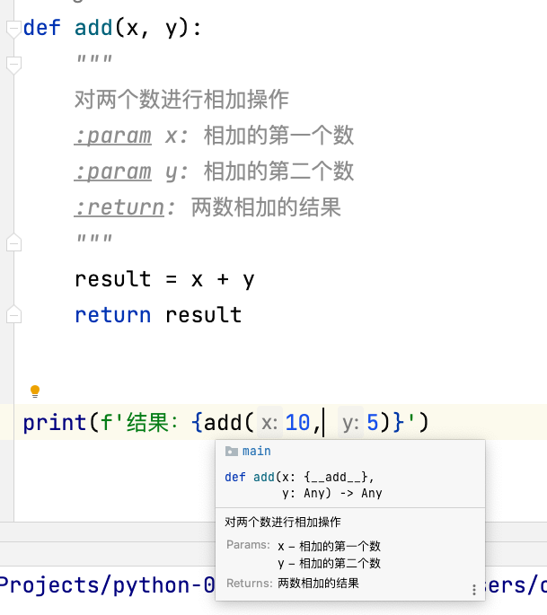

# 基础语法

## 注释

python中单行注释采用 **#** 开头。

```python
# 第一个注释
print ("Hello, Python!")  # 第二个注释
```

python 中多行注释使用三个单引号 **'''** 或三个双引号 **"""**。

```python
'''
这是多行注释，使用单引号。
这是多行注释，使用单引号。
这是多行注释，使用单引号。
'''

"""
这是多行注释，使用双引号。
这是多行注释，使用双引号。
这是多行注释，使用双引号。
"""
```

## 变量

- 赋值

Python 中的变量赋值不需要类型声明。每个变量在内存中创建，都包括变量的标识，名称和数据这些信息。每个变量在使用前都必须赋值，变量赋值以后该变量才会被创建。等号 **=** 用来给变量赋值。等号 **=** 运算符左边是一个变量名，等号 **=** 运算符右边是存储在变量中的值。例如：

```python
counter = 100 # 赋值整型变量
miles = 1000.0 # 浮点型
name = "John" # 字符串
```

- 多个变量赋值

Python允许你同时为多个变量赋值。例如：

```python
a = b = c = 1
```

以上实例，创建一个整型对象，值为1，三个变量被分配到相同的内存空间上。

您也可以为多个对象指定多个变量。例如：

```python
a, b, c = 1, 2, "john"
```

## 数据类型

常见的几种数据类型，字符串、int、float

```python
# 字符串
print(type("abc"))
# int
print(type(12))
# float
print(type(12.89))
```

执行结果

```
<class 'str'>
<class 'int'>
<class 'float'>
```

- 类型转换

```python
# 字符串转为int
int_num = int("12")
print(int_num)

# 字符串转为float
float_num = float("12.89")
print(float_num)
```

## 算术运算符

以下假设变量 **a=10**，变量 **b=21**：

| 运算符 | 描述                                            | 实例                 |
| :----- | :---------------------------------------------- | :------------------- |
| +      | 加 - 两个对象相加                               | a + b 输出结果 31    |
| -      | 减 - 得到负数或是一个数减去另一个数             | a - b 输出结果 -11   |
| *      | 乘 - 两个数相乘或是返回一个被重复若干次的字符串 | a * b 输出结果 210   |
| /      | 除 - x 除以 y                                   | b / a 输出结果 2.1   |
| %      | 取模 - 返回除法的余数                           | b % a 输出结果 1     |
| **     | 幂 - 返回x的y次幂                               | a**b 为10的21次方    |
| //     | 取整除 - 往小的方向取整数                       | 9//2 = 4  -9//2 = -5 |

## 布尔类型

布尔类型即 True 或 False。在 Python 中，True 和 False 都是关键字，表示布尔值。

布尔类型可以用来控制程序的流程，比如判断某个条件是否成立，或者在某个条件满足时执行某段代码。

```python
a = True
b = False
print(a)
print(b)
print(type(a))

# 比较运算符
print(2 > 3)
```

输出：

```
True
False
<class 'bool'>
False
```

# 字符串

## 定义

```python
# 单引号定义
name = 'abc'
# 双引号定义
name = "efg"
# 三引号定义
name = """
abc
hij
"""
```

## 字符串拼接

```python
name = "张三"
print("姓名：" + name)

age = 18
# 报错，无法和非字符串类型进行拼接
print("年龄：" + age)
```

## 字符串格式化

Python 支持格式化字符串的输出 。尽管这样可能会用到非常复杂的表达式，但最基本的用法是将一个值插入到一个有字符串格式符 %s 的字符串中。

```python
print("我叫%s，今年%d岁" % ('小明', 18))
```

### f-string

f-string 是 python3.6 之后版本添加的，称之为字面量格式化字符串，是新的格式化字符串的语法。

```python
name = "小明"
age = 18
print(f"我叫{name}，今年{age}岁")
```

### 数字精度控制

我们可以使用辅助符号 ***m.n***来控制数据的宽度和精度

- m，控制宽度，要求是数字，设置的宽度小于数字自身，不生效

- .n，控制小数点的精度，要求是数字，会进行小数的四舍五入

示例：

- %5d：表示将整数的宽度控制在5位，如数字11，被设置为5d，就会变成，【空格】【空格】【空格】11，用三个空格补足宽度。
- %5.2f：表示将宽度控制为5，将小数点精度设置为2，小数点和小数部分也算入宽度计算。如，对11.345设置了%7.2f后，结果是：【空格】【空格】11.35。2个空格补足宽度，小数部分限制2位精度后，四舍五入为 .35。

```python
num1 = 11
num2 = 11.345

print("%5d" % num1)
print("%7.2f" % num2)
```

输出：

```
   11
  11.35
```

# 条件控制

Python 条件语句是通过一条或多条语句的执行结果（True 或者 False）来决定执行的代码块。

```python
age = int(input("请输入你家狗狗的年龄："))
print("")
if age <= 0:
    print("你是在逗我吧!")
elif age == 1:
    print("相当于 14 岁的人。")
elif age == 2:
    print("相当于 22 岁的人。")
elif age > 2:
    human = 22 + (age - 2) * 5
    print("对应人类年龄: ", human)

# 退出提示
input("点击 enter 键退出")
```

# 循环语句

## while

以下实例使用了 while 来计算 1 到 100 的总和：

```python
n = 100
 
sum = 0
counter = 1
while counter <= n:
    sum = sum + counter
    counter += 1
 
print("1 到 %d 之和为: %d" % (n,sum))
```

执行结果如下：

```
1 到 100 之和为: 5050
```

## for

for 循环可以遍历任何可迭代对象，如一个列表或者一个字符串。

- 输出字符串列表中的每个元素：

```python
sites = ["Baidu", "Google","Runoob","Taobao"]
for site in sites:
    print(site)
```

输出结果：

```
Baidu
Google
Runoob
Taobao
```

- 也可用于打印字符串中的每个字符：

```python
word = 'runoob'

for letter in word:
    print(letter)
```

以上代码执行输出结果为：

```
r
u
n
o
o
b
```

- 整数范围值可以配合 range() 函数使用：

```python
#  1 到 5 的所有数字：
for number in range(1, 6):
    print(number)
```

以上代码执行输出结果为：

```
1
2
3
4
5
```

## break

**break** 语句可以跳出 for 和 while 的循环体。如果你从 for 或 while 循环中终止，任何对应的循环 else 块将不执行。

```python
n = 5
while n > 0:
    n -= 1
    if n == 2:
        break
    print(n)
print('循环结束。')
```

输出结果为：

```
4
3
循环结束。
```

## continue

**continue** 语句被用来告诉 Python 跳过当前循环块中的剩余语句，然后继续进行下一轮循环。

```python
n = 5
while n > 0:
    n -= 1
    if n == 2:
        continue
    print(n)
print('循环结束。')
```

输出结果为：

```
4
3
1
0
循环结束。
```

# 函数

函数是组织好的，可重复使用的，用来实现单一，或相关联功能的代码段。

```python
def add(a, b):
    result = a + b
    return result


r = add(10, 20)
print(f"结果：{r}")
```

## 函数返回值None类型

None作为一个特殊的字面量，用于表示：空、无意义，有非常多的应用场景。

- 用在函数无返回值上
- 用在if判断上
  - 在if判断中，None等同于False
  - 一般用于在函数中主动返回None，配合if判断做相关处理

- 用于声明无内容的变量上
  - 定义变量，但暂时不需要变量有具体值，可以用None来代替，`name = None`

```python
def check_age(age):
    if age > 18:
        return "SUCCESS"
    else:
        return None

result = check_age(16)

# None类型
print(type(result))
# None用于if判断
if not result:
    # 进入if表示result是None值，也就是False
    print("未成年，不可以进入")
```

输出结果：

```
<class 'NoneType'>
未成年，不可以进入
```

## 函数的文档说明

```python
def add(x, y):
    """
    对两个数进行相加操作
    :param x: 相加的第一个数
    :param y: 相加的第二个数
    :return: 两数相加的结果
    """
    result = x + y
    return result


print(f'结果：{add(10, 5)}')
```

当把光标移动到函数上：



## global

- 不实用global关键字的情况下，试图访问全局变量：

```python
number = 100

def func_a():
    # 这里声明的变量仍然为局部变量
    number = 200

func_a()

print(number)
```

输出结果：

```
100
```


- 使用global 关键字，在函数内声明变量为全局变量

```python
number = 100

def func_a():
    # 设置在函数内定义的变量为全局变量
    global number
    number = 200

func_a()

print(number)
```

输出结果：

```
200
```

# 列表

## 定义

```python
my_list = ["apple", 100, True]
print(my_list)
print(type(my_list))
```

输出结果：

```
['apple', 100, True]
<class 'list'>
```

## 下标索引

```python
my_list = ["apple", 100, True]

# 从前往后取
print(my_list[0])
print(my_list[1])
print(my_list[2])

# 从后往前取
print(my_list[-1])
print(my_list[-2])
print(my_list[-3])
```

输出结果：

```
apple
100
True
True
100
apple
```

## 查找

```python
my_list = ["java", "python", "golang"]
# 查找某元素在列表内的下标索引
print(my_list.index("python"))
```

输出结果：

```
1
```

如果查找的元素不存在，会报错：

```
ValueError: 'kotlin' is not in list
```

## 修改

```python
my_list = ["java", "python", "golang"]
# 修改指定索引位置的元素
my_list[0] = "c++"
print(my_list)
```

输出结果：

```
['c++', 'python', 'golang']
```

## 插入

```python
my_list = ["java", "python", "golang"]
# 在指定下标位置插入新元素
my_list.insert(1, "kotlin")
print(my_list)
```

输出结果：

```
['java', 'kotlin', 'python', 'golang']
```

## 追加

```python
my_list = ["java", "python", "golang"]
# 在列表尾部追加单个新元素
my_list.append("c++")
print(my_list)
# 在列表尾部追加一批新元素
my_list.extend(["c", "javascript"])
print(my_list)
```

输出结果：

```
['java', 'python', 'golang', 'c++']
['java', 'python', 'golang', 'c++', 'c', 'javascript']
```

## 删除

```python
my_list = ["java", "python", "golang"]
print(f'删除前的列表：{my_list}')
# 删除指定索引位置元素
del my_list[2]
print(f'删除后的列表：{my_list}')

# 删除指定索引位置元素，并返回
element = my_list.pop(1)
print(f'删除后的列表：{my_list}')
print(f'被删除的元素：{element}')
```

输出结果：

```
删除前的列表：['java', 'python', 'golang']
删除后的列表：['java', 'python']
删除后的列表：['java']
被删除的元素：python
```

- 删除某元素在列表中的第一个匹配项

```python
my_list = ["java", "python", "golang", "python", "golang"]
print(f'删除前的列表：{my_list}')
my_list.remove("python")
print(f'删除后的列表：{my_list}')
```

输出结果：

```
删除前的列表：['java', 'python', 'golang', 'python', 'golang']
删除后的列表：['java', 'golang', 'python', 'golang']
```

## 清空

```python
my_list = ["java", "python", "golang"]
my_list.clear()
print(my_list)
```

输出结果：

```
[]
```

## 统计

- 统计某个元素在列表中的个数

```python
my_list = ["java", "python", "golang", "python", "golang"]
print(f'统计个数：{my_list.count("python")}')
```

输出结果：

```
统计个数：2
```

- 列表的长度

```python
my_list = ["java", "python", "golang", "python", "golang"]
print(f'列表的长度：{len(my_list)}')
```

输出结果：

```
列表的长度：5
```

## 遍历

- while 循环

```python
my_list = ["java", "python", "golang"]
index = 0
while index < len(my_list):
    element = my_list[index]
    print(element)
    index += 1
```

输出结果：

```
java
python
golang
```

- for 循环

```python
my_list = ["java", "python", "golang"]
for element in my_list:
    print(element)
```

输出结果：

```
java
python
golang
```

# 元组

Python中的元组（tuple）和列表（list）是两种不同的数据结构，它们在很多方面都有区别，主要包括以下几个方面：

1. 可变性：
   - 列表是可变的，可以随意添加、删除或修改其中的元素。
   - 元组是不可变的，一旦创建，就无法添加、删除或修改其中的元素。元组的元素是固定的。
2. 语法表示：
   - 列表使用方括号 [] 表示，例如：`my_list = [1, 2, 3]`。
   - 元组使用圆括号 () 表示，例如：`my_tuple = (1, 2, 3)`。
3. 性能：
   - 由于元组是不可变的，通常比列表更快，特别是在访问元素时。
   - 列表的可变性会导致在大规模元素添加/删除时产生更多的开销。
4. 适用场景：
   - 如果需要存储一组元素，但这些元素在整个程序执行期间不应该被改变，元组是更好的选择。
   - 如果需要一个容器，其中元素可以动态添加、删除或修改，列表是更合适的选项。
5. 内置方法：
   - 列表具有许多内置方法，如`append()`、`insert()`、`remove()`等，用于在列表上执行各种操作。
   - 元组由于不可变性，只支持有限的方法，如`count()`和`index()`。

```python
# 定义元组
t1 = ('abc', 88, True)
print(type(t1))
print(t1)

# 定义单个元素的元组
# 注意，必须带有逗号，否则不是元组类型
t2 = ("hello", )
print(t2)
```

输出结果：

```
<class 'tuple'>
('abc', 88, True)
88
('hello',)
```

# 字符串常用操作

## 通过下标索引取值

```python
my_str = "People don't need freedom"
# 通过下标索引取值
print(f'获取指定索引位置字符：{my_str[3]}')
print(f'获取指定索引位置字符：{my_str[-3]}')
```

输出结果：

```
获取指定索引位置字符：p
获取指定索引位置字符：d
```

## 获取字符串索引位置

```python
my_str = "People don't need freedom"
# 获取字符串索引位置
print(f'获取指定字符串的索引位置：{my_str.index("p")}')
```

输出结果：

```
获取指定字符串的索引位置：3
```

## 替换

```python
my_str = "People don't need freedom"
new_str = my_str.replace("need", "ask")
print(f'字符串被替换后，返回新的字符串：{new_str}')
```

输出结果：

```
字符串被替换后，返回新的字符串：People don't ask freedom
```

## 分割

```python
str_list = new_str.split(" ")
print(f'分割后返回的字符串列表：{str_list}')
```

输出结果：

```
分割后返回的字符串列表：['People', "don't", 'ask', 'freedom']
```

## strip

- 不传入参数

```python
my_str = " People don't need freedom "
# 去除前后空格
print(f'strip不传入参数，去除前后空格：{my_str.strip()}')
```

输出结果：

```
strip不传入参数，去除前后空格：People don't need freedom
```

- 传入参数

```python
my_str = "45People don't need freedom654"
print(f'strip传入参数：{my_str.strip("45")}')
```

输出结果：

```
strip传入参数：People don't need freedom6
```

## 统计个数

```python
# 统计字符串中某字符出现的次数
my_str = "People don't need freedom"
print(f'ee出现的次数：{my_str.count("ee")}')
# 字符串的长度
print(f'字符串的长度：{len(my_str)}')
```

输出结果：

```
ee出现的次数：2
字符串的长度：25
```

## 遍历

```python
# 遍历字符串
my_str = "People don't need freedom"
# while 循环遍历
index = 0
while index < len(my_str):
    print(my_str[index])
    index += 1

# for 循环遍历
for c in my_str:
    print(c)
```

