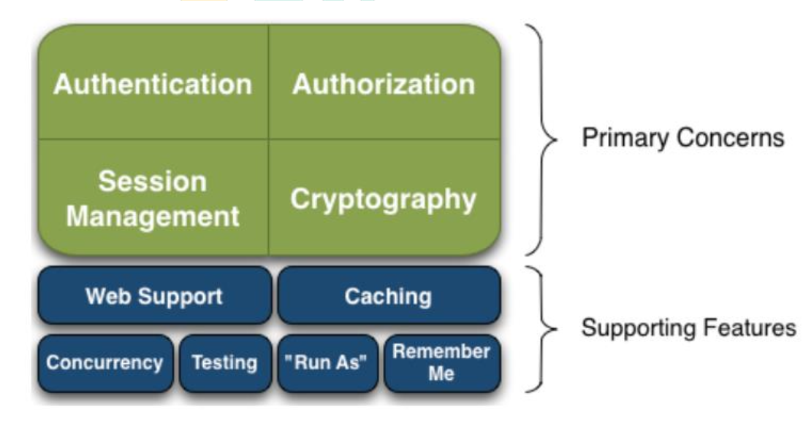
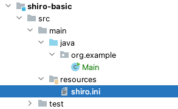
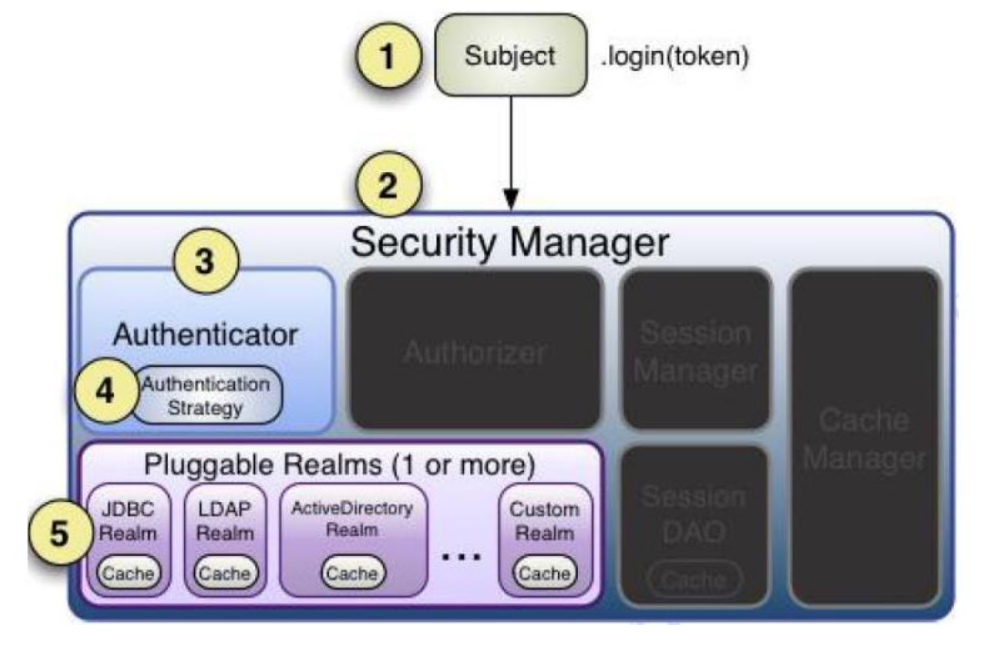
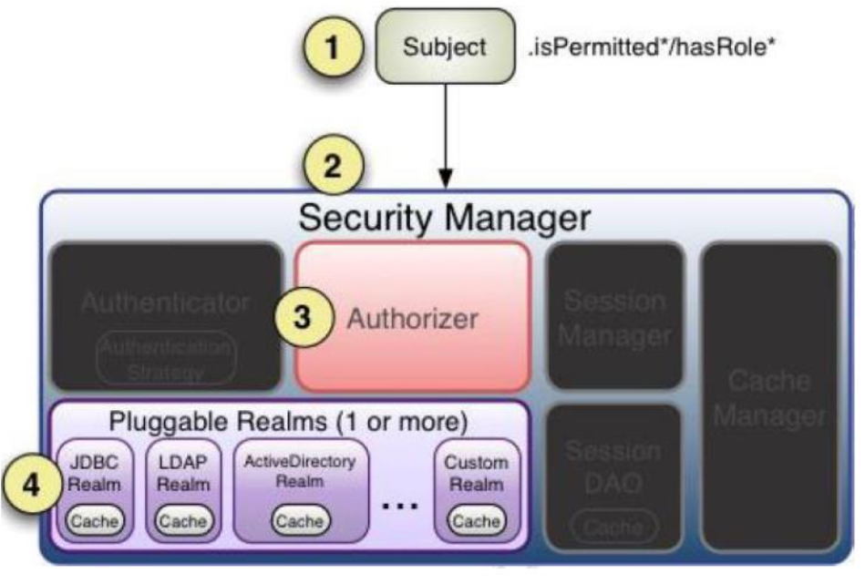

# 入门概述

Apache Shiro 是一个功能强大且易于使用的 Java 安全(权限)框架。Shiro 可以完 成：认证、授权、加密、会话管理、与 Web 集成、缓存 等。借助 Shiro 您可以快速轻松 地保护任何应用程序——从最小的移动应用程序到最大的 Web 和企业应用程序。

官网地址：https://shiro.apache.org/

## 为什么要用 Shiro

自 2003 年以来，框架格局发生了相当大的变化，因此今天仍然有很多系统在使用Shiro。这与 Shiro 的特性密不可分。

易于使用：使用 Shiro 构建系统安全框架非常简单。就算第一次接触也可以快速掌握。

- 全面：Shiro 包含系统安全框架需要的功能，满足安全需求的“一站式服务”。
- 灵活：Shiro 可以在任何应用程序环境中工作。虽然它可以在 Web、EJB 和 IoC 环境 中工作，但不需要依赖它们。Shiro 也没有强制要求任何规范，甚至没有很多依赖项。
- 强力支持 Web：Shiro 具有出色的 Web 应用程序支持，可以基于应用程序 URL 和 Web 协议(例如 REST)创建灵活的安全策略，同时还提供一组 JSP 库来控制页面输出。
- 兼容性强：Shiro 的设计模式使其易于与其他框架和应用程序集成。Shiro 与 Spring、Grails、Wicket、Tapestry、Mule、Apache Camel、Vaadin 等框架无缝集成。
- 社区支持：Shiro 是 Apache 软件基金会的一个开源项目，有完备的社区支持，文档支持。如果需要，像 Katasoft 这样的商业公司也会提供专业的支持和服务。

## Shiro 与 SpringSecurity 的对比

- Spring Security 基于 Spring 开发，项目若使用 Spring 作为基础，配合 Spring Security 做权限更加方便，而 Shiro 需要和 Spring 进行整合开发;
- Spring Security 功能比 Shiro 更加丰富些，例如安全维护方面;
- Spring Security 社区资源相对比 Shiro 更加丰富;
- Shiro 的配置和使用比较简单，Spring Security 上手复杂些;
- Shiro 依赖性低，不需要任何框架和容器，可以独立运行 Spring Security 依赖 Spring 容器;
- Shiro 不仅仅可以使用在 web 中，它可以工作在任何应用环境中。在集群会话时 Shiro 最重要的一个好处或许就是它的会话是独立于容器的。

## 基本功能



## 功能简介

- Authentication：身份认证/登录，验证用户是不是拥有相应的身份；
- Authorization：授权，即权限验证，验证某个已认证的用户是否拥有某个权限；即 判断用 户是否能进行什么操作，如：验证某个用户是否拥有某个角色。或者细粒度的验证 某个用户 对某个资源是否具有某个权限；
- Session Manager：会话管理，即用户登录后就是一次会话，在没有退出之前，它的所有信息都在会话中；会话可以是普通 JavaSE环境，也可以是 Web 环境的；
- Cryptography：加密，保护数据的安全性，如密码加密存储到数据库，而不是明文存储；
- Web Support：Web 支持，可以非常容易的集成到 Web 环境;
- Caching：缓存，比如用户登录后，其用户信息、拥有的角色/权限不必每次去查，这样可以提高效率；
- Concurrency：Shiro 支持多线程应用的并发验证，即如在一个线程中开启另一个线 程，能把权限自动传播过去；
- Testing：提供测试支持；
- Run As：允许一个用户假装为另一个用户(如果他们允许)的身份进行访问；
- Remember Me：记住我，这个是非常常见的功能，即一次登录后，下次再来的话不用登录了

## 原理

### 外部看

从外部来看 Shiro ，即从应用程序角度的来观察如何使用 Shiro 完成工作


- Shiro 架构

(1)Subject：应用代码直接交互的对象是 Subject，也就是说 Shiro 的对外 API 核心 就是 Subject。Subject 代表了当前“用户”， 这个用户不一定 是一个具体的人，与当 前应用交互的任何东西都是 Subject，如网络爬虫， 机器人等；与 Subject 的所有交互 都会委托给 SecurityManager；Subject 其实是一个门面，SecurityManager 才是实际的 执行者;

(2)SecurityManager：安全管理器；即所有与安全有关的操作都会与 SecurityManager 交互；且其管理着所有 Subject；可以看出它是 Shiro 的核心，它负责与 Shiro 的其他 组件进行交互，它相当于 SpringMVC 中 DispatcherServlet 的角色

(3)Realm：Shiro 从 Realm 获取安全数据(如用户、角色、权限)，就是说 SecurityManager 要验证用户身份，那么它需要从 Realm 获取相应的用户 进行比较以确 定用户身份是否合法；也需要从 Realm 得到用户相应的角色/ 权限进行验证用户是否能进 行操作；可以把 Realm 看成 DataSource

### 内部看


- Shiro 架构

(1)Subject：任何可以与应用交互的“用户”；

(2)SecurityManager ：相当于 SpringMVC 中的 DispatcherServlet；是 Shiro 的心 脏；所有具体的交互都通过 SecurityManager 进行控制；它管理着所有 Subject、且负 责进 行认证、授权、会话及缓存的管理。

(3)Authenticator：负责 Subject 认证，是一个扩展点，可以自定义实现;可以使用认 证 策略(Authentication Strategy)，即什么情况下算用户认证通过了;

(4)Authorizer：授权器、即访问控制器，用来决定主体是否有权限进行相应的操作;即 控 制着用户能访问应用中的哪些功能;

(5)Realm：可以有 1 个或多个 Realm，可以认为是安全实体数据源，即用于获取安全实 体 的;可以是 JDBC 实现，也可以是内存实现等等;由用户提供;所以一般在应用中都需 要 实现自己的 Realm;

(6)SessionManager：管理 Session 生命周期的组件;而 Shiro 并不仅仅可以用在 Web 环境，也可以用在如普通的 JavaSE 环境

(7)CacheManager：缓存控制器，来管理如用户、角色、权限等的缓存的;因为这些数据 基本上很少改变，放到缓存中后可以提高访问的性能

(8)Cryptography：密码模块，Shiro 提高了一些常见的加密组件用于如密码加密/解 密。

# 基本使用

## 环境准备

- Shiro不依赖容器，直接创建maven工程即可

- 添加依赖

```xml
<dependencies>
  <dependency>
    <groupId>org.apache.shiro</groupId>
    <artifactId>shiro-core</artifactId>
    <version>1.10.0</version>
  </dependency>
  <dependency>
    <groupId>commons-logging</groupId>
    <artifactId>commons-logging</artifactId>
    <version>1.2</version>
  </dependency>
</dependencies>
```

## INI 文件

Shiro 获取权限相关信息可以通过数据库获取，也可以通过 ini 配置文件获取

- 创建ini文件



```ini
[users]
zhangsan=z3
lisi=l4
```

## 登录认证

- 登录认证概念

(1) 身份验证：一般需要提供如身份ID等一些标识信息来表明登录者的身份，如提供 email，用户名/密码来证明。

(2) 在shiro中，用户需要提供principals(身份)和credentials(证明)给shiro，从而应用能验证用户身份。

(3) principals：身份，即主体的标识属性，可以是任何属性，如用户名、邮箱等，唯一 即可。一个主体可以有多个principals，但只有一个Primary principals，一般是用户名/ 邮箱/手机号。

(4) credentials：证明/凭证，即只有主体知道的安全值，如密码/数字证书等。 

(5) 最常见的principals和credentials组合就是用户名/密码。

- 登录认证基本流程

(1) 收集用户身份/凭证，即如用户名/密码

(2) 调用 Subject.login 进行登录，如果失败将得到相应 的 AuthenticationException 异常，根据异常提示用户 错误信息；否则登录成功

(3) 创建自定义的 Realm 类，继承 org.apache.shiro.realm.AuthenticatingRealm类， 实现 doGetAuthenticationInfo() 方法



- 登录认证实例

创建测试类，获取认证对象，进行登录认证，如下：

```java
public class Main {
    public static void main(String[] args) {
        //1 初始化获取 SecurityManager
        IniSecurityManagerFactory factory = new IniSecurityManagerFactory("classpath:shiro.ini");
        SecurityManager securityManager = factory.getInstance();
        SecurityUtils.setSecurityManager(securityManager);
        //2 获取 Subject 对象
        Subject subject = SecurityUtils.getSubject();
        //3 创建 token 对象，web 应用用户名密码从页面传递
        AuthenticationToken token = new UsernamePasswordToken("zhangsan", "z3");
        //4 完成登录
        try {
            subject.login(token);
            System.out.println("登录成功");
        } catch (UnknownAccountException e) {
            e.printStackTrace();
            System.out.println("用户不存在");
        } catch (IncorrectCredentialsException e) {
            e.printStackTrace();
            System.out.println("密码错误");
        } catch (AuthenticationException e) {
            e.printStackTrace();
        }

    }
}
```

- 身份认证流程

(1) 首先调用 Subject.login(token) 进行登录，其会自动委托给 SecurityManager

(2) SecurityManager 负责真正的身份验证逻辑；它会委托给 Authenticator 进行身份 验证；

(3) Authenticator 才是真正的身份验证者，Shiro API 中核心的身份 认证入口点，此 处可以自定义插入自己的实现；

(4) Authenticator 可能会委托给相应的 AuthenticationStrategy 进 行多 Realm 身份 验证，默认 ModularRealmAuthenticator 会调用 AuthenticationStrategy 进行多 Realm 身份验证；

(5) Authenticator 会把相应的 token 传入 Realm，从 Realm 获取 身份验证信息，如 果没有返回/抛出异常表示身份验证失败了。此处 可以配置多个Realm，将按照相应的顺序 及策略进行访问。

## 角色、授权

- 授权概念

(1) 授权，也叫访问控制，即在应用中控制谁访问哪些资源(如访问页面/编辑数据/页面 操作 等)。在授权中需了解的几个关键对象：主体(Subject)、资源(Resource)、权 限 (Permission)、角色(Role)。

(2) 主体(Subject)：访问应用的用户，在 Shiro 中使用 Subject 代表该用户。用户只 有授权 后才允许访问相应的资源。

(3) 资源(Resource)：在应用中用户可以访问的 URL，比如访问 JSP 页面、查看/编辑 某些 数据、访问某个业务方法、打印文本等等都是资源。用户只要授权后才能访问。

(4) 权限(Permission)：安全策略中的原子授权单位，通过权限我们可以表示在应用中 用户 有没有操作某个资源的权力。即权限表示在应用中用户能不能访问某个资源，如：访 问用 户列表页面查看/新增/修改/删除用户数据(即很多时候都是CRUD(增查改删)式权 限控 制)等。权限代表了用户有没有操作某个资源的权利，即反映在某个资源上的操作允 不允 许。

(5) Shiro 支持粗粒度权限(如用户模块的所有权限)和细粒度权限(操作某个用户的权 限， 即实例级别的)

(6) 角色(Role)：权限的集合，一般情况下会赋予用户角色而不是权限，即这样用户可 以拥有 一组权限，赋予权限时比较方便。典型的如:项目经理、技术总监、CTO、开发工 程师等 都是角色，不同的角色拥有一组不同的权限

- 授权方式

(1) 编程式：通过写if/else 授权代码块完成

```java
if(subject.hasRole("admin")){
	// 有权限
}else{
  // 无权限
}
```

(2) 注解式：通过在执行的Java方法上放置相应的注解完成，没有权限将抛出相 应的异 常

```java
@RequiresRoles("admin")
public void hello(){
  // 有权限
}
```

(3) JSP/GSP 标签：在JSP/GSP 页面通过相应的标签完成

```jsp
<shiro:hasRole name="admin">
  <!-- 有权限 -->
</shiro:hasRole>
```

- 授权流程

(1) 首先调用Subject.isPermitted*/hasRole*接口，其会委托给SecurityManager，而 SecurityManager接着会委托给 Authorizer；

(2) Authorizer是真正的授权者，如果调用如isPermitted(“user:view”)，其首先会通 过PermissionResolver把字符串转换成相应的Permission实例；

(3) 在进行授权之前，其会调用相应的Realm获取Subject相应的角色/权限用于匹配传入 的角色/权限；

(4) Authorizer会判断Realm的角色/权限是否和传入的匹配，如果有多个Realm，会委托 给ModularRealmAuthorizer进行循环判断，如果匹配如isPermitted*/hasRole* 会返回 true，否则返回false表示授权失败



- 授权实例

(1) 获取角色信息

给shiro.ini增加角色配置

```ini
[users]
zhangsan=z3,role1,role2
lisi=14
```

给例子添加代码，通过hasRole()判断用户是否有指定角色

```java
subject.login(token);
System.out.println("登录成功");
// 判断角色
boolean hasRole = subject.hasRole("role1");
System.out.println("是否拥有此角色：" + hasRole);
```

(2) 判断权限信息

给shiro.ini增加权限配置

```ini
[roles]
role1=user:insert,user:select
```

给例子添加代码，判断用户是否有指定权限

```java
// 判断权限
boolean isPermitted = subject.isPermitted("user:insert");
System.out.println("是否拥有此权限：" + isPermitted);
// 也可以用 checkPermission 方法，但没有返回值，没权限抛 AuthenticationException
subject.checkPermission("user:select");
```

## 加密

实际系统开发中，一些敏感信息需要进行加密，比如说用户的密码。Shiro 内嵌很多 常用的加密算法，比如 MD5 加密。Shiro 可以很简单的使用信息加密。

使用Shiro进行密码加密：

```java
public class ShiroMD5 {

    public static void main(String[] args) {
        // 密码明文
        String password = "z3";
        // 使用 md5 加密
        Md5Hash md5Hash = new Md5Hash(password);
        System.out.println("md5 加密：" + md5Hash.toHex());
        // 带盐的 md5 加密，盐就是在密码明文后拼接新字符串，然后再进行加密
        Md5Hash md5Hash2 = new Md5Hash(password, "salt");
        System.out.println("md5 带盐加密：" + md5Hash2.toHex());
        // 为了保证安全，避免被破解还可以多次迭代加密，保证数据安全
        Md5Hash md5Hash3 = new Md5Hash(password, "salt", 3);
        System.out.println("md5 带盐3次加密：" + md5Hash3.toHex());
        // 使用父类实现加密
        SimpleHash simpleHash = new SimpleHash("MD5", password, "salt", 3);
        System.out.println("父类带盐3次加密：" + simpleHash.toHex());
    }

}
```

## 自定义登录认证

Shiro 默认的登录认证是不带加密的，如果想要实现加密认证需要自定义登录认证，自定义 Realm。

- 自定义登录认证

```java
public class MyRealm extends AuthenticatingRealm {

    // 自定义的登录认证方法，Shiro 的 login 方法底层会调用该类的认证方法完成登录认证
    // 需要配置自定义的 realm 生效，在 ini 文件中配置，或 Springboot 中配置
    // 该方法只是获取进行对比的信息，认证逻辑还是按照 Shiro 的底层认证逻辑完成认证
    @Override
    protected AuthenticationInfo doGetAuthenticationInfo(AuthenticationToken authenticationToken) throws AuthenticationException {
        // 登录用户的身份信息
        String principal = authenticationToken.getPrincipal().toString();
        // 登录用户的凭证信息（密码）
        // String credential = new String((char[]) authenticationToken.getCredentials());
        // System.out.println("principal:" + principal + ", credential:" + credential);

        // 正常流程应该是，根据当前登录用户名从数据库查询出密码（凭证），然后返回给shiro做校验
        // 参数1：返回数据库中正确的用户名；参数2：返回数据库中正确密码；参数4：提供当前realm的名字 this.getName()获得
        if ("zhangsan".equals(principal)) {
            return new SimpleAuthenticationInfo(
                    "zhangsan",
                    "7174f64b13022acd3c56e2781e098a5f",
                    ByteSource.Util.bytes("salt"),
                    this.getName()
            );
        }
        return null;
    }
}
```

- 在shiro.ini中添加配置信息

```ini
[main]
md5CredentialsMatcher=org.apache.shiro.authc.credential.Md5CredentialsMatcher
md5CredentialsMatcher.hashIterations=3

myrealm=org.example.MyRealm
myrealm.credentialsMatcher=$md5CredentialsMatcher
securityManager.realms=$myrealm
```

# 与 Spring Boot 整合

