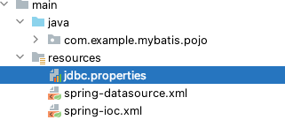
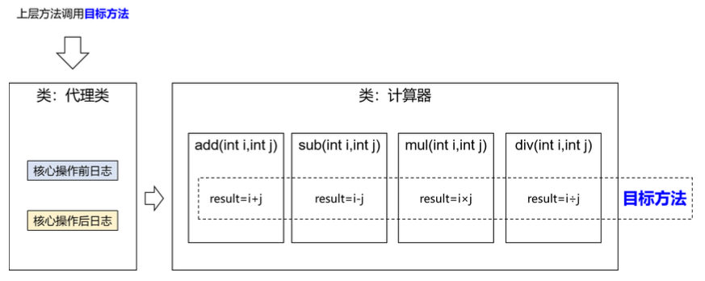

# Spring简介

## Spring 概述

官网地址：https://spring.io/

Spring 是最受欢迎的企业级 Java 应用程序开发框架，数以百万的来自世界各地的开发人员使用Spring 框架来创建性能好、易于测试、可重用的代码。

Spring 框架是一个开源的 Java 平台，它最初是由 Rod Johnson 编写的，并且于 2003 年 6 月首次在 Apache 2.0 许可下发布。

Spring 是轻量级的框架，其基础版本只有 2 MB 左右的大小。

Spring 框架的核心特性是可以用于开发任何 Java 应用程序，但是在 Java EE 平台上构建 web 应用程序是需要扩展的。 Spring 框架的目标是使 J2EE 开发变得更容易使用，通过启用基于 POJO 编程模型来促进良好的编程实践。

## Spring 家族

项目列表：https://spring.io/projects

## Spring Framework

Spring 基础框架，可以视为 Spring 基础设施，基本上任何其他 Spring 项目都是以 Spring Framework 为基础的。

### Spring Framework 特性

- 非侵入式：使用 Spring Framework 开发应用程序时，Spring 对应用程序本身的结构影响非常小。对领域模型可以做到零污染；对功能性组件也只需要使用几个简单的注解进行标记，完全不会破坏原有结构，反而能将组件结构进一步简化。这就使得基于 Spring Framework 开发应用程序时结构清晰、简洁优雅。
- 控制反转：IOC——Inversion of Control，翻转资源获取方向。把自己创建资源、向环境索取资源变成环境将资源准备好，我们享受资源注入。
- 面向切面编程：AOP——Aspect Oriented Programming，在不修改源代码的基础上增强代码功能。
- 容器：Spring IOC 是一个容器，因为它包含并且管理组件对象的生命周期。组件享受到了容器化的管理，替程序员屏蔽了组件创建过程中的大量细节，极大的降低了使用门槛，大幅度提高了开发效率。
- 组件化：Spring 实现了使用简单的组件配置组合成一个复杂的应用。在 Spring 中可以使用 XML 和 Java 注解组合这些对象。这使得我们可以基于一个个功能明确、边界清晰的组件有条不紊的搭建超大型复杂应用系统。 
- 声明式：很多以前需要编写代码才能实现的功能，现在只需要声明需求即可由框架代为实现。 
- 一站式：在 IOC 和 AOP 的基础上可以整合各种企业应用的开源框架和优秀的第三方类库。而且 Spring 旗下的项目已经覆盖了广泛领域，很多方面的功能性需求可以在 Spring Framework 的基 础上全部使用 Spring 来实现。

### Spring Framework五大功能模块

| **功能模块**            | **功能介绍**                                                |
| ----------------------- | ----------------------------------------------------------- |
| Core Container          | 核心容器，在 Spring 环境下使用任何功能都必须基于 IOC 容器。 |
| AOP&Aspects             | 面向切面编程                                                |
| Testing                 | 提供了对 junit 或 TestNG 测试框架的整合。                   |
| Data Access/Integration | 提供了对数据访问/集成的功能。                               |
| Spring MVC              | 提供了面向Web应用程序的集成功能。                           |

# IOC

## IOC容器

### IOC思想

IOC:Inversion of Control，翻译过来是**反转控制**。

1. 获取资源的传统方式

自己做饭:买菜、洗菜、择菜、改刀、炒菜，全过程参与，费时费力，必须清楚了解资源创建整个过程中的全部细节且熟练掌握。

在应用程序中的组件需要获取资源时，传统的方式是组件主动的从容器中获取所需要的资源，在这样的模式下开发人员往往需要知道在具体容器中特定资源的获取方式，增加了学习成本，同时降低了开发效率。

2. 反转控制方式获取资源

点外卖：下单、等、吃，省时省力，不必关心资源创建过程的所有细节。

反转控制的思想完全颠覆了应用程序组件获取资源的传统方式：反转了资源的获取方向——改由容器主动的将资源推送给需要的组件，开发人员不需要知道容器是如何创建资源对象的，只需要提供接收资源的方式即可，极大的降低了学习成本，提高了开发的效率。这种行为也称为查找的**被动**形式。

3. DI

DI：Dependency Injection，翻译过来是依赖注入。

DI 是 IOC 的另一种表述方式：即组件以一些预先定义好的方式(例如:setter 方法)接受来自于容器的资源注入。相对于IOC而言，这种表述更直接。

所以结论是：IOC 就是一种反转控制的思想， 而DI是对IOC的一种具体实现。

### IOC容器在Spring中的实现

Spring 的 IOC 容器就是 IOC 思想的一个落地的产品实现。IOC 容器中管理的组件也叫做 bean。在创建 bean 之前，首先需要创建 IOC 容器。Spring 提供了 IOC 容器的两种实现方式：

1. BeanFactory

这是 IOC 容器的基本实现，是 Spring 内部使用的接口。面向 Spring 本身，不提供给开发人员使用。

2. ApplicationContext

BeanFactory 的子接口，提供了更多高级特性。面向 Spring 的使用者，几乎所有场合都使用 ApplicationContext 而不是底层的 BeanFactory。

3. ApplicationContext的主要实现类


| **类型名**                      | **简介**                                                     |
| ------------------------------- | ------------------------------------------------------------ |
| ClassPathXmlApplicationContext  | 通过读取类路径下的 XML 格式的配置文件创建 IOC 容器 对象      |
| FileSystemXmlApplicationContext | 通过文件系统路径读取 XML 格式的配置文件创建 IOC 容 器对象    |
| ConfigurableApplicationContext  | ApplicationContext 的子接口，包含一些扩展方法 refresh() 和 close() ，让 ApplicationContext 具有启动、 关闭和刷新上下文的能力。 |
| WebApplicationContext           | 专门为 Web 应用准备，基于 Web 环境创建 IOC 容器对 象，并将对象引入存入 ServletContext 域中。 |

## 基于XML管理bean

### 实验一：入门案例

1. 创建Maven Module

2. 引入依赖

```xml
<dependencies>
  <!-- 基于Maven依赖传递性，导入spring-context依赖即可导入当前所需所有jar包 -->
  <dependency>
    <groupId>org.springframework</groupId>
    <artifactId>spring-context</artifactId>
    <version>5.3.1</version>
  </dependency>
  <!-- junit测试 -->
  <dependency>
    <groupId>junit</groupId>
    <artifactId>junit</artifactId>
    <version>4.12</version>
    <scope>test</scope>
  </dependency>
</dependencies>
```

3. 创建类HelloWorld

```java
public class HelloWorld {
  public void sayHello(){
  	System.out.println("helloworld");
	}
}
```

4. 创建Spring的配置文件


5. 在Spring的配置文件中配置bean

```xml
<!-- 
配置HelloWorld所对应的bean，即将HelloWorld的对象交给Spring的IOC容器管理 
通过bean标签配置IOC容器所管理的bean
属性:
id：设置bean的唯一标识 
class：设置bean所对应类型的全类名
-->
<bean id="helloworld" class="com.atguigu.spring.bean.HelloWorld"></bean>
```

6. 创建测试类测试

```java
@Test
public void testHelloWorld(){
  // 获取IOC容器
  ApplicationContext applicationContext = new ClassPathXmlApplicationContext("applicationContext.xml");
  HelloWorld helloWorld = (HelloWorld) applicationContext.getBean("helloWorld");
  helloWorld.sayHello();
}
```

7. 思路


8. 注意

Spring 底层默认通过反射技术调用组件类的无参构造器来创建组件对象，这一点需要注意。如果在需要无参构造器时，没有无参构造器，则会抛出下面的异常：

```
org.springframework.beans.factory.BeanCreationException: Error creating bean with name 'helloWorld' defined in class path resource [applicationContext.xml]: Instantiation of bean failed; nested exception is org.springframework.beans.BeanInstantiationException: Failed to instantiate [com.example.spring.HelloWorld]: No default constructor found; nested exception is java.lang.NoSuchMethodException: com.example.spring.HelloWorld.<init>()
```

### 实验二：获取bean

**方式一：根据id获取**

由于 id 属性指定了 bean 的唯一标识，所以根据 bean 标签的 id 属性可以精确获取到一个组件对象。 上个实验中我们使用的就是这种方式。

**方式二：根据类型获取**

```java
@Test
public void testHelloWorld(){
  ApplicationContext applicationContext = new ClassPathXmlApplicationContext("applicationContext.xml");
  HelloWorld helloWorld = applicationContext.getBean(HelloWorld.class);
  helloWorld.sayHello();
}
```

**方式三：根据id和类型**

```java
@Test
public void testHelloWorld(){
  ApplicationContext applicationContext = new ClassPathXmlApplicationContext("applicationContext.xml");
  HelloWorld helloWorld = applicationContext.getBean("helloWorld",HelloWorld.class);
  helloWorld.sayHello();
}
```

**注意**

当根据类型获取bean时，要求IOC容器中指定类型的bean有且只能有一个 

当IOC容器中一共配置了两个：

```xml
<bean id="helloWorldA" class="com.example.spring.HelloWorld"/>
<bean id="helloWorldB" class="com.example.spring.HelloWorld"/>
```

根据类型获取时会抛出异常：

```
org.springframework.beans.factory.NoUniqueBeanDefinitionException: No qualifying bean of type 'com.example.spring.HelloWorld' available: expected single matching bean but found 2: helloWorldA,helloWorldB
```

**扩展**

如果组件类实现了接口，根据接口类型可以获取 bean 吗?

可以，前提是bean唯一

如果一个接口有多个实现类，这些实现类都配置了 bean，根据接口类型可以获取 bean 吗?

不行，因为bean不唯一

**结论**

根据类型来获取bean时，在满足bean唯一性的前提下，其实只是看：『对象 instanceof 指定的类 型』的返回结果，只要返回的是true就可以认定为和类型匹配，能够获取到。

### 实验三：依赖注入之setter注入

1. 创建学生类Student

```java
public class Student {

    private Integer id;
    private String name;
    private Integer age;
    private String sex;

    public Student(){

    }

    public Integer getId() {
        return id;
    }

    public void setId(Integer id) {
        this.id = id;
    }

    public String getName() {
        return name;
    }

    public void setName(String name) {
        this.name = name;
    }

    public Integer getAge() {
        return age;
    }

    public void setAge(Integer age) {
        this.age = age;
    }

    public String getSex() {
        return sex;
    }

    public void setSex(String sex) {
        this.sex = sex;
    }

    @Override
    public String toString() {
        return "Student{" +
                "id=" + id +
                ", name='" + name + '\'' +
                ", age=" + age +
                ", sex='" + sex + '\'' +
                '}';
    }
}
```

2. 配置bean时为属性赋值

```xml
<bean id="studentA" class="com.example.spring.pojo.Student">
  <!-- property标签：通过组件类的setXxx()方法给组件对象设置属性 -->
	<!-- name属性：指定属性名(这个属性名是getXxx()、setXxx()方法定义的，和成员变量无关)-->
	<!-- value属性：指定属性值 -->
  <property name="id" value="1" />
  <property name="name" value="张三"/>
  <property name="age" value="18"/>
  <property name="sex" value="男"/>
</bean>
```

3. 测试

```java
@Test
public void testIOCBySet(){
  ApplicationContext applicationContext = new ClassPathXmlApplicationContext("applicationContext.xml");
  Student student = applicationContext.getBean("studentA",Student.class);
  System.out.println(student);
}
```

### 实验四：依赖注入之构造器注入

1. 在Student类中添加有参构造

```java
public Student(Integer id, String name, Integer age, String sex) {
  this.id = id;
  this.name = name;
  this.age = age;
  this.sex = sex;
}
```

2. 配置bean

```xml
<bean id="studentB" class="com.example.spring.pojo.Student">
  <constructor-arg name="id" value="1"/>
  <constructor-arg name="name" value="李四"/>
  <constructor-arg name="age" value="20"/>
  <constructor-arg name="sex" value="女"/>
</bean>
```

注意，constructor-arg 标签还有两个属性可以进一步描述构造器参数：

- index属性：指定参数所在位置的索引(从0开始) 
- name属性：指定参数名

3. 测试

```java
@Test
public void testIOCByConstructor(){
  ApplicationContext applicationContext = new ClassPathXmlApplicationContext("applicationContext.xml");
  Student student = applicationContext.getBean("studentB",Student.class);
  System.out.println(student);
}
```

### 实验五：特殊值处理

1. null值

```xml
<property name="name">
    <null />
</property>
```

注意：

```xml
<property name="name" value="null"></property>
```

以上写法，为name所赋的值是字符串null

2. xml实体

```xml
<!-- 小于号在XML文档中用来定义标签的开始，不能随便使用 -->
<!-- 解决方案一：使用XML实体来代替 -->
<property name="expression" value="a &lt; b"/>
```

3. CDATA 节

```xml
<property name="expression">
	<!-- 解决方案二：使用CDATA节 -->
	<!-- CDATA中的C代表Character，是文本、字符的含义，CDATA就表示纯文本数据 -->
  <!-- XML解析器看到CDATA节就知道这里是纯文本，就不会当作XML标签或属性来解析 --> <!-- 所以CDATA节中写什么符号都随意 -->
	<value><![CDATA[a < b]]></value>
</property>
```

### 实验六：为类类型属性赋值

1. 创建学校类School

```java
public class School {
    private Integer schoolId;
    private String schoolName;

    public School(){}

    public School(Integer schoolId, String schoolName) {
        this.schoolId = schoolId;
        this.schoolName = schoolName;
    }
    public Integer getSchoolId() {
        return schoolId;
    }

    public void setSchoolId(Integer schoolId) {
        this.schoolId = schoolId;
    }

    public String getSchoolName() {
        return schoolName;
    }

    public void setSchoolName(String schoolName) {
        this.schoolName = schoolName;
    }

    @Override
    public String toString() {
        return "School{" +
                "schoolId=" + schoolId +
                ", schoolName='" + schoolName + '\'' +
                '}';
    }
}
```

2. 修改Student类

在Student类中添加以下代码:

```java
private School school;

public School getSchool() {
  return school;
}

public void setSchool(School school) {
  this.school = school;
}
```

3. 方式一：引用外部已声明的bean

配置School类型的bean：

```xml
<bean id="school" class="com.example.spring.pojo.School">
  <property name="schoolId" value="1"/>
  <property name="schoolName" value="哈佛大学"/>
</bean>
```

为Student中的school属性赋值：

```xml
<bean id="studentC" class="com.example.spring.pojo.Student">
  <property name="id" value="1"/>
  <property name="name" value="张三"/>
  <property name="age" value="18"/>
  <property name="sex" value="男"/>
  <!-- ref属性：引用IOC容器中某个bean的id，将所对应的bean为属性赋值 -->
  <property name="school" ref="school"/>
</bean>
```

4. 方式二：内部bean

```xml
<bean id="studentD" class="com.example.spring.pojo.Student">
  <property name="id" value="1"/>
  <property name="name" value="张三"/>
  <property name="age" value="18"/>
  <property name="sex" value="男"/>
  <property name="school">
    <!-- 在一个bean中再声明一个bean就是内部bean -->
		<!-- 内部bean只能用于给属性赋值，不能在外部通过IOC容器获取，因此可以省略id属性 -->
    <bean class="com.example.spring.pojo.School">      
      <property name="schoolId" value="1"/>
      <property name="schoolName" value="哈佛大学"/>
    </bean>
  </property>
</bean>
```

5. 方式三：级联属性赋值

```xml
<bean id="studentE" class="com.example.spring.pojo.Student">
  <property name="id" value="1"/>
  <property name="name" value="张三"/>
  <property name="age" value="18"/>
  <property name="sex" value="男"/>
  <!-- 一定先引用某个bean为属性赋值，才可以使用级联方式更新属性 -->
  <property name="school" ref="school"/>
  <property name="school.schoolId" value="2"/>
  <property name="school.schoolName" value="耶鲁大学"/>
</bean>
```

### 实验七：为数组类型属性赋值

1. 修改Student类

在Student类中添加以下代码：

```java
private String[] hobbies;

public String[] getHobbies() {
  return hobbies;
}

public void setHobbies(String[] hobbies) {
  this.hobbies = hobbies;
}
```

2. 配置bean

```xml
<bean id="studentC" class="com.example.spring.pojo.Student">
  <property name="id" value="1"/>
  <property name="name" value="张三"/>
  <property name="age" value="18"/>
  <property name="sex" value="男"/>
  <property name="school" ref="school"/>
  <property name="hobbies">
    <array>
      <value>抽烟</value>
      <value>喝酒</value>
      <value>烫头</value>
    </array>
  </property>
</bean>
```

### 实验八：为集合类型属性赋值

1. 为List集合类型属性赋值

在Student类中添加以下代码：

```java
private List<Teacher> teachers;

public List<Teacher> getTeachers() {
  return teachers;
}

public void setTeachers(List<Teacher> teachers) {
  this.teachers = teachers;
}
```

Teacher 类：

```java
public class Teacher {

    private String name;

    private Integer age;

    public String getName() {
        return name;
    }

    public void setName(String name) {
        this.name = name;
    }

    public Integer getAge() {
        return age;
    }

    public void setAge(Integer age) {
        this.age = age;
    }

    public Teacher() {
    }

    public Teacher(String name, Integer age) {
        this.name = name;
        this.age = age;
    }

    @Override
    public String toString() {
        return "Teacher{" +
                "name='" + name + '\'' +
                ", age=" + age +
                '}';
    }
}
```

配置bean

```xml
<bean id="teacherA" class="com.example.spring.pojo.Teacher">
  <property name="name" value="乔峰"/>
  <property name="age" value="30"/>
</bean>

<bean id="teacherB" class="com.example.spring.pojo.Teacher">
  <property name="name" value="段誉"/>
  <property name="age" value="20"/>
</bean>

<bean id="teacherC" class="com.example.spring.pojo.Teacher">
  <property name="name" value="张三丰"/>
  <property name="age" value="80"/>
</bean>

<bean id="studentC" class="com.example.spring.pojo.Student">
  <property name="id" value="1"/>
  <property name="name" value="张三"/>
  <property name="age" value="18"/>
  <property name="sex" value="男"/>
  <property name="school" ref="school"/>
  <property name="hobbies">
    <array>
      <value>抽烟</value>
      <value>喝酒</value>
      <value>烫头</value>
    </array>
  </property>
  <property name="teachers">
    <list>
      <ref bean="teacherA"/>
      <ref bean="teacherB"/>
      <ref bean="teacherC"/>
    </list>
  </property>
</bean>
```

若为Set集合类型属性赋值，只需要将其中的list标签改为set标签即可。

2. 为Map集合类型属性赋值

在Student类中添加以下代码：

```java
//最喜欢的三个老师
private Map<String, Teacher> favoriteTeachers;

public Map<String, Teacher> getFavoriteTeachers() {
  return favoriteTeachers;
}

public void setFavoriteTeachers(Map<String, Teacher> favoriteTeachers) {
  this.favoriteTeachers = favoriteTeachers;
}
```

配置bean：

```xml
<bean id="studentC" class="com.example.spring.pojo.Student">
  <property name="id" value="1"/>
  <property name="name" value="张三"/>
  <property name="age" value="18"/>
  <property name="sex" value="男"/>
  <property name="school" ref="school"/>
  <property name="hobbies">
    <array>
      <value>抽烟</value>
      <value>喝酒</value>
      <value>烫头</value>
    </array>
  </property>
  <property name="favoriteTeachers">
    <map>
      <entry>
        <key>
          <value>top1</value>
        </key>
        <ref bean="teacherA"/>
      </entry>
      <entry>
        <key>
          <value>top2</value>
        </key>
        <ref bean="teacherB"/>
      </entry>
      <entry>
        <key>
          <value>top3</value>
        </key>
        <ref bean="teacherC"/>
      </entry>
    </map>
  </property>
</bean>
```

3. 引用集合类型的bean

```xml
<!--list集合类型的bean-->
<util:list id="teacherList">
  <ref bean="teacherA"/>
  <ref bean="teacherB"/>
  <ref bean="teacherC"/>
</util:list>
<!--map集合类型的bean-->
<util:map id="teacherMap">
  <entry>
    <key>
      <value>top1</value>
    </key>
    <ref bean="teacherA"/>
  </entry>
  <entry>
    <key>
      <value>top2</value>
    </key>
    <ref bean="teacherB"/>
  </entry>
  <entry>
    <key>
      <value>top3</value>
    </key>
    <ref bean="teacherC"/>
  </entry>
</util:map>

<bean id="studentF" class="com.example.spring.pojo.Student">
  <property name="id" value="1"/>
  <property name="name" value="张三"/>
  <property name="age" value="18"/>
  <property name="sex" value="男"/>
  <property name="school" ref="school"/>
  <property name="hobbies">
    <array>
      <value>抽烟</value>
      <value>喝酒</value>
      <value>烫头</value>
    </array>
  </property>
  <property name="teachers" ref="teacherList"/>
  <property name="favoriteTeachers" ref="teacherMap"/>
</bean>
```

使用util:list、util:map标签必须引入相应的命名空间，可以通过idea的提示功能选择

### 实验九：p命名空间

引入p命名空间后，可以通过以下方式为bean的各个属性赋值

```xml
<bean id="studentG" class="com.example.spring.pojo.Student"
      p:id="2"
      p:name="张三"
      p:age="18"
      p:sex="男"
      p:school-ref="school"
      p:teachers-ref="teacherList"
/>
```

### 实验十：引入外部属性文件

1. 加入依赖

```xml
<!-- MySQL驱动 -->
<dependency>
  <groupId>mysql</groupId>
  <artifactId>mysql-connector-java</artifactId>
  <version>8.0.32</version>
</dependency>
<!-- 数据源 -->
<dependency>
  <groupId>com.alibaba</groupId>
  <artifactId>druid</artifactId>
  <version>1.0.31</version>
</dependency>
```

2. 创建外部属性文件

```properties
jdbc.driver=com.mysql.cj.jdbc.Driver
jdbc.url=jdbc:mysql://localhost:3306/ssm?serverTimezone=UTC
jdbc.username=root
jdbc.password=root123$
```



3. 引入属性文件

```xml
<!-- 引入外部属性文件 -->
<context:property-placeholder location="jdbc.properties"/>
```

4. 配置bean

```xml
<!-- 配置数据源 -->
<bean id="druidDataSource" class="com.alibaba.druid.pool.DruidDataSource">
  <property name="url" value="${jdbc.url}"/>
  <property name="driverClassName" value="${jdbc.driver}"/>
  <property name="username" value="${jdbc.username}"/>
  <property name="password" value="${jdbc.password}"/>
</bean>
```

5. 测试

```java
@Test
public void testDatasource() throws SQLException {
  ApplicationContext applicationContext = new ClassPathXmlApplicationContext("spring-datasource.xml");
  DataSource dataSource = applicationContext.getBean(DataSource.class);
  Connection connection = dataSource.getConnection();
  System.out.println(connection);
}
```

### 实验十一：bean的作用域

1. 概念

在Spring中可以通过配置bean标签的scope属性来指定bean的作用域范围，各取值含义参加下表：

| 取值            | 含义                                    | 创建对象的时机  |
| --------------- | --------------------------------------- | --------------- |
| singleton(默认) | 在IOC容器中，这个bean的对象始终为单实例 | IOC容器初始化时 |
| prototype       | 这个bean在IOC容器中有多个实例           | 获取bean时      |

如果是在WebApplicationContext环境下还会有另外两个作用域(但不常用)：

| 取值    | 含义                 |
| ------- | -------------------- |
| request | 在一个请求范围内有效 |
| session | 在一个会话范围内有效 |

2. 创建类User

```java
public class User {

    private Integer id;
    private String username;
    private String password;
    private Integer age;

    public User(){}

    public User(Integer id, String username, String password, Integer age) {
        this.id = id;
        this.username = username;
        this.password = password;
        this.age = age;
    }

    public Integer getId() {
        return id;
    }

    public void setId(Integer id) {
        this.id = id;
    }

    public String getUsername() {
        return username;
    }

    public void setUsername(String username) {
        this.username = username;
    }

    public String getPassword() {
        return password;
    }

    public void setPassword(String password) {
        this.password = password;
    }

    public Integer getAge() {
        return age;
    }

    public void setAge(Integer age) {
        this.age = age;
    }

    @Override
    public String toString() {
        return "User{" +
                "id=" + id +
                ", username='" + username + '\'' +
                ", password='" + password + '\'' +
                ", age=" + age +
                '}';
    }
}
```

3. 配置bean

```xml
<!-- scope属性：取值singleton(默认值)，bean在IOC容器中只有一个实例，IOC容器初始化时创建对象 -->
<!-- scope属性：取值prototype，bean在IOC容器中可以有多个实例，getBean()时创建对象 -->
<bean class="com.example.spring.pojo.User" scope="singleton"/>
```

4. 测试

```java
@Test
public void testBeanScope(){
  ApplicationContext applicationContext = new ClassPathXmlApplicationContext("spring-scope.xml");
  User user1 = applicationContext.getBean(User.class);
  User user2 = applicationContext.getBean(User.class);
  System.out.println(user1 == user2);
}
```

### 实验十二：bean的生命周期

1. 具体的生命周期过程

- bean对象创建(调用无参构造器) 
- 给bean对象设置属性 
- bean对象初始化之前操作(由bean的后置处理器负责) 
- bean对象初始化(需在配置bean时指定初始化方法) 
- bean对象初始化之后操作(由bean的后置处理器负责) 
- bean对象就绪可以使用 
- bean对象销毁(需在配置bean时指定销毁方法) 
- IOC容器关闭

2. 修改类User

```java
public class User {

    private Integer id;
    private String username;
    private String password;
    private Integer age;

    public User(){
        System.out.println("生命周期：1、创建对象");
    }

    public User(Integer id, String username, String password, Integer age) {
        this.id = id;
        this.username = username;
        this.password = password;
        this.age = age;
    }

    public Integer getId() {
        return id;
    }

    public void setId(Integer id) {
        System.out.println("生命周期：2、依赖注入");
        this.id = id;
    }

    public String getUsername() {
        return username;
    }

    public void setUsername(String username) {
        this.username = username;
    }

    public String getPassword() {
        return password;
    }

    public void setPassword(String password) {
        this.password = password;
    }

    public Integer getAge() {
        return age;
    }

    public void setAge(Integer age) {
        this.age = age;
    }

    public void initMethod(){
        System.out.println("生命周期：3、初始化");
    }

    public void destroyMethod(){
        System.out.println("生命周期：5、销毁");
    }

    @Override
    public String toString() {
        return "User{" +
                "id=" + id +
                ", username='" + username + '\'' +
                ", password='" + password + '\'' +
                ", age=" + age +
                '}';
    }
}
```

注意其中的initMethod()和destroyMethod()，可以通过配置bean指定为初始化和销毁的方法

3. 配置bean

```xml
<!-- 使用init-method属性指定初始化方法 -->
<!-- 使用destroy-method属性指定销毁方法 -->
<bean class="com.example.spring.pojo.User" scope="singleton" init-method="initMethod"
          destroy-method="destroyMethod">
  <property name="id" value="1"/>
  <property name="username" value="张三"/>
  <property name="password" value="123456"/>
  <property name="age" value="20"/>
</bean>
```

4. 测试

```java
@Test
public void testBeanLifeCycle() {
  ClassPathXmlApplicationContext applicationContext = new ClassPathXmlApplicationContext("spring-scope.xml");
  User user1 = applicationContext.getBean(User.class);
  User user2 = applicationContext.getBean(User.class);
  System.out.println(user1 == user2);
  System.out.println("生命周期:4、通过IOC容器获取bean并使用");
  applicationContext.close();
}
```

5. bean 的后置处理器

bean的后置处理器会在生命周期的初始化前后添加额外的操作，需要实现BeanPostProcessor接口， 且配置到IOC容器中，需要注意的是，bean后置处理器不是单独针对某一个bean生效，而是针对IOC容器中所有bean都会执行

创建bean的后置处理器:

```java
package com.example.spring.process;

import org.springframework.beans.BeansException;
import org.springframework.beans.factory.config.BeanPostProcessor;

public class MyBeanProcessor implements BeanPostProcessor {

    @Override
    public Object postProcessBeforeInitialization(Object bean, String beanName) throws BeansException {
        System.out.println("bean = " + bean + ", beanName = " + beanName);
        return bean;
    }

    @Override
    public Object postProcessAfterInitialization(Object bean, String beanName) throws BeansException {
        System.out.println("bean = " + bean + ", beanName = " + beanName);
        return bean;
    }
}
```

在IOC容器中配置后置处理器：

```xml
<!-- bean的后置处理器要放入IOC容器才能生效 -->
<bean id="myBeanProcessor" class="com.example.spring.process.MyBeanProcessor"/>
```

### 实验十三：FactoryBean

1. 简介

FactoryBean是Spring提供的一种整合第三方框架的常用机制。和普通的bean不同，配置一个 FactoryBean类型的bean，在获取bean的时候得到的并不是class属性中配置的这个类的对象，而是 getObject()方法的返回值。通过这种机制，Spring可以帮我们把复杂组件创建的详细过程和繁琐细节都 屏蔽起来，只把最简洁的使用界面展示给我们。

将来我们整合Mybatis时，Spring就是通过FactoryBean机制来帮我们创建SqlSessionFactory对象的。

2. 创建类UserFactoryBean

```java
public class UserFactoryBean implements FactoryBean<User> {
    @Override
    public User getObject() throws Exception {
        return new User();
    }

    @Override
    public Class<?> getObjectType() {
        return User.class;
    }
}
```

3. 配置bean

```xml
<bean id="user" class="com.example.spring.factory.UserFactoryBean"/>
```

4. 测试

```java
public void testUserFactoryBean(){
  ApplicationContext applicationContext = new ClassPathXmlApplicationContext("spring-factory.xml");
  User user = (User) applicationContext.getBean("user");
  System.out.println(user);
}
```

### 实验十四：基于xml的自动装配

自动装配，根据指定的策略，在IOC容器中匹配某一个bean，自动为指定的bean中所依赖的类类型或接口类型属性赋值

1. 场景模拟

创建类UserController

```java
public class UserController {

    private UserService userService;

    public void save(){
        User user = new User("admin", "123456", 20);
        userService.save(user);
    }

    public void setUserService(UserService userService) {
        this.userService = userService;
    }
}
```

创建接口UserService

```java
public interface UserService {

    void save(User user);

}
```

创建类UserServiceImpl实现接口UserService

```java
public class UserServiceImpl implements UserService {

    private UserDao userDao;

    @Override
    public void save(User user) {
        userDao.save(user);
        System.out.println("UserServiceImpl save user = " + user);
    }

    public void setUserDao(UserDao userDao) {
        this.userDao = userDao;
    }
}
```

创建接口UserDao

```java
public interface UserDao {

    void save(User user);

}
```

创建类UserDaoImpl实现接口UserDao

```java
public class UserDaoImpl implements UserDao {
    @Override
    public void save(User user) {
        System.out.println("UserDaoImpl save user = " + user);
    }
}
```

2. 配置bean

使用bean标签的autowire属性设置自动装配效果

自动装配方式：byType

byType：根据类型匹配IOC容器中的某个兼容类型的bean，为属性自动赋值

若在IOC中，没有任何一个兼容类型的bean能够为属性赋值，则该属性不装配，即值为默认值 null

若在IOC中，有多个兼容类型的bean能够为属性赋值，则抛出异常 NoUniqueBeanDefinitionException

```xml
<bean id="userController" class="com.example.spring.controller.UserController" autowire="byType"/>

<bean id="userService" class="com.example.spring.service.impl.UserServiceImpl" autowire="byType"/>

<bean id="userDao" class="com.example.spring.dao.impl.UserDaoImpl"/>
```

自动装配方式：byName 

byName：将自动装配的属性的属性名，作为bean的id在IOC容器中匹配相对应的bean进行赋值

```xml
<bean id="userController" class="com.example.spring.controller.UserController" autowire="byName"/>

<bean id="userService" class="com.example.spring.service.impl.UserServiceImpl" autowire="byName"/>

<bean id="userDao" class="com.example.spring.dao.impl.UserDaoImpl"/>
```

3. 测试

```java
@Test
public void testAutoWireByXML(){
  ApplicationContext applicationContext = new ClassPathXmlApplicationContext("spring-autowire.xml");
  UserController userController = applicationContext.getBean(UserController.class);
  userController.save();
}
```

## 基于注解管理bean

### 实验一：标记与扫描

1. 注解

和 XML 配置文件一样，注解本身并不能执行，注解本身仅仅只是做一个标记，具体的功能是框架检测到注解标记的位置，然后针对这个位置按照注解标记的功能来执行具体操作。

本质上：所有一切的操作都是Java代码来完成的，XML和注解只是告诉框架中的Java代码如何执行。 

举例：元旦联欢会要布置教室，蓝色的地方贴上元旦快乐四个字，红色的地方贴上拉花，黄色的地方贴上气球。


班长做了所有标记，同学们来完成具体工作。墙上的标记相当于我们在代码中使用的注解，后面同学们做的工作，相当于框架的具体操作。

2. 扫描

Spring 为了知道程序员在哪些地方标记了什么注解，就需要通过扫描的方式，来进行检测。然后根据注解进行后续操作。

3. 标识组件的常用注解

@Component：将类标识为普通组件 

@Controller：将类标识为控制层组件 

@Service：将类标 识为业务层组件 

@Repository：将类标识为持久层组件

问：以上四个注解有什么关系和区别?


通过查看源码我们得知，@Controller、@Service、@Repository这三个注解只是在@Component注解 的基础上起了三个新的名字。

对于Spring使用IOC容器管理这些组件来说没有区别。所以@Controller、@Service、@Repository这三个注解只是给开发人员看的，让我们能够便于分辨组件的作用。

注意：虽然它们本质上一样，但是为了代码的可读性，为了程序结构严谨我们肯定不能随便胡乱标记。

4. 创建组件

创建控制层组件

```java
@Controller
public class UserController {

}
```

创建接口UserService

```java
public interface UserService {

}
```

创建业务层组件UserServiceImpl

```java
@Service
public class UserServiceImpl implements UserService {

}
```

创建接口UserDao

```java
public interface UserDao {

}
```

创建持久层组件UserDaoImpl

```java
@Repository
public class UserDaoImpl implements UserDao {
}
```

5. 扫描组件

情况一：最基本的扫描方式

```xml
<context:component-scan base-package="com.example.spring"/>
```

情况二：指定要排除的组件

```xml
<!-- context:exclude-filter标签:指定排除规则 -->
<!--
	type:设置排除或包含的依据
  type="annotation"，根据注解排除，expression中设置要排除的注解的全类名
  type="assignable"，根据类型排除，expression中设置要排除的类型的全类名
-->
<context:component-scan base-package="com.example.spring">
  <!--<context:exclude-filter type="annotation" expression="org.springframework.stereotype.Controller"/>-->
  <context:exclude-filter type="assignable" expression="com.example.spring.controller.UserController"/>
</context:component-scan>
```

情况三：仅扫描指定组件

```xml
<context:component-scan base-package="com.example.spring" use-default-filters="false">
  <!-- context:include-filter标签：指定在原有扫描规则的基础上追加的规则 -->
  <!-- use-default-filters属性：取值false表示关闭默认扫描规则 -->
  <!-- 此时必须设置use-default-filters="false"，因为默认规则即扫描指定包下所有类 -->
  <context:include-filter type="annotation" expression="org.springframework.stereotype.Controller"/>
</context:component-scan>
```

8. 测试

```java
@Test
public void testAutowireByAnnotation() {
  ApplicationContext applicationContext = new ClassPathXmlApplicationContext("spring-ioc-annotation.xml");
  UserController userController = applicationContext.getBean(UserController.class);
  System.out.println(userController);
  UserService userService = applicationContext.getBean(UserService.class);
  System.out.println(userService);
  UserDao userDao = applicationContext.getBean(UserDao.class);
  System.out.println(userDao);
}
```

9. 组件所对应的bean的id

在我们使用XML方式管理bean的时候，每个bean都有一个唯一标识，便于在其他地方引用。现在使用注解后，每个组件仍然应该有一个唯一标识。

- 默认情况

类名首字母小写就是bean的id。例如：UserController类对应的bean的id就是userController。

- 自定义bean的id

可通过标识组件的注解的value属性设置自定义的bean的id

```java
@Service("userService")//默认为userServiceImpl 
public class UserServiceImpl implements UserService {
  
}
```

### 实验二：基于注解的自动装配

1. 场景模拟

参考基于xml的自动装配 

在UserController中声明UserService对象 

在UserServiceImpl中声明UserDao对象

2. @Autowired 注解

在成员变量上直接标记@Autowired注解即可完成自动装配，不需要提供setXxx()方法。以后我们在项 目中的正式用法就是这样。

```java
@Controller
public class UserController {

    @Autowired
    private UserService userService;

    public void save(){
        User user = new User("Jack", "123456", 20);
        userService.save(user);
    }
}
```


```java
@Service
public class UserServiceImpl implements UserService {

    @Autowired
    private UserDao userDao;
    @Override
    public void save(User user) {
        System.out.println("UserServiceImpl save user = " + user);
        userDao.save(user);
    }
}
```


```java
@Repository
public class UserDaoImpl implements UserDao {
    @Override
    public void save(User user) {
        System.out.println("UserDaoImpl save user = " + user);
    }
}
```

3. @Autowired注解其他细节

@Autowired注解可以标记在构造器和set方法上

```java
@Controller
public class UserController {

    private UserService userService;

    @Autowired
    public UserController(UserService userService){
        this.userService = userService;
    }
  
    public void save(){
        User user = new User("Jack", "123456", 20);
        userService.save(user);
    }
}
```


```java
@Controller
public class UserController {

    private UserService userService;

    @Autowired
    public void setUserService(UserService userService) {
        this.userService = userService;
    }

    public void save(){
        User user = new User("Jack", "123456", 20);
        userService.save(user);
    }
}
```

4. @Autowired工作流程


- 首先根据所需要的组件类型到IOC容器中查找 
  - 能够找到唯一的bean：直接执行装配 
  - 如果完全找不到匹配这个类型的bean：装配失败 
  - 和所需类型匹配的bean不止一个
    - 没有@Qualifier注解：根据@Autowired标记位置成员变量的变量名作为bean的id进行匹配
      - 能够找到：执行装配
      - 找不到：装配失败 
    - 使用@Qualifier注解：根据@Qualifier注解中指定的名称作为bean的id进行匹配
      - 能够找到：执行装配
      - 找不到：装配失败

```java
@Controller
public class UserController {

    @Autowired
    @Qualifier("userServiceImpl")
    private UserService userService;
  
  	public void save(){
        User user = new User("Jack", "123456", 20);
        userService.save(user);
    }	
}
```

@Autowired中有属性required，默认值为true，因此在自动装配无法找到相应的bean时，会装配失败，可以将属性required的值设置为true，则表示能装就装，装不上就不装，此时自动装配的属性为默认值，但是实际开发时，基本上所有需要装配组件的地方都是必须装配的，用不上这个属性。

# AOP

## 场景模拟

### 声明接口

声明计算器接口Calculator，包含加减乘除的抽象方法

```java
public interface Calculator {

    int add(int i, int j);

    int sub(int i, int j);

    int mul(int i, int j);

    int div(int i, int j);

}
```

### 创建实现类


```java
public class CalculatorPureImpl implements Calculator {
    @Override
    public int add(int i, int j) {
        int result = i + j;
        System.out.println("方法内部 result = " + result);
        return result;
    }

    @Override
    public int sub(int i, int j) {
        int result = i - j;
        System.out.println("方法内部 result = " + result);
        return result;
    }

    @Override
    public int mul(int i, int j) {
        int result = i * j;
        System.out.println("方法内部 result = " + result);
        return result;
    }

    @Override
    public int div(int i, int j) {
        int result = i / j;
        System.out.println("方法内部 result = " + result);
        return result;
    }
}
```

### 创建带日志功能的实现类


```java
public class CalculatorLogImpl implements Calculator {
    @Override
    public int add(int i, int j) {
        System.out.println("[日志] add 方法开始了，参数是:" + i + "," + j);
        int result = i + j;
        System.out.println("方法内部 result = " + result);
        System.out.println("[日志] add 方法结束了，结果是:" + result);
        return result;
    }

    @Override
    public int sub(int i, int j) {
        System.out.println("[日志] sub 方法开始了，参数是:" + i + "," + j);
        int result = i - j;
        System.out.println("方法内部 result = " + result);
        System.out.println("[日志] sub 方法结束了，结果是:" + result);
        return result;
    }

    @Override
    public int mul(int i, int j) {
        System.out.println("[日志] mul 方法开始了，参数是:" + i + "," + j);
        int result = i * j;
        System.out.println("方法内部 result = " + result);
        System.out.println("[日志] mul 方法结束了，结果是:" + result);
        return result;
    }

    @Override
    public int div(int i, int j) {
        System.out.println("[日志] div 方法开始了，参数是:" + i + "," + j);
        int result = i / j;
        System.out.println("方法内部 result = " + result);
        System.out.println("[日志] div 方法结束了，结果是:" + result);
        return result;
    }
}
```

### 提出问题

1. 现有代码缺陷

针对带日志功能的实现类，我们发现有如下缺陷：

- 对核心业务功能有干扰，导致程序员在开发核心业务功能时分散了精力

- 附加功能分散在各个业务功能方法中，不利于统一维护

2. 解决思路

解决这两个问题，核心就是：解耦。我们需要把附加功能从业务功能代码中抽取出来。

3. 困难

解决问题的困难：要抽取的代码在方法内部，靠以前把子类中的重复代码抽取到父类的方式没法解决。所以需要引入新的技术。

## 代理模式

### 概念

1. 介绍

二十三种设计模式中的一种，属于结构型模式。它的作用就是通过提供一个代理类，让我们在调用目标方法的时候，不再是直接对目标方法进行调用，而是通过代理类间接调用。让不属于目标方法核心逻辑 的代码从目标方法中剥离出来——解耦。调用目标方法时先调用代理对象的方法，减少对目标方法的调 用和打扰，同时让附加功能能够集中在一起也有利于统一维护。


使用代理后：


2. 生活中的代理

- 广告商找大明星拍广告需要经过经纪人
- 合作伙伴找大老板谈合作要约见面时间需要经过秘书
- 房产中介是买卖双方的代理

3. 相关术语

代理：将非核心逻辑剥离出来以后，封装这些非核心逻辑的类、对象、方法。 

目标：被代理“套用”了非核心逻辑代码的类、对象、方法。

### 静态代理

创建静态代理类：

```java
public class CalculatorStaticProxy implements Calculator {

    // 将被代理的目标对象声明为成员变量
    private Calculator target;

    public CalculatorStaticProxy(Calculator target) {
        this.target = target;
    }

    @Override
    public int add(int i, int j) {
        // 附加功能由代理类中的代理方法来实现
        System.out.println("[日志] add 方法开始了，参数是:" + i + "," + j);
        // 通过目标对象来实现核心业务逻辑
        int result = target.add(i, j);
        System.out.println("[日志] add 方法结束了，结果是:" + result);
        return result;
    }

    @Override
    public int sub(int i, int j) {
        System.out.println("[日志] sub 方法开始了，参数是:" + i + "," + j);
        int result = target.sub(i, j);
        System.out.println("[日志] sub 方法结束了，结果是:" + result);
        return result;
    }

    @Override
    public int mul(int i, int j) {
        System.out.println("[日志] mul 方法开始了，参数是:" + i + "," + j);
        int result = target.mul(i, j);
        System.out.println("[日志] mul 方法结束了，结果是:" + result);
        return result;
    }

    @Override
    public int div(int i, int j) {
        System.out.println("[日志] div 方法开始了，参数是:" + i + "," + j);
        int result = target.div(i, j);
        System.out.println("[日志] div 方法结束了，结果是:" + result);
        return result;
    }
}
```

静态代理确实实现了解耦，但是由于代码都写死了，完全不具备任何的灵活性。就拿日志功能来说，将来其他地方也需要附加日志，那还得再声明更多个静态代理类，那就产生了大量重复的代码，日志功能还是分散的，没有统一管理。

提出进一步的需求：将日志功能集中到一个代理类中，将来有任何日志需求，都通过这一个代理类来实现。这就需要使用动态代理技术了。

### 动态代理



```java
public class ProxyFactory {

    private Object target;

    public ProxyFactory(Object target) {
        this.target = target;
    }

    public Object getProxy() {

        // newProxyInstance()：创建一个代理实例
        // 其中有三个参数：
        // 1、classLoader：加载动态生成的代理类的类加载器
        // 2、interfaces：目标对象实现的所有接口的class对象所组成的数组
        // 3、invocationHandler：设置代理对象实现目标对象方法的过程，即代理类中如何重写接口中的抽象方法
        ClassLoader classLoader = target.getClass().getClassLoader();
        Class<?>[] interfaces = target.getClass().getInterfaces();
        InvocationHandler invocationHandler = new InvocationHandler() {
            @Override
            public Object invoke(Object proxy, Method method, Object[] args) throws Throwable {
                // proxy：代理对象
                // method：代理对象需要实现的方法，即其中需要重写的方法
                // args：method所对应方法的参数
                Object result = null;
                try {
                    System.out.println("[动态代理][日志] " + method.getName() + "，参 数:" + Arrays.toString(args));
                    result = method.invoke(target, args);
                    System.out.println("[动态代理][日志] " + method.getName() + "，结果" + result);
                } catch (Exception e) {
                    e.printStackTrace();
                    System.out.println("[动态代理][日志] " + method.getName() + "，异常:" + e.getMessage());
                } finally {
                    System.out.println("[动态代理][日志] " + method.getName() + "，方法执行完毕");
                }
                return result;
            }
        };
        return Proxy.newProxyInstance(classLoader, interfaces, invocationHandler);
    }
}
```

### 测试

```java
@Test
public void testDynamicProxy(){
  ProxyFactory factory = new ProxyFactory(new CalculatorPureImpl());
  Calculator proxy = (Calculator) factory.getProxy();
  proxy.div(4,2);
}
```

## AOP概念及相关术语

### 概述

AOP(Aspect Oriented Programming)是一种设计思想，是软件设计领域中的面向切面编程，它是面向对象编程的一种补充和完善，它以通过预编译方式和运行期动态代理方式实现在不修改源代码的情况下给程序动态统一添加额外功能的一种技术。

### 相关术语

1. 横切关注点

从每个方法中抽取出来的同一类非核心业务。在同一个项目中，我们可以使用多个横切关注点对相关方法进行多个不同方面的增强。

这个概念不是语法层面天然存在的，而是根据附加功能的逻辑上的需要：有十个附加功能，就有十个横切关注点。


2. 通知

每一个横切关注点上要做的事情都需要写一个方法来实现，这样的方法就叫通知方法。

- 前置通知：在被代理的目标方法前执行 
- 返回通知：在被代理的目标方法成功结束后执行(寿终正寝) 
- 异常通知：在被代理的目标方法异常结束后执行(死于非命) 
- 后置通知：在被代理的目标方法最终结束后执行(盖棺定论) 
- 环绕通知：使用try...catch...finally结构围绕整个被代理的目标方法，包括上面四种通知对应的所有位置


3. 切面

封装通知方法的类。


4. 目标

被代理的目标对象。

5. 代理

向目标对象应用通知之后创建的代理对象。

6. 连接点

这也是一个纯逻辑概念，不是语法定义的。

把方法排成一排，每一个横切位置看成x轴方向，把方法从上到下执行的顺序看成y轴，x轴和y轴的交叉 点就是连接点。


7. 切入点

定位连接点的方式。

每个类的方法中都包含多个连接点，所以连接点是类中客观存在的事物(从逻辑上来说)。

如果把连接点看作数据库中的记录，那么切入点就是查询记录的 SQL 语句。

Spring 的 AOP 技术可以通过切入点定位到特定的连接点。

切点通过 org.springframework.aop.Pointcut 接口进行描述，它使用类和方法作为连接点的查询条件。

### 作用

简化代码：把方法中固定位置的重复的代码抽取出来，让被抽取的方法更专注于自己的核心功能， 提高内聚性。 

代码增强：把特定的功能封装到切面类中，看哪里有需要，就往上套，被套用了切面逻辑的方法就 被切面给增强了。

## 基于注解的AOP

### 技术说明


- 动态代理(InvocationHandler)：JDK原生的实现方式，需要被代理的目标类必须实现接口。因为这个技术要求**代理对象和目标对象实现同样的接口**(兄弟两个拜把子模式)。 

- cglib：通过**继承被代理的目标类**(认干爹模式)实现代理，所以不需要目标类实现接口。 

- AspectJ：本质上是静态代理，**将代理逻辑“织入”被代理的目标类编译得到的字节码文件**，所以最终效果是动态的。weaver就是织入器。Spring只是借用了AspectJ中的注解。

### 准备工作

1. 添加依赖

在IOC所需依赖基础上再加入下面依赖即可：

```xml
<dependency>
  <groupId>org.springframework</groupId>
  <artifactId>spring-context</artifactId>
  <version>5.3.1</version>
</dependency>
<!-- spring-aspects会帮我们传递过来aspectjweaver -->
<dependency>
  <groupId>org.springframework</groupId>
  <artifactId>spring-aspects</artifactId>
  <version>5.3.1</version>
</dependency>
```

2. 准备被代理的目标资源

接口：

```java
public interface Calculator {

    int add(int i, int j);

    int sub(int i, int j);

    int mul(int i, int j);

    int div(int i, int j);

}
```

实现类：

```java
@Component
public class CalculatorPureImpl implements Calculator {
    @Override
    public int add(int i, int j) {
        int result = i + j;
        System.out.println("方法内部 result = " + result);
        return result;
    }

    @Override
    public int sub(int i, int j) {
        int result = i - j;
        System.out.println("方法内部 result = " + result);
        return result;
    }

    @Override
    public int mul(int i, int j) {
        int result = i * j;
        System.out.println("方法内部 result = " + result);
        return result;
    }

    @Override
    public int div(int i, int j) {
        int result = i / j;
        System.out.println("方法内部 result = " + result);
        return result;
    }
}
```

### 创建切面类并配置

```java
// @Aspect表示这个类是一个切面类
@Aspect
// @Component注解保证这个切面类能够放入IOC容器
@Component
public class LogAspect {

    @Before("execution(public int com.example.spring.aop.CalculatorPureImpl.* (..))")
    public void beforeMethod(JoinPoint joinPoint) {
        String methodName = joinPoint.getSignature().getName();
        String args = Arrays.toString(joinPoint.getArgs());
        System.out.println("Logger-->前置通知，方法名:" + methodName + "，参数:" + args);
    }

    @After("execution(public int com.example.spring.aop.CalculatorPureImpl.* (..))")
    public void afterMethod(JoinPoint joinPoint) {
        String methodName = joinPoint.getSignature().getName();
        System.out.println("Logger-->后置通知，方法名:" + methodName);
    }

    @AfterReturning(value = "execution(public int com.example.spring.aop.CalculatorPureImpl.* (..))", returning = "result")
    public void afterReturningMethod(JoinPoint joinPoint, Object result) {
        String methodName = joinPoint.getSignature().getName();
        System.out.println("Logger-->返回通知，方法名:" + methodName + "，结果：" + result);
    }

    @AfterThrowing(value = "execution(public int com.example.spring.aop.CalculatorPureImpl.* (..))", throwing = "ex")
    public void afterThrowingMethod(JoinPoint joinPoint, Throwable ex) {
        String methodName = joinPoint.getSignature().getName();
        System.out.println("Logger-->返回通知，方法名:" + methodName + "，异常：" + ex);
    }

    @Around("execution(public int com.example.spring.aop.CalculatorPureImpl.* (..))")
    public Object aroundMethod(ProceedingJoinPoint joinPoint) {
        String methodName = joinPoint.getSignature().getName();
        String args = Arrays.toString(joinPoint.getArgs());
        Object result = null;
        try {
            System.out.println("环绕通知-->目标对象方法执行之前");
            //目标对象(连接点)方法的执行
            result = joinPoint.proceed();
            System.out.println("环绕通知-->目标对象方法返回值之后");
        } catch (Throwable throwable) {
            throwable.printStackTrace();
            System.out.println("环绕通知-->目标对象方法出现异常时");
        } finally {
            System.out.println("环绕通知-->目标对象方法执行完毕");
        }
        return result;
    }
}
```

在Spring的配置文件中配置：

```xml
<!--
  基于注解的AOP的实现: 
  1、将目标对象和切面交给IOC容器管理(注解+扫描) 
  2、开启AspectJ的自动代理，为目标对象自动生成代理 
  3、将切面类通过注解@Aspect标识
-->
<context:component-scan base-package="com.example.spring.aop"/>

<aop:aspectj-autoproxy />
```

### 各种通知

- 前置通知：使用@Before注解标识，在被代理的目标方法前执行 
- 返回通知：使用@AfterReturning注解标识，在被代理的目标方法成功结束后执行(寿终正寝) 
- 异常通知：使用@AfterThrowing注解标识，在被代理的目标方法异常结束后执行(死于非命) 
- 后置通知：使用@After注解标识，在被代理的目标方法最终结束后执行(盖棺定论) 
- 环绕通知：使用@Around注解标识，使用try...catch...finally结构围绕整个被代理的目标方法，包括上面四种通知对应的所有位置

各种通知的执行顺序：

- Spring版本5.3.x以前：

  - 前置通知

  - 目标操作

  - 后置通知

  - 返回通知或异常通知

- Spring版本5.3.x以后：

  - 前置通知

  - 目标操作

  - 返回通知或异常通知

  - 后置通知

### 切入点表达式语法

1. 作用

   

2. 语法细节

- 用\*号代替“权限修饰符”和“返回值”部分表示“权限修饰符”和“返回值”不限 

- 在包名的部分，一个“\*”号只能代表包的层次结构中的一层，表示这一层是任意的。
  - 例如：\*.Hello匹配com.Hello，不匹配com.example.Hello 

- 在包名的部分，使用“\*..”表示包名任意、包的层次深度任意
- 在类名的部分，类名部分整体用\*号代替，表示类名任意 
- 在类名的部分，可以使用\*号代替类名的一部分
  - 例如：\*Service匹配所有名称以Service结尾的类或接口 

- 在方法名部分，可以使用\*号表示方法名任意
- 在方法名部分，可以使用\*号代替方法名的一部分 
  - 例如：\*Operation匹配所有方法名以Operation结尾的方法
- 在方法参数列表部分，使用(..)表示参数列表任意 
- 在方法参数列表部分，使用(int,..)表示参数列表以一个int类型的参数开头 
- 在方法参数列表部分，基本数据类型和对应的包装类型是不一样的
  - 切入点表达式中使用 int 和实际方法中 Integer 是不匹配的 
- 在方法返回值部分，如果想要明确指定一个返回值类型，那么必须同时写明权限修饰符
  - 例如：execution(public int ..Service.\*(.., int)) 正确 
  - 例如：execution(* int ..Service.*(.., int)) 错误


### 重用切入点表达式

1. 声明

```java
@Pointcut("execution(* com.example.spring.aop.CalculatorPureImpl.* (..))")
public void pointCut(){}
```

2. 在同一个切面中使用

```java
@Before("pointCut()")
public void beforeMethod(JoinPoint joinPoint) {
  String methodName = joinPoint.getSignature().getName();
  String args = Arrays.toString(joinPoint.getArgs());
  System.out.println("Logger-->前置通知，方法名:" + methodName + "，参数:" + args);
}
```

3. 在不同切面中使用

```java
@Before("execution(public int com.example.spring.aop.CalculatorPureImpl.* (..))")
public void beforeMethod(JoinPoint joinPoint) {
  String methodName = joinPoint.getSignature().getName();
  String args = Arrays.toString(joinPoint.getArgs());
  System.out.println("Logger-->前置通知，方法名:" + methodName + "，参数:" + args);
}
```

### 获取通知的相关信息

1. 获取连接点信息

获取连接点信息可以在通知方法的参数位置设置JoinPoint类型的形参

```java
@Before("execution(public int com.example.spring.aop.CalculatorPureImpl.* (..))")
public void beforeMethod(JoinPoint joinPoint) {
  // 获取连接点的签名信息
  String methodName = joinPoint.getSignature().getName();
  // 获取目标方法到的实参信息
  String args = Arrays.toString(joinPoint.getArgs());
  System.out.println("Logger-->前置通知，方法名:" + methodName + "，参数:" + args);
}
```

2. 获取目标方法的返回值

@AfterReturning中的属性returning，用来将通知方法的某个形参，接收目标方法的返回值

```java
@AfterReturning(value = "execution(public int com.example.spring.aop.CalculatorPureImpl.* (..))", returning = "result")
public void afterReturningMethod(JoinPoint joinPoint, Object result) {
  String methodName = joinPoint.getSignature().getName();
  System.out.println("Logger-->返回通知，方法名:" + methodName + "，结果：" + result);
}
```

3. 获取目标方法的异常

@AfterThrowing中的属性throwing，用来将通知方法的某个形参，接收目标方法的异常

```java
@AfterThrowing(value = "execution(public int com.example.spring.aop.CalculatorPureImpl.* (..))", throwing = "ex")
public void afterThrowingMethod(JoinPoint joinPoint, Throwable ex) {
  String methodName = joinPoint.getSignature().getName();
  System.out.println("Logger-->返回通知，方法名:" + methodName + "，异常：" + ex);
}
```

### 环绕通知

```java
@Around("execution(public int com.example.spring.aop.CalculatorPureImpl.* (..))")
public Object aroundMethod(ProceedingJoinPoint joinPoint) {
  String methodName = joinPoint.getSignature().getName();
  String args = Arrays.toString(joinPoint.getArgs());
  Object result = null;
  try {
    System.out.println("环绕通知-->目标对象方法执行之前");
    //目标方法的执行，目标方法的返回值一定要返回给外界调用者
    result = joinPoint.proceed();
    System.out.println("环绕通知-->目标对象方法返回值之后");
  } catch (Throwable throwable) {
    throwable.printStackTrace();
    System.out.println("环绕通知-->目标对象方法出现异常时");
  } finally {
    System.out.println("环绕通知-->目标对象方法执行完毕");
  }
  return result;
}
```

### 切面的优先级

相同目标方法上同时存在多个切面时，切面的优先级控制切面的**内外嵌套**顺序。

- 优先级高的切面：外面
- 优先级低的切面：里面

使用@Order注解可以控制切面的优先级：

- @Order(较小的数)：优先级高 

- @Order(较大的数)：优先级低

例如，与日志切面同时存在的，还有一个权限校验的切面，如何让权限校验的优先级高于日志处理？

```java
@Aspect
@Component
@Order(1) // order越小，优先级越高
public class ValidateAspect {

    @Before("execution(public int com.example.spring.aop.CalculatorPureImpl.* (..))")
    public void beforeMethod(JoinPoint joinPoint) {
        System.out.println("ValidateAspect 权限校验");
    }

}
```


## 基于XML的AOP

```xml
<context:component-scan base-package="com.example.spring.aop.xml"/>

<aop:config>
  <!--配置切面类-->
  <aop:aspect ref="logAspect">
    <aop:pointcut id="pointCut" expression="execution(* com.example.spring.aop.xml.CalculatorPureImpl.* (..))"/>
    <aop:before method="beforeMethod" pointcut-ref="pointCut"/>
    <aop:after method="afterMethod" pointcut-ref="pointCut"/>
    <aop:after-returning method="afterReturningMethod" returning="result" pointcut-ref="pointCut"/>
    <aop:after-throwing method="afterThrowingMethod" throwing="ex" pointcut-ref="pointCut"/>
    <aop:around method="aroundMethod" pointcut-ref="pointCut"/>
  </aop:aspect>
  <aop:aspect ref="validateAspect" order="1">
    <aop:before method="beforeMethod" pointcut-ref="pointCut"/>
  </aop:aspect>
</aop:config>
```

# 声明式事务

## JdbcTemplate

### 简介

Spring 框架对 JDBC 进行封装，使用 JdbcTemplate 方便实现对数据库操作

### 准备工作

1. 加入依赖

```xml
<dependencies>
  <!-- 基于Maven依赖传递性，导入spring-context依赖即可导入当前所需所有jar包 -->
  <dependency>
    <groupId>org.springframework</groupId>
    <artifactId>spring-context</artifactId>
    <version>5.3.1</version>
  </dependency>
  <!-- Spring 持久化层支持jar包 -->
  <!-- Spring 在执行持久化层操作、与持久化层技术进行整合过程中，需要使用orm、jdbc、tx三个 jar包 -->
  <!-- 导入 orm 包就可以通过 Maven 的依赖传递性把其他两个也导入 -->
  <dependency>
    <groupId>org.springframework</groupId>
    <artifactId>spring-orm</artifactId>
    <version>5.3.1</version>
  </dependency>
  <!-- Spring 测试相关 -->
  <dependency>
    <groupId>org.springframework</groupId>
    <artifactId>spring-test</artifactId>
    <version>5.3.1</version>
  </dependency>
  <!-- junit测试 -->
  <dependency>
    <groupId>junit</groupId>
    <artifactId>junit</artifactId>
    <version>4.12</version>
    <scope>test</scope>
  </dependency>
  <!-- MySQL驱动 -->
  <dependency>
    <groupId>mysql</groupId>
    <artifactId>mysql-connector-java</artifactId>
    <version>8.0.32</version>
  </dependency>
  <!-- 数据源 -->
  <dependency>
    <groupId>com.alibaba</groupId>
    <artifactId>druid</artifactId>
    <version>1.0.31</version>
  </dependency>
</dependencies>
```

2. 创建jdbc.properties

3. 配置Spring的配置文件

```xml
<!-- 导入外部属性文件 -->
<context:property-placeholder location="classpath:jdbc.properties"/>

<!-- 配置数据源 -->
<bean id="druidDataSource" class="com.alibaba.druid.pool.DruidDataSource">
  <property name="url" value="${jdbc.url}"/>
  <property name="driverClassName" value="${jdbc.driver}"/>
  <property name="username" value="${jdbc.username}"/>
  <property name="password" value="${jdbc.password}"/>
</bean>

<!-- 配置 JdbcTemplate -->
<bean class="org.springframework.jdbc.core.JdbcTemplate">
  <!-- 装配数据源 -->
  <property name="dataSource" ref="druidDataSource"/>
</bean>
```

### 测试

1. 在测试类装配 JdbcTemplate

```java
@RunWith(SpringJUnit4ClassRunner.class)
@ContextConfiguration("classpath:spring-jdbc.xml")
public class JDBCTemplateTest {
		@Autowired
    private JdbcTemplate jdbcTemplate;
}
```

2. 测试增删改功能

```java
@Test
public void testInsert() {
  //测试增删改功能
  String sql = " insert into t_emp values(null, ?, ?, ?, null) ";
  int result = jdbcTemplate.update(sql, "张三", 23, "男");
  System.out.println(result);
}
```

3. 查询一条数据为实体类对象

```java
@Test
public void testSelectEmpById() {
  //查询一条数据为一个实体类对象
  String sql = " select * from t_emp where emp_id = ? ";
  Emp emp = jdbcTemplate.queryForObject(sql, new BeanPropertyRowMapper<>(Emp.class), 4);
  System.out.println(emp);
}
```

4. 查询多条数据为一个list集合

```java
@Test
public void testSelectList() {
  //查询多条数据为一个list集合
  String sql = " select * from t_emp ";
  List<Emp> list = jdbcTemplate.query(sql, new BeanPropertyRowMapper<>(Emp.class));
  list.forEach(emp -> System.out.println(emp));
}
```

5. 查询单行单列的值

```java
@Test
public void selectCount() {
  // 查询单行单列的值
  String sql = " select count(emp_id) from t_emp ";
  Integer count = jdbcTemplate.queryForObject(sql, Integer.class);
  System.out.println(count);
}
```

## 声明式事务概念

### 编程式事务

事务功能的相关操作全部通过自己编写代码来实现：

```java
Connection conn = ...;
try {
	// 开启事务:关闭事务的自动提交 
	conn.setAutoCommit(false);
	// 核心操作 
	// 提交事务
	conn.commit();
}catch(Exception e){
	// 回滚事务 
  conn.rollBack();
}finally{
  // 释放数据库连接 
  conn.close();
}
```

编程式的实现方式存在缺陷：

- 细节没有被屏蔽：具体操作过程中，所有细节都需要程序员自己来完成，比较繁琐。

- 代码复用性不高：如果没有有效抽取出来，每次实现功能都需要自己编写代码，代码就没有得到复用。

### 声明式事务

既然事务控制的代码有规律可循，代码的结构基本是确定的，所以框架就可以将固定模式的代码抽取出来，进行相关的封装。

封装起来后，我们只需要在配置文件中进行简单的配置即可完成操作。

- 好处1：提高开发效率
- 好处2：消除了冗余的代码 
- 好处3：框架会综合考虑相关领域中在实际开发环境下有可能遇到的各种问题，进行了健壮性、性 能等各个方面的优化

所以，我们可以总结下面两个概念：

- 编程式：自己写代码实现功能
- 声明式：通过配置让框架实现功能

## 基于注解的声明式事务

### 准备工作

1. 加入依赖

```xml
<dependencies>
  <!-- 基于Maven依赖传递性，导入spring-context依赖即可导入当前所需所有jar包 -->
  <dependency>
    <groupId>org.springframework</groupId>
    <artifactId>spring-context</artifactId>
    <version>5.3.1</version>
  </dependency>
  <!-- Spring 持久化层支持jar包 -->
  <!-- Spring 在执行持久化层操作、与持久化层技术进行整合过程中，需要使用orm、jdbc、tx三个 jar包 -->
  <!-- 导入 orm 包就可以通过 Maven 的依赖传递性把其他两个也导入 -->
  <dependency>
    <groupId>org.springframework</groupId>
    <artifactId>spring-orm</artifactId>
    <version>5.3.1</version>
  </dependency>
  <!-- Spring 测试相关 -->
  <dependency>
    <groupId>org.springframework</groupId>
    <artifactId>spring-test</artifactId>
    <version>5.3.1</version>
  </dependency>
  <!-- junit测试 -->
  <dependency>
    <groupId>junit</groupId>
    <artifactId>junit</artifactId>
    <version>4.12</version>
    <scope>test</scope>
  </dependency>
  <!-- MySQL驱动 -->
  <dependency>
    <groupId>mysql</groupId>
    <artifactId>mysql-connector-java</artifactId>
    <version>8.0.32</version>
  </dependency>
  <!-- 数据源 -->
  <dependency>
    <groupId>com.alibaba</groupId>
    <artifactId>druid</artifactId>
    <version>1.0.31</version>
  </dependency>
</dependencies>
```

2. 创建jdbc.properties

3. 配置Spring的配置文件

```xml
<!--扫描组件-->
<context:component-scan base-package="com.example.spring"/>

<!-- 导入外部属性文件 -->
<context:property-placeholder location="classpath:jdbc.properties"/>

<!-- 配置数据源 -->
<bean id="druidDataSource" class="com.alibaba.druid.pool.DruidDataSource">
  <property name="url" value="${jdbc.url}"/>
  <property name="driverClassName" value="${jdbc.driver}"/>
  <property name="username" value="${jdbc.username}"/>
  <property name="password" value="${jdbc.password}"/>
</bean>

<!-- 配置 JdbcTemplate -->
<bean id="jdbcTemplate" class="org.springframework.jdbc.core.JdbcTemplate">
  <!-- 装配数据源 -->
  <property name="dataSource" ref="druidDataSource"/>
</bean>
```

4. 创建表

```sql
CREATE TABLE `t_book` (
`book_id` int(11) NOT NULL AUTO_INCREMENT COMMENT '主键', `book_name` varchar(20) DEFAULT NULL COMMENT '图书名称', `price` int(11) DEFAULT NULL COMMENT '价格',
`stock` int(10) unsigned DEFAULT NULL COMMENT '库存(无符号)', PRIMARY KEY (`book_id`)
) ENGINE=InnoDB AUTO_INCREMENT=3 DEFAULT CHARSET=utf8;
insert into `t_book`(`book_name`,`price`,`stock`) values ('斗破苍 穹',80,100),('斗罗大陆',50,100);

CREATE TABLE `t_user` (
`user_id` int(11) NOT NULL AUTO_INCREMENT COMMENT '主键', `username` varchar(20) DEFAULT NULL COMMENT '用户名',
`balance` int(10) unsigned DEFAULT NULL COMMENT '余额(无符号)', PRIMARY KEY (`user_id`)
) ENGINE=InnoDB AUTO_INCREMENT=2 DEFAULT CHARSET=utf8;
insert  into `t_user`(`username`,`balance`) values ('admin',50);
```

5. 创建组件

创建BookController：

```java
@Controller
public class BookController {

    @Autowired
    private BookService bookService;

    public void buyBook(Integer bookId, Integer userId) {
        bookService.buyBook(bookId, userId);
    }

}
```

创建接口BookService：

```java
public interface BookService {

    /**
     * 买书，分为三步：
     * 1.查询图书的价格
     * 2.更新图书的库存
     * 3.更新用户的余额
     * @param bookId
     * @param userId
     */
    void buyBook(Integer bookId, Integer userId);

}
```

创建实现类BookServiceImpl：

```java
@Service
public class BookServiceImpl implements BookService {

    @Autowired
    private BookDao bookDao;

    @Override
    public void buyBook(Integer bookId, Integer userId) {
        //查询图书的价格
        Integer price = bookDao.getPriceByBookId(bookId);
        //更新图书的库存
        bookDao.updateStock(bookId);
        //更新用户的余额
        bookDao.updateBalance(userId, price);
    }
}
```

创建接口BookDao：

```java
public interface BookDao {

    Integer getPriceByBookId(Integer bookId);

    /**
     * 更新图书库存
     * @param bookId
     */
    void updateStock(Integer bookId);

    /**
     * 更新用户余额
     * @param userId
     * @param price
     */
    void updateBalance(Integer userId, Integer price);

}
```

创建实现类BookDaoImpl：

```java
@Repository
public class BookDaoImpl implements BookDao {

    @Autowired
    private JdbcTemplate jdbcTemplate;

    @Override
    public Integer getPriceByBookId(Integer bookId) {
        String sql = " select price from t_book where book_id = ? ";
        return jdbcTemplate.queryForObject(sql, Integer.class, bookId);
    }

    @Override
    public void updateStock(Integer bookId) {
        String sql = " update t_book set stock = stock - 1 where book_id = ? ";
        jdbcTemplate.update(sql, bookId);
    }

    @Override
    public void updateBalance(Integer userId, Integer price) {
        String sql = " update t_user set balance = balance - ? where user_id = ? ";
        jdbcTemplate.update(sql, price, userId);
    }
}
```

### 测试无事务情况

1. 创建测试类

```java
@RunWith(SpringJUnit4ClassRunner.class)
@ContextConfiguration("classpath:tx-annotation.xml")
public class TxByAnnotationTest {

    @Autowired
    private BookController bookController;

    @Test
    public void testBuyBook() {
        bookController.buyBook(3, 2);
    }

}
```

2. 模拟场景

用户购买图书，先查询图书的价格，再更新图书的库存和用户的余额 

假设用户id为1的用户，购买id为1的图书

用户余额为50，而图书价格为80 

购买图书之后，用户的余额为-30，数据库中余额字段设置了无符号，因此无法将-30插入到余额字段 

此时执行sql语句会抛出SQLException

3. 观察结果

因为没有添加事务，图书的库存更新了，但是用户的余额没有更新

显然这样的结果是错误的，购买图书是一个完整的功能，更新库存和更新余额要么都成功要么都失败

### 加入事务

1. 添加事务配置

在Spring的配置文件中添加配置：

```xml
<bean id="transactionManager" class="org.springframework.jdbc.datasource.DataSourceTransactionManager">
  <property name="dataSource" ref="druidDataSource"/>
</bean>

<!--
    开启事务的注解驱动
    通过注解@Transactional所标识的方法或标识的类中所有的方法，都会被事务管理器管理事务
-->
<!-- transaction-manager属性的默认值是transactionManager，如果事务管理器bean的id正好就是这个默认值，则可以省略这个属性 -->
<tx:annotation-driven transaction-manager="transactionManager"/>
```

注意：导入的名称空间需要 tx 结尾的那个。


2. 添加事务注解

因为service层表示业务逻辑层，一个方法表示一个完成的功能，因此处理事务一般在service层处理

在BookServiceImpl的buybook()添加注解@Transactional

3. 观察结果

由于使用了Spring的声明式事务，更新库存和更新余额都没有执行

### @Transactional注解标识的位置

@Transactional标识在方法上，则只会影响该方法

@Transactional标识的类上，则会影响类中所有的方法

### 事务属性：只读

1. 介绍

对一个查询操作来说，如果我们把它设置成只读，就能够明确告诉数据库，这个操作不涉及写操作。这样数据库就能够针对查询操作来进行优化。

2. 使用方式

```java
@Transactional(readOnly = true)
@Override
public void buyBook(Integer bookId, Integer userId) {
  //查询图书的价格
  Integer price = bookDao.getPriceByBookId(bookId);
  //更新图书的库存
  bookDao.updateStock(bookId);
  //更新用户的余额
  bookDao.updateBalance(userId, price);
}
```

3. 注意

对增删改操作设置只读会抛出下面异常：

Caused by: java.sql.SQLException: Connection is read-only. Queries leading to data modification are not allowed

### 事务属性：超时

1. 介绍

事务在执行过程中，有可能因为遇到某些问题，导致程序卡住，从而长时间占用数据库资源。而长时间 占用资源，大概率是因为程序运行出现了问题(可能是Java程序或MySQL数据库或网络连接等等)。

此时这个很可能出问题的程序应该被回滚，撤销它已做的操作，事务结束，把资源让出来，让其他正常程序可以执行。

概括来说就是一句话：超时回滚，释放资源。

2. 使用方式

```java
@Transactional(timeout = 3)
@Override
public void buyBook(Integer bookId, Integer userId) {
  try {
    TimeUnit.SECONDS.sleep(5);
  } catch (InterruptedException e) {
    throw new RuntimeException(e);
  }
  //查询图书的价格
  Integer price = bookDao.getPriceByBookId(bookId);
  //更新图书的库存
  bookDao.updateStock(bookId);
  //更新用户的余额
  bookDao.updateBalance(userId, price);
}
```

3. 观察结果

执行过程中抛出异常：

org.springframework.transaction.TransactionTimedOutException: Transaction timed out: deadline was 

### 事务属性：回滚策略

1. 介绍

声明式事务默认只针对运行时异常回滚，编译时异常不回滚。

可以通过@Transactional中相关属性设置回滚策略

- rollbackFor属性：需要设置一个Class类型的对象 
- rollbackForClassName属性：需要设置一个字符串类型的全类名 
- noRollbackFor属性：需要设置一个Class类型的对象 
- noRollbackForClassName属性：需要设置一个字符串类型的全类名

2. 使用方式

```java
@Transactional(noRollbackFor = ArithmeticException.class)
@Override
public void buyBook(Integer bookId, Integer userId) {
  //查询图书的价格
  Integer price = bookDao.getPriceByBookId(bookId);
  //更新图书的库存
  bookDao.updateStock(bookId);
  //更新用户的余额
  bookDao.updateBalance(userId, price);
  System.out.println(1/0);
}
```

3. 观察结果

虽然购买图书功能中出现了数学运算异常(ArithmeticException)，但是我们设置的回滚策略是，当 出现ArithmeticException不发生回滚，因此购买图书的操作正常执行

### 事务属性：事务隔离级别

1. 介绍

数据库系统必须具有隔离并发运行各个事务的能力，使它们不会相互影响，避免各种并发问题。一个事 务与其他事务隔离的程度称为隔离级别。SQL标准中规定了多种事务隔离级别，不同隔离级别对应不同 的干扰程度，隔离级别越高，数据一致性就越好，但并发性越弱。

隔离级别一共有四种：

- 读未提交：READ UNCOMMITTED

  允许Transaction01读取Transaction02未提交的修改。

- 读已提交：READ COMMITTED

  要求Transaction01只能读取Transaction02已提交的修改。

- 可重复读：REPEATABLE READ

  确保Transaction01可以多次从一个字段中读取到相同的值，即Transaction01执行期间禁止其它 事务对这个字段进行更新。

- 串行化：SERIALIZABLE 

  确保Transaction01可以多次从一个表中读取到相同的行，在Transaction01执行期间，禁止其它事务对这个表进行添加、更新、删除操作。可以避免任何并发问题，但性能十分低下。

各个隔离级别解决并发问题的能力见下表：

| 隔离级别         | 脏读 | 不可重复读 | 幻读 |
| ---------------- | ---- | ---------- | ---- |
| READ UNCOMMITTED | 有   | 有         | 有   |
| READ COMMITTED   | 无   | 有         | 有   |
| REPEATABLE READ  | 无   | 无         | 有   |
| SERIALIZABLE     | 无   | 无         | 无   |

各种数据库产品对事务隔离级别的支持程度：

| 隔离级别         | Oracle  | MySQL   |
| ---------------- | ------- | ------- |
| READ UNCOMMITTED | ×       | √       |
| READ COMMITTED   | √(默认) | √       |
| REPEATABLE READ  | ×       | √(默认) |
| SERIALIZABLE     | √       | √       |

2. 使用方式

```java
@Transactional(isolation = Isolation.DEFAULT)//使用数据库默认的隔离级别 
@Transactional(isolation = Isolation.READ_UNCOMMITTED)//读未提交 
@Transactional(isolation = Isolation.READ_COMMITTED)//读已提交 
@Transactional(isolation = Isolation.REPEATABLE_READ)//可重复读 
@Transactional(isolation = Isolation.SERIALIZABLE)//串行化
```

### 事务属性：事务传播行为

1. 介绍

当事务方法被另一个事务方法调用时，必须指定事务应该如何传播。例如:方法可能继续在现有事务中运行，也可能开启一个新事务，并在自己的事务中运行。

2. 测试

创建接口CheckoutService：

```java
public interface CheckoutService {
    void checkout(Integer[] bookIds, Integer userId);
}
```

创建实现类CheckoutServiceImpl：

```java
@Service
public class CheckoutServiceImpl implements CheckoutService {

    @Autowired
    private BookService bookService;

  	//一次购买多本图书
    @Transactional
    @Override
    public void checkout(Integer[] bookIds, Integer userId) {
        for (Integer bookId : bookIds) {
            bookService.buyBook(bookId, userId);
        }
    }
}
```

在BookController中添加方法：

```java
@Autowired
private CheckoutService checkoutService;

public void checkout(Integer[] bookIds, Integer userId) {
  checkoutService.checkout(bookIds, userId);
}
```

在数据库中将用户的余额修改为100元

3. 观察结果

可以通过@Transactional中的propagation属性设置事务传播行为

修改BookServiceImpl中buyBook()上，注解@Transactional的propagation属性

@Transactional(propagation = Propagation.REQUIRED)，默认情况，表示如果当前线程上有已经开 启的事务可用，那么就在这个事务中运行。经过观察，购买图书的方法buyBook()在checkout()中被调 用，checkout()上有事务注解，因此在此事务中执行。所购买的两本图书的价格为80和50，而用户的余 额为100，因此在购买第二本图书时余额不足失败，导致整个checkout()回滚，即只要有一本书买不 了，就都买不了

@Transactional(propagation = Propagation.REQUIRES_NEW)，表示不管当前线程上是否有已经开启 的事务，都要开启新事务。同样的场景，每次购买图书都是在buyBook()的事务中执行，因此第一本图书购买成功，事务结束，第二本图书购买失败，只在第二次的buyBook()中回滚，购买第一本图书不受 影响，即能买几本就买几本

## 基于XML的声明式事务

### 场景模拟

参考基于注解的声明式事务

### 修改Spring配置文件

将Spring配置文件中去掉tx:annotation-driven 标签，并添加配置：

```xml
<aop:config>
  <!-- 配置事务通知和切入点表达式 -->
  <aop:advisor advice-ref="txAdvice" pointcut="execution(* com.example.spring.service.impl.*.*(..))"/>
</aop:config>

<!-- tx:advice标签：配置事务通知 -->
<!-- id属性：给事务通知标签设置唯一标识，便于引用 -->
<!-- transaction-manager属性：关联事务管理器 -->
<tx:advice id="txAdvice" transaction-manager="transactionManager">
  <tx:attributes>
    <!-- tx:method标签:配置具体的事务方法 -->
		<!-- name属性:指定方法名，可以使用星号代表多个字符 -->
    <tx:method name="buyBook"/>
    <tx:method name="get*" read-only="true"/> 
    <tx:method name="query*" read-only="true"/> 
    <tx:method name="find*" read-only="true"/>
    
    <!-- read-only属性:设置只读属性 -->
    <!-- rollback-for属性:设置回滚的异常 -->
    <!-- no-rollback-for属性:设置不回滚的异常 -->
    <!-- isolation属性:设置事务的隔离级别 -->
    <!-- timeout属性:设置事务的超时属性 -->
    <!-- propagation属性:设置事务的传播行为 -->
    <tx:method name="save*" read-only="false" rollback-for="java.lang.Exception" propagation="REQUIRES_NEW"/>
    <tx:method name="update*" read-only="false" rollback-for="java.lang.Exception" propagation="REQUIRES_NEW"/>
    <tx:method name="delete*" read-only="false" rollback-for="java.lang.Exception" propagation="REQUIRES_NEW"/>
  </tx:attributes>
</tx:advice>
```

注意：基于xml实现的声明式事务，必须引入aspectJ的依赖

```xml
<dependency>
   <groupId>org.springframework</groupId>
   <artifactId>spring-aspects</artifactId>
   <version>5.3.1</version>
</dependency>
```

